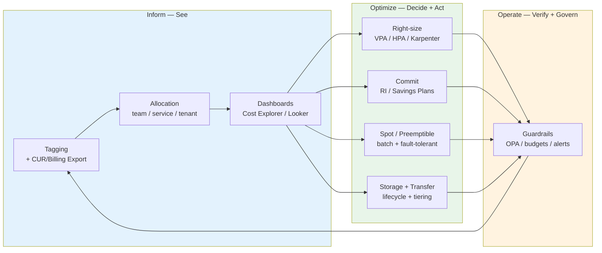
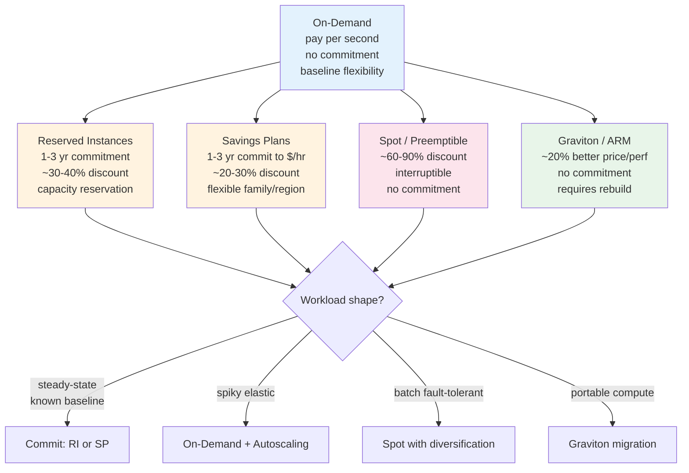
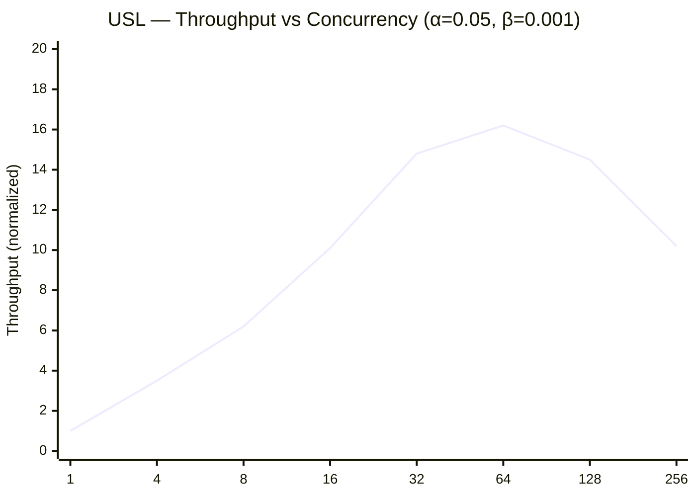
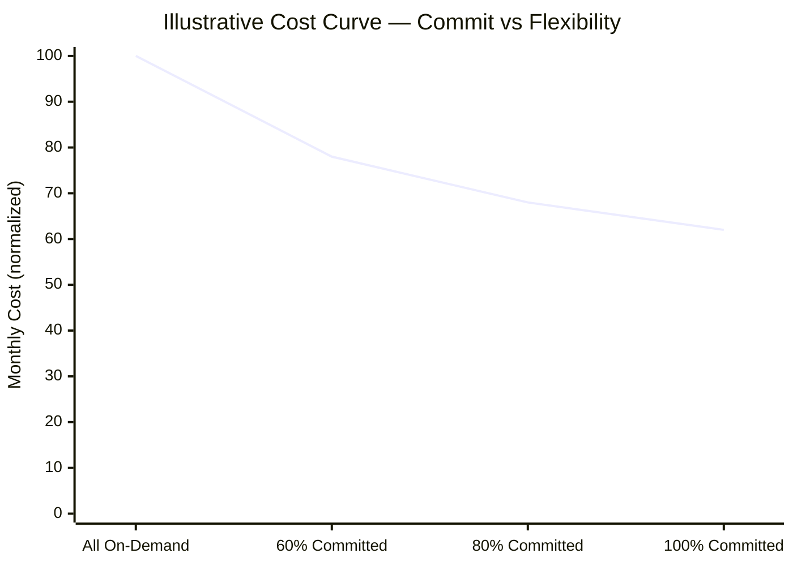
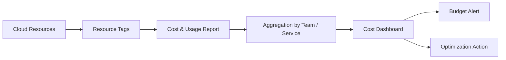
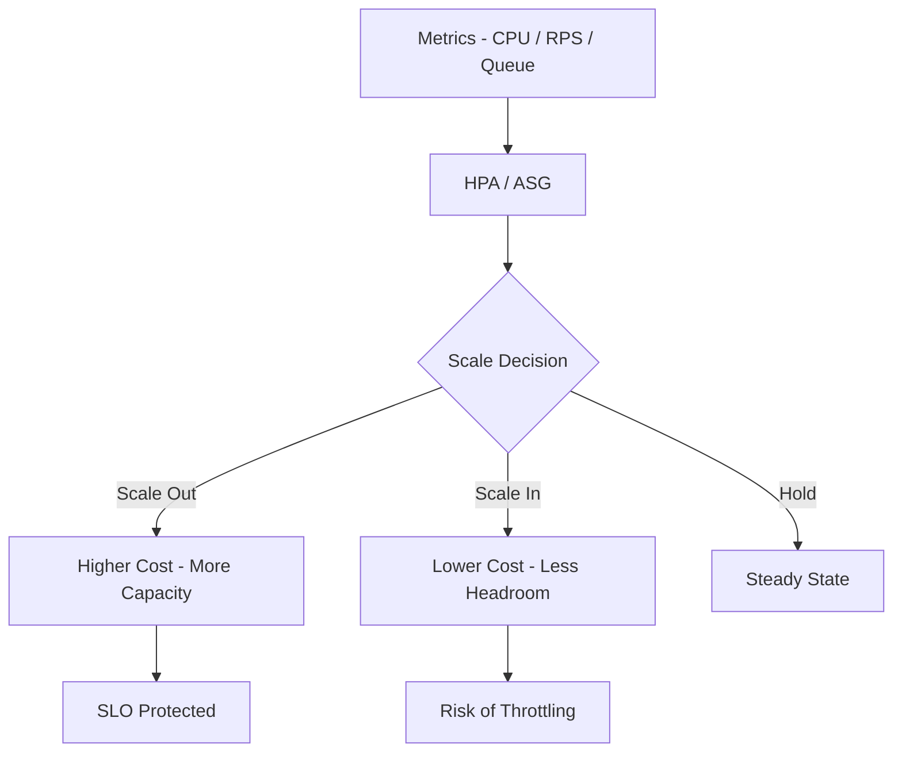
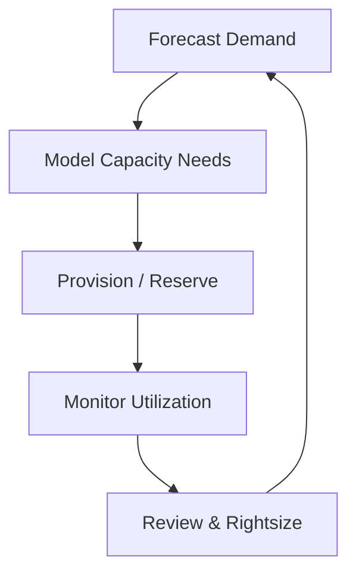

# Chapter 8 — Cloud Cost and Capacity Engineering

**What this chapter covers.** Cloud bills are the second-order effect of every architectural decision — instance family, replica count, retention window, cross-AZ chatter, uncompressed images, and forgotten EBS volumes all compound into a monthly invoice that can dwarf headcount if left unmanaged. Cost engineering is not finance — it is backend engineering applied to the cloud's economic model: understanding pricing primitives, instrumenting cost visibility, right-sizing compute and storage, exploiting commitment and spot markets, taming data-transfer costs, and building the capacity-planning discipline that keeps performance and spend jointly optimized. This chapter covers the full FinOps lifecycle — inform, optimize, operate — with real billing queries, Terraform tagging and policy, autoscaling and spot configs, and the capacity mathematics that connects Little's Law to purchase commitments.

Learning goals — after this chapter you should be able to:

- Explain cloud pricing models — on-demand, Reserved Instances, Savings Plans, spot/preemptible, and Graviton/ARM — and choose the right model per workload shape (steady-state, spiky, batch, fault-tolerant).
- Instrument cost visibility — tagging strategy, AWS CUR + Athena, Cost Explorer, GCP Billing Export + BigQuery, and allocation to team/service/tenant — so every dollar is attributable.
- Right-size compute — vertical (VPA, Compute Optimizer), horizontal (HPA, KEDA, Karpenter), and commitment (RI/SP coverage, spot diversification) — with production configs and the metrics that prove a saving is safe.
- Attack the three biggest cost drivers after compute: storage (lifecycle, tiering, orphaned volumes), data transfer (cross-AZ, egress, NAT Gateway), and managed services — with concrete reductions and guardrails.
- Apply capacity engineering — Little's Law, the Universal Scalability Law, and queueing models — to forecast demand, size fleets, and decide when to buy commitments vs. stay flexible.
- Operate FinOps — showback/chargeback, budgets and alerts, policy-as-code guardrails (OPA/Sentinel), and the organizational cadence that keeps cost optimization continuous rather than quarterly.

> **Boundary note.** Volume 11, Chapter 7 introduced load testing and capacity planning as reliability practices — generating load, measuring breaking points, and relating utilization to latency. This chapter is the *economic* treatment — how capacity decisions translate to spend, how pricing models reward different commitments, and how to keep that spend efficient at scale. Volume 12, Chapter 5 covered cloud compute/storage/network primitives; pricing is the economic view of those same primitives. Volume 7, Chapter 2 covered system-design estimation; here we apply estimation to fleet sizing and purchase planning.

---

## Why cost engineering is an engineering discipline

### The cloud cost equation

Every cloud bill decomposes into a small number of drivers:

```
Total = Compute + Storage + Data Transfer + Managed Services + Support
         ~60-70%   ~15-20%    ~5-15%          ~5-15%              ~3-10% of above
```

For a typical backend fleet serving user-facing traffic, compute dominates — EC2/GKE node cost is usually 50–70% of the bill. Within compute, the distribution is highly skewed: a handful of large services or data pipelines often account for half the spend. The Pareto applies aggressively — optimizing the top five cost centers yields most of the saving.

The cost engineering loop is simple to state, hard to sustain:

1. **See** — attribute every dollar to a team, service, environment, and tenant via tags and billing exports.
2. **Decide** — compare the current shape (instance family, replica count, pricing model) to the efficient shape (right-sized, committed, spot where fault-tolerant).
3. **Act** — apply the change via IaC, autoscaling, or purchase — with guardrails so optimization does not break performance or availability.
4. **Verify** — confirm the saving landed, performance held, and the change did not create new waste elsewhere.

Without step 1, steps 2–4 are guesswork. Most teams' first win is not a clever optimization but simply making the bill legible.



*Figure 8-1: FinOps lifecycle — inform makes spend visible and attributable, optimize acts on the biggest drivers, operate governs continuously via budgets, alerts, and policy. The loop never terminates.*

---

## Cost visibility — making the bill legible

### Tagging strategy

Tags are the primary key for cost allocation. Without consistent tags, the bill is an unindexed table — you know the total but cannot slice by owner or service.

Minimum viable tagging policy (enforced at provision time, not retroactively):

| Tag | Example | Purpose | Enforced |
|---|---|---|---|
| `team` | `checkout`, `platform` | Chargeback to owning team | Required |
| `service` | `catalog`, `api-gateway` | Per-service cost and unit economics | Required |
| `env` | `prod`, `staging`, `dev` | Separate prod from non-prod | Required |
| `tenant` / `tenant_tier` | `enterprise-a`, `pool` | Per-tenant cost (see Ch. 7) | For SaaS |
| `cost_center` | `CC-4721` | Finance mapping | Required |
| `managed_by` | `terraform`, `karpenter` | Identify waste source | Recommended |

Enforce via Terraform and policy — not documentation:

```hcl
# Terraform — default tags on every resource via provider block
provider "aws" {
  default_tags {
    tags = {
      team       = var.team
      service    = var.service
      env        = var.env
      cost_center = var.cost_center
      managed_by = "terraform"
      repo       = "github.com/org/infra"
    }
  }
}

# Tag policy — OPA/Conftest gate in CI: every resource must carry required tags
# policy/tagging.rego
package main
required_tags := {"team", "service", "env", "cost_center"}
deny[msg] {
  resource := input.resource_changes[_]
  resource.type == "aws_instance"
  not has_required_tags(resource.change.after.tags)
  msg := sprintf("Resource %v missing required tags %v", [resource.address, missing_tags(resource.change.after.tags)])
}
has_required_tags(tags) { count({t | t := required_tags[_]; tags[t] != null}) == count(required_tags) }
missing_tags(tags) := {t | t := required_tags[_]; tags[t] == null}
```

```yaml
# AWS Tag Policy (Organizations) — reject untagged EC2/RDS at creation time
# organizations tag policy — attach to OU
tags:
  team:
    tag_key: { "@@assign": team }
    enforced_for: { "@@assign": [ec2:instance, rds:db, s3:bucket] }
  env:
    tag_key: { "@@assign": env }
    enforced_for: { "@@assign": [ec2:instance, rds:db, s3:bucket] }
```

### Billing exports and allocation

Raw billing data is the source of truth — Cost Explorer is a summary; the Cost and Usage Report (CUR) / Billing Export is the ledger.

```sql
-- Athena on AWS CUR (Parquet, partitioned by year/month) — top 10 services by cost, last 30 days
SELECT
  line_item_product_code            AS service,
  resource_tags_user_service         AS service_tag,
  resource_tags_user_team            AS team,
  SUM(line_item_unblended_cost)     AS cost_usd,
  SUM(line_item_usage_amount)       AS usage
FROM cur_db.cur_table
WHERE line_item_usage_start_date >= date_add('day', -30, current_date)
  AND line_item_line_item_type = 'Usage'
  -- exclude credits, refunds, taxes for clean allocation
  AND line_item_unblended_cost > 0
GROUP BY 1, 2, 3
ORDER BY cost_usd DESC
LIMIT 20;

-- Orphaned EBS volumes — paying for storage with no attachment
SELECT
  line_item_resource_id,
  product_volume_type,
  line_item_usage_amount AS gb_months,
  line_item_unblended_cost AS cost
FROM cur_db.cur_table
WHERE line_item_product_code = 'AmazonEC2'
  AND line_item_usage_type LIKE '%EBS:VolumeUsage%'
  AND line_item_resource_id NOT IN (
    SELECT volume_id FROM ebs_attachments_snapshot -- join with Config snapshot
  )
ORDER BY cost DESC;

-- Cross-AZ transfer — often the largest hidden cost after compute
SELECT
  line_item_usage_type,
  SUM(line_item_unblended_cost) AS cost,
  SUM(line_item_usage_amount)   AS gb
FROM cur_db.cur_table
WHERE line_item_product_code = 'AWSDataTransfer'
  AND line_item_usage_type LIKE '%Regional%'
GROUP BY 1
ORDER BY cost DESC;
```

GCP equivalent — Billing Export to BigQuery:

```sql
-- BigQuery on GCP billing export — per-service, per-team (labels)
SELECT
  service.description,
  labels.value AS team,
  SUM(cost) AS cost_usd
FROM `project.billing.gcp_billing_export_v1_XXXXXX`
WHERE labels.key = 'team'
  AND usage_start_time >= TIMESTAMP_SUB(CURRENT_TIMESTAMP(), INTERVAL 30 DAY)
GROUP BY 1, 2
ORDER BY cost_usd DESC
LIMIT 20;
```

Build a weekly cost review around these queries — top movers, new untagged spend, and cross-AZ transfer trends. A single untagged NAT Gateway or cross-AZ Kafka replication can quietly add thousands per month.

---

## Cloud pricing models



*Figure 8-2: Pricing model comparison. On-demand is the baseline; commitments (RI/SP) discount steady-state, spot discounts fault-tolerant batch, Graviton discounts portable compute. Most fleets blend all four.*

| Model | Discount vs. on-demand | Commitment | Interruption | Best for |
|---|---|---|---|---|
| **On-demand** | — (baseline) | None | Never | Spiky, unpredictable, short-lived |
| **Standard RI** | ~40% (1 yr), ~60% (3 yr) | 1–3 yr, specific family/AZ | Never (capacity reserved) | Steady-state, known shape |
| **Convertible RI** | ~30% / ~45% | 1–3 yr, exchangeable family | Never | Steady-state with expected family drift |
| **Compute Savings Plan** | ~25–30% | 1–3 yr, $/hr commit, any family/region | Never | Steady-state with flexibility |
| **Spot** | ~60–90% | None | 2-min warning (AWS), 30 s (GCP) | Fault-tolerant batch, CI, stateless scale-out |
| **Graviton (ARM)** | ~20% price/perf | None (just rebuild) | Never | Portable, compute-heavy, non-x86-locked |

### Commitment strategy

Commit only what you are confident will run — typically 60–80% of steady-state baseline. Overcommitting is worse than under-committing: an unused RI still bills. Use Cost Explorer's RI/SP recommendations and track coverage and utilization:

```
Coverage    = committed spend / total eligible spend   — target 60-80% for steady-state
Utilization = used committed hours / purchased hours    — target >90%; <80% means overbought
```

Purchase cadence: ladder commitments (stagger start dates quarterly) so capacity can be adjusted without a cliff. Prefer Compute Savings Plans over Standard RIs unless you need the capacity reservation or a regional AZ guarantee.

### Spot for fault-tolerant workloads

Spot is the largest discount available without commitment — but the instance can be reclaimed. Use it only where interruption is handled: stateless scale-out behind an ASG, batch/ETL, CI runners, and non-critical canaries.

```hcl
# Karpenter — spot diversification across families and AZs, with on-demand fallback
apiVersion: karpenter.sh/v1beta1
kind: NodePool
metadata: { name: spot-pool }
spec:
  template:
    spec:
      requirements:
        - key: karpenter.sh/capacity-type
          operator: In
          values: [spot, on-demand]       # prefer spot, fall back to on-demand
        - key: kubernetes.io/arch
          operator: In
          values: [amd64, arm64]          # blend x86 + Graviton for diversification
        - key: karpenter.k8s.aws/instance-family
          operator: In
          values: [m7i, m7g, c7i, c7g, r7i, r7g]  # multiple families — reduces interruption correlation
        - key: topology.kubernetes.io/zone
          operator: In
          values: [us-east-1a, us-east-1b, us-east-1c]
      nodeClassRef: { name: default }
      expireAfter: 720h                   # rotate nodes weekly to pick up new spot pricing
  disruption:
    consolidationPolicy: WhenUnderutilized
    consolidateAfter: 30s
  limits:
    cpu: 1000
---
# MixedInstances ASG — alternative for non-Karpenter fleets
resource "aws_autoscaling_group" "batch" {
  mixed_instances_policy {
    instances_distribution {
      on_demand_base_capacity                  = 1   # at least 1 on-demand for baseline
      on_demand_percentage_above_base_capacity = 20  # 20% on-demand, 80% spot
      spot_allocation_strategy                 = "price-capacity-optimized"
    }
    launch_template { launch_template_specification { launch_template_id = aws_launch_template.batch.id } }
    override { instance_type = "m7i.large" }
    override { instance_type = "m7g.large" }
    override { instance_type = "c7i.large" }
    override { instance_type = "c7g.large" }
  }
}
```

Handle interruption gracefully — every spot workload must handle SIGTERM (AWS 2-min warning via instance metadata, Karpenter consolidation):

```yaml
# Pod handling spot interruption — terminationGracePeriod + preStop
spec:
  terminationGracePeriodSeconds: 120  # give 2 min to drain (matches spot warning)
  containers:
    - name: worker
      lifecycle:
        preStop:
          exec: { command: ["/bin/sh", "-c", "curl -X POST localhost:8080/drain && sleep 10"] }
```

---

## Right-sizing compute

Right-sizing is the process of matching provisioned capacity to actual utilization. Overprovisioning is the default — teams size for peak, forget to downsize after optimization, and accumulate slack that compounds across the fleet.

### Vertical right-sizing (per pod / per instance)

The signal is `container_cpu_usage` vs. `container_spec_cpu_limit` and `container_memory_working_set` vs. `container_spec_memory_limit`, plus AWS Compute Optimizer / GCP Recommender.

```yaml
# Vertical Pod Autoscaler — recommend (and optionally apply) right-sized requests
apiVersion: autoscaling.k8s.io/v1
kind: VerticalPodAutoscaler
metadata: { name: catalog-vpa, namespace: prod }
spec:
  targetRef: { apiVersion: apps/v1, kind: Deployment, name: catalog }
  updatePolicy:
    updateMode: "Auto"   # "Off" for recommendation-only, "Auto" to evict and reschedule
  resourcePolicy:
    containerPolicies:
      - containerName: catalog
        minAllowed: { cpu: 100m, memory: 128Mi }
        maxAllowed: { cpu: "4", memory: 8Gi }
        controlledResources: [cpu, memory]
---
# In-place Pod resize (K8s 1.27+ alpha) — no eviction for CPU/memory adjustment
# spec.containers[].resources with restartPolicy: NotRequired (KEP-1287)
```

Rule of thumb: target 60–75% CPU request utilization (p95) and 70–85% memory. Below 30% sustained utilization, halve the request. Above 85%, investigate before blindly increasing — the service may need horizontal scaling or optimization, not more vertical headroom.

For EC2/GCE instances, Compute Optimizer's recommendation is the starting point — but verify against application metrics (GC pressure, p95 latency) before downsizing. A smaller instance that triggers more GC pauses is not a saving.

### Horizontal right-sizing (replica count and autoscaling)

```yaml
# Horizontal Pod Autoscaler — CPU + custom metric (requests per second per pod)
apiVersion: autoscaling/v2
kind: HorizontalPodAutoscaler
metadata: { name: catalog-hpa, namespace: prod }
spec:
  scaleTargetRef: { apiVersion: apps/v1, kind: Deployment, name: catalog }
  minReplicas: 3
  maxReplicas: 50
  metrics:
    - type: Resource
      resource: { name: cpu, target: { type: Utilization, averageUtilization: 65 } }
    - type: Pods
      pods:
        metric: { name: http_requests_per_second }
        target: { type: AverageValue, averageValue: "1000" }
  behavior:
    scaleUp:
      stabilizationWindowSeconds: 60
      policies: [{ type: Percent, value: 50, periodSeconds: 60 }]
    scaleDown:
      stabilizationWindowSeconds: 300  # slower scale-down avoids flapping
      policies: [{ type: Pods, value: 2, periodSeconds: 60 }]
---
# KEDA — event-driven autoscaling (queue depth, Kafka lag, custom Prometheus)
apiVersion: keda.sh/v1alpha1
kind: ScaledObject
metadata: { name: order-processor, namespace: prod }
spec:
  scaleTargetRef: { name: order-processor }
  minReplicaCount: 2
  maxReplicaCount: 100
  triggers:
    - type: aws-sqs-queue
      metadata:
        queueURL: https://sqs.us-east-1.amazonaws.com/123456789/orders
        queueLength: "100"          # one pod per 100 messages
        awsRegion: us-east-1
    - type: prometheus
      metadata:
        serverAddress: http://prometheus.monitoring.svc:9090
        metricName: http_request_queue_depth
        threshold: "50"
        query: sum(http_requests_queued{service="catalog"})
```

Karpenter (or Cluster Autoscaler) closes the loop — HPA adds pods, Karpenter adds nodes of the right size and family, and consolidation removes underutilized nodes within 30–60 s. Without node autoscaling, HPA pods sit pending; without consolidation, the fleet accumulates half-empty nodes.

### Graviton / ARM migration

For portable, compute-heavy services (API servers, data pipelines, caches), Graviton 3/4 delivers ~20–40% better price-performance over comparable x86. The migration is a rebuild + multi-arch image, not a rewrite — unless the service has x86 assembly, SIMD intrinsics, or native dependencies without ARM builds.

```dockerfile
# Multi-arch image — buildx for amd64 + arm64
# docker buildx build --platform linux/amd64,linux/arm64 -t api:1.42.0 --push .
FROM --platform=$BUILDPLATFORM golang:1.22 AS build
ARG TARGETARCH
RUN GOARCH=$TARGETARCH go build -o /api ./cmd/api

FROM gcr.io/distroless/base-debian12
COPY --from=build /api /api
ENTRYPOINT ["/api"]
```

```yaml
# Karpenter — prefer Graviton, fall back to x86 (price-performance aware)
requirements:
  - key: kubernetes.io/arch
    operator: In
    values: [arm64, amd64]
  - key: karpenter.k8s.aws/instance-cpu
    operator: Gt
    values: ["2"]
# Weight spot + Graviton highest in provisioner priority — scheduler prefers cheaper
```

Measure before and after — p95 latency, throughput per dollar, and any JNI/native failures — on a canary subset before fleet-wide rollout.

---

## Storage, data transfer, and managed services

### Storage

Storage cost is linear in GB-months and retention — and it is easy to forget. The largest storage wastes are: unattached EBS volumes, old snapshots, verbose logs retained at high durability, and single-tier retention for data with tiered access patterns.

```hcl
# S3 lifecycle — tier by access pattern, expire aggressively for non-prod
resource "aws_s3_bucket_lifecycle_configuration" "app" {
  bucket = aws_s3_bucket.app.id
  rule {
    id     = "tier-and-expire"
    status = "Enabled"
    filter { prefix = "logs/" }
    transition { days = 30, storage_class = "STANDARD_IA" }
    transition { days = 90, storage_class = "GLACIER" }
    expiration { days = 365 }
    noncurrent_version_expiration { noncurrent_days = 30 }
  }
  rule {
    id     = "abort-multipart"
    status = "Enabled"
    filter {}
    abort_incomplete_multipart_upload { days_after_initiation = 7 }
  }
}

# EBS — detect and alert on unattached volumes (Config rule + Lambda cleanup)
resource "aws_config_config_rule" "unattached_ebs" {
  name = "unattached-ebs-volumes"
  source { owner = "AWS", source_identifier = "EC2_VOLUME_INUSE_CHECK" }
}

# RDS — right-size storage, enable storage autoscaling, clean old snapshots
resource "aws_db_instance" "prod" {
  allocated_storage       = 100
  max_allocated_storage   = 500  # autoscaling ceiling — avoids manual resize
  storage_type            = "gp3"  # gp3 is ~20% cheaper than gp2, with provisioned IOPS
  storage_encrypted       = true
  backup_retention_period = 7    # not 35 unless compliance requires it
  delete_automated_backups = false
}
```

For Kubernetes, enforce `PersistentVolumeClaim` quotas and storage-class defaults that prevent unbounded `gp2` claims.

### Data transfer

Transfer is the most regressive cost — it scales with success (more traffic → more transfer) and is easy to overlook until it is 15% of the bill. The hierarchy of cost:

| Transfer | Cost (AWS, approx.) | Mitigation |
|---|---|---|
| Within AZ (same AZ) | Free | Co-locate chatty services in the same AZ (with HA trade-off) |
| Cross-AZ (same region) | $0.01/GB each way | Reduce cross-AZ chatter, co-locate cache with compute, use AZ-aware routing |
| Cross-region | $0.02/GB | Replicate only what must be global, compress, batch |
| Internet egress | $0.05–0.09/GB (tiered) | CloudFront/CDN, compress, cache at edge |
| NAT Gateway | $0.045/GB + hourly | VPC endpoints (Gateway/Interface) for S3/DynamoDB/ECR, egress VPC design |

Mitigations, in order of impact:

1. **VPC endpoints** — eliminate NAT Gateway for S3, DynamoDB, ECR, CloudWatch. For a fleet pulling images and writing logs, this alone can save 30–50% of NAT cost.
2. **AZ-aware routing** — Istio locality-aware routing, Kafka `replica.selector.class` for AZ affinity, and Redis cluster with AZ-aligned primaries reduce cross-AZ replication.
3. **CDN for egress** — CloudFront caches at edge, reducing origin egress and improving latency; set aggressive `Cache-Control` for static assets and API responses where staleness is acceptable.
4. **Compression** — gRPC + gzip/zstd, JSON → Protobuf, image optimization — bandwidth saved is egress saved.

```hcl
# VPC Gateway Endpoints — bypass NAT for S3 and DynamoDB
resource "aws_vpc_endpoint" "s3" {
  vpc_id       = aws_vpc.main.id
  service_name = "com.amazonaws.us-east-1.s3"
  route_table_ids = [aws_route_table.private.id]
  tags = { Name = "s3-gateway-endpoint" }
}

resource "aws_vpc_endpoint" "dynamodb" {
  vpc_id       = aws_vpc.main.id
  service_name = "com.amazonaws.us-east-1.dynamodb"
  route_table_ids = [aws_route_table.private.id]
}

# Interface Endpoints — for ECR, CloudWatch, etc. (costs hourly, saves per-GB)
resource "aws_vpc_endpoint" "ecr_dkr" {
  vpc_id              = aws_vpc.main.id
  service_name        = "com.amazonaws.us-east-1.ecr.dkr"
  vpc_endpoint_type   = "Interface"
  subnet_ids          = aws_subnet.private[*].id
  security_group_ids  = [aws_security_group.endpoints.id]
  private_dns_enabled = true
}
```

```yaml
# Istio locality-aware routing — prefer same-AZ upstream
apiVersion: networking.istio.io/v1beta1
kind: DestinationRule
metadata: { name: catalog-locality }
spec:
  host: catalog.prod.svc.cluster.local
  trafficPolicy:
    outlierDetection: { consecutive5xxErrors: 5, interval: 10s, baseEjectionTime: 30s }
    connectionPool: { tcp: { maxConnections: 200 }, http: { http2MaxRequests: 200 } }
  # Outlier detection + locality failover — same AZ first, then same region, then any
  # Configured via Envoy localityLbSetting in mesh config (istio ConfigMap)
```

### Managed services

Managed services (RDS, ElastiCache, OpenSearch, MSK) carry a premium over self-hosted — but self-hosting cost is not just instance cost; it is the engineering time to operate. The cost question for managed is: *are we using the right tier and right-sizing it?*

Common managed-service wastes: overprovisioned RDS (db.r6g.4xlarge at 15% CPU), ElastiCache with no eviction policy holding cold data, OpenSearch with excessive replica shards, MSK with under-replicated partitions. Review each managed service's utilization quarterly against spend — the same right-sizing discipline as compute.

---

## Capacity engineering — from Little's Law to commitments

### The mathematics

Capacity engineering connects demand (requests/sec) to fleet size (replicas, nodes) via queueing theory. Three results matter:

**Little's Law:** `L = λ × W` — concurrent requests `L` equals arrival rate `λ` times mean latency `W`. If `λ = 1000 rps` and `W = 50 ms`, you need `L = 50` concurrent slots — i.e., enough pods × concurrency to handle 50 inflight. This sizes the fleet for *throughput*.

**Universal Scalability Law (USL):** `X(N) = N / (1 + α(N-1) + βN(N-1))` — throughput `X` as a function of concurrency `N`, where `α` is contention (serialization) and `β` is coherency (cross-node coordination). USL predicts the point where adding replicas *reduces* throughput due to coordination overhead — critical for sharded stores and consensus-bound services.



*Figure 8-3: USL curve — throughput rises linearly at low concurrency, peaks where contention and coherency overhead dominate, then falls. The peak is the efficient operating point; beyond it, adding capacity hurts.*

**Erlang C / M/M/c queueing:** For latency-sensitive services, size for p95/p99 — not mean. An M/M/c model gives the probability that a request queues (`C(c, ρ)`) given `c` servers and utilization `ρ = λ / (cμ)`. Target `ρ ≈ 60–70%` for p95 headroom; above 80%, queueing latency dominates.

### Forecasting and commitment planning

Forecast demand from historical p95 arrival rate, growth rate, and seasonality. A simple but effective model:

```
Peak demand next quarter = current peak × (1 + growth_rate) × seasonality_factor × headroom
Headroom factor: 1.3–1.5 for user-facing, 1.1–1.2 for batch
```

Compare forecast to committed capacity:

| Horizon | Instrument | Flexibility |
|---|---|---|
| 0–1 month | On-demand + autoscaling | Maximum — handle spikes |
| 1–12 months | Savings Plans (1 yr), Convertible RI | Moderate — can exchange |
| 12–36 months | Standard RI / SP (3 yr), hardware reservation | Minimum — commit only to confident baseline |

Commit to the *floor* (minimum observed over last 3 months), not the peak. The gap between floor and peak is served by on-demand + autoscaling. Re-evaluate quarterly — growth that was 10% last quarter may be 25% after a launch.

### Unit economics

Translate fleet cost to business cost — the metric leadership cares about:

```
Cost per request    = monthly infra cost / monthly requests
Cost per active user = monthly infra cost / MAU
Cost per order       = infra cost attributed to checkout / orders
```

Tag-based allocation (team/service/tenant) makes these computable. Track them monthly — a rising cost-per-request with flat traffic signals efficiency regression; a falling cost-per-request with growing traffic signals healthy economies of scale. Alert when unit cost rises >10% week-over-week without a corresponding traffic or feature driver.

---

## Operating FinOps — budgets, guardrails, and cadence

### Budgets and alerts

Budgets are the circuit breaker for spend — they fire before the invoice does.

```hcl
# AWS Budgets — monthly cost budget with alerts at 80% and 100%
resource "aws_budgets_budget" "prod" {
  name         = "prod-monthly"
  budget_type  = "COST"
  limit_amount = "50000"
  limit_unit   = "USD"
  time_unit    = "MONTHLY"

  notification {
    comparison_operator = "GREATER_THAN"
    threshold           = 80
    threshold_type      = "PERCENTAGE"
    notification_type   = "FORECASTED"
    subscriber_email_addresses = ["platform-alerts@example.com", "finops@example.com"]
  }
  notification {
    comparison_operator = "GREATER_THAN"
    threshold           = 100
    threshold_type      = "PERCENTAGE"
    notification_type   = "ACTUAL"
    subscriber_email_addresses = ["platform-alerts@example.com", "finops@example.com", "cto@example.com"]
  }
}

# Anomaly detection — alert on unusual spend spikes (AWS Cost Anomaly Detection)
resource "aws_ce_anomaly_monitor" "service" {
  name              = "service-monitor"
  monitor_type      = "CUSTOM"
  monitor_dimension = "SERVICE"
  resource_tags = { team = "platform" }
}
resource "aws_ce_anomaly_subscription" "alerts" {
  name      = "anomaly-alerts"
  frequency = "IMMEDIATE"
  monitor_arn_list = [aws_ce_anomaly_monitor.service.arn]
  subscriber { type = "EMAIL", address = "platform-alerts@example.com" }
}
```

GCP equivalent: `google_billing_budget` with Pub/Sub notifications to a Cloud Function that posts to Slack.

### Policy guardrails

Prevent waste at provision time — cheaper than cleaning it up monthly:

```rego
# OPA — deny expensive instance families without approval label
package main
deny[msg] {
  input.resource.type == "aws_instance"
  expensive_families := {"p4d", "p5", "x2gd", "i4i"}
  family := split(input.resource.values.instance_type, ".")[0]
  expensive_families[family]
  not input.resource.values.tags["cost_approval"]
  msg := sprintf("Instance type %v requires cost_approval tag", [input.resource.values.instance_type])
}
deny[msg] {
  input.resource.type == "aws_instance"
  not input.resource.values.tags["team"]
  msg := "Missing required tag: team"
}
deny[msg] {
  input.resource.type == "aws_ebs_volume"
  input.resource.values.size > 500
  not input.resource.values.tags["storage_approval"]
  msg := "EBS volume >500GB requires storage_approval tag"
}
```

Run via `conftest` or `Sentinel` in the Terraform pipeline — `plan` fails if the policy denies, before `apply` creates the waste.

### Organizational cadence

| Cadence | Participants | Agenda |
|---|---|---|
| **Weekly** | Platform + service owners | Top movers, untagged spend, anomaly alerts, right-sizing queue |
| **Monthly** | Eng leadership + finance | Budget vs. actual, coverage/utilization, unit economics, commitment plan |
| **Quarterly** | CTO + finance | Forecast vs. commitments, Graviton/spot adoption, architectural cost bets |
| **Continuous** | Automation | VPA recommendations, Karpenter consolidation, Cost Anomaly Detection, OPA gates |

FinOps fails when it is a quarterly finance exercise. It succeeds when it is a weekly engineering ritual with automated guardrails — the same way reliability succeeds when it is a continuous practice, not a post-incident afterthought.



*Figure 8-4: Illustrative cost curve — committing the steady-state baseline (60–80%) captures most of the discount; the last 20% of commitment saves little but sacrifices flexibility. Commit to the floor, serve the peak with on-demand.*

---

## Key takeaways

- Cost visibility is the prerequisite — enforce tagging (team, service, env, tenant) at provision time via Terraform `default_tags` and OPA/Sentinel policy; query the CUR/Billing Export (Athena/BigQuery) for allocation, orphaned resources, and transfer breakdown. Untagged spend is unmanaged spend.
- Pricing models reward different shapes — on-demand for spiky, RI/SP (60–80% coverage of steady-state floor) for predictable baseline, spot (60–90% discount) for fault-tolerant batch with diversification, Graviton/ARM (~20% price/perf) for portable compute. Blend all four; ladder commitments quarterly.
- Right-size continuously — VPA for vertical (target 60–75% CPU request utilization), HPA/KEDA + Karpenter for horizontal and node consolidation, Compute Optimizer as the starting point but verify against p95 latency and GC. Target utilization below 30% sustained is immediate downsizing territory.
- Attack the next three drivers after compute — storage (lifecycle tiering, orphaned EBS/snapshots, gp3 vs gp2), data transfer (VPC endpoints to bypass NAT, AZ-aware routing, CDN for egress, compression), and managed services (quarterly utilization vs. spend review). A single NAT Gateway or cross-AZ Kafka can be thousands per month unnoticed.
- Capacity engineering grounds spend in queueing theory — Little's Law sizes for throughput, USL finds the concurrency peak before coordination overhead dominates, Erlang C sizes for p95 headroom (target 60–70% utilization). Forecast peak as `current × (1+growth) × seasonality × headroom`, commit to the floor, serve the peak with on-demand.
- Operate FinOps as a weekly engineering ritual — budgets with forecasted and actual alerts, anomaly detection, OPA guardrails at `plan` time, and unit economics (cost per request/user/order) tracked monthly. Automation (VPA, Karpenter consolidation, anomaly alerts) makes it continuous rather than quarterly.

## Further reading

- FinOps Foundation — *FinOps Framework* — https://www.finops.org/framework/ — the canonical inform/optimize/operate lifecycle, capabilities, and maturity model.
- AWS — *Cost and Usage Report (CUR) Query Library* — https://wellarchitectedlabs.com/cost/ — Athena queries for allocation, orphaned resources, and transfer analysis.
- AWS — *Savings Plans and Reserved Instances* — https://docs.aws.amazon.com/savingsplans/latest/userguide/what-is-savings-plan.html
- Karpenter — https://karpenter.sh/docs/ — consolidation, spot diversification, and price-performance-aware scheduling.
- Google Cloud — *Billing Export to BigQuery* — https://cloud.google.com/billing/docs/how-to/export-data-bigquery
- Gunther, N. — *Guerrilla Capacity Planning* and *Universal Scalability Law* — https://www.perfdynamics.com/Manifesto/USLscalability.html — USL derivation and application to fleet sizing.
- Tran, K. — *AWS Data Transfer Costs — The Complete Guide* — https://www.lastweekinaws.com/blog/understanding-aws-data-transfer-costs/ — practical transfer cost breakdown and mitigations.
- OPA — https://www.openpolicyagent.org/docs/latest/ — policy-as-code for cost guardrails in the IaC pipeline.

### Cloud cost attribution flow



### Autoscaling cost vs performance tradeoff



### Capacity planning loop


