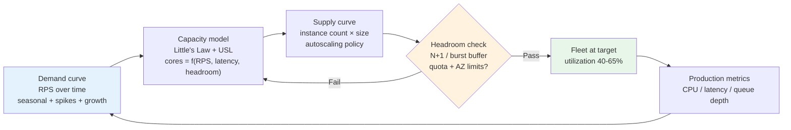
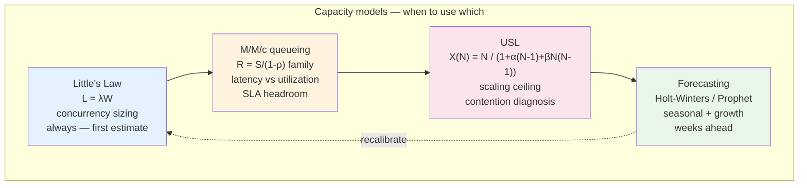
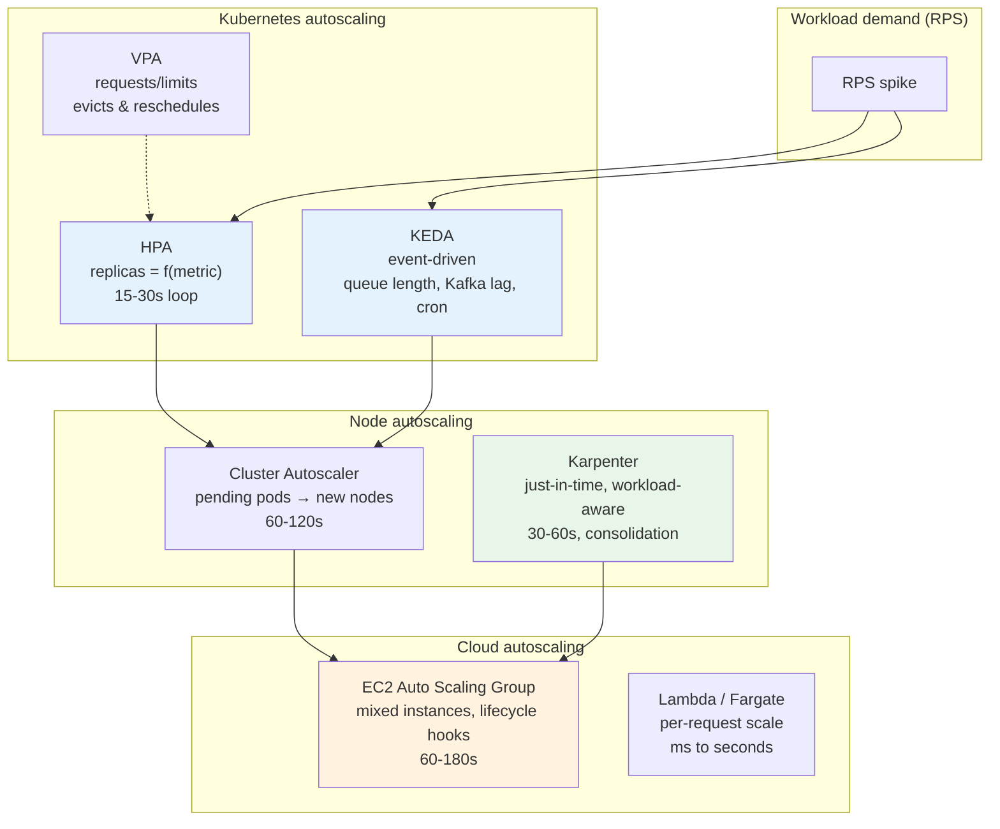
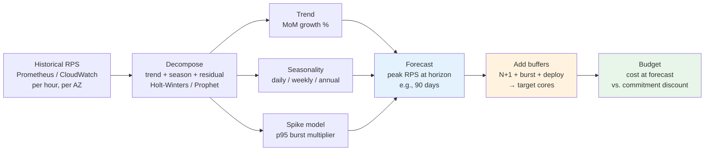
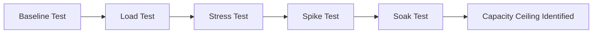
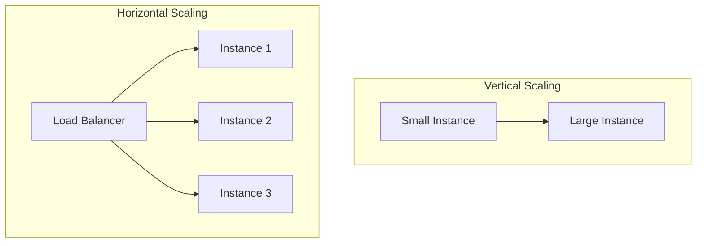

# Chapter 9 — Capacity Planning and Performance at Cloud Scale

**What this chapter covers.** The cloud promises infinite elasticity, but every service still has a finite capacity envelope — and every envelope has a cost. Capacity planning is the discipline of matching that envelope to demand: enough headroom to absorb bursts and failures, not so much that you burn money on idle silicon. This chapter builds the quantitative models (Little's Law, the Universal Scalability Law, queueing theory) and the practical tooling (workload characterization, right-sizing, autoscaling with HPA/KEDA/Karpenter/ASGs, forecasting, and load testing) that turn capacity from guesswork into engineering. You will learn to characterize a workload in requests-per-second-per-core, model its concurrency and latency, choose an instance family and scaling strategy, and build the feedback loops that keep a fleet right-sized as traffic evolves.

Learning goals — after this chapter you should be able to:

- Apply Little's Law, the USL (Universal Scalability Law), and basic queueing models (M/M/c, M/M/1) to estimate concurrency, throughput ceilings, and latency-vs-utilization curves for a service tier.
- Characterize a real workload — RPS, concurrency, CPU and memory per request, p50/p99 latency, and working-set size — from production metrics and load-test data, and translate it into a core-count and instance-count target.
- Design horizontal and vertical scaling strategies: Kubernetes HPA/VPA/KEDA, Cluster Autoscaler/Karpenter, and EC2 Auto Scaling Groups with mixed instances and lifecycle hooks.
- Choose cloud instance families (general-purpose, compute-optimized, memory-optimized, Graviton/ARM, burstable, accelerated) and placement strategies, and quantify the noisy-neighbor and NUMA effects at scale.
- Build a forecasting and capacity-buffer model that accounts for seasonality, release-driven growth, and failure-domain headroom (N+1, N+2), and wire it to an autoscaling and budgeting loop.
- Detect and remediate the performance anti-patterns that waste capacity: over-provisioned requests/limits, GC pressure, connection-pool saturation, and retry storms under autoscale events.

> **Boundary note.** Volume 7, Chapter 2 introduced back-of-the-envelope estimation and capacity math at the system-design level; Volume 11, Chapter 7 covered load testing and chaos as verification practices. This chapter is the *operational* treatment — how to measure a running fleet, model its limits, and continuously right-size it. Volume 2 (OS/Linux) and Volume 13 (Runtimes) explain the per-node resource mechanics (scheduling, memory, GC) that underpin per-instance capacity; Volume 3 (Networking) covers the L4/L7 load balancing that spreads load across whatever capacity you provision.

---

## Why capacity planning still matters in the cloud

The elastic-cloud narrative — "the cloud scales infinitely, so you don't need to plan" — is true only in the aggregate. For any single service, three facts make planning unavoidable:

1. **Scaling is not instant.** An EC2 Auto Scaling Group takes 60–180 seconds to launch and warm an instance. A Kubernetes HPA reacts on a 15–30 second metric window and then must schedule, pull images, and pass readiness probes. A cold Lambda in a VPC can take 2–5 seconds. Bursts that exceed headroom within that window queue, time out, or shed.

2. **Scaling is not free.** Every instance-hour, every GB-month of memory, every provisioned IOPS has a price that compounds across hundreds of services. An untuned fleet running at 12% CPU is not elastic — it is wasteful. At $0.10/vCPU-hour, a 1,000-core fleet at 12% vs. 45% utilization is a $250k/year difference for the same work.

3. **Scaling has ceilings.** AZ capacity, EBS throughput, NAT Gateway bandwidth (100 Gbps per GW), ALB target-group limits, and service quotas all impose hard caps. A flash sale or a retry storm can hit a quota before it hits CPU.

Capacity planning in the cloud is therefore not about buying tin ahead of time — it is about **continuously matching a measured demand curve to a right-sized, autoscaled supply curve with explicit headroom for bursts and failures**.



*Figure 9-1: The capacity planning loop — demand is modeled into a supply target with explicit headroom, deployed as an autoscaled fleet, and continuously corrected by production metrics.*

---

## Quantitative foundations

### Little's Law: concurrency from throughput and latency

For any stable system:

> **L = λ × W**

- **L** — average number of requests concurrently *in the system* (in-flight).
- **λ** — arrival rate (requests per second).
- **W** — average time a request spends in the system (latency in seconds).

If your service handles 5,000 RPS at an average latency of 40 ms, the average concurrency is 5,000 × 0.04 = **200 concurrent requests**. That number directly sizes thread pools, connection pools, and — when multiplied by CPU per request — core counts.

**Example.** A request burns 15 ms of CPU on a single core (measured via `perf` or runtime CPU profiles). At 5,000 RPS, total CPU demand is 5,000 × 0.015 = 75 core-seconds per second = **75 cores** of saturated CPU. At a target utilization of 50% (headroom for GC, bursts, and noisy neighbors), you need **150 cores**. On `m7g.large` (2 vCPU Graviton), that is 75 instances; on `m7g.xlarge` (4 vCPU), 38 instances. The arithmetic is simple — the hard part is measuring the 15 ms accurately and choosing the headroom factor honestly.

### Universal Scalability Law (USL)

The USL models how throughput scales with concurrency under contention (α) and coherency (β) costs:

> **X(N) = N / ( 1 + α·(N-1) + β·N·(N-1) )**

- **N** — concurrency (threads, cores, nodes).
- **α** — contention (serialized access to a shared resource — a lock, a DB row, a single queue).
- **β** — coherency delay (cost of keeping replicas coherent — cache-line bouncing, cross-node coordination).

Fitting α and β from load-test data tells you whether your service is contention-bound (flattening curve — fix the lock), coherency-bound (retrograde — throughput *falls* past a peak — usually a cache-coherence or consensus cost), or embarrassingly parallel (near-linear — add nodes).

```mermaid
xychart-beta
    title USL: Throughput vs Concurrency for different contention/coherency
    x-axis "Concurrency N" [1, 4, 8, 16, 32, 64, 128]
    y-axis "Relative throughput X(N)" 0 --> 50
    line [1, 3.8, 6.5, 9.2, 11.0, 11.2, 9.5]
    line [1, 3.9, 7.2, 12.8, 20.1, 30.4, 42.0]
    line [1, 3.5, 5.5, 7.0, 7.5, 7.2, 6.0]
```

*Figure 9-2 (conceptual): Three USL curves. Near-linear (middle, small α/β) scales to 64+ cores. Contention-bound (top) plateaus early. Coherency-bound (bottom) peaks and regresses — adding concurrency past the peak hurts. Fit α/β from measured X(N) to diagnose which regime you are in.*

In practice, collect X(N) by running the same workload at 1, 2, 4, 8, … threads/nodes and measuring throughput. Fit with any USL solver (the `usl` Python package or a simple least-squares). A retrograde curve is a signal to shard, partition, or eliminate the coordination — not to add more nodes.

### Queueing theory for the impatient

Single-queue models predict how latency explodes as utilization approaches 1:

- **M/M/1** (one server, Poisson arrivals, exponential service): mean response time `R = S / (1 - ρ)`, where `S` is mean service time and `ρ = λ·S` is utilization (0–1). At 80% utilization, mean latency is 5× service time; at 90%, 10×.
- **M/M/c** (c servers, e.g., c cores or c replicas): same shape, but the knee moves right as c grows. A 32-core tier tolerates higher utilization than a 2-core tier before queueing dominates.

The takeaway is quantitative: **running a tier above ~65% steady-state CPU guarantees long-tail latency inflation**, even if mean latency looks fine. Autoscaling targets should sit left of the knee, not at 90%.



*Figure 9-3: The modeling stack — Little's Law sizes concurrency, queueing sets the utilization target, USL finds the scaling ceiling, forecasting projects demand weeks out.*

---

## Workload characterization

You cannot plan capacity without measuring the workload. The four numbers that matter:

| Signal | How to measure | Why it drives capacity |
|---|---|---|
| **Arrival rate λ** | ALB/NLB request count, Envoy `downstream_rq_total`, API gateway metrics | Directly sets core and replica count via Little's Law |
| **Service time W** | p50/p90/p99 latency from traces (OpenTelemetry), histogram `http_server_duration_seconds` | Determines concurrency (L) and queueing headroom |
| **CPU per request** | `container_cpu_usage_seconds_total` / RPS, or `perf` / continuous profiling (Pyroscope/Parca) | Converts RPS to cores; catches GC and serialization overhead |
| **Memory working set** | `container_memory_working_set_bytes`, heap profiles, RSS after steady state | Sizes instance memory; determines vertical vs. horizontal scaling |

### From metrics to a capacity target

```python
#!/usr/bin/env python3
"""
capacity_model.py — Turn production metrics into an instance-count target.

Inputs: Prometheus range query results or load-test logs.
Model: Little's Law + queueing headroom + failure-domain buffer.
"""

import math

# --- Measured inputs (replace with real numbers from Prometheus / load tests) ---
rps_peak          = 8_000       # peak RPS (p95 of 5-min window, not instantaneous spike)
latency_p50_s     = 0.035       # p50 latency in seconds
latency_p99_s     = 0.180       # p99 — used for SLO headroom check
cpu_per_req_s     = 0.012       # CPU seconds per request (from profiling)
mem_per_req_mb    = 1.8         # working-set contribution per concurrent request
mem_base_mb       = 350         # per-pod baseline (runtime, caches, sidecars)
target_cpu_util   = 0.55        # queueing knee guardrail (0.50-0.65 for latency-sensitive)
failure_buffer    = 1.33        # N+1 over 4 AZs ~ 1.33x (lose one AZ, still serve peak)
burst_buffer      = 1.25        # 25% burst headroom (flash traffic, retry storms)

# --- Derived ---
concurrency_avg   = rps_peak * latency_p50_s
concurrency_p99   = rps_peak * latency_p99_s
cores_needed      = rps_peak * cpu_per_req_s          # saturated cores
cores_with_headroom = cores_needed / target_cpu_util
cores_with_buffers  = cores_with_headroom * failure_buffer * burst_buffer

# Instance sizing — compare two families
for name, vcpu, mem_gb, price_hr in [
    ("m7g.large",   2,  8, 0.086),
    ("m7g.xlarge",  4, 16, 0.172),
    ("c7g.xlarge",  4,  8, 0.145),
    ("c7g.2xlarge", 8, 16, 0.290),
]:
    instances = math.ceil(cores_with_buffers / vcpu)
    mem_needed_per_pod = mem_base_mb + (concurrency_avg / instances) * mem_per_req_mb
    mem_ok = "ok" if mem_needed_per_pod < (mem_gb * 1024 * 0.75) else "MEM PRESSURE"
    cost_month = instances * price_hr * 730
    print(f"{name:14s}  instances={instances:3d}  cores={cores_with_buffers:.0f}"
          f"  mem/pod~{mem_needed_per_pod:.0f}MB {mem_ok:14s}  ${cost_month:,.0f}/mo")

print(f"\nConcurrency  avg={concurrency_avg:.0f}  p99={concurrency_p99:.0f}")
print(f"Cores  saturated={cores_needed:.0f}  with headroom={cores_with_headroom:.0f}"
      f"  with buffers={cores_with_buffers:.0f}")
print(f"Headroom model: target_cpu={target_cpu_util}  failure={failure_buffer}x"
      f"  burst={burst_buffer}x  combined={target_cpu_util**-1 * failure_buffer * burst_buffer:.2f}x over saturated")
```

Sample output:

```
m7g.large       instances= 99  cores=164  mem/pod~353MB ok              $6,212/mo
m7g.xlarge      instances= 50  cores=164  mem/pod~356MB ok              $6,278/mo
c7g.xlarge      instances= 50  cores=164  mem/pod~356MB ok              $5,293/mo
c7g.2xlarge     instances= 25  cores=164  mem/pod~371MB ok              $5,293/mo
```

The model makes trade-offs explicit: `c7g` (compute-optimized Graviton) wins on cost for CPU-bound workloads; `m7g` wins when memory per pod is the binding constraint. Re-run with your measured `cpu_per_req` and `mem_per_req` — the cheapest family for one service is the most expensive for another.

### Right-sizing in Kubernetes: requests, limits, and actual usage

In Kubernetes, `requests` drive scheduling and `limits` drive throttling/OOM. Over-provisioned requests waste bin-packing; under-provisioned limits cause CPU throttling and tail-latency spikes.

Best practice:

- **requests = p90 steady-state usage** (from VPA recommender or Prometheus `quantile_over_time`).
- **limits = 1.5–2× requests for CPU** (burstable), **requests == limits for memory** (avoid OOM kills; use `Burstable` QoS only when you understand eviction).
- Reconcile weekly with VPA recommendations or a controller like Goldilocks/KRR.

```yaml
# deployment-rightsized.yaml — rightsized requests/limits from VPA recommender
apiVersion: apps/v1
kind: Deployment
metadata:
  name: api
  namespace: prod
spec:
  replicas: 24
  selector:
    matchLabels: { app: api }
  template:
    metadata:
      labels: { app: api }
    spec:
      containers:
        - name: api
          image: registry.example.com/api:1.42.0
          ports: [{ containerPort: 8080, name: http }]
          resources:
            requests:
              cpu: "900m"      # p90 measured: ~820m; 900m leaves small buffer
              memory: "768Mi"  # working set ~620Mi + 150Mi headroom
            limits:
              cpu: "1800m"     # 2x requests — burst without throttle
              memory: "768Mi"  # memory limit == request —避免 OOM vs throttle tradeoff is explicit
          readinessProbe:
            httpGet: { path: /readyz, port: 8080 }
            periodSeconds: 5
          # HPA drives replica count; VPA (in recommender mode) advises requests
---
apiVersion: autoscaling/v1
kind: VerticalPodAutoscaler
metadata:
  name: api-vpa
  namespace: prod
spec:
  targetRef:
    apiVersion: apps/v1
    kind: Deployment
    name: api
  updatePolicy:
    updateMode: "Off"  # recommender only; apply via CI after review
  resourcePolicy:
    containerPolicies:
      - containerName: api
        minAllowed: { cpu: "500m", memory: "512Mi" }
        maxAllowed: { cpu: "4000m", memory: "2Gi" }
```

---

## Horizontal and vertical autoscaling

### The scaling hierarchy



*Figure 9-4: The autoscaling hierarchy — workload metrics drive pod scaling (HPA/KEDA/VPA), pending pods drive node scaling (CAS/Karpenter), and node groups are ultimately EC2 ASGs with launch templates.*

### HPA: the workhorse

```yaml
# hpa.yaml — HPA on custom + resource metrics, with behavior tuning
apiVersion: autoscaling/v2
kind: HorizontalPodAutoscaler
metadata:
  name: api
  namespace: prod
spec:
  scaleTargetRef:
    apiVersion: apps/v1
    kind: Deployment
    name: api
  minReplicas: 12          # N+1 floor: even at low traffic, survive one AZ loss
  maxReplicas: 120
  metrics:
    - type: Resource
      resource:
        name: cpu
        target:
          type: Utilization
          averageUtilization: 55   # left of queueing knee
    - type: Pods
      pods:
        metric:
          name: http_requests_per_second  # from Prometheus Adapter
        target:
          type: AverageValue
          averageValue: "800"             # 800 RPS per pod — from capacity model
    - type: Resource
      resource:
        name: memory
        target:
          type: Utilization
          averageUtilization: 75
  behavior:
    scaleUp:
      stabilizationWindowSeconds: 30
      policies:
        - type: Percent
          value: 50               # at most +50% replicas per 30s — dampen flapping
          periodSeconds: 30
        - type: Pods
          value: 8
          periodSeconds: 30
      selectPolicy: Max
    scaleDown:
      stabilizationWindowSeconds: 300  # 5 min — avoid churn on transient dips
      policies:
        - type: Percent
          value: 10
          periodSeconds: 60
      selectPolicy: Min
```

Key details:

- **Multiple metrics:** HPA takes the *maximum* replica count across all metrics — CPU, RPS-per-pod, and memory each independently trigger scale-up.
- **Behavior:** `scaleUp` is aggressive but capped; `scaleDown` is deliberately slow. Fast scale-down causes flapping that is worse than brief over-provisioning.
- **Stabilization windows:** prevent oscillation when metrics jitter.

### KEDA: event-driven scaling

HPA polls metrics; KEDA subscribes to event sources (Kafka lag, SQS depth, Redis stream length, cron) and scales to zero when idle — essential for consumers and batch workers.

```yaml
# keda-scaledobject.yaml — scale a Kafka consumer on lag, plus a cron schedule for batching
apiVersion: keda.sh/v1alpha1
kind: ScaledObject
metadata:
  name: order-consumer
  namespace: prod
spec:
  scaleTargetRef:
    apiVersion: apps/v1
    kind: Deployment
    name: order-consumer
  minReplicaCount: 0       # scale to zero when no lag
  maxReplicaCount: 40
  cooldownPeriod: 120      # seconds after last trigger before scaling to zero
  pollingInterval: 15
  triggers:
    - type: kafka
      metadata:
        bootstrapServers: "kafka.prod.svc:9092"
        consumerGroup: "order-consumer"
        topic: "orders"
        lagThreshold: "500"          # one pod per 500 lag messages
        activationLagThreshold: "10" # wake from zero at lag > 10
      authenticationRef:
        name: kafka-auth
    - type: cron
      metadata:
        timezone: "UTC"
        start: "0 2 * * *"    # ensure at least 2 pods during nightly batch window
        end: "0 5 * * *"
        desiredReplicas: "2"
---
apiVersion: keda.sh/v1alpha1
kind: TriggerAuthentication
metadata:
  name: kafka-auth
  namespace: prod
spec:
  secretTargetRef:
    - parameter: tls
      name: kafka-tls
      key: ca.crt
```

### Karpenter: just-in-time nodes

Cluster Autoscaler works with pre-defined ASGs; Karpenter provisions nodes just-in-time by calling EC2 directly, choosing the cheapest instance type that fits pending pods, and consolidating under-utilized nodes.

```yaml
# karpenter-nodepool.yaml — workload-aware node provisioning (Karpenter v1 / NodePool API)
apiVersion: karpenter.sh/v1
kind: NodePool
metadata:
  name: api-pool
spec:
  template:
    spec:
      requirements:
        - key: kubernetes.io/arch
          operator: In
          values: ["arm64"]                 # Graviton — 20% cheaper per core for this workload
        - key: kubernetes.io/os
          operator: In
          values: ["linux"]
        - key: karpenter.sh/capacity-type
          operator: In
          values: ["spot", "on-demand"]      # prefer spot, fall back to on-demand
        - key: node.kubernetes.io/instance-type
          operator: In
          values: ["m7g.large", "m7g.xlarge", "c7g.large", "c7g.xlarge"]
        - key: topology.kubernetes.io/zone
          operator: In
          values: ["us-east-1a", "us-east-1b", "us-east-1c"]
      nodeClassRef:
        group: karpenter.k8s.aws
        kind: EC2NodeClass
        name: api-class
      expireAfter: 720h  # recycle nodes weekly — patching via replacement
  limits:
    cpu: 400             # fleet-wide cap — prevents runaway scale
    memory: 800Gi
  disruption:
    consolidationPolicy: WhenEmptyOrUnderutilized
    consolidateAfter: 60s
    budgets:
      - nodes: "20%"     # at most 20% of nodes disrupted at once
---
apiVersion: karpenter.k8s.aws/v1
kind: EC2NodeClass
metadata:
  name: api-class
spec:
  amiFamily: AL2023
  role: "KarpenterNodeRole-api-pool"
  subnetSelectorTerms:
    - tags: { "karpenter.sh/discovery": "prod" }
  securityGroupSelectorTerms:
    - tags: { "karpenter.sh/discovery": "prod" }
  blockDeviceMappings:
    - deviceName: /dev/xvda
      ebs: { volumeSize: 40Gi, volumeType: gp3, encrypted: true }
  tags:
    Environment: prod
    ManagedBy: karpenter
```

### EC2 Auto Scaling Groups with mixed instances

When not on Kubernetes, ASGs with mixed instances and attribute-based selection achieve the same bin-packing without pinning to a single type:

```hcl
# asg.tf — mixed-instances ASG with spot + on-demand, lifecycle hook, and warm pool
resource "aws_autoscaling_group" "api" {
  name                = "api-${var.environment}"
  vpc_zone_identifier = module.network.private_subnet_ids
  min_size            = 12
  max_size            = 120
  desired_capacity    = 24
  health_check_type   = "ELB"
  health_check_grace_period = 180

  mixed_instances_policy {
    instances_distribution {
      on_demand_base_capacity                  = 6    # always 6 on-demand for baseline
      on_demand_percentage_above_base_capacity = 30   # 30% of additional as on-demand
      spot_allocation_strategy                 = "price-capacity-optimized"
    }
    launch_template {
      launch_template_specification {
        launch_template_id = aws_launch_template.api.id
        version            = "$Latest"
      }
      override {
        instance_requirements {
          vcpu_count        { min = 2, max = 8 }
          memory_mib        { min = 8192, max = 32768 }
          cpu_manufacturers = ["aws"]       # Graviton preference
          burstable_performance = "excluded"
          instance_generations  = ["current"]
        }
      }
    }
  }

  instance_refresh {
    strategy = "Rolling"
    preferences {
      checkpoint_delay       = 300
      checkpoint_percentages = [33, 66, 100]
      min_healthy_percentage = 90
    }
  }

  tag {
    key                 = "Name"
    value               = "api-${var.environment}"
    propagate_at_launch = true
  }
}

resource "aws_launch_template" "api" {
  name_prefix   = "api-"
  image_id      = data.aws_ami.al2023.id
  instance_type = "m7g.large"  # fallback; overridden by mixed policy above
  user_data     = base64encode(templatefile("${path.module}/user-data.sh", {
    environment = var.environment
  }))
  iam_instance_profile { name = aws_iam_instance_profile.api.name }
  vpc_security_group_ids = [aws_security_group.api.id]
  block_device_mappings {
    device_name = "/dev/xvda"
    ebs { volume_size = 40, volume_type = "gp3", encrypted = true }
  }
  metadata_options {
    http_tokens = "required"  # IMDSv2 only
    http_endpoint = "enabled"
  }
}

resource "aws_autoscaling_lifecycle_hook" "draining" {
  name                   = "draining"
  autoscaling_group_name = aws_autoscaling_group.api.name
  lifecycle_transition   = "autoscaling:EC2_INSTANCE_TERMINATING"
  heartbeat_timeout      = 120
  default_result         = "CONTINUE"
  notification_target_arn = aws_sns_topic.lifecycle.arn
  role_arn               = aws_iam_role.lifecycle_hook.arn
}
```

---

## Instance selection and performance at scale

### Families and trade-offs

| Family | vCPU:RAM | Best for | Watch out |
|---|---|---|---|
| **m7g/m7i** (general) | 1:4 | Balanced services, most APIs | Not cheapest per core |
| **c7g/c7i** (compute) | 1:2 | CPU-bound, encoding, serialization | Memory pressure if working set is large |
| **r7g/r7i** (memory) | 1:8 | Caches, in-memory indexes, large heaps | Wasted if CPU-bound |
| **Graviton (g)** | same as above, 20% cheaper | Everything that runs on ARM (most Go/Java/Python) | Validate native deps (glibc, SIMD) |
| **Burstable (t4g)** | baseline + burst credits | Dev, spiky low-traffic | Credit exhaustion under sustained load |
| **Storage (i4i, im4gn)** | NVMe local | Kafka, local shuffle, low-latency stores | Ephemeral — data lost on stop |

**Graviton migration** is the single highest-ROI capacity move for many fleets: 20% price reduction per core with comparable or better performance for most backend workloads (especially Go, Java, and Python). Validate with a canary: run the same load test on `m7g` vs. `m7i` and compare p99 latency and cost per 1k RPS.

### Noisy neighbors, placement, and NUMA

At scale, the abstraction of a "vCPU" leaks:

- **Noisy neighbors** — on shared-tenancy instances, a neighbor's burst can steal LLC or memory bandwidth. Mitigate with dedicated tenancy for latency-critical tiers, or use `c7g`/`m7g` with ENA and Nitro isolation.
- **Placement groups** — `cluster` placement minimizes inter-node latency (HPC, cache clusters); `spread` and `partition` maximize failure isolation. For most APIs, AZ spread matters more than rack locality.
- **NUMA** — a `m7g.8xlarge` (32 vCPU) spans two NUMA nodes. A single-threaded process pinned to the wrong node pays cross-NUMA memory latency. For large instances, set `topologyManager` to `single-numa-node` in Kubelet or pin with `numactl`/`taskset`.

### Forecasting and buffers



*Figure 9-5: Forecasting pipeline — historical RPS is decomposed into trend, seasonality, and spike components; the forecast plus explicit buffers (N+1, burst, deploy surge) yields the capacity target and budget.*

Practical forecasting:

- **Short horizon (hours–days):** HPA/KEDA handle it; no forecast needed beyond minReplicas.
- **Medium horizon (weeks):** linear extrapolation of p95 weekly peak plus seasonal multiplier (e.g., Black Friday 3×). Validate against last year's curve.
- **Long horizon (quarters):** capacity review with product — feature launches, migration waves, new regions. Model as step functions, not smooth growth.

**Buffer policy (example):**

| Buffer | Value | Rationale |
|---|---|---|
| **N+1 AZ** | 1.33× over 3 AZs, 1.5× over 2 AZs | Lose one AZ, still serve peak |
| **Burst** | 1.25× | Absorb 25% spike within HPA reaction window |
| **Deploy surge** | 1.20× (`maxSurge: 20%`) | Rolling deploy temporarily runs old + new |
| **Combined** | ~2.0× saturated cores at p50 | Check: is utilization at p50 still 35–50%? If >65%, add nodes. |

---

## Performance anti-patterns that waste capacity

| Anti-pattern | Symptom | Fix |
|---|---|---|
| **Over-provisioned requests** | Fleet at 12% CPU, high cost | VPA recommender → lower requests → better bin-packing |
| **CPU limits == requests, throttled** | p99 spikes correlated with CPU throttle metric | Raise limits to 1.5–2× requests; use `cpuCFSQuota` tuning |
| **GC pressure** | Sawtooth heap, long STW pauses under load | Reduce allocation rate, tune heap (Vol 13), right-size memory |
| **Undersized connection pools** | Queueing at pool, not at CPU | Size pool ≈ concurrency (Little's Law) + headroom |
| **Retry storms on scale-up** | New pods cold, retries amplify load | Backoff + jitter (Vol 3 Ch 11), warm-up probes, staggered rollout |
| **Single-AZ hotspot** | One AZ at 80%, others at 30% | Check Service topology, AZ-aware routing, Karpenter zone spread |

---

## Distributed-systems lens

Capacity planning is a coordination problem across teams. Each team optimizes locally (their service's HPA), but the fleet shares global constraints (AZ capacity, NAT bandwidth, quota, budget). Three practices keep local and global aligned:

1. **Publish a capacity contract per tier.** Every service documents its measured `cpu_per_req`, `RPS per pod`, `target utilization`, and `max RPS per AZ`. The platform team aggregates these into AZ and region capacity models.

2. **Quota and budget as code.** Service quotas (EC2, EBS, ALB) and cost budgets are declared in Terraform alongside the workload — not discovered during an incident. Weekly drift checks flag services approaching 80% of quota.

3. **Load testing as a gate, not an afterthought.** Every HPA/Karpenter/ASG change is validated with a load test that ramps to `burst_buffer × peak RPS` and holds for the HPA stabilization window. If p99 exceeds SLO during the test, the capacity model is wrong — fix it before it ships.

---

## Key takeaways

- Little's Law (`L = λW`) sizes concurrency; queueing theory sets the utilization target (stay left of the knee, ~50–65%); USL diagnoses whether adding concurrency helps or hurts.
- Characterize workloads as RPS, latency distribution, CPU-per-request, and memory working set — then compute cores, instances, and cost per family before choosing hardware.
- In Kubernetes, `requests` drive scheduling and bin-packing, `limits` drive throttling — set requests to p90 usage, limits to 1.5–2× for CPU, and reconcile weekly via VPA recommender.
- HPA scales pods on multiple metrics (CPU + RPS-per-pod + memory) with slow scale-down; KEDA adds event-driven scale-to-zero; Karpenter provisions right-sized nodes just-in-time and consolidates waste.
- For EC2 fleets, mixed-instances ASGs with attribute-based selection and spot + on-demand blending cut cost without pinning to a single type.
- Graviton (ARM) is typically 20% cheaper per core — validate with a canary load test before migrating a tier.
- Forecast by decomposing historical RPS into trend + seasonality + spike, then add explicit buffers for AZ loss, bursts, and deploy surge — the combined multiplier is usually ~2× saturated cores.
- Treat capacity as a continuous loop — model, deploy autoscaling, measure, reforecast — not a one-time purchase.

## Further reading

- Gunther, *Guerrilla Capacity Planning* (Springer) and *Analyzing Computer System Performance with Perl::PDQ* — USL and queueing models with worked examples.
- Gregg, *Systems Performance: Enterprise and the Cloud* (2nd ed.) — USE method, profiling, and per-resource capacity analysis.
- Kubernetes docs: Horizontal Pod Autoscaling, Vertical Pod Autoscaler, Karpenter — https://kubernetes.io/docs/tasks/run-application/horizontal-pod-autoscale/ , https://karpenter.sh/
- KEDA documentation — https://keda.sh/docs/
- AWS: EC2 Auto Scaling mixed instances policy, Karpenter best practices, Graviton migration guide — https://docs.aws.amazon.com/autoscaling/ec2/userguide/auto-scaling-mixed-instances-groups.html
- Beyer, Jones, Petoff, *Site Reliability Engineering* (O'Reilly), Ch. 22 — Handling Overload; Ch. 23 — Managing Critical State.
- Prophet forecasting library — https://facebook.github.io/prophet/ and Holt-Winters in `statsmodels`.

### Performance testing progression



### Vertical vs horizontal scaling


