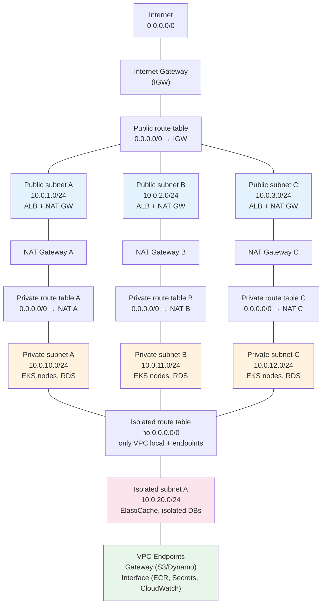
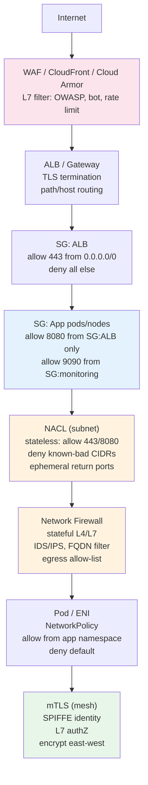
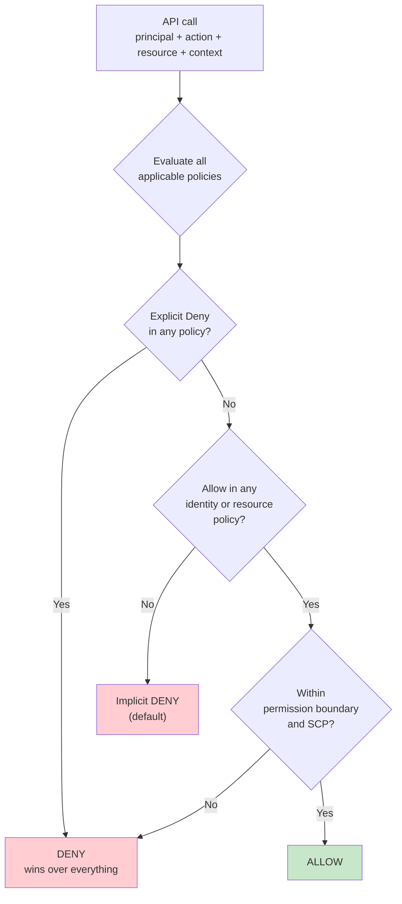

# Chapter 10 — Cloud Networking, IAM, and Security Foundations

**What this chapter covers.** Every cloud workload runs inside two fabrics: the network that moves its packets and the identity system that decides which packets — and which API calls — are allowed. Get either fabric wrong and the blast radius of a compromise is the entire account; get them right and a leaked credential or a compromised pod is contained to a narrow scope. This chapter builds both fabrics from first principles: VPC design (subnets, route tables, NAT, gateways, PrivateLink), network segmentation (security groups, NACLs, Network Firewall, service mesh mTLS), and the full IAM stack (principals, policies, permission boundaries, SCPs, trust policies, workload identity via IRSA/SPIFFE, and cross-account access) — with production-grade Terraform, IAM policies, and Kubernetes manifests you can apply to a real AWS/GCP account.

Learning goals — after this chapter you should be able to:

- Design a multi-AZ VPC with public, private, and isolated subnets, route tables, NAT Gateways, VPC endpoints, and PrivateLink, and explain the packet path for north-south and east-west traffic.
- Apply defense-in-depth with security groups (stateful, instance/ENI-scoped), NACLs (stateless, subnet-scoped), Network Firewall / Cloud Armor, and service-mesh mTLS — and articulate when each layer is the right tool.
- Author least-privilege IAM policies — identity-based, resource-based, permission boundaries, and SCPs — and evaluate effective permissions with the policy evaluation logic (explicit deny wins).
- Implement workload identity: IRSA / Workload Identity Federation (GCP) / Azure Workload Identity, SPIFFE/SPIRE, and cross-account roles with `sts:AssumeRole` and `ExternalId`.
- Enforce network and IAM guardrails as code — VPC flow logs, GuardDuty, IAM Access Analyzer, OPA/Kyverno network policies, and automated credential rotation.
- Diagnose and remediate the common failure modes: overly broad `*:*` policies, confused-deputy via missing `aws:SourceAccount`/`aws:SourceArn`, security-group sprawl, and NAT Gateway as a single point of failure or cost blowout.

> **Boundary note.** Volume 3 — Networking — covered packet mechanics (IP, TCP, TLS, HTTP, DNS, load balancing) on the wire; this chapter is the *cloud control-plane* view — how those primitives are declared, segmented, and authorized via VPC and IAM APIs. Volume 9 — Security — covered applied cryptography, authentication, and authorization models (RBAC/ABAC/ReBAC) at the application layer; this chapter is the *platform* enforcement — how identity and network policy are expressed in the provider's own policy language. Volume 5 — Databases — and Volume 6 — Distributed Systems — provide the consistency and replication theory behind highly available network and identity services.

---

## Cloud networking: the VPC as a virtual data center

A VPC (Virtual Private Cloud) is a logically isolated L3 network inside the provider's fabric. Every resource — EC2, RDS, ALBs, Lambda ENIs, EKS nodes — lives in a subnet inside a VPC, and every packet is governed by the VPC's route tables and firewall layers.

### VPC anatomy



*Figure 10-1: Three-tier VPC across three AZs — public subnets host the ALB and NAT Gateways; private subnets host compute and databases with per-AZ NAT for egress; isolated subnets have no internet route and reach AWS services only via VPC endpoints.*

### Subnet tiers and routing

| Tier | Route to `0.0.0.0/0` | Reachability | Hosts |
|---|---|---|---|
| **Public** | IGW | Inbound from internet (if SG allows), outbound via IGW | ALBs, NLBs, bastion (if any) |
| **Private** | NAT Gateway (per AZ) | Outbound to internet via NAT; inbound only via ALB | EKS/EC2, RDS, ElastiCache |
| **Isolated** | None (only `local` + prefix lists for endpoints) | No internet; AWS services via VPC endpoints | Sensitive data stores, compliance workloads |

One NAT Gateway per AZ is the minimum for AZ isolation — a single shared NAT is a cross-AZ single point of failure and a bandwidth bottleneck (100 Gbps per GW, shared). Cost is ~$32/mo per GW plus data-processing charges; for high-egress fleets, consider NAT-less egress via VPC endpoints and egress VPC patterns.

### Production VPC with Terraform

```hcl
# vpc.tf — three-tier VPC with per-AZ NAT, flow logs, and endpoints

locals {
  azs = ["us-east-1a", "us-east-1b", "us-east-1c"]
  vpc_cidr = "10.0.0.0/16"
}

resource "aws_vpc" "main" {
  cidr_block           = local.vpc_cidr
  enable_dns_hostnames = true
  enable_dns_support   = true
  tags = { Name = "${var.environment}-main" }
}

resource "aws_internet_gateway" "main" {
  vpc_id = aws_vpc.main.id
  tags   = { Name = "${var.environment}-igw" }
}

# --- Subnets (one per AZ per tier) ---
resource "aws_subnet" "public" {
  for_each                = toset(local.azs)
  vpc_id                  = aws_vpc.main.id
  cidr_block              = cidrsubnet(local.vpc_cidr, 8, index(local.azs, each.key))
  availability_zone       = each.key
  map_public_ip_on_launch = false  # ALBs get public IPs via allocation; instances do not
  tags = {
    Name                        = "${var.environment}-public-${each.key}"
    "kubernetes.io/role/elb"    = "1"
    "kubernetes.io/cluster/${var.cluster_name}" = "shared"
  }
}

resource "aws_subnet" "private" {
  for_each          = toset(local.azs)
  vpc_id            = aws_vpc.main.id
  cidr_block        = cidrsubnet(local.vpc_cidr, 8, 10 + index(local.azs, each.key))
  availability_zone = each.key
  tags = {
    Name                              = "${var.environment}-private-${each.key}"
    "kubernetes.io/role/internal-elb" = "1"
    "kubernetes.io/cluster/${var.cluster_name}" = "shared"
  }
}

resource "aws_subnet" "isolated" {
  for_each          = toset(local.azs)
  vpc_id            = aws_vpc.main.id
  cidr_block        = cidrsubnet(local.vpc_cidr, 8, 20 + index(local.azs, each.key))
  availability_zone = each.key
  tags = { Name = "${var.environment}-isolated-${each.key}" }
}

# --- NAT per AZ (no cross-AZ NAT — AZ isolation) ---
resource "aws_eip" "nat" {
  for_each = toset(local.azs)
  domain   = "vpc"
  tags     = { Name = "${var.environment}-nat-${each.key}" }
}

resource "aws_nat_gateway" "main" {
  for_each      = toset(local.azs)
  allocation_id = aws_eip.nat[each.key].id
  subnet_id     = aws_subnet.public[each.key].id
  tags          = { Name = "${var.environment}-nat-${each.key}" }
  depends_on    = [aws_internet_gateway.main]
}

# --- Route tables ---
resource "aws_route_table" "public" {
  vpc_id = aws_vpc.main.id
  route {
    cidr_block = "0.0.0.0/0"
    gateway_id = aws_internet_gateway.main.id
  }
  tags = { Name = "${var.environment}-public" }
}

resource "aws_route_table" "private" {
  for_each = toset(local.azs)
  vpc_id   = aws_vpc.main.id
  route {
    cidr_block     = "0.0.0.0/0"
    nat_gateway_id = aws_nat_gateway.main[each.key].id
  }
  tags = { Name = "${var.environment}-private-${each.key}" }
}

resource "aws_route_table" "isolated" {
  vpc_id = aws_vpc.main.id
  # No 0.0.0.0/0 — only local route (implicit) + gateway endpoints via prefix lists
  tags = { Name = "${var.environment}-isolated" }
}

resource "aws_route_table_association" "public" {
  for_each       = toset(local.azs)
  subnet_id      = aws_subnet.public[each.key].id
  route_table_id = aws_route_table.public.id
}

resource "aws_route_table_association" "private" {
  for_each       = toset(local.azs)
  subnet_id      = aws_subnet.private[each.key].id
  route_table_id = aws_route_table.private[each.key].id
}

resource "aws_route_table_association" "isolated" {
  for_each       = toset(local.azs)
  subnet_id      = aws_subnet.isolated[each.key].id
  route_table_id = aws_route_table.isolated.id
}

# --- VPC endpoints (no NAT needed for these) ---
resource "aws_vpc_endpoint" "s3" {
  vpc_id            = aws_vpc.main.id
  service_name      = "com.amazonaws.${var.region}.s3"
  vpc_endpoint_type = "Gateway"
  route_table_ids   = concat(
    [for rt in aws_route_table.private : rt.id],
    [aws_route_table.isolated.id],
  )
  tags = { Name = "${var.environment}-s3" }
}

resource "aws_vpc_endpoint" "ecr_api" {
  vpc_id              = aws_vpc.main.id
  service_name        = "com.amazonaws.${var.region}.ecr.api"
  vpc_endpoint_type   = "Interface"
  private_dns_enabled = true
  subnet_ids          = [for s in aws_subnet.private : s.id]
  security_group_ids  = [aws_security_group.vpc_endpoints.id]
}

resource "aws_vpc_endpoint" "ecr_dkr" {
  vpc_id              = aws_vpc.main.id
  service_name        = "com.amazonaws.${var.region}.ecr.dkr"
  vpc_endpoint_type   = "Interface"
  private_dns_enabled = true
  subnet_ids          = [for s in aws_subnet.private : s.id]
  security_group_ids  = [aws_security_group.vpc_endpoints.id]
}

resource "aws_vpc_endpoint" "secretsmanager" {
  vpc_id              = aws_vpc.main.id
  service_name        = "com.amazonaws.${var.region}.secretsmanager"
  vpc_endpoint_type   = "Interface"
  private_dns_enabled = true
  subnet_ids          = [for s in aws_subnet.private : s.id]
  security_group_ids  = [aws_security_group.vpc_endpoints.id]
}

resource "aws_security_group" "vpc_endpoints" {
  name_prefix = "${var.environment}-vpce-"
  vpc_id      = aws_vpc.main.id
  ingress {
    from_port   = 443
    to_port     = 443
    protocol    = "tcp"
    cidr_blocks = [local.vpc_cidr]  # only from within the VPC
  }
  tags = { Name = "${var.environment}-vpce" }
}

# --- Flow logs (VPC-level observability — non-negotiable) ---
resource "aws_flow_log" "main" {
  vpc_id               = aws_vpc.main.id
  traffic_type         = "ALL"  # ACCEPT and REJECT — REJECT reveals blocked traffic
  iam_role_arn         = aws_iam_role.flow_logs.arn
  log_destination_type = "cloud-watch-logs"
  log_destination      = aws_cloudwatch_log_group.flow_logs.arn
  max_aggregation_interval = 60  # 60s for near-real-time; 600s cheaper
}

resource "aws_cloudwatch_log_group" "flow_logs" {
  name              = "/vpc/flow-logs/${var.environment}"
  retention_in_days = 90
  kms_key_id        = aws_kms_key.logs.arn
}
```

### PrivateLink and Transit Gateway

- **PrivateLink (Interface Endpoints / Endpoint Services):** expose a service (your own or a SaaS provider's NLB) as an ENI inside the consumer's VPC. Traffic never traverses the public internet. Use for cross-VPC and SaaS ingress where peering would be too broad.
- **Transit Gateway (TGW):** hub-and-spoke routing between many VPCs and on-prem. Each VPC attaches to the TGW; route tables on the TGW control which VPCs can reach which. Prefer TGW over full-mesh peering beyond ~5 VPCs — peering is O(n²) attachments, TGW is O(n).

---

## Network segmentation: defense in depth



*Figure 10-2: Defense in depth — each layer has a distinct scope and failure mode. WAF/ALB handle north-south L7; security groups enforce ENI-level stateful filtering; NACLs provide subnet-level stateless guardrails; Network Firewall adds stateful IDS/IPS and egress control; Kubernetes NetworkPolicy and mesh mTLS secure east-west.*

### Security groups vs. NACLs

| Property | Security Group | NACL |
|---|---|---|
| **Scope** | ENI / instance | Subnet |
| **State** | Stateful (return traffic auto-allowed) | Stateless (explicit ingress + egress rules) |
| **Rule model** | Allow only (implicit deny) | Allow and deny, evaluated in order |
| **Typical use** | Primary firewall — every ENI gets one | Guardrail — block known-bad CIDRs, enforce subnet isolation |
| **Common mistake** | `0.0.0.0/0` on app ports | Forgetting ephemeral return ports (1024–65535) |

```hcl
# security-groups.tf — least-privilege SGs with no 0.0.0.0/0 on app ports

resource "aws_security_group" "alb" {
  name_prefix = "${var.environment}-alb-"
  vpc_id      = aws_vpc.main.id
  description = "ALB — only 443 from internet"

  ingress {
    from_port   = 443
    to_port     = 443
    protocol    = "tcp"
    cidr_blocks = ["0.0.0.0/0"]
    description = "HTTPS from internet"
  }
  egress {
    from_port       = 8080
    to_port         = 8080
    protocol        = "tcp"
    security_groups = [aws_security_group.app.id]
    description     = "to app pods"
  }
  tags = { Name = "${var.environment}-alb" }
}

resource "aws_security_group" "app" {
  name_prefix = "${var.environment}-app-"
  vpc_id      = aws_vpc.main.id
  description = "App — only from ALB SG, not from CIDR"

  ingress {
    from_port       = 8080
    to_port         = 8080
    protocol        = "tcp"
    security_groups = [aws_security_group.alb.id]  # SG-to-SG — no CIDR
    description     = "from ALB only"
  }
  ingress {
    from_port       = 9090
    to_port         = 9090
    protocol        = "tcp"
    security_groups = [aws_security_group.monitoring.id]
    description     = "scraping from monitoring"
  }
  egress {
    from_port   = 443
    to_port     = 443
    protocol    = "tcp"
    cidr_blocks = ["0.0.0.0/0"]  # tighten with prefix lists or egress firewall as maturity grows
    description = "egress to AWS APIs / internet"
  }
  tags = { Name = "${var.environment}-app" }
}

# NACL as a guardrail — block a known-bad CIDR at the subnet boundary
resource "aws_network_acl" "private" {
  vpc_id     = aws_vpc.main.id
  subnet_ids = [for s in aws_subnet.private : s.id]
  tags       = { Name = "${var.environment}-private-nacl" }
}

resource "aws_network_acl_rule" "deny_bad_cidr" {
  network_acl_id = aws_network_acl.private.id
  rule_number    = 90   # evaluated before allow rules at 100+
  egress         = false
  protocol       = "-1"
  rule_action    = "deny"
  cidr_block     = "203.0.113.0/24"  # example: known scanner net
}

resource "aws_network_acl_rule" "allow_app_ingress" {
  network_acl_id = aws_network_acl.private.id
  rule_number    = 100
  egress         = false
  protocol       = "tcp"
  rule_action    = "allow"
  cidr_block     = "0.0.0.0/0"
  from_port      = 8080
  to_port        = 8080
}

resource "aws_network_acl_rule" "allow_ephemeral_egress" {
  network_acl_id = aws_network_acl.private.id
  rule_number    = 100
  egress         = true
  protocol       = "tcp"
  rule_action    = "allow"
  cidr_block     = "0.0.0.0/0"
  from_port      = 1024
  to_port        = 65535
}
```

### Kubernetes NetworkPolicy (east-west)

```yaml
# networkpolicy.yaml — default deny + explicit allow (Kubernetes-native segmentation)
apiVersion: networking.k8s.io/v1
kind: NetworkPolicy
metadata:
  name: default-deny-all
  namespace: prod
spec:
  podSelector: {}          # applies to all pods in namespace
  policyTypes: [Ingress, Egress]
  # No ingress/egress rules = deny all — every allowed flow must be explicit

---
apiVersion: networking.k8s.io/v1
kind: NetworkPolicy
metadata:
  name: api-allow
  namespace: prod
spec:
  podSelector:
    matchLabels: { app: api }
  policyTypes: [Ingress, Egress]
  ingress:
    - from:
        - namespaceSelector:
            matchLabels: { name: ingress }  # from ingress namespace
        - podSelector:
            matchLabels: { app: frontend }  # or from frontend in same namespace
      ports:
        - port: 8080
          protocol: TCP
    - from:
        - namespaceSelector:
            matchLabels: { name: monitoring }
      ports:
        - port: 9090  # metrics
  egress:
    - to:
        - namespaceSelector:
            matchLabels: { name: prod }
          podSelector:
            matchLabels: { app: postgres }
      ports:
        - port: 5432
    - to:
        - namespaceSelector:
            matchLabels: { name: kube-system }
          podSelector:
            matchLabels: { k8s-app: kube-dns }
      ports:
        - port: 53
          protocol: UDP
        - port: 53
          protocol: TCP
    - ports:               # allow 443 to VPC endpoints / AWS APIs
        - port: 443
          protocol: TCP
```

---

## IAM: the other fabric

If the network decides *which packets can reach a resource*, IAM decides *which principals can call which APIs on which resources*. In AWS, every API call is authorized against IAM — there is no backdoor.

### Policy evaluation logic



*Figure 10-3: IAM policy evaluation — an explicit deny in any applicable policy wins unconditionally; otherwise an explicit allow is required from an identity or resource policy, and the result must also sit within the permission boundary and SCP.*

Policy types and their scope:

| Policy type | Attached to | Effect |
|---|---|---|
| **Identity-based** | User / group / role | Grants permissions to the principal |
| **Resource-based** | Resource (S3 bucket, SQS queue, KMS key, ECR repo) | Grants permissions *to* principals; required for cross-account |
| **Permission boundary** | User / role | Upper bound — caps what identity policies can grant |
| **SCP** (Service Control Policy) | OU / account (Organizations) | Upper bound across the entire account — even admin cannot exceed |
| **Session policy** | Assumed-role session | Further narrows the session |
| **Trust policy** | Role | Who can assume the role and under what conditions |

For a call to succeed: **(identity allows OR resource allows) AND no explicit deny anywhere AND within boundary AND within SCP**.

### Least-privilege IAM in practice

```json
// iam-policies/api-role.json — application role: minimal S3 + SQS + Secrets Manager
{
  "Version": "2012-10-17",
  "Statement": [
    {
      "Sid": "ReadConfigFromS3",
      "Effect": "Allow",
      "Action": ["s3:GetObject"],
      "Resource": "arn:aws:s3:::app-config-prod/*",
      "Condition": {
        "StringEquals": { "aws:RequestedRegion": "us-east-1" }
      }
    },
    {
      "Sid": "ConsumeOrdersQueue",
      "Effect": "Allow",
      "Action": ["sqs:ReceiveMessage", "sqs:DeleteMessage", "sqs:GetQueueAttributes"],
      "Resource": "arn:aws:sqs:us-east-1:123456789012:orders-prod"
    },
    {
      "Sid": "ReadSecretsForThisServiceOnly",
      "Effect": "Allow",
      "Action": ["secretsmanager:GetSecretValue"],
      "Resource": "arn:aws:secretsmanager:us-east-1:123456789012:secret:prod/api/*",
      "Condition": {
        "StringEquals": { "aws:ResourceTag/Service": "api" }
      }
    },
    {
      "Sid": "WriteLogsAndMetrics",
      "Effect": "Allow",
      "Action": ["logs:CreateLogStream", "logs:PutLogEvents", "cloudwatch:PutMetricData"],
      "Resource": "*",
      "Condition": {
        "StringEquals": { "aws:RequestedRegion": "us-east-1" },
        "ForAllValues:StringEquals": { "cloudwatch:namespace": "prod/api" }
      }
    },
    {
      "Sid": "DenyOutsideVPC",
      "Effect": "Deny",
      "Action": "*",
      "Resource": "*",
      "Condition": {
        "StringNotEquals": { "aws:SourceVpc": "vpc-0a1b2c3d4e5f" }
      }
    }
  ]
}
```

```hcl
# iam.tf — wire the policy to a role with a trust policy for EKS IRSA

resource "aws_iam_role" "api" {
  name                 = "api-prod"
  assume_role_policy   = data.aws_iam_policy_document.api_trust.json
  managed_policy_arns  = [aws_iam_policy.api.arn]
  permissions_boundary = aws_iam_policy.boundary.arn  # cap even if policy is later broadened
  max_session_duration = 3600
  tags = { Service = "api", Environment = "prod" }
}

data "aws_iam_policy_document" "api_trust" {
  statement {
    effect  = "Allow"
    actions = ["sts:AssumeRoleWithWebIdentity"]
    principals {
      type        = "Federated"
      identifiers = [aws_iam_openid_connect_provider.eks.arn]
    }
    condition {
      test     = "StringEquals"
      variable = "${replace(aws_iam_openid_connect_provider.eks.url, "https://", "")}:sub"
      values   = ["system:serviceaccount:prod:api"]
    }
    condition {
      test     = "StringEquals"
      variable = "${replace(aws_iam_openid_connect_provider.eks.url, "https://", "")}:aud"
      values   = ["sts.amazonaws.com"]
    }
  }
}

resource "aws_iam_policy" "api" {
  name   = "api-prod"
  policy = file("${path.module}/iam-policies/api-role.json")
}

# Permission boundary — even if someone attaches AdministratorAccess, this caps it
resource "aws_iam_policy" "boundary" {
  name = "boundary-prod"
  policy = jsonencode({
    Version = "2012-10-17"
    Statement = [
      {
        Sid      = "BoundaryAllowlist"
        Effect   = "Allow"
        Action   = ["s3:*", "sqs:*", "secretsmanager:GetSecretValue",
                    "logs:*", "cloudwatch:PutMetricData", "xray:*"]
        Resource = "*"
        Condition = {
          StringEquals = { "aws:RequestedRegion" : "us-east-1" }
        }
      },
      {
        Sid      = "DenyIAMAndOrgs"
        Effect   = "Deny"
        Action   = ["iam:*", "organizations:*", "account:*"]
        Resource = "*"
      }
    ]
  })
}

# SCP at the OU level — no account in prod OU can launch outside approved regions or disable CloudTrail
resource "aws_organizations_policy" "prod_guardrails" {
  name    = "prod-guardrails"
  type    = "SERVICE_CONTROL_POLICY"
  content = jsonencode({
    Version = "2012-10-17"
    Statement = [
      {
        Sid      = "DenyOutsideApprovedRegions"
        Effect   = "Deny"
        Action   = "*"
        Resource = "*"
        Condition = {
          StringNotEquals = { "aws:RequestedRegion" : ["us-east-1", "us-east-1a", "us-east-1b", "us-east-1c"] }
        }
      },
      {
        Sid      = "DenyDisableCloudTrail"
        Effect   = "Deny"
        Action   = ["cloudtrail:StopLogging", "cloudtrail:DeleteTrail", "cloudtrail:UpdateTrail"]
        Resource = "*"
      },
      {
        Sid      = "RequireIMDSv2"
        Effect   = "Deny"
        Action   = "ec2:RunInstances"
        Resource = "arn:aws:ec2:*:*:instance/*"
        Condition = {
          StringNotEquals = { "ec2:MetadataHttpTokens" : "required" }
        }
      }
    ]
  })
}
```

### Workload identity: IRSA, SPIFFE, and cross-account

**IRSA (IAM Roles for Service Accounts)** binds a Kubernetes ServiceAccount to an IAM role via OIDC federation. No static credentials — the pod gets a projected service-account token, exchanges it for STS credentials, and assumes the role.

```yaml
# k8s/serviceaccount.yaml — IRSA binding (EKS)
apiVersion: v1
kind: ServiceAccount
metadata:
  name: api
  namespace: prod
  annotations:
    eks.amazonaws.com/role-arn: "arn:aws:iam::123456789012:role/api-prod"
automountServiceAccountToken: true

---
# The Deployment references the ServiceAccount — every pod gets the role
apiVersion: apps/v1
kind: Deployment
metadata:
  name: api
  namespace: prod
spec:
  template:
    spec:
      serviceAccountName: api
      containers:
        - name: api
          image: registry.example.com/api:1.42.0
          env:
            - name: AWS_REGION
              value: us-east-1
            # No AWS_ACCESS_KEY_ID / AWS_SECRET_ACCESS_KEY — credentials come from STS via the projected token
```

Cross-account access uses `sts:AssumeRole` with a trust policy that includes `ExternalId` (confused-deputy protection) and `aws:SourceAccount` / `aws:SourceArn` conditions:

```hcl
# cross-account role — prod account allows CI account to deploy, but only via a specific role and with ExternalId
data "aws_iam_policy_document" "cross_account_trust" {
  statement {
    effect  = "Allow"
    actions = ["sts:AssumeRole"]
    principals {
      type        = "AWS"
      identifiers = ["arn:aws:iam::999999999999:role/ci-deployer"]
    }
    condition {
      test     = "StringEquals"
      variable = "sts:ExternalId"
      values   = [var.deploy_external_id]  # random UUID, stored in Secrets Manager
    }
    condition {
      test     = "StringEquals"
      variable = "aws:PrincipalOrgID"
      values   = [var.org_id]  # only principals in our Organization
    }
  }
}
```

GCP equivalent — Workload Identity Federation:

```hcl
# gcp-workload-identity.tf — GKE workload identity (no service-account keys)
resource "google_service_account" "api" {
  account_id   = "api-prod"
  display_name = "api prod"
}

resource "google_service_account_iam_member" "workload_identity" {
  service_account_id = google_service_account.api.name
  role               = "roles/iam.workloadIdentityUser"
  member             = "serviceAccount:${var.project_id}.svc.id.goog[prod/api]"
}

resource "google_project_iam_member" "api_storage" {
  project = var.project_id
  role    = "roles/storage.objectViewer"
  member  = "serviceAccount:${google_service_account.api.email}"
}
```

```yaml
# GKE ServiceAccount annotated for Workload Identity
apiVersion: v1
kind: ServiceAccount
metadata:
  name: api
  namespace: prod
  annotations:
    iam.gke.io/gcp-service-account: "api-prod@my-project.iam.gserviceaccount.com"
```

### The confused-deputy problem

When a service (e.g., S3, CloudTrail, or your own cross-account role) is tricked into using its authority on behalf of an attacker, it is a confused deputy. The fix is to include the caller's identity in the resource policy condition:

```json
{
  "Sid": "AllowOnlyFromMyAccount",
  "Effect": "Allow",
  "Principal": { "Service": "cloudtrail.amazonaws.com" },
  "Action": "s3:PutObject",
  "Resource": "arn:aws:s3:::my-cloudtrail-bucket/AWSLogs/123456789012/*",
  "Condition": {
    "StringEquals": { "aws:SourceAccount": "123456789012" },
    "ArnLike": { "aws:SourceArn": "arn:aws:cloudtrail:us-east-1:123456789012:trail/*" }
  }
}
```

Without `aws:SourceAccount` / `aws:SourceArn`, any account's CloudTrail could write to your bucket — or an attacker could create a trail that exfiltrates via your resource policy.

---

## Security foundations: encryption, detection, and guardrails

### Encryption at rest and in transit

- **At rest:** every VPC resource that stores data (EBS, RDS, S3, EFS, Secrets Manager, CloudWatch Logs) is encrypted with KMS. Use customer-managed keys (CMKs) for services where you need rotation control and CloudTrail visibility into `Decrypt` calls.
- **In transit:** TLS everywhere — ALB with ACM certificates, RDS with `rds-ca-rsa2048-g1`, EFS with `stunnel`, and mesh mTLS for east-west (see below). Enforce with SCP (`Deny` unencrypted S3 uploads via `s3:x-amz-server-side-encryption` condition) and with Kyverno/OPA policies.

### Detection: flow logs, GuardDuty, Access Analyzer

```hcl
# detection.tf — GuardDuty + Access Analyzer + CloudTrail trail
resource "aws_guardduty_detector" "main" {
  enable = true
  datasources {
    s3_logs { enable = true }
    kubernetes { audit_logs { enable = true } }
  }
  tags = { Environment = var.environment }
}

resource "aws_accessanalyzer_analyzer" "main" {
  analyzer_name = "${var.environment}-analyzer"
  type          = "ACCOUNT"
  tags          = { Environment = var.environment }
}

resource "aws_cloudtrail" "main" {
  name                          = "${var.environment}-trail"
  s3_bucket_name                = aws_s3_bucket.trail.id
  include_global_service_events = true
  is_multi_region_trail         = true
  enable_log_file_validation    = true
  kms_key_id                    = aws_kms_key.trail.arn
  cloud_watch_logs_group_arn    = "${aws_cloudwatch_log_group.trail.arn}:*"
  cloud_watch_logs_role_arn     = aws_iam_role.cloudtrail.arn
  insight_selector { insight_type = "ApiCallRateInsight" }
  tags = { Environment = var.environment }
}
```

### Policy-as-code guardrails

```rego
# policy/network.rego — OPA/Conftest: deny overly broad SGs and IAM wildcards
package main

deny[msg] {
  sg := input.resource_changes[_]
  sg.type == "aws_security_group"
  rule := sg.change.after.ingress[_]
  rule.cidr_blocks[_] == "0.0.0.0/0"
  rule.from_port != 443
  rule.from_port != 80
  msg := sprintf("SG %q allows 0.0.0.0/0 on port %v — restrict to ALB SG or known CIDR", [sg.address, rule.from_port])
}

deny[msg] {
  pol := input.resource_changes[_]
  contains(pol.type, "aws_iam_policy")
  stmt := json.unmarshal(pol.change.after.policy).Statement[_]
  stmt.Effect == "Allow"
  stmt.Action[_] == "*:*"
  msg := sprintf("IAM policy %q contains Action '*:*' — use least privilege", [pol.address])
}

deny[msg] {
  pol := input.resource_changes[_]
  contains(pol.type, "aws_iam_policy")
  stmt := json.unmarshal(pol.change.after.policy).Statement[_]
  stmt.Effect == "Allow"
  stmt.Resource == "*"
  not stmt.Condition  # wildcard resource without condition is overly broad
  msg := sprintf("IAM policy %q allows Resource '*' without Condition — scope to specific ARNs", [pol.address])
}
```

---

## Distributed-systems lens

Network and IAM are the two global coordination planes that every service depends on — and that every team shares. Three practices keep them coherent at scale:

1. **VPC and IAM as platform products.** No team creates its own VPC or IAM role from scratch. The platform team publishes a Terraform module (`modules/network`, `modules/workload-identity`) that encodes the approved topology, flow logs, endpoints, and permission boundary. Teams instantiate the module with narrow inputs (service name, required AWS actions) — the platform owns the invariants.

2. **Blast-radius budgeting.** Every workload runs in a dedicated account (or at minimum a dedicated VPC + IAM boundary) so that a compromise in one service cannot call APIs or reach ENIs in another. SCPs and permission boundaries enforce the ceiling; VPC isolation enforces the floor.

3. **Continuous verification, not periodic audit.** IAM Access Analyzer findings, GuardDuty alerts, and VPC flow-log anomalies feed the same SIEM/SOAR pipeline as application logs. A new `0.0.0.0/0` security-group rule or a new `iam:PassRole` grant triggers an alert within minutes — not at the next quarterly review.

---

## Key takeaways

- A production VPC has three subnet tiers — public (ALB + NAT GW), private (compute, per-AZ NAT), and isolated (no internet, VPC endpoints only) — with one NAT Gateway per AZ for isolation and bandwidth.
- VPC endpoints (Gateway for S3/Dynamo, Interface/PrivateLink for ECR/Secrets/CloudWatch) remove NAT dependency and keep traffic on the provider backbone.
- Security groups (stateful, ENI-scoped, allow-only) are the primary firewall; NACLs (stateless, subnet-scoped, allow+deny) are a guardrail; Network Firewall adds IDS/IPS and egress allow-listing; NetworkPolicy + mesh mTLS secure east-west.
- IAM evaluation is deny-wins: an explicit deny anywhere overrides any allow, and the effective permission must sit within the permission boundary and SCP.
- Least privilege means scoping `Action` to the minimal API set, `Resource` to specific ARNs, and adding `Condition` (region, VPC, tag, `SourceAccount`/`SourceArn` for confused-deputy protection).
- Workload identity (IRSA / GKE Workload Identity / SPIFFE) eliminates static credentials — pods get short-lived STS tokens via OIDC federation, bound to a single ServiceAccount.
- Cross-account trust policies must include `ExternalId` and `aws:PrincipalOrgID` / `aws:SourceAccount` to prevent confused-deputy abuse.
- Encryption at rest (KMS CMKs), in transit (TLS + mesh mTLS), and detection (VPC flow logs, GuardDuty, Access Analyzer, CloudTrail) are baseline — not optional — and belong in the platform module every team inherits.

## Further reading

- AWS VPC documentation — https://docs.aws.amazon.com/vpc/latest/userguide/
- AWS IAM policy evaluation logic — https://docs.aws.amazon.com/IAM/latest/UserGuide/reference_policies_evaluation-logic.html
- AWS PrivateLink and Transit Gateway — https://docs.aws.amazon.com/vpc/latest/privatelink/ , https://docs.aws.amazon.com/vpc/latest/tgw/
- Kubernetes NetworkPolicy — https://kubernetes.io/docs/concepts/services-networking/network-policies/
- SPIFFE/SPIRE — https://spiffe.io/docs/latest/ , https://spiffe.io/docs/latest/spire-about/
- NIST SP 800-210 — General Access Control Guidance for Cloud Systems; NIST SP 800-53 (AC, SC families).
- Shillaker, *The Cloud Native Security Handbook* (O'Reilly) — VPC, IAM, and workload identity patterns.
