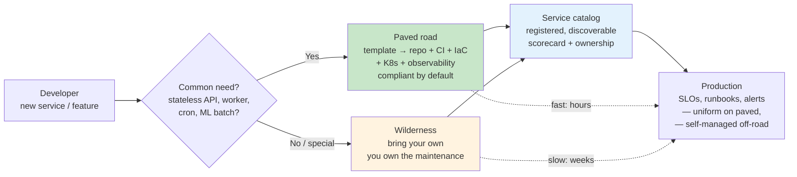
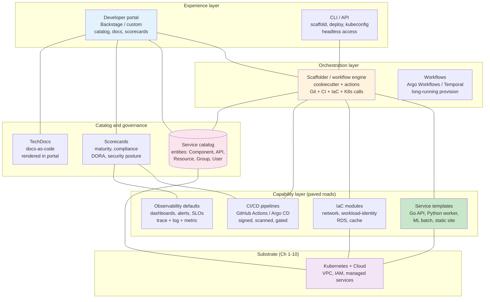
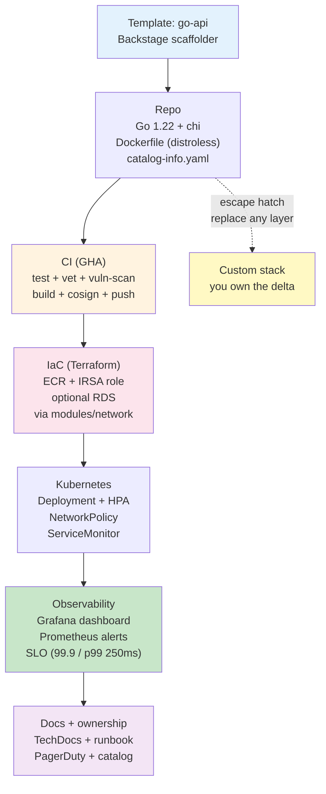
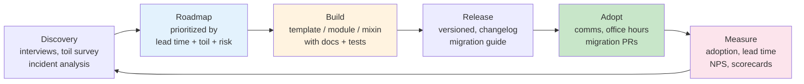

# Chapter 11 — Platform Engineering: Paved Roads and Internal Developer Platforms

**What this chapter covers.** Every engineering organization eventually hits the same bottleneck: each team re-solves the same problems — how to scaffold a service, wire CI/CD, provision infrastructure, handle secrets, observe it in production — with slightly different, slightly broken answers. Platform engineering replaces that sprawl with *paved roads*: opinionated, supported paths that make the right way the easy way, and an Internal Developer Platform (IDP) that exposes those paths as self-service. This chapter builds the mental model, architecture, and operational practice for platform engineering at cloud scale — from the paved-road philosophy and platform-as-product discipline, through IDP components (service catalog, templates, orchestration, and developer portal), to a production-grade Backstage implementation with software templates, TechDocs, Kubernetes and Terraform integration, scorecards, and the operating model that keeps a platform adopted rather than mandated.

Learning goals — after this chapter you should be able to:

- Articulate the platform engineering value proposition — cognitive load, lead time, reliability, and compliance — and distinguish platforms from traditional shared infrastructure or DevOps tooling.
- Design paved roads and golden paths: opinionated service templates, CI/CD pipelines, infrastructure modules, and observability defaults that encode organizational standards while preserving escape hatches.
- Architect an IDP — service catalog, software templates/scaffolder, orchestration (workflow engine), developer portal (Backstage or equivalent), and integrations (CI, Git, Kubernetes, cloud, observability, secrets) — and explain how data flows between them.
- Operate Backstage in production: `app-config.yaml`, `catalog-info.yaml`, software templates (`template.yaml`) with cookiecutter/templating, TechDocs, Kubernetes plugin, Terraform integration, and authentication (GitHub/Google OIDC, RBAC).
- Measure platform adoption and health with DORA metrics, service maturity scorecards, template usage, and time-to-first-deploy — and run the product discipline (discovery, roadmap, deprecation) that keeps a platform relevant.
- Avoid the failure modes that kill platforms: building a framework instead of a product, mandating without listening, over-abstraction, under-documentation, and treating the portal as the platform.

> **Boundary note.** Chapters 1–3 built the container and Kubernetes substrate; Chapter 4 built the IaC delivery pipeline; Chapters 5–6 added cloud primitives and managed services; Chapters 9–10 sized and secured the fleet. This chapter is the *human interface* atop all of it — how developers consume the platform without needing to master every layer underneath. Volume 11 — Reliability & SRE — covers the SRE practices that the paved road encodes by default (SLOs, incident response, chaos); Volume 15 — Software Engineering Practice — covers the team and process practices that platform engineering amplifies.

---

## Why platform engineering

### The problem: undifferentiated toil at scale

At 10 services, every team can own its own pipeline, Terraform, and dashboards. At 200 services, the same work is duplicated 200 times with 200 variants of wrong:

- A new service takes 3–6 weeks to reach production — most of it scaffolding, pipeline wiring, and security review.
- No one can answer "which services use log4j 2.14?" or "which pipelines lack image signing?" because there is no catalog.
- Security and compliance are enforced by review tickets — slow, inconsistent, and resented.
- On-call is uneven — some services have SLOs and runbooks, others have a dashboard someone built two years ago.

The bottleneck is not talent — it is **cognitive load**. A product engineer who wants to ship a feature should not need to be an expert in Kubernetes, Terraform, IAM, and Prometheus to do it. Platform engineering pushes that expertise into the platform so product teams can spend their cognitive budget on the product.

### Paved roads, not walled gardens

The central metaphor — from Netflix, Spotify, and later the CNCF — is the **paved road**:

- **Paved road (golden path):** the supported, opinionated path for a common need. "To build a stateless Go API, use this template — it gives you a repo, CI, IaC, Kubernetes manifests, dashboards, and alerts that pass security review automatically." The road is paved because someone maintains it, documents it, and keeps it compliant.
- **Unpaved (wilderness):** off-road is allowed — you can bring your own stack — but you own the maintenance. No one stops you; no one paves it for you.
- **Guardrails, not gates:** the platform makes the secure, compliant choice the default (signed images, least-privilege IAM, mTLS, flow logs) rather than a gate that requires a ticket.

A platform that mandates a single framework for every workload fails. A platform that offers no opinion drowns teams in choice. The art is in **opinionated defaults with explicit escape hatches**.



*Figure 11-1: Paved roads vs. wilderness — common needs take the paved road (hours to production, compliant by default); uncommon needs can go off-road but own the maintenance. Both end up in the catalog.*

### Platform as product

A platform is a **product** whose users are internal engineers. That framing has concrete consequences:

| Product discipline | Platform equivalent |
|---|---|
| User research | Interviews with product teams; map their delivery pain |
| Roadmap | Prioritized by lead time, toil survey, and incident data — not by what's fun to build |
| Adoption metrics | Template usage, time-to-first-deploy, catalog coverage, DORA lead time |
| Documentation | The paved road is undocumented if the template's README and TechDocs are stale |
| Deprecation | Old templates and pipeline versions are sunset with migration guides, not left to rot |
| Support | On-call for the platform itself; SLAs for template and pipeline availability |

A platform team that builds what it thinks is cool without talking to users builds a framework no one adopts. The most successful platforms (Spotify's Backstage origin story is the canonical example) started by **extracting** the paved road from what the best teams already did, not by inventing it in isolation.

---

## IDP architecture

An Internal Developer Platform is the runtime that exposes paved roads as self-service. The CNCF Platform Engineering Working Group defines it as the layer that integrates the underlying capabilities (compute, network, IaC, CI/CD, observability, security) into a coherent developer experience. It is not a single tool — it is a composition.



*Figure 11-2: IDP reference architecture — the developer interacts via portal or CLI; the scaffolder orchestrates templates, IaC modules, pipelines, and observability defaults against the Kubernetes/cloud substrate; the catalog and scorecards provide discovery and governance.*

Components and their contracts:

- **Service catalog** — the single source of truth for "what exists." Every service, API, resource, team, and dependency is an entity with ownership, lifecycle, and links. Without a catalog, you cannot answer "what do we have?" — and without that, you cannot govern it.
- **Software templates (scaffolder)** — cookiecutter-style generators that produce a new repo from a golden path, wire CI, create IaC, register the catalog entry, and open the first PR. The template is the paved road made executable.
- **Orchestration / workflow engine** — long-running provisioning (VPC, database, DNS) needs a durable workflow, not a synchronous HTTP call. Argo Workflows or Temporal behind the scaffolder handle retries, approvals, and human-in-the-loop steps.
- **Developer portal** — the UI that surfaces the catalog, docs, templates, scorecards, and plugin integrations (CI status, Kubernetes, costs, incidents). Backstage is the de facto open standard; alternatives include Port, Cortex, and custom portals.
- **Capability modules** — the actual paved roads: Terraform modules, pipeline definitions, Helm charts, and observability mixins that templates compose.

---

## Backstage in production

Backstage (Spotify, CNCF Incubating) is the most widely adopted IDP portal. It is a React frontend + Node.js backend with a plugin architecture — the platform team assembles the portal from core and community plugins rather than building from scratch.

### App configuration

```yaml
# app-config.yaml — Backstage production configuration (secrets via env vars)
app:
  title: Acme Developer Portal
  baseUrl: https://backstage.acme.example.com

organization:
  name: Acme

backend:
  baseUrl: https://backstage.acme.example.com
  listen:
    port: 7007
  csp:
    connect-src: ["'self'", "https://api.github.com", "https://gitlab.acme.example.com"]
  cors:
    origin: https://backstage.acme.example.com
    credentials: true
  database:
    client: pg
    connection:
      host: ${POSTGRES_HOST}
      port: ${POSTGRES_PORT}
      user: ${POSTGRES_USER}
      password: ${POSTGRES_PASSWORD}
      ssl: { rejectUnauthorized: false }
  cache:
    store: redis
    connection: ${REDIS_URL}

integrations:
  github:
    - host: github.com
      token: ${GITHUB_TOKEN}  # GitHub App token — not a PAT

auth:
  environment: production
  providers:
    github:
      development:
        clientId: ${AUTH_GITHUB_CLIENT_ID}
        clientSecret: ${AUTH_GITHUB_CLIENT_SECRET}
        signIn:
          resolvers:
            - resolver: usernameMatchingUserEntityName
    oidc:
      google:
        metadataUrl: https://accounts.google.com/.well-known/openid-configuration
        clientId: ${AUTH_OIDC_CLIENT_ID}
        clientSecret: ${AUTH_OIDC_CLIENT_SECRET}

catalog:
  rules:
    - allow: [Component, System, API, Resource, Group, User, Location, Template]
  locations:
    - type: url
      target: https://github.com/acme/backstage-catalog/blob/main/all.yaml
    - type: url
      target: https://github.com/acme/service-catalog/blob/main/catalog-info.yaml
  providers:
    githubOrg:
      id: acme-org
      githubUrl: https://github.com
      orgs: [acme]
      schedule:
        frequency: { minutes: 30 }
        timeout: { minutes: 5 }

permission:
  enabled: true  # RBAC — see below

scaffolder:
  defaultAuthor:
    name: Acme Scaffolder
    email: scaffolder@acme.example.com

techdocs:
  builder: local
  generator:
    runIn: docker
  publisher:
    type: awsS3
    awsS3:
      bucketName: acme-techdocs-${ENVIRONMENT}
      region: us-east-1
      s3ForcePathStyle: false
      credentials:
        accessKeyId: ${TECHDOCS_AWS_ACCESS_KEY_ID}
        secretAccessKey: ${TECHDOCS_AWS_SECRET_ACCESS_KEY}

kubernetes:
  serviceLocatorMethod:
    type: multiTenant
  clusterLocatorMethods:
    - type: config
      clusters:
        - name: prod-us-east-1
          url: https://k8s-prod.acme.example.com
          authProvider: oidc
          oidcTokenProvider: google
          dashboardUrl: https://k8s-prod.acme.example.com
          dashboardApp: gke

costInsights:
  engineerCost: 200000  # for cost-vs-build decisions in Cost Insights plugin
```

### Service catalog: catalog-info.yaml

Every repo contains a `catalog-info.yaml` that registers it with the portal. Backstage discovers these via the `catalog.locations` or GitHub discovery provider.

```yaml
# catalog-info.yaml — lives at the repo root; registered automatically via GitHub discovery
apiVersion: backstage.io/v1alpha1
kind: Component
metadata:
  name: orders-api
  title: Orders API
  description: Order lifecycle service — creates, validates, and fulfills customer orders
  tags: [go, api, orders, team-checkout]
  annotations:
    github.com/project-slug: acme/orders-api
    backstage.io/techdocs-ref: dir:.
    backstage.io/kubernetes-id: orders-api
    aws.amazon.com/role-arn: arn:aws:iam::123456789012:role/orders-api-prod
    pagerduty.com/service-id: PDSVC123
    cost-insights.io/product: orders
spec:
  type: service
  lifecycle: production
  owner: group:checkout    # must be a Group entity — ownership is mandatory
  system: commerce         # System groups related components
  dependsOn:
    - component:payments-api
    - resource:orders-db
    - resource:orders-queue
  providesApis:
    - orders-rest
  consumesApis:
    - payments-rest
    - inventory-grpc
---
apiVersion: backstage.io/v1alpha1
kind: API
metadata:
  name: orders-rest
  title: Orders REST API
  description: REST API for order management
spec:
  type: openapi
  lifecycle: production
  owner: group:checkout
  system: commerce
  definition: |
    openapi: 3.0.3
    info: { title: Orders API, version: 1.2.0 }
    paths:
      /orders:
        post:
          operationId: createOrder
          summary: Create a new order
---
apiVersion: backstage.io/v1alpha1
kind: Resource
metadata:
  name: orders-db
  title: Orders Postgres (RDS)
  description: RDS Postgres 16 — primary store for orders
  tags: [postgres, rds, managed]
  annotations:
    aws.amazon.com/arn: arn:aws:rds:us-east-1:123456789012:db:orders-prod
spec:
  type: database
  owner: group:checkout
  system: commerce
  dependsOn:
    - resource:prod-vpc
---
apiVersion: backstage.io/v1alpha1
kind: Group
metadata:
  name: checkout
  title: Checkout Team
  description: Owns orders, payments, and cart
spec:
  type: team
  parent: commerce-org
  children: []
  profile:
    displayName: Checkout
    email: checkout@acme.example.com
  members: [alice, bob, carol]
---
apiVersion: backstage.io/v1alpha1
kind: System
metadata:
  name: commerce
  title: Commerce System
  description: E-commerce core — orders, payments, inventory, fulfillment
spec:
  owner: group:commerce-org
  domain: commerce
```

### Software templates: the paved road made executable

A Backstage software template is a `template.yaml` that declares parameters (inputs), steps (actions), and output (the generated repo). When a developer clicks "Create Component," the scaffolder runs the steps.

```yaml
# templates/go-api/template.yaml — golden path for a Go stateless API
apiVersion: scaffolder.backstage.io/v1beta3
kind: Template
metadata:
  name: go-api
  title: Go API Service
  description: Opinionated Go API — Go 1.22, net/http + chi, Postgres, CI, IaC, K8s, observability
  tags: [go, api, paved-road, recommended]
spec:
  owner: group:platform
  type: service

  parameters:
    - title: Service metadata
      required: [name, owner, system]
      properties:
        name:
          title: Service name
          type: string
          pattern: ^[a-z][a-z0-9-]{2,30}$
          description: Lowercase, hyphenated — becomes repo and K8s name
        description:
          title: Description
          type: string
          maxLength: 200
        owner:
          title: Owner
          type: string
          ui:field: OwnerPicker
          ui:options: { catalogFilter: { kind: Group } }
        system:
          title: System
          type: string
          ui:field: EntityPicker
          ui:options: { catalogFilter: { kind: System } }
    - title: Deployment
      properties:
        environment:
          title: Initial environment
          type: string
          enum: [prod, staging]
          default: staging
        region:
          title: AWS region
          type: string
          enum: [us-east-1, eu-west-1]
          default: us-east-1
        enableDb:
          title: Provision Postgres (RDS)?
          type: boolean
          default: false

  steps:
    # 1. Generate from cookiecutter skeleton
    - id: fetchSkeleton
      name: Fetch skeleton
      action: fetch:template
      input:
        url: ./skeleton
        values:
          name: ${{ parameters.name }}
          description: ${{ parameters.description }}
          owner: ${{ parameters.owner }}
          system: ${{ parameters.system }}
          goModule: github.com/acme/${{ parameters.name }}

    # 2. Publish to GitHub — creates the repo
    - id: publish
      name: Publish to GitHub
      action: publish:github
      input:
        repoUrl: github.com?owner=acme&repo=${{ parameters.name }}
        defaultBranch: main
        protectDefaultBranch: true
        repoVisibility: private
        requiredStatusChecks: [ci / test, ci / lint, ci / vuln-scan]

    # 3. Register in Backstage catalog
    - id: register
      name: Register in catalog
      action: catalog:register
      input:
        repoContentsUrl: ${{ steps.publish.output.repoContentsUrl }}
        catalogInfoPath: /catalog-info.yaml

    # 4. Trigger IaC — create ECR repo, K8s namespace, and (optionally) RDS via Terraform Cloud
    - id: provisionInfra
      name: Provision infrastructure
      action: acme:terraform-cloud:run
      input:
        workspace: ${{ parameters.name }}-${{ parameters.environment }}
        variables:
          service_name: ${{ parameters.name }}
          environment: ${{ parameters.environment }}
          region: ${{ parameters.region }}
          enable_db: ${{ parameters.enableDb }}

    # 5. Wire CI — trigger initial pipeline run
    - id: triggerCi
      name: Trigger initial CI
      action: github:actions:dispatch
      input:
        repoUrl: github.com?owner=acme&repo=${{ parameters.name }}
        workflowId: ci.yaml
        branchOrTagName: main

  output:
    links:
      - title: Repository
        url: ${{ steps.publish.output.remoteUrl }}
      - title: Open in catalog
        entityRef: component:default/${{ parameters.name }}
      - title: Pipeline run
        url: ${{ steps.publish.output.remoteUrl }}/actions
```

The skeleton (`templates/go-api/skeleton/`) contains the actual files with `${{ values.name }}` substitution:

```
skeleton/
├── catalog-info.yaml              # templated from parameters
├── Dockerfile                     # distroless, non-root, slim
├── .github/workflows/ci.yaml      # test, lint, vuln-scan, build, sign, push, deploy
├── deploy/
│   ├── deployment.yaml            # K8s Deployment with probes, resources, IRSA
│   ├── service.yaml
│   ├── hpa.yaml                   # HPA from Ch 9 defaults
│   └── networkpolicy.yaml         # default-deny from Ch 10
├── terraform/
│   ├── main.tf                    # ECR, IAM role (IRSA), optional RDS — thin wrapper over modules
│   └── variables.tf
├── docs/
│   ├── index.md                   # TechDocs entry point
│   └── runbook.md                 # incident runbook skeleton
├── Makefile
└── README.md
```

CI pipeline produced by the template (abridged):

```yaml
# .github/workflows/ci.yaml — generated per service from the paved-road pipeline template
name: ci
on:
  push: { branches: [main] }
  pull_request: { branches: [main] }

permissions:
  contents: read
  id-token: write       # OIDC — no static secrets
  packages: write
  security-events: write

jobs:
  test:
    runs-on: ubuntu-latest
    steps:
      - uses: actions/checkout@v4
      - uses: actions/setup-go@v5
        with: { go-version: "1.22" }
      - run: go test -race -count=1 ./...
      - run: go vet ./...

  vuln-scan:
    runs-on: ubuntu-latest
    steps:
      - uses: actions/checkout@v4
      - uses: govulncheck-action@v1
      - uses: aquasecurity/trivy-action@0.24.0
        with: { image-ref: app, format: sarif, output: trivy.sarif }
      - uses: github/codeql-action/upload-sarif@v3
        with: { sarif_file: trivy.sarif }

  build-and-push:
    needs: [test, vuln-scan]
    runs-on: ubuntu-latest
    outputs:
      digest: ${{ steps.build.outputs.digest }}
    steps:
      - uses: actions/checkout@v4
      - uses: docker/build-push-action@v6
        id: build
        with:
          context: .
          push: true
          tags: ghcr.io/acme/${{ github.event.repository.name }}:${{ github.sha }}
          cache-from: type=gha
          cache-to: type=gha,mode=max
      - uses: sigstore/cosign-installer@v3.5.0
      - run: cosign sign --yes ghcr.io/acme/${{ github.event.repository.name }}@${{ steps.build.outputs.digest }}

  deploy-staging:
    if: github.ref == 'refs/heads/main'
    needs: [build-and-push]
    runs-on: ubuntu-latest
    environment: staging
    steps:
      - uses: actions/checkout@v4
      - uses: aws-actions/configure-aws-credentials@v4
        with: { role-to-assume: arn:aws:iam::123456789012:role/gha-deployer-staging, aws-region: us-east-1 }
      - run: |
          aws eks update-kubeconfig --name staging --region us-east-1
          kubectl set image deployment/${{ github.event.repository.name }} \
            app=ghcr.io/acme/${{ github.event.repository.name }}@${{ needs.build-and-push.outputs.digest }} \
            -n ${{ github.event.repository.name }}
          kubectl rollout status deployment/${{ github.event.repository.name }} -n ${{ github.event.repository.name }} --timeout=120s
```

### TechDocs

TechDocs renders Markdown from the repo (`docs/`) inside Backstage via MkDocs — docs live next to the code and are versioned with it.

```yaml
# mkdocs.yml — at the repo root, consumed by TechDocs
site_name: Orders API
site_description: Order lifecycle service
repo_url: https://github.com/acme/orders-api

nav:
  - Home: index.md
  - Runbook: runbook.md
  - API: api.md
  - ADRs: adr/index.md

plugins:
  - techdocs-core

theme:
  name: material
```

```markdown
<!-- docs/index.md — rendered inside Backstage -->
# Orders API

Owner: @checkout · Lifecycle: production · System: commerce

## Quick start

\`\`\`bash
make run          # local dev with docker-compose (Postgres + Redis)
make test         # unit + integration
gh workflow run ci.yaml  # trigger CI
\`\`\`

## Architecture

See [ADR-003: Postgres vs DynamoDB](adr/003-postgres-vs-dynamodb.md).

## On-call

- PagerDuty: [orders-api service](https://acme.pagerduty.com/services/PDSVC123)
- Runbook: [runbook.md](runbook.md)
- SLOs: 99.9% availability, p99 < 250ms (see [SLOs](slo.md))
```

### RBAC and Kubernetes plugin

```yaml
# rbac-policy.csv — Backstage permission framework (Casbin-style)
# p, role, rule, resource, action, effect
p, role:default/guests, catalog.entity.read, catalog-entity, read, allow
p, role:default/developers, scaffolder.template.execute, scaffolder-template, execute, allow
p, role:default/developers, scaffolder.action.execute, scaffolder-action, execute, allow
p, role:default/platform-admins, catalog.entity.delete, catalog-entity, delete, allow
p, role:default/platform-admins, scaffolder.template.execute, scaffolder-template, execute, allow

g, group:default/checkout, role:default/developers
g, group:default/platform, role:default/platform-admins
g, user:default/alice, role:default/developers
```

Backstage deployment on Kubernetes (abridged):

```yaml
# deploy/backstage.yaml — Backstage itself on Kubernetes
apiVersion: apps/v1
kind: Deployment
metadata:
  name: backstage
  namespace: platform
spec:
  replicas: 2
  selector:
    matchLabels: { app: backstage }
  template:
    metadata:
      labels: { app: backstage }
    spec:
      serviceAccountName: backstage
      containers:
        - name: backstage
          image: ghcr.io/acme/backstage:1.28.0
          ports: [{ containerPort: 7007 }]
          env:
            - name: POSTGRES_HOST
              valueFrom: { secretKeyRef: { name: backstage-secrets, key: postgres-host } }
            - name: GITHUB_TOKEN
              valueFrom: { secretKeyRef: { name: backstage-secrets, key: github-token } }
          resources:
            requests: { cpu: "1000m", memory: "1Gi" }
            limits: { cpu: "2000m", memory: "2Gi" }
          readinessProbe:
            httpGet: { path: /.backstage/health/v1/readiness, port: 7007 }
            periodSeconds: 10
          livenessProbe:
            httpGet: { path: /.backstage/health/v1/liveness, port: 7007 }
            periodSeconds: 30
---
apiVersion: v1
kind: ServiceAccount
metadata:
  name: backstage
  namespace: platform
  annotations:
    eks.amazonaws.com/role-arn: arn:aws:iam::123456789012:role/backstage-prod
```

---

## Golden paths in depth

A paved road is not just a repo template — it is a **vertical slice** that encodes standards at every layer. A "Go API" golden path, for example, is a contract:



*Figure 11-3: A golden path as a vertical slice — the template composes repo, CI, IaC, Kubernetes, observability, and docs into one coherent, compliant default. Any layer can be replaced via an escape hatch, but the default is fully wired.*

What makes a golden path "golden" is not the tool choice — it is the **guarantees**:

| Layer | Default | Guarantee |
|---|---|---|
| **Language/runtime** | Go 1.22, distroless image, non-root | No CVEs in base image; reproducible builds |
| **CI** | GHA with OIDC, cosign, Trivy, govulncheck | Every image is signed and scanned before it can be deployed |
| **IaC** | Terraform modules with `required_version`, policy checks | Every resource is tagged, encrypted, and in the right VPC/subnet |
| **Kubernetes** | Deployment + HPA + NetworkPolicy + ServiceMonitor | Every service is autoscaled, network-isolated, and monitored |
| **Observability** | Dashboard + alerts + SLO from mixins | Every service has an SLO and an on-call rotation on day one |
| **Security** | IRSA / Workload Identity, secrets via Secrets Manager, mTLS via mesh | No static credentials; no `0.0.0.0/0` SGs; TLS everywhere |

The platform team owns the **mixin** — a reusable dashboard, alert, or policy fragment — and the template composes them. When the logging standard changes, the platform updates one mixin and the next scaffold (and optionally a bulk PR via Renovate/Dependabot) propagates it.

---

## Operating the platform

### Measuring success

A platform without metrics is a cost center. The signals that matter:

| Metric | What it tells you | How to measure |
|---|---|---|
| **Time to first deploy** | Is the paved road actually fast? | Scaffolder timestamp → first `kubectl rollout` success |
| **Template adoption** | Are teams using the road or going off-road? | Catalog: `% of new services from templates` |
| **DORA lead time** | Is the platform speeding up delivery? | CI: commit → production deploy duration |
| **Catalog coverage** | Can you answer "what do we have?" | `% of repos with catalog-info.yaml`, orphan detection |
| **Scorecard pass rate** | Are services meeting standards? | TechInsights / custom scorecard: prod readiness checks |
| **Platform NPS / toil survey** | Do engineers like the platform? | Quarterly survey: "how much toil did the platform remove?" |

Service maturity scorecards (Backstage TechInsights or a custom plugin) encode the standards as checks:

```yaml
# scorecards/prod-readiness.yaml — TechInsights-style checks
apiVersion: backstage.io/v1alpha1
kind: Scorecard
metadata:
  name: prod-readiness
  title: Production Readiness
spec:
  checks:
    - id: has-catalog-info
      name: Registered in catalog
      fact: catalog-info-exists
    - id: has-runbook
      name: Runbook present (docs/runbook.md)
      fact: runbook-exists
    - id: ci-signed-images
      name: Images are signed (cosign)
      fact: cosign-verified
    - id: has-slo
      name: SLO defined and monitored
      fact: slo-exists
    - id: no-static-secrets
      name: No static AWS keys in repo
      fact: no-long-lived-credentials
    - id: hpa-configured
      name: HPA configured
      fact: k8s-hpa-exists
    - id: networkpolicy-present
      name: NetworkPolicy present
      fact: k8s-networkpolicy-exists
    - id: pagerduty-wired
      name: PagerDuty service linked
      fact: pagerduty-service-exists
```

The catalog page for each service renders its scorecard — green checks and red gaps are visible to the team and to leadership without a spreadsheet.

### The platform operating model



*Figure 11-4: The platform product loop — discovery → roadmap → build → release → adopt → measure → repeat. The loop is continuous; the platform is never "done."*

Practical operating choices:

- **Versioning golden paths.** Templates and modules are versioned (e.g., `go-api@v2.4`). Breaking changes get a new major version and a migration guide. A bot (Renovate) opens PRs to update consumers — adoption is nudged, not forced.
- **Office hours and champions.** The platform team holds weekly office hours and seeds champions in product teams who advocate for the paved road and feed back pain.
- **Deprecation with a deadline.** Old pipeline versions or Terraform modules are deprecated with a 90-day window and automated codemods where possible. After the window, the platform stops supporting the old path — but does not break it overnight.
- **Incident-driven improvement.** Every production incident that traces to a missing paved-road feature (no HPA, no NetworkPolicy, no SLO) becomes a platform backlog item. The next team never hits the same gap.

### Anti-patterns

| Anti-pattern | Symptom | Fix |
|---|---|---|
| **Framework, not product** | "We built a great abstraction — no one uses it" | Start from user pain, not from a cool tool; extract from what best teams already do |
| **Mandate without adoption** | Forced migration, resentment, shadow tooling | Make the road better than the wilderness; measure adoption, not compliance |
| **Portal is the platform** | Beautiful Backstage, no paved roads underneath | The portal is the storefront — the platform is the templates, modules, and pipelines behind it |
| **Over-abstraction** | One template with 40 flags tries to serve every workload | Fewer, opinionated templates per workload type; escape hatches for the rest |
| **Under-documentation** | Template exists, no one knows how to use it | TechDocs, README, and a 5-minute video per golden path — docs are part of the template |
| **No deprecation** | Five pipeline versions coexist forever | Version, changelog, migration guide, deadline — treat the platform as a product with a lifecycle |

---

## Distributed-systems lens

Platform engineering is the organizational answer to the coordination cost of distributed systems. Each service is a distributed system; the fleet is a distributed system of distributed systems. The platform reduces coordination cost in three ways:

1. **Consistency by default.** Paved roads encode the consistency choices (retry policy, timeout, idempotency, SLO) that individual teams would otherwise choose inconsistently. The fleet converges on a coherent set of defaults without a central review bottleneck.

2. **Discovery and dependency reasoning.** The catalog is the fleet's service registry for humans — "what depends on what, who owns it, where are its docs and runbooks?" Without it, incident response starts with "which Slack channel owns this service?" With it, the on-call path is one click from the failing dashboard.

3. **Safe evolution at scale.** Versioned templates + automated migration PRs let the platform evolve the fleet's 200 services without 200 manual tickets. A new security standard (e.g., "all images must be signed") is rolled out as a template update + bulk PR + scorecard check — not as a 6-month program.

---

## Key takeaways

- Platform engineering reduces cognitive load by encoding expertise into paved roads — opinionated, supported paths where the right way is the easy way — with explicit escape hatches for off-road needs.
- Treat the platform as a product: user research, prioritized roadmap, adoption metrics, documentation, and deprecation discipline — not as a side project or a mandate.
- An IDP composes a service catalog, software templates/scaffolder, workflow orchestration, developer portal, and capability modules (IaC, CI/CD, observability) atop the Kubernetes/cloud substrate.
- Backstage is the de facto portal standard: `catalog-info.yaml` registers every component with ownership and dependencies; `template.yaml` scaffolds new services as executable golden paths; TechDocs keeps docs next to code; RBAC and the Kubernetes plugin surface runtime state.
- A golden path is a vertical slice — repo, CI (signed/scanned), IaC (tagged/encrypted), Kubernetes (autoscaled/isolated), observability (SLO/alerts), and docs — composed from reusable mixins that the platform team maintains.
- Measure the platform with time-to-first-deploy, template adoption, DORA lead time, catalog coverage, scorecard pass rate, and engineer NPS — not just portal page views.
- The platform loop is continuous: discovery → roadmap → build → release → adopt → measure → repeat. The most dangerous moment for a platform is when the team declares it "done."
- The portal is the storefront, not the platform. A beautiful portal with no paved roads underneath is a catalog of toil, not a reduction of it.

## Further reading

- Backstage documentation — https://backstage.io/docs/
- CNCF Platform Engineering Working Group — white papers and maturity model — https://tag-app-delivery.cncf.io/whitepapers/platform-eng-maturity-model/
- Pauley, *Platform Engineering* (O'Reilly, 2024) — paved roads, IDPs, and the product discipline.
- Skelton & Pais, *Team Topologies* (IT Revolution, 2019) — platform team as an enabling team, cognitive load, and team interaction modes.
- Spotify engineering blog — Backstage origin and adoption — https://backstage.spotify.com/learn/
- Thoughtworks Technology Radar — Backstage, platform engineering patterns — https://www.thoughtworks.com/radar
- *Accelerate* (Forsgren, Humble, Kim) — DORA metrics and the link between platform capabilities and delivery performance.
