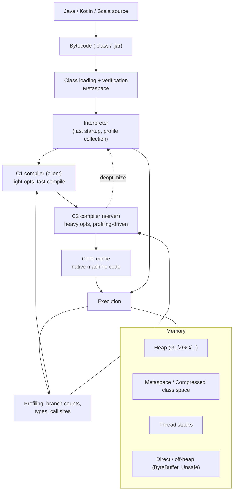
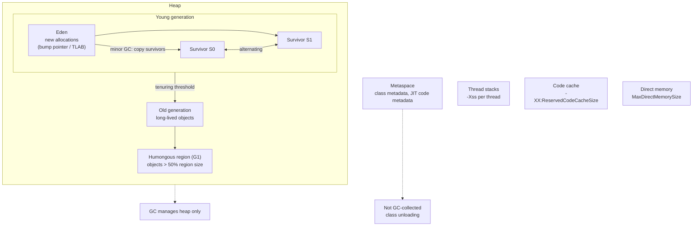
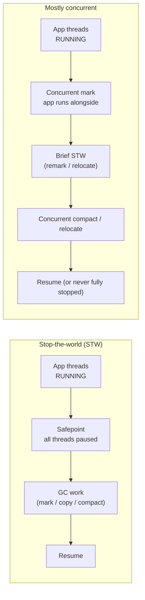
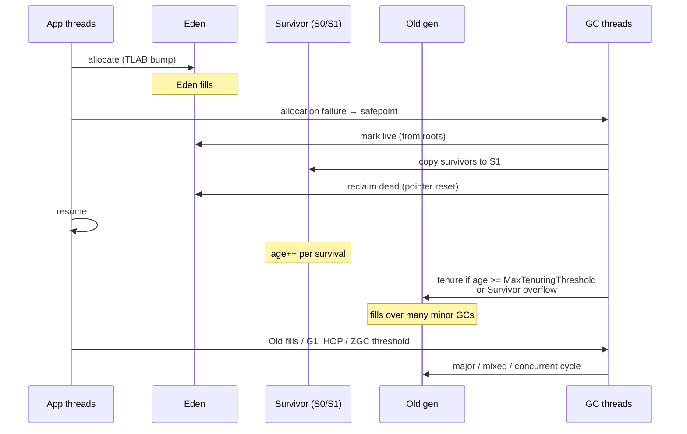
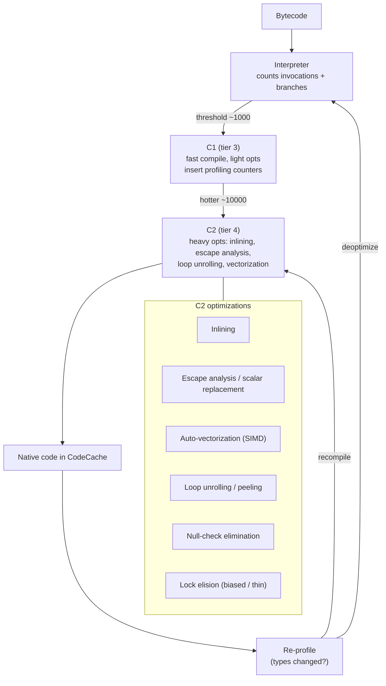

# Chapter 1 — The JVM: Memory, Garbage Collection, and the JIT

**What this chapter covers.** The JVM runs more backend services than any other runtime — from Spring Boot monoliths to Flink stream processors to Cassandra nodes. Yet many teams treat it as a black box: set `-Xmx`, hope for the best, restart when GC pauses spike. This chapter opens the box. You will learn how the JVM lays out memory (heap generations, metaspace, thread stacks, direct buffers), how garbage collectors actually work (G1, Parallel, ZGC, Shenandoah) and how to choose and tune them, and how the JIT compiler turns bytecode into optimized machine code at runtime through tiered compilation, inlining, and escape analysis. Every abstraction is grounded in flags you set, logs you read, and profiles you collect in production.

Learning goals — after this chapter you should be able to:

- Describe the JVM memory layout — heap generations, metaspace, code cache, thread stacks, direct/off-heap memory — and how each relates to OS memory and container limits.
- Explain how marking, copying, and compacting collectors work, and why generational collection exploits the weak generational hypothesis.
- Compare G1, Parallel, ZGC, and Shenandoah on pause goals, throughput, heap-size sweet spots, and operational trade-offs, and choose correctly for latency-sensitive vs. throughput-oriented services.
- Read GC logs, JFR recordings, and `jstat` output to diagnose allocation pressure, promotion failures, humongous objects, and metaspace leaks.
- Explain tiered compilation (interpreter → C1 → C2), inlining, monomorphic/bimorphic dispatch, escape analysis, and deoptimization, and how they interact with warmup and code-cache sizing.
- Tune heap sizing, GC, JIT, and container-aware flags for production services running under cgroups v2 / Kubernetes, with concrete flag sets for 512 MB sidecars through 32 GB stateful nodes.

> **Scope.** This chapter is the JVM you operate. Volume 13, Chapter 4 — Garbage Collection Across Runtimes — zooms out to compare GC theory and algorithms across JVM, Go, .NET, and V8. Chapter 5 — Profiling and Performance Tuning — covers async-profiler, JFR, heap dumps, and flame graphs in depth. Read here for the JVM's own memory/GC/JIT machinery; read Ch 4–5 for cross-runtime and tooling depth.

---

## 1. The JVM as a managed runtime

The JVM is a stack-based virtual machine that executes Java bytecode (and bytecode from Kotlin, Scala, Clojure, Groovy). Unlike ahead-of-time runtimes, it combines interpretation, just-in-time compilation, and managed memory in a single process. Three subsystems dominate backend performance:

1. **Memory management** — allocation, reclamation, and layout.
2. **Garbage collection** — when and how unreachable objects are reclaimed.
3. **Just-in-time compilation** — how hot code is optimized after profiling.



The JVM process is a single OS process with many threads sharing one heap. There is no per-request isolation — a pathological allocation in one handler pressures GC for every thread. Understanding shared heap dynamics is prerequisite to sizing, tuning, and debugging.

### The process and its threads

```
JVM process (PID 1 in container)
├── Main thread + application threads (N)
├── GC threads (ParallelGCThreads, ConcGCThreads)
├── JIT compiler threads (C1/C2)
├── VM thread (safepoints, deoptimization)
├── JFR / JMX / Signal threads
└── Shared heap + metaspace + code cache
```

Key implication: the JVM needs headroom above the heap for non-heap memory. Setting `-Xmx` equal to the container limit guarantees OOM kills. A working rule is `heap ≤ 60–75%` of container limit (more conservative for small containers), with the remainder for metaspace, stacks, code cache, direct buffers, and GC bookkeeping.

---

## 2. Memory layout

### Heap generations

The generational heap exploits the *weak generational hypothesis*: most objects die young. New objects allocate in Eden; survivors are copied to Survivor spaces and then tenured to Old. This lets the collector scan only a small young generation most of the time.



**TLAB (Thread-Local Allocation Buffer).** To avoid atomic increments on every `new`, each thread reserves a small Eden slice and bumps a pointer locally. TLAB allocation is ~10 instructions. When a TLAB fills, the thread requests a new one. TLAB sizing is adaptive (`-XX:TLABSize`, `-XX:+PrintTLAB`); undersized TLABs cause contention on the Eden lock, visible in allocation profiling.

**G1 regions.** G1 divides the heap into ~2048 equal regions (1–32 MB each, power of two). Regions are tagged Eden/Survivor/Old/Humongous and collected as sets. There is no fixed Young/Old boundary — G1 adapts it (`-XX:G1NewSizePercent`, `-XX:G1MaxNewSizePercent`, `-XX:MaxGCPauseMillis`).

**Compressed oops and compressed class pointers.** On 64-bit JVMs, object references compress to 32 bits when heap < ~32 GB (`UseCompressedOops`, `UseCompressedClassPointers`), saving ~20–30% heap. Above ~32 GB, oops widen and memory footprint jumps — the classic reason to size heaps at 26–30 GB rather than 32–36 GB.

### Non-heap memory

| Area | Flag | What lives there | Failure mode |
|---|---|---|---|
| Metaspace | `MetaspaceSize`, `MaxMetaspaceSize` | Class metadata, constant pools | `OutOfMemoryError: Metaspace` — classloader leak |
| Compressed class space | `CompressedClassSpaceSize` (1 GB default) | Klass structures | Same as metaspace |
| Code cache | `ReservedCodeCacheSize` (240 MB default) | JIT-compiled native code | `CodeCache is full` — stops JIT, falls back to interpreter |
| Thread stacks | `ThreadStackSize` / `-Xss` (1 MB default) | Per-thread stacks | `StackOverflowError` or OOM spawning threads |
| Direct memory | `MaxDirectMemorySize` | `ByteBuffer.allocateDirect`, Netty | `OutOfMemoryError: Direct buffer memory` |
| GC bookkeeping | — | Card tables, remembered sets, marking bitmaps | Overhead ~5–10% of heap |

On Java 8, PermGen (fixed, GC-collected) became Metaspace (native memory, grows until capped) — the single most common migration surprise: services that ran fine on 8 OOM on 11+ because `MaxMetaspaceSize` was unset and a classloader leak consumed container memory.

### Native memory tracking

```bash
# Show NMT breakdown (requires -XX:NativeMemoryTracking=summary and jcmd NMT)
java -XX:NativeMemoryTracking=summary -jar app.jar &
jcmd <pid> VM.native_memory summary

# Output (abridged)
# Total: reserved=3212MB, committed=1876MB
# -                 Java Heap (reserved=2048MB, committed=2048MB)
# -                     Class (reserved=1129MB, committed=89MB)
# -                    Thread (reserved=61MB, committed=61MB)
# -                      Code (reserved=250MB, committed=38MB)
# -                        GC (reserved=78MB, committed=78MB)
# -                  Internal (reserved=4MB, committed=4MB)
# -                    Symbol (reserved=21MB, committed=21MB)
# -    Native Memory Tracking (reserved=8MB, committed=8MB)
```

```bash
# RSS vs heap — always check both
ps -o pid,rss,vsz,cmd -p <pid>
cat /sys/fs/cgroup/memory.current  # cgroup usage (container)
cat /sys/fs/cgroup/memory.max
```

---

## 3. Garbage collection — how it works

All JVM collectors trace reachability from GC roots (thread stacks, statics, JNI handles). Unreachable objects are reclaimed. The differences are *when* tracing happens (stop-the-world vs. concurrent), *how* live objects are handled (copy, compact, sweep), and what pauses result.



**Safepoints.** STW pauses require all threads to reach a safepoint (method call, loop back-edge, safepoint poll). Long non-safepoint loops (e.g., counted loops without safepoint polls before JDK 10) could delay GC — fixed by loop strip mining and `GuaranteedSafepointInterval`.

### Generational collection cycle



### Collector comparison

| Collector | Flag | Young | Old | Pause character | Heap sweet spot | Throughput |
|---|---|---|---|---|---|---|
| Parallel GC | `UseParallelGC` | STW parallel copy | STW parallel compact | 100 ms – seconds | < 8 GB batch jobs | Highest |
| G1 | `UseG1GC` (default since 9) | STW parallel copy | Concurrent mark + STW mixed evac | ~10–200 ms tunable | 4–32 GB general purpose | High |
| ZGC | `UseZGC` | Concurrent | Concurrent (colored pointers + load barriers) | < 1–10 ms | 8 GB – 16 TB | Slightly lower |
| Shenandoah | `UseShenandoahGC` | Concurrent | Concurrent (Brooks pointers) | < 10 ms | 4–100 GB | Slightly lower |
| Serial | `UseSerialGC` | STW single-thread | STW single-thread | Seconds | Tiny / single-core | — |
| Epsilon | `UseEpsilonGC` | No-op (no reclamation) | — | No GC | Testing / short-lived | — |

**G1** is the default and correct choice for most backend services. It meets pause goals by evacuating only a subset of regions per pause (`GCPauseInterval`, `G1HeapRegionSize`). Its failure mode is *evacuation failure / Full GC* when allocation outpaces reclamation — visible as `Evacuation Failure` and `Full GC` in logs.

**ZGC and Shenandoah** are sub-10 ms collectors for latency-sensitive services (p99 < 50 ms SLOs, trading, real-time bidding). ZGC uses colored pointers and load barriers; Shenandoah uses Brooks forwarding pointers. Both need JDK 17+ for production maturity and add ~5–15% CPU overhead for barriers. Since JDK 21, ZGC is generational (`-XX:+ZGenerational`), dramatically reducing its overhead for typical web workloads.

**Parallel GC** still wins for pure throughput — ETL, batch scoring, offline compaction — where pauses under a second are acceptable and every percent of CPU matters.

### Reading GC logs

Unified logging (JDK 9+, `-Xlog:gc*`) replaced `-XX:+PrintGCDetails`.

```bash
# Production GC logging — single file, rolling, with safepoint + heap details
java \
  -Xlog:gc*,gc+phases=debug,gc+heap=debug,safepoint:file=/var/log/app/gc.log:time,uptime,level,tags:filecount=10,filesize=20M \
  -Xlog:gc+ergo*=debug:file=/var/log/app/gc-ergo.log:time,uptime:filecount=5,filesize=20M \
  -jar app.jar
```

```
[2026-08-20T14:02:11.234+0000][gc,start] GC(1234) Pause Young (Normal) (G1 Evacuation Pause)
[2026-08-20T14:02:11.235+0000][gc,heap]   GC(1234) Eden: 1200M(1200M)->0B(1156M) Survivors: 32M->48M Heap: 1840M(4096M)->692M(4096M)
[2026-08-20T14:02:11.245+0000][gc         ] GC(1234) Pause Young (Normal) 11.2ms
[2026-08-20T14:02:11.890+0000][gc,start] GC(1235) Pause Young (Concurrent Start) (G1 Humongous Allocation)
[2026-08-20T14:02:11.891+0000][gc,marking] GC(1235) Concurrent Cycle
[2026-08-20T14:02:12.034+0000][gc,heap]   GC(1235) Concurrent Mark 143ms
```

What to look for:

- **Frequency and pause time** — `Pause Young` every N seconds, duration. Healthy web service: young GC every few seconds, < 50 ms.
- **Humongous allocations** — `G1 Humongous Allocation` triggers concurrent cycles. Caused by objects > 50% region size (large byte arrays, Netty buffers). Fix: increase `-XX:G1HeapRegionSize` or avoid huge allocations.
- **Evacuation Failure / Full GC** — heap too small or promotion rate too high. Increase heap or reduce allocation rate.
- **Metaspace growth** — `Metaspace ... used 120M, committed 128M` growing without bound → classloader leak.
- **Allocation stall** — `Allocation Stall` in ZGC/Shenandoah means mutator is blocked waiting for GC — heap too small or load too high.

```bash
# Quick GC stats without parsing logs
jstat -gc -t <pid> 1s 10
#  Timestamp  S0C    S1C    S0U    S1U      EC       EU        OC         OU       MC     MU    CCSC   CCSU   YGC     YGCT    FGC    FGCT     GCT
#     1234.5  0.0   28672.0  0.0  28672.0 1179648.0  234567.0  891234.0   456789.0  98600.0 91234.0 12800.0 11234.0   234    2.456     2    0.890    3.346

# G1 region view
jstat -gc -t <pid> | awk '{print "Heap:", $8+$10, "Young:", $6, "Old:", $10}'
```

---

## 4. The JIT compiler

Bytecode is portable but slow. The JIT compiles hot methods to native code after profiling, with optimizations that an AOT compiler cannot do because they depend on runtime behavior.

### Tiered compilation



Default on 64-bit server JVM: tiered compilation (`-XX:+TieredCompilation`), 5 levels. `-XX:TieredStopAtLevel=1` disables C2 (faster startup, slower peak — useful for short-lived CLI / Lambda).

**Inlining** is the most impactful optimization — it enables most others. C2 inlines up to `-XX:MaxInlineSize=35` and `-XX:FreqInlineSize=325` bytecodes, bounded by `MaxInlineLevel`. Virtual calls that are monomorphic (one receiver type observed) inline with a guard; bimorphic inline with two guards; megamorphic stays virtual (and slow). *Small methods win* — keep hot paths in small, final or effectively-final methods.

**Escape analysis** eliminates allocations when an object does not escape its thread/method. A `new Point(x,y)` that is consumed locally may be scalar-replaced into registers — zero GC pressure. Enabled by `-XX:+DoEscapeAnalysis` (default). Visible in JFR allocation samples: fewer TLAB allocations after warmup.

**Deoptimization** is the JIT's safety net. When an assumption breaks (new class loaded that changes hierarchy, monomorphic call becomes bimorphic, uncommon trap fires), C2 code deoptimizes back to interpreter and may recompile. Frequent deoptimization (`-XX:+TraceDeoptimization`) signals unstable type profiles — often from reflection-heavy or highly polymorphic code.

### Warmup and code cache

```bash
# Print compilation activity
java -XX:+PrintCompilation -XX:+UnlockDiagnosticVMOptions -XX:+PrintInlining -jar app.jar 2>&1 | head -40
#     123  4  java.util.HashMap::get (162 bytes)  inline (hot)
#     124  4  com.example.Handler::handle (87 bytes)  inline (hot)
#     135  s  4  com.example.Cache::get (45 bytes)  deoptimized (reason: class_check)

# Code cache usage
jcmd <pid> Compiler.codecache
# CodeCache: size=245760Kb used=42345Kb max_used=45678Kb free=203414Kb

# JFR: record JIT + GC + allocation
java -XX:StartFlightRecording=duration=60s,filename=app.jfr,settings=profile -jar app.jar
jfr print --events Compilation app.jfr | head -40
```

For services behind load balancers, **warmup matters**: a freshly started pod runs interpreted/C1 code for seconds to minutes, with higher latency and CPU. Strategies:

- **Warmup traffic** — send synthetic requests before adding to pool (Kubernetes `startupProbe` + readiness gate).
- **AppCDS / Class Data Sharing** (`-XX:+UseSharedSpaces`, `-Xshare:on`) and **CRaC** (Coordinated Restore at Checkpoint) to snapshot warmed state.
- **GraalVM Native Image** or **Leyden** (Project Leyden, early access) for instant startup when warmup is unacceptable.
- **Tiered stop** — `-XX:TieredStopAtLevel=1` for short-lived jobs where C2 never pays back.

---

## 5. Tuning for production

### Heap sizing under cgroups

Since JDK 10 (`UseContainerSupport`, on by default), the JVM reads cgroup limits automatically. Before that, it saw host RAM and sized heap to 1/4 of host — catastrophic in containers. Still verify:

```bash
# What the JVM thinks the container limit is
java -XshowSettings:system -version 2>&1 | grep -i -E "memory|container|cgroup"
# Memory Limit ... 2048M (from cgroup)

# Explicit sizing — prefer MaxRAMPercentage over fixed -Xmx in containers
java \
  -XX:MaxRAMPercentage=70.0 \
  -XX:InitialRAMPercentage=70.0 \
  -XX:MinRAMPercentage=50.0 \
  -jar app.jar

# Equivalent fixed (less portable)
java -Xms1g -Xmx1400m -jar app.jar
```

Kubernetes manifest with matching limits:

```yaml
resources:
  requests:
    memory: "2Gi"
    cpu: "1000m"
  limits:
    memory: "2Gi"      # JVM sees this via cgroups v2
    cpu: "2000m"       # CFS quota; JVM uses it for GC/JIT thread counts
```

**Container-aware defaults to check:**

| Flag | What it does | Default | When to override |
|---|---|---|---|
| `UseContainerSupport` | Read cgroup limits | `true` (JDK 10+) | Never disable |
| `ActiveProcessorCount` | Override CPU count for thread pools | cgroup cpu quota | Set explicitly when quota < request |
| `ParallelGCThreads` | GC parallelism | `5/8 * ncpu` | Cap on large machines to reduce jitter |
| `ConcGCThreads` | Concurrent GC threads | `1/4 * ParallelGCThreads` | Lower if GC steals too much app CPU |
| `G1ConcRefinementThreads` | Remembered-set refinement | Ergonomic | Raise if `G1 Update RS` pauses are high |

### GC tuning recipes

**G1 — general-purpose web service (4–16 GB heap):**

```bash
java \
  -XX:+UseG1GC \
  -XX:MaxGCPauseMillis=100 \
  -XX:G1HeapRegionSize=4m \
  -XX:ConcGCThreads=2 \
  -XX:ParallelGCThreads=8 \
  -XX:+ParallelRefProcEnabled \
  -XX:+ExplicitGCInvokesConcurrent \
  -Xlog:gc*,safepoint:file=/var/log/app/gc.log:time,uptime:filecount=10,filesize=20M \
  -jar app.jar
```

- `MaxGCPauseMillis` is a *goal*, not a guarantee — G1 trades throughput for pause.
- Avoid `System.gc()` — it triggers Full GC unless `ExplicitGCInvokesConcurrent` is set.
- Large `byte[]` / `ByteBuffer` workloads: bump `G1HeapRegionSize` to 8–16 MB to reduce humongous allocations.

**ZGC — p99-optimized service (JDK 21, 8+ GB heap):**

```bash
java \
  -XX:+UseZGC --enable-preview -XX:+ZGenerational \
  -XX:MaxGCPauseMillis=10 \
  -XX:+ZUncommit \
  -Xlog:gc*:file=/var/log/app/gc.log:time,uptime:filecount=10,filesize=20M \
  -jar app.jar
```

- Requires enough headroom — ZGC needs ~15–20% free heap to relocate concurrently; size heap larger than G1 equivalent.
- Check `Allocation Stall` in logs — if present, heap is too tight or allocation rate too high.
- Generational ZGC (JDK 21+) is strictly better for most workloads than legacy single-gen ZGC.

**Parallel GC — batch/ETL (throughput, pauses OK):**

```bash
java \
  -XX:+UseParallelGC \
  -XX:+UseAdaptiveSizePolicy \
  -XX:GCTimeRatio=99 \
  -XX:MaxGCPauseMillis=500 \
  -jar app.jar
```

### JIT and other flags

```bash
# Code cache — raise for large apps (especially Scala/Kotlin with many classes)
-XX:ReservedCodeCacheSize=512m -XX:InitialCodeCacheSize=64m

# Inline limits — rarely needed, but for micro-optimization of hot paths
-XX:MaxInlineSize=50 -XX:FreqInlineSize=400

# String deduplication (G1 only) — saves heap for string-heavy services
-XX:+UseStringDeduplication

# Class data sharing — faster startup
-Xshare:on -XX:SharedArchiveFile=/opt/app/app.jsa

# Flight Recorder — always on in production (overhead < 1%)
-XX:StartFlightRecording=disk=true,maxsize=200M,dumponexit=true,filename=/var/log/app/app.jfr,settings=profile
-XX:FlightRecorderOptions=maxchunksize=12M
```

### Allocation pressure — the real killer

Most GC problems are allocation problems. A service allocating 2 GB/s will GC constantly regardless of collector.

```java
// Before — allocates on every request (300 bytes + char[] per call)
String handle(String id) {
    return "user:" + id.toLowerCase() + ":" + System.currentTimeMillis();
}

// After — reuses, avoids allocation in hot path (when caller allows)
void handle(String id, StringBuilder out) {
    out.setLength(0);
    out.append("user:").append(id.toLowerCase()).append(':').append(System.currentTimeMillis());
}
```

Find allocation hotspots:

```bash
# JFR allocation profiling (no Safepoint bias, unlike heap dumps)
jcmd <pid> JFR.start name=alloc settings=profile duration=60s filename=/tmp/alloc.jfr
jfr print --events jdk.ObjectAllocationInNewTLAB /tmp/alloc.jfr | head -60

# async-profiler — alloc flame graph
./profiler.sh -e alloc -d 30 -f /tmp/alloc.svg <pid>
```

---

## 6. Tooling cheat sheet

```bash
# Heap summary
jcmd <pid> GC.heap_info
jmap -heap <pid>                 # older, same info

# Heap histogram (live objects only — triggers Full GC)
jcmd <pid> GC.class_histogram
jmap -histo:live <pid> | head -40

# Heap dump (grows large — pipe to object storage)
jcmd <pid> GC.heap_dump /tmp/heap.hprof
jmap -dump:live,format=b,file=/tmp/heap.hprof <pid>

# Thread + safepoint + classloader
jcmd <pid> Thread.print
jcmd <pid> VM.info
jcmd <pid> GC.class_stats        # per-class metaspace cost (diagnostic)

# Flight Recorder
jcmd <pid> JFR.start duration=60s filename=/tmp/app.jfr settings=profile
jcmd <pid> JFR.dump filename=/tmp/app2.jfr
jcmd <pid> JFR.stop

# Native memory
jcmd <pid> VM.native_memory detail

# Compiler
jcmd <pid> Compiler.codecache
jcmd <pid> Compiler.codelist
-XX:+PrintCompilation -XX:+PrintInlining  # at startup
```

---

## 7. The distributed-systems lens

The JVM's shared-heap, stop-the-world heritage shapes how you deploy and operate fleets:

- **Noisy neighbors on the heap.** One endpoint that allocates heavily (large JSON parsing, un-bounded batch fetch) triggers GC pauses that stall *all* endpoints on that pod. Isolate allocation-heavy paths: stream parsing (`Jackson Streaming`, `JsonParser`), bounded result sets, off-heap buffers for large payloads, and separate deployments for batch vs. serving.
- **Tail latency amplification.** A 50 ms GC pause on one replica becomes p99 when fan-out queries hit many replicas (`p99_single^fanout`). Prefer ZGC/Shenandoah for fan-out services, and hedge requests (send to two replicas, use first response) when GC pauses cannot be eliminated.
- **Warmup and rolling deploys.** Fresh pods are slower until JIT warms. Rolling deploys that replace all pods at once create a fleet-wide warmup dip. Use gradual rollouts, warmup probes, and `minReadySeconds` / `maxSurge` to keep warm capacity. CRaC or CDS snapshots eliminate most warmup when sub-second startup matters (scale-to-zero, autoscaling).
- **Heap sizing vs. density.** Larger heaps reduce GC frequency but increase pause work and heap-dump cost. Smaller heaps GC more often but fail faster and restart faster. For Kubernetes, prefer *more pods with smaller heaps* (2–4 GB) over few large-heap pods, except for stateful stores (Cassandra, Elasticsearch) where data locality demands large heaps and ZGC/Shenandoah.
- **Observability contract.** Every JVM service should emit: GC pause histogram (via JMX `GarbageCollectorMXBean` or Micrometer `jvm_gc_pause_seconds`), heap after GC (`jvm_memory_used_bytes`), allocation rate (`jvm_gc_allocation_rate` or JFR), and JFR on demand. Alert on `Full GC` count, `Evacuation Failure`, and metaspace growth — the three precursors to OOM kills.

---

## Key takeaways

- The JVM heap is generational (Eden/Survivor/Old) with TLAB-bumped allocation; non-heap memory (metaspace, code cache, stacks, direct buffers) must fit within the container limit alongside the heap — size heap to 60–75% of cgroup limit.
- G1 is the default and right for most services; ZGC/Shenandoah trade ~5–15% CPU for < 10 ms pauses on large heaps; Parallel wins for pure throughput batch jobs.
- Most GC trouble is allocation trouble — profile allocation rate with JFR/async-profiler and reduce it before tuning collector flags.
- Tiered compilation (interpreter → C1 → C2) plus inlining and escape analysis drive peak performance; warmup is real — gate traffic until JIT stabilizes, and consider CDS/CRaC for fast startup.
- Container-aware flags (`UseContainerSupport`, `MaxRAMPercentage`, `ActiveProcessorCount`) are mandatory; verify with `-XshowSettings:system` and never set `-Xmx` equal to the container limit.
- Unified GC logging (`-Xlog:gc*`), `jstat`, `jcmd`, and always-on JFR are the production observability baseline — alert on Full GC, evacuation failures, allocation stalls, and metaspace growth.

## Further reading

- *Java Performance* (2nd ed., Scott Oaks, O'Reilly) — definitive tuning guide through JDK 17.
- *Optimizing Java* (Evans, Gough, Newland, O'Reilly) — JIT, GC, and concurrency internals.
- OpenJDK Wiki: HotSpot GC — https://wiki.openjdk.org/display/HotSpot/Garbage+Collector
- JEP 376: ZGC on macOS/Linux, JEP 426: ZGC Generational, JEP 439: Generational ZGC — https://openjdk.org/jeps/
- *Understanding Java Garbage Collection* (Oracle) — https://docs.oracle.com/en/java/javase/21/gctuning/
- JFR Runtime Guide — https://docs.oracle.com/en/java/javase/21/jfr/
- *Java Performance Companion* — async-profiler docs: https://github.com/async-profiler/async-profiler
- Shipilev, *JVM Anatomy Quarks* — https://shipilev.net/jvm/anatomy/ (TLABs, safepoints, compressed oops, biased locking)
