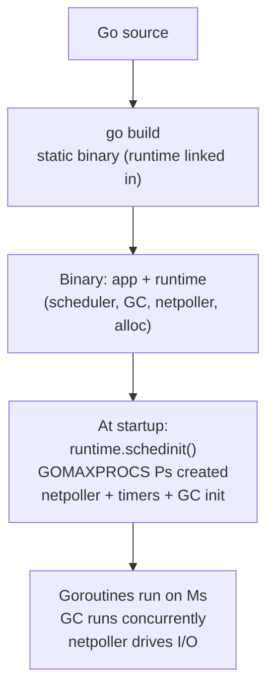
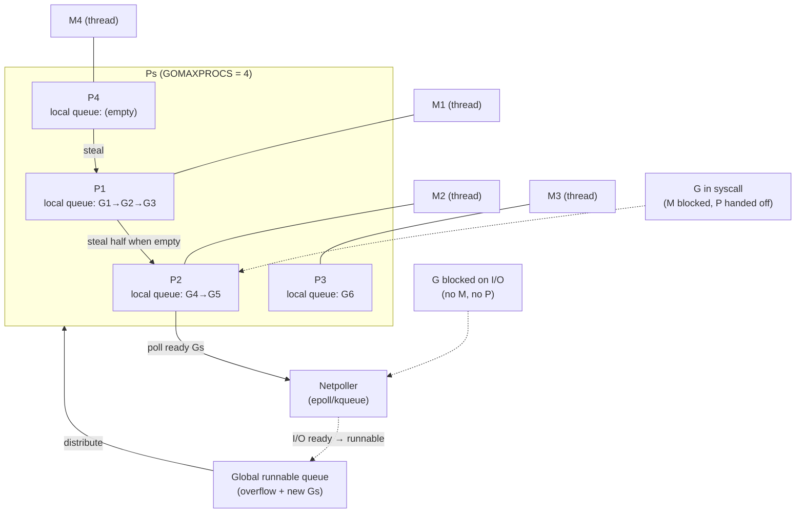
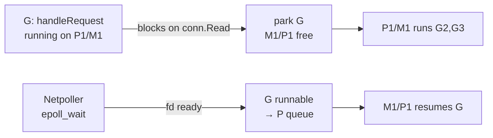
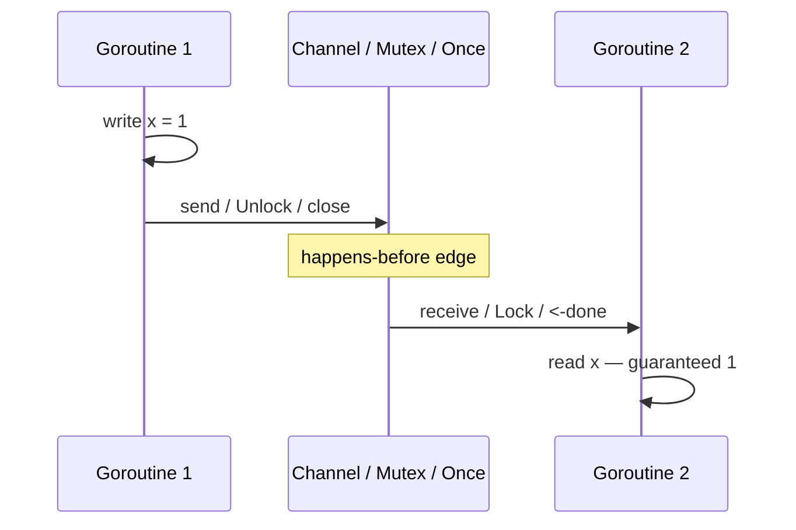
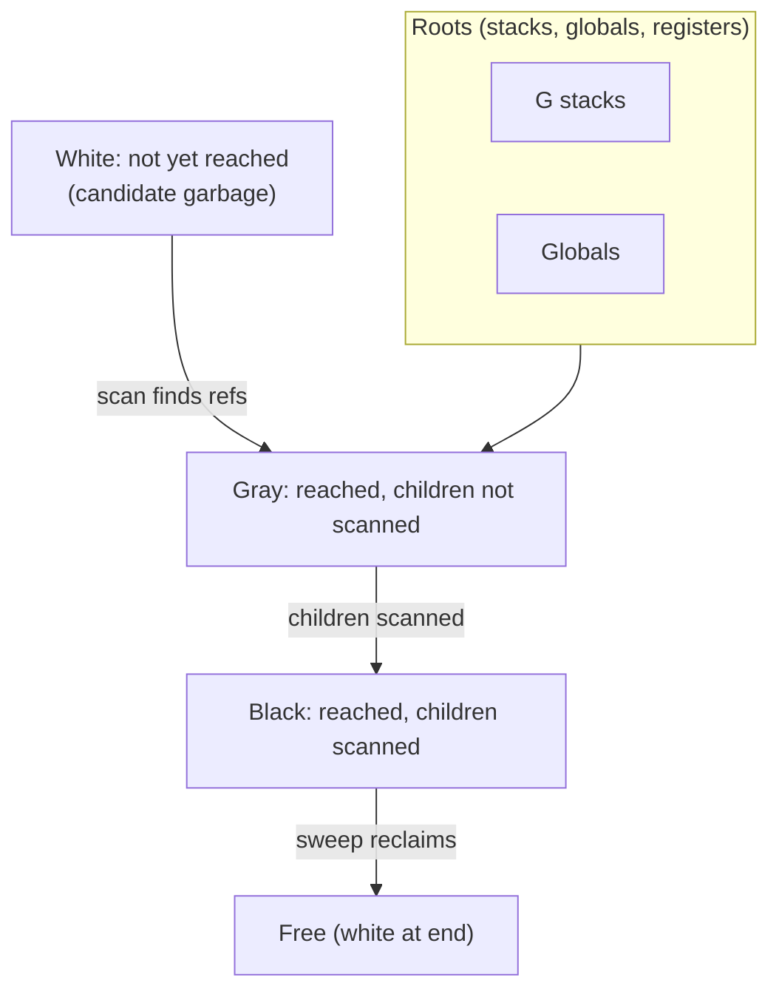
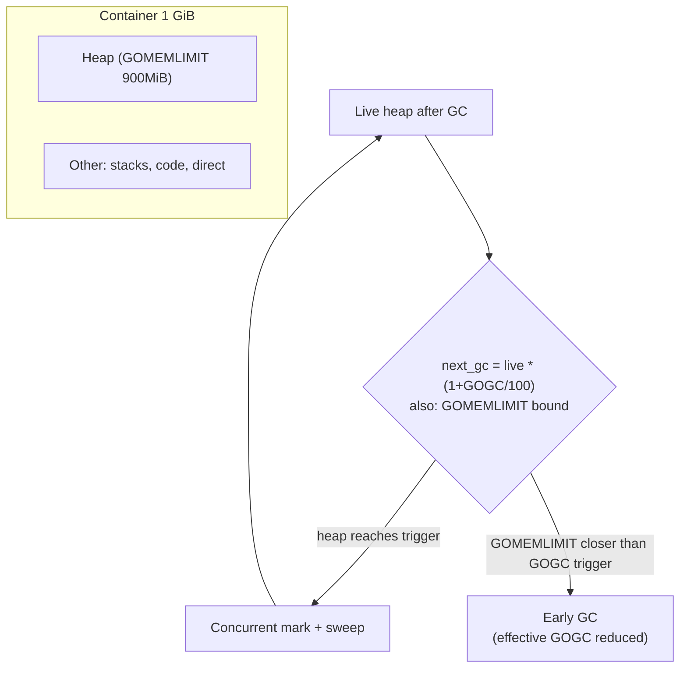

# Chapter 2 — The Go Runtime: Scheduler, Memory Model, and GC

**What this chapter covers.** Go powers a huge share of backend infrastructure — Kubernetes, etcd, Prometheus, Docker, CockroachDB, and countless microservices — because its runtime was designed for concurrent network services from day one. Yet its simplicity is deceptive: goroutines are not threads, the scheduler is not the OS scheduler, the memory model is not sequential consistency, and the GC is not stop-the-world. Misunderstanding any of these leads to subtle bugs: goroutine leaks that OOM a pod, data races that only reproduce under load, STW pauses blamed on "GC" that are actually scheduler stalls, and `GOMAXPROCS` set wrong in containers. This chapter explains the runtime you actually run in production — the M:N scheduler (G/M/P), the memory model and `sync` primitives, and the concurrent tri-color GC — with traces you capture and flags you set.

Learning goals — after this chapter you should be able to:

- Explain the G/M/P scheduler — what G, M, and P are, how work-stealing and netpoller interaction work, and why goroutines are cheap (2–8 KB stacks, segmented vs. contiguous).
- Diagnose scheduler stalls: capture `trace` and `pprof`, read `GODEBUG=schedtrace`, and identify long-running goroutines that starve the scheduler (preemption since Go 1.14, loop vs. function-call preemption).
- State Go's memory model precisely — happens-before, channel and `sync` synchronization edges — and use the race detector (`-race`) and `go vet` effectively.
- Explain the tri-color concurrent GC: pacing, assists, `GOGC`/`GOMEMLIMIT`, STW phases, and how to tune for latency vs. throughput with real `GODEBUG=gctrace` output.
- Size `GOMAXPROCS` correctly in cgroup-limited containers (Kubernetes) and choose `GOMEMLIMIT` to cooperate with container memory limits.
- Avoid goroutine leaks, timer leaks, and allocation hotspots using `pprof` (heap, goroutine, mutex, block) and `trace`.

> **Scope.** This chapter is the Go runtime you operate. Volume 13, Chapter 4 — Garbage Collection Across Runtimes — compares GC algorithms across JVM, Go, and others at the theory level. Chapter 5 — Profiling and Performance Tuning — covers `pprof`, `trace`, and flame graphs across runtimes. Read here for Go's own scheduler/memory/GC machinery; read Ch 4–5 for cross-runtime and tooling depth.

---

## 1. Why Go's runtime is different

Most languages delegate threading and memory to the OS and a library. Go bundles a full runtime into every binary: scheduler, GC, netpoller, timers, and memory allocator. The binary is statically linked and self-contained — no JVM, no interpreter, no external GC process. This has three consequences for backend services:

1. **Concurrency is cheap.** Spawning a goroutine costs microseconds and kilobytes, so services use thousands of concurrent goroutines per pod where a Java service would use a thread pool of tens.
2. **Scheduling is cooperative + preemptive.** The runtime multiplexes goroutines onto OS threads, with its own run queues and work stealing — distinct from `pthreads` or `tokio`.
3. **GC is concurrent and low-pause.** Since Go 1.8 the collector is mostly concurrent; STW pauses are typically < 1 ms, but allocation rate and `GOGC` still shape latency and CPU.



The runtime version is pinned at compile time (`go version -m ./app`, `runtime.Version()`). Upgrading Go *is* upgrading the runtime — GC pacing, scheduler preemption, and `GOMEMLIMIT` behavior change across versions (notably 1.18+ for `GOMEMLIMIT`, 1.14 for async preemption, 1.21 for new timer implementation).

---

## 2. The scheduler — G, M, P

### The model

Go uses an M:N scheduler: M goroutines multiplexed onto N OS threads. Three structures make it work:

- **G (goroutine)** — a user-space coroutine: stack (2–8 KB, grows/shrinks), program counter, and state (`runnable`, `running`, `waiting`, `syscall`).
- **M (machine)** — an OS thread that executes Gs. Created on demand up to `GOMAXPROCS` for CPU-bound work plus extras for blocking syscalls.
- **P (processor)** — a scheduling context: run queue, cache for allocation (mcache), and GC state. Count = `GOMAXPROCS`. A G must hold a P to run user code.



**How scheduling happens:**

1. Each P has a local run queue (lock-free, 256 entries). `go f()` pushes to local queue; `GOMAXPROCS` local queues reduce contention vs. one global queue.
2. An M running a P pops from local queue; if empty, it steals half from another P's queue (work stealing), then checks the global queue, then the netpoller.
3. Blocking I/O (net, timers) parks the G on the netpoller without holding an M or P — the M/P immediately runs another G. When I/O is ready, the netpoller marks the G runnable.
4. Blocking syscalls (file I/O, cgo) block the M; the P is handed to another M so CPU-bound Gs keep running. This is why `GOMAXPROCS` limits *Ps*, not *Ms* — Ms can exceed Ps during syscall storms.

**Goroutine stacks.** Since Go 1.4, stacks are contiguous and grow by copying (not segmented). Start 2–8 KB (platform-dependent, 8 KB on linux/amd64), grow by doubling when `morestack` fires, shrink when usage drops to 1/4. Stack growth copies and adjusts pointers — mostly invisible, but visible in profiles as `runtime.morestack` and `runtime.copystack`.

### Preemption and starvation

Before Go 1.14, preemption was cooperative — only at function calls. A tight loop with no calls could starve the scheduler for milliseconds, stalling GC and other goroutines. Since Go 1.14, **async preemption** uses signals (`SIGURG`) to preempt at any safepoint (loop back-edges included). This fixed the classic `for { x++ }` starvation, but long CGO calls and tight assembly loops can still block a P.

```go
// Before Go 1.14 — this starved the scheduler (no function call to preempt)
func spin() {
    for {
        x++ // no call → no preemption → GC stall
    }
}

// Still problematic — CGO blocks the M; P is handed off but M is stuck
func cgoSpin() {
    C.long_running_c_function() // blocks M, not preemptible
}
```

**Detecting scheduler latency:**

```bash
# Sched trace — every 10ms, shows runnable Ps, goroutine counts, GC
GODEBUG=schedtrace=1000,scheddetail=1 ./app 2>&1 | head -20
# SCHED 1234ms: gomaxprocs=4 idleprocs=1 threads=7 spinningthreads=0 idlethreads=2 runqueue=0 [1 0 0 2]

# Execution trace — the definitive scheduler view (open in browser or gotraceui)
go test -trace trace.out -run TestHandler
go tool trace trace.out
# Or in production:
# import _ "net/http/pprof" and "runtime/trace"
```

```go
// Capture a 5s execution trace to file
f, _ := os.Create("/tmp/trace.out")
trace.Start(f)
time.Sleep(5 * time.Second)
trace.Stop()
f.Close()
// View: go tool trace /tmp/trace.out  (or upload to https://gotraceui.dev)
```



### `GOMAXPROCS` and containers

`GOMAXPROCS` defaults to host CPU count — wrong in containers where cgroup quota is smaller. Since Go 1.5 you must set it explicitly or use automaxprocs.

```go
// Option 1: uber-go/automaxprocs — reads cgroup quota at startup
import _ "go.uber.org/automaxprocs" // init() sets GOMAXPROCS from cgroup

// Option 2: manual — read cgroup and set
func init() {
    // Kubernetes sets cpu limit as CFS quota; use that
    if n := cgroupCPUCount(); n > 0 {
        runtime.GOMAXPROCS(n)
    }
}

// Option 3: Go 1.21+ — GOMAXPROCS is still host-based, so options 1/2 remain needed
// (proposal for automatic cgroup awareness is still pending as of Go 1.23)
```

```yaml
# Kubernetes — always set cpu limit if you care about GOMAXPROCS
resources:
  requests:
    cpu: "500m"
    memory: "512Mi"
  limits:
    cpu: "2"        # automaxprocs will set GOMAXPROCS=2
    memory: "512Mi"
```

Rule: `GOMAXPROCS` should equal the **CPU limit** (cgroup quota), not the request and not host CPUs. Too high → excess context switching and GC parallelism stealing app CPU. Too low → underutilized cores and higher tail latency.

---

## 3. The memory model

Go's memory model defines when writes in one goroutine become visible to another. Without synchronization, there are **no guarantees** — the compiler and CPU may reorder freely.

### Happens-before

An effect A *happens-before* B if B is guaranteed to see A's writes. Happens-before is established only by explicit synchronization:

| Operation | Happens-before edge |
|---|---|
| `go f()` | `go` statement happens-before first line of `f` |
| Channel send → receive | Send happens-before matching receive completes |
| Channel close | Close happens-before receive that observes closure |
| `sync.Mutex` Lock/Unlock | Unlock happens-before next Lock on same mutex |
| `sync.RWMutex` | Write Unlock happens-before next Read Lock |
| `sync.Once.Do(f)` | `f` happens-before every `Do` return |
| `sync.WaitGroup` | `Add` happens-before `Wait` return when counter reaches 0 |
| `atomic` (via `sync/atomic`) | Atomic write happens-before atomic read that observes it |

```go
// Correct: channel establishes happens-before
var data string
done := make(chan struct{})
go func() {
    data = "hello"          // A
    close(done)             // B: close happens-before receive
}()
<-done
fmt.Println(data)           // C: guaranteed "hello" (B happens-before C)

// WRONG: no happens-before — data race
var data2 string
go func() { data2 = "hello" }()
fmt.Println(data2) // race: no sync between write and read

// Also WRONG: sleep is not synchronization
go func() { data2 = "hello" }()
time.Sleep(10 * time.Millisecond) // "usually works" — still a race
fmt.Println(data2)
```



For anything beyond the table above (e.g., `context.Context` cancellation, `sync.Map` publication), check the package docs for its happens-before guarantees. When in doubt, the race detector is authoritative:

```bash
go test -race ./...            # ~2-10x slower, ~5-10x more memory — CI only
go run -race ./cmd/server      # also works for binaries (dev/staging)
go vet ./...                   # static checks (also: golang.org/x/tools/cmd/vet)
```

The race detector instruments memory accesses at compile time and reports concurrent unsynchronized read+write. It finds real races, not just "maybe" — every report is a bug (though benign races exist, they are still technically wrong and fragile).

### `sync` primitives — when to use what

```go
// sync.Mutex — mutual exclusion (most common)
var mu sync.Mutex
var cache map[string]Item
func Get(k string) (Item, bool) {
    mu.Lock(); defer mu.Unlock()
    v, ok := cache[k]; return v, ok
}

// sync.RWMutex — many readers or one writer (only if reads dominate and critical section is non-trivial)
var rwmu sync.RWMutex // benchmark first — RWMutex is slower than Mutex for short sections

// sync.Once — one-time init (config, singleton)
var (
    cfg  *Config
    once sync.Once
)
func GetConfig() *Config { once.Do(func() { cfg = loadConfig() }); return cfg }

// sync.WaitGroup — wait for N goroutines
var wg sync.WaitGroup
for _, id := range ids {
    wg.Add(1)
    go func(id string) { defer wg.Done(); process(id) }(id)
}
wg.Wait()

// sync.Cond — rare; prefer channels unless you need broadcast
// sync.Pool — object reuse to reduce GC pressure (see GC section)
var bufPool = sync.Pool{New: func() any { return new(bytes.Buffer) }}

// sync/atomic — lock-free counters/flags (use typed wrappers in Go 1.19+: atomic.Int64, atomic.Pointer[T])
var reqs atomic.Int64
reqs.Add(1)
n := reqs.Load()
```

**Channel vs. mutex** is not a moral choice — use what fits the coordination pattern. Channels for *ownership transfer and signaling* ("here's work", "I'm done"); mutexes for *protecting shared state* ("this map is shared"). The Go proverb "share memory by communicating" means channels are often clearer for pipeline/worker patterns, not that mutexes are wrong.

---

## 4. Garbage collection

Go's GC is a **concurrent, tri-color, mark-sweep collector** with a concurrent mark phase and brief STW pauses for stack scanning and mark termination. It prioritizes low latency (< 1 ms STW) over throughput.

### Tri-color marking



1. **Mark setup (STW, ~10–100 µs):** stop-the-world to enable write barriers and scan stacks.
2. **Concurrent mark:** GC workers (25% of `GOMAXPROCS` by default) traverse the heap concurrently with mutators. Write barriers (`hybrid barrier` since 1.18) ensure no live object is lost when mutators mutate concurrently.
3. **Mark termination (STW, ~10–100 µs):** second STW to finish marking and flush buffers.
4. **Concurrent sweep:** reclaim white objects and return memory to allocator (proportional sweep by mutators + background sweeper).

Mutators run during concurrent mark — no long pause even on 100 GB heaps. But they pay a cost: **write barriers** and **GC assists**. When allocation outpaces marking, mutators are throttled to help mark (assist), which shows as higher CPU in `pprof` under `gcBgMarkWorker`.

### Pacing — `GOGC` and `GOMEMLIMIT`

GC pacing answers: *when to start the next cycle?* Go triggers GC when heap has grown by `GOGC` percent over live heap after last GC. Default `GOGC=100` means heap doubles before next GC.

```
next_gc = live_heap * (1 + GOGC/100)
Example: live 200 MB, GOGC=100 → next GC at 400 MB (200 MB headroom)
         live 200 MB, GOGC=50  → next GC at 300 MB (more frequent, lower peak)
         live 200 MB, GOGC=200 → next GC at 600 MB (less frequent, higher peak)
```

```bash
# Default — heap doubles
GOGC=100 ./app

# Lower GOGC — more frequent GC, lower peak heap, more CPU
GOGC=50 ./app

# Higher GOGC — less CPU, higher peak (good for batch)
GOGC=200 ./app

# Off — rely solely on GOMEMLIMIT (Go 1.19+)
GOGC=off GOMEMLIMIT=800MiB ./app
```

**`GOMEMLIMIT` (Go 1.19+)** is a soft memory limit the GC respects. When heap approaches `GOMEMLIMIT`, GC runs more aggressively (effective `GOGC` drops dynamically). It is the correct way to make Go cooperate with container limits — set it to ~80–90% of container limit so GC keeps heap under the cgroup OOM threshold.

```bash
# Container 1 GiB — tell Go to keep heap under ~900 MiB
GOMEMLIMIT=900MiB GOGC=100 ./app

# Kubernetes — set via env from downward API or operator
env:
  - name: GOMEMLIMIT
    value: "900MiB"   # ~90% of 1Gi limit
  - name: GOGC
    value: "100"
```



**Reading GC behavior:**

```bash
# GODEBUG=gctrace — one line per GC
GODEBUG=gctrace=1 ./app 2>&1 | head -20
# gc 5 @0.234s 0%: 0.021+0.45+0.012 ms clock, 0.084+0.12+0.00 ms cpu, 4->4->1 MB, 5 MB goal, 8 MB limit, 4 P
#   │  │       │         │                  │                │  │  │     │         │
#   │  │       │         │ STW phases       │ CPU breakdown  │ heap before→after→live  goal from GOGC  limit from GOMEMLIMIT

# Also: GOMEMLIMIT debug
GODEBUG=gctrace=1,gomemlimit=1 ./app 2>&1 | grep -i "memlimit\|goal"

# pprof heap — where allocations come from
go tool pprof -http=:8080 http://localhost:6060/debug/pprof/heap
go tool pprof http://localhost:6060/debug/pprof/heap  # or local file
# (pprof) top 20
# (pprof) list handleRequest
# (pprof) alloc_space  # total allocated (pressure), vs inuse_space (live)
```

### Allocation and `sync.Pool`

Go's allocator uses size classes and per-P caches (mcache) similar to tcmalloc — small allocations are fast and mostly contention-free. Allocation pressure still drives GC frequency, so hot paths should reduce allocations:

```go
// Hot handler — avoid per-request allocations where possible
var bufPool = sync.Pool{
    New: func() any { return new(bytes.Buffer) },
}

func handle(w http.ResponseWriter, r *http.Request) {
    buf := bufPool.Get().(*bytes.Buffer)
    buf.Reset()
    defer bufPool.Put(buf)

    // Use buf instead of allocating new slices/strings per request
    json.NewEncoder(buf).Encode(response)
    w.Write(buf.Bytes())
}

// strings.Builder with pre-sized capacity
var b strings.Builder
b.Grow(256) // avoid growth allocs
b.WriteString("prefix:")
b.WriteString(id)
```

Caution: `sync.Pool` is cleared on every GC — it is a *soft* cache, not a reliable store. Don't put objects there you need to survive GC, and remember pooled objects can hold memory that delays return to OS (`MADV_DONTNEED` happens lazily via `GOMEMLIMIT` or idle scavenging).

---

## 5. Observability — traces and profiles

### Execution trace

The trace captures scheduler, GC, netpoller, and goroutine events at nanosecond resolution. It is the only tool that shows *why* a goroutine was stalled.

```go
// Production: expose via net/http/pprof (add to main.go)
import _ "net/http/pprof"
go func() { log.Println(http.ListenAndServe("localhost:6060", nil)) }()

// Capture trace (5s window around incident)
curl -o /tmp/trace.out "http://localhost:6060/debug/pprof/trace?seconds=5"
go tool trace /tmp/trace.out              // browser UI
// or: gotraceui /tmp/trace.out           // better viewer (github.com/golang/gotraceui)
```

What the trace shows: per-P timelines with goroutine states (runnable/running/blocked on channel/mutex/netpoller/syscall), GC phases, and STW pauses. Look for long *runnable but not running* (scheduler latency — `GOMAXPROCS` too low or long-running goroutine starving P) vs. long *blocked* (I/O, mutex contention, channel).

### `pprof` profiles

```bash
# Heap (live)
curl -o /tmp/heap.pprof http://localhost:6060/debug/pprof/heap
go tool pprof -top /tmp/heap.pprof
go tool pprof -http=:8081 /tmp/heap.pprof   # browser: flame graph, source

# Goroutines (leak detection — count should be stable)
curl http://localhost:6060/debug/pprof/goroutine?debug=1 | head -80
# goroutine profile: total 342  (should be O(10-100), not growing)
#  120 @ runtime.gopark / netpollblock
#   80 @ chan send/recv
#   10 @ sync.Mutex

# Mutex contention (enable first)
import _ "net/http/pprof"
runtime.SetMutexProfileFraction(5) // sample 1 in 5 contentions
curl -o /tmp/mutex.pprof http://localhost:6060/debug/pprof/mutex

# Block profile (channel/mutex wait time)
runtime.SetBlockProfileRate(1000000) // 1 sample per ms of blocking
curl -o /tmp/block.pprof http://localhost:6060/debug/pprof/block

# CPU (30s sample)
curl -o /tmp/cpu.pprof "http://localhost:6060/debug/pprof/profile?seconds=30"
go tool pprof -http=:8081 /tmp/cpu.pprof

# Allocs (total allocated — GC pressure)
curl -o /tmp/allocs.pprof http://localhost:6060/debug/pprof/allocs
```

### Common production pitfalls

| Symptom | Likely cause | Where to look |
|---|---|---|
| `GODEBUG=gctrace` shows frequent GC, heap small | `GOGC` too low or allocation rate too high | `pprof allocs`, reduce allocs in hot path |
| Heap grows without bound, GC not reclaiming | Goroutine leak (leaked Gs hold memory) | `pprof goroutine`, check `context` cancel, `timer.Stop` |
| STW pauses > 1 ms | Large stacks, many Gs, or old Go | `trace` STW events, upgrade Go, reduce G count |
| High CPU in `gcBgMarkWorker` | GC assists — allocation faster than marking | Lower allocation rate or lower `GOGC` |
| P99 spikes correlated across pods | Scheduler latency (long non-preemptible loop) | `trace` runnable latency, check for tight loops/cgo |
| OOM killed despite small heap | `GOMEMLIMIT` not set, off-heap (stacks, cgo) exceeds limit | `GODEBUG=gctrace`, container `memory.peak`, set `GOMEMLIMIT` |
| Mutex p99 high | Lock contention on hot map/cache | `pprof mutex`, shard map, use `sync.Map` or `Rendezvous` |

---

## 6. Tuning for production

### Container template

```yaml
# Kubernetes Deployment — Go service 512Mi/1Gi, GOMAXPROCS + GOMEMLIMIT set
apiVersion: apps/v1
kind: Deployment
metadata: { name: api }
spec:
  replicas: 3
  template:
    spec:
      containers:
        - name: api
          image: registry.example.com/api:v1.2.3
          ports: [{ containerPort: 8080 }]
          env:
            - name: GOMAXPROCS  # set by automaxprocs or explicit
              value: "2"
            - name: GOMEMLIMIT
              value: "900MiB"   # ~90% of limit
            - name: GOGC
              value: "100"
            - name: GODEBUG
              value: "gctrace=1" # remove after tuning
          resources:
            requests: { cpu: "500m", memory: "512Mi" }
            limits:   { cpu: "2", memory: "1Gi" }
          readinessProbe:
            httpGet: { path: /readyz, port: 8080 }
          livenessProbe:
            httpGet: { path: /healthz, port: 8080 }
```

### Go build flags

```bash
# Production build — small, fast
go build -ldflags="-s -w" -trimpath -o app ./cmd/app
# -s: omit symbol table, -w: omit DWARF debug info (smaller binary)
# -trimpath: reproducible builds (no local filesystem paths)

# With version stamping
go build -ldflags="-s -w -X main.version=v1.2.3 -X main.commit=$(git rev-parse HEAD)" ./cmd/app

# Race detector — CI only (not production)
go test -race -count=1 ./...

# Verify runtime version in binary
go version -m ./app | grep -E "go version|runtime|GODEBUG"
```

---

## 7. The distributed-systems lens

Go's runtime choices shape how you operate fleets:

- **Goroutine leaks are memory leaks.** Every `go` without a matching exit path (context cancel, channel close, timeout) holds a stack and reachable heap forever. In a 100-pod fleet, a 1-per-minute leak per pod OOMs a pod per hour. Enforce `context.Context` propagation, `defer cancel()`, and alert on `runtime.NumGoroutine()` growth.
- **Scheduler latency amplifies tail latency.** One P running a CPU-bound loop without yielding delays every other G on that P — and with `GOMAXPROCS=2`, that's half your CPU. Audit hot paths for cgo and tight loops; set `GOMAXPROCS` to match CPU limit; use `trace` in load tests before blaming GC.
- **`GOMEMLIMIT` is your cgroup contract.** Without it, Go may grow heap past the container limit and get OOM-killed even though GC *could* have run earlier. Set `GOMEMLIMIT` to 80–90% of container limit on every Go pod — the single highest-leverage tuning knob.
- **Channels are coordination, not just queues.** Unbuffered channels synchronize; buffered channels decouple. An unbounded `chan` pattern (or `append` to a slice from many goroutines) is an OOM vector under backpressure. Bound concurrency with semaphores (`golang.org/x/sync/semaphore`, `errgroup.Group` with `SetLimit`), and use backpressure-aware patterns (see Volume 10, Chapter 7).
- **Observability is built in — use it.** `net/http/pprof` + `runtime/trace` cost < 1% when idle and are the difference between guessing and knowing. Expose them on every service (localhost-only or mTLS-gated), and practice capturing traces before incidents happen.

---

## Key takeaways

- Go's M:N scheduler (G/M/P) multiplexes goroutines onto OS threads with per-P local queues and work stealing; netpoller parks I/O-blocked Gs without holding threads. `GOMAXPROCS` must match cgroup CPU limit (use `automaxprocs`).
- Stacks start at 2–8 KB and grow by copying; since Go 1.14 async preemption prevents tight-loop starvation, but cgo and assembly can still block a P.
- The memory model is happens-before via channels, mutexes, `Once`, `WaitGroup`, and atomics — no other ordering is guaranteed; the race detector (`-race`) is mandatory in CI.
- GC is concurrent tri-color mark-sweep with hybrid write barriers; pacing is `GOGC` (heap growth ratio) plus `GOMEMLIMIT` (soft cap). Set `GOMEMLIMIT` to 80–90% of container limit; tune `GOGC` to trade CPU for peak heap.
- `sync.Pool` reduces allocation pressure but is cleared on GC — use for transient buffers, not durable caches.
- `trace` shows scheduler latency and GC STW; `pprof` (heap, goroutine, mutex, block, cpu, allocs) diagnoses leaks and contention. Expose `net/http/pprof` on every service.

## Further reading

- *The Go Memory Model* — https://go.dev/ref/mem (canonical spec)
- *Go Scheduler* — Dmitry Vyukov, https://www.ardanlabs.com/blog/2018/08/scheduling-in-go-part1.html (series)
- *Go GC* — Go GC Guide, https://tip.golang.org/doc/gc-guide ; *Getting to Go: The Journey of Go's GC* (Go blog)
- *Execution Tracer* — https://go.dev/doc/diagnostics#tracing ; `gotraceui` — https://github.com/golang/gotraceui
- *GOMEMLIMIT* — https://tip.golang.org/doc/gc-guide#GOMEMLIMIT ; *A Guide to the Go Garbage Collector* — https://go.dev/doc/gc-guide
- *uber-go/automaxprocs* — https://github.com/uber-go/automaxprocs
- Cox, *Hardware Memory Models* — https://research.swtch.com/hwmm (background for understanding Go's model vs. x86/ARM)
