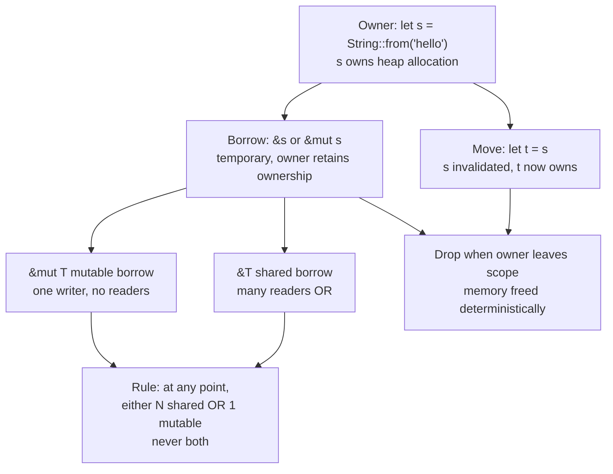
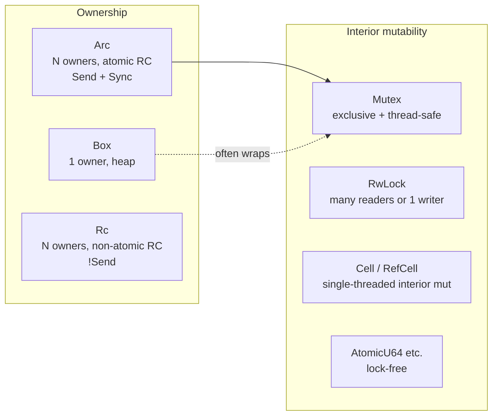
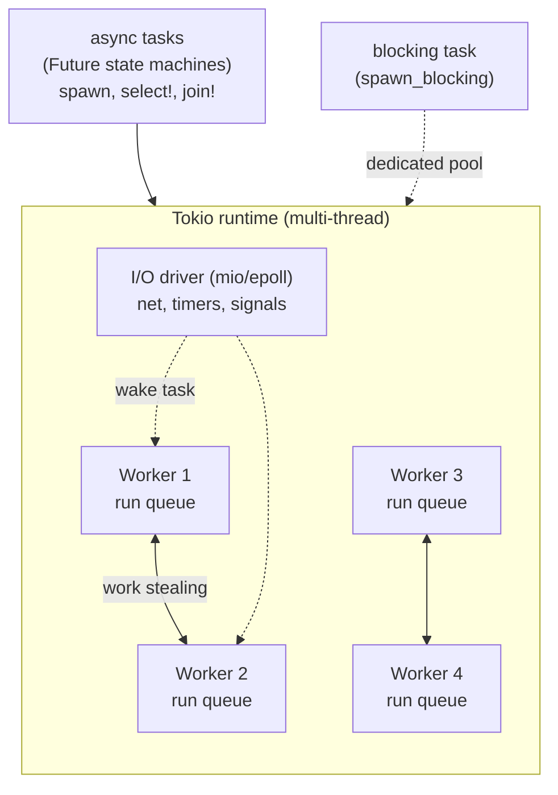
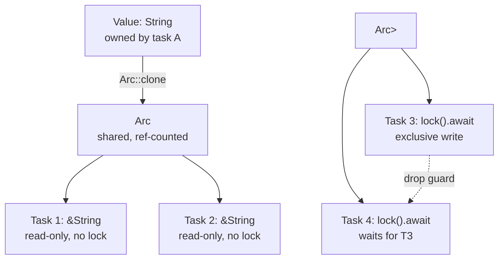

# Chapter 3 — Rust for Backend Systems

**What this chapter covers.** Rust has moved from systems curiosity to backend workhorse — powering proxies (Cloudflare Pingora, AWS Firecracker), databases (TiKV, SurrealDB), streaming (Vector, NATS), and an expanding layer of microservices where latency, memory footprint, and correctness justify the learning curve. Its promise is strong: memory safety without a garbage collector, fearless concurrency via the type system, and C-like performance with a modern toolchain. Its cost is also real: ownership and lifetimes, async complexity, and a smaller operational playbook than JVM or Go. This chapter gives you the Rust you need for backend services — ownership/borrowing/lifetimes in practice, error handling and trait-based design, `tokio` async runtime and hyper/axum service stacks, and the operational reality of deploying Rust services (build, size, profiling, interop) — with enough depth to write, review, and operate production Rust.

Learning goals — after this chapter you should be able to:

- Explain ownership, borrowing, lifetimes, and why they eliminate data races and use-after-free at compile time — and how they differ from GC and manual memory management.
- Write idiomatic Rust for backend services: enums + `match`, `Result`/`Option` error handling (`thiserror`/`anyhow`), traits and generics, and smart pointers (`Box`, `Rc`, `Arc`, `Cow`).
- Build async services with `tokio` and `axum`/`hyper`: tasks, channels, `select!`, cancellation, and why blocking the async runtime is the Rust equivalent of blocking Go's scheduler.
- Choose and use the ecosystem: `serde` for serialization, `sqlx`/`tokio-postgres` for databases, `reqwest` for HTTP clients, `tracing` for observability, and `cargo` workspaces for multi-crate services.
- Profile and debug Rust services: `cargo flamegraph`, `tokio-console`, `heaptrack`/`jemalloc`, and `perf`/`async-profiler`-style workflows.
- Reason about when Rust is the right runtime choice vs. Go/JVM and how to interoperate via FFI and polyglot boundaries (preview of Chapter 8).

> **Scope.** This chapter is Rust as a backend service runtime. Volume 13, Chapter 7 — WebAssembly — covers Rust→Wasm compilation. Chapter 8 — FFI, Native Extensions, and Polyglot Interop — covers Rust↔C/Python/Go boundaries, `cxx`/`pyo3`, and embedding. Chapter 9 — Runtime Selection — compares Rust/Go/JVM on latency, throughput, memory, and operability. Read here for the language/runtime/service stack; read Ch 7–9 for Wasm, FFI, and selection.

---

## 1. Why Rust for backend services

Rust's value proposition for backend is not "faster than Go" (often it is not, by much) but **predictability without GC pauses, memory safety without runtime cost, and concurrency correctness checked at compile time**.

| Property | Rust | Go | JVM |
|---|---|---|---|
| Memory safety | Compile-time (ownership) | GC | GC |
| GC pauses | None | < 1 ms (concurrent) | 10 ms – 1 s (G1/ZGC) |
| Memory footprint | Small (no GC heap, no VM) | Small-medium | Large (heap + VM) |
| Concurrency model | `Send`/`Sync` + async/await | Goroutines + channels | Threads + executors |
| Data races | Compile-time error (usually) | Race detector (runtime) | Race detector / tooling |
| Startup time | Instant (native binary) | Fast (static binary) | Slow (JIT warmup) |
| Binary size | Small-medium (1–20 MB) | Small (5–20 MB) | Large (JVM + jar) |

Where Rust wins for backend:

- **Latency-sensitive paths** — proxies, API gateways, real-time bidding, feature stores where p99 < 10 ms and no GC jitter is the goal.
- **Resource-constrained sidecars** — per-pod proxies or agents where 50 MB RSS matters vs. 300 MB JVM.
- **Correctness-critical components** — parsers, protocol implementations, cryptographic code where memory bugs are security bugs.
- **High-throughput data planes** — packet processing, encoding/transcoding, compression where zero-copy and SIMD matter.

Where Go/JVM still win: CRUD services with large teams and high churn (Go's simplicity), sprawling enterprise codebases with deep ecosystem (JVM), and services where GC pauses under 10 ms are acceptable (most web services).

---

## 2. Ownership, borrowing, and lifetimes

Ownership is Rust's single most important idea. Every value has exactly one owner; when the owner goes out of scope, the value is dropped. Borrowing lets other code temporarily access the value without taking ownership, under rules the compiler enforces.



### Ownership and move semantics

```rust
fn ownership_demo() {
    let s1 = String::from("hello");  // s1 owns the String
    let s2 = s1;                     // move: s1 invalidated
    // println!("{}", s1);           // compile error: value borrowed after move
    println!("{}", s2);              // ok: s2 is the owner

    let s3 = s2.clone();             // explicit deep copy: s2 still valid
    println!("{} {}", s2, s3);

    takes_ownership(s3);             // s3 moved into function
    // println!("{}", s3);           // error: s3 moved
}

fn takes_ownership(s: String) {
    println!("{}", s);
} // s dropped here — memory freed

// Return ownership via return value
fn makes_string() -> String {
    let s = String::from("built");
    s // moved to caller, not dropped
}
```

For `Copy` types (integers, `bool`, `char`, small tuples), assignment copies rather than moves — no invalidation. `String`, `Vec`, `Box`, and most heap types are not `Copy` and move instead.

### Borrowing

```rust
fn borrowing_demo() {
    let mut s = String::from("hello");

    let r1 = &s;   // shared borrow — ok
    let r2 = &s;   // another shared borrow — ok (many readers)
    println!("{} {}", r1, r2);
    // r1, r2 no longer used after this point (NLL: non-lexical lifetimes)

    let r3 = &mut s; // mutable borrow — ok now that r1/r2 are dead
    r3.push_str(" world");
    println!("{}", r3);
    // r3 dies here

    // println!("{}", r1); // error if r1 were still live: cannot borrow as mutable while shared borrows exist
}

// Borrowing in functions — caller retains ownership
fn len(s: &String) -> usize { s.len() } // borrows, doesn't own
fn push(s: &mut String, suffix: &str) { s.push_str(suffix); }

fn caller() {
    let mut s = String::from("hello");
    println!("len={}", len(&s));  // shared borrow
    push(&mut s, " world");        // mutable borrow
    println!("{}", s);             // still owned by caller
}
```

The borrow checker enforces at compile time what Go/JVM check with mutexes or detect with race detectors at runtime: you cannot have a writer and readers concurrently. This is why Rust programs are data-race-free (for safe code) without runtime cost.

### Lifetimes

When you return or store references, the compiler must know how long they live. Lifetimes are usually inferred; when they cannot be, you annotate them.

```rust
// Lifetime elision — no annotation needed (single input reference)
fn first_word(s: &str) -> &str {
    s.split_whitespace().next().unwrap_or("")
}

// Multiple input references — must annotate: which input does the output borrow from?
fn longest<'a>(x: &'a str, y: &'a str) -> &'a str {
    if x.len() > y.len() { x } else { y }
}

// Struct holding a reference — lifetime is part of the type
struct Parser<'a> {
    input: &'a str,
    pos: usize,
}

impl<'a> Parser<'a> {
    fn new(input: &'a str) -> Self { Self { input, pos: 0 } }
    fn peek(&self) -> Option<char> { self.input[self.pos..].chars().next() }
}

// Owned alternative — often simpler for backend services (no lifetimes to track)
struct OwnedParser {
    input: String, // owns its data — no lifetime parameter
    pos: usize,
}
```

**Practical guidance:** in backend services, prefer owned `String`/`Vec` at API boundaries and `&str`/`&[u8]` within functions. Cross the owned/borrowed boundary with `&s`, `s.as_str()`, `s.clone()`, and `Cow<'a, str>` (clone-on-write) when you need both. The borrow checker is strictest at first — idiomatic Rust for services tends toward owned data in structs and borrowed data in function arguments.

```rust
use std::borrow::Cow;

// Cow — borrows when possible, owns when needed (e.g., normalization)
fn normalize<'a>(s: &'a str) -> Cow<'a, str> {
    if s.chars().all(|c| c.is_ascii_lowercase()) {
        Cow::Borrowed(s) // zero-copy fast path
    } else {
        Cow::Owned(s.to_ascii_lowercase()) // allocates only when needed
    }
}
```

### Smart pointers

```rust
// Box<T> — single owner, heap allocated (for recursion, large types, trait objects)
let b: Box<String> = Box::new(String::from("hello"));
enum List { Cons(i32, Box<List>), Nil }

// Arc<T> — shared ownership, thread-safe reference counting (like Go's shared pointer, but explicit)
use std::sync::Arc;
let shared: Arc<String> = Arc::new(String::from("hello"));
let c1 = Arc::clone(&shared); // ref count 2
let c2 = Arc::clone(&shared); // ref count 3
// All clones share the same allocation; freed when last Arc dropped

// Rc<T> — like Arc but !Send (single-threaded, cheaper)
// Mutex<T> / RwLock<T> — interior mutability + thread safety
use std::sync::{Arc, Mutex};
let counter = Arc::new(Mutex::new(0i64));
let counter2 = Arc::clone(&counter);
std::thread::spawn(move || { *counter2.lock().unwrap() += 1; });

// OnceLock / LazyLock — one-time init (replaces Once / lazy_static)
use std::sync::OnceLock;
static CONFIG: OnceLock<Config> = OnceLock::new();
fn get_config() -> &'static Config { CONFIG.get_or_init(|| Config::load()) }
```



---

## 3. Error handling and type-driven design

### `Result` and `Option`

Rust has no exceptions and no `null`. Errors and absence are values — `Result<T, E>` and `Option<T>` — that the compiler forces you to handle.

```rust
// Option<T> — value or nothing (replaces null)
fn find_user(id: u64) -> Option<User> {
    if id == 0 { None } else { Some(User { id }) }
}
let user = find_user(42).unwrap_or(User { id: 0 }); // provide default
let name = find_user(42).map(|u| u.name).unwrap_or_default();

// Result<T, E> — value or error
fn parse_id(s: &str) -> Result<u64, std::num::ParseIntError> {
    s.parse()
}

// ? operator — early return on error (like exceptions, but explicit and typed)
fn handle_request(raw: &str) -> Result<Response, AppError> {
    let id = parse_id(raw)?;           // on Err, return Err immediately
    let user = find_user(id).ok_or(AppError::NotFound)?; // Option → Result
    let body = render(&user)?;         // propagate errors up
    Ok(Response { body })
}
```

### `thiserror` and `anyhow` — the standard split

```rust
// Library / service core — typed errors with thiserror
use thiserror::Error;

#[derive(Debug, Error)]
pub enum AppError {
    #[error("not found: {0}")]
    NotFound(String),

    #[error("validation failed: {0}")]
    Validation(String),

    #[error("database error")]
    Database(#[from] sqlx::Error), // auto From impl

    #[error("upstream {service} returned {status}")]
    Upstream { service: String, status: u16 },
}

// Application / binary — flexible errors with anyhow
use anyhow::{Context, Result};

fn main() -> Result<()> {
    let cfg = std::fs::read_to_string("config.yaml")
        .context("failed to read config.yaml")?; // adds context to error chain
    let app = build_app(&cfg)?;
    app.run()?;
    Ok(())
}

// In handlers — map typed errors to HTTP status
impl axum::response::IntoResponse for AppError {
    fn into_response(self) -> axum::response::Response {
        let (status, msg) = match &self {
            AppError::NotFound(_) => (StatusCode::NOT_FOUND, self.to_string()),
            AppError::Validation(_) => (StatusCode::BAD_REQUEST, self.to_string()),
            AppError::Database(_) => (StatusCode::INTERNAL_SERVER_ERROR, "internal error".into()),
            AppError::Upstream { .. } => (StatusCode::BAD_GATEWAY, self.to_string()),
        };
        (status, msg).into_response()
    }
}
```

Rule: libraries and service cores use `thiserror` (callers match on variants); binaries and `main` use `anyhow` (ergonomic context). Never `unwrap()` in production paths — it panics and (by default) aborts the thread. Use `expect("invariant: ...")` only when the condition is truly unreachable and the message explains why.

### Traits and generics

Traits are Rust's interfaces — and its generics are monomorphized (like C++ templates, unlike Java type erasure or Go interfaces), so there is no runtime cost.

```rust
// Trait — shared behavior
trait Cache {
    fn get(&self, key: &str) -> Option<String>;
    fn set(&mut self, key: String, val: String);
}

// Generic over trait — monomorphized per impl (zero-cost)
fn warm_cache<C: Cache>(cache: &mut C, keys: &[String]) {
    for k in keys {
        if cache.get(k).is_none() {
            cache.set(k.clone(), format!("value:{}", k));
        }
    }
}

// Trait object — dynamic dispatch (like Go interface / Java virtual call)
fn warm_any(cache: &mut dyn Cache, keys: &[String]) { /* ... */ }

// Derive — auto-implement common traits
#[derive(Debug, Clone, PartialEq, Eq, Serialize, Deserialize)]
struct User {
    id: u64,
    name: String,
    email: Option<String>, // nullable field — no null, just Option
}
```

```rust
// Serde — the serialization framework (JSON, YAML, TOML, bincode, etc.)
use serde::{Deserialize, Serialize};

#[derive(Debug, Serialize, Deserialize)]
struct CreateUserRequest {
    name: String,
    email: String,
    #[serde(default)] // missing field → Default::default()
    tags: Vec<String>,
    #[serde(skip_serializing_if = "Option::is_none")]
    phone: Option<String>,
}

// axum extracts JSON via serde automatically
async fn create_user(Json(req): Json<CreateUserRequest>) -> Result<Json<User>, AppError> {
    // req is already validated and deserialized
    let user = db::insert_user(&req).await?;
    Ok(Json(user))
}
```

---

## 4. Async Rust — `tokio` and service stacks

Synchronous Rust handles concurrency with threads (`std::thread`) and channels (`std::sync::mpsc`, `crossbeam`). For I/O-bound backend services, **async Rust with `tokio`** is the standard — it provides an async runtime analogous to Go's scheduler but with explicit `async`/`await` syntax and `Future`-based tasks.

### `tokio` runtime



Like Go's P, tokio workers steal tasks. Unlike Go, tasks are `Future`s — state machines generated by `async fn` — and preemption is cooperative at `.await` points. A future that never `.await`s blocks its worker, just as a Go goroutine that never calls a function blocked pre-1.14.

```rust
use tokio::time::{sleep, Duration};

#[tokio::main] // sets up multi-thread runtime
async fn main() -> anyhow::Result<()> {
    // Spawn concurrent tasks (like go f())
    let handles: Vec<_> = (0..10)
        .map(|i| tokio::spawn(async move {
            handle(i).await
        }))
        .collect();

    // Wait for all (like errgroup)
    for h in handles {
        h.await?; // JoinHandle<Result<T, JoinError>>
    }
    Ok(())
}

async fn handle(id: usize) {
    // .await yields to scheduler — other tasks run during I/O
    let data = fetch(id).await;
    process(data).await;
}

// Channels — tokio's mpsc (async) vs std::sync::mpsc (blocking)
use tokio::sync::mpsc;

async fn pipeline() {
    let (tx, mut rx) = mpsc::channel::<String>(100);

    // Producer
    tokio::spawn(async move {
        for i in 0..1000 {
            if tx.send(format!("item {}", i)).await.is_err() {
                break; // receiver dropped
            }
        }
    });

    // Consumer
    while let Some(item) = rx.recv().await {
        println!("{}", item);
    }
}

// select! — wait on multiple futures (like Go select)
async fn with_timeout() -> Result<String, anyhow::Error> {
    tokio::select! {
        data = fetch_data() => Ok(data?),
        _ = sleep(Duration::from_secs(5)) => anyhow::bail!("timeout"),
    }
}

// Cancellation via CancellationToken or drop
use tokio_util::sync::CancellationToken;

async fn cancellable(token: CancellationToken) {
    tokio::select! {
        _ = token.cancelled() => { println!("cancelled"); return; }
        _ = do_work() => { println!("done"); }
    }
}
```

**The cardinal rule: never block the async runtime.** Blocking calls (`std::thread::sleep`, `std::fs::read`, CPU-heavy loops) stall the worker thread and starve all tasks on it.

```rust
// WRONG — blocks tokio worker
async fn bad() {
    std::thread::sleep(Duration::from_secs(1)); // blocks worker!
    let data = std::fs::read_to_string("file.txt").unwrap(); // blocks!
}

// CORRECT — yield or use async/blocking variants
async fn good() {
    tokio::time::sleep(Duration::from_secs(1)).await; // yields
    let data = tokio::fs::read_to_string("file.txt").await.unwrap(); // async I/O

    // CPU-bound or blocking syscall — offload to blocking pool
    let hash = tokio::task::spawn_blocking(|| {
        expensive_hash(&data)
    }).await.unwrap();
}
```

### `axum` service stack

`axum` (built on `hyper` + `tower`) is the dominant HTTP framework for backend Rust — ergonomic, composable, and fast.

```rust
use axum::{
    extract::{Path, Query, State},
    http::StatusCode,
    response::Json,
    routing::{get, post},
    Router,
};
use serde::Deserialize;
use std::sync::Arc;

#[derive(Clone)]
struct AppState {
    pool: sqlx::PgPool,
    config: Arc<Config>,
}

#[tokio::main]
async fn main() -> anyhow::Result<()> {
    tracing_subscriber::fmt::init(); // structured logging (see observability)

    let pool = sqlx::PgPool::connect(&std::env::var("DATABASE_URL")?).await?;
    let state = AppState { pool, config: Arc::new(Config::load()?) };

    let app = Router::new()
        .route("/users", post(create_user).get(list_users))
        .route("/users/:id", get(get_user))
        .route("/healthz", get(healthz))
        .layer(tower_http::trace::TraceLayer::new_for_http())
        .layer(tower_http::timeout::TimeoutLayer::new(Duration::from_secs(30)))
        .with_state(state);

    let listener = tokio::net::TcpListener::bind("0.0.0.0:8080").await?;
    tracing::info!("listening on {}", listener.local_addr()?);
    axum::serve(listener, app).await?;
    Ok(())
}

async fn get_user(
    Path(id): Path<u64>,
    State(state): State<AppState>,
) -> Result<Json<User>, AppError> {
    let user = sqlx::query_as::<_, User>("SELECT id, name, email FROM users WHERE id = $1")
        .bind(id as i64)
        .fetch_optional(&state.pool)
        .await?
        .ok_or_else(|| AppError::NotFound(format!("user {}", id)))?;
    Ok(Json(user))
}

#[derive(Deserialize)]
struct ListParams { limit: Option<i64>, offset: Option<i64> }

async fn list_users(
    Query(params): Query<ListParams>,
    State(state): State<AppState>,
) -> Result<Json<Vec<User>>, AppError> {
    let users = sqlx::query_as::<_, User>(
        "SELECT id, name, email FROM users ORDER BY id LIMIT $1 OFFSET $2",
    )
    .bind(params.limit.unwrap_or(50).min(100))
    .bind(params.offset.unwrap_or(0))
    .fetch_all(&state.pool)
    .await?;
    Ok(Json(users))
}

async fn healthz() -> &'static str { "ok" }
```

```toml
# Cargo.toml (relevant deps)
[dependencies]
axum = { version = "0.7", features = ["json", "tracing"] }
tokio = { version = "1", features = ["full"] }
tower-http = { version = "0.6", features = ["trace", "timeout", "cors"] }
serde = { version = "1", features = ["derive"] }
serde_json = "1"
sqlx = { version = "0.8", features = ["runtime-tokio", "postgres", "chrono"] }
tracing = "0.1"
tracing-subscriber = { version = "0.3", features = ["env-filter", "json"] }
thiserror = "2"
anyhow = "1"
```

---

## 5. Production reality

### Project layout — workspace

```toml
# Cargo.toml (workspace root)
[workspace]
members = ["crates/api", "crates/core", "crates/db"]
resolver = "2"

[workspace.dependencies]
tokio = { version = "1", features = ["full"] }
serde = { version = "1", features = ["derive"] }
tracing = "0.1"
anyhow = "1"
thiserror = "2"

# crates/api/Cargo.toml
[package]
name = "api"
version = "0.1.0"
edition = "2021"

[dependencies]
core = { path = "../core" }
tokio.workspace = true
axum = "0.7"
```

```
crates/
├── api/          # HTTP layer (axum handlers, middleware)
├── core/         # domain logic (no I/O, pure + Result)
└── db/           # sqlx queries, migrations
```

### Build and binary size

```bash
# Dev build — fast compile, debug info
cargo build

# Release — optimized, LTO, stripped
cargo build --release
# Binary: target/release/api (~5-15 MB stripped, vs 50-100 MB debug)

# Smaller binary — Cargo.toml
[profile.release]
lto = true          # link-time optimization (smaller + faster, slower build)
codegen-units = 1   # single codegen unit (better opts, slower build)
strip = true        # strip symbols (or: cargo strip)
panic = "abort"     # smaller (no unwinding)

# Check what's in the binary
cargo bloat --release --crates   # per-crate size (cargo-bloat)
cargo bloat --release --time     # compile time per crate
```

```dockerfile
# Multi-stage — build in Rust image, ship in distroless/scratch
FROM rust:1.82-bookworm AS build
WORKDIR /app
COPY Cargo.toml Cargo.lock ./
COPY crates/ crates/
RUN --mount=type=cache,target=/usr/local/cargo/registry \
    --mount=type=cache,target=/app/target \
    cargo build --release && cp target/release/api /tmp/api

FROM gcr.io/distroless/cc-debian12:nonroot
COPY --from=build /tmp/api /usr/local/bin/api
USER nonroot
EXPOSE 8080
ENTRYPOINT ["/usr/local/bin/api"]

# Binary is static except libc — for fully static, use musl:
# FROM rust:1.82-alpine AS build
# RUN apk add musl-dev && cargo build --release --target x86_64-unknown-linux-musl
```

### Observability — `tracing`

```rust
use tracing::{info, warn, error, instrument};

// Structured logging — JSON in prod, pretty in dev
fn init_tracing() {
    tracing_subscriber::fmt()
        .with_env_filter(tracing_subscriber::EnvFilter::from_default_env())
        .json() // remove for dev pretty output
        .init();
}

#[instrument(skip(pool), fields(user_id = %id))]
async fn get_user_traced(pool: &sqlx::PgPool, id: u64) -> Result<User, AppError> {
    info!("fetching user");
    let user = sqlx::query_as::<_, User>("SELECT ... WHERE id = $1")
        .bind(id as i64)
        .fetch_optional(pool)
        .await
        .map_err(|e| { warn!(error = %e, "db query failed"); e })?
        .ok_or(AppError::NotFound(format!("user {}", id)))?;
    info!(user.name = %user.name, "found user");
    Ok(user)
}

// Metrics — prometheus + axum
use metrics::{counter, histogram};
use metrics_exporter_prometheus::PrometheusBuilder;

fn init_metrics() {
    PrometheusBuilder::new()
        .install()
        .expect("failed to install prometheus recorder");
}

async fn instrumented_handler(
    Path(id): Path<u64>,
    State(state): State<AppState>,
) -> Result<Json<User>, AppError> {
    let start = std::time::Instant::now();
    let result = get_user_traced(&state.pool, id).await;
    histogram!("http_request_duration_seconds").record(start.elapsed().as_secs_f64());
    counter!("http_requests_total").increment(1);
    result.map(Json)
}
```

### Profiling

```bash
# CPU flame graph — cargo-flamegraph (uses perf)
cargo install flamegraph
cargo flamegraph --bin api --output /tmp/flame.svg
# Open /tmp/flame.svg — hottest stacks at bottom

# Async-aware — tokio-console (like Go trace for async tasks)
# Cargo.toml: tokio = { features = ["tracing"] }, console-subscriber = "0.3"
# RUSTFLAGS="--cfg tokio_unstable" cargo run
# tokio-console http://localhost:6669  (task states, poll times, stalls)

# Heap — jemalloc + jeprof
# Cargo.toml: tikv-jemallocator = { version = "0.6", features = ["stats"] }
# [profile.release] allocator via: #[global_allocator] static ALLOC: tikv_jemallocator::Jemalloc = ...
jeprof --show_bytes target/release/api /tmp/jeprof.heap

# perf (Linux) — system-wide
perf record -g -p $(pidof api) -- sleep 30
perf script | stackcollapse-perf.pl | flamegraph.pl > /tmp/perf.svg

# Benchmarks — criterion
cargo bench  # uses benches/*.rs with criterion
```

### Common pitfalls

| Pitfall | Symptom | Fix |
|---|---|---|
| Blocking the runtime | p99 spikes, `tokio-console` shows long polls | `spawn_blocking` for blocking/CPU work; use `tokio::fs`, `tokio::time` |
| `Clone` in hot loop | High alloc rate, `heaptrack` shows `String`/`Vec` | Borrow (`&str`) in loops; `Cow` for conditional owned |
| `unwrap()` in handler | Panic → 500 or task abort, no error context | `?` + `thiserror`/`anyhow`; `expect` only for invariants |
| Missing `Send`/`Sync` | Compile error on `spawn` | Wrap with `Arc<Mutex<T>>` or use `spawn_blocking` for `!Send` |
| Large `Future` (big `async fn`) | Stack overflow or large task size | Box large futures: `Box::pin(async move { ... })` |
| `cargo build` slow | Minutes for clean build | `sccache`, `cargo nextest`, `mold` linker, workspace `codegen-units` tuning |

---

## 6. Concurrency without data races

Rust's `Send` (can be sent between threads) and `Sync` (can be shared between threads) traits are checked at compile time. If your type is `Send + Sync`, you can share it across tasks/threads safely; if not, the compiler refuses.

```rust
use std::sync::Arc;
use tokio::sync::{Mutex, RwLock, Semaphore, mpsc, watch, broadcast};

// Shared state — Arc + Mutex (tokio's async Mutex, not std::sync::Mutex)
#[derive(Clone)]
struct SharedState {
    cache: Arc<Mutex<std::collections::HashMap<String, String>>>,
    sem: Arc<Semaphore>, // bound concurrency
}

async fn with_shared(state: SharedState) {
    // Acquire semaphore (backpressure)
    let _permit = state.sem.acquire().await.unwrap();

    // Lock cache (async — yields instead of blocking thread)
    let mut cache = state.cache.lock().await;
    cache.insert("key".into(), "value".into());
} // permit + lock released on drop

// Channels — choose by pattern
// mpsc: many producers, one consumer (pipeline)
// broadcast: one producer, many consumers (events)
// watch: latest value, many consumers (config)
// oneshot: single value (request/response)

// Rate limiting — semaphore as concurrency limiter
let limiter = Arc::new(Semaphore::new(10)); // max 10 concurrent
let mut handles = vec![];
for id in 0..100 {
    let lim = Arc::clone(&limiter);
    handles.push(tokio::spawn(async move {
        let _permit = lim.acquire().await.unwrap();
        call_upstream(id).await
    }));
}
for h in handles { h.await.unwrap(); }
```



For data-parallel CPU work, `rayon` (parallel iterators) is the idiomatic choice — it uses work stealing like tokio but for synchronous CPU tasks:

```rust
use rayon::prelude::*;

// Parallel map — uses thread pool, not tokio
let sums: Vec<u64> = items
    .par_iter()
    .map(|x| expensive_compute(x))
    .collect();

// Never call rayon from async context without spawn_blocking
// (it blocks the thread it runs on)
let result = tokio::task::spawn_blocking(|| {
    items.par_iter().map(expensive_compute).sum::<u64>()
}).await.unwrap();
```

---

## 7. The distributed-systems lens

Rust's compile-time guarantees change how you reason about fleet behavior:

- **No GC pauses, but no GC safety net.** Rust services have flat latency without GC tuning, but leaked `Arc` cycles (via `Weak` misuse) or unbounded `Vec` growth are still OOMs — just deterministic ones. Monitor RSS directly; `jemalloc` stats (`stats_print`) show allocator fragmentation that `pprof heap` would show on Go/JVM.
- **Async tasks are not goroutines — cancellation is explicit.** Dropping a `JoinHandle` does not cancel the task (it detaches, like Go's `go` without context). Use `CancellationToken`, `tokio::select!` with a cancel branch, or `AbortHandle` to actually stop work. Un-cancelled tasks on shutdown delay graceful termination — the Rust equivalent of goroutine leaks.
- **Backpressure is your responsibility.** `tokio::sync::mpsc::channel(100)` with `.send().await` naturally backpressures (sender waits when full), unlike unbounded Go channel patterns or JVM `LinkedBlockingQueue` without a bound. But `try_send` or `unbounded_channel` opt out — audit every channel creation for a bound and a backpressure strategy (see Volume 10, Chapter 7).
- **Binary size and deploy speed.** A 10 MB Rust binary deploys faster and starts instantly compared to a JVM service (no warmup, no heap sizing). This enables faster rolling deploys, quicker autoscaling, and smaller sidecars — tangible operational wins that compound across hundreds of services.
- **Interop is the adoption path.** Few teams rewrite everything in Rust. The pragmatic path is Rust for data planes, parsers, proxies, and performance-critical libraries; Go/JVM for control planes and CRUD. `cxx`, `pyo3`, and `prost`/`tonic` (gRPC) make polyglot boundaries practical — choose the runtime per service, not per company (see Chapter 8 for FFI).

---

## Key takeaways

- Ownership (one owner, move semantics) + borrowing (N shared OR 1 mutable) + lifetimes eliminate use-after-free, double-free, and data races at compile time — the core reason Rust has no GC and no runtime data-race detector.
- `Result`/`Option` + `?` + `thiserror`/`anyhow` make error handling explicit and typed — no exceptions, no null, every failure path is visible in the type signature.
- `Box`/`Arc`/`Mutex`/`Cow` cover ownership sharing patterns; prefer owned data in structs and borrowed data in function arguments; use `Cow` for conditional allocation.
- `tokio` is the async runtime (work-stealing workers, cooperative at `.await`); never block it — use `spawn_blocking` for blocking syscalls/CPU work, `tokio::fs`/`tokio::time` for I/O.
- `axum` + `serde` + `sqlx` + `tracing` is the standard backend stack; workspaces organize multi-crate services; `cargo build --release` with LTO produces small, fast binaries for distroless containers.
- Concurrency correctness is compile-time (`Send`/`Sync`); channels (`mpsc`/`broadcast`/`watch`/`oneshot`) and `Semaphore` cover coordination patterns; `rayon` for CPU parallelism, `tokio-console` + `flamegraph` + `jemalloc` for profiling.

## Further reading

- *The Rust Programming Language* (The Book) — https://doc.rust-lang.org/book/ (ownership, lifetimes, traits, async)
- *The Rustonomicon* — https://doc.rust-lang.org/nomicon/ (unsafe, FFI, advanced lifetimes)
- *Asynchronous Programming in Rust* — https://rust-lang.github.io/async-book/
- *Tokio tutorial* — https://tokio.rs/tokio/tutorial
- *Axum docs* — https://docs.rs/axum
- *The Cargo Book* — https://doc.rust-lang.org/cargo/
- Blandy, Orendorff, Tindall — *Programming Rust* (2nd ed., O'Reilly) — deep ownership/borrowing/concurrency.
- McNamara — *Rust in Action* (Manning) — systems/backend patterns.
- *Rust Atomics and Locks* (Mara Bos) — https://marabos.nl/atomics/ (concurrency primitives)
- *tracing* — https://docs.rs/tracing ; *tokio-console* — https://github.com/tokio-rs/console
