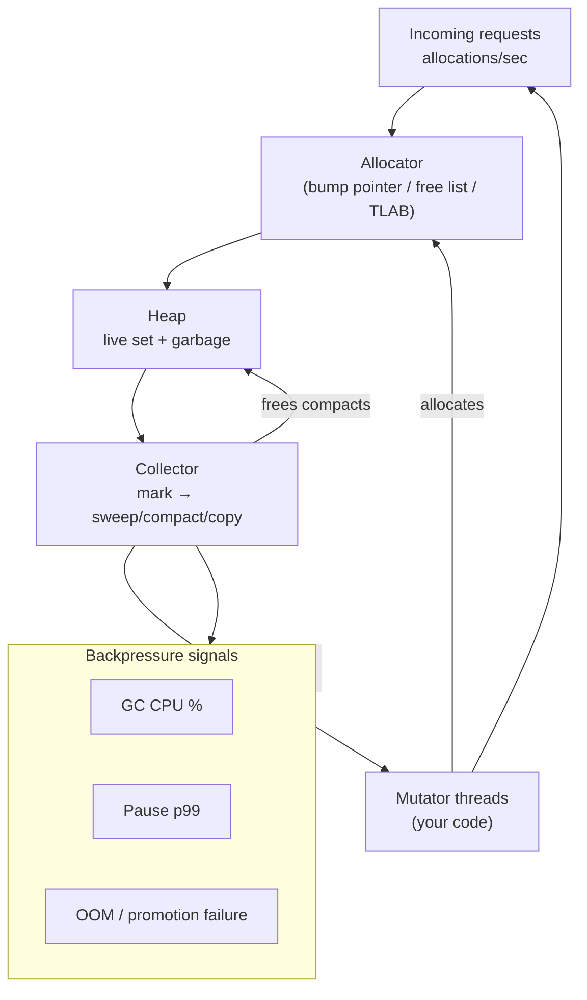
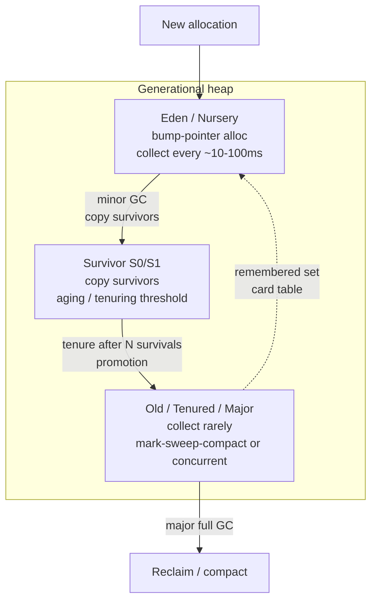
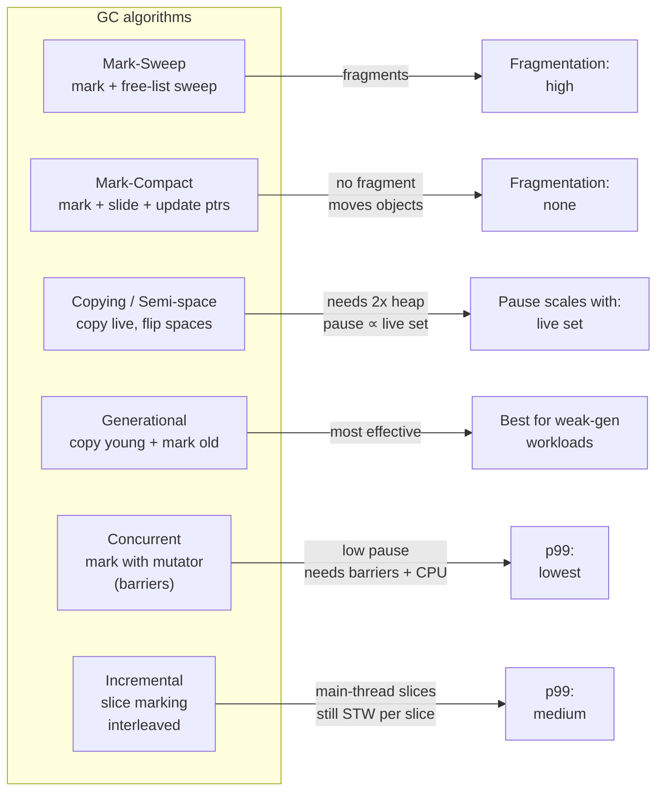
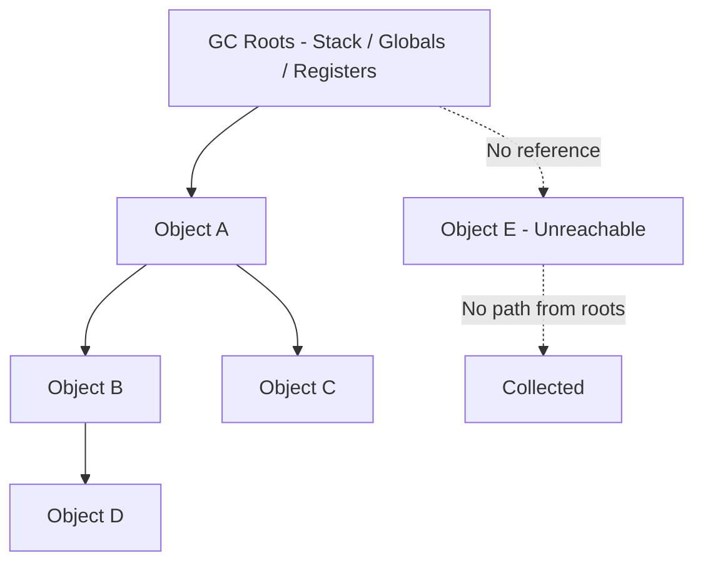
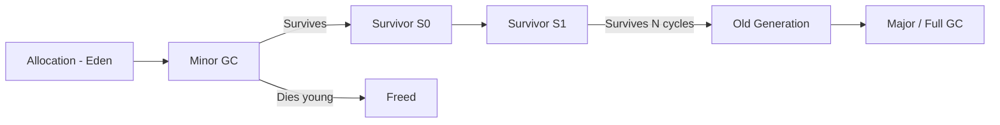
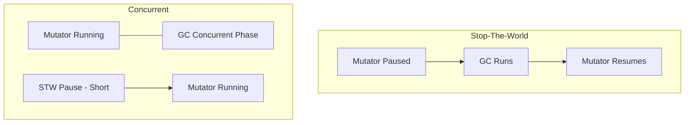

# Chapter 4 — Garbage Collection Across Runtimes

**What this chapter covers.** Every managed runtime you operate — JVM, Go, V8/Node, CPython, .NET — hides a garbage collector that directly shapes your p99, your CPU headroom, and your OOM-kill rate. Teams that treat GC as "just works" get surprised by 800 ms G1 pauses on a 16 GB heap, by Node's incremental marking stealing event-loop ticks, or by Python's reference-count churn stalling an `asyncio` service under load. This chapter gives you a single mental model for GC across all backend runtimes: how collectors actually reclaim memory, how the classic algorithms differ, how each production collector (G1, ZGC, Shenandoah, Go's tri-color, V8's Orinoco, CPython's refcount+cyclic, .NET's generational) makes its latency/throughput/footprint trade-offs, and how to observe and tune them with real flags, logs, and dashboards. Chapter 1 covered the JVM's own memory/JIT machinery; Chapter 2 covered Go's GC; here we unify the theory and compare runtimes side by side.

Learning goals — after this chapter you should be able to:

- Define GC precisely — reachability from roots, liveness, safepoints, and the tri-color invariant — and explain why GC exists (dangling pointers, leaks, fragmentation) and what it costs (CPU, pause, footprint, complexity).
- Compare the fundamental GC algorithms — mark-sweep, mark-compact, copying/semi-space, generational, incremental, concurrent — on pause time, throughput, fragmentation, and heap-size sensitivity, and map each to a production collector.
- Explain generational collection and the weak generational hypothesis, remembered sets, and card tables, and why almost every production GC is generational.
- Describe each major runtime's collector: JVM (G1, Parallel, ZGC, Shenandoah), Go (concurrent tri-color, pacer, GOMEMLIMIT), V8/Node (Orinoco generational + concurrent/incremental marking, Oilpan), CPython (reference counting + cyclic GC), and .NET (generational + concurrent/background GC).
- Read GC telemetry — JVM GC logs / JFR, `GODEBUG=gctrace`, Node `--trace-gc`, Python `gc` module / `tracemalloc` — and diagnose allocation pressure, promotion failure, fragmentation, and leak patterns.
- Tune GC for backend services under cgroup/Kubernetes limits: heap sizing, `GOGC`/`GOMEMLIMIT`, `--max-old-space-size`, `PYTHONMALLOC`, and container-aware flags, with concrete flag sets for latency-sensitive vs. throughput-oriented workloads.

> **Scope.** Chapter 1 — JVM — covers JVM heap layout, TLAB, humongous objects, metaspace, and JIT interaction. Chapter 2 — Go Runtime — covers Go's scheduler/pacer/STW phases and `GOMEMLIMIT` sizing in containers. This chapter is the cross-runtime theory and comparison. Chapter 5 — Profiling — covers `async-profiler`, `pprof`, heap dumps, and flame graphs you use to observe GC in production. Read Ch 1–2 for each runtime's own machinery; read here for the unified model and head-to-head comparison; read Ch 5 for tooling.

---

## 1. Why garbage collection matters for backend services

Manual memory management (`malloc`/`free`, `new`/`delete`) has two failure modes: freeing too early (use-after-free, double-free) and not freeing at all (leaks). In a long-lived backend service handling millions of requests, either is fatal — one is a security vulnerability, the other is a slow OOM kill that pages your on-call at 03:00.

GC trades CPU and occasional pauses for safety:

- **No dangling pointers.** The collector only reclaims unreachable objects.
- **No leaks (of reachable memory).** Logical leaks — unbounded caches, forgotten listeners — are still your bug, but the collector removes the physical leak class.
- **Compaction.** Moving collectors defragment the heap so large allocations do not fail despite enough total free bytes.

The cost is never zero:

| Cost | What it means for a service |
|---|---|
| **CPU overhead** | Marking + copying burns cycles (5–25% of CPU in allocation-heavy services). |
| **Pause time (STW)** | Mutator threads stopped — directly adds to p99. |
| **Memory overhead** | Headroom for copying (semi-space needs 2x), mark bitmaps, remembered sets. |
| **Complexity** | Write barriers, read barriers, safepoints, and pacer tuning leak into your config. |

A backend service's GC behavior is dominated by its **allocation rate** (bytes/sec) and **live set** (bytes that survive a collection), not by heap size alone. A 4 GB heap with 2 GB/sec allocation and a 100 MB live set behaves nothing like a 4 GB heap with 100 MB/sec allocation and a 3 GB live set. Every tuning decision flows from those two numbers.



---

## 2. GC fundamentals

### 2.1 Reachability and roots

GC defines liveness as **reachability** from a set of roots:

- Stack roots — local variables and temporaries on every thread's stack.
- Global roots — statics, module globals, interned strings.
- Register roots — values in registers at a safepoint.
- JNI / handle roots — native references held across the boundary (JVM, V8).

An object is live if there is a path of references from any root to it. Everything else is garbage, even if it is part of a cycle (`A → B → A` with no root path is garbage — this is why reference counting alone is insufficient).

```
Roots: [stack frame: x] → Object A → Object B → Object C
                                        ↘
                                   Object D (unreachable — collectible)
                                          ↘
                                     Object E (unreachable — also collectible)
```

### 2.2 The tri-color abstraction

Every tracing collector can be understood as tri-color marking:

- **White** — not yet visited (candidate garbage).
- **Grey** — visited but children not yet scanned (work queue).
- **Black** — visited and fully scanned (known live).

```
Start: roots = grey, everything else = white
Loop:  pick a grey object, mark its referents grey, mark it black
End:   white = garbage, black = live
```

The **tri-color invariant** — no black object points to a white object — must hold. When the mutator runs concurrently with marking, it can violate this invariant (`black → white` edge created after the black was scanned). Concurrent collectors maintain the invariant with barriers:

- **Write barrier (snapshot-at-the-beginning or incremental update)** — intercept `obj.field = value` and record the edge. Go uses a hybrid barrier; G1/ZGC use load/store barriers (SATB or load barriers).
- **Read barrier** — intercept `value = obj.field` (ZGC, Shenandoah's Brooks pointers / load-reference barriers) to relocate objects concurrently.

Understanding which barrier a collector uses tells you its cost model: write barriers tax mutation rate; read barriers tax every load.

### 2.3 Safepoints

A safepoint is a program point where the collector can get a consistent view of roots (no half-written references in registers). STW collectors stop all mutators at a safepoint; concurrent collectors need fewer/lighter safepoints but still need them for root scanning and phase transitions. Long safepoint sync time (a thread stuck in a tight loop without a safepoint check, a `mlock`'d page, or a kernel stall) shows up as a GC pause even if the collector itself is concurrent. JVM `safepoint` logging, Go's `STW` spans in `gctrace`, and V8's `pause` breakdown expose this.

### 2.4 Generations and the weak generational hypothesis

> Most objects die young; survivors tend to survive longer.

Empirically, 80–98% of objects die before the next young collection in many backend workloads (request-scoped DTOs, buffers, iterators). Generational collectors exploit this:

- Allocate in **Eden / young / nursery** (bump pointer, fast).
- First GC copies survivors to a **survivor / intermediate** space; most objects die here and are never copied again.
- Objects that survive N collections are **tenured / promoted** to **old / tenured / major** generation, collected rarely.

Cross-generational pointers (`old → young`) are tracked via **remembered sets** / **card tables** (JVM G1's cards, Go's write barrier buffer, V8's store buffer) so young collections do not scan the entire old heap. The cost of maintaining remembered sets is the hidden tax of generational GC — pathological patterns (large old-to-young pointer fanout) inflate remembered-set size and young pause time.



---

## 3. The algorithm palette

### 3.1 Mark-sweep

1. Mark live objects (tri-color).
2. Sweep — walk the heap and link unreachable objects into a free list.

Pros: no copying, no object movement (stable addresses). Cons: fragments the heap (free list becomes scattered), sweeps the whole heap, pause scales with heap size. Used as a phase inside many collectors, rarely alone in production.

### 3.2 Mark-compact

Mark, then **slide** live objects together to one end, updating pointers. Eliminates fragmentation but requires moving objects and a second pass over live data. Parallel and Serial collectors compact the old generation this way.

### 3.3 Copying (semi-space, Cheney)

Heap split in two: `from-space` and `to-space`. Allocate in `from-space`; when full, copy live objects to `to-space`, flip. Extremely fast allocation (bump pointer), zero fragmentation, pause proportional to live set (not heap size). Cost: needs 2x address space for the heap. Nursery collections in V8, ZGC's relocation, and Go's scavenging all use copying ideas.

### 3.4 Generational

Combine copying for the young generation with mark-sweep/compact or concurrent marking for the old. Almost every production collector is generational — it is the single most effective optimization for real workloads.

### 3.5 Incremental and concurrent

- **Incremental** — interleave small GC increments with mutator slices (V8's incremental marking — 1–5 ms slices on the main thread).
- **Concurrent** — GC threads run alongside mutators on other cores (Go, ZGC, Shenandoah, G1's concurrent marking). Requires barriers and careful phase coordination; reduces STW but burns CPU and needs headroom (floating garbage — objects that die after being marked live must wait for the next cycle).

### 3.6 Algorithm comparison



| Algorithm | Pause | Throughput | Fragmentation | Heap overhead | Barrier cost | Scales with |
|---|---|---|---|---|---|---|
| Mark-sweep | STW, heap-sized | Medium | Yes | Bitmap | None | Heap size |
| Mark-compact | STW, heap-sized | Medium | No (compacted) | Bitmap | None | Heap size |
| Copying | STW, live-sized | High (young) | No | 2x | None | Live set |
| Generational | Short young STW, rare old STW | High | Old may fragment | Cards + RS | Write barrier | Young live set |
| Concurrent | Mostly concurrent, short STW | Lower (barrier + float) | Depends on old algo | Bitmap + buffers | Write or read barrier | Live set + alloc rate |
| Incremental | Many short STWs | Medium | Depends | Incremental stack | Write barrier | Live set |

The production lesson: there is no best collector, only a best trade-off for your workload's allocation rate, live set, heap size, and p99 target.

---

## 4. Collectors in production

### 4.1 JVM — G1, Parallel, ZGC, Shenandoah

JVM collectors are selectable and tunable; the choice dominates tail latency on heap-heavy services.

| Collector | Pause target | Heap sweet spot | How it works | When to choose |
|---|---|---|---|---|
| **Parallel GC** | Throughput (long pauses ok) | Any, best < 8 GB | STW Parallel mark + compact; throughput king | Batch jobs, throughput > latency |
| **G1** | Configurable (`MaxGCPauseMillis`, default 200 ms) | 4–32 GB | Region-based (1–32 MB regions), concurrent marking, mixed evacuations; humongous objects direct to old | General backend default through JDK 17 |
| **ZGC** | < 1 ms (load barriers, colored pointers) | 8 GB – terabytes | Concurrent mark + relocate, load barriers, no generational until JDK 21 (generational ZGC) | Large heaps, ultra-low pause (trading, RTB) |
| **Shenandoah** | < 10 ms (Brooks pointers / load-ref barriers) | 4 GB – large | Concurrent evacuation, Brooks forwarding pointers | Low-pause alternative to G1, smaller heaps than ZGC's sweet spot |
| **Epsilon** | No GC (allocates then OOMs) | Testing | No-op | Allocation-pressure measurement, not production |

**G1 in depth (still the most common backend collector):**

- Heap split into ~2048 regions (Eden, Survivor, Old, Humongous). Young = Eden + Survivor. No fixed young/old boundary — G1 adapts it.
- Allocation in Eden via TLAB (thread-local allocation buffer — bump pointer without locking).
- Young GC: STW, parallel evacuation of young regions + remembered-set scan. Usually 10–100 ms.
- Concurrent marking: initial STW mark, concurrent mark, remark STW, cleanup. Selects old regions with most garbage for **mixed GCs** (young + a subset of old regions per pause, spreading old collection over multiple pauses).
- `MaxGCPauseMillis` is a soft goal — G1 tunes young size and mixed GC pacing, but cannot guarantee it under allocation pressure. Promotion failure / evacuation failure → Full GC (single-threaded or parallel, long STW).

**ZGC / Shenandoah (sub-millisecond to few-ms pauses):**

- Colored pointers (ZGC: 64-bit pointer metadata) or Brooks pointers (Shenandoah) let the collector relocate objects concurrently while mutators run via load barriers.
- No generational split historically (ZGC gained generational mode in JDK 21 — now recommended for most workloads; it dramatically reduces concurrent marking work).
- Require more CPU and headroom; sensitive to allocation rate — if allocation outruns concurrent relocation, the collector falls back to STW or allocation stall.

**Tuning flags (real flags you set):**

```bash
# G1 — general backend default (JDK 17+, container-aware)
java \
  -Xms2g -Xmx2g \                          # fixed heap (avoid dynamic resizing pauses)
  -XX:+UseG1GC \                            # default on JDK 9+, explicit is fine
  -XX:MaxGCPauseMillis=150 \                # soft goal; lower = smaller young gen = more frequent GCs
  -XX:G1HeapRegionSize=8m \                 # ~2048 regions; tune if humongous alloc rate high
  -XX:ParallelGCThreads=4 -XX:ConcGCThreads=2 \  # scale with cgroup CPU limit
  -XX:+UseStringDeduplication \             # dedup equal String backing arrays (costs remark)
  -Xlog:gc*,safepoint:file=/var/log/gc.log:time,uptime,level,tags \
  -XX:+HeapDumpOnOutOfMemoryError -XX:HeapDumpPath=/dumps \
  -jar app.jar

# ZGC — low-pause, large heap, JDK 21+ generational
java \
  -Xms8g -Xmx8g \
  -XX:+UseZGC -XX:+ZGenerational \          # generational ZGC (JDK 21+)
  -XX:ParallelGCThreads=8 -XX:ConcGCThreads=4 \
  -XX:+ZUncommit \                          # return unused heap to OS (container-friendly)
  -Xlog:gc:file=/var/log/gc.log:time \
  -jar app.jar

# Shenandoah — low-pause alternative
java \
  -Xms4g -Xmx4g \
  -XX:+UseShenandoahGC -XX:ShenandoahGCMode=iu \  # iu = incremental-update
  -XX:+ShenandoahUncommit \
  -jar app.jar
```

GC logging is non-negotiable in production — without it you cannot distinguish GC pauses from scheduler stalls, lock contention, or downstream latency.

### 4.2 Go — concurrent tri-color with pacer

Go's collector is a **concurrent, tri-color, mark-sweep, non-generational, non-compacting** collector with a dedicated pacer and extremely short STW phases. It is not generational by design — the Go team has repeatedly evaluated generational GC and chosen to keep the simpler concurrent design (generational experiments exist but are not production default as of Go 1.22–1.24).

Key properties:

- **Concurrent marking** with a hybrid write barrier (Dijkstra insertion + Yuasa deletion hybrid) — marking runs alongside mutators; only two short STW phases: `mark termination` and `sweep termination` (typically < 100 µs each).
- **Pacer** — aims to start the next GC when heap has grown by `GOGC` percent over the live heap after the last GC. `GOGC=100` (default) means "grow 100% before next GC" — `GOGC` is a throughput knob, not a pause knob.
- **`GOMEMLIMIT`** (Go 1.19+) — soft memory limit (bytes). The pacer cooperates with the limit to trigger GC earlier when approaching it, and the scavenger returns memory to the OS. This is the flag that makes Go play well with `memory.limit` in Kubernetes — without it, Go's heap can grow past the cgroup limit and be OOM-killed before GC runs.
- **Non-moving (mostly)** — Go does not compact; it uses spans and free lists. Fragmentation is managed via size classes and scavenging, not copying.
- **Assists** — if allocation outruns marking, goroutines doing allocation are forced to do marking work (GC assist). Allocation-heavy request handlers literally slow down to help the collector — visible as p99 spikes under high alloc rate.

```
Live heap after GC: 500 MB, GOGC=100 → next GC at ~1000 MB heap
Live heap after GC: 500 MB, GOMEMLIMIT=1500 MB → pacer starts earlier as limit approaches
High alloc rate (2 GB/s) → concurrent mark must keep up → assists → p99 climbs
```

```bash
# Observe Go GC
GODEBUG=gctrace=1 ./app 2>&1 | head
# gc 1 @0.011s 1%: 0.018+0.42+0.003 ms clock, 0.14+0.11/0.82/1.1+0.025 ms cpu, 4->4->1 MB, 5 MB goal, 8 P
# gc 2 @0.032s 2%: 0.010+0.71+0.002 ms clock, 0.082+0.22/0.95/0.12+0.020 ms cpu, 6->6->2 MB, 6 MB goal, 8 P

# Tune for Kubernetes (cgroup limit 1 GiB)
GOGC=100 GOMEMLIMIT=800MiB ./app        # leave 200 MiB headroom for stacks, non-heap
GOGC=50  GOMEMLIMIT=800MiB ./app        # more frequent GC, lower p99, higher CPU
GOGC=off GOMEMLIMIT=800MiB ./app        # pacer driven purely by limit (GC as needed)

# Inside the process — runtime metrics (Go 1.17+)
# go.Collector().Read(metrics) or expvar / prometheus client
```

Distributed-systems note: Go's sub-millisecond STW makes it attractive for tail-latency-sensitive services, but high allocation rate still hurts — not via pauses but via **GC CPU and assists** stealing cycles from request handling. The fix is not tuning `GOGC` but reducing allocation (reuse buffers, avoid per-request `[]byte` churn, use `sync.Pool` correctly — see Chapter 5).

### 4.3 V8 / Node.js — Orinoco generational with incremental + concurrent

Node runs on V8 + libuv + Oilpan (Blink GC for DOM — not relevant server-side but part of the mental model). V8's heap (Orinoco) is generational and increasingly concurrent:

| Generation | Name | Algorithm | Size | Collection |
|---|---|---|---|---|
| Young | Nursery (semi-space) | **Scavenge** — copying Cheney, parallel | Small (1–16 MB, adapts) | Frequent, STW but fast (live set small) |
| Old | Old space | **Mark-sweep-compact** — concurrent + incremental marking, parallel compaction | Grows to `--max-old-space-size` (default ~2 GB 64-bit, ~1.4 GB 32-bit) | Rare, mostly concurrent |
| Large | Large object space | Direct allocate, mark-sweep | For objects > page size | Per old GC |
| Code | Code space | Managed | JIT code | Rare |

Evolution (important for debugging old Node versions):

- **Incremental marking** — mark in ~1–5 ms slices on the main thread, interleaved with JavaScript execution. Reduces STW but still blocks the event loop per slice.
- **Concurrent marking** — marking threads run alongside the main thread (V8 8.x+). Dominant marking work is off-thread; only finalization is STW.
- **Parallel / concurrent compaction and sweeping** — old-space compaction parallelized; sweeping mostly concurrent.
- **Idle-time and memory-pressure GC** — V8 schedules GC during idle (libuv idle handle) and under memory pressure; aggressive `setTimeout`-heavy workloads can starve idle GC.

What this means for Node backend services:

- **Young GC (Scavenge) is STW on the main thread.** It is fast (microseconds to low ms) but happens often. Allocation-heavy handlers (JSON parse/stringify, Buffer churn) directly increase Scavenge frequency.
- **Old GC marking steals main-thread time** even with concurrency (barriers, final STW). Large live sets (big caches, retained closures, global Maps) lengthen concurrent marking and increase CPU.
- **The event loop is blocked during STW slices.** Even 2 ms of STW is 2 ms where no I/O callback fires, no timer fires, and no request is handled. Under load this queues callbacks and inflates p99.

```bash
# Observe and tune V8 GC in Node
node --trace-gc --trace-gc-verbose app.js
# [139,0x...] Scavenge 8.4 -> 7.2 MB, 0.8 ms
# [139,0x...] Mark-sweep 45.1 -> 28.3 MB, 12.4 ms (+ 8.1 ms concurrent)

# Larger heap before GC pressure (container with 2 GiB limit)
node --max-old-space-size=1536 --max-semi-space-size=32 app.js

# Expose GC to JS (for manual testing only — not for production pacing)
node --expose-gc app.js  # then global.gc() in code/handlers
```

```javascript
// GC-friendly Node — what to actually do
// 1. Avoid per-request large allocs in hot paths
// Bad:  JSON.parse(JSON.stringify(obj)) per request (allocates + copies entire graph)
// Good: structuredClone (V8-optimized) or reuse via schema validation that avoids cloning

// 2. Don't retain unintentionally — closures capture whole scope
function handler(req, res) {
  const big = loadConfig(); // captured by closure below even if only one field used
  app.use((req, res, next) => {
    // This closure retains `big` for lifetime of middleware — old-space leak
    res.send(big.version);
    next();
  });
}
// Fix: capture only what you need
function handler(req, res) {
  const { version } = loadConfig();
  app.use((req, res, next) => { res.send(version); next(); });
}

// 3. Monitor heap via v8.getHeapStatistics()
import v8 from 'node:v8';
setInterval(() => {
  const s = v8.getHeapStatistics();
  console.log({
    used: Math.round(s.used_heap_size / 1e6) + 'MB',
    total: Math.round(s.total_heap_size / 1e6) + 'MB',
    external: Math.round(s.external_memory / 1e6) + 'MB', // Buffers, native
  });
}, 10000);
```

### 4.4 CPython — reference counting + cyclic GC

CPython is not a tracing collector by default. Every object has `ob_refcnt`; `Py_INCREF`/`Py_DECREF` on every assignment; when `refcnt == 0` the object is freed immediately (deterministic, no pause). This is why `__del__` / `__close__` patterns and context managers work the way they do — and why CPython can feel "no GC" for simple workloads.

Cycles (`a.refs = b; b.refs = a`) defeat refcounting — neither count reaches zero. A separate **cyclic GC** handles this:

- Tracks only container objects that may participate in cycles (lists, dicts, sets, custom classes with `__del__`; tuples and strings with only immutable contents are not tracked).
- Runs periodically based on allocation thresholds (`gc.get_threshold()` — default `(700, 10, 10)` — 700 container allocs since last young GC triggers generation 0).
- Three generations: young (0), middle (1), old (2). New tracked objects go to gen 0; survivors promoted; gen 2 collected rarely. This is generational, but only for cycle detection — most reclamation is still refcount.
- STW, single-threaded, and — critically — **holds the GIL**, so application threads are blocked.

```python
import gc
import sys
import tracemalloc

# Reference counting — immediate
x = {"key": "value"}
print(sys.getrefcount(x))  # includes getrefcount's own temp ref
y = x
print(sys.getrefcount(x))  # +1
del y                        # refcnt decrements; not yet freed if other refs exist

# Cycles — need cyclic GC
a = {}
b = {"ref": a}
a["ref"] = b
del a, b          # cycle unreachable but refcnts > 0 — needs gc.collect()
print(gc.collect())          # returns number of unreachable objects collected
print(gc.garbage)            # objects with __del__ that were not collectible (legacy)

# Tuning — common in backend services (e.g., gunicorn workers, Celery workers)
gc.set_threshold(700, 10, 10)   # default — tune if alloc-heavy
gc.disable()                     # some latency-sensitive services disable cyclic GC
                                 # and run gc.collect(0) manually between requests
                                 # or on idle — measure before doing this

# Threshold tuning intuition:
# Lower thresholds -> more frequent but shorter GCs (better p99, more CPU)
# Higher thresholds -> rarer but longer GCs (better throughput, worse p99 spikes)
# For request-serving workers: slightly lower gen0 threshold often helps p99

# Allocation profiling
tracemalloc.start()
# ... serve requests ...
snapshot = tracemalloc.take_snapshot()
for stat in snapshot.statistics('lineno')[:10]:
    print(stat)
# /app/handlers.py:42: 12.4 MB (temporary dicts in hot loop)
```

Python 3.11+ made cyclic GC incremental for some phases, but it remains STW. For backend services, the practical implications are:

- **Refcount churn is CPU cost.** Every `Py_INCREF`/`Py_DECREF` is an atomic op on free-threaded builds. Allocation-heavy code (lots of short-lived dicts/lists) pays this on every operation.
- **Cyclic GC pauses scale with number of tracked objects, not heap bytes.** A service that creates many small container objects (ORM rows as dicts, JSON dicts) triggers frequent gen-0 collections.
- **`__del__` resurrection hazards.** Objects with `__del__` in cycles were historically uncollectable (`gc.garbage`); Python 3.4+ uses `weakref` finalizers and `__del__` is safer but still discouraged in hot paths.

### 4.5 .NET (reference for comparison)

.NET's GC is the closest to JVM's in design — generational (Gen 0, 1, 2 + Large Object Heap), concurrent background GC for Gen 2, and a choice of **Workstation GC** (concurrent, low pause) vs. **Server GC** (parallel, per-core heaps, higher throughput). Like JVM, it is region-based since .NET 7+. Relevant if you operate mixed fleets.

---

## 5. Cross-runtime comparison

### 5.1 Head-to-head

```mermaid
flowchart TB
    subgraph JVM["JVM (G1 / ZGC)"]
        J_ALGO["Generational<br/>region-based<br/>concurrent mark<br/>evacuation / relocate"]
        J_PAUSE["G1: 10-200ms<br/>ZGC: <1ms"]
        J_THRU["Throughput: high<br/>(G1) / medium<br/>(ZGC barriers)"]
        J_MEM["Heap: 512M-100s GB<br/>needs headroom"]
        J_ALGO --> J_PAUSE --> J_THRU --> J_MEM
    end
    subgraph GO["Go"]
        G_ALGO["Non-generational<br/>concurrent tri-color<br/>non-moving, pacer"]
        G_PAUSE["STW <1ms<br/>(mark term)"]
        G_THRU["Throughput: high<br/>assists under pressure"]
        G_MEM["Heap: small-medium<br/>GOMEMLIMIT coop"]
        G_ALGO --> G_PAUSE --> G_THRU --> G_MEM
    end
    subgraph V8["V8 / Node"]
        V_ALGO["Generational<br/>Scavenge young<br/>concurrent mark old"]
        V_PAUSE["Young: <1ms<br/>Old mark: slices<br/>~1-10ms STW total"]
        V_THRU["Throughput: medium<br/>main-thread GC"]
        V_MEM["Heap: ~2GB default<br/>--max-old-space-size"]
        V_ALGO --> V_PAUSE --> V_THRU --> V_MEM
    end
    subgraph PY["CPython"]
        P_ALGO["Refcount +<br/>generational cyclic<br/>STW, GIL-held"]
        P_PAUSE["Refcount: 0ms<br/>Cyclic: 1-50ms<br/>(proportional to tracked objs)"]
        P_THRU["Throughput: medium<br/>refcount churn"]
        P_MEM["Heap: OS malloc<br/>+ pymalloc arenas"]
        P_ALGO --> P_PAUSE --> P_THRU --> P_MEM
    end
```



| Dimension | JVM G1 | JVM ZGC | Go | V8/Node | CPython |
|---|---|---|---|---|---|
| **Type** | Generational, region, concurrent mark | Concurrent relocate, colored ptrs | Concurrent tri-color, non-generational | Generational, Scavenge + concurrent mark | Refcount + generational cyclic |
| **STW pause** | 10–200 ms (tunable) | < 1 ms | < 1 ms | < 1 ms young, 1–10 ms old | 1–50 ms cyclic |
| **Pause scales with** | Live set + RS size | Live set + alloc rate | Tiny STW (fixed) | Young live set, old mark work | Tracked object count |
| **Throughput hit** | Low | Medium (load barriers) | Low-medium (write barrier + assists) | Medium (main-thread slices) | Medium (refcount atomics, GIL) |
| **Heap overhead** | Cards + RS + regions | Colored pointers + forwarding | Spans + barriers | Semi-space 2x (young) + mark bitmap | pymalloc arenas, no bitmap |
| **Moves objects?** | Yes (evacuation) | Yes (relocation) | No | Young yes, old yes (compaction) | No (refcount), cyclic defers free |
| **Container fit** | Needs `MaxRAMPercentage` / explicit `-Xmx` | Same, needs headroom for concurrent | `GOMEMLIMIT` cooperates with cgroup | `--max-old-space-size` must be < limit | No built-in cgroup awareness |
| **Live-set sensitivity** | Mixed GCs handle large old live sets | Concurrent relocate handles large live | Non-compacting, fragmentation under churn | Large old live lengthens concurrent mark | N/A (refcount) |
| **Auth tuning knob** | `MaxGCPauseMillis` | Threads + headroom | `GOGC` + `GOMEMLIMIT` | `--max-old-space-size` + semi-space | `gc.set_threshold` |

### 5.2 What this means for backend workloads

- **Short-lived request allocs** — generational collectors win (JVM G1 young, V8 Scavenge, even Python's refcount). Keep young generation sized so most requests die before tenure/promotion.
- **Large caches / long-lived live sets** — prefer collectors that handle large live cheaply: ZGC's concurrent relocate, Go's non-moving spans, or JVM G1 mixed GCs. V8 penalizes large old live (concurrent mark cost). Python penalizes many tracked objects regardless of size.
- **p99-sensitive APIs** — ZGC/Shenandoah/Go/V8-concurrent give the lowest STW, but all shift cost to CPU/barriers. If you are CPU-bound, a throughput collector (Parallel GC, higher GOGC) may actually give better p99 by finishing requests faster despite slightly longer GC pauses.
- **Memory-constrained sidecars (256–512 MB)** — small heaps amplify GC frequency. G1 with small regions, Go with low `GOMEMLIMIT`, Node with reduced `--max-old-space-size`, Python with tuned `gc.threshold` all trade CPU for footprint.

---

## 6. Observing GC in production

No tuning without telemetry. Wire GC observability into the same pipeline as request metrics.

### JVM

```bash
# GC log (JDK 11+ unified logging — the minimum viable observability)
-Xlog:gc*,gc+heap=debug,safepoint:file=/var/log/gc.log:time,uptime,level,tags:filecount=10,filesize=50M

# Live view
jstat -gcutil <pid> 1000        # E/S/O/M/CCS %, YGC/YGCT, FGC/FGCT, GCT
jcmd <pid> GC.heap_info         # region/heap summary
jcmd <pid> JFR.start duration=60s filename=/tmp/app.jfr  # allocation + GC events

# Prometheus (Micrometer / JMX exporter)
# jvm_gc_pause_seconds{action="end of major GC"} histogram
# jvm_gc_memory_allocated_bytes_total
# jvm_memory_used_bytes{area="heap",id="G1 Old Gen"}
```

Grep GC logs for `Pause Young`, `Pause Mixed`, `Full`, `Evacuation Failure`, `Humongous`, `Metaspace`, `Safepoint`.

### Go

```bash
GODEBUG=gctrace=1,gcpacertrace=1,schedtrace=1000 ./app
# plus runtime/metrics or prometheus client:
# go_gc_duration_seconds, go_gc_heap_allocs_bytes_total, go_gc_heap_goal_bytes
# go_memory_classes_heap_objects_bytes, go_sched_goroutines_goroutines

# pprof
go tool pprof -http=:8081 http://localhost:6060/debug/pprof/heap
go tool pprof -http=:8081 http://localhost:6060/debug/pprof/allocs  # alloc profile, not just live heap
```

### Node / V8

```bash
node --trace-gc --trace-gc-verbose --trace-gc-ignore-scavenger app.js
node --allow-nativesyntax --trace-opt --trace-deopt app.js  # (JIT, but GC-adjacent)

# In-process metrics (prom-client or v8 stats)
# nodejs_heap_size_used_bytes, nodejs_heap_size_total_bytes, nodejs_external_memory_bytes
# nodejs_gc_duration_seconds{kind="major"} histogram (via perf_hooks)
```

```javascript
import { PerformanceObserver } from 'node:perf_hooks';
const obs = new PerformanceObserver((list) => {
  for (const e of list.getEntries()) {
    // e.detail.kind: 0=major, 1=minor, 2=incremental, 4=weakcb
    console.log(`GC kind=${e.detail.kind} duration=${e.duration.toFixed(2)}ms flags=${e.detail.flags}`);
  }
});
obs.observe({ entryTypes: ['gc'] });
```

### CPython

```python
import gc, tracemalloc, resource, os

gc.set_debug(gc.DEBUG_STATS)  # log each collection to stderr
tracemalloc.start()

# Prometheus via prometheus_client or psutil
# python_gc_collections_total{generation="0|1|2"}
# python_gc_collected_total, python_gc_uncollectable_total
# process_resident_memory_bytes (RSS — includes pymalloc arenas)
print(f"RSS {resource.getrusage(resource.RUSAGE_SELF).ru_maxrss} KB")

# Heap snapshot
snapshot = tracemalloc.take_snapshot()
snapshot.dump('/tmp/trace.dump')
```

### Dashboards to build (per service)

- GC rate (collections/sec) and GC CPU (% of total CPU).
- Pause histogram (p50/p99/max) — not just average.
- Allocation rate (bytes/sec) — the leading indicator of GC pressure.
- Live heap / heap goal / heap limit (GOMEMLIMIT / Xmx / max-old-space-size) — headroom.
- Evacuation/promotion failures and Full GC count — zero is the target.

---

## 7. Tuning for Kubernetes and cgroups

Containers lie to runtimes about memory. Without explicit limits, JVM may size heap to host RAM, Go may ignore cgroup limit until OOM, Node may default to ~2 GB old space regardless of pod limit. Every runtime needs cgroup-aware sizing.

| Runtime | Container sizing knob | Recommended headroom | Notes |
|---|---|---|---|
| JVM | `-XX:MaxRAMPercentage=65.0` or explicit `-Xmx` ≤ 65% of `limits.memory` | 25–40% for metaspace/stacks/direct | Use `UseContainerSupport` (default JDK 10+); verify with `jcmd <pid> VM.flags` |
| Go | `GOMEMLIMIT=0.7 * limits.memory` (+ `GOGC` for throughput) | 20–30% for stacks, non-heap allocs | Go 1.19+ reads cgroup limit for scavenger, but `GOMEMLIMIT` still needed for pacer |
| Node | `--max-old-space-size=0.65 * limits.memory(MB)` | 25–35% for external/code/`Buffer` (outside V8 heap) | `--max-semi-space-size` for young tuning rarely needed |
| CPython | `PYTHONMALLOC` + `MALLOC_ARENA_MAX`, pod limit + `gc.threshold` | 20–30% for RSS growth (pymalloc arenas not returned eagerly) | Monitor RSS, not just Python heap; set `resources.limits.memory` with slack |

**Kubernetes deployment pattern (real config):**

```yaml
apiVersion: apps/v1
kind: Deployment
metadata: { name: api }
spec:
  template:
    spec:
      containers:
        - name: api-jvm
          image: api:1.2.3
          resources:
            requests: { memory: "1Gi", cpu: "1000m" }
            limits:   { memory: "2Gi", cpu: "2000m" }
          env:
            # JVM: heap 65% of limit, leave room for non-heap
            - name: JAVA_TOOL_OPTIONS
              value: "-XX:MaxRAMPercentage=65.0 -XX:+UseG1GC -XX:MaxGCPauseMillis=120 -Xlog:gc:stdout:time"
        - name: api-go
          image: api-go:1.2.3
          resources:
            requests: { memory: "512Mi", cpu: "500m" }
            limits:   { memory: "1Gi", cpu: "1000m" }
          env:
            - name: GOMEMLIMIT
              value: "700MiB"        # ~70% of 1 GiB limit
            - name: GOGC
              value: "100"
        - name: api-node
          image: api-node:1.2.3
          resources:
            requests: { memory: "512Mi", cpu: "500m" }
            limits:   { memory: "1Gi", cpu: "1000m" }
          command: ["node", "--max-old-space-size=640", "server.js"]  # ~62% of 1 GiB
        - name: api-python
          image: api-py:1.2.3
          resources:
            requests: { memory: "512Mi", cpu: "500m" }
            limits:   { memory: "1Gi", cpu: "1000m" }
          env:
            - name: PYTHONMALLOC
              value: "malloc"   # use system malloc for better RSS reclamation under some allocators
            - name: MALLOC_ARENA_MAX
              value: "2"
```

Tuning is iterative — set, measure GC rate/CPU/pause under load, adjust `MaxGCPauseMillis`/`GOGC`/`threshold`/`max-old-space-size` one at a time, and re-measure. Bulk flag changes hide regressions.

---

## 8. Distributed-systems lens

GC is a local runtime concern with fleet-wide consequences:

- **Tail-latency amplification.** One 100 ms G1 pause on one replica is invisible in averages but, at 100 replicas and 1k rps, produces thousands of p99-exceeding requests per minute. Low-pause collectors (ZGC, Go) compound to lower tail latency without application changes — a deployment-wide win that dwarfs micro-optimizations.
- **Allocation pressure as a shared resource.** An endpoint that allocates 10x more per request than others raises GC rate/CPU for the entire process, penalizing all endpoints on that pod. Isolate allocation-heavy handlers (separate pool, separate deployment, or buffer reuse) the way you isolate CPU-heavy handlers.
- **Heap sizing and autoscaling.** Over-provisioned heaps (e.g., `-Xmx` far below container limit) waste memory that could be bin-packed; under-provisioned heaps cause frequent GC and CPU throttling that HPA misreads as needing more replicas. Size heap to ~60–70% of limit and autoscale on GC CPU and allocation rate in addition to request latency.
- **GC-aware load shedding.** Go's assists already shed implicitly (allocation stalls request goroutines); JVM/Node/Python need explicit shedding — bounded queues, `Semaphore`/`Bulkhead`, and `503` with `Retry-After` — so GC pressure does not cascade into downstream timeout amplification.
- **Memory leaks as quorum threats.** A slow old-gen leak in a stateful service (e.g., retained cache on a Raft leader) grows live set, lengthens concurrent marking, and increases pause/CPU until the leader is OOM-killed and triggers an election storm. Monitor live heap slope, not just current heap — a positive slope after GC is a leak, and the slope's rate tells you time-to-failure.

---

## Key takeaways

- Tracing GC defines liveness as reachability from roots; the tri-color invariant (no black→white) plus write/read barriers lets collectors run concurrently with mutators — the barrier type (write vs. read) determines the cost model.
- The algorithm palette is mark-sweep (fragments), mark-compact (moves), copying (live-scaled, needs 2x), generational (exploits weak generational hypothesis with remembered sets/cards), and concurrent/incremental (barriers + floating garbage for low pause) — production collectors compose these, with generational being the most impactful.
- JVM offers Parallel (throughput), G1 (balanced, region-based, mixed GCs), ZGC/Shenandoah (< 1–10 ms via colored/Brooks pointers and load barriers) — choose by heap size and pause target; G1 remains the default for 4–32 GB, ZGC generational for larger/lower-pause.
- Go's concurrent tri-color is non-generational, non-moving, paced by `GOGC` (throughput) and `GOMEMLIMIT` (cgroup-aware limit), with < 1 ms STW but allocation assists that stall request goroutines under high alloc rate.
- V8's Orinoco is generational (Scavenge young via copying, concurrent/incremental marking for old, parallel compaction) — young GC is STW on the main thread and blocks the event loop; large old live sets lengthen concurrent marking.
- CPython's primary reclamation is immediate reference counting; the cyclic GC (generational, STW, GIL-held) only handles container cycles and is tuned via `gc.set_threshold` — refcount churn and tracked-object count, not heap bytes, drive its cost.
- Observability is GC logs/`gctrace`/`--trace-gc`/JFR/`pprof`/`perf_hooks`/`tracemalloc` feeding dashboards for GC rate, GC CPU, pause histogram, allocation rate, and headroom (goal vs. limit); no tuning without these.
- In Kubernetes, size every runtime's heap to ~60–70% of `limits.memory` (`MaxRAMPercentage`, `GOMEMLIMIT`, `--max-old-space-size`, `gc.threshold` + RSS headroom) so concurrent collectors have headroom and the cgroup OOM killer is not the de facto collector.

## Further reading

- Jones, Hosking, Moss — *The Garbage Collection Handbook: The Art of Automatic Memory Management* (2nd ed., CRC Press, 2023) — canonical coverage of all algorithms, barriers, and collector designs.
- Click, Azul — *The Z Garbage Collector* — https://wiki.openjdk.org/display/zgc and *Shenandoah GC* — https://wiki.openjdk.org/display/shenandoah — design and tuning guides.
- G1 GC guide (Oracle) — https://docs.oracle.com/en/java/javase/21/gctuning/ and *Java Performance* (Scott Oaks) — G1/ZGC tuning in depth.
- Go GC guide — https://go.dev/doc/gc-guide, *A Guide to the Go Garbage Collector* and `GOMEMLIMIT` design — https://go.dev/doc/gc-guide#GOMEMLIMIT.
- V8 blog — *Orinoco: A new garbage collector for V8* and *Concurrent marking in V8* — https://v8.dev/blog.
- CPython `gc` module — https://docs.python.org/3/library/gc.html and *PEP 442 — Safe object finalization*; `tracemalloc` — https://docs.python.org/3/library/tracemalloc.html.
- Meyer — *Memory Management Reference* — https://www.memorymanagement.org/ — concise algorithm glossary.
- Hertz — *Quantifying the performance of garbage collection vs. explicit memory management* (OOPSLA 2005) — throughput/pause/footprint trade-offs measured.

### GC roots and reachability



### Generational GC lifecycle



### Stop-the-world vs concurrent GC


