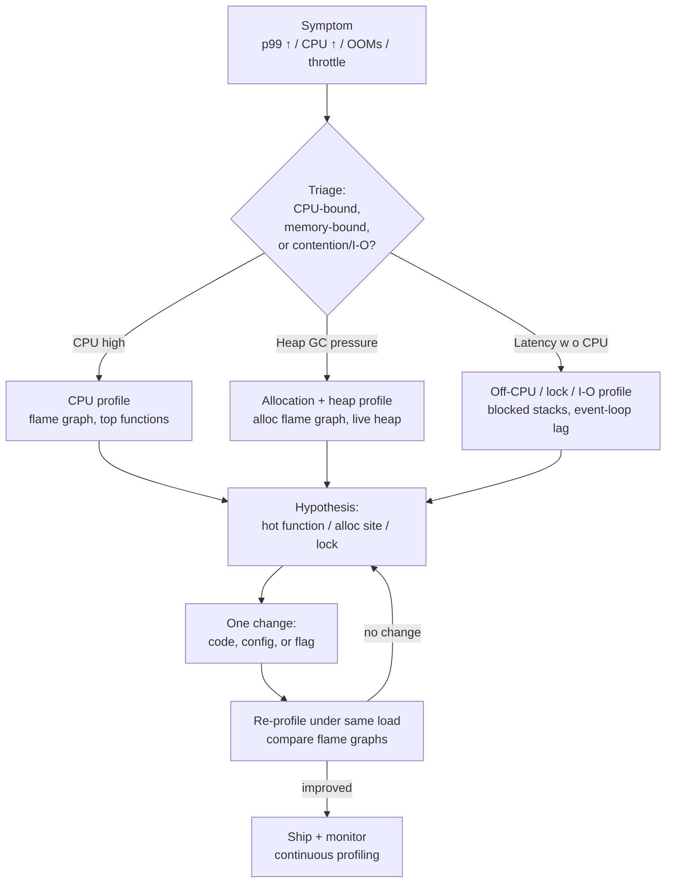
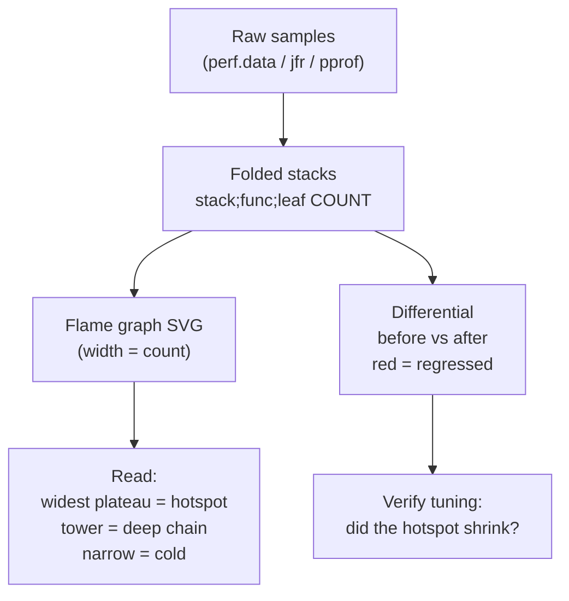
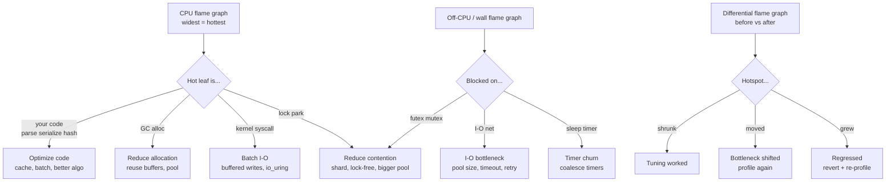
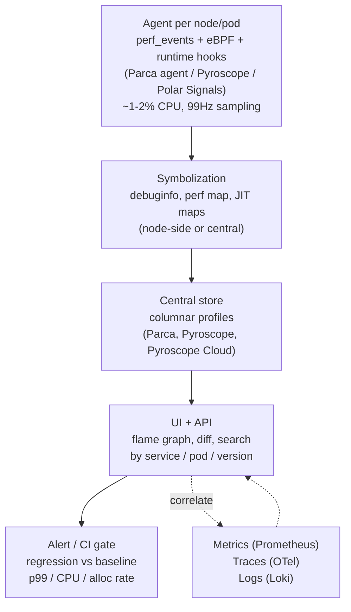
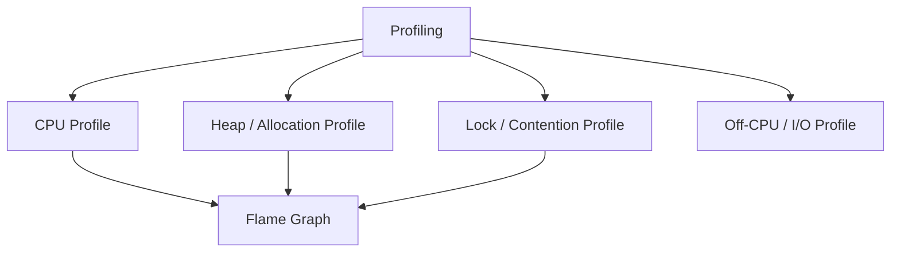
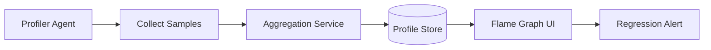
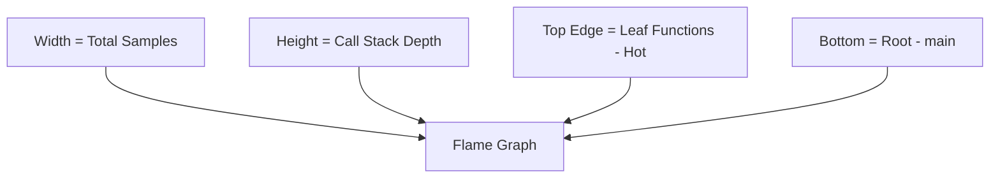

# Chapter 5 — Profiling and Performance Tuning

**What this chapter covers.** "It feels slow" is not a diagnosis. Profiling is how you turn latency, CPU, and memory complaints into quantified evidence — which function burns cycles, which allocation path churns the heap, which lock serializes your throughput, and which I/O call blocks the event loop. This chapter is the profiling and tuning playbook you use in production for every runtime in this volume: how profilers actually work (sampling, instrumentation, eBPF), how to capture and read CPU flame graphs, off-CPU and allocation profiles, how to use `perf`, `async-profiler`, `pprof`, `py-spy`/`austin`, `clinic`/`0x`, and eBPF/BCC for cross-runtime observability, how to build continuous profiling into your fleet, and how to tune methodically without cargo-culting flags. Chapter 1 covered JVM internals, Chapter 2 Go's runtime, Chapter 4 GC theory — here you learn to measure all of them.

Learning goals — after this chapter you should be able to:

- Distinguish profiler types — sampling vs. instrumenting vs. tracing (eBPF/kprobe/uprobe) — and explain their overhead, accuracy (safepoint bias, skid), and when each is appropriate for production vs. lab.
- Capture and interpret CPU flame graphs (including differential flame graphs), off-CPU profiles, allocation/heap profiles, and lock/mutex profiles using `perf`, `async-profiler`, `pprof`, and language-specific tools.
- Profile JVM, Go, Python, Node, and Rust services with the right tool per runtime — `async-profiler`/`JFR` for JVM, `pprof`/`trace` for Go, `py-spy`/`austin`/`tracemalloc` for Python, `clinic`/`0x`/`perf_hooks` for Node, `perf`/`flamegraph-rs` for Rust — with real commands and container-aware pitfalls.
- Diagnose the canonical backend bottlenecks: CPU hotspots, allocation churn / GC pressure, lock contention, I/O blocking (event-loop stalls, thread-pool exhaustion), and memory leaks (heap growth, off-heap/direct buffers).
- Apply a systematic tuning loop — measure, hypothesize, change one variable, re-measure — and avoid common anti-patterns (premature micro-optimization, flag cargo-culting, optimizing without production profiles).
- Design continuous profiling for a fleet: always-on low-overhead sampling, symbolization, storage (Pyroscope/Parca), and integration with metrics/traces for correlation.

> **Scope.** Chapters 1–2 cover JVM and Go runtime internals; Chapter 4 covers GC theory and collector comparison; Chapter 6 covers Python/Node runtimes. This chapter is the measurement and tuning layer that sits above all of them. Volume 2, Chapter 11 — *Performance Analysis: perf, ftrace, eBPF* — covers Linux kernel observability primitives; Volume 11 — *Reliability/SRE* — covers SLOs and load testing. Read there for kernel and reliability context; read here for application profiling and performance tuning.

---

## 1. Why profiling comes before tuning

Tuning without profiling is guessing. Production backend performance is dominated by a small number of hot paths — Amdahl's law guarantees it — and those paths are rarely where you expect. Common misdiagnoses:

- "We need to scale horizontally" when a single synchronized map serializes all requests on one lock.
- "GC is slow" when allocation churn from per-request `JSON.parse`/`JSON.stringify` or `String` concatenation is the actual allocator hotspot.
- "The database is slow" when the service thread pool is saturated and requests queue before they ever reach the database.

Profiling answers three questions that metrics alone cannot:

1. **Where is time spent?** CPU, off-CPU (blocked), or GC?
2. **Why is memory growing?** Live heap growth vs. allocation rate vs. native/off-heap leak?
3. **What is the contention?** Which lock, channel, or event-loop stall serializes concurrency?



---

## 2. How profilers work

### 2.1 Sampling vs. instrumentation vs. tracing

| Technique | How it works | Overhead | Resolution | Bias / caveats |
|---|---|---|---|---|
| **Sampling** | Periodically interrupt to record stack (timer signal, `perf_event`, `SIGPROF`) | Low (1–5% at 99–997 Hz) | Statistical — needs many samples | Safepoint bias (JVM), skid, misses short-lived calls |
| **Instrumentation** | Insert probes/counters at entry/exit (JFR events, `pprof` labels, manual spans) | Medium (5–30% if heavy) | Exact counts for instrumented sites | Only sees what you instrument; can perturb timing |
| **Tracing (eBPF/kprobe/uprobe)** | Kernel or user probes fire on events (syscall, function entry, GC phase) | Low (eBPF JIT, per-event cost) | Event-driven, dynamic | Needs privileges, kernel version, symbol availability |

For backend services, **sampling CPU profilers** are the default — they are low-overhead, always-deployable, and answer "where is time spent" with flame graphs. Instrumentation and eBPF complement them for allocation, lock, and I/O questions.

### 2.2 Sampling: accuracy and pitfalls

- **Frequency.** 99 Hz (not 100 Hz) avoids aliasing with periodic work at 10/100 Hz. Async-profiler defaults to ~100 Hz; `perf record -F 99` is conventional; Go's CPU profile samples at 100 Hz.
- **Safepoint bias.** Classic JVM sampling (`jstack`-style) only samples at safepoints, over-representing code that reaches safepoints and under-representing tight loops. **Async-profiler** uses `AsyncGetCallTrace` + `perf_events` to sample at any instruction — use it instead of `jstack`/`JVisualVM` sampling.
- **Skid.** Hardware PMU sampling has skid — the reported IP is near but not exactly the interrupted instruction. For hotspot identification this does not matter; for precise line attribution, use `--call-graph dwarf` (expensive) or frame-pointer-based unwinding.
- **Symbolization.** Stripped binaries, JIT code, and inlined frames need symbol maps. JVM needs `perf map` agent or `async-profiler`'s built-in symbolization; Go needs `GODEBUG` or `pprof`'s own tables; Rust/C++ need debuginfo or `perf map` generation; Python/Node need frame-pointer or `py-spy`/`perf` integration.

### 2.3 Flame graphs and differential flame graphs

A flame graph stacks sampled call stacks with width proportional to sample count — the widest boxes are where time is spent. Read it bottom-up (entry) to top (leaf), and look for **plateaus** (wide flat tops = hot leaf) and **towers** (deep stacks = deep call chains).

```
All samples
─────────────────────────────────────────────
main; handleRequest; parseJSON; allocBuffer   ████████████  18%
main; handleRequest; queryDB; pg.query        ████████      12%
main; handleRequest; serialize; JSON.stringify█████████     14%
main; GC; mark; concurrentMark                ██████         9%
... (narrow stacks = cold code)
```

- **CPU flame graph** — on-CPU stacks. Hot CPU shows as wide.
- **Off-CPU flame graph** — stacks where threads are blocked (I/O, lock, sleep). Wide here means serialized or I/O-bound, not CPU-bound.
- **Allocation flame graph** — stacks weighted by bytes allocated, not samples. Reveals GC pressure sources even when GC itself is not hot.
- **Differential flame graph** — `before` vs. `after` (e.g., pre/post deploy). Red = more samples after, blue = fewer — directly shows what a change did. Essential for verifying tuning.



---

## 3. Toolchain by runtime

### 3.1 Linux `perf` — the substrate

`perf` is the Linux performance counter subsystem. It underlies almost everything: `perf record` samples hardware events (cycles, cache misses, branch misses) and kernel tracepoints; `perf script` dumps stacks; `perf report`/`perf annotate` show hotspots. Most higher-level profilers either use `perf_events` directly or complement it.

```bash
# System-wide CPU profile, 99 Hz, with call graphs (frame pointers preferred)
perf record -F 99 -a -g -- sleep 30
perf report --no-children          # flat profile
perf script | ./stackcollapse-perf.pl | ./flamegraph.pl > cpu.svg

# Per-process, with dwarf unwinding (if frame pointers missing)
perf record -F 99 -p $(pidof java) -g --call-graph dwarf -- sleep 30
perf script | stackcollapse-perf.pl | flamegraph.pl > java-cpu.svg

# Hardware counters — is the bottleneck frontend, backend, cache, branch?
perf stat -p $(pidof api) -- sleep 10
#  cycles, instructions (IPC), cache-misses, branch-misses, stalled-cycles-frontend

# Off-CPU / sched blocking (needs kernel tracepoints)
perf record -e sched:sched_switch -g -- sleep 10
# or use eBPF offcputime (BCC/bpftrace) — see §3.6

# In containers — need perf_event_paranoid and CAP_PERFMON / CAP_SYS_ADMIN
# Kubernetes: add to securityContext or run as privileged sidecar for profiling
# sysctl kernel.perf_event_paranoid=-1 kernel.kptr_restrict=0 (for symbolization)
```

Frame pointers vs. DWARF: Go and Rust can be built with frame pointers (`-fno-omit-frame-pointer` / `RUSTFLAGS="-C force-frame-pointers=yes"`); JVM needs `perf map` agent; Python/Node need `perf`'s Python/Node map agents or use runtime-specific profilers instead.

### 3.2 JVM — async-profiler and JFR

**async-profiler** is the JVM profiler to use — it profiles CPU, allocation, lock, and wall-clock without safepoint bias, with negligible overhead, and emits JFR or flame graphs directly.

```bash
# Attach to running JVM (no restart, no agent flag needed — uses Dynamic Attach)
./asprof -e cpu -d 30 -f cpu.html --title "CPU 30s" <pid>
./asprof -e alloc -d 30 -f alloc.html <pid>          # allocation flame graph (bytes)
./asprof -e lock -d 30 -f lock.html <pid>            # lock contention (wall time blocked)
./asprof -e wall -d 30 -f wall.html <pid>            # wall-clock (on-CPU + off-CPU)
./asprof -e nativemem -d 30 -f native.html <pid>     # native/off-heap (if NMT on)

# JFR output — import into JDK Mission Control or convert to flame graph
./asprof -e cpu --jfr -d 60 -f profile.jfr <pid>
jfr print --events jdk.ExecutionSample profile.jfr | head

# At startup (agent) — exposes HTTP endpoint for on-demand profiling
java -agentpath:/opt/asprof/libasyncProfiler.so=start,event=cpu,file=%t.html,interval=10ms \
     -XX:+FlightRecorder -XX:StartFlightRecording=disk=true,duration=0,maxsize=256m,filename=/var/log/app.jfr \
     -jar app.jar

# Heap / allocation deep-dive
jcmd <pid> GC.heap_dump /tmp/heap.hprof             # full heap dump (STW — pause proportional to heap)
jcmd <pid> JFR.dump filename=/tmp/dump.jfr           # JFR dump without restart
jmap -histo:live <pid> | head -n 40                  # histogram by class (live only — triggers Full GC)
jhsdb jmap --heap --pid <pid>                        # heap summary (G1 regions, humongous, metaspace)
```

Reading async-profiler output:

- CPU flame graph widening in `java.util.HashMap.get` / `String.equals` often means a hot map with bad hash distribution or string-heavy keys — fix with better hashing or interning.
- Allocation flame graph widening in `byte[]` via `JSONSerializer` / `ObjectMapper` means per-request serialization churn — fix with buffer reuse (`ThreadLocal<byte[]>`, Jackson `ObjectWriter` reuse, protobuf).
- Lock flame graph widening in `SynchronizedMap` / `synchronized` block means contention — fix with `ConcurrentHashMap`, striped locks, or lock-free structures.

**JFR (JDK Flight Recorder)** complements sampling with structured events: GC phases, allocation rate, thread parks, I/O stalls, class loading, and safepoint sync. JFR at 1–2% overhead can be always-on in production (JDK 17+ defaults make this cheap). Export via JFR streaming or scrape with `jfr-metrics`.

### 3.3 Go — pprof and trace

Go has first-class profiling built into the runtime — no external agent needed.

```go
import _ "net/http/pprof" // registers /debug/pprof/* handlers

// go tool pprof — pull profiles over HTTP
// CPU: 30s sample
go tool pprof -http=:8081 http://localhost:6060/debug/pprof/profile?seconds=30
// Heap: live objects (use allocs for allocation rate, not just live)
go tool pprof -http=:8081 http://localhost:6060/debug/pprof/heap
go tool pprof -http=:8081 http://localhost:6060/debug/pprof/allocs
// Goroutines: leaks show as unbounded stack count
go tool pprof -http=:8081 http://localhost:6060/debug/pprof/goroutine
// Mutex / block: needs explicit rates
// In init: runtime.SetMutexProfileFraction(5); runtime.SetBlockProfileRate(1000)
go tool pprof -http=:8081 http://localhost:6060/debug/pprof/mutex
go tool pprof -http=:8081 http://localhost:6060/debug/pprof/block

// Execution trace — scheduler, GC, goroutine blocking in one timeline
// Capture:
curl http://localhost:6060/debug/pprof/trace?seconds=5 > trace.out
go tool trace trace.out  # opens interactive timeline (scheduler, GC, netpoller, syscalls)
// Or: trace.Start / trace.Stop in code for scoped traces
```

```bash
# Flame graph from pprof (pprof --flamegraph or via speedscope)
go tool pprof -raw -output=cpu.pb.gz http://localhost:6060/debug/pprof/profile?seconds=30
# Convert to flame graph via pprof web UI or:
go tool pprof -top cpu.pb.gz          # top functions by flat/cum
go tool pprof -list handleRequest cpu.pb.gz  # annotated source for a function
pprof -http=:8082 cpu.pb.gz           # interactive web UI with flame graph tab

# Differential — compare before/after a deploy or flag change
go tool pprof -base before.pb.gz after.pb.gz  # shows delta

# Continuous profiling — push to Pyroscope/Parca
# github.com/grafana/pyroscope-go — 10s CPU + heap every 30s, < 2% overhead
```

Go-specific diagnostics:

- **Goroutine leak** — `goroutine` profile grows without bound; `trace` shows goroutines stuck in `chan send` / `IO wait` / `select`.
- **GC pressure** — `allocs` flame graph widens in `bytes.growSlice` / `encoding/json.Marshal` / `fmt.Sprintf`; fix with `sync.Pool`, `bytes.Buffer` reuse, `json.RawMessage`, or code generation (`easyjson`, `ffjson`).
- **Scheduler stall** — `trace` shows long `PROC` running without preemption (before Go 1.14, tight loops without function calls blocked scheduling; now mitigated but CPU-bound loops still delay GC assists).

### 3.4 Python — py-spy, austin, tracemalloc, cProfile

Python profiling is harder than JVM/Go because the GIL, interpreter overhead, and C extensions obscure stacks.

```bash
# py-spy — sampling, no instrumentation, works on running process, low overhead
py-spy record -o cpu.svg --pid <pid> --duration 30
py-spy top --pid <pid>                          # live top-like view
py-spy dump --pid <pid>                         # stacks of all threads

# austin — eBPF/frame-pointer based, even lower overhead, great for containers
austin -p <pid> -o austin.dat --interval 100
austin2speedscope austin.dat | speedscope        # or austin2flame

# cProfile — deterministic (instrumenting), higher overhead, good for local dev only
python -m cProfile -o profile.stats app.py
python -c "import pstats; pstats.Stats('profile.stats').sort_stats('cumulative').print_stats(30)"

# yappi — thread-aware cProfile alternative (shows wall vs CPU per thread)
import yappi
yappi.start()
# ... serve requests ...
yappi.get_func_stats().print_all()

# Allocation / memory
tracemalloc.start()
# ... run ...
snapshot = tracemalloc.take_snapshot()
snapshot.dump('/tmp/trace.dump')
# Compare two snapshots for leak detection:
# snap2.compare_to(snap1, 'lineno') — shows growth per line

# Heap — guppy3 / pympler for object counts
from pympler import tracker
tr = tracker.SummaryTracker()
tr.print_diff()  # shows new objects since last print_diff
```

Container note: `py-spy` and `austin` need `CAP_SYS_PTRACE` and access to the target process's memory; in Kubernetes run as a sidecar sharing `pid` namespace (`shareProcessNamespace: true`) or as an ephemeral debug container (`kubectl debug --target`).

### 3.5 Node.js — clinic, 0x, perf_hooks, --prof

```bash
# clinic.js — batteries-included suite (CPU, heap, event-loop, I/O)
clinic doctor --on-port 'autocannon localhost:$PORT' -- node server.js  # diagnosis
clinic flame --on-port 'autocannon localhost:$PORT' -- node server.js   # CPU flame graph
clinic bubbleprof -- node server.js                                      # async I/O bubble graph

# 0x — flame graphs via perf/ftrace under the hood
npx 0x server.js                    # opens flame graph in browser
npx 0x --visualize-only trace.dat  # from --perf-basic-prof

# Built-in V8 --prof + tick processor
node --prof server.js               # writes isolate-*.log
node --prof-process isolate-*.log > processed.txt  # human-readable ticks
# Convert to flame graph:
node --perf-basic-prof --interpreted-frames-native-stack server.js &
perf record -F 99 -p $(pidof node) -g -- sleep 30
perf script | stackcollapse-perf.pl | flamegraph.pl > node-cpu.svg

# perf_hooks — in-process GC + event-loop observability
```
```javascript
import { PerformanceObserver, performance } from 'node:perf_hooks';
import { monitorEventLoopDelay } from 'node:perf_hooks';

// GC observer
const gcObs = new PerformanceObserver((list) => {
  for (const e of list.getEntries()) console.log(`gc kind=${e.detail.kind} dur=${e.duration.toFixed(1)}ms`);
});
gcObs.observe({ entryTypes: ['gc'] });

// Event-loop lag — the single most important Node health metric
const h = monitorEventLoopDelay({ resolution: 10 });
h.enable();
setInterval(() => {
  console.log(`ELD p99=${(h.percentile(99)/1e6).toFixed(2)}ms max=${(h.max/1e6).toFixed(2)}ms mean=${(h.mean/1e6).toFixed(2)}ms`);
  h.reset();
}, 10000);

// Heap sampling (Chrome DevTools compatible)
// node --inspect server.js → chrome://inspect → Memory → Allocation sampling
// Or programmatically:
import v8 from 'node:v8';
import fs from 'node:fs';
fs.writeFileSync('/tmp/heap.heapsnapshot', v8.getHeapSnapshot()); // load in DevTools
```

Node-specific diagnostics:

- **Event-loop stall** — `clinic doctor` flags it, `monitorEventLoopDelay` quantifies it, flame graph shows the synchronous leaf (`JSON.parse` of a 10 MB payload, `crypto.pbkdf2Sync`, `fs.readFileSync` in a handler).
- **GC pressure** — `--trace-gc` + heap snapshot diff (look for retained closures, global `Map`/`Set` growth, `Buffer` leaks outside V8 heap counted in `external_memory`).
- **Worker thread / libuv pool exhaustion** — `UV_THREADPOOL_SIZE` (default 4) starves under concurrent `crypto`/`fs`/`dns` work; increase or offload to dedicated `worker_threads`.

### 3.6 eBPF — cross-runtime, kernel + user

eBPF is the universal substrate for off-CPU, I/O, and syscall profiling that runtime profilers miss.

```bash
# BCC tools (https://github.com/iovisor/bcc)
offcputime -p $(pidof java) 30          # off-CPU stacks (where threads block)
offwaketime -p $(pidof api) 30          # who wakes blocked threads
biolatency -m 30                        # block I/O latency histogram
tcpconnect -p $(pidof node)             # TCP connects per process
runqlat -m 30                           # scheduler run-queue latency (CPU pressure)

# bpftrace one-liners (https://github.com/bpftrace/bpftrace)
bpftrace -e 'tracepoint:sched:sched_switch { @[kstack] = count(); } interval:s:5 { print(@); clear(@); }'
bpftrace -e 'uprobe:/usr/lib/jvm/java-21-openjdk/lib/server/libjvm.so:JVM_StartThread { printf("new thread %d\n", pid); }'

# Continuous profiling agents that use eBPF + perf_events
# Parca agent, Pyroscope ebpf profiler, Polar Signals — push to central store

# Kubernetes — run as DaemonSet with privileges
# needs: CAP_BPF / CAP_PERFMON / CAP_SYS_ADMIN (kernel dependent), hostPID
```

eBPF shines for questions runtime profilers cannot answer: "why is p99 high when CPU is idle?" (answer: off-CPU blocking on a lock, DNS, or throttled cgroup), "which cgroup is throttled?", "which file descriptor is slow?".

---

## 4. Reading profiles: patterns and anti-patterns

### 4.1 CPU flame graph patterns

| Pattern | What it looks like | Likely cause | Fix |
|---|---|---|---|
| **Wide flat plateau** | One leaf function extremely wide | Hot loop, regex, serialization, hashing | Optimize the leaf (better algorithm, caching, SIMD, avoid regex) |
| **Tall tower** | Deep stack, moderate width | Deep call chain / middleware onion / ORM hydration | Flatten chain, batch queries, avoid N+1, inline middleware |
| **GC tower** | `GC.*` / `collect` / `mark` wide | Allocation churn, large live set | Reduce allocation (buffer reuse, pooling), tune GC, reduce live set |
| **Lock waiter** | `park` / `wait` / `futex` wide in wall profile | Contention on synchronized map, DB pool, semaphore | Increase pool, sharded map, lock-free, reduce critical section |
| **Kernel in user flame** | `syscall`, `epoll_wait`, `read` wide | Syscall-heavy (many small I/O, `fsync` per write) | Batch I/O, buffered writes, `io_uring`, avoid sync fsync |

### 4.2 Allocation / heap profile patterns

- **Sawtooth live heap + frequent GC** — high allocation rate, short-lived objects. Allocation flame graph points at the churn site. Fix by reusing buffers (`sync.Pool`, `ThreadLocal`, `Buffer.allocUnsafe` reuse) rather than tuning GC.
- **Monotonic live heap growth** — leak. Heap dump diff (JVM `hprof` diff, Go `heap` diff, Python `tracemalloc` compare, Node heap snapshot diff) identifies the growing class/type. Common culprits: unbounded caches without eviction, retained listeners/event handlers, `ThreadLocal` leaks across classloader reloads, global `Map`/`Set` in Node.
- **Off-heap / direct buffer growth** — JVM `DirectByteBuffer`, Node `Buffer`/`external_memory`, Python `mmap`/`numpy` — invisible to heap profiles. Track via `BufferPoolMXBean` (JVM), `v8.getHeapStatistics().external_memory` (Node), `resource.getrusage` / `tracemalloc` with `PYTHONMALLOC=malloc`.

### 4.3 Off-CPU / event-loop patterns

- **Wide `epoll_wait` / `kevent`** — actually idle (good). Narrow `epoll_wait` + wide `read`/`write` = I/O-bound.
- **Wide `futex` / `pthread_mutex`** — lock contention. Correlate with lock profiler (async-profiler `lock`, Go `mutex` profile, `perf lock`).
- **Node event-loop lag** — `monitorEventLoopDelay` p99 > 50 ms or `clinic doctor` flagging `event loop delay`. Flame graph shows synchronous leaf blocking the loop. Fix by moving to `worker_threads`, `setImmediate` chunking, or increasing libuv pool.



---

## 5. Performance tuning methodology

Tuning without methodology produces flag soup that is slower than the default. Use a loop:

**1. Establish a baseline.**

- Reproducible load (k6, wrk, vegeta, ghz for gRPC) at a fixed QPS/concurrency, pinned CPU/memory, warm JIT/GC (JVM needs warmup — don't measure cold).
- Baseline metrics: p50/p99/max latency, throughput (rps), CPU %, GC rate/CPU/pause, allocation rate, heap headroom, error rate.

**2. Profile under load.**

- CPU + allocation + wall/off-CPU profiles at the same load. Capture GC logs, `perf stat`, and (for Node) event-loop lag.

**3. Form a hypothesis from the profile.**

- "18% of CPU is in `Jackson ObjectMapper.writeValueAsBytes` per request — allocation flame graph confirms 1.2 GB/sec of `byte[]` churn. Hypothesis: serializer is the bottleneck."

**4. Change one variable.**

- One code change, one flag, or one config change per iteration. Examples:

```java
// Before — per-request ObjectMapper (allocates internal buffers each call)
byte[] body = new ObjectMapper().writeValueAsBytes(dto);

// After — reuse ObjectWriter (thread-safe, buffers reused)
private static final ObjectWriter WRITER = new ObjectMapper().writerFor(Dto.class);
byte[] body = WRITER.writeValueAsBytes(dto);
// Result: allocation rate -40%, GC CPU -6%, p99 -12 ms (measured)
```

```go
// Before — per-request buffer
buf := make([]byte, 0, 4096)
json.Marshal(dto) // allocates

// After — sync.Pool
var bufPool = sync.Pool{New: func() any { b := make([]byte, 0, 4096); return &b }}
bp := bufPool.Get().(*[]byte)
*bp = (*bp)[:0]
enc := json.NewEncoder(bytes.NewBuffer(*bp))
enc.Encode(dto)
bufPool.Put(bp)
// Measure: allocs/op and GC CPU must improve, otherwise Pool overhead not worth it
```

```bash
# JVM flag change — one at a time, with GC log diff
# Before: -XX:MaxGCPauseMillis=200 (default)
# After:  -XX:MaxGCPauseMillis=100
# Measure: young GC frequency ↑, pause p99 ↓, throughput ±? — keep only if p99 target needs it
```

**5. Re-profile and compare.**

- Differential flame graphs and metric diffs. If the hotspot shrank but a new one appeared, iterate. If nothing moved, the hypothesis was wrong — re-profile, don't stack more flags.

**6. Validate under production traffic.**

- Canary or shadow traffic; compare p99, GC, and CPU between baseline and canary cohorts. Promote only if canary wins on the SLO that matters.

### Common tuning anti-patterns

| Anti-pattern | Why it hurts |
|---|---|
| Changing 5 flags at once | Cannot attribute improvement; flag interactions hide regressions |
| Tuning on cold JVM / empty cache | JIT and GC warmup dominate cold measurements; profile warmed steady-state |
| Optimizing without a flame graph | Optimizes cold code; Amdahl's law says speedup is bounded by hot fraction |
| `sync.Pool` / buffer reuse everywhere | Adds complexity and `Pool` GC pressure; only where allocation flame graph proves churn |
| Increasing heap to "fix" GC | Larger heap = longer old GC pauses (G1/ZGC) and more live-set to mark; often the fix is less allocation, not more heap |
| Cargo-culted `-XX` flags from a blog | Flags are workload and JDK-version specific; always re-measure on your workload |

---

## 6. Continuous profiling in production

One-off profiling finds today's bottleneck. Continuous profiling (always-on, low-overhead sampling across the fleet) finds regressions the week they ship.

Architecture:



Implementation notes:

- **Agents.** Parca agent (eBPF + `perf_events`, Go/Rust/C++/Python/Node/JVM via frame pointers and `perf map`), Grafana Pyroscope (language SDKs + eBPF), Polar Signals — all ~1–2% overhead at 99 Hz. Run as DaemonSet (host `perf_events`) or sidecar (per-pod `pprof` scraping).
- **Symbolization.** JVM needs `perf map` or async-profiler's map; Go/Rust need frame pointers or debuginfo; Python needs `py-spy`/`austin` or `perf` Python map. Without symbols, flame graphs are hex addresses — useless.
- **Storage and retention.** Profiles are high-cardinality (service × pod × version × time). Use columnar stores (Parca's FrostDB, Pyroscope's TSDB) with downsampling. Retain raw for days, aggregated for weeks.
- **Integration.** Link profile time ranges to deploy markers, trace exemplars, and metric anomalies. A p99 spike at 14:03 should one-click to the flame graph at 14:03 — not require manual `perf record`.
- **Overhead budget.** 99 Hz system-wide sampling + per-runtime allocation sampling at 512 KB intervals is typically 1–3% CPU. If overhead matters, sample fewer pods (e.g., 10% of fleet) or lower frequency — not zero profiling.

```yaml
# Kubernetes — Parca agent DaemonSet (sketch)
apiVersion: apps/v1
kind: DaemonSet
metadata: { name: parca-agent }
spec:
  template:
    spec:
      hostPID: true
      containers:
        - name: parca-agent
          image: ghcr.io/parca-dev/parca-agent:latest
          args: ["--node=$(NODE_NAME)", "--store-address=parca:7070", "--sampling-ratio=1.0"]
          securityContext: { privileged: true }  # needs perf_event_open + BPF
          env: [{ name: NODE_NAME, valueFrom: { fieldRef: { fieldPath: spec.nodeName } } }]
          volumeMounts: [{ name: boot, mountPath: /boot }, { name: modules, mountPath: /lib/modules }]
---
# Grafana Pyroscope — per-service SDK (Go example)
# go get github.com/grafana/pyroscope-go
# pyroscope.Start(pyroscope.Config{ApplicationName: "api", ServerAddress: "http://pyroscope:4040",
#   ProfileTypes: []pyroscope.ProfileType{pyroscope.ProfileCPU, pyroscope.ProfileAllocObjects,
#                                         pyroscope.ProfileGoroutines, pyroscope.ProfileMutexCount}})
```

---

## 7. Distributed-systems lens

Profiling a single pod is necessary but not sufficient for fleet performance:

- **Tail-latency amplification.** A 20 ms GC pause on one replica at 1k rps across 100 replicas produces ~2000 requests per second that exceed a 20 ms p99 budget — scattered across replicas, invisible in per-pod averages but dominant in global p99. Continuous profiling with per-pod flame graphs + global p99 metrics makes this visible; per-pod averages hide it.
- **Allocation pressure as a noisy neighbor.** One endpoint that allocates 10x per request (e.g., an admin export that serializes the entire dataset) raises GC rate and CPU for the whole process, penalizing latency of all endpoints on that pod. Isolate allocation-heavy handlers to a separate deployment or worker pool, and gate them with allocation-aware rate limiting.
- **Profiling overhead and observability cost.** Always-on profiling at 99 Hz across 1000 pods burns ~10–30 cores fleet-wide. Budget it like logging — sample a representative subset if needed, and ensure profiling agents have their own cgroup limits so they don't starve application threads under CPU pressure.
- **From profile to capacity plan.** Allocation rate (bytes/sec) and GC CPU (%) are leading indicators for capacity — they rise before p99 does. Autoscale on GC CPU and allocation rate in addition to latency; otherwise HPA scales late, after p99 has already breached SLO.
- **Reproducibility and flag discipline.** Every tuning flag (`MaxGCPauseMillis`, `GOGC`, `--max-old-space-size`, `gc.set_threshold`) is a fleet-wide config that must be versioned, canaried, and rolled back like code. Store profile diffs alongside flag diffs in the deploy record — "flag X shipped at 14:03, CPU flame graph diff at 14:04 shows Y" is the audit trail that prevents flag soup.

---

## Key takeaways

- Profile before tuning — sampling CPU flame graphs (99 Hz, async-profiler/pprof/perf) are the default for on-CPU hotspots; off-CPU/wall, allocation, and lock profiles answer blocking, GC pressure, and contention questions that CPU profiles hide.
- No single profiler covers everything — use `perf` for hardware/kernel, `async-profiler`/`JFR` for JVM (no safepoint bias), `pprof`+`trace` for Go, `py-spy`/`austin`+`tracemalloc` for Python, `clinic`/`0x`/`perf_hooks` for Node, and eBPF (`offcputime`, `biolatency`) for cross-runtime I/O and scheduling.
- Read flame graphs for plateaus (hot leaf), towers (deep chains), and GC/lock towers; use differential flame graphs to verify every tuning change — if the hotspot didn't shrink, the hypothesis was wrong.
- Common backend bottlenecks are serialization/JSON churn, synchronized maps/pools, small-I/O syscall storms, and event-loop blocking — allocation flame graphs and off-CPU profiles find them faster than CPU profiles alone.
- Tune methodically — baseline under load, one change at a time, re-profile with differential flame graphs, canary in production — and avoid cargo-culting flags without measurement; larger heaps and `sync.Pool` everywhere often hurt.
- Continuous profiling (Parca/Pyroscope/Polar Signals as DaemonSet or SDK, 1–2% overhead, columnar store, symbolized flame graphs linked to deploys/traces) turns one-off debugging into fleet-wide regression detection.

## Further reading

- Gregg — *Systems Performance: Enterprise and the Cloud* (2nd ed., Pearson, 2020) — Ch. 5–7 (perf, flame graphs, eBPF) and *BPF Performance Tools* (Addison-Wesley, 2019).
- *Brendan Gregg's flame graph* — https://www.brendangregg.com/flamegraphs.html and *perf examples* — https://www.brendangregg.com/perf.html.
- async-profiler — https://github.com/async-profiler/async-profiler (docs, `CONTRIBUTING`, async-profiler vs. JFR).
- Go `pprof` — https://go.dev/blog/pprof and *Go Execution Tracer* — https://go.dev/doc/trace.
- py-spy — https://github.com/benfred/py-spy ; austin — https://github.com/P403n1x87/austin ; clinic.js — https://clinicjs.org/.
- Parca — https://www.parca.dev/ ; Grafana Pyroscope — https://grafana.com/docs/pyroscope/ ; Polar Signals — https://www.polarsignals.com/.
- *Linux perf wiki* — https://perf.wiki.kernel.org/ and *eBPF docs* — https://ebpf.io/.
- Volume 2, Chapter 11 — *Performance Analysis: perf, ftrace, eBPF* and Volume 11 — *Reliability/SRE* for kernel and SLO context.

### Profiling types overview



### Continuous profiling pipeline



### Flame graph reading guide


