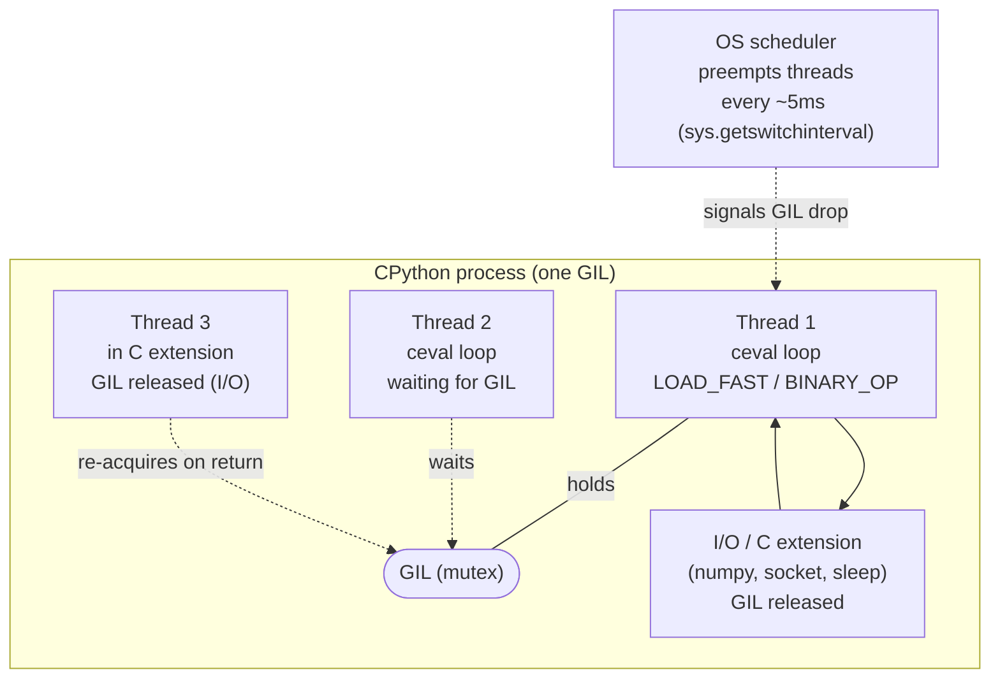
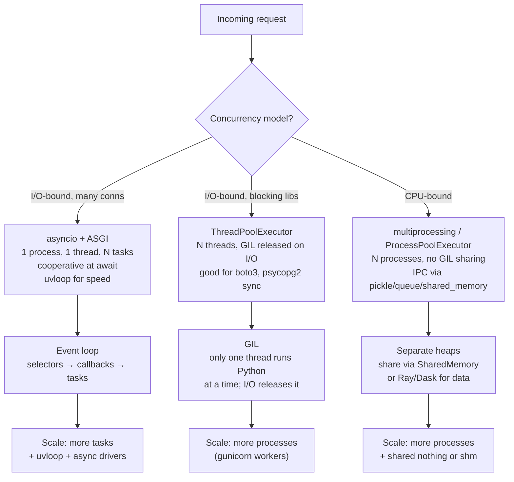
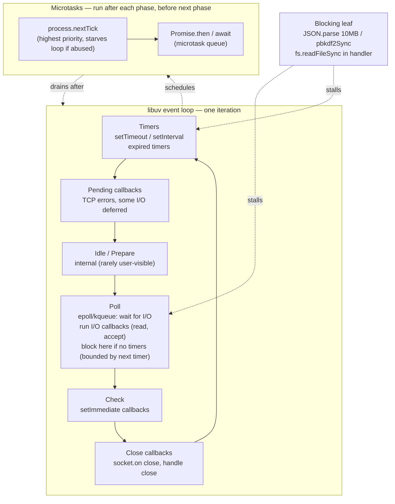
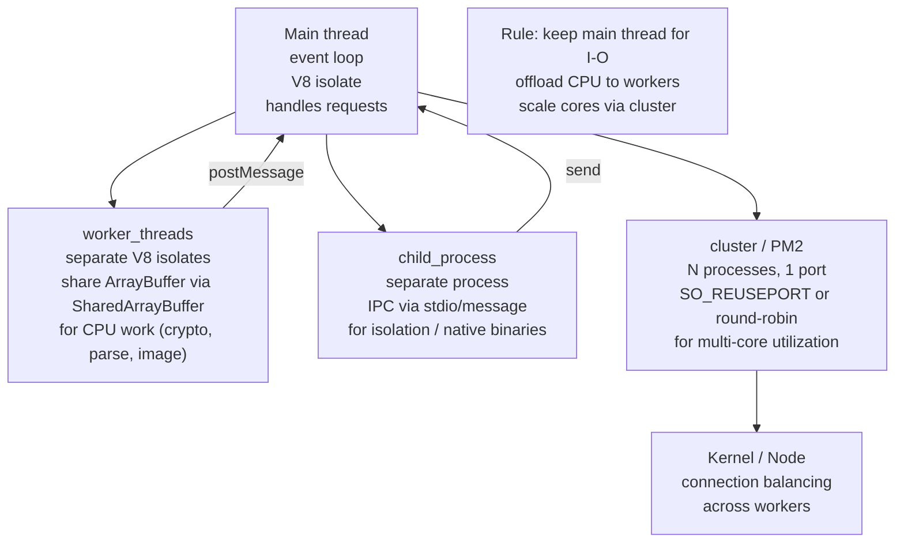
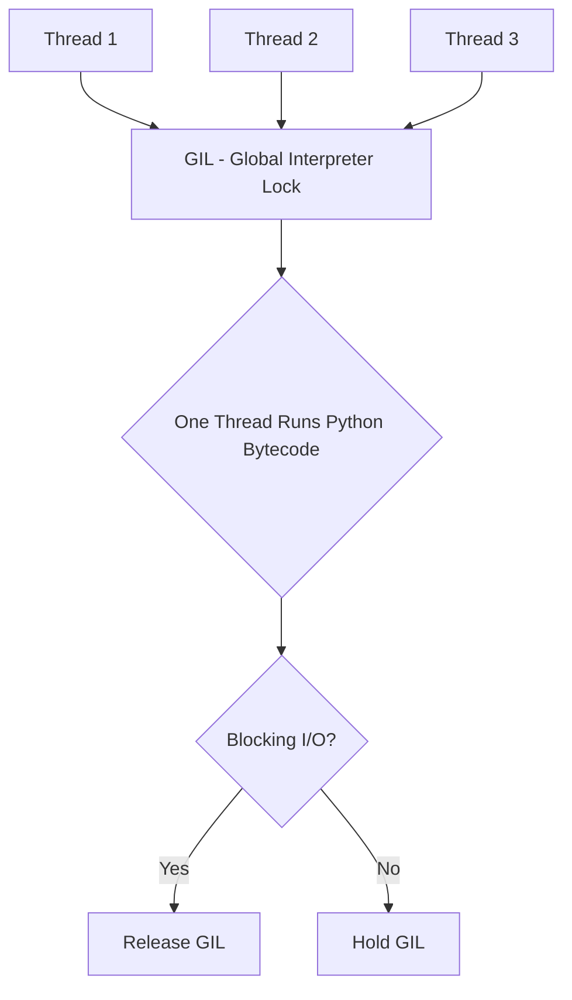
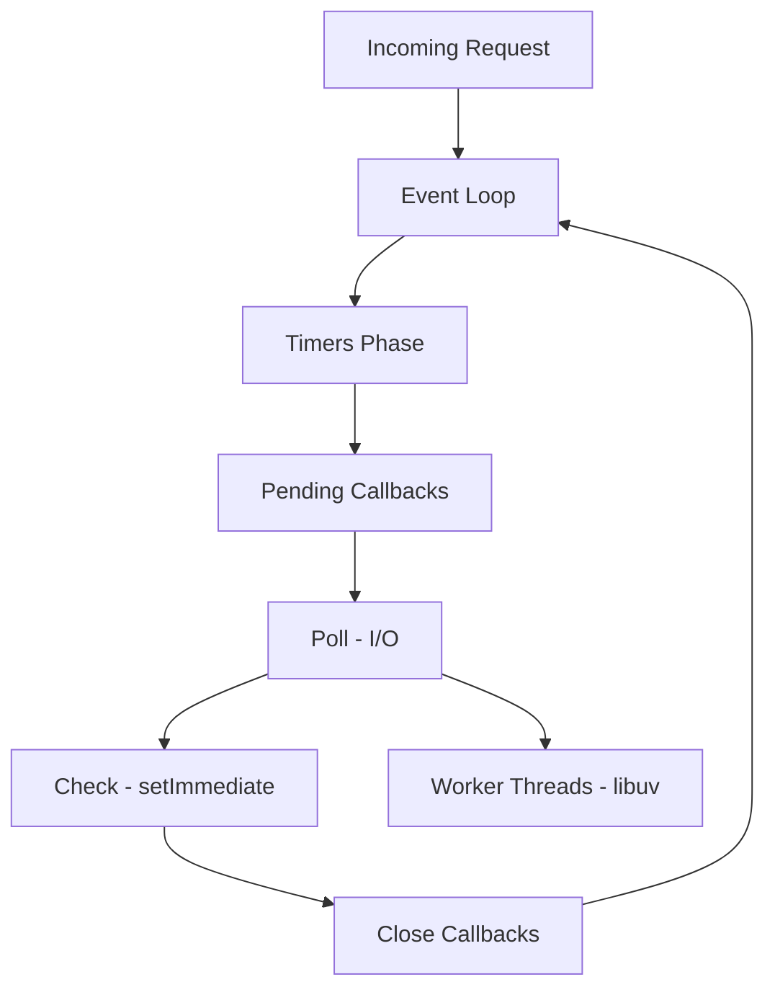

# Chapter 6 — Python and Node.js Runtimes for Backend

**What this chapter covers.** Python and Node.js run a huge share of backend services — not because they are the fastest runtimes, but because they are the most productive for I/O-bound APIs, orchestration layers, data-adjacent services, and frontends-for-backends where time-to-ship and ecosystem outweigh raw throughput. Yet both runtimes have sharp edges that surprise teams coming from JVM/Go: Python's GIL serializes CPU work on one core even with threads, and Node's single-threaded event loop stalls on any synchronous leaf. This chapter gives you the runtime you actually operate — CPython's interpreter, GIL (and free-threaded 3.13t), asyncio and the GIL-free future, plus V8 + libuv's event loop, worker threads, and clustering — with real service code (FastAPI/ASGI, Express/Fastify), process models (gunicorn/uvicorn, PM2/cluster), and production tuning (GC thresholds, `--max-old-space-size`, event-loop lag, `UV_THREADPOOL_SIZE`). Chapter 4 covered GC across runtimes and Chapter 5 covered profiling; here you learn to build, scale, and debug Python and Node services correctly.

Learning goals — after this chapter you should be able to:

- Explain CPython's execution model — source → bytecode → ceval loop, reference counting + cyclic GC, and the GIL's semantics, cost, and evolution (GIL per-interpreter in 3.12, free-threaded 3.13t / PEP 703) — and reason about when threads help vs. hurt.
- Write correct concurrent Python with `threading` + `concurrent.futures`, `multiprocessing`, and `asyncio` (including `uvloop`, `anyio`/`trio` nuances), and choose among WSGI (Flask/Django/gunicorn) vs. ASGI (FastAPI/Starlette/uvicorn) for backend services.
- Explain Node's runtime — V8 isolates, heap, JIT tiers, libuv event-loop phases, microtasks vs. macrotasks, and the thread pool — and why blocking the loop is the cardinal Node sin.
- Write correct concurrent Node with callbacks → promises → `async/await`, `worker_threads`, `child_process`, and `cluster`/`PM2`, and choose among Express, Fastify, and Nest for backend APIs.
- Configure production Python and Node: process managers, container sizing (`GOMEMLIMIT` vs. `--max-old-space-size` vs. Python RSS), health checks, graceful shutdown, observability (`py-spy`/`austin`, `clinic`/`0x`, `perf_hooks`), and GC/event-loop tuning.
- Reason about when Python or Node is the right runtime vs. Go/JVM/Rust (Chapter 9) and how to bound their weaknesses (CPU offload, polyglot boundaries, caching) in a larger fleet.

> **Scope.** Chapter 4 — Garbage Collection — covers refcount/cyclic GC and V8 Orinoco in depth; Chapter 5 — Profiling — covers `py-spy`, `clinic`, `0x`, and `perf_hooks` tooling. This chapter is the service runtime: interpreter/event-loop, concurrency, frameworks, and operations. Volume 13, Chapter 8 — FFI — covers embedding Python/Node via `pyo3`/`napi`; Chapter 9 — Runtime Selection — compares all runtimes. Read here for the Python/Node service stack; read Ch 4–5 for GC and profiling depth.

---

## 1. Why Python and Node for backend

Both runtimes optimize for **developer throughput and I/O concurrency**, not CPU throughput:

| Property | Python (CPython) | Node.js (V8 + libuv) | Go / JVM for contrast |
|---|---|---|---|
| Concurrency default | GIL-serialized threads; `asyncio` for I/O | Single-threaded event loop + thread pool | Goroutines / thread pools, true parallelism |
| CPU parallelism | `multiprocessing` or free-threaded 3.13t | `worker_threads`/`cluster` | Native |
| I/O model | Sync (WSGI) or `async/await` (ASGI) | `async/await` everywhere | Goroutines / virtual threads |
| Startup | Fast (ms) | Fast (ms) | Go fast, JVM slow (JIT warmup) |
| Memory per process | 50–300 MB RSS (pymalloc arenas) | 100–500 MB (V8 heap + external) | Go small, JVM large |
| Ecosystem strength | Data/ML (numpy, pandas, torch), scripting | Frontend-adjacent, JSON/HTTP heavy, npm | Varies |
| Typical backend role | API glue, data pipeline, ML serving, admin | BFF, real-time (WebSocket), SSR, API gateway | Core services, data plane |

Choose Python/Node when the service is **I/O-bound, ecosystem-bound, or team-bound** — and bound their CPU weakness explicitly (offload CPU work to Go/Rust workers, cache aggressively, or shard).

---

## 2. CPython — the interpreter, the GIL, and the execution model

### 2.1 Source to execution

```
Python source (.py)
  → parser (AST) → compiler (bytecode, .pyc in __pycache__)
    → ceval loop (stack-based VM, ~100 opcodes: LOAD_FAST, CALL, BINARY_OP)
      → objects on private heap (PyObject, ob_refcnt, ob_type)
        → ceval holds GIL while interpreting; releases on I/O / C extension boundary
```

CPython is a **bytecode interpreter** with a simple peephole optimizer and, since 3.11, a specializing adaptive interpreter (PEP 659) that quickens hot opcodes (`LOAD_GLOBAL` → `LOAD_GLOBAL_MODULE`, `BINARY_OP_ADD_INT`, etc.) for ~25% speedup. There is no JIT by default (experimental JIT in 3.13 via copy-and-patch, not yet production default). Every Python-level operation goes through the `ceval` loop under the GIL.

```python
import dis
def add(a, b): return a + b
print(dis.dis(add))
#  0 RESUME                   0
#  2 LOAD_FAST                0 (a)
#  4 LOAD_FAST                1 (b)
#  6 BINARY_OP                0 (+)
# 10 RETURN_VALUE
```

### 2.2 The GIL — what it is and why it exists

The **Global Interpreter Lock** is a mutex that protects CPython's object model: reference counts (`ob_refcnt`), GC bookkeeping, and interpreter state are not thread-safe without it. Only the thread holding the GIL may execute Python bytecode or touch Python objects.



Consequences for backend services:

- **CPU-bound threads do not parallelize.** Two threads doing `hashlib.sha256` in pure Python (or tight loops) run interleaved on one core, not in parallel. Wall time ≈ sum of CPU times, plus context-switch overhead.
- **I/O-bound threads do parallelize.** While one thread waits on `socket.recv` / `time.sleep` / `numpy.dot` (releases GIL in C), another thread can hold the GIL and run Python. This is why `ThreadPoolExecutor` helps for I/O fan-out but not for CPU fan-out.
- **GIL contention adds latency.** Many runnable Python threads contending for the GIL increase scheduling jitter — visible as p99 spikes even when CPU is not saturated. Fewer threads + `asyncio` often beats many threads for I/O-bound services.

```python
# GIL demo — threads hurt CPU-bound work, help I/O-bound work
import time, threading, concurrent.futures, hashlib, requests

def cpu_work(n=200_000):
    for _ in range(n): hashlib.sha256(b"hello").digest()

def io_work(url="https://httpbin.org/delay/1"):
    requests.get(url, timeout=5)

# CPU-bound: sequential is faster than threaded (GIL serializes anyway)
start = time.perf_counter()
for _ in range(4): cpu_work()
print(f"seq CPU: {time.perf_counter()-start:.2f}s")

start = time.perf_counter()
with concurrent.futures.ThreadPoolExecutor(max_workers=4) as ex:
    list(ex.map(lambda _: cpu_work(), range(4)))
print(f"threads CPU: {time.perf_counter()-start:.2f}s")  # often slower!

# I/O-bound: threaded wins (GIL released during I/O)
# Use asyncio or ThreadPoolExecutor for I/O fan-out; multiprocessing for CPU fan-out
```

### 2.3 The GIL is evolving — free-threaded Python

Three recent changes reshape the GIL story:

- **Python 3.12 — per-interpreter GIL (PEP 684).** `subinterpreters` (via `interpreters` / `concurrent.interpreters`) can run Python code in parallel, each with its own GIL. Still early, but enables true parallelism without multiprocessing IPC cost.
- **Python 3.13t — free-threaded build (PEP 703, `--disable-gil`).** A `python3.13t` build removes the GIL, using biased reference counting, deferred refcounts, and fine-grained locks. Single-threaded overhead is ~10–20% slower (refcount atomics), but multi-threaded CPU work scales linearly. Not yet the default build, but available via `pyenv`/`deadsnakes` and behind `PYTHON_GIL=0` in some builds. Expect this to become the production default over several releases.
- **Adaptive specializing interpreter (3.11+) + experimental JIT (3.13+).** Narrow the per-opcode overhead that the GIL serializes — less time under GIL per operation, more throughput even before free-threading.

Operational guidance today: write code that is correct under the GIL (no data races on Python objects) and it will be correct and faster under free-threaded Python. Avoid relying on GIL for correctness (e.g., `counter += 1` is not atomic under free-threading — use `threading.Lock` or `queue.Queue`).

### 2.4 Memory — refcount + cyclic GC (brief, see Chapter 4)

CPython's primary reclamation is **immediate reference counting** (`ob_refcnt`); the **cyclic GC** (generational, `gc` module, thresholds `(700, 10, 10)`) only handles container cycles. For backend tuning:

```python
import gc, sys, tracemalloc

# Observe GC
gc.set_debug(gc.DEBUG_STATS)  # logs each collection to stderr
print(gc.get_threshold())     # (700, 10, 10)
# Tune: lower gen0 threshold -> more frequent, shorter pauses (better p99)
gc.set_threshold(500, 10, 10)

# Allocation profiling
tracemalloc.start()
# ... serve traffic ...
snap = tracemalloc.take_snapshot()
for stat in snap.statistics('lineno')[:10]:
    print(stat)
```

`PYTHONMALLOC=malloc` + `MALLOC_ARENA_MAX=2` can reduce RSS fragmentation in containers (pymalloc arenas are not returned to the OS eagerly). Monitor RSS, not just Python heap — `resource.getrusage(RUSAGE_SELF).ru_maxrss` or `psutil`.

---

## 3. Python concurrency — threads, processes, asyncio

### 3.1 The three models



| Model | Parallelism | Overhead | Best for | Pitfall |
|---|---|---|---|---|
| `threading` / `ThreadPoolExecutor` | No (GIL) for CPU | Low (stack ~8 MB) | I/O fan-out with blocking drivers | CPU work serialized; many threads → GIL contention |
| `multiprocessing` / `ProcessPoolExecutor` | Yes (separate GILs) | High (fork + pickle, ~50 MB/process) | CPU work, isolation | IPC cost, shared state hard, fork safety |
| `asyncio` | Cooperative (one thread) | Very low (task ~1 KB) | Many concurrent I/O, WebSocket, proxies | One blocking call stalls all tasks (like Node) |

### 3.2 asyncio — the Python event loop

`asyncio` is Python's Node-like event loop: one thread, many tasks, cooperative at `await`. Blocking the loop (synchronous I/O, `time.sleep`, CPU loop) stalls every task — same cardinal sin as Node.

```python
import asyncio, time

# Bad — blocks the loop, stalls all tasks
async def handler_bad():
    time.sleep(1)  # blocks loop for 1s — every concurrent request waits
    return {"ok": True}

# Good — yields to loop
async def handler_good():
    await asyncio.sleep(1)  # yields — other tasks run
    return {"ok": True}

# CPU work — offload to thread/process pool so loop stays responsive
async def handler_cpu(data: bytes):
    loop = asyncio.get_running_loop()
    # run_in_executor uses ThreadPoolExecutor by default; pass ProcessPoolExecutor for CPU
    result = await loop.run_in_executor(None, lambda: expensive_hash(data))
    return result

# Fan-out with bounded concurrency (backpressure — like Go semaphore / Node p-limit)
sem = asyncio.Semaphore(20)
async def fetch_one(url: str):
    async with sem:
        return await http_get(url)  # async driver (httpx, aiohttp)

async def fetch_all(urls):
    return await asyncio.gather(*(fetch_one(u) for u in urls), return_exceptions=True)

# Timeouts and cancellation — always bound I/O
async def with_timeout():
    try:
        async with asyncio.timeout(2.0):  # Python 3.11+
            return await call_upstream()
    except TimeoutError:
        return fallback()
```

`uvloop` (written in Cython on top of `libuv` — same substrate as Node) replaces the default selector loop and cuts loop overhead 2–4x. Most ASGI servers use it by default when installed.

```bash
pip install uvloop httptools  # uvicorn auto-detects uvloop + httptools
# uvicorn --loop uvloop --http httptools app:app
```

### 3.3 WSGI vs. ASGI — the process model

- **WSGI** (PEP 3333) — synchronous callable `app(environ, start_response)`. One request per thread/process at a time. Drivers are blocking (`psycopg2`, `boto3`, `requests`). Scale by adding workers.
- **ASGI** (PEP on async) — async callable `app(scope, receive, send)`. One process handles many concurrent requests via `asyncio` tasks. Drivers must be async (`asyncpg`, `httpx`, `aioboto3`). Scale by adding tasks within fewer workers.

| Stack | Interface | Server | Concurrency | Drivers |
|---|---|---|---|---|
| Flask / Django (sync) | WSGI | gunicorn (sync workers), mod_wsgi | Workers × threads | Blocking (simple) |
| FastAPI / Starlette / Quart | ASGI | uvicorn, hypercorn, daphne | Tasks per worker | Async (needs async drivers) |
| Django (async views, 4.2+) | ASGI or WSGI | gunicorn+uvicorn worker, or uvicorn | Both | Mixed |

Most new Python backend services choose **FastAPI + uvicorn (ASGI)** for I/O concurrency and automatic OpenAPI generation; Django remains dominant for CRUD/admin-heavy services where WSGI + gunicorn is simpler.

---

## 4. Python in production — frameworks, servers, and tuning

### 4.1 FastAPI service (ASGI) — the modern default

```python
# app/main.py — FastAPI + asyncpg + httpx, production-ready skeleton
from contextlib import asynccontextmanager
from fastapi import FastAPI, Request, Response
from fastapi.responses import JSONResponse
import asyncpg, httpx, asyncio, time, logging

pool: asyncpg.Pool | None = None
http: httpx.AsyncClient | None = None
log = logging.getLogger("api")

@asynccontextmanager
async def lifespan(app: FastAPI):
    global pool, http
    pool = await asyncpg.create_pool(dsn="postgresql://app:secret@pg:5432/app",
                                     min_size=5, max_size=20, command_timeout=5)
    http = httpx.AsyncClient(timeout=httpx.Timeout(2.0, connect=0.5), limits=httpx.Limits(max_connections=100))
    log.info("startup: pool=%s http=%s", pool, http)
    yield
    await http.aclose()
    await pool.close()

app = FastAPI(lifespan=lifespan, title="api", version="1.2.3")

@app.middleware("http")
async def timing(request: Request, call_next):
    start = time.perf_counter()
    try:
        return await call_next(request)
    finally:
        elapsed = (time.perf_counter() - start) * 1000
        log.info("%s %s %.1fms", request.method, request.url.path, elapsed)
        # Expose as Prometheus histogram via middleware (prometheus_client)

@app.get("/healthz")
async def healthz(): return {"ok": True}

@app.get("/users/{uid}")
async def get_user(uid: int):
    async with pool.acquire() as conn:
        row = await conn.fetchrow("SELECT id, name FROM users WHERE id=$1", uid)
    if not row: return JSONResponse({"error": "not found"}, status_code=404)
    # Fan-out example — enrich from upstream with timeout + backpressure
    try:
        async with asyncio.timeout(1.5):
            profile = await http.get(f"http://profile-svc/users/{uid}")
            profile.raise_for_status()
    except Exception as e:
        log.warning("profile fetch failed uid=%s err=%s", uid, e)
        profile = None
    return {"id": row["id"], "name": row["name"], "profile": profile.json() if profile else None}

# Graceful shutdown — uvicorn handles SIGTERM → lifespan yield resumes → pool/http closed
# Liveness vs readiness: /healthz (always 200 if process alive), /readyz (200 only if pool+http ready)
@app.get("/readyz")
async def readyz():
    if pool is None or pool._closed: return JSONResponse({"ready": False}, status_code=503)
    try:
        async with asyncio.timeout(0.5):
            async with pool.acquire() as conn: await conn.fetchval("SELECT 1")
        return {"ready": True}
    except Exception as e:
        return JSONResponse({"ready": False, "error": str(e)}, status_code=503)
```

```bash
# Run — uvicorn with uvloop, multiple workers (processes), graceful shutdown
pip install "fastapi[standard]" asyncpg httpx uvloop httptools
uvicorn app.main:app --host 0.0.0.0 --port 8000 \
  --workers 4 --loop uvloop --http httptools \
  --timeout-graceful-shutdown 20 --log-level info

# Or gunicorn managing uvicorn workers (better signal handling, reload)
pip install gunicorn uvicorn[standard]
gunicorn app.main:app -k uvicorn.workers.UvicornWorker \
  --workers 4 --bind 0.0.0.0:8000 \
  --graceful-timeout 30 --keep-alive 5 --access-logfile - \
  --preload  # preload app before fork — copy-on-write saves RSS
```

### 4.2 Django/Flask via gunicorn (WSGI) — when sync is simpler

```python
# wsgi.py — Flask example
from flask import Flask, jsonify
import psycopg2.pool
app = Flask(__name__)
pg_pool = psycopg2.pool.ThreadedConnectionPool(5, 20, dsn="postgresql://...")

@app.get("/users/<int:uid>")
def get_user(uid):
    conn = pg_pool.getconn()
    try:
        with conn.cursor() as cur:
            cur.execute("SELECT id, name FROM users WHERE id=%s", (uid,))
            row = cur.fetchone()
        if not row: return jsonify(error="not found"), 404
        return jsonify(id=row[0], name=row[1])
    finally:
        pg_pool.putconn(conn)

@app.get("/healthz")
def healthz(): return jsonify(ok=True)
```

```bash
# gunicorn — sync workers, threads per worker for I/O overlap
gunicorn wsgi:app --workers 4 --threads 4 --bind 0.0.0.0:8000 \
  --worker-class gthread --graceful-timeout 30 --max-requests 1000 --max-requests-jitter 100
# max-requests: recycle workers periodically — mitigates pymalloc fragmentation / slow leaks
# gthread: each worker has 4 threads; I/O releases GIL so threads help

# Gevent/eventlet workers (legacy async via greenlets) — avoid for new services; prefer ASGI
```

### 4.3 Container and Kubernetes config

```yaml
apiVersion: apps/v1
kind: Deployment
metadata: { name: api-py }
spec:
  replicas: 3
  template:
    spec:
      shareProcessNamespace: false
      containers:
        - name: api
          image: api-py:1.2.3
          command: ["gunicorn", "app.main:app", "-k", "uvicorn.workers.UvicornWorker",
                    "--workers", "2", "--bind", "0.0.0.0:8000", "--preload"]
          ports: [{ containerPort: 8000 }]
          env:
            - { name: PYTHONMALLOC, value: "malloc" }
            - { name: MALLOC_ARENA_MAX, value: "2" }
            - { name: PYTHONUNBUFFERED, value: "1" }
            - { name: UVLOOP, value: "1" }
          resources:
            requests: { memory: "512Mi", cpu: "500m" }
            limits:   { memory: "1Gi", cpu: "1000m" }
          readinessProbe: { httpGet: { path: /readyz, port: 8000 }, periodSeconds: 5 }
          livenessProbe:  { httpGet: { path: /healthz, port: 8000 }, periodSeconds: 10 }
          lifecycle:
            preStop: { exec: { command: ["/bin/sh","-c","sleep 10"] } } # drain before SIGTERM
          securityContext: { allowPrivilegeEscalation: false, readOnlyRootFilesystem: true }
---
# HPA — scale on CPU + request latency (via custom metrics), not just CPU
# Python services often saturate GIL before CPU — watch event-loop lag analog:
# asyncio loop lag via custom metric (time between scheduled call_later callbacks)
```

Sizing: `--workers` ≈ `2 × CPU cores` for WSGI (gunicorn guidance) or `1 × cores` for ASGI with high task concurrency; tune under load. Leave 30% memory headroom — pymalloc arenas and `Buffer` growth are outside V8-style heap limits.

---

## 5. Node.js — V8, libuv, and the event loop

### 5.1 How Node executes JavaScript

```
JavaScript source
  → V8 parser → AST → bytecode (Ignition) → optimized machine code (TurboFan)
    → heap (Orinoco GC — see Chapter 4: Scavenge young + concurrent old)
      → libuv event loop (polls epoll/kqueue/IOCP, runs timers, defers work to thread pool)
        → bindings (fs, crypto, dns, zlib) → thread pool (default 4) or kernel
```

Node is **single-threaded for JavaScript** — one V8 isolate, one call stack, one event loop per process. I/O is offloaded to the kernel (non-blocking `epoll`/`kqueue`) or to `libuv`'s thread pool (`fs`, `crypto`, `dns.lookup`, `zlib`). JavaScript never runs in parallel within one process; it interleaves at `await` / callback boundaries.

### 5.2 The event loop — phases in order



Key rules for backend services:

- **Timers vs. immediates.** `setTimeout(fn, 0)` runs in Timers phase (next iteration, after poll); `setImmediate(fn)` runs in Check phase (this or next iteration, after poll). Under I/O, `setImmediate` fires before `setTimeout(0)` — don't rely on ordering between them.
- **`process.nextTick` starves the loop.** `nextTick` callbacks run before any I/O or timer in the same iteration, and recursively queued `nextTick`s prevent the loop from advancing. Never use `nextTick` for unbounded recursion — use `setImmediate` to yield.
- **Microtasks (promises) run after each phase.** `await` resumes as a microtask — cheap, but a tight `for (await ...)` loop without yielding to the macrotask queue can still starve I/O for that iteration. Chunk with `setImmediate` if needed.
- **Poll phase is where Node waits.** If there are no timers, poll blocks on `epoll_wait` until I/O arrives. If timers are pending, poll blocks at most until the next timer expiry — then timers fire. This is why `setInterval` can drift under I/O load.

### 5.3 What blocks the loop — the cardinal sin

Any synchronous work on the main thread stalls timers, I/O callbacks, and request handlers:

```javascript
// Bad — blocks loop for ~40ms (10 MB JSON), stalls every concurrent request
app.get('/data', (req, res) => {
  const big = fs.readFileSync('./10mb.json', 'utf8'); // sync I/O — blocks
  const obj = JSON.parse(big);                          // sync CPU — blocks
  const hash = crypto.pbkdf2Sync('secret', 'salt', 100000, 64, 'sha512'); // sync CPU — blocks
  res.json(obj);
});

// Good — offload each to non-blocking or worker
import { readFile } from 'node:fs/promises';
import { Worker } from 'node:worker_threads';

app.get('/data', async (req, res) => {
  const big = await readFile('./10mb.json', 'utf8'); // libuv thread pool (async)
  const obj = JSON.parse(big); // still sync — but small; for large JSON use streaming parser
  // CPU work → worker thread (see §6.2)
  const hash = await hashInWorker('secret', 'salt');
  res.json({ ...obj, hash });
});

function hashInWorker(secret, salt) {
  return new Promise((resolve, reject) => {
    const w = new Worker('./hash-worker.js', { workerData: { secret, salt } });
    w.on('message', resolve); w.on('error', reject);
  });
}
// hash-worker.js: parentPort.postMessage(crypto.pbkdf2Sync(...))
```

### 5.4 libuv thread pool

`libuv` maintains a pool for operations that cannot be non-blocking at the OS level: `fs.*`, `crypto.pbkdf2`/`scrypt`, `dns.lookup` (getaddrinfo), `zlib`. Default size is **4** (`UV_THREADPOOL_SIZE`). Under concurrent load, pool exhaustion queues work — visible as latency without CPU saturation.

```bash
UV_THREADPOOL_SIZE=16 node server.js  # increase for fs/crypto-heavy services
# Or offload CPU crypto to worker_threads explicitly (preferred — isolates pool)
```

Monitor pool latency via `perf_hooks` or `clinic bubbleprof` — wide `fs`/`crypto` bands queuing indicate pool starvation.

---

## 6. Node.js concurrency — from callbacks to workers

### 6.1 Async evolution

```javascript
// Callbacks (legacy) — pyramid, error handling manual
fs.readFile('a.json', 'utf8', (err, data) => {
  if (err) return handle(err);
  fs.readFile('b.json', 'utf8', (err2, data2) => { /* ... */ });
});

// Promises / async-await (modern) — linear, try/catch, backpressure via await
import { readFile } from 'node:fs/promises';
async function load() {
  const [a, b] = await Promise.all([readFile('a.json','utf8'), readFile('b.json','utf8')]);
  return { a: JSON.parse(a), b: JSON.parse(b) };
}

// Bounded concurrency — p-limit / p-queue (don't Promise.all 1000 unbounded)
import pLimit from 'p-limit';
const limit = pLimit(20); // max 20 concurrent
const results = await Promise.all(urls.map(u => limit(() => fetch(u))));

// Timeouts — always bound upstream calls
async function withTimeout(promise, ms, label) {
  const ac = new AbortController();
  const t = setTimeout(() => ac.abort(new Error(`${label} timeout ${ms}ms`)), ms);
  try { return await promise(ac.signal); } finally { clearTimeout(t); }
}
```

### 6.2 Worker threads, child processes, and cluster



```javascript
// worker_threads — CPU offload with message passing
// main.js
import { Worker } from 'node:worker_threads';
function runCpuTask(data) {
  return new Promise((resolve, reject) => {
    const w = new Worker('./cpu-worker.js', { workerData: data });
    w.on('message', resolve);
    w.on('error', reject);
    w.on('exit', code => { if (code !== 0) reject(new Error(`worker exit ${code}`)); });
  });
}
// cpu-worker.js
import { parentPort, workerData } from 'node:worker_threads';
import crypto from 'node:crypto';
const hash = crypto.pbkdf2Sync(workerData.secret, workerData.salt, 100000, 64, 'sha512');
parentPort.postMessage(hash.toString('hex'));

// cluster — multi-core (one event loop per core)
import cluster from 'node:cluster';
import os from 'node:os';
import http from 'node:http';
if (cluster.isPrimary) {
  const n = parseInt(process.env.WEB_CONCURRENCY || os.cpus().length, 10);
  for (let i = 0; i < n; i++) cluster.fork();
  cluster.on('exit', (worker, code) => { console.error(`worker ${worker.process.pid} exit ${code}`); cluster.fork(); });
} else {
  http.createServer((req, res) => { res.end('ok'); }).listen(3000);
}

// PM2 — process manager (cluster, reload, logs, health) — alternative to raw cluster
// ecosystem.config.js
export default { apps: [{ name: "api", script: "./server.js", instances: "max", exec_mode: "cluster",
  max_memory_restart: "600M", env: { NODE_ENV: "production", UV_THREADPOOL_SIZE: "16" } }] };
// pm2 start ecosystem.config.js --env production
```

Choose:

- **`worker_threads`** for CPU bursts within a request (hashing, compression, JSON of large payloads) — stays in-process, shares memory.
- **`child_process`** for isolation (run `ffmpeg`, `sharp`, or a Python sidecar) — separate failure domain.
- **`cluster` / PM2** for multi-core scale — one event loop per core, kernel balances connections. In Kubernetes, prefer one process per pod and scale via replicas (simpler readiness/liveness) — use `cluster` only for bare-metal/VM deploys or when pod count is constrained.

---

## 7. Node.js in production — frameworks, tuning, and observability

### 7.1 Fastify vs. Express — the backend choice

```javascript
// Fastify — schema-validated, faster serialize, built-in pino logging
import Fastify from 'fastify';
const app = Fastify({ logger: true, trustProxy: true });

// Schema enforces contract and enables fast serialization (no per-request JSON.stringify reflection)
app.get('/users/:id', {
  schema: {
    params: { type: 'object', properties: { id: { type: 'integer' } }, required: ['id'] },
    response: { 200: { type: 'object', properties: { id: { type: 'integer' }, name: { type: 'string' } } } }
  }
}, async (req, reply) => {
  const row = await pool.query('SELECT id, name FROM users WHERE id=$1', [req.params.id]);
  if (!row.rows[0]) return reply.code(404).send({ error: 'not found' });
  return row.rows[0]; // Fastify serializes via compiled schema — 2-3x faster than JSON.stringify
});

app.get('/healthz', async () => ({ ok: true }));
app.get('/readyz', async (req, reply) => {
  try { await pool.query('SELECT 1'); return { ready: true }; }
  catch (e) { return reply.code(503).send({ ready: false, error: e.message }); }
});

await app.listen({ port: 3000, host: '0.0.0.0' });

// Graceful shutdown — Fastify close() drains keep-alive before exit
for (const sig of ['SIGTERM','SIGINT']) process.on(sig, async () => {
  await app.close(); process.exit(0);
});
```

Express remains the most common Node framework (middleware ecosystem, familiarity) but Fastify's schema-driven serialization and lower overhead make it the performance-conscious choice for backend APIs. NestJS adds DI/decorators on top of Express/Fastify for larger teams — choose by team preference, not runtime difference.

### 7.2 Event-loop health and GC

Two metrics dominate Node backend health: **event-loop delay** and **heap**.

```javascript
import { monitorEventLoopDelay, PerformanceObserver } from 'node:perf_hooks';
import v8 from 'node:v8';

// Event-loop lag — p99 > 50ms means the loop is blocked (sync leaf or GC)
const h = monitorEventLoopDelay({ resolution: 10 });
h.enable();
setInterval(() => {
  const p99 = h.percentile(99) / 1e6, max = h.max / 1e6, mean = h.mean / 1e6;
  console.log(`ELD p99=${p99.toFixed(1)}ms max=${max.toFixed(1)}ms mean=${mean.toFixed(1)}ms`);
  if (p99 > 50) console.warn('event loop lag high — check sync leaves / GC');
  h.reset();
}, 10000);

// GC observer
new PerformanceObserver(list => {
  for (const e of list.getEntries()) console.log(`gc kind=${e.detail.kind} dur=${e.duration.toFixed(1)}ms`);
}).observe({ entryTypes: ['gc'] });

// Heap — log periodically, alert on growth
setInterval(() => {
  const s = v8.getHeapStatistics();
  console.log(`heap used=${(s.used_heap_size/1e6).toFixed(0)}MB total=${(s.total_heap_size/1e6).toFixed(0)}MB ` +
              `external=${(s.external_memory/1e6).toFixed(0)}MB rss=${(process.memoryUsage().rss/1e6).toFixed(0)}MB`);
}, 30000);
```

Heap tuning:

```bash
# Size V8 old space to ~60-70% of container limit (external/code/buffers are outside V8 heap but inside RSS)
node --max-old-space-size=640 --max-semi-space-size=16 server.js  # for 1 GiB pod
# Larger semi-space → fewer Scavenges but longer young pauses; rarely needed

# GC tracing (verbose)
node --trace-gc --trace-gc-verbose server.js
# Scavenge 8.4 -> 7.2 MB, 0.8 ms  (young, frequent, STW on main thread)
# Mark-sweep 45.1 -> 28.3 MB, 12.4 ms (+ 8 ms concurrent)  (old, rare, mostly concurrent)
```

### 7.3 Observability — clinic, 0x, heap snapshots

```bash
# clinic — one-command diagnosis
clinic doctor --on-port 'autocannon localhost:$PORT' -- node server.js
# Flags: event loop delay, GC pressure, handles, CPU

clinic flame --on-port 'autocannon localhost:$PORT' -- node server.js  # CPU flame graph
clinic bubbleprof -- node server.js                                     # async I/O bubble graph

# 0x — flame graphs via perf
npx 0x server.js                       # opens flame graph
node --perf-basic-prof server.js &     # + perf record for mixed JS/native stacks
perf record -F 99 -p $(pidof node) -g -- sleep 30
perf script | stackcollapse-perf.pl | flamegraph.pl > node.svg

# Heap snapshot — Chrome DevTools or programmatic
node --inspect server.js  # chrome://inspect → Memory → heap snapshot diff
# Programmatic:
import v8 from 'node:v8'; import fs from 'node:fs';
fs.writeFileSync('/tmp/heap.heapsnapshot', v8.getHeapSnapshot());

# Container — clinic/0x need perf_event_open; run as privileged sidecar or DaemonSet
```

### 7.4 Kubernetes deployment

```yaml
apiVersion: apps/v1
kind: Deployment
metadata: { name: api-node }
spec:
  replicas: 3
  template:
    spec:
      containers:
        - name: api
          image: api-node:1.2.3
          command: ["node", "--max-old-space-size=640", "server.js"]
          ports: [{ containerPort: 3000 }]
          env:
            - { name: NODE_ENV, value: "production" }
            - { name: UV_THREADPOOL_SIZE, value: "16" }
            - { name: WEB_CONCURRENCY, value: "1" } # 1 per pod in K8s; scale via replicas
          resources:
            requests: { memory: "512Mi", cpu: "500m" }
            limits:   { memory: "1Gi", cpu: "1000m" }
          readinessProbe: { httpGet: { path: /readyz, port: 3000 }, periodSeconds: 5 }
          livenessProbe:  { httpGet: { path: /healthz, port: 3000 }, periodSeconds: 10 }
          lifecycle: { preStop: { exec: { command: ["/bin/sh","-c","sleep 10"] } } }
          securityContext: { allowPrivilegeEscalation: false, readOnlyRootFilesystem: true }
---
# HPA — scale on event-loop lag (custom metric via prometheus-adapter) + CPU
# ELD p99 > 30ms is a better scale signal than CPU for Node — it captures loop stalls that CPU misses
```

---

## 8. Python vs. Node — choosing and bounding

```mermaid
flowchart TB
    REQ2["New backend service"] --> Q1{"Workload?"}
    Q1 -->|CPU-bound / data-heavy| PYCPU["Python: offload to<br/>multiprocessing / Ray / Go sidecar<br/>Node: worker_threads / native addon"]
    Q1 -->|I-O fan-out, many conns| ASYNC2["Both work:<br/>Python ASGI + asyncio<br/>Node event loop<br/>Pick by team + ecosystem"]
    Q1 -->|Real-time (WS, SSE)| NODE2["Node: first-class WS/SSE<br/>Python: ASGI + websockets<br/>Both viable; Node slightly ahead"]
    Q1 -->|ML / data pipeline| PY2["Python: numpy/torch/pandas<br/>Node: call Python sidecar<br/>Don't do ML in Node"]

    PYCPU --> BOUND["Bound the weakness:<br/>cache, queue, circuit breaker<br/>separate CPU pool"]
    ASYNC2 --> BOUND
    NODE2 --> BOUND
    PY2 --> BOUND
```

Practical rules:

- **For CPU work, neither runtime is the compute — both are the orchestrator.** Hashing, image processing, ML inference, and heavy JSON transforms belong in `multiprocessing`/`ProcessPoolExecutor` (Python), `worker_threads` (Node), or a Go/Rust microservice behind a queue. Don't fight the GIL or the event loop — route around them.
- **Backpressure is explicit in both.** `asyncio.Semaphore` / `p-limit` / `asyncio.Queue(maxsize=N)` with `await queue.put` (blocks when full) are the Python/Node equivalents of Go's buffered channels — audit every fan-out for a bound.
- **Error handling diverges.** Python uses exceptions + `try/except` + context managers; Node uses promise rejections + `try/catch` around `await`. In both, unhandled rejections/exceptions crash or hang — wire `process.on('unhandledRejection')` (Node) and `sys.excepthook`/`asyncio.exception_handler` (Python) to structured logging and graceful shutdown.

---

## 9. Distributed-systems lens

Python and Node services amplify fleet-wide patterns that are invisible in single-process benchmarks:

- **GIL / event-loop stalls as tail-latency amplifiers.** One 50 ms loop stall on one Node replica at 1k rps × 100 replicas produces thousands of p99 breaches per second, scattered across replicas. Monitor `monitorEventLoopDelay` p99 and Python `asyncio` loop lag (custom `call_later` probe) per pod and aggregate globally — per-pod averages hide the tail.
- **Process-per-core vs. thread-per-request.** Python WSGI (`gunicorn` sync workers) and Node `cluster` both scale by adding processes, not threads. In Kubernetes this maps cleanly to pod replicas (one process per pod, scale via HPA), which gives better bin-packing, independent readiness, and per-pod heap isolation than multi-process pods. Prefer many small pods over few large multi-worker pods unless worker startup cost dominates.
- **Shared-nothing with external state.** Neither runtime shares heap across processes (Python `multiprocessing` pickles, Node `cluster` shares only the port). Session affinity, rate limiting, and coordination must live in Redis/Postgres/etcd, not in-process memory — design for it from day one or sticky sessions will haunt the migration to autoscaling.
- **Cold start and rolling deploys.** Both runtimes start fast (no JVM warmup), enabling rapid rolling deploys and quick autoscaling. But Python's import graph and Node's `require`/`import` cost still dominate startup — defer heavy imports (`import pandas` inside the handler or lazy `import()`) and measure cold-start time as a deploy SLO.
- **Polyglot offload as a scaling strategy.** The pragmatic fleet is polyglot: Python for ML/data, Node for BFF/real-time, Go/Rust for data plane and CPU workers, all behind gRPC/HTTP. Use queues (SQS/Kafka) and `worker_threads`/`ProcessPoolExecutor` as the seams — the Python/Node service enqueues CPU work and polls/streams the result, rather than doing it inline and stalling the GIL/loop.

---

## Key takeaways

- CPython is a bytecode interpreter (ceval loop, specializing adaptive interpreter since 3.11) with refcount + generational cyclic GC; the GIL serializes Python bytecode on one core — I/O releases it (so threads help for I/O), CPU does not (so use `multiprocessing` or `asyncio` + executors for CPU).
- The GIL is evolving — per-interpreter GIL (3.12) and free-threaded 3.13t (PEP 703) will make Python truly parallel; write GIL-safe code now (`Lock`/`Queue` for shared state) and it will scale later.
- `asyncio` is Python's event loop (one thread, cooperative at `await`, `uvloop` for speed) — never block it (`time.sleep`/`requests` inside `async def` stalls all tasks; use `asyncio.sleep`/`httpx`/`run_in_executor`); bound fan-out with `Semaphore`/`Queue(maxsize)`.
- WSGI (Flask/Django + gunicorn sync/gthread) is simple and blocking; ASGI (FastAPI/Starlette + uvicorn) is concurrent via `asyncio` tasks — choose ASGI for I/O concurrency, WSGI for CRUD simplicity; `gunicorn` managing `uvicorn` workers gives the best of both.
- Node is V8 (Ignition + TurboFan, Orinoco GC) + libuv event loop (timers → pending → poll → check → close, plus microtasks via `nextTick`/promises) with a 4-thread `libuv` pool for `fs`/`crypto`/`dns` — JavaScript is single-threaded; I/O is non-blocking, CPU must be offloaded.
- Blocking the Node loop (`readFileSync`/`JSON.parse` of large payloads/`pbkdf2Sync` in a handler) stalls all requests — use `fs/promises`, streaming parsers, and `worker_threads` for CPU; increase `UV_THREADPOOL_SIZE` for `fs`/`crypto`-heavy services.
- Concurrency in Node is `async/await` + `Promise.all` (bounded via `p-limit`/`p-queue` + `AbortSignal` timeouts), with `worker_threads` for CPU, `child_process` for isolation, and `cluster`/PM2 for multi-core — in Kubernetes prefer one process per pod and scale via replicas.
- Production requires explicit health (`/healthz` live vs. `/readyz` ready with DB check), graceful shutdown (drain keep-alive on `SIGTERM`, `preStop` sleep), and observability (`monitorEventLoopDelay` p99 + `v8.getHeapStatistics` for Node, `tracemalloc`/`py-spy`/`austin` for Python) — size `--max-old-space-size` and Python RSS to ~60–70% of pod limit and alert on loop lag / heap growth.

## Further reading

- *CPython source* — https://github.com/python/cpython (ceval.c, gil.c, gcmodule.c) and *PEP 703 — Making the Global Interpreter Lock Optional* — https://peps.python.org/pep-0703/.
- *PEP 684 — A Per-Interpreter GIL* — https://peps.python.org/pep-0684/ ; *PEP 659 — Specializing Adaptive Interpreter* — https://peps.python.org/pep-0659/.
- *Python docs: asyncio* — https://docs.python.org/3/library/asyncio.html ; *uvloop* — https://github.com/MagicStack/uvloop ; *FastAPI* — https://fastapi.tiangolo.com/ ; *Uvicorn* — https://www.uvicorn.org/ ; *Gunicorn* — https://docs.gunicorn.org/.
- *V8 design* — https://v8.dev/docs/design ; *libuv docs* — https://docs.libuv.org/en/v1.x/design.html ; *Node.js event loop guide* — https://nodejs.org/en/docs/guides/event-loop-timers-and-nexttick.
- *Node.js docs: worker_threads* — https://nodejs.org/api/worker_threads.html ; *cluster* — https://nodejs.org/api/cluster.html ; *perf_hooks* — https://nodejs.org/api/perf_hooks.html.
- *clinic.js* — https://clinicjs.org/ ; *0x* — https://github.com/davidmarkclements/0x ; *py-spy* — https://github.com/benfred/py-spy ; *austin* — https://github.com/P403n1x87/austin.
- McKinney — *High Performance Python* (2nd ed., O'Reilly) — GIL, asyncio, and profiling.
- Roberts — *High Performance Browser Networking* (O'Reilly) — event loop and I/O model context.

### Python GIL execution model



### Node.js event loop phases


