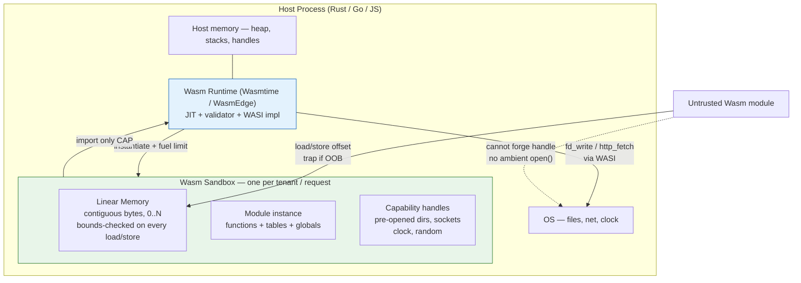
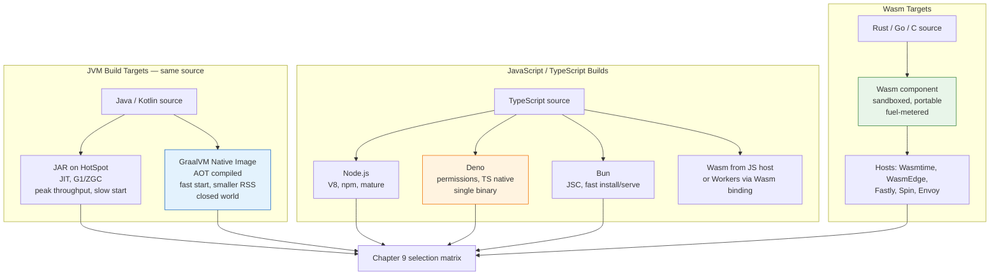
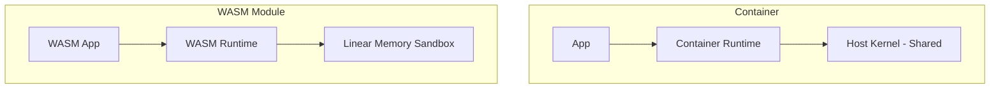
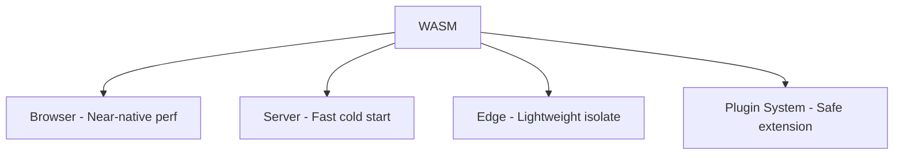
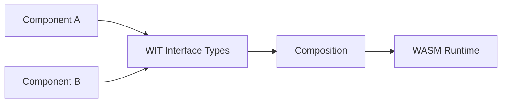

# Chapter 7 — WebAssembly and Emerging Runtimes

**What this chapter covers.** WebAssembly (Wasm) began as a browser optimization and has become a credible backend runtime: a portable, sandboxed, near-native-speed execution format with sub-millisecond cold starts, capability-based security, and language-agnostic composition. Around it has grown a second wave of emerging runtimes — Wasmtime, WasmEdge, and WAMR on the Wasm side; Deno and Bun rethinking JavaScript server runtimes; GraalVM Native Image collapsing the JVM to a native binary; and edge/serverless hosts like Fastly Compute and Fermyon Spin building entire platforms on Wasm. This chapter gives you the mental model, the system architecture, and hands-on code to evaluate and operate Wasm and these emerging runtimes in backend systems — where they already win, where they still lose, and how to embed them safely.

Learning goals — after this chapter you should be able to:

- Explain the Wasm execution model (stack machine, linear memory, modules, imports/exports) and why it enables strong sandboxing and fast startup.
- Distinguish WASI Preview 1 vs. Preview 2/Component Model/WIT and choose the right interface model for a host embedding.
- Compile Rust, Go (TinyGo), and C to Wasm and embed the module in a Rust (Wasmtime) and Go host with capability-restricted WASI.
- Reason about Wasm's security model: linear-memory isolation, capability-based WASI, and fuel metering / deterministic execution.
- Compare backend Wasm runtimes (Wasmtime, Wasmer, WasmEdge, WAMR) and edge/serverless Wasm platforms (Fastly, Cloudflare, Spin) on performance, WASI support, and operability.
- Position emerging runtimes — Deno, Bun, GraalVM Native Image — relative to Wasm and traditional runtimes for backend workloads.

> **Scope.** Chapter 1 covered the JVM, Chapter 2 Go, Chapter 3 Rust. Chapter 8 covers FFI and polyglot interop (including direct embedding of C/Rust extensions without Wasm). Chapter 9 builds a selection framework that scores Wasm and emerging runtimes alongside JVM/Go/Rust/Python/Node on latency, throughput, memory, startup, and operational maturity. Read this chapter for the mechanism and embedding; read Chapters 8–9 for FFI reasoning and final runtime choice.

---

## 1. Why Wasm on the backend

Backend runtimes traditionally trade on two axes — language ergonomics and isolation strength. Containers isolate at the OS layer (namespaces, cgroups): strong but heavy (tens of milliseconds to start, tens of megabytes of RSS). Language VMs isolate softly (JVM classloaders, Node `vm` module): light but leaky. Wasm occupies a distinct point:

- **Portable and deterministic.** The same `.wasm` binary runs on x86, ARM, and RISC-V hosts, in-process, without recompilation. Floating-point and trap semantics are defined; execution can be made deterministic (fuel metering) — valuable for blockchain, policy engines, and reproducible pipelines.
- **Sandboxed by construction.** No ambient authority: a module cannot open a file, socket, or clock unless the host explicitly grants a capability via WASI imports. Memory is a single contiguous linear array with bounds-checked access — no arbitrary pointer into host memory.
- **Fast startup and low footprint.** Instantiation is measured in microseconds to low milliseconds. Linear memory starts at kilobytes and grows on demand. For policy evaluation, UDF execution, plugin systems, and edge handlers, this beats containers and even most language VMs.
- **Language-agnostic composition.** The Wasm Component Model lets modules written in different languages compose via typed interfaces (WIT) without FFI marshaling fragility — a cleaner polyglot story than JNI/cgo.

Where Wasm already wins in production:

| Use case | Why Wasm beats alternatives | Example hosts |
|---|---|---|
| Policy / rule engines (OPA-style) | Deterministic, sandboxed UDFs per request | Envoy `wasm` filters, OPA-Wasm, Kubewarden |
| Plugin systems in SaaS | Tenant code isolation without per-tenant containers | Shopify Functions, Notion, Figma plugins |
| Edge handlers / API glue | Sub-ms cold start, global portability | Fastly Compute, Cloudflare Workers, Fermyon Spin |
| Data-pipeline UDFs | Ship user transforms to the data, not data to the transform | SingleStore, Redpanda Wasm transforms |
| Untrusted code execution | Stronger isolation than `eval`/`vm2` at lower cost than containers | Code runners, LLM tool sandboxes |

Where Wasm still loses: compute-heavy monoliths already well-served by Go/Rust (Wasm adds a translation layer without isolation payoff), services needing threads/gc/net system calls not yet mature in WASI, and ecosystems where libraries assume POSIX or heavy native deps (many C extensions, most Python/Node packages).

---

## 2. The execution model

Wasm is not "JavaScript without JavaScript". It is a **stack machine with structured control flow, a single linear memory, and explicit imports/exports**, designed so that validation and compilation are fast and isolation is cheap.

### 2.1 Module anatomy

A Wasm module is a single compilation unit containing:

- **Types** — function signatures `(params i32 i64) (results i32)`.
- **Functions** — bodies of flat stack-machine bytecode.
- **Linear memory** — one or more `memory` instances, each a contiguous `u8` array addressable by 32-bit (or 64-bit with `memory64`) offsets. Memory grows by `memory.grow` in 64 KiB pages.
- **Tables** — arrays of opaque references (primarily `funcref`) used for `call_indirect`.
- **Globals** — mutable or immutable values (`global i32 (mut)`).
- **Imports / Exports** — the module's boundary: what it needs from the host and what it offers. A minimal host interface might export `memory` and function `_start`, and import `wasi_snapshot_preview1::fd_write`.

Validation is decidable and linear: the engine checks types, stack height, and bounds before any code runs, then JIT-compiles (Cranelift, LLVM) or interprets — no undefined behavior in validated modules.

A minimal textual form (WAT) module:

```wat
;; add.wat — adds two i32 values, exported as "add"
(module
  (func (export "add") (param i32 i32) (result i32)
    local.get 0
    local.get 1
    i32.add)
  ;; Linear memory: 1 page = 64 KiB, growable to 16 pages
  (memory (export "memory") 1 16)
)
```

Compile and inspect:

```bash
# Install WABT toolkit
cargo install wabt --features wat2wasm  # or: apt install wabt

wat2wasm add.wat -o add.wasm
wasm-objdump -x add.wasm
wasm2wat add.wasm   # round-trip

# Inspect size
ls -lh add.wasm
# -rw-r--r--  1 ubuntu  72  add.wasm

# Optional: wat -> wasm -> native via wasmtime
wasmtime run --invoke add add.wasm 2 3  # prints 5
```

### 2.2 Linear memory and sandboxing

The most important architectural property for backend use is **linear-memory isolation**:



Key consequences:

- A buggy or malicious module can corrupt only its own linear memory, not host memory. Every `i32.load offset=...` is bounds-checked (often folded into a single guard page access at runtime for speed).
- Modules cannot `open("/etc/passwd", ...)` — there is no `open` import. They can only operate on handles the host pre-opened and handed in (WASI capabilities).
- Host and guest share nothing by default; data crosses via explicit copy through linear memory or the Component Model's typed lift/lower.

### 2.3 Component Model and WIT

The original Wasm core spec has a deliberately primitive type system (numbers, vectors). Real services need strings, records, variants, lists, and resources (handles). The **Component Model** (stabilizing 2024–2025) and **WIT (Wasm Interface Types)** add typed, language-agnostic interfaces on top of core Wasm:

```wit
// wit/transform.wit — interface a data pipeline exposes to user plugins
package pipeline:transform@0.2.0;

interface types {
  record event {
    id: string,
    payload: list<u8>,
    timestamp: u64,
  }
  variant error {
    invalid-input(string),
    internal(string),
  }
}

interface transform {
  use types.{event, error};
  transform: func(e: event) -> result<event, error>;
}

world pipeline-plugin {
  export transform;
  import wasi:logging/logging@0.1.0;
}
```

```bash
# Generate bindings from WIT
wit-bindgen rust wit --out-dir wit-bindgen --world pipeline-plugin
wit-bindgen go wit --out-dir wit/bindgen --world pipeline-plugin  # via wit-bindgen-go
```

Inside the runtime, components are composed by linking imports to exports with type-checked lift/lower — no ad-hoc `JSON.stringify` or `memcpy` serialization boundary, unlike traditional FFI. This is why the Component Model is the intended path for production polyglot composition on Wasm.

---

## 3. WASI: the system interface

WASI is to Wasm what POSIX is to Unix — except it is capability-based by default.

| Generation | Status | What it provides | How you program it |
|---|---|---|---|
| **WASI Preview 1** | Stable, widely supported | `fd_*`, `path_open`, `poll`, `random_get`, `clock_time_get` over pre-opened `fd`s | `cargo build --target wasm32-wasip1` |
| **WASI Preview 2** | Stabilizing (2024+) | Component Model + `wasi:io`, `wasi:filesystem`, `wasi:http`, `wasi:clocks`, `wasi:random` as typed WIT worlds | `cargo build --target wasm32-wasip2` |
| **WASI 0.3+ (in flight)** | Active proposals | `wasi:sockets` (TCP/UDP granularity), `wasi:config`, `wasi:keyvalue` | Per-proposal, behind flags |

Preview 1 is simple and supported everywhere; Preview 2 + Component Model is where typed composition lives but runtime support is still catching up (Wasmtime and WasmEdge lead; Wasmer and WAMR follow). For new backend systems, target **Preview 2/Component Model** and fall back to Preview 1 only when a required host lacks Preview 2.

A Rust module targeting WASI Preview 2:

```rust
// src/lib.rs — pipeline UDF compiled to a Wasm component
use wit_bindgen::generate;

generate!({ world: "pipeline-plugin", path: "wit" });

// wit-bindgen generates `export transform` trait to implement
struct MyTransform;

impl exports::pipeline::transform::transform::Guest for MyTransform {
    fn transform(e: exports::pipeline::transform::types::Event) -> Result<exports::pipeline::transform::types::Event, String> {
        if e.payload.is_empty() {
            return Err("empty payload".into());
        }
        // Example: uppercase payload bytes (placeholder transform)
        let out = e.payload.iter().map(|b| b.to_ascii_uppercase()).collect();
        Ok(exports::pipeline::transform::types::Event {
            id: e.id,
            payload: out,
            timestamp: e.timestamp,
        })
    }
}

export!(MyTransform);
```

Build it as a component:

```bash
rustup target add wasm32-wasip2
cargo build --target wasm32-wasip2 --release
# Component adapters glue core module to Preview 2
wasm-tools component new target/wasm32-wasip2/release/pipeline_plugin.wasm \
  -o pipeline_plugin.component.wasm
wasm-tools component wit pipeline_plugin.component.wasm  # verify WIT

# Or cargo-component for ergonomics
cargo install cargo-component
cargo component build --release
ls -lh target/wasm32-wasip1/release/*.wasm
```

---

## 4. Compiling to Wasm

### 4.1 Rust → Wasm

Rust is the best-supported Wasm language (small binaries, no GC, `no_std` friendly, `wasm32-wasip1/p2` tier-2 targets).

```bash
rustup target add wasm32-wasip1 wasm32-unknown-unknown

# Minimal library compiled to Wasm
cat > /tmp/check.sh << 'EOF'
#!/usr/bin/env bash
set -euo pipefail
cargo new --lib wasm-hello --vcs none
cd wasm-hello
cat > src/lib.rs << 'RS'
#[no_mangle]
pub extern "C" fn add(a: i32, b: i32) -> i32 { a + b }
RS
cat >> Cargo.toml << 'TOML'

[lib]
crate-type = ["cdylib"]
TOML
cargo build --target wasm32-unknown-unknown --release
ls -lh target/wasm32-unknown-unknown/release/*.wasm
EOF
```

Size discipline matters. A hello-world Wasm component can be kilobytes or megabytes depending on the toolchain:

```bash
# Size audit
wasm-tools strip target/wasm32-wasip2/release/app.wasm -o app.stripped.wasm
ls -lh app.wasm app.stripped.wasm target/wasm32-wasip2/release/app.wasm

# With wasm-opt
wasm-opt app.stripped.wasm -Oz -o app.opt.wasm
ls -lh app.opt.wasm

# Dependency bloat is real — enable for auditing
cargo bloat --crates --target wasm32-wasip2   # cargo install cargo-bloat
```

### 4.2 Go → Wasm (and TinyGo)

Go has two paths to Wasm:

```bash
# Standard Go: GC + goroutines compiled to Wasm (large binary)
GOOS=wasip1 GOARCH=wasm go build -o app.wasm ./...

# TinyGo: subset of Go, no full GC, much smaller binaries — preferred for Wasm
# https://tinygo.org/getting-started/install/
tinygo build -target=wasi -o app.tiny.wasm ./...
ls -lh app.wasm app.tiny.wasm
# app.wasm        ~2-8 MB   (full Go runtime)
# app.tiny.wasm   ~50-300 KB (TinyGo)
```

Trade-off: TinyGo omits reflection-heavy packages and `net/http` server support, many `encoding/json` features are limited, and cgo is unavailable. Full `GOOS=wasip1` supports the stdlib but produces large modules and slower execution through GC-in-Wasm. For UDFs and small handlers, TinyGo is usually the right call; for complex services, compile natively and embed Wasm only for the plugin surface.

### 4.3 C/C++ → Wasm

```bash
# Emscripten (browser-oriented but usable for standalone Wasm)
emcc src/filter.c -O2 -s STANDALONE_WASM=1 -s EXPORTED_FUNCTIONS='["_transform"]' -o filter.wasm

# WASI SDK (preferred for backend)
# https://github.com/WebAssembly/wasi-sdk
/opt/wasi-sdk/bin/clang --target=wasm32-wasi -O2 src/filter.c -o filter.wasm
wasm-objdump -x filter.wasm | head -40
```

### 4.4 What does not port cleanly

Libraries that assume threads (`pthread_create`), `fork`, raw sockets, or `mmap` often fail or require shims. Wasm threads (`wasm-threads` proposal, backed by `SharedArrayBuffer`-style shared memory) exist but are not universally supported in WASI hosts, and WASI Preview 1's networking is pre-open-fd oriented. Before committing, run `wasm-tools validate` and actually instantiate in the target host — static analysis is not enough.

---

## 5. Embedding Wasm in backend services

The interesting part is not compiling Wasm; it is **hosting** it — controlling capabilities, metering, and lifecycle per request.

### 5.1 Rust host with Wasmtime (Preview 2 + fuel metering)

```rust
// Cargo.toml
// [dependencies]
// wasmtime = { version = "24", features = ["component-model", "cranelift"] }
// wasmtime-wasi = "24"
// wasmtime-wasi-http = "24"
// anyhow = "1"
// tokio = { version = "1", features = ["full"] }

use anyhow::Result;
use wasmtime::{Config, Engine, Store, component::{Component, Linker}};
use wasmtime_wasi::{WasiCtx, WasiView, WasiCtxBuilder};
use wasmtime_wasi_http::WasiHttpView;

struct HostState {
    wasi: WasiCtx,
    http: wasmtime_wasi_http::WasiHttpCtx,
}

impl WasiView for HostState {
    fn ctx(&mut self) -> &mut WasiCtx { &mut self.wasi }
}
impl WasiHttpView for HostState {
    fn ctx(&mut self) -> &mut wasmtime_wasi_http::WasiHttpCtx { &mut self.http }
}

fn build_engine() -> Result<Engine> {
    let mut cfg = Config::new();
    cfg.wasm_component_model(true);
    cfg.async_support(true);
    // Fuel metering — deterministic execution + DoS protection per request
    cfg.consume_fuel(true);
    // Epoch interruption — cooperative cancellation (deadline exceeded)
    cfg.epoch_interruption(true);
    Engine::new(&cfg)
}

#[tokio::main]
async fn main() -> Result<()> {
    let engine = build_engine()?;

    // Background thread bumps the epoch every 50 ms so fuel/timeouts fire
    let engine2 = engine.clone();
    std::thread::spawn(move || loop {
        std::thread::sleep(std::time::Duration::from_millis(50));
        engine2.increment_epoch();
    });

    // Load a component built via `cargo component build`
    let component = Component::from_file(&engine, "pipeline_plugin.component.wasm")?;

    let mut linker = Linker::new(&engine);
    wasmtime_wasi::add_to_linker_async(&mut linker)?;
    wasmtime_wasi_http::add_to_linker_async(&mut linker)?;

    // Per-request store with tight capabilities
    let wasi = WasiCtxBuilder::new()
        // No preopened dirs by default — add only what the plugin needs
        // .preopened_dir("/tmp/scratch", "/scratch", wasmtime_wasi::DirPerms::READ, wasmtime_wasi::FilePerms::READ)?
        .inherit_stdout()
        .inherit_stderr()
        .build();

    let mut store = Store::new(&engine, HostState {
        wasi,
        http: wasmtime_wasi_http::WasiHttpCtx::new(),
    });

    // 10M fuel units ~ roughly 10M Wasm instructions; tune per workload
    store.set_fuel(10_000_000)?;
    store.set_epoch_deadline(10); // ~500 ms wall-clock (10 epochs * 50 ms)

    let (instance, _) = linker.instantiate_async(&mut store, &component).await?;

    // Typed invocation via generated bindings (wit-bindgen host side) would go here:
    // let plugin = pipeline::transform::Transform::new(&mut store, &instance)?;
    // let out = plugin.call_transform(&mut store, event).await?;

    // Fuel accounting
    let remaining = store.get_fuel()?;
    println!("fuel remaining: {remaining}");

    // Graceful handling of traps
    // - wasmtime::Trap::OutOfFuel  -> 429 / "plugin budget exceeded"
    // - epoch deadline exceeded    -> 504 / "plugin timed out"
    // - unreachable / OOB          -> 500 / "plugin fault"

    Ok(())
}
```

Production notes:

- **Pool instances.** Constructing `Component` compiles once; instantiating per request is cheap but not free — use `wasmtime::component::InstancePre` and a pool for hot paths.
- **Limit memory.** Call `store.limiter(|s| &mut s.limiter)` with `ResourceLimiter` to cap linear-memory growth (e.g., 16 MB per tenant plug-in).
- **Cache compilations.** Enable `Config::cache()` with a `cache.toml` so AOT artifacts survive restarts.
- **Never give ambient capabilities.** Capability discipline is the security model; granting `preopened_dir("/", "/")` negates the sandbox.

### 5.2 Go host with Wazero (zero-cgo, embeddable)

```go
// go.mod: module example.com/wasmhost
// require github.com/tetratelab/wazero v1.8.0

package main

import (
	"context"
	"fmt"
	"log"

	"github.com/tetratelab/wazero"
	"github.com/tetratelab/wazero/api"
	"github.com/tetratelab/wazero/imports/wasi_snapshot_preview1"
)

func main() {
	ctx := context.Background()

	// Wazero is pure Go — no cgo, hermetic builds
	r := wazero.NewRuntime(ctx)
	defer r.Close(ctx)

	if _, err := wasi_snapshot_preview1.Instantiate(ctx, r); err != nil {
		log.Fatal(err)
	}

	// Expose a host function to the guest: log(msg_ptr, msg_len)
	_, err := r.NewHostModuleBuilder("env").
		NewFunctionBuilder().
		WithFunc(func(ctx context.Context, m api.Module, ptr, length uint32) {
			if msg, ok := m.Memory().Read(ptr, length); ok {
				fmt.Printf("[wasm] %s\n", msg)
			}
		}).
		Export("host_log").
		Instantiate(ctx)
	if err != nil {
		log.Fatal(err)
	}

	wasm, err := r.CompileModule(ctx, mustRead("plugin.wasm"))
	if err != nil {
		log.Fatal(err)
	}

	// Per-tenant instantiation with resource limits is per-module config:
	cfg := wazero.NewModuleConfig().
		WithName("tenant-abc").
		WithStartFunctions("_start") // or "" to skip _start

	mod, err := r.InstantiateModule(ctx, wasm, cfg)
	if err != nil {
		log.Fatal(err)
	}
	defer mod.Close(ctx)

	// Call an exported function
	fn := mod.ExportedFunction("add")
	res, err := fn.Call(ctx, 2, 3)
	if err != nil {
		log.Fatal(err)
	}
	fmt.Printf("add(2,3) = %d\n", res[0])
}

func mustRead(path string) []byte {
	// os.ReadFile in real code
	return nil
}
```

### 5.3 Envoy / API gateway Wasm filter

```yaml
# Envoy Wasm filter — runs a Wasm module per request for auth or transform
# envoy.yaml (fragment)
http_filters:
- name: envoy.filters.http.wasm
  typed_config:
    "@type": type.googleapis.com/envoy.extensions.filters.http.wasm.v3.Wasm
    config:
      name: "authz"
      root_id: "authz_root"
      vm_config:
        runtime: "envoy.wasm.runtime.v8"  # or wasmtime via proxy-wasm
        code:
          local:
            filename: "/etc/envoy/authz.wasm"
        # Fuel/time limits enforced by Envoy SDK
      configuration:
        "@type": type.googleapis.com/google.protobuf.StringValue
        value: |
          {"allow_list": ["service-a", "service-b"]}
```

---

## 6. Wasm on the edge and serverless

Backend Wasm and edge Wasm share binaries but differ in hosting contract:

| Platform | Runtime under the hood | WASI / interfaces | Cold start | Autoscale unit | Where code runs |
|---|---|---|---|---|---|
| **Fermyon Spin** | Wasmtime | WASI Preview 2 + Spin SDK (`spin_sdk`) | < 5 ms | Per-request Wasm instance | Self-hosted / Fermyon Cloud / k8s (SpinKube) |
| **Fastly Compute** | Lucet (now Wasmtime) | WASI + Fastly host APIs | < 1 ms | Per-request | Fastly POPs (edge) + self-hosted Viceroy |
| **Cloudflare Workers** | V8 isolates (Wasm via Wasm binding) | Workers Runtime API | < 5 ms | Per-request isolate | Cloudflare edge |
| **AWS Lambda + Wasm** | Wasmtime/WasmEdge as library inside Lambda | WASI Preview 1 | ~50–150 ms (Lambda cold start dominates) | Per-invocation | AWS Lambda |

Fermyon Spin is the simplest backend Wasm platform to try locally:

```bash
cargo install spin-cli
spin new --template http-rust hello-wasm
cd hello-wasm
spin build
spin up  # http://127.0.0.1:3000/hello

# spin.toml
# [[component]]
# id = "hello-wasm"
# source = "target/wasm32-wasip1/release/hello_wasm.wasm"
# allowed_outbound_hosts = ["https://api.example.com"]
# [component.trigger]
# route = "/hello"
# [component.build]
# command = "cargo build --target wasm32-wasip1 --release"
```

```rust
// src/lib.rs — Spin handler
use spin_sdk::http::{IntoResponse, Request, Response};
use spin_sdk::http_component;

#[http_component]
fn handle_hello(req: Request) -> anyhow::Result<impl IntoResponse> {
    let body = format!("hello from wasm — path: {}", req.path());
    Ok(Response::builder()
        .status(200)
        .header("content-type", "text/plain")
        .body(body)?)
}
```

The distributed-systems takeaway: for request-scoped work that benefits from scale-to-zero and global placement, edge Wasm collapses the platform (compute + CDN + KV + queue) into one capability-granted sandbox. For durable, stateful services with long-lived connections, a Wasm host embedded in a normal Go/Rust service is usually more operable than an edge function.

---

## 7. Security properties and limits

Wasm's security story is strong but easy to misread.

```mermaid
flowchart LR
    subgraph Capabilities["Capability Boundary — host decides"]
        FD["Pre-opened dirs<br/>(read-only /tmp/scratch)"]
        HTTP["Outbound HTTP<br/>allow-listed hosts"]
        CLOCK["Clock + Random<br/>monotonic only"]
        KV["Key-Value handles<br/>per-tenant namespace"]
    end
    subgraph Sandbox["Wasm Module"]
        CODE["Untrusted code<br/>linear memory only"]
    end
    subgraph Enforcement["Runtime Enforcement"]
        FUEL["Fuel metering<br/>trap on budget exceeded"]
        EPOCH["Epoch deadline<br/>break infinite loops"]
        LIMIT["ResourceLimiter<br/>max memory 16 MiB"]
        CACHE["Compilation cache<br/>validated before exec"]
    end
    Capabilities -->|"imported handles only"| Sandbox
    Sandbox --> Enforcement
    Enforcement --> HostOS["Host OS — no ambient authority"]

    style Sandbox fill:#fff3e0,stroke:#ef6c00
    style Enforcement fill:#fce4ec,stroke:#c62828
```



What Wasm **does** guarantee:

- **Memory isolation** via validated bounds checks; no escape from linear memory to host heap.
- **Control-flow integrity** — indirect calls go through typed tables; no ROP gadget reuse.
- **Capability discipline** — without a granted handle, a module cannot touch the filesystem, network, or environment, even with a control-flow bug.

What Wasm **does not** guarantee without host work:

- **Side-channel isolation** — Spectre-style transient execution across host/guest is a host/runtime responsibility; keep runtimes patched and consider process isolation for mutually hostile tenants.
- **Denial of service** — an infinite loop inside Wasm halts the embedding thread unless you enforce fuel or epoch deadlines.
- **Supply chain of `.wasm`** — a compromised toolchain can still produce a valid but malicious module; sign and verify components (Sigstore/cosign for `.wasm` just as for containers) and pin `wit` versions.
- **Information flow** — WASI handles are capabilities, but confused-deputy bugs in host glue (e.g., passing a broader directory handle than intended) reintroduce ambient authority.

Operational checklist:

```bash
# Sign a Wasm component
cosign sign-blob pipeline_plugin.component.wasm --output-signature plugin.sig --yes

# Verify before instantiation (in CI or on the host)
cosign verify-blob pipeline_plugin.component.wasm --signature plugin.sig \
  --certificate-identity-regexp "https://github.com/org/repo/.github/workflows/release.yaml@.*" \
  --certificate-oidc-issuer https://token.actions.githubusercontent.com

# SBOM for the component's inputs
syft pipeline_plugin.component.wasm -o cyclonedx-json > sbom.json
```

---

## 8. Emerging runtimes beyond Wasm

Wasm is the headline emerging runtime, but three adjacent runtimes reshape backend choices in complementary ways.

### 8.1 Deno — TypeScript-first server runtime

Deno runs TypeScript natively, defaults to secure (no fs/net/env unless granted with `--allow-*`), and ships a single binary with formatter, linter, tester, and `deno compile` to a self-contained executable.

```bash
deno --version
deno run --allow-net --allow-read server.ts

# server.ts
Deno.serve({ port: 8000 }, (req) => {
  const url = new URL(req.url);
  if (url.pathname === "/health") return new Response("ok");
  return new Response(`hello from Deno ${Deno.version.deno}`, { status: 200 });
});

# Compile to a single binary
deno compile --allow-net --output server server.ts
./server  # no Deno install needed on the target
```

Fit for backend: edge functions, CLIs, and small services where Node compatibility is wanted but with explicit permissions and first-class TypeScript. Deno 2's `node:` compat shims run most npm packages; for heavy npm-native ecosystems (Prisma, `sharp`, `esbuild`), Node/Bun still lead.

### 8.2 Bun — fast JavaScript runtime and toolkit

Bun replaces Node's V8 + npm + Jest stack with JavaScriptCore + `bun` package manager + built-in test runner, bundler, and `Bun.serve`. Its headline is speed: faster installs, faster startup, and faster HTTP throughput than Node for many workloads, at the cost of a younger runtime with narrower operational history.

```bash
bun --version
bun run server.ts

# server.ts — Bun.serve
Bun.serve({
  port: 3000,
  fetch(req) {
    return new Response("hello from Bun");
  },
});

# Install is an order of magnitude faster than npm for large trees
time bun install
# vs time npm ci
```

Fit for backend: front-end-adjacent services (SSR, BFF), JS/TS APIs where cold-start and install speed matter, and build-heavy monorepos. Validate production readiness for long-lived, memory-sensitive services; Node and Deno have deeper GC and diagnostics tooling.

### 8.3 GraalVM Native Image — the JVM as a native binary

GraalVM Native Image ahead-of-time compiles a JVM application (Java, Kotlin, Scala) into a self-contained native binary with instant startup and small RSS — the JVM answering the cold-start challenge without leaving the ecosystem.

```bash
# Build a Micronaut/Quarkus/Spring Boot 3 native image
./mvnw -Pnative native:compile
ls -lh target/app  # single binary, no JDK required

# Typical startup comparison
time java -jar app.jar    # ~2-6 s to first request (JIT warmup)
time ./app                # ~20-80 ms to first request

# Native Image constraints surface at build time
# - Reflection must be declared (reachability metadata)
# - Resources must be included explicitly
# - Dynamic class loading is limited (closed-world assumption)
```

```yaml
# quarkus native-image reachability metadata (src/main/resources/META-INF/native-image/reflect-config.json)
[
  {
    "name": "com.example.Handler",
    "allDeclaredConstructors": true,
    "allPublicMethods": true
  }
]
```

Fit for backend: scale-to-zero APIs, CLI tools, and Kubernetes Jobs where startup under 100 ms matters and the team already owns JVM code. Not a fit for apps heavy on dynamic class loading (many legacy Spring features, heavy use of `Class.forName`), or where G1/ZGC's peak throughput beats Native Image's AOT-compiled throughput.



---

## 9. Observability and debugging

Wasm modules are black boxes unless the host instruments them:

- **Tracing inside the module.** `wasi:logging` and `wasi:http` give structured logs/traces; for Rust modules, `tracing` + `tracing-wasi` bridges to the host collector.
- **Host-side metrics.** Count per-module instantiations, fuel consumed, traps (out-of-fuel, OOB, unreachable), and memory growth — these are your SLI signals for tenant-plugin health.
- **Profiling.** Wasmtime's `wasmtime --profile` and `perf` integration, plus Wasm-specific `wasm-tools` demangling. For CPU hot spots, profile the host (async-profiler, pprof) — the Wasm JIT shows up as a code region, not a separate process.
- **Debugging.** `wasm-tools` + `wasmtime --debug` with DWARF, plus source maps for languages that emit them. Expect a sparser experience than native debugging; component-model DWARF support is improving but not yet at parity.

```bash
# Wasmtime profiling + DWARF
wasmtime run --profile=perf pipeline_plugin.component.wasm -- "_start"
perf record -F 99 -g -- wasmtime run pipeline_plugin.component.wasm

# Host tracing (Rust): enable in the embedding binary
RUST_LOG=wasmtime=debug,host=info cargo run

# WASI logging from inside the module surfaces via host stderr/stdout capture
```

---

## 10. The distributed-systems lens

Wasm's backend value is amplified — and its pitfalls sharpened — at fleet scale:

- **Fleet safety via heterogeneity.** Shipping untrusted tenant code as Wasm components instead of per-tenant containers reduces blast radius: a compromised or buggy component is confined to its linear memory and granted capabilities. One bad tenant cannot steal another tenant's file handles because there are none to steal. The host, however, must be bug-free — capability-passing bugs reintroduce ambient authority, so treat host glue as security-critical code with tight review.
- **Global placement without global builds.** A Wasm handler built once runs on any Wasmtime/WasmEdge host — edge POP, regional k8s, and on-prem. This lets a control-plane service push the same policy/transform to the data plane globally without per-architecture images. Sign components and pin WIT worlds so the fleet upgrades atomically.
- **Determinism for coordination.** Fuel metering makes Wasm execution deterministic and bounded, which matters for replicated state machines and event-sourced transforms: re-execution produces the same result, and a single call cannot monopolize a coordinator thread. Infinite-loop tenants are trapped, not killed.
- **Cold start vs. stateful.** Wasm excels at request-scoped, stateless work (auth, transform, policy check). For long-lived stateful services (connections, caches, consensus), a native Rust/Go service hosting Wasm for the *plugin surface* retains operability: connection pools, local caches, and pprof/JFR all live in the host, while tenant logic lives in the sandbox.
- **Supply chain of Wasm artifacts.** Treat `.wasm` like containers: build reproducibly, emit SBOMs, sign with Sigstore, and verify on the host before instantiation. A Wasm module's attack surface is its imports — audit WIT worlds as you would a service's IAM policy.

---

## Key takeaways

- Wasm is a sandboxed, portable, fast-starting bytecode with linear-memory isolation and WASI capabilities: modules cannot touch host resources unless the host grants a typed handle.
- The execution model is a validated stack machine with explicit imports/exports, compiled via Cranelift/LLVM; Component Model + WIT add typed, language-agnostic composition for polyglot backends.
- WASI Preview 1 is stable and widely supported; Preview 2 + Component Model is the forward path for typed host/guest boundaries — target Preview 2 for new systems.
- Wasmtime (Rust ecosystem, Component Model lead), WasmEdge (CNCF, LLM/AI host APIs), Wasmer (package registry), and WAMR (embedded) cover different constraints — Wasmtime is the default backend host; WAMR wins on embedded/IoT footprint.
- Host embedding must enforce fuel metering, epoch deadlines, `ResourceLimiter` memory caps, and capability discipline — without them, infinite loops and handle bugs negate the sandbox.
- Fermyon Spin and Fastly Compute deliver sub-5 ms Wasm serverless; Cloudflare Workers run Wasm via V8 isolates; Lambda-hosted Wasm is possible but Lambda cold start dominates.
- Deno (permissions + TS native), Bun (JSC speed), and GraalVM Native Image (JVM→native binary) are complementary emerging runtimes — Deno/Bun reshape the JS server story, Native Image answers JVM cold-start without leaving the ecosystem.

## Further reading

- WebAssembly Core Specification — https://webassembly.github.io/spec/core/
- WASI Preview 2 and Component Model — https://github.com/WebAssembly/WASI, https://component-model.bytecodealliance.org/
- Bytecode Alliance — Wasmtime docs — https://docs.wasmtime.dev/, https://bytecodealliance.org/
- WasmEdge docs — https://wasmedge.org/docs/
- WAMR (WebAssembly Micro Runtime) — https://github.com/bytecodealliance/wasm-micro-runtime
- Fastly Compute — https://developer.fastly.com/learning/compute/
- Fermyon Spin — https://spinframework.dev/, SpinKube — https://www.spinkube.dev/
- Cloudflare Workers — Wasm — https://developers.cloudflare.com/workers/wasm/
- Deno manual — https://docs.deno.com/runtime/manual, Bun docs — https://bun.sh/docs
- GraalVM Native Image — https://www.graalvm.org/latest/reference-manual/native-image/
- Luke Wagner, *WebAssembly Component Model* — design docs and WIT spec — https://github.com/WebAssembly/component-model


### WASM compilation and execution


### WASM vs container isolation



### WASM use cases map



### WASM component model


