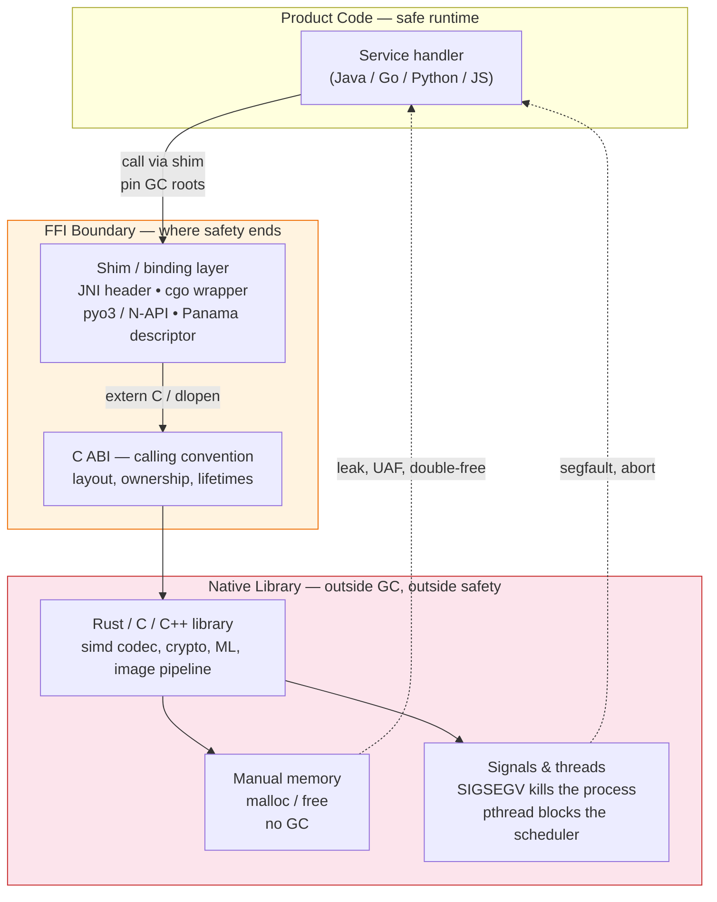
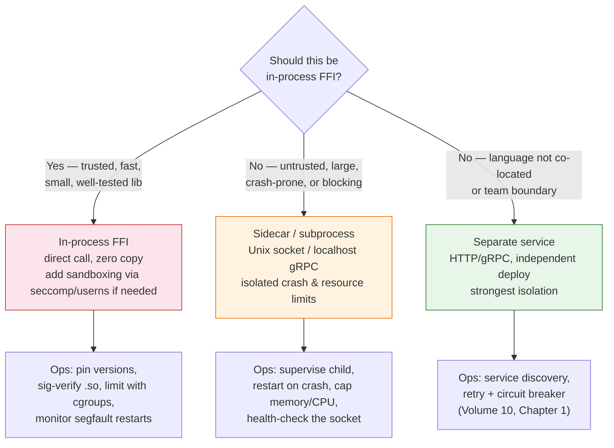

# Chapter 8 — FFI, Native Extensions, and Polyglot Interop

**What this chapter covers.** Backend systems are polyglot by necessity: a high-throughput API in Go calls a Rust classifier, a Python service shells out to a C image pipeline, and the JVM loads a native codec shared library that — if it segfaults — crashes the entire pod. Foreign Function Interfaces (FFI), native extensions, and polyglot runtimes make that heterogeneity possible; they also puncture the isolation assumptions every runtime otherwise provides. This chapter explains FFI mechanisms concretely (C ABI, JNI/JNA/Panama, cgo/CGo-free approaches, Python C/API and `pyo3`, Node N-API, Wasm as a safer boundary), shows production-safe embedding patterns with real code, enumerates failure modes that leak across the boundary (memory, threads, signals, GC interaction), and gives you a checklist for deciding whether to cross the boundary in-process or over a process/service boundary instead.

Learning goals — after this chapter you should be able to:

- Explain the C ABI as the lingua franca of FFI and why calling conventions, layout, and ownership must be agreed explicitly across languages.
- Use JNI, JNA, and Project Panama (FFM) for JVM↔native calls and choose among them by latency, safety, and operability.
- Understand cgo's cost on the Go scheduler (thread pinning, stack switching, blocking calls) and when to avoid it with pure-Go or CGo-free alternatives.
- Build Python native extensions with `pyo3`/Rust and Node addons with N-API/Rust (`napi-rs`), including GIL and libuv interaction.
- Reason about cross-boundary lifetimes (who owns and frees memory), exception/signal propagation, and GC root pinning.
- Decide between in-process FFI and out-of-process interop (sidecar, subprocess, service) using coupling, failure isolation, and deployment-safety criteria.

> **Scope.** Chapter 7 covered Wasm as a sandboxed, typed interop boundary. This chapter covers direct FFI — calling native code inside the same OS process, where isolation is weak and performance is high. Chapter 9 turns that understanding into a selection framework that scores FFI needs alongside startup, memory, and operability when picking a runtime. For Wasm-specific composition, see Chapter 7; for runtime selection, see Chapter 9.

---

## 1. The boundary and why it matters

Backend runtimes promise isolation: the JVM traps NPEs, Go recovers panics, Python raises exceptions, Node never segfaults (from JavaScript). FFI breaks that promise deliberately — by linking foreign code into the same address space so calls cost nanoseconds to microseconds instead of milliseconds over a socket, and so bulk data moves without serialization.



The central tension: **FFI gives the callee ambient authority** — access to the process's memory, file descriptors, and signal handlers — while **Wasm (Chapter 7) gives it only granted capabilities**. That difference explains why Wasm is the safer polyglot boundary and FFI the faster one. Most backend FFI incidents trace to forgetting which side owns what across that boundary.

---

## 2. The C ABI lingua franca

Almost every FFI ultimately speaks C. The C ABI defines:

- **Calling convention** — how arguments and return values travel (registers vs. stack, who cleans up). On x86-64 SysV (Linux): first six integer args in `RDI, RSI, RDX, RCX, R8, R9`, floats in `XMM0..7`, return in `RAX`/`XMM0`.
- **Layout** — struct field offsets, padding, and alignment (platform-dependent; `#[repr(C)]` in Rust pins it).
- **Linkage** — symbol names after mangling (`extern "C"` suppresses C++/Rust mangling).

A minimal contract between a Rust library and any caller:

```rust
// native/Cargo.toml
// [lib]
// crate-type = ["cdylib", "staticlib"]
// name = "filter"

// native/src/lib.rs
/// Uppercase ASCII bytes in place. Caller owns `ptr`/`len`; callee mutates
/// the buffer but does not free it. Returns 0 on success, -1 on null ptr.
#[no_mangle]
pub extern "C" fn filter_upcase(ptr: *mut u8, len: usize) -> i32 {
    if ptr.is_null() { return -1; }
    // Soundness: caller guarantees ptr..ptr+len is valid for writes for this call
    let slice = unsafe { std::slice::from_raw_parts_mut(ptr, len) };
    for b in slice.iter_mut() { b.make_ascii_uppercase(); }
    0
}

#[no_mangle]
pub extern "C" fn filter_version() -> u32 { 1 }
```

Build and inspect the shared library:

```bash
cargo build --release
ls -lh target/release/libfilter.so  # Linux
nm -D target/release/libfilter.so | grep filter
# 0000000000001230 T filter_upcase
# 0000000000001280 T filter_version

# Header a C caller would include (or generate via cbindgen)
cat > filter.h << 'EOF'
#pragma once
#include <stdint.h>
#include <stddef.h>
int32_t filter_upcase(uint8_t *ptr, size_t len);
uint32_t filter_version(void);
EOF

# Smoke-test from C
cat > test.c << 'EOF'
#include "filter.h"
#include <stdio.h>
#include <string.h>
int main(void) {
    char buf[] = "hello ffi";
    filter_upcase((uint8_t*)buf, strlen(buf));
    printf("%s\n", buf); // HELLO FFI
    return 0;
}
EOF
cc test.c -L target/release -lfilter -o test && LD_LIBRARY_PATH=target/release ./test
```

Tooling that generates the glue so you do not hand-write it:

| Direction | Generator | What it emits |
|---|---|---|
| Rust → C | `cbindgen` | `filter.h` from `#[no_mangle] extern "C"` |
| C → Rust | `bindgen` | `bindings.rs` from `filter.h` |
| C++ ↔ Rust | `cxx` | Safe bridge for C++ classes / Rust types |
| Python ↔ Rust | `pyo3` + `maturin` | CPython extension module |

---

## 3. JVM: JNI, JNA, and Panama

The JVM has three generations of native interop, with sharply different trade-offs.

### 3.1 JNI — the workhorse (fast, verbose, easy to misuse)

JNI (Java Native Interface) is the standard path: Java declares `native` methods, `javac -h` emits a header, and a shared library implements `JNIEXPORT ... JNICALL Java_pkg_Class_method(JNIEnv*, jobject, ...)`.

```java
// src/main/java/com/example/Filter.java
package com.example;

public final class Filter {
    static { System.loadLibrary("filter"); } // loads libfilter.so via java.library.path
    public static native int upcase(byte[] data);
    public static native int version();

    public static void main(String[] args) {
        byte[] buf = "hello jni".getBytes(java.nio.charset.StandardCharsets.US_ASCII);
        int rc = upcase(buf);
        System.out.println(new String(buf, java.nio.charset.StandardCharsets.US_ASCII) + " rc=" + rc);
    }
}
```

```c
// filter_jni.c — compiled against JDK headers
#include <jni.h>
#include "com_example_Filter.h"   // javac -h .
#include "filter.h"               // from cbindgen / hand-written

JNIEXPORT jint JNICALL Java_com_example_Filter_upcase(JNIEnv *env, jclass cls, jbyteArray arr) {
    jboolean isCopy;
    jbyte *ptr = (*env)->GetByteArrayElements(env, arr, &isCopy);
    if (ptr == NULL) return -1;
    jsize len = (*env)->GetArrayLength(env, arr);
    int rc = filter_upcase((uint8_t*)ptr, (size_t)len);
    // 0 = copy back and free, JNI_ABORT = free without copy-back, JNI_COMMIT = copy without free
    (*env)->ReleaseByteArrayElements(env, arr, ptr, 0);
    return rc;
}
JNIEXPORT jint JNICALL Java_com_example_Filter_version(JNIEnv *env, jclass cls) {
    return (jint)filter_version();
}
```

Compile and run:

```bash
javac -h . src/main/java/com/example/Filter.java
cc -I"$JAVA_HOME/include" -I"$JAVA_HOME/include/linux" -fPIC -c filter_jni.c -o filter_jni.o
cc -shared -o libfilter_jni.so filter_jni.o -L target/release -lfilter
java -Djava.library.path=.:target/release -cp src/main/java com.example.Filter
# HELLO JNI rc=0
```

JNI pitfalls that cause production incidents:

- **Forgetting `Release*` calls** leaks pinned GC memory (the JVM cannot move or collect a pinned array). Use `GetPrimitiveArrayCritical` only for tiny, bounded sections — it may stop the GC.
- **Holding `JNIEnv*` across threads** — `JNIEnv*` is thread-local; cache `JavaVM*` and call `AttachCurrentThread` for native threads.
- **Exceptions don't propagate** — a Java exception thrown in native code must be checked with `ExceptionCheck` and either cleared or returned; otherwise the next JNI call is undefined.

### 3.2 JNA — ergonomic, slower

JNA (Java Native Access) maps Java interfaces to native libraries without writing C, via libffi at runtime.

```java
// JNA mapping — no C glue
import com.sun.jna.Library;
import com.sun.jna.Native;

public interface FilterLib extends Library {
    FilterLib INSTANCE = Native.load("filter", FilterLib.class);
    int filter_upcase(byte[] ptr, long len);
    int filter_version();
}
// call:
FilterLib.INSTANCE.filter_upcase(buf, buf.length);
```

JNA trades 5–20× call overhead vs. JNI for zero native toolchain. Appropriate for startup-time configuration and infrequent calls; not for per-request hot paths.

### 3.3 Project Panama (FFM API) — the modern path (JDK 21+ GA in JDK 22)

Panama's Foreign Function & Memory API (`java.lang.foreign`) replaces JNI boilerplate with descriptors and arenas, with near-JNI performance and explicit lifetime control.

```java
// Panama FFM — JDK 22+ (API stabilized in 22, preview in 21)
import java.lang.foreign.*;
import java.lang.invoke.MethodHandle;
import static java.lang.foreign.ValueLayout.*;

public final class PanamaFilter {
    private static final Linker LINKER = Linker.nativeLinker();
    private static final SymbolLookup LIB = SymbolLookup.libraryLookup("filter", Arena.global());

    private static final MethodHandle UPCASE = LINKER.downcallHandle(
        LIB.find("filter_upcase").orElseThrow(),
        FunctionDescriptor.of(JAVA_INT, ADDRESS, JAVA_LONG) // int (uint8_t*, size_t)
    );
    private static final MethodHandle VERSION = LINKER.downcallHandle(
        LIB.find("filter_version").orElseThrow(),
        FunctionDescriptor.of(JAVA_INT)
    );

    public static void upcase(byte[] data) throws Throwable {
        try (Arena arena = Arena.ofConfined()) {
            MemorySegment seg = arena.allocateFrom(JAVA_BYTE, data);
            // seg is the native view; pass its address to native
            int rc = (int) UPCASE.invoke(seg, (long) data.length);
            if (rc != 0) throw new IllegalStateException("filter_upcase failed: " + rc);
            // copy back into Java array
            MemorySegment.copy(seg, JAVA_BYTE, 0, data, 0, data.length);
        } // arena closed — native memory freed, cannot use seg afterwards
    }
}
```

```bash
java --enable-native-access=ALL-UNNAMED -cp target/classes PanamaFilter
# --enable-native-access required; broad access is dangerous — scope to specific modules in production
```

Panama's core advantage: **lifetimes are explicit via `Arena`**, and `MemorySegment` is bounds-checked — wild pointer bugs that JNI invites become fail-fast exceptions. Prefer Panama for new JVM↔native boundaries.

---

## 4. Go: cgo and its discontents

Go's FFI is `cgo`, which lets Go call C directly. The cost is subtle and frequently underestimated.

```go
package filter

/*
#cgo LDFLAGS: -L${SRCDIR}/../native/target/release -lfilter
#include <stdint.h>
#include <stddef.h>
int32_t filter_upcase(uint8_t *ptr, size_t len);
*/
import "C"
import "unsafe"

func Upcase(b []byte) error {
    if len(b) == 0 { return nil }
    // Pointer passing rules: C must not retain the pointer after the call returns
    rc := C.filter_upcase((*C.uint8_t)(unsafe.Pointer(&b[0])), C.size_t(len(b)))
    if rc != 0 { return fmt.Errorf("filter_upcase: %d", rc) }
    return nil
}
```

```bash
go build ./...
CGO_ENABLED=0 go build ./...  # fails — CGo disabled, expected
go test -run TestUpcase -count=1 -bench BenchmarkUpcase
go vet ./...  # catches some unsafe.Pointer misuse
```

Why cgo is expensive for backend services:


- **Thread pinning.** The goroutine's `M` (OS thread) is locked for the duration of the C call and cannot run other goroutines.
- **Blocking.** A long-running C call holds that `M`; under high concurrency the runtime may create new OS threads (visible as `runtime: newosproc`), increasing RSS and context-switch cost.
- **No preemption.** C code cannot be preempted by the Go scheduler; CPU-heavy native work starves other goroutines on the same `P`.
- **Memory rules.** Passing Go pointers to C is restricted (`go doc cmd/cgo` — *C must not store Go pointers after the call*); violating it corrupts the GC.

When to avoid cgo:

- Use a **pure-Go replacement** (`purego` to call shared libraries without cgo via `dlopen` + `libffi`-style trampolines; `ebpf` libraries often have pure-Go counterparts).
- Use a **CGo-free wrapper** like `purego` or `ebpfgo` when you only need a few symbols and can tolerate `purego`'s overhead (similar to JNA — slower per call, but no thread pinning).
- Push heavy native work to a **sidecar or pool**: a small Rust/C microservice or a dedicated process pool (see section 7) so blocking is isolated from the request scheduler.

```go
// purego — call libfilter without cgo (no thread pinning, no CGO_ENABLED)
// go get github.com/ebitengine/purego
package filterpure

import (
    "github.com/ebitengine/purego"
    "unsafe"
)

var upcase func(ptr unsafe.Pointer, length uintptr) int32

func init() {
    lib, err := purego.Dlopen("libfilter.so", purego.RTLD_NOW|purego.RTLD_GLOBAL)
    if err != nil { panic(err) }
    purego.RegisterLibFunc(&upcase, lib, "filter_upcase")
}

func Upcase(b []byte) int32 {
    if len(b) == 0 { return 0 }
    return upcase(unsafe.Pointer(&b[0]), uintptr(len(b)))
}
```

---

## 5. Python: C extensions and `pyo3`

CPython's extension story has three eras: raw `PyObject*` C, Cython, and modern Rust/`pyo3` via `maturin`. The GIL (Global Interpreter Lock) dominates every design choice — native code running on a thread that holds the GIL blocks all other Python threads in the process.

### 5.1 `pyo3` — Rust extension for Python

```toml
# Cargo.toml
[package]
name = "fastfilter"
version = "0.1.0"
edition = "2021"

[lib]
name = "fastfilter"
crate-type = ["cdylib"]

[dependencies]
pyo3 = { version = "0.22", features = ["extension-module"] }
```

```rust
// src/lib.rs
use pyo3::prelude::*;
use pyo3::types::PyBytes;

#[pyfunction]
fn upcase(py: Python<'_>, data: &[u8]) -> PyResult<Py<PyBytes>> {
    // Release the GIL for CPU-bound work so other Python threads can run
    let out: Vec<u8> = py.allow_threads(|| {
        data.iter().map(|b| b.to_ascii_uppercase()).collect()
    });
    Ok(PyBytes::new(py, &out).into())
}

#[pymodule]
fn fastfilter(m: &Bound<'_, PyModule>) -> PyResult<()> {
    m.add_function(wrap_pyfunction!(upcase, m)?)?;
    Ok(())
}
```

Build, install, and use:

```bash
pip install maturin
maturin develop --release       # builds and installs into current venv
python - << 'PY'
import fastfilter
print(fastfilter.upcase(b"hello pyo3"))  # b'HELLO PYO3'

# Measure GIL release benefit: run two threads that call upcase in parallel
import threading, time
s = b"x" * (10 << 20)
t0 = time.time()
threads = [threading.Thread(target=lambda: fastfilter.upcase(s)) for _ in range(4)]
for t in threads: t.start()
for t in threads: t.join()
print(f"4 parallel upcase(10 MiB): {time.time()-t0:.3f}s")
PY
```

Key interop rules:

- **`allow_threads` (aka `py.allow_threads`)** releases the GIL around native work. CPU-bound extensions that omit it serialize on the GIL — your 32-core machine runs one thread at a time.
- **No Python API calls while the GIL is released.** Do not touch `PyObject*` inside `allow_threads`; re-acquire before returning.
- **Buffer protocol** (`Py_buffer`, `memoryview`, `numpy` arrays) avoids copies: accept `&[u8]` backed by the caller's buffer rather than copying into `Vec<u8>` when possible.
- **Free-threaded Python (3.13t, PEP 703)** removes the GIL for `Py_GIL_DISABLED` builds — extensions must be audited for data races. Expect ecosystem churn through 2026–2027; until then, assume GIL is present.

### 5.2 Packaging and supply chain

```toml
# pyproject.toml — maturin build
[build-system]
requires = ["maturin>=1.7,<2.0"]
build-backend = "maturin"

[tool.maturin]
features = ["pyo3/extension-module"]
module-name = "fastfilter"
bindings = "pyo3"
strip = true
```

```bash
maturin build --release --strip -o dist/
auditwheel show dist/fastfilter-*.whl   # manylinux tag, shared lib deps
pip index versions fastfilter            # before publishing
```

`auditwheel` / `delocate` / `maturin` produce `manylinux` wheels that bundle `libfilter.so` — consumers `pip install` without a toolchain. Sign wheels with Sigstore (`pypa/gh-action-pypi-publish` with OIDC) and publish SBOMs; native extensions are a common route for supply-chain compromise (malicious wheels hide compiled payloads).

---

## 6. Node.js: N-API and `napi-rs`

Node's native addon story converged on **N-API (now `node-api`)** — an ABI-stable C interface that survives Node upgrades without recompilation — and `napi-rs`, a Rust wrapper that removes most manual handle-scope bookkeeping.

```toml
# Cargo.toml
[package]
name = "filter-napi"
version = "0.1.0"
edition = "2021"

[lib]
crate-type = ["cdylib"]

[dependencies]
napi = { version = "2", features = ["napi8"] }
napi-derive = "2"
```

```rust
// src/lib.rs
use napi::bindgen_prelude::*;
use napi_derive::napi;

#[napi]
pub fn upcase(data: Buffer) -> Buffer {
    let out: Vec<u8> = data.iter().map(|b| b.to_ascii_uppercase()).collect();
    out.into()
}

#[napi]
pub async fn upcase_async(data: Buffer) -> Buffer {
    // Offload CPU work from the JS thread — napi-rs runs this on libuv's thread pool
    tokio::task::spawn_blocking(move || {
        data.iter().map(|b| b.to_ascii_uppercase()).collect::<Vec<u8>>()
    })
    .await
    .unwrap()
    .into()
}
```

```bash
npm install -g @napi-rs/cli
napi build --release
node - << 'JS'
const { upcase, upcaseAsync } = require('./index.node');
console.log(upcase(Buffer.from("hello napi"))); // HELLO NAPI
upcaseAsync(Buffer.from("hello async")).then(b => console.log(b.toString()));
JS
```

Node threading rules that matter for FFI:

- **JS runs on one thread** (the event loop). Blocking it with a synchronous native call stalls every request — use `napi_create_async_work` / `napi-rs` `Task` / `spawn_blocking` for CPU work.
- **libuv thread pool is bounded** (`UV_THREADPOOL_SIZE`, default 4). Flooding it with blocking tasks starves `fs` and `crypto` — size it explicitly or use a dedicated pool.
- **Handle scopes** — `napi` values are GC roots; creating many inside a tight loop without a `HandleScope` leaks until the next tick.

---

## 7. Lifetimes, ownership, and failure modes across the boundary

Every cross-language bug is a **lifetime or concurrency bug** at the boundary.

### 7.1 Who owns and frees memory

| Pattern | Owner | Free protocol | Risk if wrong |
|---|---|---|---|
| Caller allocates, callee mutates (`filter_upcase(ptr,len)`) | Caller | Caller frees | Double-free if callee also frees |
| Callee allocates, caller frees (`char* compress(...)`) | Callee | Caller calls `lib_free(ptr)` — **never `free()` directly** if allocators differ | Heap corruption (mismatched allocator) |
| Shared buffer (mmap / `MemorySegment`) | Agreed arena | Arena close / `munmap` | UAF if one side uses after close |
| GC object pinned for callee (`GetByteArrayElements`) | JVM/Go GC | `Release*` / `Unpin` | Pin leak → GC stall / OOM |

Rule: **the allocator must be the deallocator**. For cross-boundary allocations, export a `lib_free` and document it in the header/WIT. For Rust callers, `Box::into_raw` / `Box::from_raw` pair explicitly; for Panama, `Arena` scopes prevent UAF structurally.

```rust
// Pair allocation/free explicitly for cross-boundary buffers
#[no_mangle]
pub extern "C" fn filter_compress(input: *const u8, len: usize,
                                   out_ptr: *mut *mut u8, out_len: *mut usize) -> i32 {
    // ... compress into Vec<u8> `compressed`
    let mut compressed: Vec<u8> = vec![]; // placeholder
    let p = compressed.as_mut_ptr();
    let l = compressed.len();
    std::mem::forget(compressed); // leak Vec so C/Python/Java can own it
    unsafe { *out_ptr = p; *out_len = l; }
    0
}
#[no_mangle]
pub extern "C" fn filter_free(ptr: *mut u8, len: usize) {
    if ptr.is_null() { return; }
    unsafe { let _ = Vec::from_raw_parts(ptr, len, len); } // reclaim and drop
}
```

### 7.2 Signals, exceptions, and panic propagation

- **A segfault in native code kills the process** — no `try/catch`, no `recover()`, no `except`. JVM `hs_err_pid*.log`, Go `SIGSEGV` handler, and Python `faulthandler` are post-mortem only.
- **Rust `panic!` must not unwind across FFI.** Mark `extern "C"` functions `catch_unwind` or compile with `panic=abort` for `cdylib`:
  ```rust
  use std::panic::{catch_unwind, AssertUnwindSafe};
  #[no_mangle]
  pub extern "C" fn filter_upcase_guarded(ptr: *mut u8, len: usize) -> i32 {
      match catch_unwind(AssertUnwindSafe(|| filter_upcase(ptr, len))) {
          Ok(rc) => rc,
          Err(_) => -2, // distinguish panic from error
      }
  }
  ```
- **JVM signals.** Native code that installs signal handlers (some ML libraries do) conflicts with the JVM's `SIGSEGV`/`SIGBUS` handlers for `NullPointerException` and compressed-oops — failures become mysterious. Prefer libraries that don't handle signals.

### 7.3 Threading and async interaction

| Host runtime | What a native thread must do | What a native blocking call does |
|---|---|---|
| JVM | `AttachCurrentThread` to get `JNIEnv*`, `DetachCurrentThread` before exit | Blocks the carrier thread (virtual threads) or platform thread — use `StructuredTaskScope` / thread pools for isolation |
| Go | Callback into Go needs `//export` and must not retain Go pointers | Pins `M`, cannot be preempted — prefer short calls or `purego` |
| Python | `PyGILState_Ensure` before touching Python objects | Blocks all Python threads unless GIL released with `allow_threads` |
| Node | `napi_threadsafe_function` for cross-thread JS calls | Blocks event loop if synchronous — use `AsyncWork` |

---

## 8. In-process vs. out-of-process: when not to use FFI

The fastest call is not the cheapest system. A single native segfault that restarts a pod serving 1,000 RPS is more expensive than 200 microseconds of serialization to a sidecar.



Concrete out-of-process patterns:

**Python subprocess pool behind a Go service** (isolate the GIL and crash domain):

```go
// pool.go — Go front-end, Python workers on Unix sockets
package pool

import (
    "context"
    "net"
    "os/exec"
    "sync"
)

type WorkerPool struct {
    mu      sync.Mutex
    workers []net.Conn
    next    int
}

func NewPool(bin string, n int, socketPattern string) (*WorkerPool, error) {
    p := &WorkerPool{}
    for i := 0; i < n; i++ {
        sock := socketPattern + ".sock"
        cmd := exec.Command(bin, "--socket", sock)
        if err := cmd.Start(); err != nil { return nil, err }
        // wait for socket, dial, store conn — retry with backoff in real code
        conn, err := net.Dial("unix", sock)
        if err != nil { return nil, err }
        p.workers = append(p.workers, conn)
    }
    return p, nil
}

func (p *WorkerPool) Transform(ctx context.Context, payload []byte) ([]byte, error) {
    p.mu.Lock()
    conn := p.workers[p.next%len(p.workers)]
    p.next++
    p.mu.Unlock()
    // length-prefixed protocol over Unix socket — sketch
    // write payload, read response, handle deadline via ctx
    _ = conn
    _ = payload
    return nil, nil
}
```

**JVM sidecar for native codec** (isolate a crash-prone C library from the request path):

```yaml
# Kubernetes — codec sidecar in the same pod, shared emptyDir or Unix socket
apiVersion: v1
kind: Pod
metadata:
  name: api-with-codec
spec:
  containers:
  - name: app
    image: example/api:1.2.3
    env:
    - name: CODEC_ENDPOINT
      value: "unix:///sockets/codec.sock"
  - name: codec
    image: example/codec-sidecar:0.9.1  # Rust/C codec as a gRPC server
    resources:
      limits: { memory: "256Mi", cpu: "500m" }
    livenessProbe:
      exec: { command: ["/usr/local/bin/healthcheck"] }
  volumes:
  - name: sockets
    emptyDir: {}
```

Selection heuristic used by production teams: start with out-of-process; move in-process only when profiling proves the boundary cost dominates and the library is trusted, small, and has a clear ownership story. Netflix, Cloudflare, and Shopify all converged on some variant of "isolate native work in a pool or sidecar first" after incidents where in-process native faults took down entire fleets.

---

## 9. Packaging, verification, and supply chain

Native code widens the supply chain surface — a `.so`/`.node`/`.pyd` can contain arbitrary machine code that static analysis misses.

Checklist:

- **Reproducible builds** for every native artifact (`cargo --locked`, `pip --require-hashes`, `npm ci --ignore-scripts` plus pinned `cargo-component`/`maturin` versions).
- **SBOMs per artifact** (`syft` / `cargo auditable` / `pip-audit` + `cyclonedx-bom`).
- **Sign binaries** — `cosign sign-blob libfilter.so`, Sigstore for PyPI wheels, `npm provenance` for N-API packages.
- **Verify at deploy** — init container or host check verifies signature before `dlopen`/`System.loadLibrary`.
- **Audit imports** — a native dependency that opens raw sockets or executes shell commands is an ambient-authority violation; `cargo deny`, `pip-audit`, and `npm audit` catch known CVEs, not malicious intent — pair with manual review for new native deps.

```bash
# Rust — embed SBOM and audit metadata
cargo install cargo-auditable cargo-audit
cargo auditable build --release
cargo audit
syft target/release/libfilter.so -o cyclonedx-json > sbom.so.json
cosign sign-blob target/release/libfilter.so --output-signature libfilter.so.sig --yes
cosign verify-blob target/release/libfilter.so --signature libfilter.so.sig \
  --certificate-identity-regexp "https://github.com/.*/.*/.github/workflows/release.*" \
  --certificate-oidc-issuer https://token.actions.githubusercontent.com
```

---

## 10. The distributed-systems lens

- **Failure isolation is the first-order concern.** An in-process native module shares fate with its host pod. In a fleet of 500 pods, one bad input that triggers a C `assert` or Rust `panic` across FFI kills one pod — acceptable. The same bug in a Wasm module traps only that request — better. Where crash isolation matters (multi-tenant, untrusted inputs), prefer Wasm (Chapter 7) or a sidecar over in-process FFI, even at a latency cost.
- **Rolling upgrades interact with ABIs.** Changing a native `.so` without rebuilding its FFI shim causes silent struct-layout mismatches (padding changes, enum width). Pin the triplet — shim, header/WIT, and library — to the same artifact version and deploy atomically; use `cbindgen`/`wit-bindgen` output as the contract, not a hand-written header.
- **Tail latency amplification via thread pinning.** Go `cgo` calls, Python GIL-holding calls, and Node synchronous N-API calls all pin or block the runtime's scheduling thread. Under fan-out (scatter-gather across shards), one slow native call becomes p99 for the whole request. Isolate blocking work: GIL-released threads for Python, libuv pool for Node, sidecar pools for Go.
- **Observability must cross the boundary.** Native code that logs to `stderr` or crashes with `SIGABRT` is invisible to host tracing. Bridge logging explicitly (host-provided `log_fn` called by native, or `wasi:logging` for Wasm), export native metrics via the host's Prometheus registry, and capture native core dumps with `ulimit -c` + object-storage upload in the pod spec.
- **Deploy-time verification closes the loop.** Verify native artifact signatures before `dlopen` — not after an incident. An admission controller that rejects pods whose sidecar images or `.so` hashes lack valid Sigstore attestations turns a supply-chain property into a runtime gate.

---

## Key takeaways

- FFI links foreign code into the same address space via the C ABI — fast (ns–µs per call) but with ambient authority: native faults (segfault, panic, signal-handler conflicts) crash the host process.
- JNI is the JVM workhorse with manual lifetime management; JNA is ergonomic but slower; Panama FFM (`java.lang.foreign` + `Arena`/`MemorySegment`, GA in JDK 22) is the modern, bounds-checked path to prefer for new boundaries.
- Go `cgo` pins the calling `M`, switches stacks, and cannot be preempted — frequent or blocking C calls degrade scheduler throughput; `purego` and sidecar pools are the mitigation.
- Python extensions must release the GIL (`pyo3` `allow_threads`) around CPU work or the process serializes; Node N-API addons must offload from the event loop via `AsyncWork`/`spawn_blocking` or stall every request.
- Memory ownership must be explicit: the allocator must be the deallocator — export `lib_free`, document it, and pair `Arena`/`HandleScope`/`Box::from_raw` correctly. Rust `panic!` must be caught before the FFI boundary.
- When a native library is large, crash-prone, untrusted, or blocks, prefer out-of-process interop — worker pool or sidecar over Unix socket/gRPC — trading microseconds of serialization for crash and GIL/scheduler isolation.
- Treat native artifacts as high-risk supply-chain inputs: reproducible builds, SBOMs, Sigstore signatures, and deploy-time verification before `dlopen`.

## Further reading

- JNI Specification — https://docs.oracle.com/en/java/javase/21/docs/specs/jni/
- Project Panama / Foreign Function & Memory API (JEP 454, JDK 22) — https://openjdk.org/jeps/454
- Go `cgo` documentation — https://pkg.go.dev/cmd/cgo
- `purego` — cgo-free FFI for Go — https://github.com/ebitengine/purego
- `pyo3` guide — https://pyo3.rs/, `maturin` — https://github.com/PyO3/maturin
- Node-API (N-API) docs — https://nodejs.org/api/n-api.html, `napi-rs` — https://napi.rs/
- `cxx` — safe C++/Rust interop — https://cxx.rs/
- `cbindgen` / `bindgen` — https://github.com/mozilla/cbindgen, https://rust-lang.github.io/rust-bindgen/
- PEP 703 — Making the GIL Optional in CPython — https://peps.python.org/pep-0703/

