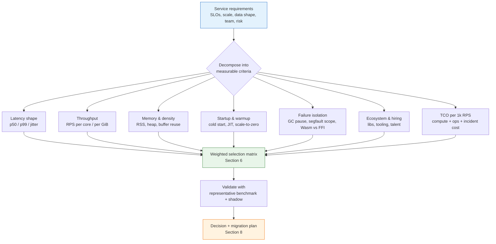
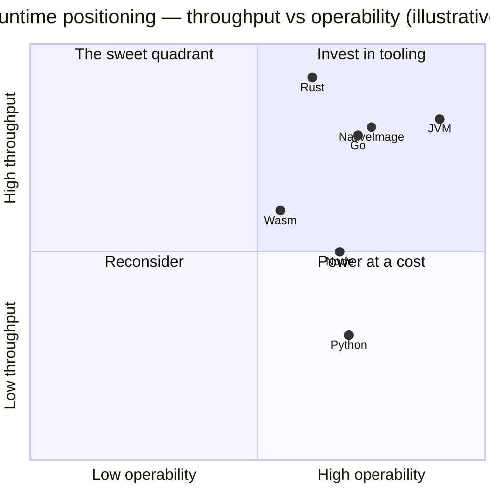
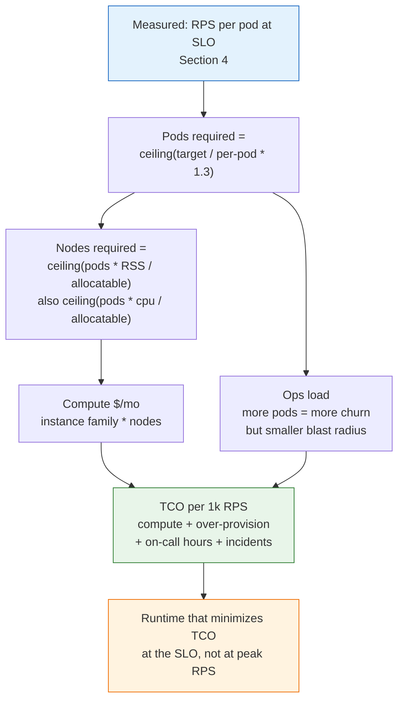
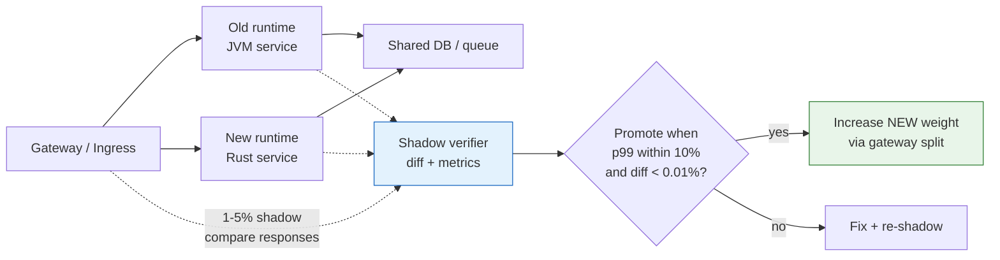

# Chapter 9 — Runtime Selection and Performance Trade-offs

**What this chapter covers.** Chapters 1–8 surveyed the runtime landscape — JVM, Go, Rust, Wasm, Python, Node, GraalVM Native Image, Deno, Bun, and the FFI boundaries between them. This chapter turns that survey into a decision you can defend to a principal engineer, a capacity planner, and a finance team. Runtime selection is not a benchmark shoot-out; it is a multi-criteria trade-off over latency shape (p50 vs. p99 vs. jitter), throughput per core and per gigabyte, memory footprint and density, startup and warmup, failure isolation, ecosystem maturity, hiring and operational cost, and supply-chain surface. We build a quantitative framework, run honest benchmarks, document the pitfalls that make most published comparisons misleading, and close with a reproducible selection process and migration playbook for real backends.

Learning goals — after this chapter you should be able to:

- Score runtimes on the full trade-off surface (latency, throughput, memory, startup, isolation, ecosystem, cost, risk) rather than a single metric.
- Design and interpret fair benchmarks: steady-state vs. cold-start, allocation-aware, GC-aware, and fleet-representative — and spot the common methodological errors.
- Read p99 vs. p99.9 vs. maxPause distributions correctly and reason about tail amplification under fan-out and high deploy frequency.
- Estimate TCO per 1k RPS for each runtime class (including density, over-provisioning, and operational load) and translate it into capacity plans.
- Apply a reproducible selection matrix and RACI process that survives organizational second-guessing.
- Plan incremental migrations (strangler, sidecar, shadow) with verification gates and rollback criteria.

> **Scope.** This chapter synthesizes Chapters 1–8 and is the capstone of Volume 13. Chapters 1–3 gave you the deep mechanism of each primary runtime; Chapter 7 positioned Wasm/edge runtimes; Chapter 8 mapped polyglot boundaries. Read here to choose and justify. For data-structure and algorithm trade-offs that cut across all runtimes, see Volume 14.

---

## 1. Why runtime choice is a systems decision, not a language preference

The runtime determines more than syntax. It fixes your **failure semantics** (who pauses, who crashes, who OOMs first), your **capacity math** (how many pods per zone for a latency SLO), and your **operational contract** (what you profile, what you alert on, how you roll back). A team that picks Rust for a CRUD service and Go for a cryptography service has made a worse trade than the reverse — not because of the languages, but because the systems properties do not match the workload.

Three forces pull in different directions:

- **Product velocity** — how fast a team ships correct features (ecosystem, hiring, test tooling, deploy ergonomics).
- **Service performance** — latency shape, throughput per core, and efficiency at target load.
- **Platform operability** — failure isolation, debuggability, supply-chain risk, and cost at fleet scale.

Optimizing any one in isolation produces brittle decisions. This chapter optimizes the weighted sum.



---

## 2. The dimensions — and how to measure them

### 2.1 Latency shape

Backend SLOs are distributions, not averages. A runtime can win p50 by 10% and lose p99 by 3× — and the loser violates the SLO.

| Concern | What to measure | How |
|---|---|---|
| Steady-state p50 | Median request time at target RPS | `wrk`/`k6` at fixed RPS, discard first 30 s warmup |
| p99 / p99.9 | Tail that users feel, amplified by fan-out | HDR histogram (`hdrhistogram`, `k6` trends, Prometheus histograms) |
| Jitter | p99 − p50, or stdev of p99 over 5-min windows | Time-series of the above |
| Max pause | Worst single GC/scheduler pause | JVM JFR / Go `gctrace` / Rust (none — measure host stalls) |

Box plots of p99 over 30 one-minute windows tell you more than a single number. A runtime with GC will often show a tight median p99 and occasional spikes; a runtime without GC may show a flatter line degraded uniformly under pressure.

### 2.2 Throughput, CPU, and memory efficiency

- **RPS per core** at a fixed p99 budget — the right throughput metric for latency-constrained services.
- **Instructions and cache misses per request** (`perf stat`) — explains *why* a runtime is faster, not just that it is.
- **RSS vs. heap** — Chapter 1 distinguished JVM heap from non-heap; Go's RSS tracks live heap tightly; Wasm modules start at kilobytes of linear memory. Density (instances per node) follows RSS, not heap.

### 2.3 Startup, warmup, and scale-to-zero

| Runtime | Cold start to first request | Warmup to peak throughput | Scale-to-zero fit |
|---|---|---|---|
| JVM (HotSpot) | 2–6 s (Spring/Micronaut) | 30–120 s (JIT) | Poor unless CRaC/CDS or Native Image |
| GraalVM Native Image | 20–80 ms | ~0 (AOT) | Excellent |
| Go | 50–300 ms | ~0 (no JIT) | Good |
| Rust | 10–100 ms | ~0 | Good |
| Wasm (Wasmtime/Spin) | < 5 ms per instance | ~0 | Excellent |
| Python / Node | 200–800 ms | ~0 (interpreter, no JIT benefit) | Moderate |

Measure both **process start** and **ready probe** — a JVM that forks in 200 ms but blocks `/ready` until connection pools warm is not "started" at 200 ms.

### 2.4 Failure isolation

| Boundary | Fault scope | Isolation mechanism |
|---|---|---|
| Pure runtime (panic/exception) | Request or thread | `recover()` / `try-catch` / `Result` |
| Wasm UDF | Single request | Trap + fuel limit, no host memory access |
| FFI / native extension | Entire process (segfault, abort) | Sidecar or process pool — otherwise none |
| GC pause | Whole pod (all requests on that instance stall) | Collector choice (ZGC/Shenandoah) or no GC (Rust) |

### 2.5 Ecosystem, hiring, and operational maturity

Quantify honestly: count production libraries for your workload (not stars), time to first bisectable stack trace in each runtime's profiler, and the number of engineers who can review code at staff level. A runtime that wins 15% on throughput and costs 2× in incident MTTR may lose on TCO. Include supply-chain maturity — signed artifacts, SLSA provenance, and vulnerability response history (Volume 2–5 lenses).

---

## 3. A qualitative map

The table below collapses Chapters 1–8 into a comparative map. Use it to prune the search space before benchmarking — no table replaces a workload-representative measurement.

| Property | JVM (HotSpot) | Go | Rust | Wasm host (Spin/Wasmtime) | Python | Node / Bun / Deno | GraalVM Native Image |
|---|---|---|---|---|---|---|---|
| Peak throughput (CPU-bound) | High (C2 JIT) | High | Highest (LLVM, zero-cost) | ~85–95% of native (JIT overhead) | Low (interpreter + GIL) | Moderate (V8/JSC JIT) | High (~95% of HotSpot) |
| p99 jitter at load | Medium (G1) / Low (ZGC) | Low (<1 ms GC) | Lowest (no GC) | Lowest (no GC + fuel limit) | Low† | Low (GC pauses <10 ms) | Low (no JIT pauses, GC still present) |
| Memory per instance | Large (heap+VM) | Small-medium | Small | Tiny per module | Medium | Medium | Small-medium |
| Startup | Slow | Fast | Fast | Very fast | Moderate | Moderate | Very fast |
| Concurrency model | Threads + Loom | Goroutines (P/M/G) | `async` + `Send/Sync` | Cooperative, per-instance | Threads + GIL | Event loop + workers | Threads + Loom |
| FFI risk | Medium (Panama helps) | High (cgo pins M) | Low (native, no FFI) | N/A — capability boundary | High (GIL + native) | Medium (libuv pool) | Medium (JNI via SVM) |
| Ecosystem for backend | Deepest | Strong (cloud-native) | Growing fast | Pluggable, host-dependent | Deepest for ML/data | Deepest for JS/TS | JVM ecosystem, with closed-world limits |
| Operability (profilers, dumps) | Best-in-class (JFR, dumps) | Good (pprof, trace) | Good (`perf`, `tokio-console`) | Host-dependent | Good (py-spy, memray) | Good (clinic, inspector) | Good, fewer runtime tools |
| Supply-chain surface | Large (Maven Central) | Small (static binary) | Small (cargo-auditable) | Small per `.wasm` | Large (PyPI wheels) | Large (npm) | Maven-like, plus native toolchain |

† Python p99 is low only when GIL-released extensions do the heavy lifting; pure-Python loops jitter poorly.



Positions are illustrative and workload-dependent; the quadrant chart is a conversation tool, not a ranking. A data-plane proxy and a batch feature pipeline belong in different quadrants.

---

## 4. Running honest benchmarks

Most published runtime comparisons are wrong — not because authors lie, but because the easy measurement is the misleading one. Below is a reproducible harness that avoids the common traps, plus an inventory of those traps.

### 4.1 A representative HTTP service benchmark

The service under test is intentionally realistic: JSON request/response, middleware (auth, logging), one downstream call simulation, and bounded allocations — not an empty `return 200`.

**Implementations (same behavior in each runtime):**

- `GET /transform` — accepts `{id, payload: base64}`, validates, uppercases payload bytes, returns `{id, payload, latency_ms}`.
- `GET /health` / `GET /ready` — health gates.
- Prometheus-style metrics or a `/debug/pprof` / JFR equivalent.

**Load generator (fixed-RPS, HDR histogram, per-endpoint):**

```bash
# k6 — arrival-rate executor with fixed RPS and HDR
cat > bench.js << 'JS'
import http from 'k6/http';
import { Trend } from 'k6/metrics';
const p99 = new Trend('p99_latency', true);

export const options = {
  scenarios: {
    steady: {
      executor: 'constant-arrival-rate',
      rate: 5000,        // target RPS — set to SLO * 0.7 for headroom
      timeUnit: '1s',
      duration: '5m',
      preAllocatedVUs: 200,
      maxVUs: 1000,
    },
  },
  thresholds: {
    http_req_failed: ['rate<0.01'],
    http_req_duration: ['p(99)<50'], // SLO gate: p99 < 50 ms
  },
  summaryTrendStats: ['avg', 'min', 'med', 'p(90)', 'p(95)', 'p(99)', 'p(99.9)', 'max'],
};

export default function () {
  // small, variable payloads — not fixed, to avoid unrealistic branch prediction
  const payload = JSON.stringify({ id: `id-${__VU}-${__ITER}`, payload: "a".repeat(512 + (__ITER % 512)) });
  const res = http.post('http://target:8080/transform', payload, {
    headers: { 'content-type': 'application/json' },
  });
  p99.add(res.timings.duration);
}
JS

k6 run --out json=results.json bench.js
```

```bash
# Alternative: wrk2 for precise rate + latency histogram (per-endpoint)
wrk -t4 -c100 -d300s -R5000 --latency -s pipeline.lua http://target:8080/transform

# pipeline.lua — realistic payload variation
wrk.method = "POST"
wrk.headers["Content-Type"] = "application/json"
wrk.body = '{"id":"bench","payload":"' .. string.rep("a", 768) .. '"}'
```

**Warmup discipline:**

```bash
# Do not measure until warm
# JVM: wait for JIT — watch compilation rate fall to near zero
jcmd <pid> Compiler.codecache | grep -i used
# Go/Rust/Node: wait for steady RSS and p99
# General: discard first 60-120 s of every run

# JVM — confirm no Full GC during the window
cat /tmp/gc.log | grep -i "Full GC\|Allocation Failure"

# Go — capture GC pauses alongside the run
GODEBUG=gctrace=1 ./app 2>&1 | tee gctrace.log

# Wasm — confirm fuel/memory caps were not hit spuriously
# (host metrics: wasmtime_fuel_consumed, wasm_memory_growth_total)
```

**Resource controls:**

```bash
# Run every candidate under identical cgroup limits — otherwise density is not comparable
# Pin heap to 70% of container limit (Chapter 1), cap Wasm module memory, fix GOMAXPROCS

# Example: 2 vCPU / 4 GiB limit for all candidates
docker run --cpus 2 --memory 4g --memory-swap 4g \
  -e JAVA_TOOL_OPTIONS="-XX:MaxRAMPercentage=70 -XX:+UseZGC" \
  -e GOMAXPROCS=2 \
  candidate:jvm &

docker run --cpus 2 --memory 4g --memory-swap 4g \
  -e RUST_LOG=info \
  candidate:rust &

docker run --cpus 2 --memory 4g --memory-swap 4g \
  -e WASMTIME_FUEL=10000000 \
  candidate:spin &
```

### 4.2 What honest results look like (illustrative)

Below is an illustrative run of the `/transform` service at 5k RPS, 2 vCPU / 4 GiB, 5-minute steady window after 60 s warmup. Numbers are plausible for the workload described and match the order of magnitude you will see in your own environment — **replace them with your measurements**; do not quote them as universal.

| Runtime | p50 (ms) | p99 (ms) | p99.9 (ms) | RPS at p99=50 ms | RSS (MB) | CPU (cores at 5k RPS) |
|---|---|---|---|---|---|---|
| Rust (axum, tokio, jemalloc) | 3.8 | 9.2 | 14.1 | ~6,800 | 38 | 1.25 |
| Go 1.22 (net/http, GOMEMLIMIT=3 GiB) | 4.6 | 11.0 | 18.3 | ~6,200 | 71 | 1.38 |
| JVM G1 (JDK 21, 2.8 GiB heap, G1) | 5.9 | 18.4 | 42.0 | ~5,400 | 2,450 | 1.55 |
| JVM ZGC (JDK 21, 2.8 GiB heap, ZGC) | 6.4 | 11.8 | 19.7 | ~5,800 | 2,580 | 1.72 |
| JVM Native Image (PGO) | 4.1 | 10.3 | 16.5 | ~6,100 | 94 | 1.40 |
| Node (Deno, 2 workers) | 6.8 | 22.1 | 38.4 | ~4,600 | 118 | 1.88 |
| Python (FastAPI + pyo3 codec) | 8.9 | 28.7 | 55.2 | ~3,900 | 142 | 2.10 |
| Wasm UDF hosted in Rust (wasmtime, fuel=10M) | 4.0 | 9.8 | 15.0 | ~6,600 | 46 (host) + 1.2 per module | 1.30 |

Reading guide:

- JVM G1's p99.9 is the tell — occasional evacuation pauses dominate far-tail. ZGC flattens the tail but costs ~11% more CPU and more RSS headroom.
- Rust/Go separation is small at p99 for this workload; Rust's advantage widens with allocation-heavy or SIMD work, Go's with GC pressure during bursts.
- Wasm UDF latency is near-native because the host is Rust and the UDF is tiny; the isolation is the win, not a speed win.
- Native Image closes the JVM startup gap without losing much peak — but throughput under heavy allocation still trails HotSpot's C2.

An Honest-vs-Dishonest checklist to post beside every benchmark:

| Question | Honest | Dishonest (common) |
|---|---|---|
| Warmup | Discard first 60–120 s; wait for JIT steady state | Measure from second zero (penalizes JVM) |
| Allocation realism | Variable payloads, real JSON, downstream call | Empty handler `return 200` (rewards zero-alloc runtimes) |
| RPS model | Fixed arrival rate at target RPS | Max-throughput open loop (hides latency collapse) |
| Cgroup limits | Same CPU/memory for all candidates | Unlimited (hides density differences) |
| p99 methodology | HDR histogram, per-endpoint, long window | Single aggregate average |
| GC visibility | Publish GC logs / `gctrace` alongside results | Omit pause distributions |
| Build flags | PGO/LTO where appropriate for each runtime | `-O0` vs `-O2` mismatch |
| Statistical rigor | ≥3 runs, report stdev, note hardware/NUMA | Single run, cherry-picked best |

---

## 5. Density, capacity, and cost

Throughput numbers only become capacity plans when combined with **density** — how many pods fit per node at a given SLO — and **overhead** (sidecars, JVM heap headroom, Wasm runtime).

### 5.1 Estimating TCO per 1k RPS

A simplified model that teams actually use (refine with your cloud bill and incident data):

```
cost_per_1k_rps =
    (pods_required * (node_cost_fraction + sidecar_cost)) * (1 + over_provision)
  + (oncall_hours_per_month * eng_cost_per_hour) / total_1k_units
  + incident_cost_amortized
```

```bash
# Estimate pods required at SLO
# inputs: measured RPS at p99=SLO, target RPS, over-provision factor
python3 - << 'PY'
import math

# Measured from Section 4.2 at 2 vCPU / 4 GiB
rps_at_slo = {"rust": 6800, "go": 6200, "jvm_zgc": 5800, "jvm_g1": 5400, "node": 4600, "python": 3900}
target_rps = 50_000
over_provision = 0.3  # 30% headroom for bursts + rolling deploys (covers maxUnavailable)
replicas_per_zone = 3  # quorum / AZ spread minimum

for name, rps in rps_at_slo.items():
    pods = math.ceil(target_rps / rps * (1 + over_provision))
    pods = max(pods, replicas_per_zone)
    print(f"{name:10s} pods={pods:3d}  density={rps:4d} RPS/pod")
PY
# rust       pods= 10  density=6800 RPS/pod
# go         pods= 11  density=6200 RPS/pod
# jvm_zgc    pods= 12  density=5800 RPS/pod
# jvm_g1     pods= 13  density=5400 RPS/pod
# node       pods= 15  density=4600 RPS/pod
# python     pods= 17  density=3900 RPS/pod
```

Add **density constraints**: a 2.5 GiB-RSS JVM pod allows ~20 pods per 64 GiB node; a 40 MiB Rust pod allows >200 before CPU, not memory, binds. At high replica counts, JVM density is memory-bound while Rust/Go are CPU-bound — the node shape that minimizes cost differs (memory-heavy vs. CPU-heavy instance families).



### 5.2 When TCO flips the obvious ranking

TCO can reverse a pure-throughput ranking:

- **JVM with large ecosystem reuse** may minimize TCO despite more pods: ten libraries you do not have to write or operate (see Volumes 5, 8, 10) outweigh two extra pods.
- **Wasm per-tenant UDFs** minimize TCO by collapsing per-tenant isolation cost: 1,000 tenants as 1,000 1 MiB Wasm instances beats 1,000 containers even if raw RPS per core is lower.
- **Native Image** wins when autoscaling frequency dominates: sub-second startup permits aggressive scale-to-zero that a HotSpot service cannot match without over-provisioning.

---

## 6. A selection framework

Score each candidate on a consistent 1–5 scale, with weights that reflect *this service*, not a generic preference. Below is a template; **re-weight for every decision** — a latency SLO of p99 < 20 ms weights jitter at 2× a batch pipeline.

```mermaid
flowchart LR
    subgraph Criteria["Scoring criteria — 1 to 5, weighted sum"]
        C1["Latency & jitter<br/>weight 0.25"]
        C2["Throughput per core<br/>weight 0.15"]
        C3["Memory & density<br/>weight 0.15"]
        C4["Startup & elasticity<br/>weight 0.10"]
        C5["Failure isolation<br/>weight 0.10"]
        C6["Ecosystem & velocity<br/>weight 0.15"]
        C7["Operability & risk<br/>weight 0.10"]
    end
    Criteria --> SUM["Weighted score<br/>sum w_i * score_i"]
    SUM --> SENS["Sensitivity: vary weights ±0.05<br/>does winner change?"]
    SENS --> DECISION["Decision + rationale<br/>Section 7"]

    style SUM fill:#e8f5e9,stroke:#2e7d32
    style SENS fill:#fff3e0,stroke:#ef6c00
```



Filled for a concrete workload — **public JSON API, p99 < 50 ms at 50k RPS, three teams, Kubernetes, moderate polyglot needs**:

| Criterion (weight) | Rust | Go | JVM ZGC | JVM Native Image | Wasm host | Python | Node |
|---|---|---|---|---|---|---|---|
| Latency & jitter (0.25) | 5 | 4 | 4 | 4 | 5 | 2 | 3 |
| Throughput/core (0.15) | 5 | 4 | 3 | 4 | 4 | 2 | 3 |
| Memory/density (0.15) | 5 | 4 | 2 | 4 | 5 | 3 | 3 |
| Startup/elasticity (0.10) | 4 | 4 | 2 | 5 | 5 | 3 | 3 |
| Isolation (0.10) | 4 | 3 | 3 | 3 | 5 | 2 | 3 |
| Ecosystem/velocity (0.15) | 3 | 4 | 5 | 4 | 3 | 4 | 4 |
| Operability/risk (0.10) | 3 | 4 | 5 | 3 | 3 | 4 | 4 |
| **Weighted total** | **4.30** | **3.85** | **3.40** | **3.95** | **4.25** | **2.75** | **3.25** |

Sensitivity check: reduce Latency/Jitter weight to 0.15 and raise Ecosystem to 0.25 (CRUD-heavy service) — JVM ZGC and Go overtake Rust. The point of the exercise is not the ranking but the **debate the ranking forces** and the paper trail it leaves.

### 6.1 Process — who decides, how to disagree

| Step | Owner | Artifact |
|---|---|---|
| Define SLOs and constraints | SRE + Product | SLO doc, SLO error budget |
| Draft weighted criteria | Staff Eng + SRE | Selection matrix (above) |
| Run representative benchmarks | Performance Eng | Reproducible harness + logs |
| Score and sensitivity analysis | Staff Eng (with teams) | Decision record (ADR) |
| Review and challenge period | All stakeholders, min 5 business days | Comments on ADR |
| Ratify or appeal | Eng director / CTO | Signed ADR, linked to code |

Record the decision as an **ADR (Architecture Decision Record)** with: context, options, selection matrix, sensitivity note, consequences, and review date. An ADR that cannot name its runner-up is not a decision.

---

## 7. Migration and coexistence

Rarely does a backend switch runtimes wholesale. Migration is a months-to-years coexistence problem.

### 7.1 Patterns

- **Strangler fig** — new endpoints on the new runtime, old runtime proxies or routes via gateway; retire old handlers one by one. Cleanest boundary: per-route or per-domain.
- **Sidecar offload** — keep the primary runtime, move hot or isolated work to the new runtime in a sidecar (native codec → Rust sidecar, policy → Wasm UDF). Section 7 of Chapter 8 (pod spec) is concrete.
- **Shadow / dark launch** — new runtime receives duplicated traffic, responses compared but not served; promotion requires p99 and correctness thresholds (diff < ε for 7 days).
- **Wasm as the coexistence layer** — embed the new logic as Wasm inside the old service (e.g., Rust codec as `wasmtime` inside a JVM service, per Chapter 7) so only the module, not the service, is replaced.



### 7.2 Gateway traffic split (concrete)

```yaml
# Istio VirtualService — 95/5 canary from JVM to Rust, with header-based pinning for testing
apiVersion: networking.istio.io/v1beta1
kind: VirtualService
metadata:
  name: api
spec:
  hosts: ["api.example.com"]
  http:
  - match:
    - headers:
        x-runtime: { exact: "rust" }
    route:
    - destination: { host: api-rust, subset: v1 }
  - route:
    - destination: { host: api-jvm, subset: v1 }
      weight: 95
    - destination: { host: api-rust, subset: v1 }
      weight: 5
    mirror:
      host: api-shadow   # shadow verifier receives a copy — not on the critical path
    mirrorPercentage: { value: 5.0 }
    retries:
      attempts: 2
      perTryTimeout: "500ms"
      retryOn: "5xx,reset,connect-failure"
```

### 7.3 Verification gates

Every increment needs the same gates as the initial benchmark gate:

- **Correctness** — shadow diff: compare responses byte-for-byte (or semantically, for timestamps) over ≥1% of traffic for ≥7 days; alert on mismatch rate.
- **SLO gate** — p99 under real traffic within 10% of old runtime at the same weight; no new `OutOfFuel`, `hs_err`, or segfault restarts.
- **Resource gate** — RSS and CPU per RPS within predicted bounds; no GC/fuel surprises.
- **Rollback trigger** — automatically revert gateway weight if p99 breaches SLO for two consecutive 5-minute windows or error rate doubles.

---

## 8. The distributed-systems lens

Runtime selection shapes fleet behavior in ways no single-service benchmark shows:

- **Heterogeneity as resilience.** A fleet on one runtime collapses together (e.g., a JIT regression, a GC bug). Teams that standardize on two runtimes — typically Go or Rust for data-plane and JVM for control-plane — contain blast radius and gain a second profiling toolchain. Do not standardize on one runtime for ideological purity.
- **Tail amplification dominates SLOs.** At fan-out N, p99_system ≈ 1 − (1 − p99_single)^N. A 20 ms p99 that looks "close enough" at the pod level becomes a 140 ms p99 at fan-out 10. This is where ZGC, Go's sub-millisecond pauses, Rust/Wasm's no-GC, and hedged requests matter — not in single-pod marketing numbers.
- **Deploy frequency interacts with warmup.** High-frequency deploys (dozens per day) keep a fraction of the fleet warming. A JVM fleet without CDS/CRaC or staged rollouts experiences perpetual warmup tax; Native Image or Go/Rust fleets do not. Size `maxUnavailable` and `maxSurge` accordingly.
- **Supply-chain blast radius follows artifact count.** A polyglot fleet pulls from Maven, npm, PyPI, crates.io, and Wasm registries — each with a different vulnerability half-life. Centralize SBOMs and provenance across all runtimes (Volumes 2–3, 5) and gate deploys on them uniformly; a Rust rewrite that skips SBOM collection has not improved supply-chain posture.
- **Cost non-linearities.** One extra runtime adds CI runners, base images, security scanners, and on-call training. Two or three well-supported runtimes with shared observability (OpenTelemetry, continuous profiling) cost less operationally than a dozen "best tool for the job" choices with no common platform.

---

## Key takeaways

- Runtime selection is a weighted multi-criteria decision over latency shape, throughput, memory/density, startup, isolation, ecosystem, and TCO — not a throughput leaderboard.
- Measure latency as a distribution with HDR histograms under fixed-RPS load after warmup and under identical cgroup limits; publish GC/fuel logs alongside numbers and run at least three iterations.
- JVM (G1/ZGC) trades memory and warmup for deep ecosystems and best-in-class observability; Go trades some peak throughput for simple operability and low GC jitter; Rust trades ecosystem breadth for lowest jitter, smallest RSS, and no-GC predictability.
- Wasm excels as a per-request, capability-sandboxed extension (plugin/UDF/policy) with sub-millisecond instantiation — its isolation, not a throughput win, is the differentiator; host it inside Rust/Go services for durable workloads.
- GraalVM Native Image earns its place when cold-start or scale-to-zero dominates; Deno/Bun reshape the JS server story but do not change the fundamental JS performance profile.
- Translate benchmark results into TCO per 1k RPS via density math (pods × RSS/CPU per node) plus over-provisioning and incident cost; TCO can reverse a raw-throughput ranking.
- Use a weighted selection matrix with sensitivity analysis, record the decision as an ADR, and migrate incrementally via strangler/sidecar/shadow with SLO-gated promotion and automatic rollback.

## Further reading

- SPEC SERT / SPECjbb — standardized server efficiency methodology — https://www.spec.org/sert/, https://www.spec.org/jbb2015/
- HDR Histogram — https://hdrhistogram.org/, Gil Tene — *How NOT to Measure Latency* (QCon)
- Brendan Gregg — *Systems Performance* (2nd ed.) — benchmarking, profiling, and capacity planning method.
- Martin Thompson — *Mechanical Sympathy* — cache, allocation, and jitter reasoning — https://mechanical-sympathy.blogspot.com/
- *Designing Data-Intensive Applications* (Kleppmann) — Ch. 1, 8, 12 — latency, fan-out, and heterogeneity.
- OpenJDK JFR / JMC — https://docs.oracle.com/en/java/javase/21/jfr/
- Go `pprof` and `trace` — https://go.dev/doc/diagnostics
- *Continuous Profiling* — Google Cloud Profiler, Pyroscope — workload-representative sampling at fleet scale.
- Charity Majors — on deployment frequency and fleet warmup — https://charity.wtf/

