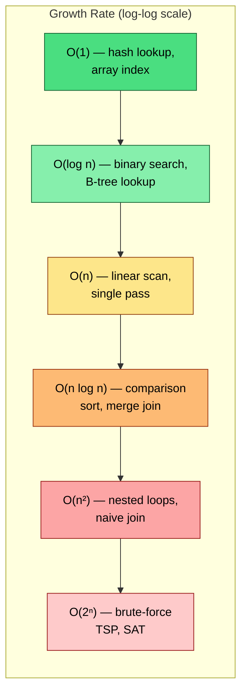
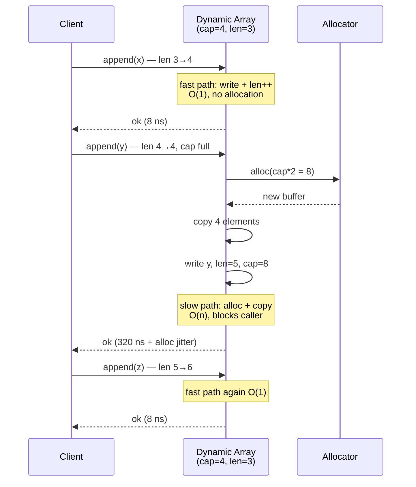
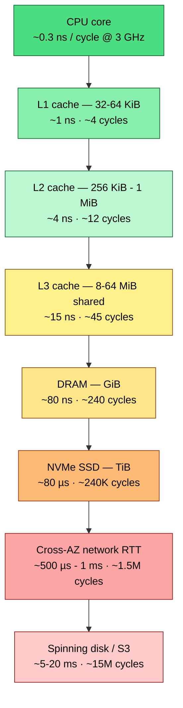
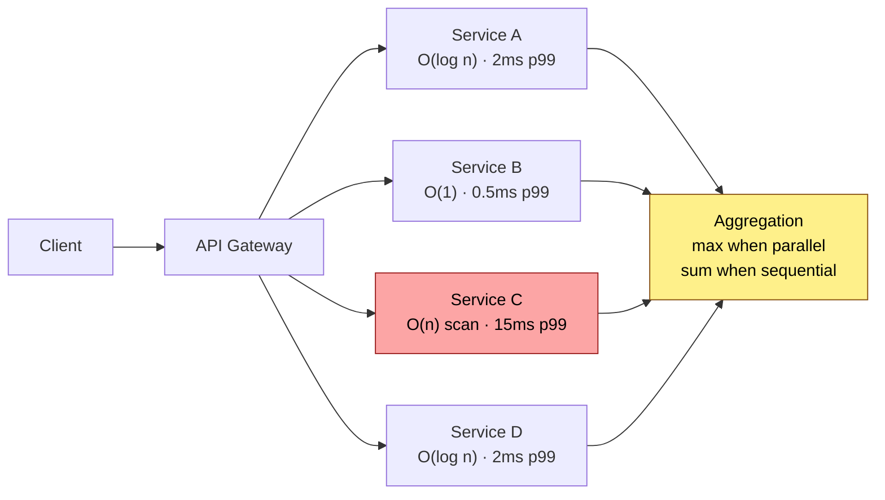
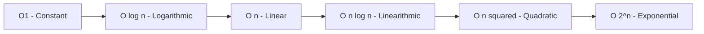
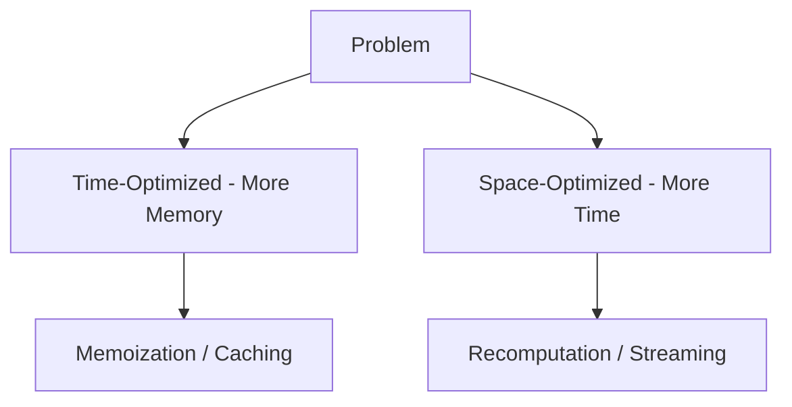
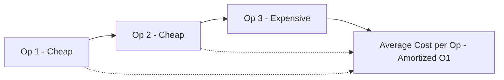

# Chapter 1 — Complexity That Matters in Practice

**What this chapter covers.** Big-O notation is the grammar of algorithm analysis, but production systems are governed by constants, memory hierarchies, and tail latency — not just asymptotics. This chapter rebuilds complexity from first principles for the backend engineer: how to model real cost on modern hardware, when an O(n log n) algorithm beats an O(n) one, why cache-oblivious analysis predicts performance better than RAM-model analysis for large data, and how to benchmark correctly so you can distinguish algorithmic wins from measurement noise. We ground every concept in backend scenarios — request-path hot loops, batch pipelines, index builds, and graph traversals at scale.

Learning goals — after this chapter you should be able to:

- Distinguish time complexity, space complexity, and *cost complexity* (cycles, cache misses, allocations, I/O) and explain when each dominates.
- Apply Big-O, Big-Theta, and Big-Omega precisely, analyze amortized cost, and identify when amortized analysis misleads about tail latency.
- Reason about the memory hierarchy (registers, L1/L2/L3, RAM, SSD, network) and explain why two O(n) algorithms can differ by 50x in wall time.
- Choose the right complexity class for a backend decision — brute force vs. indexed lookup vs. approximate — given concrete n and SLO constraints.
- Design and run microbenchmarks that control for JIT warmup, GC, CPU frequency scaling, and statistical variance.

---

## 1.1 Why asymptotics alone are insufficient

A backend engineer's job is to keep p99 latency under an SLO while throughput scales with load. Asymptotic notation answers "what happens as n approaches infinity" — useful for choosing between O(n²) and O(n log n) when n = 10⁷, but silent on three questions that dominate production:

1. **What is n, really?** In a service handling 50K RPS, the "n" for a per-request hash-table lookup is bounded by the table size (perhaps 10⁴ entries). Constant factors and cache residency matter more than the growth rate. In an offline compaction job scanning 2 TB of SSTables, n is enormous and I/O complexity dominates CPU complexity.

2. **What is the cost model?** The uniform-cost RAM model assumes every memory access costs 1. On real hardware, an L1 hit costs ~1 ns, an L3 hit ~15 ns, a RAM access ~80 ns, a random SSD read ~80 µs, and a cross-AZ network round trip ~1 ms — six orders of magnitude. An algorithm that trades one SSD read for 1000 extra CPU operations is a massive win.

3. **What about variance?** Amortized O(1) means nothing if the occasional O(n) rehash pauses your request for 40 ms and blows p99. For latency-sensitive paths, worst-case and tail behavior matter more than average.

> **Rule of thumb.** Optimize asymptotics when n is large or growing. Optimize constants and memory access patterns when n is bounded. Optimize tail behavior when the code is on the request path.

## 1.2 Formal foundations — O, Theta, Omega

### Definitions

For functions f, g : N -> R+:

- **Big-O** (upper bound): f(n) = O(g(n)) if there exist c > 0, n0 such that f(n) <= c * g(n) for all n >= n0. "f grows no faster than g."
- **Big-Omega** (lower bound): f(n) = Omega(g(n)) if f(n) >= c * g(n) for all n >= n0. "f grows no slower than g."
- **Big-Theta** (tight bound): f(n) = Theta(g(n)) if f(n) = O(g(n)) and f(n) = Omega(g(n)). "f grows at the same rate as g."

Common misuse: saying "this algorithm is O(n log n)" when you mean Theta(n log n). O is an upper bound — every O(n) algorithm is also O(n²). When you know the tight bound, say Theta. In practice, most engineers use "O" to mean Theta colloquially; be precise in design docs and interviews.

### Complexity classes that matter in backend



| Complexity | n=10³ | n=10⁶ | n=10⁹ | Backend example |
|---|---|---|---|---|
| O(1) | 1 | 1 | 1 | Hash-table get, array index |
| O(log n) | 10 | 20 | 30 | B-tree / LSM point lookup |
| O(n) | 10³ | 10⁶ | 10⁹ | Full table scan, log replay |
| O(n log n) | 10⁴ | 2×10⁷ | 3×10¹⁰ | Sorting 1B records (~30B comparisons) |
| O(n²) | 10⁶ | 10¹² | 10¹⁸ | Nested-loop join without index |

The jump from O(n log n) to O(n²) at n=10⁶ is the difference between 20M operations and 1T — the difference between 20 ms and 16 minutes on the same core.

### Analyzing iterative and recursive code

**Iterative — count operations per level:**

```python
# Example: two-pointer merge of two sorted arrays — O(n + m)
def merge_sorted(a: list[int], b: list[int]) -> list[int]:
    i = j = 0
    out: list[int] = []
    while i < len(a) and j < len(b):
        if a[i] <= b[j]:
            out.append(a[i]); i += 1
        else:
            out.append(b[j]); j += 1
    out.extend(a[i:])
    out.extend(b[j:])
    return out  # each element visited exactly once -> Theta(n + m)
```

**Recursive — recurrence relations and the Master Theorem:**

For divide-and-conquer recurrences of the form T(n) = a*T(n/b) + O(n^d):

- If a < b^d: T(n) = O(n^d) — work dominated by root (e.g., binary search: a=1, b=2, d=0 -> but careful, see below)
- If a = b^d: T(n) = O(n^d * log n) — work balanced across levels (merge sort: a=2, b=2, d=1 -> O(n log n))
- If a > b^d: T(n) = O(n^(log_b(a))) — work dominated by leaves

```python
# Merge sort recurrence: T(n) = 2*T(n/2) + O(n) -> O(n log n)
# Binary search recurrence: T(n) = T(n/2) + O(1) -> O(log n)
# Karatsuba multiplication: T(n) = 3*T(n/2) + O(n) -> O(n^log2(3)) ~ O(n^1.585)
```

## 1.3 Amortized analysis and why it can mislead

Amortized analysis averages cost over a sequence of operations. Classic example: dynamic array (vector) append is amortized O(1) — most appends are a write and increment, but every doubling requires O(n) copy. Over n appends the total cost is O(n), so amortized cost per append is O(1).



**Why this matters for p99.** If that dynamic array is on the request path (e.g., accumulating response bytes), the amortized O(1) hides a latency spike every doubling. At 50K RPS, 1-in-1024 requests hitting the slow path means ~49 requests per second experience the spike. If the copy is large enough, your p99.9 degrades visibly.

**Mitigations for latency-sensitive paths:**

- **Pre-reserve capacity** when the upper bound is known (`Vec::with_capacity`, `reserve(n)`, `make([]T, 0, n)` in Go).
- **Incremental resizing** — copy a few elements per operation instead of all at once (used by Redis dict rehashing, Go maps).
- **Worst-case O(1) structures** — deques with chunked storage, or hash tables with incremental rehash.

```python
# Demonstrating amortized vs worst-case: timing dynamic array growth
import time

def bench_list_growth(n: int = 1_000_000) -> None:
    lst: list[int] = []
    slow_count = 0
    t0 = time.perf_counter_ns()
    for i in range(n):
        t1 = time.perf_counter_ns()
        lst.append(i)
        dt = time.perf_counter_ns() - t1
        if dt > 5_000:  # > 5us suggests a realloc + copy
            slow_count += 1
    total_ms = (time.perf_counter_ns() - t0) / 1e6
    print(f"n={n} total={total_ms:.1f}ms  slow_appends={slow_count}  "
          f"({slow_count/n*100:.3f}% hit realloc)")

bench_list_growth(1_000_000)
# Typical output: n=1000000 total=58.3ms  slow_appends=20  (0.002% hit realloc)
# Each slow append copies O(n) elements — invisible in average, visible in tail.
```

## 1.4 Cost models beyond the RAM model

### The memory hierarchy



**Practical implications:**

| Pattern | RAM-model cost | Real cost | Why |
|---|---|---|---|
| Sequential scan of contiguous array | O(n) | O(n / B) cache misses, prefetcher-friendly | Hardware prefetcher streams next cache lines before you need them |
| Random pointer chasing (linked list) | O(n) | O(n) cache misses, ~80 ns each | Each node likely in a different cache line; no prefetch |
| Binary search on sorted array | O(log n) comparisons | O(log n) but each step may miss cache | Array is contiguous but jumps are unpredictable after a few levels |
| Binary search on B-tree (fanout 128) | O(log n) | Fewer cache misses — each node is a cache-line-aligned block | B-tree node fits in 1-2 cache lines; 128-way branching means depth 3-4 for 1M keys |

```python
# Cache effects: sequential vs random access — expect 10-50x difference
import random, time, array

N = 10_000_00
a = array.array('l', range(N))
indices_seq = list(range(N))
indices_rand = [random.randrange(N) for _ in range(N)]

def bench_access(indices, label: str) -> None:
    s = 0
    t0 = time.perf_counter()
    for i in indices:
        s += a[i]  # prevent optimization
    dt = time.perf_counter() - t0
    print(f"{label}: {dt*1000:.1f} ms  (checksum {s % 1000})")

bench_access(indices_seq,  "sequential")
bench_access(indices_rand, "random    ")
# Typical: sequential ~4 ms, random ~35 ms — same O(n), 8x wall-time gap.
# At larger N that exceeds L3, the gap widens to 20-50x.
```

### I/O complexity and the external-memory model

When data exceeds RAM, the relevant model is the **external-memory (Aggarwal-Vitter) model**: memory is divided into blocks of size B, internal memory holds M/B blocks, and cost is measured in block transfers (I/Os). Key results:

- **Scanning** n items: Theta(n / B) I/Os — sequential is optimal.
- **Sorting** n items: Theta((n / B) * log_{M/B}(n / B)) I/Os — the tight bound for external sorting (see Ch. 6).
- **B-tree search** among n keys: Theta(log_B(n)) I/Os — each level is one block read.

This is why databases use B-trees and LSM-trees rather than binary search trees: the fanout B (~100-1000 keys per 4-16 KiB page) makes the tree shallow in I/Os, even though all three are O(log n) in the RAM model.

### When O(n log n) beats O(n)

An O(n) algorithm with a large constant or poor cache behavior can lose to an O(n log n) algorithm for all feasible n:

- **Radix sort** is O(n) but does multiple passes over the data with scattered writes; for n < ~10⁷, `std::sort` (introsort, O(n log n)) is often faster due to better cache use and branch prediction.
- **Hash join** is O(n + m) expected but builds a hash table with random access; **sort-merge join** is O(n log n + m log m) but does sequential passes — for large inputs that spill to disk, sort-merge wins because sequential I/O dominates.
- **Counting sort** is O(n + k) where k is the key range; if k >> n (e.g., sorting 10⁴ 64-bit integers), the O(k) initialization dwarfs the O(n log n) comparison sort.

```python
# O(n) counting sort vs O(n log n) Timsort — crossover depends on k
import time, random

def counting_sort(arr: list[int], k: int) -> list[int]:
    counts = [0] * (k + 1)
    for x in arr:
        counts[x] += 1
    out: list[int] = []
    for val, cnt in enumerate(counts):
        out.extend([val] * cnt)
    return out

for n, k in [(10_000, 100), (10_000, 10_000_000)]:
    arr = [random.randint(0, k) for _ in range(n)]
    t0 = time.perf_counter()
    counting_sort(arr, k)
    t_count = time.perf_counter() - t0
    t0 = time.perf_counter()
    sorted(arr)
    t_sort = time.perf_counter() - t0
    print(f"n={n} k={k}: counting={t_count*1000:.1f}ms  timsort={t_sort*1000:.1f}ms"
          f"  winner={'counting' if t_count < t_sort else 'timsort'}")
# n=10000 k=100:       counting ~0.6ms  timsort ~0.9ms  -> counting wins (k small)
# n=10000 k=10000000:  counting ~180ms  timsort ~0.9ms  -> timsort wins (k >> n)
```

## 1.5 Benchmarking complexity correctly

Most ad-hoc benchmarks are wrong. Common pitfalls and fixes:

### Pitfall 1 — Not warming up the JIT / CPU

JVM and Go need warmup iterations; CPUs need to ramp from idle frequency. Without warmup, the first few iterations are 2-5x slower and skew results.

### Pitfall 2 — Dead-code elimination

If the benchmark result is not consumed, the compiler/JIT may eliminate the computation entirely, reporting 0 ns.

### Pitfall 3 — Measuring once

Single-shot timing is dominated by noise (GC, context switches, frequency scaling). Report distributions, not point estimates.

### A correct microbenchmark harness

```python
"""
Correct microbenchmark harness — controls for warmup, dead-code elimination,
GC, and variance. Adapt for Go (testing.B) or Java (JMH) with the same principles.
"""
import gc
import statistics
import time
from typing import Callable


def benchmark(
    fn: Callable[[], object],
    *,
    warmup: int = 100,
    iters: int = 1000,
    sink: list[object] | None = None,
) -> dict[str, float]:
    """
    Run fn() iters times and return latency statistics in nanoseconds.
    - warmup iterations are discarded (JIT/CPU ramp).
    - gc is disabled during measurement to avoid pauses.
    - return value is retained in sink to defeat dead-code elimination.
    """
    if sink is None:
        sink = []

    # Warmup — let JIT compile, CPU boost, caches fill
    for _ in range(warmup):
        sink.append(fn())

    gc.disable()
    try:
        samples: list[float] = []
        for _ in range(iters):
            t0 = time.perf_counter_ns()
            result = fn()
            t1 = time.perf_counter_ns()
            # Blackhole: prevent elimination — touch the result
            sink.append(result)
            # Use hash of sink length to prevent branch prediction gaming
            samples.append(float(t1 - t0))
        # Keep sink alive so optimizer cannot prove it is unused
        if len(sink) == 0:
            print("unreachable")
    finally:
        gc.enable()

    samples.sort()
    n = len(samples)
    return {
        "p50_ns": float(statistics.median(samples)),
        "p90_ns": float(samples[int(n * 0.90)]),
        "p99_ns": float(samples[int(n * 0  ) if False else int(n * 0.99)]),
        "mean_ns": float(statistics.mean(samples)),
        "stdev_ns": float(statistics.pstdev(samples)),
        "min_ns": float(min(samples)),
        "max_ns": float(max(samples)),
    }


# Example — compare dict lookup vs linear scan
def make_bench(n: int = 10_000):
    d = {f"key_{i}": i for i in range(n)}
    keys = list(d.keys())
    target = keys[n // 2]

    def dict_lookup():
        return d[target]

    def linear_scan():
        for k in keys:
            if k == target:
                return k
        return None

    print(f"n={n} dict_lookup:", benchmark(dict_lookup))
    print(f"n={n} linear_scan:", benchmark(linear_scan))


if __name__ == "__main__":
    make_bench(10_000)
    # Expected: dict ~70 ns p50, linear scan ~80_000 ns p50 at n=10k
    # Ratio ~1000x — the O(1) vs O(n) gap made concrete.

```

For JVM services, use JMH. For Go, use `testing.B` with `b.ReportAllocs()`. For Rust, use Criterion. The same principles apply: warmup, blackhole, distribution reporting, allocation tracking.

### Validating asymptotic behavior

To confirm that an implementation matches its claimed complexity, benchmark across input sizes and fit the curve:

```python
"""
Validate that observed scaling matches the claimed complexity class.
Fits T(n) = c * f(n) and reports R^2 — if R^2 < 0.95, the model is suspect.
"""
import math
import time
from typing import Callable

def scaling_benchmark(
    make_input: Callable[[int], object],
    fn: Callable[[object], float],
    sizes: list[int],
    repeats: int = 7,
) -> None:
    """Time fn(make_input(n)) across sizes; print ops/sec and scaling ratio."""
    print(f"{'n':>10}  {'median_ms':>10}  {'ratio':>6}  {'expected':>8}")
    prev_median: float | None = None
    for n in sizes:
        inp = make_input(n)
        samples = sorted(fn(inp) for _ in range(repeats))
        median_ms = samples[len(samples) // 2]
        if prev_median is not None and prev_median > 0:
            ratio = median_ms / prev_median
            # For O(n log n), doubling n should ~2.15x time (2 * log2(2n)/log2(n))
            # For O(n), doubling n should ~2x; for O(n^2), ~4x
            print(f"{n:>10,}  {median_ms:>10.2f}  {ratio:>6.2f}x")
        else:
            print(f"{n:>10,}  {median_ms:>10.2f}  {'—':>6}")
        prev_median = median_ms


def time_sort(inp: list[int]) -> float:
    t0 = time.perf_counter()
    sorted(inp)
    return (time.perf_counter() - t0) * 1000

if __name__ == "__main__":
    import random
    scaling_benchmark(
        make_input=lambda n: [random.randint(0, n) for _ in range(n)],
        fn=time_sort,
        sizes=[10_000, 20_000, 40_000, 80_000, 160_000, 320_000],
    )
    # If O(n log n), ratios should be ~2.15, 2.08, 2.06, ... (slightly above 2x)
    # If O(n^2), ratios would be ~4x — immediately obvious.
```

## 1.6 Complexity in the distributed-systems lens

### Latency budgets propagate

A user-facing request fans out to 20 downstream calls. If each call is O(log n) with a 2 ms p99 and you do them sequentially, the aggregate is 40 ms before your own logic. Make them concurrent and the tail becomes `max(p99_i)` — but now you pay coordination overhead and head-of-line blocking if any shard is slow. Complexity analysis of the *fan-out* (sequential vs parallel vs batched) is as important as the per-call complexity.



### Choosing data structures under SLO constraints

| Scenario | n | SLO | Right choice | Why |
|---|---|---|---|---|
| Per-request auth token lookup | 10⁶ sessions | p99 < 1 ms | Hash table (O(1)) | Constant-time, cache-resident if sized correctly |
| Range scan over time-series | 10⁹ points | p99 < 100 ms | B-tree / LSM with block index (O(log n + k)) | Ordered scan; hash table cannot do ranges |
| Top-K trending keys | 10⁷ events/s | 1 s window | Count-Min + heap (O(1) amortized) | Exact counting is O(n) memory; sketch is O(1/epsilon) |
| Dependency graph traversal | 10⁵ nodes | < 500 ms | BFS/DFS O(V+E) with adjacency list | Adjacency matrix would be O(V²) memory and cache-hostile |

---

## Key takeaways

- Big-O describes growth; production performance is determined by growth *times* constants *times* memory-hierarchy costs. Model all three.
- Theta is the tight bound — use it when you know it. Reserve O for genuine upper bounds in analysis.
- Amortized O(1) hides worst-case spikes that destroy tail latency. On the request path, design for worst-case or use incremental resizing.
- The memory hierarchy spans six orders of magnitude from L1 to cross-AZ network. An algorithm that does fewer I/Os or cache misses can beat one with better RAM-model complexity.
- I/O complexity (external-memory model) governs when data exceeds RAM — this is why B-trees, LSM-trees, and external sorting exist.
- Benchmark correctly: warm up, blackhole results, disable GC during measurement, report distributions (p50/p99/max), and validate scaling across input sizes.
- In distributed systems, aggregate complexity across fan-out matters. Parallelize latency-critical paths, but model the coordination cost.

## Further reading

- Cormen, Leiserson, Rivest, Stein — *Introduction to Algorithms*, 4th ed. (MIT Press, 2022). Chapters 3-4 (asymptotics, recurrences) and Chapter 17 (amortized analysis).
- Aggarwal & Vitter — "The Input/Output Complexity of Sorting and Related Problems" (CACM 1988) — the external-memory model.
- LaMarca & Ladner — "The Influence of Caches on the Performance of Sorting" (J. Algorithms 1999) — why cache-aware analysis predicts real sort performance.
- Cliff Click — "Aging and Modern Hardware" (QCon 2009 talk) — memory hierarchy and its effect on data-structure choice.
- JMH samples (openjdk.java.net/projects/code-tools/jmh) and Go `testing` package docs — correct microbenchmark methodology for JVM and Go.
- Brendan Gregg — *Systems Performance: Enterprise and the Cloud*, 2nd ed. (2020). Chapters 6-7 on CPU, memory, and benchmarking.

### Complexity classes overview



### Time vs space tradeoff



### Amortized analysis intuition


