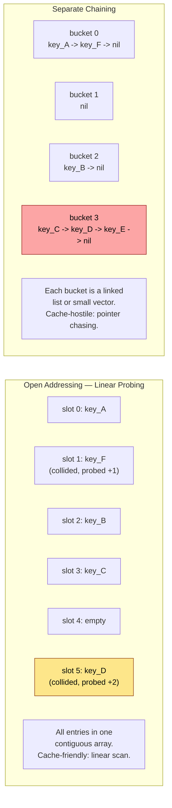
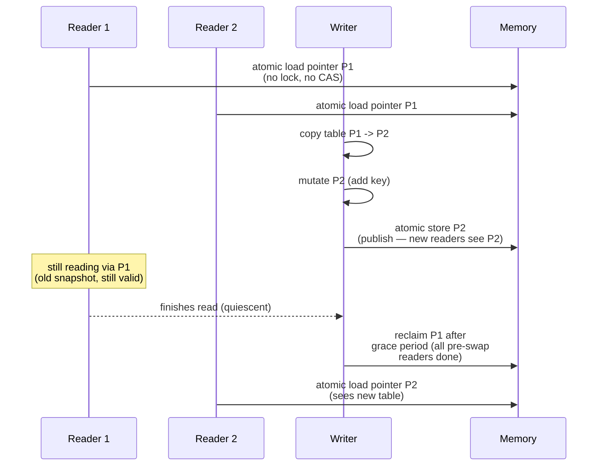
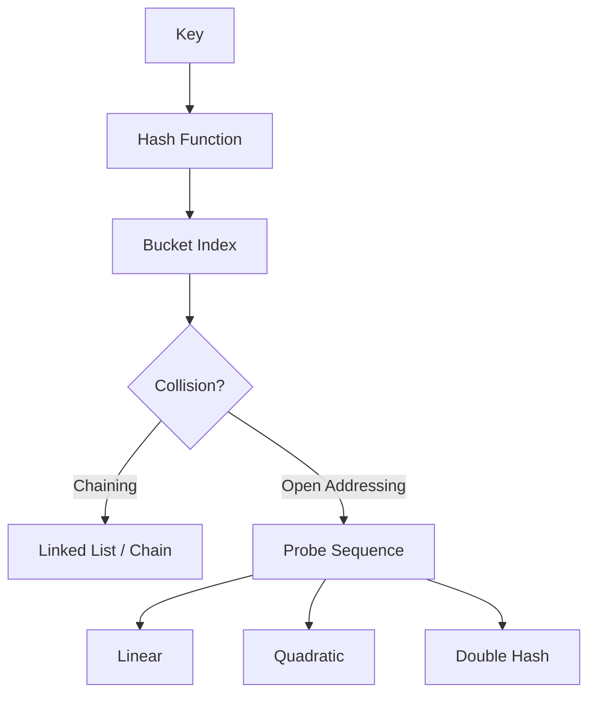
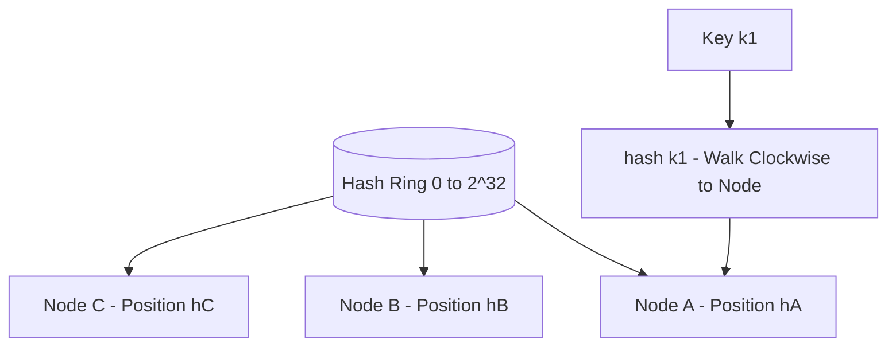
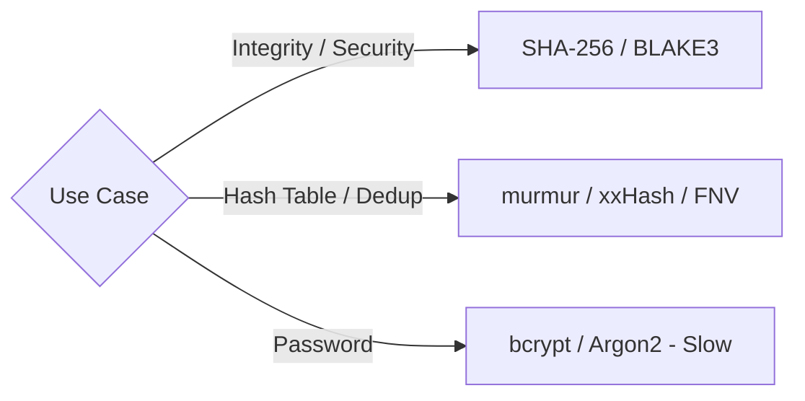
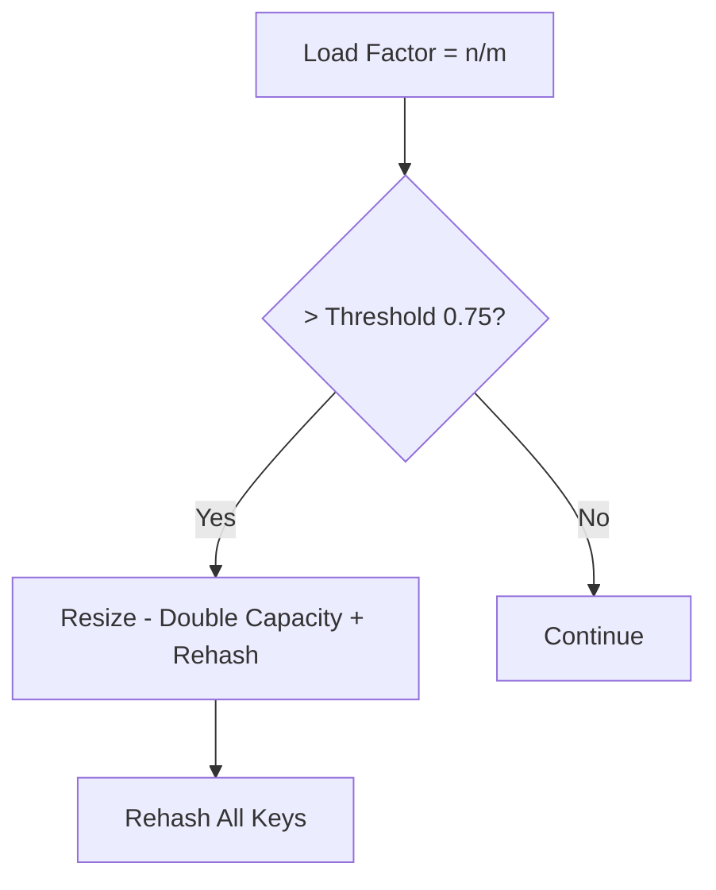

# Chapter 2 — Hashing and Hash Tables at Scale

**What this chapter covers.** Hash tables are the most heavily used data structure in backend systems — powering caches, session stores, deduplication, sharding, and every in-memory index. Yet most engineers treat them as a black box: `dict` in Python, `HashMap` in Java, `map` in Go. This chapter opens the box. We cover what makes a hash function good (uniformity, avalanche, speed), how collisions are resolved in practice, how modern open-addressing tables (SwissTable, Robin Hood) achieve cache efficiency, how to build a concurrent hash table without locking the world, and how persistent hash structures (LSM + hash indexes) work when data exceeds RAM. Every section includes real code — from a pedagogical hash table you can read in 80 lines to production-relevant benchmarks and a discussion of the tables that back Redis, RocksDB, and Go's runtime map.

Learning goals — after this chapter you should be able to:

- Evaluate a hash function for distribution quality, speed, and DoS resistance (hash flooding) and choose correctly among FxHash, MurmurHash, xxHash, SipHash, and cryptographic hashes.
- Explain and implement chaining, linear/quadratic probing, double hashing, Robin Hood, and SwissTable — and predict their cache and tail-latency behavior.
- Reason about load factor, resizing strategy, and incremental rehashing, and choose sizing for p99-sensitive paths.
- Design concurrent access: striped locks, lock-free buckets, RCU, and sharded maps — and know when each is appropriate.
- Connect hash tables to storage engines: hash indexes vs B-tree indexes, LSM hash-assisted lookups, and hash-partitioned sharding.

---

## 2.1 What a hash function must do

A hash function `h: Key -> [0, 2^b)` maps an unbounded key space into a bounded integer range. For hash tables, the table then does `index = h(key) % capacity`. Three properties matter:

**1. Uniformity.** Over the actual key distribution your service sees, output should be uniformly spread across buckets. Non-uniformity creates hot buckets, longer chains/probes, and degraded p99. This is a property of the function *and* the key distribution together — a function that is uniform over random strings may be terrible over sequential integers if it does not mix low bits.

**2. Avalanche.** Flipping one input bit should flip each output bit with ~50% probability. Poor avalanche means similar keys cluster — sequential IDs, timestamps, or lexicographically close strings collide more than chance predicts.

**3. Speed.** On the request path, hashing cost is per-operation overhead. A function that is 3x slower to compute but reduces collisions by 1% is usually a net loss — probing a few extra slots is cheaper than a heavyweight hash.

### The family of functions

| Function | Speed | Uniformity | DoS-resistant | Use when |
|---|---|---|---|---|
| Identity / `h(k)=k` | Fastest | Terrible for structured keys | No | Only when keys are already uniform (e.g., random UUIDs mod capacity) |
| FxHash / splitmix64 | Very fast (~3 ns) | Good | No | Language-runtime maps with trusted keys (Rust `FxHash`, Go runtime) |
| MurmurHash3 / xxHash | Fast (~5-8 ns) | Excellent | No | Checksums, sharding, non-adversarial tables |
| SipHash-1-3 / SipHash-2-4 | Moderate (~12 ns) | Excellent | **Yes** | Hash tables exposed to untrusted input (Python `hash()`, Ruby, mitigates hash flooding) |
| BLAKE3 / SHA-256 | Slow (~30-100 ns) | Excellent | Yes (crypto) | Content addressing, integrity — not for hash-table indexing |

```python
# Avalanche demonstration — how many output bits flip when one input bit flips
import struct, random

def splitmix64(x: int) -> int:
    """Fast non-crypto mixer — used in many FxHash implementations."""
    x = (x + 0x9E3779B97F4A7C15) & 0xFFFFFFFFFFFFFFFF
    x = (x ^ (x >> 30)) * 0xBF58476D1CE4E5B9 & 0xFFFFFFFFFFFFFFFF
    x = (x ^ (x >> 27)) * 0x94D049BB133111EB & 0xFFFFFFFFFFFFFFFF
    return x ^ (x >> 31)

def avalanche_test(hash_fn, trials: int = 10_000) -> float:
    """Mean fraction of output bits that flip when one random input bit flips."""
    total = 0
    for _ in range(trials):
        x = random.getrandbits(64)
        h0 = hash_fn(x)
        # Flip one random bit
        bit = random.randrange(64)
        h1 = hash_fn(x ^ (1 << bit))
        # Count differing bits
        total += bin(h0 ^ h1).count("1")
    return total / trials / 64  # ideal = 0.50

print(f"splitmix64 avalanche: {avalanche_test(splitmix64):.3f}  (ideal 0.500)")
# Typical: 0.500 — excellent avalanche despite being non-cryptographic.
# A bad hash like h(x)=x would score ~0.016 (1/64 bits flip).
```

### Hash flooding — the adversarial case

In 2011-2012, attackers showed that many languages used predictable hash functions. By sending keys that collide (e.g., thousands of form-field names hashing to the same bucket), they forced O(n²) server work per request — a trivial DoS. Every modern runtime now mitigates this:

- **Python** — SipHash-1-3 with a per-process random key (since 3.4; `PYTHONHASHSEED`).
- **Ruby, Perl, Java** — randomized seeding or SipHash variant.
- **Rust `HashMap`** — SipHash-1-3 by default; `FxHash` is opt-in for trusted keys.
- **Go `map`** — per-map random seed mixed via `runtime.hash`.

If your service hashes user-controlled strings (HTTP headers, query params, JSON keys), ensure the table uses a randomized hash. If it does not, an attacker can degrade your p99 to O(n) at will.

## 2.2 Collision resolution — from chaining to SwissTable

A hash table has `m` buckets and `n` entries; load factor `alpha = n / m`. Collisions are inevitable once `n` approaches `m` by the birthday paradox (50% collision probability at `n ~ 1.2 * sqrt(m)`).



### Separate chaining

Each bucket holds a linked list (or small dynamic array) of entries that hashed there. Lookup walks the chain.

- **Pros:** Simple; never needs to move entries on insert; load factor can exceed 1.0.
- **Cons:** Pointer chasing is cache-hostile; each chain node is a separate allocation (unless using an arena). At high load, long chains cause branch mispredicts and cache misses per step.

Chaining is still common in Java's `HashMap` (with treeification — chains longer than 8 become red-black trees as of Java 8, mitigating hash-flooding worst cases) and in many textbook implementations.

### Open addressing

All entries live in a single contiguous array. On collision, probe for the next available slot.

| Probing strategy | Probe sequence | Clustering | Cache behavior |
|---|---|---|---|
| **Linear probing** | `h, h+1, h+2, ...` | Primary clustering — colliding keys form runs | Best — sequential scan, prefetcher-friendly |
| **Quadratic probing** | `h, h+1, h+4, h+9, ...` | Secondary clustering only | Good, but jumps break prefetch after a few steps |
| **Double hashing** | `h, h+d, h+2d, ...` where `d = h2(key)` | Minimal clustering | Poor — probe stride varies, cache-hostile |
| **Robin Hood** | Like linear, but steals from rich (close) to give to poor (far) | Reduces variance of probe length | Excellent p99 — see below |
| **SwissTable** | SIMD group probing (16 slots at once) | Like linear within groups | Best — 16 slots checked per SIMD instruction |

**Linear probing performance** degrades sharply above load factor ~0.7 due to clustering. The expected probe length is `1/(1 - alpha)` for unsuccessful search (Knuth). At alpha=0.5 it is 2, at alpha=0.9 it is 10, at alpha=0.99 it is 100. Keep load below 0.7 or use Robin Hood / SwissTable.

### Robin Hood hashing

Robin Hood hashing augments linear probing with a fairness invariant: each entry tracks its **probe distance** (how far it is from its ideal bucket). On insertion, if the new key has probed farther than the occupant, they swap — the occupant is displaced and continues probing. This bounds the maximum probe distance and dramatically improves tail latency.

```python
# Robin Hood hash table — pedagogical implementation (single-threaded)
# Demonstrates the swap-on-longer-probe invariant.

from typing import Any

_EMPTY = object()   # sentinel for empty slot
_DELETED = object() # tombstone

class RobinHoodHashTable:
    def __init__(self, capacity: int = 16):
        # Capacity is power-of-two for fast modulo via bitmask
        cap = 1
        while cap < capacity:
            cap <<= 1
        self._cap = cap
        self._mask = cap - 1
        self._keys: list[Any] = [_EMPTY] * cap
        self._vals: list[Any] = [None] * cap
        self._dist: list[int] = [0] * cap  # probe distance (0 = ideal)
        self._size = 0

    def _hash(self, key: object) -> int:
        # Use Python's hash mixed with splitmix for better bit distribution
        h = hash(key)
        h ^= (h >> 33)
        h = (h * 0xFF51AFD7ED558CCD) & 0xFFFFFFFFFFFFFFFF
        h ^= (h >> 33)
        return h & self._mask

    def _desired(self, key: object) -> int:
        h = hash(key)
        h ^= (h >> 33)
        h = (h * 0xFF51AFD7ED558CCD) & 0xFFFFFFFFFFFFFFFF
        h ^= (h >> 33)
        return h & self._mask

    def put(self, key: object, val: object) -> None:
        if self._size * 2 >= self._cap:  # load > 0.5 -> grow
            self._resize()
        self._insert_no_resize(key, val)

    def _insert_no_resize(self, key: object, val: object) -> None:
        idx = self._desired(key)
        dist = 0
        cur_key, cur_val = key, val
        while True:
            if self._keys[idx] is _EMPTY or self._keys[idx] is _DELETED:
                self._keys[idx] = cur_key
                self._vals[idx] = cur_val
                self._dist[idx] = dist
                self._size += 1
                return
            if self._keys[idx] == cur_key:
                self._vals[idx] = cur_val  # update
                return
            if self._dist[idx] < dist:
                # Robin Hood swap: occupant is richer (closer to ideal), displace it
                self._keys[idx], cur_key = cur_key, self._keys[idx]
                self._vals[idx], cur_val = cur_val, self._vals[idx]
                self._dist[idx], dist = dist, self._dist[idx]
            idx = (idx + 1) & self._mask
            dist += 1

    def get(self, key: object) -> object | None:
        idx = self._desired(key)
        dist = 0
        while True:
            if self._keys[idx] is _EMPTY:
                return None
            if dist > self._dist[idx]:
                return None  # passed where key would be -> not present
            if self._keys[idx] == key:
                return self._vals[idx]
            idx = (idx + 1) & self._mask
            dist += 1
            if dist > self._cap:
                return None

    def _resize(self) -> None:
        old_keys, old_vals = self._keys, self._vals
        self._cap <<= 1
        self._mask = self._cap - 1
        self._keys = [_EMPTY] * self._cap
        self._vals = [None] * self._cap
        self._dist = [0] * self._cap
        self._size = 0
        for k, v in zip(old_keys, old_vals):
            if k is not _EMPTY and k is not _DELETED:
                self._insert_no_resize(k, v)

    def __len__(self) -> int:
        return self._size


# Quick correctness + probe-distance check
if __name__ == "__main__":
    tbl: RobinHoodHashTable = RobinHoodHashTable(8)
    for i in range(20):
        tbl.put(f"key_{i}", i * 10)
    for i in range(20):
        assert tbl.get(f"key_{i}") == i * 10, f"missing key_{i}"
    assert tbl.get("nope") is None
    max_dist = max(tbl._dist)
    print(f"size={len(tbl)} cap={tbl._cap} max_probe_dist={max_dist}")
    print("all assertions passed")
    # At load 20/32 = 0.625, max probe distance is typically 2-4 with Robin Hood
    # vs 8-15 with naive linear probing — that is the p99 win.
```

### SwissTable (Abseil / Rust hashbrown / Go 1.24+)

SwissTable is the current state of the art for open-addressing hash tables. Key ideas:

1. **Group probing with SIMD.** Buckets are grouped in 16s. A single SIMD instruction compares 16 control bytes (metadata) against the 7-bit hash fragment in parallel. Most lookups find the group via one SIMD compare; only on group miss do you probe the next group.
2. **7-bit control bytes + 1-bit sentinel.** Each slot has a control byte: `empty` (0b10000000), `deleted` (0b11111110), or `full` with 7 bits of hash. Lookup first matches control bytes via SIMD, then verifies the full key only on candidates. This filters 127/128 of non-matching slots without touching the keys array — cache win.
3. **No per-entry pointers.** Everything is array-indexed. Excellent prefetcher behavior.

SwissTable powers `absl::flat_hash_map` (C++), `hashbrown::HashMap` (Rust, and since Rust 1.56 the standard `HashMap`), and Go's `swiss` map experiment (Go 1.24+). If you use any of these languages, you already benefit — but knowing *why* they are faster (2-3x over chaining for small keys, better p99) helps you size and tune.

```mermaid
flowchart LR
    subgraph Control["Control bytes (1 per slot, SIMD-scanned)"]
        C0["0x8A<br/>h=0x0A"]
        C1["0x80<br/>empty"]
        C2["0x8A<br/>h=0x0A"]
        C3["0x83<br/>h=0x03"]
        C4["0x80<br/>empty"]
        C5["0xFF<br/>deleted"]
        C6["0x0A<br/>h=0x0A"]
        C7["0x80<br/>empty"]
    end
    subgraph Slots["Key-Value slots (only touched on match)"]
        S0["k: foo<br/>v: 42"]
        S2["k: bar<br/>v: 17"]
        S3["k: baz<br/>v: 99"]
        S6["k: qux<br/>v: 5"]
    end
    Lookup["Lookup h=0x0A<br/>SIMD match → slots 0,2,6<br/>only compare those keys"]

    Control -.->|"SIMD compare<br/>16 at once"| Lookup
    Lookup -.->|"verify full key<br/>only on candidates"| Slots

    style C0 fill:#86efac,stroke:#166534,color:#000
    style C2 fill:#86efac,stroke:#166534,color:#000
    style C6 fill:#86efac,stroke:#166534,color:#000
```



## 2.3 Load factor, resizing, and incremental rehash

### When to resize

Resizing means allocating a larger array (typically 2x) and rehashing every entry — O(n) work. Doing it all at once pauses the table. Strategies:

| Strategy | Pause | Throughput | p99 |
|---|---|---|---|
| **Stop-the-world rehash** (double + copy) | O(n) pause | Highest (no per-op overhead) | Worst — one request pays O(n) |
| **Incremental rehash** (copy k entries per operation) | O(k) per op | Slightly lower (extra branch) | Best — bounded per-op cost |
| **Pre-sizing** (`with_capacity(n)`) | None if estimate is right | Best | Best — if you know n in advance |

```python
# Incremental rehash sketch — two tables, migrate a few buckets per operation
# Mirrors Redis dict and Go map's evacuation strategy.

class IncrementalHashTable:
    """Two-table incremental rehash. Each op migrates BATCH buckets."""
    BATCH = 4

    def __init__(self):
        self._old: dict[object, object] | None = None
        self._new: dict[object, object] = {}
        self._cap = 16
        self._rehashing = False
        self._rehash_idx = 0
        self._old_keys: list[object] = []

    def put(self, key: object, val: object) -> None:
        self._maybe_start_rehash()
        if self._rehashing:
            self._rehash_step()
            # Insert into new table during rehash
            self._new[key] = val
            # Remove from old if present (handles update during migration)
            if self._old is not None and key in self._old:
                del self._old[key]
        else:
            self._new[key] = val

    def get(self, key: object) -> object | None:
        if self._rehashing:
            self._rehash_step()
            if key in self._new:
                return self._new[key]
            if self._old is not None and key in self._old:
                return self._old[key]
            return None
        return self._new.get(key)

    def _maybe_start_rehash(self) -> None:
        if not self._rehashing and len(self._new) * 4 >= self._cap * 3:  # load > 0.75
            self._old = self._new
            self._old_keys = list(self._old.keys())
            self._new = {}
            self._cap *= 2
            self._rehashing = True
            self._rehash_idx = 0

    def _rehash_step(self) -> None:
        if not self._rehashing or self._old is None:
            return
        for _ in range(self.BATCH):
            if self._rehash_idx >= len(self._old_keys):
                # Done — old table is empty
                self._old = None
                self._rehashing = False
                return
            k = self._old_keys[self._rehash_idx]
            self._rehash_idx += 1
            if k in self._old:  # may have been updated/deleted
                self._new[k] = self._old.pop(k)
```

> **Backend rule.** On the request path, never let a hash table do a stop-the-world rehash. Either pre-size (when cardinality is predictable — e.g., routing table, feature-flag map) or use incremental rehash. For offline/batch tables, stop-the-world is fine and faster overall.

### Benchmarking load-factor impact

```python
# Benchmark: lookup latency vs load factor — linear probing
import random, time, statistics

def bench_load_factor(capacity: int = 1 << 16):
    for load in [0.25, 0.50, 0.70, 0.85, 0.95]:
        n = int(capacity * load)
        # Build table as Python dict (chaining) — proxy for load effects
        # For open-addressing the curve is steeper; dict stays flatter
        keys = [f"k_{i}_{random.getrandbits(32):08x}" for i in range(n)]
        tbl = {k: i for i, k in enumerate(keys)}
        # Mix of hits and misses
        probes = keys[:500] + [f"miss_{i}" for i in range(500)]
        random.shuffle(probes)

        samples: list[float] = []
        for k in probes:
            t0 = time.perf_counter_ns()
            _ = tbl.get(k)
            samples.append(time.perf_counter_ns() - t0)
        samples.sort()
        p50 = samples[len(samples)//2]
        p99 = samples[int(len(samples)*0.99)]
        print(f"load={load:.2f}  n={n:>6}  p50={p50:>5.0f}ns  p99={p99:>5.0f}ns")

if __name__ == "__main__":
    bench_load_factor()
    # Expect p50 ~60-80ns across loads, p99 rising from ~80ns at 0.25 to ~200ns at 0.95
    # for chaining. For linear probing without Robin Hood, p99 at 0.95 would be ~10x higher.
```

## 2.4 Concurrent hash tables

Multiple goroutines/threads reading and writing the same map is the common case in backend services (connection tables, session caches, rate-limiter state). Options:

### Option 1 — Single lock (naive)

```go
// Go — coarse-grained lock. Simple, correct, but serializes all access.
type SafeMap[K comparable, V any] struct {
    mu sync.RWMutex
    m  map[K]V
}
func (s *SafeMap[K,V]) Get(k K) (V, bool) { s.mu.RLock(); defer s.mu.RUnlock(); v, ok := s.m[k]; return v, ok }
func (s *SafeMap[K,V]) Set(k K, v V)      { s.mu.Lock(); defer s.mu.Unlock(); s.m[k] = v }
```

Throughput collapses under contention — all cores serialize on the single `RWMutex`. At 32 cores, this can be 10-20x slower than sharded.

### Option 2 — Striped / sharded locks

Partition keys across N shards (each with its own lock) by `shard = hash(key) % N`. Contention drops by ~N (assuming uniform hash).

```python
# Sharded hash table — 32 shards, each independently locked
import threading
from typing import Generic, TypeVar

K = TypeVar("K")
V = TypeVar("V")

class ShardedMap(Generic[K, V]):
    def __init__(self, shards: int = 32):
        # Power-of-two shards for fast bitmask
        assert shards & (shards - 1) == 0
        self._shards: list[dict[K, V]] = [{} for _ in range(shards)]
        self._locks: list[threading.Lock] = [threading.Lock() for _ in range(shards)]
        self._mask = shards - 1

    def _shard(self, key: K) -> int:
        return (hash(key) & 0xFFFFFFFF) & self._mask

    def get(self, key: K) -> V | None:
        s = self._shard(key)
        with self._locks[s]:
            return self._shards[s].get(key)

    def put(self, key: K, val: V) -> None:
        s = self._shard(key)
        with self._locks[s]:
            self._shards[s][key] = val

    def delete(self, key: K) -> None:
        s = self._shard(key)
        with self._locks[s]:
            self._shards[s].pop(key, None)
```

> **Sharding trade-off.** Iteration and `len()` now require locking all shards. If you need consistent snapshots, you need a different design (copy-on-write or epoch-based reclamation).

### Option 3 — Lock-free / RCU

For read-heavy workloads (routing tables, config maps that change rarely), RCU (Read-Copy-Update) is ideal: readers are wait-free (no locks, no atomics beyond a pointer read), writers copy the table, publish with an atomic swap, and reclaim the old table after a grace period.



In Go, `sync.Map` uses a related technique (read map + dirty map with atomic promotion). In Java, `ConcurrentHashMap` uses per-bin CAS + `synchronized` on first node — effectively fine-grained locking with lock-free fast path for uncontended bins.

### When to use what

| Workload | Best choice | Why |
|---|---|---|
| Single-threaded or externally synchronized | Plain `map` / `dict` / `HashMap` | No concurrency overhead |
| Moderate contention, mixed R/W | Sharded map (16-64 shards) | Simple, scales linearly to shard count |
| Read-heavy, rare writes | RCU / copy-on-write / `sync.Map` (Go) | Readers are wait-free; writer cost is O(n) copy |
| High contention, mixed R/W, Java | `ConcurrentHashMap` | Per-bin locking, scales well to many cores |
| Extreme write contention | Consider partitioning the problem (actor per shard, queue per key) rather than sharing a map | Contention is a symptom of shared mutable state |

## 2.5 Hash tables beyond RAM — storage engines

When data exceeds memory, hash tables meet storage engines. Two roles:

**Hash index (in-memory or on-disk).** Some engines offer a hash index alongside B-tree indexes. Example: MySQL `MEMORY` engine, InnoDB adaptive hash index (an in-memory hash over B-tree pages to accelerate repeated point lookups). Hash indexes are O(1) for point lookups but cannot serve range scans or prefix searches — if those queries exist, you need an ordered index.

**Hash-assisted LSM.** RocksDB and similar LSM engines use hash-partitioned SSTables or bloom-filter-assisted point lookups (a bloom filter is a hash structure — see Ch. 4). The hash determines which SSTable or block to check, but the data within is sorted for scan efficiency. This hybrid — hash for routing, sorted run for scanning — is the dominant design for write-heavy stores.

**Sharding via hashing.** Consistent hashing (Ch. 5) is hash-partitioning at the cluster level: `shard = hash(key) % num_shards` (or ring-based for elasticity). The hash function's uniformity directly determines load balance. A poor hash creates hot shards; a good one (xxHash, Murmur) spreads uniformly. This is the same uniformity requirement as in-memory tables, now with operational consequences — a hot shard is a hot database.

```python
# Hash-partitioned sharding — uniformity check
import hashlib, collections

def shard_for(key: str, num_shards: int) -> int:
    # xxhash equivalent: fast non-crypto hash then mod
    h = int(hashlib.blake2b(key.encode(), digest_size=8).hexdigest(), 16)
    # In production use xxhash.xxh64(key).intdigest() — 5x faster than blake2b
    return h % num_shards

def check_balance(keys: list[str], num_shards: int) -> None:
    counts: collections.Counter[int] = collections.Counter(
        shard_for(k, num_shards) for k in keys
    )
    mean = len(keys) / num_shards
    worst = max(counts.values())
    stddev = (sum((c - mean) ** 2 for c in counts.values()) / num_shards) ** 0.5
    print(f"shards={num_shards} keys={len(keys)} mean={mean:.0f} "
          f"worst={worst} (+{(worst-mean)/mean*100:.1f}%) stddev={stddev:.0f}")
    for s in range(num_shards):
        bar = "#" * int(counts[s] / mean * 20)
        print(f"  shard {s:2}: {counts[s]:5} {bar}")

if __name__ == "__main__":
    import random, string
    keys = [f"user:{random.randint(0, 10_000_000)}" for _ in range(100_000)]
    check_balance(keys, 16)
    # Expect worst shard within ~5% of mean for a good hash at 100k keys / 16 shards.
    # With a bad hash (e.g., hash=user_id % 16 where user_id is sequential),
    # some shards could be 2x overloaded if IDs are not uniform.
```

## 2.6 Tuning guide — choosing and sizing a hash table

**Choosing the table:**

- Language default is usually right for general use. Override only with reason: `FxHash` for trusted integer keys where speed matters, `SipHash` when keys are adversarial.
- For large, long-lived, read-heavy maps (>100K entries, >90% reads), consider SwissTable-backed types (`absl::flat_hash_map`, `hashbrown`, Go `swiss`) — measurable win.
- For highly concurrent maps, shard or use `ConcurrentHashMap` / `sync.Map` / RCU. Do not share a single-locked map across 32 cores.

**Sizing:**

```python
# Rule: capacity = expected_n / target_load_factor, rounded up to power of two.
import math

def ideal_capacity(expected_n: int, load: float = 0.7) -> int:
    needed = math.ceil(expected_n / load)
    # Round up to next power of two (for bitmask-indexed tables)
    return 1 << (needed - 1).bit_length()

for n in [1_000, 100_000, 10_000_000]:
    print(f"n={n:>10,}  capacity={ideal_capacity(n):>12,}  "
          f"overhead={(ideal_capacity(n)/n - 1)*100:.0f}%")
# n=     1,000  capacity=       2,048  overhead=105%
# n=   100,000  capacity=     262,144  overhead=162%  — but at 10M, next pow2 is 16M
# For huge tables, non-power-of-two capacity with prime modulo wastes less memory
# at the cost of a division per lookup — worth it when memory is tight.
```

**Anti-patterns:**

- **Boxed keys in hot paths.** In Java, `HashMap<Integer, V>` boxes every key — allocation pressure and cache misses. Use `Int2ObjectOpenHashMap` (fastutil) or `TIntObjectHashMap` (Trove) for primitive keys.
- **Large keys stored inline.** If keys are 200-byte strings, the table's memory is dominated by key storage, not buckets. Consider interning, hashing to 64-bit IDs first, or using a string table.
- **Rehashing on the request path.** Pre-size or use incremental rehash (Section 2.3).

---

## Key takeaways

- Hash-function quality (uniformity, avalanche, speed) and DoS resistance (randomized seeding via SipHash) are as important as table design. User-controlled keys must use a randomized hash.
- Separate chaining is simple but cache-hostile; open addressing (linear probing, Robin Hood, SwissTable) keeps data contiguous and leverages SIMD — prefer it for performance-sensitive tables.
- Robin Hood hashing bounds probe-distance variance, dramatically improving p99. SwissTable goes further by scanning 16 control bytes per SIMD instruction — the current state of the art.
- Keep load factor below ~0.7 for linear probing; above that, probe chains grow superlinearly. Pre-size when cardinality is predictable; use incremental rehash on latency-sensitive paths.
- Concurrent strategies form a spectrum: single lock (simple, contended) -> sharded locks (scales with shard count) -> RCU / copy-on-write (wait-free reads, O(n) writes). Match the strategy to the read/write ratio and core count.
- Beyond RAM, hashing appears as hash indexes (fast point lookup, no range scans), bloom-filter-assisted LSM lookups, and hash-partitioned sharding — where uniformity determines operational load balance.

## Further reading

- Knuth — *The Art of Computer Programming*, Vol. 3, Section 6.4 (hashing) — the classical analysis of chaining and open addressing.
- Abseil SwissTable design doc (abseil.io/about/design/swisstables) — control bytes, SIMD probing, and why SwissTable beats chaining.
- Rust `hashbrown` crate docs (docs.rs/hashbrown) — SwissTable implementation details and benchmarks.
- Go `runtime/map` and `swiss` experiment (github.com/golang/go/issues/54766) — Go's map evolution toward SwissTable.
- Crosby & Wallach — "Denial of Service via Algorithmic Complexity Attacks" (USENIX Security 2003) — the original hash-flooding paper.
- RocksDB / LevelDB bloom filter docs — hash-assisted LSM point lookups at scale.

### Hash table collision resolution



### Consistent hashing ring



### Cryptographic vs non-cryptographic hash use



### Load factor and resizing


