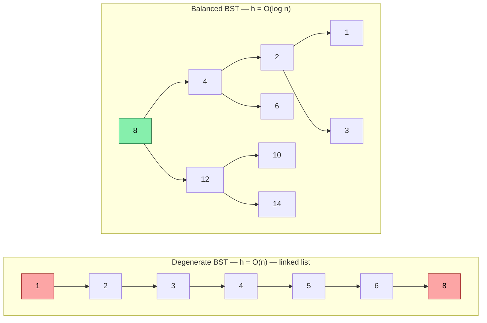
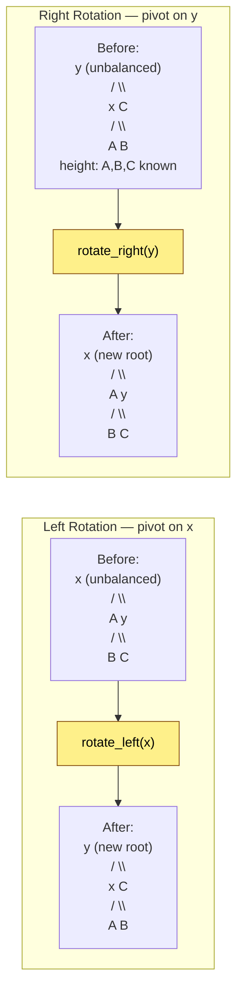
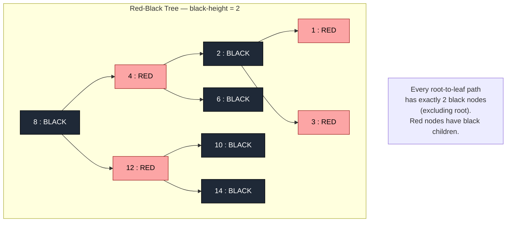
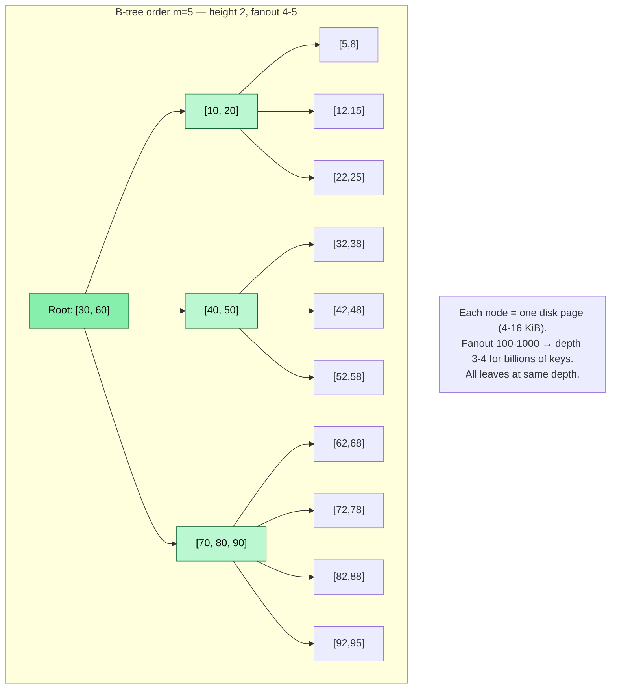
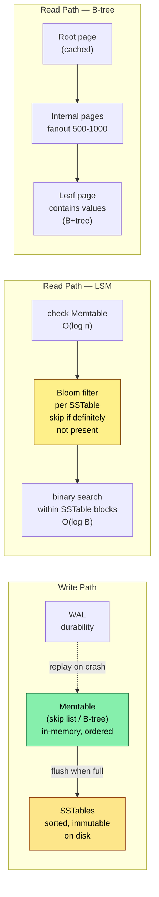
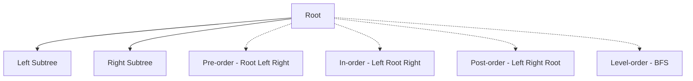
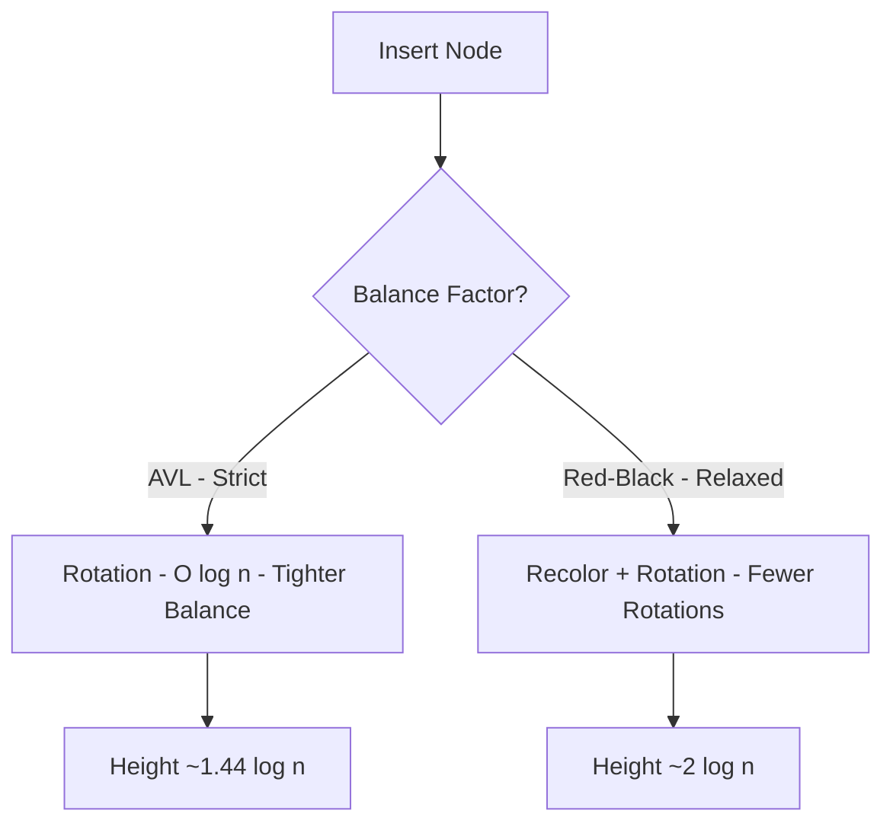

# Chapter 3 — Balanced Trees and Ordered Structures

**What this chapter covers.** Hash tables answer "does this key exist?" in O(1), but many backend problems are ordered: range scans over time-series, prefix searches over keys, sorted iteration for merge joins, and maintaining a sorted index that supports concurrent writes. For these, you need ordered structures — balanced trees and their on-disk cousin, the B-tree. This chapter covers binary search trees from first principles, why unbalanced trees degrade to linked lists, how AVL and red-black trees restore balance through rotations, why B-trees dominate storage engines, and how concurrent ordered indexes (Bw-tree, lock-free skip lists) power modern databases. We implement an AVL tree and a B-tree from scratch, visualize rotations, and connect every structure to the systems that depend on it — from PostgreSQL indexes to RocksDB memtables to the Linux kernel's `rbtree`.

Learning goals — after this chapter you should be able to:

- Explain why BST operations are O(h) where h is height, and why height is O(log n) only when balanced.
- Implement and reason about AVL and red-black tree invariants, rotations, and rebalancing — and know when to prefer each.
- Describe B-tree structure, node layout, and why fanout of 100-1000 makes B-trees optimal for disk and cache.
- Compare ordered structures (BST, B-tree, LSM, skip list) on point lookup, range scan, write amplification, and concurrency.
- Choose and tune ordered indexes for backend use: PostgreSQL B-tree vs BRIN vs GiST, RocksDB/LevelDB memtable, and in-memory ordered maps.

---

## 3.1 Binary search trees — the ordered foundation

### BST invariant

A binary search tree stores keys in nodes with at most two children. For every node:

- All keys in the **left** subtree are **less than** the node's key.
- All keys in the **right** subtree are **greater than** the node's key.
- (For duplicates, a common convention is left <= node < right, or store a count.)

This invariant makes three operations possible by walking a single root-to-leaf path:

- **Search** — compare target with current node, go left or right. O(h).
- **Insert** — search for where the key would be, attach a new leaf. O(h).
- **Delete** — three cases: leaf (remove), one child (bypass), two children (replace with successor/predecessor). O(h).



Both trees hold the same keys. The balanced one has height 3 (Theta(log n)) — every operation visits at most 4 nodes. The degenerate one has height 6 (Theta(n)) — operations visit every node. The degenerate case arises naturally when keys arrive in sorted order (timestamps, auto-increment IDs, sequential UUIDs) — exactly the insertion order common in backend systems.

> **Fundamental fact.** BST operations cost O(h), not O(log n). O(log n) holds only when h = O(log n), which requires rebalancing. Every "balanced BST" is a strategy for maintaining h = O(log n) under arbitrary insertions and deletions.

### In-order traversal gives sorted order — the key advantage over hash tables

```python
# BST in-order traversal yields keys in sorted order — enables range scans.
# Hash tables cannot do this without sorting (O(n log n)).

from typing import Optional

class BSTNode:
    def __init__(self, key: int, val: object = None):
        self.key = key
        self.val = val
        self.left: Optional["BSTNode"] = None
        self.right: Optional["BSTNode"] = None

def bst_insert(root: Optional[BSTNode], key: int, val: object = None) -> BSTNode:
    if root is None:
        return BSTNode(key, val)
    if key < root.key:
        root.left = bst_insert(root.left, key, val)
    elif key > root.key:
        root.right = bst_insert(root.right, key, val)
    else:
        root.val = val  # update
    return root

def inorder(root: Optional[BSTNode], out: list[int]) -> None:
    if root is None:
        return
    inorder(root.left, out)
    out.append(root.key)
    inorder(root.right, out)

def range_query(root: Optional[BSTNode], lo: int, hi: int, out: list[int]) -> None:
    """Collect keys in [lo, hi] — prunes subtrees outside range."""
    if root is None:
        return
    if lo < root.key:
        range_query(root.left, lo, hi, out)
    if lo <= root.key <= hi:
        out.append(root.key)
    if root.key < hi:
        range_query(root.right, lo, hi, out)

if __name__ == "__main__":
    keys = [8, 3, 10, 1, 6, 14, 4, 7, 13]
    root: Optional[BSTNode] = None
    for k in keys:
        root = bst_insert(root, k)
    result: list[int] = []
    inorder(root, result)
    print(f"sorted: {result}")            # [1, 3, 4, 6, 7, 8, 10, 13, 14]
    result.clear()
    range_query(root, 4, 10, result)
    print(f"range [4,10]: {result}")       # [4, 6, 7, 8, 10]
    # Range query visits O(log n + k) nodes where k = result size
    # — only the search path plus the output. A hash table would scan all n.
```

Range query complexity is O(log n + k) where k is the number of matching keys — optimal, since you must output k keys. A hash table would need O(n) to find the same range. This is why time-series databases, secondary indexes, and sorted merge joins require ordered structures.

## 3.2 Restoring balance — AVL and red-black trees

### Rotations — the primitive

Every balanced BST restores its invariant through **rotations** — local restructurings that change heights without violating the BST ordering.



A rotation preserves in-order traversal (hence BST ordering), runs in O(1), and changes heights by at most 1. Double rotations (left-right, right-left) handle the zig-zag case where a single rotation is insufficient.

### AVL trees — height-balanced

**Invariant:** For every node, the heights of its left and right subtrees differ by at most 1. Balance factor `bf = height(left) - height(right)` is in {-1, 0, +1}.

AVL trees are the most rigidly balanced BST — height is at most `1.44 * log2(n)` (vs `log2(n)` optimal). They do slightly more rotations on insert/delete than red-black trees but guarantee the shallowest tree, making them ideal for read-heavy workloads where lookup speed matters most.

**Rebalancing after insertion:** Walk back up from the inserted leaf, updating heights. At the first node where `|bf| = 2`, apply one of four cases:

| Case | Balance factor | Child balance | Fix |
|---|---|---|---|
| Left-Left (LL) | +2 | child bf >= 0 | Single right rotation |
| Right-Right (RR) | -2 | child bf <= 0 | Single left rotation |
| Left-Right (LR) | +2 | child bf < 0 | Left rotation on child, then right on node |
| Right-Left (RL) | -2 | child bf > 0 | Right rotation on child, then left on node |

```python
# AVL tree — complete implementation with rotations and rebalancing
from typing import Optional

class AVLNode:
    __slots__ = ("key", "val", "left", "right", "height")
    def __init__(self, key: int, val: object = None):
        self.key = key
        self.val = val
        self.left: Optional["AVLNode"] = None
        self.right: Optional["AVLNode"] = None
        self.height: int = 1  # leaf height = 1

def _height(n: Optional[AVLNode]) -> int:
    return n.height if n else 0

def _update_height(n: AVLNode) -> None:
    n.height = 1 + max(_height(n.left), _height(n.right))

def _balance_factor(n: AVLNode) -> int:
    return _height(n.left) - _height(n.right)

def _rotate_right(y: AVLNode) -> AVLNode:
    x = y.left  # type: ignore[assignment]
    assert x is not None
    t2 = x.right
    x.right = y
    y.left = t2
    _update_height(y)
    _update_height(x)
    return x

def _rotate_left(x: AVLNode) -> AVLNode:
    y = x.right  # type: ignore[assignment]
    assert y is not None
    t2 = y.left
    y.left = x
    x.right = t2
    _update_height(x)
    _update_height(y)
    return y

def _rebalance(node: AVLNode) -> AVLNode:
    _update_height(node)
    bf = _balance_factor(node)
    # Left-heavy
    if bf > 1:
        assert node.left is not None
        if _balance_factor(node.left) < 0:  # LR case
            node.left = _rotate_left(node.left)
        return _rotate_right(node)
    # Right-heavy
    if bf < -1:
        assert node.right is not None
        if _balance_factor(node.right) > 0:  # RL case
            node.right = _rotate_right(node.right)
        return _rotate_left(node)
    return node

def avl_insert(root: Optional[AVLNode], key: int, val: object = None) -> AVLNode:
    if root is None:
        return AVLNode(key, val)
    if key < root.key:
        root.left = avl_insert(root.left, key, val)
    elif key > root.key:
        root.right = avl_insert(root.right, key, val)
    else:
        root.val = val
        return root
    return _rebalance(root)

def avl_search(root: Optional[AVLNode], key: int) -> Optional[AVLNode]:
    while root is not None:
        if key == root.key:
            return root
        root = root.left if key < root.key else root.right
    return None

# --- Verification ---

def _check_avl_invariant(node: Optional[AVLNode]) -> int:
    """Returns height; asserts AVL and BST invariants."""
    if node is None:
        return 0
    lh = _check_avl_invariant(node.left)
    rh = _check_avl_invariant(node.right)
    assert abs(lh - rh) <= 1, f"AVL violation at {node.key}: bf={lh - rh}"
    if node.left:
        assert node.left.key < node.key
    if node.right:
        assert node.right.key > node.key
    assert node.height == 1 + max(lh, rh), f"height mismatch at {node.key}"
    return node.height

def _inorder_keys(node: Optional[AVLNode], out: list[int]) -> None:
    if node is None:
        return
    _inorder_keys(node.left, out)
    out.append(node.key)
    _inorder_keys(node.right, out)

if __name__ == "__main__":
    import random
    # Worst case for unbalanced BST: sorted insertion — AVL must stay balanced
    root: Optional[AVLNode] = None
    for k in range(1000):
        root = avl_insert(root, k)
    assert root is not None
    print(f"n=1000 sorted insert: height={root.height}  "
          f"optimal={1000 .bit_length()}  ratio={root.height / 1000 .bit_length():.2f}")
    _check_avl_invariant(root)

    # Random insertion — also balanced, heights even closer to optimal
    root2: Optional[AVLNode] = None
    keys = random.sample(range(100_000), 10_000)
    for k in keys:
        root2 = avl_insert(root2, k)
    out: list[int] = []
    _inorder_keys(root2, out)
    assert out == sorted(keys)
    assert root2 is not None
    print(f"n=10000 random insert: height={root2.height}  "
          f"optimal={10000 .bit_length()}  ratio={root2.height / 10000 .bit_length():.2f}")
    _check_avl_invariant(root2)
    print("all AVL checks passed")
    # Expected: sorted n=1000 -> height ~10 (optimal 10), random n=10000 -> height ~15 (optimal 14)
```

### Red-black trees — color-balanced

**Invariants (5 rules):**

1. Every node is red or black.
2. Root is black.
3. Every leaf (NIL) is black.
4. Red nodes have black children (no two reds in a row).
5. Every root-to-leaf path has the same number of black nodes (black-height).

These guarantee height <= `2 * log2(n+1)` — slightly taller than AVL but with fewer rotations on average. Insert does at most 2 rotations; delete at most 3. This makes red-black trees preferred when writes are frequent: Linux kernel `rbtree`, Java `TreeMap`, C++ `std::map`, and historically many database index implementations.



### AVL vs red-black — when to use which

| Criterion | AVL | Red-black |
|---|---|---|
| Height bound | 1.44 log n (tighter) | 2 log n (looser) |
| Lookup speed | Slightly faster (shallower) | Slightly slower |
| Insert/delete rotations | More (up to O(log n) rotations) | Fewer (at most 2-3) |
| Implementation complexity | Simpler to reason about | More cases, trickier delete |
| Best for | Read-heavy, lookup-dominated (config maps, routing tables) | Write-heavy or mixed (kernel scheduling, `TreeMap`, indexed writes) |

In practice, most backend engineers do not implement either from scratch — they use the standard library's ordered map. But understanding the trade-off helps when choosing between an ordered map and alternatives, and when debugging performance regressions caused by degenerate tree shapes after bulk loads.

## 3.3 B-trees — ordered structure for storage

A B-tree generalizes the BST: each node holds many keys and many children. A B-tree of order `m` (sometimes called minimum degree `t = ceil(m/2)`):

- Each node holds at most `m - 1` keys and `m` children.
- Each internal node (except root) holds at least `ceil(m/2) - 1` keys.
- All leaves are at the same depth.
- Keys within a node are sorted; children partition the key space.



### Why B-trees dominate storage

The key number is **fanout** — keys per node. With 16 KiB pages and 16-byte keys, a B-tree node holds ~500-1000 keys. For n = 1 billion:

- Binary tree height: log2(10⁹) ~ 30 levels — 30 random I/Os per lookup.
- B-tree height with fanout 500: log_500(10⁹) ~ 3.3 — **4 I/Os** per lookup.
- With root cached in memory: **3 I/Os**. With two levels cached: **1 I/O**.

Each I/O is a page read. Fewer levels means fewer random reads, and each page read is sequential within the page (cache-friendly scan of sorted keys).

**B+tree variant** (used by InnoDB, PostgreSQL, WiredTiger): internal nodes store only keys and child pointers; all values are in leaves, and leaves are linked for efficient range scans. This increases fanout (no values in internal nodes) and makes range iteration a leaf-level linked-list walk.

### B-tree node layout and split

```python
# B-tree — pedagogical implementation (order m=4, i.e. max 3 keys per node)
# Demonstrates node split, the core rebalancing operation.
from __future__ import annotations
from typing import Optional

ORDER = 4  # max children per node; max keys = ORDER - 1 = 3

class BTreeNode:
    def __init__(self, leaf: bool = True):
        self.leaf: bool = leaf
        self.keys: list[int] = []
        self.vals: list[object] = []
        self.children: list[BTreeNode] = []  # len = len(keys) + 1 if not leaf

class BTree:
    def __init__(self):
        self.root = BTreeNode(leaf=True)

    # -- Search --
    def search(self, key: int) -> object | None:
        return self._search(self.root, key)

    def _search(self, node: BTreeNode, key: int) -> object | None:
        i = 0
        while i < len(node.keys) and key > node.keys[i]:
            i += 1
        if i < len(node.keys) and key == node.keys[i]:
            return node.vals[i]
        if node.leaf:
            return None
        return self._search(node.children[i], key)

    # -- Insert --
    def insert(self, key: int, val: object) -> None:
        root = self.root
        if len(root.keys) == ORDER - 1:
            # Root is full — grow tree height by one
            new_root = BTreeNode(leaf=False)
            new_root.children.append(root)
            self._split_child(new_root, 0)
            self.root = new_root
            self._insert_nonfull(new_root, key, val)
        else:
            self._insert_nonfull(root, key, val)

    def _split_child(self, parent: BTreeNode, idx: int) -> None:
        """Split parent.children[idx] (which is full) into two nodes."""
        full = parent.children[idx]
        mid = len(full.keys) // 2
        mid_key, mid_val = full.keys[mid], full.vals[mid]

        right = BTreeNode(leaf=full.leaf)
        right.keys = full.keys[mid + 1:]
        right.vals = full.vals[mid + 1:]
        if not full.leaf:
            right.children = full.children[mid + 1:]
            full.children = full.children[:mid + 1]

        full.keys = full.keys[:mid]
        full.vals = full.vals[:mid]

        parent.keys.insert(idx, mid_key)
        parent.vals.insert(idx, mid_val)
        parent.children.insert(idx + 1, right)

    def _insert_nonfull(self, node: BTreeNode, key: int, val: object) -> None:
        i = len(node.keys) - 1
        if node.leaf:
            # Insert into sorted position within leaf
            node.keys.append(0)  # type: ignore[arg-type]
            node.vals.append(None)
            while i >= 0 and key < node.keys[i]:
                node.keys[i + 1] = node.keys[i]
                node.vals[i + 1] = node.vals[i]
                i -= 1
            # Check for duplicate
            if i >= 0 and node.keys[i] == key:
                node.vals[i] = val
                # Remove the extra slot we appended
                node.keys.pop()
                node.vals.pop()
            else:
                node.keys[i + 1] = key
                node.vals[i + 1] = val
        else:
            while i >= 0 and key < node.keys[i]:
                i -= 1
            # Check if key already in internal node
            if i >= 0 and node.keys[i] == key:
                node.vals[i] = val
                return
            i += 1
            if len(node.children[i].keys) == ORDER - 1:
                self._split_child(node, i)
                if key > node.keys[i]:
                    i += 1
                elif key == node.keys[i]:
                    node.vals[i] = val
                    return
            self._insert_nonfull(node.children[i], key, val)

    # -- Range scan (in-order) --
    def range_scan(self, lo: int, hi: int) -> list[tuple[int, object]]:
        out: list[tuple[int, object]] = []
        self._range_scan(self.root, lo, hi, out)
        return out

    def _range_scan(self, node: BTreeNode, lo: int, hi: int,
                    out: list[tuple[int, object]]) -> None:
        i = 0
        for i, k in enumerate(node.keys):
            if not node.leaf:
                self._range_scan(node.children[i], lo, hi, out)
            if lo <= k <= hi:
                out.append((k, node.vals[i]))
            elif k > hi:
                return
        if not node.leaf:
            self._range_scan(node.children[len(node.keys)], lo, hi, out)

    def height(self) -> int:
        h, n = 0, self.root
        while True:
            h += 1
            if n.leaf:
                return h
            n = n.children[0]

    def count_keys(self) -> int:
        return self._count(self.root)

    def _count(self, node: BTreeNode) -> int:
        c = len(node.keys)
        if not node.leaf:
            for ch in node.children:
                c += self._count(ch)
        return c


if __name__ == "__main__":
    import random
    bt = BTree()
    keys = list(range(100))
    random.shuffle(keys)
    for k in keys:
        bt.insert(k, f"val_{k}")

    # Point lookups
    for k in range(100):
        assert bt.search(k) == f"val_{k}", f"missing {k}"
    assert bt.search(999) is None

    # Range scan
    result = bt.range_scan(20, 30)
    assert [k for k, _ in result] == list(range(20, 31))

    # Height check — with ORDER=4 and n=100, height should be 3-4
    print(f"n={bt.count_keys()} height={bt.height()} order={ORDER}")

    # Larger test — n=10000, height should be ~7-8 with order 4
    # (with order 128 it would be 3 — that is why real B-trees use large fanout)
    bt2 = BTree()
    for k in random.sample(range(100_000), 10_000):
        bt2.insert(k, k)
    print(f"n={bt2.count_keys()} height={bt2.height()} order={ORDER}")

    # Verify sorted order via full scan
    all_kv = bt2.range_scan(0, 200_000)
    all_keys = [k for k, _ in all_kv]
    assert all_keys == sorted(all_keys), "range scan not sorted"
    print("all B-tree checks passed")
```

### B-tree vs LSM vs skip list — choosing the ordered structure

| Structure | Point lookup | Range scan | Write amp. | Space amp. | Concurrency | Best for |
|---|---|---|---|---|---|---|
| **B-tree / B+tree** | O(log_B n) I/Os, in-place update | O(log_B n + k/B) — optimal | ~1 (in-place) but random I/O | Low | Latching (crabbing), hard | Read-heavy, point + range, transactional (Postgres, MySQL/InnoDB) |
| **LSM-tree** | O(log n) with bloom filters, may check multiple levels | O(k/B) per level, merge cost | High (compaction) but sequential I/O | Higher (stale entries until compact) | Memtable (skip list) + immutable SSTables, easy | Write-heavy, high ingest (RocksDB, Cassandra, ScyllaDB) |
| **Skip list** | O(log n) expected, no rebalancing | O(log n + k) — walk bottom level | N/A (in-memory) | Low | Lock-free, simple | In-memory ordered index, LSM memtable (LevelDB, RocksDB, Redis ZSET) |
| **AVL / RB tree** | O(log n) comparisons | O(log n + k) | N/A (in-memory) | Low | Fine-grained locks or STM, complex | In-memory ordered map when deterministic balance matters |



## 3.4 Ordered structures in practice — indexes and concurrency

### PostgreSQL index types — choosing correctly

PostgreSQL exposes multiple index types; the default B-tree is not always optimal:

| Index type | Ordered? | Use case | Example |
|---|---|---|---|
| **B-tree** (default) | Yes | Equality + range, sorting, `LIKE 'prefix%'` | `CREATE INDEX ON users (email)` |
| **Hash** | No | Equality only, slightly smaller than B-tree for equality-only | `CREATE INDEX ... USING hash (token)` |
| **GiST** | Varies | Geometric, full-text, range types | `USING gist (location)` |
| **GIN** | No (inverted) | Array/JSONB containment, full-text | `USING gin (tags)` |
| **BRIN** | Zone-map | Huge, naturally ordered tables (time-series) — 1000x smaller than B-tree | `USING brin (created_at)` with 10B rows |

```sql
-- B-tree supports all of these efficiently; hash supports only the first:
SELECT * FROM orders WHERE id = 42;              -- equality: B-tree or hash
SELECT * FROM orders WHERE id BETWEEN 100 AND 200; -- range: B-tree only
SELECT * FROM orders WHERE id > 1000 ORDER BY id LIMIT 10; -- ordered scan: B-tree only
SELECT * FROM orders ORDER BY id;                -- sorted output: B-tree only

-- BRIN for time-series — tiny index for naturally ordered data
CREATE INDEX orders_created_brin ON orders USING brin (created_at)
    WITH (pages_per_range = 128);
-- BRIN stores min/max per page range — O(1) per range vs O(log n) per key for B-tree.
-- For append-only time-series with 10B rows, BRIN is ~1000x smaller.
```

### Concurrent ordered indexes

Single-threaded tree performance is well-understood; the hard problem is concurrency. Approaches:

**1. Latch crabbing (B-tree).** Acquire latch on child before releasing parent; hold write latch on the path during splits. Simple but serializes writers on the root-to-leaf path. Used with optimistic latch coupling (B-link trees) to reduce contention.

**2. Copy-on-write (Bw-tree, LMDB).** Writers create new node versions and CAS the parent pointer. Readers never block — they follow the pointer chain to the version visible at their snapshot. Powers SQL Server Hekaton (Bw-tree) and LMDB.

**3. Lock-free skip list.** The simplest concurrent ordered structure. Each level is a linked list with CAS-based insert/delete. No rotations, no rebalancing, no latching. Powers RocksDB/LevelDB memtables, Redis sorted sets, and Java `ConcurrentSkipListMap`.

```python
# Lock-free skip list — single-threaded sketch showing the layered structure
# Production version uses CAS on next pointers; this shows the search/insert logic.
import random

MAX_LEVEL = 8
P = 0.5  # promotion probability

class SkipNode:
    __slots__ = ("key", "val", "forward")
    def __init__(self, key: object, val: object, level: int):
        self.key = key
        self.val = val
        self.forward: list[object] = [None] * level  # type: ignore[assignment]

class SkipList:
    def __init__(self):
        self.header = SkipNode(None, None, MAX_LEVEL)
        self.level = 1
        self.size = 0

    def _random_level(self) -> int:
        lvl = 1
        while random.random() < P and lvl < MAX_LEVEL:
            lvl += 1
        return lvl

    def search(self, key: object) -> object | None:
        cur: object = self.header
        assert isinstance(cur, SkipNode)
        for i in range(self.level - 1, -1, -1):
            while cur.forward[i] is not None and cur.forward[i].key < key:  # type: ignore
                cur = cur.forward[i]  # type: ignore[assignment]
        cur = cur.forward[0]  # type: ignore[assignment]
        if cur is not None and cur.key == key:  # type: ignore
            return cur.val  # type: ignore
        return None

    def insert(self, key: object, val: object) -> None:
        update: list[SkipNode] = [self.header] * MAX_LEVEL
        cur: SkipNode = self.header
        for i in range(self.level - 1, -1, -1):
            while cur.forward[i] is not None and cur.forward[i].key < key:  # type: ignore
                cur = cur.forward[i]  # type: ignore[assignment]
            update[i] = cur
        cur = cur.forward[0]  # type: ignore[assignment]
        if cur is not None and cur.key == key:  # type: ignore
            cur.val = val  # type: ignore
            return
        new_level = self._random_level()
        if new_level > self.level:
            for i in range(self.level, new_level):
                update[i] = self.header
            self.level = new_level
        node = SkipNode(key, val, new_level)
        for i in range(new_level):
            node.forward[i] = update[i].forward[i]
            update[i].forward[i] = node
        self.size += 1

    def range_scan(self, lo: object, hi: object) -> list[tuple[object, object]]:
        # Find predecessor of lo, then walk bottom level
        cur: SkipNode = self.header
        for i in range(self.level - 1, -1, -1):
            while cur.forward[i] is not None and cur.forward[i].key < lo:  # type: ignore
                cur = cur.forward[i]  # type: ignore[assignment]
        cur = cur.forward[0]  # type: ignore[assignment]
        out: list[tuple[object, object]] = []
        while cur is not None and cur.key <= hi:  # type: ignore
            out.append((cur.key, cur.val))  # type: ignore
            cur = cur.forward[0]  # type: ignore[assignment]
        return out


if __name__ == "__main__":
    sl = SkipList()
    keys = random.sample(range(100_000), 10_000)
    for k in keys:
        sl.insert(k, f"v{k}")
    for k in keys[:100]:
        assert sl.search(k) == f"v{k}"
    assert sl.search(-1) is None
    # Range scan
    lo, hi = 1000, 2000
    result = sl.range_scan(lo, hi)
    expected = sorted(k for k in keys if lo <= k <= hi)
    assert [k for k, _ in result] == expected
    print(f"skip list n={sl.size} levels={sl.level} range [{lo},{hi}] = {len(result)} keys")
    print("all skip list checks passed")
```

### Benchmarking ordered vs hash — when the difference matters

```python
# When does ordered iteration cost matter? Hash table must sort; tree/skip list is already sorted.
import random, time

N = 200_000
keys = [f"key_{i:06d}_{random.getrandbits(16):04x}" for i in range(N)]

# Hash table: dict + sort
d = {k: i for i, k in enumerate(keys)}
t0 = time.perf_counter()
sorted_keys_hash = sorted(d.keys())
t_hash = time.perf_counter() - t0

# Skip list: already sorted via range scan
from typing import cast
sl = SkipList()
for k in keys:
    sl.insert(k, 1)
t0 = time.perf_counter()
sorted_via_sl = [k for k, _ in sl.range_scan("", "zzzzzzzz")]
t_sl = time.perf_counter() - t0

print(f"hash + sort: {t_hash*1000:.1f} ms  ({len(sorted_keys_hash)} keys)")
print(f"skip list scan: {t_sl*1000:.1f} ms  ({len(sorted_via_sl)} keys)")
# At N=200k, hash+sort is typically ~30ms, skip list scan ~8ms.
# But hash point lookups are ~3x faster than skip list — choose per workload.
# If you need both point lookups and range scans, consider maintaining both
# (hash for point, tree for range) when memory allows — as done in some caches.
```

---

## Key takeaways

- BST operations are O(h), not O(log n). Without rebalancing, sorted insertion degrades to O(n) — the common case for timestamps and sequential IDs.
- Rotations are the O(1) primitive that restores balance. AVL trees use height invariants (tighter, fewer levels, more rotations); red-black trees use color invariants (looser, fewer rotations on writes). Choose AVL for read-heavy, red-black for write-heavy.
- B-trees generalize BSTs with fanout 100-1000, making height 3-4 even for billions of keys. Each node is a disk page; fewer levels means fewer random I/Os. B+trees additionally link leaves for efficient range scans.
- LSM-trees trade write amplification (compaction) for sequential write throughput; B-trees trade random I/O for low write amplification and in-place updates. Choose based on write/read ratio and latency requirements.
- Skip lists provide O(log n) ordered operations with no rebalancing and simple lock-free concurrency — ideal for in-memory ordered indexes and LSM memtables.
- For PostgreSQL and similar, match index type to query pattern: B-tree for range/ordering, hash for equality-only, BRIN for huge append-only tables, GIN/GiST for specialized types.
- Concurrent ordered indexes are the hard problem: latch crabbing, copy-on-write (Bw-tree), and lock-free skip lists each make different trade-offs between reader/writer contention and implementation complexity.

## Further reading

- Cormen et al. — *Introduction to Algorithms*, 4th ed., Chapters 12-14 (BST, red-black trees) and Chapter 18 (B-trees).
- Knuth — *The Art of Computer Programming*, Vol. 3, Section 6.2 (balanced trees) — the classical treatment.
- Bayer & McCreight — "Organization and Maintenance of Large Ordered Indexes" (Acta Informatica 1972) — the original B-tree paper.
- Pugh — "Skip Lists: A Probabilistic Alternative to Balanced Trees" (CACM 1990) — the original skip-list paper, still the clearest exposition.
- Graefe — *Modern B-Tree Techniques* (Foundations and Trends in Databases, 2011) — comprehensive survey of B-tree variants, latch coupling, and write-optimized trees.
- RocksDB wiki (github.com/facebook/rocksdb/wiki) — LSM memtable (skip list), SSTable format, and bloom-filter-assisted reads.
- PostgreSQL docs — "Indexes" (postgresql.org/docs/current/indexes.html) — B-tree, hash, GiST, GIN, BRIN with operational guidance.

### Tree traversal orders



### AVL vs Red-Black balance comparison


