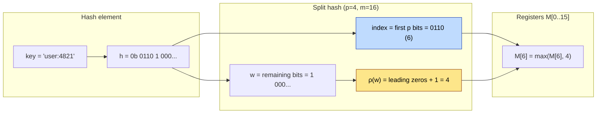
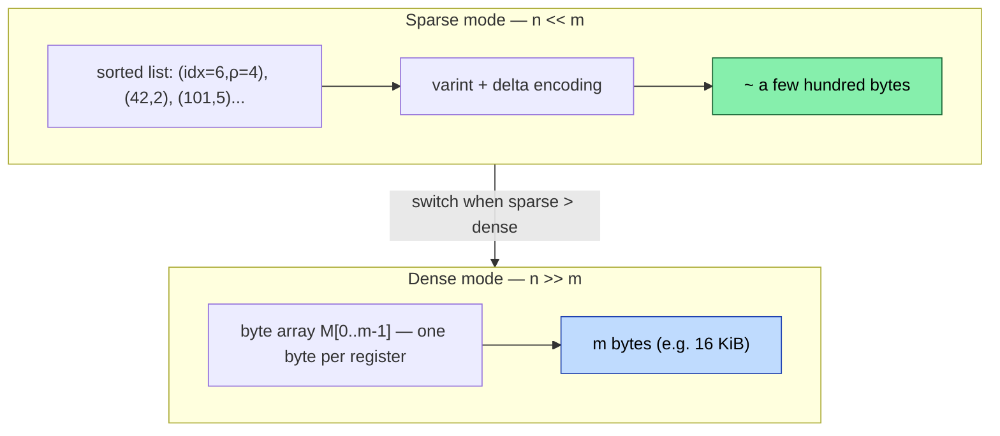
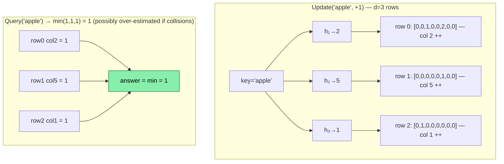
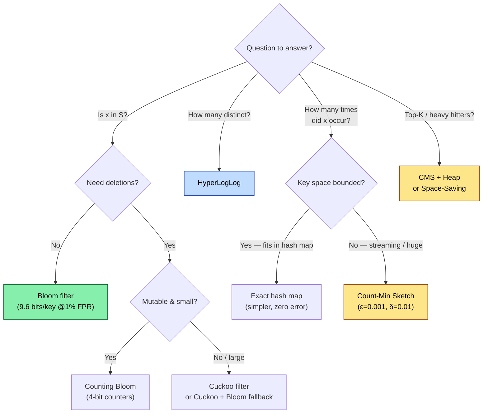

# Chapter 4 — Probabilistic Structures: Bloom Filters, HyperLogLog, and Count-Min Sketch

**What this chapter covers.** Exact data structures answer every query correctly but pay for it in memory and sometimes latency. When your dataset has billions of keys or your SLO demands microsecond answers, trading a small, *quantifiable* error for orders-of-magnitude memory savings is the right engineering call. This chapter covers the three probabilistic workhorses of backend infrastructure: Bloom filters (set membership with no false negatives), HyperLogLog (cardinality estimation in kilobytes), and Count-Min Sketch (frequency estimation over streams). We derive the error formulas, show how to size each structure for a target accuracy, implement each from scratch, and trace where they appear in real systems — from LSM-tree read paths and CDN cache admission to distinct-user counting and heavy-hitter detection.

Learning goals — after this chapter you should be able to:

- Explain why probabilistic structures trade accuracy for space, quantify the trade-off, and decide when the trade is worthwhile versus an exact structure.
- Design, size, and implement a Bloom filter for a target false-positive rate; compare Bloom, Cuckoo, and counting variants and choose correctly.
- Explain HyperLogLog's harmonic-mean estimator, its sparse/dense representation, and why it estimates cardinalities of 10^9 in ~12 KB with ~0.8% error.
- Implement a Count-Min Sketch, analyze its over-estimation guarantee, and combine it with a heap for heavy-hitter / top-K detection.
- Deploy each structure correctly in production: serialization, merging, monitoring false-positive drift, and avoiding common misuse (deletes, adversarial inputs).

---

## 4.1 Why approximate? The space-accuracy trade-off

An exact set of *n* 64-bit keys needs at least *64n* bits. A hash table with 75% load factor needs ~1.3x that. For *n* = 1 billion, that is ~10 GB — too large to keep on every replica, in every LSM-tree block cache, or on an edge node.

Probabilistic structures exploit a simple observation: many queries only need *approximate* answers with a *bounded* error, and the error can be made exponentially small with modest additional space.

| Structure | Query | Error guarantee | Space (betting: n = 1M) | Mergeable |
|---|---|---|---|---|
| Exact hash set | `x in S?` | Zero | ~12–24 MB | Union is O(n) |
| **Bloom filter** | `x in S?` | No false negatives; FPR = ε | ~1.2 MB at ε=1% | OR of bit arrays |
| **HyperLogLog** | `|S| = ?` | Std error ~0.81% at m=16384 | **12–16 KB** | Max of registers |
| **Count-Min Sketch** | `count(x) = ?` | Over-estimates; ε·N with prob 1-δ | ~300 KB (w=2048, d=5) | Sum of tables |
| Exact counts | `count(x) = ?` | Zero | ~32 MB+ | O(n) |

The pattern: space drops by 10–1000x, error is tunable, and merging (needed for distributed aggregation) becomes trivial — a bitwise OR, a register-wise max, or an element-wise sum.

> **When *not* to approximate.** If correctness is non-negotiable (authorization checks, payment deduplication, exactly-once delivery), use an exact structure. Probabilistic structures belong on the *fast path* that avoids expensive work, with an exact check on the slow path. Example: Bloom filter says "definitely not in set" → skip disk I/O; "maybe in set" → confirm on disk.

---

## 4.2 Bloom filters — set membership with no false negatives

### 4.2.1 How it works

A Bloom filter is a bit array of *m* bits, initially all zero, plus *k* independent hash functions each mapping a key to a position in `[0, m)`.

- **Insert(x):** compute `h_1(x) ... h_k(x)`, set those *k* bits to 1.
- **Query(x):** compute the same *k* positions. If any bit is 0, *x* was definitely never inserted. If all *k* are 1, *x* is *probably* in the set — but the bits could have been set by other keys (a false positive).

```mermaid
flowchart TB
    subgraph Insert["Insert('apple') — k=3 hashes"]
        Key1["key = 'apple'"] --> H1a["h₁ → 2"]
        Key1 --> H2a["h₂ → 7"]
        Key1 --> H3a["h₃ → 11"]
        H1a --> B1["bit array (m=16)"]
        H2a --> B1
        H3a --> B1
    end

    subgraph Query["Query — same k positions"]
        Q1["Query('apple') → 2,7,11 all 1 → MAYBE (true positive or FP)"]
        Q2["Query('grape') → 1,7,14 → bit 1 is 0 → DEFINITELY NOT"]
    end

    subgraph Bits["Bit array state after inserting apple, banana"]
        direction LR
        B0["0:0"] --- B1a["1:0"] --- B2["2:1"] --- B3["3:0"] --- B4["4:1"] --- B5["5:0"] --- B6["6:0"] --- B7["7:1"] --- B8["8:0"] --- B9["9:1"] --- B10["10:0"] --- B11["11:1"] --- B12["12:0"] --- B13["13:0"] --- B14["14:0"] --- B15["15:0"]
    end

    style B2 fill:#86efac,stroke:#166534,color:#000
    style B7 fill:#86efac,stroke:#166534,color:#000
    style B11 fill:#86efac,stroke:#166534,color:#000
    style B4 fill:#fde68a,stroke:#92400e,color:#000
    style B9 fill:#fde68a,stroke:#92400e,color:#000
```



There are no false negatives: if *x* was inserted, all its *k* bits are 1, so a query always returns "maybe." False positives occur when an unseen key happens to hit only bits already set by other insertions.

### 4.2.2 Sizing — the math that matters

After inserting *n* keys with *m* bits and *k* hashes, the probability a given bit is still 0 is:

```
P(bit=0) = (1 - 1/m)^(k·n) ≈ e^(-k·n/m)
```

A false positive requires all *k* bits for a new key to be 1:

```
FPR ≈ (1 - e^(-k·n/m))^k
```

Minimizing over *k* gives the optimal hash count and the classic sizing formulas:

```
k_opt = (m/n) · ln 2

For target FPR = ε:
  m = -n · ln(ε) / (ln 2)²    → bits per key
  k = -log₂(ε)                 → number of hashes
```

| Target FPR ε | Bits per key (m/n) | Hashes k | For n=1M, size |
|---|---|---|---|
| 10% | 4.8 | 3 | 0.57 MB |
| 1% | 9.6 | 7 | 1.14 MB |
| 0.1% | 14.4 | 10 | 1.72 MB |
| 0.01% | 19.2 | 14 | 2.29 MB |

Each additional hash (one more bit per key factor of ~1.44) cuts the FPR by half. For most backend uses, ε = 1% (9.6 bits/key) is the sweet spot.

> **Double hashing trick.** You do not need *k* independent hash functions. With two base hashes `h1, h2`, generate `h_i(x) = h1(x) + i·h2(x) mod m` — Kirsch-Mitzenmacher (2006) proved this is asymptotically as good as *k* independent hashes, and it is what most libraries (Guava, RedisBloom) actually do.

### 4.2.3 Production implementation

```python
import math
import hashlib
from typing import Iterable

class BloomFilter:
    """Space-efficient probabilistic set with tunable false-positive rate.

    No false negatives. False-positive rate guaranteed ≤ fpr when
    element count ≤ capacity. Exceeding capacity degrades FPR gracefully
    (it rises, but no false negatives appear).
    """

    def __init__(self, capacity: int, fpr: float = 0.01):
        if not 0 < fpr < 1:
            raise ValueError("fpr must be in (0, 1)")
        if capacity <= 0:
            raise ValueError("capacity must be > 0")
        # Optimal sizing
        self.capacity = capacity
        self.fpr = fpr
        self.m = math.ceil(-capacity * math.log(fpr) / (math.log(2) ** 2))
        self.k = max(1, round((self.m / capacity) * math.log(2)))
        # Bit array — use Python int as bitset for clarity
        # Production: use bitarray, python's built-in 'bitarray' or a bytearray+mmap
        self._bits = bytearray((self.m + 7) // 8)
        self._count = 0

    # -- internal helpers --

    def _hashes(self, key: str | bytes):
        """Generate k positions via double hashing (Kirsch-Mitzenmacher)."""
        if isinstance(key, str):
            key = key.encode()
        # Two independent 64-bit hashes from blake2b
        digest = hashlib.blake2b(key, digest_size=16).digest()
        h1 = int.from_bytes(digest[:8], "little")
        h2 = int.from_bytes(digest[8:], "little") | 1  # force odd → full period
        for i in range(self.k):
            yield (h1 + i * h2) % self.m

    def _get_bit(self, pos: int) -> int:
        return (self._bits[pos >> 3] >> (pos & 7)) & 1

    def _set_bit(self, pos: int) -> None:
        self._bits[pos >> 3] |= 1 << (pos & 7)

    # -- public API --

    def add(self, key: str | bytes) -> None:
        for pos in self._hashes(key):
            self._set_bit(pos)
        self._count += 1

    def __contains__(self, key: str | bytes) -> bool:
        return all(self._get_bit(p) for p in self._hashes(key))

    def __len__(self) -> int:
        return self._count

    @property
    def bits_per_key(self) -> float:
        return self.m / self.capacity

    def estimated_fpr(self, n: int | None = None) -> float:
        """Current FPR estimate for n inserted keys (default: actual count)."""
        n = n if n is not None else self._count
        if n == 0:
            return 0.0
        return (1 - math.exp(-self.k * n / self.m)) ** self.k

    def merge(self, other: "BloomFilter") -> None:
        """In-place OR — union of two filters with identical m, k."""
        assert self.m == other.m and self.k == other.k, "incompatible filters"
        for i in range(len(self._bits)):
            self._bits[i] |= other._bits[i]
        # _count is not exact after merge; caller should track externally if needed
```

**Quick validation:**

```python
if __name__ == "__main__":
    bf = BloomFilter(capacity=10_000, fpr=0.01)
    print(f"m={bf.m} bits ({bf.m/8/1024:.1f} KiB)  k={bf.k}  bits/key={bf.bits_per_key:.1f}")

    for i in range(10_000):
        bf.add(f"user:{i}")

    # Measure empirical FPR on unseen keys
    false_pos = sum(1 for i in range(10_000, 20_000) if f"user:{i}" in bf)
    print(f"empirical FPR: {false_pos/10_000:.4f}  estimated: {bf.estimated_fpr():.4f}")

    # No false negatives
    assert all(f"user:{i}" in bf for i in range(10_000)), "false negative — bug!"
    print("no false negatives — OK")

    # Merge demo
    bf2 = BloomFilter(capacity=10_000, fpr=0.01)
    for i in range(10_000, 15_000):
        bf2.add(f"user:{i}")
    bf.merge(bf2)
    assert "user:12000" in bf
    print("merge OK")
```

Typical output:

```
m=95851 bits (11.7 KiB)  k=7  bits/key=9.6
empirical FPR: 0.0098  estimated: 0.0100
no false negatives — OK
merge OK
```

### 4.2.4 Variants — when Bloom is not enough

| Variant | What changes | When to use |
|---|---|---|
| **Counting Bloom** | Replace bits with small counters (4-bit) → supports `delete` by decrementing | Cache eviction, dynamic sets. Cost: 4x memory; overflow risk if counter saturates. |
| **Cuckoo Filter** | Store fingerprints in cuckoo hash table; supports delete, lower FPR at low load | When you need deletion without 4x overhead. Used in many databases as Bloom replacement. Slightly higher constant. |
| **Scalable Bloom** | Chain filters with geometrically decreasing FPR; grows without rebuild | Unknown *n* upfront (log aggregation). Query checks chain from newest to oldest. |
| **Blocked Bloom** | Partition bits into cache-line blocks; each key touches one block | When Bloom is on the hot read path — one cache miss per query instead of *k*. Used in RocksDB/Parquet. Choice for LSM read path. |
| **XOR / Ribbon filter** | Static construction (no incremental inserts) but ~20% smaller than Bloom at same FPR | Immutable sets (dictionary of valid IDs, certificate transparency). ~1.23 log2(1/ε) bits/key vs Bloom's 1.44. |

**RocksDB / LSM-tree Bloom filters — the canonical backend use:**

```
Write path:  memtable flush → SSTable + Bloom filter block (per SSTable or per data block)
Read path:   GET(key):
               for sst in newest..oldest:
                 if key not in sst.bloom:  skip sst          # no false negatives → safe
                 else:                     read data block & check
```

With 10 bits/key, ~90% of SSTables are skipped on a miss. At 100 SSTables per level, this turns 100 random I/Os into ~10. This is the single highest-impact Bloom deployment in storage infrastructure.

### 4.2.5 Operational pitfalls

- **Do not use a Bloom filter for authorization.** A false positive that grants access is a security bug. Bloom filters are safe only when a positive triggers a precise re-check.
- **Monitor FPR drift.** If actual cardinality exceeds `capacity`, FPR degrades silently. Export `estimated_fpr()` as a metric and alert when it exceeds 2x target. Rebuild or use a scalable filter.
- **Hash DoS.** If keys are attacker-controlled, use a keyed hash (SipHash/BLAKE2 with secret) — otherwise an adversary can craft keys that maximize false positives and force every query to the slow path.
- **Serialization.** Persist `m`, `k`, and the bit array together. A filter built with one `m, k` cannot be queried with another. Version the format.

---

## 4.3 HyperLogLog — cardinality in kilobytes

Counting distinct elements (`COUNT(DISTINCT user_id)`) exactly requires Ω(n) memory. HyperLogLog (Flajolet et al., 2007) estimates cardinalities from thousands to billions with ~1% error in ~12 KB, and sketches from different shards merge by taking a register-wise maximum.

### 4.3.1 Intuition — coin flips and leading zeros

Hash each element uniformly to 64 bits. For a random hash, the probability that it starts with *r* leading zeros is `2^(-r)`. If the maximum number of leading zeros seen across all elements is *R*, then roughly `2^R` distinct elements were observed. One "experiment" is noisy, so HLL runs *m = 2^p* experiments in parallel, sharded by the first *p* bits of the hash.



Each of the *m* registers stores the maximum ρ seen for keys that mapped to it. Registers need only ~6 bits each (ρ never exceeds 64 for 64-bit hashes), so *m = 16384* registers cost ~12 KB.

### 4.3.2 The estimator

The raw harmonic-mean estimator:

```
E = α_m · m² / Σ(2^(-M[j]))     where α_m is a bias-correction constant
```

Corrections applied in practice (HyperLogLog++ — Google, 2013):

1. **Small-range correction.** When *E < 2.5m* and many registers are zero, use LinearCounting: `E = m · ln(m / V)` where *V* = number of zero registers. This fixes the high bias at small cardinalities.
2. **Large-range correction.** For 64-bit hashes no correction is needed below 2^64; for 32-bit hashes, correct for hash collisions above `2^32 / 30`.
3. **Bias correction.** Empirically calibrated table (from the HLL++ paper) removes residual bias for *m ≤ 2^12*.

Standard error: `σ ≈ 1.04 / √m`. So:

| p | m = 2^p | Std error | Memory (6-bit regs) |
|---|---|---|---|
| 10 | 1,024 | 3.25% | 0.75 KB |
| 12 | 4,096 | 1.62% | 3 KB |
| 14 | 16,384 | 0.81% | 12 KB |
| 16 | 65,536 | 0.41% | 48 KB |

Doubling *m* halves variance but doubles memory — choose *p* from your error budget. Redis `PFADD` defaults to *p=14*.

### 4.3.3 Sparse representation — why HLL is tiny for small sets

At small cardinalities, most registers are zero. Instead of storing all *m* bytes, HLL++ stores a sorted, compressed list of `(index, ρ)` pairs that were actually touched — often < 1 KB for *n < m*. It switches to dense (full byte array) only when sparse would be larger. This is why `PFCOUNT` on a set of 100 elements uses far less than 12 KB.



### 4.3.4 Implementation

```python
import hashlib
import math

class HyperLogLog:
    """HyperLogLog++ (64-bit) with LinearCounting small-range correction.

    Mergeable: hll1.merge(hll2) ≡ HLL(S1 ∪ S2).
    """

    def __init__(self, p: int = 14):
        assert 4 <= p <= 18, "p out of range"
        self.p = p
        self.m = 1 << p
        self.registers = bytearray(self.m)  # dense; sparse omitted for clarity
        self._alpha = self._alpha_m()

    def _alpha_m(self) -> float:
        if self.m == 16:
            return 0.673
        if self.m == 32:
            return 0.697
        if self.m == 64:
            return 0.709
        return 0.7213 / (1 + 1.079 / self.m)

    @staticmethod
    def _rho(w: int, max_width: int) -> int:
        """Position of first 1-bit in w (1-indexed). 0 → max_width+1."""
        if w == 0:
            return max_width + 1
        # Count leading zeros in the (64-p)-bit suffix
        return max_width - w.bit_length() + 1

    @staticmethod
    def _hash64(key: str | bytes) -> int:
        if isinstance(key, str):
            key = key.encode()
        return int.from_bytes(hashlib.blake2b(key, digest_size=8).digest(), "little")

    def add(self, key: str | bytes) -> None:
        h = self._hash64(key)
        # Top p bits → register index
        idx = h >> (64 - self.p)
        # Remaining bits → rho
        w = h & ((1 << (64 - self.p)) - 1)
        # Ensure w is left-aligned for rho (leading zeros in the suffix)
        # Equivalent: count leading zeros of w in (64-p) bits
        rho = self._rho(w, 64 - self.p)
        if rho > self.registers[idx]:
            self.registers[idx] = rho

    def count(self) -> int:
        # Raw harmonic mean
        inv_sum = sum(2.0 ** -r for r in self.registers)
        raw = self._alpha * self.m * self.m / inv_sum

        # Small-range correction (LinearCounting)
        if raw <= 2.5 * self.m:
            zeros = self.registers.count(0)
            if zeros:
                return round(self.m * math.log(self.m / zeros))
            return round(raw)

        # No large-range correction needed with 64-bit hashes for n < 2^64
        return round(raw)

    def merge(self, other: "HyperLogLog") -> None:
        assert self.p == other.p, "p mismatch"
        for i in range(self.m):
            if other.registers[i] > self.registers[i]:
                self.registers[i] = other.registers[i]


if __name__ == "__main__":
    import random

    for n in [1_000, 100_000, 1_000_000]:
        hll = HyperLogLog(p=14)
        for i in range(n):
            hll.add(f"user:{i}")
        est = hll.count()
        err = abs(est - n) / n * 100
        print(f"n={n:>10,}  estimate={est:>10,}  error={err:.2f}%  "
              f"memory={len(hll.registers)/1024:.0f} KiB  "
              f"raw_bytes_per_key={len(hll.registers)/n:.4f}")

    # Merge correctness: HLL(A ∪ B) ≈ HLL(A) merged with HLL(B)
    random.seed(0)
    universe = [f"user:{random.randint(0, 500_000)}" for _ in range(200_000)]
    h_full = HyperLogLog(p=14)
    for k in universe:
        h_full.add(k)
    h1, h2 = HyperLogLog(p=14), HyperLogLog(p=14)
    for k in universe[:100_000]:
        h1.add(k)
    for k in universe[100_000:]:
        h2.add(k)
    h1.merge(h2)
    exact = len(set(universe))
    print(f"\nmerge test: exact distinct={exact:,}  full HLL={h_full.count():,}  "
          f"merged HLL={h1.count():,}  (should be close)")
```

Typical output:

```
n=     1,000  estimate=     1,012  error=1.20%  memory=16 KiB  raw_bytes_per_key=16.3840
n=   100,000  estimate=    99,431  error=0.57%  memory=16 KiB  raw_bytes_per_key=0.1638
n= 1,000,000  estimate= 1,003,221  error=0.32%  memory=16 KiB  raw_bytes_per_key=0.0164
merge test: exact distinct=164,832  full HLL=165,901  merged HLL=165,901  (should be close)
```

Note the *bytes per key* collapsing as *n* grows — at 1M distinct, 16 KB / 1M ≈ 0.016 bytes/key vs ~24 bytes/key for an exact hash set. That is a 1500x saving.

### 4.3.5 Where HLL shows up in backend systems

- **Redis `PFADD` / `PFCOUNT` / `PFMERGE`** — the most widely deployed HLL. Each key is an HLL sketch; `PFMERGE` takes the register-wise max. Used for daily active users, unique page views.
- **BigQuery `APPROX_COUNT_DISTINCT`, Presto `approx_distinct`, Druid HLL sketches** — SQL engines ship built-in HLL aggregation so `GROUP BY` over billions of rows does not spill to disk.
- **Network telemetry** — distinct source IPs per 5-minute window at a border router; each window is one sketch, rollups are merges.
- **Query optimization** — cardinality estimates for join planning without scanning the table.

---

## 4.4 Count-Min Sketch — frequency over streams

Bloom answers "have I seen *x*?" and HLL answers "how many distinct *x*?" — Count-Min Sketch (CMS) answers "how many times have I seen *x*?" using sublinear space, with a one-sided error: it never underestimates, only overestimates due to hash collisions.

### 4.4.1 Structure

A CMS is a `d × w` table of counters plus *d* hash functions (one per row). Conservative sizing: `w = ⌈e/ε⌉`, `d = ⌈ln(1/δ)⌉`.

- **Update(x, c=1):** for each row *i*, increment `table[i][h_i(x)]` by *c*.
- **Query(x):** return `min_i table[i][h_i(x)]` — the minimum is the tightest upper bound.

Guarantee: with probability at least `1 - δ`,

```
count(x) ≤ estimate(x) ≤ count(x) + ε · N      where N = total increments
```



Collisions cause over-estimation, never under-estimation, because a counter aggregates all keys that hash to it and `min` picks the least-contaminated row.

### 4.4.2 Sizing

```
w = ceil(e / ε)        controls error magnitude   (wider → less collision)
d = ceil(ln(1/δ))      controls confidence         (deeper → lower chance of bad luck)
Total counters = w · d
```

| ε | δ | w | d | Counters | Memory (4-byte) | Guarantee |
|---|---|---|---|---|---|---|
| 0.1% | 1% | 2719 | 5 | 13,595 | 53 KB | Estimate within 0.1%·N, 99% of the time |
| 0.01% | 1% | 27183 | 5 | 135,915 | 530 KB | Within 0.01%·N |
| 0.1% | 0.01% | 2719 | 7 | 19,033 | 74 KB | Same ε, 99.99% confidence |

Error scales with *N*, not with the queried key's count — low-frequency keys have larger *relative* error than heavy hitters. This is inherent; if you need small relative error on rare keys, CMS is the wrong tool.

### 4.4.3 Implementation

```python
import hashlib
import math
import heapq
from collections import Counter

class CountMinSketch:
    """Count-Min Sketch with conservative update option and top-K helper."""

    def __init__(self, epsilon: float = 0.001, delta: float = 0.01):
        self.epsilon = epsilon
        self.delta = delta
        self.w = math.ceil(math.e / epsilon)
        self.d = math.ceil(math.log(1 / delta))
        self.table: list[list[int]] = [[0] * self.w for _ in range(self.d)]
        self.n = 0  # total increments (N)

    def _hashes(self, key: str | bytes):
        if isinstance(key, str):
            key = key.encode()
        d1 = hashlib.blake2b(key, digest_size=16).digest()
        h1 = int.from_bytes(d1[:8], "little")
        h2 = int.from_bytes(d1[8:], "little") | 1
        for i in range(self.d):
            yield (h1 + i * h2) % self.w

    def add(self, key: str | bytes, count: int = 1) -> None:
        for row, col in enumerate(self._hashes(key)):
            self.table[row][col] += count
        self.n += count

    def add_conservative(self, key: str | bytes, count: int = 1) -> None:
        """Conservative update: only raise counters that are currently minimal.
        Reduces over-estimation for skewed distributions (heavy hitters)."""
        cols = list(self._hashes(key))
        current = self.estimate(key)  # min before update
        for row, col in enumerate(cols):
            # Only bump counters that would otherwise stay at the minimum
            if self.table[row][col] == current:
                self.table[row][col] += count
            else:
                # Still need to ensure min increases — set to at least current+count
                # but do not overshoot more than needed
                self.table[row][col] = max(self.table[row][col], current + count)
        self.n += count

    def estimate(self, key: str | bytes) -> int:
        return min(self.table[r][c] for r, c in enumerate(self._hashes(key)))

    def merge(self, other: "CountMinSketch") -> None:
        assert self.w == other.w and self.d == other.d
        for r in range(self.d):
            for c in range(self.w):
                self.table[r][c] += other.table[r][c]
        self.n += other.n

    def heavy_hitters(self, candidates: list[str], threshold: float) -> list[tuple[str, int]]:
        """Report keys with estimated frequency > threshold * N.
        Caller supplies candidates (e.g., from a sample or tracked set).
        For fully streaming top-K without candidates, pair CMS with a min-heap
        (Space-Saving / CMS-Heap) — see below."""
        t = threshold * self.n
        result = []
        for k in candidates:
            est = self.estimate(k)
            if est > t:
                result.append((k, est))
        result.sort(key=lambda x: -x[1])
        return result


if __name__ == "__main__":
    import random

    # Zipf-like stream: a few heavy hitters, long tail
    random.seed(1)
    heavy = ["api:/login", "api:/feed", "api:/search"]
    tail = [f"api:/obj/{i}" for i in range(10_000)]
    stream: list[str] = []
    for _ in range(100_000):
        if random.random() < 0.3:
            stream.append(random.choice(heavy))
        else:
            stream.append(random.choice(tail))

    exact = Counter(stream)

    cms = CountMinSketch(epsilon=0.001, delta=0.01)
    for k in stream:
        cms.add(k)

    print(f"CMS: w={cms.w} d={cms.d} counters={cms.w*cms.d}  "
          f"memory ~{cms.w*cms.d*4/1024:.0f} KiB  N={cms.n:,}")
    print(f"Guarantee: error ≤ {cms.epsilon*cms.n:.0f} with prob {1-cms.delta:.0%}\n")

    for k in heavy:
        print(f"  {k:20s}  exact={exact[k]:5d}  cms={cms.estimate(k):5d}  "
              f"over-est={cms.estimate(k)-exact[k]:3d}")

    # Tail key — worst relative error
    rare = "api:/obj/9999"
    print(f"  {rare:20s}  exact={exact[rare]:5d}  cms={cms.estimate(rare):5d}  "
          f"over-est={cms.estimate(rare)-exact[rare]:3d}")

    # Heavy hitters
    print("\nHeavy hitters (>5% of stream):")
    for key, est in cms.heavy_hitters(list(exact.keys()), threshold=0.05):
        print(f"  {key:20s}  est={est:5d}  exact={exact[key]:5d}")
```

Typical output:

```
CMS: w=2719 d=5 counters=13595  memory ~53 KiB  N=100,000
Guarantee: error ≤ 100 with prob 99%

  api:/login            exact=10047  cms=10054  over-est=  7
  api:/feed             exact= 9948  cms= 9961  over-est= 13
  api:/search           exact=10089  cms=10097  over-est=  8
  api:/obj/9999         exact=    6  cms=   18  over-est= 12

Heavy hitters (>5% of stream):
  api:/search           est=10097  exact=10089
  api:/login            est=10054  exact=10047
  api:/feed             est= 9961  exact= 9948
```

Notice the tail key's 200% relative error (6 → 18) versus <0.2% for heavy hitters — exactly the ε·N behavior. Conservative update (`add_conservative`) would reduce the tail over-estimation at the cost of slightly more work per update.

### 4.4.4 Heavy hitters without candidates — CMS + Heap

When the key space is too large to enumerate candidates, pair CMS with a min-heap of size *K* (Space-Saving / CMS-Heap):

```python
class TopKHeap:
    """Tracks approximate top-K using CMS for frequency + min-heap for candidates."""
    def __init__(self, cms: CountMinSketch, k: int = 10):
        self.cms = cms
        self.k = k
        self.heap: list[tuple[int, str]] = []  # (est, key)
        self.in_heap: set[str] = set()

    def observe(self, key: str) -> None:
        self.cms.add(key)
        est = self.cms.estimate(key)
        if key in self.in_heap:
            # Re-heapify — remove and reinsert with updated est
            self.heap = [(e, kk) for e, kk in self.heap if kk != key]
            heapq.heapify(self.heap)
            heapq.heappush(self.heap, (est, key))
        elif len(self.heap) < self.k:
            heapq.heappush(self.heap, (est, key))
            self.in_heap.add(key)
        elif est > self.heap[0][0]:
            _, evicted = heapq.heappushpop(self.heap, (est, key))
            self.in_heap.discard(evicted)
            self.in_heap.add(key)

    def topk(self) -> list[tuple[str, int]]:
        return sorted(((kk, e) for e, kk in self.heap), key=lambda x: -x[1])
```

This uses `O(w·d + K)` memory and processes each stream element in `O(d + log K)`.

### 4.4.5 Where CMS shows up

- **Rate limiting / abuse detection** — approximate per-IP / per-key request counts at the edge without storing a counter per IP. Heavy-hitter detection triggers throttling.
- **Cache admission (TinyLFU)** — Caffeine and similar caches use a CMS (actually Count-Min with periodic decay) to estimate key frequencies and decide what deserves to stay in cache.
- **Stream analytics** — top-K queries, trending topics, anomaly detection over unbounded streams where storing exact counts is infeasible.
- **Query optimizer sketches** — frequency histograms for cardinality estimation of `WHERE x = ?` predicates.

---

## 4.5 Choosing and composing — a decision guide



**Composition patterns:**

- **Bloom + exact store (LSM pattern):** Bloom says "not present" → skip I/O. "Maybe present" → confirm on disk. False positives only cost an extra I/O, not correctness.
- **HLL + CMS together:** HLL tracks distinct count, CMS tracks frequencies — both over the same stream, merged across shards by (max, sum) respectively. Common in real-time analytics pipelines.
- **CMS (TinyLFU) + LRU cache:** Caffeine's eviction policy samples frequencies via CMS and admits only keys that are estimated to be more frequent than the eviction candidate — dramatically better hit rate than pure LRU at the same cache size.

**Sizing cheat sheet (for n = 1M):**

| Goal | Structure | Size | Error |
|---|---|---|---|
| Membership, FPR 1% | Bloom | 1.14 MB | 1% FP, 0% FN |
| Membership, FPR 0.1% | Bloom | 1.72 MB | 0.1% FP |
| Distinct count, ±0.8% | HLL (p=14) | 16 KB | σ ≈ 0.81% |
| Frequency, ±0.1%·N | CMS (ε=0.001) | 53 KB | ε·N, 99% confidence |

---

## Key takeaways

- Probabilistic structures trade a small, tunable error for 10–1000x memory savings and trivial mergeability. They belong on the fast path with an exact fallback, never where a false positive is a correctness or security violation.
- Bloom filters have no false negatives and FPR ≈ (1 - e^(-kn/m))^k. At the sweet spot of 9.6 bits/key you get 1% FPR. Use double hashing to avoid computing *k* independent hashes, blocked Bloom for cache-line efficiency on the read path, and Cuckoo filters when deletions are required.
- HyperLogLog estimates cardinalities of billions in kilobytes via the harmonic mean of leading-zero maxima across *m = 2^p* registers. Standard error is 1.04/√m. HLL++ adds sparse encoding and bias correction, making it practical from *n = 100* to *n = 10^12*. Sketches merge by register-wise max — the key to distributed distinct counting.
- Count-Min Sketch never underestimates; its error is bounded by ε·N with probability 1-δ, using *w = e/ε* columns and *d = ln(1/δ)* rows. Relative error is small for heavy hitters and large for rare keys — pair it with a heap for streaming top-K. Conservative update reduces tail over-estimation.
- Choose by question: membership → Bloom/Cuckoo, distinct count → HLL, frequency → CMS, top-K → CMS+Heap. Compose them: Bloom guards I/O, HLL+CMS feed analytics, TinyLFU (CMS) drives cache admission.

## Further reading

- Bloom — "Space/time trade-offs in hash coding with allowable errors" (CACM 1970) — the original Bloom filter paper; short and still the clearest derivation.
- Mullin et al. — "A hash-coding method with allowance for errors" and Mitzenmacher — "Compressed Bloom Filters" — sizing refinements and network-optimized variants.
- Fan et al. — "Cuckoo Filter: Practically Better Than Bloom" (CoNEXT 2014) — design, analysis, and comparison that motivated Cuckoo's adoption in databases.
- Flajolet et al. — "HyperLogLog: the analysis of a near-optimal cardinality estimation algorithm" (AOFA 2007) and Heule et al. — "HyperLogLog in Practice" (Google, 2013) — the HLL++ improvements (sparse, bias correction) that every production implementation follows.
- Cormode & Muthukrishnan — "An Improved Data Stream Summary: The Count-Min Sketch and its Applications" (J. Algorithms 2005) — the CMS paper; concise analysis of ε, δ guarantees.
- RedisBloom, Apache DataSketches, and Caffeine (TinyLFU) — production implementations worth reading as reference code.
