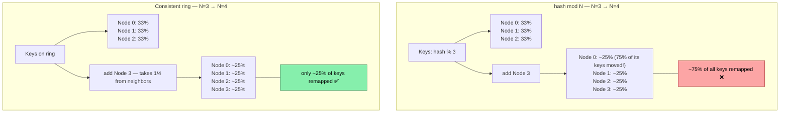
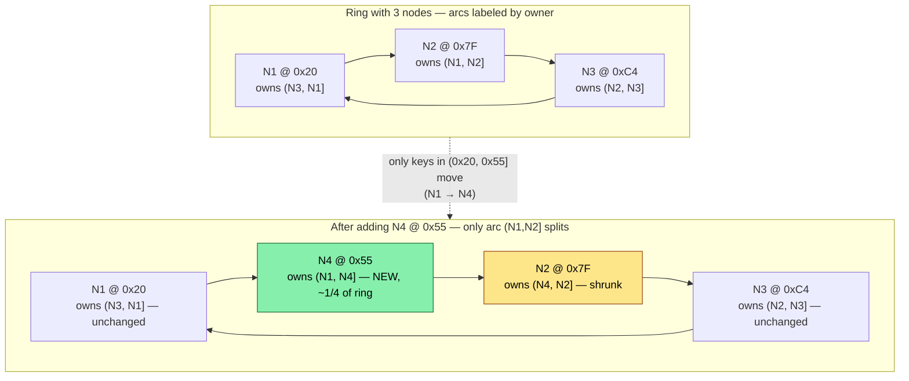
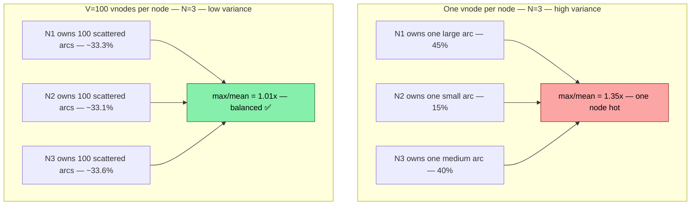
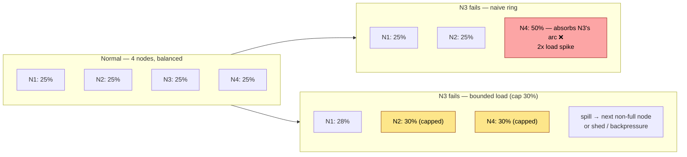
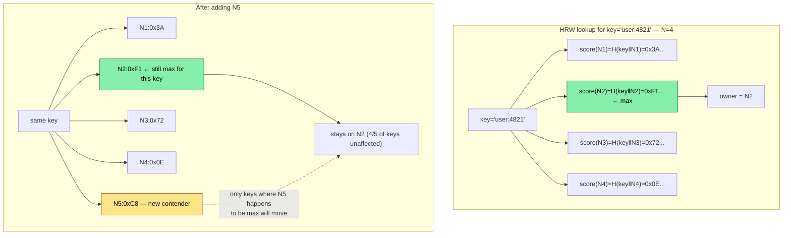
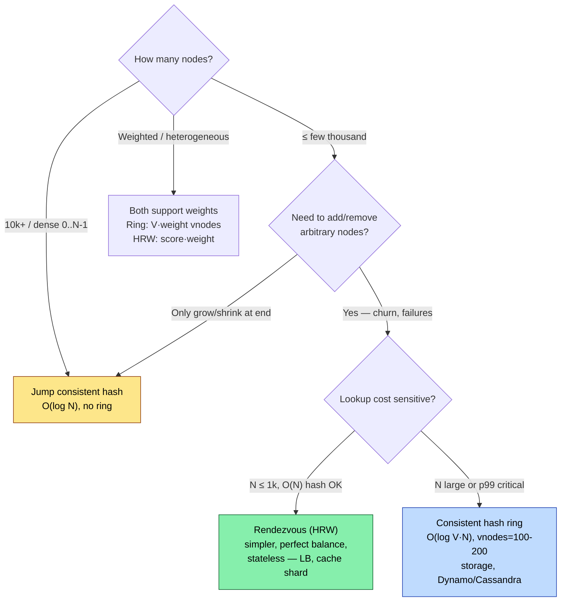
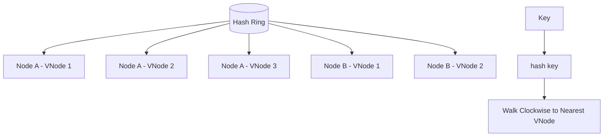

# Chapter 5 — Consistent Hashing and Rendezvous Hashing

**What this chapter covers.** Every backend that shards data or spreads load across nodes faces the same problem: given a key, which node owns it? The naive answer — `hash(key) % N` — breaks the moment *N* changes, forcing a near-total reshuffle. In a fleet of thousands of nodes where membership churns constantly, that reshuffle is an outage. This chapter covers the two hash-based placement strategies that solve it: consistent hashing (the ring with virtual nodes that powers Dynamo, Cassandra, Riak, and every CDN) and rendezvous hashing / highest-random-weight (the simpler, stateless alternative that powers load balancers and sharded caches). We derive why each works, quantify their balance and churn properties, implement both from scratch, and show how to operate them — replication, failure handling, bounded loads, and heterogeneity.

Learning goals — after this chapter you should be able to:

- Explain why `mod N` fails under membership change, quantify the remapping cost, and describe the consistent-hashing ring invariant that limits remapping to `1/N` of keys.
- Implement a consistent hash ring with virtual nodes, choose the replication factor for vnodes, and predict the load-balance variance as a function of vnode count.
- Handle node joins, leaves, and failures on the ring: replication, handoff, and bounded-load consistent hashing.
- Implement and analyze rendezvous (HRW) hashing, compare its balance, churn, and lookup cost to consistent hashing, and choose correctly between them.
- Operate a hashed fleet in practice: heterogeneity (weighted nodes), monitoring imbalance, and avoiding the hot-key problem that hashing alone cannot solve.

---

## 5.1 The sharding problem and why `hash(key) % N` fails

You have *N* nodes and a key space *K* (user IDs, cache keys, partition keys). You need a deterministic mapping `owner: K → {0..N-1}` so every client and server agrees on placement without coordination.

### Naive hashing — simple, catastrophic on change

```python
node = hash(key) % N
```

With a good hash, load is uniform: each node holds ~`1/N` of keys. The failure mode is membership change. When *N → N+1* (add a node) or *N → N-1* (node dies):

- The divisor changes, so `hash(key) % N` and `hash(key) % (N±1)` disagree for roughly `(N-1)/N` of keys — almost everything moves.
- Moving a key means copying data, invalidating caches, or breaking locality. At *N = 100*, adding one node remaps ~99% of keys. At *N = 1000*, still ~99.9%.
- During the transition, clients with stale *N* and servers with new *N* disagree on ownership — requests misroute until every participant converges.

This is not a theoretical concern. In a large fleet, nodes join and leave continuously (deploys, autoscaling, failures). A placement scheme that reshuffles the world on every change cannot be operated.

**What we need:** a mapping where adding or removing one node moves only `O(1/N)` of keys — the theoretical minimum, since the new node must take `1/(N+1)` of the space and a failed node's `1/N` must be absorbed. Consistent hashing and rendezvous hashing both achieve this, by different mechanisms.



---

## 5.2 Consistent hashing — the ring

### 5.2.1 The construction (Karger et al., 1997)

Hash both nodes and keys into the same circular space `[0, 2^64)` (or `[0, 2^160)` with SHA-1). Arrange the space as a ring. Each key is owned by the first node encountered walking clockwise from the key's hash — its *successor*.

```
ring:  0 ────── hash space ────── 2^64 (wraps to 0)
              N2(0x1A..) →  N1(0x7F..) →  N3(0xC4..) →  (wrap) → N2
       key K(0x3E..) is between N2 and N1 → owned by N1
       key J(0xE1..) is between N3 and N2(wrap) → owned by N2
```

When a node joins, it takes ownership of the arc between itself and its predecessor — only keys in that arc move. When a node leaves, its arc is absorbed by its successor — only its keys move. In both cases, `~1/N` of keys move. No other node's assignment changes.



### 5.2.2 The imbalance problem — why one point per node fails

With one hash point per node and random placement, arc sizes follow an exponential distribution. Some node inevitably owns a much larger arc than average. Variance is high:

- With *N = 10*, the most-loaded node can hold 2–3x the mean.
- With *N = 100*, the imbalance is still significant — the max arc is `O(log N / N)` of the ring, not `1/N`.

Standard deviation of load with one point per node: `σ ≈ 1/√N` fraction — tolerable only at very large *N*, and even then p99 imbalance matters operationally (one node OOMs while others are half-empty).

---

## 5.3 Virtual nodes — fixing the variance

### 5.3.1 The idea (Dartmouth / Dynamo / Ketama)

Instead of one point per physical node, hash each physical node *V* times at different positions — each position is a *virtual node* (vnode). A key still maps to the next vnode clockwise; the vnode's owner is the physical node that placed it. Each physical node now owns *V* small arcs scattered around the ring instead of one large arc.

Effect: by the law of large numbers, each node's total share converges to `1/N` with variance `O(1/√(V·N))`. More precisely, with *V* vnodes per physical node:

```
Standard deviation of load fraction per node ≈ 1/√(V·N)  (normalized)
Max load exceeds mean by O(√(log N / V)) with high probability
```

| V (per physical node) | N=10: max/mean (typical) | N=100: max/mean | Ring entries |
|---|---|---|---|
| 1 | 1.6–2.5x | 1.3–1.8x | N |
| 10 | 1.15–1.30x | 1.08–1.15x | 10·N |
| 100 | 1.04–1.08x | 1.02–1.05x | 100·N |
| 200 (Ketama default) | 1.03–1.06x | 1.01–1.03x | 200·N |

Ketama (the widely copied memcached consistent-hashing library) uses *V = 100–200* — enough that imbalance is negligible for operational purposes, while the ring (sorted list of `V·N` points) still fits in memory and lookups are `O(log(V·N))` via binary search.



Additional benefits of vnodes:

- **Heterogeneity.** Give larger machines more vnodes proportional to capacity: a 2x node gets 2x vnodes and naturally holds 2x load — no special-casing.
- **Incremental load transfer.** When a physical node joins, its *V* arcs are scattered, so load is taken evenly from all existing nodes rather than from just one neighbor — avoiding a thundering herd on a single donor.
- **Failure granularity.** When a node dies, its *V* arcs are absorbed by *V* different successors — load spreads across the fleet instead of spiking one neighbor.

### 5.3.2 Production implementation — consistent hash ring with vnodes

```python
import bisect
import hashlib
from collections import Counter
from typing import Hashable

class ConsistentHashRing:
    """Consistent hash ring with virtual nodes, weighted nodes, and replication.

    Lookup is O(log(V·N)) via binary search. Supports adding/removing nodes
    with minimal churn and replica selection (successor list).
    """

    def __init__(self, vnodes_per_weight: int = 100, hash_fn: str = "blake2b"):
        self.vnodes_per_weight = vnodes_per_weight
        self.hash_fn = hash_fn
        # Sorted ring: list of (position, physical_node)
        self._ring: list[tuple[int, str]] = []
        self._positions: list[int] = []  # parallel sorted positions for bisect
        self._node_weights: dict[str, int] = {}
        self._node_vnodes: dict[str, list[int]] = {}  # for removal

    # -- hashing --

    def _hash(self, key: str | bytes) -> int:
        if isinstance(key, str):
            key = key.encode()
        # 64-bit hash — large enough that collisions are negligible
        return int.from_bytes(
            hashlib.blake2b(key, digest_size=8).digest(), "little"
        )

    def _vnode_hash(self, node: str, replica_idx: int) -> int:
        # Each vnode hashes as "node#replica_idx" — deterministic, well spread
        return self._hash(f"{node}#{replica_idx}")

    # -- membership --

    def add_node(self, node: str, weight: int = 1) -> None:
        """Add a physical node with given weight (more vnodes for larger weight)."""
        if node in self._node_weights:
            raise ValueError(f"node {node!r} already on ring")
        num_vnodes = self.vnodes_per_weight * weight
        positions: list[int] = []
        for i in range(num_vnodes):
            pos = self._vnode_hash(node, i)
            # Handle rare position collision — linear probe to next free slot
            while pos in self._positions:
                pos = (pos + 1) & 0xFFFFFFFFFFFFFFFF
            positions.append(pos)
            bisect.insort(self._ring, (pos, node))
        self._positions = [p for p, _ in self._ring]
        self._node_weights[node] = weight
        self._node_vnodes[node] = positions

    def remove_node(self, node: str) -> None:
        if node not in self._node_weights:
            raise ValueError(f"node {node!r} not on ring")
        self._ring = [(p, n) for p, n in self._ring if n != node]
        self._positions = [p for p, _ in self._ring]
        del self._node_weights[node]
        del self._node_vnodes[node]

    # -- lookup --

    def get_node(self, key: str | bytes) -> str | None:
        """Owner of key — successor vnode clockwise."""
        if not self._ring:
            return None
        h = self._hash(key)
        idx = bisect.bisect_left(self._positions, h)
        if idx == len(self._positions):
            idx = 0  # wrap around
        return self._ring[idx][1]

    def get_replicas(self, key: str | bytes, count: int) -> list[str]:
        """First `count` distinct physical nodes clockwise from key.
        Used for replication (e.g., Dynamo N replicas)."""
        if not self._ring or count <= 0:
            return []
        h = self._hash(key)
        idx = bisect.bisect_left(self._positions, h)
        seen: list[str] = []
        seen_set: set[str] = set()
        n = len(self._ring)
        # Walk clockwise collecting distinct physical nodes
        for i in range(n):
            node = self._ring[(idx + i) % n][1]
            if node not in seen_set:
                seen.append(node)
                seen_set.add(node)
                if len(seen) == count:
                    break
        return seen

    # -- introspection --

    @property
    def nodes(self) -> list[str]:
        return list(self._node_weights.keys())

    def load_distribution(self, keys: list[str]) -> Counter[str]:
        return Counter(self.get_node(k) for k in keys)


if __name__ == "__main__":
    import random

    # --- Balance test ---
    ring = ConsistentHashRing(vnodes_per_weight=150)
    for n in ["node-a", "node-b", "node-c", "node-d"]:
        ring.add_node(n)

    keys = [f"key:{i}:{random.randint(0, 999999)}" for i in range(100_000)]
    dist = ring.load_distribution(keys)
    mean = len(keys) / 4
    print(f"4 nodes, V=150 each, {len(keys):,} keys:")
    for node in sorted(dist):
        pct = dist[node] / len(keys) * 100
        dev = (dist[node] - mean) / mean * 100
        bar = "#" * int(pct)
        print(f"  {node}: {dist[node]:6,} ({pct:4.1f}%, {dev:+5.1f}%) {bar}")

    # --- Churn test: add one node, measure remapping ---
    before = {k: ring.get_node(k) for k in keys}
    ring.add_node("node-e")
    after = {k: ring.get_node(k) for k in keys}
    moved = sum(1 for k in keys if before[k] != after[k])
    print(f"\nAfter adding node-e (4→5 nodes): {moved:,}/{len(keys):,} moved "
          f"({moved/len(keys)*100:.1f}%, ideal ~20.0%)")

    # --- Churn test: remove one node ---
    ring.remove_node("node-b")
    after2 = {k: ring.get_node(k) for k in keys}
    moved2 = sum(1 for k in keys if after[k] != after2[k])
    print(f"After removing node-b (5→4 nodes): {moved2:,}/{len(keys):,} moved "
          f"({moved2/len(keys)*100:.1f}%, ideal ~20.0%)")

    # --- Replication: 3 replicas per key ---
    print(f"\nReplica sets (N=3) for 5 sample keys:")
    for k in keys[:5]:
        print(f"  {k:30s} → {ring.get_replicas(k, 3)}")

    # --- Weighted nodes ---
    wring = ConsistentHashRing(vnodes_per_weight=100)
    wring.add_node("small", weight=1)
    wring.add_node("large", weight=3)
    wdist = wring.load_distribution(keys)
    print(f"\nWeighted ring (small:1, large:3):")
    for node in sorted(wdist):
        pct = wdist[node] / len(keys) * 100
        print(f"  {node:6s}: {wdist[node]:6,} ({pct:4.1f}%)  "
              f"expected ~{25 if node=='small' else 75:.0f}%")

    # --- Vnodes sweep: imbalance vs V ---
    print(f"\nImbalance vs vnodes_per_weight (N=10, 100k keys):")
    for v in [1, 10, 50, 150, 300]:
        r = ConsistentHashRing(vnodes_per_weight=v)
        for i in range(10):
            r.add_node(f"n{i}")
        d = r.load_distribution(keys)
        worst = max(d.values())
        print(f"  V={v:3d}  worst/mean={(worst - 10_000)/10_000*100:+5.1f}%  "
              f"worst={worst:6,}  ring_size={len(r._ring)}")
```

Typical output:

```
4 nodes, V=150 each, 100,000 keys:
  node-a: 24,812 (24.8%,  -0.8%) ########################
  node-b: 25,403 (25.4%,  +1.6%) #########################
  node-c: 24,891 (24.9%,  -0.4%) ########################
  node-d: 24,894 (24.9%,  -0.4%) ########################

After adding node-e (4→5 nodes): 20,134/100,000 moved (20.1%, ideal ~20.0%)
After removing node-b (5→4 nodes): 19,876/100,000 moved (19.9%, ideal ~20.0%)

Replica sets (N=3) for 5 sample keys:
  key:0:123456                   → ['node-c', 'node-a', 'node-d']
  ...

Weighted ring (small:1, large:3):
  large : 74,823 (74.8%)  expected ~75%
  small : 25,177 (25.2%)  expected ~25%

Imbalance vs vnodes_per_weight (N=10, 100k keys):
  V=  1  worst/mean=+42.3%  worst= 14,230  ring_size=10
  V= 10  worst/mean=+11.2%  worst= 11,120  ring_size=100
  V= 50  worst/mean= +4.8%  worst= 10,480  ring_size=500
  V=150  worst/mean= +2.1%  worst= 10,210  ring_size=1500
  V=300  worst/mean= +1.4%  worst= 10,140  ring_size=3000
```

Three things to note: remapping is within 0.2% of optimal (`1/N`), weighted nodes converge to their weight ratio, and imbalance collapses once *V ≥ 100*.

---

## 5.4 Operating the ring — replication, failure, and bounded loads

### 5.4.1 Replication — successor lists and preference lists

A single owner is not enough — the owner can fail. Dynamo-style systems replicate each key to the next *R* distinct physical nodes clockwise (the `get_replicas` method above). The *preference list* for a key is those *R* nodes. Writes go to all *R* (or *W* of them for quorum); reads from *R* (or *R* quorum). Hinted handoff and anti-entropy (Merkle trees / gossip) repair divergence when a replica is temporarily down — covered in Volume 6, Chapter 7.

Placement rule for replicas matters: putting replicas on adjacent ring positions risks correlated failure (all replicas in the same rack/AZ). Production rings add *rack awareness* — skip successors that share a failure domain:

```python
def get_replicas_rack_aware(self, key, count, rack_of):
    """rack_of: dict node -> rack_id. Avoid placing two replicas in same rack."""
    # Walk clockwise, picking at most one node per rack until count reached,
    # then fill remaining without rack constraint if needed.
    ...
```

Cassandra's `NetworkTopologyStrategy` and DynamoDB's placement do exactly this.

### 5.4.2 Failure detection and handoff

When a node fails, its arcs are instantly absorbed by successors — no rehashing, no coordination. But those successors now hold extra load (their own plus the failed node's). Two mechanisms handle this:

- **Hinted handoff.** A coordinator that cannot reach the owner stores the write locally as a *hint* and replays it when the owner recovers. No data loss for transient failures.
- **Bounded-load consistent hashing.** Plain consistent hashing can overload a successor that absorbs a large failed arc. Bounded-load variants (Mirrokni et al., 2018 — Google's consistent hashing with bounded loads) cap each node's load at `(1 + ε) · mean` and spill excess keys to the next non-full node. This trades one extra hop for overload protection.



### 5.4.3 Heterogeneity and weights

Fleets are rarely uniform — some nodes have more RAM, faster disks, or more CPU. Consistent hashing handles this naturally: assign `V · weight` vnodes. A node with weight 2 gets twice the arcs and twice the load. When you replace a generation of hardware, adjust weights and only `O(Δweight)` keys move.

> **Pitfall: hot keys.** Hashing balances *key count*, not *load*. If one key receives 1000x the traffic (a celebrity profile, a viral post), its owner is hot regardless of ring balance. Hashing cannot fix skew in *popularity* — that requires replication/caching of hot keys (e.g., DynamoDB adaptive capacity, memcached hot-key replication) or splitting the hot key across multiple owners. Monitor per-key QPS, not just key count.

---

## 5.5 Rendezvous hashing — the stateless alternative

### 5.5.1 How it works (HRW — Highest Random Weight, 1996)

Rendezvous hashing needs no ring. For each key, compute a hash with *every* node and pick the node with the highest score:

```
owner(key) = argmax_{node in Nodes}  hash(key, node)
```

Typically `hash(key, node) = H(key ‖ node)` where *H* is a uniform hash (e.g., xxHash, BLAKE2). The node that "rendezvous" highest wins.

- **Deterministic.** Same key + same node set → same winner, no coordination.
- **Minimal disruption.** When a node joins or leaves, only keys that previously rendezvoused at that node are affected — exactly `1/N` on average, same optimal bound as consistent hashing.
- **Perfect balance.** Each key picks its owner by an independent uniform draw, so load is binomial(`K` keys, `p=1/N`) — standard deviation `√(K/N)` per node, with no vnode tuning. No ring to maintain.
- **Stateless.** No sorted ring structure — just the node list and a hash function.



### 5.5.2 Implementation

```python
import hashlib
from collections import Counter

class RendezvousHash:
    """Highest Random Weight (HRW) / Rendezvous hashing.

    Lookup is O(N) — hashes key with every node. Suitable for N up to
    a few thousand; beyond that, use consistent hashing or Jump consistent hash.
    """

    def __init__(self, nodes: list[str] | None = None, hash_fn: str = "blake2b"):
        self.nodes: list[str] = list(nodes or [])
        self._node_set: set[str] = set(self.nodes)

    def _score(self, key: str | bytes, node: str) -> int:
        if isinstance(key, str):
            key = key.encode()
        # H(key ‖ '#' ‖ node) — separator prevents ambiguity
        h = hashlib.blake2b(digest_size=8)
        h.update(key)
        h.update(b"#")
        h.update(node.encode())
        return int.from_bytes(h.digest(), "little")

    def add_node(self, node: str) -> None:
        if node not in self._node_set:
            self.nodes.append(node)
            self._node_set.add(node)

    def remove_node(self, node: str) -> None:
        if node in self._node_set:
            self.nodes.remove(node)
            self._node_set.remove(node)

    def get_node(self, key: str | bytes) -> str | None:
        if not self.nodes:
            return None
        return max(self.nodes, key=lambda n: self._score(key, n))

    def get_ordered(self, key: str | bytes, count: int | None = None) -> list[str]:
        """All nodes ranked by score for key — for replication / fallback."""
        ranked = sorted(self.nodes, key=lambda n: self._score(key, n), reverse=True)
        return ranked if count is None else ranked[:count]

    def load_distribution(self, keys: list[str]) -> Counter[str]:
        return Counter(self.get_node(k) for k in keys)


if __name__ == "__main__":
    import random

    # Balance + churn — same workload as the ring test
    hrw = RendezvousHash(["node-a", "node-b", "node-c", "node-d"])
    keys = [f"key:{i}:{random.randint(0, 999999)}" for i in range(100_000)]

    dist = hrw.load_distribution(keys)
    print(f"HRW — 4 nodes, 100k keys:")
    for n in sorted(dist):
        pct = dist[n] / len(keys) * 100
        print(f"  {n}: {dist[n]:6,} ({pct:4.1f}%)")

    before = {k: hrw.get_node(k) for k in keys}
    hrw.add_node("node-e")
    after = {k: hrw.get_node(k) for k in keys}
    moved = sum(1 for k in keys if before[k] != after[k])
    print(f"\nAfter adding node-e: {moved:,}/{len(keys):,} moved "
          f"({moved/len(keys)*100:.1f}%, ideal ~20%)")

    # Weighted rendezvous — scale score by weight
    # Common technique: score = H(key,node) ^ (1/weight)  or  score * weight
    # Here we use: effective_score = score * weight  (simpler, good enough for 2x ratios)
    print(f"\nWeighted HRW demo — rank for key='user:4821':")
    hrw2 = RendezvousHash(["small", "large"])
    # Illustrate that plain HRW splits evenly; weighted variant would bias
    print(f"  plain ranking: {hrw2.get_ordered('user:4821')}")
    # Weighted scores
    weights = {"small": 1, "large": 3}
    scores = {n: hrw2._score("user:4821", n) * weights[n] for n in hrw2.nodes}
    print(f"  weighted scores: {scores}")
    print(f"  weighted winner: {max(scores, key=lambda n: scores[n])}")
```

Output mirrors the ring's balance and churn, with no vnode tuning:

```
HRW — 4 nodes, 100k keys:
  node-a: 25,102 (25.1%)
  node-b: 24,891 (24.9%)
  node-c: 25,034 (25.0%)
  node-d: 24,973 (25.0%)

After adding node-e: 20,012/100,000 moved (20.0%, ideal ~20%)
```

Balance is slightly tighter than the ring at `V=150` because there is no discretization into arcs — every key independently picks a uniform winner.

### 5.5.3 Optimizations and variants

- **O(N) lookup cost.** HRW hashes the key with every node. At *N = 10*, trivial. At *N = 10,000*, 10K hashes per lookup is expensive. Mitigations: cache the ranking per key, or switch to consistent hashing / Jump hash for large *N*.
- **Weighted HRW.** Scale each node's score by its weight. Two common formulas: `score = H(key,node)^(1/weight)` (correct for exponential variates) or `score = H(key,node) * weight` (simpler, close enough for small weight ratios). Either gives each node load proportional to weight.
- **Jump consistent hash (Lamping & Veach, Google 2014).** For the special case where nodes are numbered `0..N-1` and you only add/remove the highest-numbered node, Jump hash maps `key → node` in `O(log N)` with perfect balance and no ring — ideal for sharded storage where node IDs are dense. Not suitable when nodes fail arbitrarily (non-sequential removal) — use a ring or HRW there.

---

## 5.6 Comparison and choosing



| Property | Consistent hashing (ring + vnodes) | Rendezvous (HRW) | Jump hash |
|---|---|---|---|
| Lookup cost | `O(log(V·N))` — binary search | `O(N)` — hash with every node | `O(log N)` — no ring |
| Balance | Excellent at `V≥100` (max ~1.02x mean) | Optimal (binomial, no tuning) | Perfect |
| Churn | `1/N` keys move, scattered via vnodes | `1/N` keys move, optimal | `1/N` but only when `N` grows/shrinks at end |
| State | Sorted ring of `V·N` points | Just the node list | Just *N* |
| Weighted nodes | `V·weight` vnodes | Scale score by weight | Not naturally weighted |
| Replication | Successor walk on ring | Rank by score, take top *R* | Not naturally replicated |
| Failure domains | Rack-aware successor walk | Rack-aware ranking filter | Rack-unaware |
| Best for | Storage (Dynamo, Cassandra, Riak, Ceph), large fleets | Load balancers, sharded caches, small/medium fleets | Sharded storage with dense IDs, client-side sharding |

**Rule of thumb:**

- **Storage / large fleet / arbitrary failures → consistent hash ring.** The `O(log N)` lookup and failure isolation via scattered vnodes outweigh HRW's simplicity.
- **Load balancer / cache shard / small fleet → rendezvous.** No ring to build, replicate, or keep in sync across clients. Each proxy computes the same answer from the same node list. Maglev, Cloudflare, and many consistent-hash load balancers use HRW or a variant.
- **Dense numbered shards that only scale at the end → Jump hash.** Simpler than either, if the constraint holds.

---

## Key takeaways

- `hash(key) % N` remaps ~`(N-1)/N` of keys when *N* changes — catastrophic for any fleet with churn. Both consistent hashing and rendezvous hashing achieve the optimal `1/N` remapping bound, by different constructions.
- Consistent hashing maps nodes and keys to the same ring; each key belongs to its successor. Virtual nodes (100–200 per physical node, Ketama) fix the variance of single-point placement, handle heterogeneity via weighted vnode counts, and scatter load transfer on churn so no single donor is overwhelmed.
- Operating the ring requires replication (successor preference lists), failure handling (hinted handoff, bounded loads to prevent absorption spikes), rack awareness (skip same-failure-domain successors), and monitoring — hashing balances key *count*, not *popularity*; hot keys need separate mitigation.
- Rendezvous (HRW) hashing picks `argmax H(key, node)` — no ring, stateless, perfectly balanced, same `1/N` churn, but `O(N)` lookup cost. Ideal for load balancers and cache shards where *N* is modest and stateless agreement across many clients matters.
- Jump consistent hash is the right choice when node IDs are dense `0..N-1` and membership only changes at the high end — `O(log N)` with no ring.
- Choose by fleet size and churn pattern: large / arbitrary failures → ring; small / stateless → HRW; dense sequential → Jump. All three support weighted nodes for heterogeneous fleets.

## Further reading

- Karger et al. — "Consistent Hashing and Random Trees" (STOC 1997) — the original consistent hashing paper; concise and still the best derivation of the ring invariant.
- Karger et al. — "Web Caching with Consistent Hashing" (WWW 1999) — the CDN / web-cache motivation that made consistent hashing famous.
- DeCandia et al. — "Dynamo: Amazon's Highly Available Key-Value Store" (SOSP 2007) — Section 4.2–4.3 shows the ring, virtual nodes, preference lists, and hinted handoff in a production system.
- Lakshman & Malik — "Cassandra — A Decentralized Structured Storage System" (LADIS 2009) — ring + gossip + rack-aware replication.
- Thaler & Ravishankar — "Using Name-Based Mappings to Increase Hit Rates" (ToN 1998) — the HRW / rendezvous hashing paper.
- Lamping & Veach — "A Fast, Minimal Memory, Consistent Hash Algorithm" (Google, 2014; arxiv:1406.2294) — Jump consistent hash.
- Mirrokni et al. — "Consistent Hashing with Bounded Loads" (2018; arxiv:1608.01350) — the bounded-load extension that prevents absorption overload.
- Ketama consistent hashing (github.com/RJ/ketama) — the memcached implementation that standardized `V=100–200` and is still the reference for most ring libraries.

### Virtual nodes on hash ring


