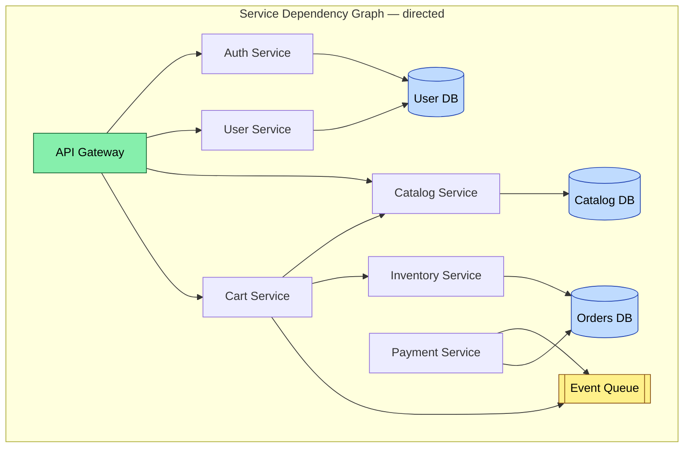
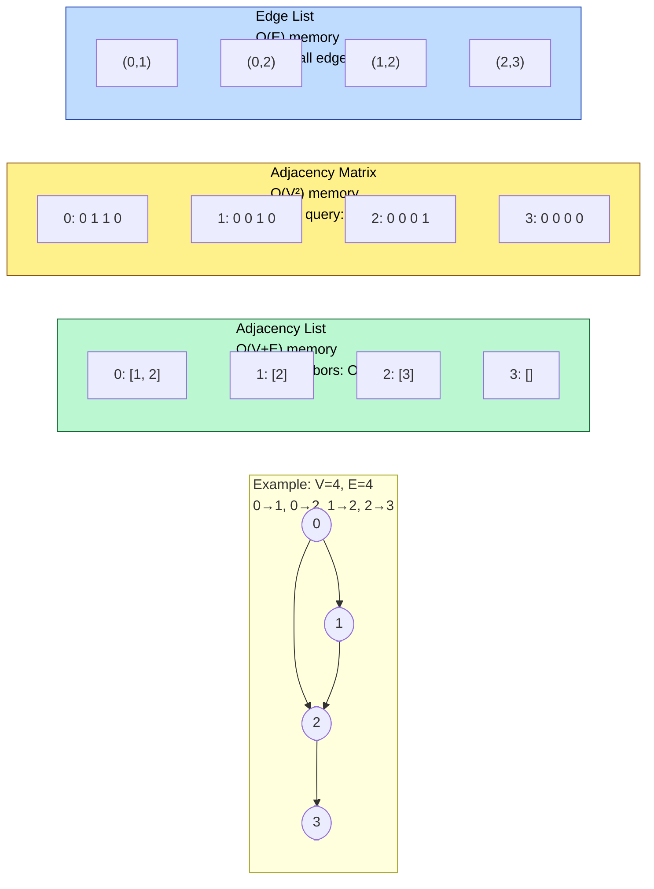
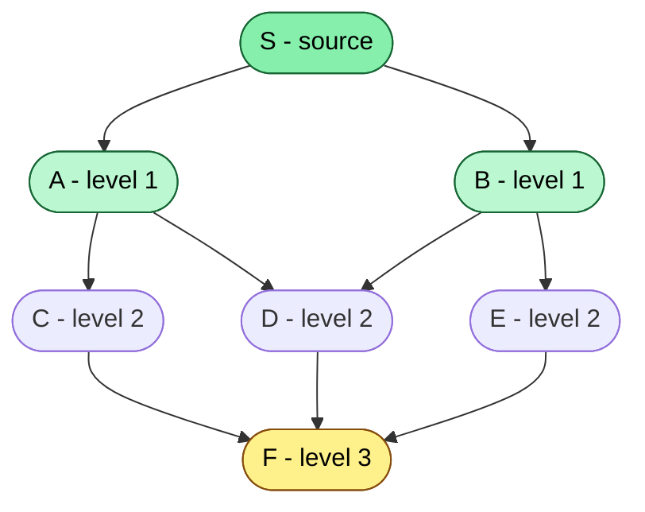
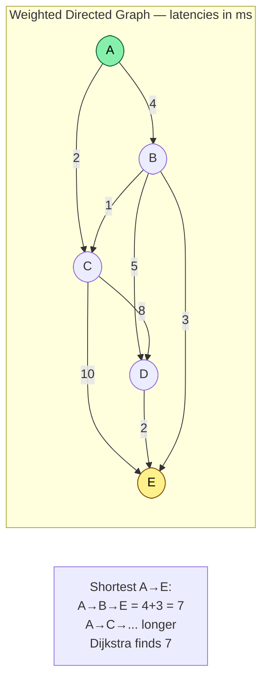
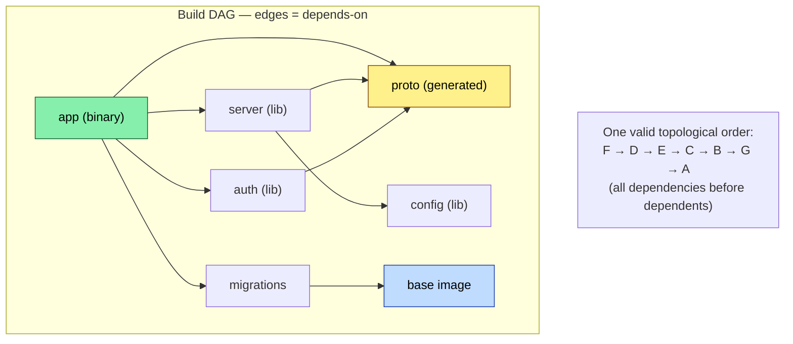
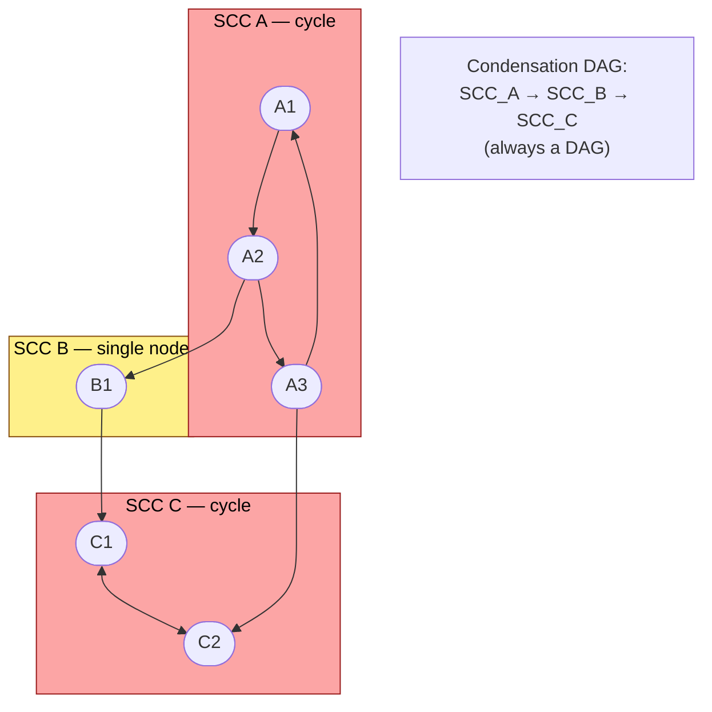

# Chapter 7 — Graphs in Systems

**What this chapter covers.** Almost every backend system is a graph even when it is not labeled as one: service dependencies form a directed graph, build pipelines are DAGs, network topologies are weighted graphs, database deadlock waits are cycles, and recommendation engines traverse social graphs. This chapter treats graphs as a systems primitive. We cover representations and their cache/I/O trade-offs, traversal (BFS/DFS), shortest paths (Dijkstra, Bellman-Ford), DAG scheduling and topological sort, connectivity and strongly connected components, minimum spanning trees, and Union-Find. Every algorithm is implemented in runnable Python and connected to the backend problem it actually solves — from dependency resolution to failure blast-radius analysis.

Learning goals — after this chapter you should be able to:

- Choose a graph representation (adjacency list, matrix, edge list, CSR) based on sparsity, mutability, and access pattern — and quantify its memory and cache cost.
- Implement BFS and DFS correctly (iterative and recursive), reconstruct paths, and explain when each is the right traversal.
- Implement Dijkstra with a heap, state its preconditions (non-negative weights), and know when to reach for Bellman-Ford or Floyd-Warshall instead.
- Perform topological sort (Kahn's algorithm and DFS-based), detect cycles, and apply it to build systems, migration ordering, and task scheduling.
- Find connected components and strongly connected components (Kosaraju/Tarjan) and explain their use in blast-radius and deadlock analysis.
- Implement Union-Find with path compression and union by rank, analyze its amortized cost, and use it for Kruskal's MST and dynamic connectivity.
- Reason about graphs at scale — when a single-machine traversal suffices, when you need partitioned or streaming approaches, and what the I/O cost is.

---

## 7.1 Graphs are everywhere — even when no one draws them

A **graph** G = (V, E) is a set of vertices V and edges E connecting them. Edges may be directed or undirected, weighted or unweighted.

Backend systems produce graphs continuously:

| System | Vertices | Edges | Graph problem |
|---|---|---|---|
| Microservice call graph | Services | RPC calls (directed, weighted by latency/QPS) | Shortest path (routing), SCC (circular dependencies), blast radius |
| Build / CI pipeline | Jobs / artifacts | Depends-on (directed) | Topological sort, cycle detection |
| Package dependencies | Packages | Depends-on (directed, versioned) | Topological sort, SAT-like resolution, cycle detection |
| Network topology | Switches, hosts | Links (undirected, weighted) | MST (cabling), shortest path (routing) |
| Database waits-for graph | Transactions | Waits-for (directed) | Cycle detection (deadlock) |
| Social / recommendation | Users, items | Follows, purchases (directed/bipartite) | BFS (distance), PageRank, community detection |
| Infrastructure (Terraform) | Resources | Depends-on (directed) | Topological sort (apply order) |



If this graph has a cycle (Cart -> Catalog -> Cart, or a circular retry dependency), deployments can deadlock, health checks can flap, and cascading failures can loop. Detecting that cycle is a graph algorithm.

> **Mental model.** Whenever your system has entities and relationships, draw the graph — even informally. The shape of the graph (DAG? dense? weighted? ephemeral?) determines which algorithm and representation you need.

---

## 7.2 Representation — where theory meets cache and memory

### The three classic representations



| Representation | Memory | Edge existence | Iterate neighbors of v | Iterate all edges | Mutation | Best for |
|---|---|---|---|---|---|---|
| **Adjacency list** (`dict[v] -> list`) | O(V + E) | O(degree(v)) | O(degree(v)) | O(V + E) | O(1) add/remove | Sparse graphs — the default for backend (service graphs, dependency graphs are sparse) |
| **Adjacency matrix** (`V x V` booleans/weights) | O(V^2) | O(1) | O(V) | O(V^2) | O(1) | Dense graphs, Floyd-Warshall, GPU workloads where V <= ~5000 |
| **Edge list** (`list[(u,v,w)]`) | O(E) | O(E) | O(E) | O(E) | O(1) append | Kruskal's MST, Bellman-Ford, streaming/partitioned processing |
| **CSR / CSC** (compressed sparse row) | O(V + E) | O(log degree) with binary search | O(degree(v)), contiguous | O(V+E) | Expensive | Large static graphs that must be cache-friendly and scanned repeatedly |
| **Implicit** (generated on the fly) | O(1) | Computed | Computed | N/A | N/A | Search spaces (puzzle solvers, state machines) — not typical for backend |

**Cache and I/O reality for backend graphs:**

- Service graphs and dependency graphs are **sparse**: E ~ O(V) to O(V log V), not O(V^2). Adjacency list wins on memory and iteration. An adjacency matrix for 100K services would be 10B entries — 10 GB of booleans for a graph with 200K edges that fits in 2 MB as an adjacency list.
- Adjacency lists with Python `dict[list]` or `defaultdict(list)` are pointer-chasing heavy but fine for V < 1M. For V > 1M or high-throughput traversals, CSR (two flat arrays: `offsets` and `neighbors`) gives contiguous memory, prefetcher-friendly scans, and 3-10x speedup over pointer-based lists — this is what CSR-backed graph engines and many database storage layers use.
- If the graph does not fit in RAM (social graphs with billions of edges), external-memory BFS and partitioned approaches apply — see section 7.8.

```python
# Graph representations — adjacency list (default) with weighted edge support
from __future__ import annotations
from collections import defaultdict, deque
from typing import Dict, List, Tuple, Set, Optional
import heapq

class Graph:
    """Directed weighted graph using adjacency list. Undirected graphs add both directions."""
    def __init__(self, directed: bool = True):
        self.directed = directed
        self.adj: Dict[int, List[Tuple[int, float]]] = defaultdict(list)
        self.vertices: Set[int] = set()

    def add_vertex(self, v: int) -> None:
        self.vertices.add(v)
        # ensure key exists even with no outgoing edges
        self.adj.setdefault(v, [])

    def add_edge(self, u: int, v: int, weight: float = 1.0) -> None:
        self.vertices.update([u, v])
        self.adj[u].append((v, weight))
        if not self.directed:
            self.adj[v].append((u, weight))
        else:
            self.adj.setdefault(v, [])

    def neighbors(self, v: int) -> List[Tuple[int, float]]:
        return self.adj.get(v, [])

    def num_vertices(self) -> int:
        return len(self.vertices)

    def num_edges(self) -> int:
        return sum(len(nbrs) for nbrs in self.adj.values())

    def edges(self) -> List[Tuple[int, int, float]]:
        out: List[Tuple[int, int, float]] = []
        for u, nbrs in self.adj.items():
            for v, w in nbrs:
                # for undirected, emit each edge once
                if not self.directed or True:
                    out.append((u, v, w))
        if not self.directed:
            # deduplicate: keep only u < v or one direction
            seen: Set[Tuple[int, int]] = set()
            dedup: List[Tuple[int, int, float]] = []
            for u, v, w in out:
                key = (min(u, v), max(u, v))
                if key not in seen:
                    seen.add(key)
                    dedup.append((u, v, w))
            return dedup
        return out

    def transpose(self) -> "Graph":
        """Reverse all edges — used by Kosaraju's SCC algorithm."""
        gt = Graph(directed=self.directed)
        for v in self.vertices:
            gt.add_vertex(v)
        for u, nbrs in self.adj.items():
            for v, w in nbrs:
                gt.add_edge(v, u, w)
        return gt

    def __repr__(self) -> str:
        return f"Graph(V={self.num_vertices()}, E={self.num_edges()}, directed={self.directed})"


if __name__ == "__main__":
    # Service dependency graph from the diagram above (simplified)
    # 0=Gateway, 1=Auth, 2=User, 3=Catalog, 4=Cart, 5=Payment, 6=Inventory
    g = Graph(directed=True)
    for u, v in [(0,1),(0,2),(0,3),(0,4),(2,1),(4,3),(4,6),(5,4)]:
        g.add_edge(u, v)
    print(g)
    for v in sorted(g.vertices):
        print(f"  {v} -> {g.neighbors(v)}")
    print(f"edges: {g.edges()}")
```

---

## 7.3 Traversal — BFS and DFS

BFS and DFS are the two fundamental traversals. Both visit every reachable vertex exactly once in O(V + E) time, but they differ in order and guarantees.

### BFS — level by level, shortest path in unweighted graphs

BFS uses a queue. It visits vertices in order of distance (number of edges) from the source. For unweighted graphs, this *is* the shortest path.



**Use BFS when:** you need shortest path in an unweighted graph (fewest hops), level-order processing (blast-radius by hop count), or to test bipartiteness / find connected components in order of distance.

### DFS — depth first, recursion and explicit stack

DFS uses a stack (implicitly via recursion, or explicitly). It explores as far as possible along each branch before backtracking.

**Use DFS when:** you need topological sort, cycle detection, SCCs, path existence, or to explore all possibilities (backtracking). Iterative DFS avoids recursion depth limits for deep graphs (Python recursion limit ~1000; service graphs can be deeper).

```python
# BFS and DFS — with path reconstruction, distance tracking, and cycle detection
from collections import deque

def bfs(
    g: Graph, source: int
) -> tuple[dict[int, int], dict[int, Optional[int]]]:
    """BFS from source. Returns (distance, parent) maps. Unreachable -> absent."""
    dist: dict[int, int] = {source: 0}
    parent: dict[int, Optional[int]] = {source: None}
    q: deque[int] = deque([source])
    visited: set[int] = {source}

    while q:
        u = q.popleft()
        for v, _w in g.neighbors(u):
            if v not in visited:
                visited.add(v)
                dist[v] = dist[u] + 1
                parent[v] = u
                q.append(v)
    return dist, parent


def bfs_shortest_path(g: Graph, source: int, target: int) -> Optional[list[int]]:
    """Reconstruct shortest path (fewest edges) from source to target via BFS."""
    dist, parent = bfs(g, source)
    if target not in dist:
        return None
    path: list[int] = []
    cur: Optional[int] = target
    while cur is not None:
        path.append(cur)
        cur = parent[cur]
    path.reverse()
    return path


def dfs_recursive(
    g: Graph, source: int, visited: Optional[set[int]] = None, order: Optional[list[int]] = None
) -> list[int]:
    """Recursive DFS — elegant but limited by recursion depth."""
    if visited is None:
        visited = set()
    if order is None:
        order = []
    visited.add(source)
    order.append(source)
    for v, _w in g.neighbors(source):
        if v not in visited:
            dfs_recursive(g, v, visited, order)
    return order


def dfs_iterative(g: Graph, source: int) -> list[int]:
    """Iterative DFS with explicit stack — safe for deep graphs."""
    visited: set[int] = set()
    order: list[int] = []
    stack: list[int] = [source]
    while stack:
        u = stack.pop()
        if u in visited:
            continue
        visited.add(u)
        order.append(u)
        # Push neighbors in reverse to visit them in adjacency-list order
        for v, _w in reversed(g.neighbors(u)):
            if v not in visited:
                stack.append(v)
    return order


def has_cycle_directed(g: Graph) -> bool:
    """Cycle detection in directed graph via DFS coloring (WHITE/GRAY/BLACK)."""
    WHITE, GRAY, BLACK = 0, 1, 2
    color: dict[int, int] = {v: WHITE for v in g.vertices}

    def dfs_visit(u: int) -> bool:
        color[u] = GRAY
        for v, _w in g.neighbors(u):
            if color[v] == GRAY:
                return True  # back edge -> cycle
            if color[v] == WHITE and dfs_visit(v):
                return True
        color[u] = BLACK
        return False

    for v in g.vertices:
        if color[v] == WHITE:
            if dfs_visit(v):
                return True
    return False


if __name__ == "__main__":
    # Unweighted service graph: shortest path = fewest hops
    g = Graph(directed=True)
    for u, v in [(0,1),(0,2),(1,3),(2,3),(3,4),(1,4),(2,5),(5,4)]:
        g.add_edge(u, v)

    dist, parent = bfs(g, 0)
    print(f"BFS distances from 0: {dist}")
    # 0 -> 1 -> 4 is 2 hops; 0 -> 1 -> 3 -> 4 is 3 hops — BFS finds 2
    print(f"shortest 0->4: {bfs_shortest_path(g, 0, 4)}")  # [0, 1, 4]
    print(f"DFS recursive from 0: {dfs_recursive(g, 0)}")
    print(f"DFS iterative from 0: {dfs_iterative(g, 0)}")

    # Cycle detection — add a back edge 4 -> 1 creating a cycle
    g2 = Graph(directed=True)
    for u, v in [(0,1),(1,2),(2,3),(3,1)]:
        g2.add_edge(u, v)
    print(f"has_cycle (should be True): {has_cycle_directed(g2)}")
    g3 = Graph(directed=True)
    for u, v in [(0,1),(1,2),(2,3)]:
        g3.add_edge(u, v)
    print(f"has_cycle (should be False): {has_cycle_directed(g3)}")
```

**BFS vs DFS — decision table:**

| Criterion | BFS | DFS |
|---|---|---|
| Data structure | Queue | Stack / recursion |
| Order | Level order (by distance) | Depth-first (one branch at a time) |
| Shortest path (unweighted) | Yes — first time you visit v is shortest | No |
| Memory | O(V) queue — wide graphs need large queue | O(V) stack — deep graphs need deep stack; recursion risks stack overflow |
| Use for | Shortest hops, level analysis, connected components by distance | Topological sort, SCC, cycle detection, path existence, backtracking |

---

## 7.4 Shortest paths — weighted graphs

When edges have weights (latency, cost, distance), BFS no longer suffices. Three algorithms cover the practical space.



### Dijkstra — non-negative weights, the workhorse

Dijkstra's algorithm maintains a priority queue of tentative distances. At each step it extracts the vertex with minimum distance (greedy — safe because weights are non-negative, so no future path can improve an already-extracted vertex). Complexity: O((V + E) log V) with a binary heap.

**Precondition:** All edge weights >= 0. If any weight is negative, Dijkstra can produce wrong answers — use Bellman-Ford.

### Bellman-Ford — handles negative weights, detects negative cycles

Relaxes all edges V-1 times. If a Vth relaxation still improves a distance, a negative cycle exists. Complexity: O(V * E) — much slower, but the only choice when negative weights are possible (e.g., cost/profit graphs, arbitrage detection).

### Floyd-Warshall — all-pairs shortest paths

Dynamic programming over intermediate vertices. O(V^3) time, O(V^2) space. Practical only for V <= ~400 (dense small graphs, e.g., all-pairs latency between availability zones).

| Algorithm | Weights | Single-source / All-pairs | Time | When to use |
|---|---|---|---|---|
| **BFS** | Unweighted (weight=1) | Single-source | O(V+E) | Hop-count shortest path |
| **Dijkstra (heap)** | Non-negative | Single-source | O((V+E) log V) | Default for weighted backend graphs (latencies, costs are non-negative) |
| **Bellman-Ford** | Any (detects negative cycle) | Single-source | O(V*E) | Negative weights, or need to detect negative cycles |
| **Floyd-Warshall** | Any (no negative cycle) | All-pairs | O(V^3) | Small dense graphs, all-pairs needed |
| **A* ** | Non-negative + heuristic | Single-source to target | O(E) with good heuristic | Pathfinding with geographic heuristic (not common in backend) |

```python
# Dijkstra with heap — the single-source shortest path you will actually use
import heapq
from typing import Dict, List, Tuple, Optional

def dijkstra(
    g: Graph, source: int
) -> tuple[dict[int, float], dict[int, Optional[int]]]:
    """Dijkstra from source. Requires non-negative weights.
    Returns (distance, parent). Unreachable vertices absent from dicts."""
    dist: dict[int, float] = {source: 0.0}
    parent: dict[int, Optional[int]] = {source: None}
    pq: list[Tuple[float, int]] = [(0.0, source)]
    visited: set[int] = set()

    while pq:
        d, u = heapq.heappop(pq)
        if u in visited:
            continue
        visited.add(u)
        # d is the final shortest distance to u (non-negative weights guarantee)
        for v, w in g.neighbors(u):
            if w < 0:
                raise ValueError(f"negative weight {w} on edge {u}->{v}: use Bellman-Ford")
            nd = d + w
            if v not in dist or nd < dist[v]:
                dist[v] = nd
                parent[v] = u
                heapq.heappush(pq, (nd, v))
    return dist, parent


def shortest_path(g: Graph, source: int, target: int) -> Optional[list[int]]:
    dist, parent = dijkstra(g, source)
    if target not in dist:
        return None
    path: list[int] = []
    cur: Optional[int] = target
    while cur is not None:
        path.append(cur)
        cur = parent[cur]
    path.reverse()
    return path


def bellman_ford(
    g: Graph, source: int
) -> tuple[dict[int, encounter], Optional[list[int]]]:
    """Bellman-Ford. Returns (distances, negative_cycle or None).
    Detects negative cycles reachable from source."""
    # Initialize
    dist: dict[int, float] = {v: float("inf") for v in g.vertices}
    parent: dict[int, Optional[int]] = {v: None for v in g.vertices}
    dist[source] = 0.0

    edges = g.edges()
    V = g.num_vertices()

    # Relax V-1 times
    for _ in range(V - 1):
        updated = False
        for u, v, w in edges:
            if dist[u] + w < dist[v]:
                dist[v] = dist[u] + w
                parent[v] = u
                updated = True
        if not updated:
            break  # early exit — no changes

    # Check for negative cycle
    for u, v, w in edges:
        if dist[u] + w < dist[v]:
            # Negative cycle reachable from source — reconstruct it
            # Walk back V steps to get inside the cycle
            cur = v
            for _ in range(V):
                cur = parent[cur] if parent[cur] is not None else cur  # type: ignore[assignment]
            cycle_start = cur
            cycle: list[int] = [cycle_start]
            cur = parent[cycle_start]  # type: ignore[assignment]
            while cur != cycle_start and cur is not None:
                cycle.append(cur)
                cur = parent[cur]  # type: ignore[assignment]
            cycle.append(cycle_start)
            cycle.reverse()
            return dist, cycle

    return dist, None


if __name__ == "__main__":
    # Weighted service graph — edge weight = p50 latency in ms
    g = Graph(directed=True)
    for u, v, w in [(0,1,4),(0,2,2),(1,2,1),(1,3,5),(2,3,8),(2,4,10),(3,4,2),(1,4,3)]:
        g.add_edge(u, v, w)

    dist, parent = dijkstra(g, 0)
    print(f"Dijkstra from 0: {dist}")
    print(f"  shortest 0->4: {shortest_path(g, 0, 4)} cost={dist[4]}")  # 0->1->4 = 7
    print(f"  shortest 0->3: {shortest_path(g, 0, 3)} cost={dist[3]}")  # 0->1->3 = 9 or 0->2->... check

    # Bellman-Ford with negative edge (e.g., rebate/profit)
    g2 = Graph(directed=True)
    for u, v, w in [(0,1,4),(0,2,2),(1,2,-3),(2,3,1),(1,3,5)]:
        g2.add_edge(u, v, w)
    dist2, cycle = bellman_ford(g2, 0)
    print(f"\nBellman-Ford from 0: {dist2}  cycle={cycle}")

    # Negative cycle detection
    g3 = Graph(directed=True)
    for u, v, w in [(0,1,1),(1,2,-2),(2,0,-2)]:
        g3.add_edge(u, v, w)
    dist3, cycle3 = bellman_ford(g3, 0)
    print(f"Negative cycle detected: {cycle3}")  # should find the cycle 0->1->2->0
```

**Latency-aware routing example.** In a multi-region service mesh, each edge weight is the p99 latency between services (measured by the mesh telemetry). Dijkstra from the API gateway finds the lowest-latency call chain to fulfill a request. If you instead weight edges by error rate or cost, the same algorithm optimizes for reliability or cost.

---

## 7.5 DAGs, topological sort, and dependency resolution

A **directed acyclic graph (DAG)** has no directed cycles. DAGs are the structure of any dependency system: if A depends on B, B must be built/deployed/started before A. A **topological order** is a linear ordering of vertices such that every edge u -> v has u before v. Every DAG has at least one topological order; a directed graph has a topological order if and only if it is acyclic.



### Kahn's algorithm (BFS-based)

Repeatedly remove vertices with in-degree 0 (no remaining dependencies), decrement neighbors' in-degrees, and continue. If you cannot remove all vertices, a cycle exists.

### DFS-based topological sort

DFS post-order reversed gives a topological order. Simpler to implement recursively, but Kahn's is preferred for large graphs because it is iterative and naturally detects cycles with a count.

```python
# Topological sort — Kahn's algorithm and DFS variant, with cycle reporting
from collections import deque, defaultdict

def topological_sort_kahn(g: Graph) -> Optional[list[int]]:
    """Kahn's algorithm. Returns topological order or None if cycle exists."""
    in_degree: dict[int, int] = {v: 0 for v in g.vertices}
    for u in g.vertices:
        for v, _w in g.neighbors(u):
            in_degree[v] += 1

    q: deque[int] = deque(v for v, d in in_degree.items() if d == 0)
    order: list[int] = []

    while q:
        u = q.popleft()
        order.append(u)
        for v, _w in g.neighbors(u):
            in_degree[v] -= 1
            if in_degree[v] == 0:
                q.append(v)

    if len(order) != g.num_vertices():
        return None  # cycle exists — not all vertices were ordered
    return order


def topological_sort_dfs(g: Graph) -> Optional[list[int]]:
    """DFS-based topo sort. Returns order or None if cycle detected."""
    WHITE, GRAY, BLACK = 0, 1, 2
    color: dict[int, int] = {v: WHITE for v in g.vertices}
    order: list[int] = []
    has_cycle = False

    def dfs(u: int) -> None:
        nonlocal has_cycle
        color[u] = GRAY
        for v, _w in g.neighbors(u):
            if color[v] == GRAY:
                has_cycle = True
                return
            if color[v] == WHITE:
                dfs(v)
                if has_cycle:
                    return
        color[u] = BLACK
        order.append(u)

    for v in g.vertices:
        if color[v] == WHITE:
            dfs(v)
            if has_cycle:
                return None
    order.reverse()
    return order


def find_cycle(g: Graph) -> Optional[list[int]]:
    """Return one directed cycle if present, else None."""
    WHITE, GRAY, BLACK = 0, 1, 2
    color: dict[int, int] = {v: WHITE for v in g.vertices}
    parent: dict[int, Optional[int]] = {v: None for v in g.vertices}
    cycle: Optional[list[int]] = None

    def dfs(u: int) -> bool:
        nonlocal cycle
        color[u] = GRAY
        for v, _w in g.neighbors(u):
            if color[v] == GRAY:
                # Found back edge u -> v — reconstruct cycle v -> ... -> u -> v
                c: list[int] = [v, u]
                cur = parent[u]
                while cur is not None and cur != v:
                    c.append(cur)
                    cur = parent[cur]
                c.append(v)
                c.reverse()
                cycle = c
                return True
            if color[v] == WHITE:
                parent[v] = u
                if dfs(v):
                    return True
        color[u] = BLACK
        return False

    for v in g.vertices:
        if color[v] == WHITE:
            if dfs(v):
                return cycle
    return None


if __name__ == "__main__":
    # Build DAG — edges point from dependency to dependent (must build dep first)
    # proto -> server -> app, proto -> auth -> app, base -> migrations
    build = Graph(directed=True)
    for u, v in [("proto","server"),("proto","auth"),("server","app"),
                 ("auth","app"),("base","migrations"),("migrations","app")]:
        build.add_edge(u, v)  # type: ignore[arg-type]
    # Use string keys — Graph above uses int; recreate with str support quickly:
    # For demo clarity, use ints: 0=proto,1=server,2=auth,3=app,4=base,5=migrations
    g = Graph(directed=True)
    for u, v in [(0,1),(0,2),(1,3),(2,3),(4,5),(5,3)]:
        g.add_edge(u, v)
    print(f"Kahn topo: {topological_sort_kahn(g)}")
    print(f"DFS  topo: {topological_sort_dfs(g)}")
    names = ["proto","server","auth","app","base","migrations"]
    order = topological_sort_kahn(g)
    if order:
        print(f"  named: {[names[i] for i in order]}")

    # Cycle — app depends on server depends on app
    g_cycle = Graph(directed=True)
    for u, v in [(0,1),(1,2),(2,0)]:
        g_cycle.add_edge(u, v)
    print(f"\nCycle graph Kahn result (None=has cycle): {topological_sort_kahn(g_cycle)}")
    print(f"  cycle found: {find_cycle(g_cycle)}")

    # Real-world: database migration ordering
    # migrations 001..005 with dependencies
    mig = Graph(directed=True)
    # 1 has no deps, 2 depends on 1, 3 depends on 1, 4 depends on 2+3, 5 depends on 4
    for u, v in [(1,2),(1,3),(2,4),(3,4),(4,5)]:
        mig.add_edge(u, v)
    print(f"\nMigration order: {topological_sort_kahn(mig)}")
```

**Where topological sort runs in production:**

- **Bazel / Buck / Pants** — build graph is a DAG; topological order determines build sequence, and reverse topological order determines cache invalidation.
- **Terraform / CloudFormation** — resource graph is a DAG; `terraform plan` topologically sorts resources to determine create/update order.
- **Airflow / Dagster / Argo Workflows** — pipeline DAGs are topologically sorted to schedule tasks; cycle detection rejects invalid pipeline definitions at submission time.
- **Database migrations** — migration dependencies form a DAG; the runner must apply them in topological order and detect conflicting branches.

---

## 7.6 Connectivity, SCCs, and Union-Find

### Connected components (undirected) and SCCs (directed)

In a directed graph, a **strongly connected component (SCC)** is a maximal set of vertices mutually reachable from each other. SCCs partition the graph into a DAG of components (the *condensation graph*). Finding SCCs answers: which services form a circular dependency cluster? Which transactions are deadlocked together?



### Kosaraju's algorithm — two passes of DFS

1. DFS on G, record finish times (post-order).
2. DFS on G^T (transpose) in decreasing finish-time order. Each DFS tree is an SCC.

Kosaraju is intuitive and easy to implement correctly. Tarjan's algorithm does it in one DFS pass with lower constant factors but is trickier to get right — Kosaraju is the recommended default unless profiling shows it matters.

### Union-Find (Disjoint Set Union) — dynamic connectivity

Union-Find maintains a partition of vertices into disjoint sets with two operations:

- `find(v)` — which set contains v? (with path compression)
- `union(a, b)` — merge the sets containing a and b (by rank/size)

Amortized cost per operation: O(alpha(n)) where alpha is the inverse Ackermann function — effectively constant (alpha(n) < 5 for any n that fits in the physical universe). Used by Kruskal's MST, for clustering, and for incremental connectivity queries.

```python
# SCC (Kosaraju) and Union-Find — connectivity primitives for backend graphs
from typing import Dict, List, Set

def kosaraju_scc(g: Graph) -> List[List[int]]:
    """Return list of SCCs (each SCC is a list of vertices)."""
    visited: set[int] = set()
    finish_order: list[int] = []

    def dfs1(u: int) -> None:
        visited.add(u)
        for v, _w in g.neighbors(u):
            if v not in visited:
                dfs1(v)
        finish_order.append(u)

    for v in g.vertices:
        if v not in visited:
            dfs1(v)

    # Second pass on transpose in reverse finish order
    gt = g.transpose()
    visited2: set[int] = set()
    sccs: list[list[int]] = []

    def dfs2(u: int, comp: list[int]) -> None:
        visited2.add(u)
        comp.append(u)
        for v, _w in gt.neighbors(u):
            if v not in visited2:
                dfs2(v, comp)

    for v in reversed(finish_order):
        if v not in visited2:
            comp: list[int] = []
            dfs2(v, comp)
            sccs.append(comp)

    return sccs


class UnionFind:
    """Union-Find with path compression and union by rank."""
    def __init__(self, elements: List[int] | None = None):
        self.parent: Dict[int, int] = {}
        self.rank: Dict[int, int] = {}
        if elements:
            for e in elements:
                self.make_set(e)

    def make_set(self, x: int) -> None:
        self.parent[x] = x
        self.rank[x] = 0

    def find(self, x: int) -> int:
        # Path compression — flatten the tree on the way up
        if self.parent[x] != x:
            self.parent[x] = self.find(self.parent[x])
        return self.parent[x]

    def union(self, a: int, b: int) -> bool:
        """Merge sets containing a and b. Returns True if merged, False if already together."""
        ra, rb = self.find(a), self.find(b)
        if ra == rb:
            return False
        # Union by rank — attach shorter tree under taller one
        if self.rank[ra] < self.rank[rb]:
            self.parent[ra] = rb
        elif self.rank[ra] > self.rank[rb]:
            self.parent[rb] = ra
        else:
            self.parent[rb] = ra
            self.rank[ra] += 1
        return True

    def connected(self, a: int, b: int) -> bool:
        return self.find(a) == self.find(b)

    def components(self) -> Dict[int, List[int]]:
        """Return mapping root -> members."""
        comps: Dict[int, List[int]] = defaultdict(list)
        for v in self.parent:
            comps[self.find(v)].append(v)
        return dict(comps)


def kruskal_mst(g: Graph) -> tuple[list[Tuple[int, int, float]], float]:
    """Kruskal's MST — requires undirected graph. Returns (edges, total_weight)."""
    if g.directed:
        raise ValueError("Kruskal requires undirected graph")
    # Collect all edges, deduplicated
    edge_set: dict[Tuple[int, int], float] = {}
    for u, nbrs in g.adj.items():
        for v, w in nbrs:
            key = (min(u, v), max(u, v))
            if key not in edge_set:
                edge_set[key] = w
    sorted_edges = sorted(edge_set.items(), key=lambda kv: kv[1])

    uf = UnionFind(list(g.vertices))
    mst: list[Tuple[int, int, float]] = []
    total = 0.0
    for (u, v), w in sorted_edges:
        if uf.union(u, v):
            mst.append((u, v, w))
            total += w
            if len(mst) == g.num_vertices() - 1:
                break
    return mst, total


if __name__ == "__main__":
    # SCC example — service dependency cycles
    # 0->1->2->0 is SCC {0,1,2}, 3 alone, 4<->5 is SCC {4,5}, edge 2->3->4
    g = Graph(directed=True)
    for u, v in [(0,1),(1,2),(2,0),(2,3),(3,4),(4,5),(5,4)]:
        g.add_edge(u, v)
    sccs = kosaraju_scc(g)
    print(f"SCCs: {sccs}")
    # Condensation is a DAG: {0,1,2} -> {3} -> {4,5}
    for scc in sccs:
        if len(scc) > 1:
            print(f"  CYCLE in SCC {scc} — circular dependency!")

    # Union-Find — incremental connectivity (e.g., network partition healing)
    uf = UnionFind([0,1,2,3,4,5])
    uf.union(0, 1)
    uf.union(1, 2)
    uf.union(3, 4)
    print(f"\nUnion-Find components: {uf.components()}")
    print(f"  0 connected to 2? {uf.connected(0, 2)}")  # True
    print(f"  0 connected to 3? {uf.connected(0, 3)}")  # False
    uf.union(2, 3)
    print(f"  after union(2,3): 0 connected to 4? {uf.connected(0, 4)}")  # True via 2-3-4

    # MST — minimum-cost network interconnect
    net = Graph(directed=False)
    for u, v, w in [(0,1,4),(0,2,3),(1,2,1),(1,3,2),(2,3,4),(3,4,2),(2,4,5)]:
        net.add_edge(u, v, w)
    mst, cost = kruskal_mst(net)
    print(f"\nMST edges: {mst}  total cost: {cost}")
