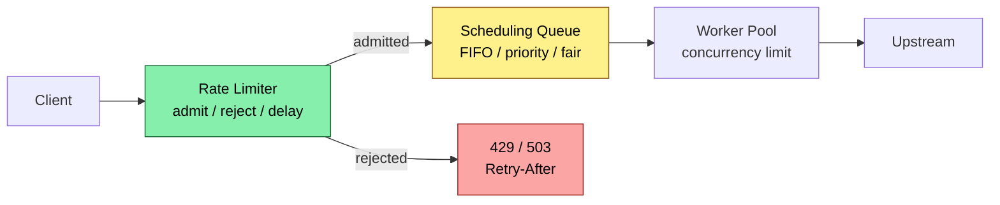
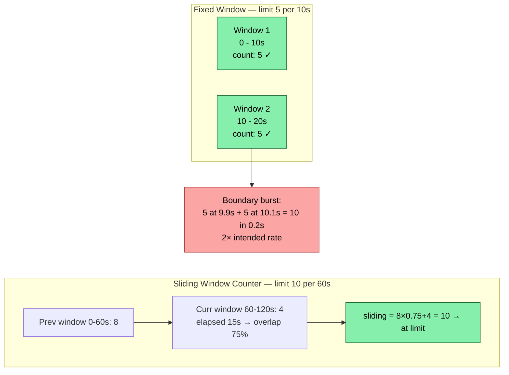
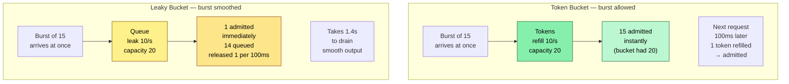
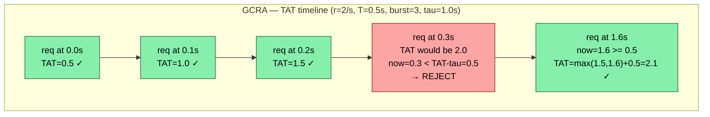
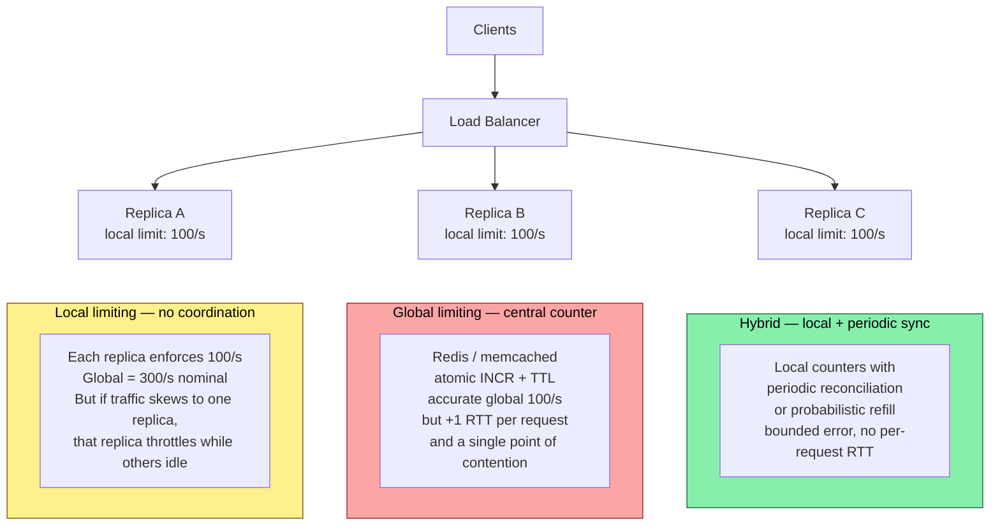
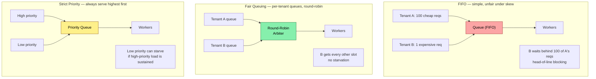

# Chapter 8 — Rate-Limiting and Scheduling Algorithms

**What this chapter covers.** Every backend that faces the open internet must decide which requests to serve, which to delay, and which to reject — and in what order. Rate limiting enforces quotas and protects shared resources from overload and abuse. Scheduling decides the order in which admitted work actually runs. Both are algorithmic problems with direct consequences for tail latency, fairness, and availability. This chapter covers the full family of rate-limiting algorithms — fixed window, sliding window log, sliding window counter, token bucket, leaky bucket, and GCRA — with runnable implementations, correctness analysis, and the distributed-systems concerns that make single-node algorithms insufficient. It then covers scheduling — FIFO, priority, fair queuing, weighted fair queuing, deficit round robin, and deadline-aware scheduling — and shows how rate limiting and scheduling compose into a coherent overload-management strategy.

Learning goals — after this chapter you should be able to:

- Implement and compare fixed window, sliding window log, sliding window counter, token bucket, leaky bucket, and GCRA — and explain the burst, precision, and memory trade-off of each.
- Reason about the boundary effects (thundering herd at window edges) that make fixed windows unsafe for strict quotas.
- Choose a rate-limiting granularity (per-user, per-key, per-service, global) and enforce it in a distributed system despite clock skew and coordination cost.
- Implement scheduling disciplines (FIFO, strict priority, weighted fair queuing, deficit round robin) and explain starvation, fairness, and latency implications.
- Combine rate limiting, admission control, load shedding, and scheduling into a layered defense that protects p99 while maximizing goodput.
- Analyze rate limiter and scheduler overhead on the request path and keep it off the hot-path critical section where possible.

---

## 8.1 Why rate limiting and scheduling are inseparable

Rate limiting answers **"should this request be admitted?"** Scheduling answers **"in what order should admitted requests run?"** In practice they form a pipeline:



Without rate limiting, a burst of 10x traffic can saturate workers, fill queues, and cause every request — including high-priority ones — to time out (retry amplification makes it worse). Without scheduling, even a well-rate-limited system can starve important tenants or let one tenant's expensive requests block everyone else (head-of-line blocking).

The two systems share vocabulary but differ in mechanism: rate limiting is about **counting and metering over time windows**; scheduling is about **ordering and interleaving** admitted work.

> **Scope note.** System-level rate limiting policy (quotas, tiers, product-level limits, gateway configuration) is covered in Vol. 7, Ch. 9. This chapter is the algorithmic companion — how each limiter actually works, what it guarantees, and what it costs.

---

## 8.2 Windows — fixed, sliding log, and sliding counter

### Fixed window — simple but bursty

Divide time into fixed intervals (e.g., 60 s). Keep a counter per window. When the counter reaches the limit, reject until the next window.



**Fixed window problem:** At window boundaries, up to 2 * limit requests can pass in a burst smaller than the window. For 100 req/s with 1 s windows, 100 at t=0.99 s and 100 at t=1.01 s pass — 200 in 20 ms. Fixed windows are acceptable only for generous quotas where bursts do not threaten downstream.

**Sliding window log** — store a timestamp per request, evict outside the window, count remainder. Precise but O(limit) memory per key — infeasible for 10K req/min with millions of keys.

**Sliding window counter** — approximate as `sliding = prev × overlap + curr` where `overlap = (window - elapsed)/window`. Two counters, O(1) memory, ~1-5% error. Used by Nginx/Envoy.

**Trade-off table:**

| Algorithm | Memory per key | Precision | Burst at boundary | Best for |
|---|---|---|---|---|
| Fixed window | O(1) — one counter | Coarse | Up to 2x burst | Generous quotas, non-critical paths |
| Sliding window log | O(limit) timestamps | Exact | None | Strict quotas, low limits, few keys |
| Sliding window counter | O(1) — two counters | ~1-5% error | Bounded, small | General purpose — gateways, API rate limiting |
| Token bucket (next section) | O(1) — tokens + timestamp | Exact over time | Controlled burst up to bucket size | Shaping + limiting, bursty-friendly workloads |

```python
# Window-based rate limiters — fixed, sliding log, sliding counter
from __future__ import annotations
import time
from collections import deque
from typing import Deque, Dict


class FixedWindowLimiter:
    """Fixed window counter. NOT safe against boundary bursts."""
    def __init__(self, limit: int, window_s: float):
        self.limit = limit
        self.window_s = window_s
        self.count = 0
        self.window_start = time.monotonic()

    def allow(self, now: float | None = None) -> bool:
        if now is None:
            now = time.monotonic()
        if now - self.window_start >= self.window_s:
            self.count = 0
            self.window_start = now
        if self.count < self.limit:
            self.count += 1
            return True
        return False


class SlidingWindowLogLimiter:
    """Sliding window log — exact, O(limit) memory."""
    def __init__(self, limit: int, window_s: float):
        self.limit = limit
        self.window_s = window_s
        self.log: Deque[float] = deque()

    def allow(self, now: float | None = None) -> bool:
        if now is None:
            now = time.monotonic()
        cutoff = now - self.window_s
        while self.log and self.log[0] <= cutoff:
            self.log.popleft()
        if len(self.log) < self.limit:
            self.log.append(now)
            return True
        return False

    def count(self, now: float | None = None) -> int:
        if now is None:
            now = time.monotonic()
        cutoff = now - self.window_s
        while self.log and self.log[0] <= cutoff:
            self.log.popleft()
        return len(self.log)


class SlidingWindowCounterLimiter:
    """Sliding window counter — O(1) memory, bounded approximation error."""
    def __init__(self, limit: int, window_s: float):
        self.limit = limit
        self.window_s = window_s
        self.prev_count = 0
        self.curr_count = 0
        self.window_start = time.monotonic()

    def allow(self, now: float | None = None) -> bool:
        if now is None:
            now = time.monotonic()
        # Roll windows if needed
        elapsed_windows = int((now - self.window_start) // self.window_s)
        if elapsed_windows >= 1:
            if elapsed_windows == 1:
                self.prev_count = self.curr_count
            else:
                # Gap of 2+ windows — previous window is stale
                self.prev_count = 0
            self.curr_count = 0
            self.window_start += elapsed_windows * self.window_s

        overlap = 1.0 - ((now - self.window_start) / self.window_s)
        overlap = max(0.0, min(1.0, overlap))
        estimated = self.prev_count * overlap + self.curr_count
        if estimated < self.limit:
            self.curr_count += 1
            return True
        return False

    def estimated_count(self, now: float | None = None) -> float:
        if now is None:
            now = time.monotonic()
        overlap = 1.0 - ((now - self.window_start) / self.window_s)
        overlap = max(0.0, min(1.0, overlap))
        return self.prev_count * overlap + self.curr_count


if __name__ == "__main__":
    # Demonstrate boundary burst: fixed window allows 2x in a short burst
    print("=== Fixed window boundary burst ===")
    fw = FixedWindowLimiter(limit=5, window_s=10.0)
    t = 100.0  # synthetic time
    fw.window_start = t
    # 5 requests at t+9.9 (end of window 1)
    for i in range(5):
        assert fw.allow(now=t + 9.9 + i * 0.001)
    print(f"  5 requests at t+9.9: allowed (count={fw.count})")
    # Window rolls at t+10 — next 5 at t+10.1 are in a new window, all allowed
    for i in range(5):
        assert fw.allow(now=t + 10.1 + i * 0.001)
    print(f"  5 requests at t+10.1: allowed (count={fw.count})")
    print(f"  10 requests in 0.2s with limit 5/10s — 2x burst leaked through\n")

    # Sliding log blocks the burst correctly
    print("=== Sliding window log (precise) ===")
    sw = SlidingWindowLogLimiter(limit=5, window_s=10.0)
    for i in range(5):
        sw.allow(now=t + 9.9 + i * 0.001)
    print(f"  5 at t+9.9: count={sw.count(now=t+9.9+0.01)}")
    # At t+10.1, the 5 from t+9.9 are still inside [0.1, 10.1] — so all 5 new are rejected
    results = [sw.allow(now=t + 10.1 + i * 0.001) for i in range(5)]
    print(f"  5 at t+10.1: allowed={sum(results)} rejected={5-sum(results)} (correct: all rejected)\n")

    # Sliding counter approximates — at t+10.1, overlap ~99% so estimated ~5*0.99 ≈ 4.95 + 0 new
    print("=== Sliding window counter (approximate) ===")
    sc = SlidingWindowCounterLimiter(limit=5, window_s=10.0)
    sc.window_start = t
    for i in range(5):
        sc.allow(now=t + 9.9 + i * 0.001)
    print(f"  after 5 at t+9.9: curr={sc.curr_count} prev={sc.prev_count}")
    for i in range(5):
        ok = sc.allow(now=t + 10.1 + i * 0.001)
        print(f"    request {i+1} at t+10.1: {'allowed' if ok else 'rejected'}  est={sc.estimated_count(now=t+10.1+i*0.001):.2f}")
```

---

## 8.3 Token bucket and leaky bucket — shaping vs policing

These two are often confused but have opposite burst behavior.

### Token bucket — allows bursts, enforces average rate

A bucket holds up to `capacity` tokens. Tokens are added at a fixed `refill_rate` (tokens/s). Each request consumes one token (or N tokens for weighted requests). If the bucket is empty, the request is rejected (or queued).

- **Burst-friendly:** If the bucket is full, up to `capacity` requests can pass instantly — then the limiter throttles to `refill_rate`. This models real capacity well: downstream can handle short bursts but not sustained overload.
- **Parameters:** `capacity` controls max burst; `refill_rate` controls sustained rate. Setting `capacity = refill_rate` gives a smooth rate with no burst; `capacity >> refill_rate` allows large bursts (e.g., 100 burst with 10/s sustained — common for user-facing APIs where interactive bursts are expected).

### Leaky bucket — smooths bursts, enforces constant output rate

Requests enter a queue (the bucket). The bucket leaks at a constant rate — one request released per `1/rate` interval. If the bucket is full, new requests overflow (are rejected).

- **Burst-hostile:** Even if 100 requests arrive at once, they are released one at a time at the leak rate. This smooths traffic for downstream that cannot tolerate any burst (e.g., a legacy database with strict connection limits).
- **Trade-off:** Adds latency — bursty arrivals are queued rather than admitted immediately.



**When to use which:**

| Criterion | Token bucket | Leaky bucket |
|---|---|---|
| Burst handling | Admits bursts up to capacity | Queues/smooths bursts |
| Added latency | None for admitted requests | Queuing delay for burst arrivals |
| Downstream tolerance | Handles bursts | Cannot handle bursts |
| Typical use | API rate limiting (user-facing, bursty) | Traffic shaping toward fragile downstream (DB, legacy service) |
| Analogy | Bouncer with a burst allowance | Funnel that drips at constant rate |

In practice, most backend rate limiters are token buckets (or GCRA, which is equivalent — see next section) because user traffic is inherently bursty and downstream services are typically provisioned for burst capacity.

```python
# Token bucket and leaky bucket — production-ready implementations
from __future__ import annotations
import time
import threading
from collections import deque


class TokenBucket:
    """Thread-safe token bucket. Tokens are floats to support fractional rates."""
    def __init__(self, capacity: float, refill_per_s: float):
        self.capacity = capacity
        self.refill_per_s = refill_per_s
        self._tokens = capacity  # start full
        self._last_refill = time.monotonic()
        self._lock = threading.Lock()

    def _refill(self, now: float) -> None:
        elapsed = now - self._last_refill
        if elapsed > 0:
            self._tokens = min(self.capacity, self._tokens + elapsed * self.refill_per_s)
            self._last_refill = now

    def allow(self, tokens: float = 1.0, now: float | None = None) -> bool:
        """Try to consume tokens. Returns True if admitted."""
        if now is None:
            now = time.monotonic()
        with self._lock:
            self._refill(now)
            if self._tokens >= tokens:
                self._tokens -= tokens
                return True
            return False

    def allow_with_wait(self, tokens: float = 1.0, now: float | None = None) -> float:
        """Returns 0 if admitted immediately, else seconds to wait."""
        if now is None:
            now = time.monotonic()
        with self._lock:
            self._refill(now)
            if self._tokens >= tokens:
                self._tokens -= tokens
                return 0.0
            needed = tokens - self._tokens
            return needed / self.refill_per_s

    @property
    def available(self) -> float:
        with self._lock:
            self._refill(time.monotonic())
            return self._tokens


class LeakyBucket:
    """Leaky bucket — queue with constant leak rate.
    enqueue() returns True if accepted, False if bucket full (overflow).
    leak() / drain() releases items at the leak rate."""
    def __init__(self, capacity: int, leak_per_s: float):
        self.capacity = capacity
        self.leak_per_s = leak_per_s
        self._queue: deque[float] = deque()  # arrival timestamps
        self._last_leak = time.monotonic()
        self._lock = threading.Lock()

    def _leak(self, now: float) -> None:
        """Remove items that have leaked out by now."""
        elapsed = now - self._last_leak
        n_leak = int(elapsed * self.leak_per_s)
        for _ in range(min(n_leak, len(self._queue))):
            self._queue.popleft()
        if n_leak > 0:
            # Advance last_leak by the time corresponding to items actually leaked
            leaked = min(n_leak, len(self._queue) + n_leak)  # approximate
            self._last_leak += n_leak / self.leak_per_s

    def try_add(self, now: float | None = None) -> bool:
        """Try to enqueue a request. False = bucket full, request rejected."""
        if now is None:
            now = time.monotonic()
        with self._lock:
            self._leak(now)
            if len(self._queue) < self.capacity:
                self._queue.append(now)
                return True
            return False

    def queue_depth(self, now: float | None = None) -> int:
        if now is None:
            now = time.monotonic()
        with self._lock:
            self._leak(now)
            return len(self._queue)


# Simpler leaky bucket variant — time-based next-allowed calculation (no queue storage)
class LeakyBucketSimple:
    """Leaky bucket as next-allowed timestamp — O(1) memory, no queue."""
    def __init__(self, leak_per_s: float, capacity: int):
        self.leak_interval = 1.0 / leak_per_s
        self.capacity = capacity
        self.leak_per_s = leak_per_s
        # next_allowed is when the bucket will have space for one more item
        self._next_allowed: float = 0.0
        self._queue_time: float = 0.0  # total queuing delay of items in bucket
        self._lock = threading.Lock()

    def try_add(self, now: float | None = None) -> tuple[bool, float]:
        """Returns (admitted, wait_s). If admitted, wait_s is queuing delay."""
        if now is None:
            now = time.monotonic()
        with self._lock:
            # Bucket state: how many items are queued ahead of this one
            # Approximate queue length from timing
            if now >= self._next_allowed:
                # Bucket has drained — admit immediately
                self._next_allowed = now + self.leak_interval
                return True, 0.0
            # Bucket has items — check if there is room
            queue_len = (self._next_allowed - now) / self.leak_interval
            if queue_len >= self.capacity:
                return False, 0.0  # overflow
            wait = self._next_allowed - now
            self._next_allowed += self.leak_interval
            return True, wait


if __name__ == "__main__":
    # Token bucket burst demo
    print("=== Token bucket: burst then throttle ===")
    tb = TokenBucket(capacity=10, refill_per_s=5)
    t = time.monotonic()
    # Burst of 15 at once — only 10 admitted (capacity)
    admitted = sum(1 for _ in range(15) if tb.allow(now=t))
    print(f"  burst 15 at t=0: admitted={admitted} (capacity=10)")
    # 0.4s later: 2 tokens refilled (5/s * 0.4 = 2)
    admitted2 = sum(1 for _ in range(5) if tb.allow(now=t + 0.4))
    print(f"  5 more at t+0.4s: admitted={admitted2} (refilled ~2)")
    print(f"  wait for 1 token: {tb.allow_with_wait(now=t+0.4):.3f}s\n")

    # Leaky bucket smoothing demo
    print("=== Leaky bucket: smoothing ===")
    lb = LeakyBucketSimple(leak_per_s=10, capacity=20)
    t2 = time.monotonic()
    for i in range(5):
        ok, wait = lb.try_add(now=t2 + i * 0.01)  # 5 arrive in 40ms
        print(f"  request {i+1} at t+{i*10}ms: {'admitted' if ok else 'rejected'} wait={wait*1000:.1f}ms")
    # After burst, next request 50ms later still queued behind earlier ones
    ok, wait = lb.try_add(now=t2 + 0.05)
    print(f"  request at t+50ms: {'admitted' if ok else 'rejected'} wait={wait*1000:.1f}ms")
```

---

## 8.4 GCRA — the unified model

The **Generic Cell Rate Algorithm (GCRA)**, also called the virtual scheduling algorithm, unifies token bucket and leaky bucket into a single formulation. It tracks a single state variable — the **Theoretical Arrival Time (TAT)** — and needs no background refill thread.

```
Parameters:
  limit r  — sustained rate (e.g., 10 req/s)
  burst b  — max burst size
  emission interval T = 1/r
  burst offset tau = (b - 1) * T   (often written as burst = tau / T + 1)

State:
  TAT — theoretical arrival time of the next expected request

On request at time now:
  if TAT is unset:  TAT = now; allow
  else:
    if now < TAT - tau:  reject  (too early — would exceed burst)
    else:
      TAT = max(TAT, now) + T
      allow
```

GCRA with `tau = 0` is a strict rate limiter (no burst — exactly `1/T` spacing). With `tau > 0` it allows bursts of `b` requests. The algorithm is O(1) per request, O(1) memory, and trivially serializable to Redis or memcached with a single `GET`/`SET` or Lua script — which is why it powers many distributed limiters (e.g., `redis-cell`, Cloudflare's limiter).



```python
# GCRA — Generic Cell Rate Algorithm (virtual scheduling)
from __future__ import annotations
import time

class GCRA:
    """GCRA rate limiter. Equivalent to token bucket with O(1) state.

    Args:
        rate_per_s: sustained rate (requests per second).
        burst: max burst size (number of requests that can arrive simultaneously).
    """
    def __init__(self, rate_per_s: float, burst: int = 1):
        if rate_per_s <= 0 or burst < 1:
            raise ValueError("rate_per_s > 0 and burst >= 1 required")
        self.period = 1.0 / rate_per_s       # T — emission interval
        self.tau = (burst - 1) * self.period  # burst tolerance
        self.burst = burst
        self.rate_per_s = rate_per_s
        self.tat: float | None = None         # theoretical arrival time

    def allow(self, now: float | None = None) -> tuple[bool, float]:
        """Check request at time now.
        Returns (allowed, retry_after_s). retry_after is 0 if allowed."""
        if now is None:
            now = time.monotonic()
        if self.tat is None:
            self.tat = now + self.period
            return True, 0.0
        # How early is this request relative to TAT?
        # If now < TAT - tau, the burst allowance is exhausted — reject
        earliest = self.tat - self.tau
        if now < earliest:
            return False, earliest - now
        # Admit: advance TAT
        self.tat = max(self.tat, now) + self.period
        return True, 0.0

    def peek_wait(self, now: float | None = None) -> float:
        """How long until the next request would be allowed (0 if now)."""
        if now is None:
            now = time.monotonic()
        if self.tat is None:
            return 0.0
        earliest = self.tat - self.tau
        return max(0.0, earliest - now)


if __name__ == "__main__":
    # GCRA: 2 req/s, burst 3
    print("=== GCRA r=2/s burst=3 ===")
    g = GCRA(rate_per_s=2, burst=3)
    t0 = 1000.0
    for offset in [0.0, 0.1, 0.2, 0.3, 0.4, 1.6, 1.7, 2.2]:
        ok, wait = g.allow(now=t0 + offset)
        status = "ALLOW" if ok else f"DENY (retry in {wait:.2f}s)"
        print(f"  t+{offset:.1f}s  {status}  TAT={g.tat - t0:.2f}s ahead of t0")

    # Equivalence check: GCRA burst=1 should behave like strict 1-per-period
    print("\n=== GCRA burst=1 (strict spacing) ===")
    g2 = GCRA(rate_per_s=10, burst=1)  # 10/s = 100ms spacing
    g2.allow(now=t0)
    for offset in [0.05, 0.10, 0.15]:
        ok, wait = g2.allow(now=t0 + offset)
        print(f"  t+{offset:.2f}s  {'ALLOW' if ok else f'DENY wait={wait*1000:.0f}ms'}")
```

**Why GCRA matters for distributed systems.** Token bucket requires periodic refill — either a background thread or lazy refill on each request with floating-point arithmetic. GCRA's TAT is a single timestamp that can be stored in Redis as a string, updated atomically with a Lua script, and requires no background work. The state is also easy to reason about for debugging: `TAT - now` tells you exactly how far ahead of the ideal schedule the client is.

---

## 8.5 Distributed rate limiting — local, global, and in between

A single-node limiter is accurate but useless when traffic arrives at N replicas behind a load balancer. Three strategies exist, with a clear trade-off between accuracy and coordination cost:



### Strategy 1 — Local limiting (divide the quota)

Give each replica `limit / N` tokens. No coordination. Simple, fast (no network), but inaccurate under skew: if one replica receives 80% of traffic, it throttles aggressively while others have spare capacity. Over-provisioning the divisor (e.g., `limit / N * 1.5`) trades accuracy for availability — common when strict accuracy is not required.

### Strategy 2 — Centralized counter (Redis / memcached)

Every request does an atomic increment against a central counter (Redis `INCR` + `EXPIRE`, or a GCRA TAT stored as a key). Accurate global limit, but adds 0.5-2 ms per request (Redis RTT) and creates a hotspot — a single Redis instance handling 100K increments/s becomes the bottleneck. Mitigations: sharding by key hash, pipeline batching, or using Redis Cluster.

### Strategy 3 — Hybrid / probabilistic (the production default at scale)

Replicas maintain local buckets and periodically sync with a central coordinator, or use a probabilistic algorithm that bounds error without per-request coordination. Examples:

- **Token bucket with periodic sync:** Each replica gets a local bucket of size `limit/N`. A coordinator redistributes unused tokens every 100 ms. Bounded staleness, no per-request RTT.
- **Sliding window counter in Redis with local cache:** Read the global counter asynchronously, enforce locally, and accept bounded over-admission (typically < 5%).
- **Cell-based GCRA in Redis** (`redis-cell` / `CL.THROTTLE`): Single Lua script per request — atomic TAT update — but pipelined and sharded.

```python
# Distributed rate limiting patterns — local, central (simulated), and hybrid
from __future__ import annotations
import time
import threading
from collections import defaultdict

# -- Simulated central store (stands in for Redis) --

class CentralStore:
    """In-memory stand-in for Redis. Thread-safe INCR/GET/SET with TTL."""
    def __init__(self):
        self._data: dict[str, tuple[float, float | None]] = {}  # key -> (value, expire_at)
        self._lock = threading.Lock()

    def incr(self, key: str, window_s: float) -> int:
        now = time.monotonic()
        with self._lock:
            val, exp = self._data.get(key, (0, None))
            if exp is not None and now >= exp:
                val, exp = 0, None
            val += 1
            if exp is None:
                exp = now + window_s
            self._data[key] = (val, exp)
            return int(val)

    def get(self, key: str) -> float:
        now = time.monotonic()
        with self._lock:
            val, exp = self._data.get(key, (0, None))
            if exp is not None and now >= exp:
                return 0
            return val

    # GCRA TAT stored as a float timestamp
    def gcra_check(self, key: str, now: float, period: float, tau: float) -> tuple[bool, float]:
        with self._lock:
            tat_raw, exp = self._data.get(key, (None, None))  # type: ignore[assignment]
            tat: float | None = tat_raw  # type: ignore[assignment]
            if tat is None:
                self._data[key] = (now + period, None)
                return True, 0.0
            earliest = tat - tau
            if now < earliest:
                return False, earliest - now
            new_tat = max(tat, now) + period
            self._data[key] = (new_tat, None)
            return True, 0.0


class CentralWindowLimiter:
    """Centralized fixed-window limiter backed by CentralStore (Redis pattern)."""
    def __init__(self, store: CentralStore, limit: int, window_s: float):
        self.store = store
        self.limit = limit
        self.window_s = window_s

    def allow(self, key: str) -> bool:
        count = self.store.incr(f"rl:{key}", self.window_s)
        return count <= self.limit


class LocalShardLimiter:
    """Local limiter that shards the global limit across N replicas."""
    def __init__(self, global_limit: int, num_replicas: int, window_s: float):
        self.local_limit = max(1, global_limit // num_replicas)
        self.window_s = window_s
        self._counters: dict[str, FixedWindowLimiter] = {}
        self._lock = threading.Lock()

    def allow(self, key: str, now: float | None = None) -> bool:
        with self._lock:
            if key not in self._counters:
                self._counters[key] = FixedWindowLimiter(self.local_limit, self.window_s)
            return self._counters[key].allow(now=now)


class FixedWindowLimiter:
    def __init__(self, limit: int, window_s: float):
        self.limit = limit
        self.window_s = window_s
        self.count = 0
        self.window_start = time.monotonic()
    def allow(self, now: float | None = None) -> bool:
        if now is None:
            now = time.monotonic()
        if now - self.window_start >= self.window_s:
            self.count = 0
            self.window_start = now
        if self.count < self.limit:
            self.count += 1
            return True
        return False


if __name__ == "__main__":
    # Simulate 3 replicas handling skewed traffic for key "user:42"
    # Global limit 9/10s, 3 replicas -> local limit 3 each
    print("=== Local sharding under skew ===")
    local = LocalShardLimiter(global_limit=9, num_replicas=3, window_s=10.0)
    t = time.monotonic()
    # Replica A gets 7 requests (skewed), B gets 2, C gets 1 — total 10, over global 9 but local misses it
    replica_a = sum(1 for _ in range(7) if local.allow("user:42", now=t + 0.001 * _))
    # Use separate limiter instances to simulate separate replicas
    lim_a = FixedWindowLimiter(3, 10.0); lim_b = FixedWindowLimiter(3, 10.0); lim_c = FixedWindowLimiter(3, 10.0)
    lim_a.window_start = lim_b.window_start = lim_c.window_start = t
    a_ok = sum(1 for _ in range(7) if lim_a.allow(now=t))
    b_ok = sum(1 for _ in range(2) if lim_b.allow(now=t))
    c_ok = sum(1 for _ in range(1) if lim_c.allow(now=t))
    print(f"  replica A (7 req): {a_ok} allowed (local limit 3) — 4 rejected due to local cap")
    print(f"  replica B (2 req): {b_ok} allowed")
    print(f"  replica C (1 req): {c_ok} allowed")
    print(f"  global: {a_ok+b_ok+c_ok}/10 allowed, but global limit is 9 — 1 under-admitted due to skew")
    print(f"  (a central limiter would have allowed exactly 9)\n")

    print("=== Centralized GCRA (accurate) ===")
    store = CentralStore()
    t0 = time.monotonic()
    period, tau = 1.0, 2.0  # 1/s, burst 3
    for i in range(5):
        ok, wait = store.gcra_check("user:42:gcra", t0 + i * 0.1, period, tau)
        print(f"  req {i+1} at t+{i*0.1:.1f}s: {'ALLOW' if ok else f'DENY wait={wait:.2f}s'}")
    # All 3 replicas share the same TAT — accurate globally

    print("\n=== Redis Lua pattern (pseudo-code) ===")
    print("""
    -- GCRA in Redis Lua (atomic TAT update) — what redis-cell / CL.THROTTLE does:
    -- KEYS[1] = rate limit key, ARGV[1] = now, ARGV[2] = period, ARGV[3] = tau
    local tat = redis.call('GET', KEYS[1])
    if not tat then
        redis.call('SET', KEYS[1], ARGV[1] + ARGV[2], 'PX', 60000)
        return {1, 0}  -- allowed
    end
    tat = tonumber(tat)
    local earliest = tat - tonumber(ARGV[3])
    if tonumber(ARGV[1]) < earliest then
        return {0, earliest - tonumber(ARGV[1])}  -- denied
    end
    local new_tat = math.max(tat, tonumber(ARGV[1])) + tonumber(ARGV[2])
    redis.call('SET', KEYS[1], new_tat, 'PX', 60000)
    return {1, 0}  -- allowed
    """)
```

**Choosing a distributed strategy:**

| Scenario | Recommended approach | Why |
|---|---|---|
| Few replicas (<=5), strict quota (billing, abuse prevention) | Centralized (Redis GCRA or sliding window) | Accuracy matters more than RTT; hotspot is manageable |
| Many replicas (50+), generous quota, latency-sensitive | Local sharding with over-provisioning | No per-request RTT; bounded inaccuracy is acceptable |
| Many replicas, strict quota | Hybrid (local + periodic sync) or sharded central with pipelining | Balance accuracy and overhead; see Envoy's rate limit service |
| Global limit (all regions) | Hierarchical — regional limit + global async reconciliation | Cross-region RTT is too high for per-request central check |

---

## 8.6 Concurrency limiting — a different dimension

Rate limiting controls **requests per time window**. Concurrency limiting controls **simultaneous in-flight requests**. They are complementary:

- Rate limiting protects against **throughput** overload (too many requests per second).
- Concurrency limiting protects against **resource exhaustion** from slow requests (too many concurrent handlers holding memory, connections, or threads).

A system can be within its rate limit but still overloaded if each request takes 10 s and 1000 arrive concurrently — each holds a thread and 2 MB of heap, exhausting both.

```python
# Concurrency limiter — semaphore-based with queuing and timeout
from __future__ import annotations
import threading
import time
from collections import deque
from contextlib import contextmanager
from typing import Generator


class ConcurrencyLimiter:
    """Bound concurrent executions. Supports try_acquire (non-blocking) and
    acquire with timeout. Tracks utilization for load shedding."""
    def __init__(self, max_concurrent: int, max_queue: int = 0):
        self.max_concurrent = max_concurrent
        self.max_queue = max_queue
        self._sem = threading.Semaphore(max_concurrent)
        self._active = 0
        self._rejected = 0
        self._lock = threading.Lock()

    def try_acquire(self) -> bool:
        """Non-blocking acquire. Returns False if at limit."""
        acquired = self._sem.acquire(blocking=False)
        if acquired:
            with self._lock:
                self._active += 1
        else:
            with self._lock:
                self._rejected += 1
        return acquired

    def acquire(self, timeout: float = 0.0) -> bool:
        """Blocking acquire with timeout. 0 = non-blocking."""
        acquired = self._sem.acquire(timeout=timeout)
        if acquired:
            with self._lock:
                self._active += 1
        else:
            with self._lock:
                self._rejected += 1
        return acquired

    def release(self) -> None:
        with self._lock:
            self._active -= 1
        self._sem.release()

    @contextmanager
    def guard(self, timeout: float = 0.0) -> Generator[bool, None, None]:
        acquired = self.acquire(timeout=timeout)
        try:
            yield acquired
        finally:
            if acquired:
                self.release()

    @property
    def utilization(self) -> float:
        with self._lock:
            return self._active / self.max_concurrent if self.max_concurrent else 0.0

    @property
    def stats(self) -> dict[str, int | float]:
        with self._lock:
            return {"active": self._active, "rejected": self._rejected,
                    "utilization": self._active / self.max_concurrent if self.max_concurrent else 0}


class AdaptiveConcurrencyLimiter:
    """Vegas-style adaptive limiter — adjusts limit based on latency gradient.
    Inspired by Netflix's concurrency-limits-java (Vegas) and TCP Vegas.

    Increases limit when latency is flat (more concurrency helps throughput).
    Decreases limit when latency gradient rises (queuing detected)."""
    def __init__(self, initial_limit: int = 20, min_limit: int = 5, max_limit: int = 200):
        self.limit = initial_limit
        self.min_limit = min_limit
        self.max_limit = max_limit
        self._in_flight = 0
        self._rtt_no_load: float | None = None
        self._lock = threading.Lock()
        self._samples: deque[float] = deque(maxlen=20)

    def acquire(self) -> bool:
        with self._lock:
            if self._in_flight >= self.limit:
                return False
            self._in_flight += 1
            return True

    def release(self, rtt_s: float) -> None:
        with self._lock:
            self._in_flight -= 1
            self._samples.append(rtt_s)
            if self._rtt_no_load is None or rtt_s < self._rtt_no_load:
                self._rtt_no_load = rtt_s

            if len(self._samples) < 5:
                return

            # Gradient: compare recent p50 to no-load RTT
            recent = sorted(self._samples)[len(self._samples) // 2]
            assert self._rtt_no_load is not None
            gradient = (recent - self._rtt_no_load) / self._rtt_no_load if self._rtt_no_load > 0 else 0

            # Vegas logic: if gradient > threshold, we are queuing — reduce limit
            # if gradient is flat and we have headroom, increase limit
            if gradient > 0.3 and self.limit > self.min_limit:
                self.limit = max(self.min_limit, self.limit - 1)
            elif gradient < 0.1 and self.limit < self.max_limit:
                # Only increase if not already at high utilization
                if self._in_flight > self.limit * 0.5:
                    self.limit = min(self.max_limit, self.limit + 1)

    @property
    def current_limit(self) -> int:
        with self._lock:
            return self.limit


if __name__ == "__main__":
    print("=== Concurrency limiter ===")
    cl = ConcurrencyLimiter(max_concurrent=3)
    # Acquire 3 — all succeed
    for i in range(3):
        print(f"  acquire {i+1}: {cl.try_acquire()} active={cl.stats['active']}")
    print(f"  acquire 4 (over limit): {cl.try_acquire()} (should be False)")
    cl.release()
    print(f"  after release, acquire: {cl.try_acquire()} (should be True)")
    cl.release(); cl.release(); cl.release()  # cleanup

    print("\n=== Adaptive limiter (Vegas-style) ===")
    al = AdaptiveConcurrencyLimiter(initial_limit=10, min_limit=5, max_limit=50)
    # Simulate: low RTT initially, then RTT rises (overload), then recovers
    for rtt_ms in [10, 10, 11, 10, 12, 30, 45, 50, 48, 12, 11, 10, 10]:
        al.acquire()
        al.release(rtt_ms / 1000)
        print(f"  rtt={rtt_ms:>3}ms  limit={al.current_limit:>3}  rtt_no_load={al._rtt_no_load*1000:.0f}ms")  # type: ignore[operator]
```

---

## 8.7 Scheduling — ordering admitted work

Once requests are admitted, the order in which they execute determines fairness, tail latency, and SLO attainment.



### FIFO — the default, and its failure mode

FIFO is simple and preserves ordering, but a single tenant or request class that floods the queue blocks everyone — classic head-of-line blocking. In backend systems this manifests as one customer's bulk import starving interactive requests for all other customers.

### Strict priority — urgent first, but watch for starvation

Always serve the highest-priority queue that has work. Guarantees low latency for high-priority work, but low-priority work can starve indefinitely if high-priority load is sustained. Requires starvation mitigation (aging, priority promotion after a deadline).

### Fair queuing and weighted fair queuing (WFQ)

Give each tenant (or class) its own queue and serve them round-robin. WFQ assigns weights — a tenant with weight 2 gets twice the service of weight 1. This provides **max-min fairness**: no tenant can starve another, and spare capacity is redistributed. Used in network schedulers, Envoy's per-route queuing, and multi-tenant job schedulers.

### Deficit Round Robin (DRR) — fair queuing for variable-cost requests

Round-robin is unfair when requests have different costs (one tenant's requests take 10 ms, another's take 500 ms). DRR assigns each queue a **quantum** (deficit counter). Each round, a queue's deficit increases by its quantum; it can dequeue requests while its deficit covers the request cost. Expensive requests consume more deficit, so throughput equalizes by cost rather than request count.

```python
# Scheduling disciplines — FIFO, priority, WFQ, DRR
from __future__ import annotations
import heapq
from collections import deque, defaultdict
from dataclasses import dataclass, field
from typing import Any


@dataclass(order=True)
class PrioritizedItem:
    priority: int
    seq: int
    item: Any = field(compare=False)


class PriorityQueue:
    """Strict priority queue — lower number = higher priority."""
    def __init__(self):
        self._heap: list[PrioritizedItem] = []
        self._seq = 0

    def push(self, item: Any, priority: int = 0) -> None:
        heapq.heappush(self._heap, PrioritizedItem(priority, self._seq, item))
        self._seq += 1

    def pop(self) -> Any | None:
        if not self._heap:
            return None
        return heapq.heappop(self._heap).item

    def __len__(self) -> int:
        return len(self._heap)


class FairQueue:
    """Per-tenant fair queuing — round-robin across tenant queues."""
    def __init__(self):
        self._queues: dict[str, deque[Any]] = defaultdict(deque)
        self._tenants: list[str] = []  # round-robin order
        self._next_idx = 0

    def push(self, tenant: str, item: Any) -> None:
        if tenant not in self._queues or not self._queues[tenant]:
            if tenant not in self._tenants:
                self._tenants.append(tenant)
        self._queues[tenant].append(item)

    def pop(self) -> tuple[str, Any] | None:
        if not self._tenants:
            return None
        # Round-robin scan for next non-empty queue
        for _ in range(len(self._tenants)):
            tenant = self._tenants[self._next_idx % len(self._tenants)]
            self._next_idx += 1
            if self._queues[tenant]:
                item = self._queues[tenant].popleft()
                if not self._queues[tenant]:
                    # Remove empty queue from rotation (re-added on next push)
                    self._tenants.remove(tenant)
                    if self._next_idx > len(self._tenants):
                        self._next_idx = 0
                return tenant, item
        return None

    def __len__(self) -> int:
        return sum(len(q) for q in self._queues.values())


class WFQ:
    """Weighted Fair Queuing — tenants with higher weight get proportionally more service."""
    def __init__(self, weights: dict[str, int]):
        self.weights = weights
        self._queues: dict[str, deque[Any]] = defaultdict(deque)
        # Virtual time per tenant — WFQ schedules the tenant with smallest virtual finish time
        self._virtual_time: dict[str, float] = defaultdict(float)
        self._global_virtual = 0.0

    def push(self, tenant: str, item: Any, cost: float = 1.0) -> None:
        self._queues[tenant].append((item, cost))

    def pop(self) -> tuple[str, Any] | None:
        # Find tenant with smallest virtual finish time among non-empty queues
        best_tenant: str | None = None
        best_vtime = float("inf")
        for tenant, q in self._queues.items():
            if q and self._virtual_time[tenant] < best_vtime:
                best_vtime = self._virtual_time[tenant]
                best_tenant = tenant
        if best_tenant is None:
            return None
        item, cost = self._queues[best_tenant].popleft()
        weight = self.weights.get(best_tenant, 1)
        # Virtual finish time advances by cost/weight
        self._virtual_time[best_tenant] += cost / weight
        return best_tenant, item


@dataclass
class DRRQueue:
    quantum: int
    deficit: int = 0
    queue: deque[tuple[Any, int]] = field(default_factory=deque)  # (item, cost)


class DeficitRoundRobin:
    """DRR — fair queuing for variable-cost requests."""
    def __init__(self, quanta: dict[str, int]):
        self.queues: dict[str, DRRQueue] = {t: DRRQueue(q) for t, q in quanta.items()}
        self._order: list[str] = list(quanta.keys())

    def push(self, tenant: str, item: Any, cost: int) -> None:
        if tenant not in self.queues:
            self.queues[tenant] = DRRQueue(quantum=10)
            self._order.append(tenant)
        self.queues[tenant].queue.append((item, cost))

    def pop(self) -> tuple[str, Any] | None:
        # One DRR round: each queue gets quantum added to deficit, then dequeues while deficit >= cost
        # For simplicity, we do one dequeue per call, advancing round-robin
        for _ in range(len(self._order)):
            for tenant in list(self._order):
                q = self.queues[tenant]
                if not q.queue:
                    continue
                q.deficit += q.quantum
                item, cost = q.queue[0]
                if q.deficit >= cost:
                    q.queue.popleft()
                    q.deficit -= cost
                    return tenant, item
                # Not enough deficit — carry over to next round (don't reset deficit)
        return None

    def drain_all(self) -> list[tuple[str, Any]]:
        out: list[tuple[str, Any]] = []
        while True:
            item = self.pop()
            if item is None:
                # Check if any queue still has items but needs more deficit rounds
                if any(q.queue for q in self.queues.values()):
                    continue
                break
            out.append(item)
        return out


# -- Deadline-aware scheduling (EDF) --

@dataclass(order=True)
class DeadlineItem:
    deadline: float
    seq: int
    item: Any = field(compare=False)

class EDFScheduler:
    """Earliest Deadline First — always run the request with the nearest deadline.
    Optimal for meeting deadlines on a single machine (if any schedule can, EDF can)."""
    def __init__(self):
        self._heap: list[DeadlineItem] = []
        self._seq = 0

    def push(self, item: Any, deadline: float) -> None:
        heapq.heappush(self._heap, DeadlineItem(deadline, self._seq, item))
        self._seq += 1

    def pop(self) -> Any | None:
        if not self._heap:
            return None
        return heapq.heappop(self._heap).item

    def pop_if_expired(self, now: float) -> list[Any]:
        """Remove and return all items whose deadline has passed (for load shedding)."""
        expired: list[Any] = []
        while self._heap and self._heap[0].deadline <= now:
            expired.append(heapq.heappop(self._heap).item)
        return expired


if __name__ == "__main__":
    print("=== Fair queue (round-robin) ===")
    fq = FairQueue()
    for i in range(4):
        fq.push("tenant-A", f"A-{i}")
    fq.push("tenant-B", "B-1")
    order: list[str] = []
    while len(fq) > 0:
        tenant, item = fq.pop()  # type: ignore[misc]
        order.append(f"{tenant}:{item}")
    print(f"  dequeue order: {order}")
    print(f"  tenant-B not starved despite tenant-A having 4x items\n")

    print("=== WFQ (weights A:3, B:1) ===")
    wfq = WFQ(weights={"A": 3, "B": 1})
    for i in range(6):
        wfq.push("A", f"A-{i}")
    for i in range(6):
        wfq.push("B", f"B-{i}")
    order2: list[str] = []
    for _ in range(8):
        r = wfq.pop()
        if r:
            order2.append(f"{r[0]}:{r[1]}")
    print(f"  first 8 dequeued: {order2}")
    print(f"  A (weight 3) gets ~3x B's throughput\n")

    print("=== DRR (variable cost) ===")
    drr = DeficitRoundRobin(quanta={"interactive": 10, "batch": 10})
    # Interactive: cheap (cost 2), batch: expensive (cost 9)
    for i in range(5):
        drr.push("interactive", f"int-{i}", cost=2)
    for i in range(5):
        drr.push("batch", f"batch-{i}", cost=9)
    print(f"  drain order: {drr.drain_all()}")
    print(f"  DRR interleaves fairly by cost, not just count\n")

    print("=== EDF (deadline-aware) ===")
    edf = EDFScheduler()
    now = 1000.0
    edf.push("req-A", deadline=now + 5.0)
    edf.push("req-B", deadline=now + 1.0)
    edf.push("req-C", deadline=now + 3.0)
    print(f"  dequeue order: {[edf.pop() for _ in range(3)]}  (B earliest deadline first)")
    # Load shedding: drop expired
    edf2 = EDFScheduler()
    edf2.push("stale", deadline=now + 0.5)
    edf2.push("fresh", deadline=now + 10.0)
    expired = edf2.pop_if_expired(now + 1.0)
    print(f"  expired at t+1.0: {expired} (stale dropped, fresh remains)")
