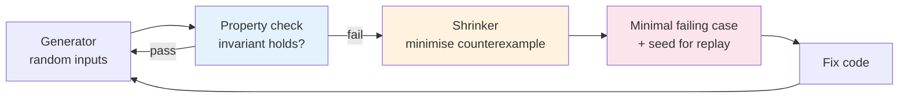
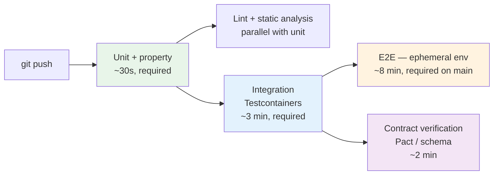

# Chapter 1 — Testing Strategy: Unit, Integration, E2E, and Property-Based Testing

**What this chapter covers.** Shipping backend services without a coherent testing strategy is an exercise in borrowed confidence — everything works until it does not, and when it breaks the failure is discovered by users, not by your pipeline. This chapter builds that strategy from first principles: how to choose between unit, integration, and end-to-end tests, where property-based testing fits, and how to compose them into a fast, reliable, economically rational suite that catches real bugs without suffocating delivery. Every pattern is grounded in runnable framework code across Go, Python, and TypeScript/JVM.

Learning goals — after this chapter you should be able to:

- Apply the testing pyramid, diamond, and trophy models to decide the mix of test types for a backend service and articulate the trade-offs of each.
- Write effective unit tests that maximise defect signal and minimise coupling to implementation detail, using table-driven and parametrized patterns.
- Design integration tests that exercise real dependencies via Testcontainers and transactional fixtures without sacrificing isolation or speed.
- Scope end-to-end tests to the critical paths that justify their cost, and make them deterministic in ephemeral environments.
- Use property-based testing (Hypothesis, fast-check, jqwik/gopter) to uncover edge cases that example-based tests miss, including stateful and invariant-driven scenarios.
- Diagnose and eliminate flakiness, measure what coverage actually tells you, and wire the suite into CI for fast, parallel, and actionable feedback.

---

## Why strategy matters more than coverage

### The confidence curve

A test suite provides two things: **defect detection** (does it catch bugs before users do?) and **change confidence** (can you refactor without fear?). Coverage alone guarantees neither. A service can report 92% line coverage while exercising every line with assertions so weak they would pass if the implementation returned a constant. Conversely, a suite with 60% coverage but strong invariant checks on the core domain can be far more trustworthy.

Strategy is the deliberate allocation of testing effort across three competing axes:

| Axis | Question it answers |
|------|---------------------|
| **Scope** | How much of the system does a single test exercise? (one function vs. the whole deployed stack) |
| **Fidelity** | How close is the test environment to production? (in-memory fake vs. real Postgres on the same version) |
| **Cost** | How long does the test take, how often does it flake, and how hard is it to diagnose when it fails? |

Optimising one axis without regard for the others produces pathological suites: all-unit suites that miss wiring bugs, all-E2E suites that take an hour and flake on every third run, or all-integration suites that pass locally and fail in CI because of implicit ordering.

### The distributed-systems lens

In a monolith, most defects live inside a single process. In a service graph with dozens of deployables, the dominant defect classes shift outward: serialisation mismatches, eventual-consistency windows, retry storms, partial failures, and configuration drift between environments. A strategy tuned only for in-process logic will systematically miss the failures that page you at 03:00. Every section below therefore calls out where distributed concerns alter the calculus.

---

## The pyramid, the diamond, and the trophy

No single geometric metaphor is universally correct, but each captures a useful default distribution of effort.

```mermaid
flowchart TB
    subgraph Pyramid["Testing Pyramid — traditional backend service"]
        P_E2E["E2E — few, critical paths<br/>slow, high fidelity, high cost"]
        P_INT["Integration — moderate<br/>real deps via Testcontainers"]
        P_UNIT["Unit — many, fast, isolated<br/>domain logic, pure functions"]
        P_E2E --> P_INT --> P_UNIT
    end
    subgraph Diamond["Testing Diamond — service with rich API surface"]
        D_E2E2["E2E — few"]
        D_INT2["Integration — many<br/>API + DB + queue contracts"]
        D_UNIT2["Unit — moderate"]
        D_E2E2 --> D_INT2 --> D_UNIT2
    end
    subgraph Trophy["Testing Trophy — frontend-heavy or BFF"]
        T_E2E3["E2E — moderate"]
        T_INT3["Integration — many"]
        T_UNIT3["Unit — fewer<br/>thin domain layer"]
        T_E2E3 --> T_INT3 --> T_UNIT3
    end
    style P_UNIT fill:#e8f5e9
    style D_INT2 fill:#e3f2fd
    style T_INT3 fill:#fff3e0
```



*Figure 1-1: Three portfolio shapes. The pyramid is the default for domain-rich backend services. The diamond fits services whose primary complexity is at integration boundaries (API gateways, orchestrators). The trophy, popularised by Kent C. Dodds, suits UI-heavy stacks. Most backend portfolios should look like a pyramid or a diamond — not an ice-cream cone (inverted pyramid) where slow E2E tests dominate.*

| Shape | Unit | Integration | E2E | When it fits |
|-------|------|-------------|-----|--------------|
| **Pyramid** | ~70% | ~20% | ~10% | Domain-rich services with substantial business logic. |
| **Diamond** | ~30% | ~50% | ~20% | Integration-heavy services: gateways, BFFs, orchestration layers where wiring is the risk. |
| **Trophy** | ~20% | ~50% | ~30% | UI-heavy or contract-heavy stacks; less common for pure backend but relevant for full-stack teams. |
| **Ice-cream cone (anti-pattern)** | ~10% | ~20% | ~70% | Manual QA culture that automated E2E without investing in lower layers — slow, flaky, expensive. |

The right shape follows the **risk distribution**. If most production incidents trace to domain-logic regressions, invest in unit and property tests. If they trace to contract drift between teams, shift weight toward integration and contract tests (Chapter 2). If they trace to deployment and environment misconfiguration, you need E2E against production-like environments — there is no cheaper substitute.

A useful heuristic: for each recent incident, ask *what is the cheapest layer that would have caught it?* Aggregate over a quarter. The answer is your target portfolio.

---

## Unit testing done well

### What a unit test is — and is not

A unit test exercises a **unit of behaviour**, not necessarily a unit of code. The distinction matters: testing a class in isolation by mocking every collaborator produces tests that are tightly coupled to the implementation's decomposition rather than its observable behaviour. When you refactor the internals without changing behaviour, those tests break — a false signal that erodes trust in the suite.

Effective unit tests share three properties:

1. **Isolated reason to fail.** One behavioural expectation per test (or per assertion group), so a failure points directly to the violated invariant.
2. **Deterministic and fast.** No network, no clock, no filesystem, no real time. Milliseconds, not seconds. Capable of running thousands in parallel.
3. **Resilient to refactoring.** Assertions target observable behaviour (return values, emitted events, state transitions), not internal call sequences — unless the call sequence *is* the contract (see Chapter 2 on mockist testing).

### Frameworks and idioms

**Go — table-driven tests with `testing` + `testify`:**

```go
// internal/pricing/discount_test.go
package pricing

import (
    "testing"

    "github.com/stretchr/testify/assert"
    "github.com/stretchr/testify/require"
)

func TestApplyDiscount(t *testing.T) {
    tests := []struct {
        name     string
        price    int64 // cents
        code     string
        want     int64
        wantErr  bool
    }{
        {"no code returns original price", 10000, "", 10000, false},
        {"10 percent off", 10000, "SAVE10", 9000, false},
        {"fixed 500 off", 10000, "FLAT500", 9500, false},
        {"discount cannot go negative", 300, "FLAT500", 0, false},
        {"unknown code is error", 10000, "BOGUS", 0, true},
        {"empty price is error", 0, "SAVE10", 0, true},
        {"rounding half cent up", 199, "SAVE10", 179, false},
    }
    for _, tc := range tests {
        t.Run(tc.name, func(t *testing.T) {
            got, err := ApplyDiscount(tc.price, tc.code)
            if tc.wantErr {
                require.Error(t, err)
                return
            }
            require.NoError(t, err)
            assert.Equal(t, tc.want, got)
        })
    }
}

// Subtests run in parallel when safe:
func TestApplyDiscount_Parallel(t *testing.T) {
    t.Parallel()
    // same table — each t.Run can call t.Parallel() inside for fan-out
}

// Golden-file test for complex output (e.g., generated SQL or JSON):
func TestRenderInvoice_Golden(t *testing.T) {
    inv := Invoice{ID: "inv-42", Lines: []Line{{SKU: "widget", Qty: 3, UnitPrice: 1200}}}
    got := RenderInvoice(inv)
    // testdata/invoice.golden is checked in; update with UPDATE_GOLDEN=1 go test ./...
    assertGolden(t, "testdata/invoice.golden", got)
}
```

**Python — `pytest` with parametrize, fixtures, and `freezegun`:**

```python
# tests/test_pricing.py
import pytest
from decimal import Decimal
from freezegun import freeze_time

from app.pricing import apply_discount, DiscountExpired

@pytest.mark.parametrize("price,code,expected", [
    (Decimal("100.00"), "", Decimal("100.00")),
    (Decimal("100.00"), "SAVE10", Decimal("90.00")),
    (Decimal("3.00"), "FLAT5", Decimal("0.00")),   # floor at zero
    (Decimal("1.99"), "SAVE10", Decimal("1.79")),   # rounding
])
def test_apply_discount_examples(price, code, expected):
    assert apply_discount(price, code) == expected

def test_unknown_code_raises():
    with pytest.raises(ValueError, match="unknown discount"):
        apply_discount(Decimal("100.00"), "BOGUS")

@freeze_time("2026-08-20")
def test_expired_code_raises():
    # Discount validity depends on wall-clock time — freeze it for determinism
    with pytest.raises(DiscountExpired):
        apply_discount(Decimal("100.00"), "SUMMER25")  # expired 2026-07-31

# Fixture scoping — prefer function scope for isolation; use module/session
# only for expensive, immutable setup (e.g., compiled regex, loaded fixtures).
@pytest.fixture
def catalog():
    return {"widget": Decimal("12.00"), "gadget": Decimal("45.00")}
```

**Java/Kotlin — JUnit 5 with `@ParameterizedTest`:**

```java
// src/test/java/com/example/pricing/DiscountTest.java
@DisplayName("ApplyDiscount")
class DiscountTest {

    @ParameterizedTest(name = "{0}: {1} with {2} -> {3}")
    @CsvSource({
        "no code,       10000, '',      10000",
        "10 percent,    10000, SAVE10,   9000",
        "floor at zero,   300, FLAT500,     0",
    })
    void examples(String label, long priceCents, String code, long expected) {
        assertEquals(expected, Pricing.applyDiscount(priceCents, code));
    }

    @Test
    void unknownCodeThrows() {
        assertThrows(UnknownDiscountException.class,
            () -> Pricing.applyDiscount(10_000, "BOGUS"));
    }
}
```

### What not to mock

A common failure mode is mocking everything that is not the system under test, including stable, deterministic collaborators (value objects, mappers, pure functions). This couples tests to interaction details and hides real behaviour. Prefer to use real instances of:

- Value objects and domain entities.
- Pure functions and mappers.
- In-memory implementations of ports (see Chapter 2 — fakes over mocks).

Reserve test doubles for **volatile or slow dependencies**: clocks, random generators, network clients, filesystems, and databases that would make the test non-deterministic or slow. Even there, prefer fakes and stubs over mocks (Chapter 2).

### Coverage as a signal, not a target

Line coverage tells you what was *executed*, not what was *verified*. Enforcing a single global threshold (e.g., "80% or the build fails") incentivises tests that execute code without asserting anything meaningful. More useful approaches:

- **Diff coverage** — require that *new or changed lines* are covered, which focuses review attention where risk is highest.
- **Mutation testing** (PIT for JVM, `mutmut`/`cosmic-ray` for Python, `go-mutesting`) — injects small faults and checks whether the suite catches them. A high mutation score is stronger evidence than high line coverage.
- **Branch and condition coverage** for critical paths (pricing, auth, financial calculations) rather than the whole codebase.

```bash
# Go — coverage with diff gating
go test ./... -coverprofile=cover.out -covermode=atomic
go tool cover -func=cover.out | tail -20
# Diff coverage (requires diff-cover or similar)
diff-cover cover.out --compare-branch=main --fail-under=90

# Python — branch coverage + mutation spot-check
pytest --cov=app --cov-branch --cov-report=term-missing
mutmut run --paths-to-mutate app/pricing.py
mutmut junitxml > mutmut-results.xml

# JVM — JaCoCo + PIT
./gradlew test jacocoTestReport pitest
```

---

## Integration testing

Integration tests verify that two or more real components collaborate correctly — your code against a real database, a real queue, or a real HTTP dependency running in a realistic configuration. They are the workhorse of the diamond and the critical complement to unit tests in any distributed system.

### Why fakes are not enough

An in-memory fake of Postgres will happily accept `VARCHAR(999999)` and ignore your `CHECK` constraints, your `ON CONFLICT` clauses, and your `SELECT ... FOR UPDATE` locking semantics. The bug that reaches production is precisely the one where the fake and the real system diverge. Integration tests close that gap by running the real dependency — ideally the same container image you run in production.

### Testcontainers: real dependencies, hermetic lifecycle

[Testcontainers](https://testcontainers.com/) manages Docker containers as test fixtures with automatic lifecycle, port mapping, and readiness wait strategies. It is available for Go, Java, Python, Node, and .NET.

**Go — Postgres + Redis with Testcontainers:**

```go
// internal/store/postgres_test.go
package store

import (
    "context"
    "testing"

    "github.com/jackc/pgx/v5/pgxpool"
    "github.com/stretchr/testify/require"
    "github.com/testcontainers/testcontainers-go"
    "github.com/testcontainers/testcontainers-go/modules/postgres"
    "github.com/testcontainers/testcontainers-go/wait"
)

func newTestDB(t *testing.T) *pgxpool.Pool {
    t.Helper()
    ctx := context.Background()

    ctr, err := postgres.Run(ctx, "postgres:16-alpine",
        postgres.WithDatabase("testdb"),
        postgres.WithUsername("test"),
        postgres.WithPassword("test"),
        testcontainers.WithWaitStrategy(
            wait.ForLog("database system is ready to accept connections").
                WithOccurrence(2),
        ),
    )
    require.NoError(t, err)
    t.Cleanup(func() { _ = ctr.Terminate(ctx) })

    dsn, err := ctr.ConnectionString(ctx, "sslmode=disable")
    require.NoError(t, err)

    pool, err := pgxpool.New(ctx, dsn)
    require.NoError(t, err)
    t.Cleanup(pool.Close)

    // Run migrations against the real DB — catches migration bugs early
    require.NoError(t, Migrate(ctx, pool))

    return pool
}

func TestOrders_CreateAndGet(t *testing.T) {
    pool := newTestDB(t)
    repo := NewOrderRepo(pool)

    ctx := context.Background()
    id, err := repo.Create(ctx, Order{CustomerID: "cust-1", TotalCents: 9900})
    require.NoError(t, err)

    got, err := repo.Get(ctx, id)
    require.NoError(t, err)
    require.Equal(t, int64(9900), got.TotalCents)

    // Verify constraint behaviour against the real engine
    _, err = repo.Create(ctx, Order{CustomerID: "", TotalCents: -1})
    require.Error(t, err, "CHECK constraint should reject negative total")
}
```

**Python — Postgres with `testcontainers-python`:**

```python
# tests/test_orders.py
import pytest
from testcontainers.postgres import PostgresContainer
from sqlalchemy import create_engine, text

@pytest.fixture(scope="module")
def pg_url():
    with PostgresContainer("postgres:16-alpine") as pg:
        yield pg.get_connection_url()

@pytest.fixture
def db(pg_url):
    engine = create_engine(pg_url)
    # Run Alembic migrations programmatically
    from alembic.config import Config
    from alembic import command
    command.upgrade(Config("alembic.ini"), "head")
    yield engine
    # Transaction rollback isolation — each test runs in a transaction
    # that is rolled back, so tests do not interfere

def test_create_and_get_order(db):
    with db.begin() as conn:
        conn.execute(text(
            "INSERT INTO orders (id, customer_id, total_cents) VALUES ('o1','c1',9900)"
        ))
        row = conn.execute(text("SELECT total_cents FROM orders WHERE id='o1'")).one()
        assert row.total_cents == 9900
```

### Transaction rollback and test isolation

The dominant cost of DB integration tests is *isolation* — ensuring one test's writes do not pollute the next. Three strategies, in order of preference:

1. **Transaction wrapping** — each test runs inside a transaction that is rolled back at the end. Fastest, but does not work if the code under test manages its own transactions (nested transaction semantics differ across engines).
2. **Truncate / delete** — clean tables between tests. Simple and reliable, but slower as data grows.
3. **Ephemeral database per test** — a fresh container or schema per test. Strongest isolation, highest cost. Use for migration tests or when transaction wrapping is infeughtable.

For queue and cache dependencies (Kafka via `apache/kafka-native`, Redis, LocalStack for AWS), the same container-per-suite pattern applies — one container per test *suite* (module), not per test case, with logical isolation (unique topic names, key prefixes) per test.

### Contract-aware integration tests

Not every integration test should hit the real downstream service. When the downstream is owned by another team, has side effects, or is expensive to provision, the right tool is a **contract test** — covered in depth in Chapter 2. As a rule: if you control both sides and can run the dependency as a container, use a real integration test; if you do not control the other side, use a contract test with a recorded or stubbed double.

---

## End-to-end testing

E2E tests exercise the deployed system through its public interfaces — HTTP, gRPC, or UI — and assert on observable outcomes. They answer the question that no lower-layer test can: *does the assembled system, with real configuration, networking, and data, actually do what the user asked?*

### Scoping E2E ruthlessly

E2E tests are the most valuable and the most expensive tests you will write. Each one costs:

- **Time** — seconds to minutes per test (environment provisioning, network hops, eventual consistency windows).
- **Flakiness surface** — every real dependency is a source of non-determinism (DNS, TLS, clock skew, GC pauses, downstream timeouts).
- **Diagnosis cost** — when an E2E test fails, the failure could be in any layer; triage is harder than for a unit test that points to one function.

The implication is to keep the E2E suite **small and critical-path-only**. A useful filter: *if this path breaks, do we page?* If yes, it deserves an E2E test. If no, a lower-layer test is more economical. For a typical backend service this means on the order of 10–30 E2E scenarios, not hundreds.

| E2E-worthy path | Why lower layers cannot cover it |
|-----------------|----------------------------------|
| User registration → email verification → first purchase | Crosses auth, email, payment, and inventory services; wiring and config errors hide in the gaps. |
| Idempotent retry of a payment after network partition | Requires real retry/timeout behaviour and real queue semantics. |
| Multi-region failover of a read path | Only observable against the real topology with real DNS and load balancer config. |

### Ephemeral environments and determinism

Modern E2E practice provisions a **short-lived environment per branch or per run** rather than sharing a long-lived staging cluster. Tools such as ephemeral Kubernetes namespaces, `kind`/`k3d`, or cloud preview environments give each run an isolated data plane.

Determinism techniques for E2E:

- **Seeded data** — deterministic seed scripts rather than shared mutable fixtures.
- **Clock control** — inject a clock interface; in E2E, run with real time but assert with bounded windows (`eventually` with timeout) rather than exact equality.
- **Idempotent setup** — every E2E test creates the data it needs and cleans up (or runs in an isolated namespace that is torn down).
- **Retriable assertions** — for eventually consistent reads, poll with backoff rather than asserting immediately.

**TypeScript — Playwright API E2E against an ephemeral stack:**

```typescript
// e2e/checkout.spec.ts
import { test, expect } from '@playwright/test';

const BASE = process.env.BASE_URL!; // e.g., https://pr-4823.preview.example.com

test.describe('checkout critical path', () => {
  // Each test gets a fresh customer to avoid cross-test pollution
  async function createCustomer(request: any) {
    const res = await request.post(`${BASE}/v1/customers`, {
      data: { email: `e2e-${Date.now()}@example.com`, name: 'E2E Tester' },
    });
    expect(res.ok()).toBeTruthy();
    return res.json();
  }

  test('customer can add to cart and checkout', async ({ request }) => {
    const customer = await createCustomer(request);

    // Add to cart
    const cartRes = await request.post(`${BASE}/v1/cart`, {
      data: { product_id: 'sku-1001', quantity: 1 },
      headers: { Authorization: `Bearer ${customer.token}` },
    });
    expect(cartRes.status()).toBe(201);
    const { cart_id } = await cartRes.json();

    // Checkout — assert on polling for eventual confirmation
    const checkoutRes = await request.post(`${BASE}/v1/checkout`, {
      data: { cart_id, payment_method: 'card_token_test' },
      headers: { Authorization: `Bearer ${customer.token}` },
    });
    expect(checkoutRes.status()).toBe(202); // async processing
    const { order_id } = await checkoutRes.json();

    // Poll order status — eventually consistent
    await expect.poll(async () => {
      const r = await request.get(`${BASE}/v1/orders/${order_id}`, {
        headers: { Authorization: `Bearer ${customer.token}` },
      });
      const body = await r.json();
      return body.status;
    }, { timeout: 30_000, intervals: [500, 1000, 2000] }).toBe('confirmed');
  });

  test('idempotent retry does not double-charge', async ({ request }) => {
    const customer = await createCustomer(request);
    const idempotencyKey = `e2e-${Date.now()}`;

    const attempt = () =>
      request.post(`${BASE}/v1/checkout`, {
        data: { cart_id: 'cart-seeded-for-retry', payment_method: 'card_token_test' },
        headers: {
          Authorization: `Bearer ${customer.token}`,
          'Idempotency-Key': idempotencyKey,
        },
      });

    const [r1, r2] = await Promise.all([attempt(), attempt()]);
    // Both should succeed; only one charge should exist — verify via downstream
    expect(r1.status()).toBe(202);
    expect(r2.status()).toBe(202);

    const charges = await request.get(`${BASE}/v1/charges?key=${idempotencyKey}`, {
      headers: { Authorization: `Bearer ${customer.token}` },
    });
    const body = await charges.json();
    expect(body.charges).toHaveLength(1);
  });
});
```

**Running E2E in CI (GitHub Actions — ephemeral `kind` cluster):**

```yaml
# .github/workflows/e2e.yaml
name: e2e
on: { pull_request: {} }
jobs:
  e2e:
    runs-on: ubuntu-latest
    steps:
      - uses: actions/checkout@v4
      - name: Create kind cluster
        uses: helm/kind-action@v1
        with: { cluster_name: "e2e-${{ github.run_id }}" }
      - name: Deploy stack
        run: |
          helm upgrade --install app ./charts/app \
            --set image.tag=${{ github.sha }} \
            --set ingress.host=app.127.0.0.1.nip.io \
            --wait --timeout 3m
          kubectl wait --for=condition=available deploy/app --timeout=120s
      - name: Seed data
        run: ./scripts/seed-e2e.sh
      - name: Run E2E
        run: npx playwright test --reporter=html
        env: { BASE_URL: "http://app.127.0.0.1.nip.io" }
      - uses: actions/upload-artifact@v4
        if: failure()
        with: { name: playwright-report, path: playwright-report/ }
```

---

## Property-based testing

Example-based tests assert that *these specific inputs produce these specific outputs*. Property-based tests (PBT) assert that *for all inputs satisfying a precondition, some invariant holds* — and then check that claim against hundreds of randomly generated inputs, shrinking any failure to the minimal counterexample.

PBT is the single most effective technique for finding edge cases that humans do not think to write examples for: off-by-one boundaries, empty collections, Unicode, negative zero, integer overflow, reordered events, and duplicated messages.

### Properties, generators, and shrinking

Three concepts underpin every PBT framework:

- **Property** — a Boolean predicate over one or more inputs (e.g., "decoding the encoding is the identity" or "the output is sorted").
- **Generator (strategy/arbitrary)** — a recipe for producing random inputs, often with distribution controls (e.g., "small integers more often than large ones; empty strings with 5% probability").
- **Shrinking** — when a property fails, the framework searches for the *smallest* input that still fails, turning a 200-character random string into a 1-character reproducer you can reason about.



*Figure 1-2: The property-based testing loop. Generators explore the input space; the shrinker reduces failures to their essence; the seed makes every failure reproducible.*

### Common property patterns for backend code

| Pattern | Property | Example |
|---------|----------|---------|
| **Round-trip** | `decode(encode(x)) == x` | Serialisation, compression, encryption, Base64, protobuf. |
| **Idempotence** | `f(f(x)) == f(x)` | Normalisation, deduplication, set insertion. |
| **Commutativity / associativity** | `f(a,b) == f(b,a)` | Merge functions, CRDTs, aggregation. |
| **Model-based (oracle)** | `SUT(x) == model(x)` | Compare optimised implementation against a brute-force reference. |
| **Metamorphic** | Relation between outputs for related inputs | Sorting: permuting input does not change sorted output. |
| **Invariant preservation** | `invariant(state); op(state); invariant(state)` | State machines: balances never negative, queues never lose messages. |
| **Error never throws** | `f(x)` does not panic for any `x` in domain | Fuzz-like robustness: parsers, decoders, regex. |

### Python — Hypothesis

```python
# tests/test_properties.py
from hypothesis import given, strategies as st, settings, example, HealthCheck
from hypothesis.stateful import RuleBasedStateMachine, rule, invariant, Bundle

from app.codec import encode, decode
from app.pricing import apply_discount
from app.sorting import merge_sorted  # merge two sorted lists

# 1. Round-trip: encode/decode are inverses
@given(st.binary(min_size=0, max_size=1024))
def test_codec_round_trip(payload: bytes):
    assert decode(encode(payload)) == payload

# 2. Metamorphic: sorting is stable under permutation
@given(st.lists(st.integers()))
def test_merge_sorted_is_sorted(xs):
    ys = sorted(xs)
    # merge_sorted expects two sorted halves
    mid = len(ys) // 2
    got = merge_sorted(ys[:mid], ys[mid:])
    assert got == sorted(xs)
    assert all(got[i] <= got[i+1] for i in range(len(got)-1))

# 3. Invariant with business rule: discount never produces negative price
@given(
    price_cents=st.integers(min_value=0, max_value=10_000_00),
    code=st.sampled_from(["", "SAVE10", "FLAT500", "HALF"]),
)
def test_discount_never_negative(price_cents, code):
    result = apply_discount(price_cents, code)
    assert result >= 0
    assert result <= price_cents  # discount never increases price

# 4. Stateful: shopping cart never loses items, total is sum of lines
class CartMachine(RuleBasedStateMachine):
    items = Bundle("items")

    def __init__(self):
        super().__init__()
        from app.cart import Cart
        self.cart = Cart()
        self.model: dict[str, int] = {}  # sku -> qty (oracle)

    @rule(sku=st.text(min_size=1, max_size=8), qty=st.integers(1, 10), target=items)
    def add(self, sku, qty, target=None):
        self.cart.add(sku, qty)
        self.model[sku] = self.model.get(sku, 0) + qty
        return sku

    @rule(sku=items)
    def remove(self, sku):
        self.cart.remove(sku)
        self.model.pop(sku, None)

    @invariant()
    def totals_match(self):
        assert self.cart.total_qty() == sum(self.model.values())

    @invariant()
    def no_negative_qty(self):
        for qty in self.model.values():
            assert qty > 0

TestCart = CartMachine.TestCase

# Reproducibility — Hypothesis prints the failing seed; replay with:
# @reproduce_failure('6.110.0', b'AXic...')
# Deterministic CI: set --hypothesis-seed via environment or database backend
```

**Configuration for CI determinism:**

```python
# conftest.py or hypothesis profile
from hypothesis import settings, HealthCheck

settings.register_profile("ci", max_examples=500, deadline=500,
                          suppress_health_check=[HealthCheck.too_slow])
settings.register_profile("dev", max_examples=50, deadline=None)
# Select via:  HYPOTHESIS_PROFILE=ci pytest
```

### TypeScript — fast-check

```typescript
// tests/codec.property.test.ts
import fc from 'fast-check';
import { encode, decode } from '../src/codec';
import { applyDiscount } from '../src/pricing';

describe('properties', () => {
  test('codec round-trip', () => {
    fc.assert(fc.property(fc.uint8Array({ maxLength: 1024 }), (payload) => {
      expect(decode(encode(payload))).toEqual(payload);
    }));
  });

  test('discount is in [0, price]', () => {
    fc.assert(fc.property(
      fc.integer({ min: 0, max: 10_000_00 }),
      fc.constantFrom('', 'SAVE10', 'FLAT500', 'HALF'),
      (price, code) => {
        const got = applyDiscount(price, code);
        expect(got).toBeGreaterThanOrEqual(0);
        expect(got).toBeLessThanOrEqual(price);
      },
    ));
  });

  // Stateful / model-based: compare against a naive reference
  test('mergeSorted matches naive sort', () => {
    fc.assert(fc.property(fc.array(fc.integer()), (xs) => {
      const ys = [...xs].sort((a, b) => a - b);
      const mid = Math.floor(ys.length / 2);
      const got = mergeSorted(ys.slice(0, mid), ys.slice(mid));
      expect(got).toEqual([...xs].sort((a, b) => a - b));
    }));
  });
});
```

### Go — `testing/quick` and `gopter`

Go's standard `testing/quick` is minimal; for richer shrinking and stateful testing, `gopter` is the community choice:

```go
// pricing/quick_test.go
package pricing

import (
    "testing"
    "testing/quick"

    "github.com/leanovate/gopter"
    "github.com/leanovate/gopter/gen"
    "github.com/leanovate/gopter/prop"
)

func TestDiscountNeverNegative_Quick(t *testing.T) {
    f := func(price int64, code int) bool {
        codes := []string{"", "SAVE10", "FLAT500", "HALF"}
        got, err := ApplyDiscount(price, codes[code%len(codes)])
        if err != nil {
            return true // unknown code is not the property under test
        }
        return got >= 0 && got <= price
    }
    if err := quick.Check(f, &quick.Config{MaxCount: 1000}); err != nil {
        t.Error(err)
    }
}

func TestDiscountNeverNegative_Gopter(t *testing.T) {
    params := gopter.DefaultTestParameters()
    params.MinSuccessfulTests = 1000
    props := gopter.NewProperties(params)

    props.Property("discount in [0, price]", prop.ForAll(
        func(price int64) bool {
            got, _ := ApplyDiscount(price, "SAVE10")
            return got >= 0 && got <= price
        },
        gen.Int64Range(0, 10_000_00),
    ))
    props.TestingRun(t)
}
```

### When to reach for PBT

PBT is not a replacement for example-based tests — it is a complement. Use it when:

- The input space is large and human-chosen examples cluster in the "happy" region (parsers, encoders, numeric code, collection manipulation).
- An **oracle or metamorphic relation** exists that is simpler than the implementation (reference sort, brute-force solver, algebraic identity).
- State transitions must preserve invariants across arbitrary sequences (shopping cart, ledger, CRDT, connection pool).

Do not use PBT where the property is as complex as the implementation itself — you will just duplicate bugs. In those cases, invest in example-based tests with carefully chosen boundaries and a fake oracle where possible.

---

## Flakiness, coverage, and CI

### Flaky tests are a reliability bug in the suite

A flaky test — one that passes and fails non-deterministically on the same code — is more damaging than a missing test. It trains the team to ignore red builds, to re-run CI until green, and eventually to disable the suite. Treat flakiness as a P1 defect in the test infrastructure.

Common root causes and fixes:

| Cause | Symptom | Fix |
|-------|---------|-----|
| **Wall-clock dependence** | Fails near midnight, on slow CI, or after DST transition | Inject a `Clock` interface; use `freezegun`/`clockwork`/`timecop`. Never call `time.Now()` directly in domain code. |
| **Unordered collections** | Map iteration order assumed stable | Sort before asserting; use `assert.ElementsMatch` / `assertSameElements`. |
| **Shared mutable state** | Passes in isolation, fails when run with the suite | Isolate per test (transaction rollback, unique keys, temp dirs). Run with `-count=1 -p 1` to bisect. |
| **Real network / sleep** | Timing-dependent assertions, `time.Sleep` in tests | Replace with deterministic synchronisation (`sync.WaitGroup`, channel, `eventually` poller). Never sleep and hope. |
| **Resource exhaustion** | Fails under parallel execution | Limit parallelism for contended resources; use `t.Setenv`, not `os.Setenv`, in Go parallel tests. |

Quarantine policy: when a test flakes, immediately mark it as quarantined (e.g., `t.Skip` with a tracking issue, or a `quarantine` tag that excludes it from the required status check) and file an issue. Do not leave it in the required path while "someone looks at it."

### Making the suite fast and actionable



*Figure 1-3: A staged pipeline. Fast, deterministic stages gate every commit; slower, higher-fidelity stages gate merge to main. E2E and contract verification run in parallel with integration where possible to minimise wall-clock time.*

Practical CI optimisations:

- **Parallelise by package/suite**, not just by test file — `go test ./... -p 8`, `pytest -n auto` (pytest-xdist), `jest --maxWorkers=50%`.
- **Shard E2E** — `playwright --shard=1/3` across three runners with merge of the HTML report.
- **Test impact analysis** — run only the tests affected by changed files (Bazel, `go test` with `gotestsum -- -run`, `jest --changedSince=main`). Gate with full suite on main.
- **Fail fast with useful output** — `gotestsum --format testname`, `pytest -v --tb=short`, `pact` diff output. A failure should tell the reader *what invariant broke* without re-running.
- **Hermetic caching** — cache Go module downloads, Docker layers for Testcontainers images, and Hypothesis's `.hypothesis` database across runs.

```yaml
# .github/workflows/ci.yaml (excerpt — unit + integration + property)
jobs:
  unit:
    runs-on: ubuntu-latest
    steps:
      - uses: actions/checkout@v4
      - uses: actions/setup-go@v5
        with: { go-version: '1.22' }
      - run: go test ./... -count=1 -race -coverprofile=cover.out -short
      - run: go tool cover -func=cover.out

  integration:
    runs-on: ubuntu-latest
    steps:
      - uses: actions/checkout@v4
      - uses: actions/setup-go@v5
        with: { go-version: '1.22' }
      - run: go test ./... -count=1 -race -run Integration -tags=integration
        env: { TESTCONTAINERS_RYUK_DISABLED: "false" }

  python-properties:
    runs-on: ubuntu-latest
    steps:
      - uses: actions/checkout@v4
      - uses: actions/setup-python@v5
        with: { python-version: '3.12' }
      - run: pip install -r requirements-dev.txt
      - run: HYPOTHESIS_PROFILE=ci pytest --cov=app --cov-branch -q
```

---

## Key takeaways

- Strategy is allocation of effort across scope, fidelity, and cost. The right portfolio shape (pyramid, diamond, trophy) follows the distribution of production risk — audit recent incidents to choose.
- Unit tests should target *behaviour*, not implementation decomposition. Table-driven and parametrized tests, golden files, and deterministic clocks produce suites that are fast, parallel, and resilient to refactoring.
- Integration tests earn their keep by exercising real dependencies (Testcontainers for Postgres, Redis, Kafka, LocalStack) with disciplined isolation via transaction rollback or ephemeral containers.
- E2E tests are high-value and high-cost — scope them to the critical paths that justify an ephemeral environment, and make them deterministic with seeded data, idempotent setup, and retriable assertions.
- Property-based testing explores input spaces humans do not. Round-trip, metamorphic, model-based, and invariant properties — with shrinking and seeded replay — catch the edge cases that example-based tests systematically miss.
- Flakiness is a defect in the suite, not an annoyance. Quarantine, root-cause, and fix. Coverage is a signal about *execution*, not *verification* — complement it with diff coverage and mutation testing.
- Wire the portfolio into a staged, parallel CI pipeline so that fast feedback gates every commit and high-fidelity checks gate merge to main without making the pipeline itself the bottleneck.

## Further reading

- Mike Cohn — *Succeeding with Agile: Software Development Using Scrum* (2009) — the original testing pyramid.
- Kent C. Dodds — "The Testing Trophy and Testing Classifications" (2019) — https://kentcdodds.com/blog/the-testing-trophy-and-testing-classifications
- Martin Fowler — "Test Pyramid" (2012) and "Eradicating Non-Determinism in Tests" (2011) — https://martinfowler.com/articles/practical-test-pyramid.html
- Jessica Kerr — "Unit Tests Are Tests of Modular Units" — https://jessitron.com/2017/11/11/unit-tests-are-tests-of-modular-units/
- Hypothesis documentation — https://hypothesis.readthedocs.io/ — strategies, stateful testing, and profiles.
- fast-check documentation — https://fast-check.dev/ — property-based testing for TypeScript/JavaScript.
- Testcontainers — https://testcontainers.com/ and https://golang.testcontainers.org/ — hermetic dependency fixtures.
- Playwright — https://playwright.dev/docs/intro — API and UI E2E testing.
- Vladimir Khorikov — *Unit Testing: Principles, Practices, and Patterns* (Manning, 2020) — classical vs. mockist schools, test-induced damage.
- Nicolas Carlo et al. — "How to Specify It! A Guide to Writing Properties of Pure Functions" — patterns for deriving properties from specifications.

---

*Next: Chapter 2 — Contract Testing, Test Doubles, and Testability — where the focus shifts from testing a single service to testing the seams between services, the doubles that isolate them, and the design choices that make both possible.*
