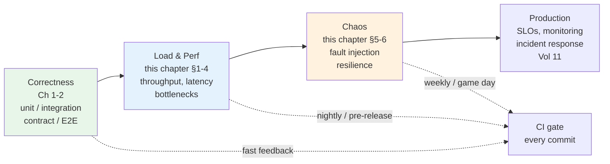
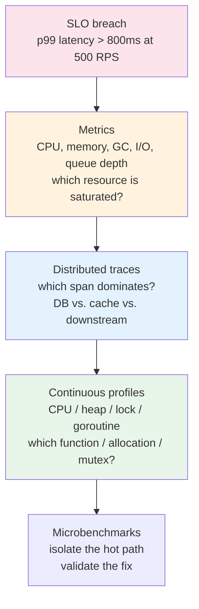
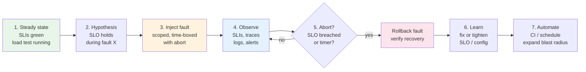
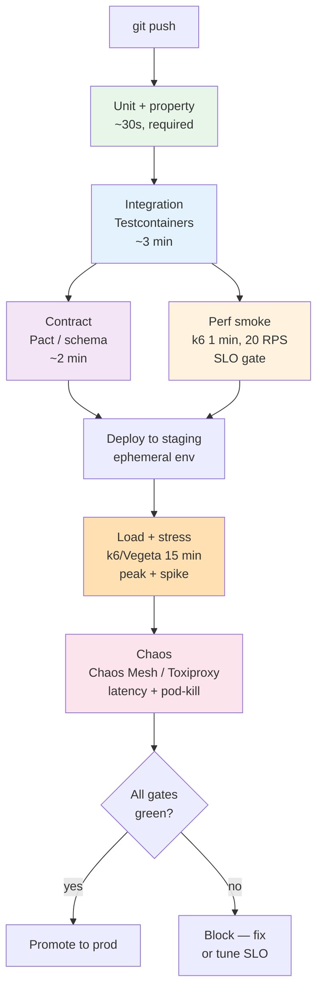
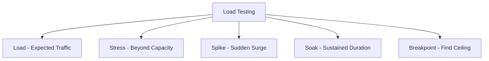
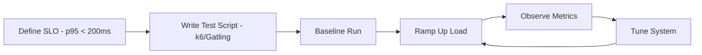
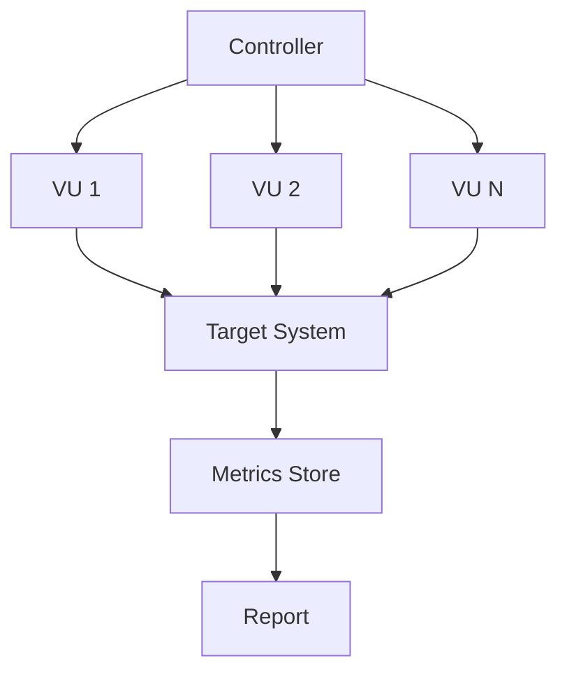

# Chapter 3 — Load, Performance, and Chaos Testing

**What this chapter covers.** Correctness is necessary but not sufficient — a service that returns the right answer in 50 ms for one request and 8 seconds for the thousandth concurrent request is failing its users just as surely as one that returns the wrong answer. This chapter covers the three disciplines that verify behaviour under pressure: load testing (can the system handle expected traffic?), performance testing (where are the bottlenecks and what are the limits?), and chaos testing (does the system degrade gracefully when the infrastructure misbehaves?). You will learn workload modelling, k6/Vegeta/Gatling in depth, profiling-driven performance analysis, chaos experiment design with Chaos Mesh and Litmus, and how to wire all three into CI and production safely. Every technique is grounded in runnable configs and real experiment definitions.

Learning goals — after this chapter you should be able to:

- Distinguish load, stress, spike, soak, breakpoint, and performance testing, and choose the right type for a given risk or SLO question.
- Model realistic workloads from production traffic, choose between open and closed arrival models, and avoid the statistical pitfalls that invalidate results.
- Write, run, and interpret k6, Vegeta, and Gatling tests with thresholds, checks, and SLI-aligned pass/fail gates — including distributed execution.
- Apply profiling (CPU, heap, lock, I/O), distributed tracing, and queueing theory to diagnose performance bottlenecks and validate fixes.
- Design, scope, and safely execute chaos experiments — from blast-radius-limited staging drills to production game days — using Chaos Mesh, Litmus, or Toxiproxy.
- Integrate load, performance, and chaos testing into CI/CD and production readiness with environment isolation, automated gates, and observability.

---

## Why "it works" is not enough

### The failure modes that only appear under pressure

A service can pass every unit, integration, contract, and E2E test and still fail in production for reasons that only manifest under load or failure:

| Pressure | Failure mode | Why correctness tests miss it |
|----------|-------------|-------------------------------|
| **High concurrency** | Connection pool exhaustion, thread starvation, lock contention | Single-request tests never contend for shared resources. |
| **Sustained load** | Memory leaks, GC pressure, file-descriptor leaks, queue backlogs | Short tests never accumulate state. |
| **Bursty traffic** | Autoscaler lag, cold-start latency, cache stampede | Steady-state tests never exercise elasticity boundaries. |
| **Downstream slowness** | Retry storms, circuit-breaker misconfiguration, timeout cascades | Happy-path tests use fast, reliable doubles. |
| **Infrastructure faults** | Split brain, stale reads after failover, data loss on disk failure | Tests run on healthy infrastructure by default. |

Load testing asks *how much can we handle and how does latency degrade?* Performance testing asks *where is the bottleneck and what is the theoretical limit?* Chaos testing asks *when something breaks — and it will — does the system do what we designed it to do?* Together they close the gap between "the code is correct" and "the system is reliable" (Volume 11).

### Where this chapter sits



*Figure 3-1: The testing progression from correctness to resilience. Each layer answers a different question, runs at a different cadence, and gates a different promotion. All three feed production SLO confidence.*

---

## Load testing: concepts and workload design

### A taxonomy of load tests

The term "load testing" is often used as a catch-all. In practice there are six distinct test types, each answering a different question:

| Type | Question | Load profile | Duration | Pass signal |
|------|----------|-------------|----------|-------------|
| **Smoke** | Does the harness work? Is the deploy not obviously broken? | 1–5 VUs, low RPS | 1–2 min | All checks pass, no 5xx. |
| **Load** | Does the system meet SLOs at expected peak? | Expected peak (p95 daily peak × headroom, e.g., × 1.5) | 10–30 min | p95/p99 latency within SLO, error rate < threshold. |
| **Stress** | Where does it break? | Ramp past peak until SLO breach or error cliff | 15–60 min | Breaking point identified; degradation is graceful, not catastrophic. |
| **Spike** | Can it handle a sudden surge? | Instant jump (e.g., 100 → 5000 RPS in seconds) | 2–10 min | Autoscaler catches up; error burst is bounded and recovers. |
| **Soak (endurance)** | Does it leak or degrade over time? | Sustained peak or 80% of peak | 1–12 hours | No memory/FD/connection drift; latency stable. |
| **Breakpoint** | What is the precise capacity curve? | Incremental steps with hold periods | 30–90 min | Throughput vs. latency curve; knee and cliff located. |

Most teams need smoke + load on every pre-release, stress + spike before known surges (launches, flash sales), soak before major releases, and breakpoint quarterly or after architectural changes. Running all six on every commit is wasteful — match cadence to risk.

### Workload modelling: the most important and most skipped step

A load test that does not resemble production traffic produces precise but irrelevant numbers. Workload modelling derives the test's **arrival process, traffic mix, data distribution, and think time** from production observations.

**1. Arrival model — open vs. closed:**

- **Open model** — requests arrive at a fixed rate independent of response time (Poisson or constant-rate process). Models API traffic, webhooks, and queue consumers where callers do not wait for your response before sending the next request. *Use for backend services.* k6's `ramping-arrival-rate` executor and Vegeta are open-model.
- **Closed model** — a fixed pool of virtual users loops: send request, wait for response, think, repeat. Arrival rate is coupled to latency. Models browser users who wait for a page before clicking again. *Use for user-journey E2E.* k6's `ramping-vus` executor and Locust are closed-model by default.

Choosing the wrong model hides queueing. Under a closed model, a saturated system *appears* to handle load because VUs block waiting — the arrival rate drops as latency rises. Under an open model, arrivals keep coming and the queue grows without bound — which is what actually happens to your API in production.

**2. Traffic mix — derived from access logs or tracing:**

```python
# scripts/derive-traffic-mix.py — analyse structured access logs
import json
from collections import Counter

endpoints = Counter()
methods = Counter()
with open("access.log") as f:
    for line in f:
        rec = json.loads(line)
        key = f"{rec['method']} {rec['route_template']}"  # e.g., "GET /v1/products/{id}"
        endpoints[key] += 1

total = sum(endpoints.values())
for ep, count in endpoints.most_common(8):
    print(f"{ep:40s} {count:8d}  {count/total*100:5.1f}%")
# Output:
# GET  /v1/products/{id}                   452310  38.2%
# POST /v1/cart                             218440  18.5%
# POST /v1/checkout                          98420   8.3%
# ...

# Zipfian key distribution — critical for cache and DB tests
# Uniform key distribution hides hot-key contention; production is almost always Zipfian
```

**3. Data distribution — the silent invalidator:**

A load test that reuses a single product ID will hit cache on every request and never exercise the database. One that uses uniform random keys will miss the hot-key contention that dominates tail latency. Sample keys from production (anonymised) with the same distribution, or generate Zipfian synthetic keys:

```javascript
// k6 helper — Zipfian key selection (skewed toward hot keys)
function zipfPick(keys, skew = 0.99) {
  // Simple approximation: rank-biased pick
  const r = Math.random();
  const rank = Math.floor(Math.pow(r, 1 / (1 - skew)) * keys.length);
  return keys[Math.min(rank, keys.length - 1)];
}
```

**4. Think time and pacing:**

For closed-model user journeys, insert realistic think time between steps (2–8 s for human users, drawn from a distribution, not a constant). For open-model API tests, do not add think time — the arrival rate *is* the pacing.

### Capacity math you need in your head

Three relations govern reasoning about load:

- **Little's Law** — `L = λ × W` — average concurrency = throughput × latency. If latency doubles at constant throughput, concurrency doubles — and your thread pool or connection pool may exhaust.
- **Utilisation law** — `U = λ × S` — utilisation = throughput × service time. Above ~80% utilisation, queueing theory predicts latency rises superlinearly. Headroom is not waste — it is latency insurance.
- **Universal Scalability Law** — `X(N) = N / (1 + α(N-1) + βN(N-1))` — throughput vs. concurrency with contention (`α`) and coherency (`β`) penalties. Fitting your breakpoint curve to the USL tells you whether to invest in reducing contention (faster locks, sharding) or coherency (less cross-node coordination). If `β` dominates, adding replicas can *reduce* throughput (retrograde scaling).

You do not need to derive these on the spot — but you should recognise when a test result violates them (which signals a measurement bug) and when it confirms them (which signals a real bottleneck).

---

## Tooling: k6, Vegeta, Gatling, Locust

### k6 — scriptable, SLO-aware, the default for backend teams

k6 is a Go-based, single-binary load generator with JavaScript scenarios, first-class thresholds/checks, and both open and closed executors. It is the best starting point for most backend teams.

**Installation:**

```bash
brew install k6  # macOS
# Debian/Ubuntu — see https://k6.io/docs/getting-started/installation/
sudo gpg --no-default-keyring --keyring /usr/share/keyrings/k6-archive-keyring.gpg \
  --keyserver hkp://keyserver.ubuntu.com:80 --recv-keys C5AD60C380CEF53E8C86DF8424ECA9E5B910487D
echo "deb [signed-by=/usr/share/keyrings/k6-archive-keyring.gpg] https://dl.k6.io/deb stable main" \
  | sudo tee /etc/apt/sources.list.d/k6.list
sudo apt-get update && sudo apt-get install k6
```

**Comprehensive k6 scenario — open-model load + spike with thresholds:**

```javascript
// scenarios/checkout-load.js — open-model load test for a checkout API
import http from 'k6/http';
import { check, group, sleep } from 'k6';
import { Counter, Trend, Rate } from 'k6/metrics';
import { randomItem } from 'https://jslib.k6.io/k6-utils/1.4.0/index.js';

const checkoutErrors = new Counter('checkout_errors');
const checkoutLatency = new Trend('checkout_latency', true);
const paymentFailures = new Rate('payment_failures');

const BASE_URL = __ENV.BASE_URL || 'https://api.staging.example.com';
const PRODUCTS = ['sku-1001', 'sku-1002', 'sku-1003', 'sku-1004'];

export const options = {
  scenarios: {
    steady_state: {
      executor: 'ramping-arrival-rate',
      startRate: 50,
      timeUnit: '1s',
      preAllocatedVUs: 100,
      maxVUs: 500,
      stages: [
        { target: 200, duration: '2m' },  // ramp to expected peak
        { target: 200, duration: '5m' },  // hold — measure SLO
        { target: 500, duration: '3m' },  // stress ramp
        { target: 500, duration: '3m' },  // hold at stress
        { target: 0,   duration: '1m' },  // ramp down
      ],
    },
    spike: {
      executor: 'ramping-arrival-rate',
      startRate: 0,
      timeUnit: '1s',
      preAllocatedVUs: 50,
      maxVUs: 200,
      startTime: '7m',  // fires during steady_state hold
      stages: [
        { target: 1000, duration: '10s' }, // instant spike
        { target: 1000, duration: '30s' },
        { target: 0,    duration: '10s' },
      ],
    },
  },
  thresholds: {
    http_req_failed:    ['rate<0.01'],              // error rate < 1%
    http_req_duration:  ['p(95)<300', 'p(99)<800'],  // SLO-aligned
    checkout_latency:   ['p(95)<400'],
    payment_failures:   ['rate<0.005'],
    checks:             ['rate>0.99'],
  },
};

export function setup() {
  const res = http.post(`${BASE_URL}/auth/token`, JSON.stringify({
    client_id: __ENV.CLIENT_ID,
    client_secret: __ENV.CLIENT_SECRET,
  }), { headers: { 'Content-Type': 'application/json' } });
  check(res, { 'auth succeeded': (r) => r.status === 200 });
  return { token: res.json('access_token') };
}

export default function (data) {
  const headers = {
    Authorization: `Bearer ${data.token}`,
    'Content-Type': 'application/json',
  };

  group('checkout flow', () => {
    const cartRes = http.post(`${BASE_URL}/v1/cart`, JSON.stringify({
      product_id: randomItem(PRODUCTS), quantity: 1,
    }), { headers });

    const cartOk = check(cartRes, {
      'cart: status 201': (r) => r.status === 201,
      'cart: has cart_id': (r) => r.json('cart_id') !== undefined,
    });
    if (!cartOk) { checkoutErrors.add(1); return; }

    const cartId = cartRes.json('cart_id');
    const checkoutRes = http.post(`${BASE_URL}/v1/checkout`, JSON.stringify({
      cart_id: cartId, payment_method: 'card_token_test',
    }), { headers });

    checkoutLatency.add(checkoutRes.timings.duration);
    const ok = check(checkoutRes, {
      'checkout: status 200': (r) => r.status === 200,
      'checkout: latency < 500ms': (r) => r.timings.duration < 500,
      'checkout: has order_id': (r) => r.json('order_id') !== undefined,
    });
    if (!ok) {
      checkoutErrors.add(1);
      paymentFailures.add(checkoutRes.status >= 500 ? 1 : 0);
    } else {
      paymentFailures.add(0);
    }
  });
}

export function handleSummary(data) {
  return {
    stdout: JSON.stringify({
      thresholds_breached: Object.entries(data.metrics)
        .filter(([, m]) => m.thresholds && Object.values(m.thresholds).some((t) => !t.ok))
        .map(([name]) => name),
      p95_ms: data.metrics.http_req_duration.values['p(95)'],
      p99_ms: data.metrics.http_req_duration.values['p(99)'],
      error_rate: data.metrics.http_req_failed.values.rate,
      total_requests: data.metrics.http_reqs.values.count,
    }, null, 2),
    './results/summary.json': JSON.stringify(data, null, 2),
  };
}
```

**Running k6:**

```bash
# Smoke — 1 min, low rate
k6 run --env BASE_URL=https://api.staging.example.com scenarios/checkout-load.js --vus 1 --duration 1m

# Full scenario with Prometheus remote-write (Grafana dashboarding)
k6 run --out experimental-prometheus-rw \
  --env BASE_URL=https://api.staging.example.com \
  --env CLIENT_ID=test-client --env CLIENT_SECRET="$SECRET" \
  scenarios/checkout-load.js

# Thresholds gate CI — non-zero exit if any threshold breached
# Wire as: k6 run ... || exit 1  (k6 exits non-zero on threshold failure by default)
```

**Distributed k6 on Kubernetes (k6-operator):**

```yaml
# k8s/k6-distributed.yaml — 5 runners, ~2500 RPS aggregate
apiVersion: k6.io/v1alpha1
kind: TestRun
metadata: { name: checkout-load-distributed }
spec:
  parallelism: 5
  script:
    configMap: { name: checkout-load-script, file: checkout-load.js }
  runner:
    image: grafana/k6:latest
    env:
      - { name: BASE_URL, value: "https://api.staging.example.com" }
      - { name: K6_PROMETHEUS_RW_SERVER_URL, value: "http://prometheus.monitoring.svc:9090/api/v1/write" }
    resources:
      requests: { cpu: "2", memory: "1Gi" }
      limits:   { cpu: "4", memory: "2Gi" }
```

```bash
kubectl apply -f k8s/k6-distributed.yaml
kubectl wait --for=condition=initialized testrun/checkout-load-distributed --timeout=60s
kubectl logs -l k6_cr=checkout-load-distributed -f
```

### Vegeta — minimal, rate-driven, ideal for breakpoint sweeps

Vegeta is a single-binary, open-model generator with no scripting — just a target list and a rate. Perfect for quick probes and breakpoint sweeps where you need to answer "can this endpoint handle X RPS?" without scenario logic.

```bash
go install github.com/tsenart/vegeta@latest

cat > targets.txt <<'EOF'
GET https://api.staging.example.com/v1/products
X-Api-Key: test-key

POST https://api.staging.example.com/v1/cart
Content-Type: application/json
X-Api-Key: test-key
@cart-payload.json
EOF
echo '{"product_id":"sku-1001","quantity":1}' > cart-payload.json

# Attack — open-model at 500 RPS for 2 minutes
vegeta attack -targets=targets.txt -rate=500 -duration=120s \
  -timeout=5s -connections=100 -output=results.bin \
  | tee >(vegeta report) | vegeta plot > plot.html

vegeta report results.bin
# Requests      [total, rate, throughput]  60000, 500.00, 498.20
# Duration      [total, attack, wait]      2m0s, 2m0s, 1.2s
# Latencies     [mean, 50, 95, 99, max]    42ms, 31ms, 87ms, 210ms, 1.8s
# Success       [ratio]                    99.42%
# Status Codes  [code:count]               200:59652  429:201  500:147

# Breakpoint sweep — find the knee
for rate in 100 250 500 750 1000 1500 2000; do
  echo "=== Rate: ${rate} RPS ==="
  vegeta attack -targets=targets.txt -rate=$rate -duration=60s -output=/tmp/v-${rate}.bin
  vegeta report /tmp/v-${rate}.bin | grep -E "Latencies|Success|Status"
done | tee breakpoint-sweep.txt

# HdrHistogram for tail-latency analysis
vegeta report -type=hdrplot results.bin > latency.hdr
```

Vegeta is also a Go library — useful for embedding load generation inside a custom harness:

```go
import (
    "time"
    vegeta "github.com/tsenart/vegeta/v12/lib"
)

rate := vegeta.Rate{Freq: 500, Per: time.Second}
duration := 60 * time.Second
targeter := vegeta.NewStaticTargeter(vegeta.Target{
    Method: "GET", URL: "https://api.staging.example.com/v1/products",
})
attacker := vegeta.NewAttacker()
var metrics vegeta.Metrics
for res := range attacker.Attack(targeter, rate, duration, "load test") {
    metrics.Add(res)
}
metrics.Close()
fmt.Printf("p99: %s  success: %.2f%%\n", metrics.Latencies.P99, metrics.Success*100)
```

### Gatling and Locust — when to reach for them

| Tool | Model | Scripting | Best for | Limitation |
|------|-------|-----------|----------|------------|
| **k6** | Both open & closed | JavaScript | Realistic multi-step journeys with CI-friendly thresholds | Single-node ~30k RPS without distribution |
| **Vegeta** | Open (rate-driven) | None (target file / Go lib) | Quick probes, breakpoint sweeps, library embedding | No scenario logic |
| **Gatling** | Both (injection DSL) | Scala DSL | Complex scenarios with rich HTML reports; JVM teams | JVM memory/GC overhead |
| **Locust** | Closed (user-based) | Python | Python teams; highly custom workflows; distributed via master/worker | Closed model only (until recently); GIL limits per-worker throughput |

**Gatling excerpt (Scala DSL) — for teams already on the JVM:**

```scala
// src/test/scala/CheckoutSimulation.scala
import io.gatling.core.Predef._
import io.gatling.http.Predef._
import scala.concurrent.duration._

class CheckoutSimulation extends Simulation {
  val httpProtocol = http.baseUrl("https://api.staging.example.com")
    .header("Content-Type", "application/json")

  val scn = scenario("Checkout")
    .exec(http("Add to cart")
      .post("/v1/cart")
      .body(StringBody("""{"product_id":"sku-1001","quantity":1}"""))
      .check(status.is(201), jsonPath("$.cart_id").saveAs("cartId")))
    .exec(http("Checkout")
      .post("/v1/checkout")
      .body(StringBody("""{"cart_id":"${cartId}","payment_method":"card_token_test"}"""))
      .check(status.is(200)))

  setUp(
    scn.inject(
      rampUsersPerSec(10).to(200).during(2.minutes),
      constantUsersPerSec(200).during(5.minutes),
      rampUsersPerSec(200).to(500).during(3.minutes),
    ).protocols(httpProtocol)
  ).assertions(
    global.responseTime.percentile(95).lt(300),
    global.failedRequests.percent.lt(1),
  )
}
```

---

## Performance testing: finding and fixing bottlenecks

Load testing tells you *that* the system is slow under load. Performance testing tells you *why* — and whether the fix actually helped.

### Profiling hierarchy

When a load test breaches an SLO, the diagnosis follows a hierarchy from coarse to fine:



*Figure 3-2: Performance diagnosis hierarchy. Each layer narrows the search — from system-level saturation to function-level hot spots — before you change a line of code.*

**1. System metrics — is a resource saturated?**

Dashboards (Volume 11, Chapter 2) answer the first question: CPU throttling (cgroup `cpu.stat`), memory pressure (PSI, OOM kills), GC pauses, connection pool wait time, queue depth, and downstream latency. If CPU is at 95% during the load test, the bottleneck is compute — profile CPU. If CPU is at 30% but p99 is high, the bottleneck is elsewhere (I/O, locks, downstream).

**2. Distributed traces — which hop dominates?**

A trace of a slow checkout request reveals whether the time is spent in the API handler, the database query, the cache lookup, or the payment gateway call. Compare traces at low load vs. high load — the span that grows disproportionately is the bottleneck.

**3. Continuous profiling — which code is hot?**

For Go, `pprof` + `parca`/`pyroscope`; for JVM, `async-profiler`/`JFR`; for Python, `py-spy`/`scalene`. Example for a Go service under load:

```bash
# Collect a 30s CPU profile while the load test is running
go tool pprof -http=:8081 http://app:6060/debug/pprof/profile?seconds=30
# Heap profile
curl -s http://app:6060/debug/pprof/heap > heap.pprof
go tool pprof -http=:8081 heap.pprof
# Goroutine / mutex contention
curl -s http://app:6060/debug/pprof/goroutine?debug=1 | head -40
curl -s http://app:6060/debug/pprof/mutex?debug=1 | head -40

# JVM — async-profiler (low overhead, safe for production)
asprof -d 30 -f flamegraph.html -e cpu <pid>
asprof -d 30 -f alloc.html -e alloc <pid>

# Python — py-spy
py-spy record -o profile.svg --pid <pid> --duration 30
```

**4. Microbenchmarks — validate the fix in isolation:**

```go
// internal/pricing/bench_test.go
func BenchmarkApplyDiscount(b *testing.B) {
    for i := 0; i < b.N; i++ {
        _, _ = ApplyDiscount(10000, "SAVE10")
    }
}
func BenchmarkApplyDiscount_Parallel(b *testing.B) {
    b.RunParallel(func(pb *testing.PB) {
        for pb.Next() {
            _, _ = ApplyDiscount(10000, "SAVE10")
        }
    })
}
// go test -bench=. -benchmem -count=5 | benchstat old.txt new.txt
```

### Common backend bottlenecks and their signatures

| Bottleneck | Load-test signature | Profile signature | Fix pattern |
|------------|--------------------|--------------------|-------------|
| **Connection pool exhaustion** | p99 spikes, 5xx or timeout errors at high concurrency; throughput plateaus | Goroutines/threads blocked on `pool.Acquire`; pool wait-time histogram spikes | Increase pool size (with DB capacity headroom), reduce hold time, add pooling at proxy (PgBouncer). |
| **Lock contention** | Throughput retrograde (decreases with more concurrency); USL `β` dominates | Mutex/block profile shows single hot lock; `sync.Mutex` or DB row lock | Shard the lock, use lock-free structure, reduce critical section, optimistic concurrency. |
| **GC pressure** | Periodic latency spikes correlated with GC pauses; heap grows under load | Allocation profile shows hot allocation site; GC trace shows frequent young-gen collections | Reduce allocations (sync.Pool, reuse buffers), tune heap/GC (GOGC, G1 region size), stream instead of buffering. |
| **Downstream timeout cascade** | Latency blowup propagates upstream; retry storm amplifies load | Traces show downstream span dominating; retry metrics spike | Circuit breaker, bulkhead, hedged requests, tighter timeouts + bounded retries (see Volume 11, Ch 10). |
| **Cache stampede** | Spike test causes thundering herd; DB collapses when cache expires | Cache hit rate drops to 0% at spike onset; DB connections spike | Singleflight / request coalescing, probabilistic early refresh, jittered TTLs. |

### Performance gates in CI

A performance regression caught in CI costs orders of magnitude less than one caught in production. Two gate patterns:

**Relative gate — compare against baseline:**

```bash
# Benchmark comparison gate (Go)
go test ./... -bench=. -benchmem -count=5 > bench-new.txt
benchstat bench-main.txt bench-new.txt | tee benchstat.txt
# Fail if any benchmark regressed by > 10% (parse benchstat output)
python scripts/check-benchstat.py benchstat.txt --threshold 10

# k6 threshold gate — already in the scenario (thresholds block deploy on breach)
k6 run scenarios/checkout-load.js  # exits non-zero on threshold failure
```

**Absolute gate — SLO-aligned:**

```yaml
# .github/workflows/perf-gate.yaml
name: perf-gate
on: { pull_request: {} }
jobs:
  k6-smoke:
    runs-on: ubuntu-latedt
    steps:
      - uses: actions/checkout@v4
      - name: Deploy to ephemeral env
        run: ./scripts/deploy-preview.sh --wait
      - name: k6 smoke (SLO gate)
        run: |
          k6 run --env BASE_URL="$PREVIEW_URL" scenarios/checkout-load.js \
            --vus 20 --duration 2m --threshold 'p(95)<300' --threshold 'http_req_failed<0.01'
      - name: Upload k6 results
        if: always()
        uses: actions/upload-artifact@v4
        with: { name: k6-results, path: results/ }
```

---

## Chaos testing: verifying graceful degradation

Chaos testing — also called fault-injection testing or resilience testing — verifies that the system behaves as designed when infrastructure fails. It is the empirical counterpart to the resilience patterns in Volume 11, Chapter 10 (timeouts, retries, circuit breakers, bulkheads, fallbacks).

### Principles (from *Principles of Chaos Engineering*)

1. **Define steady state** — a measurable, SLI-aligned hypothesis (e.g., "p95 latency < 300 ms and error rate < 0.5% at 200 RPS").
2. **Hypothesise that steady state continues during the fault** — "injecting 200 ms latency between checkout and payment will not breach the SLO because the timeout is 500 ms and retries are bounded."
3. **Inject a realistic fault** — drawn from the failure modes you actually observe in production (not arbitrary destruction).
4. **Minimise blast radius** — start narrow (one pod, one zone), short, and in staging; expand only with evidence and automation to abort.
5. **Automate and run continuously** — a chaos experiment that runs once proves nothing about next week's deploy.

### Fault taxonomy for backend services

| Fault class | Example | What it validates |
|-------------|---------|-------------------|
| **Latency** | +200 ms between services, slow DB query | Timeouts, hedged requests, deadline propagation. |
| **Errors** | 5xx from downstream, DNS failure | Retry policy, circuit breaker, fallback, error mapping. |
| **Resource exhaustion** | CPU stress, memory pressure, FD exhaustion, disk fill | Autoscaling, backpressure, graceful shedding, OOM handling. |
| **Network partition** | Split between availability zones, isolated pod | Quorum behaviour, leader election, split-brain avoidance. |
| **Pod / node failure** | Kill pod, drain node, kernel panic | Liveness/readiness probes, PDBs, rescheduling, state recovery. |
| **Clock skew** | NTP drift, leap second | Lease expiry, TTL correctness, ordering assumptions. |
| **Dependency slow-start** | Cold cache, empty connection pool after restart | Warmup, singleflight, cache priming. |

### Designing a chaos experiment

Every experiment follows the same lifecycle:



*Figure 3-3: The chaos experiment lifecycle. Every experiment is a controlled, abortable, observable hypothesis test — not ad-hoc destruction.*

A well-scoped experiment definition answers seven questions:

1. **What is steady state?** (SLI + threshold, e.g., "checkout p95 < 300 ms at 200 RPS")
2. **What fault is injected?** (type, magnitude, target, duration)
3. **What is the blast radius?** (one pod vs. one zone vs. one region; percentage of traffic)
4. **What is the abort condition?** (SLO breach beyond X, manual kill switch, automatic rollback after N minutes)
5. **What load is running during the fault?** (steady-state load test plus fault — chaos without load is not realistic)
6. **What is the expected outcome?** (hypothesis — "SLO holds because circuit breaker opens within 1 s")
7. **How is it observed?** (dashboards, alerts, traces that prove the hypothesis or reveal the gap)

---

## Chaos tooling: Chaos Mesh, Litmus, Toxiproxy

### Chaos Mesh (Kubernetes-native, CNCF)

Chaos Mesh injects faults as Kubernetes custom resources — ideal for teams already on Kubernetes. It supports pod kill, network chaos (latency, loss, partition, bandwidth), stress (CPU, memory, I/O), time skew, DNS, and JVM/Go-specific faults.

**Installation (Helm):**

```bash
helm repo add chaos-mesh https://charts.chaos-mesh.org
helm install chaos-mesh chaos-mesh/chaos-mesh \
  --namespace chaos-mesh --create-namespace \
  --set chaosDaemon.runtime=containerd --set chaosDaemon.socketPath=/run/containerd/containerd.sock
# Verify
kubectl get pods -n chaos-mesh
```

**Experiment: network latency between checkout and payment (the most common resilience bug):**

```yaml
# chaos/latency-checkout-to-payment.yaml
apiVersion: chaos-mesh.org/v1alpha1
kind: NetworkChaos
metadata:
  name: latency-checkout-to-payment
  namespace: staging
spec:
  action: delay
  mode: one          # one pod — minimal blast radius
  selector:
    labelSelectors: { app: checkout }
  direction: to
  target:
    selector: { labelSelectors: { app: payment } }
    mode: all
  delay:
    latency: "200ms"
    jitter: "50ms"
    correlation: "25"
  duration: "5m"
  # Abort: Chaos Mesh auto-removes the chaos after duration
  # For manual abort: kubectl delete -f chaos/latency-checkout-to-payment.yaml
```

**Experiment: pod kill (validates PDBs, readiness gates, and rescheduling):**

```yaml
# chaos/pod-kill-payment.yaml
apiVersion: chaos-mesh.org/v1alpha1
kind: PodChaos
metadata:
  name: kill-payment-pod
  namespace: staging
spec:
  action: pod-kill
  mode: one
  selector: { labelSelectors: { app: payment } }
  gracePeriod: 0
```

**Experiment: CPU stress (validates autoscaling and noisy-neighbour isolation):**

```yaml
# chaos/cpu-stress.yaml
apiVersion: chaos-mesh.org/v1alpha1
kind: StressChaos
metadata:
  name: cpu-stress-checkout
  namespace: staging
spec:
  mode: one
  selector: { labelSelectors: { app: checkout } }
  stressors:
    cpu: { workers: 2, load: 80 }  # 2 workers at 80% CPU each
  duration: "5m"
```

**Running a chaos experiment with steady-state load (the correct way):**

```bash
# Terminal 1 — steady-state load (open-model, 200 RPS, runs throughout)
k6 run --env BASE_URL=https://checkout.staging.example.com scenarios/steady-200rps.js &
K6_PID=$!

# Terminal 2 — inject fault, observe, auto-rollback after 5m
kubectl apply -f chaos/latency-checkout-to-payment.yaml
echo "Fault injected — observing SLOs for 5m..."
# Watch SLIs (Prometheus query or Grafana dashboard)
watch -n 2 'curl -s http://prometheus:9090/api/v1/query \
  --data-urlencode "query=histogram_quantile(0.95, rate(http_request_duration_seconds_bucket{service=\"checkout\"}[1m]))" \
  | jq .data.result[0].value[1]'

# After duration, Chaos Mesh auto-removes the fault. Verify recovery:
kubectl wait --for=delete networkchaos/latency-checkout-to-payment -n staging --timeout=360s
kill $K6_PID
# Check: did p95 breach SLO during fault? Did it recover within 30s after removal?
```

**Workflow with abort automation (Chaos Mesh Workflow):**

```yaml
# chaos/workflow-latency-with-abort.yaml
apiVersion: chaos-mesh.org/v1alpha1
kind: Workflow
metadata: { name: latency-workflow, namespace: staging }
spec:
  entry: latency-then-check
  templates:
    - name: latency-then-check
      templateType: Serial
      deadline: "10m"
      children: [inject-latency, check-slo, recover]
    - name: inject-latency
      templateType: NetworkChaos
      deadline: "5m"
      networkChaos:
        action: delay
        mode: one
        selector: { labelSelectors: { app: checkout } }
        direction: to
        target: { selector: { labelSelectors: { app: payment } }, mode: all }
        delay: { latency: "200ms", jitter: "50ms" }
        duration: "3m"
    - name: check-slo
      templateType: Task
      deadline: "1m"
      task:
        container:
          name: slo-check
          image: curlimages/curl:latest
          command: ["/bin/sh", "-c"]
          args:
            - |
              P95=$(curl -s "http://prometheus:9090/api/v1/query?query=histogram_quantile(0.95,rate(http_request_duration_seconds_bucket[1m]))" | jq -r .data.result[0].value[1])
              echo "p95=$P95"
              # Fail the workflow if SLO breached — triggers abort
              awk "BEGIN{exit !($P95 > 0.8)}" && echo "SLO breached — aborting" && exit 1 || exit 0
    - name: recover
      templateType: Task
      task:
        container:
          name: verify-recovery
          image: curlimages/curl:latest
          command: ["/bin/sh", "-c", "sleep 30; echo 'Recovery window elapsed — check SLIs'"]
```

### Litmus (CNCF, broader fault catalogue)

Litmus provides a larger catalogue of pre-built experiments (including cloud-provider faults: EC2 termination, AZ loss, disk fill) and a control plane (ChaosCenter) for scheduling and RBAC. Choose Litmus when you need cloud-infrastructure faults or a team-facing portal; choose Chaos Mesh when you want lightweight, CRD-only faults tightly integrated with Kubernetes.

```yaml
# litmus/pod-delete.yaml (Litmus ChaosEngine)
apiVersion: litmuschaos.io/v1alpha1
kind: ChaosEngine
metadata: { name: checkout-chaos, namespace: staging }
spec:
  appinfo: { appns: staging, applabel: "app=checkout", appkind: deployment }
  chaosServiceAccount: litmus-admin
  jobCleanUpPolicy: delete
  experiments:
    - name: pod-delete
      spec:
        components:
          env:
            - { name: TOTAL_CHAOS_DURATION, value: "60" }
            - { name: CHAOS_INTERVAL, value: "10" }
            - { name: FORCE, value: "false" }
```

### Toxiproxy (service-level fault injection, no Kubernetes required)

For local development and CI without a cluster, Toxiproxy is a TCP proxy that injects latency, bandwidth limits, connection resets, and timeouts between any two services. It is the lightest way to test retry and timeout logic in integration tests.

```go
// internal/payments/resilience_test.go — Toxiproxy in a Go integration test
package payments

import (
    "context"
    "testing"
    "time"

    "github.com/Shopify/toxiproxy/v2/client"
    "github.com/stretchr/testify/require"
)

func TestCheckout_RetriesOnDownstreamLatency(t *testing.T) {
    // Toxiproxy sits between the SUT and the fake downstream
    toxics := client.NewClient("localhost:8474")
    proxy, err := toxics.CreateProxy("payment", "localhost:8666", "payment-stub:8080")
    require.NoError(t, err)
    t.Cleanup(func() { _ = proxy.Delete() })

    // Inject 400ms latency — downstream timeout is 500ms, so one retry should succeed
    _, err = proxy.AddToxic("latency", "latency", "downstream", 1, client.Attributes{
        "latency": 400, "jitter": 50,
    })
    require.NoError(t, err)
    defer func() { _, _ = proxy.RemoveToxic("latency") }()

    svc := NewServiceWithGateway(newProxiedGateway("http://localhost:8666"))
    start := time.Now()
    err = svc.Checkout(context.Background(), "ord-1", "tok", "idem-1")
    elapsed := time.Since(start)

    require.NoError(t, err, "should succeed after bounded retry within timeout budget")
    require.Less(t, elapsed, 2*time.Second, "should not blow deadline")

    // Now inject latency beyond the timeout — should fail fast via circuit breaker
    _, _ = proxy.AddToxic("big-latency", "latency", "downstream", 1, client.Attributes{
        "latency": 2000,
    })
    err = svc.Checkout(context.Background(), "ord-2", "tok", "idem-2")
    require.Error(t, err)
    // Assert circuit breaker opened — second call should fail fast without waiting
    start = time.Now()
    err = svc.Checkout(context.Background(), "ord-3", "tok", "idem-3")
    require.Error(t, err)
    require.Less(t, time.Since(start), 200*time.Millisecond, "circuit open — fail fast")
}
```

```bash
# Toxiproxy — CLI quick start
docker run --rm -d --name toxiproxy -p 8474:8474 -p 8666:8666 shopify/toxiproxy
toxiproxy-cli create payment --listen 0.0.0.0:8666 --upstream payment-stub:8080
toxiproxy-cli toxic add payment --type latency --attribute latency=400 --attribute jitter=50
# Run tests...
toxiproxy-cli toxic remove payment --toxicName latency
```

### From staging drills to production game days

| Stage | Blast radius | Load | Fault | Gating |
|-------|-------------|------|-------|--------|
| **Local / CI** | One fake downstream (Toxiproxy) | Synthetic (k6/Vegeta) | Latency, errors, timeouts | Required — blocks merge if resilience test fails. |
| **Staging / preview** | One pod, one zone | Synthetic at peak | Pod kill, latency, CPU stress | Required — blocks promotion to prod. |
| **Production — shadow** | One pod, 1% traffic (header-routed) | Real traffic (mirrored or canaried) | Latency, error injection via service mesh fault filter | Manual approval; auto-abort on SLO breach. |
| **Production — game day** | One zone, bounded duration | Real traffic | Zone failure, dependency outage simulation | Planned, staffed, with explicit rollback and comms. |

Service mesh fault injection (Istio/Linkerd) is the production-safe alternative to Chaos Mesh when you want to fault only a percentage of traffic without killing pods:

```yaml
# istio/fault-injection-1pct.yaml — 1% of checkout→payment calls get 500ms delay
apiVersion: networking.istio.io/v1beta1
kind: VirtualService
metadata: { name: payment-fault, namespace: production }
spec:
  hosts: [payment.production.svc.cluster.local]
  http:
    - fault:
        delay: { percentage: { value: 1 }, fixedDelay: 500ms }
      route: [{ destination: { host: payment.production.svc.cluster.local } }]
    - route: [{ destination: { host: payment.production.svc.cluster.local } }]
```

---

## Wiring it together: CI, environments, and observability

### Staged pipeline



*Figure 3-4: Staged pipeline from commit to production. Fast, deterministic stages gate every commit; heavier load and chaos stages gate promotion. Each stage has an explicit SLO-aligned pass/fail signal — no stage is informational only.*

### Environment isolation

Load and chaos tests must not run against shared environments where they can affect other teams or pollute data. Options in order of preference:

1. **Ephemeral namespace per run** — `kind`/`k3d` or cloud preview env, provisioned in CI, torn down after. Strongest isolation, moderate cost.
2. **Dedicated perf/chaos cluster** — long-lived but isolated from dev/staging; seeded data refreshed nightly.
3. **Production with traffic shadowing and fault-percentage** — only for mature teams with fine-grained blast-radius control (mesh fault filters, header-routed canaries).

### Observability is the test oracle

A load or chaos test without observability is just heat. Every experiment must be observable via:

- **SLI dashboards** — p50/p95/p99 latency, error rate, saturation (CPU, pool wait, queue depth) — with annotations marking fault injection windows.
- **Distributed traces** — to attribute latency to the correct hop during the fault.
- **Alerts** — the same alerts that would fire in production should fire during the experiment; if they do not, the alert is misconfigured.
- **Chaos event log** — what fault was injected, when, on which target, with what abort condition and outcome. Chaos Mesh and Litmus both record this; for Toxiproxy, log it in the test output.

### Practical defaults for a new service

If you are starting from scratch, this is a minimal, high-value setup that fits in a week:

| Test | Tool | Cadence | Gate |
|------|------|---------|------|
| k6 smoke (1 min, low RPS, SLO thresholds) | k6 | Every PR | Required — blocks merge on threshold breach. |
| k6 load (15 min, peak RPS, p95/p99 + error rate) | k6 or Vegeta | Nightly + pre-release | Required — blocks promotion. |
| Breakpoint sweep (Vegeta rate sweep) | Vegeta | Weekly or on arch change | Informational — updates capacity model. |
| Toxiproxy resilience tests (latency + error) | Toxiproxy + Go/Python integration tests | Every PR | Required — blocks merge. |
| Chaos Mesh pod-kill + latency (one pod, 5 min) | Chaos Mesh | Pre-release (staging) | Required — blocks promotion. |
| Soak (1 hour, 80% peak) | k6 | Before major releases | Required — blocks release if drift detected. |

Expand from there as incidents teach you which faults and load patterns actually threaten your SLOs. The best chaos experiment is the one that reproduces last quarter's incident before next quarter's traffic does.

---

## Key takeaways

- Load, performance, and chaos testing answer three distinct questions — *how much can we handle? where is the bottleneck? do we degrade gracefully?* — and each needs a different tool and cadence. Do not collapse them into a single "perf test."
- Workload modelling determines whether your results mean anything. Derive arrival model (open vs. closed), traffic mix, and key distribution from production — uniform keys and wrong arrival models hide the queueing and contention that dominate tail latency.
- k6 is the default for scenario-based load testing (thresholds, checks, open/closed executors, distributed via k6-operator); Vegeta is the default for quick, rate-driven probes and breakpoint sweeps; Gatling and Locust fit JVM and Python teams respectively. All four can gate CI via exit codes and thresholds.
- Performance diagnosis follows a hierarchy — metrics (which resource is saturated?) → traces (which hop dominates?) → profiles (which function/alloc/lock?) → microbenchmarks (did the fix help?) — and each layer narrows the search before you change code.
- Chaos experiments are hypothesis tests with explicit steady state, scoped fault, bounded blast radius, automated abort, and observable SLIs. Start with Toxiproxy in CI (latency + errors), add Chaos Mesh in staging (pod-kill + network chaos), and only then expand to production game days with mesh fault filters.
- Wire all three into a staged pipeline with ephemeral environments and SLO-aligned gates. The cheapest place to catch a capacity or resilience bug is in CI; the most expensive is in production at peak traffic. Every load and chaos test should be as observable as the system it exercises.

## Further reading

- Brendan Gregg — *Systems Performance: Enterprise and the Cloud* (2nd ed., Addison-Wesley, 2020) — profiling, queueing, and bottleneck analysis.
- Baron Schwartz et al. — *High Performance MySQL* and *The Universal Scalability Law* (Neil Gunther) — USL fitting and capacity modelling.
- k6 documentation — https://k6.io/docs/ — executors, thresholds, scenarios, and k6-operator.
- Vegeta — https://github.com/tsenart/vegeta — rate-driven load generation and Go library.
- Gatling — https://docs.gatling.io/ — injection profiles and assertions.
- Chaos Mesh documentation — https://chaos-mesh.org/docs/ — NetworkChaos, PodChaos, StressChaos, and Workflows.
- LitmusChaos — https://litmuschaos.io/docs/ — experiment catalogue and ChaosCenter.
- Toxiproxy — https://github.com/Shopify/toxiproxy — TCP-level fault injection for integration tests.
- *Principles of Chaos Engineering* — https://principlesofchaos.org/ — the foundational statement of chaos discipline.
- Casey Rosenthal & Nora Jones (eds.) — *Chaos Engineering: System Resiliency in Practice* (O'Reilly, 2020) — game days, blast radius, and organisational adoption.
- Volume 11, Chapter 7 — Load Testing and Capacity Planning and Chapter 8 — Chaos Engineering — the SRE companion to this chapter's SWE perspective.

---

*Next: Chapter 4 — Design Docs, RFCs, and Technical Decision-Making — where the focus shifts from verifying the system to deciding what to build and how to align a team around that decision before a line of code is written.*

### Load testing types



### Load test pipeline



### k6 / Gatling architecture


