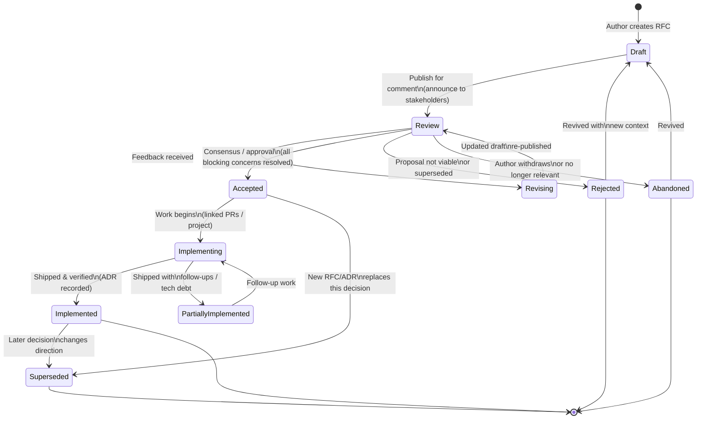
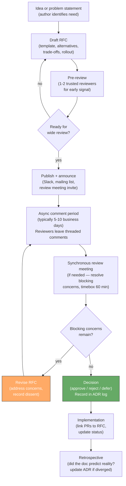
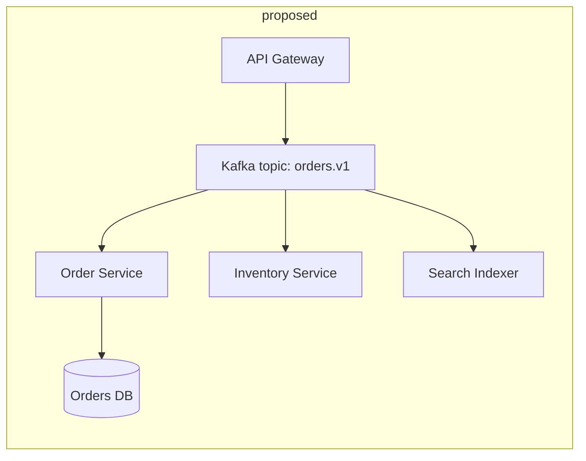
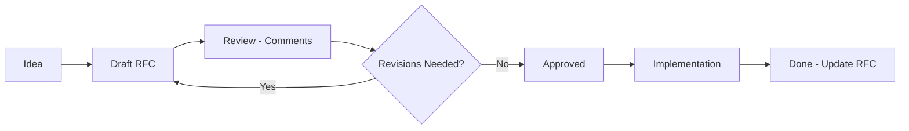
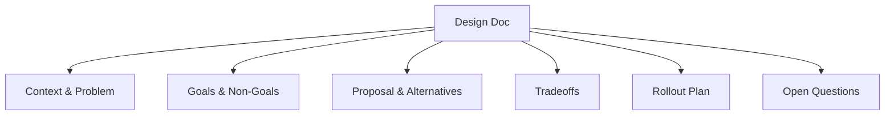
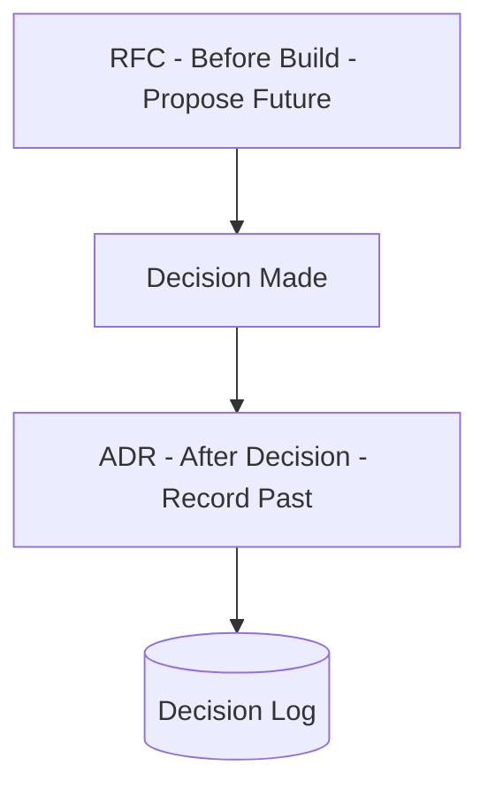
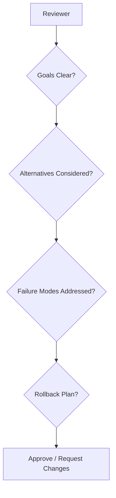

# Chapter 4 — Design Docs, RFCs, and Technical Decision-Making

**What this chapter covers.** Every consequential engineering decision is made twice: once when someone has the idea and again when the team understands it well enough to critique it. Without a written artifact in between, the second step never happens — decisions are made in hallway conversations, Slack threads that scroll away, and meetings where the loudest voice wins. This chapter makes decision-making explicit and durable. You will learn when to write a design doc and when not to, how RFC and ADR processes actually work in high-performing organizations, what a good template looks like and why each section earns its place, how to frame alternatives and trade-offs so reviewers can reason rather than bikeshed, and how to run the review process — from async commentary to synchronous debate to recorded decision — without turning it into governance theatre.

Learning goals — after this chapter you should be able to:

- Decide when a change warrants a design doc, an RFC, an ADR, or no document at all — and explain the cost of over- and under-documenting.
- Write a design doc that a senior engineer can evaluate in 20 minutes: context, goals and non-goals, proposal, alternatives considered, trade-offs, rollout and rollback, and open questions.
- Author Architecture Decision Records (ADRs) that capture *why* a decision was made, not just *what* was decided, and maintain them as a searchable log.
- Run an RFC lifecycle from draft through discussion, decision, and follow-through — including facilitation techniques that prevent bike-shedding and ensure unresolved dissent is recorded, not suppressed.
- Apply decision-making frameworks (RACI/DACI, consent vs. consensus, lazy consensus, advice process) appropriate to team size, risk, and reversibility.
- Critique real design docs for completeness, falsifiability, and operational realism — and connect documentation discipline to distributed-systems reliability.

---

## 1. Why writing precedes building

The cost curve of engineering decisions is asymmetric. A decision that takes two hours to write down and two days to review can prevent two months of rework. Yet most teams under-invest in writing precisely because the cost is immediate and the benefit is deferred.

Three failure modes recur when writing is skipped:

| Failure mode | Symptom | Cost |
|---|---|---|
| **Implicit consensus** | "We discussed it in standup and everyone agreed." No artifact; new joiners and adjacent teams have no visibility. | Re-litigation. The same debate recurs every quarter with different participants. |
| **Solution-first thinking** | A PR appears implementing a cache layer before anyone agreed a cache was needed or which consistency model it should offer. | Review becomes redesign. The author defends sunk work; reviewers must choose between blocking and rubber-stamping. |
| **Undocumented alternatives** | The chosen approach works, but no one remembers why alternatives were rejected. When constraints change, the team cannot tell whether the old decision still holds. | Inability to revisit decisions. Constraints evolve; rationale does not. |

Writing forces *precise* thinking. A sentence like "we will use eventual consistency for the inventory service" is not a decision — it leaves open the consistency window, the conflict-resolution strategy, the user-visible consequences, and the fallback when the window is violated. A written doc forces those details into the open where they can be challenged before code is written.

> **Distributed-systems lens.** In a distributed team — multiple services, multiple repos, multiple time zones — synchronous alignment is expensive and lossy. Written design docs are the async consensus protocol for human coordination: they provide durability (the decision survives after participants leave), ordering (later decisions reference earlier ones), and a quorum mechanism (reviewers from affected teams must acknowledge). A team that cannot write clear design docs will build unclear system boundaries.

---

## 2. What warrants a document — and what does not

Not every change needs an RFC. Over-documentation is its own tax: if trivial changes require a three-page doc and a week-long review, engineers route around the process and the culture of writing erodes.

### The decision matrix

| Signal | No doc needed | Short doc or ADR | Full RFC / design doc |
|---|---|---|---|
| **Scope** | Single service, single team, no API change | Cross-service or cross-team, or new abstraction | Cross-team with API, data, or operational impact |
| **Reversibility** | Trivially reversible (feature flag, config) | Reversible with migration (schema change, new queue) | Hard to reverse (protocol change, data model, storage engine) |
| **Cost of being wrong** | Low — revert the PR | Medium — requires coordinated rollout or backfill | High — data loss, outage, or months of migration |
| **Novelty** | Established pattern in this codebase | New pattern or technology for this team | New pattern for the org, or first use of a technology |
| **Examples** | Bug fix, adding a field, tuning a threshold | Adding a new gRPC service, choosing a message broker, introducing a cache | Adopting event sourcing, sharding strategy, multi-region architecture |

**Rule of thumb:** if you cannot describe the change in a PR description and have it understood by every affected team, write a doc. If the PR description *is* the doc (a paragraph of context plus alternatives), that counts — link it and move on.

### Document types and their roles

| Type | Purpose | Lifetime | Audience |
|---|---|---|---|
| **Design doc / RFC** | Propose and debate a *future* change before building. Explores alternatives, trade-offs, and rollout. | Active during review; archived as historical record after decision. | Reviewers who must approve or be informed. |
| **ADR (Architecture Decision Record)** | Record a *decision already made* — the context, the choice, and the consequences. | Permanent, append-only log. Never edited after acceptance; superseded by new ADRs. | Future readers asking "why is it this way?" |
| **Tech spec / implementation plan** | Detailed breakdown of tasks, sequencing, and ownership *after* the design is approved. | Lives until implementation completes; may become runbook. | Implementers. |
| **Post-decision review** | Revisit an ADR after new evidence. | New ADR that supersedes the old one. | The team that must decide whether to stay or change course. |

A common confusion is between RFC and ADR. An RFC says "here is what we *should* do and why — please critique." An ADR says "here is what we *did* do and why — for the record." A healthy team produces both: RFCs before the work, ADRs after the decision. Some teams combine them — an RFC that, once approved, *becomes* the ADR by flipping its status. Either way, the append-only log of ADRs is the durable memory.

---

## 3. The RFC lifecycle





### Timeline and expectations

| Phase | Duration | Owner | Exit criteria |
|---|---|---|---|
| **Draft** | 1–5 days | Author | Doc is coherent enough for pre-review; open questions are explicit, not hidden. |
| **Pre-review** | 1–2 days | Author + 1–2 early reviewers | Major structural issues caught before wide audience wastes time. |
| **Wide review** | 5–10 business days | Author (facilitates), reviewers (comment) | Every affected team has had a chance to comment; blocking concerns are labeled as such. |
| **Resolution** | 1–3 days | Author + decider | Blocking concerns resolved or recorded as accepted dissent; decision is explicit. |
| **Implementation** | Weeks to months | Author / implementing team | PRs link to RFC; status updated; ADR appended. |

**Timebox ruthlessly.** An RFC that has been in "review" for six weeks is not being reviewed — it is being avoided. If wide review produces no blocking concerns in the window, that *is* a decision (lazy consensus — see Section 6). Extend only when a specific reviewer with legitimate context has not yet responded.

---

## 4. Anatomy of a good design doc

### 4.1 The template

The template below is used at many backend organizations (with local variations). Every section earns its place — if you cannot fill a section, that is a signal that the proposal is not ready.

```markdown
# RFC-NNNN: [Concise Title — what and why in one line]

| Field        | Value                                      |
|--------------|--------------------------------------------|
| **Author(s)**| @alice, @bob                               |
| **Status**   | Draft | In Review | Accepted | Rejected | Superseded |
| **Created**  | 2026-08-20                                 |
| **Deciders** | @carol (staff eng, platform), @dave (EM)   |
| **Reviewers**| @team-search, @team-payments, @sre         |
| **Target decision date** | 2026-08-29                      |
| **Supersedes / superseded by** | —                      |
| **ADR**      | ADR-0042 (created on acceptance)           |

## 1. Summary (TL;DR)

_2–4 sentences. A busy reviewer should know whether they need to read
further. State the problem, the proposed solution, and the most
important trade-off._

> We propose replacing synchronous HTTP fan-out from the API gateway to
> downstream services with an async event-driven flow via Kafka for
> order creation. This reduces p99 latency by ~40% and eliminates
> cascading failures from downstream slowness, at the cost of eventual
> consistency (order visible in search within ~2s) and operational
> complexity of exactly-once semantics.

## 2. Context and Problem Statement

_Why does this problem matter now? What is the current architecture,
its pain, and the concrete evidence (metrics, incidents, user impact)?
No proposal yet — just the problem._

- Current flow: diagram + description.
- Pain: latency numbers, incident links, scalability ceiling.
- Why now: what changed (traffic 3x, new requirement, prior incident).

## 3. Goals and Non-Goals

| Goals (in scope)                          | Non-goals (explicitly out of scope)         |
|-------------------------------------------|---------------------------------------------|
| Reduce order-creation p99 from 800ms→400ms| Changing the order data model               |
| Eliminate gateway cascading failures       | Replacing Kafka with another broker         |
| Preserve exactly-once order semantics     | UI/UX changes for eventual consistency      |

_Non-goals prevent scope creep during review._

## 4. Proposal

_The core of the doc. Describe the proposed architecture, data flow,
APIs, storage, and operational posture. Use diagrams. Be specific
enough that a reviewer can spot what you missed._

### 4.1 Architecture diagram



### 4.2 Data flow and API changes

- New topic `orders.v1` (Avro, Schema Registry, 12 partitions).
- Producer: gateway (idempotent producer, `enable.idempotence=true`).
- Consumers: transactional, outbox pattern (Vol 10, Ch 6).
- API change: `POST /orders` returns `202 Accepted` + `Location` poll URL
  instead of `201 Created` (or webhook — decision point).

### 4.3 Storage and consistency

- Outbox table co-located with orders DB; Debezium CDC → Kafka.
- Consumer exactly-once via `transactional.id` + idempotency keys.
- Consistency window: p50 200ms, p99 2s (measured in staging).

### 4.4 Alternatives considered (summary — detail in §5)

| Alternative | Why not chosen |
|---|---|
| Sync fan-out + circuit breakers | Does not solve p99 tail; still couples availability |
| SQS instead of Kafka | No replay, no ordering guarantees needed here |
| Dual-write without outbox | Risk of inconsistency on crash (see §6 risks) |

## 5. Alternatives Considered

_For each serious alternative: describe it, list pros/cons, and explain
why it was not chosen. This is the section reviewers scrutinize most.
"Alternatives: none" signals the author did not think hard enough._

### 5.1 Alternative A: Synchronous fan-out with hedged requests
...
### 5.2 Alternative B: SQS + poll
...
### 5.3 Alternative C: Do nothing (status quo)
- Cost of inaction: quantified (on-call burden, latency SLO misses).

## 6. Trade-offs and Risks

| Trade-off / Risk | Impact | Mitigation |
|---|---|---|
| Eventual consistency (2s window) | Search staleness; user sees "order not found" briefly | Polling endpoint + `Retry-After`; UI handles 202 |
| Operational complexity (Kafka) | New failure mode: broker outage, consumer lag | Runbook, lag alerts, DLQ, replay tooling |
| Exactly-once complexity | Duplicate processing on rebalance | Idempotency keys, transactional consumers |
| Migration risk | Dual-write during cutover | Shadow traffic, feature flag, rollback plan (§7) |

## 7. Rollout, Rollback, and Observability

- **Phases:** shadow (10% mirrored traffic, no side effects) → canary
  (5% live) → 50% → 100%. Feature-flagged (`orders.async_write`).
- **Rollback:** flip flag → synchronous path; drain in-flight Kafka
  messages (consumer lag must be < 100 before claiming rollback complete).
- **Metrics:** `orders.produce.latency`, `orders.consume.lag`,
  `orders.e2e_visibility_latency`, DLQ depth, idempotency hit rate.
- **Alerts:** consumer lag > 5s, DLQ > 0, produce error rate > 0.1%.

## 8. Open Questions

| # | Question | Owner | Status |
|---|---|---|---|
| 1 | Should `POST /orders` return 202 or use webhook callback? | @alice | Open — need product input by 08-25 |
| 2 | Do we need ordering guarantee per customer? (partition key) | @bob | Open — depends on Q1 |

_Questions marked "Open" block acceptance only if they affect the core
decision. Minor questions become follow-up tasks._

## 9. Appendix

- Load-test results, cost estimates, prior art links, detailed schemas,
  threat model, glossary.

## References

- ADR-0039: Why we chose Kafka over SQS (2025-11)
- Incident #4821: Gateway cascading failure (2026-07-14)
- Vol 10, Ch 6 — Outbox and CDC patterns
```

### 4.2 What makes each section earn its place

- **Summary** — respects reviewers' time. Many reviewers decide from the summary whether to read further; a missing or vague summary guarantees shallow review.
- **Context before proposal** — prevents solution-first thinking. If the problem statement does not convince, the proposal should not be approved regardless of elegance.
- **Goals / non-goals** — bounds the review. Without non-goals, every reviewer expands scope to their pet concern.
- **Proposal with diagram** — a diagram is worth a thousand words of prose for data flow. Require one for any cross-service change.
- **Alternatives considered** — the highest-signal section. It demonstrates that the author explored the solution space and gives reviewers a framework for critique ("you rejected alternative B because of X, but X is no longer true because Y").
- **Trade-offs and risks** — honesty about cost. A doc that lists no risks is not trusted.
- **Rollout and rollback** — the difference between a design and a plan. Reviewers should be able to answer "if this goes wrong at 2 AM, what do we do?"
- **Open questions** — separates decided from undecided. Prevents the doc from being blocked on every minor detail.

### 4.3 ADR template (the durable record)

Once a decision is made, record it permanently:

```markdown
# ADR-0042: Async Order Creation via Kafka

| Field       | Value                          |
|-------------|--------------------------------|
| **Status**  | Accepted (2026-08-28)          |
| **Deciders**| @carol, @dave                  |
| **RFC**     | RFC-0144                       |
| **Supersedes** | —                           |
| **Superseded by** | — (append when replaced)  |

## Context

Order creation p99 was 800ms with synchronous fan-out; incident #4821
showed cascading failure when inventory service slowed. Traffic is 3x
YoY and will double again with the marketplace launch.

## Decision

We will move order creation to async event-driven flow:
API gateway → Kafka `orders.v1` → consumers (order, inventory, search).
Exactly-once via transactional outbox + idempotent consumers.

## Consequences

- **Positive:** p99 400ms, isolation from downstream slowness, replay
  capability for new consumers.
- **Negative:** 2s eventual-consistency window, operational burden of
  Kafka (lag monitoring, DLQ, rebalancing), migration complexity.
- **Neutral:** `POST /orders` becomes 202 Accepted (breaking API change
  for clients that expected 201 — migration guide in RFC §7).

## Alternatives Rejected

- Sync fan-out + hedging: does not solve tail latency.
- SQS: no replay, weaker ordering.

## Compliance

- If you create a new consumer of `orders.v1`, you MUST use
  transactional consumption and idempotency keys (see runbook).
- If you need synchronous order visibility, use the poll endpoint
  `GET /orders/{id}` with `Retry-After` handling — do not add a sync
  side-channel.

## References

- RFC-0144 (full discussion, 47 comments)
- Incident #4821 postmortem
```

Store ADRs as numbered markdown files in `docs/adr/` (or `adr/`), committed to the repo. Tools like `adr-tools` (`npryce/adr-tools`) and `log4brains` can generate indexes and enforce numbering, but a plain directory with sequential files works.

---

## 5. Writing for critique, not for approval

A design doc is not a sales pitch. Its purpose is to make the proposal *falsifiable* — to give reviewers the information needed to find flaws. Techniques that help:

### Quantify, do not hand-wave

| Vague | Falsifiable |
|---|---|
| "This will improve latency." | "p99 `POST /orders` from 800ms to ~400ms (50th percentile unchanged at 120ms), measured on shadow traffic over 7 days at 5k rps." |
| "Kafka can handle our scale." | "12-partition topic at 5k msgs/s (avg 2 KB) = 10 MB/s; single broker handles ~100 MB/s; 3-broker cluster at 10% capacity. Retention 7 days = ~6 TB." |
| "We will monitor it." | "Alerts: `kafka_consumer_lag_seconds > 5` (P2), `orders_dlq_depth > 0` (P1), `orders_e2e_visibility_p99 > 3s` (P2). Dashboard: `orders-creation` (produce/consume/e2e panels)." |

### State assumptions explicitly

Every design rests on assumptions. List them so reviewers can challenge them:

- "Assumes Kafka cluster is already multi-AZ with 3x replication and < 1h MTTR — true per SRE runbook, verified with SRE team."
- "Assumes clients can handle 202 Accepted — validated with top 5 API consumers; 2 require migration (tracked in RFC §7)."
- "Assumes ordering within a customer is not required — confirmed with product; if needed, partition key = `customer_id`."

### Separate facts from opinions

- **Fact:** "Synchronous fan-out p99 is 800ms (Datadog APM, last 30 days, n=12M requests)."
- **Opinion:** "800ms p99 is unacceptable for checkout conversion."
- **Fact:** "Kafka adds ~15ms produce latency (benchmark on staging)."
- **Opinion:** "15ms is worth the consistency trade-off for checkout."

Labeling opinions as opinions invites reasoned disagreement rather than entrenched positions.

---

## 6. Decision-making frameworks

### 6.1 RACI and DACI

For any decision, clarify who plays which role:

| Role | RACI | DACI | Meaning |
|---|---|---|---|
| **Responsible** | Does the work | **Driver** | Authors the RFC, drives it to decision. Single person. |
| **Accountable** | Ultimately answerable | **Approver** | Makes the final call. Single person — if two people must agree, neither is accountable. |
| **Consulted** | Input before decision | **Contributors** | Provide expertise; their input is sought, not optional. |
| **Informed** | Told after decision | **Informed** | Notified of outcome; can raise concerns before, not veto after. |

DACI is preferred for technical decisions because it forces a single **Approver** (often a staff engineer or EM) and distinguishes contributors (whose input matters) from informed parties (who need awareness). Document the DACI in the RFC header.

```
DACI for RFC-0144 (async order creation):
  Driver:     @alice (senior eng, orders team)
  Approver:   @carol (staff eng, platform)  — single approver
  Contributors: @team-search, @team-inventory, @sre-kafka, @product-checkout
  Informed:   @eng-all (announcement), @api-consumers (migration guide)
```

### 6.2 Consent vs. consensus vs. lazy consensus

| Model | Rule | When to use |
|---|---|---|
| **Consensus** | Everyone must agree. Any single objection blocks. | Rare — only for irreversible, high-stakes decisions (e.g., changing a public API contract with external customers). Slow; incentivizes holdouts. |
| **Consent** | No one has a *reasoned, blocking* objection. "I disagree but can live with it" is consent. Dissent is recorded, not suppressed. | Default for most RFCs. Faster than consensus; still ensures serious concerns are addressed. |
| **Lazy consensus** | Silence is consent. If no blocking objection is raised within the review window, the proposal passes. | Low-risk, reversible decisions. Requires that reviewers were *actually* notified and had reasonable time. |
| **Advice process** | Driver must seek advice from affected parties and experts, but retains decision authority. | Startups and small teams where a single owner decides after consultation. Scales poorly beyond ~20 engineers. |

**Practical guidance:** use **consent** as the default. Require objectors to state their concern as a *falsifiable risk* ("if we do X, Y will happen because Z, with likelihood L and impact I") rather than a preference ("I don't like Kafka"). The approver judges whether the concern is blocking. Record dissent explicitly in the ADR:

```markdown
## Dissent

@team-search objected that 2s consistency window would break their
real-time inventory display. Decision: accepted as known trade-off;
search team will poll `GET /orders/{id}` for 3s after creation.
Revisit if e2e p99 exceeds 2s in production (alert fires).
```

### 6.3 Reversible vs. irreversible decisions (the two-way door)

Jeff Bezos's distinction, operationalized:

- **Two-way door (reversible):** feature flags, config changes, additive APIs, choice of library within a service. Decide quickly, with lightweight process (ADR only, or PR description). Optimize for speed; you can walk back through the door.
- **One-way door (irreversible):** data model changes that require backfill, protocol changes that break wire compatibility, storage engine choices, public API deprecations. Decide slowly, with full RFC, alternatives, and explicit rollback plan. You cannot walk back without significant cost.

Most teams err by treating two-way doors as one-way (over-process) or one-way doors as two-way (under-process). The RFC decision matrix in Section 2 is the operationalization.

---

## 7. Running the review

### 7.1 Async first, sync when stuck

Async comment threads scale; meetings do not. The default should be async review on the document (Google Docs suggestions, GitHub PR comments, Notion comments, or RFC tooling like `rfc3166` / `Confluence`).

Reserve synchronous review meetings for:

- Blocking disagreements that have not converged after two rounds of async comments.
- Cross-cutting concerns that affect many teams and benefit from real-time negotiation.
- High-stakes decisions where tone and nuance matter.

**Meeting discipline:**

- Timebox to 60 minutes. Publish an agenda (the open blocking concerns, not a re-reading of the doc).
- Assign a facilitator (not the author) and a note-taker.
- End with an explicit decision or explicit next step and owner. "We had a good discussion" is not an outcome.
- Record the outcome in the doc within 24 hours.

### 7.2 Facilitation anti-patterns

| Anti-pattern | What happens | Fix |
|---|---|---|
| **Bikeshedding** | 45 minutes debating the topic name (`orders.v1` vs `order-events.v1`) while the consistency model goes unexamined. | Facilitator parks naming debates ("naming is important but not blocking — author decides, or we vote async after"). Focus on load-bearing decisions. |
| **HIPPO (highest-paid person's opinion)** | The most senior person states a preference early; others self-censor. | Senior reviewers comment last, or use written pre-reads where everyone comments before the meeting. |
| **Rubber-stamping** | "LGTM" without reading, because the author is senior or the doc is long. | Require at least one reviewer per affected team; track review coverage. Short summary + clear questions help busy reviewers engage. |
| **Endless iteration** | Each round of comments spawns new scope. The RFC never converges. | Define "blocking" vs. "non-blocking" comments. Non-blocking suggestions become follow-up tasks, not blockers. Approver calls the decision. |
| **Ghost reviewers** | Key stakeholders never comment; the RFC is approved without their input, then contested during implementation. | Explicit reviewer list in the header; direct @-mentions; escalation if a required reviewer is unresponsive within the window. |

### 7.3 After the decision

- **Update the RFC status** to `Accepted` / `Rejected` with date and decider.
- **Append an ADR** — the durable record. Link RFC and ADR bidirectionally.
- **Link implementation PRs** to the RFC/ADR so future readers can trace from decision to code.
- **Schedule a revisit** if the decision was close or based on assumptions that may change. Calendar it; do not rely on memory.
- **Retrospective:** after implementation, compare reality to the doc's predictions (latency, cost, operational burden). Update the ADR if reality diverged — the log should reflect what *actually* happened, not just what was planned.

---

## 8. Tooling and storage

| Concern | Lightweight option | Heavier option |
|---|---|---|
| **Where RFCs live** | `docs/rfcs/NNNN-title.md` in the repo (versioned, reviewable as PRs) | Dedicated RFC repo or Confluence/Notion space with index |
| **Numbering** | Sequential (`RFC-0144`) via `adr-tools` or manual | Auto-assigned by RFC tooling |
| **Review** | PR comments on the RFC markdown file | Google Docs / Notion comments, then snapshot to repo on acceptance |
| **ADR log** | `docs/adr/NNNN-title.md` in the repo | `log4brains` site, Backstage ADR plugin, or `adr-tools` index |
| **Index / discoverability** | `docs/rfcs/README.md` and `docs/adr/README.md` with status table | Backstage TechDocs, generated ADR site |
| **Notifications** | Slack webhook on new RFC PR; mailing list | RFC bot that pings reviewers and tracks deadlines |

**Recommendation for backend teams:** keep RFCs and ADRs *in the repo* as markdown, reviewed as PRs. This gives you versioning, blame, search, and review tooling for free. Use Google Docs only when real-time collaborative editing is needed during drafting, then snapshot the final version to the repo.

```bash
# Example repo layout
docs/
├── rfc/
│   ├── README.md          # index: number, title, status, decider, date
│   ├── 0144-async-order-creation.md
│   ├── 0145-payment-idempotency.md
│   └── template.md        # copy for new RFCs
├── adr/
│   ├── README.md          # index of all ADRs
│   ├── 0042-async-order-creation.md
│   └── 0043-payment-idempotency.md
└── runbooks/
    └── orders-async.md    # operational runbook (linked from ADR)
```

```bash
# adr-tools — manage ADRs from the CLI
# Install: brew install adr-tools  /  apt install adr-tools
adr new "Async order creation via Kafka"   # creates doc/adr/0006-*.md
adr list
adr generate toc > doc/adr/README.md
adr generate graph | dot -Tpng -o adr-graph.png  # dependency graph
```

---

## 9. Case study — a real RFC, condensed

To make the abstract concrete, here is a condensed real-world RFC (inspired by a common backend migration) that illustrates the full lifecycle.

> **RFC-0145: Idempotency Keys for Payment Processing**
>
> **Context.** Duplicate payments caused by client retries after timeouts. Incident #4888: a network partition caused the gateway to retry `POST /payments` three times; two succeeded server-side but only one response reached the client. The client retried again, creating a fourth charge. Total duplicate charges: $12k across 340 users. Existing mitigation (client-side dedup by `request_id` header) was advisory and not enforced.
>
> **Goals.** Guarantee at-most-once charging for `POST /payments` under retries and network partitions. Non-goal: changing the payment provider API (Stripe/Adyen) — we wrap it.
>
> **Proposal.** Require `Idempotency-Key` header (UUID v4, client-generated) on `POST /payments`. Server stores `(key, response, status)` in a dedicated idempotency table (Postgres, same transaction as payment row) with TTL 24h. On duplicate key, return the stored response (same status code and body) without re-calling the provider. Clock skew handled by key expiry, not timestamps.
>
> **Alternatives considered.**
> - *Natural idempotency via order ID:* rejected — order ID is not known until payment succeeds in some flows.
> - *Distributed lock on order ID:* rejected — lock contention under retry storms; does not handle cross-order duplicates.
> - *Provider-side idempotency only (Stripe `Idempotency-Key`):* partially adopted, but we need consistent behavior across providers and for our own DB writes.
>
> **Trade-offs.** Extra write per payment (idempotency table, ~2ms p50). Storage: 24h TTL × 50k payments/day × ~500 bytes = ~25 MB — negligible. Risk: client reuses key for *different* payment intent — mitigated by validating that the request body hash matches the stored hash; mismatch returns `422 Unprocessable Entity` with `code: IDEMPOTENCY_KEY_REUSE`.
>
> **Rollout.** Phase 1: server accepts key but does not require it (2 weeks, monitor adoption). Phase 2: require key; reject without it (`400`). Feature flag `payments.require_idempotency_key`. Rollback: disable flag; existing keys remain valid for 24h.
>
> **Review outcome.** Accepted with one blocking concern (body-hash validation — added) and one recorded dissent (team-payments wanted 72h TTL; decided 24h with revisit after 30 days of production data).
>
> **ADR-0043** recorded the decision; `docs/runbooks/payments-idempotency.md` documents the operational semantics.

---

## Key takeaways

- Write before building for any decision that is cross-team, hard to reverse, or costly if wrong. Use a lightweight ADR or PR description for reversible, single-team changes — reserve full RFCs for high-stakes, cross-cutting decisions.
- A good RFC makes the proposal falsifiable: quantified claims, explicit assumptions, alternatives with honest pros/cons, and a rollout/rollback plan that works at 2 AM. Reviewers should be able to find flaws without guessing.
- Separate RFC (proposal, debatable) from ADR (record, durable). RFCs are versioned during review; ADRs are append-only after decision. Link them bidirectionally and keep both in the repo.
- Use DACI to clarify who drives, who approves (single approver), who contributes, and who is informed. Default to consent (no reasoned blocking objection), not consensus (everyone must enthusiastically agree). Record dissent explicitly.
- Distinguish two-way doors (reversible — decide quickly) from one-way doors (irreversible — decide carefully). Most process failures come from mismatching the ceremony to the reversibility.
- Run reviews async-first; use synchronous meetings only to resolve blocking disagreements. Facilitate actively to prevent bikeshedding, HIPPO dominance, rubber-stamping, and endless iteration.
- After the decision, close the loop: update RFC status, append ADR, link PRs, schedule revisits for close calls, and retrospect on whether reality matched predictions.

## Further reading

- Michael Nygard — *Documenting Architecture Decisions* (2011). The original ADR formulation. https://cognitect.com/blog/2011/11/15/documenting-architecture-decisions
- Joel Spolsky — *Painless Functional Specifications* (2000). Why writing specs prevents rework. https://www.joelonsoftware.com/2000/10/02/painless-functional-specifications-part-1-why-bother/
- sponsorship — *The RFC Process at HashiCorp, Rust, and Ember* — comparative RFC workflows. https://rust-lang.github.io/rfcs/0002-rfc-process.html and https://github.com/hashicorp/terraform-rfcs
- *adr-tools* (npryce/adr-tools) and *MADR* (adr/madr) — ADR tooling and templates. https://github.com/npryce/adr-tools and https://adr.github.io/madr/
- Amazon — *Working Backwards: The PR/FAQ and Two-Way Doors* — Amazon's narrative memo and reversible-decision framing. https://www.amazon.com/Working-Backwards-Insights-Stories-Secrets/dp/1250267595
- Will Larson — *An Elegant Puzzle: Systems of Engineering Management* (2019), Ch. 4 — Engineering decision-making at scale.
- Camille Fournier — *The Manager's Path* (2017), Ch. 8 — Technical decision-making and RFC culture.
- Google — *Software Engineering at Google* (2020), Ch. 8 — Style guides and code review; Ch. 14 — Documentation. https://abseil.io/resources/swe-book

### RFC lifecycle



### Design doc structure



### ADRs vs RFCs



### Review quality checklist


