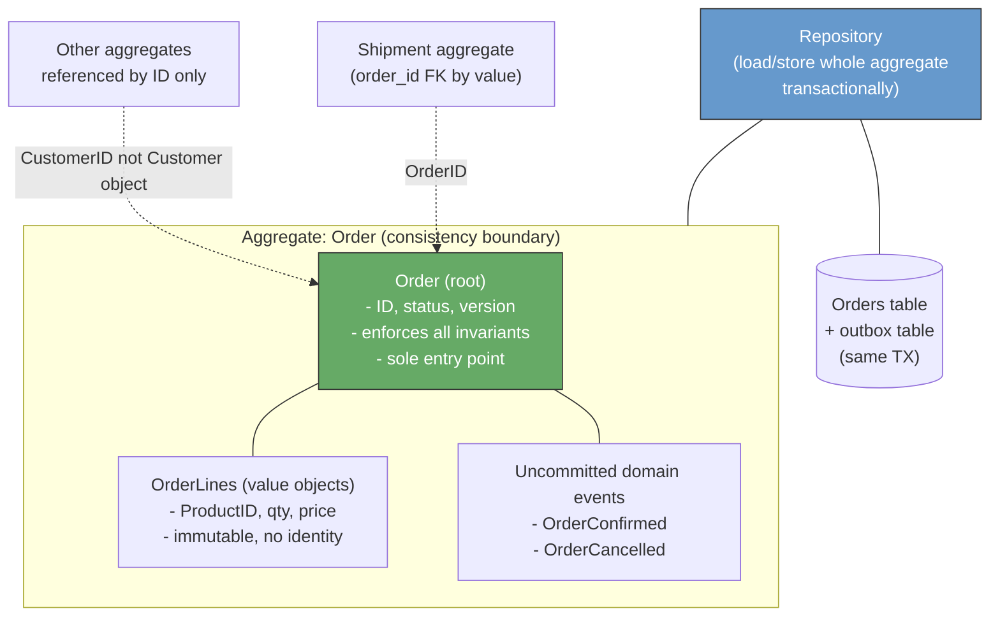
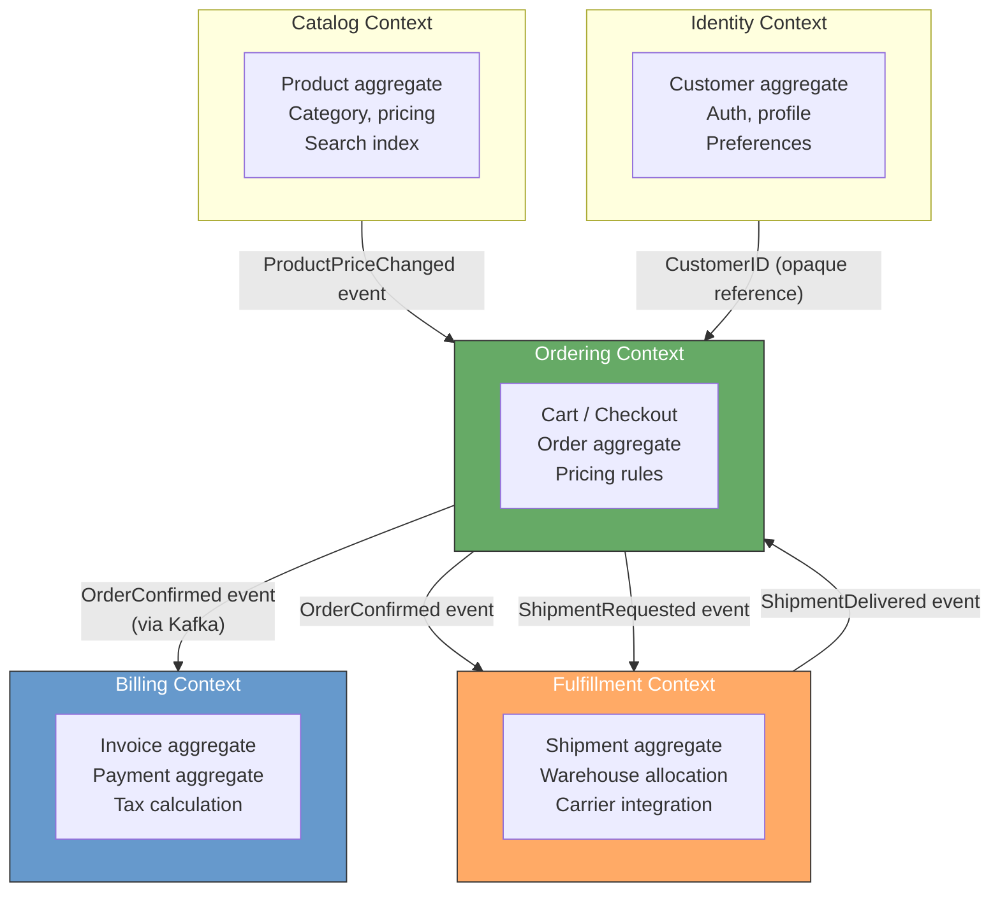
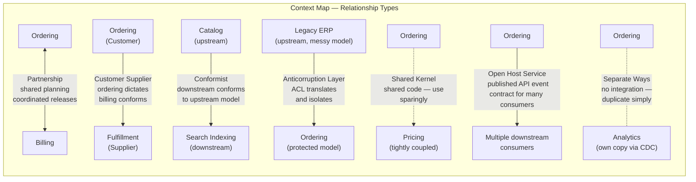
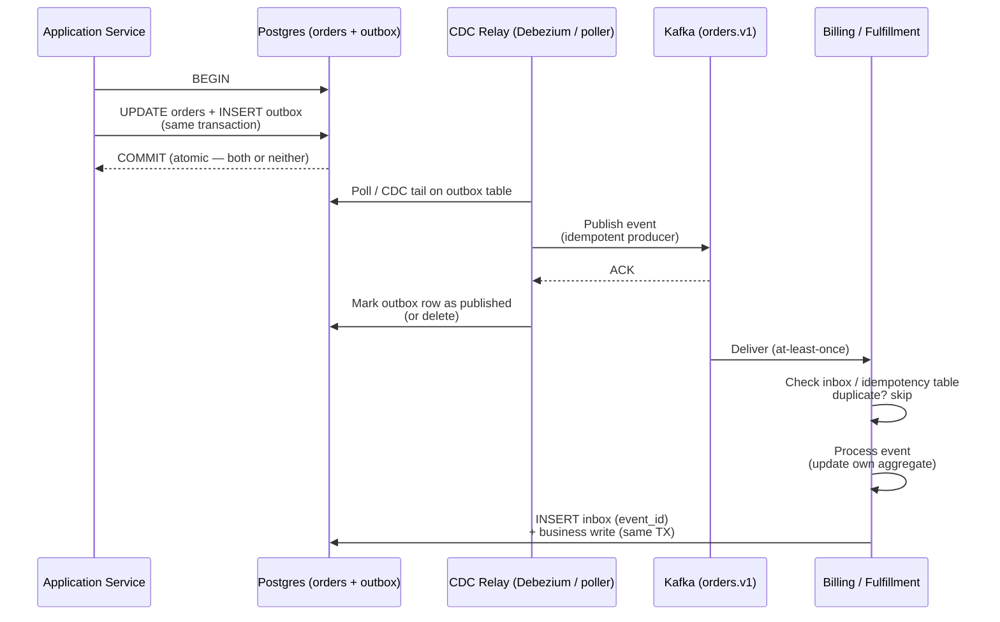
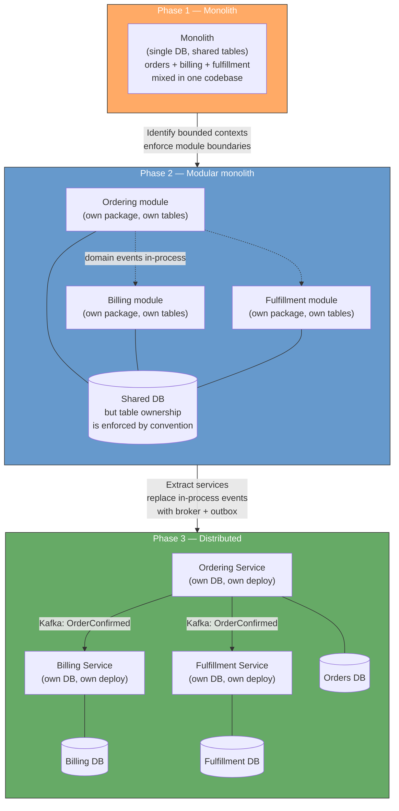
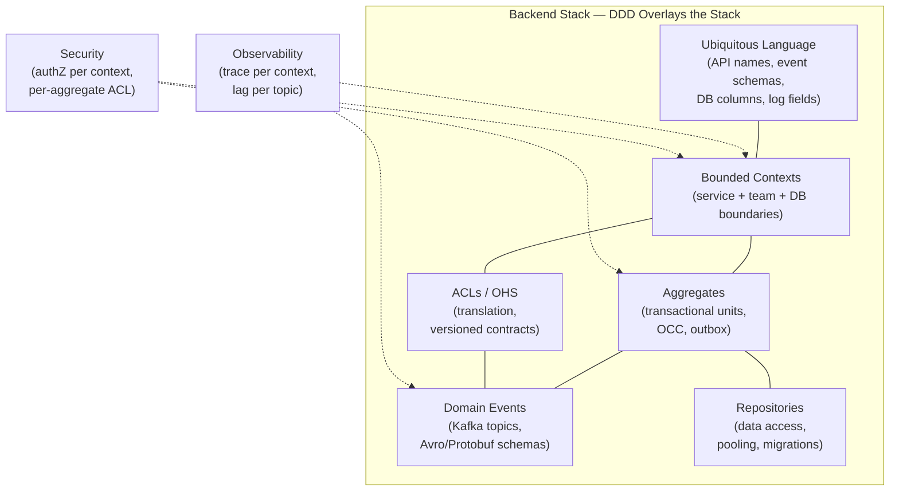
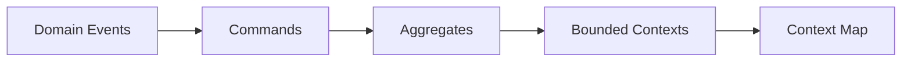

# Chapter 5 — Domain-Driven Design for Backend

**What this chapter covers.** Most backend failures blamed on "microservices complexity" are actually domain-modeling failures: a shared database that couples teams through invisible foreign keys, a single `Order` object that means three different things in three services, an API that leaks internal workflow state because no one defined where one domain ends and another begins. Domain-Driven Design (DDD) is the discipline of making those boundaries explicit before they become incidents. This chapter covers DDD as a backend engineer uses it — not as abstract theory, but as concrete decisions about service boundaries, data ownership, transactional consistency, and inter-service communication. You will learn bounded contexts and context maps, entities vs. value objects vs. aggregates, domain events and their delivery guarantees, strategic patterns for decomposing monoliths, and where DDD helps, where it over-engineers, and how it composes with the rest of the backend stack.

Learning goals — after this chapter you should be able to:

- Explain the DDD building blocks — ubiquitous language, entity, value object, aggregate, repository, domain event, domain service — and apply each to a backend domain with concrete code.
- Draw bounded-context boundaries for a realistic backend (e.g., e-commerce, ride-sharing, or banking) and justify each boundary by transactional, team-ownership, and consistency criteria.
- Design aggregates that enforce invariants transactionally, choose aggregate boundaries that avoid contention, and explain why large aggregates are an anti-pattern in distributed systems.
- Apply strategic DDD patterns — bounded context, context map relationships (partnership, customer/supplier, conformist, ACL, shared kernel, open-host), and domain events — to decompose a monolith or integrate services.
- Model domain events with correct delivery semantics (at-least-once, outbox, idempotent consumers) and connect them to the messaging infrastructure in Volume 10.
- Critique when *not* to use DDD — CRUD domains, small teams, and stable simple models — and apply lighter alternatives without cargo-culting tactical patterns.

---

## 1. Why domain modeling matters for backend systems

Every backend system encodes a model of the world — orders, payments, inventory, users, rides, ledger entries. That model lives in code (structs, classes, DB schemas), in APIs (request/response shapes), and in people's heads (how product, engineering, and support talk about the domain). When those three models diverge, the system becomes hard to change, hard to reason about, and prone to subtle bugs.

DDD, introduced by Eric Evans (*Domain-Driven Design*, 2003) and refined by Vaughn Vernon (*Implementing Domain-Driven Design*, 2013), is a set of patterns for keeping those models aligned by:

1. **Making the model explicit** — a shared, precise language (ubiquitous language) used in code, conversation, and docs.
2. **Bounding the model** — defining where a given model applies (bounded context) and how models in different contexts relate (context map).
3. **Structuring the model** — tactical patterns (entity, value object, aggregate, repository, domain event) that encode domain invariants in a way that survives distribution.

DDD is not a framework, a library, or a microservices prescription. It is a *design discipline* that is most valuable precisely when the domain is complex, the team is large, or the system is distributed — which describes most backend engineering.

> **Distributed-systems lens.** In a monolith, a fuzzy domain boundary is a nuisance — you can still join across tables and call methods directly. In a distributed system, a fuzzy boundary is an outage waiting to happen: a shared database becomes a single point of contention, a leaky abstraction becomes a cross-service transaction with no atomicity, and an ambiguous ubiquitous language becomes an integration bug that no single team can diagnose. DDD's bounded contexts are the domain-level equivalent of fault-isolation boundaries — they decide where strong consistency ends and eventual consistency begins, which is the most consequential decision in distributed backend design.

---

## 2. Ubiquitous language

The foundation of DDD is language. If engineers say "order" and product says "order" but they mean different things — or if two services both have an `Order` type with different fields and invariants — every conversation and every integration carries a translation tax and a risk of misunderstanding.

**Ubiquitous language** is a shared, rigorous vocabulary used by domain experts and engineers alike, reflected directly in code. It is:

- **Shared** — product, engineering, support, and docs use the same terms.
- **Precise** — each term has a definition that distinguishes it from nearby terms (`Order` vs. `Cart` vs. `Checkout` vs. `Shipment` — not interchangeable).
- **Reflected in code** — class names, method names, DB tables, and API fields use the language verbatim, not synonyms or abbreviations.
- **Evolving** — as understanding deepens, the language is refined and the code is renamed to match.

**Example — e-commerce order lifecycle:**

| Term | Definition | Code |
|---|---|---|
| `Cart` | Mutable collection of items a customer is considering. No inventory reserved. Abandoned after 30 days. | `Cart` entity, `cart_items` table |
| `Checkout` | The *process* of converting a cart into an order. Validates inventory, prices, and payment method. | `CheckoutService`, `CheckoutSession` |
| `Order` | Immutable commitment to purchase. Inventory reserved (or allocated). Has a lifecycle: `PENDING → CONFIRMED → FULFILLED → DELIVERED` or `CANCELLED`. | `Order` aggregate, `orders` table |
| `Shipment` | Physical fulfillment of an order (or part of one). One order may have many shipments. | `Shipment` aggregate, `shipments` table |
| `Payment` | Transfer of funds for an order. Separate bounded context (see §4). | `Payment` aggregate in Billing context |

Without this precision, a single `Order` object accumulates fields for cart, checkout, fulfillment, and payment concerns — a classic anemic/nested model that becomes unmaintainable.

**Building the language:** run *Event Storming* workshops (Alberto Brandolini) where domain experts and engineers collaboratively map domain events on a wall in chronological order, then cluster them into aggregates and bounded contexts. The output is not just a diagram — it is a shared understanding that the code must reflect.

---

## 3. Tactical patterns — building blocks of the model

### 3.1 Entities, value objects, and domain services

**Entity** — an object defined by its *identity* that persists over time, even as its attributes change. Two entities with the same ID are the same thing.

```go
// Entity: Order — identity is OrderID, persists across state changes.
type OrderID string // typed ID — not a bare string
type OrderStatus string

const (
    StatusPending   OrderStatus = "PENDING"
    StatusConfirmed OrderStatus = "CONFIRMED"
    StatusFulfilled OrderStatus = "FULFILLED"
    StatusCancelled OrderStatus = "CANCELLED"
)

type Order struct {
    ID         OrderID
    CustomerID CustomerID
    Status     OrderStatus
    Lines      []OrderLine
    PlacedAt   time.Time
    Version    int64 // optimistic concurrency control (see §3.3)
}

// Identity-based equality — two Orders with same ID are the same order.
func (o *Order) Equals(other *Order) bool {
    return o.ID == other.ID
}
```

**Value object** — an object defined by its *attributes*, with no identity. Two value objects with the same attributes are interchangeable. Value objects should be immutable.

```go
// Value object: Money — defined entirely by amount + currency.
type Money struct {
    amount   int64  // minor units (cents) — never float for money
    currency string // ISO 4217, e.g., "USD"
}

func NewMoney(cents int64, currency string) (Money, error) {
    if cents < 0 {
        return Money{}, errors.New("amount must be non-negative")
    }
    if len(currency) != 3 {
        return Money{}, errors.New("currency must be ISO 4217")
    }
    return Money{amount: cents, currency: currency}, nil
}

func (m Money) Add(other Money) (Money, error) {
    if m.currency != other.currency {
        return Money{}, errors.New("currency mismatch")
    }
    return Money{amount: m.amount + other.amount, currency: m.currency}, nil
}

func (m Money) Equals(other Money) bool {
    return m.amount == other.amount && m.currency == other.currency
}

// Value object: Address — no identity, immutable, validated on creation.
type Address struct {
    Street  string
    City    string
    Region  string
    Postal  string
    Country string // ISO 3166-1 alpha-2
}

// Value-based equality.
func (a Address) Equals(other Address) bool { return a == other }

// OrderLine is a value object inside the Order aggregate.
type OrderLine struct {
    ProductID ProductID
    Quantity  int
    UnitPrice Money
}

func (l OrderLine) LineTotal() (Money, error) {
    return Money{
        amount:   int64(l.Quantity) * l.UnitPrice.amount,
        currency: l.UnitPrice.currency,
    }, nil
}
```

**Domain service** — stateless logic that does not naturally belong to a single entity or value object, often coordinating across aggregates.

```go
// Domain service: pricing logic that combines catalog, promotions, and order.
type PricingService struct {
    catalog    CatalogRepository
    promotions PromotionRepository
}

func (s *PricingService) PriceOrder(lines []OrderLine, promoCode string) (Money, error) {
    // Validates prices against catalog, applies promotions — pure domain logic.
    // No infrastructure concerns (HTTP, DB) — those are in the application layer.
}
```

| Concept | Identity? | Mutable? | Example |
|---|---|---|---|
| **Entity** | Yes — ID | Yes — state evolves | `Order`, `Customer`, `Shipment` |
| **Value object** | No — attributes | No — immutable | `Money`, `Address`, `OrderLine`, `DateRange` |
| **Domain service** | No | Stateless | `PricingService`, `RoutingService` |

### 3.2 Aggregates — consistency boundaries

An **aggregate** is a cluster of entities and value objects treated as a unit for data changes. One entity is the **aggregate root** — the only entry point for external access. All invariants within the aggregate are enforced transactionally.

```go
// Aggregate: Order (root) + OrderLines (value objects) + invariant enforcement.
type Order struct {
    id         OrderID
    customerID CustomerID
    status     OrderStatus
    lines      []OrderLine
    placedAt   time.Time
    version    int64
    events     []DomainEvent // uncommitted events (see §5)
}

// All mutations go through the root — no direct manipulation of lines.
func (o *Order) AddLine(productID ProductID, qty int, price Money) error {
    if o.status != StatusPending {
        return errors.New("can only add lines to pending orders")
    }
    if qty <= 0 {
        return errors.New("quantity must be positive")
    }
    o.lines = append(o.lines, OrderLine{
        ProductID: productID,
        Quantity:  qty,
        UnitPrice: price,
    })
    return nil
}

func (o *Order) Confirm() error {
    if o.status != StatusPending {
        return fmt.Errorf("cannot confirm order in status %s", o.status)
    }
    if len(o.lines) == 0 {
        return errors.New("cannot confirm empty order")
    }
    o.status = StatusConfirmed
    o.events = append(o.events, OrderConfirmed{
        OrderID:    o.id,
        CustomerID: o.customerID,
        Lines:      o.lines,
        OccurredAt: time.Now().UTC(),
    })
    return nil
}

func (o *Order) Cancel(reason string) error {
    if o.status == StatusFulfilled || o.status == StatusCancelled {
        return fmt.Errorf("cannot cancel order in status %s", o.status)
    }
    o.status = StatusCancelled
    o.events = append(o.events, OrderCancelled{
        OrderID:    o.id,
        Reason:     reason,
        OccurredAt: time.Now().UTC(),
    })
    return nil
}

// Invariant: total is derived, not stored — always consistent with lines.
func (o *Order) Total() (Money, error) {
    if len(o.lines) == 0 {
        return Money{}, errors.New("empty order has no total")
    }
    total := Money{amount: 0, currency: o.lines[0].UnitPrice.currency}
    for _, l := range o.lines {
        lt, _ := l.LineTotal()
        total, _ = total.Add(lt)
    }
    return total, nil
}
```

**Aggregate design rules for backend systems:**

| Rule | Why | Violation symptom |
|---|---|---|
| **One transaction per aggregate** — an aggregate is the consistency boundary. Load one aggregate per transaction; modify it atomically. | Distributed transactions across aggregates require sagas (Vol 10, Ch 6) — expensive and eventually consistent. | Cross-aggregate transactions via shared DB or 2PC; contention and coupling. |
| **Small aggregates** — an aggregate should fit in memory and be lockable without blocking unrelated work. | Large aggregates (e.g., `Customer` with all `Orders`) cause contention — every order update locks the customer. | High optimistic-concurrency conflicts; slow loads; lock contention under concurrent writes. |
| **Reference by ID, not by object** — aggregates reference other aggregates by ID, not by direct object pointer. | Direct references tempt cross-aggregate invariants and lazy-loading that couples contexts. | `order.Customer.Orders` navigation that loads the world; circular dependencies. |
| **Eventual consistency between aggregates** — when one aggregate's change affects another, use domain events, not a shared transaction. | Strong consistency across aggregates does not scale — it requires distributed locking or shared storage. | Shared tables, foreign keys across bounded contexts, distributed transactions. |



### 3.3 Repositories and persistence

A **repository** presents an aggregate as an in-memory collection, hiding persistence mechanics. It loads and stores *whole aggregates* transactionally.

```go
// Repository interface — domain layer, no infrastructure leakage.
type OrderRepository interface {
    FindByID(ctx context.Context, id OrderID) (*Order, error)
    Save(ctx context.Context, order *Order) error // insert or update, with OCC
}

// Postgres implementation — infrastructure layer.
type PostgresOrderRepository struct {
    db *sql.DB
}

func (r *PostgresOrderRepository) FindByID(ctx context.Context, id OrderID) (*Order, error) {
    var o Order
    var status string
    var version int64
    err := r.db.QueryRowContext(ctx,
        `SELECT id, customer_id, status, version, placed_at
         FROM orders WHERE id = $1`, id).Scan(
        &o.id, &o.customerID, &status, &version, &o.placedAt)
    if err != nil {
        return nil, err
    }
    o.status = OrderStatus(status)
    o.version = version

    // Load value objects (lines) — same transaction or immediately after.
    rows, err := r.db.QueryContext(ctx,
        `SELECT product_id, quantity, amount_cents, currency
         FROM order_lines WHERE order_id = $1 ORDER BY seq`, id)
    // ... scan into o.lines
    return &o, nil
}

func (r *PostgresOrderRepository) Save(ctx context.Context, o *Order) error {
    tx, err := r.db.BeginTx(ctx, nil)
    if err != nil {
        return err
    }
    defer tx.Rollback()

    // Optimistic concurrency control — version check prevents lost updates.
    res, err := tx.ExecContext(ctx,
        `UPDATE orders SET status = $1, version = version + 1
         WHERE id = $2 AND version = $3`,
        o.status, o.id, o.version)
    if err != nil {
        return err
    }
    n, _ := res.RowsAffected()
    if n == 0 {
        return errors.New("concurrent modification: order was updated by another transaction")
    }

    // Persist lines (delete + reinsert for simplicity; production may diff).
    // Persist outbox events atomically in the same TX (see §5).
    for _, evt := range o.events {
        payload, _ := json.Marshal(evt)
        _, err = tx.ExecContext(ctx,
            `INSERT INTO outbox (aggregate_id, event_type, payload)
             VALUES ($1, $2, $3)`, o.id, evt.EventType(), payload)
        if err != nil {
            return err
        }
    }

    return tx.Commit()
}
```

The critical detail is that **the outbox insert and the aggregate update share the same transaction** — this is the transactional outbox pattern (Volume 10, Chapter 6) that guarantees domain events are published if and only if the aggregate change commits.

---

## 4. Strategic patterns — bounded contexts and context maps

### 4.1 Bounded contexts

A **bounded context** is an explicit boundary within which a particular domain model applies. Inside the boundary, terms have precise meanings and invariants hold. Across boundaries, the same real-world concept may be modeled differently — and that is intentional.



**How to find bounded-context boundaries:**

| Criterion | Question | Boundary signal |
|---|---|---|
| **Ubiquitous language divergence** | Does the same term mean different things to different teams? | `Order` in ordering (mutable, pre-payment) vs. `Order` in billing (immutable, post-payment snapshot) — two contexts. |
| **Transactional invariants** | Must these invariants hold atomically? | `Order` total must equal sum of lines atomically — same aggregate, same context. `Order` and `Shipment` can be eventually consistent — separate contexts. |
| **Team ownership** | Can one team own and deploy this independently? | If two teams must coordinate every deploy, the boundary is wrong — merge or add an ACL. |
| **Rate of change** | Do these concepts change at different rates or for different reasons? | Catalog (changes daily, merchandising-driven) vs. Orders (changes per transaction) — separate contexts. |
| **Consistency requirements** | Is strong consistency required within this boundary? | Strong within aggregate/context; eventual between contexts. If you need strong across the boundary, reconsider the boundary. |

**E-commerce bounded contexts — worked example:**

| Context | Core aggregates | Owns data | Language example |
|---|---|---|---|
| **Ordering** | `Cart`, `Order`, `CheckoutSession` | `orders`, `order_lines`, `carts` | "Order is pending until confirmed; confirmation reserves inventory." |
| **Billing** | `Invoice`, `Payment`, `Refund` | `invoices`, `payments`, `refunds` | "Invoice is issued for a confirmed order; payment settles an invoice." |
| **Fulfillment** | `Shipment`, `WarehouseAllocation` | `shipments`, `allocations` | "Shipment is created per warehouse; tracking number is assigned by carrier." |
| **Catalog** | `Product`, `Category`, `Price` | `products`, `categories`, `prices` | "Product has variants (SKUs); price is per variant per region." |
| **Identity** | `Customer`, `Address`, `Credentials` | `customers`, `addresses` | "Customer has many addresses; one is the default shipping address." |

Each context owns its data exclusively — no shared tables, no cross-context foreign keys, no direct DB joins. Integration happens through well-defined interfaces (events, APIs, ACLs).

### 4.2 Context map — how contexts relate

When bounded contexts must interact, the *relationship* between them is a design decision with concrete consequences:



| Relationship | Coupling | When to use | Cost |
|---|---|---|---|
| **Partnership** | Tight — both teams plan together | Two contexts that must evolve in lockstep (e.g., Ordering ↔ Billing during checkout). | Coordination overhead; requires joint planning. |
| **Customer / Supplier** | Upstream dictates, downstream has input | Upstream team can accommodate downstream needs (Ordering → Fulfillment). | Upstream carries translation burden. |
| **Conformist** | Downstream conforms to upstream | Upstream is stable/mature or external (Catalog → Search). Downstream has no influence. | Downstream absorbs upstream complexity. |
| **Anticorruption Layer (ACL)** | Isolated — translation layer protects downstream | Upstream model is legacy, messy, or would corrupt downstream (Legacy ERP → Ordering). | Extra code and mapping to maintain. |
| **Shared Kernel** | Shared code/model subset | Small, stable overlap that rarely changes (e.g., `Money` value object). | Coordination cost on every change to shared code. Use sparingly. |
| **Open Host Service (OHS)** | Published contract, many consumers | One context serves many downstream consumers (Ordering publishes `OrderConfirmed` for Billing, Fulfillment, Analytics). | Upstream must version and maintain backward compatibility. |
| **Separate Ways** | No integration | Integration cost exceeds duplication benefit. | Duplication; eventual reconciliation if needed. |

**Anticorruption Layer — concrete example:**

```go
// ACL: translates legacy ERP's messy order model into our clean domain model.
// The ERP exposes SOAP with stringly-typed fields; we isolate that mess here.

// Package erp — the ACL boundary. Nothing outside this package knows ERP's model.
package erp

// ERPOrder is the legacy shape — we do NOT let this leak into the domain.
type ERPOrder struct {
    OrderNum   string `xml:"OrderNum"`
    CustCode   string `xml:"CustCode"`
    StatusCode string `xml:"StatusCd"` // "01"=pending, "02"=shipped, etc.
    LinesRaw   string `xml:"Lines"`    // pipe-delimited string, not JSON
}

// Translator — the ACL's core. Converts ERP → domain.
type Translator struct{}

func (t *Translator) ToDomain(raw ERPOrder) (*ordering.Order, error) {
    id := ordering.OrderID("ERP-" + raw.OrderNum)
    status, err := mapStatus(raw.StatusCode)
    if err != nil {
        return nil, fmt.Errorf("ACL: unknown ERP status %q: %w", raw.StatusCode, err)
    }
    lines, err := parseLines(raw.LinesRaw) // pipe-delimited → []OrderLine
    if err != nil {
        return nil, fmt.Errorf("ACL: malformed lines %q: %w", raw.LinesRaw, err)
    }
    // Construct domain Order through its factory — invariants enforced.
    return ordering.ReconstituteOrder(id, ordering.CustomerID(raw.CustCode), status, lines)
}

func mapStatus(code string) (ordering.OrderStatus, error) {
    switch code {
    case "01": return ordering.StatusPending, nil
    case "02": return ordering.StatusFulfilled, nil
    case "09": return ordering.StatusCancelled, nil
    default:  return "", fmt.Errorf("unknown status code %q", code)
    }
}
```

The ACL ensures that ERP quirks (string codes, pipe-delimited lines, SOAP) never infect the ordering domain. If the ERP is replaced, only the ACL changes.

---

## 5. Domain events — connecting contexts

A **domain event** is a record that something significant happened in the domain, phrased in past tense and carrying the data that downstream consumers need. Events are the primary integration mechanism between bounded contexts.

### 5.1 Modeling events

```go
// DomainEvent — marker interface for all domain events.
type DomainEvent interface {
    EventType() string
    OccurredAt() time.Time
    AggregateID() string
}

// OrderConfirmed — published when an order transitions PENDING → CONFIRMED.
type OrderConfirmed struct {
    EventID    string    `json:"event_id"`    // UUID — for idempotency
    OrderID    OrderID   `json:"order_id"`
    CustomerID CustomerID `json:"customer_id"`
    Lines      []OrderLine `json:"lines"`
    Total      Money     `json:"total"`
    At         time.Time `json:"occurred_at"`
}

func (e OrderConfirmed) EventType() string   { return "orders.OrderConfirmed.v1" }
func (e OrderConfirmed) OccurredAt() time.Time { return e.At }
func (e OrderConfirmed) AggregateID() string  { return string(e.OrderID) }

// ShipmentDelivered — from Fulfillment context back to Ordering.
type ShipmentDelivered struct {
    EventID    string    `json:"event_id"`
    ShipmentID string    `json:"shipment_id"`
    OrderID    OrderID   `json:"order_id"`
    Carrier    string    `json:"carrier"`
    TrackingNo string    `json:"tracking_no"`
    At         time.Time `json:"occurred_at"`
}

func (e ShipmentDelivered) EventType() string { return "fulfillment.ShipmentDelivered.v1" }
func (e ShipmentDelivered) OccurredAt() time.Time { return e.At }
func (e ShipmentDelivered) AggregateID() string   { return string(e.OrderID) }
```

**Event design principles:**

| Principle | Guidance | Anti-pattern |
|---|---|---|
| **Past tense, business-meaningful** | `OrderConfirmed`, `PaymentFailed`, `InventoryReserved` — not `OrderUpdated` or `RecordChanged`. | Generic CRUD events (`EntityModified`) that carry no domain meaning. |
| **Self-contained** | Include enough data that consumers do not need to call back for basic handling. At minimum: aggregate ID, event ID, timestamp, and the changed state. | Events with only an ID that force every consumer to query the source (reintroduces coupling and temporal dependency). |
| **Immutable and versioned** | Events are facts — never mutated. Version explicitly (`OrderConfirmed.v1`); additive evolution only (new optional fields). | Mutating past events or breaking event schema without versioning. |
| **Idempotency key** | Every event carries a unique `event_id` so consumers can deduplicate. | Events without IDs that cannot be deduplicated on redelivery. |

### 5.2 Delivery — outbox, broker, and idempotent consumers

Domain events must survive crashes. Publishing directly from the aggregate (fire-and-forget) risks inconsistency: the DB commit succeeds but the publish fails, or vice versa. The solution is the **transactional outbox** (Volume 10, Chapter 6):



```go
// Outbox table — polled or CDC-tailed by the relay.
// CREATE TABLE outbox (
//     id          BIGSERIAL PRIMARY KEY,
//     aggregate_id TEXT NOT NULL,
//     event_type  TEXT NOT NULL,
//     payload     JSONB NOT NULL,
//     created_at  TIMESTAMPTZ NOT NULL DEFAULT now(),
//     published   BOOLEAN NOT NULL DEFAULT false
// );
// CREATE INDEX ON outbox (published, id) WHERE NOT published;

// Inbox / idempotency table on the consumer side.
// CREATE TABLE inbox (
//     event_id   TEXT PRIMARY KEY,
//     event_type TEXT NOT NULL,
//     received_at TIMESTAMPTZ NOT NULL DEFAULT now()
// );

// Idempotent consumer — Billing context handling OrderConfirmed.
func (h *OrderConfirmedHandler) Handle(ctx context.Context, evt OrderConfirmed) error {
    tx, err := h.db.BeginTx(ctx, nil)
    if err != nil {
        return err
    }
    defer tx.Rollback()

    // Idempotency guard — have we seen this event before?
    var exists bool
    err = tx.QueryRowContext(ctx,
        `SELECT EXISTS(SELECT 1 FROM inbox WHERE event_id = $1)`, evt.EventID).Scan(&exists)
    if err != nil {
        return err
    }
    if exists {
        return tx.Commit() // already processed — ACK without re-processing
    }

    // Business logic — create invoice for the order.
    invoice := billing.NewInvoiceForOrder(evt.OrderID, evt.CustomerID, evt.Total, evt.Lines)
    if err := h.invoiceRepo.SaveTx(ctx, tx, invoice); err != nil {
        return err
    }

    // Record that we processed this event — same TX as business write.
    _, err = tx.ExecContext(ctx,
        `INSERT INTO inbox (event_id, event_type) VALUES ($1, $2)`,
        evt.EventID, evt.EventType())
    if err != nil {
        return err
    }
    return tx.Commit()
}
```

**Delivery guarantees:**

| Guarantee | How achieved | What can still go wrong |
|---|---|---|
| **At-least-once delivery** | Outbox + relay + idempotent consumer (above). | Duplicates on relay retry or consumer rebalance — handled by inbox dedup. |
| **Ordering within aggregate** | Single partition key per aggregate (`order_id` → partition). Kafka preserves order within a partition. | Cross-aggregate ordering is not guaranteed — do not depend on `OrderConfirmed` arriving before `CustomerCreated` for the same customer. |
| **No lost events** | Outbox row survives until relay confirms publish; relay retries indefinitely. | Relay outage delays delivery (lag) but does not lose events — monitor `outbox_unpublished_count`. |

---

## 6. Strategic decomposition — from monolith to bounded contexts

Most teams do not start with bounded contexts — they start with a monolith and need to find them. The strangler-fig pattern, guided by DDD boundaries, is the proven approach.



**Decomposition steps:**

1. **Map the monolith** — Event Storming or dependency analysis. Identify clusters of tables and code that change together (high cohesion) and have few cross-cluster transactions (low coupling). These clusters are candidate bounded contexts.

2. **Modularize in place** — enforce package boundaries and table ownership *inside the monolith* before extracting services. Ban cross-module table joins and direct method calls that bypass the module's public API. This is the highest-leverage step and can be done without any infrastructure change.

3. **Introduce domain events in-process** — replace direct method calls between modules with in-process event dispatch. This validates the event model before adding broker complexity.

4. **Extract one context at a time** — move a module to its own service, own DB, and broker-based events. Start with the least coupled, least risky context. Keep the monolith as the system of record for remaining contexts during migration.

5. **Data migration** — dual-write or CDC from the monolith's tables to the new service's DB during cutover; verify consistency; flip reads; decommission the monolith's tables. See Volume 5, Chapter 9 (Sharding) and Volume 7, Chapter 7 (Event-Driven Architecture) for migration patterns.

**Warning signs that decomposition is premature or mis-bounded:**

- A single user request now requires synchronous calls to 3+ services to assemble a response — the contexts may be too fine-grained, or the API composition layer (BFF / gateway) is missing.
- Cross-context transactions are needed for correctness (not just convenience) — the boundary may be wrong; consider merging contexts or using a saga with compensations rather than pretending the contexts are independent.
- Teams spend more time managing event schemas and versioning than building features — the domain may be too simple for full DDD (see §7).

---

## 7. When not to use DDD

DDD is an investment. It pays off when the domain is complex, the team is large, or the system must evolve over years. It over-engineers when none of those are true.

| Signal | DDD helps | DDD over-engineers |
|---|---|---|
| **Domain complexity** | Rich business rules, invariants, lifecycle (orders, billing, risk, logistics). | CRUD — simple create/read/update/delete with no invariants (admin panels, config, static content). |
| **Team size** | Multiple teams owning different parts of the domain; need clear ownership. | Single team of 2–3 owning the whole system; everyone already shares the same model. |
| **Rate of change** | Domain evolves frequently; new rules and workflows appear regularly. | Stable domain that rarely changes; model is well-understood and static. |
| **Lifespan** | System will live for years; modeling decisions compound. | Prototype, MVP, or throwaway — optimize for speed to learning, not for evolvability. |
| **Distribution** | Distributed system where boundaries determine consistency, availability, and failure isolation. | Monolith or single-service system where in-process calls make boundaries less consequential. |

**Lighter alternatives for simple domains:**

- **Transaction script** — procedural handlers that load, validate, and save, without aggregates or domain events. Appropriate for CRUD.
- **Active record** — entities that know how to persist themselves. Simple, but couples domain and infrastructure.
- **Anemic model + service layer** — data structs plus service functions. Pragmatic for small services; becomes painful as invariants multiply.
- **Vertical slice architecture** — organize by feature (endpoint) rather than by layer or domain concept. Each slice owns its handler, validation, and persistence. Works well for small teams and simple domains.

**Pragmatic DDD:** even when full tactical DDD is overkill, strategic DDD (bounded contexts, ubiquitous language, context maps) is almost always worthwhile. Naming things precisely and bounding ownership costs little and prevents the most expensive mistakes. Adopt tactical patterns (aggregates, domain events, ACLs) selectively where complexity justifies them.

---

## 8. DDD and the backend stack — putting it together

DDD does not replace the rest of backend engineering — it organizes it. Here is how DDD concepts map to the stack covered across this curriculum:

| DDD concept | Backend realization | Volume / Chapter |
|---|---|---|
| Bounded context | Service boundary, team ownership, deploy unit, DB ownership | Vol 7, Ch 6 (Monolith/Microservices); Vol 12 (Platform) |
| Aggregate | Transactional consistency boundary; single-aggregate TX, cross-aggregate saga | Vol 5 (Transactions); Vol 10, Ch 6 (Outbox/Saga) |
| Domain event | Kafka topic, Avro/Protobuf schema, Schema Registry, outbox + CDC | Vol 10 (Messaging/Streaming); Vol 8 (Schema) |
| Repository | Data-access layer, connection pooling, ORM or sqlc, migrations | Vol 5 (Databases); Vol 13 (Runtimes) |
| ACL | Translation service, API gateway transformation, CDC mapping | Vol 7, Ch 8 (Gateways); Vol 8 (API Design) |
| Ubiquitous language | API field names, event schemas, DB table/column names, log fields | Vol 8 (API Contracts); Vol 11 (Observability) |
| Open Host Service | Versioned API (REST/gRPC), published event contract, breaking-change gates | Vol 8, Ch 5/9 (Versioning/Governance) |



---

## Key takeaways

- DDD's core value for backend engineers is *boundary discipline*: bounded contexts decide where strong consistency ends and eventual consistency begins, which is the most consequential distributed-systems decision. Get boundaries right and the rest (events, sagas, ACLs) follows; get them wrong and every other pattern is compensating for a modeling error.
- Ubiquitous language is not jargon — it is the shared vocabulary that makes code, APIs, event schemas, and incident response mutually intelligible. Invest in naming precision early; renaming later is expensive.
- Aggregates are transactional consistency boundaries: one aggregate per transaction, small aggregates, references by ID, eventual consistency between aggregates. Large aggregates cause contention; cross-aggregate transactions cause coupling. Both are anti-patterns in distributed systems.
- Repositories hide persistence mechanics and, critically, allow the outbox pattern — aggregate update and event publication in a single atomic transaction — which is the foundation of reliable domain-event delivery.
- Context maps make inter-context relationships explicit and negotiable: partnership, customer/supplier, conformist, ACL, shared kernel, open-host service, and separate ways each have distinct coupling and governance implications. Choose deliberately; the default (implicit coupling through a shared DB) is the worst option.
- Domain events are business-meaningful, self-contained, immutable, versioned, and carry idempotency keys. They are delivered at-least-once via outbox + relay + idempotent consumers; ordering is guaranteed only within an aggregate's partition.
- Decompose monoliths incrementally: identify candidate contexts, modularize in place, introduce in-process events, then extract one context at a time. Do not start with distributed extraction — validate boundaries inside the monolith first.
- DDD over-engineers simple CRUD domains, small teams, and short-lived systems. Strategic DDD (language, bounded contexts, context maps) is almost always worthwhile; tactical DDD (aggregates, domain events, ACLs) should be adopted selectively where domain complexity justifies the investment.

## Further reading

- Eric Evans — *Domain-Driven Design: Tackling Complexity in the Heart of Software* (2003). The foundational text — Part I (ubiquitous language, bounded contexts) and Part II (entities, value objects, aggregates, repositories) remain essential.
- Vaughn Vernon — *Implementing Domain-Driven Design* (2013) and *Domain-Driven Design Distilled* (2016). Practical, backend-focused; the distilled edition is the faster path for experienced engineers.
- Alberto Brandolini — *Event Storming* (workshop format). Collaborative domain discovery that produces bounded contexts and event flows. https://www.eventstorming.com/
- Martin Fowler — *BoundedContext* and *Anticorruption Layer* (bliki). Concise definitions with trade-off analysis. https://martinfowler.com/bliki/BoundedContext.html and https://martinfowler.com/bliki/AnticorruptionLayer.html
- Chris Richardson — *Microservices Patterns* (2018), Ch. 2–5. DDD tactical patterns applied to microservices decomposition, with saga and event-sourcing integration.
- Vlad Khononov — *Learning Domain-Driven Design* (2021) and *Balancing Coupling in Software Design* (2023). Modern, pragmatic treatment of strategic DDD and coupling analysis.
- Greg Young — *Versioning in an Event Sourced System* (2010). Event versioning and evolution — directly applicable to domain-event schemas on Kafka.
- confluent.io — *Event Sourcing, CQRS, and Outbox patterns* — operational guidance for DDD on Kafka. https://docs.confluent.io/kafka/design/

### Event storming to bounded contexts


