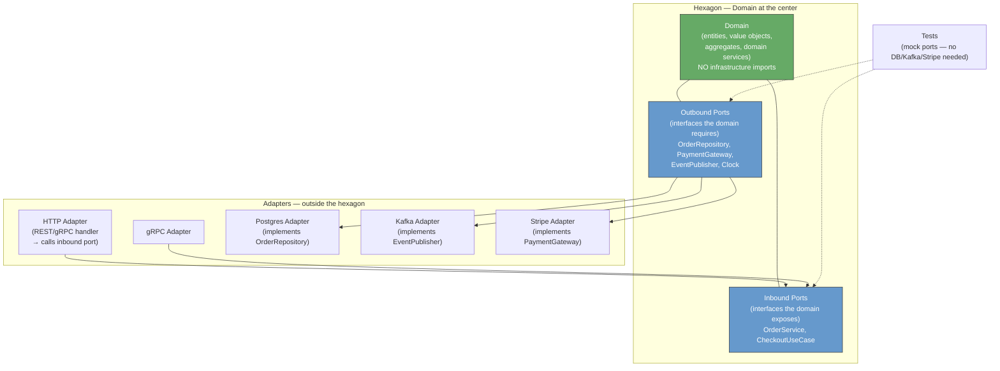
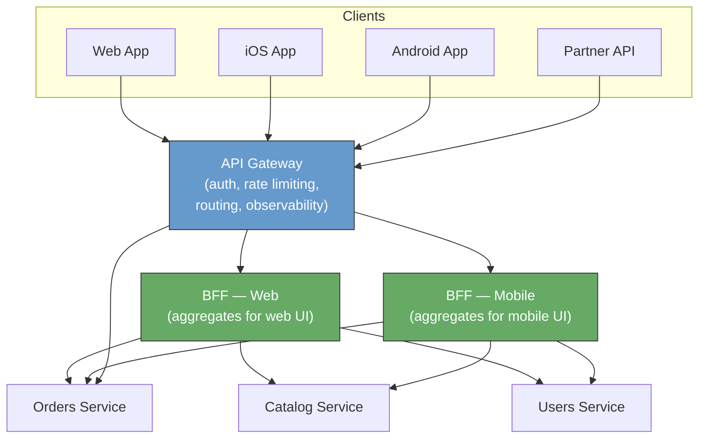
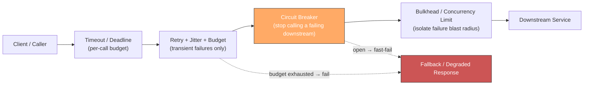
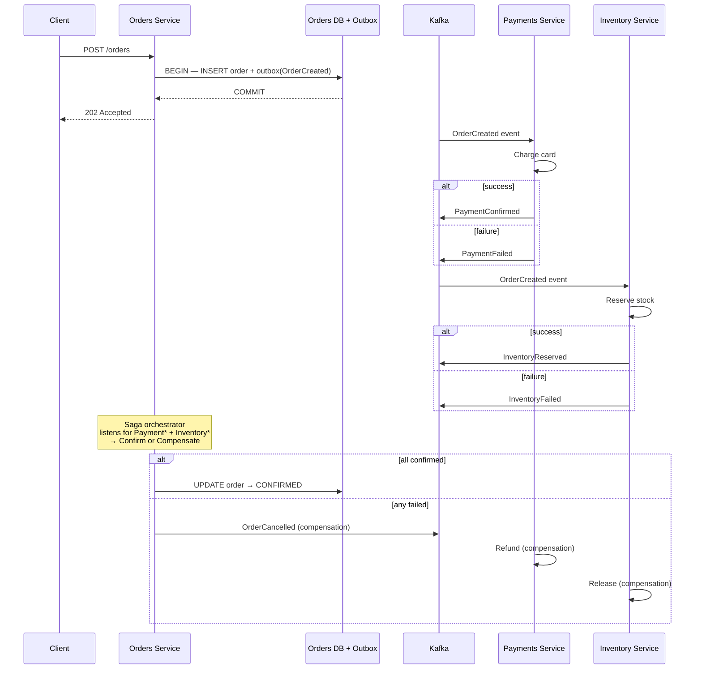
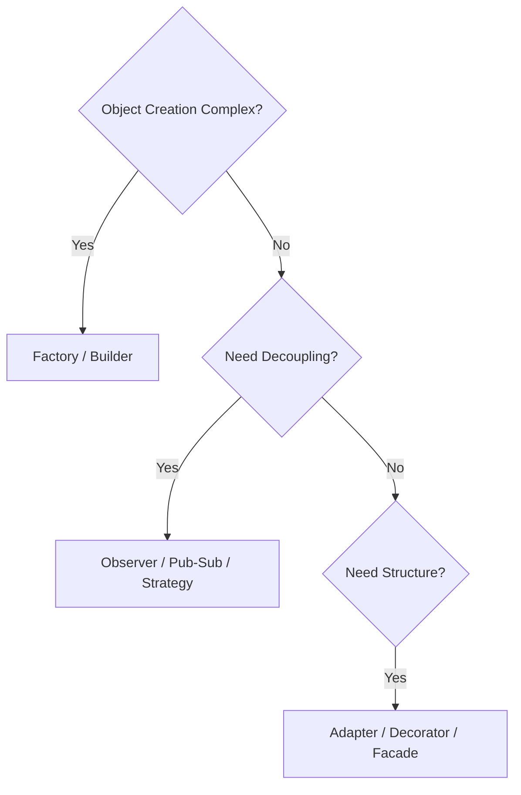

# Chapter 6 — Design Patterns and Anti-Patterns for Services

**What this chapter covers.** Every backend team eventually faces the same fork: solve a new problem by inventing a bespoke mechanism, or apply a known pattern whose trade-offs are understood. Patterns are not recipes to follow blindly — they are a shared vocabulary for naming recurring problems and the forces that shape their solutions. Anti-patterns are equally valuable: they name the attractive-but-wrong paths that look expedient and end in distributed monoliths, shared databases, and god services. This chapter builds a working catalog of patterns and anti-patterns at the service level — the layer where architecture meets code. You will learn the structural patterns that organize service internals (hexagonal/clean, layered vs. vertical slice, repository), the communication patterns that connect services (gateway, BFF, sidecar), the resilience and data patterns that keep them correct under failure (circuit breaker, outbox, saga, CQRS), and the behavioral patterns that keep business logic composable (strategy, decorator/middleware, observer). For each, you will see when it helps, what it costs, how it fails, and what to use instead when it does not fit.

Learning goals — after this chapter you should be able to:

- Explain what a design pattern is at the service level, how it differs from a framework or library, and how to evaluate whether a pattern's trade-offs fit your context.
- Apply structural patterns — hexagonal/ports-and-adapters, layered, and vertical-slice — to organize service code for testability, replaceability, and team ownership; and implement repository, factory, and dependency-injection patterns concretely.
- Design inter-service communication with gateway, BFF, sidecar/ambassador, and idempotency patterns — and choose among them based on client diversity, team topology, and operational overhead.
- Use resilience patterns (retry with jitter, circuit breaker, bulkhead, timeout/hedging) and data patterns (outbox, saga, CQRS, event sourcing) correctly by understanding their guarantees and failure modes, building on Volumes 10 and 11.
- Compose business logic with strategy, decorator/middleware, and observer/event patterns to keep handlers small, policies pluggable, and cross-cutting concerns separated.
- Identify and remediate service anti-patterns — distributed monolith, shared database, god service, chatty service, big ball of mud, golden hammer, and cargo-cult adoption — with concrete refactoring steps.
- Decide when *not* to apply a pattern, articulating the complexity cost and the simpler alternative.

---

## 1. Patterns, principles, and the cost of abstraction

A **design pattern** is a named, reusable solution to a recurring problem in a recurring context, with known consequences. The original *Gang of Four* formulation (Gamma et al., 1994) catalogued 23 object-level patterns; the backend equivalent catalogs service-level patterns — solutions to recurring distributed-systems problems whose context includes network partitions, partial failure, team boundaries, and independent deployability.

Patterns are not plug-and-play. Every pattern trades one quality for another:

| Pattern | What it buys | What it costs |
|---|---|---|
| Hexagonal architecture | Testability, adapter replaceability | Extra interfaces and mapping layers |
| Circuit breaker | Failure isolation | State to manage; fallback semantics to define |
| CQRS | Read/write scaling and model separation | Two models to maintain; eventual consistency |
| Sidecar | Transparent cross-cutting concerns | Per-pod resource overhead; operational complexity |

The engineering judgment is not "which patterns do we know?" but "which trade-offs can we afford for *this* service at *this* scale with *this* team?"

> **Distributed-systems lens.** In a single-process system, a bad pattern choice costs maintainability. In a distributed system, it costs availability, consistency, or both. A shared-database anti-pattern does not just couple code — it couples failure domains and deployment pipelines. A chatty-service anti-pattern does not just waste CPU — it amplifies tail latency multiplicatively across fan-out. Understanding patterns at the service level is inseparable from understanding their distributed-systems consequences.

### Principles behind the patterns

Patterns implement principles. The most load-bearing for services:

- **Single Responsibility (SRP)** — a service, module, or class should have one reason to change. A service that handles orders, payments, and notifications has three.
- **Dependency Inversion (DIP)** — depend on abstractions, not concretions. The domain should not import the database driver; the driver should implement the domain's port.
- **Open/Closed** — open for extension, closed for modification. New payment providers should be added by implementing an interface, not by editing a switch statement.
- **Separation of concerns** — business rules, I/O, and cross-cutting concerns (auth, observability, retries) belong in different layers with different rates of change.
- **Explicit boundaries** — every dependency that crosses a network, a team, or a consistency boundary should be visible in the code, not hidden behind a transparent abstraction.

---

## 2. Pattern catalog — map of the territory

```mermaid
flowchart TB
    subgraph Structural["Structural — how a service is organized internally"]
        HEX["Hexagonal / Ports & Adapters\n(Clean, Onion)"]
        LAYER["Layered vs Vertical Slice"]
        REPO["Repository + Unit of Work"]
        DI["Dependency Injection\n(Constructor, Wire, Fx)"]
    end

    subgraph Communication["Communication — how services connect"]
        GW["API Gateway / BFF / Aggregator"]
        SIDE["Sidecar / Ambassador\n(Service Mesh)"]
        IDEM["Idempotency Key\n+ Exactly-Once via Outbox"]
        DISC["Service Discovery\n+ Health Checks + Load Balancing"]
    end

    subgraph Resilience["Resilience — how services survive failure"]
        CB["Circuit Breaker"]
        RETRY["Retry + Jitter + Budget"]
        BULK["Bulkhead / Concurrency Limit"]
        TIME["Timeout + Deadline + Hedging"]
    end

    subgraph Data["Data — how services handle state across boundaries"]
        OUTBOX["Transactional Outbox + CDC"]
        SAGA["Saga (Choreography / Orchestration)"]
        CQRS["CQRS + Event Sourcing"]
        CACHE["Cache-Aside / Read-Through\n+ Invalidation"]
    end

    subgraph Behavioral["Behavioral — how logic stays composable"]
        STRAT["Strategy (pluggable policies)"]
        DECOR["Decorator / Middleware Chain"]
        OBS["Observer / Domain Events"]
        FACTORY["Factory / Builder\n(for complex aggregates)"]
    end

    subgraph Anti["Anti-Patterns — attractive but wrong"]
        DMONO["Distributed Monolith"]
        SDB["Shared Database"]
        GOD["God Service / Big Ball of Mud"]
        CHATTY["Chatty Service / N+1 Fan-Out"]
        HAMMER["Golden Hammer / Cargo Cult"]
    end

    Structural --- Communication
    Communication --- Resilience
    Resilience --- Data
    Data --- Behavioral
    Behavioral -.->|"misapplied becomes"| Anti

    style Structural fill:#6a6,stroke:#333,color:#fff
    style Anti fill:#c55,stroke:#333,color:#fff
```



This chapter covers each category with one or two representative patterns in depth and others in comparative tables. Resilience and data patterns are summarized here and covered exhaustively in Volume 10 (Messaging/Streaming) and Volume 11 (Reliability/SRE) — this chapter focuses on *when and how to apply them* at the service-design level.

---

## 3. Structural patterns — organizing service internals

### 3.1 Hexagonal architecture (ports and adapters)

Hexagonal architecture (Alistair Cockburn, 2005), also called ports-and-adapters or clean/onion architecture, inverts the dependency direction: the domain sits at the center and depends on nothing; infrastructure (HTTP, DB, queues, clocks) depends on the domain through ports (interfaces).



**Concrete layout in Go:**

```
orders-service/
├── internal/
│   ├── domain/              # hexagon center — no external imports
│   │   ├── order.go         # Order aggregate (see Ch 05 §3.2)
│   │   ├── money.go         # Money value object
│   │   ├── ports.go         # inbound + outbound port interfaces
│   │   └── errors.go        # domain errors (no HTTP status codes here)
│   ├── application/         # use cases — orchestrate domain + ports
│   │   └── checkout.go      # CheckoutService: validates, calls domain, publishes events
│   └── adapters/
│       ├── http/            # inbound adapter
│       │   └── handler.go   # HTTP → application.CheckoutService
│       ├── postgres/        # outbound adapter
│       │   └── order_repo.go
│       ├── kafka/           # outbound adapter
│       │   └── publisher.go
│       └── stripe/          # outbound adapter
│           └── gateway.go
├── cmd/server/main.go       # wiring (DI) — the only place that knows all adapters
└── go.mod
```

```go
// internal/domain/ports.go — ports are defined BY the domain, IN the domain.
package domain

import "context"

// Inbound port — what the domain offers.
type CheckoutUseCase interface {
    Checkout(ctx context.Context, cmd CheckoutCommand) (*Order, error)
}

// Outbound ports — what the domain requires. Implemented by adapters.
type OrderRepository interface {
    FindByID(ctx context.Context, id OrderID) (*Order, error)
    Save(ctx context.Context, order *Order) error
}

type PaymentGateway interface {
    Charge(ctx context.Context, orderID OrderID, amount Money) (PaymentID, error)
}

type EventPublisher interface {
    Publish(ctx context.Context, events ...DomainEvent) error
}

type Clock interface {
    Now() time.Time // testability: inject fixed clock in tests
}

// Application layer — orchestrates domain + ports. No HTTP, no SQL.
package application

type CheckoutService struct {
    orders   domain.OrderRepository
    payments domain.PaymentGateway
    events   domain.EventPublisher
    clock    domain.Clock
}

func (s *CheckoutService) Checkout(ctx context.Context, cmd domain.CheckoutCommand) (*domain.Order, error) {
    order, err := domain.NewOrder(cmd.CustomerID, cmd.Lines, s.clock.Now())
    if err != nil {
        return nil, err
    }
    if err := order.Confirm(); err != nil {
        return nil, err
    }
    // Charge via outbound port — adapter handles Stripe/HTTP details.
    if _, err := s.payments.Charge(ctx, order.ID(), order.Total()); err != nil {
        return nil, err
    }
    if err := s.orders.Save(ctx, order); err != nil {
        return nil, err
    }
    // Domain events collected on the aggregate, published via port.
    return order, s.events.Publish(ctx, order.DomainEvents()...)
}
```

```go
// internal/adapters/http/handler.go — inbound adapter. Translates HTTP ↔ domain.
func (h *Handler) Checkout(w http.ResponseWriter, r *http.Request) {
    var req struct {
        CustomerID string      `json:"customer_id"`
        Lines      []lineReq   `json:"lines"`
    }
    if err := json.NewDecoder(r.Body).Decode(&req); err != nil {
        writeError(w, http.StatusBadRequest, "invalid request body")
        return
    }
    cmd := domain.CheckoutCommand{
        CustomerID: domain.CustomerID(req.CustomerID),
        Lines:      mapLines(req.Lines),
    }
    order, err := h.checkout.Checkout(r.Context(), cmd)
    if err != nil {
        // Map domain errors → HTTP. Domain never knows HTTP status codes.
        writeDomainError(w, err)
        return
    }
    writeJSON(w, http.StatusCreated, mapOrder(order))
}
```

**What hexagonal buys:**

| Benefit | How |
|---|---|
| **Testability** | Test `CheckoutService` with mock `OrderRepository`/`PaymentGateway` — no DB, no Stripe, no Kafka. Domain tests are pure unit tests. |
| **Replaceability** | Swap Postgres → DynamoDB by writing a new `OrderRepository` adapter; domain and application unchanged. |
| **Visibility** | Every I/O dependency is an explicit constructor argument — `go vet` and code review can see what a service touches. |

**What it costs:** extra interfaces, mapping code, and discipline to keep domain free of infrastructure types (no `sql.DB`, no `http.Request`, no `kafka.Producer` in `internal/domain`). For CRUD services with no domain logic, the indirection is overhead — use a simpler layered or vertical-slice structure instead.

### 3.2 Layered vs. vertical slice

| Style | Organization | Strength | Weakness |
|---|---|---|---|
| **Layered** (horizontal) | `handler → service → repository → DB` — layers span all features. | Familiar; easy to find "where DB code lives." | Cross-cutting changes touch many layers; easy to leak concerns (SQL in handlers). |
| **Vertical slice** | One directory per feature: `checkout/` owns its handler, service, repo, and tests. Shared kernel (`domain/`, `money.go`) is minimal. | Feature isolation; team can own a slice end-to-end; delete a feature by deleting a directory. | Shared logic must be explicitly extracted; risk of duplication. |
| **Hexagonal** | Domain center + ports + adapters (above). | Strongest isolation; best for complex domains. | Most ceremony; overkill for simple services. |

**Guidance:** start with **vertical slices** for services with distinct features owned by one team, and introduce **hexagonal** ports only where you need replaceability or testability of I/O. Avoid pure layered architecture for services with more than a few endpoints — it optimizes for finding code by technical role rather than by business capability, which is the wrong axis for team ownership.

### 3.3 Repository, unit of work, and dependency injection

**Repository** (covered in Chapter 05 §3.3) presents aggregates as an in-memory collection. **Unit of Work** extends it to coordinate a transaction across multiple repositories:

```go
// UnitOfWork — a single transaction spanning multiple repositories.
type UnitOfWork interface {
    Orders() domain.OrderRepository
    Outbox() OutboxRepository
    Commit(ctx context.Context) error
    Rollback() error
}

func (s *CheckoutService) Checkout(ctx context.Context, cmd domain.CheckoutCommand) error {
    uow, err := s.uowFactory.Begin(ctx)
    if err != nil {
        return err
    }
    defer uow.Rollback() // no-op if already committed

    order, _ := domain.NewOrder(cmd.CustomerID, cmd.Lines, s.clock.Now())
    order.Confirm()
    if err := uow.Orders().Save(ctx, order); err != nil {
        return err
    }
    for _, evt := range order.DomainEvents() {
        if err := uow.Outbox().Append(ctx, evt); err != nil {
            return err
        }
    }
    return uow.Commit(ctx) // atomic: order + outbox or neither
}
```

**Dependency injection** — wire dependencies at startup, not inside business logic:

```go
// cmd/server/main.go — the composition root. The ONLY place that knows concrete adapters.
func main() {
    cfg := config.Load()

    db := must(postgres.Connect(cfg.DatabaseURL))
    clock := &realClock{}
    orderRepo := postgres.NewOrderRepository(db)
    outboxRepo := postgres.NewOutboxRepository(db)
    uowFactory := postgres.NewUOWFactory(db)
    stripeGW := stripe.NewGateway(cfg.StripeKey)
    kafkaPub := kafka.NewPublisher(cfg.KafkaBrokers, "orders.v1")

    checkoutSvc := application.NewCheckoutService(orderRepo, stripeGW, kafkaPub, clock, uowFactory)
    handler := http.NewHandler(checkoutSvc)

    // Also used for graceful shutdown, health checks, etc.
    server := &http.Server{Addr: cfg.Addr, Handler: handler.Router()}
    // ...
}

// Tests inject fakes — no real DB/Stripe/Kafka.
func TestCheckout_InsufficientInventory(t *testing.T) {
    repo := &fakeOrderRepo{}
    gw := &fakePaymentGateway{chargeErr: errors.New("declined")}
    svc := application.NewCheckoutService(repo, gw, &fakePublisher{}, &fixedClock{}, &fakeUOW{})
    _, err := svc.Checkout(ctx, cmd)
    require.ErrorContains(t, err, "declined")
}
```

Use `google/wire` or `uber/fx` for larger services where manual wiring grows unwieldy; for small services, constructor injection without a framework is clearer.

---

## 4. Communication patterns

### 4.1 API gateway, BFF, and aggregator



| Pattern | Responsibility | When to use |
|---|---|---|
| **API Gateway** | Cross-cutting: authN/Z, TLS termination, rate limiting, routing, request logging, WAF. Single entry point. | Always, once you have more than a few services. Use Kong, AWS API Gateway, or Envoy Gateway — do not build your own. |
| **BFF (Backend for Frontend)** | Per-client aggregation: one BFF per client type (web, mobile, partner) that composes calls to downstream services into the shape the client needs. | When different clients need different views of the same data (mobile needs fewer fields, web needs richer). Prevents clients from doing N downstream calls. |
| **Aggregator** | Server-side fan-out that merges responses from multiple services. Can live in BFF or as a standalone service. | When a single client request requires data from 3+ services. Use parallel fan-out with hedged timeouts (Vol 11, Ch 10). |

**BFF implementation sketch:**

```go
// bff-mobile/handler.go — aggregates orders + catalog + user for mobile.
func (h *Handler) GetOrderForMobile(w http.ResponseWriter, r *http.Request) {
    orderID := r.PathValue("orderID")
    ctx, cancel := context.WithTimeout(r.Context(), 800*time.Millisecond)
    defer cancel()

    // Parallel fan-out — fail fast, hedge tail (see Vol 11, Ch 10).
    g, ctx := errgroup.WithContext(ctx)
    var order *OrderView
    var productNames map[string]string
    var userDisplayName string

    g.Go(func() error { var err error; order, err = h.orders.Get(ctx, orderID); return err })
    g.Go(func() error { var err error; productNames, err = h.catalog.Names(ctx, order.ProductIDs()); return err })
    g.Go(func() error { var err error; userDisplayName, err = h.users.DisplayName(ctx, order.CustomerID); return err })

    if err := g.Wait(); err != nil {
        writeError(w, mapDownstreamError(err))
        return
    }
    // Shape for mobile — fewer fields, denormalized.
    writeJSON(w, http.StatusOK, mobileOrderView{Order: order, Products: productNames, Customer: userDisplayName})
}
```

### 4.2 Sidecar and ambassador

A **sidecar** is a container that runs alongside the main service container in the same pod, handling cross-cutting concerns transparently. An **ambassador** is a sidecar that proxies outbound calls; a **sidecar proxy** (Envoy, Linkerd) handles both inbound and outbound.

```
Pod: orders-service
┌─────────────────────┐  ┌──────────────────────┐
│  orders (app)       │  │  envoy (sidecar)     │
│  :8080              │──│  :15001 (outbound)   │──→ catalog-service
│  business logic     │  │  mTLS, retries,      │──→ payments-service
│  no retry/TLS code  │  │  circuit breaking,   │
│                     │  │  metrics, tracing    │
└─────────────────────┘  └──────────────────────┘
         ▲ requests proxied through sidecar
         │ (app calls catalog:8080 → iptables → envoy → mTLS → catalog)
```

| Concern | Without sidecar (in-app) | With sidecar (Envoy/Istio/Linkerd) |
|---|---|---|
| mTLS | Every service links a TLS library, manages certs | Envoy handles cert rotation via SDS/SPIRE (Vol 09, Ch 10) |
| Retries / timeouts | Custom per-service, inconsistent | Declarative `VirtualService` / `RetryPolicy` — uniform across fleet |
| Metrics / tracing | Per-language instrumentation | Envoy emits `istio_requests_total`, trace headers automatically |
| Cost | No extra container | ~50–100 MB RAM + ~1–3ms latency per hop |

**When to use sidecars:** when you need uniform cross-cutting behavior across polyglot services and can afford the operational overhead of a mesh. For homogeneous Go/Java fleets where a shared library (gRPC interceptors, resilience4j, Polly) can provide the same, a library may be simpler than a mesh. See Volume 12, Chapter 02–03 (Kubernetes/service mesh).

### 4.3 Idempotency — the prerequisite for safe retries

Any service that is called with retries (and every service should be — networks fail) must handle duplicate requests safely. The idempotency-key pattern (Chapter 04 case study) generalizes:

```go
// Middleware — idempotency for any mutating handler.
func IdempotencyMiddleware(repo IdempotencyRepository, ttl time.Duration) func(http.Handler) http.Handler {
    return func(next http.Handler) http.Handler {
        return http.HandlerFunc(func(w http.ResponseWriter, r *http.Request) {
            key := r.Header.Get("Idempotency-Key")
            if key == "" {
                // Optionally require the header for POST/PUT/PATCH.
                next.ServeHTTP(w, r)
                return
            }
            // Check if we've seen this key before.
            if cached, ok := repo.Get(r.Context(), key); ok {
                // Replay the stored response — same status + body.
                w.WriteHeader(cached.StatusCode)
                w.Write(cached.Body)
                return
            }
            // Capture the response.
            rec := httptest.NewRecorder()
            next.ServeHTTP(rec, r)
            repo.Store(r.Context(), key, StoredResponse{
                StatusCode: rec.Code,
                Body:       rec.Body.Bytes(),
            }, ttl)
            // Copy captured response to real writer.
            for k, v := range rec.Header() {
                w.Header()[k] = v
            }
            w.WriteHeader(rec.Code)
            w.Write(rec.Body.Bytes())
        })
    }
}
```

For stronger guarantees (exactly-once across DB + side effects), combine with the transactional outbox — store the idempotency record in the same transaction as the business write.

---

## 5. Resilience patterns — surviving partial failure

Resilience patterns are covered in depth in Volume 11, Chapter 10. This section maps them to service-design decisions — where each pattern lives and how they compose.



**Composition order matters** — timeout wraps retry, retry is gated by circuit breaker, bulkhead is innermost (closest to the downstream):

```go
// Correct composition — timeout → retry (with budget) → circuit breaker → bulkhead → call.
func CallCatalog(ctx context.Context, req CatalogRequest) (*CatalogResponse, error) {
    // 1. Deadline — total budget for this call including retries.
    ctx, cancel := context.WithTimeout(ctx, 500*time.Millisecond)
    defer cancel()

    // 2. Circuit breaker — fast-fail if downstream is known-bad.
    if !cb.Allow() {
        return nil, ErrCircuitOpen
    }

    // 3. Bulkhead — limit concurrent calls to this downstream.
    if !bulkhead.TryAcquire() {
        return nil, ErrBulkheadFull
    }
    defer bulkhead.Release()

    // 4. Retry with jitter + budget — only for retryable errors.
    var resp *CatalogResponse
    err := retry.Do(ctx, retry.Config{
        MaxAttempts: 3,
        Backoff:     retry.ExponentialWithJitter(20*time.Millisecond, 200*time.Millisecond),
        Budget:      retry.Budget{MaxRetriesPerSecond: 100}, // prevents retry storms
        RetryIf:     isRetryable, // only 429/503/timeout — never 400/404
    }, func(ctx context.Context) error {
        var err error
        resp, err = catalogClient.Get(ctx, req)
        return err
    })

    cb.Record(err == nil) // success/failure for breaker state machine
    return resp, err
}
```

| Pattern | Where it lives | Key tuning | Failure if misconfigured |
|---|---|---|---|
| **Timeout / Deadline** | Caller — per RPC, propagated via `context` / `grpc-timeout` header. | p99 of downstream + headroom; tighter for fan-out. | Too tight: false failures. Too loose: caller holds resources, amplifies outage. |
| **Retry + Jitter + Budget** | Caller — only for idempotent or explicitly retryable calls. | Exponential backoff with full jitter; budget to cap retry fraction. | No jitter: thundering herd. No budget: retry storm DDoS's the downstream it is trying to help. |
| **Circuit Breaker** | Caller — per downstream, per caller. States: closed → open → half-open. | Failure threshold (e.g., 50% over 10s), half-open probe rate. | Threshold too low: flaps. Too high: keeps sending traffic to a dead downstream. |
| **Bulkhead** | Caller — per downstream. Channel/semaphore limiting concurrent calls. | Limit = downstream concurrency × (1 + headroom). | Too low: rejects healthy traffic. Too high: no isolation. |
| **Hedging** | Caller — fan-out optimization. Send to 2 replicas, use first response. | Delay before hedged request (p90 latency). | Too aggressive: doubles load. |

---

## 6. Data patterns — consistency across services

Data patterns for distributed services are covered in Volume 10, Chapters 04–06. This section summarizes the service-design implications.

| Pattern | Problem | Guarantee | Cost |
|---|---|---|---|
| **Transactional Outbox + CDC** | Publish events atomically with DB writes. | At-least-once delivery; no lost events. | Outbox table + relay (Debezium/poller) to operate. |
| **Saga — Choreography** | Multi-service transaction without 2PC. Each service reacts to events and publishes the next. | Eventual consistency; compensations on failure. | No central view of saga state; hard to debug. |
| **Saga — Orchestration** | Same, but a coordinator (orchestrator) drives the steps. | Same, but centralized state and timeout handling. | Orchestrator is a single point of logic (but not necessarily availability). |
| **CQRS** | Read and write workloads have different scaling/model needs. | Separate read/write models; eventual consistency between them. | Two models to maintain; read model lags writes. |
| **Event Sourcing** | Need audit trail / temporal queries / replay. Store events as source of truth, derive state. | Complete history; any projection can be rebuilt. | Event schema evolution; snapshotting for performance; unfamiliar to most teams. |



**Choosing choreography vs. orchestration:**

- **Choreography** — services publish events; interested services react. Decoupled, no coordinator, but no single place to see "where is order #123 in the saga?" Use when the flow is linear and short (2–3 steps).
- **Orchestration** — a saga orchestrator (Temporal, Camunda, or a custom service) drives the steps, handles timeouts, and triggers compensations. Centralized visibility and error handling. Use when the flow branches, has timeouts, or requires human steps.

---

## 7. Behavioral patterns — keeping logic composable

### 7.1 Strategy — pluggable policies

When business logic varies by type, region, or customer tier, a `switch` statement that grows with every new variant is the wrong abstraction. Strategy encapsulates each variant behind a common interface.

```go
// Strategy — pricing varies by region and customer tier.
type PricingStrategy interface {
    Price(ctx context.Context, items []LineItem) (Money, error)
}

type USPricing struct{ catalog Catalog }
type EUPricing struct{ catalog Catalog; vat VATService }
type EnterprisePricing struct{ catalog Catalog; discount DiscountService }

func (p *USPricing) Price(ctx context.Context, items []LineItem) (Money, error) {
    // US: sum + sales tax by state
}
func (p *EUPricing) Price(ctx context.Context, items []LineItem) (Money, error) {
    // EU: sum + VAT per country
}

// Factory selects the strategy — handler never sees the switch.
func PricingFor(region string, tier string) PricingStrategy {
    switch {
    case tier == "enterprise":
        return &EnterprisePricing{catalog: cat, discount: disc}
    case region == "EU":
        return &EUPricing{catalog: cat, vat: vat}
    default:
        return &USPricing{catalog: cat}
    }
}

// Handler — open for extension (new strategy), closed for modification.
func (h *Handler) Checkout(w http.ResponseWriter, r *http.Request) {
    strategy := PricingFor(req.Region, req.Tier)
    total, err := strategy.Price(r.Context(), items)
    // ...
}
```

### 7.2 Decorator / middleware chain — cross-cutting concerns

Cross-cutting concerns (auth, logging, metrics, tracing, rate limiting, idempotency) should not be interleaved with business logic. Decorator/middleware wraps handlers in a composable chain:

```go
// Decorator chain — each middleware wraps the next. Order matters.
func NewRouter(svc *CheckoutService, deps Dependencies) http.Handler {
    var h http.Handler = &checkoutHandler{svc: svc}

    // Outermost → innermost (request flows top→bottom, response bottom→top).
    h = RecoveryMiddleware(h)          // 1. panic → 500 (outermost — catches all)
    h = TracingMiddleware(h)           // 2. start span
    h = MetricsMiddleware(h)           // 3. record latency + status
    h = LoggingMiddleware(deps.Logger, h) // 4. structured access log
    h = AuthMiddleware(deps.Auth, h)   // 5. verify JWT → context with principal
    h = RateLimitMiddleware(deps.Limiter, h) // 6. per-principal rate limit
    h = IdempotencyMiddleware(deps.IdempotencyRepo, h) // 7. dedup (closest to handler)
    h = ValidationMiddleware(h)        // 8. JSON schema / field validation

    mux := http.NewServeMux()
    mux.Handle("POST /orders", h)
    return mux
}

// Each middleware is a small, testable unit.
func AuthMiddleware(auth Authenticator, next http.Handler) http.Handler {
    return http.HandlerFunc(func(w http.ResponseWriter, r *http.Request) {
        principal, err := auth.Verify(r.Header.Get("Authorization"))
        if err != nil {
            writeError(w, http.StatusUnauthorized, "invalid token")
            return
        }
        ctx := context.WithValue(r.Context(), principalKey, principal)
        next.ServeHTTP(w, r.WithContext(ctx))
    })
}

func MetricsMiddleware(next http.Handler) http.Handler {
    return http.HandlerFunc(func(w http.ResponseWriter, r *http.Request) {
        start := time.Now()
        rec := &statusRecorder{ResponseWriter: w, status: 200}
        next.ServeHTTP(rec, r)
        httpDuration.WithLabelValues(r.Method, r.URL.Path, strconv.Itoa(rec.status)).
            Observe(time.Since(start).Seconds())
    })
}
```

The same pattern applies to gRPC interceptors (`grpc.UnaryInterceptor`), Kafka consumer middleware, and domain-service decorators.

### 7.3 Observer / domain events — decoupling side effects

When an order is confirmed, many things should happen: send a confirmation email, update the search index, notify the warehouse, emit a metric. Embedding all of them in `Order.Confirm()` couples the aggregate to every downstream concern. Observer (via domain events) decouples them:

```go
// Domain — Order.Confirm() only records the event, does not act on it.
func (o *Order) Confirm() error {
    // ... validation
    o.status = StatusConfirmed
    o.events = append(o.events, OrderConfirmed{OrderID: o.id, CustomerID: o.customerID})
    return nil
}

// Application — after persisting, publish events. Observers react independently.
func (s *CheckoutService) Checkout(ctx context.Context, cmd CheckoutCommand) error {
    // ... create + confirm + save (with outbox)
    return s.publisher.Publish(ctx, order.DomainEvents()...)
}

// Observers — each in its own service/bounded context, independently deployable.
type EmailObserver struct{ mailer Mailer }
func (o *EmailObserver) Handle(ctx context.Context, evt OrderConfirmed) error {
    return o.mailer.SendConfirmation(ctx, evt.CustomerID, evt.OrderID)
}

type SearchObserver struct{ indexer SearchIndexer }
func (o *SearchObserver) Handle(ctx context.Context, evt OrderConfirmed) error {
    return o.indexer.IndexOrder(ctx, evt.OrderID)
}
```

Observers can be in-process (for modular monoliths) or out-of-process via Kafka (for distributed services) — the domain does not know or care, because the event is published through a port.

---

## 8. Anti-patterns — the attractive wrong paths

Anti-patterns are not just "bad code" — they are solutions that *appear* beneficial but carry hidden costs that compound. Each anti-pattern below includes the seductive reasoning, the actual cost, and the refactoring path.

### 8.1 Distributed monolith

```mermaid
flowchart TB
    subgraph MonolithDoneRight["Modular Monolith (acceptable)"]
        M["Single deployable\nmodules with explicit boundaries\nin-process calls\nsingle DB with owned tables"]
        style M fill:#6a6,stroke:#333,color:#fff
    end

    subgraph DistributedMonolith["Distributed Monolith (anti-pattern)"]
        A2["Service A"] -->|"sync HTTP<br/>required for every request"| B2["Service B"]
        B2 -->|"sync HTTP<br/>required"| C2["Service C"]
        C2 -->|"sync HTTP"| A2
        A2 --- DB2[("Shared DB<br/>cross-service FKs")]
        B2 --- DB2
        C2 --- DB2
        style A2 fill:#c55,stroke:#333,color:#fff
        style B2 fill:#c55,stroke:#333,color:#fff
        style C2 fill:#c55,stroke:#333,color:#fff
    end

    subgraph Proper["Properly Bounded Services"]
        A3["Service A<br/>own DB"] -->|"async events<br/>eventual consistency"| B3["Service B<br/>own DB"]
        B3 -->|"async events"| C3["Service C<br/>own DB"]
        A3 -.->|"sync only where<br/>strong consistency required"| B3
        style A3 fill:#6a6,stroke:#333,color:#fff
        style B3 fill:#6a6,stroke:#333,color:#fff
        style C3 fill:#6a6,stroke:#333,color:#fff
    end
```



**Seduction:** "We have microservices — each domain is a separate service with its own repo."

**Reality:** every request fans out synchronously to 3+ services; a failure in any one fails the whole request; deploys must be coordinated because services share a DB or make breaking synchronous assumptions; you have the operational cost of distributed systems with none of the independence benefits.

**Diagnosis:**

| Signal | Indicates distributed monolith |
|---|---|
| A single user request requires synchronous calls to 3+ services to complete | Over-decomposed or wrong boundaries |
| Deploying service A requires deploying service B simultaneously | Shared DB, shared library with breaking changes, or synchronous contract coupling |
| p99 latency = sum of downstream p99s (not max) | Sequential fan-out without hedging or async |
| One service's outage causes 100% failure of another's requests | No bulkhead, no fallback, hard dependency |

**Refactoring path:**

1. Identify the *actual* bounded contexts (Chapter 05 §4) — merge services that are always called together synchronously; they may be one context.
2. Replace synchronous cross-context calls with async events (outbox + Kafka) where eventual consistency is acceptable.
3. Break shared-DB coupling (next anti-pattern) — give each service its own tables/DB.
4. Introduce BFF/aggregator for client-facing fan-out so that inter-service calls are not on the synchronous request path.
5. If the system is small enough, consider *re-monolithing* into a modular monolith — fewer operational failure modes, same logical boundaries.

### 8.2 Shared database

**Seduction:** "Joining across services is convenient; foreign keys guarantee consistency."

**Reality:** the database is a single point of coupling — schema changes require cross-team coordination, one service's slow query starves others, no team can evolve its schema independently, and the DB becomes the availability bottleneck that no amount of service redundancy can fix.

**Refactoring:** each bounded context owns its tables (or its own DB). Cross-context reads go through APIs or replicated read models (CDC → Kafka → materialized view), not joins. Foreign keys across contexts become ID references validated at the application layer, with eventual consistency.

### 8.3 God service / big ball of mud

**Seduction:** "Adding this endpoint to the existing service is faster than creating a new one."

**Reality:** the service accumulates unrelated responsibilities, its deploy risk grows with every feature, its test suite takes 30 minutes, and every team must understand every other team's code to make a change. Conway's law inverts — the org chart now mirrors the god service's tangled internals.

| Signal | Remediation |
|---|---|
| Service handles 5+ unrelated domains (orders + payments + notifications + search) | Identify bounded contexts; extract one at a time via strangler fig (Chapter 05 §6) |
| PRs from different teams constantly conflict | Vertical slices or service extraction along team boundaries |
| Test suite is slow and flaky due to shared state | Hexagonal ports + test doubles; split integration tests per bounded context |
| Deploy frequency drops because every change feels risky | Smaller services with independent pipelines; feature flags for risky changes |

### 8.4 Chatty service

**Seduction:** "Each service should be small and focused, so we call the catalog service once per line item."

**Reality:** N+1 fan-out — an order with 50 lines triggers 50 catalog calls. Latency multiplies, downstream is hammered, and tail latency becomes catastrophic under fan-out (`p99_single^fanout`).

```go
// Anti-pattern — N+1 chatty calls.
func (s *OrderService) EnrichOrder(ctx context.Context, order *Order) error {
    for _, line := range order.Lines {
        // 50 sequential (or even parallel) calls for one order — chatty.
        product, err := s.catalog.Get(ctx, line.ProductID)
        if err != nil {
            return err
        }
        line.ProductName = product.Name
    }
    return nil
}

// Fix — batch API.
func (s *OrderService) EnrichOrder(ctx context.Context, order *Order) error {
    ids := collectIDs(order.Lines)
    products, err := s.catalog.GetBatch(ctx, ids) // single call: GET /products?ids=...
    if err != nil {
        return err
    }
    for i, line := range order.Lines {
        order.Lines[i].ProductName = products[line.ProductID].Name
    }
    return nil
}

// Fix — denormalized read model (CQRS) so no cross-service call is needed at read time.
func (s *OrderService) EnrichOrder(ctx context.Context, order *Order) error {
    // Product names are projected into the orders read model via CDC/Kafka.
    // No synchronous call at all — eventual consistency (seconds).
    return nil // already denormalized
}
```

Every downstream API should offer a batch endpoint (`GetBatch`, `ListByIDs`) and callers should use it. For read-heavy enrichment, a denormalized read model (CQRS projection) eliminates the call entirely.

### 8.5 Golden hammer and cargo cult

| Anti-pattern | Seduction | Reality |
|---|---|---|
| **Golden hammer** | "We use Kafka/event sourcing/CQRS for everything — it is our standard." | Applying a complex pattern where a simple one suffices. A config service does not need event sourcing; a CRUD admin panel does not need CQRS. Every pattern's cost is paid even when its benefit is not needed. |
| **Cargo cult** | "Netflix/Uber does it this way, so we should too." | Copying the *solution* without the *context* that made it appropriate. Netflix's chaos engineering and microservices make sense at Netflix's scale and failure domain; at 5 services and 10 engineers, they are overhead. |

**Antidote:** for every pattern adoption, write a one-paragraph *context statement*: "We chose X because our context has properties A, B, C that make X's trade-offs worthwhile. If A/B/C change, we will revisit." This is an ADR (Chapter 04 §4.3) — the durable record that prevents cargo-culting.

### 8.6 Other service anti-patterns — quick reference

| Anti-pattern | Symptom | Fix |
|---|---|---|
| **Leaky abstraction** | Service exposes its internal storage model (e.g., DB primary keys, internal status codes) in its API. | API types are distinct from domain/DB types; map explicitly at the adapter boundary. |
| **Distributed transactions (2PC)** | Cross-service transaction via XA/2PC that blocks on coordinator. | Saga with compensations (choreography or orchestration); accept eventual consistency. |
| **Synchronous event processing** | Consumer blocks waiting for another service during event handling, reintroducing sync coupling. | Consumer handles events idempotently and locally; any cross-service need is a new async event. |
| **No versioning / breaking changes** | API changes break consumers without warning; no `Sunset`/`Deprecation` headers, no expand-contract. | Versioned APIs (Vol 08, Ch 05), breaking-change gates (`oasdiff`/`buf breaking`), expand-contract migrations. |
| **Logging as observability** | `log.Printf("order %s failed", id)` as the only signal; no metrics, no traces, no structured fields. | Structured logging + metrics + traces (Vol 11, Ch 2–4); every service emits RED metrics and propagates trace context. |
| **Hardcoded topology** | Service addresses in config files or env vars; no service discovery; deploys require config updates. | Service discovery (Kubernetes DNS, Consul, Envoy EDS); health checks; no hardcoded IPs. |

---

## 9. Choosing patterns — a decision framework

Not every service needs every pattern. Use this framework when evaluating a pattern for a specific service:

```
1. What problem does this pattern solve?
   → Name the concrete pain (not "it is best practice").

2. What does it cost?
   → Code complexity, operational burden, team knowledge, latency, storage.

3. Is the cost justified at THIS scale?
   → A pattern that pays off at 100 services may not at 5.
   → Estimate: will the problem occur without the pattern? How often? How severe?

4. What is the simpler alternative?
   → Transaction script vs. hexagonal; modular monolith vs. distributed services;
     poll vs. event-driven; library vs. sidecar.

5. Can we adopt incrementally?
   → Strangler fig, feature flags, shadow traffic — avoid big-bang rewrites.

6. How will we know if it was the right choice?
   → Metrics that validate the pattern's benefit (latency, error rate, deploy frequency,
     MTTR) and signals that it should be removed (complexity without benefit).

If you cannot answer (1) with a concrete problem and (3) with a scale argument,
do not adopt the pattern.
```

**Pattern adoption by service maturity:**

| Service maturity | Patterns to prioritize | Patterns to defer |
|---|---|---|
| **New service, small team, simple domain** | Vertical slices, repository, idempotency, timeout+retry, structured logging | Hexagonal, CQRS, event sourcing, sidecar mesh, saga |
| **Growing service, multiple teams, moderate complexity** | Hexagonal ports, BFF, outbox+events, circuit breaker, bulkhead, strategy/decorator | CQRS, event sourcing (unless audit/replay needed) |
| **Large service, many teams, complex domain** | Full DDD (bounded contexts, aggregates, ACLs), CQRS where read/write scale diverges, saga orchestration, sidecar mesh | — most patterns justified; focus on not over-applying |

---

## Key takeaways

- Patterns are trade-offs, not virtues. Every pattern buys a quality (testability, isolation, scalability) at a cost (complexity, operational burden, latency). The engineering decision is whether the trade-off fits your context — scale, team size, domain complexity, and failure domain.
- Structural patterns (hexagonal/ports-and-adapters, repository, unit of work, dependency injection) organize service internals for testability and replaceability. Hexagonal is the strongest isolation — domain at the center, infrastructure behind ports — but its ceremony is justified only where domain complexity or adapter replaceability matters.
- Communication patterns (gateway, BFF, sidecar/ambassador, idempotency) connect services. Gateways handle cross-cutting edge concerns; BFFs shape responses per client; sidecars transparently add mTLS/retries/metrics at the cost of per-pod overhead; idempotency keys make retries safe.
- Resilience patterns (timeout, retry with jitter and budgets, circuit breaker, bulkhead, hedging) compose in a specific order — timeout outermost, bulkhead innermost — and each has tuning that determines whether it helps or harms. Misconfigured retries cause the outages they were meant to prevent.
- Data patterns (outbox, saga, CQRS, event sourcing) handle consistency across services without distributed transactions. Outbox guarantees at-least-once event delivery; sagas coordinate multi-service workflows with compensations; CQRS separates read/write models at the cost of eventual consistency.
- Behavioral patterns (strategy, decorator/middleware, observer/domain events) keep business logic composable. Strategy makes policies pluggable; decorator chains isolate cross-cutting concerns; observer decouples side effects via domain events.
- Anti-patterns — distributed monolith, shared database, god service, chatty service, golden hammer, cargo cult — are attractive because they optimize for short-term speed. Their costs compound as scale and team size grow. Diagnose them with concrete signals (synchronous fan-out depth, shared-DB coupling, N+1 calls) and remediate incrementally via strangler fig, batch APIs, read models, and explicit boundaries.
- When in doubt, choose the simpler alternative and add patterns incrementally as concrete pain justifies them. A one-paragraph context statement (ADR) for each pattern adoption prevents cargo-culting and makes future revisits possible.

## Further reading

- Erich Gamma, Richard Helm, Ralph Johnson, John Vlissides — *Design Patterns: Elements of Reusable Object-Oriented Software* (1994). The original catalog — still the best vocabulary for object-level patterns; many service patterns are compositions of GoF patterns.
- Martin Fowler — *Patterns of Enterprise Application Architecture* (2002). Repository, Unit of Work, Service Layer, and other enterprise patterns that underpin service internals. https://martinfowler.com/eaaCatalog/
- Alistair Cockburn — *Hexagonal Architecture* (2005). The ports-and-adapters formulation that inverts infrastructure dependencies. https://alistair.cockburn.us/hexagonal-architecture/
- Robert C. Martin — *Clean Architecture* (2017). Dependency rule, clean boundaries, and the relationship between hexagonal, onion, and clean architectures.
- Sam Newman — *Monolith to Microservices* (2019) and *Building Microservices* (2nd ed., 2021). Strangler fig, decomposition, and service-boundary patterns with operational realism.
- Chris Richardson — *Microservices Patterns* (2018). Comprehensive service-level pattern catalog with code examples.
- Michael Nygard — *Release It!* (2nd ed., 2018). Circuit breaker, bulkhead, timeout, and other stability patterns grounded in production failure stories.
- Gregor Hohpe and Bobby Woolf — *Enterprise Integration Patterns* (2003). Messaging patterns (outbox, saga, event-driven) that underpin inter-service communication. https://www.enterpriseintegrationpatterns.com/
- Mark Richards — *Software Architecture Patterns* (2015) — layered, event-driven, microkernel patterns and their trade-offs. https://www.oreilly.com/library/view/software-architecture-patterns/9781491971437/

### Pattern selection decision tree


