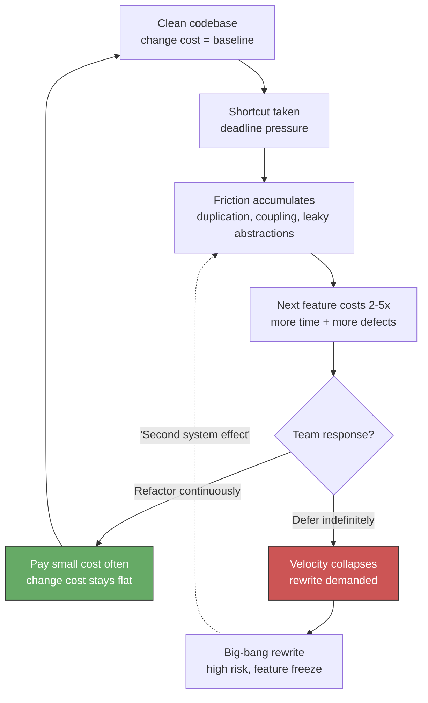
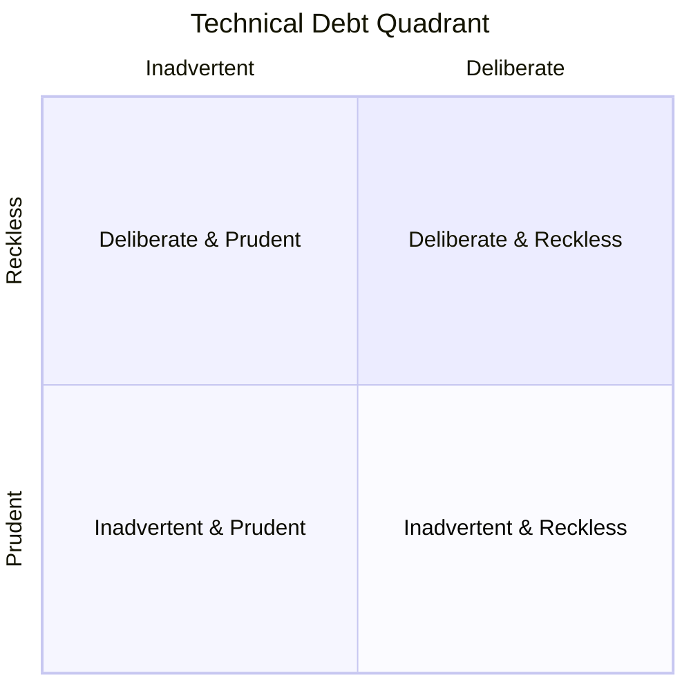
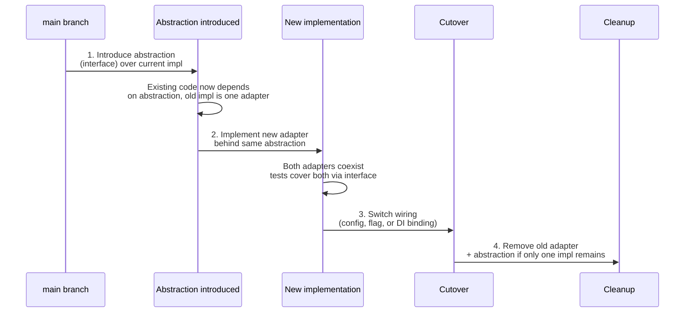
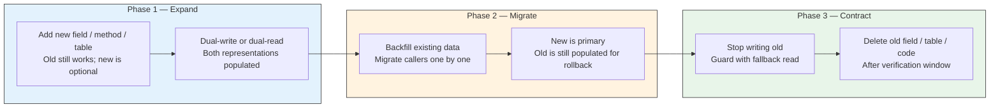
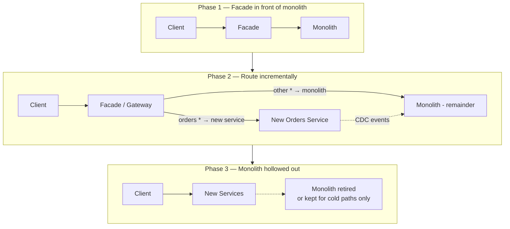
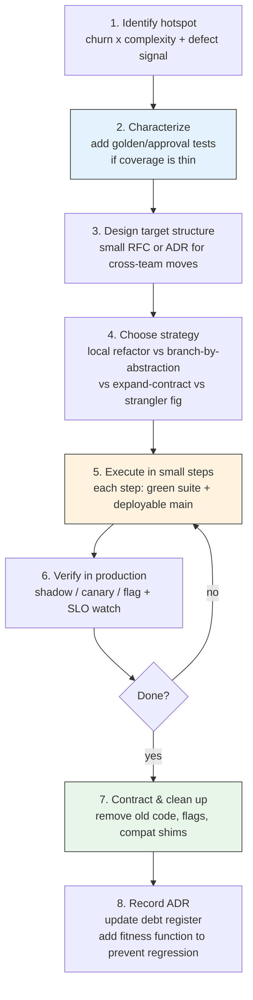
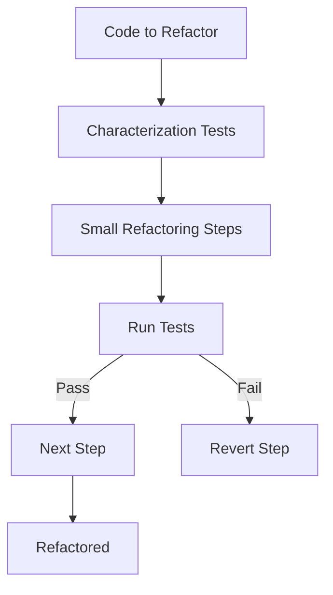

# Chapter 7 — Refactoring and Managing Technical Debt

**What this chapter covers.** Every codebase accumulates friction: duplicated logic, tangled dependencies, leaky abstractions, and expedient shortcuts that outlive the deadline that justified them. Refactoring is the disciplined practice of improving internal structure without changing external behavior — the mechanism by which a team keeps a codebase malleable enough to absorb the next requirement without collapse. Technical debt is the complementary frame: the economic model that explains *why* friction accumulates, how to measure it, when to tolerate it, and when to pay it down. This chapter connects the two. You will learn a working catalog of refactoring techniques from single-function transforms to large-scale architectural migrations, the safety net that makes refactoring economically rational, the strategies that scale refactoring across services and teams (branch by abstraction, parallel change, expand-contract, strangler fig), and a complete system for managing technical debt as a portfolio — identification, quantification, prioritization, allocation, and governance.

Learning goals — after this chapter you should be able to:

- Define refactoring precisely, distinguish it from rewriting and rework, and articulate when each is appropriate.
- Identify code smells and design smells systematically, map them to the underlying design principle violated, and select the matching refactoring.
- Apply a catalog of fundamental refactorings — extract method/type, replace conditional with polymorphism, introduce parameter object, encapsulate collection, and others — with mechanically safe steps and automated tooling.
- Execute large-scale refactorings safely across a service graph using branch by abstraction, parallel change (expand-contract), strangler fig, and feature-flag-driven techniques without long-lived branches or big-bang migrations.
- Refactor persistent state — database schemas, event schemas, and API contracts — with backward-compatible, zero-downtime techniques.
- Quantify technical debt using static analysis, change coupling, and socio-technical signals; maintain a debt register; and prioritize repayment with a cost-of-delay model.
- Build an organizational system for managing debt — allocation models, fitness functions, architectural governance, and the business case for continuous refactoring — and connect it to the reliability and velocity outcomes leaders care about.

---

## 1. What refactoring is — and what it is not

### 1.1 The definition

Martin Fowler's definition remains the standard: **refactoring is a disciplined technique for restructuring an existing body of code, altering its internal structure without changing its external behavior** (Fowler, *Refactoring*, 2nd ed., 2018). Two senses of the word matter:

- **Refactoring (noun):** a change that improves structure while preserving observable behavior — e.g., "this commit is a refactoring that extracts the pricing engine."
- **Refactoring (verb):** the activity performed in small, behavior-preserving steps, each followed by a green test suite.

The invariant is **observable behavior**. If a user, a downstream service, or a test that specifies intended behavior can tell the difference, the change is not a refactoring — it is a feature change, a bug fix, or a breaking change. Refactoring can be interleaved with either, but must be separable in version history so reviewers can verify the behavior-preserving claim.

### 1.2 Refactoring vs. rewriting vs. rework

| Activity | Behavior change? | Scope | Risk profile | When to use |
|---|---|---|---|---|
| **Refactoring** | No (by definition) | Targeted: one smell, one module | Low per step; suite stays green | Code is hard to change; next feature will be expensive without cleanup |
| **Rework / enhancement** | Yes (intentional) | Feature-scoped | Medium; requires new tests | Requirements changed |
| **Rewrite** | Intended to be none, but in practice broad | Module or service | High; behavioral parity is hard to prove | Architecture is fundamentally unfit and incremental improvement has failed repeatedly |

Rewrites are seductive because the current code's flaws are visible and the imagined replacement's flaws are not. Joel Spolsky's maxim — "never rewrite from scratch" — overstates the case, but the base rate is sobering: most declared rewrites either fail outright or reintroduce the same domain complexity with new bugs and a year-long feature freeze. **Prefer refactoring unless you can articulate a specific architectural property the current structure cannot be refactored to achieve** (e.g., a consistency boundary that requires a different data-ownership topology) and you have a strangler-fig plan to get there incrementally (Section 5).

> **Distributed-systems lens.** In a service graph, refactoring has a blast radius. Renaming a field inside one service is local; changing a shared event schema or a database table that two services read is a distributed refactoring that requires coordination, versioning, and backward compatibility. The techniques in Sections 5–6 exist precisely because naive "refactor then deploy" fails when state and contracts are shared across deployment boundaries.

### 1.3 The economics: why refactor at all?

Refactoring pays for itself through **option value** — it keeps the cost of the *next* change low. Without it, change cost compounds:



The business case is not aesthetic. Studies of change coupling (Yourdon, Lehman) and modern analyses from CodeScene and *Accelerate* (Forsgren et al.) show the same pattern: files with high churn *and* high complexity are where defects and lead time concentrate. Refactoring those hotspots yields disproportionate returns. Section 7 turns this intuition into a prioritization model.

---

## 2. Code smells and technical debt — naming the problem

### 2.1 Code smells: surface symptoms of design problems

A **code smell** is a surface indication that deeper design friction may be present — not a defect per se, but a predictor. Fowler catalogs over 20; the most load-bearing for backend services:

| Smell | What you see | Principle violated | Typical refactoring |
|---|---|---|---|
| **Duplicated code** | Same logic in 2+ places; copy-paste with minor variation | DRY | Extract method/class, pull up, template method, strategy |
| **Long method / long class** | 100+ line method; class with 10+ responsibilities | SRP | Extract method, extract class, replace with command |
| **Large parameter list** | 5+ parameters, especially booleans | Encapsulation | Introduce parameter object, preserve whole object |
| **Feature envy** | Method uses another object's data more than its own | Encapsulation, Tell Don't Ask | Move method, extract |
| **Data clumps** | Same 3–4 fields travel together (`userId, tenantId, region`) | Abstraction | Introduce value object |
| **Primitive obsession** | Strings/ints where domain types belong (`email: string`, `money: float`) | Domain modeling | Replace primitive with object, value object |
| **Switch on type / type code** | `if type == "premium"` branching across many files | Open/Closed | Replace conditional with polymorphism / strategy |
| **Shotgun surgery** | One requirement changes 10 files | SRP, coupling | Move method/field, inline, reorganize |
| **Divergent change** | One class changes for many unrelated reasons | SRP | Extract class, split |
| **God object / god service** | One class/service knows and does too much | SRP, bounded contexts | Extract, strangler fig, DDD decomposition |
| **Leaky abstraction** | Callers handle callee's internal concerns (SQL errors, retry logic) | Encapsulation, DIP | Hide delegate, ports and adapters |
| **Dead code / speculative generality** | Unused abstraction "for future use" | YAGNI | Delete (with version control as safety net) |

Not every smell warrants action. A smell in cold code that rarely changes is low-priority. A smell in a hotspot — a file touched in every sprint — is a tax paid repeatedly. That distinction is the bridge to debt prioritization (Section 7).

### 2.2 Technical debt — a taxonomy

Ward Cunningham coined "technical debt" as a financial metaphor: shipping expedient code is like taking on debt — you gain speed now, you pay interest on every subsequent change until you repay the principal. The metaphor is powerful and frequently abused. A useful taxonomy separates four quadrants (Fowler):



| Quadrant | Example | Stance |
|---|---|---|
| **Deliberate, prudent** | "We must ship before the regulatory deadline; we will incur duplication in the checkout flow and schedule repayment next quarter." | Legitimate. Debt is tracked, bounded, and repaid. |
| **Deliberate, reckless** | "We don't have time for tests or review — just ship it." | Never acceptable at scale; interest compounds immediately. |
| **Inadvertent, prudent** | "We now understand the domain better; the abstraction we chose six months ago no longer fits." | Inevitable. Learning *is* the work. Celebrate discovery. |
| **Inadvertent, reckless** | "What's layering? Just put the SQL in the handler." | Education problem. Fix with standards, templates, and review. |

Three debt types recur in backend systems beyond code-level debt:

- **Architectural debt** — missing or wrong boundaries (shared databases, synchronous coupling where async is needed, absent bulkheads). Highest interest, hardest to repay.
- **Data debt** — inconsistent schemas, missing constraints, unversioned events, tech-debt columns (`is_legacy_flow boolean` with no removal plan).
- **Operational debt** — missing dashboards, untested runbooks, manual deploys, absent load tests. Paid during incidents, with interest denominated in MTTR.
- **Documentation debt** — undocumented decisions, stale ADRs, missing context. Paid every time a new engineer asks "why is it this way?"

### 2.3 Debt is not all bad

Zero debt is not the goal — just as zero financial leverage is not optimal for a business. Deliberate, prudent debt lets a team probe a market or meet a deadline while committing to repayment. The discipline is **visibility and boundedness**: every deliberate debt item is recorded in a debt register with owner, rationale, estimated principal, interest rate, and a repayment trigger (date, metric, or next touch). Untracked debt is not leverage — it is hidden liability.

---

## 3. A refactoring catalog — from local to structural

The catalog below is organized from small, mechanically safe transforms to broader structural moves. Each entry gives the smell it addresses, the mechanical steps, and a before/after sketch. The steps are ordered to keep the suite green after each sub-step — the essence of disciplined refactoring.

### 3.1 Foundational local refactorings

#### Extract method

**Smell:** Long method with distinct logical blocks; duplicated fragments.
**Mechanics:** Identify a fragment with a coherent purpose → name it by what it does (not how) → move it to a new method → replace original fragment with a call → test.

```go
// Before — handler mixes validation, pricing, and persistence
func HandleCreateOrder(w http.ResponseWriter, r *http.Request) {
    var req CreateOrderRequest
    if err := json.NewDecoder(r.Body).Decode(&req); err != nil {
        http.Error(w, "bad request", 400); return
    }
    if req.CustomerID == "" || len(req.Items) == 0 {
        http.Error(w, "validation failed", 422); return
    }
    // ... 40 more lines of pricing, inventory checks, DB writes
}

// After — intent is visible; each piece is testable in isolation
func HandleCreateOrder(w http.ResponseWriter, r *http.Request) {
    req, err := decodeAndValidate(r)
    if err != nil { writeValidationError(w, err); return }
    order, err := buildOrder(req)
    if err != nil { writeDomainError(w, err); return }
    if err := orderRepo.Save(r.Context(), order); err != nil {
        writeInternalError(w, err); return
    }
    writeJSON(w, 201, order)
}

func decodeAndValidate(r *http.Request) (CreateOrderRequest, error) { /* ... */ }
func buildOrder(req CreateOrderRequest) (*Order, error)             { /* ... */ }
```

#### Introduce parameter object / preserve whole object

**Smell:** Data clumps; methods that take `userID, tenantID, region, locale` together.
**Mechanics:** Create a value object → replace parameter list → optionally add behavior to the object.

```python
# Before — primitive obsession + data clump
def price_order(user_id: str, tenant_id: str, region: str, items: list[LineItem]) -> Money:
    ...

# After — domain type carries invariants and behavior
@dataclass(frozen=True)
class PricingContext:
    user_id: UserID
    tenant_id: TenantID
    region: Region

    def is_enterprise(self) -> bool:
        return self.tenant_id.tier == "enterprise"

def price_order(ctx: PricingContext, items: list[LineItem]) -> Money:
    ...
```

#### Replace conditional with polymorphism / strategy

**Smell:** `switch` or `if/else` chain on a type code scattered across many functions.
**Mechanics:** Define a strategy interface → create one implementation per branch → replace conditional with dispatch.

```go
// Before — branching on type leaks everywhere
func CalculateFee(order Order) int64 {
    switch order.Tier {
    case "standard": return order.Amount * 3 / 100
    case "premium":  return order.Amount * 2 / 100
    case "enterprise": return 0
    default: panic("unknown tier")
    }
}

// After — open for extension, closed for modification (Vol 15, Ch 6)
type FeePolicy interface{ Calculate(amount int64) int64 }

type StandardFee struct{}
func (StandardFee) Calculate(a int64) int64 { return a * 3 / 100 }

type EnterpriseFee struct{}
func (EnterpriseFee) Calculate(int64) int64 { return 0 }

func CalculateFee(order Order, policy FeePolicy) int64 {
    return policy.Calculate(order.Amount)
}
```

#### Encapsulate collection

**Smell:** Callers manipulate an internal slice/map directly, breaking invariants.
**Mechanics:** Return a copy or read-only view; add intention-revealing mutators.

#### Replace primitive with value object

**Smell:** `email string` validated ad hoc in many places; `money float64` invites rounding bugs.
**Mechanics:** Introduce a validated, immutable type with behavior (`EmailAddress`, `Money`).

### 3.2 Structural refactorings

#### Extract class / split god object

**Smell:** One class handles persistence, validation, pricing, and notification.
**Mechanics:** Identify a coherent responsibility → create a new class → move related fields/methods → wire via constructor injection. Repeat until each class has one reason to change.

#### Move method / move field

**Smell:** Feature envy — a method uses another object's data more than its own.
**Mechanics:** Move the method to the object whose data it actually needs; keep a delegating wrapper if callers exist, deprecate it, then remove.

#### Hide delegate / introduce facade

**Smell:** `order.Customer().Address().ZipCode()` — callers navigate an internal object graph.
**Mechanics:** Add a method on the intermediate object that encapsulates the traversal; callers depend on fewer types.

### 3.3 Keeping refactorings safe

Every refactoring above is **mechanics + safety net**. The safety net is the test suite (Chapter 1). When coverage at the seam is thin, add a **characterization test** first — a test that captures current behavior *as is* (including bugs, if the bug is load-bearing for callers) so refactoring cannot silently change it:

```python
# Characterization test — lock current behavior before refactoring
def test_price_order_characterization(snapshot):
    # Record actual outputs for known inputs before any structural change.
    cases = load_fixture("pricing_golden_cases.json")
    for c in cases:
        result = price_order(c.ctx, c.items)
        assert result == snapshot  # golden-file / approval test

# After refactoring, the same golden file must still pass.
```

Automated refactoring tools reduce mechanical error: IDE extract-method, structural search-and-replace (e.g., `comby`, `OpenRewrite`, `jscodeshift`, `gofmt -r`, `gofmt/rewrite`, `IntelliJ structural replace`), and codemods for cross-repo changes (e.g., `ast-grep`, `codemod` via `libCST`/`ts-morph`). For large-scale renames, prefer the tool over hand-editing — the tool preserves semantics that eyeballs miss.

---

## 4. Large-scale refactoring strategies

Local refactorings preserve behavior within one codebase. Large-scale refactorings move behavior across module, service, or schema boundaries — often while production traffic is flowing. Long-lived feature branches are the failure mode: they diverge, conflict, and become unreviewable. The strategies below share one invariant: **`main` stays deployable after every commit; old and new coexist behind an abstraction until the migration is complete.**

### 4.1 Branch by abstraction

The workhorse for in-code migrations (e.g., replace an ORM, swap a pricing engine, extract a shared library).



Concrete steps with a Go example:

```go
// Step 1 — introduce abstraction over current payment gateway
type PaymentGateway interface {
    Charge(ctx context.Context, req ChargeRequest) (ChargeResult, error)
    Refund(ctx context.Context, id string) error
}

// Old implementation becomes one adapter:
type StripeGateway struct{ /* ... */ }
func (s *StripeGateway) Charge(ctx context.Context, req ChargeRequest) (ChargeResult, error) { /* ... */ }

// Step 2 — new adapter coexists:
type AdyenGateway struct{ /* ... */ }
func (a *AdyenGateway) Charge(ctx context.Context, req ChargeRequest) (ChargeResult, error) { /* ... */ }

// Step 3 — wiring chooses the implementation (config or flag)
func NewGateway(cfg Config) PaymentGateway {
    if cfg.PaymentProvider == "adyen" { return &AdyenGateway{cfg: cfg} }
    return &StripeGateway{cfg: cfg}
}
// Step 4 — delete StripeGateway once Adyen is proven in production.
```

The same pattern ports to Python/TypeScript/Java. The key discipline: each step is a reviewable, deployable commit. No branch lives longer than a day or two.

### 4.2 Parallel change (expand and contract)

Also called *parallel change* (Hills) and *expand-contract* for schemas. The invariant: **expand first (add the new), migrate, then contract (remove the old)**. Never break callers mid-migration.



Database example — renaming `user.name` to `user.display_name` with zero downtime:

```sql
-- Expand: add new column, dual-write via trigger or application code
ALTER TABLE users ADD COLUMN display_name TEXT;
-- Application writes both columns; reads prefer new, fallback to old.

-- Migrate: backfill
UPDATE users SET display_name = name WHERE display_name IS NULL;

-- Contract (after all callers read display_name and verification window passes):
-- First: stop writing `name` (application change)
-- Then, after retention period:
ALTER TABLE users DROP COLUMN name;
```

Event-schema and API-contract migrations follow the same shape: add optional field → publish/subscribe both → migrate consumers → remove old. Backward and forward compatibility are non-negotiable (Vol 8, Ch 5/8; Vol 10, Ch 6).

### 4.3 Strangler fig

For service extraction or replacing a subsystem that cannot be refactored in place (Vol 15, Ch 5 DDD — decomposing a monolith). A facade intercepts calls to the legacy system and gradually routes them to new services.



Tactical notes:

- Route by **bounded context** (Vol 15, Ch 5), not by database table. A vertical slice that owns its data is the right extraction unit.
- Keep data synchronized via CDC (Debezium) or domain events (outbox) during coexistence — not dual-writes in application code, which drift.
- Measure extraction by **traffic share**, not code share. "80% of /orders traffic now served by new service" is the cutover criterion.
- Each increment is independently deployable and reversible — the facade can route back.

### 4.4 Feature flags and dark launches

Flags decouple *deployment* from *release*. Refactored code ships to production behind a flag, is exercised with mirrored or canary traffic, and is promoted by flipping the flag — not by deploying new code. This collapses the risk of large refactorings:

```go
// Flag-guarded cutover — both paths live; flag chooses.
func (s *Service) PriceOrder(ctx context.Context, req PriceRequest) (Money, error) {
    if s.flags.Enabled(ctx, "pricing-v2", req.UserID) {
        return s.pricingV2.Price(ctx, req)
    }
    return s.pricingV1.Price(ctx, req)
}
// Observability: emit flag evaluation + both results (shadow mode) to compare before cutover.
```

Compound with progressive delivery: enable for internal users → 1% of traffic → 10% → 100%, with automated rollback on SLO violation (Vol 11, Ch 9). Cleanup is mandatory — stale flags are debt. Enforce flag TTLs and a periodic flag-pruning job (e.g., `flags expire 30 days after 100% rollout; CI fails if a flag older than TTL is still referenced`).

---

## 5. Refactoring persistent state — the hard part

Code can be refactored atomically within a deploy. State cannot — it outlives any single deploy and is observed concurrently by old and new code. Three contexts recur.

### 5.1 Relational schema refactoring

Beyond `expand-contract`, common techniques:

| Goal | Technique | Notes |
|---|---|---|
| Rename column/table | Expand-contract (above) | Keep old name as alias/view if the DB supports it |
| Split table (extract entity) | Create new table → dual-write / CDC → backfill → switch reads → stop old writes → drop | Add FK after backfill for consistency |
| Merge tables | Create view over join → migrate readers to view → materialize → drop originals | Verify query plans after merge |
| Change column type | Add new typed column → dual-write with conversion → backfill with casting → switch reads | Beware implicit casts in existing queries |
| Add non-nullable column | Add as nullable → backfill → add `NOT NULL` + default | Adding `NOT NULL` directly locks on large tables (Postgres < 11) |
| Drop constraint/index | Make constraint `NOT VALID` → validate concurrently | Avoid long exclusive locks |

Zero-downtime DDL tooling: `pgroll`, `gh-ost`, `pt-online-schema-change`, `Atlas`. Always test migrations on a production-sized staging copy with concurrent traffic.

### 5.2 Event and message schema evolution

Events are persisted in logs (Kafka) and in consumer state. Breaking an event schema breaks every consumer at once. Apply the same expand-contract at the serialization layer:

- **Additive changes only by default.** New optional fields with defaults; never rename or remove without a version.
- **Schema registry** (Vol 8, Ch 10; Vol 10, Ch 1) enforces compatibility (`BACKWARD`, `FORWARD`, `FULL`). CI rejects incompatible schemas.
- **Upcasting:** consumers handle multiple schema versions and upcast old events on read.
- **Versioned topics** for breaking changes: `orders.v2` coexists with `orders.v1`; a stream processor bridges during migration.

### 5.3 API contract refactoring

API refactoring is schema refactoring with external callers you do not control. Rules from Vol 8 apply:

- Additive field additions are safe; removals require deprecation, sunset headers, and a version.
- Behavioral changes (new validation, different defaults) are breaking even if the schema is compatible — version them.
- Consumer-driven contracts (Pact) catch the cross-team breakage that schema checks miss.

---

## 6. Measuring and managing technical debt — as a portfolio

### 6.1 Identifying debt — beyond linting

Static analysis (SonarQube, CodeScene, Semgrep, `golangci-lint`, `ruff`, `eslint`) catches code-level smells but misses the highest-interest debt — the code that is *both* complex and frequently changed. Combine signals:

| Signal | Tool / query | What it reveals |
|---|---|---|
| **Complexity × churn hotspots** | CodeScene, `git log --stat` + `lizard`/`radon` | Files where every change is expensive and risky |
| **Change coupling** | CodeScene temporal coupling; `git log --name-only` co-change analysis | Modules that should be decoupled but change together |
| **Defect density** | Bug tracker → file mapping | Where debt is already causing incidents |
| **Lead time / cycle time** | DORA metrics per service/area | Where debt slows delivery |
| **Socio-technical: knowledge silos** | `git log --author` bus factor per module | Where debt is unpayable if one person leaves |
| **Socio-technical: review latency** | PR analytics | Where debt makes review hard |
| **Operational: on-call load** | Alert frequency per service | Where operational debt is denominated in pages |

CodeScene's *hotspot map* (complexity vs. churn) is the single most useful visualization: the upper-right quadrant — high complexity, high churn — is where refactoring ROI is highest.

### 6.2 The debt register — making debt visible

Every deliberate debt item is an entry. Lightweight template:

```markdown
## Debt Register Entry — D-2026-042

- **Title:** Checkout pricing duplicated across `orders` and `cart` services
- **Area / service:** `orders`, `cart` — pricing domain
- **Type:** Architectural — shared logic that should be a single service/value object
- **Rationale for incurring:** Needed to ship Q2 promo without blocking on pricing-service extraction (RFC-031)
- **Principal (est.):** 3–5 engineer-weeks to extract + migrate (incl. data, tests, flag)
- **Interest:** Every pricing change requires 2 PRs + 2 deploys; ~0.5 day overhead per change; 2 incidents in 6 months from drift (INC-2026-07, INC-2026-11)
- **Interest rate signal:** Pricing files are top-5 hotspots by churn×complexity; co-change coupling between services is 0.82
- **Owner:** @pricing-team
- **Repayment trigger:** Next pricing-rule change OR 2026-Q4, whichever comes first
- **Status:** Accepted — scheduled next quarter
- **Links:** RFC-031, INC-2026-07, CodeScene hotspot report 2026-08
```

Store the register alongside ADRs (Vol 15, Ch 4) — debt decisions *are* architectural decisions. Review it at quarterly planning the way you review a financial balance sheet.

### 6.3 Prioritization — cost of delay

Not all debt should be repaid; some should be tolerated. Prioritize by **cost of delay** — the interest you will pay if you wait:

```
priority ≈ (interest per period × urgency) / principal

interest per period = extra lead time + defect risk + on-call load per sprint
urgency             = likelihood the code will be touched soon (churn forecast)
principal           = cost to repay now
```

Operationalized as a simple scoring sheet:

| Criterion (1–5) | Weight | Score × weight |
|---|---|---|
| Frequency of change in affected code (churn) | ×3 | |
| Defect / incident correlation | ×3 | |
| Degradation of lead time / cycle time | ×2 | |
| Knowledge silo / bus factor | ×2 | |
| Blocks a planned roadmap item | ×2 | |
| Repayment cost (inverse — cheaper = higher score) | ×1 | |

Highest weighted score is repaid first. Lowest may be *intentionally* tolerated — document why in the register and move on.

### 6.4 Allocation — making repayment habitual, not heroic

Debt repaid only during "debt sprints" never gets repaid — the sprint is always preempted. Effective allocation models:

- **Capacity allocation:** Reserve a fixed fraction (commonly 15–25%) of every sprint for debt repayment, chosen from the prioritized register. Google's widely cited 20% is a starting point; tune by measuring lead time.
- **Boy Scout Rule:** Leave every file you touch a little better than you found it — small, opportunistic refactorings piggybacked on feature work. Enforce via review norms, not process.
- **Debt budget per service:** Each service owner may allocate their budget as they see fit; platform teams provide the register and hotspot data.
- **Fitness functions** (Safari, *Building Evolutionary Architectures*): Automated checks that fail the build when architectural debt regresses — e.g., "no new dependency from `orders` to `cart` DB," "cyclomatic complexity of hotspot files must not increase," "no new `// TODO(debt)` without a register entry."

```yaml
# Example fitness functions as CI checks (ArchUnit / ArchGuard / custom)
fitness_functions:
  - name: no-circular-dependencies
    tool: deptrac
    rule: "layer:domain must not depend on layer:infrastructure"
    severity: fail

  - name: hotspot-complexity-cap
    tool: lizard
    rule: "files in hotspot list: cyclomatic complexity <= 15"
    severity: warn   # fail after grace period

  - name: debt-todo-requires-register
    tool: semgrep
    rule: 'pattern: // TODO(debt): $MSG  -> requires matching D- entry'
    severity: fail

  - name: no-shared-db-access
    tool: sql-allowlist
    rule: "service 'cart' may not query tables owned by 'orders'"
    severity: fail
```

### 6.5 Governance — who decides?

Debt is an architectural concern and needs clear ownership:

- **Service owners** own code-level debt in their services and the decision to repay or tolerate it.
- **Staff / principal engineers** own cross-service architectural debt and approve strangler-fig / expand-contract plans that span teams.
- **Quarterly debt review** — 30 minutes, register + hotspot map + DORA trends. Decide: repay, tolerate (with recorded rationale), or escalate.
- **ADRs for every tolerate decision** — "we are intentionally *not* repaying D-042 this quarter because …" is a decision that deserves an ADR.

---

## 7. The refactoring workflow — putting it together

A repeatable workflow that ties safety net, mechanics, and large-scale strategy into one loop:



Toolchain reference for each phase:

| Phase | Representative tooling |
|---|---|
| Identify | CodeScene, SonarQube, `lizard`/`radon`, `git log` churn scripts, DORA dashboards |
| Characterize | ApprovalTests, `jest --updateSnapshot`, `pytest --snapshot-update`, `go test -update` |
| Design | RFC template (Vol 15, Ch 4), C4 diagrams, dependency analysis (`deptrac`, `madge`) |
| Execute — local | IDE refactorings, `comby`, `ast-grep`, `OpenRewrite`, `jscodeshift`, `gofmt -r` |
| Execute — cross-repo | `codemod` + `ast-grep`, `all-repos` search+replace, `git filter-repo` for history |
| Execute — schema | `pgroll`, `gh-ost`, `Atlas`, schema registry compatibility checks, `buf breaking` |
| Verify | Feature flags (LaunchDarkly, OpenFeature, Unleash), Argo Rollouts/Flagger, SLO-based auto-rollback, shadow traffic |
| Prevent regression | Fitness functions (ArchUnit, ArchGuard, OPA/Rego), CODEOWNERS, CI debt checks |

---

## 8. Case study — strangling a god service

A realistic scenario that exercises several techniques together.

**Starting point:** A `monolith` owns orders, pricing, inventory, and notifications in one deployable with a shared `app` database. Every pricing change touches 6 files across 3 domains; on-call pages for inventory leaks into order alerts; deploys are weekly and risky.

**Step 1 — Establish seams.** Inside the monolith, apply *branch by abstraction* to introduce ports for pricing and inventory. Handlers now depend on `PricingService` and `InventoryService` interfaces rather than direct DB queries. Existing implementation is one adapter backed by the shared DB.

**Step 2 — Extract pricing behind a facade.** Deploy a gateway/facade in front of the monolith (no behavior change). Extract pricing logic into a new `pricing` service with its own database, populated via CDC from the monolith's tables during coexistence. The facade routes `/price/*` to the new service. Dual-write or CDC keeps data in sync; the monolith's pricing path remains as fallback behind a flag.

**Step 3 — Expand-contract the data.** Pricing tables are migrated: expand (new `pricing` schema), migrate (backfill via CDC), contract (monolith stops writing pricing tables; later, tables are moved or dropped). Fitness function forbids new queries from monolith to pricing tables.

**Step 4 — Repeat for inventory.** Same pattern; each extraction is independently cut over via flag and canary.

**Step 5 — Observe the payoff.** Lead time for pricing changes drops from 8 days (cross-domain PR, shared-DB migration, weekly deploy) to under a day (single-service PR, independent deploy). Change failure rate for pricing falls because blast radius is isolated. The debt register entry for "god service" is closed and replaced by ADRs recording the new service boundaries.

The key lesson: no single refactoring achieves the outcome. The combination — local extract-class + branch by abstraction + strangler fig + expand-contract + fitness functions — is the system.

---

## Key takeaways

- Refactoring is behavior-preserving by definition. If behavior changes, it is not a refactoring — separate the two in version history so the behavior-preserving claim is verifiable.
- Code smells name the symptom; design principles explain the cause. Prioritize smells in hotspots (high churn × high complexity) where interest is actually being paid.
- Technical debt is a portfolio. Deliberate, prudent debt is legitimate when it is bounded, tracked in a register, and repaid on a trigger — untracked debt is hidden liability.
- Keep refactorings mechanically safe: small steps, green suite after each step, characterization tests where coverage is thin, and automated codemods over hand-edits for cross-cutting changes.
- Scale refactoring across deploy and team boundaries with **branch by abstraction**, **parallel change / expand-contract**, **strangler fig**, and **flag-guarded cutover**. `main` stays deployable after every commit; old and new coexist until verification is complete.
- Persistent state (schemas, events, APIs) can only be refactored backward-compatibly. Expand first, migrate, then contract — never break callers mid-migration.
- Measure debt with churn×complexity hotspots, change coupling, defect density, and socio-technical signals — not just linter warnings. Prioritize by cost of delay.
- Make repayment habitual: fixed capacity allocation + Boy Scout Rule + fitness functions that prevent regression. Review the debt register quarterly alongside DORA trends.
- Large-scale extraction is a composition of techniques, not a single move. Plan it as a sequence of independently deployable increments behind a facade, verified by traffic share.

## Further reading

- M. Fowler, *Refactoring: Improving the Design of Existing Code*, 2nd ed. (Addison-Wesley, 2018) — the catalog and mechanics; the companion website refactoring.com is kept current.
- M. Fowler, "Technical Debt Quadrant" (martinfowler.com, 2009) — the four-quadrant model used in Section 2.
- W. Cunningham, "The WyCash Portfolio Management System" (OOPSLA, 1992) — origin of the debt metaphor.
- A. Tornhill, *Your Code as a Crime Scene*, 2nd ed. (Pragmatic Bookshelf, 2024) — hotspot analysis, change coupling, and socio-technical signals with CodeScene.
- N. Ford et al., *Building Evolutionary Architectures*, 2nd ed. (O'Reilly, 2021) — fitness functions and architectural governance.
- P. Hammant et al., *Branch by Abstraction* (branchbyabstraction.com) — the technique and its variants.
- S. Hills, *Parallel Change* (hills parallel-change patterns) — expand-contract for code and schema.
- M. Feathers, *Working Effectively with Legacy Code* (Prentice Hall, 2004) — characterization tests, seam identification, and safe refactoring of untested code.
- K. Beck, *Tidy First?* (O'Reilly, 2023) — a compact, modern framing of tidyings vs. behavior changes vs. cohesion.
- N. Forsgren, J. Humble, G. Kim, *Accelerate* (IT Revolution, 2018) — evidence linking code quality, delivery performance, and organizational outcomes.
- *SonarQube / SonarCloud* docs, *CodeScene* docs, *OpenRewrite* docs, *ast-grep* docs — concrete tooling for measurement and automated refactoring at scale.

### Refactoring safety net


