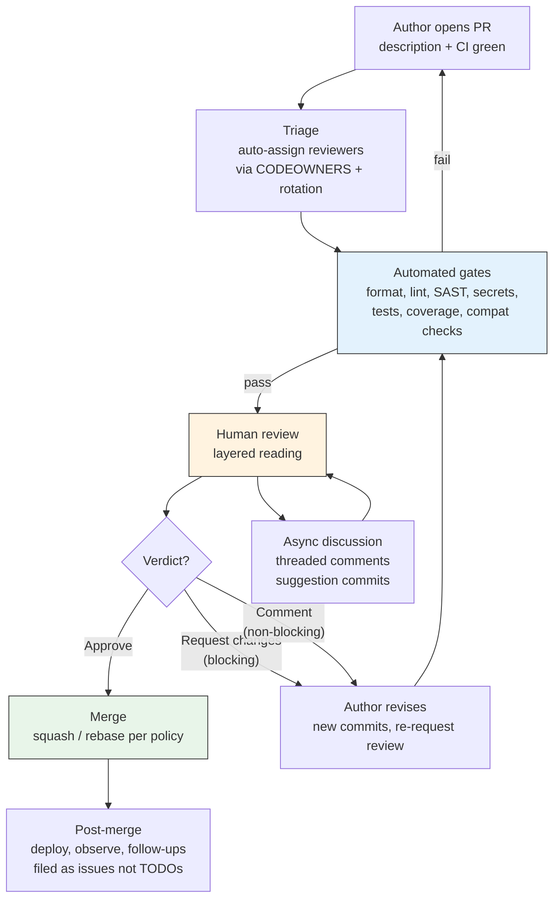
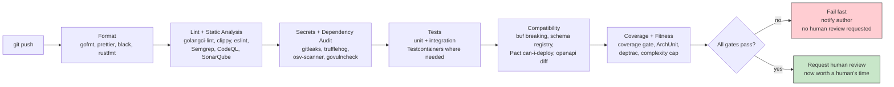
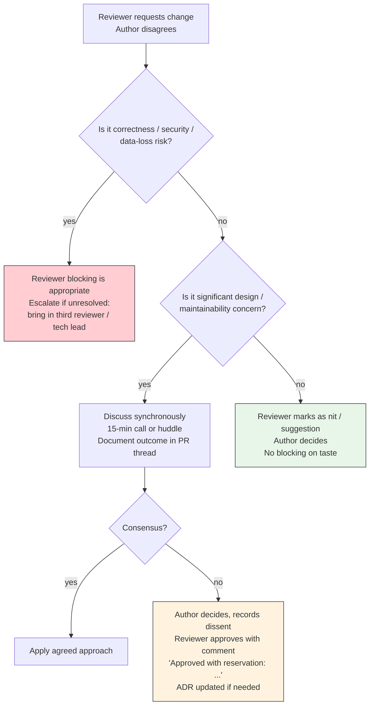

# Chapter 8 — Code Review and Engineering Culture

**What this chapter covers.** Code review is the highest-leverage practice a backend team adopts after automated testing — and the most frequently done badly. When it works, review catches defects that tests miss, distributes ownership, teaches idioms, and enforces the architectural boundaries that keep a service graph from collapsing into a distributed monolith. When it fails, it becomes a bottleneck, a theatre of nits, or a source of interpersonal friction that drives good engineers away. This chapter treats code review as a socio-technical system: part defect-detection mechanism, part knowledge-transfer protocol, part cultural institution. You will learn how to author reviewable changes, how to review effectively and efficiently, how to build automation that makes human review count, and how to scale the practice across teams without sacrificing speed. The second half widens the lens to engineering culture — psychological safety, ownership models, standards vs. autonomy, and the habits that turn a group of engineers into a team whose output exceeds the sum of its parts.

Learning goals — after this chapter you should be able to:

- Articulate what code review is for (and what it is not for), with evidence on defect yield, and set expectations accordingly.
- Author changes that are easy to review: small, coherent, well-described PRs that separate refactoring from behavior change and guide the reviewer through the reasoning.
- Review thoroughly and efficiently — apply a layered reading strategy, use checklists proportionate to risk, distinguish blocking from non-blocking feedback, and avoid known anti-patterns.
- Design the automation that precedes human review — CI gates, linters, formatters, static analysis, and coverage checks — so human attention is spent on judgment, not style.
- Scale review across a service graph with CODEOWNERS, team review rotation, review SLAs, and metrics that detect bottlenecks without incentivizing rubber-stamping.
- Diagnose and improve engineering culture — psychological safety, blamelessness, ownership, decision hygiene, and the rituals that sustain them — and connect cultural health to delivery performance via DORA and related research.
- Handle difficult review dynamics: entrenched disagreement, knowledge silos, reviewer fatigue, and cross-team review friction.

---

## 1. What code review is for

### 1.1 Evidence and limits

Code review's primary benefits, in descending order of empirical support:

| Benefit | Evidence | Notes |
|---|---|---|
| **Knowledge transfer** | Strong — reviewers learn codebase areas they did not author; bus factor improves measurably (Bacchelli & Bird, 2013; Sadowski et al., Google, 2018) | The most durable benefit; outlasts any single defect found |
| **Shared ownership and standards** | Strong — review is how idioms, patterns, and architectural decisions propagate | Without review, each service drifts toward its author's preferences |
| **Defect detection** | Moderate — review catches 20–35% of defects in controlled studies; complementary to testing, not a substitute | Best at design and logic defects; worst at subtle concurrency and requirements defects |
| **Security and compliance** | Moderate — catches missing auth checks, injection, and secret leaks when checklists and tooling support the reviewer | Automated SAST/secret scanning must precede human review |
| **Mentorship** | Moderate — junior engineers learn faster with reviewed PRs; reviewer also learns by articulating rationale | Requires kind, specific feedback — not "fix this" |

What review is **not**: a proof of correctness, a substitute for testing, a style enforcer (automate that), or a gate for demonstrating cleverness. A review that approves a change asserts one thing: *at least one other competent engineer has understood the change and judges its trade-offs acceptable*. That is valuable and bounded.

> **Distributed-systems lens.** In a service graph, a change to one service is a change to the contract every downstream service depends on. Review is the last human checkpoint before a contract change becomes a production incident that crosses team and failure-domain boundaries. The cost of an unreviewed breaking change is not a bug in one repo — it is a correlated failure across many. This is why cross-team review for contract and schema changes (Vol 8, Ch 11; Vol 10, Ch 6) is non-negotiable.

### 1.2 Cost and the review bottleneck

Review is expensive. Google's data suggests a median review latency of ~4 hours and an active review time of 15–30 minutes per PR; large PRs (>400 lines) are reviewed less thoroughly and more slowly, with defect detection dropping sharply past ~200–400 lines. The cost model:

```
total review cost = (author wait time × context-switch cost)
                  + (reviewer focus time × interruption cost)
                  + (rework cycles × iteration latency)
```

Optimizing this cost is not about reviewing less — it is about making each review *faster and more effective* through small PRs, automation, and clear expectations. Everything that follows serves that goal.

---

## 2. Authoring reviewable changes

Review quality is bounded above by author quality. A well-authored PR makes thorough review cheap; a poorly authored one makes it impossible regardless of reviewer skill.

### 2.1 Small, coherent, separable PRs

**The single strongest predictor of review effectiveness is PR size.** The ideal PR:

- Does **one thing** — one feature, one refactoring, or one fix. Not two.
- Is **reviewable in under 30 minutes** — typically <250 lines of meaningful diff (excluding generated code, vendored deps, and mechanical renames).
- **Separates refactoring from behavior change** (Vol 15, Ch 7). A refactoring-only PR is verifiable by "no behavior should have changed; tests still pass." A behavior-change PR is verifiable by "here is the new behavior and its tests." Mixing the two forces the reviewer to disentangle them mentally.
- Has a **clear commit structure** — each commit is a logical step that can be reviewed in sequence, not a squashed artifact of `fix typo` / `address feedback` noise. Use `git rebase -i` to organize before requesting review.

When a feature is too large for one small PR, use **stacked PRs** (also called *chain PRs* or *dependent PRs*):

```
main ── PR1: introduce interface ── PR2: add new implementation ── PR3: switch wiring + remove old
          ▲                          ▲                              ▲
          reviewed & merged          reviewed & merged              reviewed on top of PR2
```

Tooling: `ghstack`, `graphite`, `spr`, or manual branches with `gh pr create --base PR1-branch`. Each PR is independently reviewable; the stack is the feature.

### 2.2 The PR description — a contract with the reviewer

A PR description should answer six questions in under two minutes of reading:

```markdown
## What
One-sentence summary of the change.

## Why
Context: what problem, what incident, what RFC/ADR, what metric.
Link: RFC-042, INC-2026-11, JIRA-1234.

## How
Approach and key design choices. Alternatives considered and why rejected.
Note any non-obvious trade-offs or intentional tech debt with register entry.

## Risk and rollback
Blast radius: which services, which data, which contracts.
Backward compatible? (yes/no, and how).
Rollback plan: flag to flip, migration to reverse, or simple revert.

## Testing
How was this verified? Unit / integration / contract / load / manual.
Include before/after evidence for perf or correctness claims (benchmark, trace, screenshot).

## Reviewer guidance
What to focus on: "Please scrutinize the concurrency in `pool.go:80-120`; the rest is mechanical rename."
What to ignore: "Generated file `pb/*.go` — skip."
Suggested reading order: "Start with `api/types.go`, then `service/handler.go`."
```

The "reviewer guidance" section is the highest-ROI paragraph — it directs scarce attention to the riskiest code.

### 2.3 Self-review before requesting review

The author should be the first reviewer:

1. Read the diff as if you did not write it — in the GitHub/GitLab UI, not your editor.
2. Remove debugging artifacts, stale comments, and commented-out code.
3. Verify CI is green (or explain why a failure is unrelated).
4. Add comments on non-obvious lines (`// Why this mutex ordering — see ADR-017`) so the reviewer does not have to ask.
5. If the diff is >400 lines, split it before requesting review — the reviewer will thank you by actually catching bugs.

---

## 3. The review process — a layered reading

### 3.1 The review lifecycle



**Latency target:** First human response within **one business half-day** (4 hours in the reviewer's timezone). A PR that waits 2 days loses the author's context and blocks the pipeline. Enforce via SLAs and rotation, not goodwill.

### 3.2 Layered reading — what to look for, in order

Experienced reviewers read in layers, from cheapest to most expensive, stopping early if a layer fails:

| Layer | Question | Cost | Tooling |
|---|---|---|---|
| **1. Intent** | Does the PR do what its description claims? Is the problem worth solving this way? | Low | RFC/ADR context, PR description |
| **2. Correctness** | Are the logic, edge cases, error handling, and concurrency correct? | High | Tests, reasoning, domain knowledge |
| **3. Contracts and compatibility** | Are API, event, and schema changes backward compatible? Are invariants preserved? | Medium | Schema registry checks, Pact, `buf breaking`, `ov` |
| **4. Operability** | Is it observable (logs, metrics, traces), tunable (config, flags), and reversible? | Medium | Runbook, dashboard, flag |
| **5. Security** | Are auth checks, input validation, and secret handling correct? | Medium | SAST, dependency audit, threat model |
| **6. Structure and maintainability** | Is the code where it belongs? Is naming clear? Is testability preserved? | Low–Medium | Linters, fitness functions |
| **7. Style and nits** | Formatting, import order, comment phrasing? | Lowest | Formatter — should already be automated |

If Layer 1 fails ("this approach is wrong"), commenting on Layer 7 is noise. Lead with the highest layer that has a blocking concern.

### 3.3 Blocking vs. non-blocking — the severity scale

Every comment should signal its severity so the author knows what must be resolved before merge:

| Severity | Label (pick one convention) | Meaning | Example |
|---|---|---|---|
| **Blocking — correctness** | `MUST`, `blocking`, `required` | Must be fixed; approval withheld until resolved | "This races with `Close()` — needs mutex or context cancellation" |
| **Blocking — design** | `MUST` | Must be addressed, but discussion is legitimate | "This adds a synchronous call in the hot path — should be async per RFC-042" |
| **Non-blocking — suggestion** | `SHOULD`, `suggestion`, `nit` | Worth considering; author decides | "Consider extracting this to `PricingPolicy` for testability" |
| **Non-blocking — nit** | `nit`, `optional` | Trivial; fix if convenient | "nit: import order" (but automate this) |
| **Question / understanding** | `question`, `Q:` | Reviewer seeking context, not requesting change | "Q: why `REPEATABLE READ` here vs `READ COMMITTED`?" |

**Rule:** No blocking comment without a *reason*. "Change this" is not a review — "Change this because X will fail when Y, and Z is the alternative" is.

---

## 4. Review checklists — proportionate to risk

One checklist does not fit all PRs. Use a **risk-proportionate** approach: the depth of review scales with blast radius.

### 4.1 Tiered checklists

**Tier 1 — Low risk (docs, tests, isolated bug fix, <50 lines):**

- [ ] Intent is clear from description
- [ ] Tests cover the new behavior or the fix
- [ ] CI is green; no new warnings

Any single reviewer may approve; async, no meeting.

**Tier 2 — Standard (feature, non-breaking API addition, internal refactor):**

- [ ] Intent and alternatives — PR description explains why this approach
- [ ] Correctness — edge cases, error handling, concurrency, idempotency
- [ ] Tests — unit + integration where the risk lives; not just coverage percentage
- [ ] Compatibility — no breaking change to public API / event schema / DB contract
- [ ] Observability — new paths emit metrics/traces/logs; dashboards updated if needed
- [ ] Security — input validation, auth checks, no secret in diff
- [ ] Structure — code is in the right layer/module; naming reveals intent
- [ ] Reversibility — flag, config, or simple revert suffices

**Tier 3 — High risk (breaking API change, schema migration, new service boundary, critical path, on-call runbook change):**

All of Tier 2, plus:

- [ ] RFC/ADR exists and is linked; alternatives and trade-offs are recorded
- [ ] Contract tests (Pact / `buf breaking` / schema registry) pass
- [ ] Migration is expand-contract (Vol 15, Ch 7) — backward compatible, dual-write or CDC, backfill plan
- [ ] Load/perf evidence for hot-path changes (benchmark or profiling before/after)
- [ ] Runbook updated; on-call notified; alert thresholds reviewed
- [ ] At least one reviewer from each affected team (CODEOWNERS enforced)
- [ ] Rollback rehearsed or documented; feature flag with TTL

### 4.2 Domain-specific review prompts

Keep these as team checklists, not global mandates — they are consulted when the PR touches the domain:

**Concurrency (Vol 4):**

- Is shared mutable state protected? Is lock ordering documented and consistent?
- Are goroutines / tasks cancellable via context? Do they leak on error or timeout?
- Is the code safe under retry (idempotent) and under duplicate delivery?

**Data (Vol 5):**

- Are transactions scoped correctly? Is isolation level intentional?
- Are migrations backward compatible and zero-downtime?
- Are indexes appropriate for the new query pattern?

**API (Vol 8):**

- Is the new field optional with a sensible default (Postel's law)?
- Are error codes and status semantics consistent with the existing surface?
- Is pagination / idempotency preserved?

**Security (Vol 9):**

- Is authorization checked at the resource level, not just the route level?
- Is user input validated and escaped in the right layer?
- Are errors free of sensitive data (stack traces, internal IDs)?

---

## 5. Automation before human review — make humans count

Human review should be spent on *judgment* — design, correctness, trade-offs. Everything that can be checked mechanically should be, and must block merge before a human is asked to look.



### 5.1 Non-negotiable gates

| Gate | Tool examples | Policy |
|---|---|---|
| **Formatting** | `gofmt`, `prettier --check`, `black --check`, `rustfmt --check` | Fail if not formatted; no human should comment on style |
| **Linting** | `golangci-lint`, `clippy`, `eslint`, `ruff`, `rubocop` | Fail on new warnings; ratchet (no new warnings) if legacy codebase is noisy |
| **Static analysis / SAST** | `CodeQL`, `Semgrep`, `gosec`, `bandit` | Fail on high/critical; warn on medium |
| **Secret scanning** | `gitleaks`, `trufflehog`, `git-secrets` | Fail on any secret; block push with pre-commit hook too |
| **Dependency audit** | `govulncheck`, `osv-scanner`, `npm audit`, `cargo audit` | Fail on fixable high/critical |
| **Tests** | `go test`, `pytest`, `jest`, `cargo test` | Fail on any failure; flaky tests quarantined, not ignored |
| **Compatibility** | `buf breaking`, `openapi-diff`, schema registry `FORWARD` check, `pact-broker can-i-deploy` | Fail on breaking change without explicit version bump / approval |
| **Coverage (ratchet)** | `codecov`, `coveralls`, `go test -cover` | Fail if coverage *decreases* beyond threshold; not an absolute gate (see Ch 1) |

### 5.2 Pre-commit hooks — shift left

Run the cheapest gates locally before CI:

```yaml
# .pre-commit-config.yaml — runs on git commit, not just CI
repos:
  - repo: https://github.com/pre-commit/pre-commit-hooks
    hooks:
      - id: trailing-whitespace
      - id: end-of-file-fixer
  - repo: local
    hooks:
      - id: gofmt
        name: gofmt
        entry: gofmt -w
        language: system
        files: '\.go$'
      - id: golangci-lint
        name: golangci-lint
        entry: golangci-lint run --new-from-rev=HEAD~1
        language: system
        files: '\.go$'
        pass_filenames: false
      - id: gitleaks
        name: gitleaks
        entry: gitleaks protect --staged --verbose
        language: system
      - id: buf-breaking
        name: buf breaking
        entry: buf breaking --against .git#branch=main
        language: system
        files: '\.proto$'
```

```bash
pre-commit install          # install hook
pre-commit run --all-files  # one-time sweep
```

### 5.3 AI-assisted review — useful, not authoritative

LLM-based review bots (e.g., CodeRabbit, Greptile, GitHub Copilot code review) can catch shallow defects and suggest improvements quickly. Treat them as **augmentation**, not replacement:

- Useful for: style-adjacent nits, missing error handling, obvious duplication, test suggestions.
- Not reliable for: deep correctness, concurrency reasoning, architectural judgment, security invariants.
- Policy: AI comments are `nit`/`suggestion` severity by default; never auto-approve; human reviewer must still approve.

---

## 6. Scaling review across teams and services

### 6.1 CODEOWNERS and team review

```ini
# .github/CODEOWNERS — ownership at file granularity
# Global fallback
*                          @backend-guild

# Service ownership
/services/orders/          @team-orders
/services/pricing/         @team-pricing
/services/inventory/       @team-inventory

# Cross-cutting ownership
/**/*.proto                @team-api-platform @backend-guild
/**/migrations/*.sql       @team-data-platform @team-orders
/.github/workflows/        @team-platform
/Dockerfile*               @team-platform
/terraform/               @team-platform @team-security

# Security-sensitive
/**/auth/**                @team-security
/**/secrets/**             @team-security
```

Behaviors to enforce (GitHub/GitLab branch protection):

- Require at least one `CODEOWNERS` approval before merge.
- Require review from each *affected* team when a PR touches cross-team files (not just the author's team).
- Dismiss stale approvals when new commits are pushed (or require re-approval only for high-risk paths).
- Require conversation resolution — no merge with unresolved threads.

### 6.2 Review SLAs and rotation

Without SLAs, review latency is unbounded and author throughput collapses.

| Practice | Implementation |
|---|---|
| **Review SLA** | First response within 4 business hours; approval or blocking feedback within 1 business day. Tracked via PR analytics (LinearB, Velocity, or GitHub Insights). |
| **On-call reviewer / rotation** | Each team designates a daily reviewer who prioritizes inbound reviews over feature work. Rotate daily or weekly. |
| **Review load balancing** | Auto-assign via `actions/labeler` + round-robin (e.g., `pullpanda`, `reviewpad`, or `CODEOWNERS` with `review-groups`). Cap at ~2–3 active reviews per person to avoid fatigue. |
| **Cross-team review queue** | A shared Slack channel or dashboard for PRs needing cross-team eyes; tag with `needs-review:team-X`. |
| **Focus time protection** | Batch review twice daily rather than constant interruption; use notification filters. |

### 6.3 Timeboxing and the "LGTM with follow-ups" pattern

Not every concern must block merge. Use **follow-up issues** for non-blocking improvements:

- Blocking: correctness, security, data loss, breaking contract — must be fixed before merge.
- Non-blocking follow-up: refactoring, additional tests, doc improvements — file an issue, link it in a `TODO(issue-123)` or PR comment, merge.

This prevents review from becoming a perfection gate. The follow-up issue is the commitment device — without it, "we'll fix it later" means never.

---

## 7. The review conversation — tone, feedback, and disagreement

### 7.1 Kindness, specificity, and actionable feedback

Review feedback is interpersonal communication under time pressure. Three habits make it effective:

1. **Be kind and assume competence.** The author is not careless — they made a trade-off you do not yet understand. Ask before asserting: "What happens if this channel blocks?" beats "This will deadlock."

2. **Be specific and explain why.** Every comment should contain *what*, *why*, and *what to do instead*.

   - Weak: "This is wrong."
   - Strong: "If `ctx` is cancelled while this goroutine is blocked on `ch <- val`, the goroutine leaks — the send never completes and nothing drains the channel. Consider `select { case ch <- val: case <-ctx.Done(): return ctx.Err() }`."

3. **Distinguish taste from correctness.** If the existing codebase does it both ways, your preference is not a blocking concern. Say "nit: I prefer X for consistency with `pricing/service.go:42`, but not blocking" — or better, codify the preference in a linter so no human has to argue about it.

The **Conventional Comments** convention (conventionalcomments.org) gives severity labels a shared vocabulary:

```
label (severity): subject

Example:
  suggestion (non-blocking): Consider extracting the retry logic to a helper so the handler stays focused.
  issue (blocking): This SQL is vulnerable to injection — user input is interpolated, not parameterized. Use $1 placeholders.
  nitpick (non-blocking): Trailing whitespace on line 42.
  praise (non-blocking): Nice — the table-driven tests make the edge cases very clear.
  question (non-blocking): Why REPEATABLE READ here? Would READ COMMITTED suffice?
```

Use `praise` deliberately. Review that only points out flaws trains authors to dread the process. Naming what is good reinforces the behavior you want repeated.

### 7.2 Handling disagreement



Principles:

- **Disagree and commit** — once a decision is made (by author, tech lead, or RFC), the team commits even if individuals disagree. Record dissent in the PR or ADR; do not relitigate after merge.
- **No endless ping-pong.** After two async rounds without convergence, take it synchronous (call or huddle). Async is for information; sync is for resolution.
- **Escalation is not failure.** Bringing in a tech lead or third reviewer is how the team calibrates standards — not a personal appeal.

### 7.3 Anti-patterns

| Anti-pattern | Symptom | Fix |
|---|---|---|
| **Rubber-stamping** | `LGTM` in 30 seconds on a 400-line PR; no comments ever | Require at least one meaningful comment or question; track review depth metrics; rotate reviewers |
| **Nit-picking** | 20 comments on formatting, imports, variable names; zero on correctness | Automate style; enforce layered reading (Section 3.2) — correctness first |
| **Gatekeeping / perfectionism** | Every PR requires 5 rounds; author velocity collapses | Distinguish blocking from non-blocking; use follow-up issues; timebox |
| **Ghost review** | PR sits 3 days with no response | SLA + rotation + dashboard; escalation after 1 day |
| **Knowledge silo** | Only one person can review service X | Rotate reviewers deliberately; pair on reviews; record decisions in ADRs |
| **Drive-by architecture** | Reviewer redesigns the approach in a PR comment without RFC context | "This is a significant design alternative — let's capture it as an RFC and compare trade-offs there" |
| **Passive-aggressive tone** | "Why would you do it this way?" / "Obviously this is wrong" | Code of conduct; conventional comments; lead by example |

---

## 8. Engineering culture — the system that makes review work

Review does not happen in a vacuum. The same codebase with the same tooling will have radically different outcomes depending on culture. Culture is not a poster — it is the set of **behaviors that are rewarded, tolerated, and punished**.

### 8.1 Psychological safety — the prerequisite

Google's Project Aristotle and subsequent DORA research converge: **psychological safety** — the belief that you will not be punished for speaking up, asking questions, or making mistakes — is the single strongest predictor of team performance.

In review, safety shows up as:

- Authors feel safe opening draft/WIP PRs early for feedback, not just polished PRs for approval.
- Reviewers feel safe asking "I don't understand this — can you explain?" without appearing incompetent.
- Anyone feels safe blocking a PR on a correctness concern, regardless of seniority.
- Post-merge defects are treated as system failures, not personal failures.

Leaders create safety by modeling it: opening their own PRs for review, receiving feedback gracefully, admitting mistakes publicly, and praising those who surface risks early.

### 8.2 Ownership models

| Model | How it works | Strength | Risk |
|---|---|---|---|
| **Strong ownership** | Each service has a clear owning team; only owners approve changes | Accountability; deep expertise | Silos; bottleneck when owner is unavailable |
| **Collective ownership** | Anyone may change any code; review by any competent reviewer | Flexibility; knowledge spread | Diffusion of responsibility; no one owns quality |
| **Weak / shared ownership** | Primary owner + open contribution with owner review | Balance — most backend orgs land here | Requires clear CODEOWNERS and SLAs to avoid ambiguity |

Most organizations converge on **weak ownership**: CODEOWNERS designates primary owners who must approve, but any engineer may contribute and any qualified reviewer may provide additional signal. This is the model in Section 6.1.

### 8.3 Standards vs. autonomy — the paved road

High-performing orgs do not standardize everything — they standardize the **paved road** (Vol 12, Ch 11) and permit divergence with justification:

- **Paved road (default):** Language version, framework, CI template, observability stack, auth library, deployment pipeline. Follow it and you get speed — review is fast because the shape is familiar.
- **Off-road (permitted):** A team may diverge when the paved road does not fit — but they own the operational cost, must document why (ADR), and must get cross-team review for the divergence.

This maps to review: PRs on the paved road are fast to review because the reviewer already understands the idioms. Off-road PRs require deeper review and broader audience — that is the cost of divergence, and it should be visible.

### 8.4 Rituals that sustain culture

Culture is maintained by repeated rituals, not one-off declarations:

| Ritual | Cadence | Purpose |
|---|---|---|
| **PR review rotation** | Daily | Distributes knowledge; prevents silos |
| **Design review / RFC session** | Weekly or as needed | Decisions before code; prevents drive-by architecture in PRs |
| **Postmortem / learning review** | After every incident (Vol 15, Ch 9; Vol 11, Ch 6) | Blameless learning; system improvement |
| **Demo / show-and-tell** | Biweekly | Visibility across teams; celebrates shipping |
| **Tech debt review** | Quarterly (Vol 15, Ch 7) | Prioritizes repayment; prevents silent accumulation |
| **Engineering-wide retro** | Monthly or quarterly | Surfaces systemic friction; tracks DORA trends |
| **On-call handover** | Weekly | Transfers operational knowledge; calibrates alert quality |

### 8.5 Measuring what matters — DORA and beyond

Culture is not directly measurable, but its outcomes are. DORA (now part of Google Cloud's research program) identifies four delivery-performance metrics that correlate with culture and business outcomes:

| Metric | What it measures | Healthy trend |
|---|---|---|
| **Deployment frequency** | How often code reaches production | Higher is better (elite: on-demand / multiple per day) |
| **Lead time for changes** | Commit to production | Lower is better (elite: <1 hour) |
| **Change failure rate** | Deploys causing incident / rollback | Lower is better (elite: 0–15%) |
| **Mean time to recovery (MTTR)** | Incident to recovery | Lower is better (elite: <1 hour) |

Review health metrics (leading indicators for DORA):

- **Review latency** — time from PR open to first human response; target <4 hours.
- **Review depth** — comments per PR, blocking vs. non-blocking ratio; watch for rubber-stamping (0 comments) and nit-picking (all nits).
- **PR size** — median lines changed; track the tail (p90) where defects hide.
- **Rework rate** — PRs requiring >2 rounds; high rate signals unclear requirements or insufficient pre-review design.

Instrument these via GitHub/GitLab APIs, LinearB, Sleuth, or a simple scheduled job that queries the API and emits metrics. Do not use them to rank individuals — that destroys safety and incentivizes gaming. Use them to detect *system* bottlenecks.

---

## 9. Templates

### 9.1 Pull request template

```markdown
<!-- .github/pull_request_template.md — auto-populated on PR creation -->

## Summary
<!-- One sentence: what does this change do? -->

## Context
<!-- Why is this change needed? Link RFC/ADR/issue/incident. -->
Closes #
Related ADR/RFC:

## Approach
<!-- Key design choices and alternatives considered. Note intentional tech debt. -->

## Risk and rollback
- [ ] Backward compatible (API / event schema / DB — check applicable)
- [ ] Expand-contract migration (if schema change — link migration plan)
- [ ] Feature flag: `flag-name` (TTL: YYYY-MM-DD)
- [ ] Rollback: <!-- revert / flag flip / migration reverse -->
Blast radius:

## Testing
- [ ] Unit tests added/updated
- [ ] Integration tests (Testcontainers) added/updated
- [ ] Contract tests (Pact / buf breaking) pass
- [ ] Manual verification: <!-- steps or "N/A" -->
- [ ] Load/perf evidence (if hot path): <!-- link benchmark -->

## Reviewer guidance
<!-- Where to focus, what to skip, suggested reading order. -->
Focus:
Skip (generated/mechanical):

## Checklist
- [ ] Self-reviewed diff in GitHub UI
- [ ] CI is green (or failures explained)
- [ ] No secrets in diff (verified via gitleaks)
- [ ] Docs / runbook updated if needed
```

### 9.2 CODEOWNERS with review groups

```ini
# .github/CODEOWNERS — see Section 6.1 for full example
*                      @backend-guild
/services/orders/       @team-orders
/services/pricing/     @team-pricing
/**/*.proto            @team-api-platform
/**/migrations/*.sql   @team-data-platform
/.github/workflows/    @team-platform
/**/auth/**            @team-security
```

```yaml
# .github/review-groups.yml — auto-assign rotation (e.g., via Kodiak / pullpanda)
groups:
  team-orders:
    members: [alice, bob, carol, dave]
    strategy: round_robin
    count: 2  # assign 2 reviewers per PR
  team-pricing:
    members: [erin, frank, grace]
    strategy: load_balance  # fewest open reviews
    count: 1
```

### 9.3 Review SLA dashboard query (GitHub API)

```python
# scripts/review_latency.py — emit p50/p90 first-response latency
import requests, datetime, statistics

REPO = "acme/backend"
TOKEN = "..."  # GH_TOKEN env
headers = {"Authorization": f"Bearer {TOKEN}", "Accept": "application/vnd.github+json"}

prs = requests.get(f"https://api.github.com/repos/{REPO}/pulls?state=closed&per_page=100",
                    headers=headers).json()

latencies = []
for pr in prs:
    created = datetime.datetime.fromisoformat(pr["created_at"].replace("Z", "+00:00"))
    reviews = requests.get(pr["url"] + "/reviews", headers=headers).json()
    if not reviews:
        continue
    first = min(datetime.datetime.fromisoformat(r["submitted_at"].replace("Z", "+00:00"))
                for r in reviews if r["submitted_at"])
    latencies.append((first - created).total_seconds() / 3600)

if latencies:
    print(f"first-response p50: {statistics.median(latencies):.1f}h  "
          f"p90: {sorted(latencies)[int(len(latencies)*0.9)]:.1f}h  "
          f"n={len(latencies)}")
```

---

## Key takeaways

- Code review's primary value is knowledge transfer and shared ownership; defect detection is important but complementary to testing and automation. Set expectations accordingly.
- Author quality bounds review quality. Small, coherent PRs that separate refactoring from behavior change, with a description that answers what/why/how/risk/testing and guides the reviewer to the riskiest code, make thorough review cheap.
- Review in layers — intent, correctness, contracts, operability, security, structure, style — and lead with the highest layer that has a blocking concern. Every comment should signal severity (blocking vs. non-blocking) and explain why.
- Automate everything that can be checked mechanically before human review: formatting, linting, SAST, secret scanning, dependency audit, tests, and compatibility checks (buf breaking, schema registry, Pact). Human attention is for judgment, not style.
- Scale with CODEOWNERS, review rotation, SLAs (first response <4 hours), and metrics on latency, depth, and PR size — used to detect system bottlenecks, never to rank individuals.
- Handle disagreement proportionately: correctness blocks, design merits discussion, taste is non-blocking. After two async rounds without convergence, go synchronous; record dissent and commit.
- Culture is the system that makes review work. Psychological safety, weak/shared ownership, a paved road with permitted divergence, and regular rituals (review rotation, RFC sessions, postmortems, debt reviews) are the mechanisms. DORA metrics are the outcomes to track.
- Use tiered checklists proportionate to risk — low, standard, and high — and keep domain-specific prompts (concurrency, data, API, security) as consultative checklists for the relevant PRs.

## Further reading

- A. Bacchelli & C. Bird, "Expectations, Outcomes, and Challenges of Modern Code Review" (ICSE, 2013) — empirical study of review motivations and outcomes at Microsoft.
- C. Sadowski et al., "Modern Code Review: A Case Study at Google" (ICSE SEIP, 2018) — Google's review practices, tooling, and data at scale.
- G. W. Furnas et al., Google *Engineering Practices Documentation* — "How to Do a Code Review" and "The Standard of Code Review" (google.github.io/eng-practices/review/) — the most widely adopted review guide; defines the Google standard.
- N. Forsgren, J. Humble, G. Kim, *Accelerate* (IT Revolution, 2018) and Google Cloud *DORA* research program (dora.dev) — evidence linking delivery performance, culture, and business outcomes.
- *Conventional Comments* (conventionalcomments.org) — a shared vocabulary for review comment severity.
- T. Winters, T. Manshreck, H. Wright (eds.), *Software Engineering at Google* (O'Reilly, 2020), Ch. 9 "Code Review" — in-depth treatment of Google's review culture, tooling (Critique), and anti-patterns.
- M. Poppendieck & T. Poppendieck, *Leading Lean Software Development* — cultural and process foundations that complement the DORA findings.
- E. Edmondson, "Psychological Safety and Learning Behavior in Work Teams" (Administrative Science Quarterly, 1999) — foundational research on safety as a predictor of team learning.
- GitHub *CODEOWNERS* docs, GitLab *Code Owners* docs, and `pre-commit` framework docs — concrete tooling for ownership and pre-review automation.
