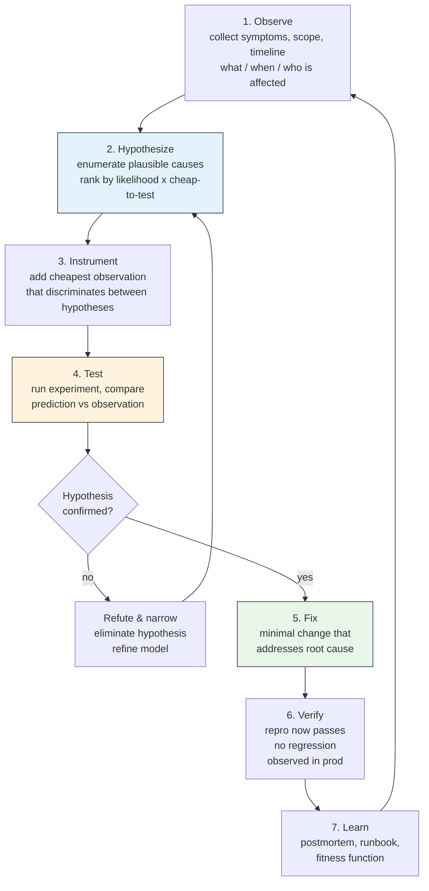
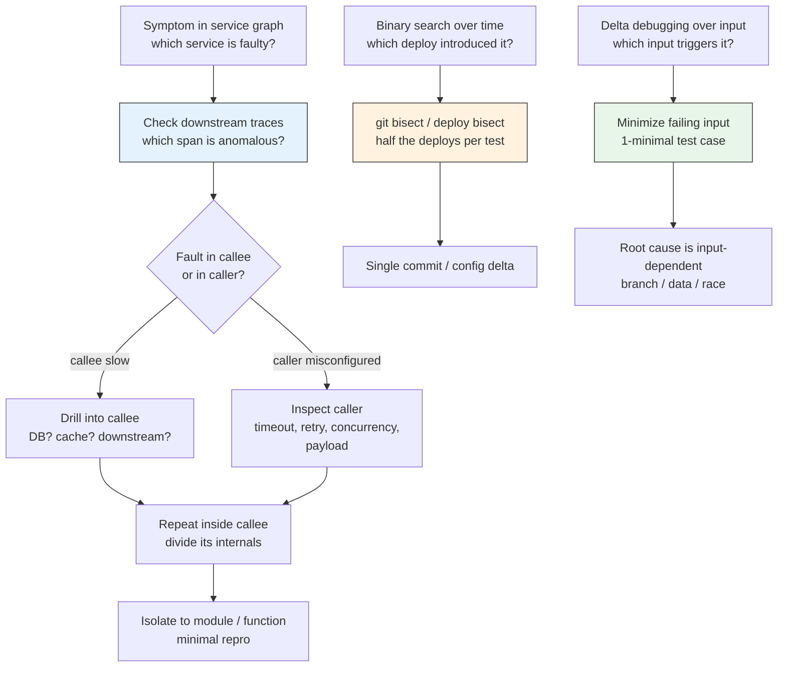
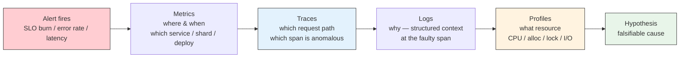
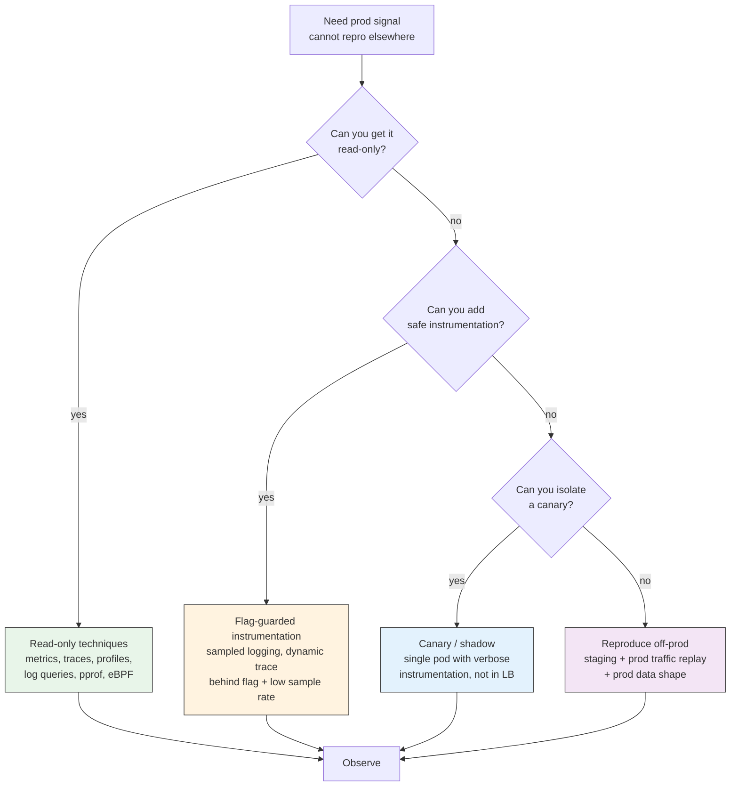
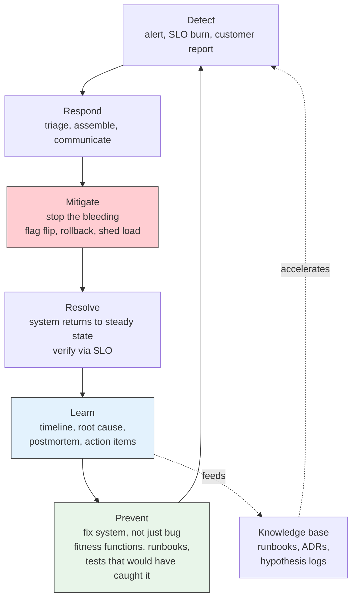
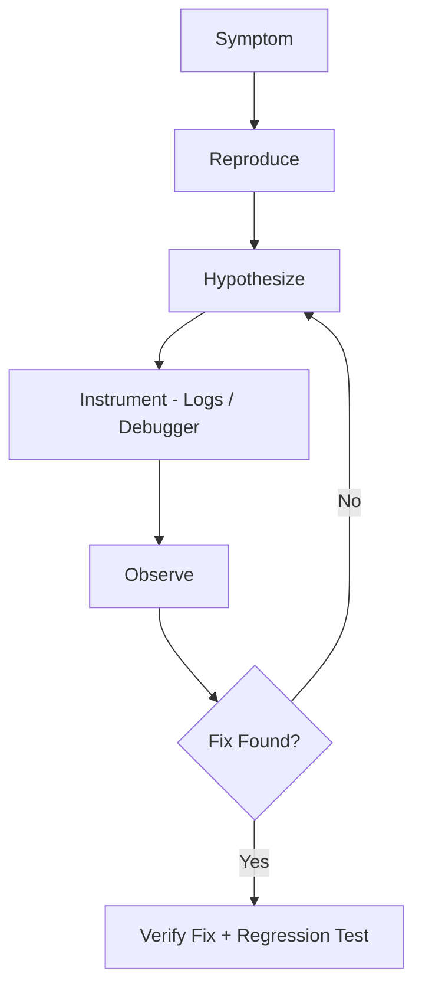
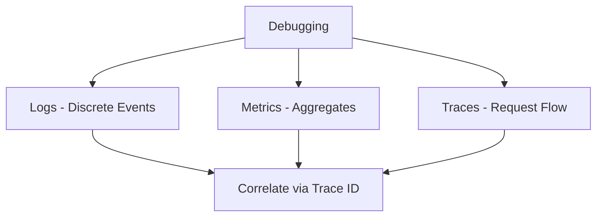

# Chapter 9 — Debugging and Incident-Driven Learning

**What this chapter covers.** Debugging is the most frequent engineering activity — developers spend 35–50% of their time understanding and fixing behavior they did not expect — and the least formally taught. Most engineers debug by intuition and accretion: print statements, hopeful hypotheses, and a mental model that is seldom made explicit. In a distributed backend, that approach collapses. Failures are partial, non-deterministic, and separated from their causes by network hops, queues, caches, and eventual-consistency windows. Logs are scattered across services, traces are sampled, metrics are aggregated past the point of usefulness, and the bug that pages you at 03:00 cannot be reproduced on a laptop. This chapter makes debugging systematic. You will learn a hypothesis-driven methodology that works from a single process to a service graph, a toolkit that spans debuggers, profilers, tracers, eBPF, and log analysis, safe techniques for debugging in production without making the incident worse, and — crucially — how to turn every incident into durable organizational learning. An incident is debugging at organizational scale: the same lifecycle of observation, hypothesis, and verification, but with coordination, communication, and a postmortem that produces fixes to the *system that allowed the defect*, not just the defect itself.

Learning goals — after this chapter you should be able to:

- Apply a systematic, hypothesis-driven debugging lifecycle — observe, hypothesize, instrument, test, fix, verify — and explain why ad hoc print-driven debugging fails in distributed systems.
- Reproduce failures deterministically using isolation, minimal reproduction cases, record-and-replay, and deterministic simulation where applicable.
- Isolate faults efficiently with divide-and-conquer, bisection (binary search over commits, config, and traffic), delta debugging, and differential diagnosis across services.
- Select and apply the right tool for the failure class — interactive debuggers, structured logging, distributed tracing, continuous profiling, eBPF/bpftrace, network capture, and chaos/fault injection — with real commands and configurations.
- Debug safely in production: read-only techniques, feature-flag-guarded instrumentation, shadow/mirrored traffic, and guardrails that prevent the debugger from becoming the next incident.
- Run incident-driven learning end-to-end: incident timeline construction, blameless postmortem facilitation, action-item taxonomy (fix the bug vs. fix the system), and the learning loop that prevents recurrence.
- Build durable debugging infrastructure: runbooks, hypothesis logs, knowledge bases, and fitness functions that make the next incident cheaper than the last.
- Evaluate debugging and incident practice with leading and lagging metrics, and connect them to DORA outcomes and on-call health.

---

## 1. Why debugging is hard — and why method matters

### 1.1 The cost of ad hoc debugging

Without method, debugging follows a familiar anti-pattern:

1. Observe a symptom (error, latency spike, wrong result).
2. Guess a cause based on recent changes or familiar failure modes.
3. Make a plausible fix.
4. Deploy and hope.

This *guess-and-hope* loop is fast per iteration but expensive in aggregate: each iteration costs a deploy cycle, risks a new defect, and teaches nothing durable. Worse, it correlates poorly with correctness — the first plausible cause is often a *symptom* of a deeper fault, and fixing the symptom masks the cause until it recurs.

Systematic debugging inverts the loop: **hypotheses are explicit, falsifiable, and tested with the cheapest possible experiment before any fix is attempted.** The fix is the *last* step, not the first.

### 1.2 What makes backend debugging distinct

| Property | Single-process debugging | Distributed backend debugging |
|---|---|---|
| **Failure mode** | Deterministic, reproducible locally | Partial failure, non-deterministic, timing-dependent |
| **State** | In one address space, inspectable | Spread across services, queues, caches, databases, each with its own consistency window |
| **Causality** | Stack trace is the causal chain | Causal chain crosses network boundaries; clock skew obscures ordering |
| **Observability** | Debugger can pause the world | Cannot pause production; sampling loses the failing request; aggregation hides the outlier |
| **Blast radius of tooling** | Attaching a debugger is safe | Attaching a debugger or adding verbose logging can overload the system under incident load |
| **Reproducibility** | Often trivial | Requires production-like data, traffic shape, and failure injection |

> **Distributed-systems lens.** Every technique in this chapter is evaluated on one question: *does it work when the fault and the symptom are in different services, separated by an async queue, and the bug only manifests under concurrent load?* If the answer is no, the technique is useful for local logic bugs but insufficient for the failures that actually page you. The distributed lens turns debugging from "find the wrong line" into "reconstruct the causal chain across time, space, and consistency boundaries."

---

## 2. A systematic debugging lifecycle

### 2.1 The hypothesis-driven loop

The lifecycle is the scientific method applied to software. Each phase has a clear artifact and exit criterion.



**Phase details:**

| Phase | Artifact | Exit criterion | Anti-pattern to avoid |
|---|---|---|---|
| **Observe** | Symptom description + scope + timeline | You can state "X fails when Y, but not when Z" | Jumping to a cause before scoping the symptom |
| **Hypothesize** | Ranked list of falsifiable hypotheses | Each hypothesis predicts a distinct observable | Single hypothesis ("it must be the cache") |
| **Instrument** | Added log / metric / trace / breakpoint | Instrumentation discriminates between top hypotheses | Adding verbose logging everywhere and drowning in noise |
| **Test** | Experiment result vs. prediction | At least one hypothesis refuted per experiment | Testing the fix before testing the hypothesis |
| **Fix** | Minimal change + test that would have caught the bug | Repro fails before fix, passes after; no unrelated changes | Fixing the symptom, not the cause |
| **Verify** | Green repro + green regression suite + prod signal | Verified in the environment where the bug actually manifested | "Works on my machine" |
| **Learn** | Postmortem / runbook / regression test | Next engineer with same symptom finds the answer faster | Fixing and forgetting |

### 2.2 The hypothesis log — make thinking visible

The most useful debugging artifact is a **hypothesis log** — a running record of what you believed, what you tested, and what you learned. It prevents circular reasoning, makes handoff possible when on-call rotates, and becomes the raw material for the postmortem timeline.

```markdown
## Hypothesis Log — INC-2026-14 / DEBUG-042

**Symptom:** p95 latency for POST /orders jumped from 120ms to 2.1s at 14:32 UTC,
             correlated with deploy `orders@a1b2c3`. Only write path affected;
             reads normal. Error rate unchanged.

| # | Hypothesis | Prediction if true | Experiment | Result | Verdict |
|---|------------|-------------------|------------|--------|---------|
| H1 | New ORM query in `CreateOrder` does N+1 | DB query count per request >> 1; visible in trace | Check trace for `CreateOrder` — count DB spans | 1 DB span, not N+1 | **Refuted** |
| H2 | New checkout validation calls pricing service synchronously | Trace shows new span to `pricing` on write path; pricing p95 elevated | Inspect trace waterfall; check pricing dashboard | Trace shows 1.8s span to `pricing` with 3 retries; pricing p95 is normal (40ms) | **Partially confirmed** — call is new, but pricing itself is healthy |
| H3 | Pricing client retries with aggressive timeout cause head-of-line blocking | Client timeout is 500ms with 3 retries and no jitter; under load, retries amplify | Check `pricing/client.go` retry config; compare to previous version | Previous: 1 retry, 1s timeout, jitter. New: 3 retries, 500ms, no jitter — config changed in PR #2841 | **Confirmed** — root cause |
| H4 | Fix: restore previous retry policy + add jitter + circuit breaker | p95 returns to ~120ms; retry count drops | Apply fix behind flag `pricing-retry-v2`, canary 5% | p95 135ms on canary; retry rate 0.2% vs 18% before | **Verified** |

**Root cause:** PR #2841 changed pricing client retry from 1×/1s+jitter to 3×/500ms without jitter, causing retry amplification under normal load variation. Fix is minimal policy revert + breaker (follow-up).

**Learning:** Retry policy changes need load-test evidence + review checklist (Vol 15, Ch 8, Tier 3). Add fitness function: `pricing client retry count <=1 && jitter == true`.
```

The log is the difference between debugging and thrashing. Write it as you go, not after.

### 2.3 Scoping the symptom — the five questions

Before hypothesizing, answer five questions that bound the search space. Most debugging time is wasted searching the wrong scope.

1. **What** is the observable failure? (wrong result, error, latency, resource exhaustion — be precise: "returns 500 with `context deadline exceeded` after 5s" not "it's broken")
2. **When** did it start? (deploy, config change, traffic shift, data migration — correlate with the change log and deploy timeline)
3. **Who/what is affected?** (all users vs. one tenant, all regions vs. one AZ, writes vs. reads, one code path vs. all)
4. **What is *not* affected?** (the most discriminating question — "reads are normal" eliminates half the stack)
5. **Is it reproducible?** (always, sometimes, only under load, only in prod — determines which tools are applicable)

A useful template for the initial observation:

```markdown
## Symptom Report

- **Observed:** p95 latency for POST /orders: 120ms -> 2100ms
- **Since:** 2026-08-20 14:32 UTC (deploy orders@a1b2c3)
- **Scope:** Write path only; reads p50/p95 normal; error rate flat; one region (us-east-1) slightly worse
- **Not affected:** GET /orders, GET /orders/{id}, pricing service internally, DB p95
- **Repro:** Always under prod traffic; not repro'd locally with single request; repro'd in staging with 50 concurrent writers
- **Severity:** Degraded, not down; SLO burn rate 3× normal
```

---

## 3. Fault isolation — narrowing the search

### 3.1 Divide and conquer

The fastest way to find a fault in a large system is to **eliminate half the system per experiment**. Binary search over space (which service?), time (which deploy?), and input (which request?).



**Techniques:**

| Technique | Search dimension | How it works | Tooling |
|---|---|---|---|
| **Trace waterfall bisection** | Space (service graph) | Follow the slowest span; drill into the service that owns it; repeat | Grafana Tempo, Jaeger, Honeycomb, OTel |
| **Deploy / commit bisect** | Time | Binary search over deploys or commits; test each midpoint for the symptom | `git bisect`, Argo Rollouts canary analysis, manual deploy bisect |
| **Delta debugging** | Input | Automatically minimize a failing input to its 1-minimal subset (Zeller, 1999) | `creduce`, `hypothesis` shrink, custom minimizers |
| **Config bisect** | Configuration | Binary search over feature flags / config diff between good and bad | Flag evaluation log, config diff |
| **Traffic bisect** | Load | Halve concurrency / QPS until symptom disappears; reveals contention threshold | `k6`, `vegeta`, load generator |

**Deploy bisect example:**

```bash
# Automated git bisect — find the commit that introduced the regression
git bisect start HEAD HEAD~50          # good is HEAD~50 (known good), bad is HEAD
git bisect run ./scripts/repro.sh      # script returns 0 if good, 1 if bad
# git bisect reports: a1b2c3 is the first bad commit
git bisect reset

# repro.sh — deterministic repro that exits 0/1
#!/usr/bin/env bash
set -e
go test -run TestCreateOrderLatency -count=1 ./... 2>&1 | grep -q "p95.*> 500ms" \
  && exit 1 || exit 0
```

### 3.2 Differential diagnosis

When multiple hypotheses remain, design an experiment whose outcome **discriminates** — it should be predicted to succeed under one hypothesis and fail under another. A non-discriminating experiment ("add more logging and see what happens") is observation, not diagnosis.

Example: to distinguish "DB is slow" from "caller retries amplify normal DB variation":

- **Experiment:** Bypass the retry loop (set retries to 0) and measure p95 under same load.
- **Prediction if retries are the cause:** p95 drops to near-normal even though DB p95 is unchanged.
- **Prediction if DB is the cause:** p95 remains elevated even with no retries.
- **Result discriminates** — one hypothesis is refuted in a single experiment without touching the DB.

### 3.3 Reproducibility — the foundation

A non-reproducible bug is not debuggable — it is only observable. Invest in reproducibility before deep diagnosis:

| Strategy | When to use | How |
|---|---|---|
| **Minimal repro** | Logic bug, data-dependent bug | Shrink input to smallest failing case; write a single test that fails deterministically |
| **Record and replay** | Timing / ordering bug | Capture prod traffic (Go `httprecord`, `tcpreplay`, `goreplay`) and replay locally |
| **Deterministic simulation** | Concurrency / distributed bug | Simulate time, network, and failures deterministically (FoundationDB sim, `jepsen`, `maelstrom`, or `go test -race` with controlled scheduling) |
| **Staging with prod data shape** | Data volume / distribution bug | Restore prod-sized dataset or generate with same distribution (Vol 15, Ch 1 — Testcontainers + fixture factories) |
| **Load repro** | Contention / resource exhaustion bug | Replay prod load shape (open vs. closed model, correct concurrency) in staging (Vol 15, Ch 3) |

```go
// Minimal repro as a test — the artifact that makes the bug debuggable
func TestRepro_PricingRetryAmplification(t *testing.T) {
    // Reproduce with controlled timing: pricing mock with 400ms latency (just under 500ms timeout)
    pricing := &mockPricing{latency: 400 * time.Millisecond}
    client := NewPricingClient(pricing, RetryPolicy{MaxRetries: 3, Timeout: 500 * time.Millisecond, Jitter: false})

    start := time.Now()
    _, err := client.Price(context.Background(), PriceRequest{Amount: 10000})
    elapsed := time.Since(start)

    if err != nil {
        t.Fatalf("unexpected error: %v", err)
    }
    // With 3 retries and no jitter, 400ms latency causes retries to pile up under concurrency.
    // Under 50 concurrent callers, p95 should be >>500ms if the bug is present.
    // This single-threaded repro isolates the retry logic; concurrency repro is separate.
    _ = elapsed
}

func TestRepro_ConcurrentAmplification(t *testing.T) {
    pricing := &mockPricing{latency: 400 * time.Millisecond}
    client := NewPricingClient(pricing, RetryPolicy{MaxRetries: 3, Timeout: 500 * time.Millisecond, Jitter: false})

    var wg sync.WaitGroup
    latencies := make([]time.Duration, 50)
    for i := range 50 {
        wg.Add(1)
        go func(idx int) {
            defer wg.Done()
            start := time.Now()
            _, _ = client.Price(context.Background(), PriceRequest{Amount: 10000})
            latencies[idx] = time.Since(start)
        }(i)
    }
    wg.Wait()
    // Assert on p95 — the prod symptom
    p95 := percentile(latencies, 95)
    if p95 < 300*time.Millisecond {
        t.Logf("p95=%v — bug may be fixed or not triggered at this concurrency", p95)
    } else {
        t.Logf("p95=%v — bug reproduced", p95)
    }
}
```

---

## 4. Observability for debugging — logs, traces, metrics, profiles

Observability is not monitoring. Monitoring tells you *that* something is wrong; observability lets you ask *why* without shipping new code. For debugging, four pillars matter, each with a distinct role and failure mode.



### 4.1 Structured logging — the narrative

Logs are the narrative of a single request or event. For debugging, **unstructured logs are a liability** — they cannot be queried, correlated, or sampled intelligently.

**Structured logging contract:**

```go
// Good — structured, correlated, queryable
logger.Info("pricing request failed",
    "trace_id", span.SpanContext().TraceID().String(),
    "user_id", req.UserID,
    "tenant_id", req.TenantID,
    "attempt", attempt,
    "timeout_ms", timeout.Milliseconds(),
    "elapsed_ms", elapsed.Milliseconds(),
    "error", err,
)

// Bad — string-interpolated, unqueryable
log.Printf("pricing failed for user %s: %v", req.UserID, err)
```

**Querying for diagnosis (examples):**

```bash
# Loki / Grafana — find all pricing retries for the affected trace
{service="orders"} |= "pricing request failed" | json | trace_id="4bf92f3577b34da6a3ce929d0e0e4736"

# CloudWatch Insights — p95 latency by attempt count
fields @timestamp, elapsed_ms, attempt
| filter service="orders" and message="pricing request failed"
| stats pct(elapsed_ms, 95) by attempt
| sort attempt asc

# ClickHouse / SQL — correlate retry count with latency
SELECT attempt, quantile(0.95)(elapsed_ms) AS p95_ms, count() AS n
FROM logs WHERE service='orders' AND message='pricing request failed'
  AND timestamp BETWEEN '2026-08-20 14:30' AND '2026-08-20 15:00'
GROUP BY attempt ORDER BY attempt;
```

**Cardinality discipline:** High-cardinality fields (`user_id`, `trace_id`) belong in logs/traces, not metrics. Putting them in metrics creates cardinality explosion that breaks your TSDB at the worst possible time.

### 4.2 Distributed tracing — the causal chain

Tracing reconstructs the causal chain that logs alone cannot — which service called which, in what order, with what latency, and with what error. For debugging, two capabilities matter most:

- **Waterfall analysis:** Which span dominates latency? Is it a leaf (DB, downstream) or an intermediate (retry, serialization)?
- **Baggage / correlation:** Carry `trace_id` through queues, caches, and async boundaries so the chain is not broken at every handoff.

```go
// Propagate trace context through a message queue (OTel)
import "go.opentelemetry.io/otel/propagation"

func PublishOrderCreated(ctx context.Context, publisher Publisher, order Order) error {
    headers := make(map[string]string)
    propagation.TraceContext{}.Inject(ctx, propagation.MapCarrier(headers))
    // headers now contains traceparent — consumer extracts it to continue the trace
    return publisher.Publish(ctx, "orders.created", order, headers)
}

func ConsumeOrderCreated(ctx context.Context, msg Message) error {
    ctx = propagation.TraceContext{}.Extract(ctx, propagation.MapCarrier(msg.Headers))
    ctx, span := tracer.Start(ctx, "consume-order-created")
    defer span.End()
    // ... handle message with trace continuity
    return nil
}
```

**Trace query patterns for debugging:**

- "Show me traces where `orders.CreateOrder` p95 > 1s in the last 30 minutes, broken down by `pricing` span duration."
- "Show me traces where error tag is set, grouped by service — which service first sets the error?"
- "Diff traces between good and bad deploys — which span is new or changed?"

Sampling is the subtle failure mode: **head-based sampling drops the failing request before you know it failed; tail-based sampling keeps it.** For debugging, tail sampling (OTel Collector tail sampler, Honeycomb Refinery) that keeps error and high-latency traces is worth its operational cost.

### 4.3 Metrics — the map, not the territory

Metrics are aggregated — they tell you *where to look*, not *why*. For debugging, prefer:

- **Histograms over averages** — `histogram_quantile(0.95, latency_bucket)` not `avg(latency)`. Averages hide the tail where bugs live.
- **Request-scoped labels over global counters** — `latency{service, route, status}` not `latency{service}`.
- **RED / USE** — Rate, Errors, Duration per service; Utilization, Saturation, Errors per resource.

```promql
# Which route degraded?
histogram_quantile(0.95, sum(rate(http_request_duration_seconds_bucket{service="orders"}[5m])) by (route, le))

# Is the degradation correlated with a deploy?
histogram_quantile(0.95, sum(rate(http_request_duration_seconds_bucket{service="orders", route="POST /orders"}[5m])) by (le))
# overlay with: changes(kube_deployment_spec_replicas{deployment="orders"}[10m]) or annotation

# Retry amplification signal — retries per request
sum(rate(pricing_client_retries_total[5m])) / sum(rate(pricing_client_requests_total[5m]))
```

### 4.4 Continuous profiling — the resource lens

When the symptom is CPU, memory, goroutine leak, or lock contention, logs and traces are insufficient — you need profiles. Continuous profiling (Pyroscope, Parca, Google Cloud Profiler) captures CPU, heap, goroutine, and contention profiles in production at low overhead, tagged by service and deploy.

```bash
# Go pprof — capture and compare profiles across deploys
go tool pprof -http=:8080 http://orders:6060/debug/pprof/profile?seconds=30
go tool pprof -http=:8080 http://orders:6060/debug/pprof/heap
go tool pprof -http=:8080 http://orders:6060/debug/pprof/goroutine
go tool pprof -http=:8080 http://orders:6060/debug/pprof/mutex

# Diff two profiles — what changed between good and bad deploy?
go tool pprof -diff_base=good.pb.gz bad.pb.gz

# eBPF — on-host profiling without instrumentation (Vol 2, Ch 11)
parca-agent --node=<node> --remote-store=parca:7070
# Query in Parca UI: select profile type, service, time range — diff across deploy annotation
```

**Profile types and when to reach for each:**

| Profile | Answers | When to use |
|---|---|---|
| **CPU** | Where is time spent? | Latency with high CPU; hot loops, serialization, regex |
| **Heap / alloc** | Where is memory allocated? | Memory growth, GC pressure, OOM |
| **Goroutine / thread** | How many goroutines, where are they blocked? | Goroutine leak, deadlock, high concurrency |
| **Mutex / block** | Where is contention? | Latency with low CPU — lock contention, channel blocking |
| **Off-CPU** | Where is time spent *not* on CPU? | I/O wait, network, disk — complements CPU profile |

---

## 5. The debugger's toolkit — from print to eBPF

### 5.1 Interactive debuggers — precise but local

Interactive debuggers (Delve for Go, `pdb`/`ipdb` for Python, `lldb`/`gdb` for Rust/C++) are the most precise tool for single-process logic bugs — breakpoints, watch expressions, and step-through. Their limitation is scope: they pause one process, which is destructive in production and insufficient for distributed faults.

```bash
# Delve — Go
dlv debug ./cmd/orders -- --config config.yaml
(dlv) break pricing/client.go:42
(dlv) condition 1 attempt > 1    # conditional breakpoint — only on retry
(dlv) continue
(dlv) print attempt
(dlv) print timeout
(dlv) stack                       # full stack at breakpoint
(dlv) goroutines                  # all goroutines — find leaks
(dlv) goroutine 12 stack          # stack of goroutine 12

# Python — ipdb / pdb
python -m ipdb -c continue service.py
# or inline:
import ipdb; ipdb.set_trace()     # breakpoint
# In ipdb: n (next), s (step), c (continue), l (list), p expr (print), bt (backtrace)

# Rust — lldb
rust-lldb ./target/debug/orders
(lldb) b pricing.rs:42
(lldb) r
(lldb) p attempt
(lldb) bt
```

**Production rule:** Never attach an interactive debugger to a production process serving traffic. Use it on a reproduction, a staging clone, or a core dump — not on the live fleet.

### 5.2 eBPF and bpftrace — production-safe deep inspection

eBPF lets you instrument the kernel and user space without restarting processes or adding code — ideal for production debugging where you cannot redeploy. `bpftrace` is the high-level frontend.

```bash
# Trace all TCP retransmits — is the network the cause?
bpftrace -e 'kprobe:tcp_retransmit_skb { printf("retransmit %s -> %s\n", ntop(args->sk->__sk_common.skc_rcv_saddr), ntop(args->sk->__sk_common.skc_daddr)); }'

# Trace slow filesystem reads — is disk the bottleneck?
bpftrace -e 'kprobe:vfs_read { @start[tid] = nsecs; } kretprobe:vfs_read /@start[tid]/ { @lat = hist((nsecs - @start[tid])/1e6); delete(@start[tid]); }'

# Trace Go function latency without code change (uprobe)
bpftrace -e 'uprobe:./orders:"github.com/acme/orders/pricing.(*Client).Price" { @start[tid] = nsecs; } uretprobe:./orders:"github.com/acme/orders/pricing.(*Client).Price" /@start[tid]/ { @lat = hist((nsecs - @start[tid])/1e6); delete(@start[tid]); }'

# Count syscalls by process — who is doing I/O?
bpftrace -e 'tracepoint:raw_syscalls:sys_enter { @[comm] = count(); }'

# Off-CPU analysis — where are threads blocked?
offcputime-bpfcc -p $(pgrep orders) 30
```

Other eBPF tools for debugging (from Vol 2, Ch 11, summarized for quick reference):

| Tool | Question it answers |
|---|---|
| `opensnoop` | Which files are being opened? (missing config, wrong path) |
| `tcpconnect` / `tcptracer` | Which connections are being made? (DNS, service discovery, wrong endpoint) |
| `biolatency` | Disk I/O latency distribution |
| `runqlat` | CPU scheduler latency — is the process waiting for CPU? |
| `profile` | On-CPU flame graph without instrumentation |
| `stackcount` | Count stack traces leading to a function — who calls the slow path? |

### 5.3 Network capture — when the wire is the source of truth

When services disagree about what was sent — serialization mismatch, truncated payload, TLS failure — capture the wire:

```bash
# Capture HTTP/gRPC traffic on the orders service
tcpdump -i any -w /tmp/capture.pcap port 8080 &
curl http://orders:8080/orders  # trigger repro
kill %1
tshark -r /tmp/capture.pcap -Y http -T fields -e http.request.method -e http.request.uri -e http.response.code

# gRPC — decode protobuf if you have the schema
tshark -r /tmp/capture.pcap -Y grpc -O grpc

# eBPF-based HTTP tracing without pcap — lower overhead
bpftrace -e 'tracepoint:syscalls:sys_enter_sendto { printf("sendto fd=%d len=%d\n", args->fd, args->len); }'
```

### 5.4 Log analysis at scale — from grep to query

Local `grep` does not scale to distributed logs. Use a log aggregator query language:

```bash
# Ripgrep for local exploration (fast, respects .gitignore)
rg "pricing request failed" --type go -n
rg "context deadline exceeded" /var/log/orders/ --no-heading | head -20

# Loki / Grafana — structured query
{service="orders"} | json | error="context deadline exceeded" | line_format "{{.timestamp}} {{.route}} attempt={{.attempt}} elapsed={{.elapsed_ms}}ms"

# Discover the shape of an error — group by error type
{service="orders"} |= "error" | json | stats by (error_type) | sort -count

# Correlate with deploy — overlay error rate with deploy annotation
sum(rate({service="orders"} |= "error" [1m])) by (error_type)
```

---

## 6. Debugging in production — safely

Production debugging is constrained by one rule: **do not make the incident worse.** Every instrumentation choice is evaluated on its blast radius and reversibility.



### 6.1 Read-only techniques (preferred)

These add no load and cannot alter behavior:

- **Metrics and dashboards** — already collected; zero additional cost.
- **Distributed traces** — already sampled; query existing data.
- **Continuous profiles** — already captured at low overhead; query by deploy and time.
- **`pprof` endpoints** — read-only HTTP handlers (`/debug/pprof/`) that expose profiles on demand; guard with auth and rate limiting.
- **eBPF** — kernel-level observation without process modification.
- **Log queries** — read existing structured logs; no new writes.

Enable these *before* the incident. Debugging infrastructure is built in calm, used in storm.

### 6.2 Flag-guarded instrumentation

When read-only signal is insufficient, add instrumentation behind a flag with a low sample rate and a TTL:

```go
// Flag-guarded verbose logging — safe to ship, cheap when off, sampled when on
func (c *PricingClient) Price(ctx context.Context, req PriceRequest) (Money, error) {
    verbose := c.flags.Enabled(ctx, "pricing-verbose-log", req.UserID) // 1% sample
    if verbose {
        start := time.Now()
        defer func() {
            logger.Info("pricing verbose",
                "trace_id", traceID(ctx),
                "elapsed_ms", time.Since(start).Milliseconds(),
                "attempt", attempt,
                "timeout_ms", c.timeout.Milliseconds(),
            )
        }()
    }
    return c.priceWithRetry(ctx, req)
}
```

Rules:

- Sample rate ≤1% for verbose paths; 100% for error paths.
- Flag TTL — auto-expire after incident or after 7 days, whichever comes first.
- No unbounded allocations in the verbose path (no dumping full request bodies at high QPS).
- Flag evaluation itself must be cheap and not require a network call per request (local cache).

### 6.3 Canary and shadow debugging

When even flag-guarded instrumentation is too risky on the main fleet, isolate:

- **Canary pod** — a single pod outside the load balancer, or receiving 1% of traffic, with verbose instrumentation enabled. Not customer-critical if it degrades.
- **Shadow / mirrored traffic** — duplicate prod traffic to a staging environment that runs the instrumented build (GoReplay, Envoy traffic mirroring, Istio `mirror`).

```yaml
# Istio — mirror 1% of prod traffic to debug environment
apiVersion: networking.istio.io/v1beta1
kind: VirtualService
metadata: {name: orders}
spec:
  hosts: [orders]
  http:
    - match: [{headers: {x-debug: {exact: "true"}}}]
      route: [{destination: {host: orders-debug}}]  # explicit debug header -> debug
    - route: [{destination: {host: orders-prod}}]
      mirror: {host: orders-debug}        # 100% mirrored to debug (or use percentage)
      mirrorPercentage: {value: 1.0}      # 1% mirrored
```

### 6.4 What never to do in production

- Attach an interactive debugger to a serving process.
- Add unbounded verbose logging at 100% sample rate.
- Run ad hoc queries against the primary database under incident load.
- Deploy an unreviewed fix directly to prod ("hotfix" without review — use the emergency review lane instead).
- `kill -9` a process to "see if it recovers" without understanding why it is stuck.

---

## 7. Incident-driven learning — from fix to system

Debugging fixes the bug. Incident-driven learning fixes the *system that allowed the bug to reach production and to be hard to diagnose*. Every incident is an investment that has already been paid — in customer impact, on-call disruption, and engineering time. Learning is how you collect the return.

### 7.1 The incident lifecycle and the learning loop



The critical distinction: **mitigate before you debug.** The incident responder's first job is not to find the root cause — it is to stop customer impact. Root-cause analysis happens after mitigation, under lower time pressure, with better signal. Conflating the two extends incidents.

### 7.2 Timeline construction — the raw material of learning

A postmortem without a timeline is an opinion. Build the timeline from primary sources — deploy log, config diff, alert timeline, trace, and the hypothesis log — not from memory.

```markdown
## Incident Timeline — INC-2026-14 (pricing retry amplification)

All times UTC. Sources: deploy log, Grafana, OTel traces, hypothesis log DEBUG-042.

| Time  | Event | Source |
|-------|-------|--------|
| 14:28 | PR #2841 merged to main (retry policy change: 1×/1s+jitter -> 3×/500ms) | GitHub |
| 14:30 | Deploy `orders@a1b2c3` starts rolling (25% -> 50% -> 100%) | Argo Rollouts |
| 14:32 | p95 for POST /orders crosses 500ms threshold; alert `OrdersHighLatency` fires | Grafana / Alertmanager |
| 14:33 | On-call paged (primary: @alice) | PagerDuty |
| 14:34 | @alice acknowledges; checks dashboard — write p95 1.2s, reads normal | Slack #incidents |
| 14:36 | @alice pulls traces — new 1.8s span to `pricing` with retries visible | Tempo |
| 14:38 | Hypothesis log started (DEBUG-042); H1 (N+1) refuted via trace | Hypothesis log |
| 14:42 | @bob joins; identifies retry config change in PR #2841 diff | GitHub diff |
| 14:44 | Decision: mitigate via flag `pricing-retry-v2=off` (restore old policy) | Slack #incidents |
| 14:45 | Flag flipped; p95 drops to 180ms within 2 minutes | LaunchDarkly + Grafana |
| 14:48 | Deploy `orders@a1b2c4` (revert retry policy) rolling; flag kept as safety | Argo Rollouts |
| 14:55 | p95 returns to 120ms; SLO burn stops; incident mitigated | Grafana |
| 15:10 | Incident resolved; customer impact: 23 min degraded (no errors, latency only) | Status page |
| 15:30 | Postmortem scheduled for next business day | Calendar |

**Impact:** p95 latency 120ms -> 2100ms for 23 min; ~18% of write requests retried 3×; no data loss or errors; ~12k requests affected.
**Detection:** Alert fired 2 min after deploy; paged in 1 min.
**Mitigation:** Flag flip in 1 min; full revert in 11 min.
```

### 7.3 Blameless postmortem — structure and facilitation

Blameless does not mean accountless — it means the postmortem examines *system* causes, not personal fault, because personal fault is a poor predictor of recurrence and a strong predictor of silence. People who fear blame hide information; hidden information makes the next incident worse.

**Facilitation rules:**

- Facilitator is not the incident commander or the author of the triggering change — a neutral party.
- Every participant speaks from their perspective; no one is interrupted or corrected mid-narrative.
- Language is system-focused: "the retry policy allowed amplification" not "Alice misconfigured the retry."
- The postmortem is not a performance review and is not referenced in performance calibration.

**Postmortem template:**

```markdown
# Postmortem — INC-2026-14: Pricing retry amplification

- **Date:** 2026-08-21
- **Severity:** SEV-3 (degraded, no data loss)
- **Duration:** 23 min (14:32–14:55 UTC)
- **Facilitator:** @carol (not involved in incident)
- **Participants:** @alice (on-call), @bob (pricing owner), @dave (author of PR #2841)
- **Status:** Complete

## Summary
A retry policy change in the pricing client (1×/1s+jitter -> 3×/500ms, no jitter)
caused retry amplification under normal load variation, raising write-path p95
from 120ms to 2.1s. Mitigated by flag flip in 1 min, fully reverted in 11 min.

## Timeline
(see detailed timeline above — link or inline)

## Root cause and contributing factors (Five Whys)

1. Why did p95 spike? — Pricing client retried 3× with 500ms timeout and no jitter.
2. Why did the client retry that way? — PR #2841 changed retry policy to reduce tail latency, without load-test evidence.
3. Why was the change merged without load-test evidence? — Retry policy changes were not on the Tier-3 review checklist; no fitness function enforced the invariant.
4. Why were they not on the checklist? — Checklist was written before retry amplification was understood as a failure mode for this service.
5. Why was the failure mode not understood? — No prior incident or chaos experiment had exercised retry amplification for the pricing path.

Root cause is not "PR #2841" — it is "the system allowed a retry policy change without load-test evidence, review, or automated guard."

## What went well
- Alert fired in 2 min; on-call paged in 1 min.
- Hypothesis log kept diagnosis focused; H1 refuted in 4 min.
- Flag flip mitigated in 1 min without deploy.
- No customer data loss or errors.

## What went poorly
- No load test for retry policy change — impact not predicted.
- No fitness function to enforce retry invariant.
- Staging does not run with prod-like concurrency, so staging tests did not catch it.

## Action items (system fixes, not just bug fixes)

| # | Action | Owner | Priority | Due | Type |
|---|--------|-------|----------|-----|------|
| 1 | Add fitness function: `pricing retry maxRetries <=1 && jitter==true` (fail CI) | @bob | P0 | 2026-08-28 | Prevent recurrence |
| 2 | Add retry policy changes to Tier-3 review checklist (Vol 15, Ch 8) | @backend-guild | P0 | 2026-08-28 | Process |
| 3 | Add load test for pricing path at 2× prod concurrency to CI (k6) | @alice | P1 | 2026-09-04 | Detection |
| 4 | Add retry-count histogram to pricing dashboard + alert on retry rate >5% | @bob | P1 | 2026-09-04 | Detection |
| 5 | Run chaos experiment: inject 200ms latency to pricing, verify no amplification | @alice | P1 | 2026-09-11 | Validation |
| 6 | Document retry policy decision in ADR-042 (why 1×/1s+jitter) | @bob | P2 | 2026-08-28 | Knowledge |

**Taxonomy:** Every action item is classified: *prevent recurrence* (fitness function, invariant), *detect faster* (alert, dashboard), *mitigate faster* (flag, runbook), or *validate* (chaos experiment, load test). A postmortem with only "fix the bug" items has not learned.

## Follow-up
- Review action items weekly until closed; track in issue tracker, not in doc.
- Revisit in 30 days: did the fitness function catch a similar change? Did the load test run?
- Link: hypothesis log DEBUG-042, PR #2841, flag `pricing-retry-v2`, dashboard, traces.

## Lessons
- Retry policy is load-bearing infrastructure — treat changes as Tier-3 (RFC + load test + cross-team review).
- Flag-guarded rollout would have caught this at 5% canary — use progressive delivery for client-policy changes.
- Hypothesis log cut diagnosis from ~30 min to ~10 min — keep the practice.
```

### 7.4 The action-item taxonomy — fix the system

A common postmortem failure is producing only bug-fix items ("revert the retry policy"). System fixes are what prevent the *class* of incident:

| Category | Question | Example |
|---|---|---|
| **Prevent** | How do we make this class of defect impossible or CI-caught? | Fitness function, schema invariant, type-level guarantee |
| **Detect** | How do we fire an alert *before* customers are affected? | Retry-rate alert, SLO burn alert, contract test |
| **Mitigate** | How do we reduce time to mitigation next time? | Flag, runbook, automated rollback on SLO violation |
| **Validate** | How do we prove the fix works under realistic conditions? | Load test, chaos experiment, shadow verification |
| **Knowledge** | How does the next engineer find the answer faster? | ADR, runbook, dashboard annotation, hypothesis log template |

Every postmortem should produce at least one item in each of the first three categories. If it does not, the learning is incomplete.

---

## 8. Debugging infrastructure — make the next incident cheaper

### 8.1 Runbooks — executable checklists, not essays

A runbook is a checklist for a known failure mode, optimized for execution under stress — short, imperative, copy-pasteable. Not a design doc, not a wiki page.

```markdown
# Runbook — Orders High Latency (write path)

**Alert:** `OrdersHighLatency` — p95 POST /orders > 500ms for 5m
**Severity:** SEV-3 default; escalate to SEV-2 if error rate also elevated
**On-call:** @team-orders primary; escalate to @team-pricing if pricing span is anomalous

## 1. Confirm scope (2 min)
- [ ] Check Grafana: `Orders — Write Path` dashboard — is it writes only? Which region?
- [ ] Check not affected: `GET /orders` p95, error rate, DB p95, cache hit rate
- [ ] Note deploy annotation — did a deploy just roll?

## 2. Find the slow span (3 min)
- [ ] Open Tempo: query `service=orders AND route="POST /orders" AND duration>500ms` last 15m
- [ ] Identify slowest span in waterfall — `pricing`, `db`, `inventory`, or `orders` itself?
- [ ] If `pricing` span is slow: check `Pricing — Client` dashboard (retry rate, timeout, jitter)
- [ ] If `db` span is slow: check DB dashboard (query latency, connections, locks)

## 3. Mitigate (choose one)
- [ ] If recent deploy: `kubectl rollout undo deployment/orders` or flip flag `pricing-retry-v2=off`
- [ ] If retry amplification: flip `pricing-retry-v2=off` (LaunchDarkly: Orders project -> pricing-retry-v2)
- [ ] If DB: check for long-running transaction `SELECT * FROM pg_stat_activity WHERE state='active' AND now() - query_start > interval '5s'`
- [ ] If cache: check hit rate; consider bypass `cache-bypass=true` header for diagnosis

## 4. Verify mitigation
- [ ] Watch p95 return to <200ms within 5 min; confirm error rate flat
- [ ] Post update in #incidents: scope, mitigation, ETA for full revert

## 5. Handoff to learning
- [ ] Start hypothesis log from template `templates/hypothesis-log.md`
- [ ] Schedule postmortem for next business day; invite facilitator not involved in incident
- [ ] Do not close incident until postmortem action items are filed

**Links:** Dashboard, Tempo query, flag, deploy log, hypothesis log template, postmortem template
```

**Runbook quality test:** Can a new on-call engineer, woken at 03:00, follow the runbook to mitigation without needing to ask anyone? If not, the runbook is too abstract.

### 8.2 The knowledge base — from tribal memory to searchable record

Every incident produces knowledge that should outlive the participants. Store it where the next debugger will look:

| Artifact | Where it lives | Found by |
|---|---|---|
| **Hypothesis log** | Linked from incident channel + postmortem | Search: symptom keywords |
| **Postmortem** | Postmortem repo / Notion / wiki, indexed | Search: service + failure mode |
| **ADR** | `docs/adr/` alongside code | Search: decision log; linked from code comment |
| **Runbook** | `docs/runbooks/` + linked from alert annotation | Alert -> runbook URL in alert body |
| **Fitness function** | CI config (ArchUnit, OPA, deptrac) | CI failure message links to ADR/postmortem |
| **Dashboard annotation** | Grafana annotation at incident time | Visual correlation: "what happened here?" |

Alert annotations are the cheapest knowledge-base entry: every alert should link to its runbook, and every incident should leave an annotation on the relevant dashboard at the incident time window.

```yaml
# Alert with runbook link — the debugger's first clue
groups:
  - name: orders
    rules:
      - alert: OrdersHighLatency
        expr: histogram_quantile(0.95, sum(rate(http_request_duration_seconds_bucket{service="orders",route="POST /orders"}[5m])) by (le)) > 0.5
        for: 5m
        labels: {severity: warning, team: orders}
        annotations:
          summary: "Orders write p95 >500ms"
          runbook: "https://wiki.acme.dev/runbooks/orders-high-latency"
          dashboard: "https://grafana.acme.dev/d/orders-write-path"
          hypothesis_log_template: "https://wiki.acme.dev/templates/hypothesis-log"
```

### 8.3 Metrics for debugging and learning

Measure the system that produces debugging, not just the bugs:

| Metric | What it measures | How to instrument | Healthy trend |
|---|---|---|---|
| **MTTD** (mean time to detect) | Alert latency | Alert firing time − symptom start time | Decreasing; tail matters more than mean |
| **MTTA** (mean time to acknowledge) | On-call responsiveness | Ack time − page time | <5 min; watch off-hours tail |
| **MTTM** (mean time to mitigate) | Mitigation speed | Mitigate time − detect time | Decreasing; flag-gated mitigations are fastest |
| **MTTR** (mean time to resolve) | Full resolution | Resolve time − detect time | Decreasing; but MTTM is more customer-relevant |
| **Repro rate** | Reproducibility investment | Incidents with deterministic repro / total incidents | Increasing |
| **Postmortem completion rate** | Learning discipline | Postmortems completed / incidents that warranted one | 100% for SEV-2+; 80%+ for SEV-3 |
| **Action-item closure rate** | System improvement | Action items closed on time / total | >80% on time; track per category (prevent/detect/mitigate) |
| **Repeat incident rate** | Learning effectiveness | Incidents with same root-cause class / total | Decreasing — the ultimate measure |

Track these as a team dashboard, not as individual performance metrics. The goal is to make the *system* better, not to rank engineers.

---

## 9. Case study — debugging a cascading latency incident

A realistic scenario that exercises the full lifecycle — from symptom to system fix — in a service graph.

**Symptom:** At 09:14 UTC, `GET /feed` p95 jumps from 80ms to 4s; error rate climbs to 8%; feed service pods start OOMKilling.

**Observe (5 min):**

- Scope: `GET /feed` only; `POST /feed` normal; feed service only; all regions.
- Not affected: feed DB p95 normal; cache hit rate normal; downstream `ranking` service p95 normal when called directly.
- Correlated: deploy `feed@f3a9c1` at 09:10 — added prefetch of user affinity scores from `profile` service.

**Hypothesize and instrument:**

| # | Hypothesis | Experiment | Result |
|---|---|---|---|
| H1 | Profile service is slow | Check `profile` dashboard + trace span to `profile` | `profile` p95 30ms, normal; span is 35ms — not the cause |
| H2 | Prefetch fans out per feed item (N+1) | Count `profile` spans per `GET /feed` trace | 1 span, not N — single batch call |
| H3 | Batch prefetch payload is large; serialization dominates | Check trace span breakdown — where is time spent inside `feed`? | Span `feed.rank` is 3.8s; inside it, `json.Marshal` of 500-item prefetch response dominates CPU profile |
| H4 | Prefetch response includes full profile objects, not just scores | Inspect payload size in trace/log | Payload 2.1 MB per request (500 × 4 KB profile); previous payload was 12 KB (500 × affinity score int) |

**Root cause:** Prefetch endpoint was changed to return full profile objects instead of compact scores; `feed` deserializes and holds the full payload per request; under 200 concurrent feed requests, heap grows to 3 GB per pod → GC pressure → latency → OOMKill → retry storm → cascade.

**Mitigate:** Flag `feed-prefetch-compact=on` flips `feed` to request compact scores endpoint; p95 drops to 90ms in 2 min.

**Learn (postmortem):**

- Prevent: contract test `feed -> profile` asserts response size <50 KB and schema is `AffinityScore[]` not `Profile[]`; fitness function on payload size.
- Detect: alert on `feed` heap >1.5 GB and on `profile` response size p95.
- Mitigate: runbook for feed OOMKill now includes "check prefetch payload size" step.
- Validate: load test `GET /feed` at 500 concurrent with heap assertion; chaos experiment that injects large payload.
- Knowledge: ADR-043 records the compact-score contract and why full profiles must not be prefetched.

The lifecycle — observe, hypothesize, instrument, test, mitigate, learn — is the same whether the bug is a retry policy or a payload blowup. What changes is the system fix that prevents the *class*.

---

## 10. Debugging playbook — quick reference

When paged, start here.

**First 5 minutes:**

1. Scope the symptom — what, when, who is affected, what is *not* affected (Section 2.3).
2. Correlate with recent changes — deploy log, config diff, flag changes.
3. Open hypothesis log — write H1 before testing H1.

**Next 15 minutes:**

4. Follow the trace waterfall — find the anomalous span; drill into its owner.
5. Run discriminating experiments — one hypothesis refuted per experiment.
6. Mitigate before root-causing — flag flip, rollback, or shed load.

**After mitigation:**

7. Reproduce deterministically — minimal test, not "it went away."
8. Fix minimally — one change, one cause, with a regression test.
9. Verify in prod — SLO returns, tail latency, error rate.
10. Learn — timeline, postmortem, action items across prevent/detect/mitigate/validate/knowledge.

**Keep on hand:**

- Hypothesis log template (Section 2.2)
- Symptom report template (Section 2.3)
- Runbook for your service's top 3 failure modes (Section 8.1)
- Alert -> runbook -> dashboard links (Section 8.2)

---

## Key takeaways

- Debugging is hypothesis-driven science, not guessing. Make hypotheses explicit, falsifiable, and ranked by cheap-to-test; refute one per experiment; keep a hypothesis log that makes reasoning visible and handoff possible.
- Scope before you search — what, when, who is affected, and crucially what is *not* affected. Most wasted debugging time is spent searching the wrong scope.
- Isolate faults with divide-and-conquer: trace waterfall bisection over the service graph, binary search over deploys/commits/config, and delta debugging over inputs. Design discriminating experiments that refute one hypothesis at a time.
- Reproducibility is the foundation. Invest in minimal repros, traffic replay, deterministic simulation, and prod-shaped data before deep diagnosis — a non-reproducible bug is only observable, not debuggable.
- Observability has four pillars with distinct roles: metrics tell you *where and when*, traces tell you *which causal chain*, logs tell you *why* at the faulty span, profiles tell you *what resource* is exhausted. Tail-based trace sampling and continuous profiling are worth their cost for debugging.
- Choose the tool for the failure class: interactive debuggers for single-process logic (never on prod), eBPF/bpftrace for production-safe kernel and user-space inspection, network capture for wire truth, and structured log queries for distributed correlation.
- Debug in production safely: prefer read-only techniques (metrics, traces, profiles, eBPF); when instrumentation is needed, guard it with flags at low sample rates and short TTLs; when even that is risky, isolate a canary or shadow environment.
- Mitigate before you root-cause. The responder's first job is to stop customer impact — flag flip, rollback, shed load — not to find the deepest cause.
- Every incident is debugging at organizational scale. Build timelines from primary sources, run blameless postmortems that examine system causes, and produce action items across prevent/detect/mitigate/validate/knowledge — not just "fix the bug."
- Make the next incident cheaper than the last: runbooks as executable checklists, alerts that link to runbooks and dashboards, ADRs that record why, fitness functions that enforce invariants in CI, and a knowledge base indexed by symptom and failure mode.
- Measure the debugging system: MTTD/MTTA/MTTM/MTTR, repro rate, postmortem completion and action-item closure, and repeat-incident rate — as team health metrics, never as individual performance rankings.

## Further reading

- D. Agans, *Debugging: The 9 Indispensable Rules for Finding Even the Most Elusive Software and Hardware Problems* (AMACOM, 2002) — the scientific-method framing that underpins Section 2; short, timeless, and practical.
- A. Zeller, *Why Programs Fail: A Guide to Systematic Debugging*, 2nd ed. (Morgan Kaufmann, 2009) — delta debugging, reproducible failure, and the theory behind Sections 3–4.
- B. Gregg, *Systems Performance: Enterprise and the Cloud*, 2nd ed. (Pearson, 2020) and *BPF Performance Tools* (Addison-Wesley, 2019) — eBPF, profiling, and performance debugging that complements Vol 2, Ch 11.
- B. Gregg, *bpftrace* docs (github.com/bpftrace/bpftrace) — reference for production-safe eBPF one-liners used in Section 5.
- OpenTelemetry docs (opentelemetry.io) — trace propagation, tail sampling, and the Collector pipeline for distributed causality.
- Google SRE books — *Site Reliability Engineering* (2016), *The Site Reliability Workbook* (2018), *Building Secure and Reliable Systems* (2020) — incident response, postmortem culture, and debugging at scale (sre.google/books/).
- E. Edmondson, "Psychological Safety and Learning Behavior in Work Teams" (Administrative Science Quarterly, 1999) — foundation for blameless learning in Section 7.
- J. Allspaw, "Blameless PostMortems and a Just Culture" (Code as Craft, Etsy, 2012) — the cultural argument for Section 7.3.
- N. Forsgren, J. Humble, G. Kim, *Accelerate* (IT Revolution, 2018) and Google Cloud *DORA* (dora.dev) — evidence linking learning culture, delivery performance, and business outcomes.
- D. Sato et al., "Continuous Delivery" and related *DORA* capabilities — progressive delivery and flag-guarded debugging (Section 6).
- H. Ballance et al., *Honeycomb Observability* docs and C. Majors et al., *Observability Engineering* (O'Reilly, 2022) — high-cardinality observability for debugging distributed systems.

### Debugging workflow



### Observability pillars for debugging


