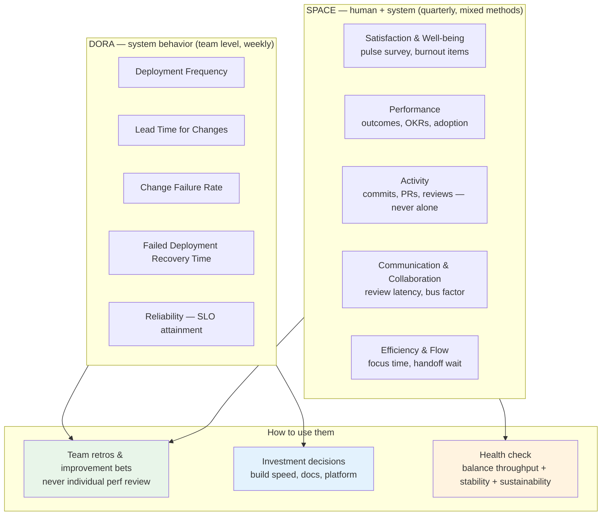
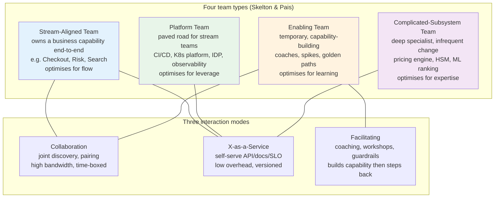
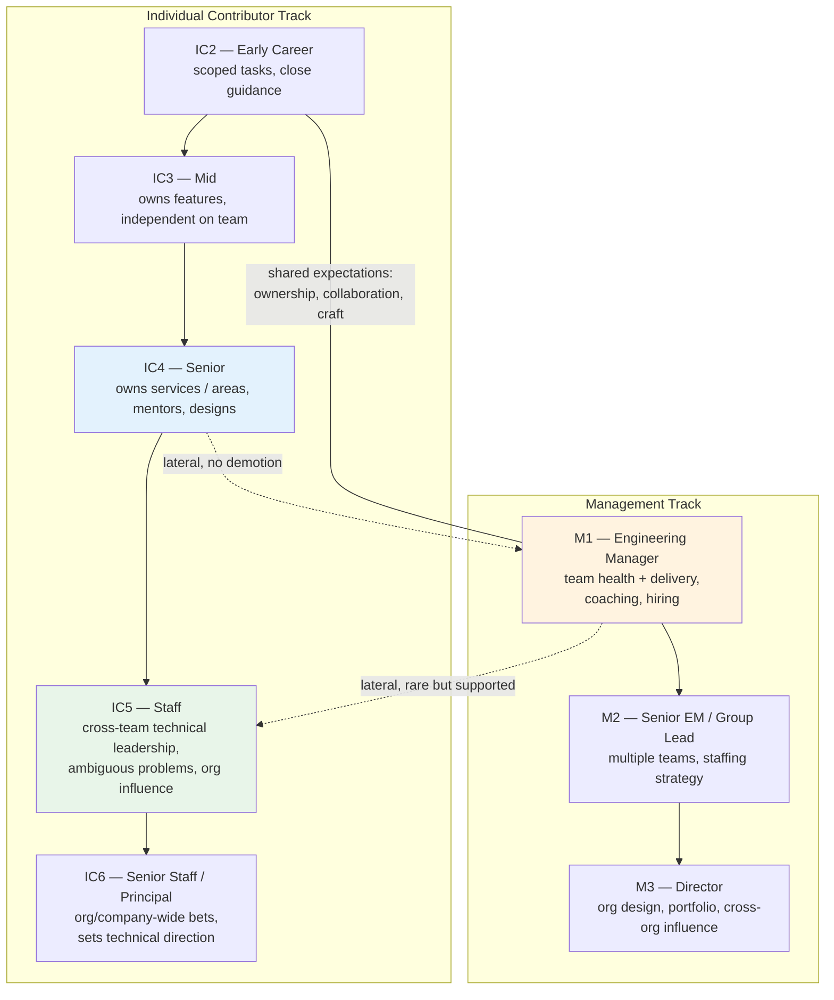
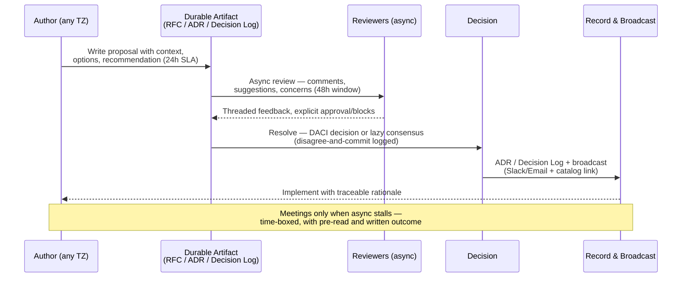
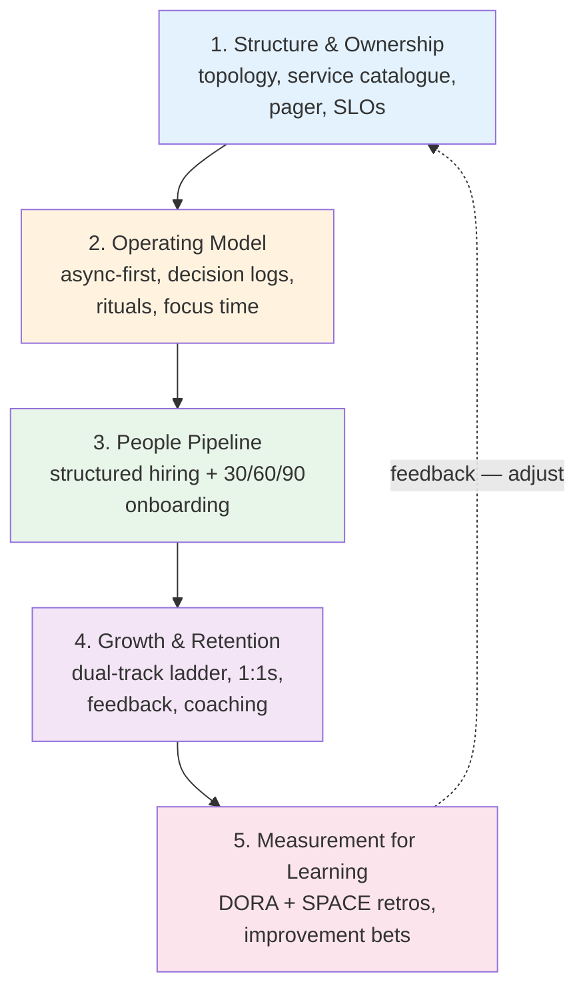

# Chapter 10 — Building High-Performing Engineering Teams

**What this chapter covers.** Tools, runtimes, and architectures do not ship software — teams do. Every system design decision from Volumes 1–14 becomes a team design decision at scale: who owns what, how decisions get made, how knowledge moves, and how performance is measured without perverse incentives. This chapter treats team building as an engineering discipline with measurable inputs, explicit trade-offs, and observable failure modes. You will learn the frameworks that separate high-performing teams from merely busy ones, the operating models that let teams scale without collapsing into coordination overhead, and the end-to-end people pipeline — hiring, onboarding, growth, and retention — adapted for the reality that modern backend teams are almost always distributed.

Learning goals — after this chapter you should be able to:

- Define "high-performing" with evidence from research (Project Aristotle, DORA, SPACE) and distinguish throughput metrics from outcome and human measures.
- Instrument engineering effectiveness with DORA's four keys and SPACE's five dimensions, avoiding Goodhart failure and survey gaming.
- Design a team topology using Team Topologies' four team types and three interaction modes, applying Conway's Law deliberately rather than accidentally.
- Run a structured hiring loop — scorecard, work sample, structured interview, bar-raiser, calibrated debrief — that selects for signal and mitigates bias.
- Ship a 30/60/90 onboarding system that gets a new backend engineer to first meaningful production change safely and quickly.
- Operate a dual-track growth ladder (IC and management) with clear expectations, continuous feedback, and a calibration process engineers trust.
- Lead distributed and remote teams with an async-first operating model that preserves decision velocity across time zones without burning people out.

---

## 1. What "high-performing" actually means

Velocity — story points per sprint, PRs merged per week — is trivially gameable and almost uncorrelated with business outcomes. Research on team effectiveness converges on a richer picture.

### Three lenses that predict performance

**Google's Project Aristotle (2012–2016, 180+ teams).** The strongest predictor of team effectiveness was not seniority mix, tenure, or tooling — it was **psychological safety**, followed by dependability, structure and clarity, meaning, and impact. Safety is not niceness; it is the shared belief that candour will not be punished — that you can flag a risky deploy, admit you do not understand a design, or challenge a staff engineer's proposal without career cost.

**Lencioni's Five Dysfunctions (2002).** A diagnostic stack: absence of trust → fear of conflict → lack of commitment → avoidance of accountability → inattention to results. Each layer is a prerequisite for the next. Teams that skip straight to "accountability" without trust get performative compliance, not ownership.

**Tuckman's stages (1965, refined 1977).** Forming → Storming → Norming → Performing → Adjourning. New teams, re-orgs, and geographically split teams regress to Storming. Expect it, name it, and give it explicit facilitation — retro formats, working agreements, decision logs — rather than waiting for it to resolve organically.

> **Distributed-systems lens.** A backend service that is "up" but slow, lossy, or subtly inconsistent is not healthy — throughput without correctness is not performance. Teams behave the same way. A team that ships quickly but burns out its members, accumulates decision debt, or silos knowledge is not high-performing; it is accruing an operational deficit that will surface as attrition, incidents, and stalled delivery the way technical debt surfaces as latency and outages.

### The performance stack

A useful mental model layers team performance:

| Layer | Question it answers | Example measure |
|-------|---------------------|-----------------|
| **Delivery** | Can we ship frequently and safely? | DORA four keys |
| **Outcomes** | Does what we ship matter? | Adoption, SLO attainment, incident reduction |
| **Health** | Can we keep doing it? | Retention, burnout signal, psychological safety survey |
| **Learning** | Are we getting better? | Time to first meaningful PR for new hires, post-incident action closure rate, experiment throughput |

High-performing teams optimise all four. Optimising only the first is how organisations end up with impressive deploy graphs and exhausted, disengaged engineers.

---

## 2. Measuring engineering effectiveness — DORA and SPACE

No single metric captures engineering performance. Two frameworks, used together, cover most of the ground — one behavioural (what the delivery system does) and one multidimensional (how people experience the system).

### 2.1 DORA — the four keys

The DORA (DevOps Research and Assessment) program, now part of Google Cloud's DORA research and published annually since 2014, identifies four delivery metrics that correlate with both throughput and stability:

| Metric | Definition | Elite threshold (2023 report) |
|--------|------------|-------------------------------|
| **Deployment Frequency (DF)** | How often code deploys to production | On demand, multiple per day |
| **Lead Time for Changes (LT)** | Commit → production | < 1 day |
| **Change Failure Rate (CFR)** | % of deploys causing failure (rollback, hotfix, incident) | 0–15% |
| **Mean Time to Recovery (MTTR)** / *Failed Deployment Recovery Time* | Time to restore service after a failure | < 1 hour |

The 2023 and 2024 DORA reports refined the picture: the "elite" cluster is not about raw speed alone — it is about *balanced* performance. Teams that push DF and LT without investing in testing, progressive delivery, and observability see CFR spike; the elite sustain low CFR *and* low MTTR simultaneously. DORA also added a **reliability** cluster (meeting or exceeding reliability targets) and emphasised that throughput without reliability is not elite.

**How to compute the four keys without lying to yourself:**

```sql
-- Lead time for changes: median commit -> production deploy
-- Assumes deploys table and commits linked via deploy_commits
SELECT
  percentile_cont(0.50) WITHIN GROUP (ORDER BY EXTRACT(EPOCH FROM (d.deployed_at - c.committed_at))/3600) AS p50_lt_hours,
  percentile_cont(0.95) WITHIN GROUP (ORDER BY EXTRACT(EPOCH FROM (d.deployed_at - c.committed_at))/3600) AS p95_lt_hours
FROM deploys d
JOIN deploy_commits dc ON dc.deploy_id = d.id
JOIN commits c ON c.sha = dc.sha
WHERE d.environment = 'production'
  AND d.deployed_at >= NOW() - INTERVAL '30 days'
  AND d.status = 'success';
```

```promql
# Change failure rate (30d) — label deploys that triggered incident or rollback within 24h
# Requires deploy events joined with incident/rollback signals in your metrics pipeline
(sum(increase(deployments_total{env="prod"}[30d]))
 - sum(increase(deployments_failed_total{env="prod"}[30d]))
) / sum(increase(deployments_total{env="prod"}[30d]))

# MTTR — requires incident start/end timestamps exported as a gauge or histogram
histogram_quantile(0.50, sum(rate(incident_recovery_seconds_bucket[30d])) by (le))
```

Practical instrumentation:

- **Source of truth:** your deploy platform (Argo Rollouts, Spinnaker, GitHub Deployments API) — not Jira status transitions, which lag reality by hours.
- **CFR definition must be written down.** Is a feature-flag rollback a failure? Is a hotfix within 1 hour a failure? Pick a definition and hold it stable for 6+ months or trends are meaningless.
- **Segment by team and service type.** An elite API team and an elite data-pipeline team will have different DF baselines; comparing them directly incentivises gaming.

### 2.2 SPACE — the human complement

DORA tells you what the system does; **SPACE** (Forsgren et al., *ACM Queue* 2021, after work at Microsoft Research / GitHub) tells you how people experience it. Five dimensions, no single score:

| Dimension | What it captures | Example signals |
|-----------|------------------|-----------------|
| **S**atisfaction & well-being | Fulfilment, health, perceived autonomy | Pulse survey, burnout items, focus-time satisfaction |
| **P**erformance | Outcome of the work | Customer adoption, SLO attainment, OKR completion |
| **A**ctivity | Volume of actions | Commits, PRs, reviews, deploys — *never alone* |
| **C**ommunication & collaboration | How work is coordinated | Review turnaround, knowledge siloing (bus factor), meeting load |
| **E**fficiency & flow | Freedom from friction | Time in flow, handoff wait time, build/deploy lead time, interruptions |

SPACE's central rule: **never use a single dimension in isolation**, especially Activity. A rise in PR count without a corresponding rise in Performance and Satisfaction is usually toil or fragmentation, not productivity.

A lightweight pulse implementation (quarterly, anonymous, 7-point Likert, 5–8 items):

```yaml
# space-pulse.yaml — run quarterly, 200-500 engineers, anonymous
dimensions:
  satisfaction:
    - "I have enough uninterrupted time to do deep work (≥2h blocks)."
    - "I can speak up about risks without fear of negative consequences."
  efficiency_flow:
    - "From 'ready to code' to 'running locally' takes <30 minutes for my primary service."
    - "Waiting on reviews or approvals rarely blocks me for more than a day."
  communication:
    - "I know who to ask and how to get a decision within 48 hours."
    - "Design docs and runbooks are easy to find and usually up to date."
  performance:
    - "I understand how my current work connects to a team or business outcome."
```

### 2.3 DevEx and the anti-Goodhart stance

Abi Noda et al.'s **DevEx framework** (2023) organises developer experience into feedback loops, cognitive load, and flow state — a useful bridge between DORA/SPACE and concrete investment priorities (faster builds, better docs, fewer context switches).

The meta-rule across all frameworks: **metrics are for learning, not for ranking.** As soon as CFR or PR count becomes a performance-review input, teams optimise the metric, not the outcome (Goodhart's Law). DORA's own guidance: use delivery metrics for *team-level* retrospectives and improvement hypotheses, never for individual stack-ranking.



*Figure 10-1: DORA and SPACE as complementary lenses. DORA answers "can we ship quickly and safely?"; SPACE answers "at what human cost, and does the output matter?" Both feed team-level learning, not individual ranking.*

---

## 3. Team topology — designing teams the way you design systems

Conway's Law — "organisations design systems that mirror their communication structures" — is usually quoted as a warning. Treat it as a design tool. Team topology is the deliberate counterpart to system architecture.

### 3.1 The Team Topologies model

Skelton and Pais (*Team Topologies*, 2019, now the de facto reference for backend org design) propose **four team types** and **three interaction modes**. Use them to make ownership, cognitive load, and dependency explicit.



*Figure 10-2: Team Topologies — four team types and three interaction modes. Most healthy 50–200-engineer orgs carry 60–70% stream-aligned teams, one platform team per 30–50 stream engineers, and enabling teams that are explicitly temporary.*

**How to apply it:**

- **Cognitive load is the constraint.** A team that owns three business domains, a shared database, and an on-call rotation for an unrelated platform is overloaded regardless of headcount. The fix is not more people — it is narrower ownership.
- **Default to X-as-a-Service, escalate to Collaboration.** Stream teams should consume the platform via documented APIs, templates, and SLOs. Reserve high-bandwidth collaboration (joint pairing, shared planning) for discovery phases or when the platform's abstraction is actively being shaped — and time-box it.
- **Enabling teams must have an exit criterion.** An enabling team that becomes permanent is a platform team without an SLO. Define the capability transfer ("three stream teams can run this independently") and disband or rotate.
- **Complicated-subsystem teams need a stable interface.** If every consumer needs weekly syncs with the pricing-engine team, the API is wrong — fix the boundary, not the calendar.

### 3.2 Sizing and structure

| Heuristic | Value | Why |
|-----------|-------|-----|
| Team size | 5–9 engineers (Amazon's "two-pizza" rule) | Keeps n(n-1)/2 communication edges tractable; Dunbar's ~150 caps effective org tribes |
| Manager span | 6–8 direct reports (up to 10 in stable teams) | Beyond ~8, 1:1 quality and coaching degrade sharply |
| Platform ratio | 1 platform engineer per 30–50 product engineers | Below ~1:30, paved roads degrade; above ~1:15, platform builds for itself |
| On-call load | ≤ 1 week per 5 weeks per person; ≤ 2 pages per week (p50) | Sustained higher load predicts attrition within 2 quarters (DORA, SPACE data) |

For early-stage or small companies, a single cross-functional team is often correct — do not impose four team types prematurely. The trigger for topology work is sustained cognitive overload: frequent "we can't ship without Team X," rising handoff wait time, or ownership ambiguity during incidents.

### 3.3 Ownership is a contract

Every service should have exactly one owning team recorded in a service catalogue (Backstage, Cortex, or a simple `catalog-info.yaml`), with:

- **On-call rotation** and escalation path
- **Runbook and SLO** (or explicit "no SLO yet" with a date)
- **Lifecycle status** — experimental, production, deprecated (with sunset date)
- **Dependency map** — upstream/downstream services and data stores

Ownership without operational accountability is theatre. If a team owns a service but never carries the pager for it, they will optimise for feature velocity over operability.

---

## 4. Hiring — the highest-leverage investment

For backend teams, hiring quality compounds more than any other intervention. A strong hire raises the bar for the next hire; a weak hire lowers it and increases review load, incident risk, and attrition of strong peers. Treat hiring as a system with measurable throughput, quality, and fairness — not as a series of ad-hoc conversations.

### 4.1 The pipeline

```mermaid
flowchart LR
    JD["Job Description<br/>outcomes, stack, level"] --> Source["Sourcing<br/>referrals, outbound, inbound"]
    Source --> Screen["Recruiter Screen<br/>15-20 min, comp & interest"]
    Screen --> TechScreen["Technical Screen<br/>60 min, coding + systems signal"]
    TechScreen --> Onsite["Onsite / Virtual Loop<br/>4-5 interviews, scorecard"]
    Onsite --> Debrief["Hiring Debrief<br/>calibrated, bar-raiser has veto"]
    Debrief --> Offer["Offer & Close<br/>level, comp, team match"]
    Offer --> Preboard["Pre-boarding<br/>laptop, env, first-week plan"]

    style JD fill:#e3f2fd
    style Debrief fill:#fff3e0
    style Offer fill:#e8f5e9
```



*Figure 10-3: A structured hiring pipeline. Every stage has a written purpose, a scorecard, and a pass-through rate you track — the pipeline is itself a system to be instrumented, not just endured.*

**Job descriptions that select for the right candidates** describe outcomes and constraints, not wish-list keywords:

> *Bad:* "10+ years Java, Kubernetes expert, BS/MS required."
> *Good:* "You will own a set of latency-sensitive Java/Kotlin services on Kubernetes that handle ~20k rps at p99 < 80 ms. You will make trade-offs between consistency and availability with product and SRE, and mentor two mid-level engineers. We value evidence of production ownership (on-call, post-incident learning) more than years of experience with any single tool."

**Sourcing mix to track:** referral rate, outbound response rate, inbound conversion, and — critically — demographic diversity at each funnel stage. If diversity drops sharply at "resume screen," the screen criteria need auditing.

### 4.2 Structured interviews and scorecards

Unstructured interviews ("have a chat, see if they're good") have near-zero predictive validity (Schmidt & Hunter, 1998; replicated in tech hiring by Google's hiring research). **Structured interviews** — same questions, same rubric, independent scoring — roughly double predictive power.

A backend loop typically covers four signals:

| Interview | What it probes | Format (60 min) | Anti-pattern |
|-----------|---------------|-----------------|--------------|
| **Coding / Data structures** | Problem decomposition, complexity, testing, trade-offs | Work-sample or pair exercise on realistic problem; language of candidate's choice | LeetCode trivia divorced from backend reality; demanding optimal solution in 15 min |
| **Systems design** | Requirements → estimation → data model → consistency/availability trade-offs → observability | Open-ended design of a system the candidate would plausibly own (rate limiter, notification service, feed) | Grading against one "correct" architecture; penalising clarification questions |
| **Behavioural / Ownership** | Collaboration, conflict, incident ownership, learning | STAR prompts tied to scorecard ("Tell me about a time you disagreed with a technical decision and what happened") | "Culture fit" vibes without behavioural anchors |
| **Practical / Debugging** | Operating real systems — logs, metrics, traces, SQL, Linux | Debug a failing service with provided artefacts or review a real PR | Pure trivia ("what flag does `curl` use for…") |

**Scorecard example — Systems Design (Senior Backend, L4):**

```markdown
# Scorecard — Systems Design — Candidate: __________ — Interviewer: __________ — Date: ____

## Competencies (1-4; 3 = meets bar for level, 4 = exceeds)
| Competency | 1 — below bar | 2 — approaching | 3 — meets bar | 4 — exceeds | Score | Evidence (quotes, diagrams) |
|------------|---------------|-----------------|---------------|-------------|-------|------------------------------|
| Requirements & estimation | No clarifying Qs; no numbers | Some Qs; rough estimate | Structured Qs; Fermi estimate with bottleneck ID | Slices scope by risk; capacity plan tied to SLO | _/4 | |
| Data & consistency | Single DB, no trade-off | Mentions consistency, vague | Chooses consistency model with justification (e.g., causal for feed) | Reasons about replication lag, idempotency, exactly-once limits | _/4 | |
| Scaling & resilience | No scaling story | Mentions sharding/cache | Sharding + caching + backpressure + failure mode | Tail-latency, load shedding, and observability hooks | _/4 | |
| Communication | Hard to follow | Some structure | Clear, diagrams, invites feedback | Adapts to hints, summarises trade-offs | _/4 | |

## Overall:  Strong Hire / Hire / No Hire / Strong No Hire
## Level signal: IC3 / IC4 / IC5  (calibrate after debrief)
## Bias check: Would I score this way if the candidate's background were different? Any halo/horns?
## Notes for debrief (verbatim evidence, not adjectives):
```

**Practical guardrails:**

- **Work sample over whiteboard puzzle.** A 60-minute exercise extending a small service (add idempotency, fix a race, design a migration) predicts backend performance better than inverting a binary tree.
- **Independent scoring before discussion.** Interviewers submit scores before the debrief to avoid anchoring on the most senior voice.
- **Bar-raiser / hiring manager veto.** One interviewer outside the hiring team, trained to hold the level bar, has veto power. Without this, teams under delivery pressure quietly lower the bar.
- **Structured debrief, time-boxed to 45 minutes.** Round-robin evidence → scores → discussion only where scores diverge → hire/no-hire decision with written rationale stored for audit.

### 4.3 Bias, fairness, and legal hygiene

Real mitigations, not slogans:

- Blind resume review for initial screen where feasible; otherwise dual review.
- Identical questions and rubric per level — no "extra hard" track for candidates from non-traditional backgrounds.
- Panel diversity — if every interviewer looks the same, the signal about belonging is loud regardless of what is said.
- Track **adverse impact** at each stage (pass-through by gender, ethnicity where legally collectible, source channel). A statistically significant drop at any stage triggers a process review, not a quota.

---

## 5. Onboarding — from offer to first meaningful change

Time-to-productivity is a leading indicator of both hiring quality and organisational health. For backend roles, a useful target is **first meaningful production change within 5–10 working days** — not a typo fix, but a small feature, bug fix, or migration behind a flag, reviewed and deployed through the normal pipeline.

### 5.1 The 30/60/90

```yaml
# onboarding-30-60-90.yaml — checked into the team repo, owned by the EM
preboarding: # between offer accept and day 1
  - Laptop + accounts provisioned via MDM/SSO (no manual ticket queue on day 1)
  - Repo access, VPN, and on-call shadow calendar invite sent
  - Buddy assigned (not the manager) with explicit expectations

week_1: # "can build, test, and ship to staging"
  - Dev env from scratch: clone → docker compose up / devcontainer → ./run_tests.sh < 15 min
  - Read: team charter, service catalogue entries, last 2 incident postmortems, 1 RFC
  - Pair on a good-first-issue; open a PR that exercises CI, review, and deploy
  - Shadow on-call (observe, do not page)
  - 1:1s scheduled with PM, designer, SRE, and one adjacent team

day_30: # "ships independently on a scoped task"
  - Owns a small production change end-to-end (flagged, observed, rolled out)
  - Can describe team's SLOs, dependencies, and current tech-debt bet
  - Has given and received at least 3 code reviews

day_60: # "operates the service"
  - Primary on-call for a low-risk rotation with backup
  - Leads or co-leads a design discussion or incident review
  - Feedback cycle: manager, buddy, and one peer provide written feedback

day_90: # "sets direction on a slice"
  - Proposes next-quarter scope for one area with a short RFC or tech-debt proposal
  - Calibration: manager and engineer align on level expectations and growth plan
  - Retro on onboarding itself — fix the onboarding for the next hire
```

**Environment as code is non-negotiable.** If setting up a local backend dev environment requires tribal knowledge, onboarding will be slow and inequitably so (engineers with internal networks get help faster). Invest in `devcontainer.json`, `docker-compose.yml`, or Nix/Devbox + seeded data + `make dev` that actually works on a fresh laptop.

**Cohorts beat solo drops.** Starting 2–4 engineers together — even across teams — creates a peer group that normalises questions and reduces early attrition.

### 5.2 What good looks like in week one

- The team's `README.md` answers: *what does this team own, how do we work, how do we decide, how do we get help?* — in under 10 minutes of reading.
- A `CONTRIBUTING.md` or `docs/onboarding.md` with copy-paste commands, expected runtimes, and where to find the staging environment.
- A labelled `good-first-issue` backlog groomed weekly — stale issues signal neglect to the new hire on day one.

---

## 6. Growth, retention, and the engineering ladder

Retention is not a perk problem — it is an **expectations and growth** problem. Engineers leave when they cannot see a credible path to mastery, autonomy, and impact inside the organisation.

### 6.1 The dual-track ladder



*Figure 10-4: Dual-track ladder — IC and management are parallel, equally valued, and crossable without penalty. The Staff/Principal tier is not "senior with more years" but a distinct scope of influence and ambiguity.*

**Levels describe scope, not tenure.** A common failure is to treat IC5 as "IC4 with 5 extra years." Instead, anchor each level in three dimensions:

| Dimension | IC4 (Senior) | IC5 (Staff) | IC6 (Principal) |
|-----------|-------------|------------|-----------------|
| **Scope** | Team / service area | Multiple teams / domain | Organisation / company |
| **Ambiguity** | Well-scoped problems, makes local trade-offs | Ambiguous problems, invents the scoping | Defines problems worth solving |
| **Leverage** | Multiplies team through code, reviews, mentoring | Multiplies org through architecture, RFCs, paved roads | Multiplies company through technical strategy, platform bets |

**Expectations matrix (excerpt — one row per level per axis):**

| Axis | IC3 | IC4 | IC5 |
|------|-----|-----|-----|
| **Technical execution** | Delivers scoped features with tests and observability; handles on-call | Designs services with explicit consistency/availability trade-offs; drives migrations | Shapes domain architecture; makes build-vs-buy bets with cost/risk analysis |
| **Collaboration** | Gives thorough reviews; documents decisions | Facilitates design reviews; resolves cross-team dependencies | Mediates contentious technical debates; builds alignment without authority |
| **Ownership** | Owns feature quality and timeliness | Owns service SLO, runbook, and debt plan | Owns health of a domain (quality, operability, hiring pipeline) |
| **Mentorship** | Learns from feedback; pairs effectively | Mentors IC2/IC3 systematically; improves onboarding | Coaches IC4s toward Staff; creates learning infrastructure (workshops, guides) |

Make the full ladder public inside the company — private ladders breed suspicion and bias. Publish the rubric, example promotion packets, and the calibration process.

### 6.2 Performance management that engineers trust

The most corrosive element in performance systems is surprise. Replace annual judgment with continuous signal:

- **Weekly 1:1s** with a shared doc (wins, challenges, asks, feedback given/received). The doc is the performance record — no reconstruction at review time.
- **Quarterly lightweight check-ins** (15–20 min, manager + engineer) — "are we aligned on level expectations? what would make a promotion case compelling next cycle?"
- **Biannual calibration** — managers bring proposed ratings plus evidence (peer feedback, deliverables, behavioural examples) to a cross-team calibration where the bar is held constant. Individual managers should not unilaterally decide levels.

**SBI feedback model** (Situation–Behaviour–Impact) keeps feedback specific and non-judgmental:

> *Situation:* "In yesterday's incident review for checkout latency…"
> *Behaviour:* "…you walked through the trace and named the missing index before assigning blame…"
> *Impact:* "…the team moved to fixing the query instead of defending decisions. That made the review blameless in practice, not just in name."

**Promotion packets** should be write-ups of already-demonstrated scope, not promises. The question is "has this person already been operating at the next level for one to two quarters?" — not "could they?"

### 6.3 Retention levers beyond compensation

Compensation must be competitive and transparent — opaque or below-market pay erodes every other retention effort. Beyond that, the highest-leverage levers:

- **Autonomy** — scope to choose *how* to solve a problem, not just tickets to implement.
- **Mastery** — access to hard problems, mentorship, and time to go deep (20% time rarely works; protected focus blocks do).
- **Purpose** — line of sight from daily work to user or business outcome; product and engineering co-own the "why," not just the "what."
- **Load management** — monitor on-call burden, meeting load (> 25 hours/week of meetings for ICs correlates with attrition), and context-switching. Fix the system, not the person.

**Early warning signals** (team-aggregated, never used to single out individuals): rising on-call pages, declining pulse scores on "I have time for deep work," increasing review turnaround without increased throughput, and — most predictive — a drop in voluntary participation (RFC comments, demo attendance, incident review facilitation).

---

## 7. Distributed and remote teams — async-first as the default

Most backend teams are now distributed by default — across offices, across time zones, or hybrid. Remote is not co-located with video calls; it is a distinct operating model with different failure modes and different affordances.

### 7.1 Degrees of distribution

| Model | When it works | Primary failure mode |
|-------|--------------|----------------------|
| **Co-located** | Early-stage, high-ambiguity discovery | Knowledge siloed in hallway conversations; bus factor of 1 on context |
| **Hybrid (anchor days)** | Established teams with strong documentation | Two-tier culture: remote participants miss pre/post-meeting decisions |
| **Distributed, sync-heavy** | Cross-timezone but overlapping hours (e.g., EU–US East) | Meeting sprawl; decisions delayed waiting for overlap |
| **Distributed, async-first (recommended)** | 3+ time zones, or any team that wants scale | Async without discipline becomes slow and opaque; requires explicit norms |

**Async-first** does not mean "no meetings." It means the default path for decisions, status, and knowledge is a durable, searchable artifact (doc, RFC, ADR, recorded demo), and meetings are reserved for high-bandwidth activities: debate, brainstorming, incident response, and relationship building.

### 7.2 The async-first operating loop



*Figure 10-5: Async-first decision loop. The durable artifact — not the meeting — is the source of truth. Time-boxed async windows replace "wait for the next sync" and make time-zone distribution an advantage (review happens overnight).*

**Concrete mechanisms that make async-first work:**

**1. Communication charter (one page, team-owned):**

```markdown
# Team Communication Charter — Checkout Platform

- Default for decisions: RFC in /rfcs with DACI and 48h review window.
- Default for questions: async thread in #checkout-discuss (expect reply within 1 business day).
- Meetings require: agenda, pre-read (linked 24h before), written outcome within 24h.
- Urgent (prod incident, blocking deploy): page via PagerDuty, not Slack DM.
- Focus time: 09:00–12:00 local is meeting-free for ICs; respect via calendar blocks.
- Decision rule: lazy consensus (silence = consent after window) for reversible decisions;
  explicit DACI approval for irreversible ones (data migrations, public APIs).
```

**2. Timezone-aware rituals:**

| Ritual | Sync or async | How to distribute it |
|--------|--------------|----------------------|
| Standup | Async thread or Loom (Mon/Wed/Fri) | Written update: yesterday / today / blockers; no status theatre |
| Planning | Sync, but pre-read async | RFC + estimation async; sync only for trade-off debate (record it) |
| Retro | Sync, facilitated | Pre-collect prompts async (board); sync for dialogue; publish actions |
| Demo | Async recording + sync Q&A | Recorded demo (5 min) watched async; 20-min sync for Q&A only |
| On-call handoff | Async with sync option | Written handoff in incident channel + 15-min overlap if TZ allows |
| Incident response | Sync (when SEV1/2) | Follow-the-sun primary; async updates in incident doc |

**3. Overlap math:** Two teams 8 hours apart (e.g., Berlin–San Francisco) have ~2 hours of natural overlap at the edges. Use it for debate and bonding; push everything else async. Teams 12 hours apart (e.g., Singapore–New York) should operate as async-first with a 1-hour weekly sync and quarterly in-person or offsite for trust building — daily overlap is unsustainable and burns one side.

**4. Documentation as the platform.** The ROI of docs is not "nice to have" — it is the difference between onboarding in days versus weeks and between a decision that sticks versus one re-litigated every sprint. Minimum viable set per team:

- `README.md` — what we own, how we work, how to get help
- `docs/runbooks/` — one runbook per alert, linked from the alert itself
- `docs/adrs/` — Architecture Decision Records, numbered, with context → decision → consequences
- `docs/onboarding.md` — commands, environments, first issues
- Service catalogue entries — ownership, SLO, lifecycle

### 7.3 Inclusion and psychological safety at a distance

Distributed teams amplify both good and bad culture because there are fewer informal repair opportunities. Specific practices:

- **Rotate facilitation and note-taking** — do not let the same (usually HQ-timezone) voices run every meeting.
- **Write first, discuss second** — share the doc before the meeting so non-native speakers and introverts can contribute in writing, where many do their best thinking.
- **Record and transcribe** — every consequential meeting is recorded with transcript and written summary; absence should not equal exclusion.
- **Explicit working-hours norms** — "we respond within one business day" beats "we're always on Slack," which rewards the most overworked.
- **In-person trust bursts** — quarterly or biannual 3–5-day offsites (not status meetings — collaborative building, incident game days, and social time) pay for themselves in async trust for months.

> **Anti-pattern: "Remote-friendly" as an afterthought.** A team that runs hybrid meetings with a single conference-room mic, decides in hallway chats, and documents after the fact is not remote-friendly — it is co-located with a remote penalty. Audit by asking every remote member: "Do you have the same access to context and decisions as someone in HQ?" If the answer is not an unqualified yes, fix the system.

---

## 8. Culture and leadership that compounds

Culture is not a poster — it is the set of behaviours that get rewarded when no one is watching. Leadership at scale is the system that makes those behaviours repeatable.

### 8.1 Psychological safety in practice

Safety is built through repeated, observable actions, not declarations:

- Leaders model fallibility — "I was wrong about the sharding strategy; here's what I missed and what we will change."
- Blameless incident reviews (see Volume 11, Chapter 6) — the review asks "how did the system allow this?" not "who caused it?"
- Review culture — comments on the work, not the person; "consider…" over "you should…"; explicit praise for thorough analysis, not just fixes.
- Decision logs that record dissent — "we disagreed, here's why we committed, here's the revisit trigger" — make it safe to disagree because disagreement is durable and respected.

### 8.2 Role clarity — EM, Tech Lead, Staff

As teams scale, ambiguity between management and technical leadership causes thrash. Make the split explicit:

| Responsibility | Engineering Manager | Tech Lead | Staff / Principal |
|----------------|---------------------|-----------|-------------------|
| Team health, hiring, coaching, delivery | **Owns** | Contributes | Advises |
| Technical direction for a service/domain | Consulted | **Owns** | **Owns** (broader scope) |
| Cross-team alignment and unblocking | **Owns** | Shares | Shares |
| Career growth and performance | **Owns** | Mentors | Mentors |
| Architecture at org scope | Consulted | Contributes | **Owns** |

The EM and TL are a partnership, not a hierarchy. In small teams one person wears both hats — name that explicitly and protect time for both, or the management work (hiring, coaching, unblocking) gets starved by the more immediately legible technical work.

### 8.3 The manager's operating system

**1:1s** are the highest-leverage meeting a manager runs. A template that sustains:

```markdown
# 1:1 — [Engineer] — [Date]
## How are you? (5 min) — energy, load, anything unsaid
## Wins since last time (5 min)
## Challenges / stuck points (10 min) — where can I unblock or reframe?
## Growth (10 min) — one skill or scope bet this month; what's the next concrete step?
## Feedback (5 min, both directions) — SBI; what should I keep / change as your manager?
## Actions: @owner — task — by when
```

**Delegation** scales the manager and grows the team. Use the levels:

1. **Do as I say** (directive) → 2. **Research and report** → 3. **Recommend** → 4. **Decide and inform** → 5. **Own entirely**

Move people up the scale deliberately by naming the level: "For this migration plan, I want you at level 4 — decide and inform me, and I'll back your call."

**Coaching over directing** for senior engineers: ask "what options have you considered? what would you need to decide?" before offering a solution. The goal is a team that makes good decisions without the manager in the room.

### 8.4 Continuous improvement — the retro that actually changes things

A retro without a closed improvement loop is a ritual of frustration. Effective retros:

- Run on a fixed cadence (biweekly for product teams, post-incident for SRE) with a rotating facilitator.
- Use a simple format — *Keep / Change / Try* or *Start / Stop / Continue* — and limit to **one or two action items with an owner and a date**, tracked like any other work item.
- Measure closure rate. If fewer than ~70% of retro actions close within a sprint or two, the retro is generating guilt, not improvement — fix the capacity allocation (e.g., 15–20% of sprint capacity for improvement work) rather than exhorting harder.

This connects directly to DORA/SPACE improvement bets: each retro action should be a hypothesised lever on a DORA or SPACE signal ("reduce build time from 12 min to 4 min to improve E×fficiency & flow") with a follow-up measurement.

---

## 9. Putting it together — the team as a system

A high-performing backend team is a system with inputs, constraints, and feedback loops — not a collection of talented individuals who happen to share a Slack channel. The design choices stack:

- **Structure** (topology, ownership, sizing) determines cognitive load and the cost of coordination.
- **Pipeline** (hiring, onboarding) determines the quality and ramp of every new member.
- **Growth** (ladder, feedback, coaching) determines whether good people stay and get better.
- **Operating model** (async-first, decision logs, rituals) determines whether distribution is a superpower or a tax.
- **Measurement** (DORA + SPACE, used for learning) determines whether the team can see itself clearly and improve intentionally.

No team optimises all five at once. The pragmatic order for a team that is struggling: fix **structure and ownership** first (ambiguous ownership makes everything else noisy), then **operating model** (make decisions durable), then **pipeline** (hire and onboard well), then **growth** (retain and compound). Measure throughout, but measure to learn.



*Figure 10-6: Sequencing team investment. Structure and operating model are prerequisites — without clear ownership and durable decisions, hiring and growth investments leak away as coordination overhead.*

---

## Key takeaways

- "High-performing" means balanced performance across delivery, outcomes, health, and learning — not velocity alone. Psychological safety is the strongest predictor of team effectiveness; without it, measures like DORA/SPACE will be gamed or ignored.
- DORA's four keys (DF, LT, CFR, MTTR) and SPACE's five dimensions (Satisfaction, Performance, Activity, Communication, Efficiency) are complementary. Use DORA for weekly, team-level delivery signal and SPACE (with a quarterly pulse) for human-centred, multi-method insight. Never use either for individual ranking.
- Team topology is architecture. Apply Team Topologies' four team types (stream-aligned, platform, enabling, complicated-subsystem) and three interaction modes (collaboration, X-as-a-service, facilitating) to bound cognitive load. Size teams to 5–9, keep platform ratios near 1:30–1:50, and make every service's ownership, pager, and SLO explicit in a catalogue.
- Hiring is a system. Structured interviews with a written scorecard, work-sample exercises over trivia puzzles, independent scoring, and a bar-raiser debrief roughly double predictive validity over unstructured chats and are the best available mitigation for bias. Track funnel diversity at each stage.
- Onboarding should target a meaningful production change in 5–10 days. A checked-in 30/60/90 plan, a working `make dev` environment, a designated buddy, and a groomed good-first-issue backlog are the minimum viable investments — and they pay back on every subsequent hire.
- Growth and retention depend on a public, dual-track ladder with behavioural anchors per level (scope, ambiguity, leverage), continuous feedback (SBI), and calibrated reviews. Compensation must be competitive; beyond it, autonomy, mastery, purpose, and sustainable load are the levers that retain senior backend engineers.
- Distributed, async-first operation is a deliberate design — durable artifacts over meetings, time-boxed async windows, timezone-aware rituals, and documentation as the platform. Audit any hybrid or remote setup by asking remote members whether they have equal access to context and decisions.
- Culture compounds through observable behaviour: blameless incident learning, written dissent, rotated facilitation, and managers who coach rather than direct. The EM/TL/Staff split must be explicit, and retros must close their actions or they become cynicism generators.

## Further reading

- Forsgren, Humble, and Kim — *Accelerate: The Science of Lean Software and DevOps* (2018) — the research behind DORA; defines the four keys and the capabilities that drive them. Annual DORA reports at https://dora.dev/ (reports for 2023 and 2024 refine elite thresholds and add reliability).
- Forsgren et al. — "The SPACE of Developer Productivity" *ACM Queue* 19, no. 1 (2021) — https://queue.acm.org/detail.cfm?id=3454124 — the five-dimensional alternative to single-metric productivity.
- Noda et al. — "DevEx: What Actually Drives Productivity" *ACM Queue* 21, no. 2 (2023) — https://queue.acm.org/detail.cfm?id=3595878 — feedback loops, cognitive load, and flow.
- Skelton and Pais — *Team Topologies: Organizing Business and Technology for Fast Flow* (2019) — https://teamtopologies.com/ — four team types, three interaction modes, and cognitive-load-driven design.
- Will Larson — *An Elegant Puzzle: Systems of Engineering Management* (2019) and *Staff Engineer: Leadership Beyond the Management Track* (2021) — practical management operating system and the Staff archetypes.
- Tanya Reilly — "Being Glue" (2018) — https://www.noidea.dog/glue — recognising and rewarding essential, often invisible work.
- Google re:Work — Project Aristotle guide — https://rework.withgoogle.com/guides/understanding-team-effectiveness/ — psychological safety and the five predictors.
- Lara Hogan — *Resilient Management* (2019) — 1:1s, feedback, and coaching for new managers.
- Camille Fournier — *The Manager's Path* (2017) — ladder design, tech-lead vs. EM, and scaling organisations.
- Edmondson — *The Fearless Organization* (2019) — psychological safety as a measurable, buildable capability.
- Schmidt and Hunter — "The validity and utility of selection methods in personnel psychology" *Psychological Bulletin* 124, no. 2 (1998) — why structured interviews outperform unstructured ones.
- Beck et al. — "Manifesto for Agile Software Development" (2001) and subsequent retrospectives literature — the origin of iterative improvement rituals; contrast with async-first adaptations for distributed teams.

---

*This chapter closes Volume 15 — Software Engineering Practice — and with it the main Backend Engineer's Library (Volumes 1–15). The Companion Series on Supply Chain Security (Books 1–8, 75 chapters) remains as a specialist reference. The arc of the library — from transistor to team — reflects a conviction: reliable backend systems are built by teams that treat people, process, and measurement with the same rigour they bring to consistency models, storage engines, and consensus protocols. The technology changes; the need for safe, clear, and humane teams does not.*

*Next steps for the reader: revisit the DORA and SPACE signals for your current team, audit one ownership boundary and one decision log, and run a single improvement bet through a full retro cycle. Small, closed loops compound.*

