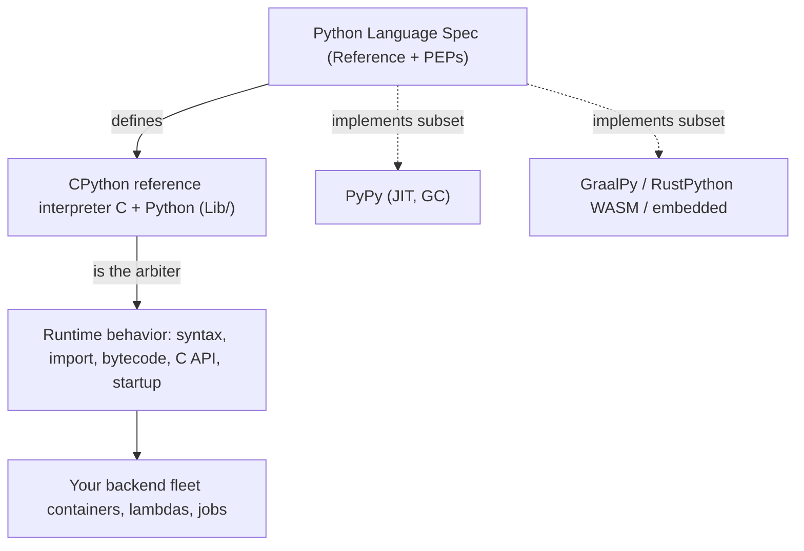
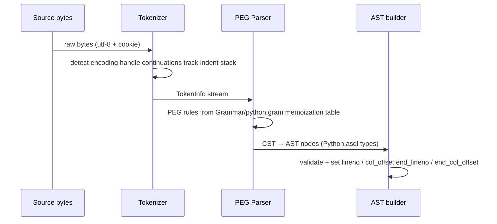
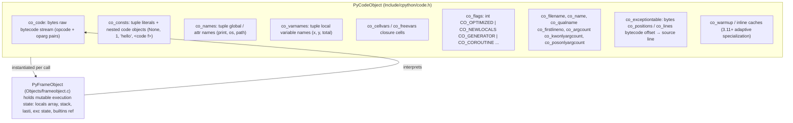
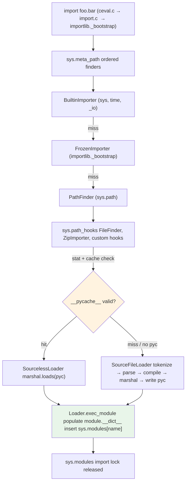
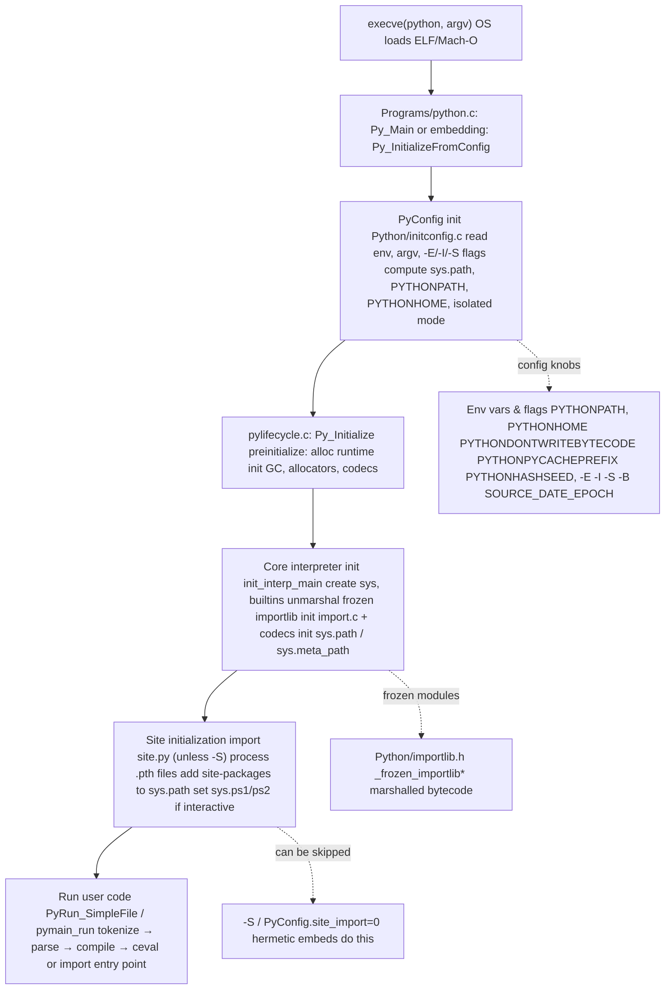

# Chapter 1 — CPython Architecture: Source to Execution

**What this chapter covers.** Python is the glue of most backend stacks — API services, data pipelines, ML inference, orchestration, and operational tooling all embed or shell out to CPython. Yet few backend engineers can explain what happens between `python app.py` and the first line of user code executing, or why the same `.py` file behaves differently when `__pycache__` is present, absent, or stale. This chapter traces the entire path from source text to execution: how CPython is organized on disk, how source is tokenized, parsed with a PEG parser, lowered to an AST and then to bytecode, how that bytecode is cached and loaded, and how the interpreter itself boots and enters its evaluation loop. You will use the same introspection tools core developers use — `tokenize`, `ast`, `dis`, `marshal`, and `importlib` — on real code.

Learning goals — after this chapter you should be able to:

- Navigate the CPython repository layout (`Parser/`, `Python/`, `Objects/`, `Include/`, `Lib/`, `Modules/`) and explain what each top-level directory owns.
- Trace the compilation pipeline end-to-end: `tokenize.c` → PEG parser (`pegen`) → `ast.c` / AST → `symtable.c` → `compile.c` → `PyCodeObject` → `ceval.c` evaluation loop.
- Explain the tokenizer's job (bytes → tokens, encoding cookie, `INDENT`/`DEDENT`/`NL`/`NEWLINE`/`ENDMARKER`) and show its output on real source.
- Contrast the PEG parser (PEP 617, since 3.9) with the old `pgen`/`LL(1)` parser: why the switch happened, what `Grammar/python.gram` is, and how `pegen` generates `parser.c`.
- Describe AST nodes, `ast.parse`/`ast.dump`/`python -m ast`, the symbol table pass, and the code object (`PyCodeObject`) layout including `co_code`, `co_consts`, `co_names`, `co_varnames`, `co_exceptiontable`, and `co_qualname`.
- Explain `.pyc` / `__pycache__` / `marshal`, the 16-byte header (magic, flags, mtime/hash, size/hash), PEP 552 deterministic `pyc` modes, and `SOURCE_DATE_EPOCH` reproducible builds.
- Describe the import bootstrap (`_bootstrap.py` / `_bootstrap_external.py`, finders, loaders, `sys.meta_path`/`sys.path_hooks`/`sys.path`) and how the interpreter boots (`Py_Initialize` / `pylifecycle.c` / `PyConfig` / `initconfig.c`).
- Evaluate `__pycache__` and `.pyc` handling in containers and hermetic deploys: when to keep, strip, or pre-compile bytecode, and how it affects startup, image size, and reproducibility.

> **Prerequisites.** Volume 13, Chapter 6 is the service-level view of the Python runtime (GIL, GC, performance posture). Volume 1, Chapters 8–9 (data layout, floats) and Volume 2, Chapter 4 (allocators) are useful background for later chapters. This chapter assumes you can read C at a skim and have run `python -m dis` at least once.

---

## 1. CPython as the reference interpreter

Python the language is defined by the [Language Reference](https://docs.python.org/3/reference/index.html) and a stream of PEPs. CPython — the C implementation hosted at [github.com/python/cpython](https://github.com/python/cpython) — is the reference interpreter: when the reference and an alternative runtime disagree, CPython wins. Practically every "Python" your backend runs is CPython unless you opted into PyPy, GraalPy, or a WASM build explicitly.

Why CPython internals matter to a backend engineer even if you never patch the interpreter:

- **Startup and import dominate cold-start latency.** Serverless functions, Kubernetes jobs, CLIs, and autoscaled web workers all pay import cost. Understanding `pyc` caching, `PYTHONDONTWRITEBYTECODE`, and the import lock explains real tail-latency.
- **Bytecode is not an implementation detail you can ignore.** Debuggers, profilers, coverage tools, import hooks, `dataclasses`, `pydantic`, and `pytest` all read or rewrite `PyCodeObject`s.
- **Reproducibility and supply-chain hygiene start at the artifact.** Whether a `.pyc` embeds a timestamp or a hash decides if two builds from the same source are byte-identical — relevant to SLSA provenance, container attestations, and cache invalidation.
- **Compatibility is defined by CPython's choices.** Syntax, import semantics, `sys.path` initialization, `PYTHONPATH`/`PYTHONHOME`/`-E`/`-I` isolation flags, and `audit hooks` are specified by what CPython actually does.

CPython follows a yearly release cadence (3.11, 3.12, 3.13, …), each with a single `main` branch and a `3.x` stable branch after feature freeze. Minor versions are ABI-stable for C extensions compiled against the Stable ABI (`Py_LIMITED_API`) but not for bytecode — `.pyc` magic numbers change on every feature release.



---

## 2. Repository layout — where things live

Clone `github.com/python/cpython` and the top level is immediately informative. Every directory maps to a phase of the pipeline or a layer of the runtime.

| Path | Owns | Key files |
|------|------|-----------|
| `Parser/` | PEG parser machinery | `pegen/`, `token.c`, `pegen.c`, `parser.c` (generated), `Python.asdl` |
| `Grammar/` | Grammar definition | `python.gram` (PEG grammar), `Tokens` |
| `Python/` | Interpreter core + lifecycle | `ceval.c`, `compile.c`, `ast.c`, `symtable.c`, `pylifecycle.c`, `import.c`, `Python/tokenize.c` |
| `Objects/` | Object system | `object.c`, `longobject.c`, `unicodeobject.c`, `dictobject.c`, `frameobject.c`, `codeobject.c` |
| `Include/` | Public + internal headers | `Python.h`, `cpython/code.h`, `internal/pycore_*.h` |
| `Lib/` | Standard library (Python) | `importlib/`, `ast.py`, `dis.py`, `tokenize.py`, `py_compile.py` |
| `Modules/` | C stdlib extensions | `_io/`, `_json`, `posixmodule.c`, `gcmodule.c` |
| `PC/` / `Mac/` | Platform shims | Windows/macOS build glue |
| `Tools/` | Dev tooling | `peg_generator/` (the `pegen` that emits `parser.c`) |

A few details that catch newcomers:

- **The tokenizer lives in `Parser/token.c` and `Python/tokenize.c`.** The C tokenizer is the one the interpreter uses; `Lib/tokenize.py` is a pure-Python reimplementation used by tools (formatters, linters) and must stay compatible.
- **`Grammar/python.gram` is the source of truth for syntax.** It is a PEG grammar consumed by `Tools/peg_generator/pegen` to emit `Parser/parser.c` (~10k+ lines, regenerated, not hand-edited).
- **`Python/ceval.c` is the evaluation loop.** Historically a giant `switch` over opcodes; since 3.11 it includes adaptive specialization and inline caches (PEP 654/659 territory — Chapter 3).
- **`Objects/codeobject.c` defines `PyCodeObject`.** The immutable container for bytecode and its metadata; `Lib/dis.py` knows how to pretty-print it.
- **`Lib/importlib/_bootstrap.py` and `_bootstrap_external.py` are frozen.** They are compiled to bytecode, marshalled, and baked into the interpreter binary (`Python/importlib.h`, generated by `Tools/build/freeze_modules.py`) so import can bootstrap itself before the filesystem importer exists.

```
cpython/
├── Grammar/python.gram        # PEG grammar (source of truth)
├── Parser/
│   ├── token.c                # tokenizer (C)
│   ├── pegen/                 # PEG engine runtime
│   └── parser.c               # ← GENERATED from python.gram
├── Python/
│   ├── ast.c                  # AST construction + validation (from Python.asdl)
│   ├── symtable.c             # symbol table (scope analysis)
│   ├── compile.c              # AST → bytecode → PyCodeObject
│   ├── ceval.c                # bytecode evaluation loop
│   ├── pylifecycle.c          # Py_Initialize / Py_Finalize / runtime init
│   ├── import.c               # import machinery (C side)
│   └── tokenize.c             # tokenizer helpers
├── Objects/
│   ├── codeobject.c           # PyCodeObject
│   ├── frameobject.c          # PyFrameObject
│   └── ...                    # one file per built-in type
├── Include/
│   ├── Python.h
│   ├── cpython/code.h
│   └── internal/pycore_*.h
├── Lib/
│   ├── importlib/_bootstrap*.py  # frozen import system
│   ├── ast.py / dis.py / tokenize.py
│   └── ...
└── Modules/                   # C extensions (_json, _io, gc, ...)
```

> **Lab tip.** After cloning, run `make regen-all` (or `make regen-pegen` / `make regen-ast`) to regenerate `Parser/parser.c`, `Include/internal/pycore_ast.h`, and friends from `Grammar/python.gram` and `Parser/Python.asdl`. If you edit the grammar, you must regenerate.

---

## 3. The pipeline at a glance

Source text becomes running code in a strict, observable pipeline. Every stage has a C file (or pair of files) and a Python-level introspection hook.

```mermaid
flowchart LR
    SRC["Source .py bytes (utf-8 + cookie)"] --> TOK["Tokenizer Parser/token.c bytes → Token stream"]
    TOK --> PEG["PEG Parser Parser/parser.c (from Grammar/python.gram) Token stream → AST"]
    PEG --> AST["AST Python/ast.c validated tree (Python.asdl)"]
    AST --> SYM["Symbol Table Python/symtable.c scopes, free vars, cell vars"]
    SYM --> CMP["Compiler Python/compile.c AST → bytecode + PyCodeObject"]
    CMP --> PYC{"Cache?"}
    PYC -->|write| CACHE["__pycache__/*.pyc marshal + header"]
    PYC -->|load| CODE["PyCodeObject co_code, co_consts, co_names, ..."]
    CODE --> EVAL["Eval Loop Python/ceval.c _PyEval_EvalFrame bytecode → effect"]
    EVAL --> OUT["Execution objects, frames, side effects"]

    CACHE -.->|import fast path| CODE

    style TOK fill:#e8f5e9
    style PEG fill:#fff3e0
    style AST fill:#e3f2fd
    style CMP fill:#fce4ec
    style EVAL fill:#f3e5f5
```



What to notice:

- **Tokenize → Parse → AST is lossless-to-lossy.** The tokenizer preserves every byte (including whitespace, comments, and encoding) as tokens; the parser discards whitespace/comments and builds structure; the AST discards parentheses and other syntactic sugar and keeps semantics.
- **Symtable is a separate pass between AST and compile.** Scope analysis must complete before code generation because `LOAD_FAST` vs `LOAD_GLOBAL` vs `LOAD_DEREF` depends on whether a name is local, global, free, or cell.
- **Bytecode is the import cache unit.** `compile.c` emits a `PyCodeObject`; `marshal` serializes it to `.pyc` (plus a header). On reimport the interpreter can skip tokenize/parse/compile entirely if the cache validates.
- **`ceval.c` never sees source.** It sees only `PyCodeObject`s and `PyFrameObject`s. Tracebacks reconstruct source locations from `co_positions()` / `co_lines()` tables.

The next sections walk each stage with real commands and outputs.

---

## 4. Tokenizer — bytes to token stream

### What it does

`Parser/token.c` (with helpers in `Python/tokenize.c`) converts raw bytes into a stream of `TokenInfo` values. It handles:

- **Encoding detection.** Reads the encoding cookie (`# -*- coding: utf-8 -*-` or `# coding: latin-1`), BOM, and defaults to UTF-8 (PEP 3120). Wrong encoding → `SyntaxError: unknown encoding`.
- **Logical vs physical lines.** Joins continuation lines (`\` + newline, inside brackets), then emits `NL` for non-terminating newlines (inside brackets) and `NEWLINE` for statement terminators. This is why `tokenize.generate_tokens` distinguishes `NL` (type 61) from `NEWLINE` (type 4).
- **Indentation.** A stack tracks indent levels; increasing indent emits `INDENT`, decreasing emits one or more `DEDENT`s. Tabs are expanded as 8-space stops for indent comparison (but preserved in the token string).
- **Literals and operators.** Recognizes `NUMBER`, `STRING` (including `f"..."`, `b"..."`, `r"..."` prefixes and triple quotes), `NAME`, `OP`, `COMMENT`, `ENCODING`, and finally `ENDMARKER`.

The tokenizer is intentionally dumb about grammar — it does not know that `x = 1` is an assignment. It just emits `NAME("x")`, `OP("=")`, `NUMBER("1")`, `NEWLINE`.

### Tokenizer example — real output

Use the stdlib `tokenize` module (which mirrors the C tokenizer) to inspect any file:

```python
import io, tokenize

src = """\
def greet(name: str) -> str:
    return f"hello {name}"
"""

for tok in tokenize.generate_tokens(io.StringIO(src).readline):
    print(tok)
```

Output (Python 3.11):

```
TokenInfo(type=1 (NAME), string='def',    start=(1, 0),  end=(1, 3),  line='def greet(name: str) -> str:\n')
TokenInfo(type=1 (NAME), string='greet',  start=(1, 4),  end=(1, 9),  line='def greet(name: str) -> str:\n')
TokenInfo(type=54 (OP),  string='(',      start=(1, 9),  end=(1, 10), line='def greet(name: str) -> str:\n')
TokenInfo(type=1 (NAME), string='name',   start=(1, 10), end=(1, 14), line='def greet(name: str) -> str:\n')
TokenInfo(type=54 (OP),  string=':',      start=(1, 14), end=(1, 15), line='def greet(name: str) -> str:\n')
TokenInfo(type=1 (NAME), string='str',    start=(1, 16), end=(1, 19), line='def greet(name: str) -> str:\n')
TokenInfo(type=54 (OP),  string=')',      start=(1, 19), end=(1, 20), line='def greet(name: str) -> str:\n')
TokenInfo(type=54 (OP),  string='->',     start=(1, 21), end=(1, 23), line='def greet(name: str) -> str:\n')
TokenInfo(type=1 (NAME), string='str',    start=(1, 24), end=(1, 27), line='def greet(name: str) -> str:\n')
TokenInfo(type=54 (OP),  string=':',      start=(1, 27), end=(1, 28), line='def greet(name: str) -> str:\n')
TokenInfo(type=4 (NEWLINE), string='\n',  start=(1, 28), end=(1, 29), line='def greet(name: str) -> str:\n')
TokenInfo(type=5 (INDENT),  string='    ', start=(2, 0), end=(2, 4),  line='    return f"hello {name}"\n')
TokenInfo(type=1 (NAME), string='return', start=(2, 4), end=(2, 10), line='    return f"hello {name}"\n')
TokenInfo(type=3 (STRING), string='f"hello {name}"', start=(2, 11), end=(2, 26), line='    return f"hello {name}"\n')
TokenInfo(type=4 (NEWLINE), string='\n',  start=(2, 26), end=(2, 27), line='    return f"hello {name}"\n')
TokenInfo(type=6 (DEDENT),  string='',     start=(3, 0), end=(3, 0),  line='')
TokenInfo(type=0 (ENDMARKER), string='',   start=(3, 0), end=(3, 0),  line='')
```

The `INDENT`/`DEDENT` pair is the tokenizer's encoding of block structure — the parser never looks at whitespace directly. The `f"hello {name}"` is a single `STRING` token; f-string decomposition into `JoinedStr`/`FormattedValue` nodes happens later, in the parser/AST phase.

A second example highlights `NL` vs `NEWLINE`:

```python
import io, tokenize
src = "if True:\n    x = 1\n    y = 2\nx = 3\n"
for tok in tokenize.generate_tokens(io.StringIO(src).readline):
    print(f"{tokenize.tok_name[tok.type]:10s} {tok.string!r:12s} {tok.start}->{tok.end}")
```

```
NAME       'if'         (1, 0)->(1, 2)
NAME       'True'       (1, 3)->(1, 7)
OP         ':'          (1, 7)->(1, 8)
NEWLINE    '\n'         (1, 8)->(1, 9)
INDENT     '    '       (2, 0)->(2, 4)
NAME       'x'          (2, 4)->(2, 5)
OP         '='          (2, 6)->(2, 7)
NUMBER     '1'          (2, 8)->(2, 9)
NEWLINE    '\n'         (2, 9)->(2, 10)
NAME       'y'          (3, 4)->(3, 5)
OP         '='          (3, 6)->(3, 7)
NUMBER     '2'          (3, 8)->(3, 9)
NEWLINE    '\n'         (3, 9)->(3, 10)
DEDENT     ''           (4, 0)->(4, 0)
NAME       'x'          (4, 0)->(4, 1)
OP         '='          (4, 2)->(4, 3)
NUMBER     '3'          (4, 4)->(4, 5)
NEWLINE    '\n'         (4, 5)->(4, 6)
ENDMARKER  ''           (5, 0)->(5, 0)
```

If that `x = 1, y = 2` block had been inside unclosed brackets, the newlines between them would be `NL` (non-terminating) rather than `NEWLINE`, and no extra `INDENT` would fire for the continuation.

```bash
# Tokenize any file from the shell (no Python wrapper needed)
python -m tokenize Lib/pathlib.py | head -30
```



---

## 5. Parser — PEG since 3.9 (PEP 617)

### The old world: `pgen` / LL(1)

Through Python 3.8, CPython used `pgen` — an LL(1) parser generator. The grammar lived in `Grammar/Grammar` (a restricted EBNF) and `pgen` emitted `Include/graminit.h` + `Python/graminit.c`: large `dfa`/`arc` tables that a hand-written `Parser/parser.c` interpreted. LL(1) means one token of lookahead, no backtracking. That restriction had real consequences:

- The grammar was contorted to stay LL(1): left-factoring, extra non-terminals, and workarounds in `Parser/parsetok.c` to handle constructs (like `await`/`async`) that needed more than one token to decide.
- Error messages were poor — "unexpected token" with little context — because LL(1) tables do not know what the programmer *meant*.
- PEG experimentation (PEP 572's `:=`, for example) required ugly LL(1) hacks.

### The new world: PEG / `pegen` (PEP 617)

Since Python 3.9 (PEP 617, authored by Guido van Rossum, Lysandropoulos, and Storch), CPython uses a **Parsing Expression Grammar** parser. Key properties:

- **Unlimited lookahead, ordered choice, memoization.** PEG tries alternatives in order and memoizes results (`packrat` parsing) so exponential blowup is avoided. Backtracking is a feature, not a bug.
- **Grammar is executable documentation.** `Grammar/python.gram` reads almost like a spec:

```ebnf
# Excerpt from Grammar/python.gram (simplified)
assignment:
    | NAME ':=' expression   # walrus
    | NAME '=' expression

if_stmt:
    | 'if' named_expression ':' block elif_stmt
    | 'if' named_expression ':' block else_block?

funcdef:
    | decorators? 'def' NAME '(' params? ')' '->' expression? ':' block
    | decorators? 'def' NAME '(' params? ')' ':' block
```

- **`pegen` generates `Parser/parser.c`.** `Tools/peg_generator/pegen` reads `python.gram` and emits a recursive-descent parser with memoization. The generated file is large and not meant to be read — treat `python.gram` as the source.
- **Better errors.** Because PEG knows which alternatives it tried, it can report *which* construct was expected ("expected ':'" at the right offset). Python 3.10+ error messages ("unexpected `=` — did you mean `==`?") are largely a PEG payoff, refined in `Parser/parser.c` and `Python/errors.c`.

| Aspect | Old `pgen` (≤3.8) | New PEG (`pegen`, ≥3.9) |
|--------|-------------------|-------------------------|
| Grammar file | `Grammar/Grammar` (LL(1) EBNF) | `Grammar/python.gram` (PEG) |
| Generator | `Parser/pgen` → `graminit.[hc]` | `Tools/peg_generator/pegen` → `Parser/parser.c` |
| Lookahead | 1 token | Unlimited (packrat) |
| Backtracking | No | Yes, memoized |
| Error quality | Generic "invalid syntax" | Contextual ("expected ':'", "did you mean `==`?") |
| Left recursion | Forbidden | Supported (needed for `a + b + c`) |

> **Operational note.** The parser still consumes the *same* token stream. Switching from LL(1) to PEG did not change `tokenize.c`; it changed how that stream is interpreted. If you maintain a custom tokenizer or syntax highlighter, it was unaffected. If you maintain a linter that parses Python, `lib2to3`/`parsoiler` needed updates.

### CST → AST

The PEG parser first builds a **Concrete Syntax Tree** (CST) — verbose, punctuation-heavy — then `Python/ast.c` converts it to an **Abstract Syntax Tree** (AST) via `PyAST_FromNodeObject` and helpers generated from `Parser/Python.asdl`. The ASDL file defines every node type:

```
-- Parser/Python.asdl (excerpt)
module Python
{
    mod = Module(stmt* body, type_ignore* type_ignores)
        | Expression(expr body)

    stmt = FunctionDef(identifier name, arguments args,
                       stmt* body, expr* decorator_list,
                       expr? returns, string? type_comment)
         | ClassDef(identifier name, expr* bases, keyword* keywords,
                    stmt* body, expr* decorator_list)
         | Assign(expr* targets, expr value, string? type_comment)
         | If(expr test, stmt* body, stmt* orelse)
         | ...

    expr = BinOp(expr left, operator op, expr right)
         | Call(expr func, expr* args, keyword* keywords)
         | Constant(constant value, string? kind)
         | JoinedStr(expr* values)          -- f-strings
         | FormattedValue(expr value, int conversion, expr? format_spec)
         | ...
}
```

`ast.c` validates invariants (e.g., `Store` contexts only on assignment targets), fills `lineno`/`col_offset`/`end_lineno`/`end_col_offset`, and rejects trees `compile.c` could not handle — so by the time `compile.c` runs, the AST is well-formed.

---

## 6. AST — the semantic tree and `ast` tooling

### Inspecting the AST

Three equivalent ways to dump the AST for any snippet:

```python
import ast

src = "x = 1 + 2"
tree = ast.parse(src)
print(ast.dump(tree, indent=2))
```

```
Module(
  body=[
    Assign(
      targets=[
        Name(id='x', ctx=Store())],
      value=BinOp(
        left=Constant(value=1),
        op=Add(),
        right=Constant(value=2)))],
  type_ignores=[])
```

```bash
# Same dump from the shell — useful in CI or one-liners
echo "x = 1 + 2" | python -m ast --indent 2

# With source locations
python -c "import ast; print(ast.dump(ast.parse('x = 1 + 2'), indent=2, include_attributes=True))"
# adds lineno=1, col_offset=0, end_lineno=1, end_col_offset=9 on every node

# Three parse modes
python -m ast --mode exec  -c "x = 1"   # Module (default, statements)
python -m ast --mode eval  -c "1 + 2"   # Expression (single expr)
python -m ast --mode single -c "x = 1"  # Interactive (exec + print)
```

For larger files, dump-and-grep is a practical debugging workflow:

```bash
python -m ast myapp/handlers.py --indent 2 --include-attributes | grep -A2 "FunctionDef"
```

### AST node taxonomy (what `compile.c` sees)

| Family | Nodes | Notes |
|--------|-------|-------|
| Module | `Module`, `Expression`, `Interactive`, `FunctionType` | Top-level containers; `FunctionType` for `(*args) -> ret` stubs |
| Statements | `FunctionDef`, `AsyncFunctionDef`, `ClassDef`, `Assign`, `AnnAssign`, `AugAssign`, `If`, `For`, `While`, `With`, `Try`, `Import`, `Return`, ... | `body` is always `stmt*` |
| Expressions | `BinOp`, `UnaryOp`, `Call`, `Attribute`, `Subscript`, `Name`, `Constant`, `JoinedStr`, `FormattedValue`, `List`, `Dict`, `Set`, `Lambda`, `IfExp`, `Compare`, ... | `Constant` subsumes `Num`/`Str`/`Bytes`/`NameConstant`/`Ellipsis` since 3.8 |
| Contexts | `Load`, `Store`, `Del` | On `Name`/`Attribute`/`Subscript` — set by parser, checked by `symtable.c` |
| Operators | `Add`, `Sub`, `Mult`, `And`, `Or`, `Eq`, `In`, `Is`, ... | Singleton nodes, no fields |

The `ast` module in `Lib/ast.py` mirrors these types as Python classes, so `isinstance(node, ast.BinOp)` works and `ast.NodeVisitor` / `ast.NodeTransformer` let tools rewrite trees without touching C.

---

## 7. Symbol table — scope analysis before code generation

Between AST and bytecode sits an often-overlooked pass: `Python/symtable.c`. It walks the AST once and builds a `PySTEntryObject` per scope (module, class, function, lambda, comprehension, generator expression).

What it records per scope:

- **Per-name flags:** `DEF_LOCAL`, `DEF_GLOBAL`, `DEF_NONLOCAL`, `DEF_BOUND`, `USE`, `DEF_PARAM`, `DEF_IMPORT`, `DEF_ANNOT`, `DEF_COMP_ITER`.
- **Per-scope flags:** `is_nested`, `has_free`, `child_free`, `is_generator`, `is_coroutine`, `needs_closure`.
- **Free/cell sets:** Names that are local in an enclosing scope but used here (`freevars`) and locals that are closed over by nested scopes (`cellvars`).

Why this must precede compilation: opcode selection depends on scope. The same source name `x` compiles differently in each context:

```
x = 1          # module scope  → STORE_NAME / LOAD_NAME  (dict lookup)
def f():
    x = 1      # local         → STORE_FAST / LOAD_FAST  (array index)
    print(x)
def g():
    x = 1
    def h():
        print(x)  # free var  → LOAD_DEREF (cell/free array)
```

```python
import symtable

src = """
x = 1
def f():
    y = x + 1
    def g():
        return y
    return g
"""
top = symtable.symtable(src, "<demo>", "exec")
print(f"top type: {top.get_type()}, names: {top.get_identifiers()}")
for child in top.get_children():
    print(f"  child {child.get_name()!r} type={child.get_type()} "
          f"free={child.get_frees()} cell={child.get_cells()} "
          f"lineno={child.get_lineno()}")
    for gc in child.get_children():
        print(f"    grandchild {gc.get_name()!r} free={gc.get_frees()}")
```

```
top type: module, names: ['x', 'f']
  child 'f' type=function free=() cell=('y',) lineno=3
    grandchild 'g' free=('y',)
```

You can also inspect the flags via the stdlib `symtable` module — it is a thin wrapper over the C `symtable.c` pass, not a reimplementation, so it shows the exact table the compiler will see.

---

## 8. Compiler — AST to bytecode and `PyCodeObject`

`Python/compile.c` (~7k lines) lowers the annotated AST to bytecode. The flow inside:

1. **Scope-aware code generation.** `compiler_enter_scope` / `compiler_exit_scope` push/pop `compiler_unit` structs. Each unit accumulates `co_code` (byte stream), `co_consts`, `co_names`, `co_varnames`, `co_cellvars`/`co_freevars`, and exception/position tables.
2. **Opcode emission.** Helpers like `ADDOP`, `ADDOP_I`, `ADDOP_JUMP` append to the bytecode buffer. Control flow (`if`/`for`/`try`/`with`) emits jumps with fixups patched after the target offset is known.
3. **Peephole / simplification.** Some constant folding still happens here (e.g., `1 + 2` → `3` when both sides are `Constant`), though most heavy optimization moved to later stages.
4. **Assembly.** `assemble.c` (included from `compile.c`) lays out the final `bytes` for `co_code`, builds `co_exceptiontable` (3.11+ exception table encoding) and `co_positions` / `co_lnotab` (line-number mapping), and interns names.

### `PyCodeObject` — the immutable bytecode container

Every function, class body, module, lambda, and comprehension gets its own `PyCodeObject` (`Objects/codeobject.c`, `Include/cpython/code.h`):



Inspect any code object from Python:

```python
import dis

def demo(n):
    total = 0
    for i in range(n):
        if i % 2 == 0:
            total += i
    return total

co = demo.__code__
print(f"co_name={co.co_name!r}  co_filename={co.co_filename!r}  "
      f"co_firstlineno={co.co_firstlineno}")
print(f"co_argcount={co.co_argcount}  co_flags={co.co_flags:#x}")
print(f"co_varnames={co.co_varnames}")
print(f"co_consts={co.co_consts}")
print(f"co_names={co.co_names}")
print("--- disassembly ---")
dis.dis(demo)
```

```
co_name='demo'  co_filename='<stdin>'  co_firstlineno=3
co_argcount=1  co_flags=0x3
co_varnames=('n', 'total', 'i')
co_consts=(None, 0, 2)
co_names=('range',)
--- disassembly ---
  5           0 RESUME                   0

  6           2 LOAD_CONST               1 (0)
              4 STORE_FAST               1 (total)

  7           6 LOAD_GLOBAL              1 (NULL + range)
             18 LOAD_FAST                0 (n)
             20 PRECALL                  1
             24 CALL                     1
             34 GET_ITER
        >>   36 FOR_ITER                16 (to 70)
             38 STORE_FAST               2 (i)

  8          40 LOAD_FAST                2 (i)
             42 LOAD_CONST               2 (2)
             44 BINARY_OP                6 (%)
             48 LOAD_CONST               1 (0)
             50 COMPARE_OP               2 (==)
             56 POP_JUMP_FORWARD_IF_FALSE     5 (to 68)

  9          58 LOAD_FAST                1 (total)
             60 LOAD_FAST                2 (i)
             62 BINARY_OP               13 (+=)
             66 STORE_FAST               1 (total)
        >>   68 JUMP_BACKWARD           17 (to 36)

 10     >>   70 LOAD_FAST                1 (total)
             72 RETURN_VALUE
```

What to read here:

- `RESUME` (wordcode 151) is the 3.11+ function-entry opcode — it checks which tier is executing (interpreter vs. adaptive vs. JIT) and handles tracing.
- `LOAD_FAST` indexes `co_varnames` by `oparg`; no dict lookup. `LOAD_GLOBAL` indexes `co_names` and does a dict lookup on `globals()` + `builtins`.
- `PRECALL`/`CALL` (3.11 calling convention) replaced `CALL_FUNCTION`/`CALL_METHOD` — `PRECALL` sets up the inline cache, `CALL` dispatches.
- `JUMP_BACKWARD` is the loop back-edge; its `oparg` is the delta in bytecode units (17 = 34 bytes of `wordcode`).
- `co_consts` holds only `0` and `2` — `None` is the implicit return value sentinel; `1` was constant-folded away in this build.

```bash
# Disassemble without writing a wrapper script
python -m dis myapp/handlers.py          # whole file
python -m dis myapp.handlers:handle_req  # dotted path
python -m py_compile myapp/handlers.py && python -m dis __pycache__/handlers.cpython-311.pyc
```

---

## 9. Bytecode caching — `__pycache__`, `.pyc`, and `marshal`

### Why it exists

Re-parsing every `.py` on every import would make large applications (thousands of modules) start in seconds instead of hundreds of milliseconds. The `.pyc` cache lets the interpreter skip tokenize/parse/compile when the source has not changed.

### Header layout (3.11 — PEP 552 + PEP 3147)

```
Offset  Size  Field
------  ----  -----
0       4     magic number  (importlib.util.MAGIC_NUMBER, changes per feature release)
4       4     flags         (bit 0 = hash-based vs timestamp-based; bit 1 = check hash)
8       4 or 8  timestamp/hash material
            timestamp mode: 4 bytes mtime + 4 bytes source size (legacy)  [or 8 bytes hash if flag set]
            hash mode:      8 bytes SipHash of source (deterministic)
12/16   var   marshal payload  (PyCodeObject serialized via marshal)
```

Concrete header on this host (3.11.15):

```python
import py_compile, importlib.util, struct, tempfile, os, pathlib
with tempfile.TemporaryDirectory() as td:
    src = os.path.join(td, "example.py")
    open(src, "w").write("x = 1\n")
    pyc = importlib.util.cache_from_source(src)  # .../__pycache__/example.cpython-311.pyc
    py_compile.compile(src, cfile=pyc)
    data = open(pyc, "rb").read()
    magic, flags = data[0:4], struct.unpack("<I", data[4:8])[0]
    print(f"magic  {magic.hex()}  (MAGIC_NUMBER={importlib.util.MAGIC_NUMBER.hex()})")
    print(f"flags  {flags:#010x}  ({'hash-based' if flags & 0x01 else 'timestamp-based'})")
    print(f"header {data[:16].hex()}")
    print(f"pyc path: {pyc}")
```

```
magic  a70d0d0a  (MAGIC_NUMBER=a70d0d0a)
flags  0x00000000  (timestamp-based)
header a70d0d0a00000000d707886a06000000
pyc path: /tmp/.../__pycache__/example.cpython-311.pyc
```

`a70d0d0a` is the 3.11 magic. The next two words `00000000 d707886a` are `flags=0` (timestamp mode) + `mtime`; `06000000` is `source_size=6` (`"x = 1\n"`). In hash mode (`flags & 1`), bytes 8–15 hold an 8-byte hash of the source instead.

Invalidation rules (`Lib/importlib/_bootstrap_external.py:SourceFileLoader.get_data` + `import.c`):

- **Timestamp mode (default):** `mtime` or `source_size` mismatch → recompile. Fast to check (one `stat`), but `mtime` is fragile — `git checkout`, `rsync`, or Docker `COPY` can preserve or clobber it unpredictably.
- **Hash mode (PEP 552):** `hash(source) != stored_hash` → recompile. Deterministic, content-addressed, suitable for reproducible builds. Selected with `py_compile.compile(..., invalidation_mode=PYCACHE_HASH)` or `PYTHONPYCACHEPREFIX`.

### Controlling the cache

```bash
# Environment / flags
PYTHONDONTWRITEBYTECODE=1 python app.py     # never write __pycache__
python -B app.py                            # same, CLI flag
PYTHONPYCACHEPREFIX=/tmp/pyc app.py         # redirect all __pycache__ to one tree
python -m compileall -b Lib/                # legacy flat .pyc next to source

# Invalidation modes (PEP 552)
python -m py_compile --invalidation-mode=checked-hash  src/app.py
python -m py_compile --invalidation-mode=unchecked-hash src/app.py  # never re-checks hash
python -m py_compile --invalidation-mode=timestamp      src/app.py  # default

# Reproducible builds: clamp mtime via SOURCE_DATE_EPOCH (seconds since epoch)
SOURCE_DATE_EPOCH=0 python -m py_compile src/app.py  # header mtime = 0, deterministic output
```

### `marshal` — the serializer underneath

`Python/marshal.c` is not `pickle`. It is a compact, versioned, internal format for code objects and constants. It is intentionally not stable across Python versions, not safe for untrusted data (it can construct arbitrary code objects), and not documented as a public API. `Lib/importlib/_bootstrap_external.py` calls `marshal.loads`/`marshal.dumps` on the payload after the 16-byte header; `_warnings`, `encodings`, and the frozen importlib modules are also marshalled into the binary at build time.

---

## 10. The import system — from `import foo` to `PyCodeObject`

An `import` statement looks simple; the machinery behind it is the most dynamic part of CPython's startup.

### Finders, loaders, and `sys.meta_path`

PEP 302/451 formalized import as two-phase:

1. **Find** — iterate `sys.meta_path` (list of `MetaPathFinder`s). Each finder's `find_spec(fullname, path, target)` returns a `ModuleSpec` or `None`. First non-`None` wins.
2. **Load** — the spec's `loader` (`Loader.exec_module(module)`) populates the module object. Loaders handle source files, bytecode, extensions, namespaces, zip, etc.



Key details:

- **`sys.meta_path` order matters.** Inserting a finder at index 0 interposes on every import — the hook `pytest`, `coverage`, and `importlib.machinery` abuse for rewriting. The default order is `BuiltinImporter`, `FrozenImporter`, `PathFinder`.
- **`PathFinder` fans out via `sys.path` and `sys.path_hooks`.** Each entry of `sys.path` is probed; `sys.path_hooks` returns a `PathEntryFinder` (`FileFinder` for directories, `ZipImporter` for `.zip`/`.egg`/`.whl`). `FileFinder` handles `.py` → `SourceFileLoader`, `.pyc` → `SourcelessLoader`, `.so`/`.pyd` → `ExtensionFileLoader`, and namespace packages (PEP 420 — directories without `__init__.py`).
- **The import lock** (`import.c: import_lock`, one global lock in 3.11, per-module locks since 3.3) prevents concurrent imports of the same module from racing. A second thread importing an already-importing module blocks until the first finishes — which is why circular imports can deadlock if a module does heavy work at import time.
- **Caching layers:** `sys.modules` (module objects), `sys.path_importer_cache` (finder per `sys.path` entry), and `_bootstrap_external._path_stat_cache` (per-file `stat` results) — all cleared by `importlib.invalidate_caches()`.

### The bootstrap problem

Import is written in Python (`Lib/importlib/_bootstrap.py`, `_bootstrap_external.py`), but Python needs import to start. The cycle is broken by **freezing**: at build time `Tools/build/freeze_modules.py` compiles those two files to bytecode, marshals them, and emits `Python/importlib.h` / `Python/importlib_external.h` — C arrays baked into the `python` binary. On startup `import.c:_PyImport_Init` unmarshals them to bootstrap `importlib` without touching the filesystem. Only after that does `PathFinder` become available.

Verify the freeze:

```bash
grep -l "DO NOT EDIT.*generated by.*freeze" Python/importlib*.h
# Python/importlib.h: /* Auto-generated by Tools/build/freeze_modules.py -- DO NOT EDIT */
ls -lh Python/importlib*.h
strings ./python | grep -a "_frozen_importlib" | head
```

---

## 11. Interpreter startup — from `execve` to first user bytecode

When you run `python app.py`, the OS `execve`s the `python` binary; what follows is a carefully ordered initialization in `Python/pylifecycle.c` and `Python/initconfig.c`.



### Walk the stages

**1. `PyConfig` (`Python/initconfig.c`).** Every knob that affects startup is unified in `PyConfig` / `PyPreConfig`: `argv`, `warnoptions`, `xoptions` (`-X`), `isolated` (`-I`), `use_environment` (`-E`), `site_import` (`-S`), `write_bytecode`, `module_search_paths`, `executable`, `prefix`/`exec_prefix`, and hash randomization. `PyConfig_Read` applies precedence: defaults → `pyvenv.cfg` → env vars → command-line flags → programmatic overrides. This is the place to look when `sys.path` surprises you.

**2. Preinitialization (`pylifecycle.c:_Py_PreInitializeFromPyArgv`).** Allocates the `PyRuntimeState`, initializes the GC (`gcmodule.c`), obmalloc (`obmalloc.c`), pymalloc arenas, unicode internals, and the `PyThreadState` for the main thread. No Python code has run yet.

**3. Core init (`_Py_InitializeMain`, `init_interp_main`).** Creates `sys` and `builtins` modules, initializes type objects (`PyType_Ready` for `object`, `type`, `int`, ...), installs the frozen importlib (`import.c:import_init`), initializes codecs/encodings, and computes `sys.path` (via `calculate_path.py` → `getpath.py` in 3.11+). After this point `import` works and `sys.meta_path` is populated.

**4. Site (`Lib/site.py`, unless `-S` / `PyConfig.site_import=0`).** `site.py` processes `pyvenv.cfg`, `._pth` files (Windows), `.pth` files in `site-packages`, and `sitecustomize`/`usercustomize` if present. Each `.pth` line can add to `sys.path` or — if it starts with `import` — execute arbitrary code. This is why hermetic deploys often disable site import.

**5. User code (`Modules/main.c:pymain_run_python`).** Finally `PyRun_SimpleFileExFlags` / `pymain_run_module` tokenizes, parses, compiles, and evaluates the target. For `python -m app` it imports `app.__main__`; for `python app.py` it compiles `app.py` as `__main__` (with `__cached__ = None` — no `.pyc` is written for the top-level script, only for imported modules).

Observe it yourself:

```bash
# Full startup trace — every import, every sys.path probe
python -v app.py 2>&1 | head -60
python -v -m app 2>&1 | head -60

# Initialization config dump (3.11+)
python -X showrefcount -c "import sys; print(sys._xoptions)" 2>&1 | head
python3 -c "import sysconfig; print(sysconfig.get_config_var('prefix'))"
python3 -c "import sys; print('\n'.join(sys.path))"

# What site.py added
python -c "import site; print(site.getsitepackages()); print(site.getusersitepackages())"
python -S -c "import sys; print('\n'.join(sys.path))"  # without site.py
```

A minimal embedding shows the same lifecycle from C:

```c
// embed.c — minimal CPython embedding (gcc embed.c -I/usr/include/python3.11 -lpython3.11)
#include <Python.h>
int main(int argc, char *argv[]) {
    PyConfig config;
    PyConfig_InitPythonConfig(&config);
    // Hermetic: ignore env, don't import site.py, isolate from user site
    config.isolated = 1;
    config.use_environment = 0;
    config.site_import = 0;
    PyStatus status = Py_InitializeFromConfig(&config);
    if (PyStatus_Exception(status)) { Py_ExitStatusException(status); }
    PyConfig_Clear(&config);

    PyRun_SimpleString("print('hello from embedded CPython')");

    Py_Finalize();
    return 0;
}
```

---

## 12. Putting it together — a single `import` traced

To make the pipeline concrete, trace what happens for `import mypkg.utils` in `app.py`:

1. `app.py` is compiled as `__main__` (tokenize → PEG parse → AST → symtable → compile → `PyCodeObject` for `__main__`). No `.pyc` is written for `__main__`.
2. `ceval.c` hits `IMPORT_NAME` for `mypkg.utils`. It calls `import.c:PyImport_ImportModuleLevelObject` → `_bootstrap.py:_find_and_load`.
3. `_find_and_load` walks `sys.meta_path`. `PathFinder.find_spec("mypkg.utils")` fans out over `sys.path`, finds `mypkg/utils.py` via `FileFinder`.
4. `SourceFileLoader.get_code("mypkg.utils")` checks `__pycache__/utils.cpython-311.pyc`:
   - Hit and header validates (mtime/size or hash) → `marshal.loads(payload)` → `PyCodeObject`, skip to 6.
   - Miss/stale → read `utils.py` bytes, `tokenize.c` → `parser.c` (PEG) → `ast.c` → `symtable.c` → `compile.c` → fresh `PyCodeObject`, then `marshal.dumps` + 16-byte header → write `__pycache__/utils.cpython-311.pyc` (if `write_bytecode` is true).
5. `exec_module` creates `sys.modules["mypkg.utils"]` (inserted *before* execution to support circular imports), then `ceval.c:_PyEval_EvalFrame` executes the code object top-to-bottom, populating `module.__dict__`.
6. The `IMPORT_NAME` opcode binds the result into `__main__.__dict__` (`import mypkg.utils` binds `mypkg`; `from mypkg.utils import foo` binds `foo` via `IMPORT_FROM`).

```bash
# Watch it happen live (verbose imports show every probe and cache decision)
python -v -c "import mypkg.utils" 2>&1 | cat -n | head -40
# Output includes:
#   import 'mypkg.utils' # <_frozen_importlib_external.SourceFileLoader ...>
#   # trying /app/mypkg/utils.py
#   # code object from '/app/__pycache__/mypkg/utils.cpython-311.pyc'
#   import 'mypkg.utils' # loaded from ...
```

---

## 13. Distributed-systems lens — reproducible builds, hermetic deploys, `__pycache__` in containers

CPython's pipeline has outsized operational consequences at fleet scale.

### Reproducible builds and `SOURCE_DATE_EPOCH`

Timestamp-mode `.pyc` headers embed `mtime`, so two builds from identical source at different times produce different bytes. That breaks content-addressed caching (Bazel, Nix), SLSA provenance (build output hash ≠ expected), and container layer deduplication.

PEP 552 hash-based `.pyc` + `SOURCE_DATE_EPOCH` fix this:

```dockerfile
# Dockerfile — deterministic bytecode
ARG SOURCE_DATE_EPOCH=0
ENV SOURCE_DATE_EPOCH=${SOURCE_DATE_EPOCH}
ENV PYTHONHASHSEED=0
# Option A: hash-based pyc (no mtime in header at all)
RUN python -m compileall --invalidation-mode=checked-hash -q /app
# Option B: timestamp-based but clamped mtime (also deterministic)
RUN find /app -name '*.py' -exec python -m py_compile {} \;
# SOURCE_DATE_EPOCH clamps the mtime written into each header to the epoch value
```

Verify determinism in CI:

```bash
SOURCE_DATE_EPOCH=0 python -m py_compile src/app.py -o /tmp/a.pyc
SOURCE_DATE_EPOCH=0 python -m py_compile src/app.py -o /tmp/b.pyc
cmp /tmp/a.pyc /tmp/b.pyc && echo "deterministic" || echo "nondeterministic"
# Also: diffoscope /tmp/a.pyc /tmp/b.pyc  for human-readable header diff
```

The CPython build itself honors `SOURCE_DATE_EPOCH` when freezing importlib and compiling stdlib `.pyc`s during `make install` — so a hermetic Python toolchain build is reproducible end-to-end.

### Hermetic Python deploys

Backend services often want a Python that does not depend on ambient `PYTHONPATH`, user site-packages, or implicit `site.py` `.pth` processing. Three knobs compose a hermetic runtime:

| Knob | Effect | When to use |
|------|--------|-------------|
| `PyConfig.isolated = 1` / `python -I` | Ignores `PYTHONPATH`, `PYTHONHOME`, user site, `PYTHON*` env vars | Sandboxed workers, security-sensitive jobs |
| `PyConfig.site_import = 0` / `python -S` | Skips `site.py` entirely (no `.pth`, no `site-packages` auto-add) | Embedding, minimal containers, Bazel `py_binary` |
| `PYTHONDONTWRITEBYTECODE=1` / `python -B` | Never writes `__pycache__` | Read-only filesystems, ephemeral containers |
| `PYTHONPYCACHEPREFIX=/tmp/pyc` | Redirects all `__pycache__` to one writable tree | Read-only source volume + writable cache volume |
| `pyvenv.cfg` / `._pth` (Windows) | Controls `sys.prefix`, `isolated`, `site_import` at install time | Venvs, `pdm`/`poetry` isolated envs |

A common production pattern for containers:

```dockerfile
FROM python:3.11-slim AS builder
WORKDIR /app
COPY requirements.txt .
RUN pip install --no-cache-dir -r requirements.txt
COPY src/ src/
# Pre-compile with hash invalidation for determinism
RUN python -m compileall --invalidation-mode=checked-hash -q src/

FROM gcr.io/distroless/python3-debian12
COPY --from=builder /app /app
COPY --from=builder /usr/local/lib/python3.11/site-packages /usr/local/lib/python3.11/site-packages
ENV PYTHONDONTWRITEBYTECODE=1 \
    PYTHONPYCACHEPREFIX=/tmp/pyc \
    PYTHONHASHSEED=random
    # hash seed random (default) is fine when pyc is hash-based; clamp to 0 only if you need cross-host determinism
WORKDIR /app
ENTRYPOINT ["python", "-I", "-m", "myapp"]
```

### `__pycache__` in containers — keep, strip, or pre-compile?

| Strategy | Image size | Cold start | Determinism | Notes |
|----------|------------|------------|-------------|-------|
| Keep `__pycache__` (pre-compiled) | Larger (+20–40%) | Fastest (no compile at import) | Good if hash-mode + `SOURCE_DATE_EPOCH` | Best for latency-sensitive services |
| Strip `.pyc`, keep `.py` | Smaller | Slower first import per process | N/A | Recompiles in memory every cold start; fine for long-lived pods |
| Strip `.py`, keep `.pyc` only | Smaller | Fast | Good if written deterministically | Breaks debuggers/tracebacks that read source; `co_filename` still points to `.py` |
| `PYTHONDONTWRITEBYTECODE=1` + writable `PYTHONPYCACHEPREFIX` | Medium | Fast after warmup | Cache is ephemeral | Good for read-only source mounts |

At scale, the usual answer is **pre-compile with hash invalidation, keep both `.py` and `.pyc`, set `PYTHONDONTWRITEBYTECODE=1` at runtime** (so no writes race on shared volumes), and let the pre-compiled `.pyc` serve as the import fast path. For serverless (AWS Lambda, Cloud Run jobs) where cold start matters most, pre-compiled `.pyc` with a warm `PYTHONPYCACHEPREFIX` on `/tmp` is measurably faster — profile with `python -X importtime`.

```bash
# Measure import cost — the single most useful startup diagnostic
python -X importtime -c "import myapp" 2>&1 | head -30
python -X importtime -c "import myapp" 2>&1 | tail -5  # total self + cumulative

# Compare cold vs warm (clear caches between runs)
find . -type d -name __pycache__ -exec rm -rf {} +
python -X importtime -c "import myapp" 2>&1 | tail -3  # cold (recompile)
python -X importtime -c "import myapp" 2>&1 | tail -3  # warm (pyc hit)
```

### Supply-chain note

Because `.pyc` is `marshal` + header, a tampered `.pyc` is arbitrary code execution at import time. Hermetic deploys should treat `__pycache__` as a build artifact, not a deployment artifact — either rebuild it from source in a trusted builder stage or verify it with an out-of-band attestation (SLSA provenance over the source, not over the `.pyc`). Never ship a `.pyc` you did not build.

---

## 14. How to explore further — hands-on exercises

These are ordered from "five seconds" to "an afternoon":

```bash
# 1. Tokenize the file you are working on right now
python -m tokenize myapp/handlers.py | head -40

# 2. Dump the AST with locations and compare exec/eval/single
echo "x: int = 1" | python -m ast --indent 2 --include-attributes
echo "1 + 2"      | python -m ast --mode eval --indent 2

# 3. Disassemble a real function and find LOAD_FAST vs LOAD_GLOBAL
python -m dis myapp.handlers:handle_request | head -40

# 4. Inspect code object fields directly
python -c "
import myapp.handlers
co = myapp.handlers.handle_request.__code__
for k in ('co_varnames','co_names','co_consts','co_flags','co_freevars','co_cellvars'):
    print(k, getattr(co, k))
print(co.co_code.hex()[:80], '...')
"

# 5. Examine a .pyc header byte-for-byte
python -c "
import importlib.util, struct, pathlib
pyc = pathlib.Path('__pycache__/handlers.cpython-311.pyc')
data = pyc.read_bytes()
print('magic', data[:4].hex(), 'flags', struct.unpack('<I', data[4:8])[0])
print('header', data[:16].hex())
print('payload starts with marshal type', chr(data[16]))
"

# 6. Trace the import system for a single import
python -v -c "import mypkg.utils" 2>&1 | grep -E "(trying|code object|import )"

# 7. Measure startup with and without bytecode cache
find . -type d -name __pycache__ -prune -exec rm -rf {} +
time python -c "import myapp"          # cold
time python -c "import myapp"          # warm (pyc now present)
python -X importtime -c "import myapp" 2>&1 | tail -5

# 8. Build a minimal hermetic run and observe sys.path
python -I -S -c "import sys, pprint; pprint.pprint(sys.path)"
python    -c "import sys, pprint; pprint.pprint(sys.path)"  # compare
```

---

## Key takeaways

- CPython is the reference interpreter; its repo layout (`Parser/`, `Python/`, `Objects/`, `Include/`, `Lib/`, `Modules/`) maps directly to pipeline stages, and `Grammar/python.gram` is the single source of truth for syntax.
- Source executes through a strict pipeline: bytes → `tokenize.c` (encoding, `INDENT`/`DEDENT`, `NL`/`NEWLINE`) → PEG parser (`pegen` from `python.gram`, since 3.9) → AST (`ast.c` / `Python.asdl`) → `symtable.c` (scope analysis, `cell`/`free` vars) → `compile.c` → `PyCodeObject` → `ceval.c` evaluation loop. Each stage has a Python-level mirror (`tokenize`, `ast`, `symtable`, `dis`).
- The PEG parser (PEP 617) replaced the LL(1) `pgen` parser to allow unlimited lookahead, ordered choice with memoization, and far better syntax errors — without changing the tokenizer.
- `PyCodeObject` is the immutable bytecode container (`co_code`, `co_consts`, `co_names`, `co_varnames`, `co_cellvars`/`co_freevars`, `co_exceptiontable`, `co_positions`). The frame (`PyFrameObject`) holds mutable execution state. `dis` and `co_*` attributes expose the exact structure the eval loop sees.
- `.pyc` / `__pycache__` is `16-byte header` (magic + flags + mtime/size or hash) + `marshal` payload. PEP 552 hash-based invalidation + `SOURCE_DATE_EPOCH` make builds deterministic; timestamp mode is faster to validate but fragile across `git`/`rsync`/Docker. `marshal` is internal, versioned, and not safe for untrusted data.
- Import is a two-phase finder/loader protocol over `sys.meta_path` / `sys.path` / `sys.path_hooks`, bootstrapped from frozen bytecode (`Python/importlib.h`) so the interpreter can import before the filesystem importer exists. `sys.modules` + import lock + `sys.path_importer_cache` are the caching and concurrency controls.
- Interpreter startup (`pylifecycle.c` / `initconfig.c` / `PyConfig`) is ordered: `PyConfig` (env/flags/`pyvenv.cfg`) → preinit (GC, allocators) → core init (types, frozen importlib, `sys.path`) → `site.py` (`.pth`, `site-packages`) → user code. `python -I` / `-S` / `-B` / `PYTHONPYCACHEPREFIX` compose a hermetic runtime.
- At fleet scale, pre-compile `.pyc` with hash invalidation in the builder stage, ship both `.py` and `.pyc`, set `PYTHONDONTWRITEBYTECODE=1` at runtime, and treat `__pycache__` as a derived artifact — never as a trusted input. Measure with `python -X importtime` and verify determinism with `cmp` + `SOURCE_DATE_EPOCH`.

---

## Further reading

- CPython Language Reference — the authoritative spec for syntax and semantics: https://docs.python.org/3/reference/index.html
- CPython `dis` module — bytecode instruction listing and `wordcode` format: https://docs.python.org/3/library/dis.html
- CPython `ast` module — AST node types, `ast.parse`/`ast.dump`/`ast.NodeVisitor`: https://docs.python.org/3/library/ast.html
- CPython `importlib` and the import system — finders, loaders, `ModuleSpec`, `sys.meta_path`: https://docs.python.org/3/reference/import.html
- PEP 617 — New PEG parser for CPython (why LL(1) was replaced, PEG design, `pegen`): https://peps.python.org/pep-0617/
- PEP 552 — Deterministic pycs (hash-based invalidation, `SOURCE_DATE_EPOCH`, header format): https://peps.python.org/pep-0552/
- CPython Developer Guide — repository layout, `make regen-*`, build and development workflow: https://devguide.python.org/
- CPython Source — `Grammar/python.gram`, `Parser/token.c`, `Python/compile.c`, `Python/ceval.c`, `Objects/codeobject.c` on `main`: https://github.com/python/cpython
- PEP 3147 — PYC Repository Directories (`__pycache__` and `importlib.util.cache_from_source`): https://peps.python.org/pep-3147/
- `marshal` format and `py_compile` — stdlib docs for the serialization layer under `.pyc`: https://docs.python.org/3/library/marshal.html and https://docs.python.org/3/library/py_compile.html

