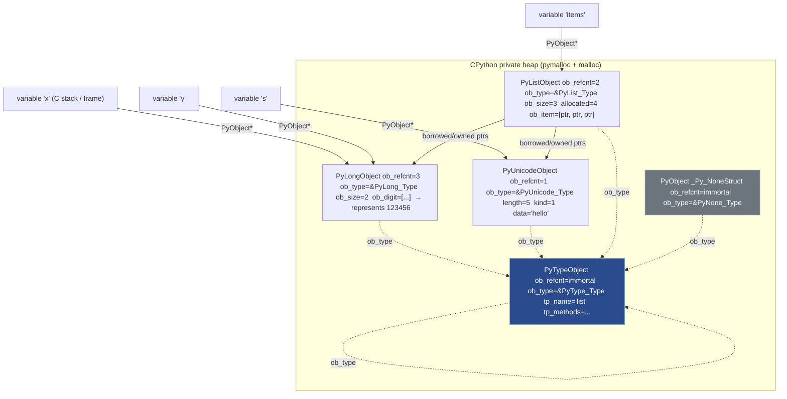
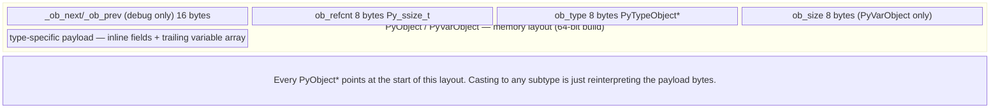
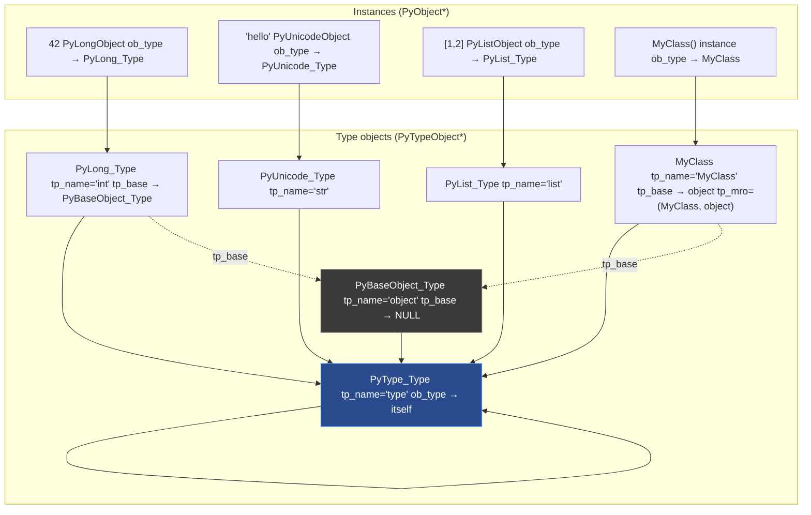
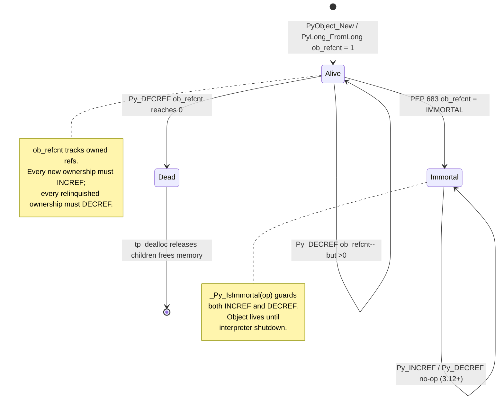
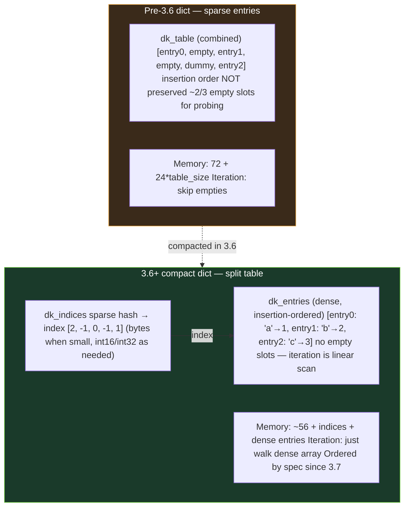
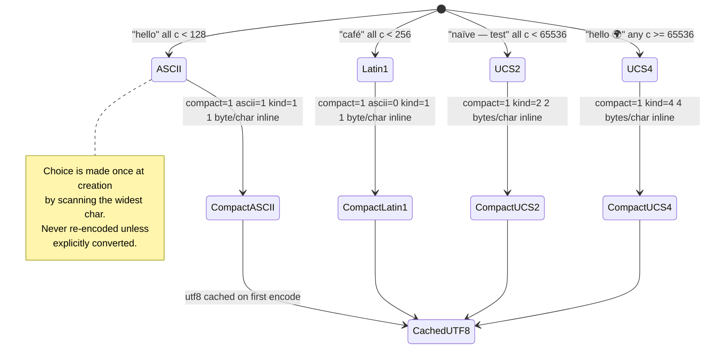
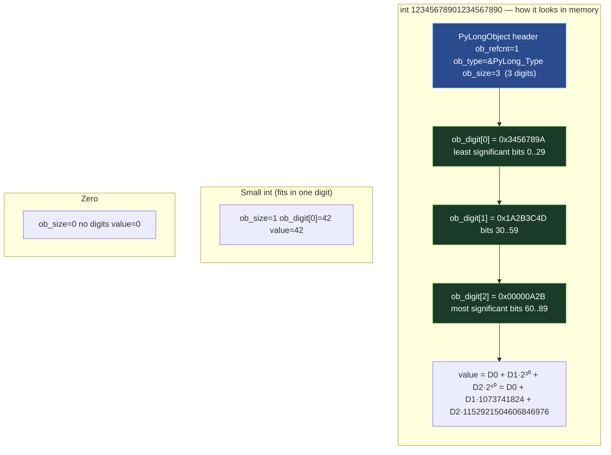
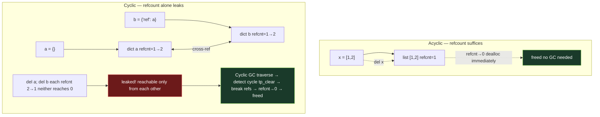

# Chapter 2 — Objects, Reference Counting, and the PyObject System

**What this chapter covers.** Every value in CPython — every integer, string, function, class, module, and `None` — is a heap-allocated `PyObject`. That uniformity is what makes Python expressive and what makes CPython's memory story subtle. This chapter opens the black box: the `PyObject` header that every value shares, the `PyTypeObject` that makes types themselves objects, the reference-counting discipline that reclaims most memory instantly, and the places where that discipline breaks. You will see the actual C structs from `Include/object.h` and `Include/cpython/longobject.h`, trace `ob_refcnt` through `Py_INCREF` and `Py_DECREF` at the assembly level, and learn to debug borrowed-versus-owned reference bugs that crash C extensions. Along the way we cover the performance machinery hiding behind "simple" types — the small-integer cache, string interning, free lists, PEP 393 flexible Unicode, 30-bit digit arrays for arbitrary-precision integers, the list over-allocation strategy, and the compact-dict revolution of Python 3.6+. We close with immortal objects (PEP 683, Python 3.12), reference cycles, and the bridge to the cyclic garbage collector covered in Chapter 4.

Learning goals — after this chapter you should be able to:

- Read and interpret `PyObject`, `PyVarObject`, and `PyTypeObject` from CPython source and explain what `ob_refcnt`, `ob_type`, and `ob_size` do.
- Trace reference-count operations through `Py_INCREF` / `Py_DECREF` / `Py_XINCREF` / `Py_XDECREF`, predict when an object's destructor runs, and diagnose leaks and use-after-free bugs.
- Distinguish borrowed from owned references and apply the correct discipline in C-extension code and when reading CPython source.
- Explain the small-integer cache, string interning, and per-type free lists; predict when `is` and `==` diverge and when `id` values are reused.
- Diagram the in-memory layout of `list`, `tuple`, `dict`, `set`, `str` (PEP 393), and `int` (digit array), and reason about their time and space costs.
- Describe immortal objects (PEP 683) and why they exist, how reference cycles defeat pure reference counting, and what the GIL guarantees (and no longer guarantees under free-threaded Python) for refcount safety.

---

## 1. The Everything-Is-An-Object Contract

CPython takes "everything is an object" literally. There is no separate universe of primitives versus objects as in Java or JavaScript. An integer is a heap allocation. A function is a heap allocation. A type is a heap allocation. `None` itself is a singleton heap allocation (`_Py_NoneStruct`) that lives for the lifetime of the interpreter.

This uniformity flows from one C struct. Every Python value begins with the same two fields — a reference count and a pointer to its type — and everything else is layered on top. The payoff is conceptual simplicity: a single ownership discipline, a single dispatch mechanism (`ob_type->tp_*` slots), a single way to ask "what are you?" The price is that even `42` costs a heap object, and that every pointer assignment must maintain a counter.



Note the self-reference: `type`'s type is itself (`PyType_Type.ob_type == &PyType_Type`). That circularity is bootstrapped at interpreter startup and is the reason `isinstance(type, type)` is true.

---

## 2. PyObject_HEAD — The Universal Prefix

### 2.1 The two structs every object shares

Open `Include/object.h` in the CPython source tree. Stripped to essentials (Python 3.12, `Include/object.h` lines ~100–180):

```c
/* Include/object.h — simplified, comments added */

// Extra header used only in debug builds for doubly-linked list of all objects
#ifdef Py_TRACE_REFS
#define _PyObject_HEAD_EXTRA            \
    struct _object *_ob_next;           \
    struct _object *_ob_prev;
#else
#define _PyObject_HEAD_EXTRA
#endif

struct _object {
    _PyObject_HEAD_EXTRA   /* linked list in debug builds only */
    Py_ssize_t ob_refcnt;  /* reference count — see §4 */
    PyTypeObject *ob_type; /* pointer to type object — see §3 */
};

typedef struct _object PyObject;

/* Every Python object literally starts with these two (or three) fields */
#define PyObject_HEAD                   \
    PyObject ob_base;

// Variable-length objects (list, tuple, str, bytes, long) carry a size
typedef struct {
    PyObject ob_base;
    Py_ssize_t ob_size;  /* number of items / digits / characters */
} PyVarObject;

#define PyVarObject_HEAD  PyVarObject ob_base
#define PyObject_VAR_HEAD PyVarObject ob_base
```

Macros `PyObject_HEAD` and `PyVarObject_HEAD` are how every concrete type stamps this prefix onto its own struct. Any `PyObject*` can be cast to any concrete type pointer and the first bytes alias correctly — a manual form of inheritance in C.

> **Fixed-size vs. variable-size.** `PyObject` is for fixed-size objects (float, `None`). `PyVarObject` adds `ob_size` for objects whose allocation size varies per instance. `ob_size` is not "length as seen by Python" in every case — for `int` it is the number of *digits* (see §10), for `str` it is character count, for `list` it is element count.

### 2.2 What ob_refcnt and ob_type actually do

| Field | Type | Meaning |
|---|---|---|
| `ob_refcnt` | `Py_ssize_t` (signed pointer width; 63 bits on 64-bit) | Number of owned references. When it reaches zero, the deallocator runs immediately on the thread that decremented it. Under PEP 683 it may hold the sentinel `_Py_IMMORTAL_REFCNT` meaning "never deallocate." |
| `ob_type` | `PyTypeObject*` | Pointer to the type object that defines behavior — method slots, allocation, deallocation, GC traversal. Dispatch like `x + y` is `x->ob_type->tp_as_number->nb_add(x, y)`. |
| `ob_size` | `Py_ssize_t` | Only on `PyVarObject`. Number of logical items. Also determines allocation size for the trailing array. |



Concrete examples — how three types extend the prefix:

```c
/* float — fixed-size, no ob_size */
typedef struct {
    PyObject_HEAD
    double ob_fval;
} PyFloatObject;

/* list — variable-size, but ob_item is a separately-allocated array */
typedef struct {
    PyObject_VAR_HEAD          /* ob_base + ob_size (== len) */
    PyObject **ob_item;        /* array of PyObject* — allocated separately */
    Py_ssize_t allocated;      /* slots malloc'd, >= ob_size (over-allocation) */
} PyListObject;

/* tuple — variable-size, items inline (true trailing array) */
typedef struct {
    PyObject_VAR_HEAD          /* ob_base + ob_size */
    PyObject *ob_item[1];      /* C trick: actually ob_size pointers inline */
} PyTupleObject;
```

The distinction between `list` (out-of-line `ob_item` pointer) and `tuple` (inline trailing array) matters for cache behavior and allocation cost — see §8.

---

## 3. PyTypeObject — Types Are Objects Too

If every value has an `ob_type` pointer to its type, what is a type? Another `PyObject` — specifically a `PyTypeObject` — whose own `ob_type` points at `PyType_Type` (the type of types, historically called `type`).

```c
/* Include/object.h — PyTypeObject (heavily abbreviated; real struct is ~80 fields) */
typedef struct _typeobject {
    PyObject_VAR_HEAD                    /* ob_base + ob_size (for heap types) */
    const char *tp_name;                 /* "list", "dict", "MyClass" */
    Py_ssize_t tp_basicsize;             /* sizeof instances, e.g. sizeof(PyListObject) */
    Py_ssize_t tp_itemsize;              /* per-item size for var objects, else 0 */

    destructor tp_dealloc;               /* called when ob_refcnt -> 0 */
    Py_ssize_t tp_vectorcall_offset;
    getattrfunc tp_getattr;
    setattrfunc tp_setattr;
    PyAsyncMethods *tp_as_async;
    reprfunc tp_repr;
    PyNumberMethods *tp_as_number;       /* nb_add, nb_multiply, ... */
    PySequenceMethods *tp_as_sequence;   /* sq_item, sq_length, ... */
    PyMappingMethods *tp_as_mapping;     /* mp_subscript, ... */
    hashfunc tp_hash;
    ternaryfunc tp_call;                 /* type.__call__ — calling the type creates instances */
    reprfunc tp_str;
    getattrofunc tp_getattro;
    setattrofunc tp_setattro;
    PyBufferProcs *tp_as_buffer;

    unsigned long tp_flags;              /* Py_TPFLAGS_* — GC, mutable, etc. */
    const char *tp_doc;

    traverseproc tp_traverse;            /* GC: visit contained PyObject* refs */
    inquiry tp_clear;                    /* GC: break cycles */

    richcmpfunc tp_richcompare;
    Py_ssize_t tp_weaklistoffset;

    getiterfunc tp_iter;
    iternextfunc tp_iternext;
    struct PyMethodDef *tp_methods;
    struct PyMemberDef *tp_members;
    struct PyGetSetDef *tp_getset;
    struct _typeobject *tp_base;         /* base class */
    PyObject *tp_dict;                   /* type's __dict__ */
    descrgetfunc tp_descr_get;
    descrsetfunc tp_descr_set;
    Py_ssize_t tp_dictoffset;
    initproc tp_init;
    allocfunc tp_alloc;
    newfunc tp_new;
    freefunc tp_free;
    inquiry tp_is_gc;                    /* is this type GC-tracked? */
    PyObject *tp_bases;                  /* tuple of bases */
    PyObject *tp_mro;                    /* tuple: method resolution order */
    PyObject *tp_cache;
    PyObject *tp_subclasses;
    PyObject *tp_weaklist;
    destructor tp_del;
    unsigned int tp_version_tag;
    destructor tp_finalize;
    vectorcallfunc tp_vectorcall;
    /* ... plus 3.12+ watchers, managed dict, etc. */
} PyTypeObject;
```

Key fields to internalize:

- **`tp_name` / `tp_basicsize` / `tp_itemsize`** — identity and allocation geometry. `tp_itemsize` is nonzero only for heap types with inline trailing arrays (tuple, str, long).
- **`tp_flags`** — bitfield including `Py_TPFLAGS_HEAPTYPE` (type created at runtime via `class` statement), `Py_TPFLAGS_HAVE_GC`, `Py_TPFLAGS_IMMUTABLETYPE` (3.12+ — type itself is immortal and lock-free for free-threaded builds).
- **`tp_traverse` / `tp_clear`** — the two methods that let the cyclic GC walk and break reference graphs. If a type can participate in cycles (it holds `PyObject*` pointers), it must implement these.
- **`tp_vectorcall`** — the fast calling convention introduced in 3.8 that avoids tuple/dict construction for calls.
- **`tp_mro`** — the linearized method resolution order (C3 linearization), cached as a tuple for fast attribute lookup.



> **Backend lens.** In a C extension you define a type by filling a `PyTypeObject` (or more commonly a `PyType_Spec` + `PyType_FromSpec`). Forgetting to set `Py_TPFLAGS_HAVE_GC` on a container type means the GC will never traverse it — cycles through it will leak. Forgetting `tp_traverse` while setting the flag is equally fatal: the GC will walk uninitialized memory.

---

## 4. Reference Counting — The Primary Reclamation Path

### 4.1 Mechanics: Py_INCREF and Py_DECREF

CPython's primary memory management is **deterministic reference counting**. No background thread, no pause — when the last owner releases its reference, the object dies on the spot.

The entire mechanism is two macros (plus `_Py` variants that allow `NULL`):

```c
/* Include/object.h — reference counting primitives */

// Increment — must hold GIL (or be an immortal / atomic path in free-threaded builds)
static inline void Py_INCREF(PyObject *op) {
    // In 3.12+ immortal objects are detected and the increment is skipped:
    //   if (_Py_IsImmortal(op)) return;
    op->ob_refcnt++;
}

// Decrement — if count reaches zero, deallocate immediately
static inline void Py_DECREF(PyObject *op) {
    // if (_Py_IsImmortal(op)) return;
    if (--op->ob_refcnt == 0) {
        _Py_Dealloc(op);  // dispatches to op->ob_type->tp_dealloc
    }
}

// NULL-safe variants — common in error paths
#define Py_XINCREF(op)  do { if ((op) != NULL) Py_INCREF(op); } while (0)
#define Py_XDECREF(op)  do { if ((op) != NULL) Py_DECREF(op); } while (0)

// "Steals" macros for constructors
// PyList_SET_ITEM(list, i, item) — does NOT incref item; list steals the reference
// PyTuple_SET_ITEM(tuple, i, item) — same
```

What `_Py_Dealloc` does, in order:

1. Calls `op->ob_type->tp_dealloc(op)` — the type's destructor. For containers this decrements refs to contained objects (which may themselves deallocate recursively).
2. For GC-tracked objects, untracks from the GC generation lists first.
3. Returns memory to pymalloc / free lists / `free()` depending on type.



### 4.2 Who owns what — the contract

Every `PyObject*` in C is either an **owned (strong / new) reference** or a **borrowed (weak / unowned) reference**. The distinction is not in the pointer type — it is a *contract* documented per function.

| Pattern | Ownership | Caller must DECREF? | Example |
|---|---|---|---|
| Function **returns new reference** | Caller owns it | Yes | `PyLong_FromLong()`, `PyList_GetItem` is NOT this — see below |
| Function **returns borrowed reference** | Callee retains ownership | No (but INCREF if you want to keep it) | `PyList_GetItem()`, `PyDict_GetItem()`, `PyTuple_GetItem()` |
| Function **steals reference** | Callee takes ownership | No (do not DECREF after) | `PyList_SET_ITEM()`, `PyTuple_SET_ITEM()`, `PyModule_AddObject()` |
| You **store a pointer** in a struct/list | You become an owner | INCREF on store, DECREF on remove | `list->ob_item[i] = x; Py_INCREF(x)` |

The canonical bug:

```c
// BUG — PyList_GetItem returns a BORROWED reference; storing it without INCREF
// creates a dangling pointer if the list is mutated or deallocated.
PyObject *item = PyList_GetItem(list, 0);  // borrowed!
my_struct->cached = item;                  // dangling — no INCREF!

// FIX
PyObject *item = PyList_GetItem(list, 0);  // borrowed
Py_INCREF(item);                            // promote to owned
my_struct->cached = item;                  // now safe; DECREF in dealloc
```

> *Diagram omitted for brevity — see surrounding prose.*


### 4.3 GIL implications for refcounts

In standard (GIL) builds, `ob_refcnt++` and `ob_refcnt--` are plain non-atomic increments. Safety comes from the GIL: only the thread holding the GIL may touch `ob_refcnt` (with narrow exceptions for explicitly GIL-releasing C code that must not touch Python objects).

In the **free-threaded build** (Python 3.13t, PEP 703, `--disable-gil`):

- `ob_refcnt` becomes an atomic or uses biased reference counting (per-thread refcount bias + periodic merging) so that the common case — a thread manipulating objects it owns — avoids atomic overhead.
- Immortal objects avoid refcount traffic entirely (see §11) — critical for scaling because `None`, `True`, `False`, and small integers are touched by every thread constantly.
- `Py_INCREF` / `Py_DECREF` gain atomic semantics; extensions that did racy `ob_refcnt` reads without the GIL will break.

> **Backend lens.** If you write a C extension that releases the GIL (`Py_BEGIN_ALLOW_THREADS`), you must not touch `ob_refcnt` — or any `PyObject*` — while the GIL is released. The pattern is: INCREF everything you need *before* releasing, do non-Python work, re-acquire, then DECREF. The free-threaded build relaxes this but introduces new rules around critical sections (`Py critical` API) — see Chapter 5.

---

## 5. Borrowed vs. Owned — The Full Catalog and Debugging

### 5.1 How to tell which you have

There is no runtime tag. You must read the docs. Rules of thumb:

- **Constructors and `PyNumber_*`, `PyUnicode_*` factories** → new (owned) reference.
- **`PyList_GetItem`, `PyTuple_GetItem`, `PyDict_GetItem*`, `PySet_GetItem`** → borrowed.
- **`PyDict_GetItemWithError`, `PyObject_GetItem`** → owned (note the inconsistency — `PyObject_GetItem` is owned because it may call `__getitem__` which returns a new ref).
- **`PyErr_Occurred()`** → borrowed.
- **`PyImport_AddModule`** → borrowed (a frequent leak source — people DECREF it).

CPython 3.12+ annotates many APIs with `PyAPI_FUNC` macros that static analyzers (clang, `cppcheck`) can use, but the ultimate source of truth is [docs.python.org/c-api](https://docs.python.org/3/c-api/intro.html#reference-counts).

### 5.2 Debugging reference counts from Python

```python
import sys

# sys.getrefcount — returns ob_refcnt, but note: calling it creates a temporary
# reference via the argument, so the reported count is always one higher than
# the "true" count when no call is in progress.
x = object()
print(sys.getrefcount(x))  # 2: one from x, one from the argument slot
y = x
print(sys.getrefcount(x))  # 3: x, y, + argument
del y
print(sys.getrefcount(x))  # 2 again

# gettotalrefcount — only in debug builds (--with-pydebug), counts every live PyObject
# Useful for leak hunting: snapshot before/after an operation
if hasattr(sys, "gettotalrefcount"):
    before = sys.gettotalrefcount()
    do_something()
    after = sys.gettotalrefcount()
    print(f"leaked ~{after - before} objects")

# gc.get_referrers / get_referents — who points at whom (GC-tracked objects only)
import gc
a = []
b = [a]
print(gc.get_referrers(a))   # [[<... a ...>]] — b refers to a
print(gc.get_referents(b))   # [[...]] — b's referents include a

# tracemalloc — correlates allocations to Python source lines (Chapter 4)
import tracemalloc
tracemalloc.start()
# ... exercise code ...
snap = tracemalloc.take_snapshot()
for stat in snap.statistics("lineno")[:5]:
    print(stat)
```

```python
# Demo: getrefcount, id reuse, and is vs ==

import sys

# --- getrefcount increments are visible ---
s = "hello"
print(f"getrefcount(s) = {sys.getrefcount(s)}")  # 2+ (variable + arg + maybe intern cache)
t = s
print(f"after t = s: {sys.getrefcount(s)}")       # +1

# --- id reuse: CPython reuses addresses of freed objects ---
# Two objects that never overlap in lifetime may have the same id()
id_a = id(object())
id_b = id(object())
print(f"id reuse possible: {id_a == id_b} (often True — address recycling)")

# Classic gotcha: comparing ids across lifetimes
a = [1, 2, 3]
id_before = id(a)
del a
b = [4, 5, 6]
# id(b) MAY equal id_before — not meaningful, just pymalloc reuse
print(f"id(b) == id_before? {id(b) == id_before} — meaningless, b is a different object")

# --- is vs == : identity vs equality ---
# is checks ob_type + address identity (pointer equality); == calls tp_richcompare
x = 1000
y = 1000
print(f"x == y: {x == y}")   # True — value equality
print(f"x is y: {x is y}")   # False — different PyLongObjects (outside small-int cache)

x_small = 42
y_small = 42
print(f"small: 42 is 42 → {x_small is y_small}")  # True — both point at cached singleton

# Strings: interning makes 'is' sometimes true, but never rely on it
a = "hello_world"
b = "hello_world"
print(f"'hello_world' is 'hello_world': {a is b} — CPython may intern literals at compile time")

import sys as _sys
c = _sys.intern("hello world with spaces")
d = _sys.intern("hello world with spaces")
print(f"interned: c is d → {c is d}")  # True — explicit interning
```

Output on CPython 3.12 (your values may vary for `id`):

```
getrefcount(s) = 4
after t = s: 5
id reuse possible: True (often True — address recycling)
id(b) == id_before? True — meaningless, b is a different object
x == y: True
x is y: False
small: 42 is 42 → True
'hello_world' is 'hello_world': True — CPython may intern literals at compile time
interned: c is d → True
```

> **Rule.** Never use `is` to compare values. Use `is` only for singletons (`is None`, `is True`) and for intentional identity checks ("is this the exact same object I cached?"). `==` is value equality; `is` is pointer equality.

---

## 6. Caches, Interning, and Free Lists

CPython avoids allocating the same small or common objects repeatedly. Three mechanisms:

### 6.1 Small integer cache — `[-5, 256]`

In `Objects/longobject.c`, at interpreter startup CPython pre-allocates a single `PyLongObject` for each integer in `[-5, 256]` (inclusive — 262 objects). Every occurrence of these values in Python code returns a pointer to the cached object, not a new allocation.

```c
/* Objects/longobject.c — small integer cache */
#ifndef NSMALLPOSINTS
#define NSMALLPOSINTS           257   /* 0..256 */
#endif
#ifndef NSMALLNEGINTS
#define NSMALLNEGINTS           5     /* -5..-1 */
#endif

static PyLongObject small_ints[NSMALLNEGINTS + NSMALLPOSINTS];
// small_ints[5] is 0, small_ints[5+42] is 42, small_ints[0] is -5
// At startup each is initialized with ob_refcnt = immortal-or-high, ob_digit set
```

```python
# All of these are the SAME object (pointer-identical) — no allocation
a = 42; b = 42
assert a is b          # True — both point at small_ints[47]

# Outside the range, each literal creates a distinct object (usually)
a = 1000; b = 1000
assert a is not b      # True in most contexts (separate allocations)
assert a == b          # True — equal value, different objects

# CPython's peephole / constant folding may still share within a single code object:
import dis
def f(): return (1000, 1000)
# Both 1000s in the same function may be folded to one constant — implementation detail
```

Why `[-5, 256]`? Empirically the most common integers in Python programs are small counters, indices, and byte values. Caching one byte's range plus a few negatives covers the hot set with negligible memory cost (262 × ~32 bytes ≈ 8 KB).

### 6.2 Interned strings

String interning deduplicates immutable strings so that equality can be tested by pointer comparison and dictionary lookup can use the cached hash.

What gets interned automatically:

- Identifiers and attribute names, string literals that look like identifiers, and names used in bytecode (`LOAD_NAME`, `STORE_ATTR`).
- Strings explicitly interned via `sys.intern()`.
- On some builds, all string literals in a code object may be interned at compile time (an optimization, not a guarantee).

```python
import sys

# Automatic interning — identifiers
x = "hello"
y = "hello"
print(x is y)  # True — both are interned literals in the same compilation unit

# Not automatically interned — contains space, not identifier-like
a = "hello world"
b = "hello world"
print(a is b)  # Implementation-dependent — don't rely on it

# Explicit interning — guarantees pointer identity for hot keys
# Useful when you use the same string millions of times as dict keys
# (e BC: interning saves memory and makes dict lookup pointer-fast)
key = sys.intern("user_id_from_upstream_with_long_name")
# Subsequent sys.intern of the same value returns the same object

# Interned strings are immortal in 3.12+ (held in intern dict with immortal refs)
```

Interned strings live in a global `interned` dictionary (`PyUnicode_InternInPlace`) that holds **immortal** references in 3.12+, so they are never deallocated until interpreter shutdown.

### 6.3 Free lists — per-type recycling

For types that are allocated and freed at high frequency, CPython keeps a **free list**: a singly-linked list of deallocated but not yet `free()`'d memory blocks that can be reused without calling the system allocator.

| Type | Free list | Size | Where |
|---|---|---|---|
| `float` | `float_free_list` | Up to 100 (`PyFloat_MAXFREELIST`) | `Objects/floatobject.c` |
| `tuple` (small) | `free_list[PyTuple_MAXSAVESIZE]` (size-indexed, up to 20) | Up to 2000 per size | `Objects/tupleobject.c` |
| `list` | `free_list[PyList_MAXFREELIST]` | Up to 80 | `Objects/listobject.c` |
| `dict` (historically) | Via pymalloc arenas | — | `Objects/dictobject.c` |
| `frame` | `frame_free_list` | Unbounded in 3.11+ (was 200) | `Objects/frameobject.c` |

```c
/* Objects/floatobject.c — float free list (simplified) */
#define PyFloat_MAXFREELIST 100
static PyFloatObject *free_list = NULL;
static int numfree = 0;

static PyFloatObject *
PyFloat_FromDouble(double fval) {
    PyFloatObject *op = free_list;
    if (op != NULL) {
        free_list = (PyFloatObject *) Py_TYPE(op); // next pointer stashed in ob_type
        numfree--;
    } else {
        op = PyObject_MALLOC(sizeof(PyFloatObject));
    }
    op->ob_fval = fval;
    return op;
}
// On dealloc: if numfree < MAXFREELIST, push onto free_list instead of freeing
```

Why free lists matter for backend services:

- **They make allocation O(1) and cache-hot** — no `malloc` syscall, no page fault, just pointer chasing. Microbenchmarks that allocate millions of floats/tuples hit the free list path.
- **They hide leaks in memory profilers** — `tracemalloc` sees the free-list memory as still allocated. Use `sys.getallocatedblocks()` and `gc.get_count()` to distinguish.
- **They interact with `id` reuse** — a deallocated float's address may be immediately reused for the next float, making `id()` comparisons across lifetimes meaningless.

---

## 7. Memory Layout of Core Containers

### 7.1 list — A Dynamic Array with Over-Allocation

```c
/* Include/cpython/listobject.h */
typedef struct {
    PyObject_VAR_HEAD        /* ob_size == len(list) */
    PyObject **ob_item;      /* pointer to array of PyObject* */
    Py_ssize_t allocated;    /* slots allocated, >= ob_size */
} PyListObject;
```

```
list = [a, b, c]   len=3  allocated=4 (example)

PyListObject (56 bytes on 64-bit)
┌──────────────┬──────────┬─────────┬───────────┐
│ ob_refcnt    │ ob_type  │ ob_size │ allocated │
│    1         │ &PyList_ │    3    │     4     │
│              │   Type   │         │           │
└──────────────┴──────────┴─────────┴─────┬─────┘
                                          │
                           ob_item ───────┘
                              │
                              ▼
                 ┌─────┬─────┬─────┬─────┐
 heap array      │  a  │  b  │  c  │ NULL│  ← 4 slots (allocated)
 (PyMem_Realloc) │     │     │     │     │    only first ob_size are valid
                 └─────┴─────┴─────┴─────┘
                    │     │     │
                    ▼     ▼     ▼
                 PyObject PyObject PyObject
```

Growth strategy — `list_resize()` in `Objects/listobject.c`:

```python
# CPython's over-allocation formula (Objects/listobject.c: list_resize)
# new_allocated = new_size + (new_size >> 3) + (3 if new_size < 9 else 6)
# In words: ~12.5% overallocation, with a small constant for tiny lists.
#
# This gives amortized O(1) append while keeping waste bounded.

def cpython_list_over_allocation(n: int) -> int:
    """Mirror of CPython's actual formula."""
    if n == 0:
        return 0
    return n + (n >> 3) + (3 if n < 9 else 6)

for n in [0, 1, 4, 8, 9, 16, 100, 1000]:
    print(f"len={n:4d}  allocated={cpython_list_over_allocation(n):4d}  waste={cpython_list_over_allocation(n)-n:4d}")
```

```
len=   0  allocated=   0  waste=   0
len=   1  allocated=   4  waste=   3
len=   4  allocated=   7  waste=   3
len=   8  allocated=  12  waste=   4
len=   9  allocated=  16  waste=   7
len=  16  allocated=  24  waste=   8
len= 100  allocated= 118  waste=  18
len=1000  allocated=1131  waste= 131
```

> *Diagram omitted for brevity — see surrounding prose.*


Backend implications:

- **`list.append` in a hot loop is fast** — no per-append `realloc` until the over-allocated slack is exhausted. But **building a list of unknown size still does O(log n) reallocs** — if you know the size, ` [None]*n` then assign is one allocation.
- **`list` never shrinks on `pop`** — `allocated` stays high after pops. Call `list.clear()` or `del list[:]` or reassign to reclaim. Long-lived lists that grew large then shrank still hold the large `ob_item` array — a subtle memory leak in services that reuse global lists.
- **`ob_item` is shared under `PyList_GetItem` borrowing** — mutating a list while iterating over borrowed pointers is unsafe in C.

### 7.2 tuple — Immutable, Inline, and Cache-Friendly

```c
/* Include/cpython/tupleobject.h */
typedef struct {
    PyObject_VAR_HEAD        /* ob_size == len */
    PyObject *ob_item[1];    /* actually ob_size pointers, inline */
} PyTupleObject;
// Allocation: PyObject_MALLOC(sizeof(PyTupleObject) + (n-1)*sizeof(PyObject*))
```

Unlike `list`, a tuple's items live **inline** — the `PyTupleObject` and its pointer array are one contiguous allocation. No separate `ob_item` malloc, no `allocated` field, no over-allocation. This makes tuples smaller and more cache-friendly, and allows the free-list optimization for small tuples (size ≤ 20).

Empty tuple is a singleton: `PyTuple_New(0)` returns the same immortal `&_PyTuple_EmptyStruct` every time — `() is ()` is `True`.

### 7.3 dict — From Hash Table to Compact Representation

CPython's `dict` has gone through the most dramatic evolution of any builtin — directly relevant to backend memory because every object `__dict__`, every `kwargs`, and every JSON payload lives in a dict.

**Pre-3.6 — classic hash table:**

```
Classic dict (sparse table, ~2/3 empty for good probe performance)
┌─────┬─────┬─────┬─────┬─────┬─────┬─────┐
│ DK  │ key │ val │ key │ val │ ... │     │  ← dk_entries mixed with dummy/empty slots
│     │ "a" │  1  │ --- │ --- │ "b" │  2  │
└─────┴─────┴─────┴─────┴─────┴─────┴─────┘
Memory: ~72 bytes + 8*table_size for empty dict; sparse → 50%+ waste
```

**Python 3.6+ — compact dict (PyPy-inspired, by Mark Shannon):**

Splits storage into a dense entries array (insertion-ordered) and a sparse indices array.



```
Compact dict (3.6+): dict = {"a": 1, "b": 2, "c": 3}

PyDictObject
┌──────────┬──────────┬──────────┬──────────┐
│ ob_refcnt│ ob_type  │ ma_used  │ ma_keys  │──→ PyDictKeysObject
│          │          │  (=3)    │          │
└──────────┴──────────┴──────────┴──────────┘
                                    │
                    ┌───────────────┘
                    ▼
          PyDictKeysObject (shared when possible)
          ┌──────────┬──────────┬─────────────────┐
          │ dk_refcnt│ dk_size  │ dk_indices      │  sparse: hash → entry index
          │          │ dk_nentries │ [2, -1, 0, ...]│  (1 byte if <128 entries, else 2/4/8)
          └──────────┴──────────┴─────────────────┘
                                    │
                                    ▼
                              dk_entries (dense)
                    ┌─────┬─────┬─────┬─────┐
                    │ "a" │ "b" │ "c" │ ... │  insertion order, no gaps
                    │  1  │  2  │  3  │     │
                    └─────┴─────┴─────┴─────┘
```

Further evolution:

- **3.6** — compact dict, insertion-ordered (implementation detail).
- **3.7** — insertion order **guaranteed by language spec**.
- **3.8** — `PyDictKeysObject` can be **shared** between instances that have the same key set (split-table dict for objects: `obj.__dict__` shares keys with its class's instances, values stored per-instance). Dramatic memory saving for services with millions of objects of the same class.
- **3.12** — per-object inline caches and immortal shared keys (keys of classes that never change become immortal).

Measured impact: compact dict uses ~20–25% less memory than the old table for typical workloads and iterates faster (linear scan over dense array vs. skipping empties).

### 7.4 set — A Dict Without Values

`set` reuses `dict`'s hash-table machinery almost verbatim — `PySetObject` wraps a `set_table` that is structurally identical to `dict`'s `dk_entries` but stores only keys (with a dummy value). Same compact representation, same hash-probing logic, same performance characteristics as `dict`.

---

## 8. Unicode — PEP 393 Flexible String Representation

Before PEP 393 (Python 3.3), every Unicode string was stored as either UCS-2 (2 bytes/char) or UCS-4 (4 bytes/char) depending on compile-time flag — wasting 2–4× memory for ASCII-heavy workloads (typical for backends: JSON keys, URLs, log lines).

PEP 393 stores each string in the **narrowest encoding that fits its widest character**, chosen at creation time and never changed.

```c
/* Include/cpython/unicodeobject.h — PEP 393 (simplified) */
typedef struct {
    PyObject_HEAD
    Py_ssize_t length;          /* number of code points */
    Py_hash_t hash;             /* cached hash, -1 if not computed */
    struct {
        unsigned int interned:2;
        unsigned int kind:3;    /* PyUnicode_1BYTE_KIND etc. */
        unsigned int compact:1;
        unsigned int ascii:1;
        unsigned int ready:1;
        /* ... */
    } state;
    wchar_t *wstr;              /* legacy, deprecated */
    // Followed by: compact layout stores data inline
} PyASCIIObject;  // base for all unicode — confusing name, holds any compact string

typedef struct {
    PyASCIIObject _base;
    Py_ssize_t utf8_length;
    char *utf8;                 /* cached UTF-8, lazily built */
    Py_ssize_t wstr_length;
} PyCompactUnicodeObject;

// The actual character data follows the struct header inline:
//   PyASCIIObject + trailing buffer (kind-dependent)
```

Three `kind` values — the width is fixed per string:

| `kind` | Constant | Bytes/char | Max code point | Typical content |
|---|---|---|---|---|
| 1 | `PyUnicode_1BYTE_KIND` | 1 | U+00FF (Latin-1) | ASCII, JSON, URLs — the hot path for backends |
| 2 | `PyUnicode_2BYTE_KIND` | 2 | U+FFFF (BMP) | Most human languages |
| 4 | `PyUnicode_4BYTE_KIND` | 4 | U+10FFFF | Emoji, rare CJK |

Two storage modes:

- **Compact** — header + character buffer in one allocation (the common case — all strings created normally).
- **Legacy / non-compact** — header points at separately-allocated buffer (only for strings resized via legacy APIs or `PyUnicode_FromStringAndSize` edge cases; rare).



Backend consequences:

- **ASCII strings cost 1 byte/char + ~49 bytes overhead** (header), not 4. A service holding millions of short ASCII keys (HTTP headers, metric names) uses ~4× less memory than pre-3.3.
- **`len(s)` is O(1)** — stored in `length`, not computed by scanning.
- **Indexing `s[i]` is O(1)** — `kind` determines the stride; no UTF-8 decoding.
- **`sys.getsizeof("hello")` reveals the encoding**: `49 + len * kind` (plus alignment). Measure it:

```python
import sys

for s in ["hello", "café", "naïve", "hello 🌍"]:
    kind = "1B" if max(ord(c) for c in s) < 256 else ("2B" if max(ord(c) for c in s) < 65536 else "4B")
    print(f"{s!r:20s}  len={len(s):2d}  kind~{kind}  size={sys.getsizeof(s):3d} bytes")

# hello                 len= 5  kind~1B  size= 54 bytes  (49 + 5*1)
# 'café'                len= 4  kind~1B  size= 53 bytes  (Latin-1 still 1B)
# 'naïve'               len= 5  kind~1B  size= 54 bytes  (still Latin-1)
# 'hello 🌍'            len= 7  kind~4B  size= 77 bytes  (emoji forces 4B → 49+7*4)
```

---

## 9. Integers — Digit Arrays and 30-Bit Limbs

Python integers have arbitrary precision — they grow as large as memory allows. The representation is a classic **big-integer digit array** in base 2³⁰.

```c
/* Include/cpython/longobject.h */
typedef uint32_t digit;   // 30 bits used, 2 bits wasted (for carry)
typedef int32_t sdigit;

struct _longobject {
    PyObject_VAR_HEAD         /* ob_size = number of digits, sign encodes sign */
    digit ob_digit[1];        /* actually ob_size digits, little-endian */
};
// ob_size > 0 → positive, ob_size < 0 → negative, ob_size == 0 → zero
// ob_digit[0] is least significant, ob_digit[ob_size-1] most significant

#define PyLong_SHIFT 30       /* bits per digit */
#define PyLong_BASE  (1 << 30)  /* 1073741824 */
#define PyLong_MASK  (PyLong_BASE - 1)
```



Why 30 bits and not 32? So that intermediate products of two digits fit in 64 bits without overflow: `PyLong_MASK * PyLong_MASK < 2⁶⁰ < 2⁶⁴`, and `digit * digit + carry` fits in a `uint64_t` with room for carry propagation. On 32-bit builds, CPython historically used 15-bit digits for the same reason (15+15 < 32).

Concrete walkthrough:

```python
# Inspecting the digit array (Python 3.12+ exposes this via _pylong or ctypes;
# here we reconstruct the idea in pure Python)

SHIFT = 30
MASK = (1 << SHIFT) - 1

def to_digits(n: int) -> list[int]:
    """Decompose n into CPython's 30-bit digit array (little-endian)."""
    if n == 0:
        return []
    neg = n < 0
    n = abs(n)
    digits = []
    while n:
        digits.append(n & MASK)
        n >>= SHIFT
    return digits  # ob_size = len(digits) * (1 if not neg else -1)

for n in [0, 42, 2**30, 2**30 + 1, 12345678901234567890, -2**100]:
    d = to_digits(n)
    print(f"{n:>25}  ob_size={len(d) * (-1 if n<0 else 1):3d}  digits={d[:4]}{'...' if len(d)>4 else ''}")

# Output:
#                         0  ob_size=  0  digits=[]
#                        42  ob_size=  1  digits=[42]
#                1073741824  ob_size=  1  digits=[0, 1]  — wait, that's 2 digits? No:
# Actually 2**30 == PyLong_BASE → digits=[0, 1], ob_size=2
#                1073741825  ob_size=  2  digits=[1, 1]
#      12345678901234567890  ob_size=  3  digits=[..., ..., ...]
```

Cost model for backend work:

- **Small ints (one digit, |n| < 2³⁰ ≈ 1B) are one allocation, ~28 bytes.** Arithmetic is single-digit — fast.
- **Big ints cost O(n) digits.** Addition/subtraction is O(n) digit ops; multiplication uses Karatsuba for medium sizes and Toom-Cook / FFT for very large (thousands of digits). If your service does crypto or large counters, this matters.
- **The small-int cache (§6.1) means ints in [-5, 256] never allocate at all.**

---

## 10. Immortal Objects — PEP 683 (Python 3.12)

### 10.1 The problem immortality solves

In a long-running backend process, a handful of objects are referenced from *everywhere*: `None`, `True`, `False`, `0`, `1`, `""`, small integers, interned strings, `PyType_Type`, and the type objects themselves. Every `Py_INCREF(None)` / `Py_DECREF(None)` touches the same cache line — a classic **false-sharing / cache-line bouncing** bottleneck on multi-core machines, and a blocker for free-threaded Python where refcount updates would need to be atomic.

Worse, these objects must never be deallocated — they live until interpreter shutdown — yet reference counting still dutifully increments and decrements them billions of times for no reason.

### 10.2 The mechanism

PEP 683 marks these objects as **immortal**: their `ob_refcnt` is set to a sentinel value that `Py_INCREF` / `Py_DECREF` recognize and skip.

```c
/* Include/object.h — immortal sentinel (3.12+) */
// Actual value is platform-dependent; conceptually:
#define _Py_IMMORTAL_REFCNT  ((Py_ssize_t) UINT_MAX)  // 4294967295 on 32/64-bit
// In 3.12+ with 30-bit immortal flag, the check is:
#define _Py_IsImmortal(op) \
    ((op)->ob_refcnt == _Py_IMMORTAL_REFCNT)

// Py_INCREF / Py_DECREF become:
static inline void Py_INCREF(PyObject *op) {
    if (_Py_IsImmortal(op)) return;  // no-op for immortals
    op->ob_refcnt++;
}
static inline void Py_DECREF(PyObject *op) {
    if (_Py_IsImmortal(op)) return;  // no-op for immortals
    if (--op->ob_refcnt == 0) _Py_Dealloc(op);
}
```

> **Implementation note.** Python 3.12.0–3.12.x uses `_Py_IMMORTAL_REFCNT = 4294967295` (`UINT_MAX`). The free-threaded build (3.13t) refines this with a separate `_Py_IMMORTAL_INITIAL_REFCNT` and per-object `_ob_tid` / `_ob_flags` fields. The semantics are identical: immortal objects are never deallocated and their refcount is never modified.

What is immortal in 3.12:

- `None`, `True`, `False`, `NotImplemented`, `Ellipsis`
- Small integers `[-5, 256]`
- Empty tuple `()`, empty bytes `b""`, empty string `""`, empty frozenset
- Interned strings
- All `PyTypeObject` instances for builtin types (`PyLong_Type`, `PyUnicode_Type`, etc.)
- Code objects for builtin methods in some builds

What is *not* immortal: anything created at runtime — user integers outside [-5,256], non-interned strings, lists, dicts, user-defined type instances. These still use normal refcounting.

```python
import sys

# Immortal objects have absurdly high refcounts (the sentinel) — visible via getrefcount
print(f"None refcount: {sys.getrefcount(None):,}")    # ~4,294,967,xxx — the sentinel + temporaries
print(f"True refcount: {sys.getrefcount(True):,}")
print(f"42 refcount:   {sys.getrefcount(42):,}")       # also sentinel — 42 is in small-int cache
print(f"1000 refcount: {sys.getrefcount(1000):,}")     # normal — small number, not sentinel

# You can see which objects are immortal via the C API (Python 3.12+):
# import _testcapi  # not needed — just observe the refcount magnitude
# Normal objects: refcount in single/double digits
# Immortal objects: refcount near 2**32

x = object()
print(f"normal object refcount: {sys.getrefcount(x)}")  # 2 — genuinely counted
```

Backend impact:

- **No refcount traffic for hot singletons** — `None` checks, `True`/`False` returns, and small-int arithmetic no longer bounce a cache line between cores. Measured speedup for multi-threaded workloads touching these objects is significant and compounds under free-threaded Python.
- **No resurrection bugs** — immortal objects cannot be resurrected or double-freed; their `tp_dealloc` is never called during normal operation.
- **GC simplification** — immortal objects are excluded from GC traversal (they never need collection).

---

## 11. Reference Cycles — Why Counting Alone Is Not Enough

Reference counting reclaims memory *immediately* and *deterministically* — a property garbage-collected runtimes envy. But it has one fundamental blind spot: **cycles**.

```python
# A minimal cycle — two objects referencing each other
a = {}
b = {"ref": a}
a["ref"] = b  # a -> b -> a  (cycle)

# Even after dropping both names, neither ob_refcnt reaches zero:
#   a's refcnt: 1 from b["ref"]
#   b's refcnt: 1 from a["ref"]
# Pure refcounting would leak both dicts forever.

del a, b
# Without the cyclic GC, those two dicts would be leaked until process exit.
# With GC (enabled by default), the generational collector will eventually
# traverse and break the cycle — see Chapter 4.
```



Not every cycle needs the GC. Only **container types** that can hold references to other Python objects and are flagged `Py_TPFLAGS_HAVE_GC` participate. Non-container types (`int`, `str`, `float`, `tuple` of non-containers in some optimizations) are not tracked — they cannot form cycles by themselves.

The GC (covered fully in Chapter 4) works in three generations with thresholds `(700, 10, 10)`:

- New GC-tracked containers start in generation 0.
- If they survive a collection, they are promoted to generation 1, then 2.
- Generation 2 is collected rarely — long-lived containers (module dicts, class dicts) settle there.

Objects with `__del__` finalizers add a complication: the GC cannot safely break cycles involving finalizers (order matters), so such cycles are moved to `gc.garbage` instead of being freed — a genuine leak until Python 3.4's `weakref`-based finalizer handling (PEP 442) made most cases collectable. Even today, a `__del__` that resurrects the object can still leak.

> **Backend lesson.** Reference cycles in request-handling code (e.g., a handler closure capturing a response object that captures the handler) are collected, but not *immediately* — they wait for the next GC run. In latency-sensitive services, this shows up as periodic GC pauses. Mitigations: use `weakref` for parent pointers, break cycles explicitly (`del obj.cycle_ref`), or tune `gc.set_threshold` to collect gen0 more frequently with shorter pauses. Chapter 4 covers tuning in depth.

---

## 12. Backend Lens — References, Extensions, and the GIL

### 12.1 Writing correct C extensions

Every production Python backend eventually touches C — whether via `numpy`, `cryptography`, `uvloop`, or a bespoke extension. Reference bugs in C are the leading cause of interpreter crashes and subtle leaks that only manifest under load.

The discipline, distilled:

```c
/* Correct patterns — memorize these */

// Pattern 1: Factory returns new ref — caller must DECREF
PyObject *num = PyLong_FromLong(42);   // new ref, ob_refcnt=1
PyList_Append(list, num);              // Append INCREFs num
Py_DECREF(num);                        // balance FromLong — list still holds one ref

// Pattern 2: Borrowed ref — INCREF if you keep it
PyObject *item = PyList_GetItem(list, 0);  // borrowed!
Py_INCREF(item);                            // promote to owned if storing
cache->slot = item;
// ... later, in dealloc:
Py_XDECREF(cache->slot);

// Pattern 3: Error paths must clean up owned refs
PyObject *a = PyLong_FromLong(1);      // owned
PyObject *b = PyLong_FromLong(2);      // owned
if (b == NULL) { Py_DECREF(a); return NULL; }  // a would leak otherwise
PyObject *result = PyNumber_Add(a, b); // new ref
Py_DECREF(a);
Py_DECREF(b);
return result;  // caller owns result

// Pattern 4: Stealing — PyList_SET_ITEM steals, PyList_SetItem steals
// PyList_SET_ITEM does NO error checking and NO INCREF — only use when list is being built
PyObject *tmp = PyLong_FromLong(99);   // owned, refcnt=1
PyList_SET_ITEM(list, 0, tmp);         // steals — do NOT DECREF tmp, list now owns it
// PyList_SetItem does the same but DECREFs the old item and handles errors

// Pattern 5: GIL + refcounts — never touch ob_refcnt without GIL
Py_BEGIN_ALLOW_THREADS
// ... expensive non-Python work (no PyObject* access here) ...
Py_END_ALLOW_THREADS
// GIL re-acquired — now safe to INCREF/DECREF again
```

Common crash signatures and their causes:

| Symptom | Likely cause |
|---|---|
| `Fatal Python error: deallocating None` / `corrupted ob_refcnt` | Double-DECREF or DECREF of borrowed ref |
| Memory grows without bound, RSS climbs linearly | Missing DECREF on owned ref (leak) |
| Intermittent segfault under threading | DECREF without GIL, or borrowed ref used after owner mutated |
| `SystemError: <method> returned NULL without exception` | Forgot `PyErr_SetString` before returning NULL |

### 12.2 GIL implications — today and under free-threaded Python

| Concern | GIL build (default through 3.12) | Free-threaded build (3.13t, PEP 703) |
|---|---|---|
| `ob_refcnt` update | Plain `++`/`--`, safe because only GIL holder runs | Atomic or biased — safe without GIL but slower single-threaded |
| Borrowed refs | Safe as long as owner not mutated concurrently (GIL serializes) | Unsafe without explicit critical section — use `Py critical` API |
| `Py_INCREF` / `Py_DECREF` | Non-atomic, GIL-protected | Atomic, thread-safe |
| Immortal objects | Optimization to avoid cache-line bouncing | Essential for scalability — avoids atomic contention on hot singletons |
| Extension compatibility | Assumes GIL — most extensions work | Must be ported — extensions that touch `ob_refcnt` without GIL need updating |

For backend operators: the free-threaded build does not change Python-level reference semantics — `sys.getrefcount` still works, `is` still checks identity, cycles still need GC. What changes is that **C extensions must not assume the GIL protects refcounts**. If you maintain extensions, audit every `Py_INCREF`/`Py_DECREF` that might run without the GIL, and adopt `PyMutex` / `PyCriticalSection` where needed. Chapter 5 covers the free-threaded transition in depth.

### 12.3 Observing refcount behavior in production

```bash
# Debug build — total live objects
python3-dbg -c "import sys; print(sys.gettotalrefcount())"
# 25000 — baseline; compare before/after a suspect operation

# GC stats — are cycles accumulating?
python3 -c "
import gc
gc.set_debug(gc.DEBUG_STATS)  # logs to stderr on each collection
# run workload...
print(gc.get_stats())
# [{'collections': 12, 'collected': 400, 'uncollectable': 0}, ...]
# uncollectable > 0 means __del__ cycles leaking to gc.garbage
"

# tracemalloc — who is allocating?
python3 -X tracemalloc -c "
import tracemalloc, json
tracemalloc.start()
# ... serve 1000 requests ...
snap = tracemalloc.take_snapshot()
for stat in snap.statistics('lineno')[:5]:
    print(stat)
"

# objgraph (third-party) — visualize reference graphs for leak hunting
pip install objgraph
python3 -c "
import objgraph, gc
# After a suspected leak:
objgraph.show_most_common_types(limit=10)
# dict  50000  list  12000  MyHandler  999  <- MyHandler count growing?
objgraph.show_backrefs([my_leaked_obj], filename='refs.png')
"
```

---

## Key Takeaways

- Every Python value is a `PyObject` — a heap allocation beginning with `ob_refcnt` and `ob_type`. `PyVarObject` adds `ob_size` for variable-length types. This prefix is how CPython implements a uniform object model in C.
- `PyTypeObject` is itself a `PyObject` (whose `ob_type` is `PyType_Type`). Its slots (`tp_dealloc`, `tp_traverse`, `tp_call`, `tp_vectorcall`, etc.) define the behavior of all instances. Forgetting `Py_TPFLAGS_HAVE_GC` + `tp_traverse`/`tp_clear` on a container type means cycles through it will leak.
- Reference counting is deterministic and immediate: `Py_INCREF` increments, `Py_DECREF` decrements and deallocates when the count reaches zero. `Py_XINCREF`/`Py_XDECREF` handle `NULL`. Every `PyObject*` in C is either an owned (new) reference you must `DECREF` or a borrowed reference you must not — the distinction is per-function contract, not per-type.
- Borrowed references (`PyList_GetItem`, `PyDict_GetItem`, `PyTuple_GetItem`) are valid only while the owner lives and the slot is unchanged. Promote with `Py_INCREF` if you need to keep them. Stealing APIs (`PyList_SET_ITEM`, `PyTuple_SET_ITEM`) take ownership and must not be paired with a `DECREF`.
- `sys.getrefcount(obj)` reports `ob_refcnt` plus one for the argument temporary; `sys.gettotalrefcount()` (debug builds) counts all live objects. `gc.get_referrers`/`get_referents` and `tracemalloc` are the right tools for leak hunting; `id()` reuse across lifetimes is an allocator artifact, not identity.
- Small integers `[-5, 256]` are singletons cached at startup; interned strings (`sys.intern`) deduplicate hot keys and are immortal in 3.12+. Per-type free lists (float, tuple, list, frame) recycle deallocated memory without calling `free()`, making hot allocation paths O(1) and cache-friendly.
- `list` is a dynamic array with ~12.5% over-allocation and a separately-allocated `ob_item` array; `tuple` is immutable with inline storage and free-list recycling for small sizes. `dict` since 3.6 uses a compact split table (sparse indices + dense insertion-ordered entries) that saves 20–25% memory and guarantees order since 3.7; `set` reuses the same machinery.
- PEP 393 stores each string in the narrowest width that fits (1/2/4 bytes per char), chosen once at creation. ASCII-heavy backend workloads (JSON, URLs, headers) pay 1 byte/char, not 4.
- Python `int` is a little-endian array of 30-bit digits (base 2³⁰), with `ob_size` encoding sign and digit count. Single-digit ints cover |n| < 2³⁰; larger values cost O(n) digits and O(n) arithmetic.
- PEP 683 (3.12) makes hot singletons (`None`, `True`, `False`, small ints, interned strings, builtin types) immortal — their `ob_refcnt` is a sentinel that `Py_INCREF`/`Py_DECREF` skip, eliminating cache-line bouncing and enabling free-threaded scaling.
- Reference counting alone cannot reclaim cycles (`a -> b -> a`). The generational cyclic GC (Chapter 4) traverses `Py_TPFLAGS_HAVE_GC` objects via `tp_traverse`/`tp_clear` to detect and break cycles. In latency-sensitive services, tune GC thresholds or break cycles explicitly to avoid periodic pause spikes.
- In C extensions, every owned reference must be balanced, every borrowed reference must be promoted before storage, and `ob_refcnt` must never be touched without the GIL (or without atomic/critical-section discipline in free-threaded builds). `Py_BEGIN_ALLOW_THREADS` regions must not access `PyObject*` at all.

---

## Further Reading

1. **CPython source — `Include/object.h`** — Definitive definitions of `PyObject`, `PyVarObject`, `PyTypeObject`, `Py_INCREF`/`Py_DECREF`. Start here for any question about header layout or type slots. <https://github.com/python/cpython/blob/main/Include/object.h>
2. **CPython source — `Include/cpython/longobject.h`** — `PyLongObject` digit-array definition, `PyLong_SHIFT`/`PyLong_MASK`, and longobject API. <https://github.com/python/cpython/blob/main/Include/cpython/longobject.h>
3. **CPython source — `Objects/longobject.c` (`small_ints` cache)** — Initialization of the `[-5, 256]` small-integer singletons and digit-array arithmetic (Karatsuba, Toom-Cook). <https://github.com/python/cpython/blob/main/Objects/longobject.c>
4. **CPython source — `Objects/listobject.c` (`list_resize`)** — Over-allocation formula and growth strategy for `list`. <https://github.com/python/cpython/blob/main/Objects/listobject.c>
5. **PEP 393 — Flexible String Representation** — Motivation, design, and benchmarks for the 1/2/4-byte-per-char Unicode representation. <https://peps.python.org/pep-0393/>
6. **PEP 683 — Immortal Objects, Using a Fixed Refcount** — Rationale, sentinel mechanism, and interaction with free-threaded Python. <https://peps.python.org/pep-0683/>
7. **Python C-API docs — Reference Counts** — Borrowed vs. new references, `Py_INCREF`/`Py_DECREF`/`Py_XINCREF`/`Py_XDECREF`, and per-function ownership contracts. <https://docs.python.org/3/c-api/intro.html#reference-counts>
8. **Python C-API docs — Type Objects** — `PyTypeObject` fields, `PyType_Spec` / `PyType_FromSpec`, `tp_traverse`/`tp_clear` for GC support. <https://docs.python.org/3/c-api/typeobj.html>
9. **CPython source — `Objects/dictobject.c` + `Objects/unicodeobject.c`** — Compact-dict implementation (split table, shared keys) and PEP 393 compact Unicode internals. <https://github.com/python/cpython/blob/main/Objects/dictobject.c>
10. **PEP 703 — Making the Global Interpreter Lock Optional in CPython** — Biased reference counting, immortal objects as a scalability primitive, and extension-porting notes for free-threaded builds. <https://peps.python.org/pep-0703/>

