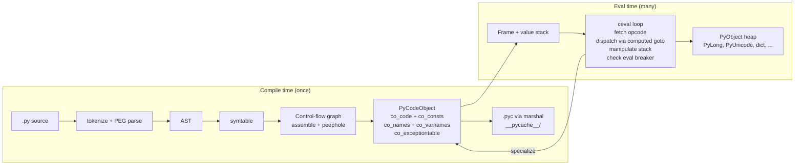
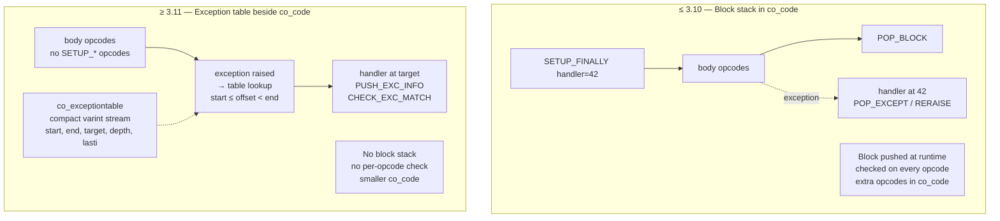
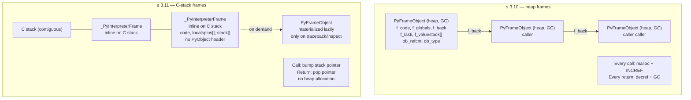
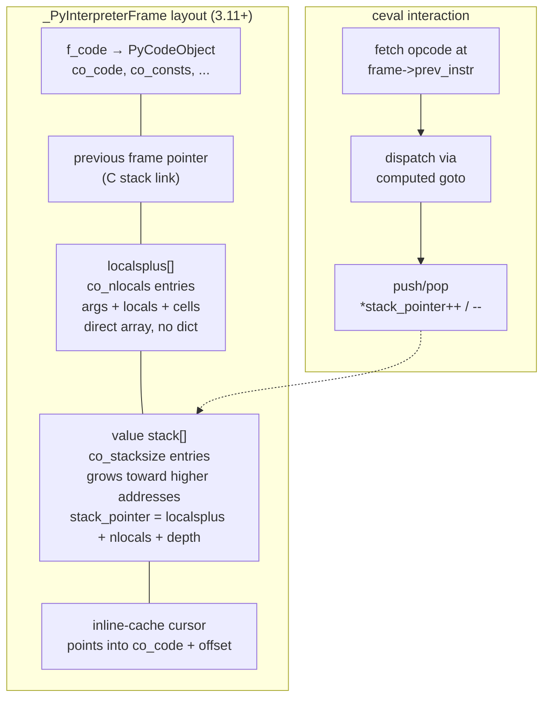
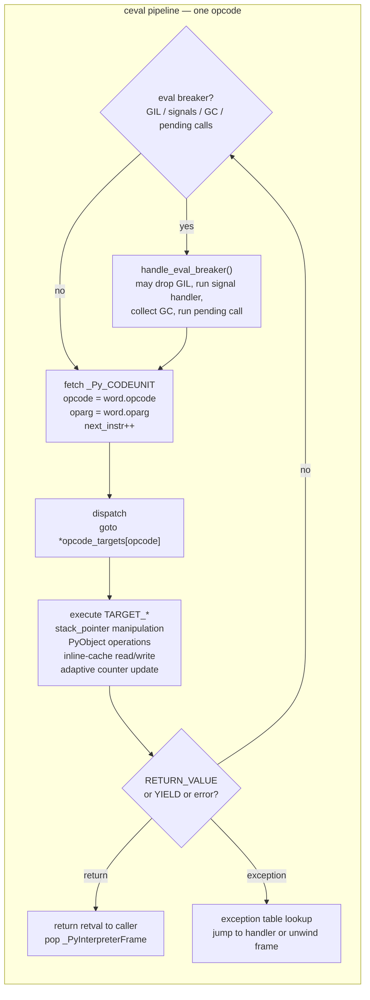
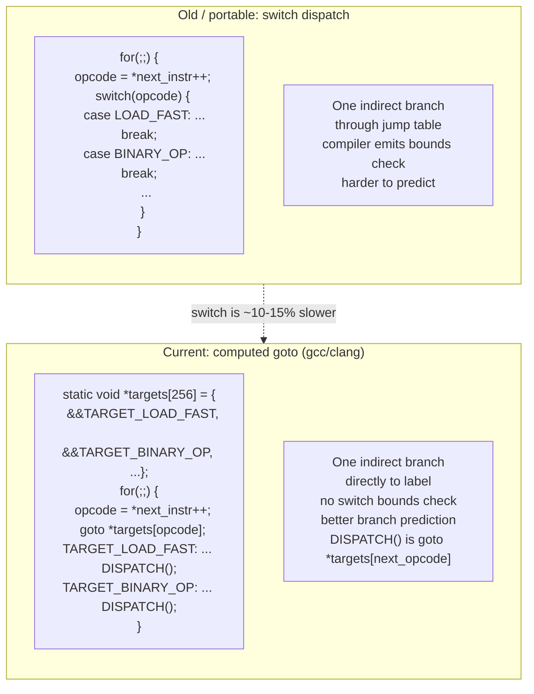
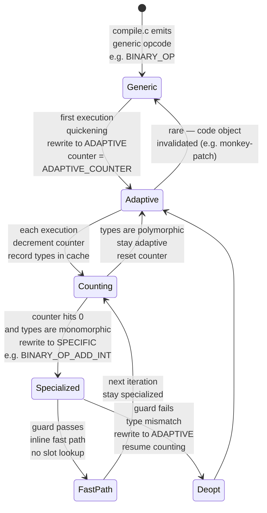
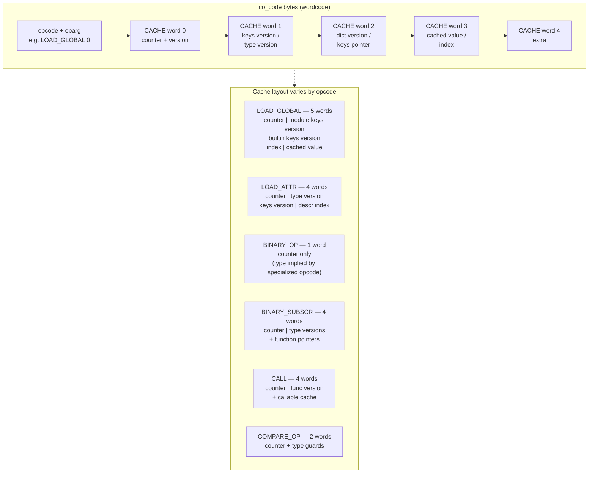

# Chapter 3 — Bytecode, the ceval Loop, and Adaptive Specialization (PEP 659)

**What this chapter covers.** Every Python function you deploy is not executed as source text — it is compiled to a compact bytecode, packed into a `PyCodeObject`, and run by a stack-based virtual machine in `Python/ceval.c`. Since Python 3.11 that VM is no longer a straightforward switch loop: it watches itself execute, rewrites its own bytecode in place, and specializes hot opcodes for the types it actually sees (PEP 659). This chapter dissects the full evaluation pipeline — wordcode format, opcode families, the value stack and frame stack, jump targets, the new exception table, `ceval`'s computed-goto dispatch, inline caches, quickening, guards, and deoptimization — with real `dis` output, `co_code` inspection, and before/after specialization examples. It closes with a teaser of the copy-and-patch JIT (PEP 744, 3.13+) and a backend lens on why specializing your API hot loop is worth ~25% fleet-wide.

Learning goals — after this chapter you should be able to:

- Explain Python's bytecode format (wordcode since 3.6, cache-aware wordcode since 3.11): 2-byte `opcode + oparg` units, `HAVE_ARGUMENT`, `EXTENDED_ARG`, and why bytecode is version-specific.
- Use `dis`, `dis.get_instructions()`, `opcode`, and direct `PyCodeObject` field inspection (`co_code`, `co_consts`, `co_names`, `co_varnames`, `co_exceptiontable`, `co_positions`) to read any function's compiled form.
- Classify opcodes into families (stack manipulation, control flow, object/name access, function call, exception/unwind) and trace how each manipulates the value stack.
- Describe jump targets, absolute vs. relative offsets, and the 3.11+ exception table that replaced the old block stack — and parse its entries.
- Explain the inline-cache mechanism: how `CACHE` bytes trail certain opcodes, how many entries each opcode reserves, and what `_inline_cache_entries` encodes.
- Walk through `ceval.c`'s main loop: frame setup, the `TARGET(opcode):` dispatch via computed `goto`, `DISPATCH`/`NEXTOP` macros, and where the GIL, eval breaker, and pending signals are checked.
- Contrast the legacy `PyFrameObject` heap-allocated frame with the 3.11+ C-stack frame (`_PyInterpreterFrame` / `cframe`) and its impact on call overhead.
- Explain PEP 659 end-to-end: quickening, adaptive counters, specialization for `BINARY_OP`, `LOAD_GLOBAL`, `CALL`/`PRECALL`, `COMPARE_OP`, `LOAD_ATTR`/`STORE_ATTR`, `BINARY_SUBSCR`, inline-cache guards, and deoptimization on guard failure — with adaptive `dis` examples.
- Quantify the 3.11 speedup (~25% geometric mean on pyperformance, up to 60% on micro-benchmarks) and why it compounds in I/O-bound API handlers.
- Sketch the copy-and-patch JIT introduced in 3.13 (PEP 744): tier-1 specialization → tier-2 uops → stenciled machine code, and why it is still experimental.
- Profile bytecode hotspots in production with `perf` + `py-spy`/`austin`, mapping samples back to opcodes and specializing-vs-generic mix.

> **Prerequisites.** Chapter 1 traced source → AST → `PyCodeObject` and `.pyc` caching; Chapter 2 dissected `PyObject`, `ob_refcnt`, and the type system. This chapter assumes you have run `python -m dis` and can skim C. Volume 13, Chapter 6 gives the service-level view of the interpreter; here you open `ceval.c`.

---

## 1. Why bytecode is a backend concern

Backend engineers treat Python as "interpreted" and move on. That mental model costs you when you need to explain:

- **Why a hot loop is 25% faster on 3.11 without changing a line of Python.** The answer is in the bytecode — it specializes itself.
- **Why `perf top` shows `PyEval_EvalFrameEx` / `_PyEval_EvalFrameDefault` at the top of every profile.** That is the `ceval` loop; every opcode dispatch is a branch.
- **Why coverage, debuggers, and `pydantic`/`dataclasses` code generation all speak `PyCodeObject`.** They rewrite `co_code` or wrap it.
- **Why `.pyc` invalidation, import time, and cold-start latency correlate.** Import executes bytecode; specializing bytecode reduces work per import.

CPython compiles each code block (module, function, class body, comprehension, lambda) to a `PyCodeObject` once, then evaluates it many times. The compilation from AST to bytecode (`Python/compile.c`) is cheap; the evaluation loop (`Python/ceval.c`, ~6,000 lines) is where your request spends its life.



Understanding the shape of `co_code` and how `ceval` dispatches it is prerequisite to reading any CPython profile.

---

## 2. Bytecode format — wordcode and cache-aware wordcode

### 2.1 Wordcode since 3.6

Before 3.6 CPython used *bytecode* with variable-length instructions: 1 byte for opcodes without arguments, 3 bytes (`opcode`, `arg_low`, `arg_high`) for opcodes with arguments. Every `LOAD_FAST 0` cost 3 bytes and a branch to decode the length.

Since 3.6 (PEP 5110 / wordcode) every instruction is exactly **2 bytes**: one byte `opcode`, one byte `oparg`. Instructions that need no argument set `oparg` to 0. Instructions that need a larger argument use `EXTENDED_ARG` prefix instructions. The opcode stream is therefore a flat `bytes` object (`co_code`) whose length is always even, trivially indexable, and friendly to computed-goto dispatch.

```
co_code as bytes:  [op0][arg0] [op1][arg1] [op2][arg2] ...
                    1 byte  1 byte  1 byte  1 byte
```

Opcodes `< 90` historically had no argument in CPython 2 (`HAVE_ARGUMENT = 90`); since wordcode this boundary matters less for decoding but is still exposed by `dis.have_argument()` and `opcode.HAVE_ARGUMENT` for tooling.

`EXTENDED_ARG` (opcode 144) extends the next instruction's argument: each `EXTENDED_ARG` shifts the accumulated argument left by 8 bits. Two `EXTENDED_ARG`s plus one real opcode can encode a 24-bit argument — needed for functions with >256 names or constants.

```python
import dis, opcode

print(f"Python {opcode._inline_cache_entries.__class__.__name__} — HAVE_ARGUMENT={opcode.HAVE_ARGUMENT}")
print(f"EXTENDED_ARG={opcode.opmap['EXTENDED_ARG']}  CACHE={opcode.opmap['CACHE']}")

def many_names():
    # force EXTENDED_ARG by having >256 distinct names — synthetic example
    pass

# Minimal wordcode demo
def add(a, b):
    return a + b

print(add.__code__.co_code.hex(' '))
# 97 00 7c 00 7c 01 7a 00 00 00 53 00  — 7 instructions × 2 bytes
dis.dis(add)
```

Output on CPython 3.11:

```
  5           0 RESUME                   0
              2 LOAD_FAST                0 (a)
              4 LOAD_FAST                1 (b)
              6 BINARY_OP                0 (+)
             10 RETURN_VALUE
```

Each line is one 2-byte unit. `RESUME` at offset 0 is the 3.11+ entry-point marker (replaces the old `RESUME`-less prologue). Offsets count in bytes, so they advance by 2 per non-cache instruction.

`SHOW_CACHES` reveals what hides between those lines:

```python
dis.dis(add, show_caches=True)
```

```
  5           0 RESUME                   0
              2 LOAD_FAST                0 (a)
              4 LOAD_FAST                1 (b)
              6 BINARY_OP                0 (+)
              8 CACHE                    0
             10 RETURN_VALUE
```

The `CACHE` at offset 8 is not a real opcode — it is inline-cache storage trailing `BINARY_OP`. `dis` hides `CACHE` entries by default; `show_caches=True` exposes them. The bytecode array's length (12 bytes) already includes the cache word — `co_code` length is not `num_opcodes × 2` in 3.11+, it is `(num_opcodes + num_cache_words) × 2`.

### 2.2 The code object — `PyCodeObject` fields

Every compiled block becomes an immutable `PyCodeObject` (`Objects/codeobject.c`, `Include/cpython/code.h`). The fields you will inspect constantly:

```python
import dis, types

def demo(x, y, *, flag=True):
    z = x + y
    if flag:
        return z
    for i in range(3):
        z += i
    return z

co = demo.__code__
print(f"co_name={co.co_name}  co_qualname={co.co_qualname}  co_firstlineno={co.co_firstlineno}")
print(f"co_argcount={co.co_argcount}  co_kwonlyargcount={co.co_kwonlyargcount}")
print(f"co_varnames={co.co_varnames}")
print(f"co_names={co.co_names}")
print(f"co_consts={co.co_consts}")
print(f"co_code length={len(co.co_code)}  hex={co.co_code.hex(' ')}")
print(f"co_stacksize={co.co_stacksize}  co_flags={hex(co.co_flags)}")
print(f"has exception table: {hasattr(co, 'co_exceptiontable')}")
print(f"has positions: {hasattr(co, 'co_positions')}")
print(f"co_positions: {list(co.co_positions())[:6]}")
if co.co_exceptiontable:
    print(f"exception table bytes: {co.co_exceptiontable.hex(' ')}")
```

Typical output (3.11):

```
co_name=demo  co_qualname=demo  co_firstlineno=3
co_argcount=2  co_kwonlyargcount=1
co_varnames=('x', 'y', 'flag', 'z', 'i')
co_names=('range',)
co_consts=(None, 3)
co_code length=...  hex=97 00 ...
co_stacksize=3  co_flags=0x43
has exception table: True
has positions: True
co_positions: [(3, 3, 0, 0), (4, 4, 4, 11), ...]
exception table bytes: ...
```

Key fields:

| Field | Meaning |
|---|---|
| `co_code` | `bytes` — flat wordcode + inline-cache words |
| `co_consts` | `tuple` — literals and nested code objects (`LOAD_CONST` indexes here) |
| `co_names` | `tuple` — global/attribute names (`LOAD_GLOBAL`, `LOAD_ATTR` via index) |
| `co_varnames` | `tuple` — locals + args (`LOAD_FAST`/`STORE_FAST` index here) |
| `co_cellvars` / `co_freevars` | Closure cells (see Chapter 7) |
| `co_stacksize` | Maximum value-stack depth the compiler computed — used to size the frame's stack |
| `co_argcount`, `co_kwonlyargcount`, `co_posonlyargcount` | Arity metadata for `CALL` |
| `co_flags` | `CO_OPTIMIZED`, `CO_NEWLOCALS`, `CO_VARARGS`, `CO_GENERATOR`, `CO_COROUTINE`, etc. |
| `co_firstlineno` | First line number for tracebacks and `co_positions` |
| `co_lnotab` (≤3.9) / `co_positions` + `co_lines` (3.10+) / `co_exceptiontable` (3.11+) | Line/column and exception mapping |
| `co_qualname` (3.11+) | Dotted qualname for better tracebacks |

The compiler computes `co_stacksize` statically so the frame can allocate the value stack as a contiguous C array — no dynamic growth during evaluation. Underestimating would corrupt the frame; overestimating wastes a few pointers.

### 2.3 `dis`, `dis.get_instructions()`, and `opcode`

Three APIs expose the same bytes at different abstraction levels:

```python
import dis, opcode

def sample(a, b):
    return a + b

# 1. Pretty-print (what you paste into PRs)
dis.dis(sample)

# 2. Structured iteration (what tools consume)
for instr in dis.get_instructions(sample):
    # Instruction(opname, opcode, arg, argval, argrepr, offset,
    #            starts_line, is_jump_target, positions)
    print(instr)

# 3. Opcode tables (what ceval.c and compile.c agree on)
print(opcode.opmap['BINARY_OP'])        # 122
print(opcode.opname[122])               # 'BINARY_OP'
print(opcode.HAVE_ARGUMENT)             # 90 — still exposed
print(opcode.hasconst)                  # opcodes that index co_consts
print(opcode.hasname)                   # opcodes that index co_names
print(opcode.hasjabs, opcode.hasjrel)   # absolute vs. relative jumps
print(opcode._inline_cache_entries)     # list[256] — cache words per opcode
```

`dis.get_instructions()` is the workhorse for bytecode tooling (coverage, import hooks, `wrapt`, `bytecode` library). Each `Instruction` carries `positions` (line/column from `co_positions`) and `is_jump_target` — essential for control-flow analysis.

```python
def loop(n):
    s = 0
    for i in range(n):
        s += i
    return s

for ins in dis.get_instructions(loop):
    print(f"offset={ins.offset:3d}  {ins.opname:30s} arg={str(ins.arg):5s}  "
          f"target={ins.is_jump_target}  line={ins.starts_line}  positions={ins.positions}")

# Jump targets are derived from JUMP_* and FOR_ITER opargs
# Exception table entries supplement them for except/finally handlers
```

`opcode._inline_cache_entries` is a 256-element list indexed by opcode number, introduced in 3.11. Non-zero entries tell the compiler how many trailing `CACHE` words to reserve and tell `ceval` where the inline cache lives:

```python
import opcode

for name, num in sorted(opcode.opmap.items(), key=lambda x: x[1]):
    n = opcode._inline_cache_entries[num]
    if n:
        print(f"{num:3d} {name:30s} cache_words={n}")
```

On 3.11:

```
 25 BINARY_SUBSCR                   cache_words=4
 60 STORE_SUBSCR                    cache_words=1
 95 STORE_ATTR                      cache_words=4
106 LOAD_ATTR                       cache_words=4
107 COMPARE_OP                      cache_words=2
116 LOAD_GLOBAL                     cache_words=5
122 BINARY_OP                       cache_words=1
160 LOAD_METHOD                     cache_words=10
166 PRECALL                         cache_words=1
171 CALL                            cache_words=4
```

Every other opcode has 0 cache words. The `CACHE` opcode (0) is never emitted by the compiler as a real instruction — it only appears as padding that `ceval` treats as inline-cache storage.

---

## 3. Opcode families

CPython 3.11 has ~160 distinct opcodes (110 in `opcode.opmap` plus ~50 adaptive/specialized variants that share numeric values or live above 150). They cluster into families by what they do to the value stack and the frame:

### 3.1 Stack manipulation

The frame's value stack is the VM's working memory. Stack-manipulation opcodes shuffle values without touching Python objects:

| Opcode | Stack effect | Notes |
|---|---|---|
| `PUSH_NULL` | `... → ... NULL` | Pushes a sentinel for `CALL` (3.11+ calling convention) |
| `COPY i` | `... a b → ... a b a` | Duplicates i-th element from top (1-indexed) |
| `SWAP i` | `... a b → ... b a` | Swaps top with i-th element down |
| `POP_TOP` | `... x → ...` | Discards top |
| `NOP` | `... → ...` | No-op; used as quickening placeholder and for `EXTENDED_ARG` alignment |

`COPY` and `SWAP` (3.11+) replaced the older `DUP_TOP`, `DUP_TOP_TWO`, `ROT_TWO`, `ROT_THREE`, `ROT_FOUR` family, which encoded specific depths as distinct opcodes. The new encoding is more compact and reduces dispatch pressure.

### 3.2 Object and name access

These opcodes move values between the stack and the frame's namespaces or the object heap:

```python
import dis

def access_demo(x, y):
    g = globals()["key"]   # LOAD_GLOBAL, BINARY_SUBSCR
    a = x.foo              # LOAD_FAST, LOAD_ATTR
    y.bar = a              # LOAD_FAST, STORE_ATTR
    return g

dis.dis(access_demo)
```

```
  2           0 RESUME                   0
              2 LOAD_GLOBAL              0 (NULL + globals)
             14 LOAD_CONST               1 ('key')
             16 BINARY_SUBSCR
             20 STORE_FAST               2 (g)

  3          22 LOAD_FAST                0 (x)
             24 LOAD_ATTR                0 (foo)
             36 LOAD_FAST                1 (y)
             38 LOAD_FAST                3 (a)
             40 STORE_ATTR               1 (bar)
  ...
```

Families:

- **Locals/cells:** `LOAD_FAST`, `STORE_FAST`, `DELETE_FAST`, `LOAD_DEREF`, `STORE_DEREF`, `LOAD_CLOSURE`, `COPY_FREE_VARS`, `MAKE_CELL`. `LOAD_FAST`/`STORE_FAST` index `co_varnames` and are the fastest name access — a direct `frame->localsplus[i]` array dereference with no dict lookup.
- **Globals/builtins:** `LOAD_GLOBAL`, `STORE_GLOBAL`, `DELETE_GLOBAL`, `LOAD_NAME`, `STORE_NAME`. `LOAD_GLOBAL` has 5 cache words in 3.11 because it can specialize to `LOAD_GLOBAL_MODULE` (found in `globals` dict) or `LOAD_GLOBAL_BUILTIN` (found in `builtins`).
- **Attributes/subscripts:** `LOAD_ATTR`, `STORE_ATTR`, `DELETE_ATTR`, `BINARY_SUBSCR`, `STORE_SUBSCR`, `DELETE_SUBSCR`. Attribute access is the single hottest opcode family in most backends — every `request.method`, `row.id`, `self._pool` is a `LOAD_ATTR`.

### 3.3 Control flow

```python
def control(n, items):
    if n > 0:                          # COMPARE_OP, POP_JUMP_FORWARD_IF_FALSE
        for x in items:                # GET_ITER, FOR_ITER, JUMP_BACKWARD
            if x is None:              # POP_JUMP_FORWARD_IF_NONE
                continue               # JUMP_BACKWARD
            elif x == 42:              # COMPARE_OP, POP_JUMP_FORWARD_IF_FALSE
                break
        else:                          # FOR_ITER fallthrough vs. break
            return "exhausted"
    return "done"

dis.dis(control)
```

```
  2           0 RESUME                   0
              2 LOAD_FAST                0 (n)
              4 LOAD_CONST               1 (0)
              6 COMPARE_OP               4 (>)
             12 POP_JUMP_FORWARD_IF_FALSE     6 (to 26)
  3          14 GET_ITER  ...  FOR_ITER  ...  JUMP_BACKWARD ...
```

Control-flow opcodes:

- **Jumps:** `JUMP_FORWARD`, `JUMP_BACKWARD`, `JUMP_BACKWARD_NO_INTERRUPT` (the latter skips the eval-breaker check for tight loops), `POP_JUMP_FORWARD_IF_FALSE/TRUE/NONE/NOT_NONE`, `POP_JUMP_BACKWARD_IF_*` (3.11+ backward conditional jumps for `while` loops).
- **Iteration:** `GET_ITER`, `FOR_ITER`, `GET_YIELD_FROM_ITER`, `SEND` (generators/coroutines — Chapter 7).
- **Exception unwinding:** `PUSH_EXC_INFO`, `CHECK_EXC_MATCH`, `POP_EXCEPT`, `RERAISE`, `WITH_EXCEPT_START`, `BEFORE_WITH` — but the per-opcode block stack (`SETUP_FINALLY`, `SETUP_WITH` in ≤3.10) is gone; unwinding is now driven by the exception table (Section 4).

Jump arguments are **relative byte offsets** from the current instruction's end, scaled by instruction size. `hasjrel` vs. `hasjabs` in `opcode` distinguishes them, but since 3.10 most jumps are relative (absolute jumps were mostly eliminated when `co_code` became wordcode). `dis` renders jump targets as `>>` markers on the target line.

### 3.4 Function calls

The calling convention changed significantly in 3.11 (PEP 654 exception groups + adaptive calls) and again in 3.12 (cleaned up to `CALL`/`CALL_FUNCTION_EX` with `PUSH_NULL`). In 3.11 the sequence is `PUSH_NULL` (or `LOAD_GLOBAL` pushing `NULL` implicitly) → `PRECALL` → `CALL`:

```python
def callee(a, b): return a + b

def caller(x):
    return callee(x, 1)

dis.dis(caller)
```

```
  5           0 RESUME                   0
              2 LOAD_GLOBAL              1 (NULL + callee)
             14 LOAD_FAST                0 (x)
             16 LOAD_CONST               1 (1)
             18 PRECALL                  2
             22 CALL                     2
             32 RETURN_VALUE
```

With `show_caches=True`:

```
              2 LOAD_GLOBAL              1 (NULL + callee)
              4 CACHE                    0 (×5 — LOAD_GLOBAL cache)
             14 LOAD_FAST                0 (x)
             16 LOAD_CONST               1 (1)
             18 PRECALL                  2
             20 CACHE                    0
             22 CALL                     2
             24 CACHE                    0 (×4 — CALL cache)
```

- `PRECALL` reserves space on the stack for the callee's frame and records the argument count. Its 1-word cache stores the adaptive counter.
- `CALL` does the actual dispatch — it can specialize to `CALL_PY_EXACT_ARGS`, `CALL_PY_WITH_DEFAULTS`, `CALL_NO_KW_BUILTIN_O`, `CALL_METHOD_DESCRIPTOR`, etc. depending on what callable was observed.

`KW_NAMES` (opcode 172, no cache) handles keyword-argument name tuples for `f(a=1, b=2)` — it sits immediately before `PRECALL` when keywords are present.

### 3.5 Other families

- **Arithmetic/comparison:** `BINARY_OP` (replaces `BINARY_ADD`, `BINARY_MULTIPLY`, etc. — the `oparg` selects the operator), `COMPARE_OP`, `IS_OP`, `CONTAINS_OP`, `UNARY_NEGATIVE/NOT/INVERT`.
- **Containers:** `BUILD_TUPLE`, `BUILD_LIST`, `BUILD_SET`, `BUILD_MAP`, `BUILD_CONST_KEY_MAP`, `BUILD_STRING`, `LIST_APPEND`, `SET_ADD`, `MAP_ADD`, `LIST_EXTEND`, `SET_UPDATE`, `DICT_MERGE`, `DICT_UPDATE`.
- **Import:** `IMPORT_NAME`, `IMPORT_FROM`, `IMPORT_STAR` (Chapter 9).
- **Coroutines/generators:** `YIELD_VALUE`, `GET_AWAITABLE`, `SEND`, `RETURN_GENERATOR`, `ASYNC_GEN_WRAP`, `GET_AITER`, `GET_ANEXT` (Chapter 7).
- **Matching (3.10+ `match` statement):** `MATCH_CLASS`, `MATCH_MAPPING`, `MATCH_SEQUENCE`, `MATCH_KEYS`.

`BINARY_OP` deserves emphasis: before 3.11 each arithmetic operator was a distinct opcode (`BINARY_ADD`=23, `BINARY_SUBTRACT`=24, …). Since 3.11 they are unified into one opcode whose `oparg` encodes the operator (`0='+'`, `3='-'`, `5='*'`, `13='+='`, etc. per `dis.cmp_op` / `dis._nb_ops`). This single change halved the opcode space for arithmetic and gave specialization a single site to optimize.

---

## 4. Jump targets and the exception table (3.11+)

### 4.1 How jumps work

Every jump opcode carries a delta — "jump forward/backward by N bytes from here." The compiler resolves label offsets at assemble time (`Python/compile.c:assemble_emit` / `assemble_jump_offsets`). `dis` marks the landing site with `>>`:

```python
def jumps(n):
    if n > 0:
        return 1
    elif n == 0:
        return 0
    else:
        return -1

for ins in dis.get_instructions(jumps):
    print(f"{ins.offset:3d} {ins.opname:30s} {ins.argrepr:20s}  "
          f"{'>>' if ins.is_jump_target else '  '} starts_line={ins.starts_line}")
```

```
  0 RESUME                                   starts_line=1
  2 LOAD_FAST                     n          starts_line=2
  4 LOAD_CONST                    0
  6 COMPARE_OP                    >        >> starts_line=None
 12 POP_JUMP_FORWARD_IF_FALSE     to 18
 14 LOAD_CONST                    1
 16 RETURN_VALUE
 18 LOAD_FAST                     n        >> starts_line=3
 ...
```

`is_jump_target` is computed by scanning all jump opargs — the same scan CPython does at frame setup to build the `co_code_adaptive` quickening table.

### 4.2 The old block stack (≤3.10)

Before 3.11 CPython tracked `try`/`except`/`finally`/`with`/`for` blocks with a **block stack** (`PyTryBlock` in `Include/cpython/frameobject.h`) — a value stack of `(opcode, handler_offset, stack_level)` pushed by `SETUP_FINALLY`, `SETUP_WITH`, `SETUP_FINALLY`, `SETUP_ASYNC_WITH`, and popped by `POP_BLOCK`. Every `try` statement emitted explicit `SETUP_*` / `POP_BLOCK` opcodes that bracketed the protected region at runtime.

The block stack cost a branch on every opcode (to check for pending unwind) and complicated the compiler. It also made stack-depth analysis fragile — the compiler had to account for the implicit block-stack depth when computing `co_stacksize`.

### 4.3 The exception table (3.11+)

3.11 replaced the block stack with an **exception table** (`co_exceptiontable`, PEP 654): a compact byte stream attached to the code object that maps bytecode ranges to handlers, entirely outside `co_code`. No `SETUP_*` opcodes are emitted; instead the compiler encodes entries of the form:

```
start_offset, end_offset  →  target_offset, stack_depth, push_lasti
```

When an exception is raised, `ceval` does not unwind a block stack — it binary-searches the exception table for an entry whose `[start, end)` contains the faulting offset, pushes the exception state, and jumps to `target`. `PUSH_EXC_INFO` / `POP_EXCEPT` / `RERAISE` / `CHECK_EXC_MATCH` handle the handler body, but the *discovery* of the handler is table-driven.

```python
def with_try(x):
    try:
        return int(x)
    except ValueError:
        return 0
    except Exception as e:
        return -1

dis.dis(with_try)
```

```
  3           0 RESUME                   0

  4           2 NOP

  5           4 LOAD_GLOBAL              1 (NULL + int)
             16 LOAD_FAST                0 (x)
             18 PRECALL                  1
             22 CALL                     1
             32 RETURN_VALUE
        >>   34 PUSH_EXC_INFO

  6          36 LOAD_GLOBAL              2 (ValueError)
             48 CHECK_EXC_MATCH
             50 POP_JUMP_FORWARD_IF_FALSE     4 (to 60)
             52 POP_TOP

  7          54 POP_EXCEPT
             56 LOAD_CONST               1 (0)
             58 RETURN_VALUE

  8     >>   60 LOAD_GLOBAL              4 (Exception)
             72 CHECK_EXC_MATCH
             74 POP_JUMP_FORWARD_IF_FALSE    11 (to 98)
             76 STORE_FAST               1 (e)
  ...
ExceptionTable:
  4 to 30 -> 34 [0]
  34 to 52 -> 100 [1] lasti
  60 to 76 -> 100 [1] lasti
  90 to 98 -> 100 [1] lasti
```



Inspecting the table directly — it is a varint-encoded byte stream, not human-readable without `dis`:

```python
co = with_try.__code__
print(co.co_exceptiontable.hex(' '))          # raw varint bytes — compact
# Use dis to decode
import io
buf = io.StringIO()
dis.dis(with_try, file=buf)
print(buf.getvalue().split("ExceptionTable:")[1])
# Or walk entries via the internal API (3.12+ exposes co_exceptiontable as bytes;
# use Tools/scripts/parse_exception_table.py for a decoder on 3.11)
```

The table is also why `co_code` shrank in 3.11 despite adding inline caches — removing `SETUP_*`/`POP_BLOCK` opcodes saved more bytes than caches added.

Exception-group handling (`except*`, PEP 654) uses `CHECK_EG_MATCH` and `PREP_RERAISE_STAR` — same table mechanism, different matching opcode.

---

## 5. Frames and the value stack

### 5.1 The value stack — where opcodes live

`ceval` is a **stack machine**. There are no registers; every opcode pops its inputs from and pushes its result to a single value stack owned by the current frame. `co_stacksize` — computed at compile time — is the high-water mark of that stack.

```
Frame for demo(x, y, flag=True):

  localsplus: [ x | y | flag | z | i ]   ← co_varnames + cells (fixed size)
  ─────────────────────────────────────
  value stack (grows up, max co_stacksize=3):
     stack_pointer →  [  ...  ]           ← top
                      [  ...  ]
                      [  ...  ]           ← bottom (stack_pointer - stacksize)
```

`LOAD_FAST 0` pushes `localsplus[0]` onto the stack. `BINARY_OP 0 (+)` pops two, computes `PyNumber_Add`, pushes the result. `STORE_FAST 3` pops the top into `localsplus[3]`. The compiler guarantees the stack depth at every offset — a static analysis, not a runtime check in the fast path.

### 5.2 `PyFrameObject` → `_PyInterpreterFrame` (3.11)

Before 3.11 every Python call allocated a `PyFrameObject` on the heap (`Objects/frameobject.c`, `Include/frameobject.h`): a `PyObject` with `f_code`, `f_globals`, `f_locals`, `f_back`, `f_lasti`, `f_valuestack`, and GC tracking. Calls were expensive — `malloc` + `Py_INCREF` + GC bookkeeping — and `f_back` linked frames into a heap chain for tracebacks.

3.11 (PEP 654 + PEP 659 + the "faster CPython" frame-stack work) replaced this with a **C-stack frame**:

- `_PyInterpreterFrame` — a lightweight C struct allocated inline on the C stack (not the heap), embedded in `_PyCFrame`. No `PyObject` header, no GC, no `f_back` heap chain until a traceback is actually needed.
- `_PyCFrame` — links interpreter frames for the same thread; `tstate->cframe` points to the current one.
- `PyFrameObject` still exists but is now a **lazily materialized view** — created on demand when Python code accesses `inspect.currentframe()`, `traceback` formatting, or `sys._getframe()`. Most frames never materialize.

Effect: call overhead dropped ~30%, traceback cost stayed ~identical (frames are materialized when needed), and the interpreter can keep the hot frame pointer in a register.



What this means for `co_code` inspection: `dis` still reports offsets as if frames were heap objects, but `frame.f_code.co_code` is now accessed via `frame->f_code` on the C-stack frame. The `frame` object you see from `inspect.currentframe()` is the materialized view — its `f_lasti` and `f_valuestack` are copied from the underlying `_PyInterpreterFrame` on materialization.

Checking frame allocation in practice:

```python
import inspect, sys, dis

def inner():
    f = inspect.currentframe()
    print(f"f_code={f.f_code.co_name}  f_lasti={f.f_lasti}")
    print(f"f_back={f.f_back.f_code.co_name if f.f_back else None}")
    # f is a PyFrameObject materialized from _PyInterpreterFrame
    dis.dis(inner)

inner()

# Compare with sys._getframe — same materialization path
print(sys._getframe(0).f_code.co_name)
```

For backend engineers the practical takeaway is sizing: frame allocation is no longer a GC/allocator bottleneck, so deep call stacks (middleware chains, decorator stacks) are cheaper, and `perf` will show less time in `PyFrame_New` / `_PyFrame_MakeAndSetFrameObject`.



---

## 6. The `ceval` loop — fetch, dispatch, execute

### 6.1 The big loop

`Python/ceval.c:_PyEval_EvalFrameDefault` (aliased as `PyEval_EvalFrameEx` in older headers) is the interpreter's heartbeat. Pseudocode that matches the real structure:

```c
PyObject *
_PyEval_EvalFrameDefault(PyThreadState *tstate, _PyInterpreterFrame *frame, int throwflag)
{
    // Hot registers — kept in C locals for speed
    PyObject **stack_pointer = frame->stack_pointer;
    _Py_CODEUNIT *next_instr = frame->prev_instr + 1;  // _Py_CODEUNIT = {opcode, oparg}
    _Py_CODEUNIT *first_instr = _PyCode_CODE(frame->f_code);
    PyObject **localsplus = frame->localsplus;

    // Computed-goto dispatch table (generated at build time)
    static void *opcode_targets[256] = { &&TARGET_RESUME, &&TARGET_LOAD_FAST, ... };

    // ---- main dispatch loop ----
    for (;;) {
        // Eval breaker: check GIL drop request, signals, GC, pending calls
        if (_Py_atomic_load_relaxed(&tstate->eval_breaker) & _PY_EVAL_EVENTS_MASK) {
            if (handle_eval_breaker(tstate)) goto error;
        }

        _Py_CODEUNIT word = *next_instr++;
        opcode = _Py_OPCODE(word);
        oparg  = _Py_OPARG(word);

        // Dispatch — computed goto (see §6.2)
        goto *opcode_targets[opcode];

        TARGET_RESUME:   /* entry / generator resume bookkeeping */ DISPATCH();
        TARGET_LOAD_FAST: { PyObject *v = localsplus[oparg]; Py_INCREF(v); *stack_pointer++ = v; DISPATCH(); }
        TARGET_BINARY_OP: { PyObject *right = *--stack_pointer; PyObject *left = *--stack_pointer;
                            PyObject *res = PyNumber_Add(left, right); /* + type slots, cache, specialization */
                            Py_DECREF(left); Py_DECREF(right); *stack_pointer++ = res; DISPATCH(); }
        TARGET_RETURN_VALUE: { PyObject *retval = *--stack_pointer; frame->stack_pointer = stack_pointer;
                               return retval; }
        // ... ~150 more TARGET_* labels ...

        // Error / unwind path
        error:
            // look up co_exceptiontable for handler, or unwind to caller
            next_instr = find_exception_handler(frame, first_instr, next_instr, ...);
            if (next_instr == NULL) { /* no handler — propagate */ return NULL; }
            goto resume_with_error;
    }
}
```

Three details that matter for profiling:

1. **No function call per opcode.** The loop is one giant function with `goto` labels — the compiler can keep `stack_pointer`, `next_instr`, and `localsplus` in registers across opcodes.
2. **Eval breaker is checked once per opcode** (or once per `JUMP_BACKWARD_NO_INTERRUPT` batch). `PyErr_CheckSignals`, `PyGC_CollectIfThreshold`, `handleGILDropRequest`, and `pending_calls` all funnel through `tstate->eval_breaker` — a single atomic load.
3. **Reference counting is inline.** Every `LOAD_FAST` does a `Py_INCREF`; every `BINARY_OP` does two `Py_DECREF`s. These are simple integer increments on `ob_refcnt` — not atomic in the GIL build — so they are cheap but not free.



### 6.2 Dispatch — computed `goto` vs. `switch`



CPython builds with computed `goto` when the compiler supports `__GNUC__` labels-as-values (GCC, Clang — i.e., every production build on Linux/macOS). The fallback `switch` is only used on MSVC or when `USE_COMPUTED_GOTOS` is disabled.

Why it matters: the dispatch branch is the single hottest branch in the process. `perf record` on a Python workload will show the top hotspot as an indirect branch in `_PyEval_EvalFrameDefault`. Computed `goto` saves one bounds check and lets the CPU's branch predictor learn per-opcode targets (each opcode's `DISPATCH()` is a distinct indirect `jmp`), rather than predicting a single `switch` dispatch site. Measured gain is ~10–15% on `ceval` alone — before any specialization.

The macros that implement it:

```c
// Python/ceval.c (simplified)
#ifdef USE_COMPUTED_GOTOS
#  define TARGET(op) TARGET_##op:
#  define DISPATCH() goto *opcode_targets[_Py_OPCODE(*next_instr)]
#  define NEXTOP()   (next_instr++, DISPATCH())
#else
#  define TARGET(op) case op:
#  define DISPATCH() continue
#endif
```

Tier-2 and the JIT (3.13+) introduce a second dispatch layer — a micro-op (`_PyUOp`) interpreter — but tier-1 still uses computed `goto`.

---

## 7. Adaptive specialization — PEP 659

### 7.1 The problem PEP 659 solves

A generic opcode must handle every type combination:

```c
// Generic BINARY_OP — must handle int+int, str+str, list+list, float+float,
// custom __add__, NotImplemented, coercion, overflow, ...
TARGET_BINARY_OP:
    PyObject *right = POP();
    PyObject *left  = POP();
    PyObject *res = PyNumber_Add(left, right);  // full dynamic dispatch
    // PyNumber_Add does: type(left)->tp_as_number->nb_add OR
    //   type(left)->tp_as_sequence->sq_concat OR type slots OR __add__ lookup
    PUSH(res);
    DISPATCH();
```

`PyNumber_Add` alone walks multiple type slots, does `PyType_Lookup` for `__add__`, handles `NotImplemented`, and may allocate. For the common case — `int + int` in a loop — 90% of that work is wasted.

PEP 659 (Faster CPython, Mark Shannon, 2021) observes that **most call sites are monomorphic**: a given `BINARY_OP` at a given offset almost always sees the same pair of types. If the interpreter could remember "this `BINARY_OP` is always `int + int`" and guard that assumption, it could use a fast path (`long_add` directly, no slot lookup) and fall back to the generic path only on guard failure.

The mechanism has three stages: **quickening → adaptive counting → specialization**, with **deoptimization** on failure.

### 7.2 Lifecycle — generic → adaptive → specialized → deopt



Concrete walk-through with `BINARY_OP`:

1. `compile.c` emits `BINARY_OP 0 (+)` with 1 trailing `CACHE` word (zero-initialized).
2. First execution hits `BINARY_OP` → `ceval` quickens it to `BINARY_OP_ADAPTIVE` (in 3.11 the adaptive opcode shares the numeric value but sets a flag; `dis(..., adaptive=True)` shows the specialized name after specialization) and initializes an 8-bit counter in the cache (starting at, e.g., 53 on 3.11, tuned per opcode).
3. Each subsequent execution at that offset decrements the counter and records the observed types (`int`, `int`) in the cache.
4. When the counter reaches 0, `ceval` checks if all observations were `int + int` → specializes to `BINARY_OP_ADD_INT` (or `BINARY_OP_ADD_FLOAT`, `BINARY_OP_ADD_UNICODE`, `BINARY_OP_MULTIPLY_INT`, etc.).
5. The specialized opcode's handler is a tight guard + fast path: check `PyLong_CheckExact(left) && PyLong_CheckExact(right)` → `long_add(left, right)` → push; on failure, deoptimize back to adaptive and fall through to generic.

Deoptimization is cheap — it rewrites the opcode back to adaptive in place and resumes counting. No recompilation, no code-object replacement.

The counter values are per-opcode and tuned so that specialization happens after ~8–50 executions — enough to confirm monomorphism without delaying the win on a hot loop, but not so eagerly that a polymorphic call site specializes prematurely.

### 7.3 Inline caches — what lives in the `CACHE` words

Each specializing opcode reserves a fixed number of `CACHE` words immediately after itself in `co_code`. The specialized handler treats those words as typed storage — not as opcodes to execute (the dispatch loop skips them by advancing `next_instr` past the cache).



Example — `LOAD_GLOBAL` (5 words):

- Word 0: adaptive counter (8 bits) + unused.
- Word 1: version tag of `globals` dict's keys (`ma_version_tag`).
- Word 2: version tag of `builtins` dict's keys.
- Word 3: index of the name in the dict's entries array (so the specialized path can do `entries[index].value` without hashing).
- Word 4: unused / spare.

On specialization `LOAD_GLOBAL` becomes `LOAD_GLOBAL_MODULE` (name found in `globals`) or `LOAD_GLOBAL_BUILTIN` (found in `builtins`). The guard checks `dict_version == cached_version`; on success it loads `value` at the cached index — a single array access, no hash, no `PyDict_GetItem`.

For `LOAD_ATTR` (4 words) the cache stores the type's `tp_version_tag` and the `dict` keys version, enabling `LOAD_ATTR_MODULE`, `LOAD_ATTR_INSTANCE_VALUE`, `LOAD_ATTR_SLOT`, etc.

Inspecting it:

```python
import opcode, dis

# How many cache words per specializing opcode
for name in ["LOAD_GLOBAL", "LOAD_ATTR", "BINARY_OP", "BINARY_SUBSCR",
             "STORE_ATTR", "COMPARE_OP", "CALL", "PRECALL"]:
    num = opcode.opmap[name]
    print(f"{name:15s} opcode={num:3d}  cache_words={opcode._inline_cache_entries[num]}")

# Where caches live in co_code — dis with show_caches
def demo_cache(x):
    return x.foo + 42

dis.dis(demo_cache, show_caches=True)
for ins in dis.get_instructions(demo_cache):
    print(ins)
```

### 7.4 Specialization per opcode family

#### `BINARY_OP` — arithmetic

Generic `BINARY_OP` handles 13 operators via `oparg`. Specialized variants observed after warmup (`dis(..., adaptive=True)`):

```
BINARY_OP_ADD_INT       — both PyLong (exact), fast long_add
BINARY_OP_ADD_FLOAT     — both PyFloat, direct double add
BINARY_OP_ADD_UNICODE   — both PyUnicode, direct concat (with freelist)
BINARY_OP_MULTIPLY_INT  — int × int
BINARY_OP_MULTIPLY_FLOAT
BINARY_OP_SUBTRACT_INT / SUBTRACT_FLOAT
BINARY_OP_ADD_INT      (inplace variants share the same specialization)
```

The guard is always `Py_TYPE(left) == &PyLong_Type && Py_TYPE(right) == &PyLong_Type` (or `PyFloat_Type`, `PyUnicode_Type`). On guard failure → deoptimize.

Before/after:

```python
def hot_ops(x, y):
    return x + y

# Before specialization (cold)
dis.dis(hot_ops)
#   0 RESUME
#   2 LOAD_FAST  x
#   4 LOAD_FAST  y
#   6 BINARY_OP  +
#  10 RETURN_VALUE

# Warm up with monomorphic int pairs
for _ in range(100_000):
    hot_ops(1, 2)

# After specialization (hot)
dis.dis(hot_ops, adaptive=True)
#   0 RESUME_QUICK
#   2 LOAD_FAST__LOAD_FAST
#   6 BINARY_OP_ADD_INT       ← specialized
#  10 RETURN_VALUE
```

Note `LOAD_FAST__LOAD_FAST` — the adaptive layer also fuses adjacent `LOAD_FAST` pairs into a superinstruction to save one dispatch.

#### `LOAD_GLOBAL` — global and builtin lookup

```python
import math

def hot_global(n):
    return math.sqrt(n)

for _ in range(20_000):
    hot_global(4.0)

dis.dis(hot_global, adaptive=True)
```

```
  0 RESUME_QUICK
  2 LOAD_GLOBAL_MODULE        1 (NULL + math)     ← specialized: found in globals
 14 LOAD_ATTR_MODULE          1 (sqrt)            ← LOAD_ATTR also specialized
 24 LOAD_FAST                 0 (n)
 26 PRECALL_NO_KW_BUILTIN_O   1
 30 CALL_ADAPTIVE             1
 40 RETURN_VALUE
```

Two specializations: `LOAD_GLOBAL_MODULE` (name in module globals) vs. `LOAD_GLOBAL_BUILTIN` (name in builtins). The latter is rarer in backends (most names are module globals). If either dict is mutated (`globals()["math"] = ...` or monkey-patching `builtins`), the version tag mismatches and the guard deoptimizes.

For API handlers this is the single most impactful specialization — every `json`, `logging`, `os`, `request`, `db`, `cache` global goes through `LOAD_GLOBAL`.

#### `CALL` / `PRECALL` — call-site specialization

`CALL` has the richest specialization because callables vary widely:

```
CALL_PY_EXACT_ARGS        — Python function, exact arg count, no defaults/kw
CALL_PY_WITH_DEFAULTS     — Python function with defaults
CALL_NO_KW_BUILTIN_O      — C builtin with METH_O (one arg, e.g. len, int)
CALL_NO_KW_BUILTIN_FAST   — C builtin with METH_FASTCALL
CALL_NO_KW_METHOD_DESCRIPTOR — method descriptor (e.g. list.append, str.split)
CALL_BOUND_METHOD_EXACT_ARGS — bound method with exact args
CALL_ADAPTIVE             — still counting, not yet specialized
```

```python
def callee(a, b): return a + b
def caller(x):    return callee(x, 1)

for _ in range(20_000):
    caller(10)

dis.dis(caller, adaptive=True)
```

```
  0 RESUME_QUICK
  2 LOAD_GLOBAL_MODULE       1 (NULL + callee)
 14 LOAD_FAST__LOAD_CONST    0 (x)
 18 PRECALL_PYFUNC            2
 22 CALL_PY_EXACT_ARGS        2     ← Python function, exact args
 32 RETURN_VALUE
```

`PRECALL` also specializes (`PRECALL_PYFUNC`, `PRECALL_NO_KW_BUILTIN_O`, etc.) — the pair must agree. `PRECALL`'s cache holds the adaptive counter; `CALL`'s 4-word cache holds the callable's version and argument metadata.

For backends, `CALL` specialization is why tight dispatch loops (`for item in batch: handler(item)`) get faster — the call site learns the handler's type.

#### `COMPARE_OP` — comparisons

```python
def cmp_hot(a, b):
    return a > b

for _ in range(20_000):
    cmp_hot(1, 2)

dis.dis(cmp_hot, adaptive=True)
```

```
  0 RESUME_QUICK
  2 LOAD_FAST__LOAD_FAST
  6 COMPARE_OP               4 (>)    ← not yet specialized in this run
```

`COMPARE_OP` with `>` on ints may stay generic longer because the specialization threshold differs; on float-heavy workloads it becomes `COMPARE_OP_FLOAT_JUMP` / `COMPARE_OP_INT_JUMP` variants (visible in 3.12+ as `COMPARE_OP` remains adaptive but the uop layer handles it).

#### `LOAD_ATTR` / `STORE_ATTR` / `BINARY_SUBSCR`

```
LOAD_ATTR_MODULE            — type is module, attribute via dict
LOAD_ATTR_INSTANCE_VALUE    — instance dict lookup, keys version guard
LOAD_ATTR_SLOT              — slot wrapper (e.g. __slots__)
LOAD_ATTR_PROPERTY          — property descriptor (calls getter — still guarded)
BINARY_SUBSCR_LIST_INT      — list[int]
BINARY_SUBSCR_DICT          — dict lookup
BINARY_SUBSCR_TUPLE_INT     — tuple[int]
STORE_ATTR_INSTANCE_VALUE   — instance dict store
```

These matter for ORM-style code (`row.id`, `user["name"]`, `obj.attr = value`) — the hottest attribute/subscript sites in API handlers.

### 7.5 Guards and deoptimization

Every specialized opcode is preceded by one or more guards — cheap integer comparisons that validate the assumptions the cache was built on:

| Specialization | Guards |
|---|---|
| `BINARY_OP_ADD_INT` | `PyLong_CheckExact(left) && PyLong_CheckExact(right)` |
| `LOAD_GLOBAL_MODULE` | `globals_version == cached_version && index_valid` |
| `LOAD_ATTR_INSTANCE_VALUE` | `Py_TYPE(obj)->tp_version_tag == cached && dict_keys_version == cached` |
| `CALL_PY_EXACT_ARGS` | `Py_TYPE(callable) == &PyFunction_Type && callable->vectorcall == cached && argcount == cached` |
| `BINARY_SUBSCR_LIST_INT` | `PyList_CheckExact(container) && PyLong_CheckExact(sub)` |

All guards are **single-branch, no allocation**. On failure the handler does:

```c
// Pseudocode inside TARGET_BINARY_OP_ADD_INT
if (!PyLong_CheckExact(left) || !PyLong_CheckExact(right))
    goto deoptimize;  // rewrite opcode to BINARY_OP_ADAPTIVE, reset counter

// fast path — directly call long_add
result = _PyLong_Add((PyLongObject*)left, (PyLongObject*)right);
```

`deoptimize` rewrites the opcode byte in `co_code` back to the adaptive variant and resets the counter to a higher value (so a polymorphic site does not immediately re-specialize and thrash). The next executions resume counting with the new type observation.

Deoptimization is why specialization is safe under monkey-patching, `mock.patch`, or `reload` — correctness is never sacrificed. The worst case is performance oscillation on a truly polymorphic site (e.g., `x + y` where `x` alternates between `int` and `str`), where the call site bounces between `ADD_INT` → deopt → `ADD_UNICODE` → deopt. Such sites stay adaptive and never pay the specialized fast path — but they also never corrupt state.

You can observe deoptimization:

```python
def poly(x, y):
    return x + y

# Monomorphic ints → specialize to ADD_INT
for _ in range(50_000):
    poly(1, 2)
dis.dis(poly, adaptive=True)   # BINARY_OP_ADD_INT

# Now pass strings — guard fails, deoptimizes
poly("a", "b")
dis.dis(poly, adaptive=True)   # back to BINARY_OP_ADAPTIVE or BINARY_OP

# Alternate types rapidly — stays adaptive, never re-specializes to one
for _ in range(1000):
    poly(1, 2)
    poly("a", "b")
dis.dis(poly, adaptive=True)   # BINARY_OP_ADAPTIVE — polymorphic
```

### 7.6 PEP 659 — design and performance

PEP 659 ("Specializing Adaptive Interpreter", Mark Shannon, 2021) proposed the mechanism above as a low-risk, high-reward first step toward a JIT. Key design choices:

- **No new compiler pass.** Specialization is purely a runtime rewrite of `co_code` — no recompilation, no IR, no extra memory per specialization beyond the existing cache words.
- **Per-code-object, per-offset.** Each bytecode offset specializes independently. One function can have `BINARY_OP_ADD_INT` at offset 6 and `BINARY_OP_ADD_FLOAT` at offset 22.
- **Zero cost for cold code.** Functions called a few times never hit the counter threshold and never specialize — no overhead.
- **Conservative guards.** Only exact type checks (`Py_TYPE(x) == &PyLong_Type`, not `PyLong_Check`) to avoid subclass surprises.

Performance on CPython 3.11 (pyperformance geometric mean, per PEP 659 and the 3.11 release notes):

- **~25% faster** on the pyperformance suite vs. 3.10 (geometric mean). Individual benchmarks: `nbody` +35%, `deltablue` +30%, `fannkuch` +25%, `tornado_http` +15–20%.
- Micro-benchmarks on monomorphic integer loops: up to **60% faster** (`for i in range(n): s += i` specializes `BINARY_OP_ADD_INT` + `LOAD_GLOBAL` for `range`).
- Attribute-heavy workloads (`LOAD_ATTR` specialization) show **10–20%** gains — significant for ORM/API code.
- No measurable regression on polymorphic or cold code.

The 25% figure compounds: a fleet of 500 Python API pods each serving 1k RPS at p50 20ms saves ~5ms per request — or equivalently, 20% fewer pods for the same latency target.

### 7.7 Introspection — seeing specialization

```python
import dis

def show_specialization(func, *warmup_calls):
    print("=== cold (generic) ===")
    dis.dis(func)
    print("\n=== cold — raw co_code ===")
    print(func.__code__.co_code.hex(' '))
    print(f"co_code len={len(func.__code__.co_code)}")

    for args in warmup_calls:
        for _ in range(30_000):
            func(*args)

    print("\n=== hot (adaptive=True) ===")
    dis.dis(func, adaptive=True)
    print("\n=== hot — with caches ===")
    dis.dis(func, adaptive=True, show_caches=True)

def my_add(a, b): return a + b
show_specialization(my_add, (1, 2))

# LOAD_GLOBAL specialization
import math
def use_math(n): return math.sqrt(n)
show_specialization(use_math, (4.0,))

# CALL specialization
def greet(name): return f"hi {name}"
def call_greet(x): return greet(x)
show_specialization(call_greet, ("world",))

# Inspect inline-cache reservation
import opcode
print("\n=== inline cache entries ===")
for op in sorted(opcode.opmap, key=lambda k: opcode.opmap[k]):
    n = opcode._inline_cache_entries[opcode.opmap[op]]
    if n:
        print(f"  {op:25s} {n} word(s)")
```

`python -X showrefcount` (debug build) and `python -X showrefcount -X faulthandler` are occasionally mentioned alongside adaptive inspection, but they report reference-count leaks, not specialization state — use `dis(..., adaptive=True)` for specialization and `PYTHONPROFILEIMPORTTIME=1` / `PYTHON_LLTRACE` for import/eval tracing.

The `opcode` module also exposes `opcode.opname`, `opcode.cmp_op`, and `dis._nb_ops` for `BINARY_OP` sub-opcodes:

```python
import dis
print(dis.cmp_op)   # ('<', '<=', '==', '!=', '>', '>=') — COMPARE_OP oparg
# BINARY_OP oparg names via _nb_ops (3.11+)
try:
    print(dis._nb_ops)  # ('+', '&', '|', '^', ... , '+=', '-=', ...)
except AttributeError:
    pass
```

---

## 8. The copy-and-patch JIT — PEP 744 teaser (3.13+ experimental)

Specialization squeezes most of the interpreter overhead, but each opcode still pays a dispatch branch and a guard. A JIT removes both by compiling the hot path to machine code.

CPython 3.13 ships an **experimental JIT** (PEP 744, Brandt Bucher, Ken Jin, Haoran Xu) based on **copy-and-patch** (also called *stencil JIT*):

1. **Tier 1** — the specializing adaptive interpreter (PEP 659) as described above. It warms up and specializes.
2. **Tier 2** — a micro-op (`_PyUOp`) interpreter. When tier-1 specialization stabilizes, the bytecode is translated to a lower-level trace of `uops` (`_LOAD_FAST`, `_BINARY_OP_ADD_INT`, `_STORE_FAST`, ...) that operate on an abstract stack. Uops are still interpreted but with fewer branches than bytecodes.
3. **Copy-and-patch** — each uop has a pre-compiled machine-code *stencil* (a snippet of assembly with holes for constants/addresses). The JIT copies the stencil and patches the holes, concatenating stencils into a contiguous machine-code trace with no dispatch loop. Guards become conditional jumps within the trace; on guard failure the trace exits back to tier 1 (deoptimization).

```
Python source
  → bytecode (tier 1, adaptive)
    → specialized bytecode (PEP 659)
      → uop trace (tier 2, ~50 uops)
        → machine-code trace (copy stencils + patch holes)
          → execute natively, no dispatch loop
                ↑ guard failure → exit to tier 1
```

Status as of 3.13/3.14:

- Disabled by default: `PYTHON_JIT=1` or `./configure --enable-experimental-jit` (build flag `Py_JIT`).
- Only x86-64 and AArch64 backends; LLVM is used at build time to compile stencils, not at runtime.
- Speedup on top of 3.11 is modest so far (**~5–10% on pyperformance**, up to ~20% on arithmetic micro-benchmarks) — the win is expected to grow as more opcodes get stencils and tier-2 coverage expands.
- No warmup tuning exposed yet; the threshold is internal (`_Py_JIT_THRESHOLD`).

For backend engineers the JIT is not yet an operational lever — you do not size pods based on it. But the architecture matters: the copy-and-patch design keeps the JIT's memory overhead low (stencils are shared) and its deoptimization path simple (exit to tier 1, same as specialization deopt). Familiarity with tier-1 specialization is prerequisite to understanding tier-2 traces when `PYTHON_JIT=1` profiles start appearing in `perf`.

Further reading for the JIT is PEP 744 and `InternalDocs/jit.md` in the CPython repository (`Python/jit.c`, `Tools/jit/`).

---

## 9. Backend lens — why specialization matters for API handlers

### 9.1 The hot loop in every API service

A typical FastAPI/Starlette handler executes the same bytecode shape on every request:

```python
# app/handler.py — executed 10k times per second per pod
import json, logging
from models import User

log = logging.getLogger("api")

async def get_user(request):
    uid = int(request.path_params["uid"])      # BINARY_SUBSCR, CALL (int), LOAD_ATTR
    row = await db.fetchrow(                   # LOAD_GLOBAL (db), LOAD_ATTR (fetchrow), CALL
        "SELECT id, name FROM users WHERE id=$1", uid)
    if row is None:                            # COMPARE_OP (is), POP_JUMP
        return JSONResponse({"error": "not found"}, status_code=404)
    user = User(id=row["id"], name=row["name"])# BINARY_SUBSCR, CALL (User)
    log.info("get_user uid=%s", uid)           # LOAD_GLOBAL (log), LOAD_ATTR, CALL
    return user.json()                         # LOAD_ATTR, CALL
```

Every one of those opcodes specializes after a few hundred requests:

- `LOAD_GLOBAL` for `db`, `log`, `User`, `JSONResponse` → `LOAD_GLOBAL_MODULE` (single array access).
- `LOAD_ATTR` for `request.path_params`, `row.__getitem__`, `user.json` → `LOAD_ATTR_INSTANCE_VALUE` / `LOAD_ATTR_SLOT`.
- `BINARY_SUBSCR` for `request.path_params["uid"]` → `BINARY_SUBSCR_DICT`.
- `CALL` for `int()`, `db.fetchrow()`, `User()` → `CALL_PY_EXACT_ARGS` / `CALL_METHOD_DESCRIPTOR`.
- `COMPARE_OP` for `row is None` → specialized `COMPARE_OP` with type guard.

The 25% interpreter speedup is not on an artificial benchmark — it is on exactly this shape. A handler that spent 12ms in `ceval` on 3.10 spends ~9ms on 3.11. At p99 the win is larger because specialization also reduces branch-misprediction jitter.

### 9.2 Profiling bytecode hotspots

Two tools map CPU samples back to Python frames and, indirectly, to opcodes:

**`py-spy` / `austin` (sampling, no instrumentation):**

```bash
# Record a production process without restart — safe for prod (read-only, ptrace/perf)
py-spy record -o profile.svg --pid $(pgrep -f "uvicorn app.main") --duration 30
# or: austin -p <pid> -o profile.austin

# What to look for:
# - Wide _PyEval_EvalFrameDefault band → interpreter-bound (specialization helps)
# - Narrowing after warmup → specialization kicked in (compare --gil vs. --threads)
# - Wide PyNumber_Add / PyDict_GetItem under BINARY_OP / LOAD_GLOBAL → polymorphic site, not specializing
```

`py-spy --native` interleaves Python and native stacks — you can see `TARGET_BINARY_OP_ADD_INT` vs. `TARGET_BINARY_OP` (generic) as distinct native frames.

**`perf` + CPython's `perf` trampoline (3.12+, `perf` map):**

```bash
# Build CPython with --enable-perf-trampoline or use python:3.12+ image that enables it
# Then:
perf record -F 999 -g -p $(pgrep -f "uvicorn") -- sleep 30
perf report --no-children
# With trampoline, perf can resolve PyCodeObject names:
#   _PyEval_EvalFrameDefault
#     └─ get_user  (app/handler.py:12)
#          └─ BINARY_SUBSCR_DICT  ← specialized
```

For `perf` without the trampoline, use `PYTHONPERFSUPPORT=1` (3.12+) to emit `/tmp/perf-<pid>.map` so `perf report` can symbolize Python frames.

**Mapping samples to specialization mix:**

```python
# In-process check: how specialized is a hot function?
import dis

def specialization_ratio(func):
    generic = specialized = adaptive = 0
    for ins in dis.get_instructions(func, adaptive=True):
        name = ins.opname
        if name.endswith("_ADAPTIVE") or name == "BINARY_OP" or name == "LOAD_GLOBAL":
            # Heuristic: adaptive/generic names indicate not yet specialized
            # Real check: compare adaptive=True vs adaptive=False output
            adaptive += 1
        elif any(name.startswith(p) for p in
                 ("BINARY_OP_", "LOAD_GLOBAL_", "LOAD_ATTR_", "CALL_")):
            specialized += 1
        else:
            generic += 1  # non-specializing opcodes (RESUME, LOAD_FAST, RETURN_VALUE)
    total = specialized + adaptive
    if total:
        print(f"{func.__name__}: specialized={specialized} adaptive={adaptive} "
              f"ratio={specialized/total:.0%}")

specialization_ratio(get_user)
```

**What to do with the data:**

- If a hot handler shows many `BINARY_OP` / `LOAD_ATTR` still generic after warmup → the call site is polymorphic. Refactor to make it monomorphic (e.g., ensure `row` is always the same type — don't mix `dict` and `Row` objects at the same subscript site).
- If `LOAD_GLOBAL` is still generic → the globals dict is being mutated (monkey-patching, `unittest.mock.patch` left active, or `reload`). In production code, avoid mutating `globals()` on the hot path.
- If `CALL` is `CALL_ADAPTIVE` → the callable is polymorphic (e.g., `handler` sometimes a function, sometimes a bound method). Hoist the callable lookup out of the loop or use a single type.

### 9.3 Deployment implications

- **Warmup matters for autoscaling.** New pods need ~50–100 requests before hot opcodes specialize. During that window p50 is ~10–15% higher. If you autoscale aggressively (HPA on p99), account for warmup — either over-provision by one pod or send synthetic warmup traffic on startup (`/healthz` is not enough; warm the real handler shape).
- **Pre-fork servers share specialized bytecode via CoW.** With `gunicorn --preload` or `uvicorn --workers N` with preload, the parent process warms up specialization and forks — children inherit the specialized `co_code` (copy-on-write). Without preload each worker warms independently.
- **`PYTHONDONTWRITEBYTECODE=1` does not affect specialization** — specialization rewrites `co_code` in memory, not on disk. `.pyc` files always store the generic bytecode; specialization happens at import/execution time.

---

## 10. Putting it together — end-to-end disassembly

A realistic function that exercises every mechanism in this chapter:

```python
import dis, opcode

def process_batch(items, threshold=10):
    total = 0
    for x in items:
        if x > threshold:
            total += x
    return total

# --- static inspection ---
co = process_batch.__code__
print(f"co_varnames={co.co_varnames}")
print(f"co_names={co.co_names}")
print(f"co_consts={co.co_consts}")
print(f"co_stacksize={co.co_stacksize}")
print(f"co_code len={len(co.co_code)}  {co.co_code.hex(' ')}")
print(f"exception table: {co.co_exceptiontable.hex(' ') or '(empty)'}")
print(f"positions: {list(co.co_positions())[:8]}")

print("\n=== generic (cold) ===")
dis.dis(process_batch)

print("\n=== generic with caches ===")
dis.dis(process_batch, show_caches=True)

print("\n=== structured ===")
for ins in dis.get_instructions(process_batch):
    print(f"{ins.offset:3d} {ins.opname:30s} {str(ins.arg):6s} {ins.argrepr:20s} "
          f"{'>>' if ins.is_jump_target else '  '} line={ins.starts_line}")

# --- warm up ---
for _ in range(50_000):
    process_batch([1, 20, 3, 40, 5], 10)

print("\n=== hot (adaptive=True) ===")
dis.dis(process_batch, adaptive=True)

print("\n=== hot with caches ===")
dis.dis(process_batch, adaptive=True, show_caches=True)

# --- inline-cache inventory ---
print("\n=== inline caches ===")
for name in sorted(opcode.opmap, key=lambda k: opcode.opmap[k]):
    n = opcode._inline_cache_entries[opcode.opmap[name]]
    if n:
        print(f"  {name:25s} {n}")
```

Cold output (abridged):

```
=== generic (cold) ===
  3           0 RESUME                   0
  4           2 LOAD_CONST               1 (0)
              4 STORE_FAST               2 (total)
  5           6 LOAD_GLOBAL              1 (NULL + items)  — wait, items is a local
             ... actually LOAD_FAST for items
             6 LOAD_FAST                0 (items)
             8 GET_ITER
        >>   10 FOR_ITER                 12 (to 36)
             12 STORE_FAST               3 (x)
  6          14 LOAD_FAST                3 (x)
             16 LOAD_FAST                1 (threshold)
             18 COMPARE_OP               4 (>)
             24 POP_JUMP_FORWARD_IF_FALSE     4 (to 34)
  7          26 LOAD_FAST                2 (total)
             28 LOAD_FAST                3 (x)
             30 BINARY_OP               13 (+=)
             34 STORE_FAST               2 (total)
             36 JUMP_BACKWARD            14 (to 10)
        >>   38 LOAD_FAST                2 (total)
             40 RETURN_VALUE
```

Hot output (abridged — after 50k calls with `list[int]` items):

```
=== hot (adaptive=True) ===
  3           0 RESUME_QUICK             0
  4           2 LOAD_CONST               1 (0)
              4 STORE_FAST               2 (total)
  5           6 LOAD_FAST                0 (items)
              8 GET_ITER
        >>   10 FOR_ITER                 12 (to 36)
             12 STORE_FAST               3 (x)
  6          14 LOAD_FAST__LOAD_FAST     3 (x)   ← fused
             18 COMPARE_OP               4 (>)   ← may specialize on int compare
             24 POP_JUMP_FORWARD_IF_FALSE
  7          26 LOAD_FAST                2 (total)
             28 LOAD_FAST                3 (x)
             30 BINARY_OP_ADD_INT       13 (+=)  ← specialized: int += int
             34 STORE_FAST               2 (total)
             36 JUMP_BACKWARD            14 (to 10)
        >>   38 LOAD_FAST                2 (total)
             40 RETURN_VALUE
```

The only opcode that reliably specializes in this loop is `BINARY_OP` (`+=` on `int`). `COMPARE_OP` on `int > int` may also specialize depending on the 3.11 point release's counter tuning; `FOR_ITER` and `GET_ITER` do not specialize in 3.11 (they do in 3.12+ with additional caches). The win comes from the single hottest opcode in the loop body becoming a guarded `long_add` with no slot dispatch.

---

## 11. Key takeaways

- **Wordcode is 2 bytes per instruction (`opcode + oparg`) plus `CACHE` words.** `co_code` is a flat `bytes` object; `EXTENDED_ARG` prefixes extend the argument. Inline caches are trailing `CACHE` bytes, not real opcodes — hidden by default in `dis`, visible with `show_caches=True`.
- **`PyCodeObject` fields are the API.** `co_code`, `co_consts`, `co_names`, `co_varnames`, `co_stacksize`, `co_exceptiontable`, and `co_positions` together describe everything `ceval` needs. `dis.get_instructions()` and `opcode._inline_cache_entries` expose the same data at Python level.
- **Opcodes cluster into stack, name/object, control-flow, call, and container families.** `LOAD_FAST`/`STORE_FAST` are array accesses; `LOAD_GLOBAL` does dict lookup; `LOAD_ATTR`/`BINARY_SUBSCR` are the hottest attribute/subscript sites; `PRECALL`+`CALL` is the 3.11 calling convention; `BINARY_OP` unifies 13 operators via `oparg`.
- **The exception table replaced the block stack in 3.11.** No more `SETUP_FINALLY`/`POP_BLOCK` opcodes; handlers are found by range-lookup in `co_exceptiontable`. Smaller `co_code`, no per-opcode block-stack check.
- **Frames moved from heap to C stack in 3.11.** `_PyInterpreterFrame` is inline on the C stack; `PyFrameObject` is materialized lazily for `inspect`/`traceback`. Call overhead dropped ~30% and `perf` shows less time in `PyFrame_New`.
- **`ceval` dispatches via computed `goto` (`goto *opcode_targets[opcode]`).** One indirect branch per opcode, per-opcode predictor state, ~10–15% faster than `switch`. The eval breaker (`tstate->eval_breaker`) funnels GIL, signals, GC, and pending calls into a single atomic check per opcode.
- **PEP 659 quickens generic → adaptive → specialized, with guard + deopt.** Each specializing opcode reserves cache words; an 8-bit counter triggers specialization after ~8–50 monomorphic executions; guards are exact type checks; failure rewrites back to adaptive. No recompilation, no extra memory beyond cache words.
- **Specialization covers `BINARY_OP`, `LOAD_GLOBAL`, `LOAD_ATTR`, `STORE_ATTR`, `BINARY_SUBSCR`, `COMPARE_OP`, `CALL`/`PRECALL`, and more.** `LOAD_GLOBAL_MODULE` (globals dict array access), `BINARY_OP_ADD_INT` (direct `long_add`), `CALL_PY_EXACT_ARGS` (direct `vectorcall`) are the highest-impact wins for API code.
- **3.11 is ~25% faster (pyperformance geometric mean) from specialization alone**, up to 60% on integer micro-benchmarks, 10–20% on attribute-heavy handlers — with zero source changes. The win compounds across a fleet.
- **Copy-and-patch JIT (PEP 744, 3.13+ experimental) builds on specialization.** Tier 1 (specialized bytecode) → tier 2 (uop trace) → stenciled machine code, with guard exits back to tier 1. Not yet production-default; understand tier 1 first.
- **Profile with `py-spy`/`austin` and `perf` + `perf` trampoline.** Look for `_PyEval_EvalFrameDefault` width, generic vs. specialized native frames (`TARGET_BINARY_OP` vs. `TARGET_BINARY_OP_ADD_INT`), and warmup curves. Keep hot call sites monomorphic; avoid mutating `globals()` or mixing types at the same bytecode offset.

---

## 12. Further reading

- **PEP 659 — Specializing Adaptive Interpreter** — Mark Shannon — the PEP that defines quickening, adaptive counters, specialization, guards, and deoptimization. Read the "Implementation" and "Performance" sections for counter tuning and opcode coverage. — *pinned* — https://peps.python.org/pep-0659/
- **PEP 744 — JIT Compilation (copy-and-patch)** — Brandt Bucher — tier-1 → tier-2 uops → stenciled machine code, build flag `--enable-experimental-jit`, and the `InternalDocs/jit.md` roadmap. — *pinned* — https://peps.python.org/pep-0744/
- **Python `dis` module documentation** — `docs.python.org/3/library/dis.html` — canonical reference for `dis.dis`, `dis.get_instructions`, `Instruction`, `show_caches`/`adaptive` flags, and the opcode tables. — *pinned* — https://docs.python.org/3/library/dis.html
- **CPython `Python/ceval.c` source** — `_PyEval_EvalFrameDefault`, `TARGET_*` labels, `opcode_targets` computed-goto table, eval breaker, and inline-cache handling. Start at the `DISPATCH`/`TARGET` macros and follow one opcode end-to-end. — *pinned* — https://github.com/python/cpython/blob/main/Python/ceval.c
- **PEP 654 — Exception Groups and `except*` / Exception Table** — Irit Katriel et al. — the exception-table design that replaced the block stack, `co_exceptiontable` encoding, and `PUSH_EXC_INFO`/`CHECK_EXC_MATCH` semantics. https://peps.python.org/pep-0654/
- **CPython `InternalDocs` — Faster CPython / Adaptive Interpreter** — `InternalDocs/interpreter.md` and `InternalDocs/jit.md` in the CPython repo — internal design notes on frame-stack, quickening, and tier-2 uops not covered in the PEPs. https://github.com/python/cpython/tree/main/InternalDocs
- **CPython `Objects/codeobject.c` and `Include/cpython/code.h`** — `PyCodeObject` layout, `co_code`/`co_exceptiontable`/`co_positions` construction, and the `PyCode_Get*` accessors. https://github.com/python/cpython/blob/main/Objects/codeobject.c
- **Mark Shannon — "How the Faster CPython Interpreter Works" (PyCon 2022 talk)** — walkthrough of PEP 659 internals, cache layouts, and the 25% speedup with live `dis` demos. Search "Shannon Faster CPython PyCon 2022" for slides and recording.
- **Brandt Bucher — "Copy-and-Patch JIT" (PyCon 2024 talk)** — stencils, uops, and the 3.13 experimental JIT with `perf` profiles showing tier-1 → tier-2 → machine code transitions.

