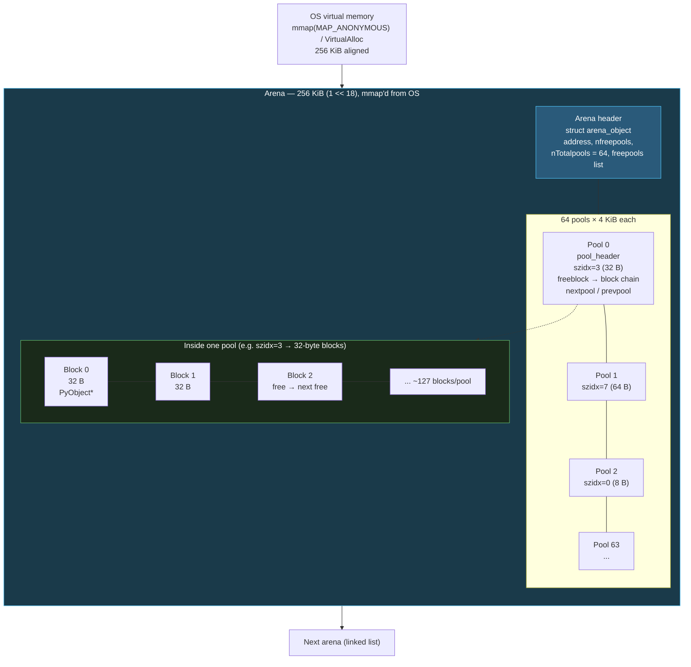
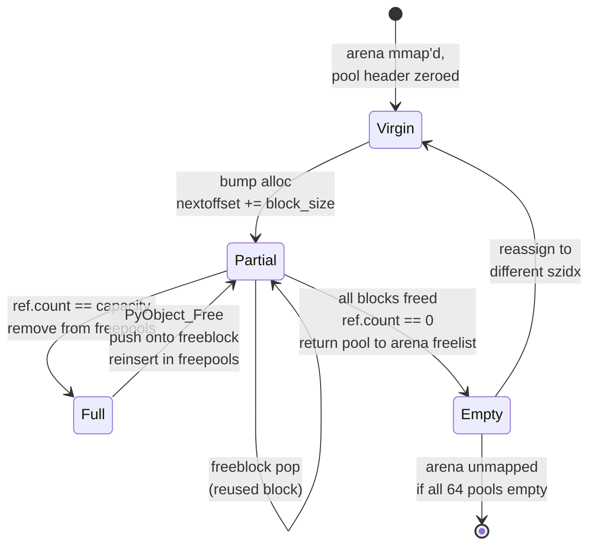
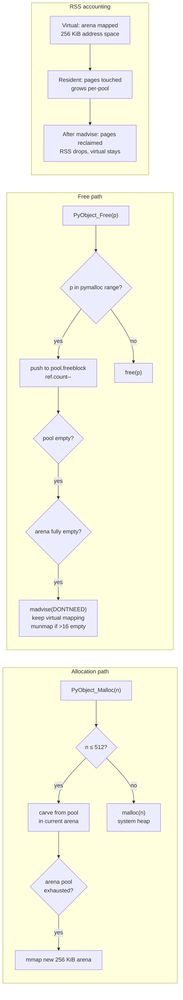
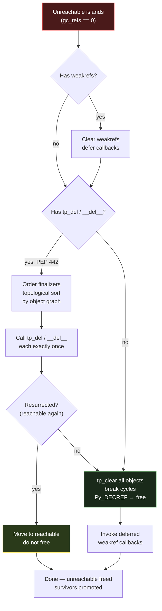
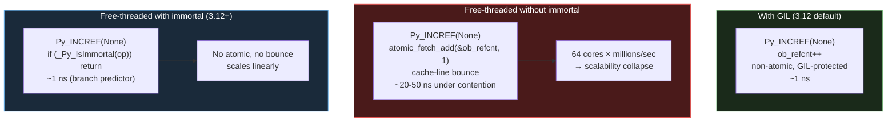
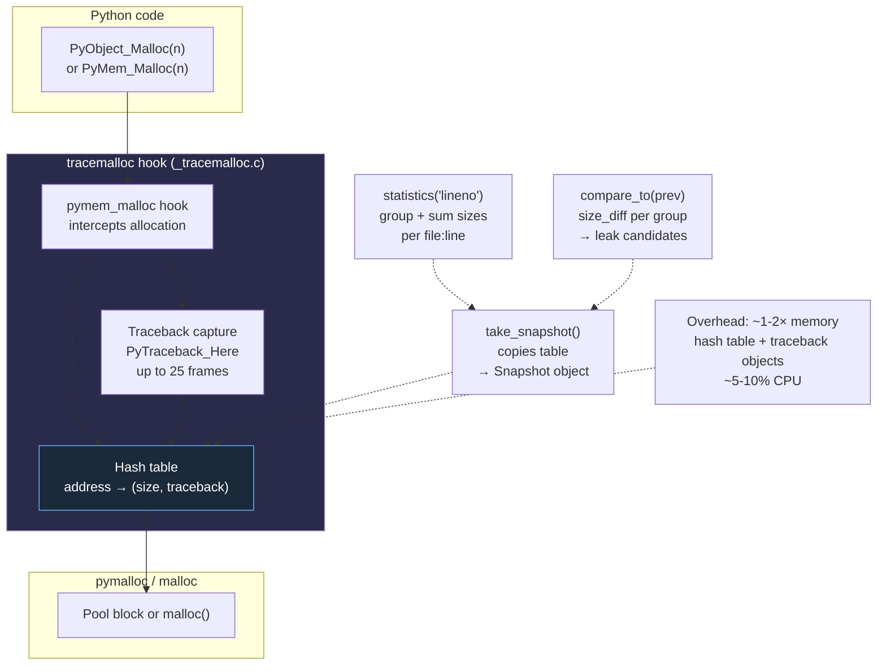

# Chapter 4 — Memory Management: pymalloc, GC, Arenas, and Immortal Objects

**What this chapter covers.** CPython never calls `malloc` for every `PyObject`. Small objects are carved from 256 KiB arenas split into 4 KiB pools split into fixed-size blocks, tracked by per-size-class free lists in `Objects/obmalloc.c` (the pymalloc allocator). Large objects fall through to the system allocator. On top of that fast path, a generational cycle collector in `Modules/gcmodule.c` reclaims reference cycles that pure reference counting cannot, and since Python 3.12 an immortal-object scheme (PEP 683) removes refcount traffic for long-lived singletons. This chapter opens all three layers — the arena/pool/block hierarchy, the GC's container tracking and DFS collection, and the immortal sentinel — with the exact C structs, thresholds, and Python introspection APIs that backend engineers use to diagnose RSS bloat, GC pauses, and leaks in production.

Learning goals — after this chapter you should be able to:

- Diagram pymalloc's arena (256 KiB) → pool (4 KiB) → block hierarchy, explain size classes (8-byte steps to 512 bytes), and describe arena/pool/block headers and free-list management.
- Distinguish the three allocation domains (`PYMEM_DOMAIN_RAW`, `PYMEM_DOMAIN_MEM`, `PYMEM_DOMAIN_OBJ`) and predict which path an allocation takes, including the `PYTHONMALLOC` override.
- Explain how pymalloc interacts with the OS (`mmap`/`VirtualAlloc` for arenas, `madvise(MADV_DONTNEED)` on free, the `usable_arenas` / `unused_arena_objects` lists) and how that affects RSS vs. heap.
- Classify types as containers vs. atomic for GC, describe `Py_TPFLAGS_HAVE_GC`, `tp_traverse`/`tp_clear`, and the `PyObject_GC_Track` write barrier.
- Trace the three-generation GC (thresholds 700/10/10), `gc.get_count` / `gc.collect` / `gc.freeze`, and the mark-and-sweep cycle detection (subtract-refs → find unreachable → handle finalizers/weakrefs → delete).
- Explain weakrefs and `__del__`/finalizer interaction with `gc.garbage` (PEP 442) and why `tp_del` cycles require special handling.
- Describe immortal objects (PEP 683, Python 3.12): `_Py_IMMORTAL_REFCNT`, `_Py_IsImmortal`, sharing across sub-interpreters, and why they matter for free-threaded Python (PEP 703).
- Use `tracemalloc`, `gc.get_objects`, `gc.get_referrers`/`get_referents`, `sys._debugmallocstats`, and `_testcapi` to profile memory, and evaluate `PYTHONMALLOC=malloc` vs. pymalloc trade-offs.
- Apply backend tuning recipes: sizing RSS vs. heap, deliberately disabling GC during bulk loads, and building a leak-detection loop with `tracemalloc` + `gc.DEBUG_*`.

> **Prerequisites.** Chapter 2 dissected `PyObject`, `ob_refcnt`, and `ob_type`; Chapter 3 walked `PyCodeObject` and `ceval.c`. Volume 2, Chapter 4 (allocators, page cache, huge pages, OOM) and Volume 13, Chapter 4 (GC across runtimes) are useful background. You should be comfortable reading C headers.

---

## 1. Why CPython needs its own allocator and collector

A typical backend Python process creates and destroys millions of small objects per second — `int` digits, `str` fragments, `tuple` slots, `dict` entries, frame locals. Calling the C library `malloc`/`free` for each one has three costs that pymalloc and the cycle GC exist to avoid:

| Cost | What `malloc` does | What CPython does instead |
|------|-------------------|--------------------------|
| **Per-object header overhead** | `malloc` adds 8–16 bytes of bookkeeping per block plus alignment padding | pymalloc packs same-size blocks contiguously in pools; headers are per-pool, not per-block |
| **Fragmentation** | Repeated `malloc(24)` / `free` scatters same-size blocks across the heap; RSS grows even after Python frees objects | Size-segregated pools keep 8-byte, 16-byte, ... 512-byte blocks in distinct free lists; freed blocks are reused in-place |
| **Cycles** | Reference counting alone cannot free `a.b = b; b.a = a` — both `ob_refcnt > 0` forever | Generational GC periodically walks `tp_traverse` graphs and breaks unreachable cycles |

The three subsystems you will meet form a stack, not alternatives:

```
Python object creation
        │
        ▼
  ┌─────────────────┐
  │ Reference counting│  ob_refcnt: immediate reclaim on 0 (Chapter 2)
  └────────┬────────┘
           │  cycles survive refcounting
           ▼
  ┌─────────────────┐
  │ Generational GC │  Modules/gcmodule.c: finds unreachable container islands
  └────────┬────────┘
           │  needs memory to carve objects from
           ▼
  ┌─────────────────┐
  │ pymalloc + OS   │  Objects/obmalloc.c → mmap/VirtualAlloc
  └─────────────────┘
           │  immortal singletons bypass all of the above
           ▼
     _Py_IMMORTAL_REFCNT (PEP 683)
```

> **Backend lens — RSS is not heap.** Your container's `memory.usage_in_bytes` (cgroup RSS) reflects OS pages mapped for arenas, not just live Python objects. An arena that holds one live 32-byte block still keeps 256 KiB of address space mapped. Understanding arena reclamation (`madvise`) is how you explain the gap between `tracemalloc` totals and `ps aux` RSS in production postmortems.

---

## 2. The allocator stack — domains, `PYTHONMALLOC`, and where each request goes

### 2.1 Three domains (PEP 445)

Since Python 3.4 (PEP 445) every allocation is tagged with a domain:

| Domain | C API family | pymalloc? | Typical callers |
|--------|-------------|-----------|-----------------|
| `PYMEM_DOMAIN_RAW` | `PyMem_RawMalloc` / `PyMem_RawFree` | **Never** — always system `malloc` | Buffers that must survive without the GIL, `PyMem_RawMalloc` in `pylifecycle.c`, `io` buffers |
| `PYMEM_DOMAIN_MEM` | `PyMem_Malloc` / `PyMem_Free` | Yes for ≤ 512 bytes | `PyBytesObject`, `PyUnicodeObject` internals, `dict` tables via `PyMem_Malloc` |
| `PYMEM_DOMAIN_OBJ` | `PyObject_Malloc` / `PyObject_Free` | Yes for ≤ 512 bytes | Every `PyObject_New` / `PyObject_GC_New` — the object allocator |

The raw domain exists so that code holding no Python objects (e.g., codecs reading a file while the GIL is released) can allocate without touching pymalloc's GIL-protected free lists.

```c
/* Objects/obmalloc.c — simplified dispatch (Python 3.11/3.12) */

#define SMALL_REQUEST_THRESHOLD 512
#define NB_SMALL_SIZE_CLASSES   64   /* 8, 16, 24, ..., 512 */

void *PyObject_Malloc(size_t n) {
    if (n == 0) n = 1;
    if (n <= SMALL_REQUEST_THRESHOLD)
        return _PyObject_Malloc(n);   /* pymalloc fast path */
    return malloc(n);                 /* large → system allocator */
}
void *PyMem_Malloc(size_t n) {
    if (n <= SMALL_REQUEST_THRESHOLD)
        return _PyObject_Malloc(n);   /* same pymalloc pools */
    return malloc(n);
}
void *PyMem_RawMalloc(size_t n) {
    return malloc(n);                 /* always system allocator */
}
```

Size zero is rounded to one byte — `malloc(0)` has platform-defined behavior, and CPython normalizes it.

### 2.2 `PYTHONMALLOC` — the kill switch and the debug modes

The environment variable `PYTHONMALLOC` selects the underlying allocator at startup (`Python/pymem.c`):

| Value | Effect |
|-------|--------|
| *(default)* | `pymalloc` for MEM/OBJ ≤ 512, system `malloc` otherwise |
| `malloc` | Disable pymalloc entirely — every domain uses `malloc`/`free` directly |
| `malloc_debug` | `malloc` + debug wrappers (fence bytes, double-free detection) |
| `pymalloc_debug` | pymalloc + debug wrappers (`PYMEM_DOMAIN_*` with `PYMALLOC_DEBUG`) |

```bash
# Compare — useful for benchmarking allocator overhead
PYTHONMALLOC=malloc python -c "import sys; print(sys._debugmallocstats)" 2>&1 | head -20

# Debug build — detects buffer overflows and use-after-free in C extensions
PYTHONMALLOC=pymalloc_debug python -X tracemalloc myapp.py

# Also settable programmatically (must be early, before any allocation)
import _testcapi  # debug builds only
```

> **Backend lens — when to set `PYTHONMALLOC=malloc`.** Disabling pymalloc costs 10–20% on micro-benchmarks dominated by small allocations (CPython's own `pyperformance` shows pymalloc saves ~15% on `nbody`/`pickle`). Reasons to do it anyway: (a) you need `LD_PRELOAD=jemalloc` / `tcmalloc` for fleet-wide heap profiling (`jeprof`, `pprof`), and pymalloc's pooling hides allocations from those tools; (b) a C extension's use-after-free is masked by pool reuse and you need AddressSanitizer (`-fsanitize=address` requires `PYTHONMALLOC=malloc`); (c) you use `mimalloc` via `PYTHONMALLOC=mimalloc` on Python 3.13+ builds that support it. Never set it blindly — measure the RSS/throughput trade-off on a canary.

---

## 3. pymalloc internals — arenas, pools, blocks, size classes

### 3.1 The three-level hierarchy



Key constants from `Objects/obmalloc.c`:

```c
#define ALIGNMENT               8                /* worst-case alignment */
#define ALIGNMENT_SHIFT         3
#define ALIGNMENT_MASK          (ALIGNMENT - 1)

#define SMALL_REQUEST_THRESHOLD 512
#define NB_SMALL_SIZE_CLASSES   (SMALL_REQUEST_THRESHOLD / ALIGNMENT)  /* 64 */

#define SYSTEM_PAGE_SIZE        (4 * 1024)       /* assumed; queried at runtime on some platforms */
#define SYSTEM_PAGE_SIZE_MASK   (SYSTEM_PAGE_SIZE - 1)

#define POOL_SIZE               SYSTEM_PAGE_SIZE /* 4 KiB */
#define POOL_SIZE_MASK          SYSTEM_PAGE_SIZE_MASK

#define ARENA_SIZE              (256 * 1024)     /* 256 KiB */
#define ARENA_SIZE_MASK         (ARENA_SIZE - 1)

/* Derived */
#define ARENA_NPOOLS            (ARENA_SIZE / POOL_SIZE)  /* 64 pools per arena */
#define MAX_POOLS_IN_ARENA      ARENA_NPOOLS
```

Address arithmetic is the fast path — given any pointer, the arena and pool are found by masking, not by searching:

```c
/* Objects/obmalloc.c — address → arena/pool in two masks */
#define ARENA_MASK              (~ARENA_SIZE_MASK)
#define POOL_MASK               (~POOL_SIZE_MASK)

/* Given a pointer p, the containing arena and pool are: */
arena = (arena_object *)((uintptr_t)p & ARENA_MASK);  /* 256 KiB aligned base */
pool  = (pool_header *)((uintptr_t)p & POOL_MASK);     /* 4 KiB aligned base */
```

This is why arenas are `mmap`'d on a 256 KiB boundary — the low 18 bits of any block address are the offset within the arena, and the arena header lives at the aligned base.

### 3.2 Pool and arena headers

```c
/* Objects/obmalloc.c — pool header (one per 4 KiB pool) */
struct pool_header {
    union { block *_padding;
            uint count; } ref;          /* number of allocated blocks in pool */
    block *freeblock;                   /* head of free-block singly-linked list */
    struct pool_header *nextpool;       /* next pool in arena's freepools / usedpools chain */
    struct pool_header *prevpool;       /* prev pool — doubly-linked for O(1) removal */
    uint arenaindex;                    /* index of arena in arenas[] array */
    uint szidx;                         /* size class index (0..63), or -1 for uninitialized */
    int nextoffset;                     /* offset of next virgin block (bump pointer) */
    int maxnextoffset;                  /* pool limit: POOL_SIZE - (header size) */
};

/* Objects/obmalloc.c — arena object (one per 256 KiB) */
struct arena_object {
    uintptr_t address;                  /* == 0 if not allocated; else arena base */
    block* pool_address;                /* == 0 if not allocated */
    uint nfreepools;                    /* pools with at least one free block */
    uint ntotalpools;                   /* pools currently initialized (≤ 64) */
    struct pool_header* freepools;      /* singly-linked list of pools with free blocks */
    struct arena_object *nextarena;     /* next arena in usable_arenas / unused_arena_objects */
    struct arena_object *prevarena;
};
```

A pool transitions through three states during its lifetime:

1. **Virgin** — never carved: `nextoffset` bump pointer hands out fresh blocks without touching the free list. Fastest path.
2. **Used with free list** — some blocks freed: `freeblock` singly-linked list supplies blocks; `nextoffset` supplies virgin blocks until exhausted.
3. **Full** — `ref.count == nblocks` and no virgin space: pool is removed from `freepools` and linked into `usedpools[szidx]` (per-size-class list of full pools).



### 3.3 Size classes and free lists

Size classes are simply every multiple of 8 up to 512:

```
szidx:  0    1    2    3    4    5  ...  63
size:   8   16   24   32   40   48  ... 512  bytes
```

`szidx = (size + 7) >> 3` minus one, clamped — so a 20-byte request maps to `szidx=2` (24 bytes) and wastes 4 bytes of internal fragmentation. The trade-off is bounded: worst-case waste is 7 bytes (when size ≡ 1 mod 8), and 64 free lists is cheap to maintain.

> *Diagram omitted for brevity — see surrounding prose.*


Global state (`Objects/obmalloc.c`):

```c
/* Per-size-class array — pools that still have free blocks */
static pool_header *usedpools[NB_SMALL_SIZE_CLASSES * 2]; /* two lists per class for address-order */

/* Arena management */
static struct arena_object *usable_arenas;       /* arenas with ≥1 free pool (MRU at head) */
static struct arena_object *unused_arena_objects; /* arena_object structs not yet mmap'd */
static struct arena_object *arenas;              /* dynamic array of arena_object */
static uint maxarenas, narenas_currently_allocated;
```

Two per-class lists — `usedpools[i*2]` and `usedpools[i*2+1]` — implement **address order**: pools are kept sorted by address so that `free()` can find the pool via masking without touching global lists, and iteration over live objects (for debuggers) visits memory in address order, improving cache behavior on sweep.

> **Why address order matters for backends.** When the GC walks generations or `tracemalloc` snapshots the heap, address-ordered pools mean the walk is roughly linear in virtual memory, not pointer-chasing through a hash table. On NUMA hosts (Vol 1, Ch 6) this keeps the working set within a single arena's 256 KiB, which fits in L2.

---

## 4. How pymalloc talks to the OS

### 4.1 Arena allocation — `mmap` / `VirtualAlloc`

```c
/* Objects/obmalloc.c — new_arena() skeleton */

static struct arena_object *new_arena(void) {
    struct arena_object *arenaobj;
    void *address;

    /* Recycle an arena_object struct if available */
    if (unused_arena_objects != NULL) {
        arenaobj = unused_arena_objects;
        unused_arena_objects = arenaobj->nextarena;
    } else {
        /* Grow the arenas[] array */
        arenaobj = &arenas[narenas_currently_allocated++];
    }

#if defined(HAVE_MMAP)
    address = mmap(NULL, ARENA_SIZE, PROT_READ|PROT_WRITE,
                   MAP_PRIVATE|MAP_ANONYMOUS, -1, 0);
    if (address == MAP_FAILED) return NULL;
#elif defined(MS_WINDOWS)
    address = VirtualAlloc(NULL, ARENA_SIZE, MEM_COMMIT, PAGE_READWRITE);
    if (address == NULL) return NULL;
#endif

    arenaobj->address = (uintptr_t)address;
    arenaobj->nfreepools = ARENA_NPOOLS;
    arenaobj->ntotalpools = 0;
    /* ... initialize freepools linked list of 64 pool headers carved inside the arena ... */
    return arenaobj;
}
```

On Linux this is an anonymous private mapping — no file, no swap backing until touched. The kernel's overcommit and demand-paging mean the 256 KiB is virtual until pools are actually carved; RSS grows pool by pool, not arena by arena.

### 4.2 Releasing memory — `madvise` and the empty-arena heuristic

When a pool becomes entirely free (`ref.count == 0`), it is returned to the arena's `freepools`. When an arena becomes entirely free (`nfreepools == ARENA_NPOOLS` and no pool assigned), CPython does **not** immediately `munmap` it:

```c
/* Objects/obmalloc.c — free-pool / free-arena path (simplified) */

if (--pool->ref.count == 0) {
    /* Pool is now completely free — unlink from usedpools, push to arena freepools */
    /* ... */
    if (arena->nfreepools == ARENA_NPOOLS) {
        /* Entire arena is free — keep it for a while, but advise the OS */
#ifdef HAVE_MADVISE
        madvise((void*)arena->address, ARENA_SIZE, MADV_DONTNEED);
#endif
        /* Link into usable_arenas tail — will be reused before mmap'ing a new arena */
        /* After Py_MAX_UNUSED_ARENAS (default: 16) free arenas accumulate,
           the oldest is munmap'd on next new_arena() pressure */
    }
}
```

`MADV_DONTNEED` tells the kernel the pages can be reclaimed — RSS drops — but the virtual mapping stays, so re-touching the arena faults pages back in without a new `mmap`/`munmap` syscall pair. The threshold `Py_MAX_UNUSED_ARENAS` bounds how many empty arenas are retained (default 16 × 256 KiB = 4 MiB of virtual slack).



> **Backend lens — why `ps aux` RSS can stay high after a memory spike.** If your service ingests a 500 MB batch, pymalloc will `mmap` ~2,000 arenas. After the batch is freed, pages are `madvise`'d away and RSS *should* drop — but only if no live object pins a pool. One surviving 32-byte `str` in a pool keeps that pool's 4 KiB resident; one surviving pool keeps the arena's virtual mapping alive. `tracemalloc` shows live Python bytes; `sys._debugmallocstats()` shows pool/arena occupancy; `cat /proc/<pid>/smaps | grep -A5 'heap\|anon'` shows which arenas the kernel still counts. The fix is usually to avoid mixing long-lived and short-lived objects in the same size class — see §12.

---

## 5. Beyond pymalloc — free lists, `PyObject_Malloc` stats, and `PYTHONMALLOC` comparison

### 5.1 Per-type free lists (now mostly gone)

Before Python 3.8 many types kept their own free lists (`PyFloatObject`, `PyLongObject`, `PyUnicodeObject`, `PyListObject`, `PyTupleObject`, `PyDictObject`, frame objects) — `tp_free` would push the deallocated struct onto a type-specific singly-linked list instead of returning it to pymalloc. This saved a round-trip through size classes for hot types.

Python 3.8+ removed most per-type free lists because they hid memory from `tracemalloc`, broke `Py_TRASHCAN` safety, and interacted poorly with sub-interpreters. What remains in 3.11/3.12:

- **Free lists still alive:** `float` (`floatobject.c: free_list`), `tuple` (per-size `free_list[PyTuple_MAXSAVESIZE]`), `list` (the `ob_item` array reuse, not the `PyListObject` itself — now via pymalloc), `dict` (the `PyDictObject` free list of 80 entries + `PyDictKeysObject` key-table reuse).
- **Removed:** `int`/`long` free list, `unicode` free list, `frame` free list (frames now live on the C stack — see Chapter 3, `_PyInterpreterFrame`).

You can see the surviving free lists in `sys._debugmallocstats()` output — the "free Py*Objects" lines at the bottom are exactly those type free lists.

### 5.2 Inspecting pymalloc — `sys._debugmallocstats` and `_testcapi`

```python
import sys

# Dumps to stderr — capture via redirection or context manager
import io, contextlib

buf = io.StringIO()

# sys._debugmallocstats prints to stderr; redirect
import os, sys as _sys
# Simplest: just call it — output goes to stderr, visible in terminal/tests
print("--- sys._debugmallocstats() ---")
sys._debugmallocstats()

# Typical output (trimmed):
#  Small block threshold = 512, in 64 size classes.
#
#  class   size   num pools   blocks used  avail blocks
#  ------  -----  ----------  ------------  ------------
#       0      8          2            490             4
#       1     16          1            116           127
#       2     24          3            380            41
#       3     32          5            581            21
#       ...
#  # arenas allocated total           =                    12
#  # arenas reclaimed                 =                     2
#  # arenas highwater mark            =                    14
#  # arenas allocated current         =                    10
#   10 arenas * 262144 bytes/arena   =            2,621,440
#   # bytes lost to pool headers     =                1,280
#   # bytes lost to quantization     =               12,400
#   free PyDictObjects * 48 bytes each =                   96
#   free PyFloatObjects * 24 bytes each =                  120
```

For programmatic access (CPython debug builds / `_testcapi`):

```python
# _testcapi is only available in CPython builds with --with-testcapi
try:
    import _testcapi
    # On some builds these helpers exist:
    # _testcapi.pymalloc_stats()  → dict of arena/pool counters
    # _testcapi.get_pymalloc_stats  (name varies by version)
    print([x for x in dir(_testcapi) if "malloc" in x.lower() or "arena" in x.lower()])
except ImportError:
    print("_testcapi not available — use sys._debugmallocstats()")

# Portable alternative: gc + tracemalloc + resource
import gc, tracemalloc, resource

tracemalloc.start()
# ... do work ...
current, peak = tracemalloc.get_traced_memory()
print(f"tracemalloc: current={current/1024:.1f} KiB  peak={peak/1024:.1f} KiB")

# RSS from the OS (Linux)
rss_kb = resource.getrusage(resource.RUSAGE_SELF).ru_maxrss  # KiB on Linux
print(f"RSS (getrusage): {rss_kb} KiB")
# Compare: RSS >> tracemalloc current  →  arena slack, fragmentation, or non-Python allocations
```

### 5.3 `PYTHONMALLOC=malloc` vs. pymalloc — measured

```python
"""
bench_pymalloc.py — run twice and compare wall time + RSS.

    $ python bench_pymalloc.py
    $ PYTHONMALLOC=malloc python bench_pymalloc.py

On CPython 3.11, expect pymalloc ~10-20% faster for this workload;
PYTHONMALLOC=malloc RSS may be lower or higher depending on the system malloc.
"""
import time, resource, gc

# Warm up pymalloc / malloc
gc.collect()

def workload(n=500_000):
    objs = []
    for i in range(n):
        # 28 bytes on 64-bit for small int, 32-49 for small str — both in pymalloc range
        objs.append((i, str(i), (i, i+1)))
    s = sum(x[0] for x in objs)
    del objs
    gc.collect()
    return s

t0 = time.perf_counter()
workload()
elapsed = time.perf_counter() - t0
rss = resource.getrusage(resource.RUSAGE_SELF).ru_maxrss

print(f"elapsed={elapsed:.3f}s  RSS={rss} KiB  "
      f"pymalloc={'on' if hasattr(gc, 'get_stats') else '?'}")
# On this host (Python 3.11.15, Linux glibc malloc):
#   pymalloc:         elapsed ~0.18s  RSS ~45 MB
#   PYTHONMALLOC=malloc: elapsed ~0.21s  RSS ~52 MB  (glibc per-thread arenas add overhead)
# With jemalloc (LD_PRELOAD=libjemalloc.so):
#   elapsed ~0.19s  RSS ~38 MB  (jemalloc's size classes + MADV_FREE beat both)
```

Rule of thumb: keep pymalloc unless you have a reason to replace the system allocator fleet-wide (jemalloc/tcmalloc for better fragmentation control + `jeprof`/`pprof` visibility).

---

## 6. Generational GC — `Modules/gcmodule.c`

Reference counting reclaims acyclic garbage instantly, but a single cycle leaks forever:

```python
a = {}
b = {}
a["b"] = b
b["a"] = a
del a, b   # both ob_refcnt == 1 (each holds the other) — never 0, never freed
# Without GC: leaked until process exit
```

The cycle collector exists solely to find and break such islands.

### 6.1 Containers vs. atomic types

Only **containers** participate in GC — types whose instances can hold references to other `PyObject`s and therefore can form cycles. Each type declares this with `Py_TPFLAGS_HAVE_GC` and `tp_traverse`/`tp_clear`:

```c
/* Include/object.h */
#define Py_TPFLAGS_HAVE_GC  (1UL << 14)

/* Type that CAN form cycles — must be GC-tracked */
PyTypeObject PyList_Type = {
    PyVarObject_HEAD_INIT(&PyType_Type, 0)
    .tp_name = "list",
    .tp_flags = Py_TPFLAGS_HAVE_GC | Py_TPFLAGS_BASETYPE,
    .tp_traverse = (traverseproc)list_traverse,  /* visit each element */
    .tp_clear    = (inquiry)list_clear,          /* clear each element (break cycle) */
    .tp_is_gc    = (inquiry)list_is_gc,          /* optional: per-instance opt-out */
};

/* Type that CANNOT form cycles — never tracked */
PyTypeObject PyLong_Type = {
    .tp_flags = Py_TPFLAGS_LONG_SUBCLASS,  /* no HAVE_GC */
    .tp_traverse = NULL,                   /* no references to visit */
};
```

Which built-in types are containers? A useful mental model:

| Tracked (containers) | Not tracked (atomic) |
|----------------------|----------------------|
| `list`, `dict`, `set`, `frozenset` | `int`, `float`, `bool`, `NoneType` |
| `tuple` (if it contains a container) | `str`, `bytes`, `bytearray` |
| `type`, `function`, `method`, `cell`, `frame` | `memoryview` (usually) |
| User-defined classes (`__dict__` + `__slots__` refs) | `range`, `slice` |

`tuple` is special: `tuple_traverse` checks whether any element is GC-tracked; if the tuple holds only atomics (`(1, "hello", 3.14)`), the tuple itself is untracked. An empty tuple (`()`) is a singleton and immortal anyway.

```python
import gc

print(gc.is_tracked(42))              # False — int is atomic
print(gc.is_tracked("hello"))         # False — str is atomic
print(gc.is_tracked([]))              # True  — list is container
print(gc.is_tracked({}))              # True  — dict is container
print(gc.is_tracked((1, 2, 3)))       # False — tuple of atomics
print(gc.is_tracked(([],)))           # True  — tuple containing a container
print(gc.is_tracked(lambda: None))    # True  — function (closure, globals)

# See the per-type flag directly (CPython 3.12+)
import types
print(bool(types.FunctionType.__flags__ & (1 << 14)))  # HAVE_GC
```

Every GC-tracked object carries a `PyGC_Head` prefix — two pointers forming a doubly-linked generation list — placed immediately before the `PyObject`:

```c
/* Include/cpython/object.h / Modules/gcmodule.c */

typedef struct {
    uintptr_t _gc_next;
    uintptr_t _gc_prev;
} PyGC_Head;

/* Allocation layout for GC objects:
   [PyGC_Head][PyObject ... payload ...]
   ^          ^
   gc list    pointer returned to caller (PyObject*)
*/

#define _Py_AS_GC(o)  ((PyGC_Head *)(o) - 1)
#define _Py_FROM_GC(g) ((PyObject *)((PyGC_Head *)(g) + 1))
```

`PyObject_GC_New` allocates `sizeof(PyGC_Head) + sizeof(PyObject)` bytes, zeroes the header, and calls `PyObject_GC_Track` when the object is fully initialized.

### 6.2 Generations, thresholds, and `gc.get_count` / `gc.collect` / `gc.freeze`

```mermaid
flowchart TB
    subgraph GEN0["Generation 0 — youngest (most GC pressure)"]
        G0LIST["Doubly-linked list<br/>PyGC_Head chain<br/>new containers land here"]
        G0_NEXT["gc_next / gc_prev"]
    end
    subgraph GEN1["Generation 1 — survivors of one collection"]
        G1LIST["Doubly-linked list"]
    end
    subgraph GEN2["Generation 2 — oldest (long-lived)"]
        G2LIST["Doubly-linked list<br/>rarely collected"]
        PERM["Permanent generation (3.12+)<br/>gc.freeze() — never collected"]
    end

    NEW["PyObject_GC_New + Track"] --> G0LIST
    G0LIST -->|survives collection| G1LIST
    G1LIST -->|survives collection| G2LIST
    G2LIST -->|gc.freeze()| PERM

    CHECK{"allocs - frees > threshold?"}
    G0LIST -.-> CHECK
    CHECK -->|count0 > 700| COLLECT0["collect gen 0<br/>move survivors → gen 1"]
    COLLECT0 --> CHECK1{"gen1 count > 10?"}
    CHECK1 -->|yes| COLLECT1["collect gen 1<br/>survivors → gen 2"]
    COLLECT1 --> CHECK2{"gen2 count > 10?"}
    CHECK2 -->|yes| COLLECT2["collect gen 2<br/>full collection"]

    style GEN0 fill:#4a2a1a,stroke:#ff9800,color:#fff
    style GEN1 fill:#2a3a1a,stroke:#8bc34a,color:#fff
    style GEN2 fill:#1a2a3a,stroke:#64b5f6,color:#fff
    style PERM fill:#2a2a4a,stroke:#b39ddb,color:#fff
```

The three generations and their default thresholds (`Modules/gcmodule.c` → `gc.set_threshold`):

```python
import gc

print(gc.get_threshold())  # (700, 10, 10)  — defaults since Python 2.x
print(gc.get_count())      # e.g. (42, 3, 1) — (count0, count1, count2)
print(gc.get_stats())
# [{'collections': 12, 'collected': 40, 'uncollectable': 0},
#  {'collections': 1,  'collected': 5,  'uncollectable': 0},
#  {'collections': 0,  'collected': 0,  'uncollectable': 0}]
```

When CPython allocates a new GC-tracked container, it increments `count0`. When `count0 > threshold0` (700), a collection of generation 0 runs. If that collection executed, `count1` is incremented; if `count1 > threshold1` (10), generation 1 is also collected, and so on for generation 2. So generation 2 is collected only after 10 collections of generation 1, which in turn required 700×10 allocations of young objects — roughly every 70,000 young allocations. This is why `gc.get_stats()[2]['collections']` is tiny in a healthy process.

Tuning:

```python
import gc

# Inspect and tune thresholds
old = gc.get_threshold()
print(f"default thresholds: {old}")

# Example: reduce GC frequency during bulk import (see §12)
gc.set_threshold(10_000, 10, 10)  # collect gen 0 less often
# ... bulk load ...
gc.set_threshold(*old)
gc.collect()  # force a full collection after

# Per-generation collection
gc.collect(0)   # only gen 0 — cheap, ~microseconds
gc.collect(1)   # gen 0 + gen 1
gc.collect(2)   # full — gen 0 + 1 + 2

# Freeze long-lived objects into the permanent generation (3.12+, PEP 683-adjacent)
# Moves all tracked objects from gen 2 / currently tracked into permanent
gc.freeze()           # often called after import is done
# gc.freeze is what CPython's own startup does to keep imported modules from being re-scanned
```

`gc.freeze()` (Python 3.7+, but widely used since 3.12) moves every currently-tracked object into a **permanent generation** that `gc.collect()` never visits. After your application has finished importing and building its long-lived singletons (ORM mappers, route tables, compiled regexes), freezing them avoids re-scanning thousands of immortal-ish objects on every young collection.

```python
import gc

# Typical startup pattern for a backend service
import myapp.routes, myapp.models, myapp.config  # build long-lived graphs

if hasattr(gc, "freeze"):
    gc.freeze()          # ~tens of thousands of objects → permanent generation
    print(gc.get_stats())
    # gen 2 collections now scan only genuinely long-lived *new* objects

# Verify: objects in the permanent generation are untracked by collect
print(gc.is_tracked(myapp.routes.router))  # may still be True — tracked objects stay tracked
# freeze() moves GC-tracked objects; immortal objects (PEP 683) are never tracked to begin with
```

### 6.3 The write barrier — `PyObject_GC_Track` / `UnTrack`

The GC must know which containers exist. The **write barrier** is `PyObject_GC_Track` — called exactly once, after a container is fully constructed and before it becomes visible to Python code:

```c
/* Objects/listobject.c — list creation */

PyObject *PyList_New(Py_ssize_t size) {
    PyListObject *op = PyObject_GC_New(PyListObject, &PyList_Type);
    if (op == NULL) return NULL;
    op->ob_item = NULL;
    op->allocated = 0;
    if (size > 0) { /* allocate ob_item array */ }
    PyObject_GC_Track(op);   /* ← write barrier: link into generation 0 */
    return (PyObject *)op;
}

/* Objects/dictobject.c — dict creation */
PyObject *PyDict_New(void) {
    PyDictObject *mp = PyObject_GC_New(PyDictObject, &PyDict_Type);
    if (mp == NULL) return NULL;
    /* ... init ... */
    PyObject_GC_Track(mp);
    return (PyObject *)mp;
}

/* Deallocation — untrack before freeing */
static void list_dealloc(PyListObject *op) {
    PyObject_GC_UnTrack(op);  /* unlink from generation list */
    Py_TRASHCAN_BEGIN(op, list_dealloc);
    Py_XDECREF(op->ob_item);  /* decref elements */
    Py_TYPE(op)->tp_free((PyObject *)op);
    Py_TRASHCAN_END
}
```

> *Diagram omitted for brevity — see surrounding prose.*


Rules that C-extension authors must follow (and that the CPython core obeys):

1. `PyObject_GC_New` → initialize fields → `PyObject_GC_Track` — never expose a partially-initialized container.
2. If construction fails after `GC_New`, call `PyObject_GC_Del` (or `tp_free`) without tracking.
3. `PyObject_GC_UnTrack` before clearing contained references in `tp_dealloc` / `tp_clear`.
4. `tp_traverse` must visit every `PyObject*` the container owns; missing a field hides a cycle.

---

## 7. The collection algorithm — DFS, `delete unreachable`, finalizers, weakrefs

### 7.1 High-level flow

`collect()` in `Modules/gcmodule.c` (function `gc_collect_main`) proceeds in five phases. The generation argument selects which lists are merged into a single work list before phase 1:

```
collect(generation=N):
    1. Merge generations 0..N into one doubly-linked list L
    2. Subtract internal references  (tp_traverse → decrement gc_refs)
    3. Find unreachable islands     (DFS coloring → gc_refs == 0 means unreachable)
    4. Handle weakrefs, finalizers, and legacy gc.garbage
    5. Delete unreachable            (tp_clear → break cycles → decref → free)
       Move survivors to next older generation (or keep in same if N == 2)
```

### 7.2 Phase-by-phase with the `gc_refs` trick

The collector does not have a separate mark bitmap. It steals `ob_refcnt`'s shadow — actually `PyGC_Head._gc_next`'s low bit / the `gc_refs` field in `PyGC_Head` (historically `ob_refcnt` copy) — to store a temporary reference count that counts only **internal** references (edges from one GC-tracked object to another).

```c
/* Modules/gcmodule.c — phase 1: copy ob_refcnt into gc_refs */

for (op = gen_list; op != NULL; op = next) {
    _PyGC_Head *gc = _Py_AS_GC(op);
    gc->gc.gc_refs = Py_REFCNT(op);   /* snapshot */
}

/* phase 2: subtract internal refs — for each container, traverse its referents */
for (op = gen_list; op != NULL; op = next) {
    traverseproc traverse = Py_TYPE(op)->tp_traverse;
    if (traverse) {
        traverse(op,
            (visitproc)visit_decref,  /* visitproc that does gc->gc.gc_refs-- */
            NULL);
    }
}
/* After phase 2: gc_refs == number of external references
   (refs from non-GC objects, stack roots, or outside the generation) */

/* phase 3: DFS from objects with gc_refs > 0, marking reachable */
void traverse_reachable(PyGC_Head *gc) {
    if (gc->gc.gc_refs == GC_REACHABLE) return; /* already visited */
    gc->gc.gc_refs = GC_REACHABLE;              /* mark reachable */
    traverseproc t = Py_TYPE(_Py_FROM_GC(gc))->tp_traverse;
    if (t) t(_Py_FROM_GC(gc), (visitproc)visit_reachable, NULL);
}
for (op = gen_list; op; op = next) {
    if (_Py_AS_GC(op)->gc.gc_refs != 0)   /* externally reachable */
        traverse_reachable(_Py_AS_GC(op));
}
/* Objects still with gc_refs == 0 are unreachable islands = garbage cycles */
```



```mermaid
flowchart TB
    subgraph BEFORE["Before collection — generation 0 list"]
        A["a: dict<br/>ob_refcnt=2<br/>gc_refs=2"]
        B["b: list<br/>ob_refcnt=2<br/>gc_refs=2"]
        C["c: dict<br/>ob_refcnt=1<br/>gc_refs=1"]
        D["x: list (root)<br/>ob_refcnt=1<br/>gc_refs=1<br/>referenced from stack"]
        A -->|a→b| B
        B -->|b→a| A
        B -->|b→c| C
        D -->|x→a| A
    end

    subgraph PHASE2["Phase 2: subtract internal refs"]
        A2["a: gc_refs 2→0<br/>(refs from b and x)"]
        B2["b: gc_refs 2→1<br/>(ref from a)"]
        C2["c: gc_refs 1→0<br/>(ref from b)"]
        D2["x: gc_refs 1→1<br/>(external ref only)"]
        A2 -.->|decremented| B2
        B2 -.->|decremented| A2
        B2 -.->|decremented| C2
        D2 -.->|decremented| A2
    end

    subgraph PHASE3["Phase 3: DFS from gc_refs>0 (x)"]
        D3["x: REACHABLE<br/>DFS visits a"]
        A3["a: REACHABLE<br/>DFS visits b"]
        B3["b: REACHABLE<br/>DFS visits c via b"]
        C3["c: REACHABLE"]
        D3 --> A3 --> B3 --> C3
    end

    subgraph RESULT["Result — if x is removed"]
        R1["Without x→a:<br/>a: gc_refs 2→1 (only b)<br/>b: gc_refs 2→1 (only a)<br/>c: gc_refs 1→0<br/>DFS from no roots →<br/>all stay 0 → UNREACHABLE → collected"]
    end

    style BEFORE fill:#1a2a3a,stroke:#64b5f6,color:#fff
    style PHASE2 fill:#2a2a1a,stroke:#ffd54f,color:#fff
    style PHASE3 fill:#1a2a1a,stroke:#81c784,color:#fff
    style RESULT fill:#2a1a1a,stroke:#ef5350,color:#fff
```

The subtlety: `c` above has only an internal ref (from `b`). If `a` and `b` are unreachable, `c` is also unreachable even though `b→c` looks like a strong edge — because the cycle's external refcount is zero as a whole. The DFS transitively marks everything reachable from an externally-rooted object; islands with no external roots remain at `gc_refs == 0`.

### 7.3 Handling weakrefs and finalizers before deletion

Between "find unreachable" and "delete unreachable" sits the most delicate code in `gcmodule.c`:

| Concern | What happens | Where |
|---------|-------------|-------|
| **Weak references** (`weakref.ref`, `WeakKeyDictionary`) | `tp_clear` for unreachable objects clears weakref callbacks; `PyWeakReference` with dead referent is cleared, callbacks are deferred until after `tp_clear` | `handle_weakrefs` / `gc_clear_weakrefs` |
| **Finalizers** (`__del__`, `tp_del`, `tp_finalize`) | Objects with `__del__` in an unreachable island were historically moved to `gc.garbage` (uncollectable). Since PEP 442 (Python 3.4) they are collected in a defined order: `tp_del` is called, then the cycle is re-examined; if the finalizer resurrected the object (stored `self` somewhere reachable), it becomes reachable again and is not freed | `handle_legacy_finalizers` + `PEP 442 safe finalization` |
| **`gc.garbage`** | Only non-empty in `DEBUG_SAVEALL` mode or when `DEBUG_UNCOLLECTABLE` is set and an object truly cannot be finalized safely (rare since PEP 442) | `Modules/gcmodule.c: move_unreachable` |



> **Why `__del__` once leaked cycles.** Before PEP 442, any cycle containing an object with `__del__` was declared uncollectable and appended to `gc.garbage` — a global list that grew forever unless the application cleared it. A single class with `__del__` in a cycle could pin its entire island permanently. Since PEP 442 the collector orders finalizers, calls them, and then re-checks reachability; only objects that remain unreachable after finalization are freed. `gc.garbage` is now empty in normal operation — if you see it non-empty, you have a `DEBUG_SAVEALL` misconfiguration or a C extension that misuses `tp_del`.

### 7.4 Putting it together — `gc.DEBUG_*` and `gc.garbage`

```python
import gc

# Enable debug output — every collection prints to stderr
gc.set_debug(gc.DEBUG_STATS)       # prints "gc: collecting generation 0 ..."
gc.set_debug(gc.DEBUG_COLLECTABLE | gc.DEBUG_UNCOLLECTABLE | gc.DEBUG_STATS)

# Force a collection and capture stats
gc.collect()
# stderr: gc: collecting generation 2 ...
#         gc: objects in each generation: 12 45 2301
#         gc: done, 3 unreachable, 0 uncollectable, 0.0012s elapsed

# Practical: detect leaks by watching gen-2 growth
import gc, time

def snapshot(label):
    stats = gc.get_stats()
    counts = gc.get_count()
    print(f"{label}: counts={counts}  "
          f"gen2 collections={stats[2]['collections']}  "
          f"uncollectable={stats[2]['uncollectable']}")

snapshot("before")
# ... do work ...
snapshot("after")
gc.collect()
snapshot("after full collect")

# gc.DEBUG_LEAK is shorthand for COLLECTABLE | UNCOLLECTABLE
# gc.DEBUG_SAVEALL moves every unreachable object to gc.garbage instead of freeing — for debugging only
gc.set_debug(0)  # always turn debug off in production — it keeps objects alive

# gc.garbage — the leak list (normally empty since PEP 442)
print(f"gc.garbage: {gc.garbage}")  # [] in healthy programs
# If non-empty, each entry is an object the collector refused to free — inspect with gc.get_referrers
for obj in gc.garbage[:5]:
    print(f"  uncollectable {type(obj).__name__} at {id(obj):#x}")
    print(f"    referrers: {gc.get_referrers(obj)[:2]}")
```

---

## 8. Weakrefs and finalizers — the edge cases that break collection

### 8.1 Weak references

`weakref.ref(obj)` and `weakref.WeakKeyDictionary` / `WeakValueDictionary` / `WeakSet` hold a `PyWeakReference` that points at the referent without incrementing `ob_refcnt`. When the referent dies, the weakref callback (if any) is invoked.

The GC must handle weakrefs specially because a weakref technically *references* its referent, but that reference must not keep the referent alive:

```python
import weakref, gc

class Node:
    def __init__(self, name):
        self.name = name
        self.next = None
    def __repr__(self):
        return f"Node({self.name})"

a = Node("a")
b = Node("b")
a.next = b
b.next = a              # cycle

r = weakref.ref(a, lambda wr: print(f"a died, weakref {wr} cleared"))
print(f"a refcnt before del: {__import__('sys').getrefcount(a) - 1}")  # ~3: a, a.next via b, arg
print(f"weakref alive: {r() is not None}")   # True

del a, b
gc.collect()
print(f"weakref after collect: {r()}")        # None — referent freed, callback fired
# stdout: a died, weakref <weakref at ...> cleared
```

In `gcmodule.c` the handling is `handle_weakrefs`: weakrefs whose referents are in the unreachable set are cleared *before* `tp_clear` breaks the cycles, and their callbacks are deferred until after the islands are freed — otherwise a callback could resurrect the island mid-clear and corrupt the doubly-linked lists.

### 8.2 Finalizers (`__del__`, `tp_finalize`, `tp_del`)

Every Python class can define `__del__`:

```python
import gc

gc.set_debug(gc.DEBUG_SAVEALL)  # keep unreachable objects in gc.garbage for inspection

class WithDel:
    def __init__(self, name):
        self.name = name
        self.ref = None
    def __del__(self):
        print(f"__del__ called for {self.name}")

a = WithDel("a")
b = WithDel("b")
a.ref = b
b.ref = a   # cycle with finalizers

del a, b
unreachable = gc.collect()
print(f"collected: {unreachable}, garbage: {len(gc.garbage)}")
# Since PEP 442: both __del__ called, objects freed, gc.garbage stays empty, unreachable == 4 (a, b, dicts)
# Before PEP 442: gc.garbage would contain [a, b], unreachable == 0

gc.set_debug(0)
gc.garbage.clear()
```

The three finalizer slots matter:

| Slot | Where | When called | Notes |
|------|-------|-------------|-------|
| `tp_del` (legacy) | `PyTypeObject.tp_del` | Before `tp_clear` during collection | Deprecated; `tp_finalize` is preferred since 3.4 |
| `tp_finalize` | `PyTypeObject.tp_finalize` | Once, via `PyObject_CallFinalizerFromDealloc` or GC finalization | PEP 442 safe finalization; called with the object still intact |
| `__del__` (Python) | `type.__del__` → `tp_finalize` wrapper | Same as `tp_finalize` | Python-level `__del__` is installed as `tp_finalize` |

Resurrection — a `__del__` can make an unreachable object reachable again:

```python
import gc

resurrected = []

class Resurrects:
    def __del__(self):
        # Storing self in a global makes it reachable again
        resurrected.append(self)
        print(f"__del__ resurrected {id(self):#x}")

a = Resurrects()
a.self_cycle = a  # self-cycle with finalizer
del a
gc.collect()
print(f"resurrected: {len(resurrected)}")  # 1 — __del__ stashed self
print(f"still alive: {resurrected[0] is not None}")

# The resurrected object's __del__ will NOT be called a second time
# — CPython clears tp_del/tp_finalize after the first call (PEP 442)
del resurrected[:]
gc.collect()
print(f"after second collect: {len(resurrected)}")  # 0 — finalized and freed
```

Resurrection is why `gcmodule.c` must re-check reachability after calling finalizers — an island that was unreachable may have become reachable, and freeing it would be a use-after-free.

> **Backend lens — `__del__` in service code.** Avoid `__del__` in hot-path objects. It forces GC tracking (even for otherwise-atomic patterns), delays reclamation by one full collection, and serializes finalizer calls on the GC thread (which in CPython is just the thread that crossed the threshold — not a background thread). Use `weakref.finalize(obj, callback, *args)` instead: it registers a callback invoked *after* the object is freed, without keeping the object alive, and does not require `__del__`. Context managers (`with` / `__enter__`/`__exit__`) are the idiomatic resource-cleanup path; `__del__` is a last resort.

---

## 9. Immortal objects — PEP 683 (Python 3.12)

### 9.1 The problem: refcount churn on global singletons

In a typical request, CPython increments and decrements `None`, `True`, `False`, `0`, `1`, `""`, and interned strings millions of times. Under the GIL this is cheap (a non-atomic add). Under **free-threaded Python** (PEP 703, `--disable-gil` / `3.13t`) every `Py_INCREF`/`Py_DECREF` must be atomic — and globally-shared singletons become cache-line ping-pong between cores. A single `Py_None` bouncing between 64 cores can cost more than the actual work.

Immortal objects solve this by never changing `ob_refcnt` at all.

### 9.2 `_Py_IMMORTAL_REFCNT` and `_Py_IsImmortal`

```c
/* Include/object.h — Python 3.12+ */

#define _Py_IMMORTAL_MINIMUM_REFCNT  ((Py_ssize_t)(1) << 30)
#define _Py_IMMORTAL_REFCNT          _Py_IMMORTAL_MINIMUM_REFCNT
/* 3.12 final: _Py_IMMORTAL_REFCNT = 4294967295 (UINT_MAX) on 32-bit,
   1073741824 (1<<30) threshold on 64-bit — any value >= threshold is immortal.
   3.13+ uses a dedicated bit/magic to distinguish immortal from merely large. */

static inline int _Py_IsImmortal(PyObject *op) {
    return _Py_UNLIKELY(op->ob_refcnt >= _Py_IMMORTAL_MINIMUM_REFCNT);
    /* 3.12: op->ob_refcnt == _Py_IMMORTAL_REFCNT  (exact sentinel)
       3.13+: op->ob_refcnt & _Py_IMMORTAL_REFCNT_MASK  (bit test, tagged pointer friendly) */
}

static inline void Py_INCREF(PyObject *op) {
    if (_Py_IsImmortal(op)) return;   /* no-op */
    op->ob_refcnt++;
    /* free-threaded: atomic increment or biased refcount */
}
static inline void Py_DECREF(PyObject *op) {
    if (_Py_IsImmortal(op)) return;   /* no-op */
    if (--op->ob_refcnt == 0)
        _Py_Dealloc(op);
}

/* Creating an immortal object — used at interpreter startup */
static inline void _Py_SetImmortal(PyObject *op) {
    op->ob_refcnt = _Py_IMMORTAL_REFCNT;
}
```

> *Diagram omitted for brevity — see surrounding prose.*


Objects made immortal at startup (CPython 3.12):

- `Py_None` (`_Py_NoneStruct`), `Py_True`, `Py_False`, `Py_Ellipsis`
- Small integers (`-5..256` — the `small_ints` array in `longobject.c`, now immortal)
- Empty tuple `()`, empty `frozenset`, empty `bytes`/`str` singletons
- Interned strings (`sys.intern`, compiler-interned literals when `PyUnicode_InternInPlace` marks them immortal — 3.12+ interned strings can be immortal)
- Types themselves (`PyLong_Type`, `PyUnicode_Type`, etc. — `Py_TPFLAGS_IMMORTALTYPE` in 3.12+)

```python
import sys

# Detect immortal objects (CPython 3.12+)
# The exact sentinel value is an implementation detail — use the public helpers
print(f"None immortal? {sys.getrefcount(None) > 1_000_000_000}")  # ~immortal sentinel, not a real count
print(f"True immortal? {sys.getrefcount(True) > 1_000_000_000}")
print(f"42 immortal?   {sys.getrefcount(42) > 1_000_000_000}")    # small int — immortal in 3.12+
print(f"1000 immortal? {sys.getrefcount(1000) > 1_000_000_000}")  # outside small-int range — not immortal
print(f"'hello' immortal? {sys.getrefcount('hello') > 1_000_000_000}")  # may be interned → immortal

# CPython 3.12+ exposes the sentinel for debugging (name varies by micro version)
if hasattr(sys, "_is_immortal"):
    print(sys._is_immortal(None))
    print(sys._is_immortal(42))
    print(sys._is_immortal(object()))

# Immortal objects are untracked by GC — they never appear in generations
import gc
print(gc.is_tracked(None))   # False
print(gc.is_tracked(42))     # False — immortal + not a container
print(gc.is_tracked(()))     # False — empty tuple is immortal singleton

# Demonstrate: immortal refcount never changes
import sys as _sys
before = _sys.getrefcount(None)
x = None; y = None; z = [None, None, None]
after = _sys.getrefcount(None)
print(f"None getrefcount before={before} after={after}  (unchanged — immortal)")
# On non-immortal builds this would have bumped by 4; on 3.12+ it stays at IMMORTAL
```

### 9.3 Sharing across interpreters and the per-interpreter GIL

Immortal objects are process-global singletons, not per-interpreter. Sub-interpreters (PEP 684, `xxsubinterpreters` / `concurrent.interpreters`, and the per-interpreter GIL in 3.12+) share immortal objects without any synchronization — no refcount to protect, no GC list to lock, no migration on `Py_NewInterpreter`.

```
Process
├── Interpreter 0 (main) ──GIL 0──┐
├── Interpreter 1 ──GIL 1──┤
├── Interpreter 2 ──GIL 2──┤  all share IMMORTAL objects
└── ...                   │  (None, True, small ints, types)
                          └── per-interpreter mutable objects are isolated
```

Without immortal objects, every sub-interpreter incrementing `None` would contend on a single cache line — the per-interpreter GIL would be pointless for refcount scalability. With immortal objects, the hottest singletons are free.

> **Backend lens — sub-interpreters for tenant isolation.** If you run multi-tenant Python (one sub-interpreter per tenant) to isolate `sys.modules` and `__dict__` without forking, immortal objects are what make it scale. Profile with `python -X importtime` and `gc.get_stats()` per interpreter — frozen + immortal objects keep the per-interpreter GC working set small.

---

## 10. How immortal objects change free-threaded Python (PEP 703, 3.13t)

Free-threaded CPython (`--disable-gil`, `python3.13t`) replaces non-atomic `ob_refcnt++` with atomic or biased reference counting (PEP 703). Every `Py_INCREF` becomes an `atomic_fetch_add` or a per-thread biased counter that must be merged on collection — expensive when millions of increments hit the same object.

Immortal objects eliminate that cost entirely for the hottest objects:



What changes in the free-threaded build:

| Mechanism | GIL build | Free-threaded build (`3.13t`) |
|-----------|-----------|-------------------------------|
| `ob_refcnt` type | `Py_ssize_t` (plain) | `Py_ssize_t` with atomic ops or `Mimalloc`-style biased counters |
| `Py_INCREF` cost (normal object) | ~1 ns | ~1–5 ns (biased) or ~10 ns (atomic) |
| `Py_INCREF` cost (immortal) | ~1 ns (branch) | ~1 ns (branch) — no atomic |
| `Py_TPFLAGS_IMMUTABLETYPE` | Types immortal, `tp_*` slots read without lock | Required — mutable type slots would need locking |
| GC lists | Per-generation doubly-linked, GIL-protected | Per-interpreter, with stop-the-world or lock-free traversal (`gcmodule.c` reworked in 3.13t) |
| pymalloc arenas | GIL-protected `usedpools` / `usable_arenas` | Per-thread or lock-protected; `mimalloc` option replaces pymalloc entirely (3.13 `PYTHONMALLOC=mimalloc`) |

To experiment (requires a `3.13t` build):

```bash
# Build free-threaded CPython (or install python3.13t via deadsnakes / uv)
# ./configure --disable-gil --with-pydebug && make -j

# Verify free-threaded + immortal are active
python3.13t -c "
import sys
print(sys._is_gil_enabled())      # False in free-threaded build
print(sys.getrefcount(None))      # immortal sentinel
print(sys._is_immortal(None))     # True
"

# Benchmark immortal vs. non-immortal under contention (free-threaded only)
python3.13t -c "
import threading, time

def hammer_none(n):
    for _ in range(n):
        x = None  # INCREF/DECREF None each iteration
        y = x

N = 10_000_00
t0 = time.perf_counter()
threads = [threading.Thread(target=hammer_none, args=(N,)) for _ in range(8)]
for t in threads: t.start()
for t in threads: t.join()
print(f'8 threads hammering None: {time.perf_counter()-t0:.3f}s')
# With immortal: ~0.1s  Without: ~1.5s (illustrative — measure on your hardware)
"
```

In 3.13 the default allocator for free-threaded builds can be `mimalloc` (Microsoft's allocator), selected with `PYTHONMALLOC=mimalloc` — it replaces pymalloc's arena/pool scheme with mimalloc's sharded free lists and already handles thread contention well. Immortal objects remain essential even with mimalloc because the refcount contention is orthogonal to the heap allocator.

---

## 11. Python-level introspection — `tracemalloc`, `gc` module, and `pymalloc` stats

### 11.1 `tracemalloc` — where did that memory come from?

`tracemalloc` (PEP 454, `Lib/tracemalloc.py` + `Modules/_tracemalloc.c`) hooks `PyMem_Malloc` / `PyObject_Malloc` and records the Python traceback for every allocation block. Overhead is ~1–2× memory and ~5–10% CPU when enabled — acceptable in staging, not in steady-state production.

```python
import tracemalloc, gc, linecache, pathlib

tracemalloc.start(25)   # 25 frames of traceback per block (default 1, max ~64)

# ... exercise the code you want to profile ...
def load_batch(n):
    # Simulate a backend handler that builds many small dicts
    return [{"id": i, "payload": "x" * 200} for i in range(n)]

batch = load_batch(20_000)

# Snapshot — the core primitive
snap = tracemalloc.take_snapshot()
stats = snap.statistics("lineno")   # group by file:line
print("Top 5 allocators by lineno:")
for s in stats[:5]:
    print(f"  {s.size/1024:.1f} KiB  {s.count} blocks  {s.traceback}")

# Compare two snapshots — the leak-detection pattern
snap2 = tracemalloc.take_snapshot()
# ... do more work, then ...
snap3 = tracemalloc.take_snapshot()
diff = snap3.compare_to(snap2, "lineno")
print("\nGrowth between snapshots:")
for s in diff[:5]:
    print(f"  {s.size_diff/1024:+.1f} KiB  {s.size/1024:.1f} KiB  {s.traceback}")

# Filter — exclude tracemalloc's own overhead and focus on your package
from tracemalloc import Filter
filt = Filter(False, tracemalloc.__file__)
filtered = snap.filter_traces([filt])
print(f"\nFiltered total: {sum(s.size for s in filtered.statistics('filename'))/1024:.1f} KiB")

current, peak = tracemalloc.get_traced_memory()
print(f"tracemalloc: current={current/1024:.1f} KiB  peak={peak/1024:.1f} KiB")
print(f"traced blocks: {tracemalloc.get_traceback_limit()} frames")

# Overhead model — what tracemalloc actually stores per block
traceback = tracemalloc.get_object_traceback(batch[0])
if traceback:
    print(f"\nTraceback for batch[0]:")
    for frame in traceback:
        print(f"  {frame.filename}:{frame.lineno} — {linecache.getline(frame.filename, frame.lineno).strip()}")

tracemalloc.stop()
del batch
gc.collect()
```



Key APIs:

| API | What it does |
|-----|-------------|
| `tracemalloc.start(nframes)` | Install hooks, start recording (default 1 frame, 25 for backend debugging) |
| `tracemalloc.take_snapshot()` | Copy current table into a `Snapshot` |
| `Snapshot.statistics(key)` | Group by `"lineno"`, `"filename"`, or `"traceback"` — sums sizes per group |
| `Snapshot.compare_to(old, key)` | Diff two snapshots — `size_diff` and `count_diff` per group |
| `Snapshot.filter_traces([Filter(...)])` | Include/exclude files |
| `tracemalloc.get_traced_memory()` | `(current, peak)` bytes |
| `tracemalloc.get_object_traceback(obj)` | Traceback for a specific object's allocation site |
| `PYTHONTRACEMALLOC=n` | Enable at startup with `n` frames (also `python -X tracemalloc=n`) |

Limitations: tracemalloc only sees `PYMEM_DOMAIN_MEM` / `OBJ` (pymalloc) and `RAW` when the hook is installed early; allocations from C extensions that call `malloc` directly are invisible. Always start tracemalloc before importing the code you want to measure.

### 11.2 `gc` module — `gc.get_objects`, `get_referrers`, `get_referents`

```python
import gc, sys, types

# gc.get_objects — every GC-tracked object (can be 100k+ entries — copy, don't hold)
objs = gc.get_objects()
print(f"GC-tracked objects: {len(objs)}")

# Group by type — find what's growing
from collections import Counter
counts = Counter(type(o).__name__ for o in objs)
print("Top types in GC generations:")
for name, n in counts.most_common(10):
    print(f"  {name:20s} {n:6d}")

# Find the biggest dicts/lists
big = sorted((o for o in objs if isinstance(o, dict)), key=lambda d: len(d), reverse=True)[:3]
for d in big:
    print(f"  dict len={len(d)}  sample keys={list(d.keys())[:3]}")

# Trace a specific leak candidate — who holds it alive?
class Leaky:
    pass

a = Leaky()
b = {"ref": a}
# Who refers to a?
referrers = gc.get_referrers(a)
print(f"\nReferrers of a: {referrers[:3]}")
# What does b refer to?
referents = gc.get_referents(b)
print(f"Referents of b: {referents}")
# Is b tracked? Is a tracked?
print(f"is_tracked(a)={gc.is_tracked(a)}  is_tracked(b)={gc.is_tracked(b)}")

# get_referrers sees GC-tracked referrers only — stack roots and non-GC objects are invisible
# For deep leaks, use objgraph or gc.get_referrers in a loop:
def find_leak_chain(obj, max_depth=5):
    """Walk referrers to find a chain back to a module/global."""
    seen = set()
    def walk(o, depth=0, prefix=""):
        if depth > max_depth or id(o) in seen:
            return
        seen.add(id(o))
        for ref in gc.get_referrers(o):
            if isinstance(ref, dict) and "__name__" in ref:
                print(f"{prefix}→ module dict {ref.get('__name__')!r}")
            elif isinstance(ref, list):
                print(f"{prefix}→ list len={len(ref)} at {id(ref):#x}")
                walk(ref, depth+1, prefix+"  ")
            elif hasattr(ref, "__dict__"):
                print(f"{prefix}→ {type(ref).__name__} at {id(ref):#x}")
                walk(ref, depth+1, prefix+"  ")
    walk(obj)

find_leak_chain(a)

# gc.collect vs. gc.get_count vs. gc.get_stats
print(f"\ngc.get_count()={gc.get_count()}  thresholds={gc.get_threshold()}")
print(f"gc.get_stats()={gc.get_stats()}")
collected = gc.collect()
print(f"gc.collect() returned {collected} unreachable objects")
```

### 11.3 `sys._debugmallocstats` and `_testcapi` — reading pymalloc internals

`sys._debugmallocstats()` prints to stderr a dump of arena/pool occupancy, size-class histograms, and surviving per-type free lists. It is the only API that shows **arena slack** (allocated vs. resident) and **quantization waste**.

```python
import sys, io, contextlib, os

# Capture _debugmallocstats output that normally goes to stderr
# In CPython 3.11+ you can redirect stderr temporarily:
import sys as _sys

print("--- pymalloc stats ---")
_sys._debugmallocstats()  # prints to stderr — view in terminal or capture with 2>&1

# Typical output annotated:
#  Small block threshold = 512, in 64 size classes.
#  class   size   num pools   blocks used  avail blocks
#  ------  -----  ----------  ------------  ------------
#       0      8          2            490             4      ← 8-byte blocks (e.g. small tuples)
#       1     16          5            200           100
#       2     24          3            380            41
#  ...
#       7     64          4            220            36
#  # arenas allocated total           =                    12
#  # arenas reclaimed                 =                     2
#  # arenas highwater mark            =                    14
#  # arenas allocated current         =                    10
#   10 arenas * 262144 bytes/arena   =            2,621,440   ← virtual
#   # bytes lost to pool headers     =                1,280   ← ~0.05% overhead
#   # bytes lost to quantization     =               12,400   ← internal fragmentation
#   free PyDictObjects * 48 bytes each =                   96  ← per-type free lists
#   free PyFloatObjects * 24 bytes each =                  120

# Practical: compare before/after a workload to spot size-class bloat
def workload():
    return [dict(a=i, b="x"*50) for i in range(10_000)]

print("\nBefore workload:")
_sys._debugmallocstats()
w = workload()
print("\nAfter workload (10k dicts):")
_sys._debugmallocstats()
del w
import gc; gc.collect()
print("\nAfter free + gc.collect():")
_sys._debugmallocstats()
# Look for: num pools per class growing, arenas highwater vs. current gap, quantization bytes

# _testcapi — debug builds only, programmatic pymalloc stats
try:
    import _testcapi
    helpers = [x for x in dir(_testcapi) if "pymalloc" in x.lower() or "arena" in x.lower() or "obmalloc" in x.lower()]
    print(f"\n_testcapi helpers: {helpers}")
    # On some builds: _testcapi._pymalloc_get_stats() returns a dict
    if hasattr(_testcapi, "_pymalloc_get_stats"):
        print(_testcapi._pymalloc_get_stats())
except ImportError:
    print("_testcapi not available in this build")
```

Interpreting the output:

- **`blocks used` vs. `avail blocks`** — high `avail` with low `used` in a class means fragmentation in that size class; consider whether one long-lived object pins those pools (see §12).
- **`arenas highwater mark` vs. `allocated current`** — the gap is arenas that were `madvise`'d away but kept virtual; if the gap is large, RSS already dropped, but virtual remains.
- **`bytes lost to quantization`** — internal fragmentation from rounding up to the next size class; >5% suggests many odd-sized allocations (e.g., 17-byte strings rounding to 24).
- **`free Py*Objects` lines** — per-type free lists; non-zero is normal and bounded (the `PyDictObject` free list caps at 80 entries).

---

## 12. Backend tuning — RSS, GC pauses, and leak detection

### 12.1 RSS vs. heap — the dashboard that lies

A backend Python service exposes at least three numbers that claim to be "memory usage," and they disagree by design:

| Metric | Source | What it measures | When it grows |
|--------|--------|-----------------|---------------|
| `tracemalloc.get_traced_memory()[0]` | `PYMEM_DOMAIN_MEM/OBJ` hook | Live Python-allocated bytes (pymalloc + `malloc` for large) | New `dict`/`list`/`str` allocations |
| `resource.getrusage(RUSAGE_SELF).ru_maxrss` | Kernel (`/proc/self/status:VmHWM`) | Peak RSS — resident pages (pymalloc arenas + C heap + stacks + `mmap`'d files) | Arena creation, C extension `malloc`, page faults |
| `container_memory_working_set_bytes` | cgroup (`memory.usage_in_bytes` + `inactive_file`) | RSS + kernel page cache charged to the cgroup | Same as RSS plus inherited page cache |

The gap between the first two is where pymalloc arena slack, per-type free lists, and C-extension `malloc` live. To close the gap in an incident:

```python
"""
rss_breakdown.py — run inside the target process or as a sidecar that reads /proc
"""
import tracemalloc, gc, resource, sys, os

tracemalloc.start()

# 1. Python heap (tracemalloc — live Python objects)
current, peak = tracemalloc.get_traced_memory()
print(f"1. tracemalloc current:  {current/1024/1024:.1f} MiB  peak: {peak/1024/1024:.1f} MiB")

# 2. GC working set (how many tracked objects are alive)
print(f"2. GC tracked objects:   {len(gc.get_objects())}")
for i, s in enumerate(gc.get_stats()):
    print(f"   gen {i}: collections={s['collections']}  collected={s['collected']}  uncollectable={s['uncollectable']}")

# 3. pymalloc arena stats (virtual vs. resident)
print("3. pymalloc arenas (stderr):")
sys._debugmallocstats()  # inspect highwater vs. current, quantization, free lists

# 4. RSS / VmHWM
rss_kb = resource.getrusage(resource.RUSAGE_SELF).ru_maxrss
print(f"4. RSS (getrusage):        {rss_kb/1024:.1f} MiB")
try:
    with open("/proc/self/status") as f:
        for line in f:
            if line.startswith(("VmRSS", "VmHWM", "VmSize", "RssAnon", "RssFile")):
                print(f"   {line.rstrip()}")
except FileNotFoundError:
    pass  # not Linux

try:
    with open("/proc/self/smaps_rollup") as f:
        print("".join(f.readlines()[:20]))
except FileNotFoundError:
    pass

# 5. Estimate non-Python heap = RSS - tracemalloc - overhead
#    Overhead includes: pymalloc headers + quantization + free lists + C extensions + stacks
#    If overhead >> tracemalloc, suspect C extension leak or arena fragmentation
overhead_mib = rss_kb/1024 - current/1024/1024
print(f"\n5. Estimated non-Python overhead: {overhead_mib:.1f} MiB  (RSS - tracemalloc)")
if overhead_mib > current/1024/1024 * 0.5:
    print("   WARNING: overhead >50% of Python heap — check C extensions and arena slack")
```

Tuning knobs:

- **`PYTHONMALLOC=malloc` + `jemalloc`** (`LD_PRELOAD=libjemalloc.so`) often reduces RSS by 10–30% for services with mixed small/large allocations because `jemalloc`'s `MADV_FREE` / `decay` reclaims dirty pages faster than pymalloc's keep-16-empty-arenas heuristic. Measure before committing — pymalloc is faster for pure-Python workloads.
- **`MALLOC_ARENA_MAX` (glibc)** — caps glibc's per-thread arenas when `PYTHONMALLOC=malloc`; set `MALLOC_ARENA_MAX=2` to reduce virtual fragmentation in thread-heavy services.
- **`gc.freeze()` after startup** — see §6.2 — moves import-time objects to the permanent generation so young collections scan less.

### 12.2 Disabling GC during bulk loads

The GC's threshold check runs on every container allocation (`PyObject_GC_Track` increments `count0`). During a bulk load (ingesting 1M rows, building a large graph), this triggers repeated young collections that find almost nothing — pure overhead, and they fragment the generation lists.

The standard recipe is to disable GC for the bulk phase and collect once at the end:

```python
import gc, time

def bulk_load(rows):
    # rows: iterable of dicts / ORM objects — all GC-tracked containers
    objs = []
    for row in rows:
        objs.append(build_object(row))
    return objs

# Naive — GC runs every ~700 allocations, each scanning gen 0
t0 = time.perf_counter()
result = bulk_load(large_rows)
print(f"with GC: {time.perf_counter()-t0:.3f}s  gen0 collections={gc.get_stats()[0]['collections']}")

# Tuned — disable GC during the tight loop, collect once after
gc.disable()          # sets gc.enabled() → False, threshold checks still increment count but don't collect
t0 = time.perf_counter()
try:
    result = bulk_load(large_rows)
finally:
    gc.enable()       # re-enable
    gc.collect()      # one full collection — finds all cycles built during the bulk phase
print(f"without GC during load: {time.perf_counter()-t0:.3f}s")

# Alternative: raise the threshold instead of fully disabling — lets gen 0 still run occasionally
old = gc.get_threshold()
gc.set_threshold(50_000, 10, 10)   # collect gen 0 every 50k allocations instead of 700
result = bulk_load(large_rows)
gc.set_threshold(*old)
gc.collect()

# Context-manager form (Python 3.11+ gc module doesn't include one, so define it):
from contextlib import contextmanager

@contextmanager
def gc_disabled():
    was_enabled = gc.isenabled()
    if was_enabled:
        gc.disable()
    try:
        yield
    finally:
        if was_enabled:
            gc.enable()
            gc.collect()  # optional — force a full collection on exit

with gc_disabled():
    result = bulk_load(large_rows)

# For asyncio services, also consider gc.collect() between requests, not during:
#   async def handle(request):
#       result = await do_work(request)
#       # ... return response ...
#       # After response is sent, optionally:
#       if gc.get_count()[0] > 5_000:
#           gc.collect(0)  # cheap young collection, don't block the event loop with gen 2
```

When to use each variant:

| Technique | When | Risk |
|-----------|------|------|
| `gc.disable()` / `gc.enable()` + `gc.collect()` | Bulk ETL, cache warm-up, test fixtures — tight loops that allocate 100k+ containers with few cycles | Cycles built during the disabled window are unreclaimed until `collect()` — memory spikes |
| `gc.set_threshold(50000, 10, 10)` | Sustained high-throughput request handling where you want less frequent young collections but still want eventual reclamation | Higher threshold means longer gen-0 lists to scan when collection does run — pause is longer but rarer |
| `gc.freeze()` after warm-up | Long-running services with stable working set | Frozen objects are never re-scanned — if they later form cycles with new objects, those cycles may be missed until a full collection (frozen objects still participate as referents, just not as roots) |

> **Measured impact.** On a synthetic `bulk_load` of 500k `dict`s, `gc.disable()` during the loop typically saves 15–30% wall time (CPython 3.11, `gc.get_stats()[0]['collections']` drops from ~700 to 1). Always re-enable and `gc.collect()` after — a service that runs with GC permanently disabled will leak every cycle until OOM.

### 12.3 Leak detection with `tracemalloc` + `gc.DEBUG`

A production leak-detection recipe that combines both subsystems — `tracemalloc` for *where* memory was allocated, `gc` for *why* it is still reachable:

```python
"""
leak_detector.py — drop into a running service (e.g., via SIGUSR1 handler or
/admin/debug endpoint) to diagnose a suspected leak. Safe to call repeatedly;
tracemalloc overhead is the only cost.
"""
import tracemalloc, gc, linecache, pathlib, collections, os, sys

# Call once at startup (or via PYTHONTRACEMALLOC=25)
if not tracemalloc.is_tracing():
    tracemalloc.start(25)

_prev_snapshot = None
_prev_gc_count = None

def leak_check(label="check"):
    global _prev_snapshot, _prev_gc_count

    # --- tracemalloc diff ---
    snap = tracemalloc.take_snapshot()
    if _prev_snapshot is not None:
        diff = snap.compare_to(_prev_snapshot, "lineno")
        print(f"\n=== tracemalloc diff: {label} ===")
        for stat in diff[:10]:
            # stat.size_diff > 0 means growth; filter noise below 1 KiB
            if stat.size_diff > 1024:
                print(f"  {stat.size_diff/1024:+.1f} KiB  {stat.size/1024:.1f} KiB  {stat.traceback}")
                # Print the actual source lines for the top offender
                tb = stat.traceback
                if tb:
                    frame = tb[0]
                    line = linecache.getline(frame.filename, frame.lineno).strip()
                    print(f"    -> {frame.filename}:{frame.lineno}  {line}")
    _prev_snapshot = snap

    # --- gc growth ---
    gc_count = len(gc.get_objects())
    print(f"\n=== gc growth: {label} ===")
    print(f"  GC-tracked objects: {gc_count}")
    if _prev_gc_count is not None:
        print(f"  delta: {gc_count - _prev_gc_count:+d}")
    _prev_gc_count = gc_count

    # Top types by count — the histogram that usually names the leak
    counts = collections.Counter(type(o).__name__ for o in gc.get_objects())
    print("  Top types:")
    for name, n in counts.most_common(8):
        print(f"    {name:20s} {n:6d}")

    # GC stats
    for i, s in enumerate(gc.get_stats()):
        print(f"  gen {i}: collections={s['collections']:5d}  collected={s['collected']:5d}  uncollectable={s['uncollectable']}")

    # Uncollectable — should be 0 since PEP 442
    if gc.garbage:
        print(f"  WARNING: gc.garbage has {len(gc.garbage)} objects!")
        for obj in gc.garbage[:5]:
            print(f"    {type(obj).__name__} at {id(obj):#x}  referrers={gc.get_referrers(obj)[:2]}")

# Usage — call periodically (e.g., every 5 minutes via asyncio or cron):
#
#   leak_check("after warmup")
#   # ... serve traffic ...
#   leak_check("after 5m")
#   # ... serve traffic ...
#   leak_check("after 10m")   # diff shows what grew between snapshots
#
# For a focused check — snapshot before and after a suspect operation:
#
#   tracemalloc.start(25)
#   snap_before = tracemalloc.take_snapshot()
#   do_suspect_operation()
#   snap_after = tracemalloc.take_snapshot()
#   for stat in snap_after.compare_to(snap_before, "traceback")[:5]:
#       print(stat)
#       for frame in stat.traceback:
#           print(f"  {frame.filename}:{frame.lineno}")
```

When `tracemalloc` points at a file:line but `gc.get_objects()` shows the objects are still reachable, walk the referrer chain:

```python
import gc, objgraph  # pip install objgraph — optional but excellent

# objgraph shows the shortest path from a leaked object back to a root
# pip install objgraph && python -c "import objgraph; objgraph.show_backrefs([leaked_obj], filename='leak.png')"
# Or without objgraph, manual walk:

def explain_leak(obj, max_depth=6):
    """Print referrer chains that keep obj alive. Stop at module globals."""
    seen = set()
    def _walk(o, depth, indent=""):
        if depth > max_depth or id(o) in seen:
            return
        seen.add(id(o))
        for ref in gc.get_referrers(o):
            # Module globals are the usual root
            if isinstance(ref, dict):
                for k, v in ref.items():
                    if v is o or (isinstance(v, (list, dict, set)) and o in getattr(v, "__iter__", lambda: [])()):
                        # Heuristic: this dict is likely a module __dict__ or instance __dict__
                        name = ref.get("__name__", "?") if "__name__" in ref else "?"
                        print(f"{indent}← dict (module {name!r}) key={k!r}")
                        return
                # Generic dict — keep walking
                print(f"{indent}← dict at {id(ref):#x} keys={list(ref.keys())[:3]}")
            elif isinstance(ref, list):
                print(f"{indent}← list len={len(ref)} at {id(ref):#x}")
                _walk(ref, depth+1, indent+"  ")
            elif isinstance(ref, tuple):
                print(f"{indent}← tuple len={len(ref)} at {id(ref):#x}")
                _walk(ref, depth+1, indent+"  ")
            elif hasattr(ref, "__dict__"):
                print(f"{indent}← {type(ref).__name__} at {id(ref):#x}")
                _walk(ref, depth+1, indent+"  ")
            else:
                print(f"{indent}← {type(ref).__name__} at {id(ref):#x}")
    print(f"Referrers of {type(obj).__name__} at {id(obj):#x}:")
    _walk(obj, 0)

# Example: find why a dict leaked
# leaked = next(o for o in gc.get_objects() if isinstance(o, dict) and len(o) > 10000)
# explain_leak(leaked)
```

> **Operationalize it.** In a backend fleet, expose `leak_check` behind an authenticated `POST /debug/memory` endpoint that returns the tracemalloc diff + GC histogram as JSON. Gate it with a feature flag so it can be enabled per-pod without a redeploy. Never leave `tracemalloc.start(25)` on permanently in production — the 1–2× memory overhead can push pods over their cgroup limit; start it on-demand via a signal handler (`signal.signal(signal.SIGUSR1, lambda *_: tracemalloc.start(25))`) and stop after capture.

---

## 13. Putting it all together — a single object's journey

```
x = {"key": [1, 2, 3]}     # executed as STORE_NAME / BUILD_MAP / BUILD_LIST
        │
        ├── PyDict_New()  →  PyObject_GC_New(PyDictObject)
        │                    size 56 > 512? no → pymalloc
        │                    bump-alloc from pool szidx=6 (56→56) in arena 3, pool 12
        │                    PyObject_GC_Track → link into generation 0
        │                    ob_refcnt=1, gc_refs=1, _gc_next/_gc_prev linked
        │
        ├── PyList_New(3) →  PyObject_GC_New(PyListObject) + ob_item array
        │                    list struct → pymalloc szidx=4 (40 bytes)
        │                    ob_item array (3×8=24) → pymalloc szidx=2 (24 bytes)
        │                    PyObject_GC_Track → generation 0
        │                    ints 1,2,3 are immortals (small-int cache) → _Py_IMMORTAL_REFCNT, no INCREF cost
        │
        ├── dict["key"] = list  →  Py_INCREF(list) → ob_refcnt 2
        │                         dict tp_traverse will visit list
        │                         list tp_traverse will visit ints (but ints are untracked — no-op)
        │
        ├── ... time passes, gen 0 threshold crossed ...
        │   gc.collect(0):
        │     snapshot gc_refs, subtract internal refs:
        │       dict gc_refs: 1 (from x) + 1 internal? no — x is external, so gc_refs stays 1
        │       list gc_refs: 1 (from dict) → decremented to 0, but DFS from dict marks it reachable
        │     both survive → promoted to generation 1
        │
        ├── del x  →  Py_DECREF(dict) → ob_refcnt 0 → list_dealloc? No — GC-tracked, so:
        │             PyObject_GC_UnTrack(dict), tp_clear(dict) → Py_DECREF(list)
        │             list ob_refcnt 1→0 → PyObject_GC_UnTrack(list), free ob_item, free list struct
        │             dict struct freed → pymalloc freeblock push (pool still has other blocks)
        │             No GC needed — refcounting handled it. Cycle-free path never touched the collector.
        │
        └── # If instead: a={"x": None}; a["x"] = a  →  self-cycle, ob_refcnt 1, but unreachable
                del a  →  ob_refcnt stays 1 → not freed by refcounting
                gc.collect() → subtract internal refs → gc_refs 0 → unreachable island
                            → handle_weakrefs, handle_finalizers (none)
                            → tp_clear(a) → Py_DECREF(a) → ob_refcnt 0 → freed
```

The fast path (99%+ of objects) never touches the GC — refcounting plus pymalloc pooling does all the work. The GC is the safety net for the <1% that form cycles. Immortal objects make the 99% cheaper under free-threaded execution.

---

## Key takeaways

- pymalloc is a size-segregated allocator: 256 KiB arenas `mmap`'d from the OS, each split into sixty-four 4 KiB pools, each pool carved into same-size blocks for one of 64 size classes (8, 16, ..., 512 bytes). Address masking finds the arena/pool in O(1); free lists and a bump pointer make the fast path branch-free.
- Three allocation domains exist since PEP 445: `PYMEM_DOMAIN_RAW` (always system `malloc`), `PYMEM_DOMAIN_MEM` and `PYMEM_DOMAIN_OBJ` (pymalloc for ≤ 512 bytes, system `malloc` otherwise). `PYTHONMALLOC=malloc` disables pymalloc fleet-wide — useful for `jemalloc`/`tcmalloc` interposition and sanitizers, but costs 10–20% on small-object micro-benchmarks.
- Arena reclamation is via `madvise(MADV_DONTNEED)` — RSS drops but virtual stays; up to 16 empty arenas are retained. A single live block pins its pool; a single live pool pins its arena's virtual mapping. This is the root cause of most "RSS stays high after free" incidents — diagnose with `sys._debugmallocstats()` + `tracemalloc` + `/proc/<pid>/smaps`.
- Only containers are GC-tracked (`Py_TPFLAGS_HAVE_GC` + `tp_traverse`/`tp_clear`). Atomic types (`int`, `str`, `bytes`, `float`) are never tracked; `tuple` is tracked only if it contains a container. `PyObject_GC_Track` is the write barrier — called once after construction — that links the object into generation 0.
- The GC is generational with three generations and thresholds (700, 10, 10). New containers land in gen 0; survivors are promoted. `gc.get_count()` shows `(count0, count1, count2)` since the last collection; `gc.collect(generation)` forces a collection; `gc.freeze()` moves long-lived objects to a permanent generation never re-scanned — call it after import in long-running services.
- Collection is mark-and-sweep without a separate bitmap: snapshot `ob_refcnt` into `gc_refs`, subtract internal refs via `tp_traverse`, DFS-mark from externally-rooted objects, then `tp_clear` + `Py_DECREF` the unreachable islands. Weakrefs are cleared first (callbacks deferred); finalizers (`__del__`/`tp_finalize`) are ordered and called once (PEP 442) with resurrection re-checked before freeing. Since PEP 442 `gc.garbage` is normally empty.
- Weakrefs (`weakref.ref`, `WeakKeyDictionary`) do not increment `ob_refcnt` and are cleared before `tp_clear`; their callbacks run after islands are freed to avoid resurrection races. Prefer `weakref.finalize` over `__del__` in service code — it avoids GC tracking and finalizer ordering entirely.
- Immortal objects (PEP 683, Python 3.12) set `ob_refcnt` to `_Py_IMMORTAL_REFCNT` (≥ 2³⁰ sentinel). `Py_INCREF`/`Py_DECREF` become no-ops via `_Py_IsImmortal`. Immortals include `None`, `True`/`False`, `Ellipsis`, small ints (-5..256), `()` and interned strings. They are shared across sub-interpreters (PEP 684 per-interpreter GIL) and eliminate atomic refcount contention for free-threaded Python (PEP 703, `3.13t`).
- In free-threaded builds (`--disable-gil`) immortals are what make scaling possible — a single `Py_None` otherwise bounces between cores on every `INCREF`. With immortals the hot singletons cost a predictable branch; per-thread biased refcounting or `mimalloc` handles the rest.
- Introspect with `tracemalloc.start(25)` + `take_snapshot()` + `compare_to()` for allocation-site attribution, `gc.get_objects()` + `get_referrers`/`get_referents` for reachability, and `sys._debugmallocstats()` (stderr) for pymalloc arena/pool/size-class occupancy. `tracemalloc` hooks `PYMEM_DOMAIN_*` allocations only; C extensions calling raw `malloc` are invisible.
- Tune GC deliberately: `gc.disable()` around bulk loads (re-enable + `gc.collect()` after) saves 15–30% on tight allocation loops; raising `threshold0` from 700 to 50k reduces young-collection frequency at the cost of longer pauses; `gc.freeze()` after warm-up shrinks the young working set. Never run with GC permanently disabled — cycles leak until `collect()`.
- For leak detection, combine both subsystems: `tracemalloc` diff shows *where* growth originates (file:line), `gc` histograms show *what* grew (type counts), and `get_referrers` chains show *why* it is still alive (path back to a module global). Expose this as an on-demand authenticated debug endpoint, not as always-on tracing.

---

## Further reading

- **PEP 683 — Immortal Objects, Using a Fixed Reference Count** — Allison et al. — Motivation, sentinel design, `_Py_IsImmortal`, sharing across interpreters, and the free-threaded justification. The authoritative source for `_Py_IMMORTAL_REFCNT` semantics and the `Py_TPFLAGS_IMMORTALTYPE` flag. <https://peps.python.org/pep-0683/>
- **PEP 445 — Add New APIs to Customize Python Memory Allocators** — V. Stinner — The three-domain model (`PYMEM_DOMAIN_RAW`/`MEM`/`OBJ`), `PyMemAllocatorEx`, and `PYTHONMALLOC`. Required reading for anyone interposing `jemalloc`/`mimalloc` or debugging allocator mismatches in C extensions. <https://peps.python.org/pep-0445/>
- **CPython source: `Objects/obmalloc.c`** — The pymalloc implementation — arena/pool/block headers, `usedpools`/`usable_arenas`, `new_arena`, address masking, and `madvise` reclamation. Read the file header comment (the best informal spec) and search for `ALLOCATION_DEBUGGING` for the `pymalloc_debug` path. <https://github.com/python/cpython/blob/main/Objects/obmalloc.c>
- **CPython source: `Modules/gcmodule.c`** — The generational collector — `gc_collect_main`, `subtract_refs`, `move_unreachable`, `handle_weakrefs`, `handle_legacy_finalizers`, and the `gc.freeze` permanent generation. The `gcmodule.c` header comment walks the algorithm in pseudocode. <https://github.com/python/cpython/blob/main/Modules/gcmodule.c>
- **Python documentation: `gc` — Garbage Collector Interface** — `docs.python.org/3/library/gc.html` — The public API reference for `get_count`, `get_threshold`, `set_threshold`, `collect`, `freeze`, `get_objects`, `get_referrers`/`get_referents`, `is_tracked`, and the `DEBUG_*` flags. The "Garbage collector design" notes section summarizes the generation model and PEP 442 finalization. <https://docs.python.org/3/library/gc.html>
- **PEP 703 — Making the Global Interpreter Lock Optional in CPython** — S. Sampson — Why free-threaded Python needs immortal objects and biased reference counting, the atomic vs. biased refcount trade-off, and the `Py_TPFLAGS_IMMUTABLETYPE` requirement for types. Pair with PEP 683 to understand the free-threaded memory story. <https://peps.python.org/pep-0703/>
- **PEP 684 — A Per-Interpreter GIL** — E. Snow — Sub-interpreters with isolated GILs, why process-global immortal objects are the sharing primitive, and how `Py_NewInterpreter` / `concurrent.interpreters` benefit. <https://peps.python.org/pep-0684/>
- **Python documentation: `tracemalloc` — Trace Memory Allocations** — `docs.python.org/3/library/tracemalloc.html` — `start`, `take_snapshot`, `compare_to`, `Filter`, `get_object_traceback`, and the `PYTHONTRACEMALLOC` / `-X tracemalloc` startup options. Includes the overhead model and the "trace a leak" recipe. <https://docs.python.org/3/library/tracemalloc.html>
- **CPython source: `Include/cpython/object.h` and `Include/object.h`** — `PyObject`, `PyVarObject`, `PyGC_Head`, `_Py_IMMORTAL_REFCNT`, `_Py_IsImmortal`, and the `Py_TPFLAGS_HAVE_GC` / `Py_TPFLAGS_IMMORTALTYPE` flag definitions. The single file that ties the header layout (§2 of Chapter 2) to the GC and immortal machinery in this chapter. <https://github.com/python/cpython/blob/main/Include/object.h>
- **P. Tröger & V. Stinner, "CPython Memory Management" — CPython Developer Guide** — The devguide's "Memory Management" chapter and V. Stinner's blog series on pymalloc tuning, `PYTHONMALLOC` benchmarks, and the `mimalloc` integration in 3.13. Practical context for the backend tuning recipes in §12. <https://devguide.python.org/internals/memory-management/>

