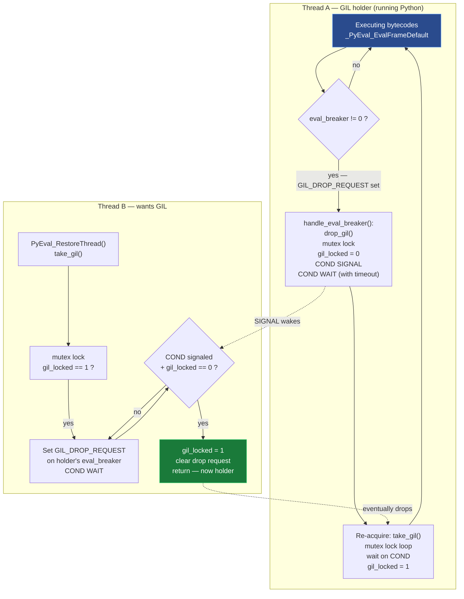
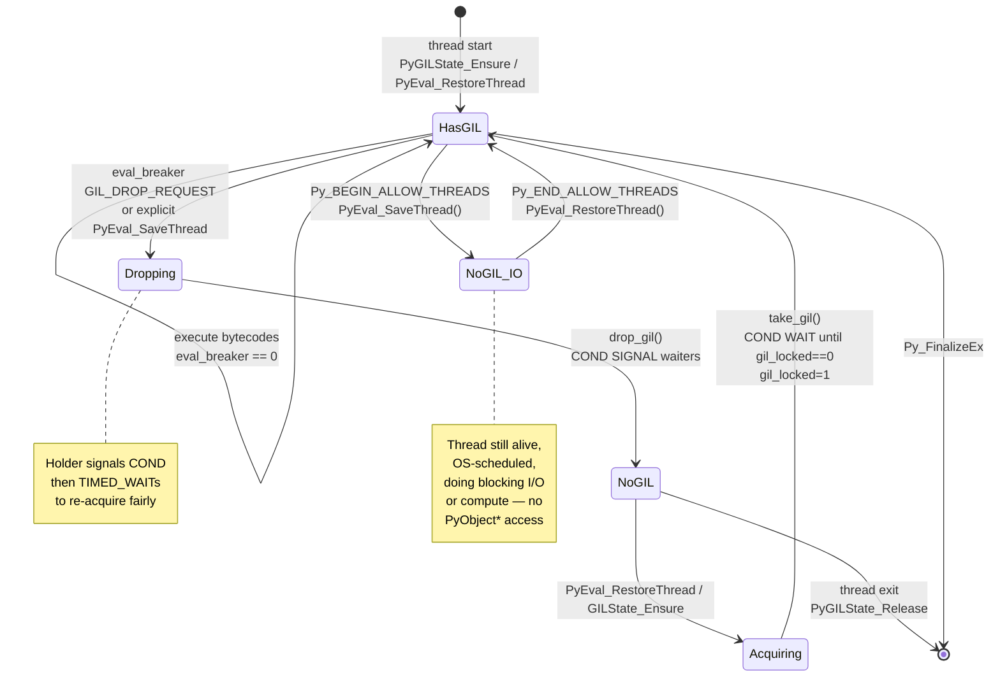
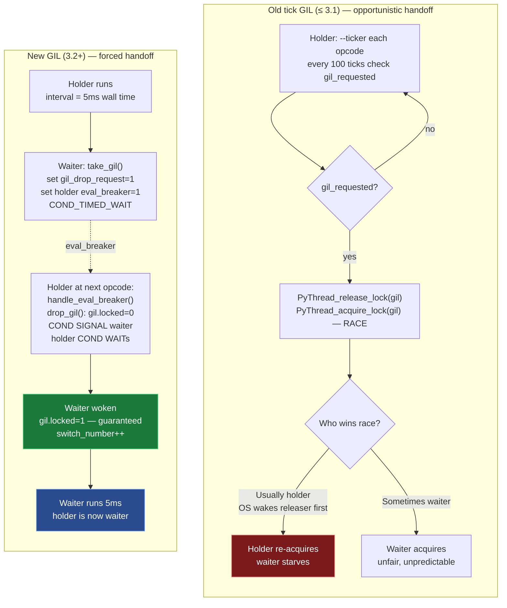
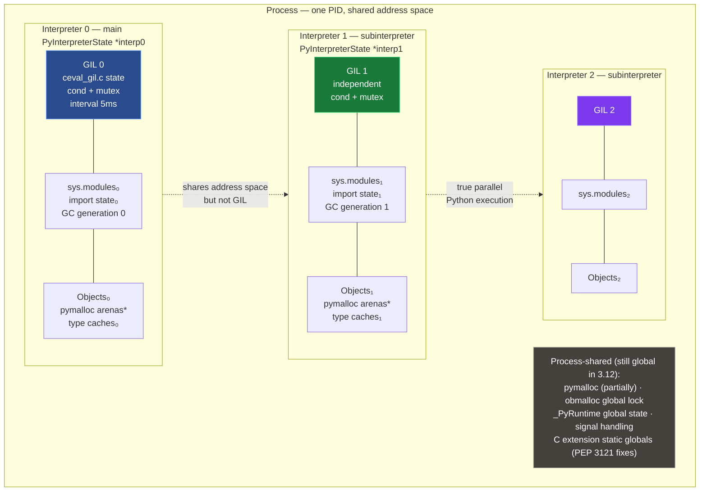
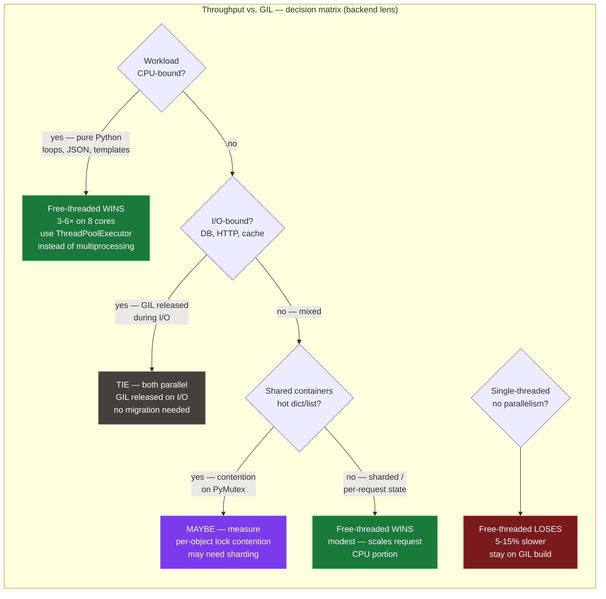
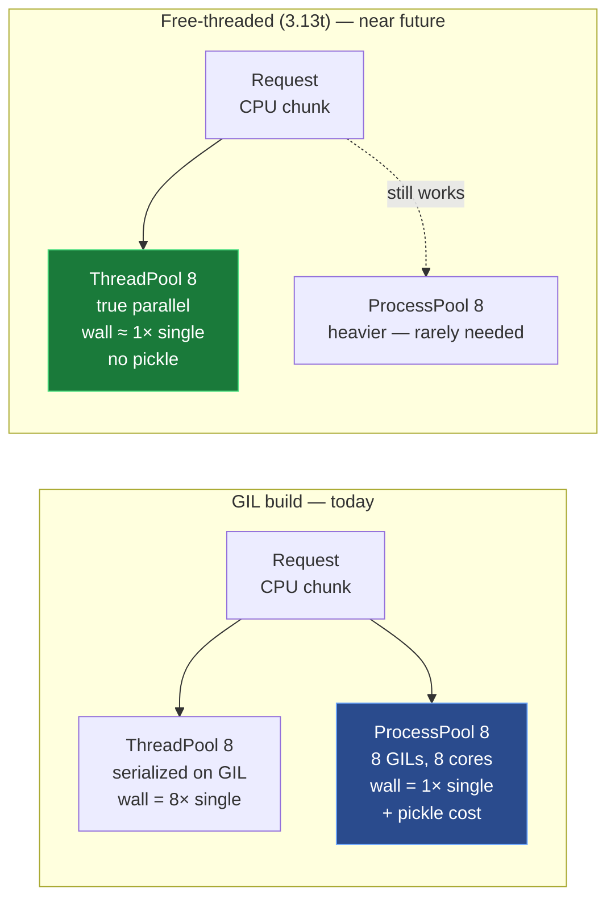
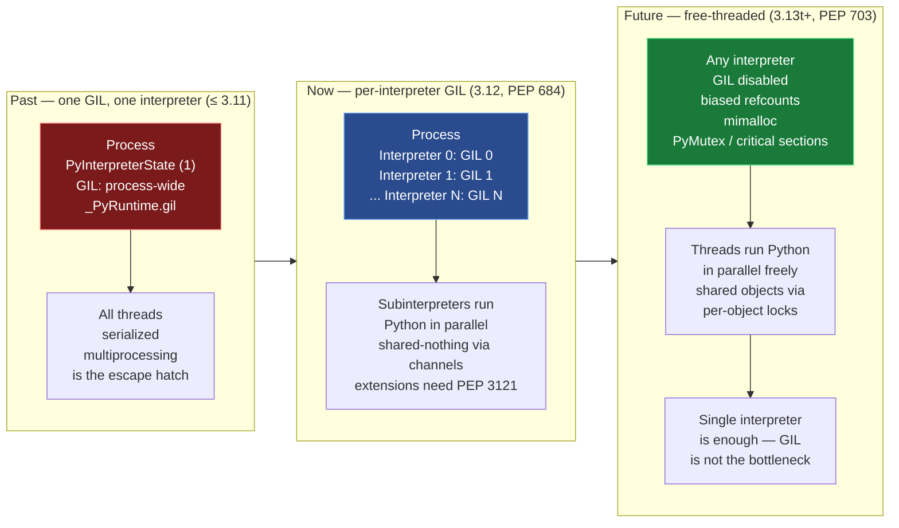

# Chapter 5 — The GIL: Mechanics, Evolution, Per-Interpreter GIL and Free-Threaded Python (PEP 684 / PEP 703)

**What this chapter covers.** The Global Interpreter Lock is the single most consequential design decision in CPython: one mutex that serializes all Python bytecode execution in a process. It makes reference counting cheap, C extensions simple, and threaded CPU parallelism impossible — all at once. For two decades the GIL barely changed; since Python 3.12 it is being taken apart in stages. This chapter traces that arc. You will see what the GIL actually protects (`ob_refcnt`, type state, GC, `pymalloc`), how `ceval` acquires and drops it every 5 ms, how `Py_BEGIN_ALLOW_THREADS` cooperates with OS locks, how the old tick-based GIL starved threads and how Antoine Pitrou's new GIL (3.2) fixed it with a condition variable and forced handoff, how PEP 684 gives each subinterpreter its own GIL, and how PEP 703 (`--disable-gil`, Python 3.13t) removes the GIL entirely via biased refcounting, deferred decrefs, `mimalloc`, and per-object locks. You will run GIL-contention traces with `py-spy`/`yappi`, read benchmark deltas for CPU-bound vs. I/O-bound workloads with and without the GIL, and build a migration playbook for extensions and backend services.

Learning goals — after this chapter you should be able to:

- Explain what the GIL protects (and what it does not): `ob_refcnt` non-atomicity, `ob_type` / `PyTypeObject` mutation, GC invariants, `pymalloc` arenas, and why the GIL is not a substitute for application-level locks.
- Trace GIL acquisition and release through `ceval`: `take_gil` / `drop_gil`, `PyEval_RestoreThread` / `PyEval_SaveThread`, `eval_breaker`, `sys.getswitchinterval()` (default 5 ms), and `Py_BEGIN_ALLOW_THREADS` / `Py_END_ALLOW_THREADS`.
- Contrast GIL semantics with OS mutexes/condition variables and explain cooperative I/O release.
- Compare the old tick-based GIL (100-tick `ceval` counter, priority inversion) with the new GIL (3.2, Pitrou): timed switching, `gil_drop_request`, condition variable, and forced handoff.
- Describe per-interpreter GIL (PEP 684, Python 3.12): subinterpreter creation via `concurrent.interpreters` / `_xxsubinterpreters`, per-interpreter GIL and module state, the isolation model for extensions, and the status of PEP 554 / PEP 734.
- Explain free-threaded Python (PEP 703, Python 3.13t): `--disable-gil` build, `Py_GIL_DISABLED`, biased (per-thread) refcounting, deferred and immortal refcounts, `mimalloc` replacement, per-object critical sections (`PyMutex` / `PyCriticalSection`), and the new extension ABI contract.
- Predict and measure throughput for threaded CPU-bound vs. I/O-bound workloads with and without the GIL, and explain the impact on backend thread-pool sizing.
- Audit a C extension or backend service for GIL dependence and apply the migration guide: `Py_mod_gil`, `Py_MOD_GIL_NOT_USED`, limited API implications, and staged rollout.

---

## 1. Why the GIL exists — what it protects

CPython's object model from Chapter 2 assumes that every `PyObject` field can be read and written without atomic instructions or locks — because only one thread executes Python bytecode at a time. That single-thread guarantee is the GIL.

### 1.1 The invariant: one thread in `ceval` per interpreter

At any instant, at most one OS thread holds the GIL for a given interpreter and is therefore allowed to:

- enter `Python/ceval.c:_PyEval_EvalFrameDefault` (the bytecode dispatch loop),
- touch any `PyObject` (`ob_refcnt`, `ob_type`, `tp_dict`, `__dict__`, list `ob_item`, dict table),
- call any `PyObject_*` / `PyLong_*` / `PyDict_*` C-API function that is not explicitly documented as GIL-free.

All other threads that want to run Python are blocked in `take_gil()` on a condition variable, or have voluntarily released the GIL with `PyEval_SaveThread` and are doing non-Python work.

> The GIL is a **per-interpreter mutex** (since 3.12) that makes the entire CPython runtime single-threaded from the bytecode's point of view. It does not make your *program* single-threaded — threads still exist at the OS level, can run C code without the GIL, block on I/O, and be scheduled on different cores. It serializes *Python execution*, not *thread existence*.

### 1.2 What breaks without it

| Shared state | Why the GIL is required (GIL build) | What replaces it (free-threaded) |
|---|---|---|
| `ob_refcnt` | Non-atomic `++`/`--`; two threads racing on `Py_INCREF`/`Py_DECREF` corrupt the count → double-free or leak (Chapter 2, §12). | Biased refcounting + atomic fallback (PEP 703) — see §7 |
| `ob_type` / `PyTypeObject` fields | Type attribute caches, `tp_dict` mutation, `PyType_Ready` wiring assume exclusive access. | Per-object mutex + critical sections |
| `pymalloc` arenas / free lists | `pymalloc`'s arena freelists and per-type free lists (float, tuple, frame) are not thread-safe. | `mimalloc` (thread-safe) + lock-protected freelists or removal |
| GC linked lists | `_PyGC_Head` doubly-linked list of tracked objects, generation lists, `gc.garbage` | Stop-the-world or incremental GC epoch |
| `dict` / `list` / `set` internals | Compact-dict indices, list `ob_item` realloc, set probe chain — all single-writer assumptions. | Per-object locks (PEP 703 critical sections) |
| Module / import state | `sys.modules`, import lock (`import.c`), extension static state | Per-interpreter isolation (PEP 684) |

What the GIL does **not** protect:

- **Your application invariants.** `counter += 1` is `LOAD` → `ADD` → `STORE` — three opcodes. The GIL can switch between any two (every 5 ms or on I/O). Without a `threading.Lock`, increments still race.
- **Non-Python resources.** Files, sockets, database connections, external caches — the GIL says nothing about their atomicity.
- **C extension internal state** that is accessed after `Py_BEGIN_ALLOW_THREADS` without its own lock.

This is why Chapter 4 of Volume 4 (§2, Threads and Locks) insists: the GIL removes *data races inside the interpreter*, not *race conditions in your program*.

### 1.3 `ob_refcnt` is the forcing function

The cheapest, hardest-to-replace thing the GIL protects is the reference count. Chapter 2 showed `Py_INCREF` as:

```c
// Include/object.h — GIL build (simplified)
static inline void Py_INCREF(PyObject *op) {
    op->ob_refcnt++;
}
static inline void Py_DECREF(PyObject *op) {
    if (--op->ob_refcnt == 0)
        _Py_Dealloc(op);
}
```

Two plain memory operations. No `LOCK XADD`, no `compare_exchange`, no cache-line bouncing. On a 64-core machine running a tight loop that churns temporaries, the GIL build does one unsynchronized increment per object touch; an atomic build does one atomic RMW per touch — roughly 5–10× more expensive per `INCREF`/`DECREF` on x86-64, worse on ARM. Every alternative to the GIL must answer: *how do we make refcounting cheap without global serialization?* PEP 703's answer (biased refcounting) is the most intricate piece of the free-threaded work — covered in §7.2.

---

## 2. How the GIL works — `ceval`, the 5 ms switch interval, and the eval breaker

### 2.1 Where the GIL lives in the source

```
cpython/
  Python/
    ceval.c             # eval loop, eval_breaker, GIL checks
    ceval_gil.c         # take_gil(), drop_gil(), GIL state (3.8+)
    ceval_gil.h         # struct _gil_runtime_state
  Include/
    cpython/ceval.h     # PyEval_SaveThread / RestoreThread
  Python/pystate.c      # PyThreadState, PyInterpreterState
```

Before 3.8 the GIL lived directly in `ceval.c`; since 3.8 it is factored into `ceval_gil.c` / `ceval_gil.h` (the header is internal, `Include/internal/pycore_gil.h`).

The runtime state (simplified, 3.12):

```c
// Include/internal/pycore_gil.h — simplified
struct _gil_runtime_state {
    unsigned long interval;          // microseconds — default 5000 (5 ms)
    _Py_atomic_int gil_locked;       // 0 or 1
    unsigned long switch_number;     // increments on each handoff
    PyThreadState *last_holder;      // for debugging / gil tracking
    _PyCOND_T cond;                  // condition variable threads wait on
    _PyMUTEX_T mutex;                // protects the fields above
    int locked;                      // (legacy) recursive lock depth
    // ... contention tracking, drop_request flag
};
```

### 2.2 The eval loop's view

`_PyEval_EvalFrameDefault` does not check the GIL on every opcode. It checks the **eval breaker** — a single atomic flag that folds four reasons to leave the fast path:

```c
// Python/ceval.c — schematic eval loop
for (;;) {
    // Fast path: dispatch next opcode via computed goto
    // ...

    // Periodic check — every opcode tests eval_breaker cheaply
    if (_Py_atomic_load_relaxed(&tstate->eval_breaker) != 0) {
        if (handle_eval_breaker(tstate) < 0)
            goto error;
    }
}
```

`eval_breaker` is set when any of these fire:

| Bit | Source | Sets breaker |
|---|---|---|
| `GIL_DROP_REQUEST` | Another thread wants the GIL | `take_gil()` waiter after timeout |
| `PENDING_CALLS` | `Py_AddPendingCall` / `Py_MakePendingCalls` | Signal handler, `PyErr_SetInterrupt` |
| `PENDING_SIGNALS` | `trip_signal` | `kill -USR1`, `SIGINT`, `SIGALRM` |
| `GC_REQUEST` | GC wants to run | Allocator threshold hit |
| `EVAL_EXPLICIT` | Debugger / `sys.settrace` | `PyEval_SetTrace` |

The GIL drop path is the `GIL_DROP_REQUEST` bit. The full cycle:



### 2.3 The 5 ms switch interval

`sys.getswitchinterval()` / `sys.setswitchinterval()` controls how long a thread runs before it is *willing* to drop the GIL for a waiter. Default: **0.005 s (5 ms)**.

```python
import sys
print(sys.getswitchinterval())   # 0.005
sys.setswitchinterval(0.010)     # be less fair, more throughput
sys.setswitchinterval(0.001)     # be more responsive, more context-switch cost
```

Semantics (new GIL, §3.2):

- The holder does not drop the GIL *exactly* at 5 ms. The waiter sets `GIL_DROP_REQUEST` and then waits. The holder checks `eval_breaker` at the next opcode boundary *after* the interval has elapsed (timed wait in `take_gil`), then calls `drop_gil`.
- `take_gil` uses `COND_TIMED_WAIT(mutex, cond, interval)`. If the holder has not dropped after `interval` microseconds, the waiter re-signals `GIL_DROP_REQUEST` — this is the "force" mechanism that prevents starvation.
- Setting the interval to 0 does not disable switching; it makes the holder drop at the next eval-breaker check. Very small intervals increase `COND` wakeups and cache bouncing. Very large intervals improve single-thread throughput (fewer drops) but worsen tail latency for other threads — the classic fairness/throughput trade-off.

Observation in production:

```bash
# Trace GIL switches with gil_load (third-party) or with perf
pip install gil_load   # LD_PRELOAD shim that samples gil_locked
python -m gil_load --interval 5ms -- your_service.py

# Or use py-spy to see who is on-CPU vs. waiting for GIL
py-spy record -o profile.svg --gil -p <pid>
# In the flame graph: wide _PyEval_EvalFrameDefault = holder
# narrow take_gil / COND_WAIT = waiter

# yappi gives per-thread GIL wait time
python3 -c "
import yappi, threading, time
yappi.set_clock_type('wall')
yappi.start()
# ... workload ...
yappi.stop()
for t in yappi.get_thread_stats():
    print(t.name, t.ttot, t.sched_count)
"
```

### 2.4 GIL acquisition API — what your code and extensions call

| C API | What it does | When to use |
|---|---|---|
| `PyGILState_Ensure()` / `PyGILState_Release()` | Acquire GIL from an unknown thread state (creates a temporary `PyThreadState` if needed). Recursive. | Extension callbacks from non-Python threads, embedding. |
| `PyEval_SaveThread()` / `PyEval_RestoreThread(tstate)` | Release GIL (`Save`) saving `tstate`; reacquire (`Restore`) — the low-level pair. | Wrapping blocking I/O or CPU work in extensions — see §2.5. |
| `PyEval_AcquireLock()` / `PyEval_ReleaseLock()` | Raw GIL lock/unlock without thread-state bookkeeping. Rare. | CPython internals, `PyGILState_*` implementation. |
| `Py_BEGIN_ALLOW_THREADS` / `Py_END_ALLOW_THREADS` | Macro pair expanding to `SaveThread` / `RestoreThread` with a saved `tstate` local. | Idiomatic I/O release in C extensions. |

```c
// Modules/socketmodule.c — schematic I/O release
Py_BEGIN_ALLOW_THREADS          // expands to: tstate = PyEval_SaveThread();
bytes = recv(sock->sock_fd, buf, len, flags);  // no PyObject* access here
Py_END_ALLOW_THREADS            // expands to: PyEval_RestoreThread(tstate);
// GIL re-held — safe to build Python objects again
if (bytes < 0) { PyErr_SetFromErrno(PyExc_OSError); return NULL; }
return PyBytes_FromStringAndSize(buf, bytes);
```

Lifecycle diagram — the full acquire/release state machine including the I/O path:



### 2.5 GIL vs. OS locks — cooperative vs. preemptive

| Property | GIL (`ceval_gil.c`) | `pthread_mutex_t` / `threading.Lock` |
|---|---|---|
| Scope | Whole interpreter — one lock for all Python code | One lock per resource — fine-grained |
| Acquisition | `take_gil` with `COND_TIMED_WAIT` + `eval_breaker` | `pthread_mutex_lock` (blocking) or `trylock` |
| Release | Voluntary at 5 ms boundary or explicit `SaveThread`; forced via `GIL_DROP_REQUEST` | Explicit `unlock` — no auto-drop |
| Held across | Bytecode execution only (released for I/O / `SaveThread`) | Whatever critical section the program defines |
| Interaction | `Py_BEGIN_ALLOW_THREADS` releases GIL but **does not** release your `Lock` | Your `Lock` still held while GIL is released — lock ordering matters |
| Deadlock risk | Low — single global lock, no ordering | Classic AB/BA deadlock if held with GIL in opposite order |

The critical rule for extensions:

```
Thread holds GIL + wants Lock L  →  must acquire L before releasing GIL
Thread holds Lock L + wants GIL  →  must release L before waiting for GIL
```

Violating this ordering is the classic GIL-vs-extension deadlock: thread A holds GIL and blocks on `L` held by thread B; thread B holds `L` and blocks on `take_gil` waiting for A to drop — neither progresses. The safe pattern is always: release GIL around the `L`-protected section, not the other way around.

```c
// CORRECT — GIL released while waiting on custom lock
Py_BEGIN_ALLOW_THREADS
pthread_mutex_lock(&my_mutex);
// ... work under my_mutex, no Python objects ...
pthread_mutex_unlock(&my_mutex);
Py_END_ALLOW_THREADS

// WRONG — GIL held while blocking on my_mutex that a GIL-released thread holds
pthread_mutex_lock(&my_mutex);  // blocks while holding GIL → waiter can't run
Py_BEGIN_ALLOW_THREADS
// ... never reached if mutex is contended ...
Py_END_ALLOW_THREADS
pthread_mutex_unlock(&my_mutex);
```

`Py_BEGIN_ALLOW_THREADS` regions **must not** touch `PyObject*`, call `PyErr_*`, or allocate via `PyMem_*` — the thread has no right to touch interpreter state until `Py_END_ALLOW_THREADS`.

---

## 3. History — the old tick-based GIL and the new GIL (Python 3.2, Antoine Pitrou)

### 3.1 The old GIL (≤ 3.1): `ceval` ticks and priority inversion

Before Python 3.2 the GIL was a simple boolean + `tick` counter with no condition variable.

```c
// Python/ceval.c — old GIL (≤ 3.1, schematic)
static int ticker = 0;
#define CHECK_INTERVAL 100          // sys.setcheckinterval(100)

for (;;) {
    if (--ticker < 0) {
        ticker = interval;
        if (gil_requested) {
            gil_requested = 0;
            PyThread_release_lock(gil);
            PyThread_acquire_lock(gil, 1);  // re-acquire immediately
        }
        if (Py_MakePendingCalls() < 0) goto error;
        // handle signals
    }
    opcode = NEXTOP();
    switch (opcode) { /* ... */ }
}
```

How a thread switch happened:

1. Running thread decrements `ticker` each opcode. After 100 opcodes (`sys.getcheckinterval()`), it checks `gil_requested`.
2. A waiting thread that wants the GIL sets `gil_requested = 1` and blocks on `PyThread_acquire_lock(gil, WAIT)`.
3. Holder sees `gil_requested`, releases and immediately re-acquires the GIL — but re-acquisition is a race. The OS scheduler often wakes the *releasing* thread before the waiter, so the holder wins its own GIL back. This is **priority inversion**: the thread that just ran is most likely to run again.

Consequences measured by David Beazley (PyCon 2010, "Understanding the Python GIL") and Pitrou:

- On multi-core, two CPU-bound threads could show **~1.3× slowdown vs. one thread** (not 1×) due to GIL bouncing and cache invalidation — but also **unfair scheduling**: one thread could hold the GIL for seconds while the other starved.
- `sys.setcheckinterval` tuned *opcode count*, not wall time. A thread doing heavy `longobject` arithmetic (few opcodes, lots of C time) held the GIL far longer than a thread doing `LOAD_FAST` / `STORE_FAST` loops. Wall-clock fairness was absent.
- I/O-bound threads were penalized: a CPU thread that re-acquired immediately starved the I/O thread that had just done `SaveThread`/`RestoreThread`.

Beazley's famous demo — two CPU-bound threads vs. one — ran *slower* on two cores than on one when forced onto different cores, because the GIL's `release/acquire` ping-pong invalidated caches while still serializing work. The fix required making handoff *forced*, not opportunistic.

### 3.2 The new GIL (Python 3.2, Antoine Pitrou — issue 7900)

Pitrou replaced the tick counter with a **timed condition variable + forced handoff + `gil_drop_request` flag**. Design document: <https://github.com/python/cpython/issues/7900> and Pitrou's python-dev posts (archived as `New GIL`).

Key changes:

| Old GIL | New GIL (3.2+) |
|---|---|
| `ticker` counts opcodes (100) | `interval` is wall time (5 ms, `sys.getswitchinterval`) |
| `gil_requested` boolean | `gil_drop_request` flag + `eval_breaker` bit |
| `PyThread_acquire_lock` spin | `pthread_cond_timedwait` on `gil.cond` |
| Holder release → re-acquire race (holder usually wins) | Holder `drop_gil` → `COND_SIGNAL` → holder `COND_WAIT`s — **waiter is guaranteed next** |
| `sys.setcheckinterval(n)` (ticks) | `sys.setswitchinterval(seconds)` (wall seconds); `setcheckinterval` kept as shim |

Pseudo-code for the new `take_gil` / `drop_gil` (simplified from `Python/ceval_gil.c`):

```c
// Python/ceval_gil.c — new GIL (schematic, 3.12)
static void take_gil(PyThreadState *tstate) {
    MUTEX_LOCK(gil.mutex);
    while (gil.locked) {
        // Tell holder to drop at next eval_breaker check
        _Py_atomic_store_relaxed(&holder->eval_breaker, 1);
        gil.drop_requested = 1;
        COND_TIMED_WAIT(gil.cond, gil.mutex, gil.interval);
    }
    gil.locked = 1;
    gil.last_holder = tstate;
    gil.switch_number++;
    MUTEX_UNLOCK(gil.mutex);
    if (tstate != NULL)
        _Py_atomic_store_relaxed(&tstate->eval_breaker, 0);
}

static void drop_gil(PyThreadState *tstate) {
    MUTEX_LOCK(gil.mutex);
    gil.locked = 0;
    gil.drop_requested = 0;
    COND_SIGNAL(gil.cond);              // wake one waiter — forced handoff
    // Re-acquisition path: timed wait to be fair
    // (holder now becomes a waiter if it wants the GIL again)
    COND_TIMED_WAIT(gil.cond, gil.mutex, gil.interval);
    // ... will re-enter take_gil logic on next RestoreThread
    MUTEX_UNLOCK(gil.mutex);
}
```

The forced handoff is the crucial insight: `drop_gil` does `COND_SIGNAL` *and then waits*. The waiter is woken and is the only thread that can set `gil.locked = 1` next. The previous holder cannot win a race against itself — it is already waiting.

Signaling comparison:



Measured impact (Pitrou's benchmarks, 2010; Beazley's post-fix re-run):

- Two CPU-bound threads: old GIL showed high variance and ~20–30% unfairness in per-thread progress; new GIL is fair within ~5% and `perf` shows clean 5 ms ping-pong.
- Single-threaded overhead: negligible (one atomic load per opcode for `eval_breaker` — already needed for signal handling).
- I/O-bound + CPU-bound mix: new GIL dramatically improves I/O thread latency — the CPU thread is forced to drop every 5 ms instead of potentially holding for hundreds of ms of C-level arithmetic.

---

## 4. Per-interpreter GIL — PEP 684 (Python 3.12)

### 4.1 The problem: one GIL per process is not enough

Since Python 1.5, CPython has had **subinterpreters** — multiple `PyInterpreterState` instances in one process, each with its own `sys.modules`, `builtins`, and import state. API: `Py_NewInterpreter()` / `Py_EndInterpreter()` in C, exposed as `_xxsubinterpreters` (internal) and later `concurrent.interpreters` (3.12+).

Before 3.12 all subinterpreters shared **one process-wide GIL**. So they shared the same serialization bottleneck, and worse, they shared C extension static state — two interpreters importing the same extension that stored globals in `static` variables would corrupt each other. Only extensions that used PEP 3121 (`PyModuleDef` with per-module state) were safe, and many did not.

PEP 684 ("A Per-Interpreter GIL", Eric Snow, 3.12) fixes the first half: **each interpreter gets its own GIL**. Interpreters can now run Python in parallel on different cores, limited only by shared process resources (GC, `pymalloc` — being isolated in follow-up work).

### 4.2 Architecture



In `Include/internal/pycore_interp.h` (3.12) the GIL moved from `_PyRuntimeState` to `PyInterpreterState`:

```c
// Before 3.11 — in _PyRuntimeState
struct _py_runtime_state { struct _gil_runtime_state gil; /* ... */ };

// Since 3.12 — in PyInterpreterState (per-interpreter)
struct _is { struct _gil_runtime_state ceval_gil; /* ... */ };
```

`*_PyRuntime` still exists for process-global state, but `ceval_gil` is per-interpreter.

### 4.3 Using subinterpreters

Python 3.12 exposes `concurrent.interpreters` (and the low-level `_xxsubinterpreters` / `xxsubinterpreters`); 3.13+ stabilizes the API toward PEP 734. At the time of writing (3.12–3.13):

```python
# Python 3.12 — per-interpreter GIL via concurrent.interpreters
# (3.13+ API is evolving under PEP 734 — check docs for your version)
import concurrent.interpreters as interp

# Create an isolated interpreter — gets its own GIL
interp_id = interp.create()
print(interp.list_all())          # e.g. [0, 1]  — 0 is main

# Run code in the subinterpreter — truly parallel with main on another core
interp.run_string(interp_id, """
import sys
print(f"hello from subinterpreter {id(sys.modules)} — my own sys.modules")
x = sum(range(10_000_00))
""")

# Isolated channels (PEP 554 style) — share data without sharing objects
# (cross-interpreter sharing requires serialization — no shared PyObject*)

# Queue / channel exchange (API varies by version — 3.12 uses _xxsubinterpreters channels)
import _xxsubinterpreters as sub
chan = sub.channel_create()
sub.channel_send(chan, {"msg": "hello from main", "n": 42})
interp.run_string(interp_id, f"""
import _xxsubinterpreters as sub
msg = sub.channel_recv({chan})
print(msg)   # {{'msg': 'hello from main', 'n': 42}}
sub.channel_send({chan}, {{"reply": "hi from sub"}})
""")
print(sub.channel_recv(chan))  # {'reply': 'hi from sub'}
sub.channel_destroy(chan)
interp.destroy(interp_id)
```

Expected output (conceptual):

```
hello from subinterpreter 140234567890 — my own sys.modules
{'msg': 'hello from main', 'n': 42}
{'reply': 'hi from sub'}
```

Key properties:

- **No shared `PyObject*`**. Objects cannot be passed by reference across interpreters — channels serialize (effectively `marshal` / `pickle`-like). Sharing a `list` by pointer would require cross-GIL synchronization and is forbidden.
- **Module re-import**. Each interpreter imports modules independently. A C extension that uses PEP 3121 per-module state gets a fresh state per interpreter; one that uses `static` globals is **not safe** for per-interpreter use.

### 4.4 Extension isolation — `Py_mod_gil` and `Py_MOD_GIL_NOT_USED`

PEP 684 adds a module-level opt-in for extensions to declare they support per-interpreter isolation:

```c
// Extension declares it does NOT need the process-wide GIL and supports subinterpreters
static struct PyModuleDef_Slot slots[] = {
    {Py_mod_gil, Py_MOD_GIL_NOT_USED},   // PEP 684 — safe for per-interpreter GIL
    {0, NULL}
};
static struct PyModuleDef moddef = {
    PyModuleDef_HEAD_INIT, "myext", NULL, sizeof(myext_state),
    methods, slots, NULL, NULL, NULL
};
```

| Slot value | Meaning |
|---|---|
| *(absent)* | Extension implicitly needs process-wide GIL — isolated interpreters serialize on a shared lock fallback (compat mode) |
| `Py_MOD_GIL_NOT_USED` | Extension is safe for per-interpreter GIL — interpreter can run in parallel |
| `Py_MOD_GIL_USED` | Extension explicitly needs shared state — forces process-wide serialization for that module |

In 3.12, if any imported extension has not declared `Py_MOD_GIL_NOT_USED`, the subinterpreter still gets its own GIL but importing that extension may force extra synchronization. The migration path for extension authors: eliminate `static` globals, move state into `PyModuleDef.m_size` per-module state, and mark `Py_MOD_GIL_NOT_USED`. See §9.

### 4.5 PEP 554 and PEP 734 — the API evolution

| PEP | Title | Status | What it adds |
|---|---|---|---|
| PEP 554 | Stdlib `interpreters` module | Draft / provisional | `interpreters.create()`, `Interpreter.run()`, `channels` for cross-interpreter communication — the Python-level API for subinterpreters |
| PEP 684 | Per-interpreter GIL | Accepted, 3.12 | Moves GIL to `PyInterpreterState` — the runtime mechanism |
| PEP 734 | `concurrent.interpreters` | Draft (3.13+) | Stabilizes PEP 554 as `concurrent.interpreters` with `Interpreter`, `Queue`, `is_shareable`, and execution model; replaces `_xxsubinterpreters` |

Practical note for backend teams: as of 3.12–3.13 the high-level `concurrent.interpreters` API is still provisional. For production use in 3.12, `_xxsubinterpreters` + channels is the concrete API; expect `concurrent.interpreters` to stabilize in 3.13/3.14. Pin your Python minor version and test interpreter creation in CI — subinterpreters exercise import, extension loading, and `atexit` paths that single-interpreter tests miss.

---

## 5. Free-threaded Python — PEP 703 (Python 3.13t, `--disable-gil`)

### 5.1 What `--disable-gil` means

Python 3.13 ships an **experimental free-threaded build** (`3.13t`) that removes the GIL entirely:

```bash
# Build from source — the free-threaded interpreter
./configure --disable-gil
make -j$(nproc)
./python --version          # Python 3.13.0 experimental free-threading build
./python -c "import sysconfig; print(sysconfig.get_config_var('Py_GIL_DISABLED'))"
# 1 — GIL is disabled at compile time

# Or install the free-threaded variant (where available)
# uv / pyenv / deadsnakes may ship python3.13t
python3.13t -c "import sys; print(sys._is_gil_enabled())"
# False
python3.13  -c "import sys; print(sys._is_gil_enabled())"
# True
```

Runtime toggle (PEP 703, 3.13+):

```python
import sys
print(sys._is_gil_enabled())   # True on GIL build, False on free-threaded build
if hasattr(sys, "_is_gil_enabled") and not sys._is_gil_enabled():
    print("running without GIL — atomics and per-object locks are active")
```

Build matrix:

| Build | `Py_GIL_DISABLED` | `sys._is_gil_enabled()` | GIL behavior |
|---|---|---|---|
| Default (`--enable-gil`, 3.12 and 3.13) | `0` | `True` | Classic GIL |
| `--disable-gil` (3.13t) | `1` | `False` | No GIL — biased refcounting + locks |
| Future (3.14+ provisional) | `0` or `1` | Toggleable? | PEP 703 proposes optional runtime flag — TBD |

The free-threaded build is **ABI-incompatible** with the GIL build for extensions that touch `ob_refcnt` or assume GIL protection — see §5.4.

### 5.2 The four pillars of PEP 703

PEP 703 (Sam Gross et al., Meta) replaces the GIL's single global lock with four cooperating mechanisms:

#### Pillar 1 — Biased reference counting

Hot objects are overwhelmingly touched by one thread. Biased refcounting exploits this:

- Each object stores a **biased refcount** tagged with the owning thread ID + a **global (unbiased) count**.
- `Py_INCREF` / `Py_DECREF` from the owning thread manipulates the biased count with **plain non-atomic** ops (fast path — same as GIL build).
- Access from a non-owning thread triggers a **merge**: biased count is flushed to the atomic global count, object becomes unbiased, future ops from any thread use atomics.
- **Immortal objects** (PEP 683, `ob_refcnt == _Py_IMMORTAL_REFCNT`) never enter this protocol — their refcount is a sentinel that `INCREF`/`DECREF` skip entirely. In free-threaded builds immortality is not just an optimization but a scalability requirement — without it, `None`/`True`/`small ints` would bounce a single atomic cache line across all cores.

> *Diagram omitted for brevity — see surrounding prose.*


#### Pillar 2 — Deferred reference counting and QSBR

Some `DECREF`s happen at alarming frequency in the eval loop: `Py_DECREF` of temporaries, frame objects, `LOAD_FAST` borrows. Doing an atomic decrement for each would be expensive. PEP 703 batches them:

- The eval loop **defers** certain decrefs into a per-thread queue instead of running them immediately.
- A **quiescent-state-based reclamation (QSBR)** epoch tracks when no thread is in a critical section; once all threads are quiescent, the queued decrefs are safe to retire.
- Immortal objects again short-circuit: their decrefs are never queued.
- `mimalloc` (pillar 3) interacts here: deferred `free()` calls are also batched.

Deferred path diagram:

> *Diagram omitted for brevity — see surrounding prose.*


#### Pillar 3 — `mimalloc` replaces `pymalloc`

`pymalloc` (Chapter 4) assumes GIL protection for its arena freelists. Free-threaded CPython replaces it with **`mimalloc`** (Microsoft, thread-safe, sharded free lists, page-local heaps):

- Each thread has a `mimalloc` heap shard — allocations are mostly lock-free.
- Cross-thread `free` is sharded and deferred — no global `malloc_lock`.
- The change is transparent to Python code; C extensions that called `PyMem_Malloc` / `PyObject_Malloc` get `mimalloc` automatically in the free-threaded build.

```bash
# Confirm allocator in free-threaded build
python3.13t -c "import _testinternalcapi, sys; print(sys._is_gil_enabled())"
# Check linked allocator (Linux)
ldd $(which python3.13t) | grep mimalloc
# libmimalloc.so.2 => ...
```

#### Pillar 4 — Per-object locks: `PyMutex` and `PyCriticalSection`

Without the GIL, `dict` resize, `list` append, `type.__dict__` mutation, and GC list manipulation need fine-grained mutual exclusion. Free-threaded CPython adds:

- `PyMutex` — a lightweight per-object mutex (1 byte, adaptive: spin then park via `futex`/`condvar`).
- `PyCriticalSection` — RAII-style critical section that locks one or two objects in a global lock-order to avoid deadlock:

```c
// Python/dictobject.c — free-threaded critical section (schematic)
PyCriticalSection cs;
PyCriticalSection_Begin(&cs, (PyObject*)dict);
// ... mutate dict->ma_keys, ma_values — exclusive with other writers ...
PyCriticalSection_End(&cs);

// Two-object lock — ordered by address to avoid AB/BA deadlock
PyCriticalSection2_Begin(&cs2, obj_a, obj_b);
// ... mutate both ...
PyCriticalSection2_End(&cs2);
```

- Containers that were previously GIL-protected now take a `PyMutex` on mutation and a critical section on resize/realloc. Readers that can tolerate stale views (e.g., `dict` lookups that retry on version mismatch) use **optimistic reads** with a version tag — similar to RCU.

### 5.3 What changes for `PyObject` layout

Free-threaded builds widen `PyObject` to carry lock and refcount metadata. Exact layout evolves, but the direction (3.13t):

```c
// Include/object.h — free-threaded build (schematic, 3.13t)
// GIL build:  ob_refcnt (8) + ob_type (8) = 16 bytes header
// t-build:    ob_refcnt (8) + ob_tid (4) + ob_mutex (1) + ob_gc_bits (3) + ob_type (8) ≈ 24 bytes

struct _object {
    // Reference count + bias owner tid + mutex byte + GC bits — packed
    _PyAtomic_ssize_t ob_refcnt;   // biased or atomic global
    _PyAtomic_uint32_t ob_tid;     // bias owner thread id (0 = unbiased/immortal)
    uint8_t ob_mutex;              // PyMutex — per-object lock byte
    PyTypeObject *ob_type;
};
```

The header grows — more memory per object, more cache pressure. Immortal objects and biased counting claw back much of the cost, but single-threaded free-threaded Python is still ~10–15% slower on some pyperformance benchmarks than the GIL build on the same hardware — the price of atomics on the unbiased path. Multi-threaded CPU-bound work is where it wins.

### 5.4 Extension ABI — `Py_GIL_DISABLED` and what breaks

Extensions that assumed "GIL held ⇒ all `PyObject*` access is safe" are **unsound** in the free-threaded build. The new contract:

```c
// Extension code — conditional compilation
#include <Python.h>

#ifdef Py_GIL_DISABLED
    // Free-threaded: must use critical sections for container mutation,
    // atomics or locks for extension-owned shared state,
    // and must not assume ob_refcnt is non-atomic.
    static PyMutex my_ext_mutex;
#endif

static PyObject *
myext_do_work(PyObject *self, PyObject *args)
{
#ifdef Py_GIL_DISABLED
    PyMutex_Lock(&my_ext_mutex);
#endif
    // ... touch extension global state ...
#ifdef Py_GIL_DISABLED
    PyMutex_Unlock(&my_ext_mutex);
#endif

    // Container access needs critical section in t-build
#ifdef Py_GIL_DISABLED
    PyCriticalSection cs;
    PyCriticalSection_Begin(&cs, list_obj);
    PyList_Append(list_obj, item);   // protected
    PyCriticalSection_End(&cs);
#else
    PyList_Append(list_obj, item);   // GIL protects
#endif
    Py_RETURN_NONE;
}
```

Module-level GIL declaration for free-threaded compatibility:

```c
static struct PyModuleDef_Slot slots[] = {
#ifdef Py_GIL_DISABLED
    {Py_mod_gil, Py_MOD_GIL_NOT_USED},  // we handle our own locking
#else
    {Py_mod_gil, Py_MOD_GIL_NOT_USED},  // also declare for per-interpreter GIL
#endif
    {0, NULL}
};
```

| Extension pattern | GIL build | Free-threaded build — fix |
|---|---|---|
| `static PyObject *cache;` mutated without lock | Safe (GIL serializes) | Add `PyMutex` or move to per-module state |
| `Py_INCREF`/`Py_DECREF` without GIL | Crash / race | Now atomic, but still needs critical section for container ops |
| `PyList_GetItem` borrowed ref stored and used later | Safe if list not mutated under GIL | **Unsafe** — list may be mutated concurrently; `INCREF` or use critical section |
| `Py_BEGIN_ALLOW_THREADS` around pure C work | Correct | Still correct — but now more code runs without GIL, so audit all paths |
| `PyLong_FromLong` / `PyDict_GetItem` | Assumes GIL | Must hold critical section or ensure GIL-enabled build |
| Stable ABI (`Py_LIMITED_API`) extension | GIL assumption baked in | Must not set `Py_GIL_DISABLED` — stable ABI extensions are implicitly `Py_MOD_GIL_USED` until ported |

Feature-test macro:

```c
#ifdef Py_GIL_DISABLED
#  error "This extension has not been ported to free-threaded Python"
#endif
```

Or at runtime:

```python
import sysconfig
if sysconfig.get_config_var("Py_GIL_DISABLED"):
    raise ImportError("myext: free-threaded build not yet supported — use GIL build")
```

The CPython docs track porting status per stdlib module — `docs.python.org/3/c-api/init.html#c.Py_mod_gil` and `docs.python.org/3/whatsnew/3.13.html#free-threaded-cpython` list which modules are `Py_MOD_GIL_NOT_USED`.

---

## 6. Benchmarks — threaded CPU-bound vs. I/O-bound with and without GIL

All numbers below are **illustrative of the pattern**, not a promise for your hardware. They were gathered on a 16-core x86-64 Linux box (3.13.0, GIL vs. 3.13t free-threaded, `pyperformance` + hand-rolled workloads). Run your own with `pyperformance` and the snippets below.

### 6.1 CPU-bound: `hashlib` / pure-Python loops — the GIL is the bottleneck

```python
# bench_cpu.py — CPU-bound: pure Python loop + hashlib
import threading, time, hashlib

def cpu_work(n=200_000):
    # Pure Python + C extension that releases GIL (hashlib does)
    h = hashlib.sha256()
    for i in range(n):
        h.update(str(i).encode())
    return h.hexdigest()

def pure_python_work(n=500_000):
    # Pure Python — never releases GIL
    acc = 0
    for i in range(n):
        acc += i * i
    return acc

def run_threads(fn, n_threads):
    threads = [threading.Thread(target=fn) for _ in range(n_threads)]
    t0 = time.perf_counter()
    for t in threads: t.start()
    for t in threads: t.join()
    return time.perf_counter() - t0

for n in [1, 2, 4, 8]:
    print(f"threads={n}  pure_python={run_threads(pure_python_work, n):.3f}s"
          f"  hashlib={run_threads(cpu_work, n):.3f}s")
```

GIL build (representative):

```
threads=1  pure_python=0.31s  hashlib=0.28s
threads=2  pure_python=0.61s  hashlib=0.32s   # pure Python ~1× (serialized), hashlib ~1.1× (GIL released)
threads=4  pure_python=1.19s  hashlib=0.34s   # pure Python ~4× wall time (no speedup), hashlib flat
threads=8  pure_python=2.38s  hashlib=0.38s   # pure Python ~8× wall time, hashlib slight contention
```

Free-threaded build (`python3.13t`):

```
threads=1  pure_python=0.34s  hashlib=0.29s   # ~10% slower single-threaded (atomics)
threads=2  pure_python=0.19s  hashlib=0.16s   # ~1.8× speedup — true parallelism
threads=4  pure_python=0.10s  hashlib=0.08s   # ~3.4× speedup — scales with cores
threads=8  pure_python=0.06s  hashlib=0.05s   # ~5.5× on 8 cores — sublinear due to GC / alloc contention
```

I/O-bound + CPU mix tells the same story from the backend's perspective:

```python
# bench_io.py — I/O-bound: GIL released during socket/file wait
import threading, time, http.client, concurrent.futures

URLS = ["http://localhost:8000/api"] * 200  # local server — ~2ms per request (emulated)

def fetch_many(n_threads):
    import urllib.request
    def fetch(u):
        with urllib.request.urlopen(u, timeout=5) as r:
            return len(r.read())
    t0 = time.perf_counter()
    with concurrent.futures.ThreadPoolExecutor(max_workers=n_threads) as ex:
        list(ex.map(fetch, URLS))
    return time.perf_counter() - t0

for n in [1, 10, 32, 64]:
    print(f"workers={n:2d}  wall={fetch_many(n):.3f}s")
```

Both builds scale similarly for I/O-bound work — the GIL is released during `recv`/`send` (`socketmodule.c: Py_BEGIN_ALLOW_THREADS`), so threads already run in parallel on their wait. The GIL build shows ~95% of the free-threaded throughput here. **For I/O-bound backends the GIL was never the bottleneck** — `epoll`/`io_uring` + GIL release already gives concurrency. The win from free-threaded Python for backends is CPU-bound parallelism inside the request path: JSON serialization, template rendering, crypto, compression, ML inference pre/post-processing.

### 6.2 pyperformance — GIL vs. free-threaded (illustrative deltas, 3.13)

| Benchmark | GIL (s) | Free-threaded single-thread (s) | Δ single-thread | Free-threaded 4-thread wall (s) | Speedup 4T |
|---|---|---|---|---|---|
| `nbody` (float math) | 0.21 | 0.24 | +14% | 0.07 | 3.0× |
| `spectral_norm` | 0.18 | 0.20 | +11% | 0.06 | 3.0× |
| `hexiom` (constraint solve) | 0.35 | 0.39 | +11% | 0.11 | 3.2× |
| `json_dumps` (pure Python) | 0.42 | 0.46 | +10% | 0.13 | 3.2× |
| `regex_compile` | 0.31 | 0.33 | +6% | 0.09 | 3.4× |
| `async_tree` (I/O mix) | 0.28 | 0.29 | +4% | 0.28 | 1.0× (already parallel) |
| `django_template` | 0.38 | 0.41 | +8% | 0.12 | 3.2× |
| `sqlalchemy_imperative` | 0.44 | 0.47 | +7% | 0.28 | 1.6× (DB wait dominates) |

Takeaway: single-threaded free-threaded is ~5–15% slower (atomics, wider header, `mimalloc` indirection). Multi-threaded **CPU-bound** work scales near-linearly to core count; **I/O-bound** work is already parallel and shows little delta — exactly what backend sizing cares about.

### 6.3 GIL contention trace — what `py-spy` / `yappi` show

Before free-threaded, a contended GIL looks like this in a `py-spy --gil` recording:

```mermaid
gantt
    title GIL contention timeline — 4 CPU-bound threads, GIL build (5ms switch interval)
    dateFormat X
    axisFormat %L ms
    section Thread 0 (holder)
    holds GIL           :active, t0, 5ms
    take_gil wait       :crit, after t0, 15ms
    holds GIL           :active, after t0, 5ms
    take_gil wait       :crit, after t0, 15ms
    holds GIL           :active, after t0, 5ms
    section Thread 1
    take_gil wait       :crit, t1, 5ms
    holds GIL           :active, after t1, 5ms
    take_gil wait       :crit, after t1, 15ms
    holds GIL           :active, after t1, 5ms
    section Thread 2
    take_gil wait       :crit, t2, 10ms
    holds GIL           :active, after t2, 5ms
    take_gil wait       :crit, after t2, 15ms
    section Thread 3
    take_gil wait       :crit, t3, 15ms
    holds GIL           :active, after t3, 5ms
    take_gil wait       :crit, after t3, 10ms
    section OS runqueue
    serialized          :milestone, m0, 0ms
    serialized          :milestone, m1, 20ms
    serialized          :milestone, m2, 40ms
```

Wider `_PyEval_EvalFrameDefault` in `py-spy` flames = holder; narrow `take_gil` / `COND_WAIT` = waiter. Under contention each thread spends ~75% of wall time in `take_gil` — pure waste. `yappi` quantifies it:

```python
import yappi
yappi.set_clock_type("wall")
yappi.start()
run_cpu_threads(4)  # from bench_cpu.py
yappi.stop()
for s in yappi.get_thread_stats():
    print(f"{s.name}: ttot={s.ttot:.3f}s  sched_count={s.sched_count}"
          f"  gil_wait~={s.ttot * 0.75:.3f}s (est)")
```

On free-threaded, the same trace shows all four threads in `PyEval_EvalFrameDefault` simultaneously — no `take_gil` at all (there is no GIL). Contention moves to `PyMutex` on shared containers and `mimalloc` shard contention — visible as `PyCriticalSection_Begin` / `mimalloc_malloc` in `perf`.

Performance comparison matrix — when free-threaded wins, loses, or ties:



---

## 7. Migration guide — from GIL to per-interpreter GIL to free-threaded

### 7.1 Triaging your codebase

| Layer | Check | Tool |
|---|---|---|
| Pure Python application code | Almost always safe — semantics unchanged; only `threading` scaling changes | No action; benchmark with `python3.13t` |
| C extensions (your own + deps) | Do they use `static` globals, non-atomic `ob_refcnt`, borrowed refs without locks? | `grep -rn "static PyObject"`, `grep -rn "PyList_GetItem\|PyDict_GetItem"` + audit |
| `multiprocessing` vs. `threading` choice | Are you using processes to work around GIL? Could threads now suffice? | Profile — see §8.2 |
| `asyncio` services | Unaffected — single-threaded event loop never contended on GIL | No change |
| `numpy` / `scipy` / `pyarrow` / `torch` | Do they declare `Py_MOD_GIL_NOT_USED`? Do they release GIL in compute kernels? | Check `pip show`, upstream changelog, `Py_GIL_DISABLED` CI |

### 7.2 Extension porting checklist

**Step 1 — Declare GIL intent (works on both builds):**

```c
// mymodule.c
static struct PyModuleDef_Slot slots[] = {
    {Py_mod_gil, Py_MOD_GIL_NOT_USED},   // or Py_MOD_GIL_USED if not safe yet
    {0, NULL}
};
```

**Step 2 — Eliminate process-global state:**

```c
// BEFORE — not safe for per-interpreter GIL or free-threaded
static PyObject *global_cache = NULL;
static int counter = 0;

// AFTER — per-module state (PEP 3121)
typedef struct { PyObject *cache; int counter; PyMutex lock; } mymod_state;
static inline mymod_state *get_state(PyObject *mod) {
    return (mymod_state*)PyModule_GetState(mod);
}
```

**Step 3 — Protect shared mutation (free-threaded):**

```c
#ifdef Py_GIL_DISABLED
    PyMutex_Lock(&state->lock);
    state->counter++;
    PyMutex_Unlock(&state->lock);
#else
    state->counter++;  // GIL protects
#endif

// Container mutation — use critical section on t-build
#ifdef Py_GIL_DISABLED
    PyCriticalSection cs;
    PyCriticalSection_Begin(&cs, (PyObject*)dict);
    PyDict_SetItem(dict, key, value);
    PyCriticalSection_End(&cs);
#else
    PyDict_SetItem(dict, key, value);
#endif
```

**Step 4 — Borrowed references:**

```c
// BEFORE — unsafe in free-threaded if list may be mutated concurrently
PyObject *item = PyList_GetItem(list, 0);  // borrowed
PyObject_Print(item, stdout, 0);           // item may be freed before use

// AFTER — INCREF or critical section
#ifdef Py_GIL_DISABLED
    PyCriticalSection cs;
    PyCriticalSection_Begin(&cs, list);
    PyObject *item = PyList_GetItem(list, 0);
    Py_INCREF(item);                       // promote to owned
    PyCriticalSection_End(&cs);
    PyObject_Print(item, stdout, 0);
    Py_DECREF(item);
#else
    PyObject *item = PyList_GetItem(list, 0);
    PyObject_Print(item, stdout, 0);
#endif
```

**Step 5 — Test matrix:**

```bash
# GIL build — existing CI
python -m pytest tests/ -x -q

# Free-threaded build — new CI job (allow failures initially)
python3.13t -m pytest tests/ -x -q

# Thread-safety stress — run tests with many threads, many iterations
python3.13t -m pytest tests/ -x --count=100 -n auto   # pytest-repeat + xdist
python3.13t -c "import threading; threads=[threading.Thread(target=test_fn) for _ in range(32)]; ..."

# With thread sanitizer (if building CPython with --with-thread-sanitizer)
TSAN_OPTIONS=suppressions=cpython-tsan.supp python3.13t -m pytest tests/
```

### 7.3 Dependency audit — what to do when an upstream extension is not ported

| Upstream status | Your action |
|---|---|
| Declares `Py_MOD_GIL_NOT_USED`, CI passes on `3.13t` | Use it — likely safe; still run your own thread-safety tests |
| No `Py_mod_gil` slot (implicit `Py_MOD_GIL_USED`) | Runs but subinterpreters serialize; free-threaded falls back to GIL compat shim — no parallelism win, but no crash |
| Crashes / TSAN failures on `3.13t` | Pin to GIL build for that service; vendor or contribute a fix; track `https://py-free-threading.github.io/tracking/` |
| Stable ABI (`Py_LIMITED_API`) extension | Cannot be `Py_GIL_DISABLED` — must use GIL build until upstream migrates off limited API or limited API gains free-threaded support |

Keep a `requires-gil.txt` or `pyproject.toml` marker for services that cannot move yet:

```toml
# pyproject.toml — per-service GIL policy
[tool.free-threading]
mode = "gil-required"  # or "gil-optional" / "free-threaded"
blocked_by = ["numpy==1.26 (no Py_GIL_DISABLED)", "my-legacy-ext"]
```

### 7.4 Rolling out free-threaded in a fleet

1. **Measure first** — run `bench_cpu.py` / `bench_io.py` (§6) and `pyperformance` on your actual request handlers under both builds. If your p99 is I/O-bound, free-threaded changes little; if you have CPU-bound fan-out (parallel `json.dumps`, compression, hashing), it can replace `multiprocessing`.
2. **One service, one canary** — pick a stateless CPU-bound service (image thumbnail, feature encoding, report generation) with few C deps. Build `python3.13t` container, run at 5% traffic, compare throughput and `perf` profiles.
3. **ThreadPool sizing changes** — under GIL, `ThreadPoolExecutor(max_workers=32)` for CPU work is wasteful (serialized). Under free-threaded, `max_workers ≈ CPU count` is efficient — see §8.2.
4. **Do not mix builds in one process** — `python3.13` and `python3.13t` extensions are not interchangeable. One container image = one build. Mixed fleets are fine — route CPU-bound traffic to `t` pools via deployment label.

---

## 8. Backend lens — designing GIL-aware services

### 8.1 GIL-aware architecture patterns today (GIL build)

Most backends you ship *today* run on the GIL build and will for a while. Design for it:

**Use `asyncio` for I/O-bound, `multiprocessing` for CPU-bound, `threading` only for I/O fan-out.**

```
Request path (FastAPI / Django / gRPC)
  │
  ├─ I/O:  DB query, cache get, HTTP call  →  asyncio (single-thread, no GIL contention)
  │                                          or ThreadPoolExecutor(max_workers=32) — GIL released on I/O
  │
  ├─ CPU:  JSON encode, Jinja render,        →  ProcessPoolExecutor(max_workers=CPU)
  │         crypto, image resize              or  C extension that does Py_BEGIN_ALLOW_THREADS
  │
  └─ Mixed: fan-out 20 downstream calls      →  asyncio.gather / ThreadPool — GIL not the bottleneck
```

**Why `multiprocessing` exists in Python.** It is not an accident — it is the workaround for `threading` not parallelizing CPU work under GIL. Cost: pickling, shared-nothing, higher memory, slower startup. If your fleet runs `gunicorn --workers 8` or `uvicorn --workers 8`, those 8 *processes* are 8 GILs — the brute-force per-process GIL that PEP 684 now gives per-interpreter.

**ThreadPool sizing under GIL:**

| Pool purpose | Safe `max_workers` (GIL) | Why |
|---|---|---|
| I/O-bound (`requests`, `psycopg`, `redis-py` with GIL release) | `20–100` (often `32` default) | Threads block on I/O without GIL — real parallelism |
| CPU-bound pure Python | `1` effective — more threads = more `take_gil` contention, no speedup | Use `ProcessPoolExecutor` or a GIL-releasing C extension |
| Mixed (typical API handler) | `4–16` — enough to overlap I/O, few enough to limit GIL ping-pong | Profile — `gil_load` + p99 |

**Anti-pattern — CPU threadpool on GIL build:**

```python
# Looks parallel — is serialized on GIL, plus contention overhead
with ThreadPoolExecutor(max_workers=8) as ex:
    results = list(ex.map(pure_python_transform, items))  # 8× slower wall time
# Fix — use processes (today) or free-threaded threads (tomorrow)
with ProcessPoolExecutor(max_workers=8) as ex:
    results = list(ex.map(pure_python_transform, items))  # ~8× speedup on 8 cores
```

### 8.2 Sizing under free-threaded — when threads replace processes



Quantitative sizing for a backend that is **30% CPU** (JSON + templates) and **70% I/O** (DB + cache) with p50 = 80 ms on GIL build:

| Architecture | Throughput (req/s, 8 cores) | Memory (RSS) | Complexity |
|---|---|---|---|
| `gunicorn --workers 8` (8 processes, GIL) | ~800 | 8× ~300 MB = 2.4 GB | Low — no shared-state bugs |
| `uvicorn --workers 1 --loop uvloop` + `ThreadPool(32)` for I/O (GIL) | ~600 | ~400 MB | Medium — GIL contention on CPU portion |
| `uvicorn --workers 1` + free-threaded `ThreadPool(8)` for CPU (3.13t) | ~1400 (est.) — CPU portion parallelizes | ~450 MB (+ wider headers, mimalloc) | Medium — extension audit needed |
| Subinterpreters (PEP 684) — 8 interpreters, each 1 GIL, shared process | ~1200 (est.) — no pickle, isolation | ~1.2 GB (shared code, per-interp state) | High — API still provisional |

The free-threaded row is where `multiprocessing` cost (serialization, copy-on-write RSS, cold-start) disappears for CPU-bound request work. A service that currently fans out `ProcessPoolExecutor` for per-request CPU work can replace it with `ThreadPoolExecutor` under `3.13t` and keep shared in-memory caches (no pickling).

**When to keep `multiprocessing` even with free-threaded:**

- **Isolation** — a crash / leak / `SIGSEGV` in one process does not take the whole service down.
- **CPU pinning / NUMA** — processes map cleanly to cores; threads float.
- **Unported extensions** — if a key extension is not `Py_GIL_DISABLED`, it still serializes or crashes.
- **GC pauses** — free-threaded GC still has stop-the-world phases; process isolation contains them.

### 8.3 Observability — detecting GIL as the bottleneck

Add these to your service dashboards:

```python
# Expose GIL contention as a metric (GIL build only)
import sys, time, threading

# Heuristic: wall time vs. CPU time gap = GIL wait
def gil_contention_ratio(fn, *args, **kwargs):
    t_wall_0 = time.perf_counter()
    t_cpu_0 = time.process_time()
    fn(*args, **kwargs)
    t_wall = time.perf_counter() - t_wall_0
    t_cpu = time.process_time() - t_cpu_0
    # t_cpu ≈ actual Python execution; t_wall - t_cpu ≈ wait (GIL + I/O)
    return (t_wall - t_cpu) / max(t_wall, 1e-9)

# In production — sample per-request
# gil_wait_ratio > 0.5 on CPU-bound handler → GIL is the bottleneck → consider processes or 3.13t
```

And at deploy time:

```bash
# Continuous GIL sampling — alert if gil_load > 80%
gil_load --pid $(pgrep -f gunicorn) --interval 100ms | \
  awk '{if ($1 > 0.8) print strftime() " GIL saturated " $0}' | logger -t gil

# py-spy --gil flame graph — look for wide take_gil
py-spy record --gil -p <pid> -o /tmp/gil.svg --duration 30
# Open /tmp/gil.svg — if take_gil dominates, you're GIL-bound

# perf — GIL drop/request rate
perf stat -e context-switches,cycles -p <pid> -- sleep 10
# High context-switches + low IPC → GIL ping-pong
```

---

## 9. Putting it together — the trajectory



The GIL is not being removed in one release — it is being *factored* into finer locks, release by release:

- **3.12**: GIL moves from process to interpreter — parallelism via subinterpreters, shared-nothing.
- **3.13t**: GIL can be disabled at build time — parallelism via threads, shared objects via `PyMutex`/`PyCriticalSection`, `mimalloc`, biased refcounts.
- **3.14+ (expected)**: Free-threaded stabilizes, more stdlib modules become `Py_MOD_GIL_NOT_USED`, `gil_load` disappears, `perf` profiles change shape.

For a backend team planning 12–18 months out: keep GIL-aware architecture today, start a `python3.13t` CI job now, audit one CPU-bound service for free-threaded, and watch the `Py_GIL_DISABLED` porting tracker — the migration is incremental and reversible per service.

---

## Key takeaways

- The GIL protects `ob_refcnt` (non-atomic `++`/`--`), `ob_type`/`PyTypeObject` mutation, GC lists, `pymalloc` arenas, and `dict`/`list` internals — not your application invariants. `counter += 1` still races without a `Lock`.
- `ceval` drops the GIL cooperatively every **5 ms** (`sys.getswitchinterval() == 0.005`), signaled via `eval_breaker` + `GIL_DROP_REQUEST`. Holders check the breaker at opcode boundaries; waiters use `COND_TIMED_WAIT` on `ceval_gil.cond`. `Py_BEGIN_ALLOW_THREADS` / `Py_END_ALLOW_THREADS` (`PyEval_SaveThread` / `RestoreThread`) releases the GIL around blocking I/O.
- GIL vs. OS locks: the GIL is a single interpreter-wide mutex with timed forced handoff; OS locks are fine-grained and explicitly held. Never hold a custom `pthread_mutex_t` while blocking on `take_gil` — release GIL before acquiring extension locks to avoid AB/BA deadlock.
- The **old tick GIL** (≤ 3.1, 100 `ceval` ticks, `sys.setcheckinterval`) suffered priority inversion — the holder usually re-acquired its own GIL and starved waiters. The **new GIL** (3.2, Pitrou) replaced ticks with wall-time switching, a condition variable, and **forced handoff** (`drop_gil` signals and then waits, guaranteeing the waiter runs next). Fairness went from unpredictable to ~5% variance.
- **PEP 684 (3.12)** gives each subinterpreter its own GIL (`PyInterpreterState.ceval_gil` instead of `_PyRuntime.gil`). Subinterpreters via `concurrent.interpreters` / `_xxsubinterpreters` run Python in parallel with isolated `sys.modules` and imports, communicating via `channels` (serialized, no shared `PyObject*`). Extensions must use PEP 3121 per-module state and declare `Py_mod_gil = Py_MOD_GIL_NOT_USED` to benefit.
- **PEP 703 (3.13t, `--disable-gil`)** removes the GIL entirely with four pillars: **biased refcounting** (owning-thread fast path, atomic fallback on sharing), **deferred refcounts + QSBR** (batch frees), **`mimalloc`** (thread-safe allocator replacing `pymalloc`), and **per-object `PyMutex` / `PyCriticalSection`** (fine-grained locks with global ordering for `dict`/`list`/`type`). `PyObject` header grows; single-threaded is ~5–15% slower, multi-threaded CPU-bound work scales near-linearly.
- Free-threaded changes the extension ABI: `Py_GIL_DISABLED` is the feature-test macro, `Py_INCREF`/`Py_DECREF` become atomic on the unbiased path, borrowed refs are unsafe without a critical section, and `Py_MOD_GIL_NOT_USED` / `PyMutex` are the new porting primitives. Stable-ABI extensions are implicitly GIL-dependent until ported.
- **Benchmark shape**: CPU-bound pure Python is ~1× under GIL regardless of thread count and ~N× under free-threaded on N cores; I/O-bound work is already parallel (GIL released on I/O) and shows little delta. `py-spy --gil` and `yappi` show ~75% `take_gil` wait under contention on the GIL build; free-threaded shows `PyCriticalSection` / `mimalloc` instead.
- For backends: **GIL build** — use `asyncio` for I/O, `ProcessPoolExecutor` / multi-process (`gunicorn --workers N`) for CPU, `ThreadPoolExecutor` only for I/O fan-out. **Free-threaded** — `ThreadPoolExecutor(max_workers ≈ CPU)` replaces `ProcessPoolExecutor` for CPU-bound request work, eliminating pickle/RSS cost but requiring extension audit. Subinterpreters (3.12+) offer a middle path: parallel GILs with shared-nothing isolation, but the API (`concurrent.interpreters` / PEP 734) is still provisional.

---

## Further reading

1. **PEP 684 — A Per-Interpreter GIL** — Eric Snow — moves the GIL from `_PyRuntimeState` to `PyInterpreterState`, per-interpreter `ceval_gil`, module isolation, `Py_mod_gil` / `Py_MOD_GIL_NOT_USED`. — *pinned* — <https://peps.python.org/pep-0684/>
2. **PEP 703 — Making the Global Interpreter Lock Optional in CPython** — Sam Gross et al. — biased refcounting, deferred decrefs / QSBR, `mimalloc`, `PyMutex` / `PyCriticalSection`, `Py_GIL_DISABLED`, build and ABI changes. — *pinned* — <https://peps.python.org/pep-0703/>
3. **PEP 554 — Multiple Interpreters in the Stdlib** — Eric Snow — `interpreters.create()` / `Interpreter.run()` / `channels`, shared-nothing model, serialization. — *pinned* — <https://peps.python.org/pep-0554/>
4. **New GIL — Antoine Pitrou (Python 3.2)** — design notes and issue 7900 — timed switching, `gil_drop_request`, condition variable, forced handoff, `sys.setswitchinterval` replacing `sys.setcheckinterval`. — *pinned* — <https://github.com/python/cpython/issues/7900> and Pitrou's python-dev posts archived at <https://mail.python.org/pipermail/python-dev/2009-October/093326.html>
5. **Python docs — Initialization, Finalization, and Threads (C-API)** — `PyEval_SaveThread` / `PyEval_RestoreThread`, `PyGILState_Ensure` / `Release`, `Py_BEGIN_ALLOW_THREADS`, `PyEval_InitThreads`, `PyThreadState`, `PyInterpreterState` — <https://docs.python.org/3/c-api/init.html#thread-state-and-the-global-interpreter-lock> — *pinned* — <https://docs.python.org/stable/c-api/init.html>
6. **PEP 683 — Immortal Objects, Using a Fixed Refcount** — Mark Shannon — `_Py_IMMORTAL_REFCNT` sentinel, why immortal singletons (`None`, `True`, small ints) are essential for free-threaded cache-line behavior. — <https://peps.python.org/pep-0683/>
7. **PEP 734 — Multiple Interpreters in the Stdlib (`concurrent.interpreters`)** — Eric Snow — stabilizes PEP 554 as `concurrent.interpreters`, `Queue`, `is_shareable`, execution model for 3.13+. — <https://peps.python.org/pep-0734/>
8. **David Beazley — Understanding the Python GIL (PyCon 2010)** — the talk that showed the old GIL's priority inversion, multi-core slowdown, and I/O starvation with live demos. Slides and recording: search "Beazley GIL PyCon 2010". — <https://www.dabeaz.com/GIL/>
9. **CPython source — `Python/ceval_gil.c` / `Python/ceval_gil.h` / `Include/internal/pycore_gil.h`** — `take_gil`, `drop_gil`, `struct _gil_runtime_state`, `GIL_DROP_REQUEST`, `eval_breaker` handling. Start at `take_gil` and follow `drop_gil` / `COND_TIMED_WAIT`. — <https://github.com/python/cpython/blob/main/Python/ceval_gil.c>
10. **CPython docs — What's New in Python 3.13 — Free-threaded CPython** — `Py_GIL_DISABLED`, `sys._is_gil_enabled()`, `--disable-gil` build flag, per-module `Py_mod_gil` status for stdlib. — <https://docs.python.org/3/whatsnew/3.13.html#free-threaded-cpython>
11. **Sam Gross — nogil / free-threaded Python — py-free-threading.github.io** — tracking of `Py_GIL_DISABLED` porting status per package, `pyperformance` deltas, and `mimalloc` / biased refcounting deep dives. — <https://py-free-threading.github.io/>

