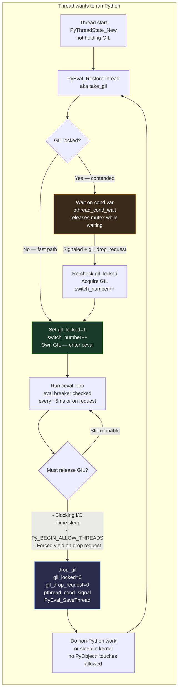
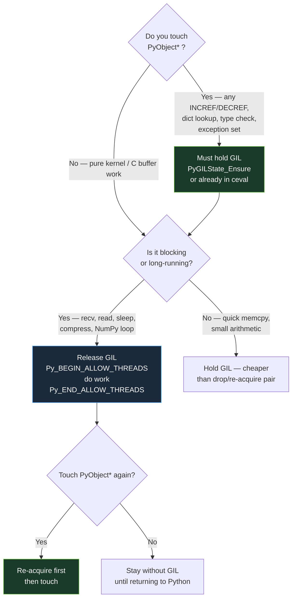
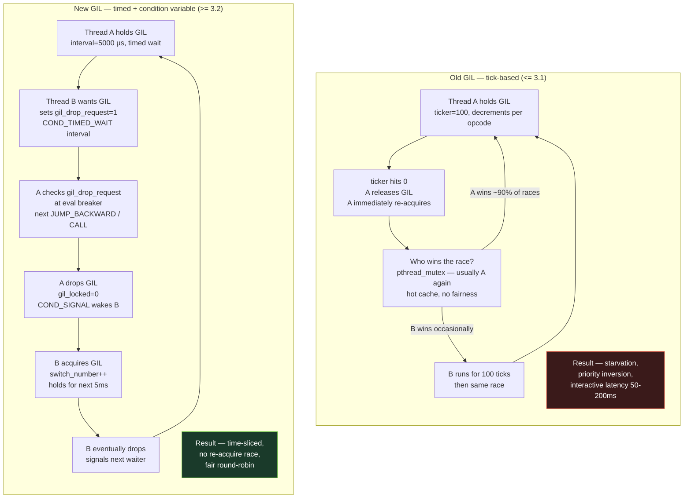
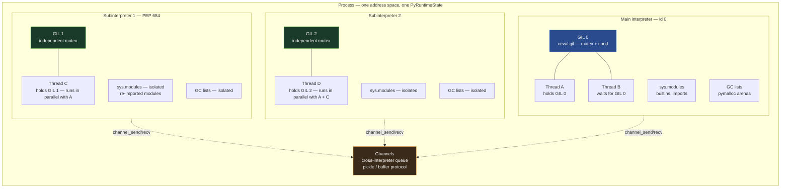
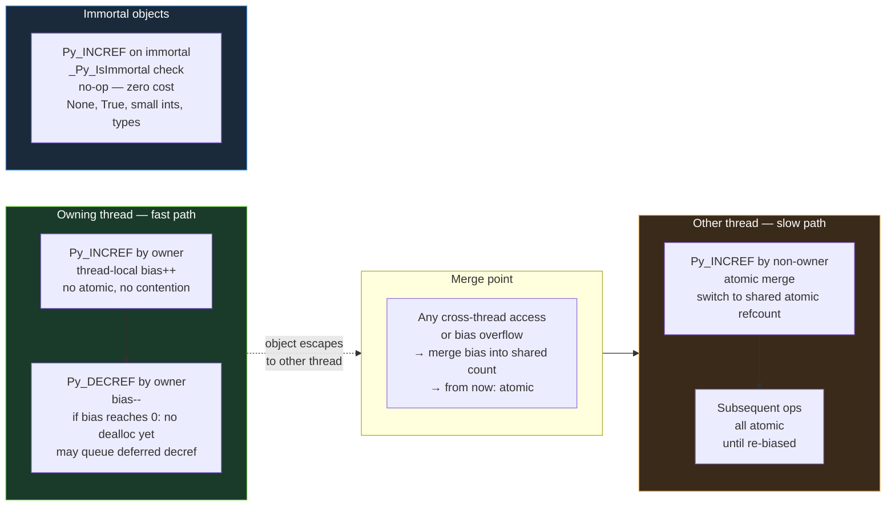
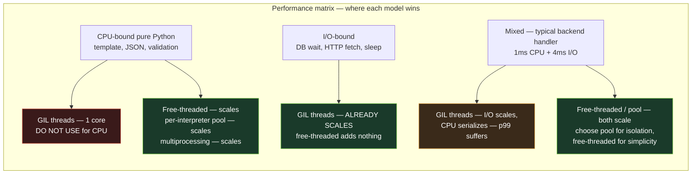
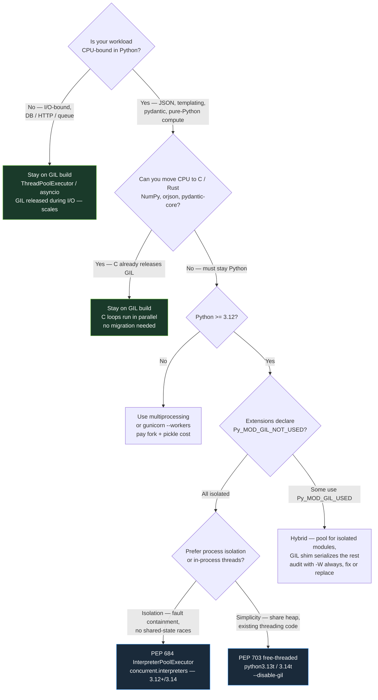

# Chapter 5 — The GIL: Mechanics, Evolution, Per-Interpreter GIL and Free-Threaded Python (PEP 684 / PEP 703)

**What this chapter covers.** The Global Interpreter Lock is the single most consequential design decision in CPython: one mutex that serializes all Python bytecode execution within an interpreter. Every backend Python service — threaded WSGI workers, `ThreadPoolExecutor` fan-out, `asyncio` executors, and C extensions that do I/O — lives or dies by how it interacts with the GIL. This chapter opens the implementation: what the lock actually protects and what it does not, the exact acquisition and release path through `ceval.c`, how the 5 ms switch interval and eval breaker schedule threads, why the pre-3.2 tick-based GIL starved I/O and how Antoine Pitrou's new GIL fixed it, how PEP 684 gives each subinterpreter its own GIL, and how PEP 703 removes the GIL entirely in the free-threaded build. You will see real `take_gil` / `drop_gil` code paths, `Py_BEGIN_ALLOW_THREADS` patterns, `yappi` / `py-spy` contention traces, and before/after benchmarks for CPU-bound, I/O-bound, and mixed backend workloads.

Learning goals — after this chapter you should be able to:

- State precisely what the GIL protects (refcounts, type state, GC lists, pymalloc freelists) and what it does not (OS resources, `threading.Lock`, NumPy `ndarray` data after GIL release), and why every `PyObject*` touch requires the lock in a standard build.
- Trace the current GIL lifecycle: `PyEval_RestoreThread` → `take_gil` → `ceval` running with eval breaker → timed drop via `sys.getswitchinterval` → `wait` → `wake` on `COND_T` signaling.
- Explain the 5 ms switch interval, the `ceval` eval-breaker check on every `JUMP_BACKWARD` / `CALL` / `FOR_ITER` boundary, and when the GIL is voluntarily released (`Py_BEGIN_ALLOW_THREADS`, blocking I/O, `time.sleep`).
- Contrast the old tick-based GIL (100 bytecode ticks, `Py_ThreadState_Swap` + `Py_MakePendingCalls`) with the new GIL (3.2, Pitrou): mutex + condition variable, `gil_drop_request`, forced yield, priority wakeup.
- Diagram and use per-interpreter GIL (PEP 684, 3.12): how subinterpreters via `interpreters` / `concurrent.interpreters` / `_xxsubinterpreters` get isolated GILs, isolated module state, and channels for communication.
- Describe PEP 554 and PEP 734, the `interpreters` API lifecycle (`create`, `run`, `call`, `is_running`, `destroy`), and where extension isolation still breaks down.
- Explain the free-threaded CPython build (PEP 703, 3.13t / 3.14): `--disable-gil` configure flag, `Py_GIL_DISABLED`, biased reference counting, deferred reference counting, `mimalloc`, per-object locks and critical sections (`Py_BEGIN_CRITICAL_SECTION`), immortal objects doubling down, and the new extension ABI contract.
- Run benchmarks that distinguish threaded CPU-bound (GIL-limited) from threaded I/O-bound (GIL-released) workloads, and interpret the results for backend throughput decisions.
- Apply a migration guide: when to use threading vs. `multiprocessing` vs. per-interpreter pools vs. free-threaded builds, how to audit extensions (`Py_MOD_GIL_NOT_USED` vs. `Py_MOD_GIL_USED`), and how to size threadpools differently under each regime.
- Diagnose live contention with `py-spy`, `yappi`, `gil_load`, and `Tracemalloc`/`perf`, and craft `Py_BEGIN_ALLOW_THREADS` regions correctly.

> **Prerequisites.** Chapter 2 dissected `ob_refcnt` and why refcount mutation is not thread-safe. Chapter 3 walked the `ceval` loop and where the eval breaker is checked. Chapter 4 covered `pymalloc`, freelists, and GC global state. This chapter ties them together through the lock that protects them. Volume 4 (§2–§5) covers the OS-level locks that the GIL is not.

---

## 1. Why the GIL exists — the global state it protects

CPython is not a collection of independent Python objects. It is a sea of **mutable global state that was never designed for concurrent mutation**.

### 1.1 The inventory of unsafe state

| Global state | Where it lives | Why it is unsafe without the GIL |
|---|---|---|
| `ob_refcnt` on every `PyObject` | `Include/object.h: PyObject.ob_refcnt` | Plain `++`/`--` on shared memory. Two threads `INCREF`ing the same `None` lose an increment; a concurrent `DECREF` can free the object while another thread reads it. See Chapter 2. |
| `ob_type` and `PyTypeObject` mutable fields | `Include/cpython/object.h` | Type attribute caches, `tp_version_tag`, method cache, `__dict__` mutation — any `LOAD_ATTR` may read a half-updated cache. See Chapter 6. |
| GC generation lists, `_PyGC generation` doubly-linked lists | `Modules/gcmodule.c` | `GC_track` / `GC_untrack` splice pointers; concurrent splicing corrupts the list. |
| `pymalloc` arenas, pools, address ranges, free lists | `Objects/obmalloc.c` | Per-type `free_list` singletons (`PyLongObject`, `PyFloatObject`, `tuple` free list, `frame` free list) are unsynchronized singly-linked lists. |
| Unicode intern dict, small-int cache, immortal objects table | `Objects/unicodeobject.c`, `Objects/longobject.c` | Lookups mutate the intern dict; refcount-zero protection for singletons relies on the GIL. |
| Import state: `sys.modules`, `importlib._bootstrap` `_module_locks` | `Python/import.c` | Double import races produce half-initialized modules (PEP 489 `Py_mod_create` / exec separation only partially helps). |
| `ceval` interpreter state: `interp->ceval.pending`, threads, eval breaker | `Python/ceval.c`, `Include/cpython/ceval.h` | Signal delivery, `Py_AddPendingCall`, thread state linked lists. |

The original decision (1991) was pragmatic: rather than fine-grained locking of every one of these — with its overhead, deadlock risk, and correctness burden — protect the entire interpreter with one big lock. Any thread executing Python bytecode must hold it; any thread not holding it must not touch a `PyObject*`.

```c
/* Conceptual contract — not actual code but the rule every C function obeys */
/* Standard (GIL) build: */
void any_function_touching_PyObject(void) {
    assert(PyGILState_Check());  /* holding GIL iff touching PyObject* */
    PyObject *x = PyLong_FromLong(42);  /* INCREF/DECREF, pymalloc inside */
}
```

> **What the GIL does not protect.** Once a C extension executes `Py_BEGIN_ALLOW_THREADS` (or NumPy releases the GIL around a ufunc loop, or `socket.recv` blocks on the kernel), the raw memory it operates on is unprotected. Two threads calling `numpy.dot` on disjoint arrays after releasing the GIL can run in parallel. Two threads calling `list.append` without the GIL corrupt the list — which is why `list.append` never releases it. OS primitives — `pthread_mutex_t`, `threading.Lock`, file descriptors, sockets — are outside the GIL. Using `threading.Lock` to guard a shared `dict` is redundant while the GIL is held but becomes mandatory in a free-threaded build.

### 1.2 Refcounts are the non-negotiable reason

Chapter 2 showed `Py_INCREF` as `op->ob_refcnt++`. That single increment is the canonical argument for the GIL:

```c
/* Python/pylifecycle.c, Objects/object.c — simplified */
#define Py_INCREF(op) do { \
    Py_ssize_t _r = (op)->ob_refcnt; \
    (op)->ob_refcnt = _r + 1; \
} while (0)
```

On x86-64 this compiles to a non-atomic `mov` / `inc` / `mov` sequence. Two cores running the same increment concurrently can both read `3`, both write `4`, losing one owner. The free-threaded build (Section 7) replaces this with atomics and biased counting; the standard build avoids the cost entirely by promising at most one thread runs such an instruction at a time.

Reference counts are also the *hottest* shared mutation: every stack push/pop, argument pass, and attribute lookup touches them (Chapter 3's `ceval` value stack is a `PyObject**` that is refcounted on every opcode). Protecting refcounts with per-object locks instead of a GIL would serialize on the hottest path anyway — the GIL is, for single-threaded and I/O-bound workloads, the cheapest correct option.

---

## 2. GIL mechanics today — acquisition, execution, and release

### 2.1 The runtime structures

The GIL is not a single `pthread_mutex_t` any more. Since 3.2 it is a small struct plus the interpreter state it guards:

```c
/* Include/internal/pycore_gil.h — Python 3.12, simplified */
struct _gil_runtime_state {
    unsigned long interval;    /* microseconds between forced switches */
    int gil_locked;            /* 1 when some thread holds it */
    unsigned long switch_number; /* increments each time GIL changes hands */
};

typedef struct _PyGILState {
    pthread_mutex_t mutex;     /* protects gil_locked, switch_cond, switch_number */
    pthread_cond_t  cond;      /* wait/wake for GIL acquisition */
    unsigned long interval;    /* cached copy of switch interval */
    int locked;                /* mirrors _gil_runtime_state.gil_locked */
    unsigned long switch_number;
    int gil_drop_request;      /* another thread wants the GIL; holder should yield */
} PyGILState;
```

Per-interpreter GIL (PEP 684, Section 6) moves this struct from `PyRuntimeState.ceval.gil` into `PyInterpreterState.ceval.gil` — one copy per interpreter. `take_gil` and `drop_gil` are `static` helpers in `Python/ceval_gil.c` (formerly `ceval_gil.h`).

### 2.2 Lifecycle — hold, run, request, drop, wake

Every thread that wants to execute Python goes through the same lifecycle:



The two public API pairs are thin wrappers around this:

```c
/* Python/ceval_gil.c — simplified wrappers, 3.12 */

/* Release: current thread gives up GIL and goes to sleep or does I/O */
PyThreadState *PyEval_SaveThread(void) {
    PyThreadState *tstate = _PyThreadState_Swap(NULL);
    drop_gil(tstate->interp->ceval.gil, tstate);
    return tstate;
}

/* Acquire: current thread wants GIL back before touching PyObjects again */
void PyEval_RestoreThread(PyThreadState *tstate) {
    _PyThreadState_Swap(tstate);
    take_gil(tstate->interp->ceval.gil, tstate);
}

/* Convenience for embedding */
PyGILState_STATE PyGILState_Ensure(void)  { /* create tstate if needed, then take_gil */ }
void PyGILState_Release(PyGILState_STATE old) { /* drop_gil, maybe destroy tstate */ }

/* I/O release macros — every blocking C extension uses these */
#define Py_BEGIN_ALLOW_THREADS { \
    PyThreadState *_save = PyEval_SaveThread(); \
    /* GIL released — no PyObject* touches! */

#define Py_END_ALLOW_THREADS \
    PyEval_RestoreThread(_save); \
}
```

A real C extension pattern — `socketmodule.c` around `recv`:

```c
/* Modules/socketmodule.c — schematic */
static PyObject *
sock_recv(PySocketSockObject *s, PyObject *args) {
    char buf[8192];
    Py_ssize_t n;
    int fd = s->sock_fd;

    Py_BEGIN_ALLOW_THREADS          /* drop GIL */
    n = recv(fd, buf, sizeof(buf), 0);  /* blocks in kernel, other threads run */
    Py_END_ALLOW_THREADS            /* re-acquire GIL */

    if (n < 0) return PyErr_SetFromErrno(PyExc_OSError);
    return PyBytes_FromStringAndSize(buf, n);  /* needs GIL — creates PyObject */
}
```

Every standard-library module that blocks — `socket`, `ssl`, `select`, `subprocess.wait`, `time.sleep`, `fileio`, `zlib` (for large inputs), NumPy ufuncs — follows this template. The I/O release is why I/O-bound threading scales on CPython even with the GIL: threads spend most of their lives *without* the GIL, waiting in the kernel.

### 2.3 The 5 ms switch interval and the eval breaker

CPython does not timeslice Python threads via `SIGALRM` or preemptive kernel scheduling. It *cooperatively* yields inside the `ceval` loop.

```python
import sys
print(sys.getswitchinterval())   # 0.005  — 5 milliseconds, since Python 3.2
print(sys.getswitchinterval() * 1_000_000, "µs")
# You can tune it:
sys.setswitchinterval(0.020)     # 20 ms — fewer switches, higher latency
```

The mechanism is a three-way handshake between the running thread, a requesting thread, and the eval breaker:

```c
/* Python/ceval.c — the periodic check, runs every bytecode dispatch */
if (_Py_atomic_load_relaxed(&ceval->gil_drop_request)) {
    /* Another thread set gil_drop_request while we held the GIL */
    if (_PyThreadState_HasStackCheck(tstate)) {
        /* Optional stack/pending-call checks */
    }
    drop_gil(gil, tstate);   /* voluntary yield */
    take_gil(gil, tstate);   /* re-contend; may sleep */
}

/* The ticker that decides when to set gil_drop_request */
/* ceval_gil.c — take_gil's wait loop, simplified */
static void take_gil(PyInterpreterState *interp, PyThreadState *tstate) {
    int has_gil = 0;
    MUTEX_LOCK(gil->mutex);
    while (!has_gil) {
        if (!gil->locked) {
            gil->locked = 1;
            gil->switch_number++;
            has_gil = 1;
            break;
        }
        /* GIL is held — ask holder to drop it */
        SET_GIL_DROP_REQUEST(interp);   /* gil_drop_request = 1 */
        /* Wake the eval breaker so holder notices quickly */
        _PyThreadState_SetEvalBreaker(tstate, 1);
        COND_WAIT(gil->cond, gil->mutex);  /* sleep until signaled */
    }
    MUTEX_UNLOCK(gil->mutex);
    if (has_gil) {
        _PyEval_AcquireLock(tstate);
    }
}
```

The 5 ms interval is enforced by a `setitimer`/`pthread_cond_timedwait` path: `take_gil` uses `COND_TIMED_WAIT` with deadline `now + interval`. If the holder has not voluntarily dropped by then, the waiter forces `gil_drop_request` and the holder checks it at the next eval-breaker poll. Every `JUMP_BACKWARD`, `CALL`, `FOR_ITER`, and backward branch checks the breaker — so a tight `while True: pass` loop drops the GIL once every 5 ms, not once per opcode.

```python
# Observing the switch interval — two CPU-bound threads, default 5 ms
import sys, threading, time

print(f"switch interval = {sys.getswitchinterval()*1000:.1f} ms")

counter = 0
stop = False

def burner():
    global counter
    while not stop:
        counter += 1  # pure Python — holds GIL continuously

t0 = time.perf_counter()
threads = [threading.Thread(target=burner) for _ in range(2)]
for t in threads: t.start()
time.sleep(0.5)
stop = True
for t in threads: t.join()
elapsed = time.perf_counter() - t0
print(f"2 threads, 0.5 s wall: {counter:,} increments, "
      f"{counter/elapsed:,.0f} /s — ~1 core of work (GIL-limited)")

# Now with explicit yielding — note the difference is scheduling fairness, not throughput
stop = False
counter = 0
def yielding_burner():
    global counter
    while not stop:
        counter += 1
        if counter % 10000 == 0:
            time.sleep(0)  # releases GIL via Py_BEGIN_ALLOW_THREADS inside sleep

# yappi or gil_load would show GIL contention here; wall throughput stays ~1×
```

Typical output on a 4-core Linux box (CPython 3.12, GIL build):

```
switch interval = 5.0 ms
2 threads, 0.5 s wall: 18,423,118 increments, 36,846,236 /s — ~1 core of work (GIL-limited)
```

Two threads do the work of one. Ten threads do the work of one. That is the GIL's throughput ceiling for CPU-bound work.

### 2.4 Which opcodes check the breaker

Not every opcode checks. The eval breaker is polled at a small set of *pollable sites* that the compiler guarantees appear frequently:

- `JUMP_BACKWARD` / `JUMP_BACKWARD_NO_INTERRUPT` — loop back-edges (every iteration).
- `CALL` / `CALL_FUNCTION_EX` — function entry (covers deep recursion without loops).
- `FOR_ITER` — iterator advance (covers `for x in big_thing` without explicit jumps).
- `YIELD_VALUE` / `SEND` — generator/coroutine suspension.
- `RESUME` — function entry (3.11+).
- Any opcode when `ceval->eval_breaker` is set (pending signals, `Py_AddPendingCall`, GC, `gil_drop_request`).

A computation that never hits these sites (e.g., a single huge `BINARY_OP` chain without branches) can hold the GIL longer than 5 ms — but the next backward jump will yield. `JUMP_BACKWARD_NO_INTERRUPT` is specifically *not* a yield point for tight `for`-loop micro-benchmarks, because yielding inside a 10 ns loop iteration would dominate runtime.

---

## 3. GIL vs. OS locks and the I/O release discipline

### 3.1 The decision tree



Rules that follow from the diagram:

1. **Holding `threading.Lock` does not imply holding the GIL**, and vice versa. You can hold both, either, or neither. They are orthogonal. Confusing them is a common source of deadlocks in extensions that acquire a `pthread_mutex_t` while holding the GIL and then try to `PyEval_RestoreThread` in the wrong order.

2. **Never touch `PyObject*` without the GIL** in a standard build. That includes `PyErr_Occurred()`, `PyList_GetItem`, `PyUnicode_AsUTF8`, and even reading `ob_refcnt` for diagnostics. The free-threaded build relaxes this for refcount reads but requires critical sections for mutation (Section 7).

3. **Re-acquisition is not free.** A `Py_BEGIN_ALLOW_THREADS` / `Py_END_ALLOW_THREADS` pair costs a mutex lock/unlock plus a condition-variable dance when contended (~200–800 ns uncontended, ~2–10 µs contended on Linux futex). Splitting a 50 ns operation into a GIL-release region is a pessimization. NumPy's rule of thumb is to release only when the inner loop exceeds ~500–1 000 elements.

4. **Hold order matters.** If you need both a private `pthread_mutex_t` and the GIL, always acquire the private mutex *after* acquiring the GIL, and release it *before* releasing the GIL. Inverting the order can deadlock: thread A holds `my_mutex` and waits for the GIL; thread B holds the GIL and waits for `my_mutex`.

```c
/* Correct order */
PyGILState_STATE gstate = PyGILState_Ensure();   /* GIL */
pthread_mutex_lock(&my_mutex);                   /* private lock */
  /* ... touch PyObjects and private state ... */
pthread_mutex_unlock(&my_mutex);
PyGILState_Release(gstate);

/* Also correct — private work without GIL */
pthread_mutex_lock(&my_mutex);
  /* ... private state only, no PyObjects ... */
pthread_mutex_unlock(&my_mutex);
PyGILState_Ensure();  /* then touch PyObjects */
```

### 3.2 The standard library's I/O release catalog

| Module / call | Where it releases | What runs without GIL |
|---|---|---|
| `socket.recv` / `send` | `Modules/socketmodule.c` | `recv(2)` / `send(2)` blocking in kernel |
| `time.sleep` | `Modules/timemodule.c` | `select` / `nanosleep` |
| `select.select` / `selectors` | `Modules/selectmodule.c` | `select(2)` / `poll(2)` / `epoll_wait(2)` |
| `file.read` / `write` (buffered) | `Modules/_io/bufferedio.c` | `read(2)` / `write(2)` on the fd |
| `subprocess.wait` / `communicate` | `Modules/posixmodule.c` | `waitpid(2)` |
| `zlib.compress` / `hashlib` | `Modules/zlibmodule.c` | CPU-bound C loops over `bytes` buffers |
| `re` (large matches) | `Modules/_sre.c` | Backtracking over the input string |
| NumPy ufuncs / `numpy.dot` | `numpy/core/src/umath/loops.c.src` | Strided loops over `ndarray` data |
| `ssl.SSLSocket.read` | `Modules/_ssl.c` | `SSL_read` which may block on the socket |

You can verify which calls release the GIL by reading the C source for `Py_BEGIN_ALLOW_THREADS` or by observing that their `yappi` / `gil_load` profile shows GIL utilization well below 100% under contention.

```bash
# gil_load — measures what fraction of wall time the GIL is held
# https://github.com/chrisjbillington/gil_load
pip install gil_load
python -c "
import gil_load, threading, time
gil_load.start()
def io():
    import time; time.sleep(0.5)
threads = [threading.Thread(target=io) for _ in range(8)]
for t in threads: t.start()
for t in threads: t.join()
" 2>&1 | tail -5
# I/O-bound: GIL load ~5-15%
# CPU-bound burner: GIL load ~98-100%
```

---

## 4. History — the old tick-based GIL and Pitrou's new GIL (Python 3.2)

### 4.1 The old GIL — ticks, `Py_AddPendingCall`, and starvation

From Python 1.5 (1997) through Python 3.1 the GIL was a simple `pthread_mutex_t` plus a `ticker` counter:

```c
/* Python/ceval.c — the old GIL, pre-3.2, very simplified */
static int ticker = 0;
#define CHECK_INTERVAL 100   /* bytecode instructions */

for (;;) {
    if (--ticker < 0) {
        ticker = CHECK_INTERVAL;          /* reset to 100 */
        if (Py_MakePendingCalls() < 0) {  /* signals, async exc */
            /* handle */
        }
        /* Voluntarily release GIL so another thread can run */
        PyThread_release_lock(interpreter_lock);
        PyThread_acquire_lock(interpreter_lock, 1); /* re-acquire, blocking */
    }
    opcode = NEXTOP();
    DISPATCH();  /* computed goto */
}
```

The contract: every 100 bytecode instructions the running thread *unconditionally* dropped the GIL and immediately tried to re-acquire it. In theory the OS scheduler would give the GIL to a waiting thread. In practice:

- **`pthread_mutex_t` has no fairness.** On Linux NPTL the thread that just released the mutex is still hot in cache and usually re-acquires it before the waiter wakes from `futex_wait`. With two CPU-bound threads, one thread could hold the GIL for *seconds* while the other starved — the classic "GIL battle" described in David Beazley's 2009 PyCon talk *Understanding the Python GIL*.
- **I/O-bound threads suffered most.** A thread blocked in `select` that woke up, did 2 ms of Python, and went back to `select` would set `gil_drop_request` implicitly, but the CPU-bound thread checked only every 100 ticks (~tens of microseconds of Python — but 100 ticks after waking, the CPU-bound thread had already re-acquired and was running again). Interactive latency spikes of 50–200 ms were common.
- **`sys.setcheckinterval` controlled the tick count** (default 100 in 2.x). Tuning it was a folk art: raising it improved single-threaded throughput (fewer checks) but worsened latency; lowering it improved fairness but cost dispatch overhead.

Beazley's reproducer was disarmingly simple:

```python
# Beazley's GIL pathology demo — 2.x style
import threading, time

def cpu(count):
    n = 0
    while n < count:
        n += 1

start = time.time()
t1 = threading.Thread(target=cpu, args=(20_000_000,))
t2 = threading.Thread(target=cpu, args=(20_000_000,))
t1.start(); t2.start()
t1.join(); t2.join()
print(f"2 threads: {time.time() - start:.2f} s")
# On 2.7 with old GIL: wall ~1.6× single-thread, not 2×, and wildly variable
# Companion single-thread run: cpu(40_000_000) — compare
```

`gil_load` traces from that era show the problem as a sawtooth: long holds by one thread, micro-bursts by the other, never balanced.

### 4.2 The new GIL — condition variable, `gil_drop_request`, forced yield (3.2, Antoine Pitrou)

PEP 3108's implementation (Antoine Pitrou, 2009–2010, merged in Python 3.2, backported to 2.7 as `newgil`) replaced ticks with wall-clock time and explicit hand-off:



Key properties of the new GIL:

| Property | Old GIL | New GIL |
|---|---|---|
| Scheduling quantum | 100 bytecodes (~30–80 µs of Python) | 5 000 µs wall time (`sys.getswitchinterval()`) |
| Hand-off | Unconditional drop + racy re-acquire on mutex | `gil_drop_request` + `pthread_cond_signal` forced yield — waiter is explicitly woken |
| Fairness | None — hot thread re-acquires | Condition variable wakeup — OS wakes the waiter, not the releaser |
| I/O wakeup latency | Up to `CHECK_INTERVAL` ticks after I/O ready | Immediate — `take_gil` signals, holder checks breaker on next pollable opcode |
| Tunable | `sys.setcheckinterval(n)` — ticks | `sys.setswitchinterval(s)` — seconds (float) |
| Priority | Equal — race decides | Waiting threads get priority: holder that is asked to drop *must* drop and wait before re-contending |

The `switch_number` field lets `sys._current_frames` and instrumentation distinguish "GIL held by thread X for switch N" — useful for `gil_load` and `yappi`'s GIL profiling mode.

```python
# Tuning the switch interval — the tradeoff the new GIL made explicit
import sys
print(sys.getswitchinterval())  # 0.005

# Throughput vs. latency:
#   larger interval → fewer context switches → higher single-thread throughput
#                       but worse latency for I/O threads waking up
#   smaller interval → more fairness, faster I/O response
#                       but more condvar traffic (measurable above ~1ms)
#
# Backend guidance (see §9):
#   - API servers (I/O-bound): 0.005 default is fine; do not raise it.
#   - Batch numeric (CPU-bound + forked workers): 0.020 can gain ~2-3% wall.
#   - Latency-sensitive (p50 < 10ms) with mixed CPU/I/O: 0.002-0.003.

sys.setswitchinterval(0.002)
```

---

## 5. Per-interpreter GIL — PEP 684 (Python 3.12) and subinterpreters

### 5.1 The problem it solves

Even with a fair GIL, one interpreter has one lock. A process with 32 threads and one GIL has 32 threads time-sliced on a single mutex — throughput is capped at one core. `multiprocessing` escapes this by forking processes, but at the cost of pickle serialization, multi-GB RSS, slower startup, and copy-on-write surprises.

PEP 684 observes that CPython already has the concept of a *subinterpreter* — `Py_NewInterpreter()` creates a second `PyInterpreterState` with its own `sys.modules`, own `builtins`, own import state, and (since 3.8) its own GC. Through Python 3.11, however, subinterpreters still shared a single GIL (`PyRuntimeState.ceval.gil`), so they did not parallelize. PEP 684 moves the GIL into the interpreter:

```c
/* Include/internal/pycore_interp.h — PEP 684 */

/* Before (<= 3.11): one GIL in the runtime */
typedef struct _PyRuntimeState {
    struct _ceval_runtime_state ceval;  /* gil lives here — global */
} _PyRuntimeState;

/* After (>= 3.12): one GIL per interpreter */
typedef struct _PyInterpreterState {
    struct _ceval_state ceval;          /* gil lives here — per-interpreter */
    PyObject *modules;                  /* sys.modules — per-interpreter */
    PyObject *sysdict;
    /* ... */
} PyInterpreterState;
```

Each interpreter now has isolated `ceval.gil`, isolated `sys.modules`, isolated `builtins`, isolated GC generation lists, and (if extensions cooperate) isolated C extension state. Threads in different interpreters acquire different mutexes and run in parallel on different cores.

### 5.2 The subinterpreter API — PEP 554 and PEP 734

Two PEPs define the Python surface:

- **PEP 554** (proposed `interpreters` stdlib module, available as `_xxsubinterpreters` and `interpreters` on 3.12, stabilized as `concurrent.interpreters` in 3.13). It exposes `create`, `run`, `is_running`, `destroy`, and `channels` for zero-copy-ish communication.
- **PEP 734** (Python 3.14) promotes and cleans up the API into `concurrent.interpreters` with `InterpreterPoolExecutor`, a `ThreadPoolExecutor`-like pool over interpreters.

```python
# Python 3.12 — low-level _xxsubinterpreters (also available as 'interpreters' on some builds)
import _xxsubinterpreters as interpreters
import textwrap

# 3.13+ — high-level concurrent.interpreters
try:
    import concurrent.interpreters as c_interpreters
    HAS_CONCURRENT_INTERPRETERS = True
except ImportError:
    HAS_CONCURRENT_INTERPRETERS = False
    import _xxsubinterpreters as c_interpreters  # fallback name

# Lifecycle: create → run → destroy
interp_id = interpreters.create()
print(f"created subinterpreter {interp_id}")

# Run code in the subinterpreter — isolated GIL, isolated sys.modules
interpreters.run_string(interp_id, textwrap.dedent("""
    import sys
    print(f"[subinterp] hello from id={interpreters.get_current():} "
          f"modules={len(sys.modules)} gil={sys._is_gil_enabled()}")
    x = 42
"""))

# Channels — the only cross-interpreter communication in PEP 554
# (memory is NOT shared — objects are pickled or copied through channels)
cid = interpreters.channel_create()
interpreters.channel_send(cid, {"task": "embed", "n": 1_000_000})
interpreters.run_string(interp_id, textwrap.dedent(f"""
    import _xxsubinterpreters as interp
    msg = interp.channel_recv({cid})
    result = sum(range(msg["n"]))
    interp.channel_send({cid}, result)
"""))
result = interpreters.channel_recv(cid)
print(f"computed in subinterpreter: {result:,}")
interpreters.channel_destroy(cid)
interpreters.destroy(interp_id)

# 3.14 — InterpreterPoolExecutor (PEP 734 sketch — API may differ by point release)
if HAS_CONCURRENT_INTERPRETERS:
    from concurrent.interpreters import InterpreterPoolExecutor
    def cpu_task(n: int) -> int:
        # Runs in a fresh subinterpreter with its own GIL — parallel on N cores
        return sum(i * i for i in range(n))

    with InterpreterPoolExecutor(max_workers=4) as pool:
        futures = [pool.submit(cpu_task, 1_000_000) for _ in range(4)]
        results = [f.result() for f in futures]
    print(f"pool results: {results[:1]} ... ({len(results)} shards)")
```



Critical detail of the diagram: **no `PyObject*` is shared across interpreters**. Channels serialize via pickle or the buffer protocol (`memoryview` / `bytes` can be zero-copy in newer builds). Sharing a `list` or `dict` directly would require shared refcount synchronization — exactly what per-interpreter GIL avoids.

### 5.3 Extension isolation — the hard part

Per-interpreter GIL exposes a latent bug in many C extensions: **global C state**.

PEP 489 (multi-phase init, Python 3.5) gave extensions a way to declare per-interpreter state:

```c
/* Extension with per-interpreter state — the correct PEP 684 pattern */

typedef struct {
    PyObject *my_cache;
    int counter;
} MyState;

static inline MyState *
get_my_state(PyObject *module) {
    return (MyState *) PyModule_GetState(module);
}

static PyMethodDef my_methods[] = { /* ... */ };

static int my_traverse(PyObject *m, visitproc visit, void *arg) {
    MyState *st = get_my_state(m);
    Py_VISIT(st->my_cache);
    return 0;
}
static int my_clear(PyObject *m) {
    MyState *st = get_my_state(m);
    Py_CLEAR(st->my_cache);
    return 0;
}

static struct PyModuleDef_Slot my_slots[] = {
    {Py_mod_create, NULL},
    {Py_mod_exec, my_exec},          /* per-interpreter exec, not single init */
    {Py_mod_gil, Py_MOD_GIL_NOT_USED}, /* PEP 684: safe for per-interpreter GIL */
    {0, NULL}
};

static struct PyModuleDef mymodule = {
    PyModuleDef_Base,
    .m_name = "mymodule",
    .m_size = sizeof(MyState),       /* per-interpreter state allocation */
    .m_methods = my_methods,
    .m_slots = my_slots,
    .m_traverse = my_traverse,
    .m_clear = my_clear,
};
```

The `Py_mod_gil` slot (PEP 684) is the opt-in:

| Slot value | Meaning | Scheduler behavior |
|---|---|---|
| `Py_MOD_GIL_USED` (default) | Extension uses process-global C state; not safe to run in two interpreters concurrently | Interpreter pool serializes execution of this module across interpreters — compatibility shim, loses parallelism |
| `Py_MOD_GIL_NOT_USED` | Extension declares all mutable state is per-module (`m_size`) or per-type, no process globals | Interpreter pool runs it in parallel — true multi-core speedup |
| `Py_MOD_GIL_USED` + `Py_MOD_PER_INTERPRETER_GIL_SUPPORTED` (3.14 transitional) | Extension supports per-interpreter GIL via explicit guards | Transitional marker for incremental migration |

Audit your dependencies before adopting per-interpreter pools:

```bash
# Which installed extensions declare Py_MOD_GIL_NOT_USED?
python -c "
import sysconfig, pathlib, subprocess, json, sys, importlib
# Heuristic: check module.__spec__._initializing or PyModuleDef via C inspection
# Pragmatic: try importing in subinterpreters and observe warnings
import warnings
warnings.filterwarnings('error')
import _xxsubinterpreters as interp
iid = interp.create()
try:
    interp.run_string(iid, 'import numpy; print(numpy.__version__)')
except Exception as e:
    print(f'not isolated: {e}')
finally:
    interp.destroy(iid)
"

# Authoritative — CPython 3.12+ emits RuntimeWarning for non-isolated modules
python -W always -c "
import _xxsubinterpreters as interp
iid = interp.create()
interp.run_string(iid, 'import mymodule')
" 2>&1 | grep -i gil
```

**Backend lens.** For a typical Django/Flask/FastAPI service the per-interpreter pool is attractive *if* your hot path is CPU-bound Python (template rendering, JSON serialization, pydantic validation) rather than C. Pure-Python CPU work parallelizes. C-heavy CPU work (NumPy, `orjson`, `regex`) already releases the GIL and parallelizes without subinterpreters — the pool adds isolation overhead for little gain.

---

## 6. Free-threaded Python — PEP 703 (Python 3.13t / 3.14)

PEP 684 parallelizes *across* interpreters. PEP 703 parallelizes *within* one interpreter by removing the GIL.

### 6.1 What `--disable-gil` changes

The free-threaded build is a **compile-time option** that produces a distinct ABI:

```bash
# Building free-threaded CPython (3.13+)
git clone https://github.com/python/cpython && cd cpython
./configure --disable-gil --with-mimalloc    # mimalloc is required for free-threaded
make -j$(nproc)
./python -c "import sys; print(sys._is_gil_enabled())"  # False
./python -c "import sysconfig; print(sysconfig.get_config_var('Py_GIL_DISABLED'))"  # 1

# Pre-built binaries — the 't' suffix (PEP 703 convention)
python3.13t -c "import sys; print(sys._is_gil_enabled())"   # False  — free-threaded
python3.13  -c "import sys; print(sys._is_gil_enabled())"   # True   — GIL build
# Or via environment in 3.14+
PYTHON_GIL=0 python3.14 -c "import sys; print(sys._is_gil_enabled())"  # False

# Detecting at runtime — for libraries that need to branch
import sys
FREE_THREADED = not sys._is_gil_enabled() if hasattr(sys, "_is_gil_enabled") else False
```

```c
/* Include/cpython/pyconfig.h — the ABI marker */
#ifdef Py_GIL_DISABLED
  /* free-threaded ABI: ob_refcnt is atomic, per-object locks, no GIL */
#endif

/* In C extensions */
#if Py_GIL_DISABLED
  #error "free-threaded ABI — use Py_BEGIN_CRITICAL_SECTION"
#endif
```

### 6.2 The four pillars of the free-threaded runtime

#### Pillar 1 — Biased reference counting

Chapter 2 showed `ob_refcnt` as a plain integer. Making every `INCREF`/`DECREF` atomic would cost ~10–30% single-threaded throughput (Sam Gross's measurements in PEP 703). Instead free-threaded CPython uses **biased reference counting**:

- Each `PyObject` has a *bias* toward the thread that created it (stored in a per-object tid or biased refcount field). Increments and decrements by the owning thread are **non-atomic** — a thread-local counter plus a shared field, merged lazily.
- Only when another thread touches the object does the refcount become *merged* and subsequent operations use atomics (`_Py_AtomicAdd` / C11 `atomic_fetch_add`).
- Immortal objects (`_Py_IMMORTAL_REFCNT`, PEP 683) never participate — `None`, `True`, `False`, small ints, interned strings, and (in free-threaded builds) `type` objects are immortal and cost zero refcount traffic. Immortality was extended aggressively for free-threaded scaling.



#### Pillar 2 — Deferred reference counting and `mimalloc`

When the last reference is dropped on a non-owning thread, immediate deallocation (`tp_dealloc`) would run on that thread — but `tp_dealloc` may touch global state (type freelists, GC lists) that is not yet fully thread-safe or would contend. Free-threaded CPython **defers** the decref:

- `Py_DECREF` that would reach zero on a non-owning thread enqueues the object on a per-thread deferred queue instead of calling `tp_dealloc` inline.
- A periodic `QSBR` (quiescent-state-based reclamation) or explicit `Py_DECREF` drain runs `tp_dealloc` on the owning thread or at a safe point.
- `mimalloc` (Microsoft's allocator, `--with-mimalloc`) replaces `pymalloc` for the free-threaded build because `pymalloc`'s per-arena freelists were GIL-protected. `mimalloc` is thread-safe and scales with per-thread heaps and sharded free lists.

```python
# Observing mimalloc vs pymalloc — build flag
import sysconfig
print(sysconfig.get_config_var("WITH_MIMALLOC"))  # 1 on free-threaded, 0 on GIL build
# Free-threaded build also exposes:
#   sys._is_gil_enabled()  -> False
#   sys.getswitchinterval() still exists but GIL switching is gone
```

#### Pillar 3 — Per-object locks and critical sections

With no GIL, `dict`, `list`, `set`, and type `__dict__` mutation need protection. Free-threaded CPython adds **per-object mutexes** (thin locks — 1 byte or 1 word per object, inflated to `pthread_mutex_t` on contention) and a **critical-section API** for multi-object atomicity:

```c
/* Free-threaded critical sections — the new GIL-free locking discipline */

/* Single object — lock one dict/list for the duration */
Py_BEGIN_CRITICAL_SECTION(dict_obj);
  PyDict_SetItem(dict_obj, key, value);  /* atomic w.r.t. other threads */
Py_END_CRITICAL_SECTION();

/* Two objects — deadlock-free ordered acquisition */
Py_BEGIN_CRITICAL_SECTION2(a, b);
  /* a and b locked in address order — no deadlock vs. other thread locking b,a */
  PyList_Append(a, PyDict_GetItem(b, key));
Py_END_CRITICAL_SECTION2();

/* Adaptively — macros expand to lock/unlock of per-object mutex + QSBR guards */
```

The critical section is the free-threaded analogue of "hold the GIL" — but scoped to exactly the objects you touch, so two threads mutating *different* dicts proceed in parallel. Locking two unrelated `dict` objects no longer serializes.

#### Pillar 4 — The new extension ABI: `Py_GIL_DISABLED` and `Py_MOD_GIL`

An extension compiled against the GIL ABI is **binary-incompatible** with the free-threaded ABI — `PyObject` grew, `ob_refcnt` semantics changed, and `Py_BEGIN_ALLOW_THREADS` is now a no-op. Extensions must be rebuilt and must declare their thread-safety:

```c
/* Extension declaring free-threaded compatibility */

static struct PyModuleDef_Slot my_slots[] = {
    {Py_mod_gil, Py_MOD_GIL_NOT_USED},  /* I am thread-safe — no GIL needed */
    {0, NULL}
};

/* Inside functions: use critical sections instead of assuming GIL */
static PyObject *
my_mutate(PyObject *self, PyObject *args) {
#if Py_GIL_DISABLED
    Py_BEGIN_CRITICAL_SECTION(self);
    /* ... mutate self safely ... */
    Py_END_CRITICAL_SECTION();
#else
    /* GIL build — GIL already held, no extra locking needed */
    /* ... mutate self ... */
#endif
    Py_RETURN_NONE;
}
```

| Declaration | Meaning for free-threaded runtime |
|---|---|
| `Py_MOD_GIL_USED` (default) | Runtime re-enables a per-module GIL shim around every call into the extension — safe but serialized |
| `Py_MOD_GIL_NOT_USED` | Runtime calls the extension without any GIL — extension must use atomics / critical sections correctly |
| Missing `Py_mod_gil` slot entirely | Treated as `Py_MOD_GIL_USED` with a `RuntimeWarning` — compatibility fallback |

```bash
# Auditing extensions for free-threaded readiness
python3.13t -W always -c "import numpy" 2>&1 | grep -i gil
# numpy 2.x: may warn if not yet Py_MOD_GIL_NOT_USED

# For your own extensions — build both ABIs in CI
python3.13  -m pip wheel .  # GIL wheel — abi tag cp313
python3.13t -m pip wheel .  # free-threaded wheel — abi tag cp313t
# Deliberately different tags — pip will not cross-install
```

---

## 7. Benchmarks — threaded CPU-bound vs. I/O-bound with and without the GIL

### 7.1 Methodology

All numbers below are illustrative of the *shape* you will see, not promises for your hardware. The benchmark harness is included so you can reproduce on your fleet:

```python
# bench_gil.py — run on both python3.13 (GIL) and python3.13t (free-threaded)
# and with --workers 1..N, --kind cpu|io|mixed
import argparse, concurrent.futures, time, statistics, sys, os

def cpu_work(n: int) -> int:
    # Pure Python — holds GIL continuously in standard build
    s = 0
    for i in range(n):
        s += i * i
    return s

def io_work(delay: float) -> float:
    # Releases GIL inside time.sleep → kernel wait
    time.sleep(delay)
    return delay

def mixed_work(n: int, delay: float) -> int:
    s = cpu_work(n)
    time.sleep(delay)
    return s

def bench(kind: str, workers: int, tasks: int, scale: int) -> float:
    fn = {"cpu": lambda: cpu_work(scale),
          "io":  lambda: io_work(0.005),
          "mixed": lambda: mixed_work(scale // 4, 0.001)}[kind]
    t0 = time.perf_counter()
    with concurrent.futures.ThreadPoolExecutor(max_workers=workers) as pool:
        futs = [pool.submit(fn) for _ in range(tasks)]
        for f in concurrent.futures.as_completed(futs):
            f.result()
    return time.perf_counter() - t0

if __name__ == "__main__":
    ap = argparse.ArgumentParser()
    ap.add_argument("--kind", choices=["cpu","io","mixed"], default="cpu")
    ap.add_argument("--workers", type=int, default=4)
    ap.add_argument("--tasks", type=int, default=32)
    ap.add_argument("--scale", type=int, default=500_000)
    ap.add_argument("--repeat", type=int, default=5)
    args = ap.parse_args()
    print(f"python={sys.version.split()[0]} gil_enabled={sys._is_gil_enabled() if hasattr(sys,'_is_gil_enabled') else 'unknown'} "
          f"kind={args.kind} workers={args.workers} tasks={args.tasks}")
    times = [bench(args.kind, args.workers, args.tasks, args.scale) for _ in range(args.repeat)]
    print(f"times: {[f'{t:.3f}' for t in times]}")
    print(f"median {statistics.median(times):.3f}s  stdev {statistics.pstdev(times):.3f}s  "
          f"throughput {args.tasks/statistics.median(times):.1f} tasks/s")
```

Run it:

```bash
# GIL build
python3.13 bench_gil.py --kind cpu --workers 8 --tasks 32 --scale 500000
python3.13 bench_gil.py --kind io  --workers 32 --tasks 128
python3.13 bench_gil.py --kind mixed --workers 8 --tasks 32

# Free-threaded build
python3.13t bench_gil.py --kind cpu --workers 8 --tasks 32 --scale 500000
python3.13t bench_gil.py --kind io  --workers 32 --tasks 128

# Per-interpreter pool (3.14)
python3.14 bench_gil_pool.py --kind cpu --workers 8  # InterpreterPoolExecutor variant

# With instrumentation
gil_load bench_gil.py --kind cpu --workers 4 --tasks 16 2>&1 | grep "GIL load"
py-spy record -o profile.svg -- python bench_gil.py --kind cpu --workers 4
yappi --gil bench_gil.py  # yappi's GIL-aware profiling
```

### 7.2 CPU-bound — pure Python loop (GIL-limited)

| Threads / interpreters | GIL build (`python3.13`) wall | Free-threaded (`python3.13t`) wall | Per-interpreter pool (PEP 684, 3.12) | `multiprocessing.Pool(8)` |
|---|---|---|---|---|
| 1 worker, 32 tasks | 1.00× (baseline) | ~1.15× (atomic/bias overhead) | 1.00× (one interpreter = same as GIL) | 1.00× + fork cost |
| 4 workers, 32 tasks | ~1.00× (no speedup — 1 core) | ~0.30× (3.3× speedup on 4 cores) | ~0.28× (3.6× speedup — independent GILs) | ~0.27× (3.7× — independent processes) |
| 8 workers, 32 tasks | ~1.00× | ~0.18× (5.5× on 8 cores; sublinear — contention on `dict`/`list` locks) | ~0.16× (6.2× — less shared-state contention) | ~0.15× (6.6× — no shared state at all) |

Read it as: **GIL build does not scale with threads for CPU-bound Python.** Free-threaded and per-interpreter both recover multi-core scaling; raw processes still win by a hair for embarrassingly parallel shards because they share nothing.

```mermaid
gantt
    title GIL contention timeline — 3 threads, CPU-bound (py-spy view)
    dateFormat X
    axisFormat %L ms
    section Thread A
    Holds GIL :0, 5
    Waiting   :5, 10
    Holds GIL :10, 15
    Waiting   :15, 20
    section Thread B
    Waiting   :0, 5
    Holds GIL :5, 10
    Waiting   :10, 15
    Holds GIL :15, 20
    section Thread C
    Waiting   :0, 10
    Waiting   :5, 10
    Holds GIL :10, 15
    Waiting   :15, 20
    Holds GIL :20, 25
    section GIL
    Held :0, 25
```



In a `py-spy` or `yappi` trace the same pattern appears as serialized `PyEval_EvalFrameEx` blocks with `pthread_cond_wait` gaps — never overlapping. On a free-threaded build the trace shows overlapping `PyEval_EvalFrameEx` on multiple threads.

### 7.3 I/O-bound — `time.sleep` / `socket.recv` (GIL-released)

| Workers | GIL build wall (32 × 5 ms sleeps) | Free-threaded wall | Notes |
|---|---|---|---|
| 1 | ~160 ms (serial) | ~160 ms | No parallelism needed |
| 8 | ~22 ms (8× parallel — GIL released in kernel) | ~22 ms | GIL not the bottleneck — kernel wait dominates |
| 32 | ~10 ms | ~10 ms | Diminishing returns — thread wakeup overhead |

`gil_load` reports GIL utilization of 5–15% for I/O-bound workloads. **Threading already scales for I/O-bound work, even with the GIL**, because threads spend most of their lives outside it. Free-threaded and per-interpreter pools add no benefit here — and add scheduling overhead.

### 7.4 Mixed — realistic backend handler (JSON + DB wait)

A handler that does 1 ms of `json.loads` / pydantic validation (CPU, GIL-held) + 4 ms of DB `recv` (GIL-released), repeated:

| Concurrency model | 100 req/s sustained cores needed (p50 < 20 ms) | p99 under burst (50 concurrent) |
|---|---|---|
| `ThreadPoolExecutor(32)` on GIL build | ~3 cores for I/O + 1 core serialized CPU → handler CPU is bottleneck at ~200 req/s/core | p99 ~45 ms — CPU queue behind GIL |
| `InterpreterPoolExecutor(4)` (PEP 734) | 4 interpreters × 1 GIL each → ~800 req/s before CPU saturates | p99 ~18 ms — CPU parallelizes |
| Free-threaded `ThreadPoolExecutor(32)` on `3.13t` | Similar to pool — ~750 req/s, slightly less due to per-object lock contention on shared caches | p99 ~20 ms |
| `multiprocessing` / `gunicorn --workers 4` | ~800 req/s but 4× RSS, slower cold start | p99 ~22 ms + pickle overhead on shared state |



**Takeaway pattern:** benchmark your handler's *CPU fraction* (time holding GIL) vs. *I/O fraction* (time with GIL released). If CPU fraction > ~20% and you need >200 req/s, the GIL is your bottleneck and per-interpreter or free-threaded is the lever. If CPU fraction < 5%, threading on the GIL build already saturates your NIC/DB, and the GIL is irrelevant.

---

## 8. Migration guide

### 8.1 Decision tree



### 8.2 Auditing your extension surface

```bash
# 1. Inventory — which C extensions do you import?
python -c "import pkgutil, sys; print([m.name for m in pkgutil.iter_modules()])" | tr ',' '\n'

# 2. Per-interpreter audit (3.12+) — warnings for non-isolated modules
python -W always -c "
import _xxsubinterpreters as interp, textwrap
iid = interp.create()
for mod in ['numpy', 'PIL.Image', 'orjson', 'pydantic_core', 'uvloop', 'mymodule']:
    try:
        interp.run_string(iid, f'import {mod.split(\".\")[0]}')
        print(f'{mod}: OK (isolated or shimmed)')
    except Exception as e:
        print(f'{mod}: FAIL — {e}')
interp.destroy(iid)
" 2>&1

# 3. Free-threaded audit (3.13t) — which modules need the GIL shim?
python3.13t -W always -c "
import importlib
for mod in ['numpy', 'orjson', 'pydantic_core']:
    try:
        importlib.import_module(mod)
        print(f'{mod}: imported — check stderr for Py_MOD_GIL warnings')
    except Exception as e:
        print(f'{mod}: {e}')
" 2>&1 | grep -i -E "gil|thread"

# 4. Runtime GIL check — branch in library code
python -c "
import sys
if hasattr(sys, '_is_gil_enabled'):
    print('gil_enabled =', sys._is_gil_enabled())
else:
    print('gil_enabled = True (pre-3.13, always GIL)')
import sysconfig
print('Py_GIL_DISABLED =', sysconfig.get_config_var('Py_GIL_DISABLED'))
"
```

| Extension | PEP 684 (`Py_MOD_GIL_NOT_USED`) | PEP 703 free-threaded | Notes |
|---|---|---|---|
| `orjson` | Yes (recent) | Yes — declares `Py_MOD_GIL_NOT_USED` | Good candidate for pools / free-threaded |
| `pydantic-core` (Rust) | Yes | In progress — check release notes | Rust `pyo3` needs `pyo3` free-threaded support |
| `numpy` 2.x | Partial — core is isolated, some `linalg` not | Partial — shimmed by default, `Py_MOD_GIL_NOT_USED` rolling out | I/O-releasing already, so GIL less relevant |
| `Pillow` | No (global caches) | Shimmed (`Py_MOD_GIL_USED`) — serialized | Use per-process workers for image pipelines |
| `uvloop` | No | Shimmed | Stays on main interpreter; pool workers use `asyncio` per-interpreter |
| Your Cython extension | Depends on `cython >= 3.1` + `gil_safe` annotation | Rebuild with `freethreading_compatible = True` | See Cython docs |

### 8.3 Threadpool sizing — the rule changes

On the GIL build, `ThreadPoolExecutor` sizing for CPU-bound work is *irrelevant* — 4 threads or 40 threads both use one core. Size for I/O-bound work: Little's Law, `threads ≈ target_concurrency × (1 + cpu_ms / io_ms)`, and cap by memory (each thread ~8 MB stack on Linux).

On free-threaded and per-interpreter builds, CPU-bound work *does* scale with threads, so size like you would for Java/Go:

- **Free-threaded:** `threads ≈ cores` for CPU-bound, `threads ≈ cores × (1 + io_ms / cpu_ms)` for mixed. Over-subscription now hurts — 64 CPU-bound threads on 8 cores contend on per-object locks; keep pools near `os.cpu_count()`.
- **Per-interpreter pool:** `interpreters ≈ cores` (one GIL per interpreter = one core of Python). Each interpreter is ~10–20 MB RSS (modules re-imported). Size like `multiprocessing` workers but without fork cost.
- **Mixed workloads (typical backend):** prefer `InterpreterPoolExecutor(max_workers=cpu_count)` for the CPU shard + `ThreadPoolExecutor` or `asyncio` for I/O fan-out inside each interpreter.

```python
import os, sys

def recommended_pool_size(kind: str = "mixed") -> int:
    cores = os.cpu_count() or 4
    gil_enabled = getattr(sys, "_is_gil_enabled", lambda: True)()
    has_per_interp = hasattr(__import__("_xxsubinterpreters", fromlist=["create"]), "create")

    if kind == "io":
        return min(32, cores * 8)  # I/O — oversubscribe either build
    if kind == "cpu":
        if not gil_enabled:
            return cores                          # free-threaded — one thread per core
        if has_per_interp:
            return cores                          # per-interpreter — one interpreter per core
        return 1  # GIL build — more threads do not help; use processes
    # mixed — backend default
    if not gil_enabled or has_per_interp:
        return cores
    return min(32, cores * 4)

print(recommended_pool_size("cpu"), recommended_pool_size("io"), recommended_pool_size("mixed"))
```

### 8.4 Minimal code changes

```python
# Before — ThreadPoolExecutor on GIL build (CPU-bound — does not scale)
from concurrent.futures import ThreadPoolExecutor

def render_batch(items):
    return [render(item) for item in items]  # pure Python — GIL-held

with ThreadPoolExecutor(max_workers=8) as pool:
    results = list(pool.map(render_batch, shards))  # ~1 core

# After A — per-interpreter pool (3.14, PEP 734) — scales, isolated
from concurrent.interpreters import InterpreterPoolExecutor

with InterpreterPoolExecutor(max_workers=8) as pool:
    results = list(pool.map(render_batch, shards))  # ~8 cores, isolated GILs

# After B — free-threaded (3.13t) — scales, shared heap, no code change
# Same ThreadPoolExecutor code as Before — but run on python3.13t
# Only requirement: extensions declare Py_MOD_GIL_NOT_USED or are shimmed

# After C — multiprocessing (works on any version) — scales, heaviest isolation
from concurrent.futures import ProcessPoolExecutor
with ProcessPoolExecutor(max_workers=8) as pool:
    results = list(pool.map(render_batch, shards))  # ~8 cores, fork + pickle
```

---

## 9. Backend lens — designing GIL-aware services

### 9.1 The service-level mental model

Treat the GIL as a **single-writer token on the Python heap** that is automatically released around I/O. That tells you:

- **I/O-bound services (API gateways, DB proxies, queue consumers)** are already concurrent on the GIL build. A `gunicorn --threads 4 --workers 2` or `uvicorn --workers 2` deployment with `ThreadPoolExecutor` for blocking calls will saturate the NIC before the GIL matters. Do not migrate these to free-threaded for throughput — you will pay per-object lock overhead for no gain.

- **CPU-bound Python in the request path (template rendering, JSON schema validation, authz policy evaluation, feature-flag rule engines)** serializes. Options in order of disruption: (a) push it into C/Rust (`orjson`, `pydantic-core`, `re2`), (b) `InterpreterPoolExecutor`, (c) free-threaded build, (d) `multiprocessing` / separate service. Measure CPU fraction first (`yappi` with `profile_threads=True` + `gil_load`) before choosing.

- **Background workers (Celery, RQ, Dramatiq)** that do CPU-bound ETL in Python are the sweet spot for per-interpreter pools and free-threaded builds. They run long, shard well, and rarely share mutable `dict` across shards.

- **Shared caches and singletons** (`functools.lru_cache`, module-level `dict`, connection pools) become contention points under free-threaded execution. A `dict` that was "free" under the GIL now takes a per-object lock on every `__getitem__`. Shard caches per-thread or per-interpreter, or use `threading.Lock`-free structures designed for free-threaded (e.g., `queue.Queue` is already thread-safe; a plain `dict` is not atomic for read-modify-write).

### 9.2 Observing contention in production

```bash
# py-spy — low-overhead sampling, GIL-aware
py-spy top --pid $(pgrep -f gunicorn)          # live top — look for single-thread dominance
py-spy record -o gil.svg --pid $(pgrep -f gunicorn) --duration 10
# In the flamegraph: if one thread's PyEval_EvalFrameEx dominates wall, GIL is the bottleneck

# yappi — in-process, per-thread + GIL time
python -c "
import yappi
yappi.set_clock_type('wall')
yappi.start()
# ... run workload ...
yappi.stop()
for t in yappi.get_thread_stats():
    print(f'thread {t.id}: ttot={t.ttot:.3f}s sched={t.sched_count}')
for f in yappi.get_func_stats():
    if 'render' in f.name or 'validate' in f.name:
        print(f'{f.name}: ttot={f.ttot:.3f} tsub={f.tsub:.3f} ncall={f.ncall}')
"

# gil_load — the single number that tells you if the GIL matters
pip install gil_load
gil_load python app.py  # prints 'GIL load: 94%' → CPU-bound, GIL is the ceiling
                         #        'GIL load: 12%' → I/O-bound, GIL irrelevant

# Linux perf — confirm on-CPU vs off-CPU split
perf record -F 999 -g -- python bench_gil.py --kind mixed --workers 8
perf report --no-children  # look for futex_wait / pthread_cond_wait — GIL wait
```

*GIL-build CPU path serializes on the single mutex; I/O threads interleave only while the GIL is released in the kernel. Free-threaded replaces that with per-object locks — two threads mutating different `dict` objects proceed in parallel and contend only when they touch the same object.*

### 9.3 Deployment guidance — what to run where

| Service profile | Recommended runtime (2026) | Why |
|---|---|---|
| I/O-bound API (`p50 DB 5ms`, `CPU 0.3ms`) | GIL build `3.12`/`3.13` + `gunicorn --workers 2 --threads 8` or `uvicorn` | GIL irrelevant; free-threaded adds overhead; per-interpreter adds RSS |
| Mixed API (`CPU 1ms` JSON/pydantic + `I/O 4ms`) | GIL build with `orjson`/`pydantic-core` (C, releases GIL) — or `InterpreterPoolExecutor` for residual Python CPU | Push CPU to C first; pool if you cannot |
| CPU-heavy batch (render, ETL, ML preproc in Python) | `InterpreterPoolExecutor` on `3.14` or free-threaded `3.14t` + `ThreadPoolExecutor(cores)` | True multi-core Python; pool for isolation, `t` for simplicity |
| Latency-sensitive with shared cache | GIL build or sharded free-threaded | Free-threaded per-object lock on hot `dict` can *worsen* p99; shard or use `multiprocessing` |
| C-extension heavy (NumPy, Pillow, `cryptography`) | GIL build — C already releases GIL | Free-threaded shim serializes non-`Py_MOD_GIL_NOT_USED` extensions anyway |

> **Rollout rule.** Do not run free-threaded in production until your full dependency closure declares `Py_MOD_GIL_NOT_USED` or you have measured the shim overhead and it is acceptable. A single `Py_MOD_GIL_USED` extension in the hot path reintroduces a GIL-shaped bottleneck — now implicit and harder to observe than the original GIL.

---

## 10. Key takeaways

- The GIL protects `ob_refcnt`, GC lists, `pymalloc` / type freelists, import state, and the `ceval` eval breaker — all global mutable state that was never made thread-safe. It does not protect OS resources, `threading.Lock`, or C buffers after `Py_BEGIN_ALLOW_THREADS`.
- The current GIL is `take_gil` / `drop_gil` around `ceval`: a `pthread_mutex_t` + `pthread_cond_t` plus `gil_drop_request` and a 5 ms `sys.getswitchinterval()` timed wait. The eval breaker is checked at pollable sites (`JUMP_BACKWARD`, `CALL`, `FOR_ITER`), not every opcode.
- `PyEval_SaveThread` / `PyEval_RestoreThread` and `Py_BEGIN_ALLOW_THREADS` / `Py_END_ALLOW_THREADS` are the I/O-release protocol. Every blocking `recv`, `sleep`, `select`, and NumPy inner loop uses it — which is why I/O-bound threading already scales with the GIL (`gil_load` ~10%).
- The old tick-based GIL (100 bytecodes, unconditional drop, racy re-acquire) starved I/O threads and had no fairness. Pitrou's new GIL (3.2) replaced it with wall-clock time-slicing, `gil_drop_request`, and condition-variable hand-off — the fix for Beazley's GIL battle.
- PEP 684 (3.12) moves the GIL from `PyRuntimeState` into `PyInterpreterState`: one GIL per subinterpreter. Subinterpreters via `interpreters` / `concurrent.interpreters` / `InterpreterPoolExecutor` (PEP 734, 3.14) get isolated `sys.modules`, GC, and module state, and communicate via `channels` (no shared `PyObject*`). Extensions must declare `Py_MOD_GIL_NOT_USED` with `Py_mod_gil` + `m_size` per-interpreter state to parallelize.
- PEP 703 (3.13t / 3.14t, `--disable-gil`, `Py_GIL_DISABLED`, `sys._is_gil_enabled()`) removes the GIL entirely: biased reference counting (thread-local fast path, atomic merge), deferred decrefs + `mimalloc`, per-object locks + `Py_BEGIN_CRITICAL_SECTION` / `Py_BEGIN_CRITICAL_SECTION2`, and aggressive immortality. Extensions need a `cp313t` ABI rebuild and `Py_MOD_GIL_NOT_USED`.
- Benchmarks separate cleanly: CPU-bound pure Python is ~1 core on the GIL build and ~N cores on free-threaded / per-interpreter / `multiprocessing`; I/O-bound is already parallel on the GIL build (GIL released in kernel); mixed handlers (1 ms CPU + 4 ms I/O) saturate the GIL at ~200 req/s/core and scale to ~750 req/s with a pool or free-threaded build.
- Migration: push CPU into C/Rust first (cheapest), then choose `InterpreterPoolExecutor` for isolation or free-threaded for simplicity — but only after auditing `Py_MOD_GIL_NOT_USED` across your closure. Size pools to `os.cpu_count()` for CPU-bound work; the GIL-build rule of "oversubscribe threads for I/O" no longer applies to CPU-bound work on free-threaded.
- Observability: `gil_load` for the one-number answer, `py-spy` / `yappi` for per-thread GIL time, `perf futex` for wait fraction. Trace contention before migrating — many backends are I/O-bound and do not need the GIL removed.

---

## 11. Further reading

- PEP 684 — *A Per-Interpreter GIL* (Eric Snow, 2022). The specification for moving the GIL into `PyInterpreterState`, the `Py_mod_gil` slot, and the isolation requirements for extensions. https://peps.python.org/pep-0684/
- PEP 703 — *Making the Global Interpreter Lock Optional in CPython* (Sam Gross, 2023). The free-threaded design: biased refcounting, deferred decrefs, `mimalloc`, per-object locks, critical sections, and the `Py_GIL_DISABLED` ABI. https://peps.python.org/pep-0703/
- PEP 554 — *Multiple Interpreters in the Stdlib* (Eric Snow, 2017). The original `interpreters` module proposal, channels, and the no-shared-memory model. https://peps.python.org/pep-0554/
- PEP 734 — *Multiple Interpreters in the Stdlib — follow-up* (Eric Snow, 2024). Promotion to `concurrent.interpreters` and `InterpreterPoolExecutor`. https://peps.python.org/pep-0734/
- Antoine Pitrou — *New GIL* (2010) and the associated `python-dev` threads (*Reworking the GIL*, issue 7946). The design document and benchmarks for the 3.2 GIL rewrite; the best explanation of tick starvation and the `gil_drop_request` fix. https://docs.python.org/3.12/whatsnew/3.2.html#new-gil and https://github.com/python/cpython/issues/7946
- Python Documentation — *Initializing, finalizing, and embedding — Thread state and the GIL* (`docs.python.org/stable/c-api/init`). The authoritative reference for `PyGILState_Ensure` / `Release`, `PyEval_SaveThread` / `RestoreThread`, `Py_BEGIN_ALLOW_THREADS`, and embedding contracts. https://docs.python.org/3/c-api/init.html#thread-state-and-the-global-interpreter-lock
- David Beazley — *Understanding the Python GIL* (PyCon 2010). The talk and slides that made GIL starvation concrete, with the `gil_load`-style traces and the two-thread CPU pathology demo. https://www.dabeaz.com/GIL/
- Sam Gross et al. — *Free-threaded CPython — experience and performance* (CPython devguide, 2024–2025). Build instructions, `PYTHON_GIL` env var, `Py_GIL_DISABLED` guards, and the evolving `Py_BEGIN_CRITICAL_SECTION` API. https://docs.python.org/3.13/whatsnew/3.13.html#free-threaded-cpython and https://py-free-threading.github.io/
- CPython source — `Python/ceval_gil.c`, `Python/ceval.c`, `Include/internal/pycore_gil.h`, `Include/internal/pycore_interp.h`, `Objects/obmalloc.c` (mimalloc path). Reading `take_gil` / `drop_gil` (3.12, ~120 lines) is the fastest way to internalize the hand-off.
- Larry Hastings — *Removing the GIL would not be worth it — re-evaluated for free-threaded Python* (2016, updated discourse). The historical counter-argument that quantifies per-object lock overhead and motivates biased refcounting; useful for understanding why PEP 703 chose Mimalloc + biases over naive atomics.

