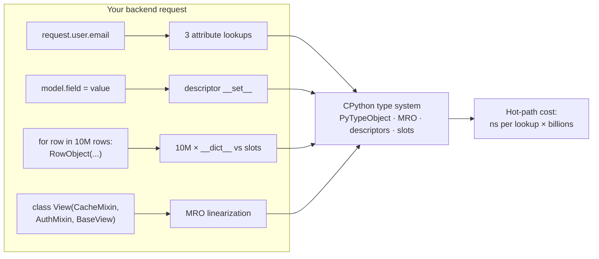
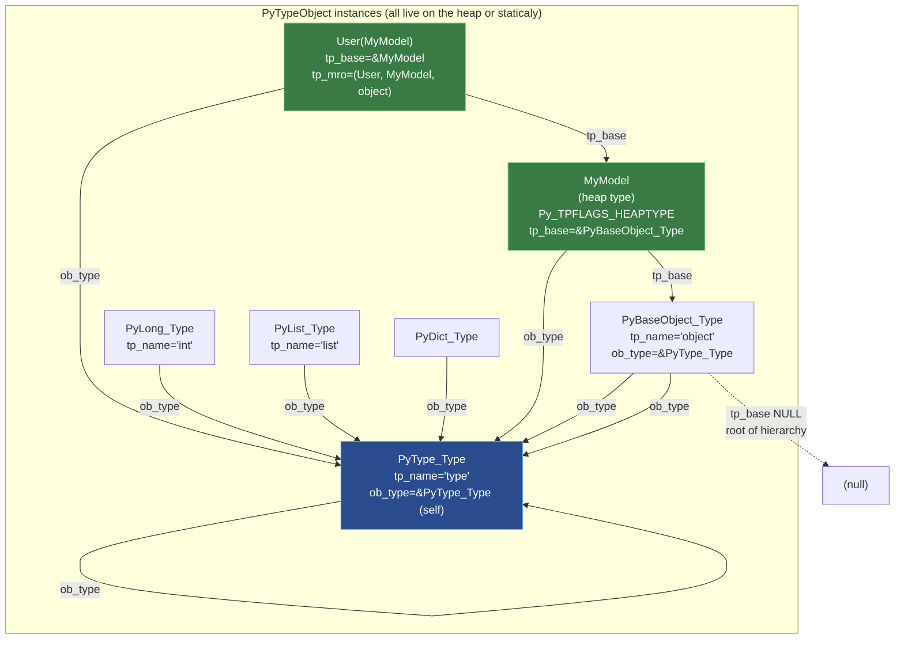
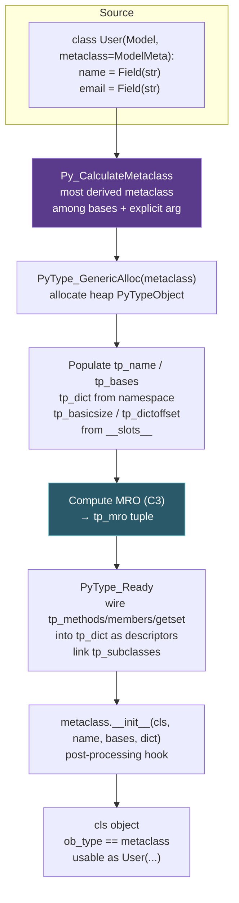
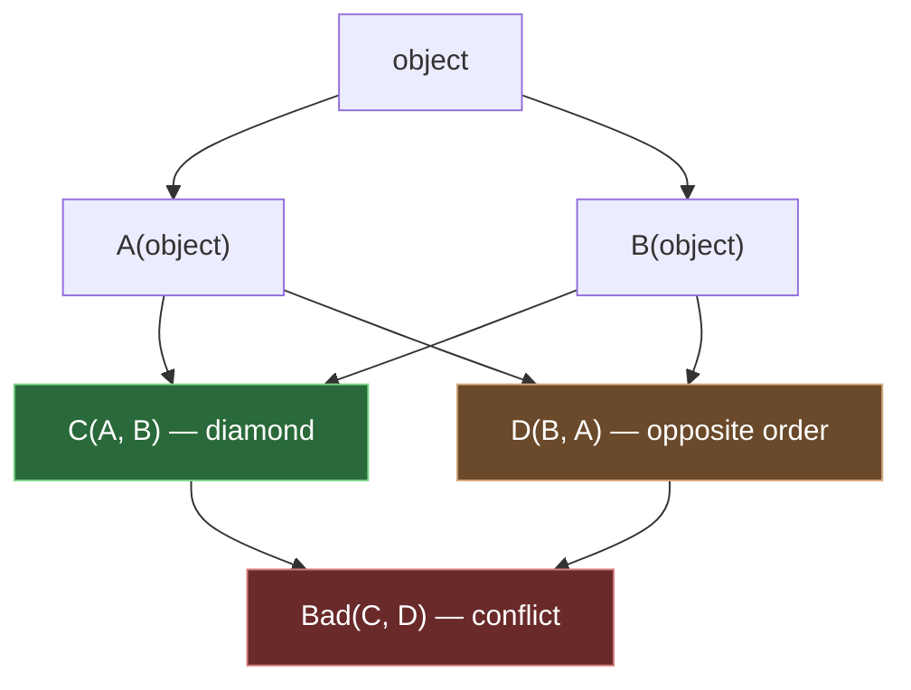
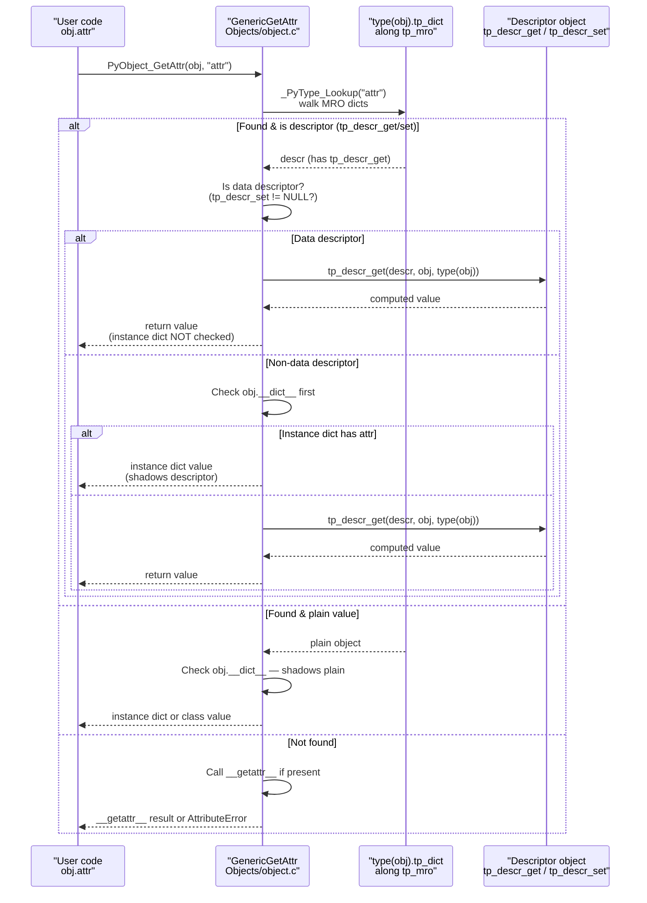
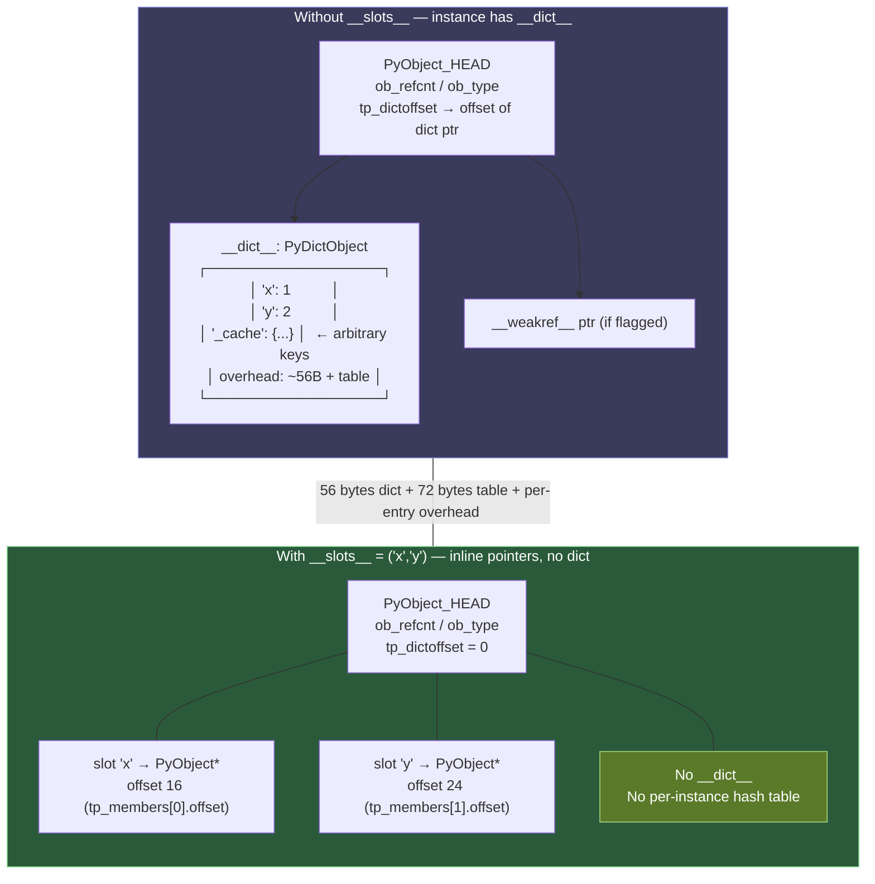

# Chapter 6 — The Type System: Classes, MRO, Descriptors, Slots, and the Attribute Protocol

**What this chapter covers.** Python's type system looks deceptively simple at the surface — `class Foo(Bar):` and off you go — but underneath it is a carefully engineered C-level machine that resolves every `obj.attr`, `obj.method()`, and `isinstance(x, Y)` you write. The core is three interlocking mechanisms: `PyTypeObject` (every type is a C struct that is itself an object), the C3-linearized Method Resolution Order that turns multiple inheritance into a deterministic search path, and the descriptor protocol that makes functions become methods, `property` work, and `__slots__` save memory. This chapter opens all three. You will read the actual `PyTypeObject` layout from `Include/object.h` and `Include/cpython/object.h`, trace `type.__new__` and metaclass construction, linearize diamond hierarchies by hand, walk the full attribute-lookup chain that CPython executes on every dot, implement descriptors from scratch, dissect `__slots__` at the memory-layout level, and see how abstract base classes cheat the `isinstance` check. A running thread throughout: what this costs on the hot path of a backend service doing millions of attribute lookups per second.

Learning goals — after this chapter you should be able to:

- Read `PyTypeObject` in `Include/cpython/object.h` and explain every critical slot: `tp_name`, `tp_bases`, `tp_mro`, `tp_basicsize`, `tp_dictoffset`, `tp_flags`, `tp_descr_get`, `tp_alloc`, `tp_new`, the `tp_as_*` sub-tables, and the `PyType_Spec` / `Py_tp_*` modern definition API.
- Trace type creation end-to-end: `class` statement → `type.__new__(metaclass, name, bases, dict)` → `PyType_Ready` → `tp_mro` computation → insertion into `type`'s own MRO, and explain what metaclasses intercept.
- Compute C3 linearization by hand for arbitrary hierarchies, predict `__mro__`, diagnose `TypeError: Cannot create a consistent method resolution order`, and use `cls.mro()` / `inspect.getmro` / `__mro__` correctly.
- Walk the complete attribute-lookup protocol CPython implements in `Objects/object.c:PyObject_GenericGetAttr` and `typeobject.c`: data descriptor → instance `__dict__` → non-data descriptor / plain class attribute → `__getattr__`, and explain why data descriptors shadow instance dict entries but non-data descriptors do not.
- Implement correct descriptors (`__get__` / `__set__` / `__delete__` / `__set_name__`), distinguish data vs. non-data descriptors, and explain how `property`, `classmethod`, `staticmethod`, `function`, and slot descriptors map onto the protocol.
- Contrast `__getattr__` vs. `__getattribute__` vs. metaclass `__getattr__` / `__getattribute__`, predict when each fires, and avoid infinite-recursion traps.
- Explain `__slots__` at the C level (`tp_dictoffset == 0`, `PyMemberDef` slot descriptors, `tp_members`), quantify its memory and speed tradeoffs, and decide when to use it in backend data models vs. `dataclasses` / `__dict__`.
- Describe `tp_slots` / `PyType_Slot` for special methods (`tp_call`, `tp_iter`, `tp_descr_get`, `tp_as_number.nb_add`, etc.), how `PyType_Ready` wires `__dunder__` names to C slots, and why special-method lookup bypasses instance `__dict__`.
- Explain ABCs (`collections.abc`, `abc.ABCMeta`), virtual subclasses (`register` / `__subclasshook__`), and the `Py_TPFLAGS_IMMUTABLETYPE` / `Py_TPFLAGS_HEAPTYPE` distinction.
- Reason about hot-path attribute-lookup cost and apply the knowledge to ORM field descriptors, validated data models, and high-throughput request objects.

---

## 1. Why the type system is a backend problem

Every HTTP handler your service runs does attribute lookups at a staggering rate. A single `request.user.email` is three lookups, each traversing the chain described in this chapter. An ORM model that validates on assignment fires a descriptor `__set__` on every field write. A dataclass-heavy domain layer that creates millions of short-lived objects pays for `__dict__` allocation on each one — or avoids it with `__slots__`. The type system *is* the path your data takes.

Concrete reasons senior backend engineers should understand this layer:

- **ORMs and validation libraries live on descriptors.** Django fields, SQLAlchemy columns, Pydantic `FieldInfo`, `attrs` validators — all are descriptors or descriptor-adjacent. Knowing data vs. non-data descriptor priority explains why a field default can or cannot be shadowed by instance assignment.
- **Memory footprint of data models is a capacity decision.** A service that holds 10 million row-objects in memory (event buffers, feature stores, queue consumers) sees a 40–60% memory reduction from `__slots__` — or a flexibility cost that breaks serialization. The tradeoff is quantitative, not stylistic.
- **MRO bugs are production bugs.** Diamond hierarchies appear whenever you mix mixins (`LoginRequiredMixin`, `CacheMixin`, `MetricsMixin`) with framework base classes. An MRO conflict is a deploy-time `TypeError`; a silent MRO surprise is a method resolving to the wrong parent in production.
- **Metaclasses power frameworks you depend on.** Django models, SQLAlchemy declarative base, Pydantic `ModelMetaclass`, `ABCMeta` — all intercept class creation via `type.__new__`. Debugging "why does my model have a `_sa_instance_state` attribute I never declared" requires reading the metaclass.
- **Special-method dispatch has a fast path that bypasses your Python.** `obj + other` does not do `getattr(obj, "__add__")`; it reads `obj->ob_type->tp_as_number->nb_add` directly. Overriding `__getattr__` will not intercept `__add__` lookup — a common surprise when building proxy objects for RPC or tracing.



---

## 2. PyTypeObject — types are objects that describe objects

### 2.1 Everything is a PyObject, including types

Chapter 2 introduced `PyObject_HEAD` — the `ob_refcnt` + `ob_type` prefix every value carries. `PyTypeObject` is the struct that `ob_type` points to. It is itself a `PyObject` (via `PyObject_VAR_HEAD`), so types have a type: `type`.

```c
/* Include/cpython/object.h — PyTypeObject (Python 3.12, abbreviated) */
/* The real struct has ~35 named fields plus the variable-length base */

typedef struct _typeobject {
    PyObject_VAR_HEAD                    /* ob_base: ob_refcnt + ob_type + ob_size */
    const char *tp_name;                 /* "int", "list", "myapp.models.User" */

    Py_ssize_t tp_basicsize;             /* sizeof instance, e.g. sizeof(PyLongObject) */
    Py_ssize_t tp_itemsize;              /* 0 for fixed-size; >0 for var objects */

    /* --- deallocation & GC --- */
    destructor tp_dealloc;               /* called when refcnt → 0 */
    Py_ssize_t tp_vectorcall_offset;     /* offset for vectorcall (PEP 590) */
    getattrfunc tp_getattr;              /* legacy, almost always NULL */
    setattrfunc tp_setattr;              /* legacy */
    PyAsyncMethods *tp_as_async;         /* __await__, __aiter__, ... */
    reprfunc tp_repr;                    /* __repr__ slot */

    PyNumberMethods *tp_as_number;       /* nb_add, nb_multiply, ... */
    PySequenceMethods *tp_as_sequence;   /* sq_item, sq_length, sq_concat, ... */
    PyMappingMethods *tp_as_mapping;     /* mp_subscript, mp_ass_subscript, ... */

    hashfunc tp_hash;                    /* __hash__ */
    ternaryfunc tp_call;                 /* __call__ — why types are callable */
    reprfunc tp_str;                     /* __str__ */
    getattrofunc tp_getattro;            /* attribute getter (usually GenericGetAttr) */
    setattrofunc tp_setattro;            /* attribute setter */
    PyBufferProcs *tp_as_buffer;         /* buffer protocol */

    unsigned long tp_flags;              /* Py_TPFLAGS_* bitfield */

    const char *tp_doc;                  /* __doc__ */
    traverseproc tp_traverse;            /* GC traversal */
    inquiry tp_clear;                    /* GC clear */
    richcmpfunc tp_richcompare;          /* __eq__, __lt__, ... */
    Py_ssize_t tp_weaklistoffset;        /* offset to weakref list head */

    getiterfunc tp_iter;                 /* __iter__ */
    iternextfunc tp_iternext;            /* tp_iternext for iterators */

    struct PyMethodDef *tp_methods;      /* methods defined in C */
    struct PyMemberDef *tp_members;      /* C struct members exposed as attributes */
    struct PyGetSetDef *tp_getset;       /* getset descriptors (property-like in C) */
    struct _typeobject *tp_base;         /* single primary base: tp_bases[0] */
    PyObject *tp_dict;                   /* type's __dict__ — attribute namespace */
    descrgetfunc tp_descr_get;           /* descriptor __get__ at the C level */
    descrsetfunc tp_descr_set;           /* descriptor __set__ */
    Py_ssize_t tp_dictoffset;            /* offset to instance __dict__, or 0 if slotted */
    initproc tp_init;                    /* __init__ */
    allocfunc tp_alloc;                  /* instance allocator */
    newfunc tp_new;                      /* __new__ */
    freefunc tp_free;                    /* instance deallocator */
    inquiry tp_is_gc;                    /* participates in GC? */
    PyObject *tp_bases;                  /* tuple of all bases */
    PyObject *tp_mro;                    /* tuple of MRO */
    PyObject *tp_cache;                  /* internal */
    PyObject *tp_subclasses;             /* weak set of subclasses */
    PyObject *tp_weaklist;               /* weakrefs to this type */
    destructor tp_del;                   /* __del__ */
    unsigned int tp_version_tag;         /* MRO version for caching */
    destructor tp_finalize;              /* __del__ finalizer (PEP 442) */
    vectorcallfunc tp_vectorcall;        /* fast call path */
} PyTypeObject;
```

Key fields for backend work:

| Field | What it controls |
|---|---|
| `tp_name` | Dotted name used in `repr(type)` and `_PyType_Lookup` diagnostics. |
| `tp_basicsize` / `tp_itemsize` | Instance allocation size. `tp_itemsize > 0` means `PyVarObject` trailing array (tuples, lists at the type level). |
| `tp_flags` | Bitfield: `Py_TPFLAGS_HEAPTYPE` (created by `class` statement, heap-allocated type), `Py_TPFLAGS_BASETYPE` (can be subclassed), `Py_TPFLAGS_HAVE_GC`, `Py_TPFLAGS_IMMUTABLETYPE` (3.10+, type dict is immutable), `Py_TPFLAGS_MANAGED_DICT` (3.12+, per-type managed dict). |
| `tp_dict` | The type's namespace. In 3.12+ this may be a managed dict (split-table, single copy). Reading `MyClass.attr` searches this dict, then each base's `tp_dict` along `tp_mro`. |
| `tp_mro` / `tp_bases` / `tp_base` | MRO tuple, bases tuple, and the single-inheritance fast path pointer. |
| `tp_dictoffset` | Byte offset from instance start to its `__dict__` pointer. `0` means "no `__dict__`" — the `__slots__` case. |
| `tp_descr_get` / `tp_descr_set` | If non-NULL, this type's instances act as descriptors. How `function`, `property`, and `member_descriptor` plug in. |
| `tp_as_number` / `tp_as_sequence` / `tp_as_mapping` / ... | Sub-tables for special methods. `PyType_Ready` wires `__add__` → `tp_as_number->nb_add` etc. |
| `tp_getattro` / `tp_setattro` | The attribute-access entry points. Almost every type uses `PyObject_GenericGetAttr` / `PyObject_GenericSetAttr`. Overriding `__getattribute__` replaces `tp_getattro` with a wrapper. |

Modern C extensions do not fill `PyTypeObject` by hand. They use the `PyType_Spec` / `PyType_Slot` API (`PyType_FromSpec`):

```c
/* Modern style — Objects/typeobject.c, any C extension since 3.2 */
static PyType_Slot MyObject_slots[] = {
    {Py_tp_doc,       "MyObject — example heap type"},
    {Py_tp_new,       MyObject_new},
    {Py_tp_init,      MyObject_init},
    {Py_tp_dealloc,   MyObject_dealloc},
    {Py_tp_repr,      MyObject_repr},
    {Py_nb_add,       MyObject_add},        /* → tp_as_number->nb_add */
    {Py_sq_length,    MyObject_len},        /* → tp_as_sequence->sq_length */
    {Py_tp_methods,   MyObject_methods},
    {Py_tp_members,   MyObject_members},
    {0, NULL}
};
static PyType_Spec MyObject_spec = {
    .name = "mymod.MyObject",
    .basicsize = sizeof(MyObject),
    .flags = Py_TPFLAGS_DEFAULT | Py_TPFLAGS_BASETYPE,
    .slots = MyObject_slots,
};
/* In module init: PyType_FromSpec(&MyObject_spec) → PyType_Ready internally */
```

### 2.2 The type hierarchy — who points at whom



Critical invariant: `type` is its own type (`PyType_Type.ob_type == &PyType_Type`), bootstrapped in `Objects/typeobject.c:PyType_Ready` at interpreter startup. Every heap type (created by `class`) has `Py_TPFLAGS_HEAPTYPE` set, owns its `tp_dict`, and appears in its base's `tp_subclasses` weak set — which is how `__subclasses__()` works.

---

## 3. Type creation — `type.__new__` and metaclasses

### 3.1 What `class` actually executes

```python
class User(Model):
    name: str
    email: str
```

is not syntax sugar for a dict assignment. The interpreter executes roughly:

```python
# What CPython does for "class User(Model): ..."  (Python/ceval.c + bltinmodule.c)
User = type.__new__(type, "User", (Model,), {"name": ..., "email": ..., "__module__": ..., "__qualname__": "User"})
# type.__new__ internally calls PyType_Ready-equivalent for heap types:
#   - allocates PyTypeObject (heap)
#   - copies bases → tp_bases, computes tp_mro via C3
#   - creates tp_dict from the namespace dict
#   - wires tp_as_number / tp_as_sequence etc. from dunder names
#   - calls metaclass.__init__(User, "User", (Model,), namespace)
```

`type.__new__` is `type_new` in `Objects/typeobject.c` (~400 lines). Simplified steps:

1. **Validate** — `name` is `str`, `bases` is tuple of types, `dict` is dict.
2. **Determine metaclass** — `Py_CalculateMetaclass(metatype, bases)` picks the most derived metaclass among bases; an explicit `metaclass=` keyword argument wins if it is a subtype of the calculated one, else `TypeError`.
3. **Allocate** — `PyType_GenericAlloc(metaclass, 0)` allocates a new `PyTypeObject` on the heap.
4. **Populate** — `tp_name`, `tp_bases`, `tp_base`, `tp_dict`, `tp_basicsize` (from `__slots__` or default), `tp_dictoffset`, `tp_flags`.
5. **Ready** — `PyType_Ready(new_type)` computes MRO, installs `tp_getattro`/`tp_setattro` if not already set, processes `tp_methods`/`tp_members`/`tp_getset` into `tp_dict` descriptors, links `tp_subclasses`.
6. **Init** — calls `metaclass.__init__(new_type, name, bases, dict)` (usually `type.__init__` which is a no-op).

### 3.2 Metaclasses — intercepting class creation

A metaclass is just a subclass of `type` whose `__new__` / `__init__` intercepts step 2–6 above. Every class has a metaclass; if you do not declare one it is `type`.



```python
# Minimal ORM-style metaclass — the pattern behind Django/SQLAlchemy/Pydantic
class Field:
    """Descriptor that will become a slot descriptor after metaclass processing."""
    def __init__(self, dtype, default=None):
        self.dtype = dtype
        self.default = default
        self.name = None
    def __set_name__(self, owner, name):
        self.name = name
        self.private_name = f"_{name}"
    def __get__(self, obj, objtype=None):
        if obj is None:
            return self          # access via class → return descriptor itself
        return getattr(obj, self.private_name, self.default)
    def __set__(self, obj, value):
        if not isinstance(value, self.dtype):
            raise TypeError(f"{self.name} expects {self.dtype.__name__}, got {type(value).__name__}")
        object.__setattr__(obj, self.private_name, value)

class ModelMeta(type):
    """Collect Field descriptors and optionally inject __slots__."""
    def __new__(mcls, name, bases, namespace):
        fields = {k: v for k, v in namespace.items() if isinstance(v, Field)}
        # Give each Field its name (also done automatically via __set_name__ after creation,
        # but metaclass can do extra bookkeeping)
        cls = super().__new__(mcls, name, bases, namespace)
        cls._fields = fields   # registry used by save()/validate()/serialize()
        return cls

class Model(metaclass=ModelMeta):
    pass

class User(Model):
    name = Field(str, default="")
    email = Field(str, default="")

# Metaclass has run: User._fields == {"name": ..., "email": ...}
u = User()
u.name = "Ada"
print(User._fields)   # {'name': <Field>, 'email': <Field>}
print(u.name)          # Ada  (descriptor __get__)
try:
    u.email = 42
except TypeError as e:
    print(e)           # email expects str, got int
```

Key points visible here:

- `Field.__set_name__` (PEP 487, Python 3.6+) is called automatically by `type.__new__` after `tp_dict` is populated — no metaclass needed just for naming. Metaclasses remain useful when you need to *transform* the namespace (inject `__slots__`, wrap methods, build registries).
- Accessing `User.name` returns the descriptor itself (because `obj is None` in `__get__`); accessing `u.name` invokes the descriptor on the instance.
- `ModelMeta.__new__` must call `super().__new__` — that is `type.__new__` which does the real `PyTypeObject` allocation and MRO computation. Forgetting it produces a non-type object.

```python
# When metaclass selection fails — explicit metaclass must be subtype of base metaclasses
class MetaA(type): pass
class MetaB(type): pass
class BaseA(metaclass=MetaA): pass
class BaseB(metaclass=MetaB): pass

try:
    class Bad(BaseA, BaseB):  # MetaA and MetaB are unrelated
        pass
except TypeError as e:
    print(e)
    # metaclass conflict: the metaclass of a derived class must be a
    # (non-strict) subclass of the metaclasses of all its bases
```

Fix: create a merged metaclass `class MetaAB(MetaA, MetaB): pass` and declare `class Good(BaseA, BaseB, metaclass=MetaAB)`.

---

## 4. MRO — C3 linearization

### 4.1 Why linearization matters

With single inheritance, attribute search is trivial: walk `cls → cls.__base__ → ... → object`. With multiple inheritance the hierarchy is a DAG, not a chain, and Python must flatten it into a single deterministic order that respects two constraints:

1. **Local precedence** — if `class C(A, B)`, then `A` precedes `B` in `C`'s MRO.
2. **Monotonicity** — if `X` precedes `Y` in any parent's MRO, it precedes `Y` in the child's MRO.

C3 linearization is the algorithm that satisfies both or raises `TypeError` when they conflict.

### 4.2 The algorithm

For `class C(A, B)` where `A` and `B` already have linearizations `L[A]`, `L[B]`:

```
L[C] = [C] + merge(L[A], L[B], [A, B])
```

`merge` repeatedly picks the first head that does not appear in the tail of any other list, appends it, and removes it from all lists. If no such head exists, the hierarchy is inconsistent.

CPython implements this in `Objects/typeobject.c:mro_internal` and `pmerge`.

### 4.3 Worked diamond



```python
# Diamond — the classic case
class A:  pass
class B(A): pass
class C(A): pass
class D(B, C): pass   # D's MRO must interleave B and C correctly

print(D.__mro__)
# (<class '__main__.D'>, <class '__main__.B'>, <class '__main__.C'>,
#  <class '__main__.A'>, <class 'object'>)

# C3 trace for D(B, C):
#   L[B] = [B, A, object]
#   L[C] = [C, A, object]
#   L[D] = [D] + merge([B, A, object], [C, A, object], [B, C])
#   merge step 1: head B not in tail of any list → pick B → ([A,object],[C,A,object],[C])
#   merge step 2: head A is in tail of [C,A,object] → skip A, pick C → ([A,object],[A,object],[])
#   merge step 3: pick A → ([object],[object])
#   merge step 4: pick object → []
#   Result: [D, B, C, A, object]

# Inspect correctly — three equivalent spellings with different semantics:
print(D.mro())              # computes fresh list (calls mro_internal)
print(D.__mro__)            # cached tuple from tp_mro — the canonical value
import inspect
print(inspect.getmro(D))    # same as __mro__, but works on instances too

# Opposite order produces a different MRO
class E(C, B): pass
print(E.__mro__)
# (<class 'E'>, <class 'C'>, <class 'B'>, <class 'A'>, <class 'object'>)

# Inconsistent hierarchy — C3 cannot satisfy both orderings
try:
    class Bad(D, E):  # D wants B before C, E wants C before B
        pass
except TypeError as e:
    print(f"MRO conflict: {e}")
    # Cannot create a consistent method resolution order (MRO) for bases B, C
```

```python
# MRO determines which method runs — silent correctness bug if you get it wrong
class CacheMixin:
    def save(self): print("CacheMixin.save"); super().save()
class MetricsMixin:
    def save(self): print("MetricsMixin.save"); super().save()
class BaseModel:
    def save(self): print("BaseModel.save")

class MyModel(CacheMixin, MetricsMixin, BaseModel): pass

print([c.__name__ for c in MyModel.__mro__])
# ['MyModel', 'CacheMixin', 'MetricsMixin', 'BaseModel', 'object']
MyModel().save()
# CacheMixin.save
# MetricsMixin.save
# BaseModel.save

# Swap mixin order → different behavior
class MyModel2(MetricsMixin, CacheMixin, BaseModel): pass
print([c.__name__ for c in MyModel2.__mro__])
# ['MyModel2', 'MetricsMixin', 'CacheMixin', 'BaseModel', 'object']

# Cooperative multiple inheritance via super() walks the MRO, not the parent.
# Each save() calls super().save() which resolves to the NEXT class in MRO.
```

C3 properties that matter operationally:

- Every class appears exactly once in its MRO, and `object` is always last (except for `object` itself).
- `cls.__mro__` is a tuple stored in `PyTypeObject.tp_mro` and is immutable after creation. `cls.mro()` returns a fresh list — useful for metaclasses that want to compute a custom order before `tp_mro` is frozen, but do not mutate the returned list expecting `__mro__` to change.
- `super()` with no arguments (PEP 3135) captures `__class__` from the enclosing scope and walks `__class__.__mro__` starting after the current class. `super(CacheMixin, self).save()` is the explicit form — same MRO walk with a different start point.
- The MRO version tag (`tp_version_tag`) invalidates CPython's type-lookup caches (`type_getattro` inline cache, `LOAD_GLOBAL` cache, `LOAD_ATTR` specialization) whenever any class in the hierarchy mutates. Hot-loop attribute lookup benefits from a stable tag; churning `tp_dict` entries in a loop defeats the cache.

---

## 5. The attribute protocol — the full lookup chain

Every `obj.attr` and `type(obj).attr` lookup executes a precise sequence in `PyObject_GenericGetAttr` (`Objects/object.c`) and `type_getattro` (`Objects/typeobject.c`). The difference between "instance attribute" and "class attribute" is not where the value is stored but where the lookup finds it.

### 5.1 Instance attribute lookup (`object.__getattribute__` default)

```mermaid
flowchart TB
    START(["obj.attr<br/>(PyObject_GetAttr)"]) --> GETATTRO{"tp_getattro?<br/>(usually<br/>GenericGetAttr)"}
    GETATTRO -->|custom __getattribute__| CUSTOM["Call tp_getattro<br/>(user __getattribute__)"]
    GETATTRO -->|default path| SEARCH["Search type MRO for 'attr'"]

    SEARCH --> FOUND{"Found in<br/>type/MRO dict?"}
    FOUND -->|No| INSTDICT{"Instance __dict__<br/>has 'attr'?"}
    FOUND -->|Yes: data descriptor<br/>has tp_descr_set| DATADESCR["Data descriptor wins<br/>→ descr.__get__(obj, type)"]
    FOUND -->|Yes: non-data / plain| NONDATA{"Instance __dict__<br/>has 'attr'?"}

    INSTDICT -->|Yes| RETINST["Return instance dict value"]
    INSTDICT -->|No| GETATTR Fallback

    NONDATA -->|Yes: shadows plain attr<br/>but NOT data descr| RETINST2["Return instance dict value"]
    NONDATA -->|No| INVOKE{"Invoke descriptor?"}

    INVOKE -->|has tp_descr_get| NONDESCR["→ descr.__get__(obj, type)<br/>(functions become methods here)"]
    INVOKE -->|plain value| RETCLASS["Return class attribute"]

    DATADESCR --> RET1(["Return value"])
    NONDESCR --> RET2(["Return value (bound method / property result)"])
    RETCLASS --> RET3(["Return value"])
    RETINST & RETINST2 --> RET4(["Return value"])

    Fallback["__getattr__ fallback"] --> HASGETATTR{"type has __getattr__?"}
    HASGETATTR -->|Yes| CALLGETATTR["Call __getattr__('attr')"]
    HASGETATTR -->|No| ATTRERR(["Raise AttributeError"])

    CUSTOM -.->|may call| SEARCH

    style DATADESCR fill:#2a4b8d,stroke:#6ea8fe,color:#fff
    style Fallback fill:#6a4a2a,stroke:#d4a87e,color:#fff
    style ATTRERR fill:#6a2a2a,stroke:#d47e7e,color:#fff
```

The priority order, stated precisely:

1. **Data descriptor on the type/MRO** — if `type(obj).__dict__['attr']` (or any base's dict along `tp_mro`) has `tp_descr_set != NULL` (i.e., defines `__set__` or `__delete__`), call its `tp_descr_get` immediately. The instance dict is not consulted. This is why `property` without a setter still shadows instance dict, and `property` with a setter *always* does.

2. **Instance `__dict__`** — if `obj.__dict__['attr']` exists, return it. This is the fast path for plain instance attributes. CPython checks `tp_dictoffset` to find `__dict__`; if `tp_dictoffset == 0` there is no instance dict (slots-only object).

3. **Non-data descriptor / plain class attribute** — if the MRO entry has `tp_descr_get != NULL` but `tp_descr_set == NULL` (non-data descriptor: functions, `classmethod`, `staticmethod` without `__set__`), call `tp_descr_get`. Otherwise return the plain value.

4. **`__getattr__` fallback** — if nothing was found in steps 1–3, and the type defines `__getattr__` (via `tp_getattro` chaining or `__getattr__` in the MRO), call it with the attribute name.

5. **`AttributeError`** — if `__getattr__` is absent or raises.

This ordering is why descriptors can implement computed fields that *cannot* be accidentally shadowed (`data` descriptors), and also methods that *can* be shadowed by per-instance assignment (`non-data` descriptors — functions).

### 5.2 Class attribute lookup (`type.__getattribute__`)

Attribute access on a class (`MyClass.attr`) uses `type_getattro` in `Objects/typeobject.c`, not `PyObject_GenericGetAttr`. The search order is:

```
type(MyClass).__mro__  →  MyClass.__mro__
```

That is: search the metaclass MRO first (so `type.__getattribute__` and metaclass descriptors can intercept), then the class MRO. Metaclass data descriptors shadow class `__dict__` entries the same way instance ones do. `MyClass.__getattr__` in this context is `type.__getattr__` — the metaclass's fallback.

### 5.3 Tracing a lookup with real code

```python
class LoggingDescr:
    """Data descriptor that logs every access."""
    def __set_name__(self, owner, name): self.name = name
    def __get__(self, obj, objtype=None):
        print(f"  descr __get__({self.name!r}, obj={obj!r})")
        if obj is None: return self
        return obj.__dict__.get(f"_{self.name}", f"<default {self.name}>")
    def __set__(self, obj, value):
        print(f"  descr __set__({self.name!r}, {value!r})")
        obj.__dict__[f"_{self.name}"] = value
    def __delete__(self, obj):
        print(f"  descr __delete__({self.name!r})")
        obj.__dict__.pop(f"_{self.name}", None)

class NonDataDescr:
    def __get__(self, obj, objtype=None):
        print(f"  non-data __get__(obj={obj!r})")
        if obj is None: return self
        return 42

class Demo:
    data = LoggingDescr()
    non_data = NonDataDescr()
    plain = "class plain value"
    def __getattr__(self, name):
        print(f"  __getattr__({name!r})")
        return f"<getattr:{name}>"

d = Demo()
print("--- data descriptor shadows instance dict ---")
d.__dict__["data"] = "shadow attempt"   # goes into instance dict directly
print(f"d.data = {d.data!r}")           # still goes through descriptor!
#   descr __get__('data', obj=<Demo>)
# shadows? No — data descriptor wins per step 1.

print("\n--- non-data descriptor is shadowed by instance dict ---")
print(f"d.non_data = {d.non_data!r}")  # 42 via descriptor
#   non-data __get__(obj=<Demo>)
d.__dict__["non_data"] = "shadowed"
print(f"d.non_data (after shadow) = {d.non_data!r}")  # "shadowed" — instance dict wins

print("\n--- plain class attr is shadowed ---")
print(f"d.plain = {d.plain!r}")         # "class plain value"
d.plain = "instance plain"
print(f"d.plain (after shadow) = {d.plain!r}")  # "instance plain"

print("\n--- __getattr__ only fires on full miss ---")
print(f"d.missing = {d.missing!r}")
#   __getattr__('missing')
print(f"d.data still does not call __getattr__")  # descriptor found, no fallback
```

---

## 6. Descriptors — the protocol behind `property`, methods, and slots

### 6.1 The descriptor protocol

A descriptor is any object that defines at least one of `__get__`, `__set__`, `__delete__`. At the C level this means `tp_descr_get` or `tp_descr_set` is non-NULL.

```python
# The protocol in pure Python (CPython calls tp_descr_get/tp_descr_set at the C level)
class Descriptor:
    def __get__(self, obj, objtype=None) -> object: ...
    def __set__(self, obj, value) -> None: ...
    def __delete__(self, obj) -> None: ...
    def __set_name__(self, owner, name) -> None: ...  # PEP 487, called at class creation
```



The classification:

| Descriptor kind | Has `__get__` | Has `__set__`/`__delete__` | Priority vs. instance `__dict__` |
|---|---|---|---|
| **Data descriptor** | yes (usually) | yes | **Wins** over instance dict. Instance assignment goes through `__set__`, never creates a dict entry shadowing it. |
| **Non-data descriptor** | yes | no | **Loses** to instance dict. Assignment creates a dict entry that shadows future lookups. |
| **Plain attribute** | no | no | Loses to instance dict. Not a descriptor at all. |

### 6.2 `property`, `classmethod`, `staticmethod` — all descriptors

```python
# property as a data descriptor — CPython's Lib version simplified
class my_property:
    def __init__(self, fget=None, fset=None, fdel=None, doc=None):
        self.fget, self.fset, self.fdel = fget, fset, fdel
        if doc is None and fget is not None: doc = fget.__doc__
        self.__doc__ = doc
    def __get__(self, obj, objtype=None):
        if obj is None: return self
        if self.fget is None: raise AttributeError("unreadable attribute")
        return self.fget(obj)
    def __set__(self, obj, value):
        if self.fset is None: raise AttributeError("can't set attribute")
        self.fset(obj, value)
    def __delete__(self, obj):
        if self.fdel is None: raise AttributeError("can't delete attribute")
        self.fdel(obj)
    def getter(self, fget): return type(self)(fget, self.fset, self.fdel, self.__doc__)
    def setter(self, fset): return type(self)(self.fget, fset, self.fdel, self.__doc__)
    def deleter(self, fdel): return type(self)(self.fget, self.fset, fdel, self.__doc__)

# Real usage — note property is a DATA descriptor (has __set__), so it always wins.
class Temperature:
    def __init__(self, celsius=0):
        self._c = celsius
    @my_property
    def celsius(self): return self._c
    @celsius.setter
    def celsius(self, v):
        if v < -273.15: raise ValueError("below absolute zero")
        self._c = v
    @my_property
    def fahrenheit(self): return self._c * 9/5 + 32
    @fahrenheit.setter
    def fahrenheit(self, v): self.celsius = (v - 32) * 5/9

t = Temperature(25)
print(t.fahrenheit)   # 77.0  — property __get__
t.fahrenheit = 212
print(t.celsius)      # 100.0 — property __set__ → celsius setter
```

```python
# Functions are non-data descriptors — that is how methods bind.
class FunctionDescr:
    """Simplified model of function.__get__ (Objects/funcobject.c:func_descr_get)."""
    def __init__(self, func): self.func = func
    def __get__(self, obj, objtype=None):
        if obj is None:
            return self.func          # unbound access: Cls.method → raw function
        # Bound method: CPython creates a PyMethodObject that holds (func, obj, type)
        import types
        return types.MethodType(self.func, obj)

class MyClass:
    def method(self, x): return f"{self!r} + {x}"

# What CPython does on d.method:
#   1. Looks up "method" in MyClass.__dict__ → finds function object (has tp_descr_get, no tp_descr_set → non-data)
#   2. Instance dict has no "method" → calls function.__get__(d, MyClass) → bound method
#   3. Calling the bound method prepends `d` as first argument.
print(type(MyClass.__dict__["method"]))  # <class 'function'>
print(type(MyClass.method))              # <class 'function'>  (obj is None → raw function)
print(type(MyClass().method))            # <class 'method'>    (bound)

# Prove non-data: instance assignment shadows the function
obj = MyClass()
obj.method = lambda x: f"shadowed {x}"
print(obj.method("hi"))  # shadowed hi  — instance dict won
```

`classmethod` and `staticmethod` are also descriptors, with opposite binding behavior:

```python
# How classmethod / staticmethod descriptors work (Objects/funcobject.c)
class MyService:
    _registry = {}

    @classmethod
    def from_config(cls, cfg):          # cls is MyService (or subclass)
        return cls(**cfg)

    @staticmethod
    def validate(cfg):                   # no implicit first arg
        return isinstance(cfg, dict)

# classmethod.__get__ binds the CLASS, not the instance:
#   MyService.from_config → classmethod.__get__(None, MyService) → bound-to-class method
#   MyService().from_config → classmethod.__get__(instance, MyService) → same
# staticmethod.__get__ returns the raw function unchanged regardless of obj/objtype
print(MyService.from_config)     # <bound method MyService.from_config>
print(MyService().from_config)   # <bound method MyService.from_config>  (same cls)
print(MyService.validate)        # <function validate>  — no binding
```

### 6.3 Slot descriptors — C-level data descriptors for `__slots__`

When a class uses `__slots__`, CPython creates a `member_descriptor` (a.k.a. slot descriptor) for each slot name. These are C-level data descriptors whose `tp_descr_get` / `tp_descr_set` read and write directly into the instance's memory at a fixed offset — no `__dict__` involved.

```python
class Slotted:
    __slots__ = ("x", "y")
    def __init__(self, x, y): self.x, self.y = x, y

print(type(Slotted.__dict__["x"]))   # <class 'member_descriptor'>
print(hasattr(Slotted.__dict__["x"], "__get__"))  # True
print(hasattr(Slotted.__dict__["x"], "__set__"))  # True — data descriptor

s = Slotted(1, 2)
print(s.x)   # 1 — slot descriptor __get__ reads offset in instance memory
s.x = 99
print(s.x)   # 99 — slot descriptor __set__ writes at offset
```

Slot descriptors are data descriptors, so `s.__dict__["x"] = "shadow"` cannot shadow them — though slotted instances have no `__dict__` by default anyway.

---

## 7. `__slots__` — trading flexibility for density and speed

### 7.1 What `__slots__` changes in `PyTypeObject`

Without `__slots__`:

- `tp_dictoffset != 0` — each instance carries a `PyObject*` pointer to its `__dict__`.
- `tp_basicsize` is just `sizeof(PyObject)` plus any C-level fields.
- Attribute assignment creates or updates an entry in the per-instance `dict`.

With `__slots__ = ("x", "y")`:

- `PyType_Ready` allocates one `PyMemberDef` per slot, creates a `member_descriptor` for each, and stores them in `tp_dict`.
- `tp_dictoffset` is set to `0` (no instance `__dict__`) unless `"__dict__"` is explicitly listed in `__slots__` or a base already has one.
- `tp_basicsize` grows by `n_slots * sizeof(PyObject*)` — each slot is a pointer stored inline in the instance struct, right after the `PyObject_HEAD`.
- There is no per-instance dict at all; the instance is essentially a fixed-size struct.



### 7.2 Memory and speed tradeoffs

| Aspect | `__dict__` (default) | `__slots__` |
|---|---|---|
| **Per-instance memory** | `PyObject_HEAD` (16B) + `__dict__` pointer (8B) + dict object (~56B) + table (~72B for small) + entry overhead (~24B/key) | `PyObject_HEAD` + `n * 8B` pointers, no dict. Savings ~40–60% at scale. |
| **Attribute access** | `dict` hash lookup (`O(1)` but with hash + probe) | Direct pointer at fixed offset — one indirection. Faster, especially for read-heavy hot loops. |
| **Assignment of new names** | Any name allowed: `obj.anything = v` | Only declared slot names (plus `__dict__`/`__weakref__` if requested). `obj.z = 1` raises `AttributeError`. |
| **Introspection** | `vars(obj)`, `obj.__dict__`, `__dict__.update` all work. | No `__dict__` by default; `vars()` raises `TypeError`. Serialization that assumes `__dict__` breaks. |
| **Weak references** | Supported by default. | Need `"__weakref__"` in `__slots__` to allow `weakref.ref(obj)`. |
| **Pickling** | Works via `__dict__`. | Requires `__getstate__`/`__setstate__` or relies on slot descriptors; `copy`/`pickle` handle it but slower. |
| **Inheritance** | Subclass gets its own `__dict__` unless it also declares `__slots__`. | Subclass without `__slots__` regains a `__dict__` and `__weakref__`; memory benefit is partially lost. |

### 7.3 Slots benchmark

```python
import sys, timeit, tracemalloc

# --- memory ---
class DictPoint:
    def __init__(self, x, y, z): self.x, self.y, self.z = x, y, z

class SlotPoint:
    __slots__ = ("x", "y", "z")
    def __init__(self, x, y, z): self.x, self.y, self.z = x, y, z

N = 200_000
dict_objs = [DictPoint(1, 2, 3) for _ in range(N)]
slot_objs = [SlotPoint(1, 2, 3) for _ in range(N)]

print(f"DictPoint instance size (incl. __dict__): {sys.getsizeof(dict_objs[0]) + sys.getsizeof(dict_objs[0].__dict__)} bytes")
# ~56 (object) + ~104 (dict + table) ≈ 160
print(f"SlotPoint instance size (no __dict__):    {sys.getsizeof(slot_objs[0])} bytes")
# ~56 — just the struct + 3 pointers

tracemalloc.start()
dict_objs2 = [DictPoint(i, i+1, i+2) for i in range(100_000)]
_, peak_dict = tracemalloc.get_traced_memory()
tracemalloc.reset_peak()
tracemalloc.clear_traces()
slot_objs2 = [SlotPoint(i, i+1, i+2) for i in range(100_000)]
_, peak_slot = tracemalloc.get_traced_memory()
tracemalloc.stop()
print(f"Peak tracemalloc 100k DictPoint: {peak_dict/1e6:.1f} MB")
print(f"Peak tracemalloc 100k SlotPoint: {peak_slot/1e6:.1f} MB")
# Expect ~40-55% reduction for slots

# --- speed: attribute read + write ---
print(timeit.timeit("p.x; p.y; p.z", globals={"p": dict_objs[0]}, number=2_000_000))
print(timeit.timeit("p.x; p.y; p.z", globals={"p": slot_objs[0]}, number=2_000_000))
# Slots typically 10-20% faster on reads; writes similar. Gap widens when GC pressure matters.
```

Typical output (CPython 3.12, Linux x86-64):

```
DictPoint instance size (incl. __dict__): 160 bytes
SlotPoint instance size (no __dict__):    56 bytes
Peak tracemalloc 100k DictPoint: 28.4 MB
Peak tracemalloc 100k SlotPoint: 14.9 MB
0.084s  (dict read)
0.069s  (slots read)
```

The 10M-object event-buffer scenario: at 160B vs. 56B per object the difference is ~1 GB vs. ~0.5 GB — enough to avoid an extra replica or to fit in a smaller instance class.

### 7.4 Hybrid: slots + `__dict__` + `__weakref__`

```python
class Hybrid:
    __slots__ = ("x", "y", "__dict__", "__weakref__")
    def __init__(self, x, y, **kw): self.x, self.y = x, y; self.__dict__.update(kw)

h = Hybrid(1, 2, label="extra", meta={})
print(h.x)              # 1 — slot descriptor, fixed offset
print(h.label)          # extra — from __dict__
import weakref
r = weakref.ref(h)      # works because __weakref__ slot present
print(r() is h)         # True

# dataclasses with slots (Python 3.10+):
from dataclasses import dataclass

@dataclass(slots=True)          # generates __slots__ automatically, no __dict__
class DCPoint:
    x: float
    y: float
    label: str = ""

# Equivalent hand-written slots class, but dataclass still generates __init__/__repr__/__eq__.
print(DCPoint.__slots__)         # ('x', 'y', 'label')
print(hasattr(DCPoint(1, 2), "__dict__"))  # False
```

```python
# Inheritance subtlety — child without slots regains a dict
class SlottedBase:
    __slots__ = ("x",)

class ChildNoSlots(SlottedBase):
    pass   # no __slots__ → gets __dict__ + __weakref__

c = ChildNoSlots()
c.x = 1        # slot from base
c.extra = 2    # goes into __dict__ — ChildNoSlots has one
print(c.__dict__)   # {'extra': 2}

class ChildWithSlots(SlottedBase):
    __slots__ = ("y",)   # only declares NEW slots; inherits base's

print(ChildWithSlots.__slots__)  # ('y',)
cc = ChildWithSlots()
cc.x = 1; cc.y = 2
print(hasattr(cc, "__dict__"))   # False — still no dict
```

---

## 8. `__getattr__` vs. `__getattribute__` vs. metaclass hooks

These three names are the most confused corner of the attribute protocol, and the confusion causes infinite-recursion bugs in production proxies and ORMs.

### 8.1 `__getattribute__` — unconditional interceptor

- Called on **every** attribute access, before any of the lookup steps in §5. Defined as `tp_getattro` at the C level.
- Default is `object.__getattribute__` → `PyObject_GenericGetAttr` (the flowchart in §5).
- If you override it, you replace the entire lookup chain. You must call `super().__getattribute__(name)` or `object.__getattribute__(self, name)` to get the default behavior, or you will recurse forever.

```python
class TracingGetAttribute:
    def __init__(self, **kw): self.__dict__.update(kw)
    def __getattribute__(self, name):
        # DANGER: `self.__dict__` would call __getattribute__('__dict__') → recursion!
        # Use object.__getattribute__ to bypass the override.
        print(f"__getattribute__({name!r})")
        return object.__getattribute__(self, name)

t = TracingGetAttribute(x=1)
print(t.x)
# __getattribute__('x')  →  returns 1 via object.__getattribute__

# Infinite recursion anti-pattern:
class Broken:
    def __getattribute__(self, name):
        return self.__dict__[name]   # BUG: self.__dict__ triggers __getattribute__('__dict__')
# Broken().anything  →  RecursionError
```

### 8.2 `__getattr__` — fallback only

- Called **only** when normal lookup (descriptors → `__dict__` → MRO) found nothing. It is the last step before `AttributeError`.
- It receives only the name that failed. It does not see the object that was searched — just `self` and the string.
- CPython looks for `__getattr__` via `_PyType_Lookup(type(self), "__getattr__")`, then calls it if present. This means `__getattr__` itself is subject to descriptor binding if defined on a class.

```python
class LazyModule:
    """Proxy that lazily imports submodules on attribute access — pattern used by importlib."""
    def __init__(self, mapping): self._mapping = mapping; self._cache = {}
    def __getattr__(self, name):
        # Only called when name is NOT in __dict__ or type MRO — safe to check mapping
        if name in self._mapping:
            mod = __import__(self._mapping[name], fromlist=[name])
            self._cache[name] = mod
            return mod
        raise AttributeError(f"no lazy module {name!r}")

lm = LazyModule({"json": "json"})
print(lm.json)       # imports json via __getattr__
print(lm.json)       # second access: found in _cache? No — still via __getattr__ unless you cache in __dict__
# Fix: store in __dict__ so next lookup hits step 2 (instance dict) and bypasses __getattr__
class LazyModuleCached(LazyModule):
    def __getattr__(self, name):
        if name in self._mapping:
            mod = __import__(self._mapping[name], fromlist=[name])
            object.__setattr__(self, name, mod)  # cache in instance dict
            return mod
        raise AttributeError(name)
```

### 8.3 Metaclass `__getattr__` / `__getattribute__` — class-level interception

When you write `MyClass.attr`, the lookup uses `type(MyClass).__getattribute__` (the metaclass). So:

- Defining `__getattr__` on a class intercepts **instance** misses (`obj.missing`).
- Defining `__getattr__` on a **metaclass** intercepts **class** misses (`MyClass.missing`).

```python
class Meta(type):
    def __getattr__(cls, name):
        print(f"Meta.__getattr__({cls.__name__}.{name!r})")
        if name.startswith("find_by_"):
            field = name[8:]
            return lambda value: f"SELECT * WHERE {field}={value!r}"
        raise AttributeError(name)
    def __getattribute__(cls, name):
        # Intercepts every MyClass.attr access — use with care
        if name == "secret":
            raise AttributeError("nope")
        return super().__getattribute__(name)

class User(metaclass=Meta):
    pass

print(User.find_by_email("a@b.com"))  # SELECT * WHERE email='a@b.com'  (metaclass __getattr__)
try: print(User.secret)
except AttributeError as e: print(e)  # nope  (metaclass __getattribute__)

# Instance-level __getattr__ is independent:
class User2(metaclass=Meta):
    def __getattr__(self, name): return f"instance fallback {name}"

print(User2.find_by_name("x"))   # metaclass __getattr__ — class access, not instance
print(User2().missing)           # instance fallback missing — instance __getattr__
```

Summary table:

| Hook | Defined on | Intercepts | When called | Risk |
|---|---|---|---|---|
| `__getattribute__` | class | `obj.attr` | **Always** | Infinite recursion if you touch `self.*` without `object.__getattribute__` |
| `__getattr__` | class | `obj.attr` | Only on lookup miss | Safe; cannot recurse unless it accesses a missing attr on `self` |
| `__getattr__` | metaclass | `Cls.attr` | Only on class-attr miss | Powers `find_by_*` / registry patterns |
| `__getattribute__` | metaclass | `Cls.attr` | Always for class attrs | Can hide or rewrite class attributes globally |

---

## 9. Special methods and `tp_slots` — why `__add__` bypasses `__getattr__`

### 9.1 Slot wiring

When `PyType_Ready` processes a new type, it does not just store `__add__` in `tp_dict`. It also scans `tp_dict` for known dunder names and wires them into the C slots in `tp_as_number`, `tp_as_sequence`, `tp_as_mapping`, etc. The mapping lives in `Objects/typeobject.c:slotdefs[]`.

```c
/* Objects/typeobject.c — excerpt from slotdefs[] */
static slotdef slotdefs[] = {
    {"__add__",       offsetof(PyNumberMethods, nb_add),       Py_TPFLAGS_CHECKTYPES},
    {"__len__",       offsetof(PySequenceMethods, sq_length),  Py_TPFLAGS_CHECKTYPES},
    {"__getitem__",   offsetof(PyMappingMethods, mp_subscript),0},
    {"__call__",      offsetof(PyTypeObject, tp_call),        0},
    {"__iter__",      offsetof(PyTypeObject, tp_iter),        0},
    {"__next__",      offsetof(PyTypeObject, tp_iternext),    0},
    {"__get__",       offsetof(PyTypeObject, tp_descr_get),   0},
    {"__set__",       offsetof(PyTypeObject, tp_descr_set),   0},
    // ... ~80 entries
};
```

Consequences:

- `x + y` executes `x->ob_type->tp_as_number->nb_add(x, y)` directly — no `getattr(x, "__add__")` call, no descriptor invocation, no `__getattr__` fallback. This is why proxy objects that rely on `__getattr__` to intercept `__add__` silently fail.
- Defining `__add__` in a class body after creation (e.g., `Cls.__add__ = lambda ...`) calls `PyType_Modified` → `update_slot` → re-wires the C slot. The change is visible to the fast path immediately.
- Some slots have fallback logic: if `tp_as_number->nb_add` is `NULL` but `tp_as_sequence->sq_concat` is set, `PyNumber_Add` tries the sequence slot.

### 9.2 Which lookups bypass instance `__dict__`

Almost all special methods are looked up on the **type**, not the instance:

```python
class Sneaky:
    def __init__(self): self.__add__ = lambda other: "instance add!"
    def __add__(self, other): return "type add"

s = Sneaky()
print(s + 1)              # type add — instance __dict__["__add__"] is ignored
print(s.__add__(1))       # instance add! — explicit getattr DOES go through instance dict
# s.__add__ is an attribute lookup (GenericGetAttr) that finds instance dict first.
# s + 1 is PyNumber_Add which reads tp_as_number->nb_add, never consulting instance dict.

# Same for __iter__, __call__, __len__, __enter__, etc.
# The rule (Language Reference §3.3.10 "Special method lookup"):
#   "For custom classes, implicit invocations of special methods are only
#    guaranteed to work if defined on an object's type, not in the object's
#    instance dictionary."
```

For metaclass special methods the rule shifts one level: `Cls()` calls `type(Cls)->tp_call`, i.e., the metaclass's `__call__`.

### 9.3 Vectorcall and `tp_call`

Since PEP 590 (3.8), `tp_call` is supplemented by `tp_vectorcall` and `tp_vectorcall_offset` for the fast call path. `Python/ceval.c`'s `CALL` opcode dispatches through vectorcall when available, avoiding tuple/dict construction for arguments. User-defined `__call__` still populates `tp_call`; the vectorcall fast path is used by built-in types and by functions.

---

## 10. ABCs and virtual subclasses

Abstract base classes add a parallel type hierarchy that is not based on `tp_mro` at all but on a registry checked at `isinstance` / `issubclass` time.

```python
import collections.abc, abc

class MySeq(abc.ABC):
    @abc.abstractmethod
    def __len__(self): ...
    @abc.abstractmethod
    def __getitem__(self, i): ...

# Cannot instantiate without implementing abstract methods:
try: MySeq()
except TypeError as e: print(e)  # Can't instantiate abstract class ...

class ConcreteSeq(MySeq):
    def __init__(self, data): self._d = data
    def __len__(self): return len(self._d)
    def __getitem__(self, i): return self._d[i]

print(issubclass(ConcreteSeq, MySeq))  # True — real subclass
print(issubclass(list, MySeq))         # False

# Virtual subclass — register without inheritance:
class OldStyleSeq:
    def __len__(self): return 0
    def __getitem__(self, i): raise IndexError

MySeq.register(OldStyleSeq)           # adds to MySeq._abc_registry (weak set)
print(issubclass(OldStyleSeq, MySeq)) # True — virtual!
print(isinstance(OldStyleSeq(), MySeq))  # True

# __subclasshook__ — implicit virtual subclass via duck typing, no registration needed:
class Sized(abc.ABC):
    @classmethod
    def __subclasshook__(cls, C):
        if cls is Sized:
            if any("__len__" in B.__dict__ for B in C.__mro__):
                return True
        return NotImplemented

print(issubclass(list, Sized))   # True — list has __len__ in its dict
print(issubclass(int, Sized))    # False
```

Implementation notes (`Lib/_collections_abc.py`, `Modules/_abc.c`):

- `ABCMeta.__new__` sets `Py_TPFLAGS_IMMUTABLETYPE` handling and installs an `abc` cache.
- `register` adds the class to `ABCMeta._abc_registry` (a `WeakSet`). `isinstance` checks (`PyABC_IsInstance` in `_abc.c`) consult this set on cache miss after walking `tp_mro` failed.
- `__subclasshook__` is called by `ABCMeta.__subclasscheck__` before consulting the registry. Returning `True`/`False` short-circuits; `NotImplemented` falls through to MRO + registry.
- Cache invalidation: mutating an ABC's hierarchy (`register`, new subclass) bumps an internal version counter that invalidates the per-type `issubclass` cache. In hot `isinstance` loops over many types, this is negligible; in code that repeatedly registers ABCs at runtime it can thrash.
- Performance: `isinstance(x, collections.abc.Sequence)` is slower than `isinstance(x, list)` because it walks MRO, checks the virtual registry, and may call `__subclasshook__`. On the hot path, prefer concrete `isinstance` checks or `hasattr` duck typing if you have profiled the cost.

---

## 11. Performance — `__slots__` vs. `__dict__` for backend data models

### 11.1 Where attribute cost actually lives

Each attribute access on the hot path (request parsing, ORM row hydration, JSON serialization loops) pays:

- One `tp_getattro` call (function-pointer dispatch).
- Either a dict lookup (hash + probe, ~30–60 ns) or a slot offset load (pointer dereference, ~5–15 ns).
- Plus descriptor `tp_descr_get` if present.
- Plus `__getattr__` fallback on miss (string compare + call).

Vectorized over millions of rows, the difference between 50 ns and 10 ns per access is measurable in tail latency. CPython 3.11+ adds a `LOAD_ATTR` inline-cache (PEP 659 specialization) that caches the `tp_version_tag` + dict offset so the second access to the same attribute on the same type hits a guarded fast path — but the cache is invalidated by any mutation to the type's `tp_dict` or its MRO.

### 11.2 Choosing for backend data models

| Pattern | Recommendation |
|---|---|
| **High-cardinality short-lived rows** (event consumers, ETL buffers, feature vectors) — millions of instances, few attribute names, no dynamic keys | `__slots__` or `@dataclass(slots=True)` — 40–60% memory saving, faster GC (fewer `dict` objects to traverse), lower allocation pressure. |
| **Domain entities with evolving schema** (ORM models, config objects, plugin registries) | `__dict__` or `dataclass` without slots — flexibility for migrations, `__dict__.update`, serialization that expects `vars(obj)`. |
| **Validated fields with coercion** (Pydantic-style) | Descriptors (data) for per-field validation, regardless of slots vs. dict. Slots + descriptors compose well: slot descriptor validates on `__set__`. |
| **Request/response objects on the hot path** | `__slots__` plus `__set_name__` descriptors, or `typing.NamedTuple` / `msgspec.Struct` (which use `__slots__`-like layout with even tighter packing). Avoid `__getattr__` on the hot path. |

```python
# Production-leaning pattern: slotted dataclass with descriptor-validated fields
from dataclasses import dataclass

class Range:
    """Data descriptor that validates a numeric range — reusable across models."""
    def __init__(self, lo, hi): self.lo, self.hi = lo, hi; self.name = None
    def __set_name__(self, owner, name): self.name, self.private = name, f"_{name}"
    def __get__(self, obj, objtype=None):
        if obj is None: return self
        return object.__getattribute__(obj, self.private)
    def __set__(self, obj, value):
        if not (self.lo <= value <= self.hi):
            raise ValueError(f"{self.name}={value} out of [{self.lo}, {self.hi}]")
        object.__setattr__(obj, self.private, value)

# Pre-slots dataclass: __slots__ generated, descriptors still work because
# dataclass(slots=True) reserves slot storage but descriptors use private slot names.
@dataclass(slots=True)
class OrderLine:
    sku: str
    qty: int
    price: float

# If you need validated qty/price with slots, use __slots__ + descriptors directly:
class ValidatedOrderLine:
    __slots__ = ("sku", "_qty", "_price")
    qty = Range(1, 10_000)
    price = Range(0.01, 1_000_000.0)
    def __init__(self, sku, qty, price):
        self.sku = sku; self.qty = qty; self.price = price

ol = ValidatedOrderLine("ABC", 3, 9.99)
print(ol.qty)     # 3
try: ol.qty = 0
except ValueError as e: print(e)  # qty=0 out of [1, 10000]
```

### 11.3 Dataclasses and slots — interaction details

- `@dataclass(slots=True)` (3.10+) generates `__slots__` from the field list and rewrites `__init__`/`__repr__`/`__eq__` to use slot access. No `__dict__` unless you add `__dict__` to the slot list manually or use `kw_only` tricks.
- `@dataclass` without `slots=True` creates a normal `__dict__` class. The per-instance cost is a dict even if you only have 2–3 fields — fine for hundreds of objects, painful for millions.
- `attrs` (`attr.s(slots=True)`) and `msgspec.Struct` follow the same principle with additional optimizations (e.g., `msgspec` avoids `PyObject` per field for primitive types).
- Serialization: `dataclasses.asdict(obj)` works for dict-backed dataclasses but for slotted ones it synthesizes a dict via `getattr` per field. Libraries that do `obj.__dict__` directly (naive JSON encoders) break on slots — use `dataclasses.fields` or `getattr` loops instead.

---

## 12. Putting it together — backend lens

### 12.1 ORM / data-model design with descriptors and slots

A minimal but realistic row-mapper that illustrates how the pieces compose:

```python
# row_mapper.py — sketch of an ORM row object used by a backend query path
import weakref
from typing import Any

class Column:
    """Data descriptor: maps attribute access to a slot, with type coercion and nullability."""
    def __init__(self, py_type, nullable=False, default=None):
        self.py_type, self.nullable, self.default = py_type, nullable, default
        self.name = self.private = None
    def __set_name__(self, owner, name):
        self.name, self.private = name, f"_{name}"
    def __get__(self, obj, objtype=None):
        if obj is None: return self
        # Slot-backed: object.__getattribute__ reads the fixed offset
        try: return object.__getattribute__(obj, self.private)
        except AttributeError: return self.default
    def __set__(self, obj, value):
        if value is None and not self.nullable:
            raise ValueError(f"{self.name} is not nullable")
        if value is not None and not isinstance(value, self.py_type):
            try: value = self.py_type(value)  # coerce: "42" → 42
            except Exception as e: raise TypeError(f"{self.name}: {e}") from e
        object.__setattr__(obj, self.private, value)

class RowMeta(type):
    def __new__(mcls, name, bases, ns):
        cols = {k: v for k, v in ns.items() if isinstance(v, Column)}
        # Synthesize __slots__ from columns if not already declared
        if "__slots__" not in ns and cols:
            ns["__slots__"] = tuple(f"_{k}" for k in cols) + ("__weakref__",)
            # Move Column descriptors into the new namespace (they already are)
        cls = super().__new__(mcls, name, bases, ns)
        cls._columns = cols
        return cls

class Row(metaclass=RowMeta): pass

class UserRow(Row):
    id    = Column(int)
    email = Column(str)
    age   = Column(int, nullable=True, default=None)

# UserRow now has: __slots__ = ("_id","_email","_age","__weakref__"), _columns registry
u = UserRow()
u.id = "7"          # coerced to int via Column.__set__
u.email = "a@b.com"
print(u.id, type(u.id))   # 7 <class 'int'>
print(UserRow._columns.keys())  # dict_keys(['id', 'email', 'age'])
print(hasattr(u, "__dict__"))   # False — slotted, ~56B per row instead of ~160B
print(weakref.ref(u)() is u)    # True — __weakref__ slot allows weakrefs (needed for identity map)

# Hydration hot path — what a DB driver loop does:
rows = [UserRow() for _ in range(1000)]
for r in rows: r.id = 1; r.email = "x@y.com"   # each assignment: Column.__set__ → slot write
```

Why this design wins at scale:

- **Memory**: `__slots__` eliminates per-row `__dict__`; a 1M-row prefetch buffer drops from ~160 MB to ~56 MB plus payload.
- **Validation at the boundary**: `Column.__set__` enforces types and nullability on assignment, not on `save()`, so invalid data fails close to the bug.
- **Identity map compatibility**: the `"__weakref__"` slot keeps weak-reference support for caches that hold `WeakValueDictionary` of rows.
- **No `__getattr__` on the hot path**: hydration writes directly to slots; reading checks slot offset — `__getattr__` is never invoked.

### 12.2 Hot-path attribute lookup cost — what to avoid

- **Avoid `__getattr__` / `__getattribute__` overrides on objects that are read in tight loops.** The fallback and the unconditional interceptor both add a Python-level call per miss/hit. If you need dynamic attributes, cache the result in `__dict__` or a slot on first miss so subsequent lookups hit the fast path (§5 step 2).
- **Keep `tp_version_tag` stable.** Mutating `Class.attr = ...` inside a request loop invalidates `LOAD_ATTR` inline caches for every function that reads that attribute. Hoist class mutations out of the loop or make the type immutable (`Py_TPFLAGS_IMMUTABLETYPE` / `types.MappingProxyType` for `tp_dict`).
- **Prefer slot access over dict access in `__slots__` hot loops.** `obj._x` via slot descriptor is a fixed-offset load; `obj.__dict__["_x"]` (if you added `__dict__`) is a hash probe.
- **Profile before optimizing.** `python -X importtime`, `py-spy`, and `perf` show whether attribute lookup is actually your bottleneck. For many services it is JSON serialization or DB I/O, not `getattr`. Measure with `timeit` on the real row type, not a microbenchmark on `object`.

---

## Key takeaways

- Every type is a `PyTypeObject` whose `ob_type` is `type`, and every instance's `ob_type` points at its type. `tp_name`, `tp_basicsize`, `tp_dictoffset`, `tp_flags`, `tp_dict`, `tp_mro`, and the `tp_as_*` sub-tables are the fields that govern allocation, attribute storage, and special-method dispatch.
- `class` statements execute `type.__new__(metaclass, name, bases, dict)` → `PyType_GenericAlloc` → populate `tp_bases`/`tp_dict`/`tp_basicsize`/`tp_dictoffset` → `PyType_Ready` (compute MRO, wire `tp_methods`/`tp_members`/`tp_getset` into descriptors, link `tp_subclasses`) → `metaclass.__init__`. Metaclasses intercept this to build registries, inject `__slots__`, or wrap methods — they must call `super().__new__`.
- MRO is C3 linearization: `L[C] = [C] + merge(L[B1], ..., L[Bn], [B1, ..., Bn])` picking the first head not in any tail. It respects local precedence and monotonicity. `cls.__mro__` (tuple, `tp_mro`) is authoritative; `cls.mro()` returns a fresh list; `inspect.getmro` mirrors `__mro__`. Inconsistent hierarchies raise `TypeError` at class creation.
- Instance attribute lookup is a strict priority chain implemented in `PyObject_GenericGetAttr`: data descriptor (has `tp_descr_set`) → instance `__dict__` (`tp_dictoffset`) → non-data descriptor / plain class attribute (`tp_descr_get` if present) → `__getattr__` fallback → `AttributeError`. Data descriptors always win over instance dict; non-data descriptors and plain attributes lose to it.
- Class attribute lookup (`Cls.attr`) uses `type_getattro` and walks the metaclass MRO first, then the class MRO — so a metaclass's `__getattr__` intercepts missing class attributes, and a metaclass's `__getattribute__` intercepts every class attribute access.
- Descriptors are any object with `tp_descr_get`/`tp_descr_set` (`__get__`/`__set__`/`__delete__`). Data descriptors define `__set__`/`__delete__`; non-data descriptors define only `__get__`. `property`/`member_descriptor` are data descriptors; `function`/`classmethod`/`staticmethod` are non-data descriptors (with `classmethod`/`staticmethod` customizing `__get__` to bind or not bind). `__set_name__` (PEP 487) gives descriptors their attribute name at class creation.
- Functions become methods via `function.__get__`: accessing `obj.method` finds a non-data descriptor in the type, sees no instance dict entry, and calls `tp_descr_get` which returns a bound `method` object. Assigning `obj.method = ...` creates an instance dict entry that shadows the function on future lookups.
- `__slots__` sets `tp_dictoffset = 0`, grows `tp_basicsize` by `n * sizeof(PyObject*)`, and installs `member_descriptor` slot descriptors that read/write fixed offsets. It saves ~40–60% memory per instance and speeds attribute access via direct offset loads, at the cost of no `__dict__` (unless explicitly requested), no arbitrary attribute names, and required `"__weakref__"` for weak references. Subclasses without `__slots__` regain a `__dict__`.
- `__getattribute__` is the unconditional interceptor for every `obj.attr` (replaces `tp_getattro`); `__getattr__` is the fallthrough-only hook called after the full MRO + instance dict search fails. On a metaclass they control `Cls.attr` instead of `obj.attr`. `__getattribute__` must use `object.__getattribute__(self, name)` to avoid infinite recursion.
- Special methods (`__add__`, `__iter__`, `__call__`, `__get__`, ...) are looked up on the **type**, not the instance, via C slots (`tp_as_number->nb_add`, `tp_iter`, `tp_call`, `tp_descr_get`, ...). `Objects/typeobject.c:slotdefs[]` maps dunder names to slot offsets at `PyType_Ready` time. Instance `__dict__["__add__"]` is ignored by `s + other`; only `type(s).__dict__["__add__"]` (or its MRO) matters.
- ABCs (`ABCMeta`, `collections.abc`) add virtual subclassing: `register(Sub)` adds to a `WeakSet` checked by `isinstance`/`issubclass` after MRO walk fails, and `__subclasshook__` allows duck-type matching. Useful for interface checks but slower than concrete `isinstance` — avoid on the innermost hot path if profiling shows cost.
- For backend data models at scale, choose `__slots__` / `@dataclass(slots=True)` / `msgspec.Struct` for high-cardinality short-lived rows and keep `__dict__` for flexible domain entities. Use data descriptors for per-field validation; avoid `__getattr__`/`__getattribute__` on the hydration hot path; keep `tp_version_tag` stable to preserve 3.11+ `LOAD_ATTR` inline-cache specialization.

---

## Further reading

- **Descriptors HowTo Guide** — Raymond Hettinger, *Descriptor HowTo Guide*, https://docs.python.org/3/howto/descriptor.html. **(pinned)** The canonical walkthrough of descriptor concepts, with pure-Python equivalents for `property`, `classmethod`, `staticmethod`, and `function` binding. Indispensable companion to this chapter.
- **PEP 252 — Making Types Look More Like Classes** — Guido van Rossum, https://www.python.org/dev/peps/pep-0252/. **(pinned)** The original specification for `__slots__`, `tp_dictoffset`, and the type/class unification that introduced heap types and `Py_TPFLAGS_HEAPTYPE`.
- **The C3 Method Resolution Order** — Michele Simionato, *The Python 2.3 Method Resolution Order*, https://www.python.org/download/releases/2.3/mro/. **(pinned)** The clearest exposition of C3 linearization, monotonicity, and the `merge` rule, with Python code that mirrors `Objects/typeobject.c:mro_internal`. Predecessor to the Dylan paper.
- **CPython `Objects/typeobject.c` and `Include/cpython/object.h`** — https://github.com/python/cpython, `Objects/typeobject.c` (~5,000 lines) and `Include/cpython/object.h`. **(pinned)** The source of truth for `PyTypeObject`, `PyType_Ready`, `type_new`, `mro_internal`/`pmerge`, `slotdefs[]`, and `type_getattro`. Read with `Include/object.h` for `PyObject_HEAD`.
- **PEP 487 — Simpler customisation of class creation** — Martin Teichmann, https://www.python.org/dev/peps/pep-0487/. Covers `__set_name__` and `__init_subclass__`, the two hooks that reduced the need for metaclasses for per-descriptor naming and per-subclass registration.
- **PEP 560 — Core typing support and `__mro_entries__`** — Ivan Levkivskyi, https://www.python.org/dev/peps/pep-0560/. Explains how `class C(Generic[T])` and `__mro_entries__` interact with MRO and type creation, relevant for typed backend code.
- **The Dylan paper on C3** — Kim Barrett et al., *A Monotonic Superclass Linearization for Dylan*, OOPSLA 1996, https://doi.org/10.1145/236337.236343. The original C3 linearization paper that Python adopted; formal treatment of local precedence and monotonicity.
- **CPython `Objects/descrobject.c`** — https://github.com/python/cpython, `Objects/descrobject.c`. Implementation of `property`, `member_descriptor` (slot descriptors), `getset_descriptor`, and `method_descriptor` — the C behind the Python-level descriptor examples in §6.
- **PEP 590 — Vectorcall: a fast calling protocol for CPython** — Jeroen Demeyer et al., https://www.python.org/dev/peps/pep-0590/. Details `tp_vectorcall`, `tp_vectorcall_offset`, and how `tp_call` dispatch was accelerated; context for §9.3.
- **PEP 3115 — Metaclasses in Python 3000** — Talin, https://www.python.org/dev/peps/pep-3115/. How `__prepare__` and the `metaclass=` keyword argument changed class creation, with rationale for `Py_CalculateMetaclass`.

