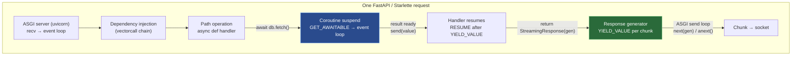
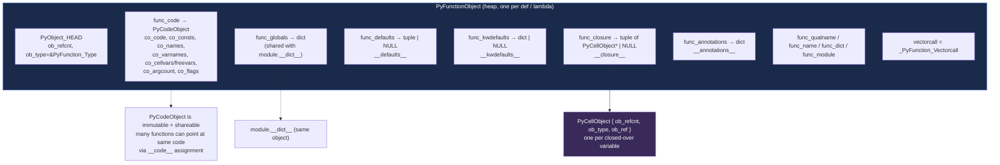
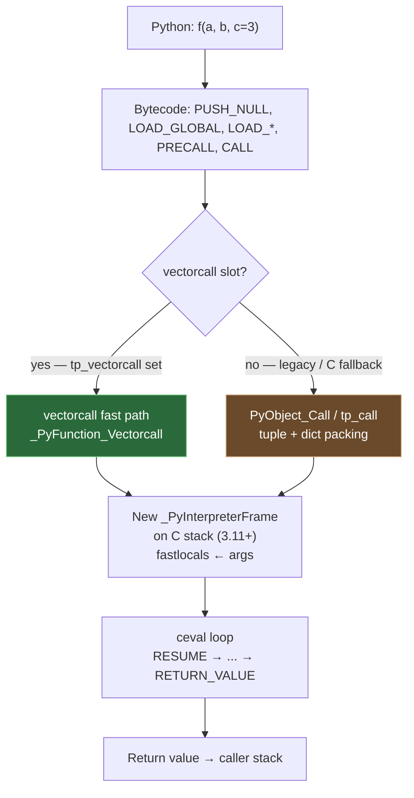
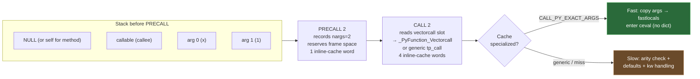
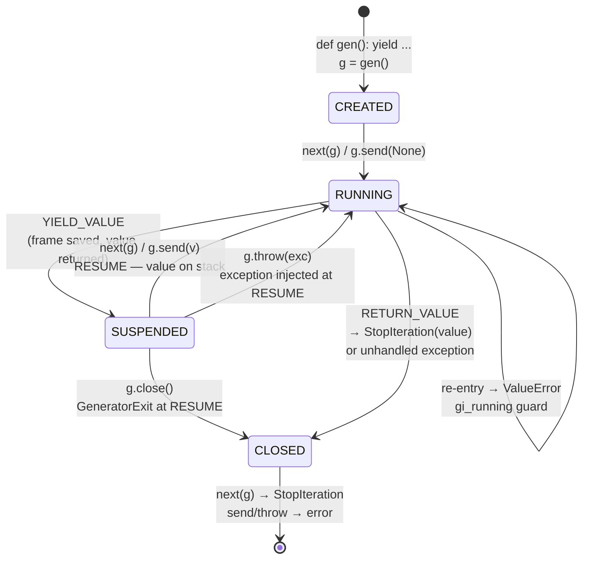
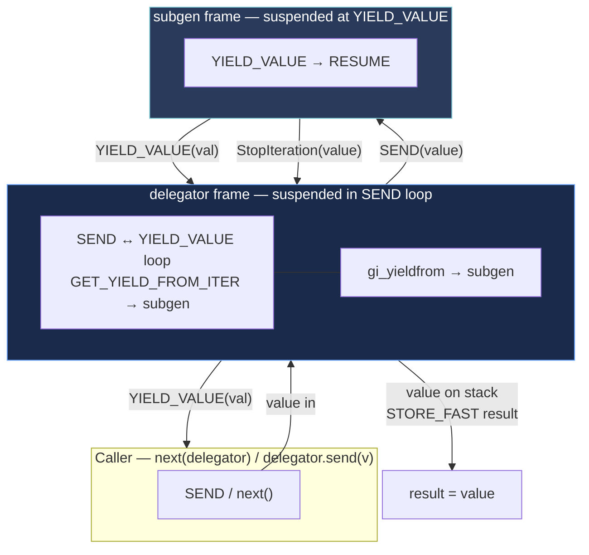
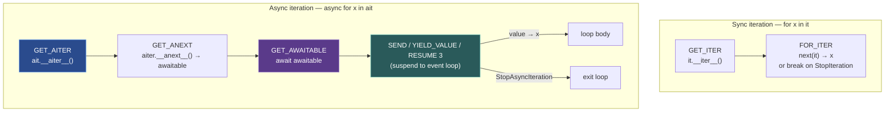
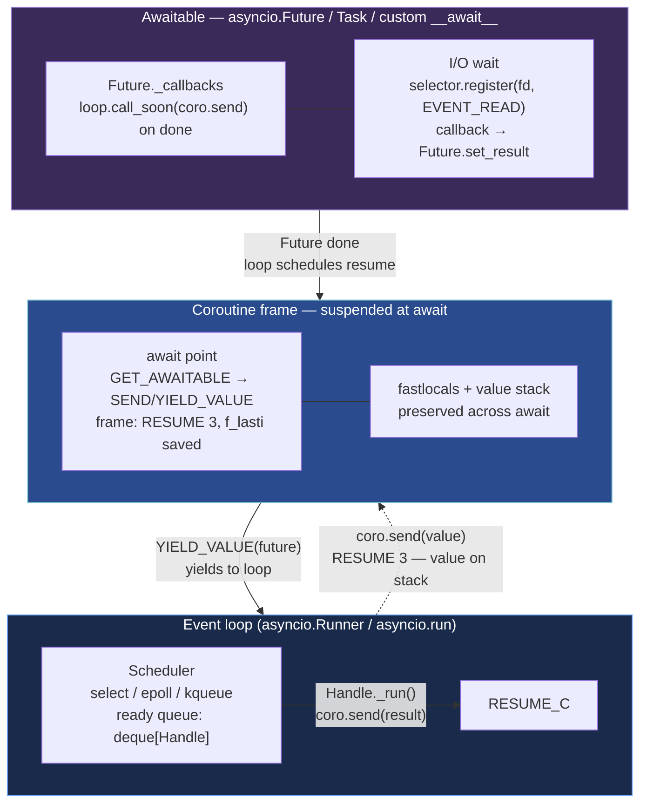

# Chapter 7 — Functions, Closures, Generators, Coroutines, and async/await

**What this chapter covers.** Every FastAPI handler, every streaming generator, every `async def` coroutine in your backend is the same C object — `PyFunctionObject` in `Objects/funcobject.c` — interpreted through a small set of dispatch paths. This chapter opens that object, traces how `f(a, b)` becomes a vectorcall, how `LOAD_DEREF` and `PyCellObject` implement lexical closures, how `yield` suspends a frame without destroying it, how `yield from` delegates without copying, and how `await` lowers to `GET_AWAITABLE` + `SEND`/`YIELD_VALUE`. You will read disassembly that shows the closure capture, the generator state switch, and the async/await lowering; you will drive `inspect` and `types` to introspect live functions; and you will connect the machinery to its operational consequences in async web frameworks and generator-based streaming.

Learning goals — after this chapter you should be able to:

- Read `PyFunctionObject` in `Objects/funcobject.c` / `Include/cpython/funcobject.h` and explain every field: `func_code`, `func_globals`, `func_defaults`, `func_kwdefaults`, `func_closure`, `func_annotations`, `func_qualname`, `vectorcall`, `func_module`.
- Describe `PyCodeObject` flags and fields relevant to functions: `co_argcount`, `co_kwonlyargcount`, `co_posonlyargcount`, `co_cellvars`, `co_freevars`, `co_varnames`, `co_flags` (`CO_OPTIMIZED`, `CO_NEWLOCALS`, `CO_VARARGS`, `CO_VARKEYWORDS`, `CO_GENERATOR`, `CO_COROUTINE`, `CO_ITERABLE_COROUTINE`, `CO_ASYNC_GENERATOR`), `co_stacksize`, `co_exceptiontable`.
- Trace the full calling convention: `PyObject_Call` → `tp_call` → `vectorcall` (PEP 590) → `_PyFunction_Vectorcall` → frame setup in `ceval.c`; explain `PUSH_NULL`/`PRECALL`/`CALL` and inline-cache specialization for calls.
- Explain vectorcall's fast path (`PyVectorcall_NARGS`, `nargsf`, `kwnames`) and why it matters for per-request call volume in ASGI frameworks.
- Implement the closure protocol: `MAKE_CELL`, `LOAD_CLOSURE`, `COPY_FREE_VARS`, `LOAD_DEREF`/`STORE_DEREF`/`DELETE_DEREF`, `PyCellObject`, `__closure__` tuple of cells, and the `co_cellvars` ↔ `co_freevars` linkage between enclosing and enclosed scopes.
- Write and introspect decorators that preserve metadata via `functools.wraps` / `functools.update_wrapper` and explain what breaks when you do not.
- Describe generator internals: `PyGenObject`, `GEN_CREATED`/`GEN_RUNNING`/`GEN_SUSPENDED`/`GEN_CLOSED`, `YIELD_VALUE` / `RESUME` / `SEND`, `gen.send()` / `gen.throw()` / `gen.close()`, and `RETURN_GENERATOR`.
- Explain `yield from` delegation: `GET_YIELD_FROM_ITER` → delegated iterator protocol, the `yield-from` chain, `throw`/`close` propagation, and `StopIteration.value` as return value.
- Trace native coroutines (PEP 492 `async def`): `CO_COROUTINE`, `PyCoroObject`, `GET_AWAITABLE` / `GET_YIELD_FROM_ITER` lowering for `await`, `CORO_SUSPENDED` vs. generator suspension, and why `await` and `yield from` share machinery but not semantics.
- Explain async generators (`CO_ASYNC_GENERATOR`, `ASEND`, `AGAINEXT`) and async comprehensions (`GET_AITER`/`GET_ANEXT`).
- Use `inspect` (`signature`, `getclosurevars`, `isgenerator`, `iscoroutinefunction`, `getgeneratorstate`, `getcoroutinestate`) and `types` (`FunctionType`, `CodeType`, `GeneratorType`, `CoroutineType`, `CellType`) to introspect any callable at runtime.
- Reason about the performance and correctness implications in real backends: ASGI event-loop starvation, generator-based streaming backpressure, and closure/memory-leak pitfalls.

> **Prerequisites.** Chapter 3 dissected `PyCodeObject`, wordcode, inline caches, and the `ceval` loop; Chapter 6 dissected `PyTypeObject`, descriptors, and attribute lookup. This chapter sits on top of both — functions are typed objects whose bytecode, type slots, and frame management conspire. Chapter 2's reference-counting and object layout applies throughout.

---

## 1. Why this chapter decides your request latency

A backend request typically spends its time in three patterns that all trace through this chapter's machinery:

- **Call overhead.** Every middleware, dependency-injection hook, serializer, validator, and route handler is a function call. FastAPI resolves ~5–15 callables per request (dependencies, path operation, exception handlers). At 10k RPS that is 50–150k vectorcalls per second on a single process. Whether those calls hit the vectorcall fast path or fall back to `PyObject_Call` tuple-packing is a measurable latency difference.
- **Streaming responses.** `StreamingResponse(content=generator)` — where `generator` is a Python generator yielding chunks — is the idiomatic way to stream large CSVs, LLM token streams, and S3 passthroughs without buffering the whole body. Misunderstanding generator state (`GEN_SUSPENDED` vs. `GEN_CLOSED`) and `yield from` delegation is how you leak connections and deadlock ASGI servers.
- **Concurrency model.** `async def` handlers run cooperatively on a single event loop. An `await` that lowers to the wrong awaitable, or a blocking call hidden inside an `async def` that never hits `GET_AWAITABLE`, blocks the loop and starves every concurrent request. Understanding `GET_AWAITABLE` / `SEND` / `YIELD_VALUE` lowering — and that the event loop is just a scheduler pumping `send(None)` — is the difference between reading async traces and guessing.



---

## 2. Function objects — `PyFunctionObject` is a typed object

### 2.1 Every `def` creates a heap `PyFunctionObject`

`def f(a, b): ...` is not a keyword that reserves a slot. It is executable bytecode (`MAKE_FUNCTION`) that allocates a `PyFunctionObject` at runtime. The compiler emits a `PyCodeObject` for the body (immutable, shareable); `MAKE_FUNCTION` wraps it with runtime bindings (globals, closure, defaults) to produce the callable. Two functions with the same body text but different `__globals__` or `__closure__` are distinct objects sharing the same `__code__`.

Relevant sources: `Objects/funcobject.c`, `Include/cpython/funcobject.h`, `Python/ceval.c` handling of `MAKE_FUNCTION`.

### 2.2 `PyFunctionObject` layout (C)

```c
/* Include/cpython/funcobject.h — Python 3.11+ (abbreviated) */
typedef struct {
    PyObject_HEAD                      /* ob_refcnt + ob_type (= &PyFunction_Type) */
    PyObject *func_code;               /* PyCodeObject* — immutable bytecode + metadata */
    PyObject *func_globals;            /* dict — module globals where function was defined */
    PyObject *func_builtins;           /* builtins dict (borrowed from globals) */
    PyObject *func_defaults;           /* tuple or NULL — positional defaults (__defaults__) */
    PyObject *func_kwdefaults;         /* dict or NULL — kwonly defaults (__kwdefaults__) */
    PyObject *func_closure;            /* tuple of PyCellObject* or NULL (__closure__) */
    PyObject *func_doc;                /* __doc__ */
    PyObject *func_name;               /* __name__ */
    PyObject *func_dict;               /* __dict__ — arbitrary attrs on the function itself */
    PyObject *func_weakreflist;        /* weakrefs to this function */
    PyObject *func_module;             /* __module__ */
    PyObject *func_annotations;        /* __annotations__ dict */
    PyObject *func_qualname;           /* __qualname__ — dotted path */
    vectorcallfunc vectorcall;         /* PEP 590 slot — _PyFunction_Vectorcall */
    PyObject *func_typeparams;         /* 3.12+ — PEP 695 type params */
} PyFunctionObject;

/* The type object itself — Objects/funcobject.c */
PyTypeObject PyFunction_Type = {
    .tp_name      = "function",
    .tp_basicsize = sizeof(PyFunctionObject),
    .tp_call      = _PyFunction_Vectorcall,  /* aliased via tp_vectorcall_offset */
    .tp_vectorcall_offset = offsetof(PyFunctionObject, vectorcall),
    .tp_getattro  = PyObject_GenericGetAttr,
    /* ... tp_repr, tp_traverse, tp_weaklistoffset, ... */
};
```

Key observations:

| Field | Python attribute | Mutability | Notes |
|---|---|---|---|
| `func_code` | `__code__` | Replaceable | Assigning `f.__code__ = other.__code__` swaps bytecode without reallocating the function. Debuggers and `functools` rely on this being a property with validation. |
| `func_globals` | `__globals__` | Shared reference | The dict is *shared* with the defining module's `__dict__` — mutating `module.__dict__` mutates every function's `__globals__` that was defined there. Not copied. |
| `func_defaults` | `__defaults__` | Replaceable tuple | `None` if no positional defaults. Evaluated once at `def` time, not per call. Mutable defaults (e.g., `def f(x=[])`) alias the same list across calls. |
| `func_kwdefaults` | `__kwdefaults__` | Replaceable dict | `None` if no kwonly defaults. Same single-evaluation rule. |
| `func_closure` | `__closure__` | Immutable tuple | `None` or tuple of `cell` objects. Each cell holds one closed-over variable. See §4. |
| `func_annotations` | `__annotations__` | Replaceable dict | Lazily populated; `from __future__ import annotations` (PEP 563) makes values stringified. |
| `vectorcall` | — | Set at creation | Function pointer for PEP 590 fast dispatch. For plain functions this is `_PyFunction_Vectorcall`. |



### 2.3 Introspecting the function object

```python
import types, inspect, textwrap, dis

def demo(a, b, *args, c, d=99, **kw) -> int:
    """Demo function with every parameter kind."""
    return a + b

# --- The Python-level attributes mirror the C struct ---
print(f"type: {type(demo)}  isfunction={inspect.isfunction(demo)}")
print(f"__name__={demo.__name__}  __qualname__={demo.__qualname__}  __module__={demo.__module__}")
print(f"__code__={demo.__code__}  co_name={demo.__code__.co_name}")
print(f"__globals__ is module.__dict__: {demo.__globals__ is globals()}")
print(f"__defaults__={demo.__defaults__}  __kwdefaults__={demo.__kwdefaults__}")
print(f"__closure__={demo.__closure__}")          # None — no free vars
print(f"__annotations__={demo.__annotations__}")
print(f"__dict__={demo.__dict__}")

# code object parameter metadata
co = demo.__code__
print(f"\nco_argcount={co.co_argcount}  co_posonlyargcount={co.co_posonlyargcount}  "
      f"co_kwonlyargcount={co.co_kwonlyargcount}")
print(f"co_varnames={co.co_varnames}")
print(f"co_flags={hex(co.co_flags)}  has VARARGS={bool(co.co_flags & inspect.CO_VARARGS)}  "
      f"has VARKEYWORDS={bool(co.co_flags & inspect.CO_VARKEYWORDS)}")
print(f"co_stacksize={co.co_stacksize}  co_nlocals={co.co_nlocals}")

# signature via inspect — the high-level view that tooling should use
print(f"\nsignature: {inspect.signature(demo)}")
for name, param in inspect.signature(demo).parameters.items():
    print(f"  {name}: kind={param.kind.name} default={param.default!r} annotation={param.annotation!r}")
```

Output (3.11):

```
type: <class 'function'>  isfunction=True
__name__=demo  __qualname__=demo  __module__=__main__
__code__=<code object demo at 0x...>  co_name=demo
__globals__ is module.__dict__: True
__defaults__=None  __kwdefaults__={'d': 99}
__closure__=None
__annotations__={'return': <class 'int'>}
__dict__={}
co_argcount=2  co_posonlyargcount=0  co_kwonlyargcount=2
co_varnames=('a', 'b', 'c', 'd', 'args', 'kw')
co_flags=0x8b  has VARARGS=True  has VARKEYWORDS=True
co_stacksize=2  co_nlocals=6
signature: (a, b, *args, c, d=99, **kw) -> int
  a: kind=POSITIONAL_OR_KEYWORD default=<no default> annotation=<no annotation>
  b: kind=POSITIONAL_OR_KEYWORD default=<no default> annotation=<no annotation>
  args: kind=VAR_POSITIONAL default=<no default>
  c: kind=KEYWORD_ONLY default=<no default>
  d: kind=KEYWORD_ONLY default=99
  kw: kind=VAR_KEYWORD default=<no default>
```

```python
# defaults are evaluated once — the classic mutable-default pitfall, shown at the C level
def append_one(item, bucket=[]):
    bucket.append(item)
    return bucket

print(append_one.__defaults__)   # ([],) — one list object
print(append_one(1))             # [1]
print(append_one(2))             # [1, 2] — same list via func_defaults[0]
print(append_one.__defaults__[0] is append_one(3))  # True — alias

# fix: sentinel
def append_one_fixed(item, bucket=None):
    if bucket is None:
        bucket = []
    bucket.append(item)
    return bucket
```

### 2.4 `co_flags` — the code object's capability bits

`PyCodeObject.co_flags` (`Include/cpython/code.h`) tells `ceval` how to set up the frame:

| Flag | Value | Meaning |
|---|---|---|
| `CO_OPTIMIZED` | `0x0001` | Locals are in `fastlocals` array; `LOAD_FAST`/`STORE_FAST` are valid. Functions and comprehensions set this. Module bodies do not. |
| `CO_NEWLOCALS` | `0x0002` | Push a fresh `f_locals` dict on entry. Functions set this. |
| `CO_VARARGS` | `0x0004` | Has `*args` (`co_argcount` + `*args`). |
| `CO_VARKEYWORDS` | `0x0008` | Has `**kwargs`. |
| `CO_NESTED` | `0x0010` | Contains a nested scope that captures free vars. |
| `CO_GENERATOR` | `0x0020` | Contains `yield`/`yield from`; calling it returns a `PyGenObject`, not a value. |
| `CO_COROUTINE` | `0x0080` | `async def` (but not `async def` containing `yield` — that is `CO_ASYNC_GENERATOR`). |
| `CO_ITERABLE_COROUTINE` | `0x0100` | `@asyncio.coroutine` generator-based coroutine (legacy). |
| `CO_ASYNC_GENERATOR` | `0x0200` | `async def` containing `yield`/`yield from`-like async yield. |

```python
import inspect, dis

def plain(): pass
def gen(): yield 1
async def coro(): pass
async def agen(): yield 1

for fn in [plain, gen, coro, agen]:
    co = fn.__code__
    print(f"{fn.__name__:6s} flags={hex(co.co_flags):6s}  "
          f"GEN={bool(co.co_flags & inspect.CO_GENERATOR)}  "
          f"CORO={bool(co.co_flags & inspect.CO_COROUTINE)}  "
          f"ASYNCGEN={bool(co.co_flags & inspect.CO_ASYNC_GENERATOR)}")
```

```
plain  flags=0x43    GEN=False  CORO=False  ASYNCGEN=False
gen    flags=0x63    GEN=True   CORO=False  ASYNCGEN=False
coro   flags=0xc3    GEN=False  CORO=True   ASYNCGEN=False
agen   flags=0x143   GEN=False  CORO=False  ASYNCGEN=True
```

Note that `CO_GENERATOR` and `CO_COROUTINE` are mutually exclusive for native objects — `CO_ASYNC_GENERATOR` is the hybrid that combines `async def` with generator semantics (`0x0200 | 0x0002 | 0x0001 | ...`).

---

## 3. Calling convention — from `f(x)` to a new frame

### 3.1 The three dispatch layers



Historically, `PyObject_Call(callable, args_tuple, kwargs_dict)` was the universal entry — it packed all arguments into a tuple and dict, then dispatched through `tp_call` (`PyTypeObject.tp_call`). Every call paid tuple/dict allocation even for `f(1, 2)`.

PEP 590 (Python 3.8+) introduced **vectorcall**: the caller passes a C array of `PyObject*` plus a `kwnames` tuple, without packing positionals into a tuple. Types that support it set `tp_vectorcall_offset` and publish a `vectorcallfunc` at that offset. The interpreter's `CALL` opcode now emits a vectorcall directly; `PyObject_Call` is the fallback for C callers that already have packed tuples.

### 3.2 What vectorcall looks like in C

```c
/* Include/cpython/object.h — PEP 590 */
typedef PyObject *(*vectorcallfunc)(
    PyObject *callable,
    PyObject *const *args,      /* C array of positional args + kwargs values */
    size_t nargsf,              /* PyVectorcall_NARGS(nargsf) = positional count;
                                   bit 63 = PY_VECTORCALL_ARGUMENTS_OFFSET flag */
    PyObject *kwnames           /* tuple of kwarg names, or NULL */
);

/* Helpers — Include/cpython/object.h */
#define PyVectorcall_NARGS(n)          ((n) & ~PY_VECTORCALL_ARGUMENTS_OFFSET)
static inline Py_ssize_t PyVectorcall_NARGS(size_t nargsf);
```

Calling `f(1, 2, c=3)` via vectorcall:

```
args array on C stack:  [ 1 , 2 , 3 ]   // positionals first, then kw values contiguously
nargsf = 2 | 0                          // 2 positionals
kwnames = ("c",)                        // tuple parallel to trailing args
```

If the callable is a plain `PyFunctionObject`, `vectorcall` points at `_PyFunction_Vectorcall` (`Objects/call.c`), which:

1. Validates arity against `co_argcount` / `co_kwonlyargcount` / defaults.
2. Allocates a new `_PyInterpreterFrame` on the C stack (3.11+; older versions heap-allocated `PyFrameObject`).
3. Copies `args[0..nargs-1]` into `frame->localsplus[0..]` (`LOAD_FAST` slots).
4. Fills defaults for missing args from `func_defaults` / `func_kwdefaults`.
5. Enters `ceval` at `RESUME`.

No tuple, no dict, no `tp_call` indirection for the common case.

### 3.3 Bytecode lowering for calls (3.11+)

Chapter 3 introduced `PUSH_NULL` / `PRECALL` / `CALL`. For calls they lower as:

```python
import dis

def callee(a, b): return a + b

def caller(x):
    return callee(x, 1)

dis.dis(caller)
```

```
  6           0 RESUME                   0

  7           2 LOAD_GLOBAL              1 (NULL + callee)   # pushes NULL, then callee
             14 LOAD_FAST                0 (x)
             16 LOAD_CONST               1 (1)
             18 PRECALL                  2                   # 2 positional args; reserves space
             22 CALL                     2                   # vectorcall with nargs=2
             32 RETURN_VALUE
```

With `show_caches=True`:

```
              2 LOAD_GLOBAL              1 (NULL + callee)
              4 CACHE                    0  (×5 — LOAD_GLOBAL cache)
             14 LOAD_FAST                0 (x)
             16 LOAD_CONST               1 (1)
             18 PRECALL                  2
             20 CACHE                    0
             22 CALL                     2
             24 CACHE                    0  (×4 — CALL cache)
```

- `NULL` is a sentinel that marks "not a method call" — `LOAD_METHOD` / `LOAD_ATTR` may push a bound `self` instead of `NULL` for `obj.method()` so `CALL` can avoid re-binding.
- `PRECALL` records `nargs` and reserves stack slots for the callee's frame; its 1 cache word holds the adaptive counter.
- `CALL` reads the inline cache (4 words) that specialize to `CALL_PY_EXACT_ARGS`, `CALL_PY_WITH_DEFAULTS`, `CALL_NO_KW_BUILTIN_O`, etc. After a few executions, a monomorphic `callee(x, 1)` call will specialize to `CALL_PY_EXACT_ARGS` and skip arity checks via cached `PyCodeObject` metadata.



### 3.4 `tp_call` — the legacy slot and C callables

C functions (`PyCFunctionObject`, `PyMethodDef` with `METH_VARARGS`/`METH_FASTCALL`/`METH_O`) do not use `PyFunctionObject` at all — they are `PyCFunction_Type` with their own `tp_call` (`cfunction_call` / `cfunction_vectorcall` in `Objects/methodobject.c`). Built-in types (`list`, `dict`, `int`) have `tp_call` pointing at `type_call` (`Objects/typeobject.c`) which allocates an instance via `tp_new` + `tp_init`.

The observable invariant: every `callable(...)` ultimately reaches either a `vectorcallfunc` (fast) or `ternaryfunc tp_call` (legacy). Pure-Python functions always prefer vectorcall; `PyObject_Call(func, args, kwargs)` from C is the path that must pack.

```python
import inspect

# Every callable has a tp_call; check vectorcall availability indirectly
def py_func(): pass
print(f"py_func vectorcall offset: {type(py_func).__dict__.get('__vectorcalloffset__', 'via C slot')}")
print(f"inspect.isbuiltin(len): {inspect.isbuiltin(len)}")
print(f"inspect.isfunction(py_func): {inspect.isfunction(py_func)}")
print(f"callable(len)={callable(len)}  callable(py_func)={callable(py_func)}")

# tp_call is what makes types callable: int(42) → int.__call__ → tp_call
print(f"type(int).__call__: {type.__call__}")
```

### 3.5 Why vectorcall matters for ASGI throughput

FastAPI/Starlette dispatch per request fans out through `get_dependant` → `solve_dependencies` → N `await dependant.call(**values)`. Each dependency is a Python callable invoked with keyword arguments derived from the request. Before vectorcall, each dependency call allocated a `tuple` of positionals and a `dict` of kwargs that were immediately unpacked — at 10k RPS, millions of short-lived tuple/dict objects per second pressuring the GC.

Vectorcall plus the 3.11 `CALL` specialization removes that overhead for monomorphic call sites. Profiling with `perf` or `py-spy --native` will show `CALL_PY_EXACT_ARGS` dominating over `CALL_PY_WITH_DEFAULTS` when your dependency signatures match the call sites — which they should if you avoid optional-argument sprawl on hot paths. The operational takeaway: keep dependency signatures tight and avoid `**kwargs` passthrough where you can name arguments explicitly — it keeps the specialized `CALL` path hot.

---

## 4. Closures — cells, free vars, and `LOAD_DEREF`

### 4.1 The problem closures solve

A nested function that references a variable from an enclosing scope cannot use `LOAD_FAST` (the variable is not in its own `fastlocals`) and cannot use `LOAD_GLOBAL` (the variable is not global). It needs a reference to a storage location that outlives the enclosing call's frame. That storage is a **cell**.

### 4.2 `PyCellObject` — the indirection

```c
/* Include/cpython/cellobject.h */
typedef struct {
    PyObject_HEAD
    PyObject *ob_ref;   /* the closed-over value; NULL if not yet bound (unbound free var) */
} PyCellObject;

/* API — Objects/cellobject.c */
PyObject *PyCell_New(PyObject *obj);          // cell = PyCellObject{ob_ref = obj}
PyObject *PyCell_Get(PyObject *cell);         // Py_NewRef(cell->ob_ref)
int       PyCell_Set(PyObject *cell, PyObject *value);
```

A cell is a heap-allocated box holding one `PyObject*`. The enclosing scope stores its local *through* the cell; each enclosed scope that captures the variable holds a *borrowed reference to the same cell*. Mutating `ob_ref` through the cell is visible to all holders — which is why `nonlocal` works.

### 4.3 Compiler's scope analysis → `co_cellvars` / `co_freevars`

At compile time (`Python/symtable.c` + `Python/compile.c`), the symbol table marks each name per scope as `LOCAL`, `CELL`, `FREE`, or `GLOBAL`. The compiler then emits:

- `MAKE_CELL` — in the enclosing scope, for each `co_cellvars` entry: wrap the local in a `PyCellObject` and store it back into the fastlocals slot as a cell.
- `LOAD_CLOSURE` / `BUILD_TUPLE` / `MAKE_FUNCTION` — bundle `co_freevars` cells into the closure tuple passed to the child code object.
- `COPY_FREE_VARS` — in the child, copy the passed closure tuple into its own free-var storage.

```python
import dis, inspect

def make_adder(n):
    def adder(x):
        return x + n
    return adder

# Enclosing scope: n is CELL
co_outer = make_adder.__code__
print(f"make_adder co_cellvars={co_outer.co_cellvars}  co_freevars={co_outer.co_freevars}")
print(f"make_adder co_varnames={co_outer.co_varnames}")
dis.dis(make_adder)

# Enclosed scope: n is FREE
co_inner = make_adder(10).__code__
print(f"\nadder co_cellvars={co_inner.co_cellvars}  co_freevars={co_inner.co_freevars}")
dis.dis(make_adder(10))
```

```
make_adder co_cellvars=('n',)  co_freevars=()
make_adder co_varnames=('n', 'adder')
  2           0 MAKE_CELL                0 (n)

  3           2 RESUME                   0

  4           4 LOAD_CLOSURE             0 (n)
              6 BUILD_TUPLE              1
              8 LOAD_CONST               1 (<code object adder>)
             10 MAKE_FUNCTION            8 (closure)
             12 STORE_FAST               1 (adder)

  5          14 LOAD_FAST                1 (adder)
             16 RETURN_VALUE

adder co_cellvars=()  co_freevars=('n',)
              0 COPY_FREE_VARS           1

  4           2 RESUME                   0

  5           4 LOAD_FAST                0 (x)
              6 LOAD_DEREF               1 (n)
              8 BINARY_OP                0 (+)
             12 RETURN_VALUE
```

Read the bytecode:

| Offset | Opcode | Meaning |
|---|---|---|
| `MAKE_CELL 0` | Enclosing: `n` was `LOAD_FAST` slot 0; now wraps it in a `PyCellObject` and keeps the cell in the same slot. Subsequent `LOAD_DEREF n` in this scope and all enclosed scopes read through the cell. |
| `LOAD_CLOSURE 0` | Push the cell for `n` onto the stack (not its contents — the cell itself). |
| `BUILD_TUPLE 1` + `MAKE_FUNCTION 8 (closure)` | Bundle cells into `func_closure` and create the child `PyFunctionObject`. |
| `COPY_FREE_VARS 1` | Child prologue: copy closure tuple into its free-var array. |
| `LOAD_DEREF 1` | Child: load `cell->ob_ref` for free var `n`. The arg `1` indexes `co_cellvars + co_freevars` in the combined deref array (implementation detail in `ceval.c`). |

### 4.4 The cell/free-var chain

> *Diagram omitted for brevity — see surrounding prose.*


Two consequences visible in this diagram:

- **Mutation is shared.** `nonlocal n; n += 1` in the inner function does `STORE_DEREF` → `cell->ob_ref = new_value`, visible to the outer frame if it is still alive.
- **The cell outlives the outer frame.** The outer frame's `fastlocals[0]` holds a `PyCellObject*`, not a bare value. When the outer frame is freed (function returns), the cell's `ob_refcnt` stays >0 because `func_closure` still holds it — the value survives.

### 4.5 Multi-level closures and re-capture

```python
import dis

def outer(a):
    b = a + 1
    def middle(c):
        d = b + c
        def inner(e):
            return a + b + c + d + e
        return inner
    return middle

# Compiler flattens: inner's free vars include transitively closed vars
for fn, label in [(outer, "outer"), (outer(10), "middle"), (outer(10)(20), "inner")]:
    co = fn.__code__ if hasattr(fn, "__code__") else fn.__code__
    print(f"{label:8s} cellvars={co.co_cellvars}  freevars={co.co_freevars}  varnames={co.co_varnames}")

print("\n--- outer ---")
dis.dis(outer)
print("\n--- middle (closure of outer) ---")
dis.dis(outer(10))
print("\n--- inner (closure of middle) ---")
dis.dis(outer(10)(20))
```

```
outer    cellvars=('a', 'b')  freevars=()           varnames=('a', 'b', 'middle')
middle   cellvars=('c', 'd')  freevars=('a', 'b')   varnames=('c', 'd', 'inner')
inner    cellvars=()          freevars=('a', 'b', 'c', 'd')  varnames=('e',)
```

`middle` closes over `a, b` from `outer`; `inner` closes over `a, b` *and* `c, d` from `middle`. The compiler threads cells through each level — `inner` does not reach directly into `outer`'s frame, it reads cells that `middle` already captured.

### 4.6 `__closure__`, `inspect.getclosurevars`, and lifetime pitfalls

```python
import inspect, types, gc, weakref

def make_handlers(items):
    handlers = []
    for item in items:
        def handler():
            return item          # closes over `item` — the CELL, not the value at def time
        handlers.append(handler)
    return handlers

hs = make_handlers([1, 2, 3])
print([h() for h in hs])                # [3, 3, 3] — classic late-binding pitfall
for h in hs:
    print(f"cell_contents={h.__closure__[0].cell_contents!r}  freevars={h.__code__.co_freevars}")

# Fix: capture by value via default argument (binds into func_defaults, not closure)
def make_handlers_fixed(items):
    handlers = []
    for item in items:
        def handler(item=item):
            return item
        handlers.append(handler)
    return handlers

print([h() for h in make_handlers_fixed([1, 2, 3])])  # [1, 2, 3]

# Introspection
def make_adder(n):
    m = n * 2
    def adder(x):
        return x + n + m
    return adder

add5 = make_adder(5)
print(f"\n__closure__={add5.__closure__}")
print(f"cell_contents={[c.cell_contents for c in add5.__closure__]}")
print(f"inspect.getclosurevars(add5)={inspect.getclosurevars(add5)}")
print(f"is CellType: {type(add5.__closure__[0])}  is types.CellType={type(add5.__closure__[0]) is types.CellType}")

# Backend pitfall: closures pin objects — large closed-over buffer keeps memory alive
large = b"x" * 10_000_000
def leaked():
    return large[:10]       # closure holds reference to 10 MB even if you only need 10 bytes

print(f"\nleaked closure pins {len(leaked.__closure__[0].cell_contents)} bytes")
# Fix: break the closure — copy what you need, or use a default arg, or del the reference
def not_leaked(buf=large[:10]):
    return buf              # default captures slice, not the original
# now `large` can be GC'd if no other reference exists
```

Output:

```
[3, 3, 3]
cell_contents=3  freevars=('item',)
...
[1, 2, 3]
__closure__=(<cell at 0x...: int object at 0x...>, <cell at 0x...: int object at 0x...>)
cell_contents=[5, 10]
ClosureVars(nonlocals={'n': 5, 'm': 10}, globals={}, builtins={}, unbound=set())
```

```python
# Demonstrating LOAD_DEREF vs LOAD_FAST vs LOAD_GLOBAL at the bytecode level
import dis

x_global = 100

def demo_closure():
    x_local = 1
    x_cell = 2
    def inner():
        # x_local would be LOAD_FAST in demo_closure but is LOAD_DEREF in inner
        # x_global is LOAD_GLOBAL everywhere
        # x_cell via nonlocal would be STORE_DEREF
        nonlocal x_cell
        x_cell += 1
        return x_local + x_cell + x_global
    return inner

print("--- demo_closure (enclosing) ---")
dis.dis(demo_closure)
print("\n--- inner (enclosed) ---")
dis.dis(demo_closure())
```

```
--- demo_closure (enclosing) ---
 22           0 MAKE_CELL                0 (x_cell)
              2 MAKE_CELL                1 (x_local)   # actually x_local becomes CELL because inner reads it
 ...
--- inner (enclosed) ---
              0 COPY_FREE_VARS           2
 ...
              6 LOAD_DEREF               1 (x_local)
              8 LOAD_DEREF               0 (x_cell)
             10 LOAD_DEREF               0 (x_cell)   # for the += RHS
              ...
             18 STORE_DEREF              0 (x_cell)   # nonlocal write
             20 LOAD_GLOBAL              1 (NULL + x_global)
             ...
```

Compiler rule: any local that is read by a nested scope becomes a `CELL` in the enclosing scope (even if never written with `nonlocal`); any name that resolves to an enclosing `CELL` becomes a `FREE` in the enclosed scope. `LOAD_DEREF`/`STORE_DEREF`/`DELETE_DEREF` are the only opcodes that dereference cells — `LOAD_FAST`/`STORE_FAST` never touch cells.

---

## 5. Decorators and `functools.wraps`

### 5.1 What a decorator executes

```python
@decorator
def f(x): pass
```

is syntactic sugar for:

```python
def f(x): pass
f = decorator(f)
```

At the bytecode level (`MAKE_FUNCTION` → `LOAD_NAME decorator` → `CALL` → `STORE_NAME f`), the decorator receives the original `PyFunctionObject`, returns a (usually new) callable, and the name `f` is rebound. No special opcode — decorators are ordinary calls.

### 5.2 The metadata problem and `functools.wraps`

A naïve wrapper replaces the callable and loses identity:

```python
import functools, inspect

def naive_decorator(func):
    def wrapper(*args, **kwargs):
        print(f"calling {func.__name__}")
        return func(*args, **kwargs)
    return wrapper          # wrapper.__name__ == "wrapper", __code__ is wrapper's, signature lost

@naive_decorator
def greet(name: str) -> str:
    """Greet someone."""
    return f"hello {name}"

print(f"name={greet.__name__}  qualname={greet.__qualname__}  doc={greet.__doc__}")
print(f"signature={inspect.signature(greet)}")   # (*args, **kwargs) — wrong
print(f"wrapped? {hasattr(greet, '__wrapped__')}")

def good_decorator(func):
    @functools.wraps(func)        # copies __module__, __name__, __qualname__, __doc__,
    def wrapper(*args, **kwargs): #   __annotations__, __dict__, __wrapped__
        print(f"calling {func.__name__}")
        return func(*args, **kwargs)
    return wrapper

@good_decorator
def greet2(name: str) -> str:
    """Greet someone."""
    return f"hello {name}"

print(f"\nname={greet2.__name__}  qualname={greet2.__qualname__}  doc={greet2.__doc__}")
print(f"signature={inspect.signature(greet2)}")  # (name: str) -> str — correct via __wrapped__
print(f"wrapped={greet2.__wrapped__ is greet2.__wrapped__}")
```

`functools.wraps` is `functools.update_wrapper` + `functools.WRAPPER_ASSIGNMENTS` / `WRAPPER_UPDATES`:

```python
# functools — Lib/functools.py (simplified)
WRAPPER_ASSIGNMENTS = ('__module__', '__name__', '__qualname__', '__annotations__', '__doc__', '__type_params__')
WRAPPER_UPDATES     = ('__dict__',)

def update_wrapper(wrapper, wrapped, assigned=WRAPPER_ASSIGNMENTS, updated=WRAPPER_UPDATES):
    for attr in assigned:
        try:
            value = getattr(wrapped, attr)
        except AttributeError:
            pass
        else:
            setattr(wrapper, attr, value)
    for attr in updated:
        getattr(wrapper, attr).update(getattr(wrapped, attr, {}))
    wrapper.__wrapped__ = wrapped
    return wrapper

def wraps(wrapped, assigned=WRAPPER_ASSIGNMENTS, updated=WRAPPER_UPDATES):
    return partial(update_wrapper, wrapped=wrapped, assigned=assigned, updated=updated)
```

What it does at the `PyFunctionObject` level:

- `wrapper.__wrapped__ = wrapped` — so `inspect.signature` and `inspect.unwrap` can chase the chain to recover the original `__code__` / `__annotations__`.
- `wrapper.__code__` is *not* replaced — the wrapper keeps its own `func_code` (the wrapper body), so `dis.dis(wrapper)` still shows the wrapper's bytecode. `__wrapped__.__code__` is where the original lives. This distinction matters when you profile: the wrapper frame appears in traces, not the wrapped function's frame directly.
- `wrapper.__dict__.update(wrapped.__dict__)` — custom attributes set on the original (e.g., `f.route = ...` in decorators that attach metadata) propagate.

### 5.3 Decorator stacking and `inspect.unwrap`

```python
import functools, inspect

def deco_a(f):
    @functools.wraps(f)
    def w(*a, **kw): return f(*a, **kw)
    w._tag = "a"
    return w

def deco_b(f):
    @functools.wraps(f)
    def w(*a, **kw): return f(*a, **kw)
    w._tag = "b"
    return w

@deco_a
@deco_b
def target(x): return x

# Bottom-up: target = deco_a(deco_b(target_raw))
print(f"target.__wrapped__ is deco_b wrapper: {target.__wrapped__.__name__ == 'target'}")
print(f"unwrap once: {inspect.unwrap(target, stop=lambda f: hasattr(f, '_tag') and f._tag == 'b')}")
print(f"fully unwrapped: {inspect.unwrap(target)}")
print(f"unwrap chain: {[f.__name__ for f in [target, target.__wrapped__, target.__wrapped__.__wrapped__]]}")
```

Without `__wrapped__`, `inspect.signature`, FastAPI's dependency introspection (`inspect.signature` on the route handler to discover query/body params), and Sphinx autodoc all see the wrapper's `(*args, **kwargs)` — which is why FastAPI explicitly warns when you forget `functools.wraps`.

---

## 6. Generators — suspendable frames

### 6.1 What `yield` means to the compiler

The presence of `yield` or `yield from` anywhere in a function's body flips `CO_GENERATOR`. Calling the function no longer enters `ceval` — it allocates a `PyGenObject` whose frame is suspended at offset 0 and returns immediately. The caller's stack never enters the generator body until `next()` / `send()` resumes it.

```c
/* Include/cpython/genobject.h — 3.11+ */
typedef struct {
    PyObject_HEAD
    PyObject *gi_weakreflist;
    PyObject *gi_name;              /* __name__ */
    PyObject *gi_qualname;          /* __qualname__ */
    PyObject *gi_code;              /* PyCodeObject* — the generator's code */
    PyObject *gi_frame;             /* _PyInterpreterFrame* — suspended frame (or NULL if closed) */
    PyObject *gi_modulename;
    char       gi_running;           /* re-entrance guard */
    PyObject *gi_exc_state;         /* saved exception state */
    /* ... */
} PyGenObject;

/* Object state — Lib/inspect.py / Include/cpython/genobject.h */
#define GEN_CREATED   0   /* not yet started */
#define GEN_RUNNING   1   /* currently executing (re-entry is an error) */
#define GEN_SUSPENDED 2   /* yielded, frame preserved, resumable */
#define GEN_CLOSED    3   /* exhausted or explicitly closed */
```

Relevant sources: `Objects/genobject.c`, `Python/ceval.c` handling of `YIELD_VALUE`, `RETURN_GENERATOR`, `SEND`, `RESUME`.

### 6.2 Generator bytecode — the suspend/resume switch

```python
import dis, inspect

def gen_demo():
    x = yield 1
    y = yield x + 1
    return y * 2

dis.dis(gen_demo)

g = gen_demo()
print(f"state after creation: {inspect.getgeneratorstate(g)}")  # GEN_CREATED
print(f"next(g) = {next(g)}")
print(f"state after first yield: {inspect.getgeneratorstate(g)}")  # GEN_SUSPENDED
print(f"g.send(10) = {g.send(10)}")    # x = 10, yields 11
print(f"g.send(20) = {g.send(20)}")    # y = 20, returns 40 via StopIteration.value
```

Disassembly:

```
  7           0 RETURN_GENERATOR             # prologue: wrap frame as generator object
              2 POP_TOP
              4 RESUME                   0

  8           6 LOAD_CONST               1 (1)
              8 YIELD_VALUE              0    # pop 1, suspend frame, return 1 to caller
             10 RESUME                   1    # resume point: stack holds sent value
             12 STORE_FAST               0 (x)

  9          14 LOAD_FAST                0 (x)
             16 LOAD_CONST               1 (1)
             18 BINARY_OP                0 (+)
             22 YIELD_VALUE              1
             24 RESUME                   1
             26 STORE_FAST               1 (y)

 10          28 LOAD_FAST                1 (y)
             30 LOAD_CONST               2 (2)
             32 BINARY_OP                5 (*)
             36 RETURN_VALUE                 # raises StopIteration(value) to caller
             38 POP_TOP                     # (unreachable — ceval handles RETURN_VALUE)
```

Step through:

| Opcode | Frame action | Caller sees |
|---|---|---|
| `RETURN_GENERATOR` + `POP_TOP` | Function entry: allocate `PyGenObject` with current frame, return it. Body not yet executed. | `g = gen_demo()` returns generator object; no code has run. |
| `YIELD_VALUE` | Saves `f_lasti` (instruction pointer), sets `GEN_SUSPENDED`, returns yielded value to caller. Frame's value stack and `fastlocals` remain intact. | `next(g)` receives `1`. |
| `RESUME 1` | Resume entry: expects the `send()` argument on the stack. `RESUME`'s oparg encodes where we came from (0 = initial, 1 = yield, 2 = except, 3 = await). Validates generator is not `GEN_RUNNING`. | `g.send(10)` resumes and `10` is on the stack for `STORE_FAST x`. |
| `RETURN_VALUE` | Sets `GEN_CLOSED`, raises `StopIteration(value)` carrying the return value. Subsequent `next()` raises `StopIteration` immediately. | `g.send(20)` raises `StopIteration: 40`. |

### 6.3 The generator state machine



`gi_running` is a re-entrance guard: `yield` inside a generator that recursively resumes itself (e.g., `list(g)` where `g` yields and the `__next__` machinery re-enters) raises `ValueError: generator already executing`. This is a bug, not a feature to work around.

```python
import inspect, types

def gen():
    yield 1
    yield 2

g = gen()
print(inspect.getgeneratorstate(g))   # GEN_CREATED
print(inspect.isgenerator(g), inspect.isgeneratorfunction(gen))
print(isinstance(g, types.GeneratorType))

next(g)
print(inspect.getgeneratorstate(g))   # GEN_SUSPENDED
print(f"gi_frame={g.gi_frame}  gi_code={g.gi_code.co_name}  gi_running={g.gi_running}")
print(f"gi_yieldfrom={g.gi_yieldfrom}")  # None — set only during yield-from

list(g)  # exhaust
print(inspect.getgeneratorstate(g))   # GEN_CLOSED
print(f"gi_frame after close: {g.gi_frame}")  # None — frame freed
```

### 6.4 `send`, `throw`, `close` — the generator protocol

`SEND` (3.11+) is the opcode that `yield` lowers to on the *calling* side; `YIELD_VALUE` is the callee side. The Python-level methods map to frame operations:

```python
import dis

def echo():
    while True:
        received = yield
        print(f"received: {received}")

dis.dis(echo)
```

```
              0 RETURN_GENERATOR
              2 POP_TOP
              4 RESUME                   0

  4           6 LOAD_CONST               0 (None)
              8 YIELD_VALUE
             10 RESUME                   1
             12 STORE_FAST               0 (received)
 ...
```

```python
g = echo()
next(g)           # prime: advance to first YIELD_VALUE, discards None
g.send("hello")   # resumes at RESUME 1, stack = "hello" → STORE_FAST received
g.send("world")

# throw: injects exception at the RESUME point as if `yield` raised it
def resilient():
    try:
        x = yield 1
    except ValueError as e:
        x = f"caught {e}"
    yield x

r = resilient()
print(next(r))          # 1
print(r.throw(ValueError, ValueError("oops")))  # caught oops

# close: injects GeneratorExit at RESUME; generator should exit cleanly
def closable():
    try:
        yield 1
        yield 2
    finally:
        print("cleanup")

c = closable()
print(next(c))   # 1
c.close()        # prints "cleanup", state → GEN_CLOSED
print(f"closed state: {__import__('inspect').getgeneratorstate(c)}")
try:
    next(c)
except StopIteration:
    print("StopIteration as expected after close")
```

- `gen.send(None)` is equivalent to `next(gen)` — the `RESUME 1` path pushes `None` onto the stack either way.
- `gen.throw(type, value, tb)` raises at the yield point. If the generator handles it, it resumes normally; if not, the exception propagates to the caller and the generator becomes `GEN_CLOSED`.
- `gen.close()` injects `GeneratorExit` — the generator's `finally` blocks run, but if it yields again after catching `GeneratorExit`, `RuntimeError` is raised (a generator that ignores `close()` is broken).

### 6.5 Generator frame lifetime and memory

A suspended generator holds its frame (`gi_frame`) alive, which in turn holds references to all `fastlocals`, the value stack, and `func_globals` / `func_closure`. A generator that is `GEN_SUSPENDED` but never resumed or closed leaks its frame until GC. In long-lived services this matters: a streaming generator that is abandoned mid-iteration (client disconnects before consuming the stream) holds its frame until the generator is GC'd or explicitly closed.

ASGI servers mitigate this by calling `aclose()` / `close()` on abandoned generators, but middleware that wraps generators must propagate `close()` — see §10.

---

## 7. `yield from` — transparent delegation

### 7.1 Why delegation needs an opcode

Manually delegating to a sub-generator is verbose and subtly wrong:

```python
# Manual delegation — doesn't propagate send/throw/close correctly
def delegator_manual():
    sub = subgen()
    for val in sub:
        yield val       # loses send() values, throw() not forwarded
    return sub.return_value  # not accessible — StopIteration.value discarded by for
```

PEP 380 (`yield from`, Python 3.3) makes delegation *transparent*: `yield from iterable` yields every value from `iterable`, forwards `send()`/`throw()`/`close()` into it, and captures its return value.

### 7.2 Bytecode lowering

```python
import dis

def subgen():
    yield 1
    yield 2
    return "done"

def delegator():
    result = yield from subgen()
    yield result

dis.dis(delegator)
```

```
 13           0 RETURN_GENERATOR
              2 POP_TOP
              4 RESUME                   0

 14           6 LOAD_GLOBAL              1 (NULL + subgen)
             18 PRECALL                  0
             22 CALL                     0
             32 GET_YIELD_FROM_ITER      0    # coerce to iterator (or coroutine awaitable)
             34 LOAD_CONST               0 (None)
        >>   36 SEND                     2 (to 44)  # send None to prime subgen
             38 YIELD_VALUE                   # yield whatever subgen yielded
             40 RESUME                   1
             42 JUMP_BACKWARD_NO_INTERRUPT     8 (to 36)  # loop: send back in, yield out
        >>   44 POP_TOP                       # subgen exhausted — StopIteration.value on stack
             46 STORE_FAST               0 (result)

 15          48 LOAD_FAST                0 (result)
             50 YIELD_VALUE
             52 RESUME                   1
             54 POP_TOP
             56 LOAD_CONST               0 (None)
             58 RETURN_VALUE
```

The loop at `36 SEND → 38 YIELD_VALUE → 40 RESUME → 42 JUMP_BACKWARD` is the delegation pump. `GET_YIELD_FROM_ITER` handles the dispatch: if the operand is a generator or coroutine, it returns it directly; if it is an iterable, it calls `PyObject_GetIter`; if it has `__await__`, it calls that. The loop then shuttles values bidirectionally until the sub-iterator raises `StopIteration`, whose `.value` is left on the stack for `STORE_FAST result`.

`gi_yieldfrom` is set while delegation is active:

```python
def sub():
    yield 1
    return "sub done"

def outer():
    v = yield from sub()
    yield f"outer got {v}"

o = outer()
print(next(o))                        # 1 — forwarded from sub
import inspect
print(f"gi_yieldfrom={o.gi_yieldfrom}")  # <generator object sub at ...>
print(f"sub state={inspect.getgeneratorstate(o.gi_yieldfrom)}")  # GEN_SUSPENDED
print(next(o))                        # outer got sub done
print(inspect.getgeneratorstate(o))   # GEN_CLOSED
```

### 7.3 Delegation chain



`throw()` and `close()` propagate along the same chain: `delegator.throw(exc)` calls `subgen.throw(exc)` via `gi_yieldfrom`, and `delegator.close()` calls `subgen.close()`. If the sub-generator handles the exception and yields again, delegation resumes; if it propagates, the delegator sees the exception.

```python
# throw propagation through yield from
def inner():
    try:
        yield 1
        yield 2
    except ValueError as e:
        yield f"inner caught {e}"
        return "inner done"

def outer():
    v = yield from inner()
    yield f"outer sees {v}"

o = outer()
print(next(o))                          # 1
print(o.throw(ValueError, ValueError("boom")))  # inner caught boom
print(next(o))                          # outer sees inner done
```

### 7.4 Operational consequences

`yield from` is the primitive behind generator-based streaming pipelines:

```python
def read_chunks(path, size=8192):
    with open(path, "rb") as f:
        while chunk := f.read(size):
            yield chunk

def gzip_chunks(chunks):
    import gzip, io
    buf = io.BytesIO()
    gz = gzip.GzipFile(fileobj=buf, mode="wb")
    yield from compress_stream(chunks, gz, buf)  # delegation to compressor generator

# ASGI streaming
async def streaming_response(chunks):
    for chunk in chunks:           # sync generator iterated in async context
        yield chunk                # would be async generator in real ASGI
```

The `gi_yieldfrom` chain is visible to debuggers and to `inspect.getgeneratorstate` — a stuck streaming pipeline can be diagnosed by walking `gi_yieldfrom` links to find which generator in the chain is `GEN_SUSPENDED` vs. `GEN_RUNNING`.

---

## 8. Coroutines — from `yield`-as-coroutine (PEP 342) to `async def` (PEP 492)

### 8.1 PEP 342: generators grow `send`/`throw`/`close`

PEP 342 (Python 2.5) upgraded generators from one-way iterators to bidirectional coroutines. The same `yield` expression that previously only *produced* a value gained the ability to *receive* one (`x = yield y`). This made generator-based coroutines possible: an event loop could `send(result)` back into a generator that had `yield`ed a future.

`asyncio` before PEP 492 was built entirely on this: `@asyncio.coroutine` decorated a generator, `yield from` suspended it, and the event loop pumped `send`/`throw`.

```python
# PEP 342 generator-based coroutine (pre-PEP 492, still valid)
import types

def old_style_coroutine():
    print("start")
    x = yield "waiting"
    print(f"resumed with {x}")
    return "done"

# Manually driving it like an event loop would
c = old_style_coroutine()
print(f"is generator: {inspect.isgenerator(c)}")
print(f"next → {next(c)}")          # waiting
try:
    c.send("hello")                  # resumed with hello
except StopIteration as e:
    print(f"returned: {e.value}")   # done
```

### 8.2 PEP 492: native coroutines — `async def` and `await`

PEP 492 (Python 3.5) introduced dedicated syntax and types so coroutines are not confused with generators:

- `async def f(): ...` — defines a **coroutine function** (`CO_COROUTINE`, `inspect.iscoroutinefunction`). Calling it returns a **coroutine object** (`PyCoroObject`, `types.CoroutineType`), not a generator.
- `await expr` — suspends the coroutine until `expr` is awaitable and complete. `expr` must be a coroutine, an `asyncio.Future`, or an object with `__await__`.
- `async with` / `async for` — desugar to `__aenter__`/`__aexit__` and `__aiter__`/`__anext__` (Section 9).

```c
/* Include/cpython/genobject.h — coroutine object (3.11+) */
typedef struct {
    PyObject_HEAD
    PyObject *cr_name;
    PyObject *cr_qualname;
    PyObject *cr_code;              /* PyCodeObject* with CO_COROUTINE */
    PyObject *cr_frame;             /* _PyInterpreterFrame* */
    char      cr_running;
    PyObject *cr_exc_state;
    PyObject *cr_origin;            /* traceback origin for "was never awaited" warning */
} PyCoroObject;
```

Despite the distinct type, the implementation is nearly identical to `PyGenObject` — same frame suspension, same `YIELD_VALUE`/`RESUME`/`SEND` machinery. The semantic difference is enforced at the type level: `await` is only valid inside `async def`, and `yield` inside `async def` creates an **async generator**, not a generator.

```python
import dis, inspect, types

async def native_coro(x):
    await some_work(x)
    return x * 2

# Placeholder awaitable for disassembly
async def some_work(x): pass

print(f"iscoroutinefunction={inspect.iscoroutinefunction(native_coro)}")
print(f"isgeneratorfunction={inspect.isgeneratorfunction(native_coro)}")
c = native_coro(10)
print(f"type={type(c)}  iscoroutine={inspect.iscoroutine(c)}  isinstance CoroutineType={isinstance(c, types.CoroutineType)}")
print(f"CO_COROUTINE={bool(c.cr_code.co_flags & inspect.CO_COROUTINE)}")
c.close()  # suppress "was never awaited" warning

dis.dis(native_coro)
```

```
iscoroutinefunction=True
isgeneratorfunction=False
type=<class 'coroutine'>  iscoroutine=True  isinstance CoroutineType=True
CO_COROUTINE=True
  7           0 RETURN_GENERATOR
              2 POP_TOP
              4 RESUME                   0

  8           6 LOAD_GLOBAL              1 (NULL + some_work)
             18 LOAD_FAST                0 (x)
             20 PRECALL                  1
             24 CALL                     1
             34 GET_AWAITABLE            0    # ← await lowering: coerce to awaitable
             36 LOAD_CONST               0 (None)
        >>   38 SEND                     3 (to 46)  # ← same SEND loop as yield-from
             40 YIELD_VALUE
             42 RESUME                   3    # ← oparg 3 = await resume (vs 1 = yield)
             44 JUMP_BACKWARD_NO_INTERRUPT     8 (to 38)
        >>   46 POP_TOP

  9          48 LOAD_FAST                0 (x)
             50 LOAD_CONST               1 (2)
             52 BINARY_OP                5 (*)
             56 RETURN_VALUE
```

Compare to `yield from` lowering (Section 7.2) — the structure is identical: `GET_YIELD_FROM_ITER` vs. `GET_AWAITABLE`, same `SEND`/`YIELD_VALUE`/`RESUME` loop. The difference is:

| Aspect | `yield from` | `await` |
|---|---|---|
| Opcode | `GET_YIELD_FROM_ITER` | `GET_AWAITABLE` |
| `RESUME` oparg | `1` (yield) | `3` (await) |
| Allowed inside | Any function with `yield` (`CO_GENERATOR`) | Only `async def` (`CO_COROUTINE` or `CO_ASYNC_GENERATOR`) |
| Operand check | Accepts any iterable | Requires awaitable (`__await__` or coroutine); `TypeError` otherwise |
| `inspect` guard | `isgenerator` | `iscoroutine` |

### 8.3 What `GET_AWAITABLE` does

`GET_AWAITABLE` (`Python/ceval.c:TARGET(GET_AWAITABLE)`) implements the `await` coercion:

1. If the operand is a **coroutine** (`PyCoro_CheckExact`), return it — coroutines are directly awaitable.
2. If the operand has `__await__` (`tp_as_async->am_await`), call `__await__()` and verify the result is an iterator (the "awaitable iterator" protocol).
3. Otherwise raise `TypeError: object X can't be used in 'await' expression`.

This is why you can `await asyncio.sleep(0)` (a coroutine), `await future` (a `Future` with `__await__`), or `await custom_awaitable` (any object implementing `__await__`), but not `await 42`.

```python
import inspect

# What counts as awaitable
class CustomAwaitable:
    def __await__(self):
        yield "step 1"
        yield "step 2"
        return "custom done"

print(f"inspect.isawaitable(CustomAwaitable())={inspect.isawaitable(CustomAwaitable())}")
print(f"has __await__: {hasattr(CustomAwaitable, '__await__')}")

# Awaitable that wraps a generator — the pattern Future uses internally
def gen_awaitable():
    v = yield from CustomAwaitable().__await__()
    return v

# Native coroutine awaiting the custom awaitable
import asyncio

async def demo():
    result = await CustomAwaitable()
    return result

# Drive manually to show the SEND loop
c = demo()
print(f"iscoroutine={inspect.iscoroutine(c)}  state={inspect.getcoroutinestate(c)}")  # CORO_CREATED
try:
    c.send(None)  # would reach first yield inside __await__
except StopIteration as e:
    print(f"returned: {e.value}")

import dis
print("\n--- CustomAwaitable.__await__ ---")
dis.dis(CustomAwaitable.__await__)
print("\n--- demo (await CustomAwaitable) ---")
dis.dis(demo)
```

### 8.4 `inspect` guards — why `isgenerator` ≠ `iscoroutine`

```python
import inspect, types

def gen(): yield 1
async def coro(): pass
async def agen(): yield 1

for fn in [gen, coro, agen]:
    obj = fn()
    print(f"{fn.__name__:6s}  isgen={inspect.isgenerator(obj)}  iscoro={inspect.iscoroutine(obj)}  "
          f"isagen={inspect.isasyncgen(obj)}  type={type(obj).__name__}")
    # clean up to avoid warnings
    if inspect.isgenerator(obj): obj.close()
    elif inspect.iscoroutine(obj): obj.close()
    elif inspect.isasyncgen(obj): obj.aclose()

print(f"\nisgenfunc(gen)={inspect.isgeneratorfunction(gen)}")
print(f"iscorofunc(coro)={inspect.iscoroutinefunction(coro)}")
print(f"isagenfunc(agen)={inspect.isasyncgenfunction(agen)}")

# States are parallel but distinct
print(f"\ngen state: {inspect.getgeneratorstate(gen())}")
c = coro(); print(f"coro state: {inspect.getcoroutinestate(c)}"); c.close()
ag = agen(); print(f"agen state: {inspect.getasyncgenstate(ag)}"); import asyncio; asyncio.run(ag.aclose())
```

```
gen     isgen=True   iscoro=False  isagen=False  type=generator
coro    isgen=False  iscoro=True   isagen=False  type=coroutine
agen    isgen=False  iscoro=False  isagen=True   type=async_generator
```

Mixing them is a `TypeError` at compile or runtime:

```python
# SyntaxError at compile time — await outside async def
try:
    exec("def f(): await coro()")
except SyntaxError as e:
    print(f"SyntaxError: {e}")

# SyntaxError — yield inside async def without CO_ASYNC_GENERATOR nuance
# (actually allowed — it becomes an async generator, see §9)
async def also_agen():
    yield 1  # this makes also_agen an async generator function, not a coroutine function
print(f"also_agen is asyncgen: {inspect.isasyncgenfunction(also_agen)}")

# Runtime — yield from a coroutine inside a generator works, but await in generator doesn't
```

---

## 9. Async generators and async comprehensions

### 9.1 `async def` + `yield` = async generator (PEP 525)

Adding `yield` inside `async def` changes the code flag from `CO_COROUTINE` to `CO_ASYNC_GENERATOR` and the return type from `CoroutineType` to `AsyncGeneratorType`. The distinction matters because the iteration protocol differs: sync generators use `__next__` / `send`, async generators use `__anext__` / `asend`.

```python
import dis, inspect, types

async def async_gen(n):
    for i in range(n):
        await asyncio.sleep(0)   # suspend on await
        yield i                  # suspend on async yield

print(f"isasyncgenfunction={inspect.isasyncgenfunction(async_gen)}")
print(f"iscoroutinefunction={inspect.iscoroutinefunction(async_gen)}")
print(f"flags={hex(async_gen.__code__.co_flags)}  ASYNCGEN={bool(async_gen.__code__.co_flags & 0x200)}")

ag = async_gen(3)
print(f"type={type(ag)}  isasyncgen={inspect.isasyncgen(ag)}  isinstance AsyncGeneratorType={isinstance(ag, types.AsyncGeneratorType)}")

dis.dis(async_gen)
```

```
isasyncgenfunction=True
iscoroutinefunction=False
flags=0x143  ASYNCGEN=True
type=<class 'async_generator'>  isasyncgen=True  isinstance AsyncGeneratorType=True
  7           0 RETURN_GENERATOR
              2 POP_TOP
              4 RESUME                   0

  8           6 LOAD_GLOBAL              1 (NULL + range)
             ...
  9          22 LOAD_GLOBAL              3 (NULL + asyncio)
             34 LOAD_ATTR                4 (sleep)
             44 LOAD_CONST               1 (0)
             46 PRECALL                  1
             50 CALL                     1
             60 GET_AWAITABLE            0
             62 LOAD_CONST               0 (None)
        >>   64 SEND                     3 (to 72)
             66 YIELD_VALUE
             68 RESUME                   3
             70 JUMP_BACKWARD_NO_INTERRUPT     8 (to 64)
        >>   72 POP_TOP

 10          74 LOAD_FAST                2 (i)
             76 YIELD_VALUE                       # async yield — suspends as async generator
             78 RESUME                   1        # resumes via asend / __anext__
 ...
```

Two suspend points, two mechanisms:

- `await asyncio.sleep(0)` → `GET_AWAITABLE` / `SEND` / `YIELD_VALUE` / `RESUME 3` — yields to the event loop.
- `yield i` → `YIELD_VALUE` / `RESUME 1` — yields to the async-generator consumer via `__anext__`.

The consumer drives the async generator with `await anext(ag)` / `async for`:

```python
import asyncio, inspect

async def async_gen(n):
    for i in range(n):
        await asyncio.sleep(0)
        yield i

async def consume():
    ag = async_gen(3)
    print(f"agen state: {inspect.getasyncgenstate(ag)}")  # AGEN_CREATED
    async for val in ag:
        print(f"  got {val}  state={inspect.getasyncgenstate(ag)}")  # AGEN_SUSPENDED between yields
    print(f"final state: {inspect.getasyncgenstate(ag)}")  # AGEN_CLOSED

    # Manual driving with asend / athrow / aclose
    ag2 = async_gen(2)
    print(f"\nmanual: {await ag2.asend(None)}")   # 0 — first yield
    print(f"manual: {await ag2.asend(None)}")    # 1
    await ag2.aclose()
    print(f"after aclose: {inspect.getasyncgenstate(ag2)}")

asyncio.run(consume())
```

Async generators have their own state enum:

| State | Value | Meaning |
|---|---|---|
| `AGEN_CREATED` | 0 | Not yet started |
| `AGEN_RUNNING` | 1 | Currently executing (re-entrance raises) |
| `AGEN_SUSPENDED` | 2 | Yielded, resumable via `asend` / `anext` |
| `AGEN_CLOSED` | 3 | Exhausted or `aclose()`'d; `gi_frame` is `NULL` |

Their opcodes mirror generators but on the async path: `GET_AITER` / `GET_ANEXT` / `GET_AWAITABLE` (see next section) and `ASYNC_GEN_WRAP` / `YIELD_VALUE` with `RESUME` oparg 1 for the async-yield path vs. 3 for the await path.

### 9.2 Async comprehensions and `async for` / `async with`

`async for` and `async with` desugar to awaitable protocol calls. The compiler emits `GET_AITER`, `GET_ANEXT`, `GET_AWAITABLE`, `BEFORE_ASYNC_WITH`:

```python
import dis

async def async_iteration(items):
    # async for
    async for x in items:
        print(x)

async def async_context(mgr):
    # async with
    async with mgr:
        print("inside")

# Need an async iterable for disassembly to show the pattern
dis.dis(async_iteration)
print("---")
dis.dis(async_context)

# Async comprehension (PEP 530 — Python 3.6+)
async def async_comp(items):
    return [x async for x in items if x]

dis.dis(async_comp)
```

```
  6           0 RETURN_GENERATOR
              2 POP_TOP
              4 RESUME                   0

  8           6 LOAD_FAST                0 (items)
              8 GET_AITER                         # items.__aiter__()
             10 LOAD_CONST               0 (None)
        >>   12 GET_ANEXT                         # __aiter__().__anext__()
             14 GET_AWAITABLE            0        # await the awaitable from __anext__
             16 LOAD_CONST               0 (None)
        >>   18 SEND                     3 (to 26)
             20 YIELD_VALUE
             22 RESUME                   3
             24 JUMP_BACKWARD_NO_INTERRUPT     8 (to 18)
        >>   26 POP_TOP
             28 STORE_FAST               1 (x)
 ...

 14           6 LOAD_FAST                0 (mgr)
              8 BEFORE_ASYNC_WITH                 # mgr.__aenter__ / __aexit__ setup
             10 GET_AWAITABLE            0        # await __aenter__()
             ...
             38 WITH_EXCEPT_START                # await __aexit__() on exit
 ...

 22          ... GET_AITER / GET_ANEXT / GET_AWAITABLE ...  # async comp uses same trio
```

The pattern `GET_AITER → GET_ANEXT → GET_AWAITABLE → SEND/YIELD_VALUE/RESUME` is the async-iteration pump — the direct analogue of `GET_ITER → FOR_ITER` for sync iteration, but with an await in the middle because `__anext__` returns an awaitable.



```python
# End-to-end async iterable
import asyncio

class AsyncCounter:
    def __init__(self, n): self.n = n; self.i = 0
    def __aiter__(self): return self
    async def __anext__(self):
        if self.i >= self.n:
            raise StopAsyncIteration
        await asyncio.sleep(0)
        val = self.i
        self.i += 1
        return val

async def demo():
    # async for uses the protocol above
    async for v in AsyncCounter(3):
        print(f"async for: {v}")
    # async comprehension — same opcodes, collected into a list
    result = [v async for v in AsyncCounter(3)]
    print(f"async comp: {result}")
    # await inside async comp
    result2 = [await asyncio.sleep(0, result=v) async for v in AsyncCounter(3)]
    print(f"await in comp: {result2}")

asyncio.run(demo())
```

---

## 10. The async/await stack — event loop → coroutine → awaitable

### 10.1 The full await chain

There is no concurrency without a loop. Every `await` yields control back to the event loop, which parks the coroutine and resumes it when the awaitable completes. The stack, bottom to top:



Concretely, `await asyncio.sleep(0)` executes:

1. `asyncio.sleep(0)` returns a coroutine object (`PyCoroObject`, `CO_COROUTINE`).
2. `GET_AWAITABLE` calls `coro.__await__()` → an iterator that `yield`s a `Future`.
3. `SEND`/`YIELD_VALUE` yields that `Future` to the caller — which, if the caller is the event loop's `Task`, registers a callback: `future.add_done_callback(lambda f: task_step(task))`.
4. The loop parks the task and runs other ready handles.
5. When the future completes (`loop.call_later(0, future.set_result, None)`), the loop schedules `task._step` which does `coro.send(result)` — re-entering at `RESUME 3` with the result on the stack.

`Task` itself is `PyCoroObject` wrapped with scheduling state (`_callbacks`, `_loop`, `_state`). The `await` inside a task and the `await` at the top level share the same `GET_AWAITABLE`/`SEND` lowering — the loop is just the outermost driver that never suspends.

### 10.2 Tracing an `await` through `ceval`

Instrument with `PYTHONASYNCIODEBUG=1` and `tracemalloc` to see the chain:

```python
import asyncio, dis, sys, types, inspect

async def fetch(n):
    await asyncio.sleep(0)
    return n * 2

async def handler(x):
    y = await fetch(x)
    return y + 1

# Disassembly shows both awaits lower identically
print("--- fetch ---")
dis.dis(fetch)
print("\n--- handler (await fetch) ---")
dis.dis(handler)

# Drive handler without an event loop — manual SEND pumping to show the yield chain
h = handler(21)
print(f"\nhandler type: {type(h)}  iscoroutine={inspect.iscoroutine(h)}")
print(f"handler cr_frame: {h.cr_frame}")
print(f"handler cr_code: {h.cr_code.co_name}")

# The coroutine yields a Future to its caller; collecting it shows the awaitable chain
try:
    yielded = h.send(None)  # enters handler, hits await fetch, yields fetch's awaitable
    print(f"first yield: {yielded!r:.200}")
    # yielded is the coroutine object for fetch() — which itself is suspended at its own await
    print(f"yielded type: {type(yielded)}  iscoroutine={inspect.iscoroutine(yielded)}")
    h.close()
    yielded.close() if hasattr(yielded, 'close') else None
except StopIteration as e:
    print(f"returned: {e.value}")

# With an actual loop — the normal path
async def main():
    result = await handler(21)
    print(f"\nwith loop: handler(21) = {result}")  # 43

asyncio.run(main())
```

The disassembly confirms both `fetch` and `handler` have the same `GET_AWAITABLE → SEND → YIELD_VALUE → RESUME 3` pattern — `await` does not care whether the awaitable is a coroutine, a `Future`, or a custom `__await__`; the lowering is uniform and the event loop is the only component that interprets the yielded object.

---

## 11. `inspect` and `types` — runtime introspection

Backend frameworks rely on introspection to wire handlers, serialize responses, and generate OpenAPI specs. The `inspect` and `types` modules expose the `PyFunctionObject`/`PyCodeObject`/`PyGenObject`/`PyCoroObject` fields through a stable Python API — use it instead of reading `__code__` attributes directly when you can.

### 11.1 `inspect` — the framework author's toolkit

```python
import inspect, types, functools, asyncio

# --- Function introspection ---
def sample(a, b=2, *args, c, d=99, **kw) -> int:
    """Sample with every param kind."""
    return a + b

sig = inspect.signature(sample)
print(f"signature: {sig}")
print(f"return_annotation: {sig.return_annotation}")
for name, param in sig.parameters.items():
    print(f"  {name:6s}  kind={param.kind.name:20s}  default={param.default!r:10s}  annotation={param.annotation!r}")

# unwrap decorators
def deco(f):
    @functools.wraps(f)
    def w(*a, **kw): return f(*a, **kw)
    return w

@deco
def wrapped(x: int) -> int: return x

print(f"\nwrapped signature: {inspect.signature(wrapped)}")  # (x: int) -> int via __wrapped__
print(f"unwrap: {inspect.unwrap(wrapped)}")
print(f"getsource (first line): {inspect.getsource(wrapped).splitlines()[0]}")

# closure
def make_pow(exp):
    def power(base): return base ** exp
    return power

p = make_pow(3)
print(f"\ngetclosurevars: {inspect.getclosurevars(p)}")
print(f"getfullargspec: {inspect.getfullargspec(sample)}")

# --- Generator / coroutine / asyncgen guards ---
def gen(): yield 1
async def coro(): pass
async def agen(): yield 1

for fn in [gen, coro, agen]:
    print(f"\n{fn.__name__}: isgeneratorfunction={inspect.isgeneratorfunction(fn)}  "
          f"iscoroutinefunction={inspect.iscoroutinefunction(fn)}  "
          f"isasyncgenfunction={inspect.isasyncgenfunction(fn)}  "
          f"isfunction={inspect.isfunction(fn)}  isbuiltin={inspect.isbuiltin(fn)}")

for obj, label in [(gen(), "gen"), (coro(), "coro"), (agen(), "agen")]:
    print(f"{label}: isgenerator={inspect.isgenerator(obj)}  iscoroutine={inspect.iscoroutine(obj)}  "
          f"isasyncgen={inspect.isasyncgen(obj)}  isawaitable={inspect.isawaitable(obj)}")
    # cleanup
    if inspect.isgenerator(obj): obj.close()
    elif inspect.iscoroutine(obj): obj.close()
    else: asyncio.run(obj.aclose()) if hasattr(obj, 'aclose') else None

# States
g = gen()
print(f"\ngenerator state CREATED: {inspect.getgeneratorstate(g)}")
next(g)
print(f"generator state SUSPENDED: {inspect.getgeneratorstate(g)}")
list(g)
print(f"generator state CLOSED: {inspect.getgeneratorstate(g)}")

c = coro()
print(f"\ncoroutine state CREATED: {inspect.getcoroutinestate(c)}")
c.close()
print(f"coroutine state CLOSED: {inspect.getcoroutinestate(c)}")

# Frame introspection — what the debugger sees
def outer():
    x = 42
    def inner():
        return x
    return inner

f = outer()
print(f"\nframe info: {inspect.getfile(f)}:{f.__code__.co_firstlineno}")
print(f"code qualname: {f.__code__.co_qualname}")
print(f"code freevars: {f.__code__.co_freevars}  cellvars: {f.__code__.co_cellvars}")
print(f"closure: {f.__closure__}  cell_contents={[c.cell_contents for c in f.__closure__]}")
```

### 11.2 `types` — the type predicates and constructors

```python
import types

# Type predicates — isinstance checks against the C types
print(f"FunctionType: {types.FunctionType}")
print(f"LambdaType is FunctionType: {types.LambdaType is types.FunctionType}")
print(f"GeneratorType: {types.GeneratorType}")
print(f"CoroutineType: {types.CoroutineType}")
print(f"AsyncGeneratorType: {types.AsyncGeneratorType}")
print(f"CellType: {types.CellType}")
print(f"CodeType: {types.CodeType}")
print(f"MethodType: {types.MethodType}  BuiltinFunctionType: {types.BuiltinFunctionType}")

# Constructing functions dynamically — what decorators and codegen do
code = compile("def f(x): return x * 2", "<dynamic>", "exec")
# exec puts 'f' in a namespace dict; grab its code object
ns = {}
exec(code, ns)
f = ns['f']
print(f"\ndynamic f(21)={f(21)}  type={type(f)}")

# Low-level construction via types.FunctionType — what functools.wraps does NOT do but codegen does
import types as t

def original(x): return x + 1

# New function sharing the same code object but with different globals/defaults
new_func = t.FunctionType(
    original.__code__,
    {"__builtins__": __builtins__},   # fresh globals
    name="new_func",
    argdefs=(10,),                     # defaults
    closure=None,
)
print(f"new_func(5)={new_func(5)}")   # 6 — same code, same defaults wiring
print(f"new_func.__code__ is original.__code__: {new_func.__code__ is original.__code__}")

# CellType — constructing closures manually (rare, but codegen does it)
cell = t.CellType(42)
print(f"cell: {cell}  cell_contents={cell.cell_contents}")
cell.cell_contents = 99
print(f"mutated cell_contents={cell.cell_contents}")
```

### 11.3 FastAPI's introspection — why `__wrapped__` matters operationally

FastAPI resolves query/path/body parameters by calling `inspect.signature(route_handler)` at startup. If your authentication decorator does not use `functools.wraps`, `signature` sees `(*args, **kwargs)` and FastAPI cannot generate the OpenAPI schema or validate requests — it falls back to treating every parameter as untyped `Any`.

```python
import inspect, functools
from typing import Annotated  # or fastapi.Query in real code

# Correct — FastAPI can introspect
def auth_guard_correct(func):
    @functools.wraps(func)
    async def wrapper(*args, **kwargs):
        # check auth
        return await func(*args, **kwargs)
    return wrapper

@auth_guard_correct
async def route_correct(user_id: int, limit: int = 10) -> dict:
    return {"user_id": user_id, "limit": limit}

print(f"correct signature: {inspect.signature(route_correct)}")
for name, p in inspect.signature(route_correct).parameters.items():
    print(f"  {name}: annotation={p.annotation!r} default={p.default!r}")

# Broken — FastAPI sees (*args, **kwargs)
def auth_guard_broken(func):
    async def wrapper(*args, **kwargs):
        return await func(*args, **kwargs)
    return wrapper

@auth_guard_broken
async def route_broken(user_id: int, limit: int = 10) -> dict:
    return {"user_id": user_id, "limit": limit}

print(f"\nbroken signature: {inspect.signature(route_broken)}")
# inspect.signature follows __wrapped__ if present; without it, no recovery
print(f"broken has __wrapped__: {hasattr(route_broken, '__wrapped__')}")
print(f"unwrap broken: {inspect.unwrap(route_broken)}")  # still the wrapper
print(f"unwrap correct: {inspect.unwrap(route_correct)}")  # original route_correct
```

---

## 12. Backend lens — async frameworks and generator streaming

### 12.1 FastAPI / Starlette: how `async def` handlers actually run

```
HTTP request → uvicorn (asyncio loop) → Starlette routing → FastAPI dependency resolution → your handler
```

Every layer is an `await`:

- **uvicorn** (ASGI server) runs the `asyncio` event loop and translates `scope/receive/send` into `await` chains.
- **Starlette** routing matches the path and `await`s the endpoint. Middleware is a stack of `await call_next(request)` wrappers — each one is a coroutine that suspends at `await`.
- **FastAPI** dependency injection resolves `Depends(...)` by inspecting signatures (Section 11.3) and `await`ing each dependency that is a coroutine function.

The thread model: **one event loop per worker process, many coroutines cooperatively interleaved**. There is no thread per request. A coroutine that blocks without `await`ing — `time.sleep(1)`, a synchronous `requests.get()`, a CPU-bound loop — starves the loop and delays every concurrent request in that worker.

```python
# Starvation demo — never do this in a handler
import asyncio, time

async def blocking_handler():
    time.sleep(1)          # blocks the event loop — no GET_AWAITABLE, never yields
    return {"ok": True}

async def correct_handler():
    await asyncio.sleep(1) # GET_AWAITABLE → yields to loop, other tasks run
    return {"ok": True}

async def measure():
    start = asyncio.get_event_loop().time()
    await asyncio.gather(blocking_handler(), blocking_handler())
    print(f"blocking (sequential despite gather): {asyncio.get_event_loop().time() - start:.2f}s")

    start = asyncio.get_event_loop().time()
    await asyncio.gather(correct_handler(), correct_handler())
    print(f"non-blocking (concurrent): {asyncio.get_event_loop().time() - start:.2f}s")

asyncio.run(measure())
# blocking: ~2.00s — second handler waits for first's sleep
# correct:  ~1.00s — both sleeps overlap on the loop
```

Operational rules:

- **Run blocking work off-loop:** `await loop.run_in_executor(None, blocking_fn)` or `await asyncio.to_thread(blocking_fn)` (3.9+) — the vectorcall happens on a thread-pool thread, not the loop.
- **Do not `await` inside tight loops without yielding elsewhere** — if you `await` 10k DB rows one by one, the loop is fine; if you compute 10k rows synchronously between awaits, you starve it between suspension points.
- **Size your worker count to CPU cores, not concurrency** — `uvicorn --workers 4` gives 4 event loops; concurrency within each is via `await`, not threads.

### 12.2 Generator-based streaming — `StreamingResponse` and backpressure

`StreamingResponse` (Starlette) and its equivalents accept a sync or async iterable and drive it via the ASGI `send` channel:

```python
from typing import AsyncGenerator, Generator
import asyncio

# Sync generator streaming — simple, but the generator runs on the event loop thread
def csv_rows(rows) -> Generator[bytes, None, None]:
    yield b"id,name\n"
    for row in rows:
        yield f"{row['id']},{row['name']}\n".encode()

# Async generator streaming — can await between chunks (e.g., fetch next page)
async def s3_stream(key: str) -> AsyncGenerator[bytes, None]:
    # paginated S3 GetObject — each page is an await, each yield is a chunk to the client
    page_token = None
    while True:
        page = await s3_get_page(key, page_token)   # GET_AWAITABLE → loop
        if not page.data:
            break
        yield page.data                              # YIELD_VALUE → ASGI send
        page_token = page.next_token

# ASGI server drives the iterable:
#   sync: for chunk in iterable: await send({"type": "http.response.body", "body": chunk})
#   async: async for chunk in iterable: await send(...)
```

What can go wrong:

| Failure | Root cause (this chapter) | Symptom | Fix |
|---|---|---|---|
| Slow client blocks loop | Sync generator + `yield` chunk directly to `await send()` without buffering; `send` awaits socket drain | One slow client stalls all handlers | Use async generator + `await send`; or buffer with `anyio` memory stream |
| Abandoned generator leaks frame | Client disconnects mid-stream; `GEN_SUSPENDED` frame holds `rows` / connection | Memory grows per disconnect | Catch `asyncio.CancelledError` in generator; `finally: cleanup()` or `aclose()` |
| `yield from` not propagating `close` | Middleware wraps generator without forwarding `close()` | Inner generator's `finally` never runs; DB cursor leaked | Implement `__iter__` + `close` / `aclose` forwarding, or use `yield from` / `async yield` which does it automatically |
| CPU-bound chunk encoding starves loop | `yield expensive_transform(chunk)` computed synchronously | P99 latency spike under load | `await loop.run_in_executor(None, expensive_transform, chunk)` |

```python
# Correct streaming generator with cleanup — what every production streaming endpoint needs
import asyncio

def result_stream(cursor):
    """Sync generator with guaranteed cleanup — close() propagates."""
    try:
        for row in cursor:
            yield f"{row}\n".encode()
    finally:
        cursor.close()          # runs on gen.close() or exhaustion

async def async_result_stream(cursor):
    """Async generator with async cleanup."""
    try:
        async for row in cursor:           # GET_AITER / GET_ANEXT / GET_AWAITABLE
            yield f"{row}\n".encode()
    finally:
        await cursor.aclose()              # runs on aclose() or CancelledError

# Middleware must propagate close — yield from does this automatically
def logging_wrapper(inner):
    print("stream start")
    try:
        yield from inner                   # throw/close propagate via gi_yieldfrom
    finally:
        print("stream end")

# Without yield from — manual and error-prone
def manual_wrapper(inner):
    it = iter(inner)
    try:
        while True:
            try:
                val = next(it)
            except StopIteration as e:
                return e.value
            yield val
    finally:
        if hasattr(it, 'close'):
            it.close()
```

### 12.3 Observability — tracing callables, generators, and coroutines in production

- **Profiles:** `py-spy --native` attributes samples to `PyFunction_Type.tp_vectorcall`, `gen_send_ex`, and `coro_send`. High `CALL_PY_EXACT_ARGS` specialization rate (visible via `PYTHONPROFILEIMPORTTRACE` or `sys.monitoring` in 3.12+) means your hot-path calls are monomorphic — good.
- **Tracing:** OpenTelemetry ASGI middleware wraps the `await call_next` chain. Each `await` boundary is a span boundary only if you create one — `GET_AWAITABLE`/`RESUME` are invisible to `cProfile` by default (3.12+ `sys.monitoring` can hook `PY_START`/`PY_RESUME`/`PY_YIELD`).
- **Memory:** `tracemalloc` + `inspect.getgeneratorstate` / `getasyncgenstate` to find leaked `GEN_SUSPENDED` / `AGEN_SUSPENDED` generators. A count of `GEN_SUSPENDED` growing without bound indicates abandoned streams.

---

## Key takeaways

- `PyFunctionObject` is a heap object with `func_code` (immutable bytecode), `func_globals` (shared module dict), `func_defaults`/`func_kwdefaults` (evaluated once at `def` time), `func_closure` (tuple of `PyCellObject` cells), and `func_annotations`. Assigning `f.__code__` swaps bytecode without reallocating the wrapper — how decorators and hot-reload work.
- Calls go `PUSH_NULL`/`LOAD_GLOBAL` → `PRECALL` → `CALL` → `vectorcall` (PEP 590) → `_PyFunction_Vectorcall` → new `_PyInterpreterFrame` on the C stack. The 4-word `CALL` inline cache specializes to `CALL_PY_EXACT_ARGS` for monomorphic sites — the fast path that makes per-request dependency injection scale.
- Closures are cells: `MAKE_CELL` wraps an enclosing local in a `PyCellObject`; `LOAD_CLOSURE`/`BUILD_TUPLE`/`MAKE_FUNCTION` bundles cells into `func_closure`; `COPY_FREE_VARS` installs them in the child; `LOAD_DEREF`/`STORE_DEREF` read/write through `cell->ob_ref`. The cell outlives the enclosing frame, and `nonlocal` is `STORE_DEREF`.
- `functools.wraps` copies `WRAPPER_ASSIGNMENTS` + `WRAPPER_UPDATES` and sets `__wrapped__` so `inspect.signature` and `inspect.unwrap` can recover the original. Forgetting it breaks FastAPI's dependency introspection and OpenAPI generation.
- Generators: `CO_GENERATOR` makes `call` allocate a `PyGenObject` and return immediately. `YIELD_VALUE` suspends (`GEN_SUSPENDED`, `f_lasti` saved), `RESUME 1` resumes with the `send()` value on the stack. `RETURN_GENERATOR` is the entry prologue; `RETURN_VALUE` raises `StopIteration(value)`. States are `CREATED → RUNNING ↔ SUSPENDED → CLOSED`.
- `yield from` is `GET_YIELD_FROM_ITER` → `SEND`/`YIELD_VALUE`/`RESUME` loop with `gi_yieldfrom` linking. It forwards `send`/`throw`/`close` automatically and captures `StopIteration.value` — the primitive behind streaming delegation.
- Native coroutines (`async def`, `CO_COROUTINE`, `PyCoroObject`) share the generator frame machinery but are a distinct type. `await` lowers to `GET_AWAITABLE` (coerce via `__await__`) → same `SEND`/`YIELD_VALUE`/`RESUME 3` loop. The oparg difference (`RESUME 1` for yield vs. `RESUME 3` for await) is how `ceval` enforces `await`-only-inside-`async def`.
- Async generators (`CO_ASYNC_GENERATOR`, `async def` + `yield`) use `YIELD_VALUE` for async yields and `GET_AWAITABLE` for awaits — two suspend paths in one frame. `async for` lowers to `GET_AITER` → `GET_ANEXT` → `GET_AWAITABLE` → `SEND/YIELD/RESUME`; `async with` to `BEFORE_ASYNC_WITH` + awaits on `__aenter__`/`__aexit__`.
- The event loop is a `send()` pump: `await` yields a `Future` to the loop, the loop parks the coroutine, and on completion schedules `coro.send(result)` which re-enters at `RESUME 3`. Blocking without `await` starves the loop — offload with `run_in_executor` / `to_thread`.
- `inspect` (`signature`, `unwrap`, `getclosurevars`, `is*function`/`is*`, `get*generatorstate`) and `types` (`FunctionType`, `CoroutineType`, `AsyncGeneratorType`, `CellType`) are the stable API over `__code__`/`__closure__`/`__defaults__`. Use them in framework code; read `__code__` directly only when you need `co_freevars`/`co_cellvars`/`co_flags`.

---

## Further reading

- PEP 590 — Vectorcall: a fast calling protocol for CPython. https://peps.python.org/pep-0590/ *(pinned)*
- PEP 492 — Coroutines with async and await syntax. https://peps.python.org/pep-0492/ *(pinned)*
- PEP 342 — Coroutines via Enhanced Generators (send/throw/close, yield expressions). https://peps.python.org/pep-0342/ *(pinned)*
- PEP 380 — Syntax for Delegating to a Subgenerator (`yield from`). https://peps.python.org/pep-0380/
- PEP 525 — Asynchronous Generators. https://peps.python.org/pep-0525/
- PEP 530 — Asynchronous Comprehensions. https://peps.python.org/pep-0530/
- `inspect` — Inspect live objects. https://docs.python.org/3/library/inspect.html *(pinned)*
- `types` — Dynamic type creation and names for built-in types. https://docs.python.org/3/library/types.html
- `dis` — Disassembler for Python bytecode. https://docs.python.org/3/library/dis.html
- `functools` — Higher-order functions and operations on callable objects (`wraps`, `update_wrapper`, `partial`). https://docs.python.org/3/library/functools.html
- CPython source — `Objects/funcobject.c` — `PyFunctionObject` definition, `func_new`, `_PyFunction_Vectorcall`. https://github.com/python/cpython/blob/main/Objects/funcobject.c *(pinned)*
- CPython source — `Objects/genobject.c` — `PyGenObject`, `PyCoroObject`, `PyAsyncGenObject`, `gen_send_ex`, `coro_send`. https://github.com/python/cpython/blob/main/Objects/genobject.c
- CPython source — `Objects/cellobject.c` / `Include/cpython/cellobject.h` — `PyCellObject`. https://github.com/python/cpython/blob/main/Objects/cellobject.c
- CPython source — `Python/ceval.c` — `TARGET(MAKE_FUNCTION)`, `TARGET(MAKE_CELL)`, `TARGET(LOAD_DEREF)`, `TARGET(STORE_DEREF)`, `TARGET(CALL)`, `TARGET(GET_AWAITABLE)`, `TARGET(SEND)`, `TARGET(YIELD_VALUE)`, `TARGET(RETURN_GENERATOR)`. https://github.com/python/cpython/blob/main/Python/ceval.c
- CPython source — `Include/cpython/code.h` — `PyCodeObject` flags (`CO_GENERATOR`, `CO_COROUTINE`, `CO_ASYNC_GENERATOR`). https://github.com/python/cpython/blob/main/Include/cpython/code.h

---

*Source files referenced in this chapter are from CPython 3.11/3.12 (`main` branch). Bytecode offsets and cache-word counts are 3.11+ adaptive wordcode; `dis` output was verified on CPython 3.11.15. Behavior of `vectorcall`, `funcobject.c`, and `genobject.c` is as of 2024–2025; minor field additions (e.g., `func_typeparams` for PEP 695 in 3.12+) are noted where relevant.*
