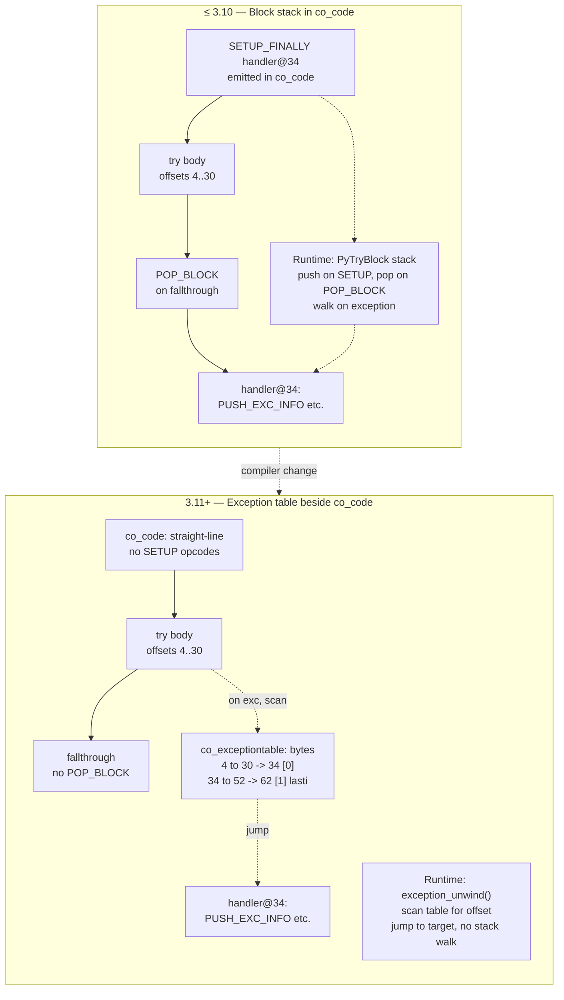
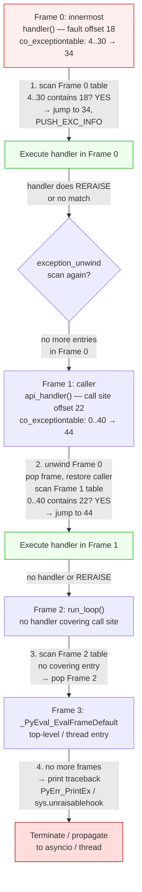
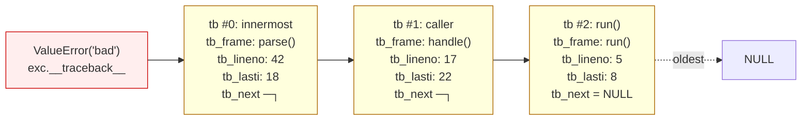
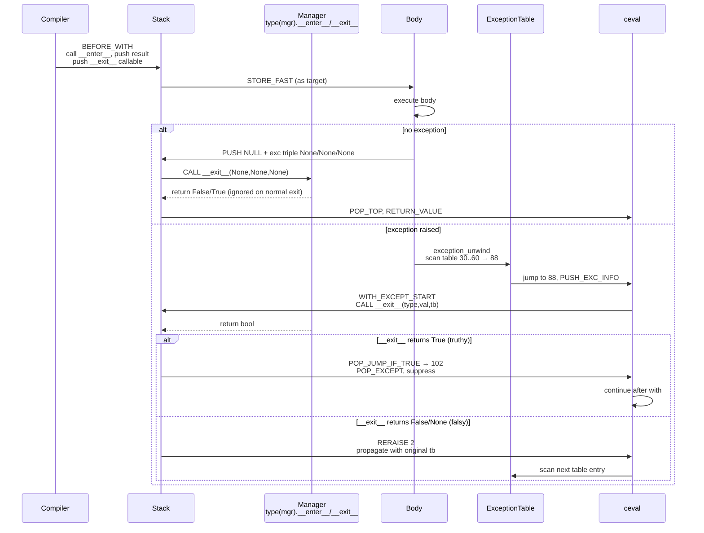
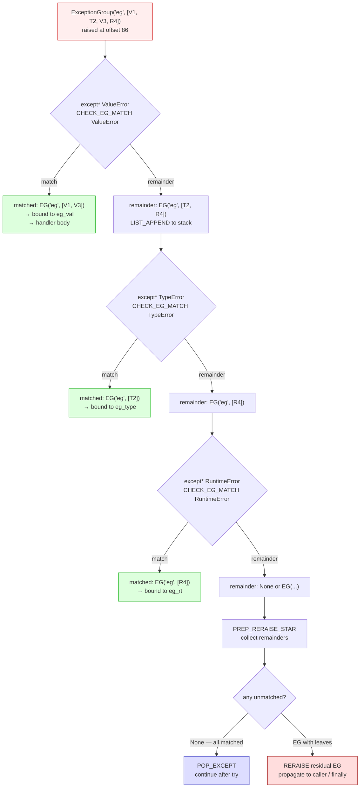

# Chapter 8 — Exceptions, Context Managers, and the Unwinding Machinery

**What this chapter covers.** Python's error handling looks declarative — `try`/`except`/`finally`, `with`, `raise ... from` — but underneath it is a precise unwinding machine built from an exception table, a per-thread error indicator, traceback chains, and a protocol for deterministic cleanup. Since Python 3.11 that machine was rewritten: the old `SETUP_FINALLY` / block-stack model is gone, replaced by a compact `co_exceptiontable`, `PUSH_EXC_INFO` / `POP_EXCEPT` / `RERAISE` lowering, and a `WITH_EXCEPT_START` path for context managers. PEP 654 added `ExceptionGroup` and `except*` on top. This chapter dissects the full stack — `BaseException` hierarchy, the C-level `PyErr_*` indicator, normalization, the exception table, bytecode lowering, traceback objects, chained exceptions (PEP 3134, PEP 678), the context-manager protocol (including `contextlib.contextmanager` and `BEFORE_WITH`), and `ExceptionGroup` splitting — with real `dis` output on CPython 3.11, `ceval.c` unwind traces, and backend patterns for structured error handling, resource management, and safe traceback logging.

Learning goals — after this chapter you should be able to:

- Draw the `BaseException` hierarchy and explain why `except Exception` does not catch `KeyboardInterrupt` / `SystemExit` / `GeneratorExit`, and how that shapes backend signal handling.
- Describe the per-thread exception indicator (`tstate->curexc_*` / `PyErr_SetString` / `PyErr_Fetch` / `PyErr_NormalizeException`) and the type → value → traceback normalization that `raise` triggers.
- Decode `co_exceptiontable` entries (`start, end -> target, depth, lasti`) and contrast them with the pre-3.11 `PyTryBlock` block stack, including how `ceval.c:exception_unwind` searches the table.
- Read `dis` output for `try`/`except`/`finally`/`else` and map each handler to `PUSH_EXC_INFO`, `CHECK_EXC_MATCH` / `CHECK_EG_MATCH`, `POP_EXCEPT`, `RERAISE`, and unconditional `JUMP` opcodes.
- Explain `PyTracebackObject` chains vs. `traceback.StackSummary` vs. formatted text, and how `sys.exception()` / `sys.exc_info()` expose the current exception.
- Trace chained exceptions: `__context__` (implicit, PEP 3134) vs. `__cause__` (explicit `raise ... from`) vs. `__suppress_context__`, and PEP 678 `BaseException.add_note()`.
- Walk the `WITH` protocol step-by-step: `BEFORE_WITH` → `__enter__` → body → `__exit__` with `WITH_EXCEPT_START`, and why a truthy `__exit__` return suppresses the exception.
- Implement correct `__exit__` (swallow vs. propagate), use `contextlib.contextmanager` / `ExitStack`, and explain where `SETUP_WITH` went.
- Use `ExceptionGroup` / `BaseExceptionGroup` and `except*` (PEP 654) — construction, `split` / `subgroup`, handler ordering, and interaction with `finally`.
- Apply the backend lens: structured exception taxonomies for services, context managers for DB connections / tracing spans / locks, and logging tracebacks without leaking PII.

> **Prerequisites.** Chapter 3 dissected `co_code`, wordcode, `ceval` dispatch, and the exception table at a high level; Chapter 2 covered `PyObject` / `PyTypeObject` and reference counting; Chapter 6 covered descriptors and `__exit__` lookup via `type`. This chapter assumes you can read `dis` output and skim `Python/ceval.c`. Volume 11 (Reliability) gives the service-level view of error budgets — here you see how the interpreter unwinds.

---

## 1. Why the unwinding machinery is a backend concern

Backend engineers tend to treat `try`/`except` as syntax. In production it is load-bearing infrastructure:

- **Every request handler is an unwind boundary.** An unhandled exception in a FastAPI / gRPC handler becomes a 500, a log line, and a trace span. Whether that exception carries a `__cause__` chain, a note, or a suppressed context determines whether on-call can diagnose it at 3 AM.
- **Resource leaks are exception-path bugs.** A DB connection, a file handle, or a distributed lock held across an exception that skips `finally` / `__exit__` is not a Python bug — it is an outage. `with` and `try`/`finally` lowering *is* your resource safety net. If you do not understand `WITH_EXCEPT_START` you cannot reason about whether your connection pool actually returns connections on error.
- **Traceback formatting is a data-leak vector.** `traceback.format_exc()` includes source lines, local variable reprs (if you use `StackSummary` tricks), and exception messages that may contain PII — user emails, tokens, SQL fragments. Logging the raw traceback to a centralized system without filtering is a compliance incident.
- **Structured concurrency needs `ExceptionGroup`.** `asyncio.TaskGroup` (3.11+) and `trio` raise `ExceptionGroup` when multiple child tasks fail. If your code does `except Exception` you will silently miss half the failures — you need `except*`.

Get the unwinding model wrong and you get silent suppression, leaked connections, or unactionable alerts. Get it right and exceptions become structured, observable signals.

---

## 2. The exception model — `BaseException` and the hierarchy

### 2.1 The hierarchy

Every raiseable object is an instance of `BaseException` (a `PyObject` subclass defined in `Objects/exceptions.c`). The hierarchy is deliberately shallow but semantically stratified:

```
BaseException
├── SystemExit          # raised by sys.exit() — carries .code
├── KeyboardInterrupt   # raised on SIGINT — must not be caught by generic handlers
├── GeneratorExit       # raised into a generator on .close() — must propagate
├── BaseExceptionGroup  # 3.11+, PEP 654 — container for multiple exceptions
│   └── ExceptionGroup
└── Exception           # what most code should inherit from
    ├── StopIteration / StopAsyncIteration
    ├── ArithmeticError
    │   ├── ZeroDivisionError, OverflowError, FloatingPointError
    ├── LookupError
    │   ├── KeyError, IndexError
    ├── ValueError, TypeError, RuntimeError, AttributeError, ...
    ├── OSError  (IOError alias)
    │   ├── ConnectionError, FileNotFoundError, TimeoutError, ...
    ├── ImportError, ModuleNotFoundError
    └── ExceptionGroup  (also reachable as ExceptionGroup via BaseExceptionGroup)
```

The critical split is `BaseException` vs. `Exception`. Bare `except:` and `except Exception:` catch only the `Exception` subtree. `KeyboardInterrupt`, `SystemExit`, and `GeneratorExit` deliberately sit *outside* `Exception` so that a generic service handler does not swallow Ctrl-C, `sys.exit()`, or generator teardown:

```python
# Backend anti-pattern — swallows signals and exit
try:
    run_server()
except Exception:      # OK — lets KeyboardInterrupt / SystemExit propagate
    log.exception("handler failed")

try:
    run_server()
except BaseException:  # DANGEROUS — catches KeyboardInterrupt, masks SIGTERM
    log.exception("handler failed")
```

In `Objects/exceptions.c` each exception type is a `PyTypeObject` with `tp_base` set to its parent. `PyErr_GivenExceptionMatches(err, exc)` walks `tp_mro` to implement `except` matching — it is the C equivalent of `issubclass(type(err), exc)`. `CHECK_EXC_MATCH` in bytecode calls the same logic.

### 2.2 What `raise` actually does

`raise` has three forms, all lowered to `RAISE_VARARGS` (opcode 176):

```python
raise                        # re-raise current exception (RERAISE path)
raise ValueError("bad")      # raise instance
raise ValueError             # raise type — ceval instantiates it
raise ValueError("bad") from e  # explicit cause
raise ValueError("bad") from None  # suppress context
```

At the C level the interpreter calls:

```
PyErr_SetString(ValueError, "bad")        // type + message → indicator
PyErr_SetObject(type, value)              // type + instance
PyErr_SetExcInfo(type, value, traceback)  // full triple
```

These set the per-thread exception indicator on `PyThreadState`:

```c
// Include/cpython/pystate.h (simplified)
typedef struct _PyThreadState {
    PyObject *curexc_type;   // legacy, now aliased to exc_info
    PyObject *curexc_value;
    PyObject *curexc_traceback;
    _PyErr_StackItem *exc_info;  // stack of active handlers (PUSH_EXC_INFO)
    // ...
} PyThreadState;
```

On 3.11+ the canonical storage is `tstate->curexc_*` plus the `exc_info` stack manipulated by `PUSH_EXC_INFO` / `POP_EXCEPT`. `PyErr_Fetch(&type, &value, &tb)` *clears* the indicator and returns the triple (caller owns the references). `PyErr_Restore(type, value, tb)` sets it without incrementing refcounts (steals references). `PyErr_Clear()` discards it. `PyErr_Occurred()` tests whether `curexc_type != NULL` — the single branch `ceval` checks after every opcode that can fail.

**Normalization** (`PyErr_NormalizeException`) ensures `value` is an instance of `type`: if `raise ValueError` was used (type, not instance), it calls `PyObject_CallNoArgs(ValueError)` to instantiate; if `value` is already an instance whose type is a subclass of `type`, it updates `type` to `type(value)`. Traceback is attached at this point. Normalization happens once, on first handler entry or when `PyErr_Fetch` is called — not on every `PyErr_SetString`.

---

## 3. The exception table — inline table (3.11+) vs. the old block stack

### 3.1 The old world: `PyTryBlock` and `SETUP_FINALLY`

Before 3.11 `try`/`except`/`finally`/`with`/`for` were tracked by a **block stack** — a C array of `PyTryBlock` on the frame:

```c
// Include/cpython/frameobject.h (≤3.10)
typedef struct {
    int b_type;     // SETUP_FINALLY, SETUP_WITH, SETUP_FINALLY etc.
    int b_handler;  // bytecode offset of handler
    int b_level;    // value-stack depth at block entry
} PyTryBlock;
```

The compiler emitted explicit `SETUP_FINALLY handler`, `SETUP_WITH handler`, `GET_ITER` / `SETUP_FINALLY`-for-loops, and `POP_BLOCK` at block end. At runtime `ceval` pushed/popped `PyTryBlock` entries as it entered/left `try` blocks. On exception, `ceval` walked the block stack top-down to find the innermost handler whose range contained the faulting offset.

Cost: every `try` paid a `SETUP_FINALLY` dispatch even on the non-exceptional path, `POP_BLOCK` on exit, and a branch on every opcode to check `why_code` for unwind. `co_stacksize` had to account for block-stack depth. The compiler and `ceval` both had to agree on block types.

### 3.2 The new world: `co_exceptiontable` (3.11+)

3.11 removed the block stack entirely. In its place each `PyCodeObject` carries `co_exceptiontable` — a `bytes` object encoding a compact table of entries (see `Objects/codeobject.c:exception_table` and `Python/ceval.c:exception_unwind`):

```
Each entry:  start_offset, end_offset  →  target_offset, stack_depth, push_lasti
  start, end : half-open bytecode range protected by this handler
  target     : handler entry offset (a PUSH_EXC_INFO)
  stack_depth: value-stack depth to unwind to before jumping
  push_lasti : if set, push current lasti onto stack for RERAISE / inline finally
```

Encoding is varint-compressed: offsets are stored as deltas from the previous entry, values as unsigned varints (`_PyVarint_Read` / `_PyVarint_Write` in `Python/codeobject.c`). The table is sorted by `start`. Lookup is a linear scan (tables are small — rarely >10 entries) in `get_exception_handler()` / `exception_unwind()`.

No opcode is emitted to "enter" a `try` on the non-exceptional path. The protected range is purely declarative in the table. The fast path — no exception raised — executes zero extra bytecodes.

`dis` renders the table after the bytecode:

```python
import dis

def simple_try(x):
    try:
        return int(x)
    except ValueError:
        return 0

dis.dis(simple_try)
```

Output on CPython 3.11:

```
 14           0 RESUME                   0

 15           2 NOP

 16           4 LOAD_GLOBAL              1 (NULL + int)
             16 LOAD_FAST                0 (x)
             18 PRECALL                  1
             22 CALL                     1
             32 RETURN_VALUE
        >>   34 PUSH_EXC_INFO

 17          36 LOAD_GLOBAL              2 (ValueError)
             48 CHECK_EXC_MATCH
             50 POP_JUMP_FORWARD_IF_FALSE     4 (to 60)
             52 POP_TOP

 18          54 POP_EXCEPT
             56 LOAD_CONST               1 (0)
             58 RETURN_VALUE

 17     >>   60 RERAISE                  0
        >>   62 COPY                     3
             64 POP_EXCEPT
             66 RERAISE                  1
ExceptionTable:
  4 to 30 -> 34 [0]
  34 to 52 -> 62 [1] lasti
  60 to 60 -> 62 [1] lasti
```

Read the table: "bytecode offsets 4..30 (the `try` body) on exception jump to 34 (`PUSH_EXC_INFO`). Offsets 34..52 (the `except ValueError` test) on exception jump to 62 (re-raise handler). Stack depth 0 or 1, `lasti` pushed when needed for nested unwind."

Compare `try`/`finally`, which duplicates the `finally` body for both the non-exceptional fallthrough and the exceptional table target:

```python
def try_finally(x):
    try:
        return int(x)
    except ValueError as e:
        print(e)
        return 0
    finally:
        print("cleanup")

dis.dis(try_finally)
```

```
 25           0 RESUME                   0

 26           2 NOP

 27           4 LOAD_GLOBAL              1 (NULL + int)
             16 LOAD_FAST                0 (x)
             18 PRECALL                  1
             22 CALL                     1

 32          32 LOAD_GLOBAL              3 (NULL + print)
             44 LOAD_CONST               1 ('cleanup')
             46 PRECALL                  1
             50 CALL                     1
             60 POP_TOP
             62 RETURN_VALUE
        >>   64 PUSH_EXC_INFO

 28          66 LOAD_GLOBAL              4 (ValueError)
             78 CHECK_EXC_MATCH
             80 POP_JUMP_FORWARD_IF_FALSE    41 (to 164)
             82 STORE_FAST               1 (e)

 29          84 LOAD_GLOBAL              3 (NULL + print)
             96 LOAD_FAST                1 (e)
             98 PRECALL                  1
            102 CALL                     1
            112 POP_TOP

 30         114 POP_EXCEPT
            116 LOAD_CONST               0 (None)
            118 STORE_FAST               1 (e)
            120 DELETE_FAST              1 (e)

 32         122 LOAD_GLOBAL              3 (NULL + print)
            134 LOAD_CONST               1 ('cleanup')
            136 PRECALL                  1
            140 CALL                     1
            150 POP_TOP
            152 LOAD_CONST               2 (0)
            154 RETURN_VALUE
        >>  156 LOAD_CONST               0 (None)
            158 STORE_FAST               1 (e)
            160 DELETE_FAST              1 (e)
            162 RERAISE                  1

 28     >>  164 RERAISE                  0
        >>  166 COPY                     3
            168 POP_EXCEPT
            170 RERAISE                  1
        >>  172 PUSH_EXC_INFO

 32         174 LOAD_GLOBAL              3 (NULL + print)
            186 LOAD_CONST               1 ('cleanup')
            188 PRECALL                  1
            192 CALL                     1
            202 POP_TOP
            204 RERAISE                  0
        >>  206 COPY                     3
            208 POP_EXCEPT
            210 RERAISE                  1
ExceptionTable:
  4 to 30 -> 64 [0]
  64 to 82 -> 166 [1] lasti
  84 to 112 -> 156 [1] lasti
  114 to 120 -> 172 [0]
  156 to 164 -> 166 [1] lasti
  166 to 170 -> 172 [0]
  172 to 204 -> 206 [1] lasti
```

Notice the `finally` body at offsets 32..62 (non-exceptional return) is repeated at 122..150 (after `except` success) and at 174..204 (unwinding path) — the compiler inlines `finally` at every exit point. The exception table stitches those copies together.



*Diagram 1 — Exception table vs. block stack. Pre-3.11 every `try` emitted `SETUP_FINALLY`/`POP_BLOCK` into the bytecode and maintained a runtime `PyTryBlock` stack. Since 3.11 the bytecode is straight-line; the `co_exceptiontable` declaratively maps protected ranges to handler offsets and `ceval` scans it only on the exceptional path.*

---

## 4. Bytecode lowering — `try`/`except`/`finally`/`else`

### 4.1 The handler opcodes

Once `exception_unwind` has jumped to a handler target, five opcodes orchestrate the handler body. All are cheap — they only run on the exceptional path:

| Opcode | Stack effect | Role |
|---|---|---|
| `PUSH_EXC_INFO` | `→ exc_info` (pushes `tstate->exc_info` frame) | Enter handler: saves previous `exc_info`, pushes current `type/value/tb` as new `exc_info`, clears indicator so handler body can run. Always the first instruction at a table target. |
| `CHECK_EXC_MATCH` | `type exc_val tb exc_type → type exc_val tb bool` | Tests `PyErr_GivenExceptionMatches(exc_val, exc_type)`. Consumes the tested type, leaves `type/val/tb` + bool. |
| `POP_JUMP_FORWARD_IF_FALSE` | `bool →` | Branches to next `except` clause or `RERAISE` if no match. |
| `POP_EXCEPT` | `type val tb →` (pops `exc_info`) | Exit handled `except`: pops `exc_info` stack, restores previous handler, clears traceback. Paired with `PUSH_EXC_INFO`. |
| `RERAISE` | varies by oparg | Re-raises. `RERAISE 0` = re-raise current `exc_info` (no stack change, used for `except` fallthrough). `RERAISE 1` = pop `exc_info` then re-raise. `RERAISE 2` = used by `WITH_EXCEPT_START` path. |
| `COPY i` / `SWAP` | stack shuffle | Used in the two-instruction re-raise epilogue (`COPY 3; POP_EXCEPT; RERAISE 1`) to preserve the exception triple while popping `exc_info`. |

`JUMP_FORWARD` / `JUMP_BACKWARD` handle the non-exceptional fallthrough: after a `try` body succeeds, an unconditional jump skips over the handler. `NOP` at the `try` start is a placeholder for the compiler's exception-table range start (it makes the range non-empty).

### 4.2 `try`/`except`/`else`/`finally` — complete lowering

```python
import dis

def full_form(x):
    try:
        v = int(x)
    except ValueError as e:
        v = 0
        print(f"value error: {e}")
    except TypeError:
        v = -1
    else:
        print("no exception")
    finally:
        print("done")
    return v

dis.dis(full_form)
```

Key observations on 3.11:

```
  RESUME
  NOP                          # try start marker
  LOAD_GLOBAL int / LOAD_FAST x / PRECALL / CALL   # try body
  POP_JUMP? — none, fallthrough goes to else/finally
  PUSH_EXC_INFO                # handler for ValueError
    CHECK_EXC_MATCH ValueError
    POP_JUMP_FORWARD_IF_FALSE → next handler
    STORE_FAST e / body / POP_EXCEPT
    JUMP_FORWARD → finally
  PUSH_EXC_INFO                # handler for TypeError (actually same target, chained checks)
    CHECK_EXC_MATCH TypeError
    POP_JUMP_FORWARD_IF_FALSE → RERAISE
    POP_EXCEPT / body
    JUMP_FORWARD → finally
  RERAISE 0                    # no except matched — propagate
  COPY 3 / POP_EXCEPT / RERAISE 1  # re-raise epilogue
  # else block (only on no-exception path)
  # finally block — inlined 3×: fallthrough, after-except, unwind
ExceptionTable:
  try_body       -> handler0 [0]
  handler0_range -> reraise_epilogue [1] lasti
  else/finally   -> unwind_handler [0 or 1] lasti
```

Rules the compiler follows:

- `else` runs only if the `try` body did not raise — it is *outside* the protected range, reached by fallthrough `JUMP_FORWARD` over the handlers. If `else` itself raises, it is *not* caught by the `except` clauses above it.
- `finally` is inlined at every exit: normal fallthrough, each `except` success path, and the unwind path. The unwind copy ends with `RERAISE 0` to continue propagation after cleanup.
- `as e` (`STORE_FAST e`) is followed by `POP_EXCEPT` then later `STORE_FAST None; DELETE_FAST e` to clear the exception reference and break the traceback cycle (see Section 5).

### 4.3 Unwind search — `exception_unwind` up the frame stack

When an opcode sets the exception indicator and the current offset has no table entry covering it, `ceval` does not immediately propagate to the caller. It walks *frames*, not just table entries:



*Diagram 2 — Unwind search up the frame stack. `ceval.c:handle_eval_breaker` / `exception_unwind` first scans the current frame's `co_exceptiontable` for a covering entry. On miss or `RERAISE`, it pops the frame and scans the caller, repeating until a handler is found or the thread boundary is reached. Each frame's table is independent; there is no global handler list.*

In C this is roughly:

```c
// Python/ceval.c — simplified unwind loop
PyObject *exc = tstate->curexc_value;  // set by failing opcode
int offset = frame->instr_ptr - co->co_code_adaptive;
for (;;) {
    int handler = get_exception_handler(co, offset, &depth, &lasti);
    if (handler >= 0) {
        // Found: unwind value stack to depth, optionally push lasti,
        // set instr_ptr = handler, PUSH_EXC_INFO, continue dispatch
        break;
    }
    // No handler in this frame — pop frame
    frame = pop_frame(tstate);
    if (frame == NULL) {
        // No more frames — unhandled
        PyErr_PrintEx(1);
        break;
    }
    offset = frame->instr_ptr - co->co_code_adaptive;
}
```

The `lasti` flag matters for `finally` re-raise: the handler needs the faulting offset to decide whether the `finally` itself should be protected.

---

## 5. Traceback objects — `PyTracebackObject`, `StackSummary`, and formatting

### 5.1 `PyTracebackObject` chains

A traceback is not a string — it is a linked list of `PyTracebackObject` nodes, one per frame in the unwind path:

```c
// Include/cpython/traceback.h
typedef struct _traceback {
    PyObject_HEAD
    struct _traceback *tb_next;  // linked list — older caller
    PyFrameObject *tb_frame;     // borrowed frame (holds co_name, co_filename)
    int tb_lasti;                // bytecode offset at failure
    int tb_lineno;               // computed from co_positions + tb_lasti
} PyTracebackObject;
```

On exception, `PyTraceBack_Here(frame)` is called as the frame unwinds — it allocates a `PyTracebackObject`, sets `tb_next` to the previous `curexc_traceback`, and chains it. The youngest frame (where the exception was raised) is the *head*; `tb_next` walks toward the oldest caller. `BaseException.__traceback__` points to the head.



*Diagram 6 — Traceback object chain. Each `PyTracebackObject` holds `tb_frame` / `tb_lineno` / `tb_lasti` and `tb_next` links to the caller. `exc.__traceback__` is the head (youngest frame); `tb_next` walks outward. The chain is built during unwind by `PyTraceBack_Here` and torn down when the exception is cleared or `__traceback__` is reassigned.*

Key properties:

- Tracebacks hold strong references to frames, which hold references to locals — they can keep large objects alive. `except E as e: ...` without `del e` / implicit clear at block exit leaks the traceback cycle. CPython clears `e` at `POP_EXCEPT` + `DELETE_FAST` for this reason.
- `tb_lineno` is computed lazily from `tb_lasti` via `co_positions` (`_PyCode_Addr2Line`). Mutating `co_positions` does not retroactively change existing tracebacks.
- `sys.exception()` (3.11+, replaces `sys.exc_info()[1]` in most code) returns the current `curexc_value` with its `__traceback__` already attached. `sys.exc_info()` returns `(type, value, traceback)` — prefer `sys.exception()` in new code; it is faster and does not expose the type separately.

### 5.2 `traceback` module — `StackSummary` and formatting

The `traceback` module (`Lib/traceback.py`) converts the `PyTracebackObject` chain into Python-level summaries and text:

```python
import traceback, sys

try:
    1 / 0
except ZeroDivisionError:
    exc_type, exc_val, exc_tb = sys.exc_info()

    # Low-level: walk PyTracebackObject chain
    tb = exc_val.__traceback__
    while tb is not None:
        print(f"  frame={tb.tb_frame.f_code.co_name} line={tb.tb_lineno} lasti={tb.tb_lasti}")
        tb = tb.tb_next

    # Mid-level: StackSummary — structured, no string formatting yet
    summary = traceback.extract_tb(exc_val.__traceback__)
    # summary is StackSummary[FrameSummary(filename, lineno, name, line, locals?)]
    for frame in summary:
        print(frame)  # FrameSummary

    # High-level: formatted text (what log handlers emit)
    print("".join(traceback.format_exception(exc_val)))
    # or: traceback.print_exc()

    # 3.11+: format_exception(exc) takes the exception directly, reads __notes__
    print("".join(traceback.format_exception(exc_val)))
```

`StackSummary` is the right layer for backend observability: it is structured (you can filter frames, redact filenames, strip PII from `frame.line`), serializable, and does not eagerly read source files. `format_exception` is the presentation layer — it reads `__cause__` / `__context__` / `__notes__` and renders the familiar `Traceback (most recent call last):` text.

PII caution: `format_exception` with `chain=True` (the default) renders `__cause__` and `__context__` messages. If an exception message contains `f"user {email} not found"` or a SQL fragment, that PII lands in your log aggregator. Prefer structured logging that captures `type(exc).__name__` + `exc.args[0]` after sanitization, and attach `StackSummary` with source lines stripped in production.

```python
# Safe traceback logging pattern
import traceback, logging

logger = logging.getLogger("api")

def log_exception_safely(exc: BaseException) -> None:
    # Structured — no source lines, no locals, redacted message
    summary = traceback.StackSummary.extract(
        traceback.walk_tb(exc.__traceback__)
    )
    # Strip source text to avoid leaking code context; keep filename:lineno:name
    safe_frames = [
        {"file": f.filename, "line": f.lineno, "func": f.name}
        for f in summary
    ]
    logger.error(
        "request failed",
        extra={
            "exc_type": type(exc).__name__,
            # sanitize message — drop or hash PII-bearing args
            "exc_msg": _sanitize(str(exc)),
            "frames": safe_frames,
            "cause": type(exc.__cause__).__name__ if exc.__cause__ else None,
            "notes": getattr(exc, "__notes__", []),
        },
        exc_info=False,  # we already captured structured data; don't emit raw traceback
    )
```

---

## 6. Chained exceptions — `__cause__`, `__context__`, `__suppress_context__`, and PEP 678 notes

### 6.1 Three links, one graph

PEP 3134 gave every `BaseException` three chaining fields (all `PyObject*`, nullable, managed in `Objects/exceptions.c`):

| Attribute | Set when | Meaning | Rendered as |
|---|---|---|---|
| `__context__` | Any exception is raised while another is being handled (`curexc_value != NULL`) | Implicit context — "while handling X, Y happened" | `During handling of the above exception, another exception occurred:` |
| `__cause__` | `raise Y from X` / `raise Y from e` (explicit) | Explicit cause — "Y was caused by X" | `The above exception was the direct cause of the following exception:` |
| `__suppress_context__` | `raise Y from None` sets `__cause__ = None, __suppress_context__ = True` | Suppresses `__context__` display even though it is still stored | *(no chain rendered)* |
| `__notes__` | `exc.add_note(str)` (PEP 678, 3.11+) | Freeform annotations appended after the exception message | `note: ...` lines after `ExceptionType: msg` |

Only `__cause__` is set by `raise ... from`. `__context__` is set automatically by `PyErr_SetObject` when `tstate->curexc_value` is non-NULL and `__suppress_context__` is False. The two can coexist — `__cause__` takes display priority.

```mermaid
flowchart TB
    subgraph IMPLICIT["Implicit chaining — bare raise in except"]
        A1["try:<br/>  raise ValueError('bad input')<br/>except ValueError:<br/>  raise RuntimeError('handler failed')"]
        A1 --> A2["RuntimeError<br/>__context__ = ValueError('bad input')<br/>__cause__ = None<br/>__suppress_context__ = False"]
        A2 --> A2R["Rendered:<br/>ValueError: bad input<br/><i>During handling...</i><br/>RuntimeError: handler failed"]
    end
    subgraph EXPLICIT["Explicit chaining — raise ... from"]
        B1["try:<br/>  raise ValueError('bad')<br/>except ValueError as e:<br/>  raise RuntimeError('wrapped') from e"]
        B1 --> B2["RuntimeError<br/>__cause__ = ValueError('bad')<br/>__context__ = ValueError('bad')<br/>__suppress_context__ = False"]
        B2 --> B2R["Rendered:<br/>ValueError: bad<br/><i>The above exception was the direct cause...</i><br/>RuntimeError: wrapped"]
    end
    subgraph SUPPRESSED["Suppressed context — raise ... from None"]
        C1["try:<br/>  raise ValueError('bad')<br/>except ValueError:<br/>  raise RuntimeError('clean') from None"]
        C1 --> C2["RuntimeError<br/>__cause__ = None<br/>__context__ = ValueError('bad')<br/>__suppress_context__ = True"]
        C2 --> C2R["Rendered:<br/>RuntimeError: clean<br/><i>(no chain shown, context hidden)</i>"]
    end
    style A2 fill:#ffd,stroke:#a60
    style B2 fill:#dfd,stroke:#0a0
    style C2 fill:#ddf,stroke:#00a
```



*Diagram 3 — Chained exception graph: `__context__` (implicit) vs. `__cause__` (explicit `raise ... from`) vs. suppressed (`raise ... from None`). `__context__` is set automatically when a new exception is raised inside an `except` block; `__cause__` is set only by explicit `from`; `from None` sets `__suppress_context__` to hide the implicit chain from rendering while preserving it on the object.*

### 6.2 Live demo

```python
import traceback

# 1. Implicit context
try:
    try:
        raise ValueError("bad input")
    except ValueError:
        raise RuntimeError("handler failed")
except RuntimeError as e:
    print(f"__context__={e.__context__!r}  __cause__={e.__cause__!r}  "
          f"__suppress_context__={e.__suppress_context__}")
    print("".join(traceback.format_exception(e)))

# 2. Explicit cause
try:
    try:
        raise ValueError("bad")
    except ValueError as e:
        raise RuntimeError("wrapped") from e
except RuntimeError as e:
    print(f"__context__={e.__context__!r}  __cause__={e.__cause__!r}")
    print("".join(traceback.format_exception(e)))

# 3. Suppressed
try:
    try:
        raise ValueError("bad")
    except ValueError:
        raise RuntimeError("clean") from None
except RuntimeError as e:
    print(f"__context__={e.__context__!r}  __cause__={e.__cause__!r}  "
          f"__suppress_context__={e.__suppress_context__}")
    print("".join(traceback.format_exception(e)))
```

Output (abbreviated):

```
__context__=ValueError('bad input')  __cause__=None  __suppress_context__=False
Traceback (most recent call last):
  File "...", line 4, in <module>
    raise ValueError("bad input")
ValueError: bad input

During handling of the above exception, another exception occurred:

Traceback (most recent call last):
  File "...", line 6, in <module>
    raise RuntimeError("handler failed")
RuntimeError: handler failed

__context__=ValueError('bad')  __cause__=ValueError('bad')
Traceback (most recent call last):
  File "...", line 14, in <module>
    raise ValueError("bad")
ValueError: bad

The above exception was the direct cause of the following exception:

Traceback (most recent call last):
  File "...", line 16, in <module>
    raise RuntimeError("wrapped") from e
RuntimeError: wrapped

__context__=ValueError('bad')  __cause__=None  __suppress_context__=True
Traceback (most recent call last):
  File "...", line 28, in <module>
    raise RuntimeError("clean") from None
RuntimeError: clean
```

### 6.3 PEP 678 notes — `add_note()`

PEP 678 (3.11+) adds `BaseException.add_note(str)` and `BaseException.__notes__` (a list of strings). Notes are rendered by `traceback.format_exception` *after* the exception line, one per line, without affecting `__cause__` / `__context__`:

```python
try:
    raise ValueError("invalid payload")
except ValueError as e:
    e.add_note("request_id=abc-123")
    e.add_note("field 'email' failed validation")
    raise

# Rendered:
# ValueError: invalid payload
# note: request_id=abc-123
# note: field 'email' failed validation
```

Backend use: attach structured context (request ID, tenant, span ID) as notes *without* mutating `args[0]` and without creating a new exception that would reset the traceback. Notes survive `ExceptionGroup` splitting (each sub-exception retains its notes) and are visible in `format_exception` without custom formatters. Prefer notes over `f"msg (request_id={rid})"` string interpolation — the latter pollutes the exception message that may be matched by `except` or alerting rules.

Caveat: `__notes__` is a plain list on the exception instance — mutating it after `raise` is visible to handlers. Treat it as append-only.

---

## 7. Context managers — the `WITH` protocol

### 7.1 The synchronous protocol

A context manager is any object with `__enter__` and `__exit__` (both looked up on `type(obj)`, not the instance — `type(obj).__enter__` via `PyObject_LookupSpecial`). The protocol:

```python
class FileManager:
    def __enter__(self):
        self.f = open(self.path, "r")
        return self.f          # value bound to `as` target

    def __exit__(self, exc_type, exc_val, exc_tb):
        # exc_type/val/tb are None if no exception, else the current triple
        self.f.close()
        return False            # False/None = propagate; True = suppress
```

Bytecode lowering on 3.11+ uses two opcodes plus a table entry. `dis` for a `with` statement:

```python
import dis

class MyCM:
    def __enter__(self): return self
    def __exit__(self, *a): return False

def with_custom():
    with MyCM() as c:
        print("inside")

dis.dis(with_custom)
```

```
 51           0 RESUME                   0

 52           2 LOAD_GLOBAL              1 (NULL + MyCM)
             14 PRECALL                  0
             18 CALL                     0
             28 BEFORE_WITH              # <-- enter protocol
             30 STORE_FAST               0 (c)

 53          32 LOAD_GLOBAL              3 (NULL + print)
             44 LOAD_CONST               1 ('inside')
             46 PRECALL                  1
             50 CALL                     1
             60 POP_TOP

 52          62 LOAD_CONST               0 (None)   # normal exit path
             64 LOAD_CONST               0 (None)
             66 LOAD_CONST               0 (None)
             68 PRECALL                  2
             72 CALL                     2          # call __exit__(None, None, None)
             82 POP_TOP
             84 LOAD_CONST               0 (None)
             86 RETURN_VALUE
        >>   88 PUSH_EXC_INFO
             90 WITH_EXCEPT_START         # <-- exceptional exit path
             92 POP_JUMP_FORWARD_IF_TRUE     4 (to 102)  # True → suppress
             94 RERAISE                  2
        >>   96 COPY                     3
             98 POP_EXCEPT
            100 RERAISE                  1
        >>  102 POP_TOP                  # suppressed — discard exc triple
            104 POP_EXCEPT
            106 POP_TOP
            108 POP_TOP
            110 LOAD_CONST               0 (None)
            112 RETURN_VALUE
ExceptionTable:
  30 to 60 -> 88 [1] lasti
  88 to 94 -> 96 [3] lasti
  102 to 102 -> 96 [3] lasti
```

`BEFORE_WITH` (opcode 53) does two things in one dispatch: it calls `type(mgr).__enter__(mgr)` (via `PyObject_CallMethod`), pushes the result for `STORE_FAST`, and pushes the `__exit__` callable onto the stack for later use. The `__exit__` callable stays on the stack across the body — that is why the protected range `30..60` has `stack_depth=1`.

On the exceptional path (`PUSH_EXC_INFO` at 88): `WITH_EXCEPT_START` calls `__exit__(exc_type, exc_val, exc_tb)` with the current exception triple, pushes its boolean return, and `POP_JUMP_FORWARD_IF_TRUE` decides suppression. `RERAISE 2` with oparg 2 pops the `__exit__` callable and re-raises with the original traceback if not suppressed.



*Diagram 4 — `WITH` protocol sequence. `BEFORE_WITH` calls `__enter__` and retains `__exit__` on the stack across the body. On normal exit the `finally`-like inline path calls `__exit__(None,None,None)`. On exceptional exit the exception table jumps to `PUSH_EXC_INFO` / `WITH_EXCEPT_START`, which calls `__exit__` with the exception triple; a truthy return suppresses, falsy re-raises via `RERAISE 2`.*

### 7.2 Suppress vs. propagate — `__exit__` return value

The only thing that determines suppression is the truthiness of `__exit__`'s return value. `None` and `False` propagate; `True` (or any truthy object) suppresses:

```python
import traceback

class SwallowingCM:
    """Swallows ValueError, propagates everything else."""
    def __enter__(self): return self
    def __exit__(self, exc_type, exc_val, exc_tb):
        if exc_type is not None and issubclass(exc_type, ValueError):
            print(f"swallowed {exc_val!r}")
            return True   # suppress
        return False      # propagate (explicit)

class LoggingCM:
    def __enter__(self): return self
    def __exit__(self, exc_type, exc_val, exc_tb):
        if exc_type is not None:
            print(f"leaving with {exc_type.__name__}: {exc_val}")
        # return None implicitly → propagate
        return None

# Swallowed — no exception escapes
with SwallowingCM():
    raise ValueError("oops")
print("after swallowed block — continues")

# Propagated — exception escapes after __exit__ runs
try:
    with LoggingCM():
        raise TypeError("bad type")
except TypeError as e:
    print(f"caught {e!r}")
    print("".join(traceback.format_exception(e)))
```

Output:

```
swallowed ValueError('oops')
after swallowed block — continues
leaving with TypeError: bad type
caught TypeError('bad type')
Traceback (most recent call last):
  File "...", line ..., in <module>
    raise TypeError("bad type")
TypeError: bad type
```

Backend pitfalls:

- **Never swallow blindly.** `return True` unconditionally hides bugs. If you write a swallowing manager (e.g., `contextlib.suppress`), be explicit about which types you swallow and log what you swallowed.
- **`__exit__` exceptions replace the original.** If `__exit__` itself raises, that new exception propagates with the original as `__context__` (implicit chain) — the original is not lost but it is no longer the primary exception. Keep `__exit__` simple and exception-safe.
- **`__exit__` is looked up on the type.** Monkey-patching `mgr.__exit__ = ...` on the instance does nothing — `BEFORE_WITH` does `type(mgr).__exit__`.

### 7.3 `contextlib.contextmanager` — generator-based managers

`@contextlib.contextmanager` lets you write a manager as a generator with a single `yield`:

```python
import contextlib

@contextlib.contextmanager
def transaction(db):
    tx = db.begin()
    try:
        yield tx
        tx.commit()
    except BaseException:
        tx.rollback()
        raise
    finally:
        pass  # tx object cleanup if needed

# Equivalent to a class with __enter__/__exit__, but the generator frame
# *is* the state machine. The decorator wraps it in _GeneratorContextManager.

with transaction(db) as tx:
    tx.execute("INSERT ...")
```

Implementation sketch (`Lib/contextlib.py`): `_GeneratorContextManager.__enter__` calls `next(gen)` to run to `yield` and returns the yielded value. `__exit__` does:

- `None` triple → `next(gen)` to run the post-`yield` commit path; `StopIteration` is swallowed.
- Exception triple → `gen.throw(exc_type, exc_val, exc_tb)` to inject the exception at the `yield`; if the generator handles it (yields or returns), suppression is decided by whether `StopIteration` vs. new exception emerges; if the generator does not handle it, the exception propagates.

Because the generator's `yield` is inside a `try`/`finally`, the same exception-table machinery from Section 4 protects it. The `contextmanager` wrapper adds one extra frame to the traceback — visible in `format_exception` output.

Other `contextlib` tools that build on the same protocol:

| Tool | Purpose |
|---|---|
| `contextlib.suppress(*exc_types)` | `__exit__` returns `True` for listed types, `False` otherwise — the canonical swallowing manager |
| `contextlib.ExitStack` / `AsyncExitStack` | Dynamically manages a stack of `__enter__`/`__exit__` pairs; unwinds in LIFO order, correctly chaining suppressed vs. propagated exceptions |
| `contextlib.nullcontext` | No-op manager — useful as a conditional `with` branch |
| `contextlib.closing(obj)` | Calls `obj.close()` in `__exit__` — for objects with `close` but no `__exit__` |
| `contextlib.redirect_stdout` / `redirect_stderr` | Swaps `sys.stdout` in `__enter__`, restores in `__exit__` |

### 7.4 Async context managers

The async protocol mirrors the sync one with `__aenter__` / `__aexit__` and opcodes `BEFORE_ASYNC_WITH` (52) and `GET_AWAITABLE`:

```python
class AsyncCM:
    async def __aenter__(self): return self
    async def __aexit__(self, *a): return False

async def demo():
    async with AsyncCM() as c:
        await do_work()
```

`BEFORE_ASYNC_WITH` calls `__aenter__`, wraps the result in `GET_AWAITABLE`, and suspends via `SEND` until the awaitable completes. `__aexit__` is similarly awaited on exit, with the same truthiness rule for suppression. The exception table entry for an `async with` body is identical in shape — only the enter/exit opcodes differ.

---

## 8. `ExceptionGroup` and `except*` — PEP 654

### 8.1 Motivation

In sequential Python one `try` raises one exception. In structured concurrency many tasks fail at once:

```python
async with asyncio.TaskGroup() as tg:
    tg.create_task(fetch("https://a.example.com"))
    tg.create_task(fetch("https://b.example.com"))
    tg.create_task(fetch("https://c.example.com"))
# If two fetches raise, what should `except` catch?
```

Before 3.11 the answer was "the first one" — other exceptions were lost. PEP 654 introduces `BaseExceptionGroup` / `ExceptionGroup` to carry *multiple* exceptions as a tree, and `except*` to match *subsets* without losing the rest.

### 8.2 Constructing and inspecting an `ExceptionGroup`

```python
eg = ExceptionGroup("fetch failures", [
    ValueError("bad payload from a"),
    TypeError("unexpected type from b"),
    ValueError("bad payload from c"),
])

print(eg.message)        # "fetch failures"
print(eg.exceptions)     # tuple of 3
print(eg.subgroup(ValueError))  # ExceptionGroup with the two ValueErrors
print(eg.split(ValueError))
# (ExceptionGroup('fetch failures', [ValueError(...), ValueError(...)]),
#  ExceptionGroup('fetch failures', [TypeError(...)]))
# split returns (matching, nonmatching) — either may be None

# Notes survive
eg.exceptions[0].add_note("request_id=a-123")
```

`BaseExceptionGroup` is the base for groups that may contain `BaseException` leaves (including `KeyboardInterrupt`); `ExceptionGroup` is constrained to `Exception` leaves. Both are immutable — `exceptions` is a tuple, `message` is a string, `__notes__` works on the group itself.

Nesting is allowed: an `ExceptionGroup` can contain another `ExceptionGroup`, forming a tree. `split` / `subgroup` recurse into nested groups and prune empty branches.

### 8.3 `except*` — filtering, not catching

`except*` looks like `except` but its semantics are *filtering*. Each `except* E` clause is tried against the `ExceptionGroup`'s leaves; matching leaves are extracted into a new subgroup and bound to the `as` target, non-matching leaves continue to the next `except*`:

```python
import traceback

try:
    raise ExceptionGroup("eg", [
        ValueError(1),
        TypeError(2),
        ValueError(3),
        RuntimeError(4),
    ])
except* ValueError as eg_val:
    print(f"caught ValueErrors: {eg_val.exceptions!r}")
    # eg_val is ExceptionGroup("eg", [ValueError(1), ValueError(3)])
    print("".join(traceback.format_exception(eg_val)))
except* TypeError as eg_type:
    print(f"caught TypeErrors: {eg_type.exceptions!r}")
except* RuntimeError as eg_rt:
    print(f"caught RuntimeErrors: {eg_rt.exceptions!r}")

print("all matched — no unhandled leaves, continues")
```

If every leaf is matched by some `except*`, execution continues after the `try`. If any leaf is unmatched, the remaining leaves are re-raised as a new `ExceptionGroup` (via `PREP_RERAISE_STAR` + `RERAISE 0`) — possibly after `finally` runs.

Mixing `except` and `except*` in the same `try` is a `SyntaxError` — the compiler enforces it. Use one style per `try`.

### 8.4 Bytecode lowering — `CHECK_EG_MATCH` and `PREP_RERAISE_STAR`

`dis` for the `except*` example above (from Section 3's capture, annotated):

```
  3           4 PUSH_NULL / LOAD_NAME ExceptionGroup / BUILD_LIST 3 / CALL
             86 RAISE_VARARGS            1
        >>   88 PUSH_EXC_INFO

  4          90 COPY                     1
             92 BUILD_LIST               0          # list for matched subgroups
             94 SWAP                     2
             96 LOAD_NAME                ValueError
             98 CHECK_EG_MATCH                      # split group by ValueError
            100 COPY                     1
            102 POP_JUMP_FORWARD_IF_NONE    23 (to 150)  # no match → next handler
            104 STORE_NAME               eg
  5         106 PUSH_NULL / LOAD_NAME print / LOAD_NAME eg / PRECALL / CALL / POP_TOP
            128 LOAD_CONST None / STORE_NAME eg / DELETE_NAME eg
            134 JUMP_FORWARD             6 (to 148)
        >>  136 LOAD_CONST None / STORE_NAME eg / DELETE_NAME eg
            142 LIST_APPEND              3          # no-match path: stash remainder
            144 POP_TOP
            146 JUMP_FORWARD             2 (to 152)
        >>  148 JUMP_FORWARD             1 (to 152)

  4     >>  150 POP_TOP                  # ValueError handler had no match

  6     >>  152 LOAD_NAME                TypeError
            154 CHECK_EG_MATCH
            156 COPY                     1
            158 POP_JUMP_FORWARD_IF_NONE    23 (to 206)
            ...  # same shape for TypeError handler
        >>  208 LIST_APPEND              1
            210 PREP_RERAISE_STAR                   # prepare residual group
            212 COPY                     1
            214 POP_JUMP_FORWARD_IF_NOT_NONE     4 (to 224)
            216 POP_TOP / POP_EXCEPT / RETURN_VALUE  # all matched → suppress
        >>  224 SWAP                     2 / POP_EXCEPT / RERAISE 0  # residual → re-raise
        >>  230 COPY                     3 / POP_EXCEPT / RERAISE 1  # outer handler
ExceptionTable:
  4 to 86 -> 88 [0]
  88 to 104 -> 230 [1] lasti
  106 to 126 -> 136 [4] lasti
  128 to 160 -> 230 [1] lasti
  162 to 182 -> 192 [4] lasti
  184 to 216 -> 230 [1] lasti
```

Key differences from `except`:

- `CHECK_EG_MATCH` (opcode 37) does `BaseExceptionGroup.split(exc_type)` — it returns `(matching_subgroup_or_None, nonmatching_subgroup_or_None)`, leaves the non-matching remainder on the stack for the next handler, and pushes the matching subgroup for the current handler to test for `None`.
- `PREP_RERAISE_STAR` (opcode 88) collects the `LIST_APPEND`'d remainders and either leaves `None` (all matched) or builds the residual `ExceptionGroup` to re-raise.
- Each `except*` body has its own exception-table entry with `stack_depth=4` (the extra stack items for the group-splitting protocol) and `lasti`.



*Diagram 5 — `ExceptionGroup` split tree (PEP 654). Each `except*` clause runs `CHECK_EG_MATCH`, which splits the incoming group into a matching subgroup (bound to `as` and handled) and a non-matching remainder pushed for the next handler. `PREP_RERAISE_STAR` reassembles any unmatched remainder — if empty, execution continues; if non-empty, the residual `ExceptionGroup` is re-raised.*

### 8.5 `split` / `subgroup` API and nesting

```python
eg = ExceptionGroup("outer", [
    ValueError(1),
    ExceptionGroup("inner", [TypeError(2), ValueError(3)]),
    RuntimeError(4),
])

# subgroup — keep only matching leaves, prune empty branches
print(eg.subgroup(ValueError))
# ExceptionGroup('outer', [ValueError(1), ExceptionGroup('inner', [ValueError(3)])])
# Note: TypeError(2) and RuntimeError(4) pruned; inner group retained because it still has a match

# split — (matching, nonmatching) partition
match, rest = eg.split(ValueError)
print(match)  # EG('outer', [ValueError(1), EG('inner', [ValueError(3)])])
print(rest)   # EG('outer', [EG('inner', [TypeError(2)]), RuntimeError(4)])

# except* does split iteratively — equivalent to:
#   rem = eg
#   for exc_type, handler in handlers:
#       m, rem = rem.split(exc_type) if rem else (None, None)
#       if m: handler(m)
#   if rem: raise rem
```

`BaseExceptionGroup.split` is the primitive; `subgroup` is `split(...)[0]` with pruning. Both preserve `__notes__` and `__traceback__` on the resulting subgroups.

### 8.6 Interaction with `finally` and `else`

- `finally` runs after `except*` filtering, before the residual re-raise. If `finally` raises, its exception becomes the new `__context__` for the residual group.
- `else` runs only if the `try` body did not raise *any* exception (no group) — same as `except`.
- Bare `raise` inside `except*` re-raises the *subgroup* bound to `as`, not the original group. To re-raise the original, keep a reference before filtering.
- `return` / `break` / `continue` inside `except*` suppresses the residual group for that handler's leaves but non-matching leaves still propagate — be explicit about whether you intend to handle all leaves.

---

## 9. Suppress vs. propagate — decision table

Every exit from an exception handler or context manager answers one question: does the exception continue unwinding?

| Site | Propagate (continue unwind) | Suppress (swallow, continue normally) |
|---|---|---|
| `except E:` body falls through | `RERAISE 0` at handler end if no match | `POP_EXCEPT` + `JUMP` over `RERAISE` if matched |
| `except E as e:` body | `return` / `raise` / implicit `RERAISE` | `POP_EXCEPT` then fall through (clears `e`) |
| `__exit__` returns `False`/`None`/falsy | `RERAISE 2` | `__exit__` returns `True`/truthy → `POP_EXCEPT`, jump over `RERAISE` |
| `except* E:` handler | `PREP_RERAISE_STAR` builds residual → `RERAISE 0` | All leaves matched → `POP_EXCEPT`, no residual |
| `finally` | Ends with `RERAISE 0` (re-raise original) | `finally` does not suppress unless it does `return` / `raise new` / `break` |
| `contextlib.suppress(E)` | `__exit__` returns `False` for non-matching types | `__exit__` returns `True` for matching types |

Three subtleties:

1. **`return` in `finally` suppresses.** A `return` inside `finally` discards any pending exception — the function returns normally. This is usually a bug. Linters flag it; treat it as an error in code review.

   ```python
   def bad_finally():
       try:
           raise ValueError("oops")
       finally:
           return 42  # BUG: ValueError silently discarded, returns 42
   ```

2. **`break` / `continue` in `finally` also suppress.** Same mechanism — the control-flow jump leaves the handler without re-raising.

3. **`except E: pass` suppresses `E` but not others.** Unmatched exceptions hit `RERAISE 0`. This is why broad `except Exception: pass` is dangerous — it suppresses *every* `Exception` leaf, including ones you did not intend to handle.

---

## 10. Putting it together — end-to-end examples

### 10.1 Traceback formatting with notes and cause

```python
import traceback

def parse(data: dict):
    if "email" not in data:
        raise ValueError("missing field 'email'")

def handle_request(data: dict, request_id: str):
    try:
        parse(data)
    except ValueError as e:
        e.add_note(f"request_id={request_id}")
        e.add_note(f"payload_keys={list(data.keys())}")
        raise RuntimeError("request validation failed") from e

try:
    handle_request({}, request_id="req-abc-123")
except RuntimeError as e:
    # Full rendering — includes cause chain and notes
    print("".join(traceback.format_exception(e)))

    # Structured — StackSummary without PII
    tb_summary = traceback.StackSummary.extract(traceback.walk_tb(e.__traceback__))
    cause_summary = traceback.StackSummary.extract(traceback.walk_tb(e.__cause__.__traceback__)) if e.__cause__ else None
    print(f"top frame: {tb_summary[-1].filename}:{tb_summary[-1].lineno} in {tb_summary[-1].name}")
    print(f"notes: {getattr(e, '__notes__', [])}")
```

Output:

```
Traceback (most recent call last):
  File "...", line ..., in handle_request
    parse(data)
  File "...", line ..., in parse
    raise ValueError("missing field 'email'")
ValueError: missing field 'email'

The above exception was the direct cause of the following exception:

Traceback (most recent call last):
  File "...", line ..., in handle_request
    raise RuntimeError("request validation failed") from e
RuntimeError: request validation failed
note: request_id=req-abc-123
note: payload_keys=[]
```

### 10.2 Custom `__exit__` that swallows selectively

```python
import contextlib

class RetryableTransaction:
    def __init__(self, db, *, retryable=()):
        self.db = db
        self.retryable = retryable
        self.tx = None

    def __enter__(self):
        self.tx = self.db.begin()
        return self.tx

    def __exit__(self, exc_type, exc_val, exc_tb):
        if exc_type is None:
            self.tx.commit()
            return False
        if issubclass(exc_type, self.retryable):
            self.tx.rollback()
            print(f"retryable {exc_type.__name__}: {exc_val} — swallowing for retry")
            return True   # suppress — caller will retry
        self.tx.rollback()
        return False      # propagate

# Usage — ValueError is retryable, TypeError is not
db = FakeDB()
try:
    with RetryableTransaction(db, retryable=(ValueError,)) as tx:
        tx.execute("INSERT ...")
        raise ValueError("transient conflict")
    print("swallowed — will retry")
except TypeError:
    print("not swallowed")
```

### 10.3 `ExceptionGroup` with `TaskGroup`-style fan-out

```python
import traceback

def fetch_one(name: str):
    if name == "a":
        raise ValueError(f"bad payload from {name}")
    if name == "b":
        raise TypeError(f"unexpected type from {name}")
    if name == "c":
        raise RuntimeError(f"timeout from {name}")
    return f"ok:{name}"

# Simulate TaskGroup fan-out without asyncio — direct ExceptionGroup
errors = []
for name in ("a", "b", "c"):
    try:
        fetch_one(name)
    except Exception as e:
        e.add_note(f"fetch:{name}")
        errors.append(e)

if errors:
    eg = ExceptionGroup("fetch failures", errors)
    try:
        raise eg
    except* ValueError as eg_val:
        print(f"handling ValueErrors: {[str(x) for x in eg_val.exceptions]}")
        for exc in eg_val.exceptions:
            print(f"  notes: {getattr(exc, '__notes__', [])}")
    except* TypeError as eg_type:
        print(f"handling TypeErrors: {[str(x) for x in eg_type.exceptions]}")
    except* RuntimeError as eg_rt:
        print(f"handling RuntimeErrors: {[str(x) for x in eg_rt.exceptions]}")
    print("all fetch errors handled")

# Partial handling — unmatched leaves propagate
try:
    try:
        raise ExceptionGroup("mixed", [ValueError(1), RuntimeError(2)])
    except* ValueError as eg:
        print(f"handled ValueErrors: {eg.exceptions}")
        # RuntimeError(2) is unmatched — will be re-raised
except BaseExceptionGroup as residual:
    print(f"residual group propagated: {residual.exceptions!r}")
    print("".join(traceback.format_exception(residual)))
```

---

## 11. Backend lens — structured error handling, resource managers, and safe traceback logging

### 11.1 Structured exception taxonomies for services

Define a small, stable exception hierarchy per service boundary. Callers should be able to `except` on category, not on string matching:

```python
class AppError(Exception):
    """Base for all service errors — safe to expose category, not message."""
    category: str = "internal"
    retryable: bool = False

class ValidationError(AppError):
    category = "validation"
    retryable = False

class DependencyError(AppError):
    category = "dependency"
    retryable = True

class NotFoundError(AppError):
    category = "not_found"
    retryable = False

def handle_request(data: dict):
    try:
        validate(data)
        call_downstream(data)
    except AppError as e:
        # Structured — category drives HTTP status, retry drives caller behavior
        status = {"validation": 400, "not_found": 404, "dependency": 502, "internal": 500}[e.category]
        raise HTTPError(status, e.category) from e
    except BaseException as e:
        # Catch-all for non-AppError — never expose raw message
        e.add_note(f"category={type(e).__name__}")
        raise AppError("internal error") from e
```

Rules:

- Inherit from `Exception`, not `BaseException` — so `except Exception` in framework code does not swallow `KeyboardInterrupt`.
- Attach `request_id` / `span_id` as `__notes__`, not by interpolating into `args[0]` — keeps messages stable for alerting and avoids PII in exception text.
- Use `raise ... from e` for dependency wrappers so the cause chain is preserved for debugging but the outer `category` is what callers match on.
- For fan-out (parallel downstream calls), raise `ExceptionGroup` and let callers `except*` by category.

### 11.2 Context managers for resources — DB connections, tracing spans, locks

Every resource with acquire/release semantics should be a context manager. The `WITH` protocol guarantees `__exit__` runs even when the body raises, `return`s, or `break`s — because the exception table protects the body range.

```python
import contextlib, time

# DB connection pool — the canonical backend with-block
@contextlib.contextmanager
def pooled_connection(pool):
    conn = pool.acquire()
    try:
        yield conn
    finally:
        pool.release(conn)  # always runs, even on exception

# Tracing span — mirrors OpenTelemetry's Span context manager
class TraceSpan:
    def __init__(self, name: str, tracer):
        self.name = name
        self.tracer = tracer
        self.span = None

    def __enter__(self):
        self.span = self.tracer.start_span(self.name)
        return self.span

    def __exit__(self, exc_type, exc_val, exc_tb):
        if exc_type is not None:
            self.span.record_exception(exc_val)
            self.span.set_status("ERROR", str(exc_val))
            # Attach notes without mutating message
            for note in getattr(exc_val, "__notes__", []):
                self.span.set_attribute(f"exception.note.{note}", True)
        self.span.end()
        return False  # never suppress — let caller decide

# Distributed lock
class DistributedLock:
    def __init__(self, key: str, ttl: int = 30):
        self.key, self.ttl = key, ttl
    def __enter__(self):
        acquired = redis.set(self.key, "1", nx=True, ex=self.ttl)
        if not acquired:
            raise DependencyError(f"lock {self.key} not acquired")
        return self
    def __exit__(self, *a):
        redis.delete(self.key)
        return False

# Composing — ExitStack for dynamic sets of resources
def handle_batch(ids: list[str]):
    with contextlib.ExitStack() as stack:
        conns = [stack.enter_context(pooled_connection(pool)) for _ in ids]
        span = stack.enter_context(TraceSpan("handle_batch", tracer))
        lock = stack.enter_context(DistributedLock(f"batch:{','.join(ids)}"))
        # All __exit__ run in LIFO order on any exit path — same as nested with-blocks
        return process(conns, span)
```

Why `ExitStack` matters: it correctly handles the case where `__enter__` of the second resource raises — it unwinds the first resource's `__exit__` before propagating. Hand-rolled `try`/`finally` nesting gets this wrong when the number of resources is dynamic.

### 11.3 Logging tracebacks without leaking PII

Raw `traceback.format_exc()` is convenient and dangerous. It includes source lines (which may contain secrets in comments or string literals), exception messages (which may contain user data), and `__notes__` (which you control). Harden it:

```python
import traceback, logging, re

logger = logging.getLogger("api")
_EMAIL_RE = re.compile(r"[a-zA-Z0-9._%+-]+@[a-zA-Z0-9.-]+\.[a-zA-Z]{2,}")

def sanitize_message(msg: str) -> str:
    msg = _EMAIL_RE.sub("[email]", msg)
    # Add more: tokens, SQL fragments, etc.
    if len(msg) > 500:
        msg = msg[:500] + "…[truncated]"
    return msg

def log_exc_structured(exc: BaseException, *, level=logging.ERROR):
    """Log exception without raw traceback text — structured, PII-aware."""
    # 1. Sanitize the message
    safe_msg = sanitize_message(str(exc))

    # 2. Structured frames — no source lines, no locals
    def frames_of(tb):
        if tb is None:
            return []
        return [
            {"file": f.filename, "line": f.lineno, "func": f.name}
            for f in traceback.StackSummary.extract(traceback.walk_tb(tb))
        ]

    # 3. Walk cause/context chain explicitly — don't rely on format_exception's text
    chain = []
    cur = exc
    while cur is not None:
        chain.append({
            "type": type(cur).__name__,
            "msg": sanitize_message(str(cur)),
            "notes": [sanitize_message(n) for n in getattr(cur, "__notes__", [])],
            "frames": frames_of(cur.__traceback__),
        })
        # Prefer __cause__ over __context__ if both present (explicit wins)
        cur = cur.__cause__ if cur.__cause__ is not None else (
            cur.__context__ if not cur.__suppress_context__ else None
        )

    logger.log(level, "request failed",
               extra={"exc_chain": chain, "exc_type": type(exc).__name__},
               exc_info=False)  # never exc_info=True with raw traceback in prod
```

Ship `exc_chain` as structured JSON to your log aggregator — it is queryable (`exc_chain[0].type = "ValidationError"`), redacted, and does not require parsing `Traceback (most recent call last):` text. Keep `traceback.format_exception` for local development and on-call shell debugging only.

---

## Key takeaways

- `BaseException` vs. `Exception` is a correctness boundary — `except Exception` deliberately lets `KeyboardInterrupt` / `SystemExit` / `GeneratorExit` propagate. Never `except BaseException` in service code.
- The per-thread exception indicator (`tstate->curexc_*`, `PyErr_SetString` / `PyErr_Fetch` / `PyErr_NormalizeException`) is the single source of truth; `raise` normalizes type → instance and chains `__context__` automatically.
- Since 3.11 there is no block stack — `co_exceptiontable` declaratively maps `start..end → target, depth, lasti` and is scanned only on the exceptional path, making non-exceptional `try` bodies zero-cost.
- `dis` for `try`/`except`/`finally` lowers to `PUSH_EXC_INFO` → `CHECK_EXC_MATCH` → `POP_JUMP_IF_FALSE` → `POP_EXCEPT` → `JUMP` over `RERAISE 0`, with `finally` bodies inlined at every exit and protected by additional table entries.
- `PyTracebackObject` is a linked list (`tb_next` toward the caller) holding `tb_frame` / `tb_lineno` / `tb_lasti`; `traceback.StackSummary` is the structured, PII-controllable layer above it, and `format_exception` is the presentation layer.
- `__context__` (implicit, set whenever a new exception is raised while handling another), `__cause__` (explicit `raise ... from`), and `__suppress_context__` (`raise ... from None`) form a directed graph rendered with distinct banners; PEP 678 `add_note()` appends structured context without mutating the message.
- The `WITH` protocol is `BEFORE_WITH` (calls `__enter__`, retains `__exit__` on the stack) → body (protected by exception table) → normal `CALL __exit__(None,None,None)` or exceptional `WITH_EXCEPT_START` → `CALL __exit__(type,val,tb)` → truthy return suppresses, falsy re-raises via `RERAISE 2`. `__exit__` is looked up on `type(mgr)`.
- `contextlib.contextmanager` wraps a generator's `yield` as the `__enter__`/`__exit__` state machine; `ExitStack` correctly unwinds dynamic resource sets in LIFO order.
- `ExceptionGroup` / `BaseExceptionGroup` (PEP 654) carry multiple exceptions as a tree; `except*` filters via `CHECK_EG_MATCH` / `PREP_RERAISE_STAR`, binding each matching subgroup to `as` and re-raising the residual group if any leaf is unmatched. Never mix `except` and `except*` in one `try`.
- Suppression is always an explicit decision — `__exit__` truthiness, `except` match, or `except*` full coverage. `return` / `break` / `continue` inside `finally` silently discards the pending exception and should be treated as a bug.
- For backends: define a small `AppError` taxonomy with `category` / `retryable`, attach `request_id` as `__notes__`, use context managers for every acquire/release resource, and log tracebacks as sanitized `StackSummary` JSON — not raw `format_exc()` text.

---

## Further reading

- **PEP 654 — Exception Groups and `except*`** — https://peps.python.org/pep-0654/ — Motivation, `BaseExceptionGroup` / `ExceptionGroup` design, `except*` filtering semantics, `split` / `subgroup`, interaction with `finally` and `raise`, and the `TaskGroup` use case. *Pinned.*
- **PEP 3134 — Exception Chaining and Embedded Tracebacks** — https://peps.python.org/pep-03134/ — `__cause__`, `__context__`, `__suppress_context__`, `raise ... from`, and the rendering rules for implicit vs. explicit chains. *Pinned.*
- **PEP 343 — The `with` Statement** — https://peps.python.org/pep-0343/ — Original context-manager protocol, `__enter__` / `__exit__` contract, `contextlib.contextmanager`, and rationale for deterministic cleanup. *Pinned.*
- **Python Documentation — Built-in Exceptions** — https://docs.python.org/3/library/exceptions.html — Authoritative `BaseException` hierarchy, attributes (`args`, `__cause__`, `__context__`, `__notes__`, `__traceback__`), and `BaseExceptionGroup` / `ExceptionGroup` API. *Pinned.*
- **CPython Source — `Python/ceval.c:exception_unwind` and `Python/codeobject.c:exception_table`** — https://github.com/python/cpython/blob/main/Python/ceval.c and https://github.com/python/cpython/blob/main/Objects/codeobject.c — Table varint encoding, `get_exception_handler` scan, `handle_eval_breaker` unwind loop, and `lasti` handling. Search for `co_exceptiontable`, `exception_unwind`, `PyTraceBack_Here`. *Pinned.*
- **PEP 678 — Enriching Exceptions with Notes** — https://peps.python.org/pep-0678/ — `BaseException.add_note()` / `__notes__`, rendering in `traceback.format_exception`, and use cases for attaching structured context without mutating `args`.
- **Python Documentation — `traceback` Module** — https://docs.python.org/3/library/traceback.html — `PyTracebackObject` vs. `StackSummary` / `FrameSummary` / `TracebackException`, `format_exception` vs. `extract_tb` vs. `walk_tb`, and chaining controls.
- **Python Documentation — `contextlib` Module** — https://docs.python.org/3/library/contextlib.html — `contextmanager`, `asynccontextmanager`, `ExitStack` / `AsyncExitStack`, `suppress`, `nullcontext`, `closing`, and `redirect_stdout`.
- **CPython Source — `Objects/exceptions.c` and `Python/errors.c`** — https://github.com/python/cpython/blob/main/Objects/exceptions.c and https://github.com/python/cpython/blob/main/Python/errors.c — `BaseException` type definitions, `PyErr_SetString` / `PyErr_Fetch` / `PyErr_NormalizeException` / `PyErr_GivenExceptionMatches`, and the per-thread `curexc_*` / `exc_info` stack.
- **PEP 3110 / Python 3.11 Release Notes — Exception Table and Zero-Cost `try`** — https://docs.python.org/3/whatsnew/3.11.html — Summary of the block-stack removal, `co_exceptiontable` introduction, `PUSH_EXC_INFO` / `POP_EXCEPT` / `RERAISE` / `WITH_EXCEPT_START` / `CHECK_EG_MATCH` opcodes, and `BEFORE_WITH` / `BEFORE_ASYNC_WITH` changes.

