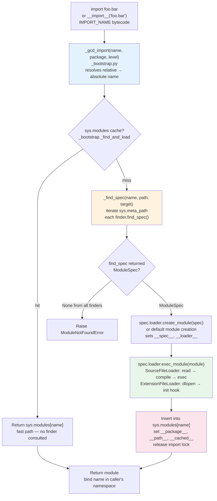
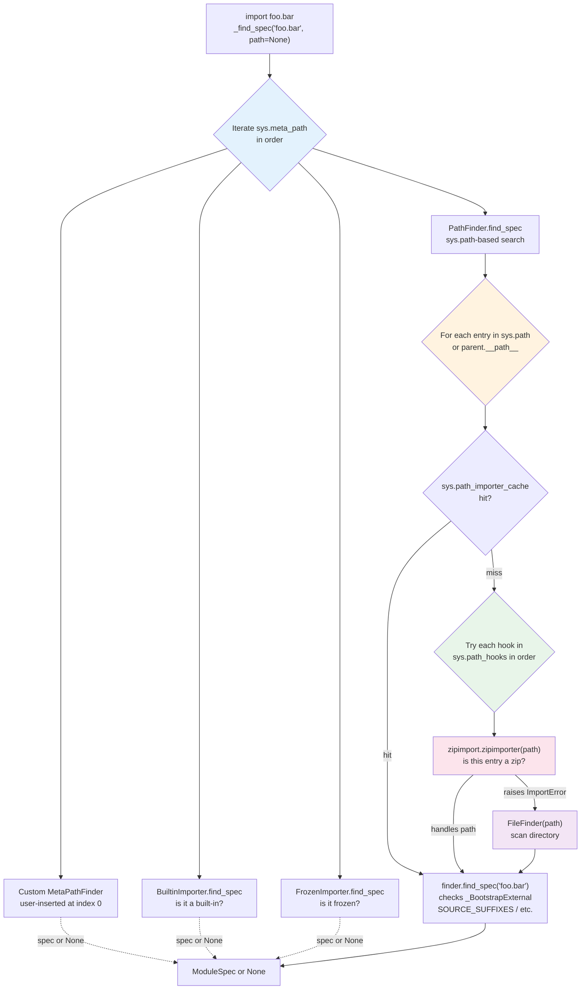
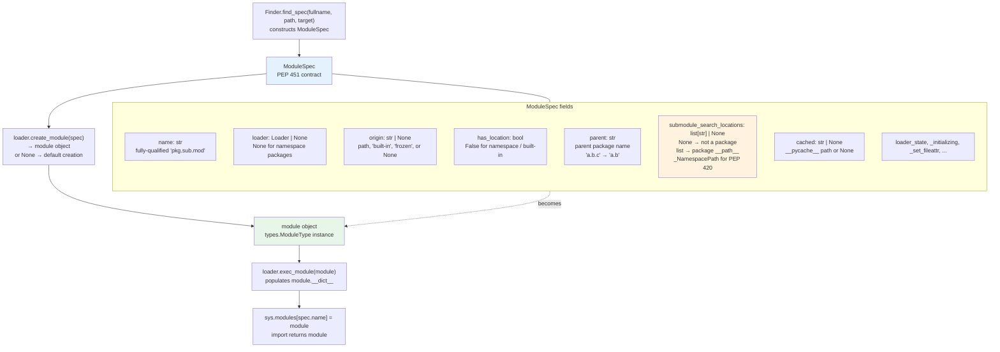
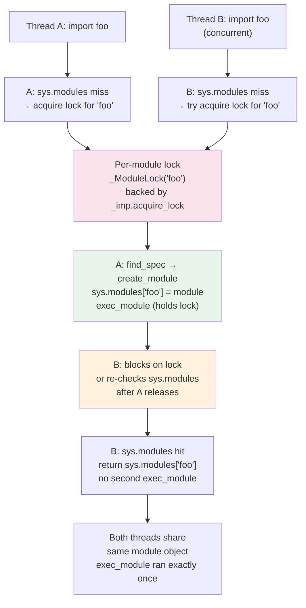

# Chapter 9 — The Import System: importlib, Finders, Loaders, and Namespace Packages

**What this chapter covers.** Every `import` statement in your backend — from `import os` at module scope to a dynamic `importlib.import_module("myapp.handlers")` inside a request path — traverses the same machinery: `importlib._bootstrap`, `importlib._bootstrap_external`, `sys.meta_path`, `sys.path_hooks`, `sys.path_importer_cache`, finders, loaders, `ModuleSpec`, `sys.modules`, and the per-module import lock. This chapter dissects that machinery end-to-end: how CPython finds and loads code from the filesystem, zip files, namespace packages, editable installs, and custom hooks; how bytecode caching and invalidation (PEP 552) interacts with import; how relative imports and circular imports actually resolve; and how to instrument, trace, and extend the system without breaking it. You will build a custom finder/loader, trace import timing, and diagnose the backend-relevant failure modes that only surface at scale.

Learning goals — after this chapter you should be able to:

- Trace an `import foo` from `IMPORT_NAME`/`__import__` through `importlib._bootstrap._find_and_load` to `find_spec` and `exec_module`, identifying which file (`_bootstrap.py` vs `_bootstrap_external.py`) owns each step.
- Explain the three dispatch layers — `sys.meta_path`, `sys.path` + `sys.path_hooks` + `sys.path_importer_cache`, and `sys.path_hooks` fallback — and predict the search order for any `sys.path` entry.
- Implement a `MetaPathFinder`/`Loader` pair with `find_spec`/`create_module`/`exec_module`, and contrast it with `PathEntryFinder` and the legacy `load_module` protocol.
- Describe every field of `ModuleSpec` (PEP 451) and how it flows into module object creation (`__spec__`, `__loader__`, `__package__`, `__path__`, `__cached__`).
- Explain `sys.modules` caching, the import lock (`_imp.acquire_lock` / `_imp.release_lock`), and what happens during concurrent or circular imports.
- Contrast regular packages (`__init__.py`) with namespace packages (PEP 420, no `__init__.py`), including `__path__` as `_NamespacePath` and multi-directory merging.
- Explain editable installs under PEP 660, how `.pth` / `_editable_impl` / `importlib.machinery` mappings replace the old `setup.py develop` / `__editable___` hacks.
- Describe `zipimport` / `ZipImporter`, import hooks, and freezing (`PyImport_ImportModule`, `PyImport_AppendInittab`, `freeze_modules.py`).
- Contrast PEP 552 `pyc` invalidation modes (timestamp vs hash, `check_source`) and explain `SOURCE_DATE_EPOCH`, `PYTHONDONTWRITEBYTECODE`, and hash-based `__pycache__`.
- Instrument imports with `python -X importtime`, `importlib.util.find_spec`, and `sys.modules` inspection, and apply backend-lens optimizations (lazy imports, import-time side-effect discipline, reproducible container images).

> **Prerequisites.** Chapter 1 (source → bytecode → `__pycache__`, frozen `_bootstrap`) and Chapter 3 (bytecode/`ceval.c`/`PyCodeObject`) are direct prerequisites. Chapter 5 (GIL and the import lock as a global critical section) and Volume 13, Chapter 6 (Python runtime posture for services) provide operational context.

---

## 1. Why the import system is a backend concern

Import is the most executed "framework" in your fleet. A typical FastAPI or Django worker imports 200–600 modules at startup; an ML inference service can exceed 1,000 once `numpy`, `torch`, `transformers`, and their transitive dependencies resolve. In serverless and autoscaled environments, that import graph *is* your cold-start latency.

Backend consequences that trace directly to import internals:

- **Cold start.** `python -X importtime` on a real service often shows 40–70% of process startup spent inside import. A single heavy transitive import (`import pandas` pulling `pytz`, `dateutil`, `numpy`) can dominate p99 cold start.
- **Import-time side effects.** Code at module top-level runs exactly once, under the import lock. A `requests.Session()` created at import time, a database connection opened at import time, or a `logging.basicConfig()` call that mutates global state all execute before your application has configured itself.
- **Container reproducibility.** Whether `__pycache__` is written, shipped, or suppressed (`PYTHONDONTWRITEBYTECODE`, `SOURCE_DATE_EPOCH`, PEP 552 hash mode) determines whether two images built from the same commit are byte-identical — relevant to SLSA provenance, layer caching, and deterministic deploys.
- **Namespace and editable installs.** Monorepos, shared `company.*` namespaces, and `pip install -e .` during development all rely on PEP 420 and PEP 660. Misunderstanding `__path__` merging is a common source of "works on my machine, `ModuleNotFoundError` in CI."
- **Supply-chain surface.** `sys.meta_path` and `sys.path_hooks` are arbitrary code execution hooks. Anything that can insert a finder can intercept any future import — used legitimately by `zipimport`, `importlib.machinery`, `pytest`, and `coverage`, and illegitimately by dependency-confusion payloads.

This chapter treats import not as syntax but as a runtime service with its own discovery, caching, locking, and extensibility protocol.

---

## 2. The machinery — two frozen files that bootstrap themselves

The import system is unusual: it is written mostly in Python, but it must exist before any Python file can be imported. CPython solves this by freezing two modules into the interpreter binary itself.

| File | Role | Frozen via |
|------|------|-----------|
| `Lib/importlib/_bootstrap.py` | Core protocol: `ModuleSpec`, `MetaPathFinder`, `Loader`, `_find_and_load`, `_gcd_import`, `sys.modules` interaction, import lock | `Tools/build/freeze_modules.py` → `Python/importlib.h` → `Python/import.c` |
| `Lib/importlib/_bootstrap_external.py` | Filesystem reality: `FileFinder`, `SourceFileLoader`, `SourcelessFileLoader`, `ExtensionFileLoader`, `SourceLoader` base, path-stat cache, `pyc` header validation (PEP 552) | Same pipeline |

At interpreter startup (`Python/pylifecycle.c:Py_InitializeFromConfig` → `import_init` in `Python/import.c`), CPython:

1. Creates `sys.modules` (a plain `dict`) and inserts `sys` and `builtins` (already present as C modules).
2. Installs three meta-path finders into `sys.meta_path` in order:
   - `BuiltinImporter` — handles built-in modules (`sys`, `time`, `_imp`, `_io`, …).
   - `FrozenImporter` — handles frozen modules (including `_bootstrap` themselves and any modules frozen via `Tools/build/freeze_modules.py` / `--freeze-importlib`).
   - `PathFinder` — the `sys.path`-based finder that delegates to `sys.path_hooks`.
3. Populates `sys.path_hooks` with two default hooks: `zipimport.zipimporter` and `FileFinder.path_hook` (which is `_bootstrap_external.FileFinder.path_hook` — a factory that returns a `FileFinder` for a given `sys.path` entry).
4. Leaves `sys.path_importer_cache` empty (populated lazily).

You can observe the frozen bootstrap directly:

```python
import sys, importlib.machinery

print(sys.meta_path)
# [<_distutils_hack.DistutilsMetaFinder ...>,
#  <class '_frozen_importlib.BuiltinImporter'>,
#  <class '_frozen_importlib.FrozenImporter'>,
#  <class '_frozen_importlib_external.PathFinder'>]

print(sys.path_hooks)
# [<class 'zipimport.zipimporter'>,
#  <function FileFinder.path_hook.<locals>.path_hook_for_FileFinder at ...>]

# The frozen modules carry a special __spec__ origin marker:
import _frozen_importlib, _frozen_importlib_external
print(_frozen_importlib.__spec__.loader)   # <class '_frozen_importlib.FrozenImporter'>
print(_frozen_importlib_external.__spec__.origin)  # frozen

# Where the frozen code lives in the binary:
import importlib
print(importlib._bootstrap.__file__)          # <frozen importlib._bootstrap>
print(importlib._bootstrap_external.__file__) # <frozen importlib._bootstrap_external>
```

The split between `_bootstrap` and `_bootstrap_external` is not organizational trivia — it is a layering boundary:

- `_bootstrap.py` knows nothing about the filesystem. It defines the protocol (`find_spec`, `create_module`, `exec_module`, `ModuleSpec`) and orchestrates the dance. It could run on a system with no files at all (only built-in and frozen modules).
- `_bootstrap_external.py` knows everything about the filesystem: `stat` calls, `__pycache__` paths, `SOURCE_SUFFIXES`, `BYTECODE_SUFFIXES`, `EXTENSION_SUFFIXES`, `pyc` header parsing, and `ZipImporter` delegation via `sys.path_hooks`.

Chapter 1 described `Tools/build/freeze_modules.py` generating `Python/importlib.h` and `Python/importlib_external.h` (marshalled bytecode baked into `import.c`). That is how `_bootstrap` can import itself. The `importlib` package you see at `Lib/importlib/__init__.py` is a thin wrapper that re-exports the frozen machinery plus the pure-Python utilities (`importlib.util`, `importlib.machinery`, `importlib.resources`).

---

## 3. The import call flow — `import foo` to `exec_module`

At the language level, `import foo.bar` is syntactic sugar for a call to `__import__("foo.bar", globals(), locals(), [], 0)`, which in CPython 3.11+ compiles to `IMPORT_NAME` (or `IMPORT_FROM` for `from foo import bar`). Both paths converge on `importlib._bootstrap._gcd_import` (the "get child data" import), which is aliased as `builtins.__import__`.



Step-by-step in `_bootstrap.py` terms:

```python
# Simplified skeleton of _bootstrap._find_and_load (read the real thing
# at Lib/importlib/_bootstrap.py — search for def _find_and_load):

def _find_and_load(name, _gcd_import):
    # 1. sys.modules fast path — also handles partially-initialized
    #    modules during circular imports (see §8).
    if name in sys.modules:
        return sys.modules[name]

    # 2. Acquire per-module import lock (see §8).
    #    Real code uses _imp.acquire_lock() / _ModuleLock.
    with _ModuleLock(name):
        # Re-check sys.modules after acquiring lock (another thread won).
        if name in sys.modules:
            return sys.modules[name]

        # 3. Find a spec.
        spec = _find_spec(name, None, None)  # walks sys.meta_path

        if spec is None:
            raise ModuleNotFoundError(f"No module named {name!r}", name=name)

        # 4. Create + exec.
        module = _load_unlocked(spec)  # create_module → exec_module → sys.modules
        return module
```

`_find_spec` itself is a loop over `sys.meta_path`:

```python
# Skeleton of _find_spec:
def _find_spec(name, path, target=None):
    # path is parent's __path__ for submodules, else None (top-level → sys.path)
    for finder in sys.meta_path:
        # Each finder may be a class (BuiltinImporter, FrozenImporter — used
        # as classmethods) or an instance (custom finders).
        spec = finder.find_spec(name, path, target)
        if spec is not None:
            return spec
    return None
```

Critical detail: **parent packages are imported first**. Importing `a.b.c` triggers `_gcd_import` for `a`, then `a.b`, then `a.b.c` — each as a separate `_find_and_load` cycle. If `a` is a package, its `__path__` becomes the `path` argument when searching for `a.b`. This is why `sys.meta_path` finders receive `path=None` for top-level names and a list of directory strings for dotted submodules.

The loader half — `_load_unlocked` — is where `ModuleSpec` becomes a live module object (detailed in §7):

```python
# Skeleton of _load_unlocked (PEP 451 path):
def _load_unlocked(spec):
    module = spec.loader.create_module(spec)  # may return None → default creation
    if module is None:
        module = _imp.create_dynamic(spec) if spec.origin == "extension" \
                 else type(sys)(spec.name)  # plain module type
        module.__spec__ = spec
        module.__loader__ = spec.loader
        # ... _bootstrap._init_module_attrs sets __package__, __path__, __cached__, etc.

    # sys.modules insertion happens BEFORE exec_module — essential for
    # circular imports (see §8) and visible to import hooks.
    sys.modules[spec.name] = module

    try:
        spec.loader.exec_module(module)  # the entire execution of the module body
    except BaseException:
        # On failure, remove the half-initialized entry so a retry re-finds it.
        del sys.modules[spec.name]
        raise
    return module
```

Before PEP 451 (Python 3.4), loaders implemented `load_module(fullname)` which both found and loaded in one call. That method is now deprecated and removed in 3.12 — loaders that still define it get a `DeprecationWarning` shim in `_bootstrap`. New code must implement `exec_module` (and optionally `create_module`).

---

## 4. Dispatch — `sys.meta_path`, `sys.path_hooks`, `sys.path_importer_cache`

Three attributes on `sys` form the dispatch table. Understanding their precedence explains every "where did this module come from?" question.



### `sys.meta_path` — the first-chance intercept

A list of *finder* objects. Each must implement `find_spec(fullname, path, target=None)`. Iteration stops at the first finder returning a non-`None` `ModuleSpec`. Ordering matters:

```python
import sys
for i, finder in enumerate(sys.meta_path):
    print(i, finder)
# 0 <class '_frozen_importlib.BuiltinImporter'>
# 1 <class '_frozen_importlib.FrozenImporter'>
# 2 <class '_frozen_importlib_external.PathFinder'>

# Inserting a custom finder at position 0 intercepts every import:
# sys.meta_path.insert(0, MyFinder())
# Inserting at the end only handles names no earlier finder claimed.
```

`BuiltinImporter` and `FrozenImporter` are unusual — their `find_spec` is a `@classmethod` on the class object itself, not an instance method. `PathFinder` is the workhorse for filesystem imports; it iterates `sys.path` (or the parent's `__path__` for submodules) and consults `sys.path_importer_cache` / `sys.path_hooks` per entry.

### `sys.path` — the search list

Not a dispatch mechanism itself, but the data `PathFinder` searches. Initialized at startup from (in priority order): the script's directory (or `""` for `-c` / stdin), `PYTHONPATH`, `site.py` additions (`site-packages`, `.pth` processing), and `PYTHONSAFEPATH` / `-P` / `-I` isolation flags. Chapter 1 covers `PyConfig` / `initconfig.c` initialization; for import purposes, treat `sys.path` as "the ordered list `PathFinder` will probe."

```python
import sys, pprint
pprint.pp(sys.path[:6])
# ['',                          # script dir / "" for REPL
#  '/usr/lib/python3.11',
#  '/usr/lib/python3.11/lib-dynload',
#  '/home/ubuntu/.local/lib/python3.11/site-packages',
#  '/usr/local/lib/python3.11/dist-packages',
#  ...]
```

For submodule imports, `PathFinder` does not use `sys.path` — it uses the parent package's `__path__` (a list-like `_NamespacePath` or plain list). That is why `import pkg.sub` searches only inside `pkg`'s directories.

### `sys.path_hooks` and `sys.path_importer_cache` — per-entry finders

For each `sys.path` entry, `PathFinder` checks `sys.path_importer_cache` first. On a miss, it tries each callable in `sys.path_hooks` in order until one returns a *path entry finder* (an object with `find_spec(fullname, target=None)`). The result is cached:

```python
import sys
print(sys.path_hooks)
# [<class 'zipimport.zipimporter'>,
#  <function FileFinder.path_hook.<locals>.path_hook_for_FileFinder at ...>]

# What the cache looks like after some imports:
import pprint
pprint.pp({k: type(v).__name__ for k, v in list(sys.path_importer_cache.items())[:5]})
# {'/usr/lib/python3.11': 'FileFinder',
#  '/usr/lib/python3.11/lib-dynload': 'FileFinder',
#  '': 'FileFinder',
#  '/app.zip': 'zipimporter',   # if present, handled by zipimport
#  '/nonexistent': 'NoneType'}  # ImportError entries cached as None

# Manual invalidation — needed after creating a new sys.path entry at runtime:
import importlib
sys.path.append("/tmp/my_new_packages")
importlib.invalidate_caches()  # clears FileFinder directory caches + zipimport cache
```

`FileFinder` (from `_bootstrap_external`) is the default path entry finder for filesystem directories. It is constructed with the `path` string and knows the suffix tuples:

```python
import importlib.machinery

print(importlib.machinery.SOURCE_SUFFIXES)    # ['.py']
print(importlib.machinery.BYTECODE_SUFFIXES)  # ['.pyc']
print(importlib.machinery.EXTENSION_SUFFIXES) # ['.cpython-311-x86_64-linux-gnu.so', '.abi3.so', '.so']
print(importlib.machinery.all_suffixes())     # all of the above
```

Inside `FileFinder.find_spec`, the logic is a priority-ordered probe within that single directory: for a top-level `foo`, check `foo/__init__.py` (regular package) → `foo.py` (module) → `foo.cpython-311-....so` (extension) → `foo/__pycache__/*.pyc` (namespace package probe if no `__init__.py` and PEP 420 enabled). For `foo.bar`, check `foo/bar/__init__.py` relative to the `FileFinder`'s path.

`zipimport.zipimporter` is the other default hook. If the `sys.path` entry is a zip file (or contains a `.zip`/`.egg`/`.whl` component), `zipimporter` claims it; otherwise it raises `ImportError` and `PathFinder` tries the next hook. There is no third default hook — any additional `sys.path_hooks` entry is user- or framework-added.

---

## 5. Finders — `MetaPathFinder.find_spec` and `PathEntryFinder`

PEP 302 introduced finders and loaders; PEP 451 (Python 3.4) replaced the older `find_loader` / `load_module` protocol with `find_spec` / `ModuleSpec` / `exec_module`. The modern hierarchy:

| ABC | Module | Method | Scope |
|-----|--------|--------|-------|
| `importlib.abc.MetaPathFinder` | `_bootstrap` | `find_spec(fullname, path, target=None)` | Consulted via `sys.meta_path`; `path` is parent `__path__` or `None` |
| `importlib.abc.PathEntryFinder` | `_bootstrap_external` | `find_spec(fullname, target=None)` | Consulted via `sys.path_importer_cache[entry]`; bound to one `sys.path` entry |
| `importlib.abc.ResourceReader` | `importlib.abc` | `open_resource`, `resource_path`, `is_resource` | For `importlib.resources` (not covered here) |

Both finder types return either a `ModuleSpec` or `None`. Returning `None` means "I don't handle this name — try the next finder." Raising `ImportError` is not expected from `find_spec`; `ModuleNotFoundError` is raised by the caller if all finders return `None`.

The distinction between meta-path and path-entry finders is about *when* they run:

- **Meta-path finder** — sees every import, can handle any name, decides based on `fullname` alone. Used for virtual modules, import-time rewriting, lazy loading wrappers, and synthetic namespaces.
- **Path-entry finder** — sees only imports that `PathFinder` routed to its specific directory/zip. Created per `sys.path` entry via `sys.path_hooks`. Handles the filesystem reality for that entry.

Instrumenting which finder claimed a name:

```python
import importlib.util, importlib.machinery

# find_spec walks sys.meta_path for you and returns the winning ModuleSpec:
spec = importlib.util.find_spec("json")
print(spec)
# ModuleSpec(name='json', loader=<_frozen_importlib_external.SourceFileLoader object at ...>,
#            origin='/usr/lib/python3.11/json/__init__.py',
#            submodule_search_locations=['/usr/lib/python3.11/json'])

print(f"loader:      {spec.loader}")
print(f"origin:      {spec.origin}")
print(f"is_package:  {spec.submodule_search_locations is not None}")
print(f"parent:      {spec.parent}")          # 'json' for top-level, 'json.decoder' → 'json'
print(f"has_location:{spec.has_location}")     # False for namespace packages

# For a namespace package (no __init__.py), compare:
# (create a demo: mkdir -p /tmp/ns_demo/pkg && touch /tmp/ns_demo/pkg/mod.py)
import sys, pathlib, tempfile, os
tmpdir = tempfile.mkdtemp()
os.makedirs(f"{tmpdir}/ns_pkg/sub")
pathlib.Path(f"{tmpdir}/ns_pkg/sub/mod.py").write_text("x = 1\n")
sys.path.insert(0, tmpdir)
spec_ns = importlib.util.find_spec("ns_pkg")
print(f"ns_pkg spec: {spec_ns}")
print(f"  origin: {spec_ns.origin}")                          # None for namespace
print(f"  loader: {spec_ns.loader}")                          # None for namespace
print(f"  search_locations: {spec_ns.submodule_search_locations}")  # _NamespacePath([...])
print(f"  has_location: {spec_ns.has_location}")              # False
sys.path.remove(tmpdir)

# For an extension module:
spec_ext = importlib.util.find_spec("_json")
print(f"_json spec: loader={type(spec_ext.loader).__name__}, origin={spec_ext.origin}")
# loader=ExtensionFileLoader, origin=/usr/lib/python3.11/lib-dynload/_json.cpython-311-....so

# For a built-in:
spec_bi = importlib.util.find_spec("sys")
print(f"sys spec: loader={spec_bi.loader}, origin={spec_bi.origin}")
# loader=<class '_frozen_importlib.BuiltinImporter'>, origin=built-in
```

---

## 6. Loaders — `exec_module` vs legacy `load_module`, and the concrete loader types

Once a finder returns a `ModuleSpec`, the loader in `spec.loader` takes over. The modern loader protocol (PEP 451):

```python
class Loader(importlib.abc.Loader):
    def create_module(self, spec):
        """Optional. Return a module object or None for default creation.
        Used to return a custom subclass, or to use _imp.create_dynamic
        for extension modules with non-standard initialization."""
        return None  # default: type(sys)(spec.name)

    def exec_module(self, module):
        """Required. Execute the module's code in module.__dict__.
        Must set __spec__, __loader__, and any package attributes.
        Called with the module already inserted in sys.modules."""
        raise NotImplementedError
```

The legacy protocol — `loader.load_module(fullname)` — did both steps (create + exec + `sys.modules` insertion) in one call. It is deprecated since Python 3.4 and removed in 3.12. `_bootstrap` still shims it for very old loaders but emits `DeprecationWarning`. If you encounter `load_module` in vendor code, it is a compatibility hazard.

### Concrete loaders in `_bootstrap_external`

| Loader | Handles | `origin` | What `exec_module` does |
|--------|---------|----------|------------------------|
| `SourceFileLoader` | `.py` files | `/path/to/mod.py` | Reads source, compiles to `PyCodeObject` (or loads `__pycache__` `pyc` if valid per PEP 552), `exec`s in `module.__dict__`, sets `__file__`, `__cached__` |
| `SourcelessFileLoader` | `.pyc`-only (no `.py`) | `/path/to/__pycache__/mod.cpython-311.pyc` | Loads marshalled `PyCodeObject` from `pyc`, `exec`s it; `get_source` returns `None` |
| `ExtensionFileLoader` | `.so` / `.pyd` (C extensions) | `/path/.../mod.cpython-311-....so` | `dlopen` the shared object, calls `PyInit_mod` (`PyMODINIT_FUNC`), returns the `PyModuleDef`'s module |
| `NamespaceLoader` *(internal)* | Namespace packages | `None` | No `exec_module` — namespace packages have no code to execute; `spec.loader` is `None` and `spec.origin` is `None` |
| `BuiltinImporter` | Built-in modules | `built-in` | Calls the C `PyInit_*` function linked into the interpreter binary |
| `FrozenImporter` | Frozen modules | `frozen` | Unmarshals bytecode from `PyImport_FrozenModules` table |
| `ZipImporter` | Modules inside `.zip` / `.egg` / `.whl` | `/path/to/archive.zip/pkg/mod.py` | Reads source/bytecode from the zip's central directory, otherwise like `SourceFileLoader` but from zip bytes |

`SourceFileLoader` deserves a closer look because it owns `pyc` caching. Its `exec_module` path:

1. Compute `__cached__` via `importlib.util.cache_from_source(origin)` — e.g., `mod.py` → `__pycache__/mod.cpython-311.pyc`.
2. Check if the `pyc` exists and is valid (PEP 552 header validation — see §13).
3. If valid, `marshal.loads` the `PyCodeObject` from the `pyc` body and `exec` it — skipping tokenize/parse/compile entirely.
4. If not valid or absent, read `origin`, `compile(source, origin, "exec")`, `exec` it, then (unless `PYTHONDONTWRITEBYTECODE` / `sys.dont_write_bytecode` / read-only filesystem) write a new `pyc` with the appropriate header.

```python
import importlib.util, importlib.machinery, pathlib, py_compile

# Where a source file's pyc would live:
src = "/usr/lib/python3.11/json/__init__.py"
print(importlib.util.cache_from_source(src))
# /usr/lib/python3.11/json/__pycache__/__init__.cpython-311.pyc

# And the reverse:
cached = "/usr/lib/python3.11/json/__pycache__/__init__.cpython-311.pyc"
print(importlib.util.source_from_cache(cached))
# /usr/lib/python3.11/json/__init__.py

# Inspect what SourceFileLoader would do without executing:
from importlib.machinery import SourceFileLoader
loader = SourceFileLoader("json", src)
print(f"source: {loader.get_filename('json')}")   # /usr/lib/python3.11/json/__init__.py
print(f"is_package: {loader.is_package('json')}") # True
print(f"data sample: {loader.get_data(src)[:40]!r}")

# Extension loader — no source, no get_source:
from importlib.machinery import ExtensionFileLoader
import _json
spec = importlib.util.find_spec("_json")
print(f"ExtensionFileLoader origin: {spec.origin}")
print(f"ExtensionFileLoader is_package: {spec.loader.is_package('_json')}")
```

Subclassing `SourceFileLoader` is the standard way to add source transformations (instrumentation, macro expansion, import rewriting) — override `get_data` or `source_to_code`:

```python
import importlib.machinery

class InstrumentingLoader(importlib.machinery.SourceFileLoader):
    def source_to_code(self, data, path, *, _optimize=-1):
        source = importlib._bootstrap_external.decode_source(data)
        # Example: inject a header, rewrite AST, etc.
        # source = transform(source)
        return compile(source, path, "exec", dont_inherit=True, optimize=_optimize)
```

---

## 7. `ModuleSpec` — the contract between finder and loader

PEP 451's `ModuleSpec` is the central data structure. The finder creates it; the loader consumes it; the resulting module carries it as `__spec__`. Every field matters for introspection and for frameworks that synthesize modules.



Complete field reference:

```python
import importlib.util

# Module
spec = importlib.util.find_spec("json.decoder")
print(f"name:                          {spec.name!r}")
print(f"loader:                        {spec.loader}")
print(f"origin:                        {spec.origin!r}")
print(f"has_location:                  {spec.has_location}")
print(f"parent:                        {spec.parent!r}")
print(f"submodule_search_locations:    {spec.submodule_search_locations}")
print(f"cached:                        {spec.cached!r}")
print(f"loader_state:                  {spec.loader_state!r}")

# Package
spec_pkg = importlib.util.find_spec("json")
print(f"\njson is package: {spec_pkg.submodule_search_locations is not None}")
print(f"json cached:     {spec_pkg.cached!r}")
print(f"json origin:     {spec_pkg.origin!r}")

# After import, the module carries the spec:
import json
assert json.__spec__ is spec_pkg or json.__spec__.name == "json"
print(f"\njson.__spec__ is spec_pkg: {json.__spec__ is spec_pkg}")  # may be identity or equal
print(f"json.__loader__:  {json.__loader__}")
print(f"json.__package__: {json.__package__!r}")
print(f"json.__path__:    {json.__path__}")
print(f"json.__file__:    {json.__file__!r}")
print(f"json.__cached__:  {json.__cached__!r}")

# What _bootstrap._init_module_attrs sets (called inside _load_unlocked):
#   module.__spec__   = spec
#   module.__loader__ = spec.loader
#   module.__package__ = spec.parent  (or spec.name if spec is a package)
#   module.__path__    = spec.submodule_search_locations  (only if package)
#   module.__file__    = spec.origin  (if spec.has_location)
#   module.__cached__  = spec.cached  (if spec.has_location)
```

A subtlety: `spec.parent` is not always `spec.name.rsplit(".", 1)[0]`. For top-level modules `spec.parent == spec.name` (e.g., `json` → parent `json`); for submodules it is the parent package (`json.decoder` → `json`). For namespace packages, `spec.parent` is still the logical parent used for relative import resolution.

Frameworks that synthesize modules (e.g., `importlib.util.module_from_spec`) rely on exact `ModuleSpec` construction:

```python
import importlib.util, importlib.machinery, sys, types

# Synthesize a module without touching the filesystem:
spec = importlib.machinery.ModuleSpec(
    name="synthetic.hello",
    loader=None,  # namespace-like, or provide a loader
    origin="synthetic",
    is_package=False,
)
mod = importlib.util.module_from_spec(spec)
# module_from_spec calls spec.loader.create_module if loader is not None,
# otherwise creates a plain module and attaches __spec__/__loader__.
mod.greeting = "hello from synthetic"
sys.modules[spec.name] = mod

import synthetic.hello
print(synthetic.hello.greeting)  # hello from synthetic
del sys.modules[spec.name]
```

---

## 8. Import state — `sys.modules`, the import lock, and circular imports

### `sys.modules` — the import cache

`sys.modules` is a plain `dict` mapping fully-qualified names to module objects. It is the first thing `_find_and_load` checks and the last thing `_load_unlocked` populates. Its roles:

- **Cache.** Every successful import inserts exactly one entry. Re-importing returns the same object — `import os; import os as os2; assert os is os2`.
- **Partial-initialization sentinel.** During `exec_module`, the module is already in `sys.modules` but its `__dict__` is only partially populated. Code that re-imports the same name during this window gets the partial module — this is how circular imports can work (or break).
- **Invalidation point.** Deleting `sys.modules["foo"]` forces the next `import foo` to re-run finders and loaders. Mutating `sys.modules` is the standard test isolation technique and the standard way to break things.

```python
import sys, importlib

# Inspect the cache:
print(f"modules loaded: {len(sys.modules)}")
print(f"json in cache: {'json' in sys.modules}")
print(f"json is sys.modules['json']: {importlib.import_module('json') is sys.modules['json']}")

# What a circular import sees:
# a.py:  import b; x = 1
# b.py:  import a; print(a.x)  # AttributeError if b is imported before a finishes defining x
#
# Trace:
#   import a  →  sys.modules["a"] = <partial a>  →  exec a.py  →  import b
#     →  sys.modules["b"] = <partial b>  →  exec b.py  →  import a
#       →  sys.modules hit: return <partial a> (x not yet set!)
#       →  b finishes, then a finishes.

# Forcing reimport:
if "json" in sys.modules:
    old_id = id(sys.modules["json"])
    del sys.modules["json"]
    import json as json2
    print(f"reimported json is new object: {id(json2) != old_id}")
```

### The import lock — ` _imp.acquire_lock` / `_ModuleLock`

Import is not free-threaded. CPython protects the `sys.modules` insertion + `exec_module` window with a per-module lock plus a global import lock (historically a single global lock; since 3.3, a per-module lock keyed by name with a global fallback for extension init).



In C, the lock lives in `Python/import.c` (`import_lock` / `import_lock_thread` / `_PyImport_AcquireLock`) and is exposed to Python as `_imp.acquire_lock()` / `_imp.release_lock()` / `_imp.lock_held()`. In Python, `_bootstrap._ModuleLock` wraps it with re-entrancy tracking so the same thread can re-enter import for a different name.

Practical consequences:

- **Import is not parallel.** Two threads importing *different* modules can proceed concurrently (different per-module locks), but two threads importing the *same* uninitialized module serialize. Import-heavy startup on a threaded server (e.g., `gunicorn --workers 1 --threads 8`) still serializes on first import of each module.
- **Deadlock risk.** If `exec_module` for `a` tries to import `b` while another thread holds `b`'s lock and tries to import `a`, the per-module locks do not deadlock (they are not held across the `exec_module` of the other module in a way that creates a cycle — but legacy global-lock code could). In practice, circular imports within a single thread are the more common hazard.
- **Extension init is global.** `ExtensionFileLoader` holds the global import lock during `PyInit_*` execution, because C extension init is not re-entrant. A slow or blocking `PyInit_foo` stalls all other imports.

```python
import _imp, threading, importlib.util, sys, time

print(f"import lock held: {_imp.lock_held()}")  # False outside import

# Demonstrate per-module serialization:
# (run with: python -c "import threading, importlib, time; ...")

def slow_import(name, delay=0.2):
    # Simulate a loader that sleeps during exec_module.
    import importlib.machinery, types
    spec = importlib.machinery.ModuleSpec(name, loader=None, origin="synthetic")
    mod = types.ModuleType(name)
    mod.__spec__ = spec
    sys.modules[name] = mod
    time.sleep(delay)
    mod.loaded = True
    return mod

# Observing the lock from a custom loader (see §15 for full example):
import importlib.abc

class LockObservingLoader(importlib.abc.Loader):
    def create_module(self, spec): return None
    def exec_module(self, module):
        print(f"exec_module {module.__spec__.name}: lock_held={_imp.lock_held()}")
        module.value = 42

# The import lock is held during exec_module — any code there
# that calls back into import will re-enter _ModuleLock safely.
```

---

## 9. Relative imports — PEP 328

Relative imports (`from . import foo`, `from ..bar import baz`) are resolved by `_gcd_import`'s `level` and `package` arguments, not by filesystem path arithmetic.

```python
# Inside pkg/sub/mod.py:
from . import sibling      # level=1, package="pkg.sub" → "pkg.sub.sibling"
from .. import parent_mod  # level=2, package="pkg.sub" → "pkg.parent_mod"
from ..other import thing  # level=2, package="pkg.sub" → "pkg.other.thing"
```

Resolution rule (in `_bootstrap._resolve_name`):

```
if level == 0:
    # Absolute import — name is used as-is.
    absolute = name
else:
    # Relative — walk `level` dots up from `package`.
    # package is caller's __package__ (or __spec__.parent if __package__ is None).
    # level=1 → current package, level=2 → parent, etc.
    base = package.rsplit(".", level - 1)[0] if level > 1 else package
    absolute = f"{base}.{name}" if name else base
```

`__package__` vs `__spec__.parent`: on a regular package, `__package__ == __name__`; on a module, `__package__ == __name__.rsplit(".", 1)[0]`. `importlib._bootstrap` sets `__package__` from `spec.parent` during `_init_module_attrs`, but user code can override `__package__` to change relative import semantics — a sharp edge for code that manually constructs modules.

Common pitfalls:

- **Running a submodule as `__main__`.** `python pkg/sub/mod.py` sets `__package__ = None` and `__spec__.parent = None`, so `from . import sibling` fails with `ImportError: attempted relative import with no known parent package`. Fix: `python -m pkg.sub.mod`.
- **`__package__` set to `""` vs `None`.** Both mean "no package," but `""` can produce different error messages than `None` in older Python versions. Modern `_bootstrap` normalizes to `None` → `spec.parent`.

```python
# Demonstrate relative resolution without touching the filesystem:
from importlib._bootstrap import _resolve_name

print(_resolve_name("sibling", "pkg.sub", 1))       # pkg.sub.sibling
print(_resolve_name("parent_mod", "pkg.sub", 2))    # pkg.parent_mod
print(_resolve_name("", "pkg.sub", 1))              # pkg.sub          (from . import x)
print(_resolve_name("", "pkg.sub", 2))              # pkg              (from .. import x)
# Absolute:
print(_resolve_name("os.path", None, 0))            # os.path
```

---

## 10. Namespace packages — PEP 420 (no `__init__.py`)

Before PEP 420 (Python 3.3), every package required an `__init__.py`. A directory without one was invisible to import. PEP 420 introduced *namespace packages*: directories (or zip entries) that contribute to a package's `__path__` without owning it.

```mermaid
flowchart TB
    subgraph Regular ["Regular package  (with __init__.py)"]
        R1["pkg/__init__.py  exists"]
        R2["FileFinder finds pkg/__init__.py<br/>→ ModuleSpec<br/>origin='/.../pkg/__init__.py'<br/>loader=SourceFileLoader<br/>has_location=True"]
        R3["exec_module runs __init__.py<br/>module.__path__ = ['/.../pkg']<br/>single directory, single owner"]
        R1 --> R2 --> R3
    end

    subgraph Namespace ["Namespace package  (PEP 420, no __init__.py)"]
        N1["pkg/  directory exists<br/>no __init__.py in any sys.path entry"]
        N2["FileFinder: no __init__.py found<br/>but directory exists<br/>→ record as namespace candidate"]
        N3["PathFinder merges candidates<br/>from ALL sys.path entries<br/>where pkg/ exists"]
        N4["ModuleSpec<br/>origin=None, loader=None<br/>has_location=False<br/>submodule_search_locations=_NamespacePath([...])"]
        N5["No exec_module — package has no code<br/>import pkg.sub still works<br/>via _NamespacePath search"]
        N1 --> N2 --> N3 --> N4 --> N5
    end

    style R2 fill:#e8f5e9
    style N4 fill:#fff3e0
    style N3 fill:#e3f2fd
```



Key differences:

| Property | Regular package | Namespace package (PEP 420) |
|----------|----------------|---------------------------|
| `__init__.py` | Required | Absent (by definition) |
| `__spec__.origin` | `"/path/to/pkg/__init__.py"` | `None` |
| `__spec__.loader` | `SourceFileLoader` | `None` |
| `__spec__.has_location` | `True` | `False` |
| `__spec__.submodule_search_locations` | `["/path/to/pkg"]` (plain list) | `_NamespacePath(["/path/a/pkg", "/path/b/pkg"])` |
| `__path__` | `["/path/to/pkg"]` | `_NamespacePath` (iterable, supports `__iter__`, `__len__`, dynamic `__path__` merging) |
| `__file__` | `"/path/to/pkg/__init__.py"` | Absent (no `__file__`) |
| Code execution | `__init__.py` runs on `import pkg` | Nothing runs; `import pkg` only creates the namespace module |
| `pkgutil` / `importlib.resources` | Works | Works (3.9+ `importlib.resources.files` handles namespace) |

`_NamespacePath` is the subtle part. It is not a plain list — it is a `_NamespacePath` object (`_bootstrap._NamespacePath`) that aggregates `pkg/` directories from every `sys.path` entry where `pkg/` exists as a directory without `__init__.py`. Submodule search iterates over all of them:

```python
import sys, tempfile, pathlib, os, importlib.util, importlib.machinery

# Two directories contributing to the same namespace:
a = tempfile.mkdtemp()
b = tempfile.mkdtemp()
for base in (a, b):
    os.makedirs(f"{base}/ns")

pathlib.Path(f"{a}/ns/mod_a.py").write_text("value = 'from A'\n")
pathlib.Path(f"{b}/ns/mod_b.py").write_text("value = 'from B'\n")

sys.path.insert(0, a)
sys.path.insert(0, b)

import ns  # no ns/__init__.py in either location
print(f"ns.__path__:  {list(ns.__path__)}")
# ['/tmp/.../ns', '/tmp/.../ns']  — both locations
print(f"ns.__spec__.origin: {ns.__spec__.origin}")  # None
print(f"ns.__spec__.loader: {ns.__spec__.loader}")  # None
print(f"type(ns.__path__): {type(ns.__path__).__name__}")  # _NamespacePath

import ns.mod_a, ns.mod_b
print(ns.mod_a.value)  # from A
print(ns.mod_b.value)  # from B

# find_spec still works:
print(importlib.util.find_spec("ns.mod_a"))
print(importlib.util.find_spec("ns.mod_b"))

sys.path.remove(a); sys.path.remove(b)
```

Implications for backend monorepos:

- **Split namespace across repos.** `company.auth` in repo A and `company.billing` in repo B can both be `company.*` namespace packages installed to different `site-packages` subtrees. Import merges them transparently — but only if no `company/__init__.py` exists anywhere on `sys.path`. A single stray `__init__.py` converts the namespace to a regular package and hides the other contributions.
- **`pkgutil.extend_path` / `pkg_resources.declare_namespace` are legacy.** Before PEP 420, namespace packages required explicit `__init__.py` code (`__path__ = pkgutil.extend_path(__path__, __name__)`). That pattern still works for backward compat but is unnecessary on Python 3.3+ and interacts poorly with `importlib.resources`.
- **`__path__` is mutable but `_NamespacePath` is dynamic.** Appending to `ns.__path__` works, but `_NamespacePath` also re-scans `sys.path` on iteration if new entries appear. Relying on this dynamism is fragile — prefer `importlib.invalidate_caches()` and explicit `sys.path` management.

---

## 11. Editable installs — PEP 660

`pip install -e .` (editable install) makes the working tree importable without copying files to `site-packages`. Before PEP 660 (Python 3.10 era), this was implemented by `setuptools`' `setup.py develop`: a `.egg-link` file plus a `.pth` that added the project root to `sys.path`, and a shim `__editable___` finder for `src/` layouts. That mechanism was `setuptools`-specific, required `setup.py`, and broke `importlib.resources` for many layouts.

PEP 660 standardizes editable installs via `importlib.machinery` and a build-backend-provided import hook:

```mermaid
flowchart TB
    subgraph Build ["Build backend  (setuptools, hatch, poetry, ...)"]
        BACKEND["build_wheel hook<br/>+ get_requires_for_build_wheel"]
        EDITABLE["prepare_metadata_for_build_editable<br/>+ build_editable wheel"]
        FINDER mod["Synthesizes a MetaPathFinder<br/>that maps 'my_pkg' → /work/src/my_pkg"]
    end

    subgraph SitePackages ["site-packages after pip install -e ."]
        DIST["my_pkg-1.0.dist-info/<br/>direct_url.json  (file:// → /work)<br/>METADATA, RECORD"]
        PTH["_editable_impl.pth<br/>or my_pkg.pth<br/>adds finder to sys.meta_path<br/>at interpreter startup"]
        HOOK["__editable___my_pkg...finder.py<br/>MetaPathFinder + Loader<br/>that redirects find_spec"]
    end

    subgraph Import ["import my_pkg"]
        META["sys.meta_path<br/>editable finder at position 0 or 1<br/>find_spec('my_pkg', None, None)"]
        SPEC["ModuleSpec<br/>origin='/work/src/my_pkg/__init__.py'<br/>loader=SourceFileLoader<br/>submodule_search_locations=['/work/src/my_pkg']"]
        LOAD["SourceFileLoader.exec_module<br/>reads from /work/src/<br/>edits are live on next import<br/>(after invalidate_caches)"]
    end

    BACKEND --> EDITABLE --> FINDER
    FINDER --> PTH
    PTH --> HOOK
    HOOK --> META --> SPEC --> LOAD

    style PTH fill:#e3f2fd
    style HOOK fill:#fff3e0
    style SPEC fill:#e8f5e9
```

What actually lands in `site-packages`:

```bash
# After `pip install -e .` in a project with `src/my_pkg/__init__.py`:

$ ls site-packages/*.pth site-packages/__editable__* 2>/dev/null
site-packages/__editable__.my_pkg-1.0.pth
site-packages/__editable___my_pkg_1_0_finder.py

$ cat site-packages/__editable__.my_pkg-1.0.pth
import __editable___my_pkg_1_0_finder; __editable___my_pkg_1_0_finder.install()

$ cat site-packages/__editable___my_pkg_1_0_finder.py | head -40
# ... generates a MetaPathFinder that maps "my_pkg" → "/work/src"
#     and "my_pkg.sub" → "/work/src/my_pkg/sub" via FileFinder-like logic
```

Inspecting an editable install at runtime:

```python
import importlib.util, sys, pathlib

spec = importlib.util.find_spec("my_pkg")  # if installed editable
if spec:
    print(f"origin:  {spec.origin}")   # /work/src/my_pkg/__init__.py  (working tree, not site-packages)
    print(f"loader:  {spec.loader}")
    print(f"finder:  {spec.loader}")   # the editable finder's loader, usually SourceFileLoader

    # The editable finder is on sys.meta_path — find it:
    for f in sys.meta_path:
        if "editable" in type(f).__name__.lower() or "editable" in repr(f).lower():
            print(f"editable finder: {f}")

    # dist-info still in site-packages, source in working tree:
    import importlib.metadata
    dist = importlib.metadata.distribution("my-pkg")
    print(dist.read_text("direct_url.json"))  # {"dir_info": {"editable": true}, "url": "file:///work"}
```

PEP 660 vs legacy `setup.py develop`:

| Aspect | Legacy `setup.py develop` | PEP 660 `pip install -e .` |
|--------|--------------------------|---------------------------|
| Trigger | `python setup.py develop` | `pip install -e .` (any PEP 517 backend) |
| `sys.path` mutation | `.egg-link` + `.pth` adds project root to `sys.path` | `.pth` installs a `MetaPathFinder`; project root not on `sys.path` |
| `src/` layout | Required `setup.py` shim; `importlib.resources` often broken | Backend-provided finder correctly maps `src/my_pkg` → `my_pkg` |
| `importlib.resources` | Frequently fails (resource path != package path) | Works — finder provides correct `ResourceReader` |
| `RECORD` | Not updated | `direct_url.json` records `file://` + `editable: true` |

Backend relevance:

- **Editable installs are development-only.** They leave `.pth` import hooks that execute at interpreter startup. In production images, always `pip install .` (non-editable) so `site-packages` contains real files and no finder indirection.
- **Finding the editable finder.** If `import my_pkg` resolves to `/work/src/...` in CI but to `site-packages/...` in production, `importlib.util.find_spec("my_pkg").origin` tells you which environment you are in — useful for health checks and startup diagnostics.
- **`pip install -e . --no-build-isolation` caveat.** Without build isolation, the build backend runs in the host environment, and the editable finder may capture absolute paths that break when the image is moved.

---

## 12. `zipimport`, import hooks, and freezing

### `zipimport` — importing from zip files

`zipimport.zipimporter` is the only `sys.path_hooks` entry besides `FileFinder.path_hook` in a default interpreter. It handles any `sys.path` entry that is a zip file (including `.egg`, `.whl`, and `.zip`):

```python
import sys, zipfile, tempfile, pathlib, importlib.util

# Create a zip containing a package:
tmpdir = tempfile.mkdtemp()
zippath = f"{tmpdir}/bundle.zip"
with zipfile.ZipFile(zippath, "w") as zf:
    zf.writestr("zpkg/__init__.py", "value = 'from zip'\n")
    zf.writestr("zpkg/mod.py", "x = 42\n")
    zf.writestr("zpkg/data.txt", "hello\n")

sys.path.insert(0, zippath)
import zpkg.mod
print(zpkg.mod.x)                        # 42
print(zpkg.mod.__loader__)               # <zipimporter object "/tmp/.../bundle.zip">
print(zpkg.mod.__spec__.origin)          # /tmp/.../bundle.zip/zpkg/mod.py
print(zpkg.mod.__spec__.loader)          # <zipimporter object ...>
# zipimporter also serves as ResourceReader for importlib.resources:
print(zpkg.__loader__.get_data(f"{zippath}/zpkg/data.txt")[:5])  # b'hello'

# zipimport caches the zip's central directory — inspect:
import zipimport
zi = zipimport.zipimporter(zippath)
print(zi.find_spec("zpkg.mod"))

sys.path.remove(zippath)
```

`ZipImporter` limitations relevant to backends:

- **No `__pycache__` inside zips.** Bytecode is not cached to the zip; `SourceFileLoader`-style `pyc` validation does not apply. Each import reads and compiles from zip bytes (or loads a pre-compiled `.pyc` stored in the zip, if the zip was built with `compileall`).
- **No namespace packages inside a single zip by default.** A zip with `ns/pkg/mod.py` but no `ns/__init__.py` inside the same zip does not produce a PEP 420 namespace — `zipimporter` requires `__init__.py` for packages. Multi-zip namespace merging via `_NamespacePath` works only for filesystem `FileFinder` entries, not for two zips contributing to the same namespace (unless a custom meta-path finder merges them).
- **`__file__` points inside the zip.** `zpkg.mod.__file__ == "/tmp/.../bundle.zip/zpkg/mod.py"` — code that does `pathlib.Path(__file__).parent / "data.txt"` will fail for zip-imported modules (the path is not a real filesystem path). Use `importlib.resources` instead.

### Import hooks — the general extension point

Any object on `sys.meta_path` or any callable on `sys.path_hooks` is an import hook. Beyond `zipimport` and `FileFinder`, common hooks in backend stacks:

- **`importlib.machinery.FileFinder`** — the default filesystem hook.
- **PEP 660 editable finder** — `MetaPathFinder` installed via `.pth`.
- **`pytest` assertion rewriter** — `MetaPathFinder` + `SourceFileLoader` subclass that rewrites `assert` statements via AST at import time.
- **`coverage` tracer** — similar AST-rewriting loader.
- **`vendored` / `importlib_resources` shims** — backport finders.

Writing a hook is the subject of §15 (custom finder/loader). The protocol to respect:

1. `find_spec` must return `None` for names it does not handle — never raise, never return a spec with `loader=None` for a non-namespace package.
2. `exec_module` must not assume `module.__dict__` is empty — it may contain `__spec__`, `__loader__`, `__package__` already set by `_bootstrap`.
3. Hooks on `sys.meta_path` see every import, including stdlib. A buggy `find_spec` that is slow or raises will stall or break the entire interpreter.

### Freezing — `PyImport_ImportModule` and `freeze_modules.py`

*Freezing* bakes Python modules into the interpreter binary so they are available without filesystem access. Used for:

- The bootstrap itself (`_bootstrap`, `_bootstrap_external`).
- Standalone binaries (PyInstaller, `cx_Freeze`, `PyOxidizer`, `BeeWare`).
- Embedded interpreters (`PyImport_AppendInittab` + `PyImport_ImportModule` in C).

At the C level:

```c
// Python/import.c — frozen module table:
struct _frozen _PyImport_FrozenModules[] = {
    {"_frozen_importlib", _Py_M__importlib__bootstrap, ...},
    {"_frozen_importlib_external", _Py_M__importlib__bootstrap_external, ...},
    // ... additional frozen modules appended by freeze_modules.py
    {0, 0, 0}
};

// Embedding API:
PyImport_AppendInittab("my_extension", PyInit_my_extension);  // register C extension
Py_Initialize();
PyObject *mod = PyImport_ImportModule("my_extension");        // import it
PyObject *pkg = PyImport_ImportModule("frozen_pkg.mod");      // import frozen Python module
```

At the Python level, `Tools/build/freeze_modules.py` compiles each `Lib/importlib/_bootstrap*.py` (and optionally additional modules via `--freeze-importlib` / ` freezing` configs) to bytecode, marshals it, and emits C arrays in `Python/importlib.h`. The `FrozenImporter` then serves these modules from memory — no `stat`, no `open`, no `pyc` header check.

For backend engineers embedding CPython (e.g., a Go or Rust service that calls Python for ML inference via `PyImport_ImportModule`), freezing the import graph reduces startup I/O and eliminates `__pycache__` concerns for the frozen subset.

---

## 13. `pyc` invalidation — PEP 552 hash vs timestamp

Chapter 1 introduced the 16-byte `pyc` header; this section explains the invalidation policy that sits on top of it and why it matters for reproducible containers.

### The header

Every `__pycache__/mod.cpython-311.pyc` starts with:

```
Bytes  Content
0-3    Magic number (importlib.util.MAGIC_NUMBER) — changes per feature release
4-7    Flags (PEP 552) — bitfield
8-15   Timestamp/hash + size/hash — interpretation depends on flags
16+    marshal'd PyCodeObject
```

```python
import importlib.util, struct

print(f"magic: {importlib.util.MAGIC_NUMBER.hex()}")  # e.g. a60d0d0a — CPython 3.11
print(f"tag:   {importlib.util._RAW_MAGIC_NUMBER}")    # same, as int

# Inspect a real pyc header:
import pathlib, py_compile, tempfile, os
tmpdir = tempfile.mkdtemp()
src = pathlib.Path(tmpdir) / "demo.py"
src.write_text("x = 1\n")
py_compile.compile(str(src), cfile=str(pathlib.Path(tmpdir) / "demo.pyc"))
data = pathlib.Path(tmpdir, "demo.pyc").read_bytes()
magic, flags = data[:4], struct.unpack("<I", data[4:8])[0]
print(f"flags: {flags:#010x}  (0=timestamp, 1=hash, 2=hash+check_source)")
print(f"header bytes 8-15: {data[8:16].hex()}")
```

### PEP 552 — two invalidation modes

| Mode | `py_compile` flag | Header bytes 8-15 | Validation | `SOURCE_DATE_EPOCH` | Reproducible? |
|------|-------------------|-------------------|------------|---------------------|---------------|
| **Timestamp** (default) | `invalidation_mode=PycInvalidationMode.TIMESTAMP` | `mtime (4B) + size (4B)` of source at compile time | `stat` source, compare mtime+size; if mismatch, recompile | If `SOURCE_DATE_EPOCH` set, mtime is clamped to that value — but still timestamp mode | No — mtime varies by build time |
| **Hash, check_source=True** | `invalidation_mode=PycInvalidationMode.CHECKED_HASH` | `hash(source) (8B)` (PEP 552 hash, currently `hashlib` `sha256`-truncated) | Hash source, compare; if mismatch, recompile | Hash is deterministic from source bytes | Yes — if source bytes identical, `pyc` identical |
| **Hash, check_source=False** | `invalidation_mode=PycInvalidationMode.UNCHECKED_HASH` | `hash(source) (8B)` | Never check source — always load `pyc` even if source changed | Same | Yes — and faster (no source read) |

The `flags` word encodes this:

```
flags & 0x01 == 0  →  timestamp mode
flags & 0x01 == 1  →  hash mode
flags & 0x02 == 1  →  hash mode + check_source (re-read source on import)
                     (only meaningful when bit 0 is 1)
flags & 0x02 == 0  →  hash mode + unchecked (never read source)
```

Control surface:

```python
import py_compile, importlib.util, pathlib, tempfile, os

tmpdir = tempfile.mkdtemp()
src = pathlib.Path(tmpdir) / "mod.py"
src.write_text("x = 1\n")

# Timestamp (default):
py_compile.compile(str(src), invalidation_mode=py_compile.PycInvalidationMode.TIMESTAMP)
# Hash, checked:
py_compile.compile(str(src), invalidation_mode=py_compile.PycInvalidationMode.CHECKED_HASH)
# Hash, unchecked:
py_compile.compile(str(src), invalidation_mode=py_compile.PycInvalidationMode.UNCHECKED_HASH)

# CLI:
# python -m py_compile --invalidation-mode=checked-hash mod.py
# python -m py_compile --invalidation-mode=unchecked-hash mod.py
# PYTHONPYCACHEPREFIX=/tmp/pyc python -X pycache_prefix=/tmp/pyc app.py  (relocate __pycache__)

# Interpreter flags:
# python --check-hash-based-pycs=always|never|default  (controls unchecked-hash validation)
# PYTHONDONTWRITEBYTECODE=1  (or -B) — suppress __pycache__ writes entirely
# SOURCE_DATE_EPOCH=0  — clamp timestamp-mode mtime for reproducibility
```

How `SourceFileLoader` validates on import:

```python
# Skeleton of SourceFileLoader._validate_pyc (in _bootstrap_external.py):
def _validate_pyc(self, pyc_path, source_path, pyc_data):
    magic = pyc_data[:4]
    if magic != importlib.util.MAGIC_NUMBER:
        return False  # magic mismatch → recompile (Python version changed)
    flags = struct.unpack("<I", pyc_data[4:8])[0]
    if flags & 0x01 == 0:
        # Timestamp mode: compare mtime + size
        mtime, size = struct.unpack("<II", pyc_data[8:16])
        try:
            stat = os.stat(source_path)
        except OSError:
            return False  # source missing → keep pyc? actually _bootstrap_external
                          # treats missing source as valid if pyc exists (sourceless import)
        return int(stat.st_mtime) == mtime and stat.st_size == size
    else:
        if flags & 0x02:
            # Checked hash: hash source, compare
            source_hash = _hash_source(open(source_path, "rb").read())
            expected = pyc_data[8:16]
            return source_hash == expected
        else:
            # Unchecked hash: always valid (unless --check-hash-based-pycs=always)
            return True
```

Backend guidance:

- **Reproducible images.** Use hash-based `pyc` (`PYTHONPYCACHEPREFIX` + `py_compile` with `CHECKED_HASH` or `UNCHECKED_HASH`) and set `SOURCE_DATE_EPOCH` if you must use timestamp mode. Timestamp-mode `pyc` files embed the build's wall-clock time, so two `docker build`s from the same commit produce different image digests.
- **`PYTHONDONTWRITEBYTECODE=1` in containers.** Suppresses `__pycache__` writes at runtime. Good for read-only filesystems and for avoiding write latency on first request. Pair with `python -m compileall --invalidation-mode=unchecked-hash` at image build time so `pyc` files are already present and no compilation happens at runtime.
- **`--check-hash-based-pycs`.** `always` forces validation even for unchecked-hash `pyc` (useful for detecting corrupted images); `never` skips validation even for checked-hash `pyc` (fastest, but stale `pyc` will run). Default `default` respects the `pyc` header's `check_source` bit.

---

## 14. Tracing imports — `python -X importtime` and `importlib.util.find_spec`

### `python -X importtime` — import timing waterfall

CPython 3.7+ can emit per-module import timings to stderr when run with `-X importtime`:

```bash
python -X importtime -c "import json" 2>&1 | head -30
```

```
import time: self [us] | cumulative | imported package
import time:       123 |        123 |   _io
import time:        45 |         45 |   marshal
import time:        67 |         67 |   posix
import time:       234 |        312 | zipimport
import time:       156 |        156 |     _bootstrap
import time:       189 |        189 |     _bootstrap_external
import time:       412 |        412 |   _frozen_importlib
import time:       523 |        523 |   _frozen_importlib_external
import time:        89 |         89 |   _imp
import time:       234 |       1234 | importlib
import time:        78 |         78 |   _codecs
...
import time:       345 |       2345 | json
import time:       123 |        123 |   json.decoder
import time:        89 |         89 |   json.encoder
import time:       567 |       3035 | json  # cumulative includes children
```

How to read it:

- **`self`** — time spent executing that module's own `exec_module` (excluding children).
- **`cumulative`** — `self` + all transitive imports triggered while loading that module.
- **Indentation** — nesting depth; `json.decoder` is a child of `json` because `json/__init__.py` does `from .decoder import ...`.

For backend performance work:

```bash
# Full service import profile:
python -X importtime -c "import myapp.main" 2>&1 | sort -k3 -n | tail -20
# Shows the 20 slowest self-time imports — candidates for lazy loading.

# Compare cold vs warm (with __pycache__ present vs absent):
rm -rf __pycache__ myapp/__pycache__
python -X importtime -c "import myapp.main" 2> /tmp/cold.txt
python -X importtime -c "import myapp.main" 2> /tmp/warm.txt
diff -u /tmp/cold.txt /tmp/warm.txt | head -40

# Verbose import tracing (shows every find_spec attempt, including misses):
python -v -c "import json" 2>&1 | head -40
# import 'json' # <_frozen_importlib_external.SourceFileLoader ...>
# # trying /usr/lib/python3.11/json/__init__.cpython-311.pyc
# # code object from '/usr/lib/python3.11/json/__init__.py'
```

### `importlib.util.find_spec` — the dry-run

`find_spec` answers "where would this import come from?" without executing it — safe to call on untrusted or not-yet-imported names:

```python
import importlib.util, sys

# Dry-run — no code executes, no sys.modules entry created:
spec = importlib.util.find_spec("myapp.handlers")
if spec is None:
    print("myapp.handlers not found on sys.path")
    print(f"sys.path is: {sys.path[:3]}")
else:
    print(f"found: {spec.origin} via {spec.loader}")

# Submodule dry-run needs parent path — find_spec handles this:
spec = importlib.util.find_spec("os.path")
print(f"os.path origin: {spec.origin}")  # /usr/lib/python3.11/posixpath.py (on Linux)

# find_spec respects sys.meta_path — if a custom finder is installed,
# it will be consulted. To bypass meta_path and check only sys.path:
from importlib.machinery import PathFinder
spec2 = PathFinder.find_spec("json", path=None)
print(f"PathFinder-only: {spec2.origin if spec2 else None}")
```

### Inspecting `sys.modules`

```python
import sys, importlib, types

# Snapshot after startup:
print(f"total modules: {len(sys.modules)}")
# Group by origin type:
from collections import Counter
kinds = Counter()
for name, mod in sys.modules.items():
    spec = getattr(mod, "__spec__", None)
    if spec is None:
        kinds["no_spec"] += 1
    elif spec.origin == "built-in":
        kinds["built-in"] += 1
    elif spec.origin == "frozen":
        kinds["frozen"] += 1
    elif spec.origin is None:
        kinds["namespace"] += 1
    elif spec.origin.endswith(".so"):
        kinds["extension"] += 1
    else:
        kinds["source"] += 1
print(kinds)
# Counter({'source': 180, 'extension': 15, 'built-in': 30, 'frozen': 2, ...})

# Find stale or surprising entries:
for name, mod in sorted(sys.modules.items()):
    spec = getattr(mod, "__spec__", None)
    if spec and spec.origin and "site-packages" in spec.origin:
        print(f"{name:40s} {spec.origin}")

# sys.modules is mutable — but be careful:
# Deleting an entry does NOT unload the module's objects that other
# modules already hold references to. It only forces reimport on next `import`.
import json
old_json = sys.modules["json"]
del sys.modules["json"]
import json as json2
print(f"reimported: {json2 is old_json}")  # False — new module object
# But: old_json still exists if anything held a reference (e.g., json.decoder did).
print(f"old still alive: {old_json is not None}")

# Restore:
sys.modules["json"] = old_json
```

---

## 15. Custom finder and loader — a complete example

This section builds a minimal but correct `MetaPathFinder` + `Loader` that serves modules from an in-memory dictionary. It demonstrates the full protocol: `find_spec` → `ModuleSpec` → `create_module` → `exec_module` → `sys.modules`, plus the `importlib` helpers that make it ergonomic.

```python
"""
memimport — a MetaPathFinder that serves modules from a dict.

Use cases: synthetic modules for tests, code generation,
           plugin systems, or embedding DSLs that compile to Python.
"""
import importlib.abc
import importlib.machinery
import importlib.util
import sys
import types


# In-memory source store: fullname → source string.
# In a real system this might be a database, a network fetch, or a code generator.
MEMORY_SOURCES: dict[str, str] = {
    "memapp":                "value = 'memapp package'\n",
    "memapp.config":         "DEBUG = True\nVERSION = '1.0'\n",
    "memapp.utils":          "def greet(name): return f'hello {name}'\n",
    "memapp.utils.helpers":  "def shout(s): return s.upper() + '!'\n",
}


class MemoryLoader(importlib.abc.Loader):
    """Loader that compiles source from MEMORY_SOURCES."""

    def __init__(self, fullname: str, is_package: bool):
        self.fullname = fullname
        self.is_package = is_package

    def create_module(self, spec):
        # Return None → default module creation (types.ModuleType).
        # Override to return a custom subclass if needed
        # (e.g., a module that auto-populates attributes).
        return None

    def exec_module(self, module):
        # Called with module already in sys.modules, with __spec__ set.
        # Must populate module.__dict__.
        assert module.__spec__ is not None
        assert module.__spec__.name == self.fullname

        source = MEMORY_SOURCES[self.fullname]
        # Use the fullname as "filename" so tracebacks are readable:
        code = compile(source, f"<memimport:{self.fullname}>", "exec")
        exec(code, module.__dict__)

        # For packages, __path__ and __package__ are already set by _bootstrap
        # from spec.submodule_search_locations / spec.parent. Verify:
        if self.is_package:
            assert module.__path__ is not None
            assert module.__package__ == self.fullname


class MemoryFinder(importlib.abc.MetaPathFinder):
    """MetaPathFinder for the memapp.* namespace."""

    def find_spec(self, fullname, path, target=None):
        # Only handle our namespace — return None for everything else
        # so the next finder on sys.meta_path gets a chance.
        if fullname not in MEMORY_SOURCES:
            # But also handle intermediate packages that are implied:
            # e.g., "memapp.utils" is in MEMORY_SOURCES, but "memapp"
            # must also resolve. Check if any key starts with fullname + "."
            is_parent = any(k.startswith(fullname + ".") for k in MEMORY_SOURCES)
            if not is_parent:
                return None
            # Synthesize a namespace-like package for intermediate parents
            # that have no explicit source but have children:
            if fullname not in MEMORY_SOURCES:
                # No source — treat as namespace package (no loader, no origin)
                return importlib.machinery.ModuleSpec(
                    name=fullname,
                    loader=None,
                    origin=None,
                    is_package=True,
                )
                # Note: submodule_search_locations will be set to [] by default
                # for is_package=True with loader=None — sufficient for PathFinder
                # to continue searching for submodules via other finders.
                # For a pure-memory namespace, set it to a sentinel:
                # spec.submodule_search_locations = [f"<memimport:{fullname}>"]

        # Determine if this fullname is a package (has children):
        is_package = any(
            k != fullname and k.startswith(fullname + ".")
            for k in MEMORY_SOURCES
        )
        # Also: explicit packages that are in MEMORY_SOURCES and have children
        # should be treated as packages. Our MEMORY_SOURCES entries for
        # "memapp" and "memapp.utils" are packages in this sense.

        loader = MemoryLoader(fullname, is_package=is_package)
        spec = importlib.machinery.ModuleSpec(
            name=fullname,
            loader=loader,
            origin=f"<memimport:{fullname}>",
            is_package=is_package,
        )
        # For packages, submodule_search_locations must be non-None
        # (even if it's a synthetic sentinel). _bootstrap uses it to set __path__.
        if is_package:
            spec.submodule_search_locations = [f"<memimport:{fullname}>"]
        return spec


# Install the finder at the front of sys.meta_path:
finder = MemoryFinder()
sys.meta_path.insert(0, finder)

# Now import works normally:
import memapp
import memapp.config
import memapp.utils
import memapp.utils.helpers

print(memapp.value)                          # memapp package
print(memapp.config.DEBUG)                   # True
print(memapp.utils.greet("world"))           # hello world
print(memapp.utils.helpers.shout("hello"))   # HELLO!

# Introspection still works:
print(memapp.__spec__)                       # ModuleSpec(name='memapp', ...)
print(memapp.__loader__)                     # <__main__.MemoryLoader ...>
print(memapp.__path__)                       # ['<memimport:memapp>']
print(importlib.util.find_spec("memapp.utils"))  # finds via MemoryFinder

# Relative imports inside memory modules also work — because __package__
# is set correctly, `from . import helpers` inside memapp.utils would resolve.
# To test, add a source with a relative import:
MEMORY_SOURCES["memapp.relative_demo"] = "from . import config; x = config.DEBUG\n"
import memapp.relative_demo
print(memapp.relative_demo.x)                # True

# Cleanup:
sys.meta_path.remove(finder)
for name in list(sys.modules):
    if name.startswith("memapp"):
        del sys.modules[name]
```

Extending this to a `PathEntryFinder` (for `sys.path` entries) follows the same loader but a different finder ABC:

```python
import importlib.abc
import importlib.machinery
import os

class ArchiveFinder(importlib.abc.PathEntryFinder):
    """PathEntryFinder for a custom archive format on sys.path.

    sys.path_hooks entry: ArchiveFinder.path_hook
    sys.path entry: "/path/to/archive.myarc"
    """

    def __init__(self, path):
        self.path = path
        # Validate that `path` is our archive format; raise ImportError if not
        # so PathFinder tries the next hook.
        if not path.endswith(".myarc"):
            raise ImportError(f"not a .myarc archive: {path}")
        # ... parse archive index ...

    @classmethod
    def path_hook(cls, path):
        # Factory called by PathFinder for each sys.path entry.
        # Must raise ImportError if this hook doesn't handle `path`.
        return cls(path)

    def find_spec(self, fullname, target=None):
        # fullname is the fully-qualified name; no `path` arg (unlike MetaPathFinder).
        # Check archive index for fullname, return ModuleSpec or None.
        return None  # stub

# Register:
# sys.path_hooks.append(ArchiveFinder.path_hook)
# sys.path.append("/data/bundle.myarc")
# importlib.invalidate_caches()
```

Common mistakes when writing finders/loaders:

- **Forgetting `submodule_search_locations` for packages.** If `is_package=True` but `submodule_search_locations` stays `None`, `_bootstrap` will not set `__path__`, and `import pkg.sub` will fail with `ModuleNotFoundError` even though `import pkg` succeeded.
- **Not handling `target` in `find_spec`.** `target` is the existing module object for reload (`importlib.reload`). Most finders can ignore it, but loaders that use `create_module` should return `target` if it is not `None` and matches.
- **Raising instead of returning `None`.** `find_spec` should return `None` for "not mine." Raising `ImportError` aborts the entire `sys.meta_path` walk and masks later finders.

---

## 16. Backend lens — lazy imports, import-time side effects, and reproducible images

### Lazy imports for cold-start

Import cost is paid at first `import`, not at first use. For services where cold-start latency matters (Lambda, Cloud Run, Kubernetes scale-from-zero), deferring heavy imports until they are needed can cut startup time significantly.

Three patterns, in order of preference:

```python
# 1. Function-local import — simplest, no extra machinery.
#    Cost: re-executes `import` on every call, but sys.modules makes it a dict lookup.
def handle_request(req):
    import pandas as pd  # only paid when this handler is actually called
    return pd.DataFrame(req.json()).to_csv()

# 2. importlib.util.LazyLoader — PEP 562 lazy loading via importlib.
#    The module object is created immediately (so `import foo` succeeds),
#    but exec_module is deferred until first attribute access.
import importlib.util
spec = importlib.util.find_spec("pandas")
if spec and spec.loader:
    spec.loader = importlib.util.LazyLoader(spec.loader)
    module = importlib.util.module_from_spec(spec)
    spec.loader.exec_module(module)
    sys.modules["pandas"] = module
# Now `import pandas` returns a lazy module; `pandas.DataFrame` triggers the real load.

# 3. Manual lazy wrapper — explicit, debuggable, no importlib magic.
class LazyPandas:
    _mod = None
    def __getattr__(self, name):
        if self._mod is None:
            import pandas as _pd
            self._mod = _pd
        return getattr(self._mod, name)

pd = LazyPandas()
# pd.DataFrame triggers the import on first attribute access.

# Measuring the win:
# $ python -X importtime -c "import myapp.main" 2>&1 | grep -E "pandas|numpy|torch"
# Move the slowest cumulative-time entries behind lazy boundaries.
```

Trade-offs:

- Lazy imports hide errors until runtime. A missing dependency that would have failed at startup now fails on the first request that touches it. Mitigate with a startup health check that eagerly imports critical paths (`python -c "import myapp.main; myapp.main.smoke_test()"`) in CI or as a readiness probe.
- `LazyLoader` is not thread-safe for concurrent first access — two threads accessing the same lazy module simultaneously can trigger double execution. Since Python 3.11, `LazyLoader` holds the import lock during deferred `exec_module`, but custom wrappers need explicit locking.

### Import-time side effects — discipline

Code at module top-level runs under the import lock, before the application has configured logging, metrics, or dependency injection. Backend anti-patterns:

```python
# BAD — side effects at import time:
# mymodule.py
import logging
logging.basicConfig(level=logging.DEBUG)  # mutates global logging config
import requests
session = requests.Session()              # opens connection pool at import
session.get("https://config.internal/bootstrap")  # network I/O at import
print("mymodule loaded")                  # stdout at import

# GOOD — side effects behind an explicit init:
# mymodule.py
import logging
logger = logging.getLogger(__name__)      # no config, just a logger handle

_session = None

def get_session():
    global _session
    if _session is None:
        import requests
        _session = requests.Session()
    return _session

def init(*, config_url: str):
    """Call once from main() after logging/metrics are configured."""
    resp = get_session().get(config_url)
    resp.raise_for_status()
    return resp.json()

# main.py
def main():
    import logging
    logging.basicConfig(level=logging.INFO)  # configure once, in main
    import mymodule
    mymodule.init(config_url="https://config.internal/bootstrap")
```

Rules of thumb:

- **Import should not do I/O.** No network, no disk writes, no `subprocess`, no `os.environ` mutation.
- **Import should not configure globals.** `logging.basicConfig`, `warnings.filterwarnings`, `os.chdir`, `sys.path` mutation, and signal handlers belong in `main()` or an explicit `init()`.
- **Import should be idempotent.** Re-importing (or `importlib.reload`) should not double-register handlers, double-create threads, or leak resources.

### Reproducible container images without `__pycache__` writes

`__pycache__` writes at runtime are undesirable in containers: they require a writable filesystem, add latency to the first request that imports a new module, and produce non-deterministic `pyc` headers (timestamp mode).

Recommended production pattern:

```dockerfile
# Dockerfile — reproducible, no runtime __pycache__ writes
FROM python:3.11-slim AS builder
WORKDIR /app
COPY requirements.txt .
RUN pip install --no-cache-dir -r requirements.txt
COPY . .

# Pre-compile with hash-based pyc (deterministic, no mtime in header):
RUN python -m compileall --invalidation-mode=unchecked-hash -q /app \
 && python -m compileall --invalidation-mode=unchecked-hash -q /usr/local/lib/python3.11/site-packages

FROM python:3.11-slim
WORKDIR /app
COPY --from=builder /app /app
COPY --from=builder /usr/local/lib/python3.11/site-packages /usr/local/lib/python3.11/site-packages

# Suppress runtime writes; rely on pre-compiled pyc:
ENV PYTHONDONTWRITEBYTECODE=1
# Or equivalently: ENV PYTHONPYCACHEPREFIX=/tmp/pyc  (if you want pyc but off the app volume)
# For hash-based pyc, also consider:
# ENV PYTHONHASHSEED=0  (only for hash randomization of dict ordering, not pyc — but related for determinism)

# Verify determinism:
# $ docker build -t myapp:$(git rev-parse HEAD) .
# $ docker run --rm myapp python -c "import myapp.main; print('ok')"
# $ docker build -t myapp:$(git rev-parse HEAD) .  # second build
# $ docker images --digests | grep myapp  # digests should match if SOURCE_DATE_EPOCH is set
```

If you must use timestamp-mode `pyc` (the default), set `SOURCE_DATE_EPOCH` to a fixed value (typically the commit timestamp) so `py_compile` clamps mtime:

```bash
export SOURCE_DATE_EPOCH=$(git log -1 --format=%ct)
python -m compileall -q /app  # mtime in pyc header is now deterministic
```

And for hermetic builds with `--check-hash-based-pycs`:

```bash
# At build time — force validation even for unchecked-hash pyc (catches corruption):
python --check-hash-based-pycs=always -m compileall --invalidation-mode=unchecked-hash -q /app

# At runtime — never validate (fastest, trusts the image):
python --check-hash-based-pycs=never app.py
```

---

## Key takeaways

- **`import` is a protocol, not syntax.** `IMPORT_NAME` / `__import__` → `_gcd_import` (relative resolution) → `_find_and_load` (`sys.modules` check + `_ModuleLock` + `_find_spec` over `sys.meta_path` → `PathFinder` over `sys.path` / `sys.path_hooks` / `sys.path_importer_cache`) → `ModuleSpec` → `create_module` → `exec_module` → `sys.modules` insertion. Every step is observable and interceptable.
- **`sys.meta_path` is first-chance, `sys.path_hooks` is per-entry.** Custom `MetaPathFinder`s see every import; `PathEntryFinder`s see only imports routed to their `sys.path` entry. `PathFinder` bridges the two. Ordering in both lists determines precedence.
- **`ModuleSpec` is the contract.** Finders produce it, loaders consume it, modules carry it as `__spec__`. `origin`, `loader`, `has_location`, `parent`, `submodule_search_locations`, and `cached` each control a distinct aspect of module identity and `importlib.resources` / `__path__` / `__file__` behavior.
- **`Loader.exec_module` is the modern protocol; `load_module` is dead.** Loaders must implement `exec_module` (and optionally `create_module`). `SourceFileLoader`, `SourcelessFileLoader`, `ExtensionFileLoader`, `ZipImporter`, `BuiltinImporter`, and `FrozenImporter` cover every concrete origin type.
- **`sys.modules` + import lock make import a cached, serialized service.** The per-module lock (`_imp.acquire_lock` / `_ModuleLock`) ensures `exec_module` runs exactly once per name; `sys.modules` insertion before `exec_module` enables (and complicates) circular imports. Deleting `sys.modules[name]` forces reimport but does not unload objects already referenced.
- **PEP 420 namespace packages have no `__init__.py`, no `origin`, no `loader`, and a `_NamespacePath` `__path__`.** `PathFinder` merges all `sys.path` entries where `pkg/` exists without `__init__.py`. A single stray `__init__.py` converts the namespace to a regular package and hides other contributions.
- **PEP 660 editable installs use a `MetaPathFinder` + `ModuleSpec` mapping, not `sys.path` mutation.** The finder is installed via `.pth` at startup and maps `my_pkg` → `/work/src/my_pkg`. `importlib.util.find_spec("my_pkg").origin` reveals whether you are in editable or installed mode.
- **PEP 552 hash vs timestamp controls `pyc` determinism.** Timestamp mode embeds `mtime + size`; hash mode embeds `hash(source)` with optional `check_source`. Use `unchecked-hash` + `PYTHONDONTWRITEBYTECODE=1` + `python -m compileall` at image build time for deterministic, writable-filesystem-free containers.
- **Trace with `-X importtime` and `find_spec`; defer with lazy imports.** `python -X importtime` is the primary cold-start profiler; `importlib.util.find_spec` is the safe dry-run. Lazy imports (`LazyLoader`, function-local imports, manual wrappers) cut cold start but hide errors — pair with startup smoke tests.
- **`_bootstrap` is frozen, `_bootstrap_external` owns the filesystem.** The split explains why `import` works before any file can be read, and why `SourceFileLoader` / `FileFinder` / `pyc` validation live in a separate file from the core protocol.

---

## Further reading

- PEP 302 — *New Import Hooks* (2002, superseded in parts by PEP 451 but still the conceptual foundation for `sys.meta_path` / `sys.path_hooks` / finders / loaders). <https://peps.python.org/pep-0302/> **(pinned)**
- PEP 420 — *Implicit Namespace Packages* (2012, the `__init__.py`-less package spec and `_NamespacePath` semantics). <https://peps.python.org/pep-0420/> **(pinned)**
- PEP 451 — *A ModuleSpec Type for the Import System* (2013, `ModuleSpec`, `find_spec` / `create_module` / `exec_module`, deprecation of `load_module`). <https://peps.python.org/pep-0451/> **(pinned)**
- PEP 552 — *Deterministic pycs* (2017, hash-based `pyc` invalidation, `SOURCE_DATE_EPOCH`, `check_source`). <https://peps.python.org/pep-0552/> **(pinned)**
- *The import system* — Python Language Reference / `docs.python.org/3/reference/import.html` (authoritative, covers `sys.meta_path`, `sys.path`, `ModuleSpec`, namespace packages, and the full search order). <https://docs.python.org/3/reference/import.html> **(pinned)**
- `importlib` — Python Standard Library documentation (`importlib.abc`, `importlib.machinery`, `importlib.util`, `importlib.resources`). <https://docs.python.org/3/library/importlib.html> **(pinned)**
- PEP 328 — *Imports: Multi-Line and Absolute/Relative* (2003, relative import semantics and `level`/`package` resolution). <https://peps.python.org/pep-0328/>
- PEP 660 — *Editable installs* (2021, `build_editable`, `direct_url.json`, finder-based editable mapping). <https://peps.python.org/pep-0660/>
- PEP 617 — *New PEG Parser* (2020, background for `Grammar/python.gram` and `pegen` — the parser that `compile()` uses when `SourceFileLoader` compiles source). <https://peps.python.org/pep-0617/>
- `Python/import.c` and `Lib/importlib/_bootstrap.py` / `Lib/importlib/_bootstrap_external.py` — the actual implementation (frozen via `Tools/build/freeze_modules.py` → `Python/importlib.h`). Reading `_find_and_load`, `_find_spec`, `_load_unlocked`, and `FileFinder.find_spec` alongside this chapter is the fastest way to close any remaining gaps. <https://github.com/python/cpython/blob/main/Lib/importlib/_bootstrap.py>
- Brett Cannon — *"Import system changes"* series and *"A history of Python's import system"* (blog posts by the import system's maintainer, covering the PEP 302 → 451 evolution and `_bootstrap` freezing). <https://snarky.ca/tag/import-system/>

