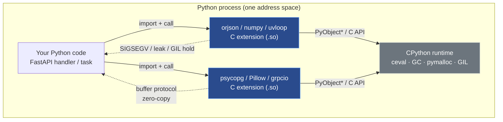
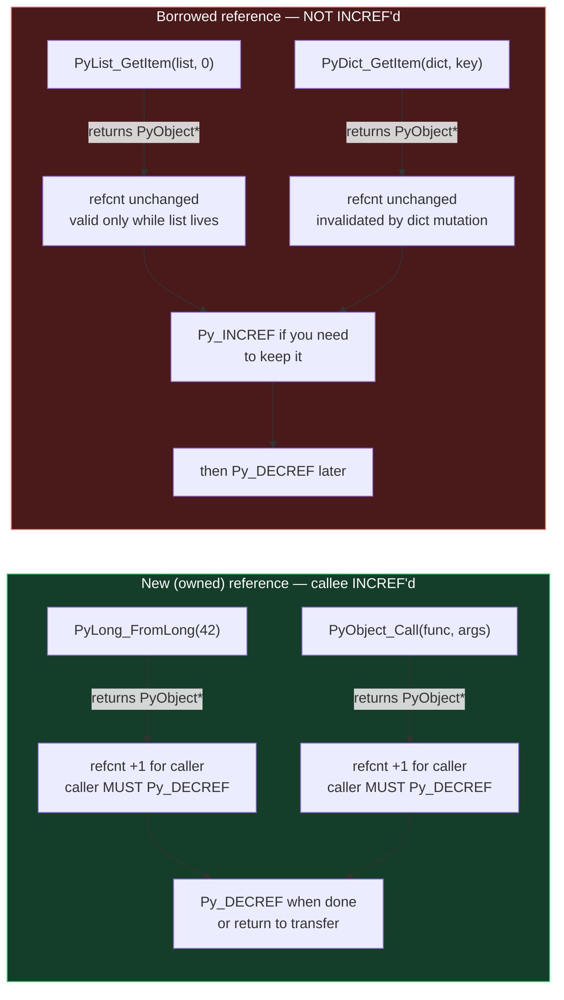
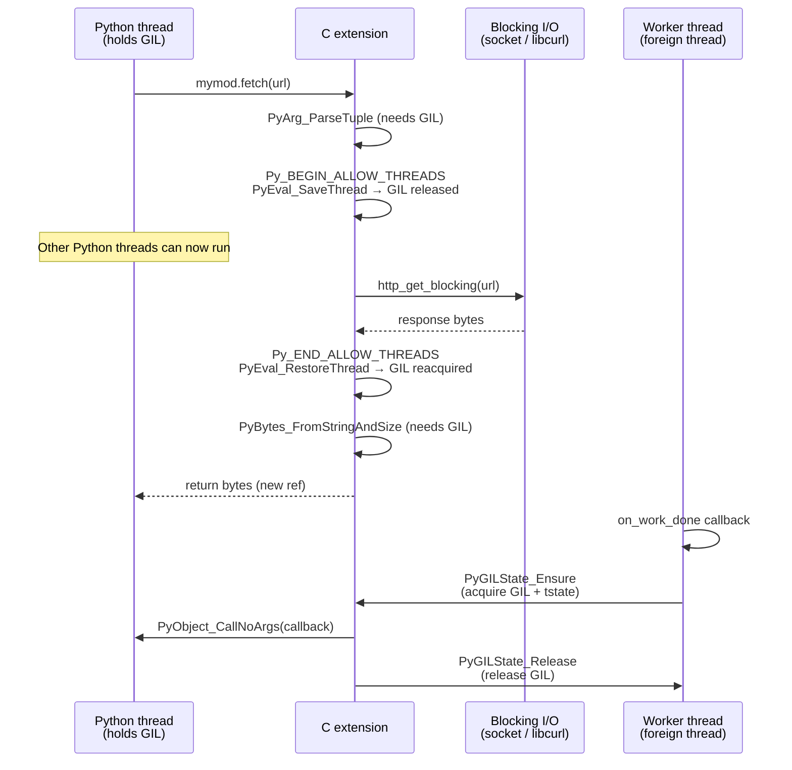
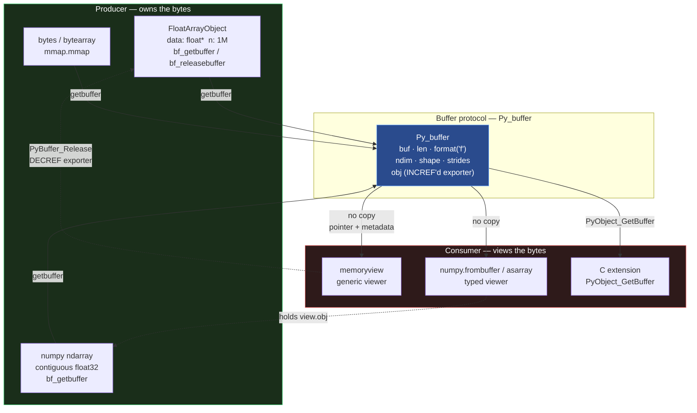
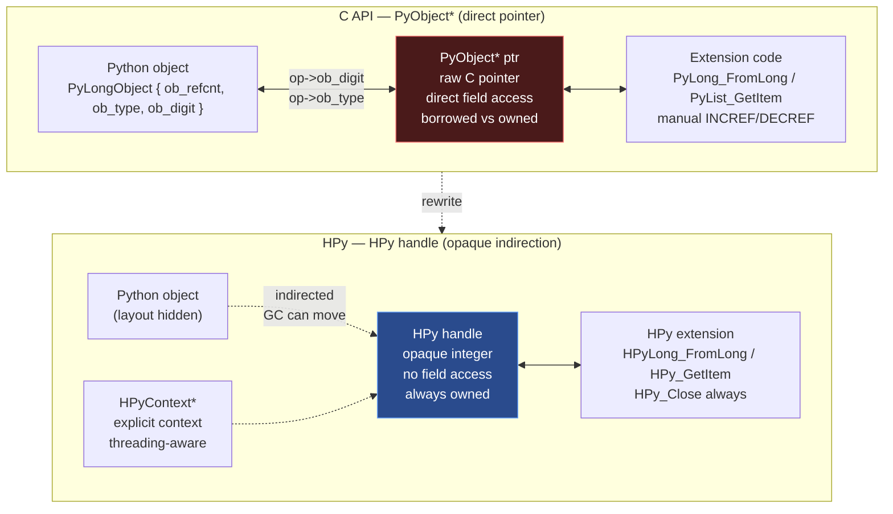
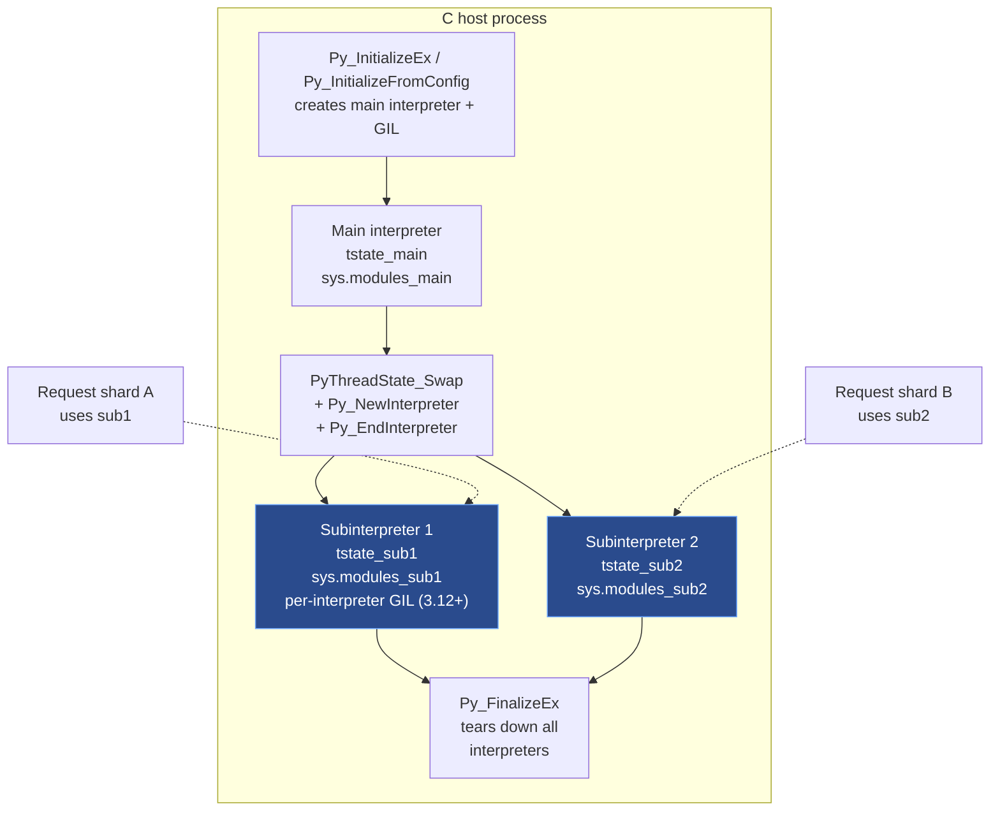
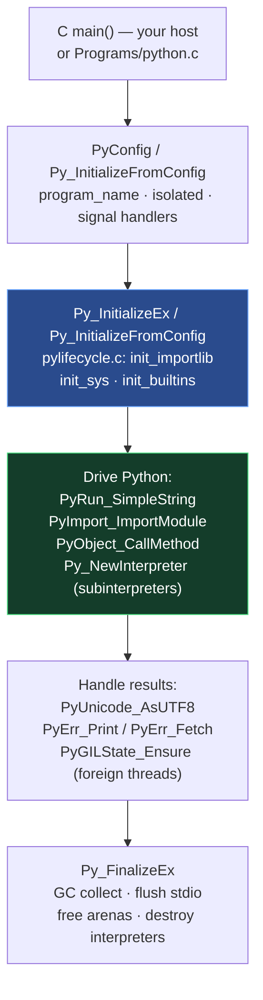
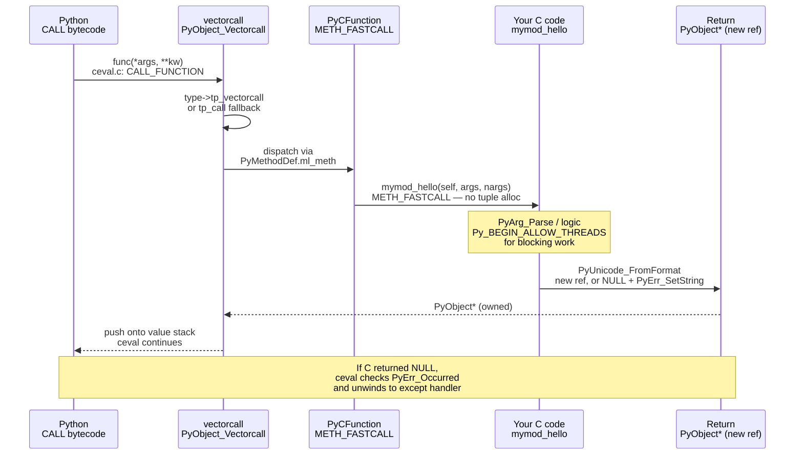

# Chapter 10 — C Extensions, the C API, HPy, and Embedding CPython

**What this chapter covers.** Almost every Python backend you run is part C. `numpy`, `cryptography`, `uvloop`, `orjson`, `psycopg`, `Pillow`, `lxml`, `grpcio` — the hot path of your service is a Python call that bottoms out in compiled C (or C++ or Rust via C) running inside the CPython process. That boundary — the C API — is one of the most powerful and most foot-gun-laden surfaces in the CPython codebase: a single missing `Py_INCREF` is a use-after-free, a single leaked reference is memory that never returns, a single mishandled `PyErr_*` is a silent wrong result in production. This chapter opens the boundary from both sides. You will write a real extension module with a custom type, parse arguments, manage reference ownership correctly, release the GIL around blocking I/O, expose zero-copy buffers to `numpy`/`memoryview`, build `abi3` stable-ABI wheels, understand the HPy alternative that tries to fix the API's deepest flaws, and embed CPython inside a C program — the pattern behind `nginx` + Python, game engines, and Postgres `plpython`.

Learning goals — after this chapter you should be able to:

- State the single invariant of the C API — reference ownership — and classify every API call as returning a *new* (owned) or *borrowed* reference, applying `Py_INCREF`/`Py_DECREF`/`Py_XDECREF` correctly.
- Define a module with `PyModuleDef` and `PyMethodDef` (including `METH_*` flags and the `vectorcall` fast path), and define a type with `PyType_Spec`/`PyType_Slot` + `PyType_FromSpec` rather than the legacy static `PyTypeObject`.
- Parse positional and keyword arguments with `PyArg_ParseTuple`, `PyArg_ParseTupleAndKeywords`, and the internal `_PyArg_Parser` clinic parser, including format units and converter functions.
- Implement correct error handling: set an exception with `PyErr_SetString`/`PyErr_Format`, return `NULL` (or `-1`/`-1.0` for non-pointer returns), and check every fallible API call.
- Release the GIL around blocking work with `Py_BEGIN_ALLOW_THREADS` / `Py_END_ALLOW_THREADS`, reason about what is forbidden while released, and reacquire it before touching any `PyObject*`.
- Implement the buffer protocol (`Py_buffer`, `bf_getbuffer`/`bf_releasebuffer`, `PyObject_GetBuffer`, `memoryview`, flags like `PyBUF_SIMPLE`/`PyBUF_WRITABLE`/`PyBUF_ND`) and explain zero-copy exchange with `numpy`.
- Explain the Limited API (`Py_LIMITED_API` / `Py_LIMITED_API` 0x030A0000) and Stable ABI (`abi3` wheels, PEP 384 / PEP 3149 `SOABI`), when it applies, what it forbids (direct struct access, `Py_SIZE`, `Py_TYPE` as lvalue), and how to build `abi3` wheels.
- Contrast HPy (handles vs. raw `PyObject*`, universal ABI, no borrowed references, no direct struct poke) with the classic C API and sketch a migration path.
- Embed CPython in a C host: `Py_InitializeEx` / `Py_InitializeFromConfig`, `PyRun_SimpleString` / `PyRun_String`, `PyImport_ImportModule`, subinterpreter embedding (`Py_NewInterpreter`, PEP 684 per-interpreter GIL), and the `pymain` / `Py_RunMain` startup path — and debug segfaults with `faulthandler` and `gdb`'s `py-bt`.

> **Prerequisites.** Chapter 2 ( `PyObject`, `ob_refcnt`, `Py_INCREF`/`Py_DECREF`, immortal objects) and Chapter 6 (`PyTypeObject`, type slots, descriptors, `PyType_FromSpec`) are direct prerequisites. Chapter 5 (GIL mechanics, free-threaded Python, per-interpreter GIL) and Chapter 9 (import system, `ExtensionFileLoader`, `PyImport_AppendInittab`) are strongly recommended. Volume 2, Chapter 4 (allocators) and Volume 13, Chapter 8 (FFI/Polyglot) provide background.

---

## 1. Why the C boundary is a backend concern

Your service already runs C extensions even if you never wrote one. The dependency that made your JSON serialization 20× faster, your image thumbnailer possible, or your database driver non-blocking is a `.so` loaded by `import` into the same address space as your Python code, sharing the same heap, the same GIL, and the same crash domain. Understanding that boundary is not optional for senior backend engineers.

Concrete reasons:

- **Performance cliffs live at the boundary.** `orjson` dumps JSON 5–10× faster than `json` because the entire serialize loop is C that never allocates a Python object per field. `numpy` vectorizes a loop that would be thousands of Python bytecodes into one C loop over a contiguous buffer. `uvloop` replaces `asyncio`'s Python event loop with `libuv` in C. If you cannot read the C API you cannot reason about where those speedups come from or when they evaporate (e.g., per-element Python callbacks inside a `numpy.vectorize` call).
- **Crashes are process crashes.** A segfault in a C extension kills the whole worker — not one request. There is no per-request isolation; `SIGSEGV` in `Pillow`'s JPEG decoder takes down your Gunicorn worker and whatever requests were in flight. `faulthandler` and `gdb py-bt` (covered in §14) are the only tools that give you a Python traceback from a C crash.
- **Memory bugs are security bugs.** A borrowed-reference misuse is a use-after-free that is exploitable across the process boundary. The C API's ownership rules (§2) are the memory-safety contract. Every backend team that vendors a C extension accepts this contract.
- **Packaging is an ABI problem.** Whether your wheel is `cp312-cp312-linux_x86_64` (CPython-version-locked) or `cp312-abi3-linux_x86_64` (Stable ABI, runs on 3.12+) determines whether you ship one wheel or six, whether your CI matrix explodes, and whether your users on Python 3.13 hit an `ImportError` on day one. §9 makes the tradeoff quantitative.
- **Embedding is architecture.** Postgres `plpython3u`, Redis modules, Nginx `ngx_python`, game servers, and custom sidecars all embed CPython as a library. Embedding (§12) turns CPython from "the process" into a component you initialize, configure, and tear down — with subinterpreters (PEP 684) as the isolation primitive.



---

## 2. C API basics — `PyObject*` and the one rule

### 2.1 Everything is a `PyObject*`, but now you manage the count

Chapter 2 showed `PyObject` — `ob_refcnt` + `ob_type` — as the prefix every value carries. From C you never hold a value, you hold a pointer to it, and you are responsible for its lifetime.

```c
/* Include/object.h — what you actually touch in an extension */
typedef struct _object {
    Py_ssize_t ob_refcnt;   // not opaque in the full API; opaque in Limited API
    PyTypeObject *ob_type;  // same
} PyObject;

// The only safe way to interact with ob_refcnt:
Py_INCREF(op);    // ++op->ob_refcnt  (with immortal-object check since 3.12)
Py_DECREF(op);    // --op->ob_refcnt; if 0 → tp_dealloc
Py_XINCREF(op);   // NULL-safe INCREF
Py_XDECREF(op);   // NULL-safe DECREF
Py_CLEAR(op);     // Py_XDECREF(op); op = NULL;  — prevents double-DECREF
```

In Python, `x = y` adjusts counts implicitly. In C, every assignment, every return, every stash in a struct is a manual decision. The compiler will not help you.

### 2.2 The one rule: new reference vs. borrowed reference

Every C API function that returns or hands you a `PyObject*` does one of two things — and the docs say which, but the compiler does not enforce it:

| Contract | Meaning | Who must `Py_DECREF`? | Examples |
|----------|---------|----------------------|----------|
| **New (owned) reference** | Callee did `Py_INCREF` before returning; count is +1 for you. You own it. | **You** — `Py_DECREF` when done, or return it (transfer ownership to caller). | `PyLong_FromLong`, `PyUnicode_FromString`, `PyList_New`, `PyObject_Call`, `PyDict_GetItemWithError` is *not* — see below |
| **Borrowed reference** | Callee did **not** `Py_INCREF`; pointer is valid only as long as the owner keeps it alive. You do **not** own it. | **Nobody** — do not `Py_DECREF` unless you first `Py_INCREF`'d to keep it. | `PyList_GetItem`, `PyTuple_GetItem`, `PyDict_GetItem`, `PyImport_GetModule`, `PyErr_Occurred` (borrowed), `Py_TYPE(obj)` |

If you get this wrong in either direction:

- Treating borrowed as owned and `Py_DECREF`'ing it → **premature free** → use-after-free → segfault or heap corruption (often far from the bug).
- Treating owned as borrowed and failing to `Py_DECREF` → **leak** → RSS grows until OOM-killer intervenes.

The canonical trap:

```c
PyObject *item = PyList_GetItem(list, 0);  // BORROWED — do NOT decref
// WRONG: Py_DECREF(item);

PyObject *item2 = PySequence_GetItem(list, 0); // NEW ref — you MUST decref
// ... use item2 ...
Py_DECREF(item2);

// If you need to keep a borrowed reference past the next Python call:
PyObject *kept = PyList_GetItem(list, 0); // borrowed
Py_INCREF(kept);  // now you own one count — remember to Py_DECREF(kept) later
```

**Borrowed references are invalidated by any call that might mutate the owner.** `PyList_GetItem(list, 0)` is borrowed from `list`. If you then do `PyList_Append(list, x)`, the list may reallocate `ob_item` and the pointer you borrowed may dangle. Rule: `Py_INCREF` immediately if you will do anything that might touch the owner.



### 2.3 Stealing references — the third contract

A few APIs **steal** a reference: you pass an owned reference and the callee takes ownership, so you must *not* `Py_DECREF` even though you previously owned it.

```c
PyObject *key = PyUnicode_FromString("hello"); // owned, +1
PyObject *val = PyLong_FromLong(42);           // owned, +1

// PyTuple_SetItem STEALS — do NOT decref key/val after this, even on failure
PyObject *tuple = PyTuple_New(2);              // owned, +1 (elements NULL)
PyTuple_SetItem(tuple, 0, key); // steals key — tuple now owns it
PyTuple_SetItem(tuple, 1, val); // steals val

// PyList_SetItem also steals. PyList_Append does NOT — it INCREFs.
// PyModule_AddObject steals (deprecated alias: PyModule_AddObjectRef in 3.10+ does NOT steal — prefer it).
```

Stealing APIs are being phased out precisely because they are error-prone. Modern code prefers non-stealing variants (`PyTuple_SetItem` remains, but `PyModule_AddObjectRef` / `PyDict_SetItem` are preferred over stealing alternatives).

### 2.4 Reference debugging — what to do when it goes wrong

- Compile with `./configure --with-pydebug` or at least `-DPy_REF_DEBUG` to enable `sys.gettotalrefcount()` and `PYTHONMALLOC=debug`.
- Use `python -X showrefcount -X tracemalloc` to compare counts across runs.
- `python -X gil=0` is irrelevant here; refcount bugs are the same under free-threaded builds but may manifest as races (see Chapter 5).
- AddressSanitizer: `CFLAGS="-fsanitize=address" ./configure --with-address-sanitizer` catches use-after-free from premature `Py_DECREF` — the single most valuable tool for extension authors.

---

## 3. Module creation — `PyModuleDef`, methods table, and `ML` flags

### 3.1 The minimal module — `PyModuleDef` + `PyMethodDef`

A C extension module is a shared library (`.so` / `.pyd`) that exports one function: `PyInit_<modulename>`. The import system (`ExtensionFileLoader` from Chapter 9) `dlopen`s it and calls that symbol.

```c
/* mymod.c — minimal extension module */
#define PY_SSIZE_T_CLEAN
#include <Python.h>

// --- 1. The C function that backs Python's mymod.hello(name) ---
static PyObject *
mymod_hello(PyObject *self, PyObject *args)
{
    const char *name;
    // PyArg_ParseTuple: "s" = str as UTF-8 char* (borrowed from PyUnicode)
    if (!PyArg_ParseTuple(args, "s", &name))
        return NULL;  // exception already set, propagate NULL
    return PyUnicode_FromFormat("hello, %s!", name); // new ref — caller owns it
}

// --- 2. Methods table — every entry maps a Python name to a C function ---
static PyMethodDef mymod_methods[] = {
    {"hello",  mymod_hello, METH_VARARGS,
     "hello(name) -> str\n\nReturn a greeting."},
    // METH_VARARGS  →  PyCFunction: (PyObject *self, PyObject *args)
    // self is the module object for module-level functions
    {NULL, NULL, 0, NULL}  // sentinel
};

// --- 3. Module definition ---
static struct PyModuleDef mymod_def = {
    PyModuleDef_HEAD_INIT,  // always this — sets ob_base correctly
    "mymod",                // m_name — import name (must match PyInit_mymod)
    "Example extension — hello + custom type.", // m_doc
    -1,                     // m_size — per-module state (-1 = no state, uses globals)
                            // for subinterpreter-safe modules use m_size >= 0, see §3.3
    mymod_methods,          // m_methods
    NULL,                   // m_slots — for Py_mod_create / Py_mod_exec (PEP 489)
    NULL,                   // m_traverse — GC traversal if m_size >= 0
    NULL,                   // m_clear
    NULL,                   // m_free
};

// --- 4. Entry point — name MUST be PyInit_<m_name> ---
PyMODINIT_FUNC
PyInit_mymod(void)
{
    return PyModule_Create(&mymod_def);  // new ref — import system owns it
}
```

Build and test (details in §11):

```bash
python -c "import mymod; print(mymod.hello('world'))"
# hello, world!
```

### 3.2 `METH_*` flags — the calling convention you choose

`PyMethodDef.ml_flags` selects the C signature the interpreter will use. Getting this wrong is a calling-convention mismatch and immediate UB/crash.

| Flag | C signature | Python call shape | Notes |
|------|-------------|-------------------|-------|
| `METH_VARARGS` | `PyObject *f(PyObject *self, PyObject *args)` | `f(*args)` — `args` is a tuple | Classic; needs `PyArg_ParseTuple` |
| `METH_VARARGS \| METH_KEYWORDS` | `PyObject *f(PyObject *self, PyObject *args, PyObject *kw)` | `f(*args, **kw)` | `kw` may be `NULL`; use `PyArg_ParseTupleAndKeywords` |
| `METH_NOARGS` | `PyObject *f(PyObject *self, PyObject *unused)` | `f()` | Validates no args for you |
| `METH_O` | `PyObject *f(PyObject *self, PyObject *arg)` | `f(arg)` | Single arg, no tuple alloc |
| `METH_FASTCALL` | `PyObject *f(PyObject *self, PyObject *const *args, Py_ssize_t nargs)` | `f(*args)` | **Preferred** — no tuple alloc, vectorcall-compatible |
| `METH_FASTCALL \| METH_KEYWORDS` | `PyObject *f(PyObject *self, PyObject *const *args, Py_ssize_t nargs, PyObject *kwnames)` | `f(*args, **kw)` | `kwnames` is tuple of keyword names or `NULL` |
| `METH_METHOD` | descriptor-aware variants | `type.method(obj, ...)` | Rare; for method descriptors |

Since Python 3.7+, `METH_FASTCALL` is the recommended default for new code — it avoids allocating an argument tuple on every call and integrates with `vectorcall` (PEP 590, Chapter 7):

```c
// METH_FASTCALL — no tuple allocation
static PyObject *
mymod_fast_hello(PyObject *self, PyObject *const *args, Py_ssize_t nargs)
{
    if (nargs != 1) {
        PyErr_SetString(PyExc_TypeError, "hello() takes exactly one argument");
        return NULL;
    }
    if (!PyUnicode_Check(args[0])) {
        PyErr_SetString(PyExc_TypeError, "hello() argument must be str");
        return NULL;
    }
    // PyUnicode_FromFormat handles the conversion
    return PyUnicode_FromFormat("hello, %U!", args[0]);
}

static PyMethodDef mymod_methods_fast[] = {
    {"hello", (PyCFunction)mymod_fast_hello, METH_FASTCALL, "hello(name) -> str"},
    {NULL, NULL, 0, NULL}
};
```

> **Clinic note.** CPython's own C modules rarely write `PyArg_ParseTuple` by hand anymore. They use *Argument Clinic* (`Tools/clinic/clinic.py`) — a DSL that generates the `_PyArg_Parser` and fastcall boilerplate plus `inspect.Signature` metadata. You will see `/*[clinic input]` blocks in `Modules/` and `Objects/`. For your own extensions, Clinic is optional but recommended if you want `__text_signature__` and fast argument parsing without hand-rolling format strings.

### 3.3 Multi-phase initialization (PEP 489) — why `m_size` and `m_slots` matter

The minimal example above uses *single-phase* init (`PyModule_Create`). Since PEP 489 (Python 3.5+), the import system supports *multi-phase* init, which is required for subinterpreter isolation (PEP 684, Chapter 5):

```c
// Multi-phase: slots let import create the module object first, then exec it
static int mymod_exec(PyObject *mod) {
    // Runs after the module object exists — safe to add types, constants
    // Return 0 on success, -1 on error (sets exception)
    if (PyModule_AddStringConstant(mod, "__version__", "1.0") < 0) return -1;
    return 0;
}

static PyModuleDef_Slot mymod_slots[] = {
    {Py_mod_exec, mymoc_exec},  // PEP 489 exec slot
    // {Py_mod_create, custom_create}, // optional: custom module object factory
    // {Py_mod_gil, Py_MOD_GIL_NOT_USED}, // PEP 684: declare GIL-free (3.12+)
    {0, NULL}
};

static struct PyModuleDef mymod_def_isolated = {
    PyModuleDef_HEAD_INIT,
    "mymod",
    "Isolated extension — subinterpreter-safe.",
    0,                    // m_size >= 0 → per-module state via PyModule_GetState
    mymod_methods,
    mymod_slots,          // ← multi-phase
    NULL, NULL, NULL,
};
```

Key differences:

- `m_size = -1` → module uses C globals. **Not subinterpreter-safe.** Two interpreters in the same process share the globals.
- `m_size >= 0` → each interpreter gets its own `PyModule_GetState(mod)` allocation, visited by GC via `m_traverse`/`m_clear`. **Required** for `Py_MOD_GIL_NOT_USED` and safe `Py_NewInterpreter` / per-interpreter GIL usage.
- `Py_mod_create` slot receives a `Py_mod_create` callback of type `PyObject* (*)(PyObject *spec, PyModuleDef *def)` — rarely needed.
- `Py_mod_gil` slot (Python 3.12+) declares whether the module needs the GIL. This is the mechanism behind free-threaded extensions.

---

## 4. Type creation in C — `PyType_Spec`, `PyType_Slot`, `PyType_FromSpec`

Chapter 6 dissected `PyTypeObject` — the 35-field struct with `tp_name`, `tp_basicsize`, `tp_dealloc`, `tp_methods`, etc. You *can* define a static `PyTypeObject` by hand (the legacy style still seen in older extensions), but since Python 3.2+ the modern API is `PyType_Spec` + `PyType_FromSpec`, which hides struct layout and is compatible with the Limited API.

### 4.1 Defining a type — the `Counter` example

Our extension will expose a `Counter` type: a heap type with one `long` field, a `__repr__`, an `increment` method, and GC support.

```c
#define PY_SSIZE_T_CLEAN
#include <Python.h>
#include <structmember.h>  // PyMemberDef

// --- Instance struct — PyObject_HEAD + your fields ---
typedef struct {
    PyObject_HEAD          // ob_refcnt + ob_type (or _PyObject_HEAD_EXTRA in debug)
    long count;            // our payload
    PyObject *label;       // owned ref — needs GC tracking
} CounterObject;

// --- tp_dealloc — destructor (called when refcnt → 0) ---
static void
Counter_dealloc(CounterObject *self)
{
    Py_CLEAR(self->label);  // XDECREF + NULL — safe even if label is NULL
    PyTypeObject *tp = Py_TYPE(self);
    PyObject_GC_UnTrack(self);         // if Py_TPFLAGS_HAVE_GC
    (*Py_TYPE(self)->tp_free)((PyObject *)self);
    Py_DECREF(tp);  // PyType_FromSpec heap types: keep type alive until free
}

// --- tp_traverse / tp_clear — GC support for container types ---
static int
Counter_traverse(CounterObject *self, visitproc visit, void *arg)
{
    Py_VISIT(self->label);
    Py_VISIT(Py_TYPE(self)); // heap type: visit the type itself (3.9+)
    return 0;
}
static int
Counter_clear(CounterObject *self)
{
    Py_CLEAR(self->label);
    return 0;
}

// --- Methods ---
static PyObject *
Counter_increment(CounterObject *self, PyObject *const *args, Py_ssize_t nargs)
{
    long delta = 1;
    if (nargs == 1) {
        delta = PyLong_AsLong(args[0]);
        if (delta == -1 && PyErr_Occurred()) return NULL;
    } else if (nargs > 1) {
        PyErr_SetString(PyExc_TypeError, "increment() takes at most 1 argument");
        return NULL;
    }
    self->count += delta;
    Py_RETURN_NONE;
}

static PyMethodDef Counter_methods[] = {
    {"increment", (PyCFunction)Counter_increment, METH_FASTCALL, "increment(delta=1)"},
    {NULL, NULL, 0, NULL}
};

static PyMemberDef Counter_members[] = {
    {"count", T_LONG, offsetof(CounterObject, count), 0, "current count"},
    {"label", T_OBJECT_EX, offsetof(CounterObject, label), 0, "optional label"},
    {NULL}
};

// --- Slots table — maps C slots to functions ---
static PyType_Slot Counter_slots[] = {
    {Py_tp_dealloc, Counter_dealloc},
    {Py_tp_traverse, Counter_traverse},
    {Py_tp_clear, Counter_clear},
    {Py_tp_methods, Counter_methods},
    {Py_tp_members, Counter_members},
    {Py_tp_doc, "Counter(count=0, label=None) — a simple C counter."},
    {0, NULL}  // sentinel
};

static PyType_Spec Counter_spec = {
    "mymod.Counter",               // tp_name — qualified name
    sizeof(CounterObject),         // tp_basicsize
    0,                             // tp_itemsize (0 = fixed-size)
    Py_TPFLAGS_DEFAULT | Py_TPFLAGS_HAVE_GC | Py_TPFLAGS_BASETYPE,
                                   // DEFAULT = HAVE_STACKLESS etc.; HAVE_GC = participate in GC
                                   // BASETYPE = allow subclassing from Python
    Counter_slots
};
```

Wiring it into the module (single-phase init for clarity; multi-phase is analogous):

```c
static struct PyModuleDef mymod_def = {
    PyModuleDef_HEAD_INIT, "mymod", "Example with Counter type.",
    -1, mymod_methods, NULL, NULL, NULL, NULL,
};

PyMODINIT_FUNC
PyInit_mymod(void)
{
    PyObject *mod = PyModule_Create(&mymod_def);
    if (!mod) return NULL;

    PyObject *counter_type = PyType_FromSpec(&Counter_spec); // new ref
    if (!counter_type) { Py_DECREF(mod); return NULL; }

    // PyModule_AddObjectRef does NOT steal — INCREFs internally (3.10+)
    // For <3.10, use PyModule_AddObject which DOES steal (then don't DECREF on success)
    if (PyModule_AddObjectRef(mod, "Counter", counter_type) < 0) {
        Py_DECREF(counter_type);
        Py_DECREF(mod);
        return NULL;
    }
    Py_DECREF(counter_type); // AddObjectRef INCREF'd, so we can drop ours
    return mod; // new ref — import system owns it
}
```

From Python:

```python
import mymod
c = mymod.Counter()
c.increment(5)
print(c.count)   # 5
c.label = "requests"
print(repr(c))   # <mymod.Counter object ...> — add tp_repr for custom repr
```

> **Why `Py_TPFLAGS_HEAPTYPE`?** Types created via `PyType_FromSpec` are *heap types* (`HEAPTYPE` set automatically). Their `PyTypeObject` is heap-allocated, not static, so `Py_DECREF(tp)` in `tp_dealloc` is required — the instance holds a reference to its type. Static `PyTypeObject`s (legacy `PyType_Ready` style) are immortal and must not be `Py_DECREF`'d.

### 4.2 `PyType_FromSpec` vs. legacy `PyTypeObject` + `PyType_Ready`

|  | `PyType_Spec` + `PyType_FromSpec` (modern) | `static PyTypeObject` + `PyType_Ready` (legacy) |
|--|--|--|
| Struct access | Slots only — no direct `tp_*` poke | Full struct visible — any field assignable |
| Limited API | **Compatible** — hides layout | **Incompatible** — requires full API |
| Heap type | Always heap type | Static type (immortal) unless `Py_TPFLAGS_HEAPTYPE` |
| Boilerplate | Compact — only slots you need | Verbose — zero-init every unused slot |
| Subclassing | `Py_TPFLAGS_BASETYPE` in flags | Same flag in static struct |

For new extensions, always use `PyType_Spec`. The legacy path exists for CPython's own `Objects/` types (which predate the Spec API) and for extensions that need to set exotic slots not yet exposed via `PyType_Slot`.

---

## 5. Argument parsing — `PyArg_ParseTuple`, `PyArg_ParseTupleAndKeywords`, and Clinic

### 5.1 Format strings — the `PyArg_ParseTuple` mini-language

`PyArg_ParseTuple` (and `PyArg_ParseTupleAndKeywords`) use a `printf`-like format string to coerce and validate arguments:

```c
static PyObject *
mymod_add(PyObject *self, PyObject *args)
{
    long a, b;
    const char *label = NULL;  // optional
    // "ll|s" → two required longs, one optional string
    // | marks the start of optional args
    if (!PyArg_ParseTuple(args, "ll|s", &a, &b, &label))
        return NULL;  // TypeError already set
    long result = a + b;
    if (label)
        return PyUnicode_FromFormat("%s: %ld", label, result);
    return PyLong_FromLong(result);
}
```

Common format units (see `Doc/c-api/arg.rst` for the full table):

| Unit | C type | Accepts | Notes |
|------|--------|---------|-------|
| `b` | `unsigned char` | int 0..255 | |
| `i` | `int` | int | Overflow → `OverflowError` |
| `l` | `long` | int | |
| `k` | `unsigned long` | int ≥ 0 | |
| `L` | `long long` | int | |
| `n` | `Py_ssize_t` | int | Preferred for sizes |
| `s` | `const char*` | `str` | UTF-8, **borrowed** — valid only until next Python call |
| `y` | `const char*` | `bytes` | Raw bytes, no decode |
| `u` | `Py_UNICODE*` | `str` | Deprecated — use `U`/`s` |
| `O` | `PyObject*` | any | **Borrowed** reference |
| `O!` | `PyObject*` | checked type | `O!(&PyLong_Type, &obj)` — validates type |
| `O&` | converter | any | `O&(converter, &out)` — custom coercion |
| `p` | `int` | any | Truth value (`PyObject_IsTrue`) |
| `w*` | `Py_buffer` | buffer | Request writable buffer — must `PyBuffer_Release` |
| `s*` | `Py_buffer` | `str`/`bytes` | Encoded string as buffer |

Optional args after `|`, keyword support via `PyArg_ParseTupleAndKeywords`:

```c
static PyObject *
mymod_greet(PyObject *self, PyObject *args, PyObject *kw)
{
    const char *name = "world";
    int excited = 0;
    static char *kwlist[] = {"name", "excited", NULL};
    // "s|p" → optional str, optional predicate (truthy)
    if (!PyArg_ParseTupleAndKeywords(args, kw, "|sp", kwlist, &name, &excited))
        return NULL;
    if (excited)
        return PyUnicode_FromFormat("Hello, %s!!!", name);
    return PyUnicode_FromFormat("Hello, %s.", name);
}

static PyMethodDef mymod_methods[] = {
    {"greet", (PyCFunction)mymod_greet, METH_VARARGS | METH_KEYWORDS, "greet(name='world', excited=False)"},
    {NULL, NULL, 0, NULL}
};
```

### 5.2 The Clinic parser — `_PyArg_Parser` and generated fastcall

For performance-critical or public-API functions, CPython uses Argument Clinic. Clinic generates a `_PyArg_Parser` and a fastcall wrapper that avoids `PyArg_ParseTuple` overhead and provides `inspect.Signature` support:

```c
/* clinic input (Tools/clinic/clinic.py) — not hand-written */
// [clinic input]
// mymod.greet
//     name: str = "world"
//     excited: bool = False
// [clinic start generated code]...
// clinic generates: mymod_greet_impl + _PyArg_Parser + wrapper
```

For your own extensions, Clinic is worthwhile when:

- You expose many functions and want `__text_signature__` for free.
- You need `METH_FASTCALL` without hand-rolling `PyArg_ParseStackAndKeywords`.
- You want positional-only / keyword-only enforcement matching Python semantics.

Otherwise, `PyArg_ParseTupleAndKeywords` with `METH_VARARGS|METH_KEYWORDS` is perfectly serviceable and far more common in third-party extensions.

---

## 6. Error handling — `PyErr_*` + `NULL` return

Python exceptions are C-level thread-local state: `tstate->current_exception` (Python 3.12+, previously `curexc_type/value/traceback`). The protocol is simple and absolute:

> **If a C function fails, it must set an exception and return an error sentinel. If it succeeds, it must not have an exception set.**

Sentinels by return type:

| Return type | Error sentinel | Success |
|-------------|---------------|---------|
| `PyObject*` | `NULL` | Owned `PyObject*` |
| `int` | `-1` | `0` (or `>= 0` for sizes) |
| `long` | `-1` + `PyErr_Occurred()` check | Any value |
| `Py_ssize_t` | `-1` + `PyErr_Occurred()` | `>= 0` |

Setting exceptions:

```c
PyErr_SetString(PyExc_TypeError, "expected str, got int");
return NULL;

PyErr_Format(PyExc_ValueError, "count %ld out of range [0, %ld)", count, limit);
return NULL;

// Wrap an existing exception with context (3.11+):
PyErr_Format(PyExc_RuntimeError, "while processing %R", obj); // %R = repr

// Fetch/restore — for cleanup that must not clobber the exception:
PyObject *type, *value, *tb;
PyErr_Fetch(&type, &value, &tb);   // clears current exception, gives you owned refs
// ... cleanup that might itself set an exception ...
PyErr_Restore(type, value, tb);    // restores — steals refs

// Normalize + chain (the C equivalent of `raise X from Y`):
PyErr_SetString(PyExc_RuntimeError, "outer");
PyErr_Fetch(&type, &value, &tb);
// ... PyErr_SetString inner ...
PyErr_Restore(type, value, tb); // simplified; real chaining uses PyException_SetCause

// Check without clearing:
if (PyErr_Occurred()) { /* borrowed ref — do not DECREF */ }

// Clear (rare — usually you propagate NULL instead):
PyErr_Clear();
```

Every fallible API call must be checked:

```c
PyObject *result = PyLong_FromLong(value); // can fail (MemoryError)
if (!result) return NULL;  // propagate — exception already set

PyObject *item = PyDict_GetItemWithError(dict, key); // new in 3.10 — distinguishes miss vs error
if (!item) {
    if (PyErr_Occurred()) return NULL; // real error
    // else: key not found — handle miss
}
```

> **Borrowed-reference trap in error paths.** `PyErr_Occurred()` returns a *borrowed* reference. If you need to keep it, `Py_INCREF` it — but usually you just test for `NULL`/non-`NULL`.

---

## 7. The GIL in C — `Py_BEGIN_ALLOW_THREADS` and friends

Chapter 5 covered the GIL from Python's perspective. From C, the GIL is a mutex you hold whenever you touch a `PyObject*` and release whenever you do work that does not need Python.

### 7.1 Releasing around blocking work

```c
static PyObject *
mymod_fetch(PyObject *self, PyObject *args)
{
    const char *url;
    if (!PyArg_ParseTuple(args, "s", &url)) return NULL;

    char *response = NULL;
    size_t len = 0;

    // Release GIL — other Python threads can run while we block on I/O
    Py_BEGIN_ALLOW_THREADS
    // ===== NO PyObject* ACCESS HERE — no INCREF, no PyErr_*, no Python calls =====
    // Only pure-C / syscall work:
    response = http_get_blocking(url, &len);  // e.g., libcurl easy_perform
    // ===== still no Python =====
    Py_END_ALLOW_THREADS
    // GIL reacquired — safe to touch Python again

    if (!response) {
        PyErr_SetString(PyExc_RuntimeError, "fetch failed");
        return NULL;
    }
    PyObject *result = PyBytes_FromStringAndSize(response, len); // new ref
    free(response);  // http_get_blocking used malloc
    return result;
}
```

What `Py_BEGIN_ALLOW_THREADS` expands to (simplified):

```c
// Include/ceval.h — conceptual
#define Py_BEGIN_ALLOW_THREADS { \
    PyThreadState *_save = PyEval_SaveThread(); /* release GIL, save tstate */ \
    /* ... blocking work ... */                  \
    PyEval_RestoreThread(_save);                 /* reacquire GIL */ \
}
```

Rules while GIL is released:

- **Do not** read/write any `PyObject*` (`ob_refcnt`, `ob_type`, `Py_INCREF`, `PyList_GetItem`).
- **Do not** call any `PyErr_*` or `PyObject_*` API.
- **Do not** access `PyThreadState*` without reacquiring.
- **May** do syscalls, `malloc`/`free`, compute, `libcurl`, `read`/`write`, compression, crypto.
- Use `PyGILState_Ensure` / `PyGILState_Release` if you need to re-enter Python from a *non-Python thread* (e.g., a C callback on a worker thread — see §12.3).

### 7.2 `PyGILState_Ensure` — calling Python from foreign threads

If your extension spawns its own threads (or wraps a library that does), those threads have no `PyThreadState`. Before touching Python, they must acquire one:

```c
// Called on a libuv / pthread worker thread — no GIL, no tstate
void on_work_done(void *userdata) {
    PyGILState_STATE gstate = PyGILState_Ensure(); // acquire GIL + ensure tstate
    PyObject *callback = (PyObject *)userdata;      // owned ref stashed earlier
    PyObject *result = PyObject_CallNoArgs(callback);
    if (!result) PyErr_Print(); // don't silently swallow — log it
    else Py_DECREF(result);
    PyGILState_Release(gstate);  // release GIL, restore previous state
}
```



---

## 8. Buffer protocol — `Py_buffer`, `getbuffer`, `memoryview`, zero-copy with `numpy`

The buffer protocol is CPython's zero-copy exchange format. Any object that holds a contiguous (or strided) byte region can expose it as a `Py_buffer` so consumers (`memoryview`, `numpy`, `Pillow`, `bytearray`, `mmap`) can read/write it without copying.

### 8.1 Producer — exposing a buffer

```c
typedef struct {
    PyObject_HEAD
    float *data;       // contiguous C array — the actual storage
    Py_ssize_t n;      // number of floats
} FloatArrayObject;

static int
FloatArray_getbuffer(FloatArrayObject *self, Py_buffer *view, int flags)
{
    // Fill Py_buffer — the contract in Include/cpython/buffer.h
    view->obj = (PyObject *)self;
    Py_INCREF(self);                // view holds a ref to exporter — released in bf_releasebuffer
    view->buf = self->data;         // pointer to raw bytes
    view->len = self->n * sizeof(float);
    view->readonly = 0;             // writable
    view->itemsize = sizeof(float);
    view->format = (flags & PyBUF_FORMAT) ? "f" : NULL; // struct format char
    view->ndim = 1;
    view->shape = &self->n;         // careful: must stay alive until releasebuffer
                                    // for heap shape, malloc it and free in releasebuffer
    view->strides = (Py_ssize_t[]){ sizeof(float) };
    view->suboffsets = NULL;
    view->internal = NULL;
    return 0; // 0 = success, -1 = failure (set exception)
}

static void
FloatArray_releasebuffer(FloatArrayObject *self, Py_buffer *view)
{
    // Drop the ref we INCREF'd in getbuffer
    Py_DECREF(self);
}

static PyBufferProcs FloatArray_as_buffer = {
    .bf_getbuffer = (getbufferproc)FloatArray_getbuffer,
    .bf_releasebuffer = (releasebufferproc)FloatArray_releasebuffer,
};

// In PyType_Spec slots:
static PyType_Slot FloatArray_slots[] = {
    {Py_tp_doc, "FloatArray(n) — contiguous float buffer."},
    {Py_bf_getbuffer, FloatArray_getbuffer},
    {Py_bf_releasebuffer, FloatArray_releasebuffer},
    // ... dealloc, methods, etc.
    {0, NULL}
};
```

Producer checklist (from `Doc/c-api/buffer.rst`):

- `view->obj` must be `INCREF`'d — `PyBuffer_Release` will `DECREF` it.
- `shape`/`strides` pointers must remain valid until `bf_releasebuffer` — do not point at stack memory.
- Respect `flags`: if caller did not request `PyBUF_FORMAT`, `view->format` should be `NULL`.
- `bf_releasebuffer` is optional only for simple 1-D contiguous buffers with no heap shape.

### 8.2 Consumer — acquiring a buffer

```c
static PyObject *
mymod_sum_buffer(PyObject *self, PyObject *obj)
{
    Py_buffer view;
    // PyBUF_SIMPLE = contiguous bytes, no format/strides needed
    // PyBUF_WRITABLE, PyBUF_FORMAT, PyBUF_ND are other flag bits
    if (PyObject_GetBuffer(obj, &view, PyBUF_SIMPLE) < 0)
        return NULL; // TypeError already set if obj doesn't export buffer

    // view.buf is valid until PyBuffer_Release
    // For a bytes-like object, view.len is bytes; cast as needed
    double sum = 0;
    // If the buffer is known to be floats, use PyBUF_FORMAT and check view.format
    // Here we sum raw bytes as example:
    for (Py_ssize_t i = 0; i < view.len; i++)
        sum += ((unsigned char *)view.buf)[i];

    PyBuffer_Release(&view); // DECREFs view.obj, invalidates view.buf
    return PyFloat_FromDouble(sum);
}
```

From Python:

```python
import numpy as np
import mymod

arr = np.array([1.0, 2.0, 3.0], dtype=np.float32)
# numpy exposes Py_buffer with format "f", ndim=1, shape=(3,)
mv = memoryview(arr)          # memoryview is the generic buffer consumer — no copy
print(mv.format, mv.shape)    # f (3,)
print(mv[1])                  # 2.0 — direct access to numpy's storage

# Zero-copy round-trip — mymod.FloatArray exposes the same protocol:
fa = mymod.FloatArray(1_000_000)
mv2 = memoryview(fa)          # no copy — mv2 points at fa.data
np_arr = np.frombuffer(mv2, dtype=np.float32)  # still no copy — numpy views fa's memory
# WARNING: fa must stay alive as long as np_arr/mv2 exist (view.obj keeps it alive)
```



> **Backend lens — when zero-copy matters.** A service that decodes 10k images/s with `Pillow` and feeds them to an ML model via `numpy` must avoid per-image copies. `Pillow`'s `tobytes` copies; `memoryview` + buffer protocol does not. The same applies to `mmap`'d model weights, `bytearray` network buffers, and `array('f')` feature vectors. Always check `mv.contiguous` / `PyBuffer_IsContiguous` before assuming a single `memcpy` suffices — non-contiguous (strided, Fortran-order) buffers require per-row copies or `PyBuffer_ToContiguous`.

---

## 9. Limited API and Stable ABI — `Py_LIMITED_API`, `abi3` wheels, PEP 384

### 9.1 The problem — every Python minor breaks your `.so`

A C extension compiled against `Python.h` on 3.11 has `PyLongObject` layout, `Py_TYPE` macro expansion, and `PyUnicodeObject` field offsets baked into its machine code. On 3.12, those layouts changed (immortal objects, PEP 683) — the same `.so` segfaults. So traditionally you ship one wheel per `(implementation, version, arch)` triple:

```
mymod-1.0-cp311-cp311-linux_x86_64.whl   # CPython 3.11 only
mymod-1.0-cp312-cp312-linux_x86_64.whl   # CPython 3.12 only
mymod-1.0-cp313-cp313-linux_x86_64.whl   # CPython 3.13 only
```

For a backend team maintaining an internal extension, that is a CI matrix of 6–8 builds per platform.

### 9.2 The Stable ABI — a subset that promises forward compatibility

PEP 384 (Python 3.2) defines a *Stable ABI* (`abi3`): a subset of the C API whose ABI is guaranteed stable across Python 3.x minor versions. An extension that uses only that subset and is compiled with `Py_LIMITED_API` set can be built once on the *oldest* supported Python and run on every newer one:

```
mymod-1.0-cp312-abi3-linux_x86_64.whl   # built on 3.12, runs on 3.12, 3.13, 3.14, ...
```

What you give up (the API surface you may not touch):

> *Diagram omitted for brevity — see surrounding prose.*


Concretely, with `Py_LIMITED_API` defined:

- `PyObject` becomes opaque — `op->ob_refcnt` and `op->ob_type` are compile errors; use `Py_REFCNT(op)`, `Py_TYPE(op)`, `Py_SIZE(op)` as *functions*, and `Py_IS_TYPE` / `Py_SET_TYPE` where needed.
- `Py_TYPE(obj) = new_type` is forbidden — use `Py_SET_TYPE(obj, new_type)`.
- `PyList_GET_ITEM` / `PyTuple_GET_ITEM` macros that poke `ob_item` directly are unavailable — use `PyList_GetItem` / `PyTuple_GetItem`.
- `Include/cpython/` and `Include/internal/` headers are not includable — they are explicitly unstable.
- `PyLongObject`, `PyUnicodeObject`, `PyDictObject` layouts are hidden.

### 9.3 Building an `abi3` extension

`setup.py` / `pyproject.toml` — the two equivalent ways to declare an `abi3` build:

```python
# setup.py — setuptools
from setuptools import setup, Extension

ext = Extension(
    "mymod",
    sources=["mymod.c"],
    # Request the Limited API at 3.10 — extension will run on 3.10+
    define_macros=[("Py_LIMITED_API", "0x030A0000")],
    py_limited_api=True,  # tells bdist_wheel to tag the wheel as abi3
)

setup(
    name="mymod",
    version="1.0",
    ext_modules=[ext],
)
```

```toml
# pyproject.toml — setuptools backend (PEP 517/518)
[build-system]
requires = ["setuptools>=61", "wheel"]
build-backend = "setuptools.build_meta"

[project]
name = "mymod"
version = "1.0"

[tool.setuptools.ext-modules]
# setuptools ≥64 supports declarative ext-modules; otherwise keep setup.py
```

```bash
# Build — must be on the OLDEST Python you claim to support (3.10 here)
python3.10 -m pip wheel . --no-deps -w dist/
# dist/mymod-1.0-cp310-abi3-linux_x86_64.whl — note abi3 tag

# Verify — abi3check or simple import on newer Python:
python3.12 -c "import mymod; print(mymod.__file__)"
python3.13 -c "import mymod; print(mymod.__doc__)"
```

CI pattern (GitHub Actions — build once, test on many):

```yaml
# .github/workflows/wheels.yml
jobs:
  build-abi3:
    runs-on: ubuntu-latest
    steps:
      - uses: actions/checkout@v4
      - uses: actions/setup-python@v5
        with: { python-version: "3.10" }   # oldest supported
      - run: pip install build && python -m build -w
      - uses: actions/upload-artifact@v4
        with: { path: dist/*abi3*.whl }

  test-abi3:
    needs: build-abi3
    strategy:
      matrix: { python: ["3.10", "3.11", "3.12", "3.13"] }
    runs-on: ubuntu-latest
    steps:
      - uses: actions/setup-python@v5
        with: { python-version: "${{ matrix.python }}" }
      - run: pip install dist/*abi3*.whl && python -c "import mymod; mymod.hello('ci')"
```

> **When *not* to use `abi3`.** Extensions that need `PyLongObject` digit access, direct `ob_item` manipulation, `cpython/` headers (e.g., `PyUnicode_KIND`), or CPython-version-specific optimizations (PEP 659 specialization, free-threaded `Py_MOD_GIL_NOT_USED`) cannot use the Limited API. `numpy` does not use `abi3` for this reason. Most pure-wrapper extensions (calling into `libcurl`, `libjpeg`, `grpc`, `openssl`) can and should.

### 9.4 PEP 3149 `SOABI` and wheel tags

The `SOABI` (`sysconfig.get_config_var("SOABI")` → `cpython-312-x86_64-linux-gnu`) encodes `implementation-version-arch`. For full-API wheels, `bdist_wheel` derives the tag from `SOABI`. For `abi3` wheels, the tag collapses to `cp310-abi3-<platform>` — `cp310` is the *minimum* version, `abi3` signals Stable ABI. The import system (`ExtensionFileLoader`) accepts any `abi3` extension on any `3.x ≥ 3.10`.

---

## 10. HPy — handles, universal ABI, and an alternative future

### 10.1 Why the C API needs an alternative

The C API's deepest flaws are not bugs but design choices from 1991 that no longer fit:

- **Raw `PyObject*` pointers** expose object layout, prevent moving GC, and make borrowed references possible. A moving GC (like PyPy's) cannot use the C API because C code holds raw pointers that would dangle after compaction.
- **Borrowed references** are a global source of use-after-free. Every `PyList_GetItem` caller must reason about owner mutation — and the compiler cannot check it.
- **Direct struct access** (`op->ob_refcnt`, `PyLongObject.ob_digit`) ties every extension to one CPython version's layout.
- **No binary portability** without the `abi3` subset — and `abi3` is restrictive.
- **GIL coupling** — raw pointer access requires the GIL; the API has no way to express "this handle is valid without the GIL."

HPy (https://hpyproject.org, PEP 630-adjacent) is a reimagined C API that fixes these at the abstraction level:

|  | C API (`PyObject*`) | HPy (`HPy` handle) |
|--|--|--|
| Value representation | Raw pointer to `PyObject` — direct field access | Opaque handle (`HPy` is an integer index, not a pointer) — must go through API |
| Reference model | New vs. borrowed — caller must know | **All handles are owned** — `HPy_Close` always required, no borrowed references |
| ABI | CPython-version-specific (unless `abi3` subset) | **Universal ABI** — one `.hpy.so` runs on CPython, PyPy, GraalPy without recompile |
| GC compatibility | Incompatible with moving GC | Compatible — handles are indirected, GC can move objects |
| Struct layout | Visible — `PyLongObject` etc. exposed | Hidden — no struct access, even in "full" mode |
| GIL interaction | Implicit — raw pointer implies GIL | Explicit — `HPyContext*` threading model |



### 10.2 Minimal HPy module — compare with §3

```c
/* hpy_mymod.c — HPy equivalent of mymod_hello */
#include <hpy.h>

HPyDef_METH(hpy_hello, "hello", HPyFunc_O, .doc="hello(name) -> str")
static HPy hpy_hello_impl(HPyContext *ctx, HPy self, HPy arg)
{
    // HPyUnicode_AsUTF8AndSize — explicit ctx, no borrowed refs
    HPy_ssize_t size;
    const char *name = HPyUnicode_AsUTF8AndSize(ctx, arg, &size);
    if (!name) return HPy_NULL; // exception already set

    // HPyUnicode_FromFormat — returns owned HPy handle
    return HPyUnicode_FromFormat(ctx, "hello, %s!", name);
    // Caller will HPy_Close the result; no INCREF/DECREF, no borrowed
}

static HPyModuleDef hpy_mymod_def = {
    .doc = "HPy example — hello.",
    .size = 0,
    .defines = (HPyDef*[]){
        &hpy_hello,
        NULL
    }
};

HPy_MODINIT(hpy_mymod, hpy_mymod_def)
// No PyInit_* — HPy generates the entry point; import finds hpy_mymod.hpy.so
```

Build with `hpy` tooling (from https://hpyproject.org):

```toml
# pyproject.toml — HPy build
[build-system]
requires = ["hpy"]
build-backend = "hpy.build"

[tool.hpy]
# hpy.abi = "universal"  # one .hpy.so for CPython + PyPy + GraalPy
# hpy.abi = "cpython"    # CPython-only, slightly faster
```

Key differences to internalize:

- Every `HPy` is owned — `HPy_Close(ctx, h)` is the only way to release it. There is no `HPy_INCREF`/`HPy_DECREF` distinction and no borrowed handles.
- `HPyContext *ctx` is threaded through every call — it carries the interpreter state, making subinterpreter and free-threaded usage explicit.
- `HPy_NULL` is the error sentinel (analogous to `NULL` for `PyObject*`), but the handle is not a pointer — comparing it to `NULL` is a type error.
- `HPy_MODINIT` replaces `PyInit_*`; the import system finds `*.hpy.so` via `hpy`'s loader hook.

### 10.3 Migration path and current status

HPy is production-usable (used by `hpy` itself, `numpy` experiments, and several small extensions) but not yet the default for the ecosystem. Practical guidance:

- **New extensions that value portability** (run on CPython + PyPy + GraalPy, or want a moving-GC future) should evaluate HPy. The universal ABI eliminates the `abi3` vs. full-API tradeoff entirely.
- **Existing C API extensions** can migrate incrementally: HPy provides `HPy_AsPyObject` / `HPy_FromPyObject` shims for mixed code, and `autogen` tooling to translate `PyMethodDef` tables.
- **Performance**: HPy's handle indirection has a small cost (one extra load per access) that is negligible for most extensions but measurable in tight loops over `PyObject*` arrays. The `hpy` project publishes microbenchmarks; measure your hot path.
- **Ecosystem inertia**: most large extensions (`numpy`, `cryptography`, `Pillow`) remain on the C API. HPy adoption is a multi-year transition. Knowing *both* APIs — and when to choose each — is the pragmatic stance.

---

## 11. Putting it together — complete `mymod` with module + type + method, and its build

The snippets in §3–§4 were intentionally fragmented for explanation. Here is the complete, buildable extension that combines everything — module, custom type, fastcall method, and correct reference management — in one translation unit. This is the artifact you would ship.

```c
/* mymod.c — complete buildable extension (full C API, abi3-compatible) */
#define PY_SSIZE_T_CLEAN
#include <Python.h>
#include <structmember.h>

/* ---------- Counter type ---------- */
typedef struct {
    PyObject_HEAD
    long count;
    PyObject *label; // owned ref
} CounterObject;

static void Counter_dealloc(CounterObject *self) {
    Py_CLEAR(self->label);
    PyTypeObject *tp = Py_TYPE(self);
    PyObject_GC_UnTrack(self);
    Py_TYPE(self)->tp_free((PyObject *)self);
    Py_DECREF(tp);
}
static int Counter_traverse(CounterObject *self, visitproc visit, void *arg) {
    Py_VISIT(self->label);
    Py_VISIT(Py_TYPE(self));
    return 0;
}
static int Counter_clear(CounterObject *self) {
    Py_CLEAR(self->label);
    return 0;
}
static PyObject *Counter_increment(CounterObject *self, PyObject *const *args, Py_ssize_t nargs) {
    long delta = 1;
    if (nargs == 1) {
        delta = PyLong_AsLong(args[0]);
        if (delta == -1 && PyErr_Occurred()) return NULL;
    } else if (nargs > 1) {
        PyErr_SetString(PyExc_TypeError, "increment() takes at most 1 argument");
        return NULL;
    }
    self->count += delta;
    Py_RETURN_NONE;
}
static PyObject *Counter_repr(CounterObject *self) {
    return PyUnicode_FromFormat("Counter(count=%ld, label=%R)", self->count, self->label ? self->label : Py_None);
}
static PyMethodDef Counter_methods[] = {
    {"increment", (PyCFunction)Counter_increment, METH_FASTCALL, "increment(delta=1) -> None"},
    {NULL, NULL, 0, NULL}
};
static PyMemberDef Counter_members[] = {
    {"count", T_LONG, offsetof(CounterObject, count), 0, "count"},
    {"label", T_OBJECT_EX, offsetof(CounterObject, label), 0, "label"},
    {NULL}
};
static PyType_Slot Counter_slots[] = {
    {Py_tp_dealloc, Counter_dealloc},
    {Py_tp_traverse, Counter_traverse},
    {Py_tp_clear, Counter_clear},
    {Py_tp_repr, Counter_repr},
    {Py_tp_methods, Counter_methods},
    {Py_tp_members, Counter_members},
    {Py_tp_doc, "Counter(count=0, label=None)"},
    {0, NULL}
};
static PyType_Spec Counter_spec = {
    "mymod.Counter", sizeof(CounterObject), 0,
    Py_TPFLAGS_DEFAULT | Py_TPFLAGS_HAVE_GC | Py_TPFLAGS_BASETYPE,
    Counter_slots
};

/* ---------- Module-level function ---------- */
static PyObject *mymod_hello(PyObject *self, PyObject *const *args, Py_ssize_t nargs) {
    if (nargs != 1) {
        PyErr_SetString(PyExc_TypeError, "hello() takes exactly one argument");
        return NULL;
    }
    if (!PyUnicode_Check(args[0])) {
        PyErr_SetString(PyExc_TypeError, "hello() argument must be str");
        return NULL;
    }
    return PyUnicode_FromFormat("hello, %U!", args[0]);
}
static PyMethodDef mymod_methods[] = {
    {"hello", (PyCFunction)mymod_hello, METH_FASTCALL, "hello(name) -> str"},
    {NULL, NULL, 0, NULL}
};

/* ---------- Module def + init ---------- */
static int mymod_exec(PyObject *mod) {
    PyObject *type = PyType_FromSpec(&Counter_spec);
    if (!type) return -1;
    int rc = PyModule_AddObjectRef(mod, "Counter", type);
    Py_DECREF(type);
    return rc;
}
static PyModuleDef_Slot mymod_slots[] = {
    {Py_mod_exec, mymod_exec},
    {0, NULL}
};
static struct PyModuleDef mymod_def = {
    PyModuleDef_HEAD_INIT, "mymod", "Complete example — hello + Counter.",
    0, mymod_methods, mymod_slots, NULL, NULL, NULL,
};
PyMODINIT_FUNC PyInit_mymod(void) {
    return PyModuleDef_Init(&mymod_def);
}
```

Build files — all three variants:

```python
# setup.py — full (version-locked) build
from setuptools import setup, Extension
setup(name="mymod", version="1.0",
      ext_modules=[Extension("mymod", sources=["mymod.c"])])

# setup.py — abi3 (stable ABI) build — note Py_LIMITED_API + py_limited_api=True
from setuptools import setup, Extension
setup(name="mymod", version="1.0",
      ext_modules=[Extension("mymod", sources=["mymod.c"],
                             define_macros=[("Py_LIMITED_API", "0x030A0000")],
                             py_limited_api=True)])
```

```toml
# pyproject.toml — works with either setup.py above (PEP 517)
[build-system]
requires = ["setuptools>=61", "wheel"]
build-backend = "setuptools.build_meta"

[project]
name = "mymod"
version = "1.0"
requires-python = ">=3.10"

# abi3 build via setup.py define_macros + py_limited_api=True
# Verify: pip wheel . && auditwheel show dist/*.whl | grep abi3
```

```bash
# Full build + test
python -m pip wheel . --no-deps -w dist/
python -c "import mymod; print(mymod.hello('world')); c=mymod.Counter(); c.increment(5); print(c)"

# abi3 build + verify on newer Python
python3.10 -m pip wheel . --no-deps -w dist/   # build on oldest
python3.12 -c "import mymod; print(mymod.hello('abi3'))"  # run on newer — should succeed
python -m pip install --no-index --find-links=dist mymod  # install the wheel
```

---

## 12. Embedding CPython — `Py_InitializeEx`, `PyRun_*`, subinterpreters, `pymain`

So far Python was the host and C was the guest (extension). Embedding inverts it: C/C++ is the host and CPython is a library you initialize, drive, and tear down. This is how Postgres, Blender, Nginx, and game engines host Python.

### 12.1 Minimal embedding — `Py_InitializeEx` → `PyRun_SimpleString` → `Py_FinalizeEx`

```c
/* embed.c — minimal embedding (Python 3.8+ simple API) */
#define PY_SSIZE_T_CLEAN
#include <Python.h>

int main(int argc, char *argv[])
{
    // 1. Initialize — Py_InitializeEx(0) skips signal handlers (useful when host owns signals)
    //    Py_Initialize() is equivalent to Py_InitializeEx(1)
    Py_InitializeEx(0);
    if (!Py_IsInitialized()) return 1;

    // 2. Run Python code — simplest form
    PyRun_SimpleString("print('hello from embedded Python')");

    // 3. Import and call — the realistic pattern
    PyObject *mod = PyImport_ImportModule("mymod"); // new ref, NULL on failure
    if (mod) {
        PyObject *result = PyObject_CallMethod(mod, "hello", "s", "embedded");
        if (result) {
            // Convert to C string for host consumption
            const char *s = PyUnicode_AsUTF8(result); // borrowed — valid while result lives
            printf("mymod.hello returned: %s\n", s);
            Py_DECREF(result);
        } else {
            PyErr_Print(); // prints traceback to stderr — clears exception
        }
        Py_DECREF(mod);
    } else {
        PyErr_Print();
    }

    // 4. Tear down — Py_FinalizeEx returns 0 on success, -1 if exception during finalization
    if (Py_FinalizeEx() < 0) return 120;
    return 0;
}
```

```bash
# Compile — use python3-config for correct flags (or pkg-config python3-embed)
cc embed.c -o embed $(python3-config --cflags --ldflags --embed)
# --embed is required since 3.8 — links libpython correctly for embedding
./embed
# hello from embedded Python
# mymod.hello returned: hello, embedded!
```

> **Linking note.** `python3-config --ldflags` without `--embed` omits `-lpython3.x` on some distros (it assumes you are building an extension, not an embedder). Always use `--embed` for embedding. With `pkg-config`, use `pkg-config --cflags --libs python3-embed`.

### 12.2 Modern initialization — `PyConfig` (Python 3.8+)

`Py_InitializeEx` is the legacy entry point. For control over filesystem encoding, isolated mode, `PYTHONPATH` handling, and subinterpreter config, use `PyConfig` + `Py_InitializeFromConfig`:

```c
PyConfig config;
PyConfig_InitPythonConfig(&config); // or InitIsolatedConfig for -I semantics
config.install_signal_handlers = 0; // host owns SIGINT/SIGTERM
// config.program_name = Py_DecodeLocale(argv[0], NULL);
// config.pythonpath_env = NULL; // ignore PYTHONPATH — hermetic embedder

PyStatus status = Py_InitializeFromConfig(&config);
if (PyStatus_Exception(status)) {
    PyConfig_Clear(&config);
    Py_ExitStatusException(status); // prints error + exits
}
PyConfig_Clear(&config);
// ... PyRun_* / PyImport_* ...
Py_FinalizeEx();
```

### 12.3 Subinterpreter embedding — isolation without processes

Chapter 5 introduced the per-interpreter GIL (PEP 684). Embedding is where it matters: you can host multiple isolated Python interpreters in one C process, each with its own `sys.modules`, `builtins`, and (since 3.12) its own GIL.

```c
// Subinterpreter embedding — each interpreter is isolated
Py_InitializeEx(0);

PyThreadState *main_tstate = PyThreadState_Get(); // main interpreter

PyThreadState *sub1 = Py_NewInterpreter(); // new interpreter + new tstate (holds GIL)
PyRun_SimpleString("import sys; print('sub1:', sys.version)");
PyThreadState_Swap(main_tstate); // back to main — sub1's GIL interactions are separate (3.12+ per-interpreter GIL)

PyThreadState *sub2 = Py_NewInterpreter();
PyRun_SimpleString("x = 42; print('sub2 x =', x)"); // x is not visible in sub1 or main
PyThreadState_Swap(main_tstate);

// Tear down subinterpreters before finalizing main
PyThreadState_Swap(sub1);
Py_EndInterpreter(sub1); // destroys sub1 — all its objects freed
PyThreadState_Swap(sub2);
Py_EndInterpreter(sub2);
PyThreadState_Swap(main_tstate);

Py_FinalizeEx();
```



Caveats:

- Many extensions are **not** subinterpreter-safe — they use C globals (`m_size = -1` modules, global caches). Importing such an extension in two subinterpreters corrupts state. Check `PyModuleDef.m_size >= 0` and `Py_mod_gil` slot.
- `Py_NewInterpreter` still shares the process's `atexit` handlers, signal handlers, and `os.environ` — isolation is at the Python-object level, not the OS level.
- PEP 554 (`interpreters` module) and PEP 684 expose subinterpreters to Python; embedding via `Py_NewInterpreter` is the C-level equivalent.

### 12.4 `pymain` — how `python` itself is an embedder

The `python` executable (`Programs/python.c` → `Modules/main.c` → `Python/pylifecycle.c`) is itself a thin embedder around `Py_RunMain`:

```c
// Programs/python.c — simplified
int main(int argc, char *argv[]) {
    PyConfig config;
    PyConfig_InitPythonConfig(&config);
    PyConfig_SetBytesArgv(&config, argc, argv);
    // ... parse -c, -m, script args into config ...
    PyStatus status = Py_InitializeFromConfig(&config);
    // ... import sys, set sys.argv, handle -X, -W, PYTHON* ...
    int rc = Py_RunMain(); // runs -c / -m / script / REPL, then finalizes
    PyConfig_Clear(&config);
    return rc;
}
```

`Py_RunMain` handles `PyImport_ImportModule("runpy")` for `-m`, `PyRun_SimpleFile` for scripts, and the REPL loop — all on top of the same embedding primitives you use. Reading `Modules/main.c` is the best way to see production-grade embedding with proper `PyStatus` error handling, `PyConfig` isolation flags, and `Py_ExitStatusException` paths.



---

## 13. The call path — how `obj.method()` reaches your C function

Understanding the dispatch path explains both performance and debugging. Since Chapter 3 (bytecode/`ceval`) and Chapter 7 (functions/vectorcall), you know that `CALL` bytecodes use `vectorcall` (PEP 590) when available. C functions participate in the same protocol.



Three dispatch tiers, fastest first:

1. **`vectorcall` (PEP 590)** — `METH_FASTCALL` / `METH_FASTCALL|METH_KEYWORDS` functions expose `tp_vectorcall` directly. `ceval.c` calls them with a `PyObject *const *args` array and `nargs` — no tuple, no dict allocation. This is the path for all modern C extensions and for `PyFunctionObject` itself.
2. **`METH_VARARGS` / `METH_O` / `METH_NOARGS`** — older conventions. `ceval` allocates a tuple for `METH_VARARGS`; `METH_O` and `METH_NOARGS` validate arity and avoid the tuple.
3. **`tp_call` fallback** — if `tp_vectorcall` is `NULL`, `PyObject_Call` goes through `tp_call` (`PyCFunction` wrapper). Slower, but always available.

> **Backend lens — why vectorcall matters at scale.** A service doing 100k `mymod.hello` calls per second saves one tuple allocation per call by using `METH_FASTCALL` — roughly 56 bytes + GC tracking per call, or ~5 MB/s of allocator pressure eliminated. For `orjson`/`uvloop` hot paths, this is the difference between allocation-free and GC-visible.

---

## 14. Backend lens — perf-critical extensions, debugging segfaults, packaging `abi3` in CI

### 14.1 Writing perf-critical extensions for services

Guidelines distilled from `orjson`, `uvloop`, `cryptography`, and internal service extensions:

- **Never call back into Python in a tight loop.** Each `PyObject_Call` is a full `vectorcall` dispatch plus GIL and exception-state overhead. Batch work in C, return one Python object.
- **Use the buffer protocol for bulk data.** Accept `Py_buffer` / `memoryview` / `numpy` arrays as input; return `bytes` or buffer-exporting types as output. Zero-copy beats `PyBytes_AsString` + `memcpy` at scale.
- **Release the GIL for anything that blocks or burns CPU without Python.** I/O (`recv`, `libcurl`, `pread`), compression (`zstd`), crypto (`openssl`), and tight numeric loops are all candidates. Hold it only for `PyObject*` manipulation.
- **Prefer `METH_FASTCALL` and avoid `PyArg_ParseTuple` in hot paths.** Parse once at the boundary, then operate on C types. For ultra-hot paths, skip `PyArg_ParseTuple` entirely and validate `args[0]` directly.
- **Decide `abi3` vs. full API at design time.** If your extension is a thin wrapper around a C library and does not poke `PyLongObject` internals, choose `abi3` — one wheel, simpler CI. If you need `PyUnicode_KIND`, `PyLong` digit access, or free-threaded `Py_MOD_GIL_NOT_USED`, you need the full API.

### 14.2 Debugging segfaults — `faulthandler`, `gdb py-bt`, `ASan`

A segfault in a C extension is a process crash with no Python traceback — unless you prepare.

**`faulthandler` — Python traceback on `SIGSEGV`/`SIGABRT`:**

```python
# Enable at startup — add to sitecustomize.py or call early in your service
import faulthandler
faulthandler.enable()  # registers SIGSEGV/SIGABRT/SIGBUS handlers that dump Python tracebacks

# Or via CLI / env:
# python -X faulthandler app.py
# PYTHONFAULTHANDLER=1 python app.py

# Dump traceback on demand (e.g., from a watchdog thread):
faulthandler.dump_traceback_later(30, repeat=True)  # SIGALRM-style periodic dump
```

When a C extension segfaults with `faulthandler` enabled, `stderr` shows the Python stack that was active when the signal fired — often enough to identify which extension call triggered the crash.

**`gdb` + `py-bt` — C + Python stacks together:**

```bash
# Build CPython with debug symbols (or install python3-dbg)
# Build your extension with -g -O0 for useful stacks

gdb --args python -X faulthandler app.py
(gdb) run
# ... SIGSEGV ...
(gdb) bt          # C stack — shows which C function crashed
(gdb) py-bt       # Python stack — requires python3-dbg's libpython.py GDB extension
(gdb) py-locals   # Python locals at the crash frame
(gdb) py-up / py-down  # navigate Python frames

# If py-bt is not found:
(gdb) source /usr/share/gdb/auto-load/usr/bin/python3.12-gdb.py
(gdb) py-bt
```

Typical `gdb` session for a `PyList_GetItem` use-after-free:

```
Program received signal SIGSEGV, Segmentation fault.
0x00007f... in Counter_increment (self=0x...) at mymod.c:42
42          PyList_SetItem(list, 0, item);  // item was borrowed and already freed
(gdb) bt
#0  Counter_increment at mymod.c:42
#1  cfunction_vectorcall_FASTCALL at Objects/methodobject.c:426
#2  PyObject_Vectorcall at Objects/call.c:299
#3  _PyEval_EvalFrameDefault at Python/ceval.c:4567
(gdb) py-bt
Traceback (most recent call first):
  File "app.py", line 87, in handle_request
    c.increment(items[0])
  File "app.py", line 42, in main
    handle_request(req)
```

**AddressSanitizer — catch use-after-free before it crashes:**

```bash
CFLAGS="-fsanitize=address -g -O1 -fno-omit-frame-pointer" \
LDFLAGS="-fsanitize=address" \
./configure --with-address-sanitizer --with-pydebug
make -j$(nproc)
# Run — ASan reports the exact INCREF/DECREF mismatch with allocation + free stacks
./python -m pytest tests/test_mymod.py
```

> **Production note.** `faulthandler.enable()` has near-zero overhead and should be on in every production Python process. `gdb py-bt` requires `python3-dbg` (Debian/Ubuntu) or a `--with-pydebug` build. ASan is for CI/debug builds only — it doubles RSS and halves throughput, but catches the bugs that become 3 AM pages.

### 14.3 Packaging `abi3` wheels in CI — the one-wheel strategy

For internal extensions, the `abi3` payoff is CI simplicity: one build per platform instead of one per `(platform, Python version)`.

```yaml
# .github/workflows/wheels.yml — complete abi3 CI
name: wheels
on: [push, pull_request]
jobs:
  build:
    strategy:
      matrix:
        os: [ubuntu-latest, macos-latest]
        # No Python matrix needed for abi3 — one build per OS
    runs-on: ${{ matrix.os }}
    steps:
      - uses: actions/checkout@v4
      - uses: actions/setup-python@v5
        with: { python-version: "3.10" }  # oldest supported — abi3 wheel runs on 3.10+
      - run: pip install build auditwheel  # auditwheel on Linux; delocate on macOS
      - run: python -m build -w
      - run: auditwheel show dist/*.whl | grep -q abi3  # assert abi3 tag
      - uses: actions/upload-artifact@v4
        with: { path: dist/*.whl }

  test:
    needs: build
    strategy:
      matrix: { python: ["3.10", "3.11", "3.12", "3.13"] }
    runs-on: ubuntu-latest
    steps:
      - uses: actions/setup-python@v5
        with: { python-version: "${{ matrix.python }}" }
      - uses: actions/download-artifact@v4
      - run: pip install --no-index --find-links=dist mymod && python -c "import mymod; mymod.hello('ok')"
```

`cibuildwheel` variant (for manylinux/musllinux compliance):

```toml
# pyproject.toml — cibuildwheel abi3 config
[tool.cibuildwheel]
build = "cp310-*"
archs = ["x86_64", "aarch64"]
# With abi3, cibuildwheel builds once (cp310) and tests on all newer — no per-version rebuild
```

---

## Key takeaways

- **Reference ownership is the entire contract.** Every `PyObject*` you receive is either *new* (you must `Py_DECREF`) or *borrowed* (you must not, unless you `Py_INCREF` first). Stealing APIs (`PyTuple_SetItem`, legacy `PyModule_AddObject`) transfer ownership and are being replaced by non-stealing variants. Get this wrong and you leak or corrupt the heap — no compiler warning will save you.
- **Modules are `PyModuleDef` + `PyMethodDef`; types are `PyType_Spec` + `PyType_Slot` + `PyType_FromSpec`.** `METH_FASTCALL` is the modern calling convention — it avoids tuple allocation and integrates with `vectorcall`. Multi-phase init (`Py_mod_exec`, `m_size >= 0`) is required for subinterpreter safety and `Py_MOD_GIL_NOT_USED`.
- **Argument parsing has a spectrum.** `PyArg_ParseTuple`/`PyArg_ParseTupleAndKeywords` with format strings for simple cases; `_PyArg_Parser` / Argument Clinic for `__text_signature__` and positional-only enforcement; direct `args[0]` validation in ultra-hot paths. Know the format units and that `s`/`O` are borrowed.
- **Error handling is `PyErr_Set*` + `NULL` return; every fallible call must be checked.** `PyErr_Fetch`/`PyErr_Restore` for cleanup that must not clobber the exception. `PyErr_Occurred` is borrowed. For non-`PyObject*` returns, `-1` + `PyErr_Occurred` distinguishes error from a legitimate `-1` value.
- **Release the GIL around blocking work, reacquire before touching `PyObject*`.** `Py_BEGIN_ALLOW_THREADS` / `Py_END_ALLOW_THREADS` for synchronous blocking; `PyGILState_Ensure`/`PyGILState_Release` for callbacks on foreign threads. Violating the "no `PyObject*` while released" rule is immediate UB.
- **The buffer protocol (`Py_buffer`, `bf_getbuffer`/`bf_releasebuffer`) is the zero-copy path.** Producers `INCREF` `view->obj`; consumers `PyBuffer_Release`. `memoryview` is the generic consumer; `numpy` is the typed one. Always respect `flags` and keep `shape`/`strides` alive until `releasebuffer`.
- **The Stable ABI (`abi3`, PEP 384) trades surface for portability.** Compile with `Py_LIMITED_API=0x030A0000` + `py_limited_api=True` on the oldest supported Python; ship one wheel that runs on every newer 3.x. You lose direct struct access and `cpython/`/`internal/` headers — worth it for wrapper extensions, not for `numpy`-class internals.
- **HPy replaces raw pointers with opaque handles and borrowed references with always-owned handles.** Its universal ABI runs one `.hpy.so` on CPython, PyPy, and GraalPy and is compatible with moving GC. Evaluate it for new extensions where portability outweighs ecosystem inertia; migrate existing extensions incrementally via shims.
- **Embedding inverts the host/guest relationship.** `Py_InitializeFromConfig` + `PyConfig` for modern init, `PyRun_SimpleString`/`PyImport_ImportModule`/`PyObject_CallMethod` to drive Python, `Py_NewInterpreter`/`Py_EndInterpreter` for subinterpreter isolation (per-interpreter GIL since 3.12), `Py_FinalizeEx` to tear down. `python` itself is an embedder around `Py_RunMain` — read `Modules/main.c`.
- **Debug crashes with `faulthandler` (always on in prod) + `gdb py-bt` + ASan in CI.** Package `abi3` wheels with a one-build-per-platform CI matrix and test the same wheel across Python versions. These are not optional for backends that ship C extensions.

---

## Further reading

- **CPython C API documentation** — the authoritative reference for every function, flag, and contract in this chapter. Start with https://docs.python.org/3/c-api/index.html and the sub-pages `c-api/arg.html` (argument parsing), `c-api/buffer.html` (buffer protocol), `c-api/module.html` (`PyModuleDef`), `c-api/type.html` (`PyType_Spec`), and `c-api/exceptions.html` (`PyErr_*`). Pinned, version-specific.
- **PEP 384 — Defining a Stable ABI** — the PEP that defines `Py_LIMITED_API`, the Stable ABI guarantee, and `abi3` wheel tagging. https://peps.python.org/pep-0384/ — pinned.
- **HPy documentation and PEP 630** — HPy design, handle model, universal ABI, and migration guide at https://hpyproject.org and https://docs.hpyproject.org. PEP 630 (`— Isolating Extension Modules`) and the HPy design docs explain the handle-vs-pointer rationale and the path away from borrowed references. Pinned.
- **CPython source — `Include/` and `Modules/`** — the ground truth. `Include/Python.h` (umbrella header), `Include/cpython/object.h` (`PyTypeObject` layout), `Include/cpython/buffer.h` (`Py_buffer`), `Include/modsupport.h` (`PyArg_ParseTuple` format units), `Modules/main.c` (`pymain` / `Py_RunMain`), and `Objects/methodobject.c` (`PyCFunction` dispatch, `vectorcall`). https://github.com/python/cpython — pinned.
- **PEP 489 — Multi-phase extension module initialization** — why `Py_mod_create` / `Py_mod_exec` / `m_size` / `m_slots` exist and how they enable subinterpreter isolation. https://peps.python.org/pep-0489/
- **PEP 590 — Vectorcall: a fast calling protocol for CPython** — the `vectorcall` / `METH_FASTCALL` dispatch that replaced tuple-based calls on the hot path. https://peps.python.org/pep-0590/
- **PEP 684 — A Per-Interpreter GIL** and **PEP 554 — Multiple Interpreters in the Stdlib** — the subinterpreter isolation model that embedding and `Py_NewInterpreter` now build on. https://peps.python.org/pep-0684/ and https://peps.python.org/pep-0554/
- **CPython `Doc/c-api/stable.rst` and `Doc/c-api/limited-api.rst`** — the Limited API / Stable ABI user guide, including the `abi3` audit (`python -m abi3audit`) and `Py_LIMITED_API` version hex values.
- **"Python's C API" chapter in *CPython Internals* (Real Python / Anthony Shaw)** — a book-length companion that walks `ceval.c`, `Objects/`, and `Python/pylifecycle.c` with annotated source — useful alongside this chapter's backend lens.
- **HPy case studies — `numpy` HPy port and `hpy` benchmarks** — https://hpyproject.org/case-studies and the `hpy` GitHub benchmarks for handle-indirection overhead and universal-ABI portability measurements.
- **Debugging references — `faulthandler` docs, GDB `libpython.py`, AddressSanitizer** — https://docs.python.org/3/library/faulthandler.html, https://wiki.python.org/moin/DebuggingWithGdb (`py-bt`, `py-locals`, `py-up`), and https://github.com/google/sanitizers/wiki/AddressSanitizer for ASan builds.

