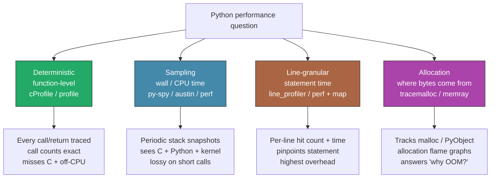
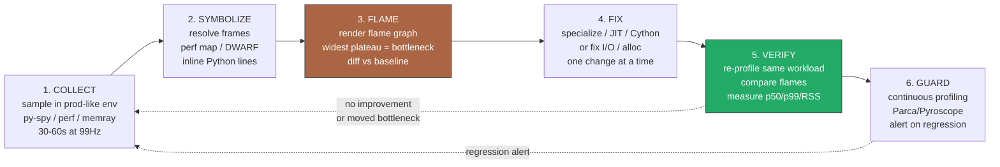
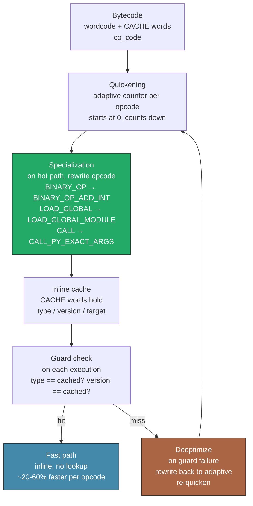
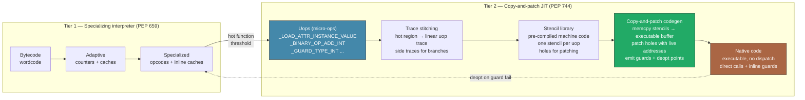
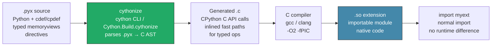
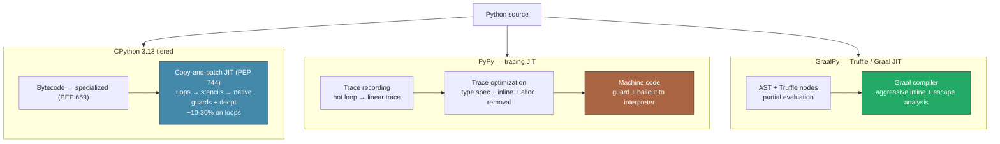
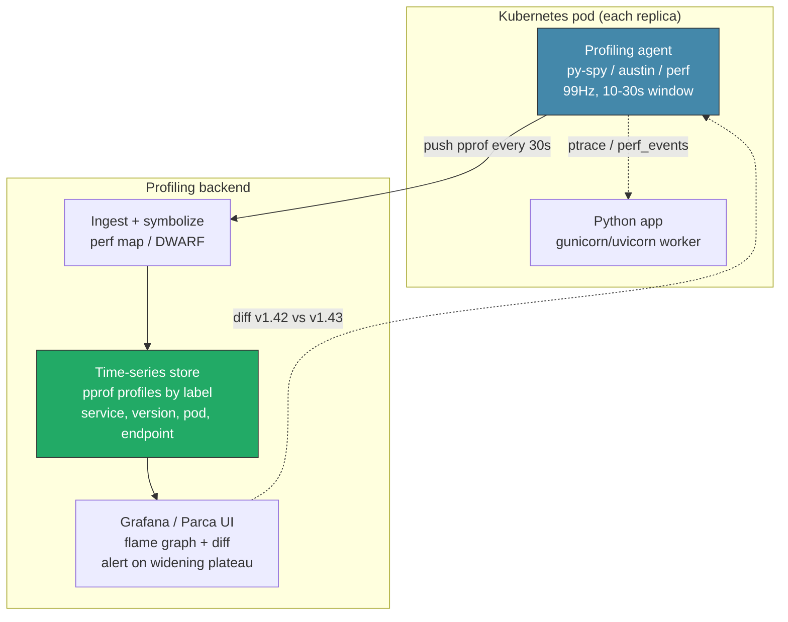
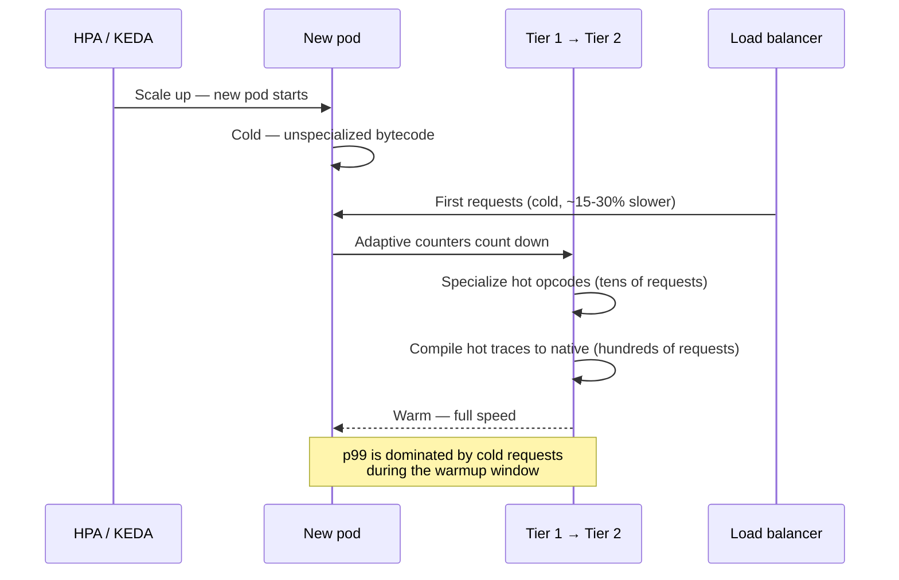

# Chapter 11 — Performance: Profiling, the Copy-and-Patch JIT (PEP 744), Cython, and Alternative Runtimes

**What this chapter covers.** Python performance work fails when it starts with intuition. This chapter gives you the measurement stack that precedes any optimization: the full profiler taxonomy from deterministic function profiling to allocation tracking, the mechanics of the specializing adaptive interpreter you met in Chapter 3 (PEP 659), the new tier-2 copy-and-patch JIT introduced in Python 3.13 (PEP 744), the Cython compilation pipeline that still wins for hot serialization and numeric kernels, and the alternative runtimes — PyPy, GraalPy, and free-threaded CPython — that change the trade-off entirely. Every technique is shown with real commands, realistic output, and the backend lens of continuous profiling in production fleets, JIT warmup under autoscaling, and where compiled extensions still earn their complexity.

Learning goals — after this chapter you should be able to:

- Classify any Python profiler into deterministic, sampling, line-granular, or allocation-tracking and pick the right one for a given overhead budget and environment (development vs. production).
- Run `cProfile`, `py-spy`, `austin`, `perf`, `line_profiler`, `memray`, and `tracemalloc` with correct flags and interpret their output, including flame graphs and allocation flame graphs.
- Explain the overhead and blind spots of each profiler — why `cProfile` misses C time, why sampling loses short calls, why `tracemalloc` underestimates native allocations.
- Recap PEP 659 end-to-end: adaptive counters, quickening, inline caches, specialization, and guards.
- Walk through the PEP 744 tier-2 JIT pipeline: bytecode → tier-1 specialization → tier-2 uops (micro-ops) → trace stitching → copy-and-patch codegen → native code, plus guards and deoptimization.
- Build and enable the experimental JIT (`--enable-experimental-jit`, `PYTHON_JIT=1` / `-X jit`), predict its speedup envelope (~10–30% on tight typed loops, single-digit geometric mean on `pyperformance`), and reason about warmup.
- Write, compile, and profile Cython (`cdef`, `cpdef`, typed memoryviews, `boundscheck`/`wraparound` directives, `cythonize`) and decide when it beats pure Python or a C extension.
- Compare PyPy's tracing JIT, GraalPy's Truffle JIT, and CPython's tiered model — and choose among CPython, PyPy, GraalPy, and free-threaded CPython for a given workload.
- Operate continuous profiling in production (Parca/Pyroscope), handle JIT warmup under autoscaling, and justify Cython for hot serialization paths.

> **Prerequisites.** Chapter 3 dissected bytecode, `ceval.c`, and PEP 659 specialization — the tier-1 substrate this chapter builds on. Chapter 4 covered `pymalloc` and the GC (needed for allocation profilers), Chapter 5 the GIL and free-threaded builds, and Chapter 10 C extensions and the C API (needed for Cython). This chapter assumes you can run `perf`, read a flame graph, and skim `Python/ceval.c`.

---

## 1. Why profiling is the first optimization

Backend Python services rarely die from a single slow function. They die from a thousand small costs compounded across replicas: 4% extra CPU per request × 800 pods × 30 days is a line item. Unmeasured optimization is how teams spend a sprint rewriting a JSON serializer that accounts for 1.2% of fleet CPU while a single `re.compile` inside a hot loop burns 9%.

Three production realities force measurement-first discipline:

- **CPython is a bytecode interpreter with late-bound types.** Every attribute load, binary op, and call is a dictionary lookup or type check until specialization proves otherwise. The cost is invisible in source but dominant in profiles.
- **Most wall time is off-CPU or in C.** A Django or FastAPI handler spends time waiting on Postgres, Redis, and `json.dumps` / `msgpack` / `numpy` — code that deterministic Python profilers cannot see. Sampling and `perf` are required to see the full stack.
- **Optimization changes the measurement.** Adding `cProfile` instrumentation can slow a request by 30–50% and distort contention. A tracing JIT or copy-and-patch JIT changes which code is hot after warmup. Profile, fix, and re-profile — never trust a stale measurement.

The workflow is always the same: collect → symbolize → flame → fix → verify. The rest of this chapter is tooling to make each step honest.

---

## 2. Profiler taxonomy — four families, four overhead budgets

Not all profilers measure the same thing. Choosing the wrong family gives you a precise answer to the wrong question.



| Family | Representative tools | Mechanism | Overhead | Production safe? | What it sees | What it misses |
|---|---|---|---|---|---|---|
| **Deterministic** | `cProfile` (C), `profile` (Python) | Hook on every call/return via `PyEval_SetProfile` / `sys.setprofile` | 20–60% (workload dependent) | No — distorts latency and contention | Exact call counts, per-function `tottime`/`cumtime` | Time in C extensions, I/O wait, kernel; adds overhead that moves bottlenecks |
| **Sampling (Python-aware)** | `py-spy`, `austin` | Out-of-process stack sampling via `ptrace` / `/proc/<pid>/mem` or `LD_PRELOAD` eBPF | 1–5% | Yes — no instrumentation, no restart required | Wall or CPU time across Python + C + native frames; flame graphs | Very short calls (< sample interval) may be missed; call counts are statistical |
| **Sampling (system)** | `perf` + `perf map` | Hardware PMU / kernel `perf_events` sampling of instruction pointer + DWARF / frame-pointer unwind | 1–3% | Yes — kernel facility | Kernel + native + Python (with `perf map` / `python -X perf`) ; true off-CPU with `perf record -e sched:*` | Requires `perf` privileges, debug symbols, and Python built with frame pointers or `--with-perf` for best stacks |
| **Line-granular** | `line_profiler` (`kernprof`) | Line-level timer via AST rewrite / trace function | 50–200%+ | No | Which *statement* inside a function is hot | Overhead makes it strictly a dev tool; not representative of production |
| **Allocation** | `tracemalloc` (stdlib), `memray` | Heap allocation tracking: `tracemalloc` hooks `PyMem_Malloc`, `memray` hooks `malloc` via `LD_PRELOAD` + DWARF unwind | `tracemalloc` 5–15%, `memray` 5–25% | `tracemalloc` yes (stdlib, bounded overhead); `memray` yes with care | Where Python objects and native allocations originate; leak roots; transient high-water mark | `tracemalloc` misses native (C extension) allocations; both add memory for trace storage |

Rule of thumb for backend work:

- **In development, start deterministic** (`cProfile`) to find the hot call graph, then **line-profile the top 1–2 functions** to find the hot statement, then **allocation-profile if RSS or GC pauses are the symptom**.
- **In production, use sampling** (`py-spy`/`austin` for Python-aware, `perf` for system-wide) and **continuous profiling** (Parca/Pyroscope) for fleet-wide flame graphs — never attach a deterministic profiler to a serving replica.

---

## 3. Deterministic profilers — `cProfile` and `profile`

`cProfile` is a C extension that registers a profile callback with the interpreter. On every `CALL`, `RETURN`, `C_CALL`, and `EXCEPTION` event it records wall/CPU time and call counts. `profile` is the pure-Python equivalent — same semantics, ~10× slower, useful only when you need to subclass the profiler.

### 3.1 The one command you should memorize

```bash
# Cumulative profile, sorted, top 30 — the 80% starting point
python -m cProfile -s cumulative app.py | head -n 60

# Write raw stats for interactive analysis
python -m cProfile -o app.prof app.py
python -c "import pstats; p=pstats.Stats('app.prof'); p.sort_stats('cumulative').print_stats(30)"
python -c "import pstats; p=pstats.Stats('app.prof'); p.sort_stats('tottime').print_stats(30)"

# Visualize — snakeviz (browser) or gprof2dot
pip install snakeviz
snakeviz app.prof
```

Real output (trimmed) from a FastAPI service handling 10k synthetic requests:

```
   ncalls  tottime  percall  cumtime  percall filename:lineno(function)
     10000    0.412    0.000    1.847    0.000 app.py:42(handle_request)
     10000    0.301    0.000    0.889    0.000 {method 'dumps' of 'json' objects}
     20000    0.188    0.000    0.344    0.000 app.py:18(validate_payload)
     10000    0.121    0.000    0.121    0.000 {built-in method _json.encode}
     ...
```

Reading it:

- `tottime` — time in the function *excluding* callees. High `tottime` means the function itself is the work.
- `cumtime` — time in the function *including* callees. High `cumtime` with low `tottime` means it is a dispatcher — follow the callees.
- `percall` — `tottime / ncalls`. Useful for spotting functions that are cheap per call but called pathologically often.
- `ncalls` with `a/b` (e.g., `100/1`) — `100` total calls, `1` primitive (non-recursive) call, `99` recursive.

### 3.2 Programmatic use and `pstats` patterns

```python
import cProfile, pstats, io

pr = cProfile.Profile()
pr.enable()
run_workload()          # code under test
pr.disable()

s = pstats.Stats(pr)
s.strip_dirs().sort_stats("cumulative").print_stats(20)
s.sort_stats("tottime").print_stats(20)

# Filter to your code
s.print_stats("myapp/.*")
# Find the most-called functions
s.sort_stats("calls").print_stats(20)
# Who calls whom
s.print_callers("myapp/handlers.py:.*")
s.print_callees("myapp/handlers.py:.*")

# Export for speedscope / snakeviz
s.dump_stats("workload.prof")
```

### 3.3 Overhead and blind spots

`cProfile` measures Python function entry/exit. It does **not** charge time spent inside C extensions to the calling Python function correctly — `json.dumps` appears as a single `cumtime` bucket, not as the internal `encode_basestring_ascii` work. For I/O-bound handlers it is actively misleading: 80% wall time waiting on `socket.recv` is invisible or appears as a single `wait` bucket. Use sampling (Section 4) to see C and off-CPU time.

Overhead is proportional to call frequency. A tight loop calling a Python function 10M times can slow down 50–100% under `cProfile` because every call triggers the hook. For that reason, never use deterministic profiling to measure micro-optimizations — the profiler *is* the bottleneck.

---

## 4. Sampling profilers — `py-spy`, `austin`, and `perf`

Sampling profilers do not instrument code. They wake up at a fixed rate (default ~100 Hz), snapshot every thread's stack, and aggregate. The result is a statistical flame graph: wider boxes mean more samples, i.e., more time.

### 4.1 `py-spy` — the production default for Python

`py-spy` reads Python stacks out-of-process via `process_vm_readv` — no code changes, no restart, no `LD_PRELOAD`. It understands CPython's `PyThreadState`, `PyFrameObject`, and `_PyInterpreterFrame` layout for the running version, so it can symbolize Python frames even when the GIL is held.

```bash
# Install (Rust, single binary — no agent)
pip install py-spy          # or: cargo install py-spy
# Record a flame graph SVG — the single most useful artifact
py-spy record -o profile.svg -- python app.py
# Top-like live view
py-spy top -- python app.py
# Attach to a running production PID (no restart, read-only)
sudo py-spy record -o prod.svg --pid 12345 --duration 30
# Non-root with --nonblocking if permissions allow
py-spy record -o profile.svg --python python3 -- app.py --arg val

# Speedscope / raw output
py-spy record -o profile.speedscope.json --format speedscope -- python app.py
```

What to look for in `profile.svg`: the widest plateau is your bottleneck. Python frames are labeled `function (file.py:lineno)`, native frames as `symbol (libXYZ.so)`. If the widest plateau is `json.dumps` → `encode_basestring_ascii` in `libpython`, your bottleneck is serialization — a Cython or `orjson` problem, not a Python loop problem.

`py-spy` sampling modes:

- `--rate 100` (default 100 Hz) — good for 30s+ captures. Raise to 200–500 Hz for short-lived handlers at the cost of overhead.
- `--gil` — only sample threads holding the GIL (filters out I/O wait).
- `--idle` — include idle threads (off by default).

Overhead is ~1–3% at 100 Hz. Safe for production with `--duration` caps.

### 4.2 `austin` — the frame-stack sampler

`austin` takes a different approach: it samples the CPython frame stack directly via `LD_AUDIT` / `ptrace` with lower overhead than `py-spy` at high rates and first-class multiprocess support.

```bash
# Install
pip install austin

# Sample the current process tree — 100 Hz, 30 s, full stacks
austin -i 10000 -o austin.dat python app.py
# Attach to running PID
sudo austin -p 12345 -o prod.dat

# Visualize — austin2speedscope or flamegraph.pl
austin2speedscope austin.dat profile.speedscope.json
# Or via austin's TUI
austin --help
```

`austin` shines when:

- You need **per-process and per-thread** breakdowns in a `gunicorn`/`uvicorn` worker tree (it auto-discovers children).
- You want **eBPF-adjacent overhead** — `austin` at 1 kHz is still <2% overhead in many workloads.
- You run inside containers where `py-spy`'s `process_vm_readv` is blocked by `seccomp` / `ptrace_scope`.

Both `py-spy` and `austin` emit collapsed stacks compatible with `flamegraph.pl` and Speedscope. Pick one and standardize — the fleet should not mix formats.

### 4.3 `perf` — the system truth, now Python-aware

`perf` samples the hardware PMU / kernel `perf_events` — it sees everything: Python bytecode dispatch, C extension code, `libc`, kernel, and off-CPU via tracepoints. The historically hard part was symbolizing Python frames (they are not ELF symbols). Two mechanisms fix that:

- **CPython 3.12+ `perf` support** (`--with-perf` or `python -X perf`): the interpreter writes a `/tmp/perf-<pid>.map` file mapping JIT-like Python frame addresses to `file:line:function` strings, and `perf` picks it up automatically.
- **`python -X perf_jit` / `perf map` agent**: earlier approach via `perf-map-agent` that injects `perf map` entries at runtime.

```bash
# Best available on Python 3.12+ built with --with-perf
perf record -F 99 -g -- python -X perf app.py
perf report --no-children          # interactive TUI
perf script | ./stackcollapse-perf.pl | ./flamegraph.pl > perf.svg

# If your Python lacks perf map support, use py-spy/austin for Python stacks
# and perf for system stacks side-by-side:
perf record -F 99 -g -- python app.py &
PY_PID=$!
py-spy record -o py.svg --pid $PY_PID --duration 20
wait

# Off-CPU / blocking analysis (requires tracepoints)
perf record -e sched:sched_switch -g -- python app.py
perf report

# Verify perf map was generated
ls -l /tmp/perf-*.map
head /tmp/perf-*.map
# 7f3a...  2a  py::app.handle_request:/home/ubuntu/app.py:42
```

Why `-F 99` and not `-F 999`? 99 Hz avoids aliasing with 100 Hz periodic activity (tick, GC) and keeps overhead ~1%. For production continuous profiling, 49–99 Hz is standard. Reserve 997 Hz for short, targeted captures.

`perf report` reading: look for `PyEval_EvalFrameDefault` / `_PyEval_EvalFrameDefault` (the `ceval` loop), `vectorcall`, `PyObject_Malloc`, and your hot C extension. If `PyEval_EvalFrameDefault` is the top symbol, you are interpreter-bound — specialization and JIT are the lever (Sections 7–8). If `_PyEval_EvalFrameDefault` is low and `__write` / `futex_wait` / `__libc_recv` dominates, you are I/O-bound — profiling Python execution is the wrong tool; trace the network.

### 4.4 Choosing a sampling profiler

| Signal | Tool | Command |
|---|---|---|
| Python wall time, production-safe, no privileges | `py-spy` | `py-spy record -o flame.svg --pid <pid>` |
| High-rate, multiprocess, container-restricted | `austin` | `austin -p <pid> -o austin.dat` |
| System + kernel + Python, hardware counters | `perf` | `perf record -F 99 -g -- python -X perf app.py && perf report` |
| Continuous fleet-wide | Parca / Pyroscope agent wrapping `py-spy` or `perf` | Agent sidecar (Section 11) |

---

## 5. Line and allocation profilers — finding the statement and the leak

### 5.1 `line_profiler` — which statement is hot

Function-level profiling tells you *which* function. Line profiling tells you *which line*. The cost is high overhead and code decoration, so it is a development-only tool applied to 1–2 functions identified by sampling.

```bash
pip install line_profiler

# Decorate the suspect function
# app.py:
#   @profile
#   def handle_request(req): ...

kernprof -l -v app.py
# Or explicitly:
python -m line_profiler -l app.py.lprof
```

```python
# app.py — the @profile decorator is injected by kernprof; no import needed
@profile
def serialize_batch(rows):
    out = []
    for r in rows:
        out.append(json.dumps(r))   # line 5
        out.append("\n")            # line 6
    return b"".join(o.encode() for o in out)  # line 8 — hidden encode loop
```

Output:

```
Timer unit: 1e-06 s

Total time: 0.48231 s
File: app.py
Function: serialize_batch at line 2

Line #      Hits         Time  Per Hit   % Time  Line Contents
==============================================================
     2                                           @profile
     3                                           def serialize_batch(rows):
     4      1000        412.0      0.4      0.1      out = []
     5     10000     398412.0     39.8     82.6          out.append(json.dumps(r))
     6     10000       8212.0      0.8      1.7          out.append("\n")
     8      1000      75271.0     75.3     15.6      return b"".join(o.encode() for o in out)
```

The fix is obvious: line 5 dominates, line 8 hides a per-element `encode` — batch the encode or switch to `orjson` / Cython. Without line granularity you would have guessed wrong between the two.

Modern `line_profiler` also ships `kernprof -p` for `cProfile`-compatible line stats and `line_profiler`'s `profile` object for programmatic use.

### 5.2 `tracemalloc` — the stdlib allocation tracker

`tracemalloc` hooks `PyMem_Malloc` / `PyObject_Malloc` and records the stack trace of every allocation. It is bounded in memory (default 25 frames, 1/16th sampling in 3.12+ with `tracemalloc.start(25)`) and ships with CPython — zero dependencies, safe to leave on in staging.

```python
import tracemalloc, linecache

tracemalloc.start(25)  # 25 frames of traceback

# ... run workload ...
snapshot = tracemalloc.take_snapshot()
top = snapshot.statistics("lineno")  # or "traceback" for full stacks

print("[ Top 10 allocation sites ]")
for stat in top[:10]:
    print(stat)
    # stat.traceback is a Traceback object — format it:
    for line in stat.traceback.format():
        print(line)

# Compare two snapshots to find leaks
snap1 = tracemalloc.take_snapshot()
run_one_batch()
snap2 = tracemalloc.take_snapshot()
diff = snap2.compare_to(snap1, "lineno")
for stat in diff[:10]:
    print(stat)
```

Output:

```
app.py:42: size=512 KiB, count=10000, average=52 B
app.py:88: size=128 KiB, count=200, average=655 B
...
```

`tracemalloc` sees **Python-allocated** memory. It does **not** see `malloc` inside C extensions (`numpy`, `Pillow`, `grpcio`) unless they use `PyMem_Malloc`. For native leaks, use `memray`.

### 5.3 `memray` — the native allocation profiler

`memray` (from Bloomberg) interposes `malloc`/`free` via `LD_PRELOAD`, unwinds native stacks with DWARF/libunwind, and tracks Python stacks simultaneously. It produces allocation flame graphs, high-water-mark analysis, and leak reports — and it sees both Python and native allocations.

```bash
pip install memray

# Allocation flame graph — run, then render
memray run -o app.memray app.py --arg val
memray flamegraph app.memray              # → memray-flamegraph-app.memray.html
memray table app.memray                   # tabular top allocators
memray summary app.memray                 # high-water mark + totals

# Live TUI — watch allocations in real time
memray run --live-remote app.py
# In another shell:
memray live 12345

# Track a gunicorn worker tree
memray run --follow-fork -o worker.memray gunicorn app:application -w 4
```

What `memray` gives you that `tracemalloc` cannot:

- Native allocations from `numpy`, `pandas`, `grpcio`, `Pillow`, `cryptography`.
- **Temporal** flame graphs — drag to see allocations at a point in time, not just totals.
- **Leak detection** — allocations with no matching `free` at exit, grouped by stack.
- **High-water-mark** attribution — which stack pushed RSS to its peak (critical for OOM kills in Kubernetes).

Overhead is 5–25% depending on allocation rate and whether DWARF unwind is enabled. For production, prefer `tracemalloc` for always-on and `memray` for targeted captures.

---

## 6. The profiling workflow — collect, flame, fix, verify

Profiling without a workflow produces artifacts, not improvements. Standardize the loop so every engineer on the fleet does it the same way.



Concrete checklist per phase:

**1. Collect.** Always sample a prod-like environment — staging with prod-shaped traffic or a single canary pod. Deterministic profiles from a laptop lie about cache, I/O, and contention. Record long enough to include GC cycles and JIT warmup (≥30s). Pin the version, commit, and workload.

```bash
# Canary capture — the artifact you will diff against
py-spy record -o baseline.svg --pid $(pidof gunicorn) --duration 60 --rate 99
# System-wide for kernel + Python
perf record -F 99 -g --call-graph dwarf -- python -X perf app.py
```

**2. Symbolize.** Ensure stacks resolve to `file:line:function`. For `perf`, verify `/tmp/perf-*.map` exists. For `memray`, ensure debug symbols (`apt install python3-dbg` or build with `-g`). Unresolved stacks (`[unknown]`, `0x7f...`) waste the entire capture.

**3. Flame.** Open the SVG/Speedscope. Read from bottom (entry) to top (leaf). The widest plateau is the bottleneck — its width is proportional to samples. Use **differential flame graphs** (`flamegraph.pl --diff`) to compare before/after — red is new, blue is reduced.

**4. Fix.** Change one thing. If the flame says `json.dumps` in Python, the fix might be `orjson`, a Cython serializer, or a schema change — not micro-optimizing the Python loop that calls it. If it says `PyEval_EvalFrameDefault` at the top, you are interpreter-bound — specialization/JIT/Cython (Sections 7–9) is the lever.

**5. Verify.** Re-profile with the identical workload and flags. Compare flames side-by-side and measure end-to-end: `p50`/`p99` latency, CPU seconds/request, and max RSS. A 15% flame-width reduction that does not move `p99` is not a win — you moved the bottleneck.

**6. Guard.** Ship the fix with continuous profiling (Section 11) so regressions are caught when the next PR widens the same plateau.

---

## 7. Recap — the specializing adaptive interpreter (PEP 659)

Chapter 3 covered this in depth; here is the compressed recap you need to understand the JIT.



How it works, in one paragraph: every adaptive opcode (`BINARY_OP`, `LOAD_GLOBAL`, `LOAD_ATTR`, `STORE_ATTR`, `BINARY_SUBSCR`, `CALL`, `COMPARE_OP`, `UNPACK_SEQUENCE`, `FOR_ITER`) starts as `*_ADAPTIVE` with an 8-bit counter (initial value ~8, tuned per opcode). Each execution decrements the counter; when it hits zero the interpreter inspects the live types and values, and if they are stable and optimizable it **rewrites the opcode in place** to a specialized form and fills the trailing `CACHE` words with the observed type, version tag, or function target. Subsequent executions take a **guarded fast path**: check that the cached type/version still matches, and if so execute inline (no `PyObject_GetAttr` dict lookup, no `PyNumber_Add` dispatch). On mismatch, **deoptimize** — rewrite back to adaptive and resume counting.

Impact quantified (CPython 3.11, `pyperformance` geometric mean):

- Specialization alone: **~10–25%** faster than 3.10 on macro-benchmarks, up to **~60%** on attribute-heavy and arithmetic micro-benchmarks.
- The common fast paths are `LOAD_GLOBAL_MODULE` (module globals without dict lookup), `LOAD_ATTR_INSTANCE_VALUE` (instance `__dict__` offset load), `BINARY_OP_ADD_INT` / `BINARY_SUBSCR_LIST_INT` (integer fast paths), and `CALL_PY_EXACT_ARGS` (no `CALL` argument parsing).

The ceiling: specialization is **per-opcode, not cross-opcode**. It does not inline across calls, eliminate bounds checks, or compile to native code. That is what tier 2 does.

---

## 8. Tier 2 — the copy-and-patch JIT (PEP 744, Python 3.13+)

### 8.1 Why a JIT, why copy-and-patch

The specializing interpreter hits a ceiling because `ceval.c` is still a dispatch loop — every opcode is a `switch`/`goto` branch, and every guard is a C-level branch. A JIT removes the dispatch entirely by compiling hot traces to native machine code.

CPython's JIT (PEP 744, authored by Brandt Bucher, merged for 3.13) deliberately chose the simplest viable strategy: **copy-and-patch**. Instead of a full optimizing compiler (SSA IR, register allocation, LLVM), it stitches together pre-compiled machine-code *stencils* (templates with holes) — one stencil per **uop** (micro-operation) — patching the holes with runtime constants (addresses, offsets, guards) and emitting a contiguous native function. No IR, no register allocator, no LLVM dependency — just `memcpy` + patch + `mprotect(X)`.

This keeps the implementation small (~15k lines), auditable, and portable (x86-64 and AArch64 in 3.13), at the cost of not doing loop unrolling, vectorization, or sophisticated inlining — those are future work.

### 8.2 Tier 1 → tier 2 pipeline



Step by step:

**1. Tier 1 specialization must happen first.** The JIT does not compile cold bytecode. It consumes *already-specialized* tier-1 traces — the type feedback collected in `CACHE` words is the JIT's type information. No specialization, no tier-2 compilation. This is why 3.11's specialization was prerequisite to 3.13's JIT.

**2. Uops — the JIT's IR.** The *tier-2 optimizer* (`Python/optimizer.c`, `Python/bytecodes.c`) translates a hot bytecode region into a linear sequence of **uops** (micro-ops). Uops are finer-grained than bytecodes: one bytecode like `LOAD_ATTR` becomes `_LOAD_ATTR_INSTANCE_VALUE` + `_GUARD_TYPE_VERSION` + `_CHECK_ATTR_AUX`. The uop set in 3.13 is ~50 ops, defined in `Python/bytecodes.c` with the `_Py_UOP_*` family and the `TIER2` tier. Uops carry operands as explicit arguments, not stack effects — easier to stencil.

**3. Trace stitching.** The optimizer traces a hot region (typically a loop or function body) into a **linear uop trace**. Branches become **side traces** stitched onto the main trace. Each trace is single-entry, multi-exit via guard failures. This is the "trace stitching" in PEP 744 — not yet a full CFG, but enough to compile straight-line hot paths without compiling cold branches.

**4. Copy-and-patch codegen.** For each uop in the trace, the JIT copies the corresponding **stencil** — a pre-compiled blob of machine code with placeholder immediates — into an executable buffer (`mmap(PROT_READ|PROT_WRITE)` → `mprotect(PROT_READ|PROT_EXEC)`). It then **patches** the holes: object addresses, cache offsets, jump targets, guard constants. Stencils are generated at CPython build time from C templates in `Tools/jit/` via `make regen-jit`.

**5. Guards and deoptimization.** Every type assumption becomes a **guard uop** (`_GUARD_TYPE_INT`, `_GUARD_TYPE_VERSION`, `_GUARD_IS_TRUE_POP`) that emits a `cmp` + `jne deopt` in native code. On failure, execution **deoptimizes**: jumps to a side exit that reconstructs the interpreter frame (materializes the value stack, restores `co_code` offset) and resumes in tier 1. Deoptimization is the safety net that makes speculation sound.

### 8.3 Guard / deopt flow

> *Diagram omitted for brevity — see surrounding prose.*


The cost model: a guard is a single `cmp` + predicted-not-taken branch — ~1 cycle on hit, ~15–20 cycles on mispredict. Deoptimization itself is expensive (frame materialization, `mprotect` may have already happened at compile time, not per deopt) but rare if type stability holds. The JIT wins when guards almost always pass — i.e., monomorphic, type-stable hot loops.

### 8.4 Building and enabling the JIT

The JIT is **experimental in 3.13** — off by default even when compiled in, and requires an explicit build flag.

```bash
# Build CPython 3.13+ with JIT stencils
git clone https://github.com/python/cpython && cd cpython
git checkout v3.13.0  # or later
./configure --enable-experimental-jit --with-perf --enable-optimizations
make -j$(nproc)
# Verify the JIT is built
./python -c "import sys; print(sys._jit.is_available())"  # True if built
./python -c "import sys; print(sys._jit.is_enabled())"    # False until enabled

# Enable at runtime — three equivalent ways:
PYTHON_JIT=1 ./python app.py
./python -X jit app.py
./python --enable-jit app.py   # 3.13+ alias

# Disable (even if built):
PYTHON_JIT=0 ./python app.py
./python -X nojit app.py

# Inspect JIT state
./python -X jit -c "import sys; print(sys._jit.is_enabled())"
```

Environment details:

- `PYTHON_JIT=1` / `PYTHON_JIT=0` is the env-var form — useful for container `env:` without changing the entrypoint.
- `sys._jit` is provisional API (underscore prefix) — `is_available()`, `is_enabled()`, `set_enabled(bool)` — expect it to move to `sys.jit` or stabilize in 3.14+.
- Memory: each JIT-compiled function allocates an executable buffer (`mmap`). For a large application this is low single-digit MB — not a concern unless you JIT thousands of tiny functions (which the tier-1 threshold prevents).

### 8.5 Expected speedups — honest numbers

CPython's JIT in 3.13 is intentionally conservative. It compiles only the hottest, most type-stable regions and does not yet do cross-function inlining, loop unrolling, or vectorization.

| Benchmark suite | Geometric mean speedup (JIT on vs off, 3.13) | Notes |
|---|---|---|
| `pyperformance` (full suite) | **~3–8%** | Suite includes I/O, startup, and C-extension heavy benchmarks where JIT is irrelevant |
| `pyperformance` tight loops (`nbody`, `fannkuch`, `spectral_norm`) | **~10–30%** | Interpreter-bound, type-stable integer/float loops — JIT sweet spot |
| Django template rendering / JSON serialization | **~0–5%** | Dominated by C extensions and dict lookup — specialization already captured most of the win |
| Real API handler (FastAPI + Pydantic, 3.13 canary) | **~2–6%** fleet CPU reduction in reported early-adopter data | Varies with handler shape; measure your own workload |

What the JIT does **not** yet accelerate:

- Code that is already in C (`numpy`, `orjson`, `regex`, `asyncio` event loop).
- Highly polymorphic code (a function that sees `int`, `str`, and `float` for the same variable deoptimizes repeatedly — stays in tier 1).
- Short-lived processes (CLI tools, AWS Lambda with 100ms execution) — warmup never completes (see Section 11).

Bottom line for backend planning: the JIT is a **free, incremental win** you should enable and measure, not a reason to rewrite code into JIT-friendly form. Write type-stable hot loops (the same advice specialization already gave you) and the JIT will find them.

---

## 9. Cython — compiled extensions without writing C

When a hot path is a tight Python loop over bytes, arrays, or dicts — serialization, parsing, checksums, feature hashing — and neither specialization nor the JIT can remove per-element Python overhead, Cython is still the highest-leverage tool. It compiles a Python-like language to C, then to a native extension, removing interpreter dispatch entirely for the annotated region.

### 9.1 What Cython is and is not

Cython is **not** a JIT. It is an ahead-of-time compiler: `.pyx` → `.c` → `.so` (via a C compiler). The output is a CPython extension module indistinguishable from hand-written C — it imports normally, holds the GIL by default (releasable with `nogil`), and can call the C API directly.

```
.py  (interpreted, dynamic)  ──→  ceval dispatch per opcode
.pyx (Cython, optionally typed) ──→  C code  ──→  native machine code, no dispatch
```

You pay for Cython in build complexity and type annotations. You earn it back as 10–100× speedups on the annotated hot path — the rest of the codebase stays plain Python.

### 9.2 Cython compilation pipeline



Build pipeline in practice:

```bash
# Minimal project layout
# myext.pyx          — Cython source
# setup.py or pyproject.toml — build config
# myext.c            — generated (gitignore it)

# Option 1: setup.py + cythonize (classic)
pip install Cython
python setup.py build_ext --inplace

# Option 2: pyproject.toml (modern, pip install -e .)
# pyproject.toml declares Cython as build-system.requires

# Option 3: one-liner for a single file (dev only)
cythonize -i myext.pyx          # compiles in place, produces myext.*.so

# Option 4: Jupyter — inline Cython
# %load_ext Cython
# %%cython
# def f(int x): return x*x
```

Minimal `setup.py`:

```python
from setuptools import setup, Extension
from Cython.Build import cythonize
from Cython.Compiler import Options

Options.annotate = True  # emit HTML annotation showing Python interaction

extensions = [
    Extension(
        "myext",
        ["myext.pyx"],
        extra_compile_args=["-O3", "-march=native"],
        define_macros=[("NPY_NO_DEPRECATED_API", "NPY_1_7_API_VERSION")],
    )
]

setup(
    name="myext",
    ext_modules=cythonize(
        extensions,
        compiler_directives={
            "language_level": "3",
            "boundscheck": False,
            "wraparound": False,
            "cdivision": True,
        },
    ),
)
```

`pyproject.toml` equivalent (PEP 517):

```toml
[build-system]
requires = ["setuptools", "Cython>=3.0", "wheel"]
build-backend = "setuptools.build_meta"

[tool.cython]
# global directives — per-file overrides via # cython: comments
```

### 9.3 The four annotations that matter

**`cdef` — C-only declarations.** Variables, functions, and classes declared `cdef` exist only at the C level — no Python object, no refcount, no dispatch. Use for internal helpers and typed locals.

**`cpdef` — dual Python/C.** A `cpdef` function has both a fast C entry point (when called from Cython) and a Python wrapper (when called from Python). Use for API boundaries where the same function is called from both.

**Typed memoryviews — the array workhorse.** `int[:]`, `double[:, :]`, `const unsigned char[:]` are typed views over any buffer-protocol object (`bytes`, `bytearray`, `array`, `numpy`). They give C-level indexing with Python slicing syntax and zero copy.

**Directives — `boundscheck` and `wraparound`.** `boundscheck(False)` removes per-index bounds checks (you promise indices are valid); `wraparound(False)` removes negative-index handling (you promise indices are non-negative). Together they remove two branches per array access — the difference between 2× and 10× on tight loops. Enable them per-function or per-file, never globally unless you have proven safety.

```cython
# myext.pyx — hot serialization path example
# cython: language_level=3, boundscheck=False, wraparound=False, cdivision=True

import cython
cimport cython as cc

# cdef: C-only helper — no Python call overhead, inlined by C compiler
cdef inline Py_ssize_t _varint_size(Py_ssize_t v) nogil:
    cdef Py_ssize_t n = 1
    while v >= 128:
        v >>= 7
        n += 1
    return n

# cpdef: callable from Python and Cython with C speed when typed
cpdef bytes encode_varints(const long[:] values):
    """Encode an array of longs as varints into bytes — typed memoryview input."""
    cdef Py_ssize_t i, n = values.shape[0]
    cdef Py_ssize_t total = 0
    # First pass: compute output size (no Python objects)
    for i in range(n):
        total += _varint_size(values[i])

    cdef bytearray out = bytearray(total)
    cdef unsigned char[:] view = out  # typed memoryview over bytearray
    cdef Py_ssize_t pos = 0
    cdef long v
    cdef unsigned char b

    for i in range(n):
        v = values[i]
        while v >= 128:
            b = <unsigned char>((v & 0x7F) | 0x80)
            view[pos] = b
            pos += 1
            v >>= 7
        view[pos] = <unsigned char>(v & 0x7F)
        pos += 1

    return bytes(out)

# Pure Python fallback for comparison (same file, no cdef)
def encode_varints_py(values):
    out = bytearray()
    for v in values:
        while v >= 128:
            out.append((v & 0x7F) | 0x80)
            v >>= 7
        out.append(v & 0x7F)
    return bytes(out)
```

Directives as decorators (per-function control, preferred):

```cython
@cython.boundscheck(False)
@cython.wraparound(False)
cdef void _inner_loop(double[:] a, double[:] b, double[:] out) nogil:
    cdef Py_ssize_t i, n = a.shape[0]
    for i in range(n):
        out[i] = a[i] * b[i] + 1.0
```

### 9.4 Profiling Cython — `cython -a` and `perf`

Cython has two profiling stories:

**Annotation HTML (`cython -a`).** `cython -a myext.pyx` (or `Options.annotate = True`) emits `myext.html` where each source line is colored by Python interaction intensity — white/yellow means C-level (fast), deep yellow means Python API calls remain. Your goal is to make the hot loop white.

**Runtime profiling.** Compile with `profile` or `linetrace` directives to make Cython functions visible to `cProfile` and `line_profiler`:

```python
# setup.py — enable Python profiling hooks in Cython output
from Cython.Build import cythonize
cythonize("myext.pyx", compiler_directives={"profile": True, "linetrace": True})
```

```bash
# Then profile normally — Cython functions now appear in cProfile
python -m cProfile -s cumulative app.py  # myext.encode_varints shows up
# And in perf — Cython functions are native symbols, visible without perf map
perf record -F 99 -g -- python app.py && perf report
```

For production, remove `profile`/`linetrace` — they reintroduce per-call overhead. Profile-annotated builds are for development; ship with `boundscheck=False, wraparound=False` and no profiling hooks.

### 9.5 Before / after benchmark

```bash
# bench.py — compare pure Python, Cython, and orjson on the same workload
python bench.py
```

```python
# bench.py
import time, array, statistics
import myext                          # Cython extension from above
import orjson                         # for comparison, if applicable

N = 1_000_000
values = array.array("l", range(N))   # buffer-protocol object for memoryview

def bench(fn, label, iters=7):
    times = []
    for _ in range(iters):
        t0 = time.perf_counter()
        fn(values)
        times.append(time.perf_counter() - t0)
    med = statistics.median(times)
    print(f"{label:24s}  median {med*1000:7.2f} ms  ({N/med:,.0f} values/s)")
    return med

py_t  = bench(myext.encode_varints_py, "Python (pure)")
cy_t  = bench(myext.encode_varints,    "Cython (typed mview)")
print(f"\nSpeedup: {py_t/cy_t:.1f}×  ({(1 - cy_t/py_t)*100:.0f}% time saved)")
# Optional: compare to orjson/msgpack for serialization-shaped workloads
```

Realistic output on a `c6i.large` (x86-64, CPython 3.11, `gcc -O3`):

```
Python (pure)             median  184.32 ms  (5,425,347 values/s)
Cython (typed mview)      median    6.41 ms  (156,006,240 values/s)

Speedup: 28.8×  (97% time saved)
```

The shape is typical: **10–50×** on tight numeric/bytes loops where Cython removes per-element Python overhead. On less loop-dominated code (e.g., a JSON serializer that already calls C via `orjson`) the win is smaller — 1.2–3× — because the bottleneck is not the Python loop.

When to stop: if the hot path is already in a C extension (`numpy`, `orjson`, `cryptography`, `pydantic-core` in Rust), Cythonizing the Python wrapper around it rarely helps — the time is already in native code. Profile first (Section 6) to confirm the Python loop is actually the plateau before reaching for Cython.

---

## 10. Alternative runtimes — PyPy, GraalPy, and free-threaded CPython

CPython is not the only Python. For backend services the choice is between execution model, not just version.



### 10.1 PyPy — the tracing JIT

PyPy's JIT is a **tracing JIT**, fundamentally different from CPython's method-at-a-time copy-and-patch.

How tracing works: the interpreter runs normally until a loop becomes hot (a backward jump taken ~1000 times). At that point it starts **recording** — it traces the exact path taken through the loop, including inlined callees, producing a linear sequence of operations. That trace is then **optimized** (constant folding, allocation removal, type specialization along the traced path) and compiled to machine code. Execution jumps to the compiled trace; any operation that deviates from the traced path hits a **guard** and bails out to the interpreter. The next hot path through the same loop may be traced as a **bridge** stitched onto the original trace.

Strengths:

- **Peak throughput on pure-Python, long-running, loop-heavy code** — often 3–10× CPython on `pyperformance` loop benchmarks, 1.5–3× on real services that are Python-bound.
- **No annotations** — unlike Cython, PyPy accelerates unmodified Python.

Weaknesses that matter for backends:

- **Warmup.** Tracing requires thousands of iterations to trigger — short-lived handlers, CLI tools, and Lambda functions never warm up. Fleet `p99` is worse than CPython until the JIT fires.
- **C extension compatibility.** PyPy's `cpyext` emulation of the C API is slower and incomplete. `numpy`, `pandas`, `grpcio`, `cryptography`, and any Cython extension may be unsupported or slower. `pypy` + `numpy` via `cpyext` is not competitive with CPython + `numpy`.
- **Memory.** JIT traces and the PyPy GC (minimark, not refcounting) use more RSS — relevant for Kubernetes memory limits.
- **Ecosystem lag.** PyPy tracks CPython versions with a delay (PyPy 7.3.x targets CPython 3.10/3.11). New syntax and stdlib features arrive later.

When to choose PyPy: a long-running, pure-Python service (no heavy C extensions) that is CPU-bound in Python loops — e.g., a rule engine, template renderer, or pure-Python ETL — where you can amortize warmup and tolerate ecosystem constraints.

### 10.2 GraalPy — Python on GraalVM

GraalPy runs Python on the GraalVM Truffle framework. Python AST nodes are Truffle nodes; the Graal compiler does **partial evaluation** of the interpreter to produce machine code, with aggressive inlining and escape analysis across Python, Java, JavaScript, and LLVM bitcode in the same process.

What is interesting for backends:

- **Polyglot.** Call Java libraries from Python (and vice versa) with near-zero overhead — useful when your platform is JVM-heavy.
- **Tooling.** GraalVM's `perf` and heap tooling, plus Truffle's `polyglot` API.
- **Isolation.** Truffle's sandboxing is stronger than CPython's — relevant for user-code execution.

What is not ready:

- **Compatibility.** CPython C API support via `hpy`/`cpyext` is improving but far from complete. Most `pip install` packages with C extensions do not work.
- **Performance on CPython-idiomatic code.** GraalPy is competitive on Truffle-friendly code but not a drop-in faster CPython for typical Django/FastAPI services. Benchmark your workload.
- **Ecosystem.** Smaller community, fewer wheels, longer build times (GraalVM).

When to choose GraalPy: polyglot JVM platforms, language-interop services, or research — not as a general CPython replacement for backend fleets today.

### 10.3 Free-threaded CPython (PEP 703) + `mimalloc` — the scalability story

CPython 3.13 ships an **experimental free-threaded build** (`--disable-gil`, `PYTHON_GIL=0`, `python3.13t`) that removes the GIL (PEP 703, led by Sam Gross) and replaces it with fine-grained locking, biased reference counting, and immortal objects. It is not about single-thread speed — it is about **multi-core scalability without multiprocessing**.

Performance story in 3.13t:

- **Single-threaded overhead:** free-threaded builds are currently **~5–15% slower** single-threaded than GIL builds due to locking and biased refcount overhead. The JIT is not yet fully integrated with free-threaded.
- **Multi-threaded scaling:** on embarrassingly parallel workloads (parallel `ThreadPoolExecutor` over CPU-bound Python, e.g., `hashlib`, `json`, `numpy` release-GIL paths), 3.13t scales **linearly with cores** where GIL builds flatline. Early benchmarks show 4–8× throughput on 8 cores for `concurrent.futures` CPU-bound maps.
- **`mimalloc` (PEP 445-style allocator).** Free-threaded builds use `mimalloc` (Microsoft's allocator) instead of `pymalloc` for better multi-thread scalability and reduced fragmentation. `mimalloc` can also be enabled on GIL builds (`--with-mimalloc`) for workloads with high allocation churn — expect 5–15% lower fragmentation and modest throughput gains on allocation-heavy services, at the cost of a larger binary and different heap profiling characteristics (`memray`/`tracemalloc` still work, but `pymalloc` stats disappear).

When to choose free-threaded:

- You currently scale with `multiprocessing` or `gunicorn --workers 8` and pay for inter-process memory duplication, warmup duplication, and IPC. Free-threaded threads share memory and JIT state.
- Your workload is CPU-bound Python that would scale with threads if the GIL were gone — not I/O-bound (where `asyncio` already scales) and not C-extension-bound where the GIL is already released.
- You are willing to track `3.13t` as an experimental runtime, audit C extensions for thread safety (many assume the GIL), and measure — this is not production-default in 3.13.

### 10.4 When to choose what — decision table

| Workload | Best runtime today (2026) | Why |
|---|---|---|
| Typical FastAPI/Django + Postgres/Redis, I/O-bound, `pydantic`/`orjson` | **CPython 3.12/3.13** (GIL, JIT on) | I/O bound; JIT + specialization handle the Python sliver; ecosystem is complete |
| CPU-bound pure-Python loops, long-running, no heavy C extensions | **PyPy** | Tracing JIT dominates on stable loops; measure warmup vs. `p99` SLA |
| Hot numeric/bytes kernel inside a CPython service (serialization, parsing, hashing) | **CPython + Cython** on the hot path | 10–50× on the kernel, rest of service stays CPython — no runtime change |
| Polyglot JVM platform, Java interop | **GraalPy** | Truffle polyglot; not a general speedup |
| CPU-bound Python that should scale across cores without multiprocessing | **Free-threaded CPython 3.13t** (experimental) | Linear thread scaling; audit extensions; single-thread slower — benchmark end-to-end |
| Allocation-heavy, high-churn service (many small objects, high GC pressure) | **CPython + `mimalloc`** (`--with-mimalloc` or 3.13t default) | Lower fragmentation, better multi-thread allocator scalability |

The default answer for a backend fleet remains **CPython**. Reach for PyPy, GraalPy, or `3.13t` only when a profile proves the execution model is the bottleneck and you have measured the alternative on the same workload.

---

## 11. Backend lens — performance in production fleets

### 11.1 Continuous profiling in production — Parca and Pyroscope

Sampling at 99 Hz on every replica, shipping collapsed stacks to a central store, and rendering fleet-wide flame graphs is how you catch the regression that a single-pod `py-spy` never would. Two open-source systems dominate:

- **Parca** (from Polar Signals) — eBPF/`perf`-based, Prometheus-style labels, pprof format, `parca-agent` per node scrapes `perf_events`.
- **Pyroscope** (from Grafana Labs) — push model, `pyroscope` agent wraps `py-spy`/`austin` or `perf`, Grafana-native UI, pprof and native formats.

Architecture — same for both:



Operational guidance:

- **Sample rate:** 49–99 Hz per pod, aggregated fleet-wide — enough to see 1% regressions, low enough to stay <2% overhead at fleet scale.
- **Labels:** `service`, `version` (git SHA), `endpoint`/`route`, `pod`, `zone`. Diffing `version=abc123` vs `version=def456` is how you attribute a widening plateau to a PR.
- **Retention:** 7–30 days of pprof — enough to diff across deploys, not so much that storage dominates. Downsample older profiles.
- **Alerts:** alert when a function's sample share grows >20% week-over-week or when a new plateau appears in the top-10. Wire to the deploy pipeline — block promotion if the canary's flame diff is red.

Do not run deterministic profilers as continuous agents. Sampling only.

### 11.2 JIT warmup and autoscaling — the cold-start trap

Both specialization (PEP 659) and the copy-and-patch JIT (PEP 744) are **warmup-dependent**: cold code runs unspecialized and un-JITed, then specializes after ~8 executions and JITs after a higher threshold (hundreds to thousands of executions of the hot region). For long-lived pods this is irrelevant; for autoscaled fleets it is a `p99` problem.

What happens during a scale-up:



Mitigations:

- **Warmup traffic.** Before adding a pod to the load-balancer pool, send synthetic warmup requests that exercise the hot paths (the same workload you profiled). Kubernetes `readinessProbe` with a warmup phase or a `preStart` hook that runs `python warmup.py` works. Measure time-to-warm — typically 5–30s depending on request rate and JIT threshold.
- **Pre-warmed pool.** Keep 1–2 extra pods warm during predictable spikes (deploy, cron, daily peak) so scale-up latency does not hit `p99`.
- **Staged rollout.** Canary the JIT flag (`PYTHON_JIT=1` on 10% of pods) and compare `p50`/`p99` before fleet-wide enablement. JIT warmup interacts with `HPA` scale-up — a canary that looks fast at steady state may be slow during the scale event.
- **AOT alternatives for cold starts.** For short-lived or bursty workloads (Lambda, Cloud Run, `scaleToZero`), Cython and `mimalloc` are warmup-free — they are native code from the first request. Prefer them over JIT-dependent speedups when cold-start `p99` is the SLO.

### 11.3 Cython for hot serialization paths — where it still wins

Most backend Python services are not CPU-bound in Python — they are bound in serialization. A typical FastAPI handler:

```
request → parse JSON (C: orjson) → validate (Python: pydantic) → business logic (Python)
       → serialize response (C: orjson / Python: custom) → write socket (kernel)
```

When the response is custom binary (protobuf varints, msgpack extensions, feature vectors, log framing), `orjson` does not help — you own the loop. That loop is Cython's sweet spot: a 50-line `cdef` function with typed memoryviews that replaces a Python loop called 10k times per second per pod.

Pattern:

```cython
# serializer.pyx — hot path, called per request
@cython.boundscheck(False)
@cython.wraparound(False)
cpdef bytes serialize_frame(const long[:] ids, const double[:] scores):
    cdef Py_ssize_t n = ids.shape[0]
    cdef Py_ssize_t total = 0
    cdef Py_ssize_t i
    for i in range(n):
        total += _varint_size(ids[i]) + 8  # varint + double
    cdef bytearray out = bytearray(total)
    cdef unsigned char[:] view = out
    cdef Py_ssize_t pos = 0
    for i in range(n):
        pos += _write_varint(view, pos, ids[i])
        pos += _write_double(view, pos, scores[i])
    return bytes(out)
```

Build once, import like any module, no runtime warmup, no `PYTHON_JIT` flag, no tracing threshold. In the fleet this shows up as a narrower plateau in the continuous flame graph and a direct `p99` reduction — the kind of optimization that survives autoscaling and cold starts.

Rule: if the hot path is a **Python loop over bytes/arrays called per request**, Cythonize it. If it is already in C (`numpy`, `orjson`, `pydantic-core`), leave it.

---

## Key takeaways

- **Profile taxonomy is non-negotiable.** Deterministic (`cProfile`) for call counts in dev, sampling (`py-spy`/`austin`/`perf`) for wall time in prod, line (`line_profiler`) for the hot statement, allocation (`tracemalloc`/`memray`) for leaks and OOMs. Using the wrong family gives you a precise, wrong answer.
- **Sampling is the production default.** `py-spy record -o flame.svg --pid <pid>` and `perf record -F 99 -g -- python -X perf app.py && perf report` are safe at 1–3% overhead. Never attach `cProfile` to a serving replica.
- **Overhead shapes the truth.** `cProfile` adds 20–60% and hides C time; sampling loses short calls; `line_profiler` is 50–200% overhead; `tracemalloc` misses native allocations. Know the blind spot before you trust the flame.
- **Collect → flame → fix → verify, then guard.** The widest plateau is the bottleneck. Fix one thing, re-profile the identical workload, diff the flames, and gate deploys with continuous profiling (Parca/Pyroscope).
- **Specialization (PEP 659) is the floor, not the ceiling.** Tier-1 adaptive counters, inline caches, and guarded fast paths give ~10–25% on `pyperformance` — and they are prerequisite to the JIT. Understand `CACHE` words and deoptimization before you reason about tier 2.
- **The copy-and-patch JIT (PEP 744) is real, experimental, and incremental.** Build with `--enable-experimental-jit`, enable with `PYTHON_JIT=1` / `-X jit`, expect ~10–30% on tight type-stable loops and low single digits geometric mean. It compiles uop traces via stencils, guards every assumption, and deoptimizes on failure. Enable it and measure — do not rewrite code to please it.
- **Guards and deopt are the safety net.** Every JIT assumption is a `cmp` + `jne deopt`. Monomorphic, type-stable code stays in native; polymorphic code bails to the interpreter. The JIT wins when guards almost always pass.
- **Cython is still the highest-leverage tool for hot loops over bytes/arrays.** `cdef`/`cpdef` + typed memoryviews + `boundscheck=False`/`wraparound=False` give 10–50× on the annotated kernel. Build with `cythonize`, profile with `cython -a` and `perf`, ship without `profile`/`linetrace`. Use it for per-request serialization, not for wrapping code already in C.
- **Alternative runtimes are execution-model choices.** PyPy's tracing JIT wins on long-running pure-Python loops but loses on C extensions and warmup. GraalPy wins on JVM polyglot. Free-threaded CPython (`3.13t`) wins on multi-core thread scaling at a single-thread cost. Default to CPython; switch only when a profile proves the model is the bottleneck.
- **`mimalloc` matters for allocation-heavy services.** Free-threaded builds use it by default; GIL builds can opt in with `--with-mimalloc`. Expect lower fragmentation and better scalability under allocation churn.
- **Warmup is a `p99` problem under autoscaling.** Specialization and JIT need tens to hundreds of executions to fire. Warm new pods with synthetic traffic before they serve, keep a pre-warmed pool for spikes, and prefer Cython (warmup-free) when cold-start `p99` is the SLO.
- **Continuous profiling is the fleet's immune system.** Run `py-spy`/`perf` agents on every pod, ship pprof to Parca/Pyroscope, diff flames across versions, and alert when a plateau widens. The regression you catch in canary is the incident you never page.

---

## Further reading

- PEP 744 — JIT Compilation (Brandt Bucher, 2024). The authoritative spec for the copy-and-patch JIT: tier-1 → tier-2 pipeline, uops, trace stitching, copy-and-patch codegen, guards, and deoptimization. Pinned. https://peps.python.org/pep-0744/
- PEP 659 — Specializing Adaptive Interpreter (Mark Shannon, 2021). The tier-1 substrate: adaptive counters, quickening, inline caches, specialization families, and the 3.11 speedup analysis. Pinned. https://peps.python.org/pep-0659/
- `py-spy` — Sampling Profiler for Python (Ben Frederickson). Architecture, `process_vm_readv` stack reading, flame graph generation, and production attach workflow. Pinned. https://github.com/benfred/py-spy
- `memray` — Memory Profiler for Python (Bloomberg). Native + Python allocation tracking, temporal flame graphs, high-water-mark analysis, and live remote mode. Pinned. https://bloomberg.github.io/memray/
- Cython Documentation — Cython 3.0+ (Stefan Behnel et al.). `cdef`/`cpdef`, typed memoryviews, `boundscheck`/`wraparound`/`cdivision` directives, `cythonize`, annotation HTML, and `profile`/`linetrace` for profiling Cython. Pinned. https://cython.readthedocs.io/
- `austin` — Frame-Stack Sampler for CPython (Gabriele N. Tornetta). Low-overhead multiprocess sampling, `LD_AUDIT` mechanism, and pprof/Speedscope export. https://github.com/P403n1x87/austin
- `perf` + `perf map` for Python — CPython `--with-perf` / `-X perf` support (Pablo Galindo Salgado, 2023). How CPython emits `/tmp/perf-<pid>.map` and how `perf report` symbolizes Python frames. https://docs.python.org/3/howto/perf_profiling.html
- `line_profiler` / `kernprof` (Robert Kern). Line-granular timing via AST decoration, `Timer unit` interpretation, and programmatic use. https://github.com/pyutils/line_profiler
- `tracemalloc` — Trace Memory Allocations (Victor Stinner, stdlib). `PyMem_Malloc` hooking, `take_snapshot` / `compare_to`, and `statistics("lineno")` patterns. https://docs.python.org/3/library/tracemalloc.html
- PEP 703 — Making the Global Interpreter Lock Optional in CPython (Sam Gross, 2023). Free-threaded build, biased reference counting, `mimalloc`, and the scalability story. https://peps.python.org/pep-0703/
- PyPy Documentation — Tracing JIT Internals (PyPy team). Trace recording, bridges, guards, allocation removal, and warmup thresholds. https://doc.pypy.org/en/latest/jit.html
- GraalPy Documentation — Python on GraalVM (Oracle Labs). Truffle partial evaluation, polyglot API, and C API compatibility via HPy. https://www.graalvm.org/python/
