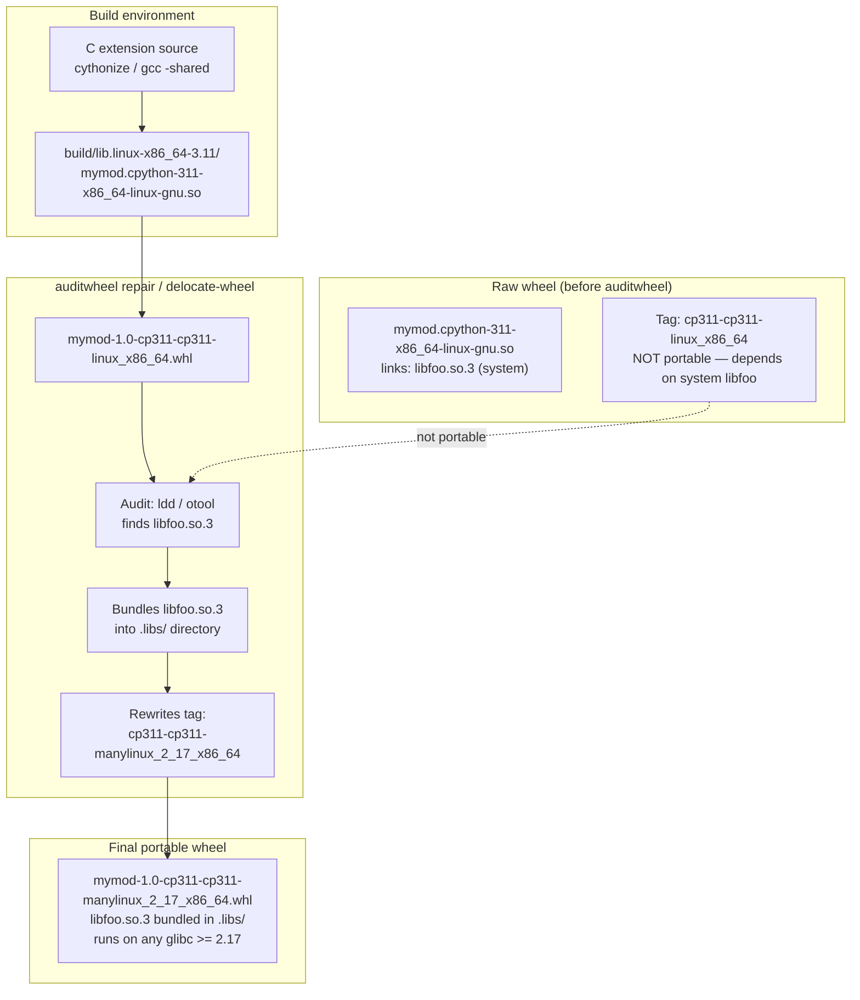
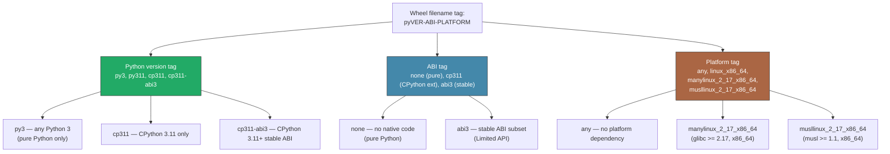
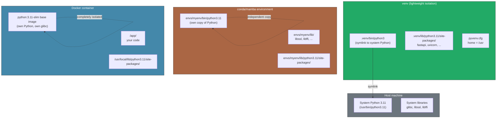
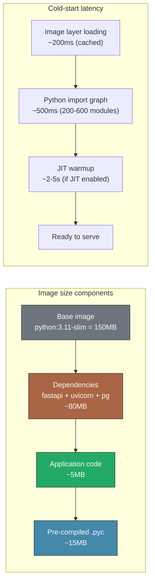
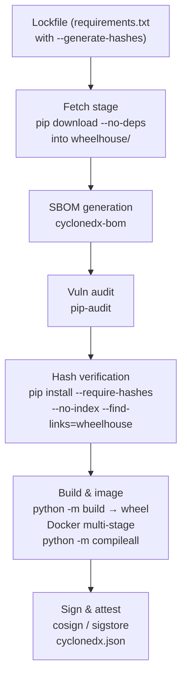
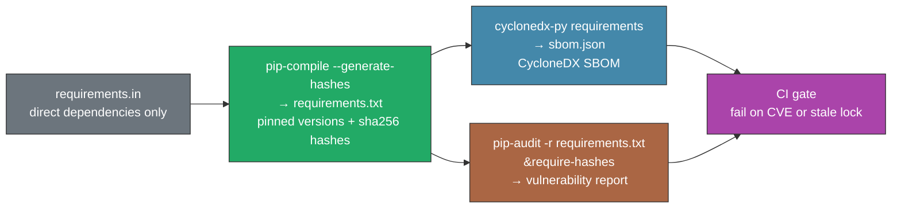
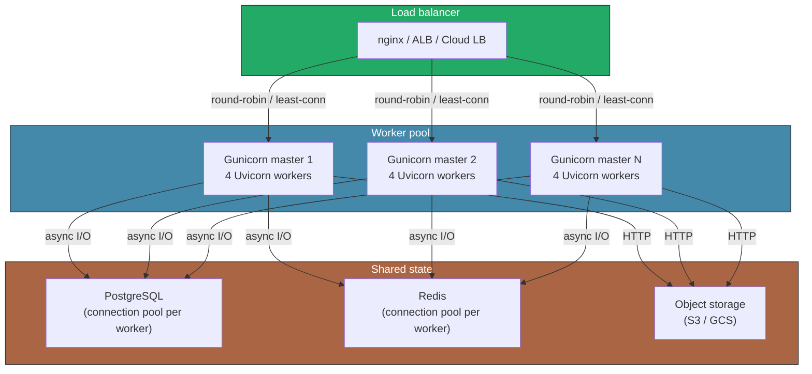

# Chapter 12 — Packaging, Distribution, and Production Deployment at Scale

**What this chapter covers.** The gap between `pip install -e .` on a laptop and a reproducible, auditable, autoscaled production deployment is not a line — it is a pipeline with fifteen failure modes. This chapter walks the full path: defining your package metadata and build system with `pyproject.toml` (PEP 517/518 build isolation, PEP 621 project metadata, PEP 660 editable installs); choosing among sdist, pure-Python wheel, platform wheel, and `abi3` stable-ABI wheel; cross-compiling platform wheels for manylinux and musllinux via `auditwheel` and `delocate`; locking dependencies with `pip-tools`, `poetry.lock`, `pdm.lock`, or `uv.lock`; managing environments from `venv` to `conda`/`micromamba` to Docker multi-stage images with `python -m compileall`; building hermetic containers from a vendored wheelhouse; generating SBOMs with `cyclonedx-python` and scanning with `pip-audit`; and deploying at scale with Gunicorn/Uvicorn workers, preloading, graceful reload, health probes, autoscaling with JIT warmup considerations, and OpenTelemetry/structlog observability. Every tool is shown with real configuration, real commands, and the failure modes that only surface when you run at scale.

Learning goals — after this chapter you should be able to:

- Write a `pyproject.toml` that is compliant with PEP 517 (build system declaration), PEP 518 (build requirements), PEP 621 (project metadata), and PEP 660 (editable installs), and explain which fields control what.
- Distinguish sdist, pure-Python wheel, platform wheel, and `abi3` wheel, and choose among them based on your distribution target and ABI constraints.
- Cross-compile C extensions into manylinux2014, manylinux_2_17, and musllinux_1_1 wheels using `cibuildwheel`, `auditwheel repair`, and `delocate`, and understand why platform tags exist.
- Compare lockfile strategies (`pip-tools`/`pip-compile`, `poetry.lock`, `pdm.lock`, `uv.lock`) and pick one based on whether you need deterministic resolution, hash verification, or multi-platform support.
- Build a reproducible Docker image using multi-stage builds: `python:3.x-slim` for build, `python:3.x-slim` or distroless for runtime, `python -m compileall` for pre-compiled `.pyc`, and `PYTHONDONTWRITEBYTECODE` with awareness of the tradeoffs.
- Create a hermetic build by vendoring a wheelhouse (`pip download --dest wheelhouse`) and installing with `pip install --no-index --find-links=wheelhouse`.
- Generate an SBOM with `cyclonedx-python`, scan dependencies with `pip-audit` and `--require-hashes`, and integrate both into CI.
- Configure Gunicorn/Uvicorn with workers, preload, graceful reload, and health probes; explain how autoscaling interacts with JIT warmup and import-time latency.

> **Prerequisites.** Chapter 9 (import system, `ExtensionFileLoader`, editable installs, `__pycache__` behavior) and Chapter 10 (C extensions, `abi3` wheels, `SOABI`) provide the foundation this chapter builds on. Chapter 11 (JIT warmup, copy-and-patch compilation) is referenced in the autoscaling discussion. Volume 13, Chapter 6 (Python runtime posture) provides operational context for container choices.

---

## 1. The packaging problem — why `pip install` is not enough

Most backend teams discover packaging the hard way. A library works in development. The first `pip install` from PyPI succeeds. Then someone on a different OS hits an `ImportError` for a C extension. Then CI passes but staging fails because the transitive dependency resolved differently. Then a new contributor discovers that `setup.py` and `pyproject.toml` disagree about the package name. Then a security audit asks for an SBOM and the team has `pip freeze` output that includes 400 transitive dependencies with no hashes.

The core problem is that Python's packaging ecosystem evolved through five eras with five different mental models:

| Era | Tool | Metadata | Build | Distribution |
|-----|------|----------|-------|-------------|
| Pre-2013 | `setup.py` | `setup()` kwargs | `python setup.py bdist` | `python setup.py sdist upload` |
| 2013–2017 | `setup.cfg` | Declarative section in INI | `python -m build` (manual) | `twine upload` |
| 2017–2020 | `pyproject.toml` + `setup.cfg` | Split between two files | PEP 517 build isolation | `twine upload` |
| 2020–2023 | `pyproject.toml` PEP 621 | Single-file, declarative | PEP 517/518 + build backend | `twine upload` |
| 2023+ | `pyproject.toml` + lockfile | Single-file + locked resolution | PEP 517/518 + PEP 660 editable | `twine upload` + lockfile in repo |

`pyproject.toml` won. Not because it is perfect, but because it replaced three files (`setup.py`, `setup.cfg`, `MANIFEST.in`) with one, and because PEP 517/518 made build isolation the default. The rest of this chapter assumes you are on this era.

---

## 2. Modern packaging — `pyproject.toml` and the PEP stack

### 2.1 PEP 518 — build requirements

PEP 518 (2016) introduced `[build-system.requires]` — the list of packages needed *before* the build backend can even run. This replaced the fragile `setup_requires` and the `use-builtin-magic` of `pip` auto-detecting build dependencies.

```toml
[build-system]
requires = ["hatchling", "hatch-vcs"]
build-backend = "hatchling.build"
```

When `pip install .` or `pip wheel .` runs, pip:

1. Creates an isolated build environment (a temporary `venv`).
2. Installs `requires` into that environment.
3. Calls `build-backend.build_wheel(...)` (or `build_sdist`).
4. Installs the resulting wheel into the target environment.

This isolation is the key guarantee: your build dependencies do not pollute your runtime environment, and vice versa.

### 2.2 PEP 517 — the build backend interface

PEP 517 (2017) defined the abstract interface between frontends (`pip`, `build`) and backends (`hatchling`, `setuptools`, `poetry-core`, `pdm-backend`). The two critical hooks:

| Hook | When called | Returns |
|------|------------|---------|
| `build_wheel(wheel_directory, config_settings=None, metadata_directory=None)` | `pip install .` or `python -m build --wheel` | Path to `.whl` file |
| `build_sdist(sdist_directory, config_settings=None)` | `python -m build --sdist` | Path to `.tar.gz` file |
| `build_editable(wheel_directory, config_settings=None, metadata_directory=None)` | `pip install -e .` (PEP 660) | Path to editable `.whl` file |

The backend is a Python package you trust to turn your source into an artifact. `hatchling` is the default for new projects; `setuptools` is the legacy default; `poetry-core` and `pdm-backend` serve their respective ecosystems.

### 2.3 PEP 621 — project metadata in `pyproject.toml`

PEP 621 (2021) standardized `[project]` as the single source of package metadata, replacing `setup()` kwargs. Every field you would have put in `setup()` now lives in TOML:

```toml
[build-system]
requires = ["hatchling", "hatch-vcs"]
build-backend = "hatchling.build"

[project]
name = "acme-api"
dynamic = ["version"]
description = "Production backend API service"
readme = "README.md"
license = "MIT"
requires-python = ">=3.11"
authors = [
    { name = "Platform Team", email = "platform@acme.io" },
]
classifiers = [
    "Development Status :: 4 - Beta",
    "Framework :: FastAPI",
    "License :: OSI Approved :: MIT License",
    "Programming Language :: Python :: 3.11",
    "Programming Language :: Python :: 3.12",
    "Programming Language :: Python :: 3.13",
    "Typing :: Typed",
]
dependencies = [
    "fastapi>=0.115,<1.0",
    "uvicorn[standard]>=0.30,<1.0",
    "pydantic>=2.8,<3.0",
    "sqlalchemy[asyncio]>=2.0,<3.0",
    "asyncpg>=0.29,<1.0",
    "structlog>=24.0,<25.0",
]

[project.optional-dependencies]
dev = [
    "pytest>=8.0",
    "pytest-asyncio>=0.24",
    "mypy>=1.11",
    "ruff>=0.6",
]
migrations = [
    "alembic>=1.13",
]
otel = [
    "opentelemetry-api>=1.27",
    "opentelemetry-sdk>=1.27",
    "opentelemetry-exporter-otlp>=1.27",
]

[project.urls]
Homepage = "https://github.com/acme/acme-api"
Documentation = "https://docs.acme.io/api"
Changelog = "https://github.com/acme/acme-api/blob/main/CHANGELOG.md"
"Bug Tracker" = "https://github.com/acme/acme-api/issues"

[project.scripts]
acme-api = "acme_api.cli:main"

# hatch-vcs reads version from git tags:
[tool.hatch.version]
source = "vcs"

[tool.hatch.build.targets.wheel]
packages = ["src/acme_api"]
```

Key fields a backend engineer should understand:

- `dynamic = ["version"]` — version is derived at build time (from git tags via `hatch-vcs`, not hardcoded). This prevents the "forgot to bump version" problem.
- `requires-python` — the *runtime* Python version constraint. `pip install` will refuse to install if the current Python does not satisfy this. Separate from `build-system.requires`.
- `dependencies` — the *runtime* dependency list. Pip resolves these at install time.
- `[project.optional-dependencies]` — extras. `pip install acme-api[otel]` installs the `otel` extra alongside the base.
- `[tool.hatch.build.targets.wheel]` — backend-specific configuration. This tells hatchling which subdirectory to package.

### 2.4 PEP 660 — editable installs

PEP 660 (2021) replaced `setup.py develop` with a standardized `build_editable` hook. The goal: `pip install -e .` should make your source directory importable *without copying files*.

How it works under the hood (the details that matter for debugging):

1. `pip install -e .` calls `build_editable(...)` on the build backend.
2. The backend produces an editable wheel containing a `MetaPathFinder` (installed via a `.pth` file or `__editable__.*` finder).
3. At Python startup, this finder maps `acme_api` → `/path/to/your/src/acme_api`, so `import acme_api` reads directly from your source tree.

The practical consequence: changes to `.py` files are immediately visible (no re-install needed), but changes to `pyproject.toml`, `setup.cfg`, or C extension source *do* require re-running `pip install -e .`.

### 2.5 The four build backends

| Backend | Philosophy | `pyproject.toml` support | Editable | Lockfile |
|---------|-----------|------------------------|---------|---------|
| **hatchling** | Opinionated, fast, PEP 621 native | Full | PEP 660 via hatch | No (use `uv` or `pip-tools` externally) |
| **setuptools** | Legacy default, maximal backward compat | Via `setup.cfg` or `pyproject.toml` | PEP 660 (since 67.0) | No |
| **poetry-core** | All-in-one: packaging + dependency resolution + lockfile | Custom `[tool.poetry]` section | PEP 660 (since 1.2) | `poetry.lock` |
| **pdm-backend** | PEP 621 native, PEP 621 lockfile | Full | PEP 660 | `pdm.lock` |

For new projects, hatchling + `uv` (or `pip-tools`) for locking is the lightest stack that does everything correctly. Poetry is still the right choice for teams that want `poetry.lock` and a single CLI.

---

## 3. Distribution formats — sdist, wheel, and abi3 wheel

### 3.1 Source distributions (sdist)

An sdist (`.tar.gz` or `.zip`) contains source code and the files needed to *build* the package. It is not directly installable — pip builds a wheel from the sdist first.

When to use:
- You need to support platforms without pre-built wheels (rare for pure Python, common for exotic architectures).
- PyPI requires at least one sdist per release as a fallback.
- Regulators or auditors may require source distribution.

### 3.2 Wheels

A wheel (`.whl`) is a pre-built, ready-to-install zip archive. No compilation, no build dependencies — just copy files into the right place. This is why `pip install` is fast when a wheel is available: it skips the entire build.

Wheel filenames encode metadata in the tag:

```
acme_api-1.2.0-py3-none-any.whl
     │       │  │  │    │     └─ format
     │       │  │  │    └─ platform: "none" = pure Python
     │       │  │  └─ ABI: "none" = pure Python
     │       │  └─ Python version: "py3" = any Python 3
     │       └─ version
     └─ name
```

For C extensions, the tag changes:

```
cryptography-43.0.0-cp311-cp311-manylinux_2_17_x86_64.manylinux2014_x86_64.whl
                  │     │     │       │                  └─ legacy alias
                  │     │     │       └─ manylinux_2_17 = glibc 2.17+
                  │     │     └─ ABI tag (cpython-specific)
                  │     └─ CPython version (implementation)
                  └─ wheel format version
```

### 3.3 abi3 wheels — one wheel, all Pythons

Chapter 10 §9 covered the Limited API and `abi3` wheels in depth. The summary for packaging:

```
# A full-API wheel — one per CPython version:
cryptography-43.0.0-cp311-cp311-manylinux_2_17_x86_64.whl
cryptography-43.0.0-cp312-cp312-manylinux_2_17_x86_64.whl
cryptography-43.0.0-cp313-cp313-manylinux_2_17_x86_64.whl

# An abi3 wheel — one wheel for all CPython 3.11+:
cryptography-43.0.0-cp311-abi3-manylinux_2_17_x86_64.whl
```

The tradeoff: `abi3` constrains you to the subset of the C API guaranteed stable across versions (no direct struct access, no `Py_SIZE` as lvalue, no CPython-specific optimizations). For thin wrappers around C libraries (`grpcio`, `cryptography`, `psycopg`), this is almost always the right choice.

### 3.4 manylinux and musllinux — binary portability

A `.so` compiled on Ubuntu 22.04 will not load on Alpine Linux or on Ubuntu 18.04 — the glibc version differs, the C++ standard library differs, the libssl differs. Platform tags encode the minimum glibc/libstdc++ version the wheel requires.

| Tag | Meaning | Minimum glibc |
|-----|---------|--------------|
| `manylinux1` | CentOS 5 | 2.5 |
| `manylinux2010` | CentOS 6 | 2.12 |
| `manylinux2014` / `manylinux_2_17` | CentOS 7 | 2.17 |
| `manylinux_2_28` | AlmaLinux 8 | 2.28 |
| `manylinux_2_35` | Ubuntu 22.04 | 2.35 |
| `musllinux_1_1` | Alpine 3.13+ | musl 1.1 |
| `musllinux_2_12` | Alpine 3.13+ | musl 1.1 |

The `auditwheel` tool (for Linux) and `delocate` tool (for macOS) inspect a built wheel, find all shared libraries it links against (directly or transitively), copy them into the wheel's `.libs/` directory, and rewrite the tag to the appropriate `manylinux_*` or `delocate` tag. This is what makes a wheel self-contained.



### 3.5 `cibuildwheel` — multi-platform CI

`cibuildwheel` automates building wheels across Python versions and platforms. It spins up containers (manylinux, musllinux) or uses native CI runners (macOS, Windows), runs `auditwheel repair` / `delocate-wheel`, and produces uploadable wheels.

```yaml
# .github/workflows/wheels.yml
name: Build wheels
on:
  push:
    tags: ["v*"]
jobs:
  build_wheels:
    runs-on: ubuntu-latest
    steps:
      - uses: actions/checkout@v4
      - uses: pypa/cibuildwheel@v2.21
        env:
          CIBW_BUILD: "cp311-* cp312-* cp313-*"
          CIBW_SKIP: "*-musllinux_i686"
          CIBW_BEFORE_ALL_LINUX: "yum install -y libfoo-devel"
          CIBW_TEST_COMMAND: "python -c 'import mymod; mymod.hello()'"

      - uses: actions/upload-artifact@v4
        with:
          name: wheels
          path: ./wheelhouse/*.whl
```

---

## 4. Wheel tag matrix — understanding compatibility



The compatibility rule: a wheel installs if *and only if* the running interpreter satisfies all three tags. A wheel `cp311-cp311-manylinux_2_17_x86_64` installs only on CPython 3.11, with the CPython 3.11 ABI, on a glibc 2.17+ x86_64 system. A wheel `cp311-abi3-manylinux_2_17_x86_64` installs on CPython 3.11 *or newer*, because `abi3` signals a stable ABI.

---

## 5. Lockfiles — deterministic dependency resolution

### 5.1 The problem

`pip install` resolves dependencies freshly every time. Two runs minutes apart can produce different dependency trees if a maintainer pushes a new version. A `pip freeze` output is a snapshot of what resolved *now*, but it does not distinguish between direct and transitive dependencies, and it does not encode hashes.

Lockfiles solve three problems:
1. **Determinism** — the same lockfile produces the same dependency tree.
2. **Auditability** — every package and its hash are recorded.
3. **Speed** — lockfile installation skips resolution entirely.

### 5.2 `pip-tools` / `pip-compile`

The simplest lockfile for pip-native workflows. `pip-compile` reads `requirements.in` (direct dependencies) and produces `requirements.txt` (all dependencies pinned to exact versions with hashes).

```bash
# requirements.in — direct dependencies only
fastapi>=0.115,<1.0
uvicorn[standard]>=0.30,<1.0
pydantic>=2.8,<3.0
sqlalchemy[asyncio]>=2.0,<3.0
asyncpg>=0.29,<1.0
structlog>=24.0,<25.0

# Compile to locked requirements.txt:
pip-compile --generate-hashes --upgrade --strip-extras \
    requirements.in -o requirements.txt

# Result: requirements.txt with every line pinned + sha256 hash
# Install is reproducible:
pip install -r requirements.txt
```

### 5.3 `poetry.lock`

Poetry's lockfile is a TOML file that records every resolved package, version, hash, and marker. It is designed for the `pyproject.toml` ecosystem.

```bash
# Initialize (if not already using pyproject.toml):
poetry init

# Lock dependencies:
poetry lock

# Install from lock:
poetry install

# Add a dependency:
poetry add pydantic@^2.8
# This updates pyproject.toml AND poetry.lock in one step.
```

### 5.4 `pdm.lock`

PDM's lockfile is similar in spirit to `poetry.lock` but uses PEP 621 metadata. PDM is the only major tool that implements PEP 685 (dependency specifiers for lockfiles).

```bash
pdm lock
pdm install
pdm add pydantic@^2.8
```

### 5.5 `uv.lock`

`uv` (from Astral, the `ruff` team) is a Rust-based pip replacement with a lockfile format. It is dramatically faster (10–100×) than pip and uses the same resolution algorithm as Cargo.

```bash
uv pip compile requirements.in --output-file requirements.txt --generate-hashes

# Or with uv's native lockfile:
uv lock
uv sync
```

### 5.6 Choosing a lockfile

| Tool | Resolution speed | Hash verification | Integration | When to use |
|------|-----------------|-------------------|-------------|-------------|
| `pip-tools` | ~5s per compile | `--generate-hashes` | pip-native, simple | Teams that want "pip but reproducible" |
| `poetry.lock` | ~2s | Automatic | Poetry CLI, `pyproject.toml` | Teams already using Poetry |
| `pdm.lock` | ~2s | Automatic | PEP 621 native, PDM CLI | Teams wanting PEP 621 + lockfile |
| `uv.lock` | ~0.1s | Automatic | `uv` CLI, pip-compatible | Teams wanting speed + lockfile |

---

## 6. Environments — venv, conda, and Docker layering

### 6.1 `venv` — lightweight isolation

Python's built-in `venv` creates a directory tree with a symlinked or copied Python binary and a `site-packages` directory. It is the right choice for local development and CI.

```bash
python -m venv .venv
source .venv/bin/activate
pip install -r requirements.txt
```

What `venv` actually does:
- Creates `.venv/bin/python` (symlink to system Python or a copy on Windows).
- Creates `.venv/pyvenv.cfg` recording the home directory and version.
- Sets `sys.prefix` to `.venv/` so `site-packages` resolves inside the venv.
- Does *not* isolate the Python binary itself — it is the same CPython, same stdlib, same C extensions from the system.

### 6.2 Conda / Mamba / Micromamba — language-agnostic environments

Conda (and its faster alternatives `mamba` and `micromamba`) creates fully isolated environments with their own Python binary, stdlib, and native libraries. This matters when you need:
- A different Python version than the system Python.
- Non-Python dependencies (libprotobuf, libssl, CUDA libraries) that `pip` cannot install.
- Exact C library versions across platforms.

```
micromamba create -n myenv python=3.12 -c conda-forge
micromamba activate myenv
conda install numpy pandas sqlalchemy
pip install -r requirements.txt  # pip inside conda env is fine
```

The key distinction: conda installs packages from conda-forge (built for specific glibc/musl/libstdc++ combinations), while pip installs from PyPI (built as manylinux/musllinux wheels or sdists). Mixing both in one environment is fine if you are careful about not overwriting each other's files, but can cause subtle breakage.

### 6.3 venv vs container — the layering model



The decision matrix:

| Scenario | Right tool | Why |
|----------|-----------|-----|
| Local dev, same Python version as CI | `venv` | Fast, lightweight, no overhead |
| Local dev, needs different Python version | `pyenv` + `venv` or `conda` | Version flexibility |
| Local dev, needs CUDA / libprotobuf | `conda` | Manages non-Python native deps |
| CI (GitHub Actions, GitLab) | `venv` in Docker, or native runner with `uv` | Fastest path to isolation |
| Production | Docker | Full reproducibility, layer caching, hermetic |

---

## 7. Docker multi-stage for Python — building the production image

A Python Docker image is not "install Python, copy code, run." The details determine whether your image is 1.5 GB or 200 MB, whether it boots in 5 seconds or 500 milliseconds, and whether two builds from the same commit produce the same image.

### 7.1 Slim vs distroless

| Base | Size (Python 3.12) | Includes | Missing | Use when |
|------|-------------------|----------|---------|----------|
| `python:3.12` | ~900 MB | Full Debian, compilers, headers | — | Build stage only |
| `python:3.12-slim` | ~150 MB | Minimal Debian, no compilers | gcc, headers, git | Most production apps |
| `python:3.12-alpine` | ~60 MB | musl-based, minimal | glibc, some pip wheels | Small pure-Python apps |
| `gcr.io/distroless/python3-debian12` | ~50 MB | Python runtime, nothing else | shell, package manager | Maximum security, no debugging |
| `chainguard/python` | ~45 MB | Signed, minimal, SBOM | Package manager | Supply-chain-critical deploys |

For most backend services, `python:3.x-slim` as the runtime base is the right choice: small enough, has a shell for debugging, compatible with the `manylinux` wheels your C extensions produce.

### 7.2 Multi-stage build

```dockerfile
# =============================================================================
# Stage 1: build — install all dependencies including C build tools
# =============================================================================
FROM python:3.12-slim AS builder

WORKDIR /app

# Install system build dependencies needed to compile C extensions
# that don't have pre-built wheels for this platform:
RUN apt-get update && apt-get install -y --no-install-recommends \
    gcc \
    g++ \
    libpq-dev \
    && rm -rf /var/lib/apt/lists/*

# Install Python build dependencies:
RUN pip install --no-cache-dir pip==24.3 wheel==0.45.1

# Copy only the lockfile first (layer cache optimization):
COPY requirements.txt .

# Install all dependencies into a staging directory:
# --prefix installs to /app/deps so we can copy only site-packages later.
RUN pip install --no-cache-dir --prefix=/app/deps -r requirements.txt

# Copy application source:
COPY pyproject.toml README.md ./
COPY src/ ./src/

# Install the application itself (not from a wheel, since we're developing):
RUN pip install --no-cache-dir --prefix=/app/deps --no-deps .

# Pre-compile to .pyc (deterministic, fast startup, no runtime __pycache__ writes):
RUN python -m compileall \
    --invalidation-mode=unchecked-hash \
    --optimize=2 \
    -q \
    /app/deps/lib/python3.12/site-packages

# =============================================================================
# Stage 2: runtime — minimal image
# =============================================================================
FROM python:3.11-slim AS runtime

# Metadata
LABEL org.opencontainers.image.source="https://github.com/acme/acme-api"
LABEL org.opencontainers.image.description="ACME API service"

# Create non-root user:
RUN groupadd -r apiuser && useradd -r -g apiuser -d /app -s /sbin/nologin apiuser

WORKDIR /app

# Copy only the installed packages from builder:
COPY --from=builder /app/deps /usr/local

# Copy application source:
COPY --from=builder /app/src /app/src

# Copy any static files, configs, etc.:
COPY --from=builder /app/pyproject.toml /app/

# Set up bytecode compilation policy:
# PYTHONDONTWRITEBYTECODE=1 — don't write .pyc at runtime.
# We already pre-compiled in the builder stage.
ENV PYTHONDONTWRITEBYTECODE=1

# If you want hash-based validation of pre-compiled .pyc at import time:
# ENV PYTHONPYCACHEPREFIX=/dev/null

# PYTHONUNBUFFERED — ensure stdout/stderr are not buffered (important for Docker):
ENV PYTHONUNBUFFERED=1

# SOURCE_DATE_EPOCH — make any remaining mtime-dependent behavior deterministic:
ENV SOURCE_DATE_EPOCH=0

# Don't run as root:
USER apiuser

# Health check:
HEALTHCHECK --interval=30s --timeout=5s --start-period=10s --retries=3 \
    CMD python -c "import urllib.request; urllib.request.urlopen('http://localhost:8000/health')"

EXPOSE 8000

# The application:
CMD ["python", "-m", "uvicorn", "acme_api.main:app", \
     "--host", "0.0.0.0", \
     "--port", "8000", \
     "--workers", "4", \
     "--loop", "uvloop", \
     "--http", "httptools", \
     "--log-level", "info"]
```

### 7.3 `PYTHONDONTWRITEBYTECODE` — the tradeoffs

Setting `PYTHONDONTWRITEBYTECODE=1` tells CPython not to write `.pyc` files to `__pycache__/`. This is common in Docker images, but the tradeoffs matter:

**Benefits:**
- No runtime filesystem writes (read-only containers, faster cold start).
- Smaller working set — no `__pycache__/` directories.
- Deterministic — no mtime-dependent `.pyc` headers.

**Costs:**
- First import of every module is slower (must recompile from source).
- Requires the source `.py` files to be present and readable at runtime.

**Mitigation:** Pre-compile with `python -m compileall` during the build stage (as shown in the Dockerfile above). The `.pyc` files live in the `site-packages/` directory, not in `__pycache__/`, so they are found by the normal import path. `PYTHONDONTWRITEBYTECODE` prevents *new* writes but does not prevent *reading* pre-compiled `.pyc` files.

**Alternative:** `PYTHONPYCACHEPREFIX=/dev/null` (Python 3.8+) redirects `__pycache__/` writes to `/dev/null`, which effectively discards them. This is semantically equivalent to `PYTHONDONTWRITEBYTECODE` but allows the interpreter to go through the write path (relevant for some profiling tools).

### 7.4 Image size vs cold-start



---

## 8. Hermetic builds — vendored wheelhouse

A hermetic build guarantees that the build does not fetch anything from the network. This is critical for reproducible builds, air-gapped environments, and supply-chain security.

### 8.1 Creating the wheelhouse

```bash
# Download all wheels (with hashes) into a local directory:
pip download \
    -r requirements.txt \
    --dest wheelhouse/ \
    --only-binary=:all: \
    --platform manylinux_2_17_x86_64 \
    --python-version 3.12 \
    --implementation cp

# Verify no sdists slipped through:
ls wheelhouse/*.tar.gz && echo "ERROR: sdists found" || echo "OK: all wheels"

# For multi-platform wheelhouses:
pip download -r requirements.txt --dest wheelhouse/ --only-binary=:all:
```

### 8.2 Installing from the wheelhouse

```dockerfile
# Hermetic install — no network access needed:
RUN pip install \
    --no-index \
    --find-links=/wheelhouse \
    -r requirements.txt

# For the application itself:
RUN pip install \
    --no-index \
    --find-links=/wheelhouse \
    --no-deps \
    .
```

### 8.3 `pip install --require-hashes`

Hash verification ensures that the installed package is exactly the one you downloaded — no substitution, no tampering.

```txt
# requirements.txt (pip-tools output with --generate-hashes):
fastapi==0.115.6 --hash=sha256:abc123... --hash=sha256:def456...
uvicorn==0.34.0 --hash=sha256:789abc... --hash=sha256:012def...
pydantic==2.10.4 --hash=sha256:345678... --hash=sha256:901234...
```

```bash
# Install with hash verification (fails if any hash doesn't match):
pip install --require-hashes -r requirements.txt
```

---




## 9. Supply-chain security for Python

Python's supply chain is fragile. PyPI allows anyone to publish a package with any name. Typosquatting, dependency confusion, and maintainer account compromise are real, ongoing attacks.

### 9.1 Typosquatting

The most common attack vector: register `requessts` (note the extra `s`), `python-dateutil2`, or `colourama` — names that look like popular packages. Users who type quickly install the malicious package.

**Mitigations:**
- Use `--require-hashes` — typosquatted packages have different hashes.
- Use a lockfile — resolution is recorded, new typosquats cannot inject.
- Use `pip-audit` — checks installed packages against OSV vulnerability database.
- Monitor PyPI for packages matching your name + common typos.

### 9.2 Dependency confusion

If your organization publishes private packages to an internal index (e.g., `internal.acme.io/simple/`), an attacker can publish a package with the same name to PyPI. If pip searches PyPI before the internal index, the attacker's package wins.

**Mitigations:**
- Use `--index-url` and `--extra-index-url` with `--trusted-host` in the correct order.
- Use `pip install --no-deps` for private packages and resolve their dependencies explicitly.
- Use namespace packages (`acme-internal-*`) to avoid name collisions.

### 9.3 Hash verification

```bash
# Generate hashes for all packages:
pip-compile --generate-hashes requirements.in -o requirements.txt

# Install with hash verification:
pip install --require-hashes -r requirements.txt

# Verify an existing installation:
pip install pip-audit && pip-audit
```

---

## 10. SBOMs — Software Bill of Materials for Python

An SBOM is a machine-readable inventory of every component in your software, including versions, licenses, and vulnerabilities. For Python, the standard formats are CycloneDX and SPDX.



### 10.1 `cyclonedx-python`

```bash
# Install the SBOM generator:
pip install cyclonedx-bom

# Generate SBOM from installed packages:
cyclonedx-py environment --format CycloneDX --output-file sbom.json

# Generate from requirements.txt:
cyclonedx-py requirements --format CycloneDX --output-file sbom.json

# Generate SPDX instead:
cyclonedx-py environment --format SPDX --output-file sbom.spdx.json
```

### 10.2 `pip-audit`

```bash
# Audit installed packages for known vulnerabilities:
pip-audit

# Audit from requirements file:
pip-audit -r requirements.txt

# Audit with hash verification:
pip-audit -r requirements.txt --require-hashes

# Output as CycloneDX SBOM:
pip-audit --format cyclonedx --output sbom-audit.json

# Fix vulnerabilities automatically:
pip-audit --fix
```

### 10.3 `pip freeze` vs `pipdeptree`

`pip freeze` is the naive approach — it dumps every installed package with no structure:

```bash
$ pip freeze
fastapi==0.115.6
uvicorn==0.34.0
pydantic==2.10.4
pydantic-core==2.27.2
...
```

`pipdeptree` shows the dependency tree — which packages are direct dependencies and which are transitive:

```bash
$ pipdeptree
acme-api==1.2.0
├── fastapi==0.115.6
│   ├── pydantic==2.10.4
│   │   └── pydantic-core==2.27.2
│   ├── starlette==0.41.3
│   └── uvicorn==0.34.0
│       ├── h11==0.14.0
│       └── httptools==0.6.4
├── sqlalchemy[asyncio]==2.0.36
│   └── greenlet==3.1.1
└── structlog==24.4.0
```

For SBOM generation, always use `pipdeptree` or `cyclonedx-py` rather than `pip freeze` — the tree structure is essential for vulnerability tracking and license compliance.

---

## 11. Deployment at scale — Gunicorn, Uvicorn, and autoscaling

### 11.1 Gunicorn with Uvicorn workers

The standard production deployment for FastAPI/Django ASGI applications:

```bash
gunicorn acme_api.main:app \
    --worker-class uvicorn.workers.UvicornWorker \
    --workers 4 \
    --bind 0.0.0.0:8000 \
    --timeout 120 \
    --graceful-timeout 30 \
    --max-requests 10000 \
    --max-requests-jitter 500 \
    --preload-app \
    --access-logfile - \
    --error-logfile -
```

Key settings explained:

| Setting | Value | Why |
|---------|-------|-----|
| `--worker-class uvicorn.workers.UvicornWorker` | Uvicorn worker | ASGI support, async I/O |
| `--workers 4` | 4 worker processes | Rule of thumb: `2 * CPU cores + 1` |
| `--timeout 120` | 120s | Kill workers stuck for >120s |
| `--graceful-timeout 30` | 30s | Time to finish in-flight requests on reload |
| `--max-requests 10000` | 10k requests | Restart worker after 10k requests (memory leak mitigation) |
| `--max-requests-jitter 500` | ±500 | Randomize restart to prevent thundering herd |
| `--preload-app` | Load app before forking | Saves memory, fails fast on import errors |

### 11.2 Preloading — the import-time tradeoff

`--preload-app` imports your application in the master process before forking workers. This has significant implications:

**Benefits:**
- Memory savings: shared libraries (Python modules) are copy-on-write across forked workers.
- Fast fail: if your app fails to import, Gunicorn fails immediately rather than after forking.
- Faster worker startup: workers inherit the pre-loaded import graph.

**Costs:**
- If your app modifies global state at import time (database connections, logging configuration, `os.environ`), those changes are shared across workers — which may cause connection pool exhaustion or race conditions.
- The JIT (if enabled) warms up in the master, not in each worker. Forking copies the warm JIT state, but this is wasted work if the JIT state is process-specific.

### 11.3 Graceful reload

Gunicorn supports two reload mechanisms:
1. **Signal-based:** Send `SIGHUP` to the master process. Workers finish in-flight requests (up to `--graceful-timeout`) and are replaced with fresh workers.
2. **File-watching:** `--reload` watches files for changes and triggers a graceful restart. Useful in development, dangerous in production (don't mount your source code as a writable volume).

### 11.4 Health probes

Every production deployment needs two health endpoints:

```python
# acme_api/health.py
import asyncio
from fastapi import APIRouter, Response

router = APIRouter()

@router.get("/health/live")
async def liveness():
    """Kubernetes liveness probe — is the process alive?"""
    return {"status": "alive"}

@router.get("/health/ready")
async def readiness():
    """Kubernetes readiness probe — can the service handle traffic?"""
    # Check database connectivity:
    try:
        from sqlalchemy import text
        from acme_api.db import async_session
        async with async_session() as session:
            await session.execute(text("SELECT 1"))
    except Exception as e:
        return Response(
            content=f'database unreachable: {e}',
            status_code=503,
        )
    return {"status": "ready"}
```

### 11.5 Autoscaling with JIT warmup considerations



Autoscaling policy must account for three Python-specific warmup costs:

1. **Import graph:** A new worker must import 200–600 modules. With `--preload-app`, this happens once per master process (amortized across workers). Without it, every scale-up event pays the full import cost.

2. **JIT warmup (if enabled):** CPython's tier-1 specialization (PEP 659) needs a few hundred calls per function to specialize. The tier-2 JIT (PEP 744, Python 3.13+) needs thousands. A freshly scaled worker serves requests at interpreter speed until the JIT warms up. Autoscaling policies should:
   - Use `--preload-app` to amortize JIT warmup across workers.
   - Set a higher initial capacity (min replicas) to avoid cold-start-heavy traffic.
   - Consider "warm pool" strategies — keep extra workers idle rather than at zero.

3. **Connection pools:** Each worker maintains its own database connection pool. If `--workers=4` and you have 8 pods, you have 32 database connections. Autoscaling to 16 pods means 64 connections. Ensure your database `max_connections` can handle peak pod count × workers × connections_per_worker.

### 11.6 Observability — OpenTelemetry and structlog

```python
# acme_api/observability.py
import structlog
from opentelemetry import trace
from opentelemetry.sdk.trace import TracerProvider
from opentelemetry.sdk.trace.export import BatchSpanProcessor
from opentelemetry.exporter.otlp.proto.grpc.trace_exporter import OTLPSpanExporter

# Structured logging with structlog:
structlog.configure(
    processors=[
        structlog.contextvars.merge_contextvars,
        structlog.processors.add_log_level,
        structlog.processors.TimeStamper(fmt="iso"),
        structlog.processors.StackInfoRenderer(),
        structlog.processors.format_exc_info,
        structlog.processors.JSONRenderer(),
    ],
    wrapper_class=structlog.make_filtering_bound_logger(
        structlog.get_config()["wrapper_class"]
    ),
    context_class=dict,
    logger_factory=structlog.PrintLoggerFactory(),
)

# OpenTelemetry tracing:
provider = TracerProvider()
provider.add_span_processor(
    BatchSpanProcessor(OTLPSpanExporter(endpoint="otel-collector:4317"))
)
trace.set_tracer_provider(provider)
tracer = trace.get_tracer("acme-api")
```

```python
# acme_api/main.py
from fastapi import FastAPI, Request
from acme_api.observability import tracer
from opentelemetry.instrumentation.fastapi import FastAPIInstrumentor

app = FastAPI()
FastAPIInstrumentor.instrument_app(app)

@app.get("/users/{user_id}")
async def get_user(user_id: int):
    with tracer.start_as_current_span("get_user") as span:
        span.set_attribute("user.id", user_id)
        # ... database query ...
        return {"user_id": user_id}
```

The production observability stack:
- **structlog** — structured JSON logs, every request gets `request_id`, `user_id`, `latency_ms`.
- **OpenTelemetry** — distributed tracing across services, propagated via `traceparent` header.
- **Metrics** — Prometheus via `prometheus-fastapi-instrumentator` or OpenTelemetry Metrics SDK.
- **Correlation** — `trace_id` from OpenTelemetry is injected into structlog context, linking logs to traces.

---

## 12. CI pipeline — pip-compile, pip-audit, SBOM, and wheel build

### 12.1 Complete CI workflow

```yaml
# .github/workflows/ci.yml
name: CI
on:
  push:
    branches: [main]
  pull_request:
    branches: [main]

jobs:
  # -------------------------------------------------------------------------
  # Job 1: Lock and audit dependencies
  # -------------------------------------------------------------------------
  lock-audit:
    runs-on: ubuntu-latest
    steps:
      - uses: actions/checkout@v4
      - uses: actions/setup-python@v5
        with:
          python-version: "3.12"

      - name: Install tools
        run: pip install pip-tools pip-audit cyclonedx-bom

      - name: Compile requirements
        run: |
          pip-compile --generate-hashes --upgrade \
            requirements.in -o requirements.txt

      - name: Audit for vulnerabilities
        run: pip-audit -r requirements.txt --require-hashes

      - name: Generate SBOM
        run: |
          cyclonedx-py requirements \
            --format CycloneDX \
            --output-file sbom.json \
            requirements.txt

      - name: Upload SBOM
        uses: actions/upload-artifact@v4
        with:
          name: sbom
          path: sbom.json

      - name: Fail if lockfile is stale
        run: |
          git diff --exit-code requirements.txt || {
            echo "::error::requirements.txt is out of date. Run 'pip-compile --generate-hashes' locally."
            exit 1
          }

  # -------------------------------------------------------------------------
  # Job 2: Test
  # -------------------------------------------------------------------------
  test:
    runs-on: ubuntu-latest
    strategy:
      matrix:
        python-version: ["3.11", "3.12", "3.13"]
    steps:
      - uses: actions/checkout@v4
      - uses: actions/setup-python@v5
        with:
          python-version: ${{ matrix.python-version }}

      - name: Install dependencies
        run: |
          pip install --require-hashes -r requirements.txt
          pip install --no-deps -e ".[dev]"

      - name: Lint
        run: ruff check src/ tests/

      - name: Type check
        run: mypy src/

      - name: Test
        run: pytest tests/ -v --tb=short

  # -------------------------------------------------------------------------
  # Job 3: Build and publish
  # -------------------------------------------------------------------------
  build-publish:
    needs: [lock-audit, test]
    if: startsWith(github.ref, 'refs/tags/v')
    runs-on: ubuntu-latest
    permissions:
      id-token: write  # For trusted publishing
    steps:
      - uses: actions/checkout@v4
      - uses: actions/setup-python@v5
        with:
          python-version: "3.12"

      - name: Build sdist and wheel
        run: |
          pip install build
          python -m build

      - name: Publish to PyPI
        uses: pypa/gh-action-pypi-publish@release/v1
```

---

## 13. Backend lens — reproducible deploys, supply-chain, and cold start

### 13.1 Reproducible deploys

Two builds from the same commit should produce the same image. This requires:

1. **Pinned lockfile** — `requirements.txt` with `--generate-hashes`, committed to the repo.
2. **Fixed base image tag** — `python:3.12.7-slim`, not `python:3.12-slim` (which is a moving target).
3. **`SOURCE_DATE_EPOCH`** — set to the commit timestamp, making `.pyc` headers deterministic.
4. **`--no-cache-dir`** in pip — prevents pip's local cache from leaking into the image.
5. **No `pip install .` at runtime** — build wheels at CI time, install from vendored wheels in the Docker image.

### 13.2 Supply-chain checklist

| Control | Implementation | Protects against |
|---------|---------------|------------------|
| Lockfile with hashes | `pip-compile --generate-hashes` | Dependency confusion, version drift |
| Hash verification | `pip install --require-hashes` | Tampered wheels |
| Vulnerability scanning | `pip-audit` in CI | Known CVEs in dependencies |
| SBOM generation | `cyclonedx-bom` in CI | Auditability, license compliance |
| Private index isolation | `--index-url` (not `--extra-index-url`) | Dependency confusion |
| Pre-built wheelhouse | `pip download --only-binary` | Build-time network access |
| Signed images | `cosign sign` + attestation | Image tampering |

### 13.3 Image size vs cold-start

The tradeoffs are real and measurable:

| Strategy | Image size | Cold start | Tradeoff |
|----------|-----------|------------|---------|
| `python:3.12` (full Debian) | ~900 MB | ~800 ms | Debugging is easy, image is huge |
| `python:3.12-slim` | ~150 MB | ~500 ms | Best balance for most services |
| `python:3.12-alpine` | ~60 MB | ~600 ms (no pre-built manylinux wheels, must compile from source at build time) | Small image, but build time increases |
| `distroless` | ~50 MB | ~400 ms | No shell, no debugging, maximum security |
| Pre-compiled `.pyc` | +15 MB | -200 ms | Faster startup, larger image |

For serverless and autoscaling environments where cold start directly impacts latency, the investment in `compileall --optimize=2` and `PYTHONDONTWRITEBYTECODE=1` pays for itself within weeks of operation.

---

## 14. Full pyproject.toml — production example

```toml
# Complete pyproject.toml for a production backend service
[build-system]
requires = ["hatchling", "hatch-vcs"]
build-backend = "hatchling.build"

[project]
name = "acme-api"
dynamic = ["version"]
description = "Production backend API service"
readme = "README.md"
license = "MIT"
requires-python = ">=3.11"
authors = [
    { name = "Platform Team", email = "platform@acme.io" },
]
classifiers = [
    "Development Status :: 4 - Beta",
    "Framework :: FastAPI",
    "License :: OSI Approved :: MIT License",
    "Programming Language :: Python :: 3.11",
    "Programming Language :: Python :: 3.12",
    "Programming Language :: Python :: 3.13",
    "Typing :: Typed",
]
dependencies = [
    "fastapi>=0.115,<1.0",
    "uvicorn[standard]>=0.30,<1.0",
    "pydantic>=2.8,<3.0",
    "sqlalchemy[asyncio]>=2.0,<3.0",
    "asyncpg>=0.29,<1.0",
    "structlog>=24.0,<25.0",
]

[project.optional-dependencies]
dev = [
    "pytest>=8.0",
    "pytest-asyncio>=0.24",
    "mypy>=1.11",
    "ruff>=0.6",
    "pip-audit>=2.7",
    "cyclonedx-bom>=5.0",
]
otel = [
    "opentelemetry-api>=1.27",
    "opentelemetry-sdk>=1.27",
    "opentelemetry-exporter-otlp>=1.27",
    "opentelemetry-instrumentation-fastapi>=0.48",
]
migrations = [
    "alembic>=1.13",
]

[project.urls]
Homepage = "https://github.com/acme/acme-api"
Documentation = "https://docs.acme.io/api"
Changelog = "https://github.com/acme/acme-api/blob/main/CHANGELOG.md"
"Bug Tracker" = "https://github.com/acme/acme-api/issues"

[project.scripts]
acme-api = "acme_api.cli:main"

[tool.hatch.version]
source = "vcs"

[tool.hatch.build.targets.wheel]
packages = ["src/acme_api"]

[tool.ruff]
target-version = "py311"
line-length = 88
src = ["src", "tests"]

[tool.ruff.lint]
select = ["E", "F", "I", "N", "UP", "B", "SIM", "TCH"]

[tool.mypy]
python_version = "3.11"
strict = true
warn_return_any = true
warn_unused_configs = true

[tool.pytest.ini_options]
asyncio_mode = "auto"
testpaths = ["tests"]
```

---

## Key takeaways

- **`pyproject.toml` is the single source of truth.** PEP 517 (build backend interface), PEP 518 (build requirements), PEP 621 (project metadata), and PEP 660 (editable installs) together replace `setup.py`, `setup.cfg`, and `MANIFEST.in`. Use `hatchling` or `poetry-core` as the build backend; use `uv` or `pip-tools` for locking.

- **Wheel tags encode the three dimensions of compatibility.** `pyVER-ABI-PLATFORM` — Python version, ABI (pure/CPython/abi3), and platform (any/manylinux/musllinux). The `abi3` tag (Stable ABI, Chapter 10 §9) collapses one wheel to work across all CPython 3.x versions above the minimum.

- **manylinux and musllinux exist because C extensions link to system libraries.** `auditwheel repair` bundles shared libraries into the wheel and rewrites the tag. Without this step, your wheel only works on the exact machine it was built on.

- **Lockfiles are not optional in production.** `pip-compile --generate-hashes` produces a `requirements.txt` that is deterministic, auditable, and tamper-resistant. `poetry.lock`, `pdm.lock`, and `uv.lock` provide the same guarantees with different ergonomics. The choice is workflow preference, not correctness.

- **Docker multi-stage builds are the standard for Python services.** Build in a full image (with compilers), copy only `site-packages/` and application code into a slim runtime image. Pre-compile with `python -m compileall --invalidation-mode=unchecked-hash --optimize=2` for fast cold start. Set `PYTHONDONTWRITEBYTECODE=1` to prevent runtime `__pycache__/` writes.

- **Hermetic builds (`--no-index` + vendored wheelhouse) eliminate network dependency.** This is required for reproducible builds, air-gapped environments, and supply-chain security. Combine with `--require-hashes` for tamper detection.

- **SBOMs are a compliance requirement, not a nice-to-have.** `cyclonedx-bom` generates a machine-readable inventory of every dependency. `pip-audit` checks that inventory against known vulnerabilities. Both belong in CI, blocking merges on known CVEs.

- **Autoscaling must account for Python warmup.** Import-time latency (200–600 modules), JIT warmup (PEP 659 specialization + PEP 744 tier-2), and connection pool sizing all affect time-to-healthy. `--preload-app` amortizes import and JIT warmup across workers. Set minimum replica counts above zero for latency-sensitive services.

- **Supply-chain defense is layered.** Lockfile hashes prevent version drift. `--require-hashes` prevents tampered wheels. `pip-audit` finds known CVEs. Private index isolation prevents dependency confusion. No single control is sufficient; all are necessary.

---

## Further reading

- PEP 517 — *A build-system interface for source trees* (2017, the abstraction between pip and build backends). <https://peps.python.org/pep-0517/> **(pinned)**
- PEP 518 — *Specifying minimum build system requirements* (2016, `[build-system] requires`). <https://peps.python.org/pep-0518/> **(pinned)**
- PEP 621 — *Storing project metadata in pyproject.toml* (2021, `[project]` table). <https://peps.python.org/pep-0621/> **(pinned)**
- PEP 660 — *Editable installs* (2021, `build_editable`, finder-based editable mapping). <https://peps.python.org/pep-0660/> **(pinned)**
- *Python Packaging User Guide* — packaging.python.org (the authoritative guide for wheels, sdists, `pyproject.toml`, PyPI upload, and tool recommendations). <https://packaging.python.org/> **(pinned)**
- `pip-audit` — PyPI and vulnerability scanning for Python dependencies. <https://github.com/pypa/pip-audit> **(pinned)**
- `auditwheel` — Repair Linux wheels for manylinux compliance. <https://github.com/pypa/auditwheel>
- `cibuildwheel` — Build wheels across platforms and Python versions in CI. <https://github.com/pypa/cibuildwheel>
- `cyclonedx-python` — Generate CycloneDX SBOMs for Python projects. <https://github.com/CycloneDX/cyclonedx-python-lib>
- PEP 384 — *Defining a Stable ABI* (2011, the foundation for `abi3` wheels). <https://peps.python.org/pep-0384/>
- PEP 440 — *Version Identification and Dependency Specification* (2012, version specifiers like `>=2.0,<3.0`). <https://peps.python.org/pep-0440/>
- `structlog` — Structured logging for Python. <https://www.structlog.org/>
- *OpenTelemetry Python SDK* — Instrumentation, traces, metrics, and logs. <https://opentelemetry.io/docs/instrumentation/python/>
