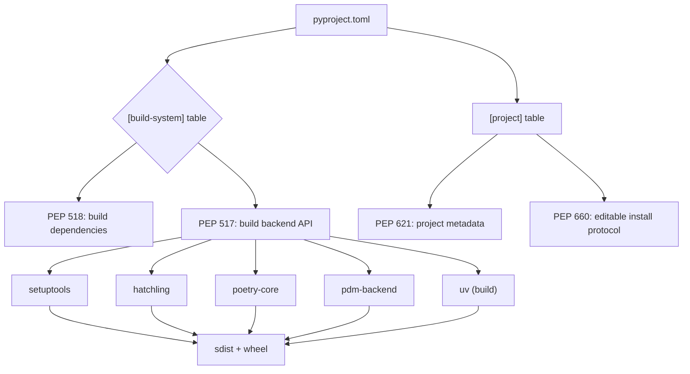
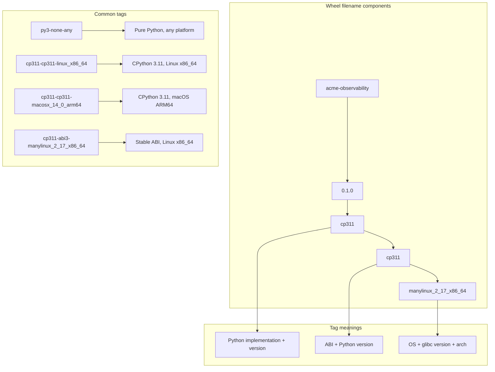
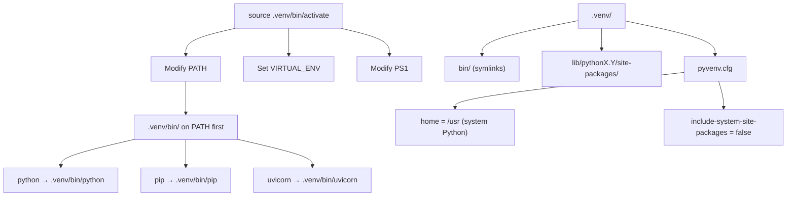
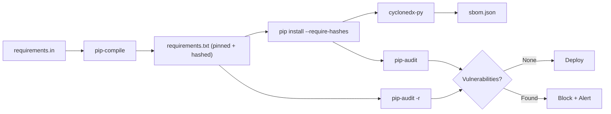
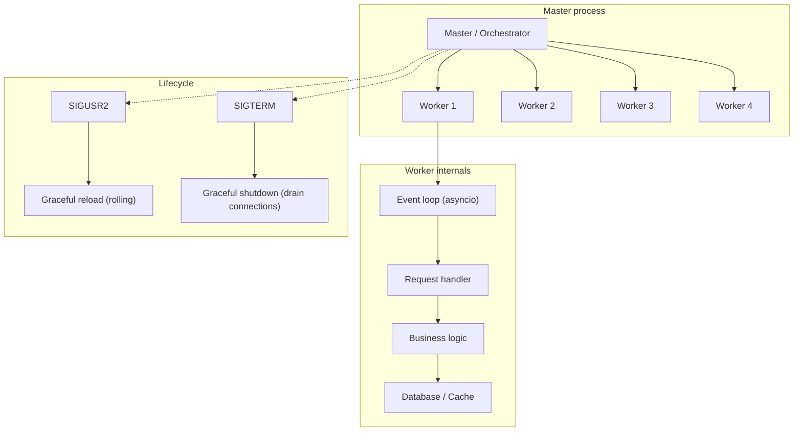
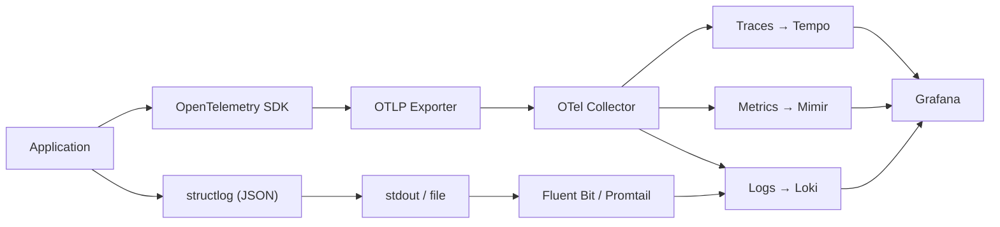
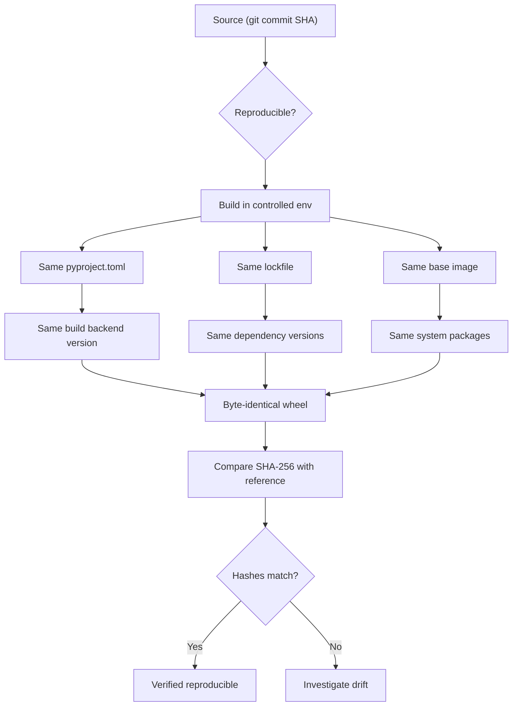
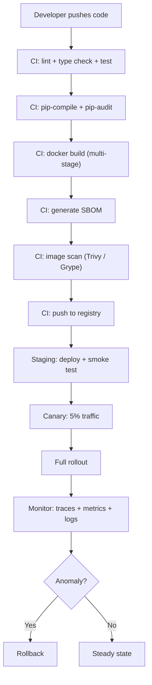

# Chapter 12 — Packaging, Distribution, and Production Deployment at Scale

**What this chapter covers.** Packaging Python for production is a pipeline that touches build backends, wheel formats, platform ABI tags, lockfiles, container images, supply-chain security, and runtime orchestration. This chapter dissects the modern packaging stack — `pyproject.toml` as the universal metadata format (PEP 517/518/621/660), build isolation, sdist vs wheel vs abi3 wheel, manylinux/musllinux platform tags, auditwheel and delocate for binary redistribution, lockfiles across the tool ecosystem, hermetic builds, SBOMs, Docker multi-stage images, and deployment topologies from gunicorn workers to autoscaled Kubernetes with JIT warmup. Every section connects back to the CPython internals you learned in earlier chapters — why `__pycache__` matters for image layering, why the import lock affects warmup, why bytecode compilation strategy changes cold-start latency.

Learning goals — after this chapter you should be able to:

- Construct a `pyproject.toml` that satisfies PEP 517, PEP 518, PEP 621, and PEP 660, choosing among setuptools, hatch, poetry, pdm, and uv as the build backend.
- Explain the difference between sdist, pure-Python wheel, platform-specific wheel, and abi3 wheel, and predict which `pip install` produces which artifact.
- Decode wheel filename tags (`cp311-cp311-manylinux_2_17_x86_64`) and explain how manylinux (PEP 600), musllinux, auditwheel, and delocate produce cross-distribution binary wheels.
- Generate and verify a lockfile (pip-tools `requirements.txt`, poetry.lock, pdm.lock, uv.lock), explain pinning semantics, and enforce `--require-hashes` for supply-chain hardening.
- Build a hermetic Docker image using multi-stage builds, choosing between `python:slim`, `python:distroless`, and `alpine`, and explain the trade-offs for image size, cold start, and attack surface.
- Generate a CycloneDX SBOM and run `pip-audit` in CI, integrating vulnerability scanning into a reproducible pipeline.
- Configure gunicorn/uvicorn workers with preloading, graceful reload, health probes, and autoscaling with JIT warmup in a Kubernetes environment.
- Instrument a production deployment with OpenTelemetry and structlog for observability.

> **Prerequisites.** Chapter 1 (source → bytecode → `__pycache__`), Chapter 9 (import system mechanics), and Chapter 10 (C extensions) provide foundational context for understanding why packaging formats, ABI tags, and bytecode compilation matter. Volume 13, Chapter 6 (Python runtime posture for services) covers runtime tuning.

---

## 1. The packaging landscape — a taxonomy of formats and metadata

Before diving into tools, you need the conceptual map. Python packaging has three orthogonal concerns:

| Concern | Question | Solved by |
|---------|----------|-----------|
| **Metadata** | What is this project? What does it depend on? | `pyproject.toml` (PEP 518/621) |
| **Build** | How do I produce an installable artifact? | Build backend (setuptools, hatch, poetry, pdm, uv) via PEP 517 |
| **Distribution** | How do I ship the artifact to users/CI? | PyPI, private index, vendored wheelhouse |

These are layered. PEP 518 defines the `pyproject.toml` format and the `[build-system]` table. PEP 517 defines the API that a build backend must expose (`build_wheel`, `build_sdist`, `get_requires_for_build_wheel`). PEP 621 defines the project metadata fields in `[project]`. PEP 660 defines the editable install protocol. Your build backend implements the PEP 517 API; your project metadata lives in `[project]`; and the rest of the tooling (pip, build, twine) calls the backend through that API.



### 1.1 pyproject.toml — the universal metadata file

`pyproject.toml` replaced `setup.py`, `setup.cfg`, and `MANIFEST.in` with a single TOML file. Here is a complete example:

```toml
# pyproject.toml — complete example for a backend service library
[build-system]
requires = ["hatchling>=1.21.0", "hatch-vcs>=0.4.0"]
build-backend = "hatchling.build"

[project]
name = "acme-observability"
dynamic = ["version"]
description = "Structured observability toolkit for Python backends"
readme = "README.md"
license = "MIT"
requires-python = ">=3.11"
authors = [
    { name = "Platform Team", email = "platform@acme.corp" },
]
classifiers = [
    "Development Status :: 4 - Beta",
    "Programming Language :: Python :: 3.11",
    "Programming Language :: Python :: 3.12",
    "Programming Language :: Python :: 3.13",
    "Framework :: AsyncIO",
    "Typing :: Typed",
]
dependencies = [
    "structlog>=24.1.0",
    "opentelemetry-api>=1.24.0",
    "opentelemetry-sdk>=1.24.0",
    "pydantic>=2.6.0,<3",
]

[project.optional-dependencies]
dev = [
    "pytest>=8.0",
    "pytest-asyncio>=0.23",
    "mypy>=1.8",
    "ruff>=0.3.0",
]
kafka = [
    "aiokafka>=0.10.0",
]

[project.urls]
Homepage = "https://github.com/acme/observability"
Documentation = "https://docs.acme.corp/observability"
Repository = "https://github.com/acme/observability"

[tool.hatch.version]
source = "vcs"

[tool.hatch.build.targets.wheel]
packages = ["src/acme"]

[tool.ruff]
target-version = "py311"
line-length = 100

[tool.mypy]
python_version = "3.11"
strict = true
```

Key points:

- `[build-system]` tells PEP 517 which backend to use. `requires` lists the build-time dependencies that pip installs in an isolated environment before calling the backend.
- `[project]` (PEP 621) is pure metadata — no Python code, no `setup()` function. It declares dependencies, optional dependencies, classifiers, URLs, and license.
- `dynamic = ["version"]` tells the backend to derive the version at build time (here, from git tags via `hatch-vcs`).
- `[tool.hatch.build.targets.wheel]` is backend-specific configuration that hatchling understands.

### 1.2 Build isolation — the process boundary that saves you

When you run `pip install .` or `python -m build`, pip creates an isolated build environment:

1. A temporary directory is created.
2. The `[build-system].requires` packages are installed into it via pip.
3. The build backend is invoked inside that environment to produce the artifact.
4. The artifact is then installed into the target environment.

This isolation prevents the build from depending on packages that happen to be installed in your system Python. It is the mechanism that makes `pyproject.toml` self-describing — the build requirements are explicit, not implicit.


Build isolation has a cost: the first build of a project installs all build dependencies from scratch. For CI, this is typically fine. For local development, tools like `pip install --no-build-isolation -e .` skip the isolation — but you must then ensure the build dependencies are already installed. Modern tools like uv handle this transparently.

### 1.3 Build backends compared

| Feature | setuptools | hatchling | poetry-core | pdm-backend | uv |
|---------|-----------|-----------|-------------|-------------|-----|
| `pyproject.toml` native | With `setup.cfg` or `pyproject.toml` | Yes (primary) | Yes (primary) | Yes (primary) | Yes (primary) |
| Plugin ecosystem | Extensive (decades) | Growing | Limited | Growing | Limited (new) |
| VCS version | `setuptools-scm` | `hatch-vcs` | Built-in | `pdm-version` | Built-in |
| Custom build steps | `cmdclass` / `setup.py` | Hatch build hooks | Poetry plugins | `pdm-backend` hooks | Build scripts |
| Speed | Baseline | Fast | Moderate | Fast | Fastest |
| Editable installs | PEP 660 (legacy `.pth`) | PEP 660 | PEP 660 | PEP 660 | PEP 660 |

For new projects, hatchling or uv offer the cleanest `pyproject.toml`-only experience. setuptools remains dominant in existing codebases. Poetry excels for application development where its lockfile + dependency resolver is valuable. pdm is PEP-compliant and offers a poetry-like UX. uv is the fastest, combining a resolver, installer, build backend, and virtual environment manager.

---

## 2. Artifact formats — sdist, wheel, and the ABI3 story

### 2.1 Source distributions (sdist)

An sdist is a tarball (`.tar.gz` or `.zip`) containing the source code plus the metadata needed to build the wheel. It is *not* directly installable — pip builds a wheel from it in an isolated environment, then installs the wheel. sdists exist for backward compatibility and for source-only distribution (pure-Python projects where there is no compilation step).

Key properties:
- Contains `pyproject.toml`, source files, and any files listed in `MANIFEST.in` or generated by the build backend.
- Building an sdist from a git repository requires all files to be tracked by git (setuptools uses `git archive`, hatchling uses `git` directly).
- sdists are used as the source-of-truth for reproducible builds: given the same sdist, the same environment, and the same build backend, you get the same wheel.

### 2.2 Wheels

A wheel (`.whl`) is a zip archive with a specific directory layout. It is the installable unit — pip unpacks it directly into `site-packages` without invoking the build backend.

The filename encodes everything:

```
acme-observability-0.1.0-cp311-cp311-manylinux_2_17_x86_64.whl
│                  │       │    │    │
│                  │       │    │    └─ platform tag
│                  │       │    └─ ABI tag
│                  │       └─ Python tag
│                  └─ version
└─ distribution name
```

For a pure-Python project:

```
acme-observability-0.1.0-py3-none-any.whl
```

The `py3-none-any` tag means: compatible with Python 3, no specific ABI, any platform. This is the universal wheel — installable on any system with Python 3+.



### 2.3 The stable ABI and abi3 wheels

CPython's stable ABI (introduced in PEP 384, refined in later PEPs) guarantees that C extensions compiled against the stable ABI on Python 3.2+ will work on any later Python 3.x without recompilation. The `abi3` tag in a wheel filename means the extension was compiled against the stable ABI.

A typical abi3 wheel:

```
acme_native-0.1.0-cp311-abi3-manylinux_2_17_x86_64.whl
```

The `cp311` means it was *built* with CPython 3.11, but `abi3` means it will *run* on 3.11, 3.12, 3.13, and beyond. This dramatically reduces the number of wheels you need to build and upload — one wheel covers all future CPython versions.

To use abi3, your C extension must:
1. Define `Py_LIMITED_API` before including `Python.h`.
2. Use only stable ABI functions and types.
3. Be compiled with `-DPy_LIMITED_API=0x030b0000` (for Python 3.11 minimum) or similar.

This is a real trade-off: you gain distribution simplicity but lose access to internal CPython APIs (which is why most ML libraries with deep CPython integration do *not* use abi3).

---

## 3. Platform tags — manylinux, musllinux, and binary distribution

### 3.1 The problem

Binary extensions (`.so` files) link against system libraries — `libpython`, `glibc`, `libm`, `libpthread`, and optionally `libssl`, `libcrypto`, `numpy`, `BLAS`, etc. A wheel built on Ubuntu 22.04 with glibc 2.35 will not run on a system with glibc 2.17 (CentOS 7). The platform tag in the wheel filename communicates the minimum OS/libc requirements.

### 3.2 manylinux (PEP 600)

The original manylinux standards (manylinux1, manylinux2010, manylinux2014) mapped to specific CentOS versions:

| Tag | CentOS version | glibc minimum |
|-----|----------------|---------------|
| `manylinux1` | CentOS 5 | 2.5 |
| `manylinux2010` | CentOS 6 | 2.12 |
| `manylinux2014` | CentOS 7 | 2.17 |

PEP 600 replaced the named versions with an explicit glibc version: `manylinux_2_17` means glibc ≥ 2.17. This is more transparent and future-proof — no more mapping between tag names and CentOS versions.

### 3.3 musllinux

`musllinux` covers Alpine Linux and other musl libc-based distributions. The tag format is `musllinux_1_2` (for musl libc ≥ 1.2). Alpine is popular in containers for its small image size, but many wheels are not published for musllinux, requiring compilation from source.

### 3.4 Auditwheel and delocate

These tools inspect a wheel's shared library dependencies and either:
- **Verify** the wheel is manylinux-compliant (no unexpected system library links).
- **Repair** the wheel by copying required `.so` files into the wheel and adjusting RPATHs.

```bash
# auditwheel: Linux
auditwheel repair my_extension-1.0-cp311-cp311-linux_x86_64.whl
# Produces: my_extension-1.0-cp311-cp311-manylinux_2_17_x86_64.whl

# delocate: macOS
delocate-wheel -w wheelhouse/ my_extension-1.0-cp311-cp311-macosx_14_0_arm64.whl
# Copies dylibs and adjusts @rpath
```

Auditwheel works by:
1. Scanning the wheel for `.so` files.
2. Running `ldd` on each to find shared library dependencies.
3. Checking each dependency against a whitelist (the manylinux allowed libraries).
4. If dependencies are outside the whitelist, copying them into the wheel and rewriting RPATHs.

This is the mechanism that makes binary wheels portable across Linux distributions.

---

## 4. Lockfiles — pinning the dependency graph

### 4.1 Why lockfiles matter

A `requirements.txt` with `requests>=2.31` is a *specification*, not a lockfile. The actual resolved versions depend on when you install, what other packages are present, and what the resolver decides. In production, you want deterministic dependency resolution — the same lockfile on every machine, in every CI run, in every container build.

Lockfiles capture the *resolved* dependency graph — every direct and transitive dependency at an exact version, with hashes for verification.

### 4.2 The lockfile ecosystem

| Tool | Lockfile | Resolver | Notes |
|------|----------|----------|-------|
| pip-tools | `requirements.txt` (pinned) | pip resolver | Simple, pip-native, best for plain `pip` workflows |
| Poetry | `poetry.lock` | Custom resolver | Full project management, not pip-compatible lockfile |
| PDM | `pdm.lock` | Custom resolver | PEP-compliant, pyproject.toml-native |
| uv | `uv.lock` | Rust-based resolver | Fastest, pip-compatible output, uv-native |
| pip (lock mode) | `requirements.txt` (with hashes) | pip resolver | New in pip 24.0+, experimental |

### 4.3 pip-compile workflow

pip-tools (`pip-compile`) is the most widely used lockfile generator for plain pip projects:

```bash
# Compile a pinned requirements file from a loose requirements.in
pip-compile requirements.in --output-file=requirements.txt --generate-hashes

# Install from the pinned file — guarantees exact versions
pip install -r requirements.txt --require-hashes
```

Example `requirements.in`:

```
fastapi>=0.109.0
uvicorn[standard]>=0.27.0
structlog>=24.1.0
```

Example output of `requirements.txt` (trimmed):

```txt
#
# This file is autogenerated by pip-compile with Python 3.11
# Hashes for the following packages are verified for reproducibility.
#
fastapi==0.109.2 \
    --hash=sha256:a1b2c3... \
    --hash=sha256:d4e5f6...
    # via -r requirements.in
uvicorn==0.27.1 \
    --hash=sha256:789abc... \
    # via -r requirements.in
structlog==24.1.0 \
    --hash=sha256:def456... \
    # via -r requirements.in
```

The `--generate-hashes` flag adds SHA-256 hashes for every wheel/sdist, enabling `--require-hashes` on install to verify integrity.

### 4.4 uv.lock — the fast path

uv generates and resolves lockfiles at Rust speed:

```bash
# Initialize a project with uv
uv init my-service
cd my-service

# Add dependencies
uv add fastapi uvicorn[standard] structlog

# The lockfile uv.lock is created automatically
# Install from the lockfile
uv sync

# Or export to requirements.txt for pip users
uv export --no-hashes -o requirements.txt
```

uv.lock is TOML-based, stores the full dependency graph, and resolves in seconds where pip-compile might take minutes.

### 4.5 Requirements hashing and supply-chain hardening

Hash verification protects against three attack vectors:
1. **Typosquatting** — a malicious package with a name similar to a popular one.
2. **Dependency confusion** — a private package name published to a public index.
3. **PyPI account takeover** — a legitimate package replaced with a malicious version.

```bash
# Generate hashes for a requirements file
pip-compile requirements.in --generate-hashes

# Install with hash verification — pip rejects any package whose hash doesn't match
pip install -r requirements.txt --require-hashes --no-deps

# For a private index + hash verification
pip install -r requirements.txt --require-hashes \
    --extra-index-url https://pypi.acme.corp/simple/ \
    --no-index
```

The `--no-index` flag with a vendored wheelhouse makes the install fully hermetic — no network access at all.

---

## 5. Environments — venv, conda, and container layering

### 5.1 venv vs conda/mamba

| Aspect | venv | conda/mamba |
|--------|------|-------------|
| Scope | Python packages only | Python + non-Python (C libs, R, etc.) |
| Resolver | pip (or uv) | conda resolver (or mamba/libmamba) |
| Python versions | System Python or pyenv | Separate Python installations per env |
| Speed | Fast (lightweight) | Slow (full solver), mamba is faster |
| Use case | Backend services, libraries | Data science, ML, system-level deps |

For backend services, venv + pip/uv is the standard. conda is valuable when you need `libopenblas`, `libhdf5`, or other system-level libraries without installing them via the OS package manager.

### 5.2 venv activation — what actually happens

When you run `source .venv/bin/activate`, a shell script modifies three environment variables:

1. `PATH` — prepends `.venv/bin/` so that `python`, `pip`, `uvicorn`, etc. resolve to the venv's versions.
2. `VIRTUAL_ENV` — set to the venv root, used by tools to detect they are inside a venv.
3. `PS1` — modified to show the venv name in your shell prompt.

Critically, the venv's `python` binary is either a symlink or a copy of the system Python. The venv does not contain a separate Python installation — it contains only `site-packages`, `bin/` symlinks, and `pyvenv.cfg`.



### 5.3 Python-specific Docker images

| Image | Base | Size (approx) | Python | Use case |
|-------|------|---------------|--------|----------|
| `python:3.12` | Debian Bookworm | ~1 GB | Full CPython | Development, debugging |
| `python:3.12-slim` | Debian Bookworm (minimal) | ~150 MB | Full CPython | Production (most common) |
| `python:3.12-alpine` | Alpine Linux | ~50 MB | Full CPython + musl | Smallest images, musl caveats |
| `gcr.io/distroless/python3-debian12` | Distroless | ~40 MB | Python only | Minimal attack surface |
| `chainguard/python` | Wolfi | ~40 MB | Python only | Supply-chain hardened |

The trade-off is clear: smaller base image means faster pulls and smaller attack surface, but Alpine uses musl (ABI incompatibility with manylinux wheels), and distroless has no shell (harder to debug).

### 5.4 venv vs container layering


In a container, you typically do *not* use venv — the container itself is the isolation boundary. The base image provides Python, `pip install` adds dependencies, and `COPY` adds your code. Layer ordering matters for cache efficiency: change the layer that changes most often (your code) last.

---

## 6. Docker multi-stage builds for Python

Multi-stage builds separate the build environment from the runtime environment. This is critical for Python because build tools (compilers, header files, build dependencies) are large and should not ship in the final image.

### 6.1 The Dockerfile

```dockerfile
# Stage 1: Build dependencies and wheel
FROM python:3.12-slim AS builder

WORKDIR /app

# Install build essentials for any C extensions
RUN apt-get update && apt-get install -y --no-install-recommends \
    build-essential \
    libpq-dev \
    && rm -rf /var/lib/apt/lists/*

# Create a virtualenv to isolate from the system Python
RUN python -m venv /opt/venv
ENV PATH="/opt/venv/bin:$PATH"

# Install dependencies from lockfile (layer cached)
COPY requirements.txt .
RUN pip install --no-cache-dir -r requirements.txt

# Install the application itself
COPY . .
RUN pip install --no-cache-dir .

# Stage 2: Runtime image
FROM python:3.12-slim AS runtime

# Install runtime-only system libraries
RUN apt-get update && apt-get install -y --no-install-recommends \
    libpq5 \
    tini \
    && rm -rf /var/lib/apt/lists/*

# Copy the virtualenv from the builder
COPY --from=builder /opt/venv /opt/venv
ENV PATH="/opt/venv/bin:$PATH"

# Compile bytecode for faster startup
RUN python -m compileall /opt/venv/lib/python3.12/site-packages/ \
    --optimize=1 \
    -q

# Suppress bytecode recompilation at runtime
ENV PYTHONDONTWRITEBYTECODE=1

# Create a non-root user
RUN groupadd -r app && useradd -r -g app -d /app app
WORKDIR /app
USER app

# Health check
HEALTHCHECK --interval=30s --timeout=5s --retries=3 \
    CMD python -c "import urllib.request; urllib.request.urlopen('http://localhost:8000/health')"

ENTRYPOINT ["tini", "--"]
CMD ["uvicorn", "acme_service.main:app", "--host", "0.0.0.0", "--port", "8000", "--workers", "4"]
```

### 6.2 Key decisions in the Dockerfile

**Why venv inside the container?** Even though the container is an isolation boundary, using a venv ensures that system Python packages (pip, setuptools) do not interfere with your application's dependencies. It also makes `COPY --from=builder` clean — you copy a self-contained directory, not a mutation of the system Python.

**`python -m compileall --optimize=1`** pre-compiles `.py` files to `.pyc` bytecode. The `--optimize=1` flag strips assertion bytecode (the `-O` flag), making bytecode slightly smaller. This runs during build, not at runtime, so the cold-start cost is paid once.

**`PYTHONDONTWRITEBYTECODE=1`** prevents Python from writing `.pyc` files at runtime. Since we pre-compiled bytecode in the build, there is no need to regenerate it — and suppressing writes saves I/O and keeps the filesystem immutable.

**`tini`** is a minimal init process that handles signal forwarding and zombie reaping. Without it, your Python process becomes PID 1 and must handle `SIGTERM` for graceful shutdown. With `tini`, signals are forwarded correctly.

**Layer ordering** is optimized for cache:
1. System packages (change rarely).
2. `requirements.txt` + `pip install` (change when dependencies change).
3. Application code + `pip install .` (changes on every commit).

### 6.3 Slim vs distroless vs Alpine

| Criterion | `python:slim` | `python:alpine` | distroless |
|-----------|---------------|-----------------|------------|
| Size | ~150 MB | ~50 MB | ~40 MB |
| libc | glibc | musl | glibc |
| Shell | Yes | Yes | No |
| Package manager | apt | apk | None |
| Debugging | Easy | Easy | `debug` variant only |
| manylinux wheels | Yes | No (musl) | Yes |
| Cold start | Baseline | Slightly faster (less to load) | Fastest (minimal) |

**Alpine caveat**: musl libc means manylinux wheels (which link against glibc) do not work. You must compile everything from source, which increases build time and complexity. For most backend services, `python:slim` is the right choice.

**Distroless** is ideal for supply-chain hardening: no shell means a compromised package cannot spawn a reverse shell. But debugging requires the `-debug` variant or `kubectl exec` with a sidecar. Teams comfortable with sidecar debugging patterns get the smallest, most secure runtime.

---

## 7. Hermetic builds — no network, no surprises

A hermetic build is one where no external resources are fetched during installation. The dependencies are vendored in a wheelhouse directory, and `pip install` uses `--no-index` to prevent any network access.

### 7.1 Creating a wheelhouse

```bash
# Download all wheels to a local directory
pip download -r requirements.txt \
    --dest wheelhouse/ \
    --only-binary=:all: \
    --python-version 3.12 \
    --platform manylinux_2_17_x86_64 \
    --platform musllinux_1_2_x86_64 \
    --platform macosx_14_0_arm64 \
    --platform win_amd64

# Verify all wheels have hashes
pip-compile requirements.in --generate-hashes --output-file=requirements-hashed.txt
```

### 7.2 Installing from the wheelhouse

```dockerfile
# In the Dockerfile
COPY wheelhouse /wheelhouse
RUN pip install --no-index \
    --find-links=/wheelhouse \
    -r requirements-hashed.txt \
    --require-hashes \
    --no-deps
```

The `--no-deps` flag is important — it tells pip to trust the lockfile and not attempt any further resolution. Combined with `--require-hashes`, this ensures that every installed package was explicitly declared, pinned, and verified.

### 7.3 Supply-chain threat model

| Threat | Mitigation |
|--------|-----------|
| Typosquatting (e.g., `python-dateutil` vs `python-dateutil2`) | Lockfile with hashes — only known packages are installed |
| Dependency confusion (private name published to PyPI) | `--extra-index-url` priority + `--no-index` in production |
| Compromised maintainer account | Hash pinning + `pip-audit` in CI + Sigstore verification |
| Malicious build script (`setup.py` code execution) | Build isolation (PEP 517) + no `setup.py` in pyproject.toml-only projects |
| Compromised base image | Distroless / Chainguard images + image signing |

---

## 8. SBOMs and vulnerability scanning

### 8.1 Software Bill of Materials (SBOM)

An SBOM is a machine-readable inventory of every component in your software. For Python, this includes every direct and transitive dependency, their versions, licenses, and origins.

CycloneDX is the standard format. The `cyclonedx-bom` tool generates SBOMs:

```bash
# Install the SBOM generator
pip install cyclonedx-bom

# Generate an SBOM from a requirements file
cyclonedx-py environment \
    --output-file sbom.json \
    --format json \
    --spec-version 1.6

# Or generate from a pip freeze
pip freeze --exclude-editable | cyclonedx-py requirements \
    --output-file sbom.json \
    --format json \
    --spec-version 1.6
```

### 8.2 pip-audit — vulnerability scanning

`pip-audit` checks installed packages against the OSV (Open Source Vulnerabilities) database:

```bash
# Install pip-audit
pip install pip-audit

# Audit installed packages
pip-audit

# Audit a requirements file (without installing)
pip-audit -r requirements.txt

# Audit with hashes for supply-chain verification
pip-audit -r requirements.txt --require-hashes

# Output as CycloneDX SBOM
pip-audit --format cyclonedx-json --output sbom-vuln.json
```

### 8.3 CI pipeline — pip-compile + pip-audit

```yaml
# .github/workflows/security.yml
name: Supply Chain Security

on:
  push:
    branches: [main]
  pull_request:
    branches: [main]
  schedule:
    - cron: "0 6 * * 1"  # Weekly audit

jobs:
  compile-and-audit:
    runs-on: ubuntu-latest
    steps:
      - uses: actions/checkout@v4

      - uses: actions/setup-python@v5
        with:
          python-version: "3.12"

      - name: Install tools
        run: pip install pip-tools pip-audit cyclonedx-bom

      - name: Compile requirements with hashes
        run: |
          pip-compile requirements.in \
            --output-file=requirements.txt \
            --generate-hashes

      - name: Install from pinned requirements
        run: pip install -r requirements.txt --require-hashes

      - name: Audit installed packages
        run: pip-audit --strict --progress-spinner off

      - name: Audit requirements file
        run: pip-audit -r requirements.txt --require-hashes --strict

      - name: Generate SBOM
        run: |
          cyclonedx-py environment \
            --output-file sbom.json \
            --format json \
            --spec-version 1.6

      - name: Upload SBOM
        uses: actions/upload-artifact@v4
        with:
          name: sbom
          path: sbom.json

      - name: Check lockfile is up to date
        run: |
          pip-compile requirements.in \
            --output-file=requirements-check.txt \
            --generate-hashes
          diff requirements.txt requirements-check.txt || \
            (echo "Lockfile is stale — run pip-compile" && exit 1)
```

This pipeline does four things:
1. Compiles a fresh lockfile with hashes.
2. Installs from the lockfile and audits both the installed environment and the lockfile.
3. Generates a CycloneDX SBOM for compliance and tracking.
4. Verifies that the checked-in lockfile is up to date (catches stale lockfiles).



---

## 9. Deployment at scale — gunicorn, uvicorn, and the process model

### 9.1 The worker process model

A Python web service at scale runs multiple worker processes, each with its own GIL, memory space, and event loop (for async frameworks). The process manager (gunicorn, uvicorn with workers, or Kubernetes) handles lifecycle:



### 9.2 gunicorn configuration

```python
# gunicorn.conf.py — production configuration
import multiprocessing
import os

# Server mechanics
bind = os.getenv("BIND", "0.0.0.0:8000")
workers = int(os.getenv("WEB_CONCURRENCY", multiprocessing.cpu_count() * 2 + 1))
worker_class = "uvicorn.workers.UvicornWorker"
worker_connections = 1000
timeout = 120
graceful_timeout = 30
keepalive = 5

# Preloading — import the application in the master, fork into workers
preload_app = True

# Logging
loglevel = os.getenv("LOG_LEVEL", "info")
accesslog = "-"  # stdout
errorlog = "-"   # stderr
access_log_format = '%(h)s %(l)s %(u)s %(t)s "%(r)s" %(s)s %(b)s "%(f)s" "%(a)s" %(D)s'

# Worker recycling — prevent memory leaks
max_requests = 10000
max_requests_jitter = 1000
```

Key decisions:

- **`preload_app = True`** imports the application in the master process before forking. This means:
  - The import graph is resolved once, not per-worker.
  - Memory is shared (copy-on-write) across workers for imported modules.
  - But: any import-time side effects run in the master — if the master crashes during import, no workers start.

- **`worker_class = "uvicorn.workers.UvicornWorker"`** runs ASGI applications (FastAPI, Starlette) inside gunicorn. Gunicorn handles process management; uvicorn handles the ASGI protocol.

- **`max_requests = 10000`** restarts workers after 10k requests, preventing slow memory leaks. The jitter (±1000) prevents all workers from restarting simultaneously.

### 9.3 uvicorn standalone configuration

For ASGI-only deployments, uvicorn can manage workers directly:

```bash
uvicorn acme_service.main:app \
    --host 0.0.0.0 \
    --port 8000 \
    --workers 4 \
    --loop uvloop \
    --http httptools \
    --log-level info \
    --access-log
```

uvloop and httptools are C extensions that accelerate the event loop and HTTP parsing respectively — typically 2-4x faster than the pure-Python asyncio event loop for I/O-bound workloads.

### 9.4 Health probes

Kubernetes uses liveness, readiness, and startup probes to manage traffic routing:

```python
# acme_service/main.py
from fastapi import FastAPI
from contextlib import asynccontextmanager
import asyncio

app = FastAPI()

# Application state — set during startup
_app_ready = False
_db_connected = False


@asynccontextmanager
async def lifespan(app: FastAPI):
    global _app_ready, _db_connected
    # Startup: connect to DB, load ML models, etc.
    _db_connected = await connect_to_database()
    _app_ready = True
    yield
    # Shutdown: close connections, flush buffers
    await close_database()


app = FastAPI(lifespan=lifespan)


@app.get("/health")
async def health():
    """Liveness probe — is the process alive and responsive?"""
    return {"status": "ok"}


@app.get("/ready")
async def readiness():
    """Readiness probe — is the service ready to serve traffic?"""
    if not _app_ready:
        return {"status": "not_ready", "reason": "application not initialized"}, 503
    if not _db_connected:
        return {"status": "not_ready", "reason": "database not connected"}, 503
    return {"status": "ok"}


@app.get("/startup")
async def startup():
    """Startup probe — has the application finished initializing?"""
    if _app_ready:
        return {"status": "ok"}
    return {"status": "starting"}, 503
```

In Kubernetes:

```yaml
livenessProbe:
  httpGet:
    path: /health
    port: 8000
  initialDelaySeconds: 10
  periodSeconds: 30
  failureThreshold: 3
readinessProbe:
  httpGet:
    path: /ready
    port: 8000
  initialDelaySeconds: 5
  periodSeconds: 10
  failureThreshold: 3
startupProbe:
  httpGet:
    path: /startup
    port: 8000
  periodSeconds: 5
  failureThreshold: 30  # 150s max startup time
```

The startup probe allows slow-starting services (loading large ML models, establishing connection pools) without being killed by the liveness probe.

### 9.5 Autoscaling with JIT warmup

Python services have a warm-up phase after startup: JIT compilers (PyPy, or Python's own adaptive interpreter) need to observe hot code paths before optimizing. ML services need to load models into GPU memory. The import graph itself takes time to resolve (as covered in Chapter 9).

**JIT warmup strategy**: trigger representative traffic through the service before marking it ready, so the JIT has seen real patterns.

```python
# Warmup endpoint — called by load balancer or orchestrator
@app.post("/warmup")
async def warmup():
    """Execute representative code paths to trigger JIT optimization."""
    from acme_service.analytics import compute_metrics
    from acme_service.serialization import serialize_response
    from acme_service.validation import validate_payload

    # Run 100 representative iterations
    for _ in range(100):
        result = compute_metrics(sample_payload)
        serialized = serialize_response(result)
        validate_payload(sample_payload)

    return {"status": "warmed_up", "iterations": 100}
```

For Kubernetes autoscaling (HPA), use custom metrics to trigger scale-up *before* latency degrades:

```yaml
apiVersion: autoscaling/v2
kind: HorizontalPodAutoscaler
metadata:
  name: acme-service
spec:
  scaleTargetRef:
    apiVersion: apps/v1
    kind: Deployment
    name: acme-service
  minReplicas: 3
  maxReplicas: 50
  metrics:
    - type: Pods
      pods:
        metric:
          name: http_requests_per_second
        target:
          type: AverageValue
          averageValue: "1000"
  behavior:
    scaleUp:
      stabilizationWindowSeconds: 60
      policies:
        - type: Pods
          value: 4
          periodSeconds: 60
    scaleDown:
      stabilizationWindowSeconds: 300
      policies:
        - type: Percent
          value: 10
          periodSeconds: 120
```

The scale-down stabilization window (300s) is intentionally slow to prevent flapping and to allow JIT-warmed instances to absorb traffic spikes.

---

## 10. Observability — OpenTelemetry and structlog

### 10.1 OpenTelemetry for Python

OpenTelemetry (OTel) is the vendor-neutral observability standard. For Python, the SDK provides automatic instrumentation for common libraries (FastAPI, requests, SQLAlchemy, etc.) and manual instrumentation for custom code.

```python
# acme_service/telemetry.py
from opentelemetry import trace
from opentelemetry.sdk.trace import TracerProvider
from opentelemetry.sdk.trace.export import BatchSpanProcessor
from opentelemetry.exporter.otlp.proto.grpc.trace_exporter import OTLPSpanExporter
from opentelemetry.instrumentation.fastapi import FastAPIInstrumentor
from opentelemetry.instrumentation.httpx import HTTPXClientInstrumentor
from opentelemetry.instrumentation.sqlalchemy import SQLAlchemyInstrumentor


def setup_telemetry(service_name: str, otlp_endpoint: str = "http://otel-collector:4317"):
    """Initialize OpenTelemetry tracing and auto-instrumentation."""
    # Configure the tracer
    provider = TracerProvider(resource={"service.name": service_name})
    exporter = OTLPSpanExporter(endpoint=otlp_endpoint)
    provider.add_span_processor(BatchSpanProcessor(exporter))
    trace.set_tracer_provider(provider)

    # Auto-instrument common libraries
    FastAPIInstrumentor.instrument()
    HTTPXClientInstrumentor.instrument()
    # SQLAlchemyInstrumentor.instrument(engine=db_engine)  # after engine creation

    return provider
```

### 10.2 structlog — structured logging

structlog produces structured (JSON) logs that are machine-parseable and correlated with traces via trace IDs:

```python
# acme_service/logging_config.py
import structlog
import logging
from opentelemetry import trace


def add_trace_context(logger, method_name, event_dict):
    """Inject current trace/span IDs into structured logs."""
    span = trace.get_current_span()
    ctx = span.get_span_context()
    if ctx and ctx.trace_id:
        event_dict["trace_id"] = format(ctx.trace_id, "032x")
        event_dict["span_id"] = format(ctx.span_id, "016x")
    return event_dict


structlog.configure(
    processors=[
        structlog.contextvars.merge_contextvars,
        add_trace_context,
        structlog.processors.TimeStamper(fmt="iso"),
        structlog.processors.add_log_level,
        structlog.processors.StackInfoRenderer(),
        structlog.processors.format_exc_info,
        structlog.processors.JSONRenderer(),
    ],
    wrapper_class=structlog.make_filtering_bound_logger(logging.INFO),
    context_class=dict,
    logger_factory=structlog.PrintLoggerFactory(),
    cache_logger_on_first_use=True,
)


# Usage in application code
log = structlog.get_logger()


@app.post("/api/v1/events")
async def create_event(payload: EventPayload):
    log.info("event_received", event_type=payload.type, size=len(payload.data))
    result = await process_event(payload)
    log.info("event_processed", event_type=payload.type, duration_ms=result.duration_ms)
    return result
```

The correlation between traces (OpenTelemetry) and logs (structlog) via `trace_id` and `span_id` is what makes debugging distributed systems feasible — you can jump from a log line to the full trace, or from a trace to all related logs.

### 10.3 The full observation stack



---

## 11. Reproducible build verification

Reproducibility means: given the same source, the same environment, and the same tools, you produce the same artifact. For Python, this requires controlling:

1. **Source** — same commit, same working tree.
2. **Build dependencies** — same versions of the build backend and its plugins.
3. **System dependencies** — same OS, same libc, same compilers.
4. **Environment variables** — `SOURCE_DATE_EPOCH`, `PYTHONDONTWRITEBYTECODE`, `LC_ALL=C`.
5. **Timestamps** — `SOURCE_DATE_EPOCH` pins the modification time in archives and pyc headers.



Verification command:

```bash
# Build twice and compare
SOURCE_DATE_EPOCH=0 python -m build --wheel -o dist1/
SOURCE_DATE_EPOCH=0 python -m build --wheel -o dist2/

# Compare checksums
sha256sum dist1/*.whl dist2/*.whl
# Should be identical
```

---

## 12. End-to-end deployment flow

Putting it all together: a modern Python service goes from code to production through this pipeline:



---

## Key takeaways

- **`pyproject.toml` is the single source of truth** for Python project metadata. PEP 517 (build API), PEP 518 (build dependencies), PEP 621 (project metadata), and PEP 660 (editable installs) define the complete contract. Use hatchling or uv for clean `pyproject.toml`-only projects; setuptools for legacy compatibility.

- **Wheels are the installable unit; sdists are the source-of-truth.** Pure-Python wheels (`py3-none-any`) are universal. Binary wheels carry platform tags (`manylinux_2_17_x86_64`) that encode glibc minimums. The stable ABI (`abi3`) lets one wheel cover all future CPython versions.

- **Lockfiles with hashes are non-negotiable for production.** `pip-compile --generate-hashes` or `uv.lock` captures the exact dependency graph. `--require-hashes` on install rejects tampered packages. This is your primary defense against typosquatting, dependency confusion, and account takeover.

- **Docker multi-stage builds separate build from runtime.** Build dependencies (compilers, headers) stay in the builder stage; only the virtualenv and runtime libraries ship in the final image. Pre-compile bytecode (`compileall --optimize=1`) and suppress runtime writes (`PYTHONDONTWRITEBYTECODE=1`) for faster cold starts.

- **Hermetic builds (`--no-index` + vendored wheelhouse) eliminate network surprises.** Combined with hash verification, they produce fully reproducible installations. The `--no-deps` flag tells pip to trust the lockfile without resolving.

- **SBOMs and vulnerability scanning are not optional.** `cyclonedx-bom` generates machine-readable inventories; `pip-audit` checks against the OSV database. Integrate both into CI with a stale-lockfile check to catch drift.

- **gunicorn + uvicorn workers with preloading give you process isolation + async performance.** `preload_app = True` shares the import graph across workers via copy-on-write. `max_requests` with jitter prevents slow memory leaks. Health probes (`/health`, `/ready`, `/startup`) map to Kubernetes liveness, readiness, and startup probes.

- **Autoscaling needs JIT warmup.** Python's adaptive interpreter, JIT compilers, and ML model loading all require warm-up traffic. Trigger representative requests during startup, and configure HPA with custom metrics and generous scale-down stabilization.

- **Observability requires correlated traces + logs.** OpenTelemetry provides traces; structlog provides structured logs. Inject `trace_id` and `span_id` into every log line to enable cross-signal correlation.

---

## Further reading

**Pinned references (start here):**

- [PEP 517 — Build backend API](https://peps.python.org/pep-0517/) — defines the interface that build backends must implement (`build_wheel`, `build_sdist`, `get_requires_for_build_wheel`).
- [PEP 518 — pyproject.toml and build dependencies](https://peps.python.org/pep-0518/) — defines the `[build-system]` table and how build dependencies are specified.
- [PEP 621 — Project metadata in pyproject.toml](https://peps.python.org/pep-0621/) — defines the `[project]` table for all project metadata.
- [PEP 660 — Editable installs](https://peps.python.org/pep-0660/) — defines the editable install protocol for build backends.
- [PEP 600 — Flexible manylinux platform tags](https://peps.python.org/pep-0600/) — replaces named manylinux versions with explicit glibc minimums (`manylinux_2_17`).
- [pip-audit](https://github.com/pypa/pip-audit) — vulnerability scanner for Python packages, backed by the OSV database.
- [packaging.python.org](https://packaging.python.org/) — the official Python packaging user guide, covering pyproject.toml, build backends, and distribution.
- [CycloneDX Python](https://github.com/CycloneDX/cyclonedx-python) — SBOM generation for Python environments.

**Additional references:**

- [manylinux](https://github.com/pypa/manylinux) — the manylinux Docker images and auditwheel tooling for building portable Linux wheels.
- [auditwheel](https://github.com/pypa/auditwheel) — repair and audit Linux wheels for manylinux compliance.
- [uv](https://github.com/astral-sh/uv) — Rust-based Python package manager, resolver, and build backend.
- [structlog](https://www.structlog.org/) — structured logging library for Python.
- [OpenTelemetry Python](https://opentelemetry.io/docs/languages/python/) — auto-instrumentation and manual tracing for Python services.
- [gunicorn](https://docs.gunicorn.org/) — Python WSGI HTTP server with preloading, worker management, and graceful reload.
- [Docker best practices for Python](https://docs.docker.com/build/building/best-practices/) — official Docker guidance on layer caching, multi-stage builds, and image size.
