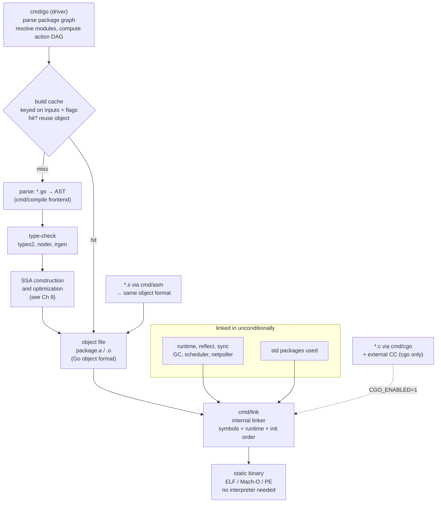
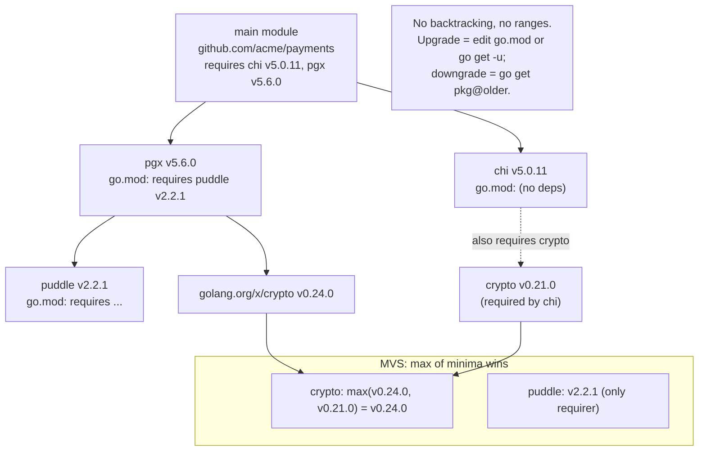
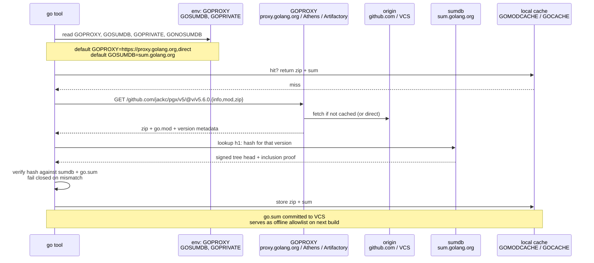
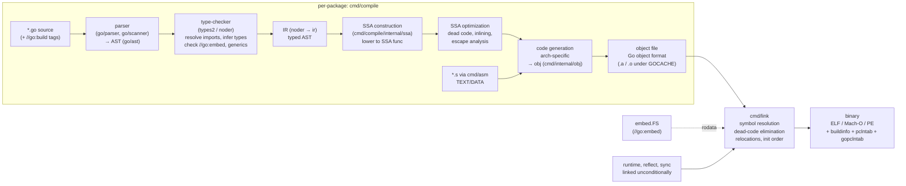
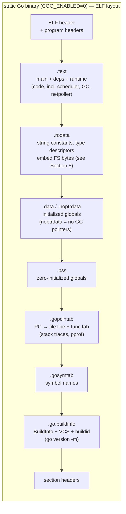
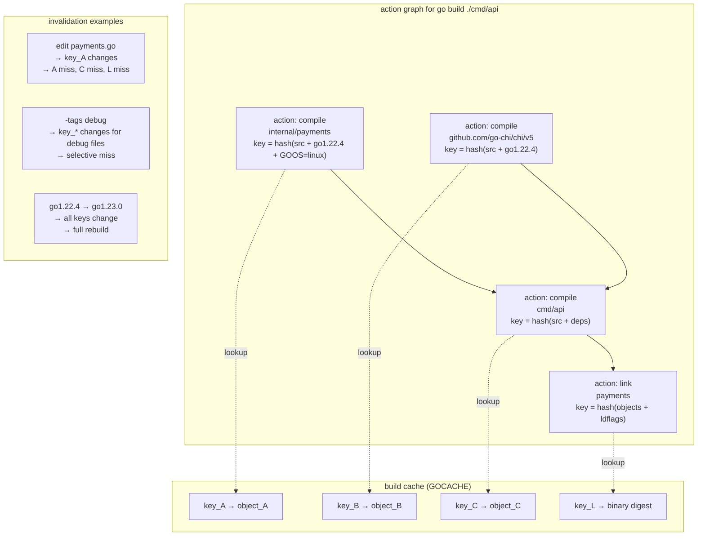
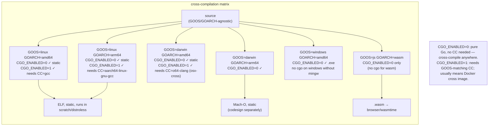

# Chapter 1 — The Go Toolchain: Modules, Build, Linker, and the Static Binary Model

**What this chapter covers.** Every Go service you ship — the binary in a `FROM scratch` container, the CLI on a developer laptop, the Lambda handler — is the product of a hermetic, opinionated toolchain that has no `Makefile`, no external linker, and no runtime dependency. Understanding that toolchain is the prerequisite for every later chapter: the compiler pipeline that produces SSA (Ch 9), the runtime that gets linked in (Ch 4–5), and the assembly you drop into with `cgo` (Ch 11). This chapter traces a Go build end-to-end: how `cmd/go` drives `cmd/compile` and `cmd/link`, how modules resolve with Minimal Version Selection, how the internal linker produces a static binary, and how the same machinery enables hermetic CI and cross-compilation. You will run every command that matters and read the outputs that prove what happened.

Learning goals — after this chapter you should be able to:

- Explain the Go tool's driver architecture — what `cmd/go` orchestrates and how it invokes `cmd/compile`, `cmd/asm`, and `cmd/link` without an external `ld` — and read a `go build -x -a` trace to account for each action.
- Author and diagnose `go.mod` / `go.sum` correctly: MVS resolution, `GOPATH` vs. modules, `GOPROXY`/`GOSUMDB`/`GOPRIVATE`, and the `go`/`toolchain` directives that pin the compiler itself.
- Use the core `go` commands fluently — `build`, `vet`, `test`, `work`, `list`, `env`, `version -m` — to inspect dependencies, build info, and linker inputs.
- Describe the compile pipeline (parse → type-check → SSA → object file) and the internal linker's job (symbol resolution, dead-code elimination, static linking), including the `cgo` exception and `CGO_ENABLED=0`.
- Apply build constraints, build tags, `embed`, and link flags (`-ldflags -X`, `-buildmode`, `-trimpath`) to control what ships in the binary, and produce reproducible, attestable artifacts.
- Cross-compile correctly with `GOOS`/`GOARCH` and reason about `cgo` breakage, `CC`/`CXX` selection, and `GOMEMLIMIT`-style toolchain versioning for hermetic CI and distroless containers.

> **Scope.** This is the toolchain you invoke. Volume 13, Chapter 2 — The Go Runtime — covers what the linked-in runtime *does* at execution (scheduler, GC, netpoller). Volume 17, Chapter 9 — Compiler Pipeline — deep-dives SSA, escape analysis, and optimizations. Chapter 10 covers `vet`, `pprof`, `trace`, and the race detector as instruments; here we cover `vet` and `test` as *build commands*. For supply-chain hardening of the build itself (hermetic builds, SLSA provenance), see Companion Book 4, Chapters 2–3.

---

## 1. The tool that is also a build system

Most language toolchains are a loose bag of programs glued by `make`. Go's toolchain is a single driver — `cmd/go` — that owns parsing flags, resolving packages, scheduling compilation, caching, and linking. The pieces it drives live under `src/cmd` in the Go repository:

| Tool | Package | Role |
|------|---------|------|
| `go` | `cmd/go` | Driver: parses `go build`/`test`/`vet`/`list`, computes the action graph, drives compilation and linking, manages downloads and the build cache |
| `compile` | `cmd/compile` | Compiler frontend: one invocation per package, `*.go` → object file (`.o`-like, but Go's own format). No separate preprocessor; handles parsing, type-check, SSA |
| `asm` | `cmd/asm` | Assembler for `*.s` (Go assembly, `TEXT`/`DATA` pseudo-instructions), also produces object files consumed by the linker |
| `link` | `cmd/link` | Internal linker: consumes package objects + runtime objects → ELF/Mach-O/PE/ wasm binary. No `ld`, `gold`, or `lld` in the default path |
| `cgo` | `cmd/cgo` | Translates `import "C"` packages: generates Go shims + C stubs, invokes the C compiler for the C fragments; only active when `CGO_ENABLED=1` |
| `vet` | `cmd/vet` (via `go vet` / `golang.org/x/tools`) | Static analyzer suite run as a build action; shares the same package loader |
| `cover` / `test2json` | `cmd/cover`, `cmd/test2json` | Instrumentation for `go test -cover` and structured test output |

There is no `ld` on the happy path. The Go linker is written in Go, understands Go's object format, and links everything — your code, `GOROOT/src/runtime`, `net`, `crypto` — into one file. The exception is `cgo` (Section 9): when a package imports `"C"`, `cmd/go` delegates final linking to the external C toolchain (`CC`, typically `gcc`/`clang`) and the binary becomes dynamically linked against `libc`.

### How `go build` actually runs

A single `go build ./...` is not one compiler invocation — it is a DAG of *actions* executed in parallel and cached:



Key points for backend work:

- **Parallelism is automatic.** `cmd/go` topologically schedules package compiles across `GOMAXPROCS` workers. A 200-package service compiles packages in parallel where the import DAG allows it.
- **Caching is content-addressed.** The build cache (`go env GOCACHE`, default `~/.cache/go-build`) keys each action on inputs: source bytes, compiler version, flags, and transitive dependency hashes. A second `go build` with no changes does almost no work.
- **The driver is the API.** `go list`, `go vet`, `go test` all share the same package loader. Tooling that needs to understand your code (`staticcheck`, `golangci-lint`, IDE `gopls`) goes through the same loader — which is why `go vet` and `golangci-lint` agree on build constraints.

---

## 2. Modules — versioning, MVS, proxies, and the end of GOPATH

### From GOPATH to modules

Before Go 1.11, `GOPATH` (`~/go` by default) was a single workspace: `src/` held a flat tree of repositories, `pkg/` held compiled objects, `bin/` held binaries. There was no version concept — `go get` mutated the tree in place. Reproducibility meant vendoring the entire `src/` into your repo.

Since Go 1.16 (modules on by default) and decisively since Go 1.17, **modules** are the unit of versioning and download. Each module is a directory tree with a `go.mod` at its root declaring its path and dependencies. `GOPATH` remains only as a download/compile cache (`GOPATH/pkg/mod`, `GOPATH/pkg/sumdb`), not as source layout.

### `go.mod` and `go.sum` — real examples

```go
// go.mod — minimal service
module github.com/acme/payments

go 1.22.4

// toolchain pins the compiler that builds this module (Go 1.21+)
toolchain go1.22.4

require (
    github.com/go-chi/chi/v5 v5.0.11
    github.com/jackc/pgx/v5 v5.6.0
    go.uber.org/zap v1.27.0
)

require (
    github.com/jackc/pgx/v5/pgconn v5.6.0 // indirect — pulled transitively
    go.uber.org/multierr v1.11.0         // indirect
)

replace github.com/acme/shared => ../shared  // local replace (not for publishing)
exclude github.com/old/broken v1.2.0        // never select this version
retract v1.2.0 // published in your own module to mark a bad release
```

```go
// go.mod — library that supports older Go
module github.com/acme/lib

go 1.21          // minimum Go that can build this module
toolchain go1.22.4 // but developers/CI use Go 1.22.4 to build

require golang.org/x/sync v0.7.0
```

What each line means operationally:

- `module` — import path prefix that also names the download location. Must match the repository hosting the code (or a `GOPROXY` that serves it).
- `go 1.22.4` — *minimum* Go version that understands this `go.mod`'s syntax (and, since Go 1.21, the minimum that may build it). `cmd/go` refuses to build with an older toolchain than `go` + `toolchain` require, fetching a newer one if `GOTOOLCHAIN=auto`.
- `toolchain go1.22.4` — **exact** toolchain that produced `go.sum` entries. With `GOTOOLCHAIN=auto` (the default since Go 1.21), `cmd/go` will download and delegate to `go1.22.4` automatically if the local `go` is newer or older. Pin this in CI.
- `require` — direct and indirect dependencies. `go mod tidy` prunes/adds indirects.
- `replace` / `exclude` / `retract` — local overrides; `replace` never ships to consumers (it is ignored when your module is a dependency — only the *main* module's replaces apply).

```
// go.sum — one line per module version, keyed on contents
github.com/go-chi/chi/v5 v5.0.11 h1:rXQBO1TR1SJ9bp6c1Yp0P0/H3N9pM6Qf6e4j+Q0Zg5E=
github.com/go-chi/chi/v5 v5.0.11/go.mod h1:Oa7N3x1...==
github.com/jackc/pgx/v5 v5.6.0 h1:7Uy0...==
github.com/jackc/pgx/v5 v5.6.0/go.mod h1:9fK2...==
```

Each `h1:` is a SHA-256 of the module zip (or its `go.mod` alone for the `/go.mod` line), verified against the checksum database (Section 2.3). Do not hand-edit `go.sum` — `go mod tidy` and `go mod download` maintain it.

#### Real outputs

```bash
$ go env GOPATH GOMODCACHE GOPROXY GOSUMDB GOTOOLCHAIN GOVERSION
/home/ubuntu/go
/home/ubuntu/go/pkg/mod
https://proxy.golang.org,direct
sum.golang.org
auto
go1.22.4

$ go list -m all
github.com/acme/payments
github.com/go-chi/chi/v5 v5.0.11
github.com/jackc/pgx/v5 v5.6.0
github.com/jackc/pgx/v5/pgconn v5.6.0
github.com/jackc/puddle/v2 v2.2.1
go.uber.org/multierr v1.11.0
go.uber.org/zap v1.27.0
golang.org/x/crypto v0.24.0
golang.org/x/sync v0.7.0
golang.org/x/sys v0.20.0
golang.org/x/text v0.16.0

$ go list -m -versions github.com/jackc/pgx/v5
github.com/jackc/pgx/v5 v5.0.8 v5.1.0 v5.2.0 v5.3.1 v5.4.3 v5.5.4 v5.6.0 v5.7.1

$ go list -m -json github.com/jackc/pgx/v5 | head -30
{
        "Path": "github.com/jackc/pgx/v5",
        "Version": "v5.6.0",
        "Time": "2024-06-11T15:23:44Z",
        "Dir": "/home/ubuntu/go/pkg/mod/github.com/jackc/pgx/v5@v5.6.0",
        "GoMod": "/home/ubuntu/go/pkg/mod/cache/download/github.com/jackc/pgx/v5/@v/v5.6.0.mod",
        "GoVersion": "1.22"
}

$ go version -m ./payments
        github.com/acme/payments
        build   GOOS=linux
        build   GOARCH=amd64
        build   compiler=gc
        build   CGO_ENABLED=0
        build   GOEXPERIMENT=
        dep     github.com/go-chi/chi/v5    v5.0.11 h1:rXQBO1TR1S...
        dep     github.com/jackc/pgx/v5     v5.6.0  h1:7Uy0...
        dep     golang.org/x/sys            v0.20.0 h1:...
        build   vcs=git
        build   vcs.revision=9f3c1a7d2e4b0c6f8a1b2c3d4e5f6a7b8c9d0e1f
        build   vcs.time=2024-11-15T14:22:31Z
        build   vcs.modified=false
```

`go version -m` is your binary's SBOM-lite: it is the only reliable way to answer "what did we ship?" for a Go binary without external metadata. It is populated automatically since Go 1.18 (embed via `runtime/debug.ReadBuildInfo` and the `GODEBUG` buildinfo section). Strip it with `-ldflags="-buildvcs=false"` and you lose auditability — do not.

### MVS — Minimal Version Selection

Go's version selection is **not** SAT solving, ranges, or "latest wins." It is *Minimal Version Selection* (MVS): for each module path, pick the *minimum* version that satisfies every `require` in the transitive closure. Conceptually:



Consequences that matter in a polyrepo fleet:

- Builds are *reproducible* given the same `go.mod`/`go.sum` — the same inputs always select the same versions, even years later, unlike range-based resolvers.
- Upgrading a transitive dependency requires an explicit `go get golang.org/x/crypto@v0.28.0` in the main module; you cannot get it "for free" by waiting.
- Diamond conflicts resolve deterministically to the *highest minimum*, not the latest — which can pin you to an older minor than the registry's latest. `go list -m all` is the truth; `go get -u ./...` is the upgrade path (review with `go mod tidy` + `go test ./...`).

### Proxies, sumdb, and the supply-chain boundary



The three knobs:

```bash
# Proxy chain — first success wins; 'direct' means fetch from origin VCS
export GOPROXY="https://proxy.example.com,https://proxy.golang.org,direct"
# In air-gapped / hermetic CI — no network at all
export GOPROXY="off"                        # fail if not in local cache / vendor
export GOPROXY="https://proxy.internal"     # corporate proxy only

# Checksum database — where hashes are verified
export GOSUMDB="sum.golang.org"            # default; set to "off" only with GOPROXY=off
export GONOSUMDB="github.com/acme/*"       # skip sumdb for private repos

# Private modules — never hit public proxy or sumdb
export GOPRIVATE="github.com/acme/*,github.com/acme-corp/*"
export GONOSUMCHECK="github.com/acme/*"    # legacy alias for GONOSUMDB
export GONOPROXY="github.com/acme/*"

# Authentication for private fetches — use git credential helper or .netrc
git config --global url."https://${GH_TOKEN}@github.com/".insteadOf "https://github.com/"
```

Operational notes:

- **Always commit `go.sum`.** It is not a lockfile in the npm sense — it is a hash allowlist that makes builds fail closed when a proxy serves tampered content. Without `go.sum` in VCS, `GOSUMDB` still protects you online, but offline/air-gapped builds lose verification.
- **`GOPROXY=off` + `GOSUMDB=off` is the hermetic pair.** Use it in sandboxed CI (Bazel-style) where the only allowed inputs are the local module cache or a `vendor/` directory (`go mod vendor` + `go build -mod=vendor`). Otherwise default `proxy.golang.org` is the hermetic-friendly middle: deterministic, cached, auditable.
- **Private modules need `GOPRIVATE`.** Without it, `cmd/go` leaks your private import paths to the public proxy and sumdb. Set `GOPRIVATE` globally in developer shells and CI.

---

## 3. The `go` commands you actually use

### `go build`, `go vet`, `go test`, `go work`

```bash
# Build — package or binary
go build ./...                         # compile all packages under .
go build -o /tmp/payments ./cmd/api    # single binary
go build -tags integration ./...       # include files with //go:build integration
go build -trimpath -ldflags "-s -w -X main.version=v1.2.3" ./cmd/api
go build -buildmode=pie -o api ./cmd/api   # position-independent (ASLR-friendly)
go build -a -x ./... 2>&1 | head -60  # force rebuild, print every tool invocation

# Vet — static checks (uses same loader as build)
go vet ./...                           # printf mismatches, unreachable code, lost cancels
go vet -vettool=$(which shadow) ./... # + third-party analyzers (e.g., shadow, nilness)

# Test — build + run, with cache
go test ./...                          # run tests, cached by inputs
go test -run TestPayments -count=1 -v ./internal/payments
go test -race -count=1 ./...           # race detector (instrumented build, see Ch 10)
go test -cover -coverprofile=cover.out ./... && go tool cover -html=cover.out
go test -json ./... | tparse           # structured output (also: go test -test2json)

# Workspaces — multi-module repos (Go 1.18+)
cat go.work
# go 1.22.4
# use (
#     .
#     ./shared
#     ./tools/gen
# )
go work sync                            # sync workspace's go.work.sum
go work use ./new-service               # add a module to the workspace
go list -m all                          # resolves across workspace members

# Introspection — the commands you run before asking for help
go env                                  # all env (GOCACHE, GOOS/GOARCH, GOPROXY, etc.)
go env -w GOPROXY=off GOSUMDB=off       # persist to go env file (~/go/env or $GOENV)
go list -m -json all                    # machine-readable module graph
go list -f '{{.ImportPath}} {{.Deps}}' ./internal/payments
go list -deps ./cmd/api | xargs go list -f '{{.ImportPath}} {{.Module}}'
go version -m $(which payments)         # audit a deployed binary
```

#### `go env` — the real output to know

```bash
$ go env
GO111MODULE='on'
GOARCH='amd64'
GOOS='linux'
GOCACHE='/home/ubuntu/.cache/go-build'
GOMODCACHE='/home/ubuntu/go/pkg/mod'
GOPATH='/home/ubuntu/go'
GOPROXY='https://proxy.golang.org,direct'
GOSUMDB='sum.golang.org'
GOTOOLCHAIN='auto'
GOVERSION='go1.22.4'
CGO_ENABLED='1'
CC='gcc'
CXX='g++'
AR='ar'
GOEXPERIMENT=''
GODEBUG=''
```

#### `go build -x -a` — reading the trace

```bash
$ go build -x -a -o /tmp/payments ./cmd/api 2>&1 | head -80
WORK=/tmp/go-build123456789
mkdir -p $WORK/b001/
cat >$WORK/b001/importcfg << 'EOF' # internal
# import config
packagefile crypto=/tmp/go-build.../_pkg_crypto.a
packagefile github.com/go-chi/chi/v5=/tmp/go-build.../_pkg_chi.a
importmap golang.org/x/sys/unix=golang.org/x/sys/unix
EOF
cd /home/ubuntu/src/github.com/acme/payments
/usr/local/go/pkg/tool/linux_amd64/compile -o $WORK/b001/_pkg_.a \
  -trimpath "$WORK/b001=>" -p github.com/acme/payments/internal/payments \
  -importcfg $WORK/b001/importcfg -pack ./internal/payments/payments.go \
  ./internal/payments/handler.go
/usr/local/go/pkg/tool/linux_amd64/compile -o $WORK/b002/_pkg_.a \
  -p github.com/acme/payments/cmd/api -importcfg $WORK/b002/importcfg \
  -pack ./cmd/api/main.go
/usr/local/go/pkg/tool/linux_amd64/buildid -w $WORK/b002/_pkg_.a # internal
cp $WORK/b002/_pkg_.a /home/ubuntu/.cache/go-build/3a/.../d
/usr/local/go/pkg/tool/linux_amd64/link -o /tmp/payments \
  -importcfg $WORK/b001/importcfg -buildmode=exe \
  -buildid=abc123... -extld=gcc $WORK/b002/_pkg_.a
```

What to read from this:

- Each `compile` line is one package (parallel when the DAG allows). `-p` is the import path, `-importcfg` is the resolved dependency map, `-trimpath` strips local filesystem paths from the object (reproducibility, Section 6).
- `buildid` stamps each object and the final binary — used by the build cache and by `go version -m` verification.
- `link` is the last step, consuming the main package's object plus every `packagefile` transitively. `-extld=gcc` appears only when `cgo` forced external linking.

---

## 4. The build pipeline — parse to binary

### Stage by stage



A single package flows: **parse → type-check → IR → SSA → optimize → generate → object**. The driver repeats this per package, respecting import order, then links once.

**Parser.** `go/parser` is fast and non-allocating where possible; it handles build constraints (`//go:build` expressions, filename suffixes) by *excluding* files before they enter type-check. A file that does not match the current `GOOS`/`GOARCH`/tags is as if it does not exist.

**Type-check / IR.** The type-checker (`types2`, unified IR since Go 1.18) resolves every identifier, checks assignability, expands generics via type instantiation (see Ch 2), and validates `//go:embed` directives. The result is a typed IR that is lowered to SSA.

**SSA.** Chapter 9 is the SSA deep dive; the short version here: each function becomes a `Func` of `Block`s of `Value`s (an explicit CFG). This is where inlining, dead-code elimination, bounds-check elimination, and escape analysis happen. The SSA form is architecture-independent; code generation is not.

**Code generation.** SSA is lowered through `cmd/internal/obj` into machine code for `GOARCH`. Assembly files (`*.s`) are assembled by `cmd/asm` directly into the same object format — the two paths converge at `OBJ`. No LLVM, no `as`.

**Objects.** Go's object files are not ELF `.o`. They carry Go symbol tables, type descriptors, `pclntab` (program-counter → line mapping for stack traces and `pprof`), and `go.debug.*` sections, plus relocations the internal linker understands. `go tool nm` and `go tool objdump` read them.

### The internal linker — no `ld`

`cmd/link` does what Unix `ld` does — symbol resolution, relocation, section layout — plus Go-specific work:

- **Reachability pruning.** Starting from `main.main` and `runtime` entry points, the linker walks reference edges and drops unreachable symbols (similar to `ld --gc-sections`, but per-symbol and mandatory). An imported package that you never call may contribute *zero* bytes.
- **Init ordering.** Topologically sorts `init` functions and package initialization so `var` initializers and `init()` run in dependency order before `main`.
- **Buildinfo injection.** Embeds `runtime/debug.BuildInfo` (`dep` lines for `go version -m`), VCS stamping (`vcs.revision`, `vcs.time`, `vcs.modified`), and the action `buildid`.
- **Section layout.** Emits the binary sections: `text` (code), `rodata` (constants, `embed.FS` bytes), `noptrdata`/`data`/`bss` (globals), `pclntab`, `symtab`, `buildinfo`.

```bash
# Inspect what the linker did
go tool nm ./payments | head -30
  403000 T _rt0_amd64_linux
  404000 T runtime.text
  44a200 T main.main
  44b800 T github.com/go-chi/chi/v5.(*Mux).ServeHTTP
  500000 D runtime.firstmoduledata
  5a0000 B runtime.bss

go tool objdump -s main.main ./payments | head -40
TEXT main.main(SB) /home/ubuntu/src/github.com/acme/payments/cmd/api/main.go
  main.go:12    0x44a200    493b6618    CMPQ 0x18(R14), SP
  main.go:12    0x44a204    7667        JBE  0x44a26d
  main.go:12    0x44a206    55          PUSHQ BP
  ...

# Linker map (Go 1.21+): where bytes went
go build -o /tmp/payments -ldflags="-tmpdir=/tmp" ./cmd/api
# or explicitly:
go tool link -map=/tmp/link.map -o /tmp/payments $WORK/b002/_pkg_.a  # rarely invoked directly
cat /tmp/link.map | head -50
# 0x403000  0x404000  runtime.text
# 0x44a200  0x001200  main.main + dependencies
# ...

# Buildinfo is a section — prove it exists
go version -m ./payments
readelf -p .go.buildinfo ./payments 2>&1 | head -20  # ELF
otool -s __TEXT __go_buildinfo ./payments 2>&1 | head -20  # Mach-O
```

### The static binary model and the `cgo` exception

By default (`CGO_ENABLED=0`), the output is a **fully static binary**: no `DT_NEEDED`, no `libc` at runtime, no interpreter beyond the kernel's ELF loader.

```bash
$ CGO_ENABLED=0 go build -o /tmp/payments ./cmd/api
$ file /tmp/payments
/tmp/payments: ELF 64-bit LSB executable, x86-64, statically linked, Go BuildID=..., not stripped
$ ldd /tmp/payments
        not a dynamic executable
$ readelf -d /tmp/payments | grep NEEDED
# (no output — zero dynamic dependencies)

$ nm -D /tmp/payments 2>&1 | head
nm: /tmp/payments: no symbols  # no dynamic symbol table either (unless -buildmode=pie with external link)
```



**The `cgo` exception.** As soon as any imported package (transitively) contains `import "C"`, the build sets `CGO_ENABLED=1` (unless forced to `0`, which then *fails* the build rather than silently producing a different binary) and final linking is delegated to `CC`:

```bash
$ go list -f '{{.ImportPath}}: CGO={{.CgoFiles}}' ./... | grep -v "CGO=\[\]"
net: CGO=[cgo_linux.go]

$ CGO_ENABLED=1 go build -o /tmp/payments-cgo ./cmd/api
$ ldd /tmp/payments-cgo
        linux-vdso.so.1 (0x00007fff...)
        libc.so.6 => /lib/x86_64-linux-gnu/libc.so.6
        libpthread.so.0 => /lib/x86_64-linux-gnu/libpthread.so.0
$ file /tmp/payments-cgo
/tmp/payments-cgo: ELF 64-bit LSB executable, x86-64, dynamically linked, interpreter /lib64/ld-linux-x86-64.so.2

$ CGO_ENABLED=0 go build -o /tmp/payments ./cmd/api  # force static — fails if any dep needs cgo
# package net: CGO_ENABLED=0 but cgo is required  (only if you actually import net with cgo path)
```

Rules:

- `CGO_ENABLED=0` + `net` still works — `net` has a pure-Go resolver fallback (`GODEBUG=netdns=go`). You lose `cgo`-based DNS/nss integration but gain a static binary. Most backend services set `CGO_ENABLED=0`.
- `CGO_ENABLED=1` + cross-compilation requires a cross `CC` (e.g., `CC=aarch64-linux-gnu-gcc GOOS=linux GOARCH=arm64 go build`). Without it, the build fails at link time.
- `CGO_ENABLED=0` binaries run from `FROM scratch` / `gcr.io/distroless/static` with no `libc`, no shell, and a ~5–20 MB image. `cgo` binaries need `glibc` or `musl` in the image and a larger attack surface.

---

## 5. Controlling what ships — constraints, embed, ldflags, buildmode, reproducibility

### Build constraints and tags

Two mechanisms control which files participate in a build:

1. **Filename suffixes** — `_GOOS`, `_GOARCH`, `_GOOS_GOARCH` (e.g., `resolver_linux.go`, `asm_amd64.s`, `net_windows.go`).
2. **`//go:build` expressions** — boolean logic over `GOOS`, `GOARCH`, `cgo`, `go1.N`, and user tags.

```go
// internal/payments/handler_linux.go — only on linux
//go:build linux

package payments
// uses epoll-specific tuning

// internal/payments/handler_other.go — everywhere else
//go:build !linux

package payments

// internal/debug/pprof.go — only with the 'debug' tag
//go:build debug

package debug
import _ "net/http/pprof" // only linked when -tags=debug

// tools/gen/codegen.go — never built as part of the service
//go:build ignore

package main // excluded from all builds unless you override with -tags=ignore
```

```bash
go build -tags debug,integration ./...   # enable custom tags (comma-separated, OR semantics)
go list -f '{{.GoFiles}}' ./internal/payments          # which files matched for current GOOS/GOARCH
GOOS=windows go list -f '{{.GoFiles}}' ./internal/net  # cross-check a different target
go vet -tags debug ./...                 # vet must see the same constraints as build
```

Pitfall: `// +build` (old syntax) is ignored since Go 1.17 — only `//go:build` matters. `gofmt` rewrites them, but a stale `// +build` line silently stops constraining. Run `go vet` — it warns.

### `embed` — shipping data inside the binary

`//go:embed` (Go 1.16+) bakes files into `rodata` at link time, with no runtime filesystem dependency:

```go
package config

import _ "embed"

//go:embed migrations/*.sql
var migrationsFS embed.FS

//go:embed VERSION
var version string // single file as string or []byte

//go:embed static/*
var staticFiles embed.FS // directory tree

func LoadMigrations() []string {
    entries, _ := fs.ReadDir(migrationsFS, "migrations")
    // entries are in the binary — no volume mount, no init container
    _ = entries
    return nil
}
```

Constraints: the embedded path must be inside the module and is evaluated at *compile* time — `go build` reads the files and the linker places bytes in `rodata`. Changing an embedded file invalidates the build cache for that package (content-addressed). For large assets (ML models, GeoIP DBs), prefer downloading at startup over embedding a 200 MB `rodata`.

### Link flags — stamping versions without code changes

```bash
# -X sets a string var at link time (must be fully-qualified, must be string)
go build -ldflags "
  -s -w
  -X main.version=v1.2.3
  -X main.commit=$(git rev-parse HEAD)
  -X main.date=$(date -u +%Y-%m-%dT%H:%M:%SZ)
" -trimpath -o /tmp/payments ./cmd/api

# -s: omit symtab, -w: omit DWARF — smaller binary, but worse stack traces/pprof
# omit -s -w in production services where you need debug info; keep for CLIs

# Verify
go version -m /tmp/payments | grep -E "version|commit"
#   build   -ldflags=-s -w -X main.version=v1.2.3 -X main.commit=9f3c1a7...

# Common pattern — allow -X even for private main packages
# main/version.go
package main
var (
    version = "dev"   // overwritten by -X
    commit  = "none"
    date    = "unknown"
)
```

Also available: `-buildmode`, `-buildvcs`, `-linkmode`:

| Flag | Effect |
|------|--------|
| `-ldflags "-s -w"` | Strip symbol table and DWARF — smaller, harder to debug |
| `-ldflags "-X importpath.name=value"` | Set string variable |
| `-ldflags "-linkmode=external"` | Force external link even when internal would work (needed for some cgo + `-buildmode=c-archive`) |
| `-buildmode=exe` | Default: executable (internal link when `CGO_ENABLED=0`) |
| `-buildmode=pie` | Position-independent executable (ASLR) — required on some distros, default on `GOARCH=arm64` with external link |
| `-buildmode=c-archive` / `c-shared` | Produce `.a` / `.so` callable from C (always external link) |
| `-buildmode=plugin` | Go plugin (linux only, discouraged for services) |
| `-buildvcs=true/false` | Include/omit VCS stamping in `go version -m` |
| `-trimpath` | Remove filesystem paths from objects — reproducibility |
| `-tags netgo,osusergo` | Pure-Go `net`/`os/user` even with `CGO_ENABLED=1` — useful to keep static while allowing cgo elsewhere |
| `-a` | Force rebuild of all packages (ignore cache) |
| `-race` / `-msan` / `-asan` / `-cover` | Instrumented builds (see Ch 10) |

### Reproducible builds

Go builds are reproducible *given the same inputs and toolchain* — the remaining non-determinism comes from paths and timestamps:

```bash
# Reproducible build — the three ingredients
go build -trimpath -buildvcs=false \
  -ldflags "-buildid= -X main.version=v1.2.3" \
  -o /tmp/payments ./cmd/api

# -trimpath  — removes $WORK and absolute dir from pclntab/object paths
# -buildvcs=false — omits git hash/time (which changes per commit)
# -ldflags "-buildid=" — deterministic build ID (empty means hash of inputs)
# Also: set SOURCE_DATE_EPOCH for embedded timestamps
SOURCE_DATE_EPOCH=$(git log -1 --format=%ct) go build -trimpath -o /tmp/payments ./cmd/api

# Verify bit-for-bit
sha256sum /tmp/payments /tmp/payments2 | awk '{print $1}' | uniq -c
# 2 <same-hash>  — identical
```

In CI, combine `-trimpath` with pinned `toolchain` and `GOTOOLCHAIN=auto` so every runner downloads the same compiler. For SLSA provenance (Companion Book 4, Ch 3), add `go version -m` output and `slsa-framework/slsa-github-generator` to attest the build — the embedded buildinfo is the verified claim.

---

## 6. Toolchain versioning and the build cache

### The `go` and `toolchain` directives — pinning the compiler

Since Go 1.21, `go.mod` carries two version lines with distinct semantics:

```go
module github.com/acme/payments

go 1.22.0          // language version + minimum toolchain that understands this file
toolchain go1.22.4 // exact toolchain for reproducible builds (written by 'go mod tidy' / 'go get')
```

| Directive | Semantics | Who enforces |
|-----------|-----------|--------------|
| `go 1.22.0` | Declares the Go *language* version used; `cmd/go` with an older `go` refuses to build, newer `go` enables newer language features only if this line allows it | `cmd/go` at build time |
| `toolchain go1.22.4` | Declares the *implementation* that produced the current `go.sum` | `cmd/go` via `GOTOOLCHAIN` |

`GOTOOLCHAIN` controls runtime behavior:

```bash
# auto (default since Go 1.21) — download and delegate if local go != toolchain line
GOTOOLCHAIN=auto go build ./...    # fetches go1.22.4 if local is go1.23

# local — never download, fail if local go is too old
GOTOOLCHAIN=local go build ./...   # hermetic CI without network

# go1.22.4 — pin to an exact toolchain regardless of go.mod
GOTOOLCHAIN=go1.22.4 go build ./...

go env GOTOOLCHAIN GOVERSION
# GOTOOLCHAIN='auto'
# GOVERSION='go1.22.4'
```

For fleets, set `toolchain` via `go get toolchain go1.22.4` and commit. CI uses `GOTOOLCHAIN=local` + a container image that already contains that Go version — no implicit downloads. Developers keep `auto` so `go` self-upgrades.

### The build cache and action graph

Every `go build` computes an *action graph* — nodes are "compile package P with flags F and deps D" or "link binary B from objects O". Each node's cache key is a hash of:

- Source bytes of the package (plus embedded files, `go.mod` of deps)
- Compiler version (`GOVERSION`, `GOEXPERIMENT`)
- Flags (`-tags`, `-ldflags`, `-trimpath`, `GOOS`/`GOARCH`, `CGO_ENABLED`)
- Hashes of dependency actions (transitive)



```bash
# The cache in practice
go env GOCACHE
# /home/ubuntu/.cache/go-build

du -sh $(go env GOCACHE)
# 2.1G    /home/ubuntu/.cache/go-build

go clean -cache          # wipe build cache (rare — keyed correctly, so stale entries are just waste)
go clean -modcache       # wipe module download cache (GOMODCACHE)
go clean -fuzzcache      # wipe fuzz corpus cache

# Bypass cache when you must
go build -a ./...        # ignore cache, rebuild all
go test -count=1 ./...   # bypass test cache (go test caches passing results)
go list -m -json all | jq -r '.Dir' | xargs ls -ld  # where each dep lives on disk
```

In CI, the build cache is the difference between a 90-second build and a 12-minute one. Persist `GOCACHE` and `GOMODCACHE` across runs (GitHub Actions `actions/cache`, Buildkite agent cache, or a remote cache like `gocache` via `GOCACHEPROG`). Without it, every `go build` recompiles the world and re-downloads modules — even with a warm `GOPROXY` you pay compile time.

---

## 7. Cross-compilation — `GOOS`/`GOARCH` and when `cgo` breaks it

Cross-compilation is a first-class feature *because* the default path has no C toolchain:



### The two modes

```bash
# Pure Go — cross-compile from anywhere, no toolchain needed
GOOS=linux GOARCH=arm64 CGO_ENABLED=0 go build -o /tmp/payments-linux-arm64 ./cmd/api
GOOS=darwin GOARCH=arm64 CGO_ENABLED=0 go build -o /tmp/payments-darwin-arm64 ./cmd/api
GOOS=windows GOARCH=amd64 CGO_ENABLED=0 go build -o /tmp/payments.exe ./cmd/api
GOOS=js GOARCH=wasm CGO_ENABLED=0 go build -o /tmp/payments.wasm ./cmd/api

file /tmp/payments-linux-arm64
# /tmp/payments-linux-arm64: ELF 64-bit LSB executable, ARM aarch64, statically linked
file /tmp/payments.wasm
# /tmp/payments.wasm: WebAssembly (wasm) binary module version 0x1

# With cgo — you provide the cross compiler
GOOS=linux GOARCH=arm64 CGO_ENABLED=1 CC=aarch64-linux-gnu-gcc \
  go build -o /tmp/payments-cgo-arm64 ./cmd/api
# Without CC, you get:
#   gcc: error: unrecognized command-line option '-marm64'  (wrong CC for target)

# Docker-native cross build (common in CI)
docker run --rm -v $PWD:/src -w /src \
  -e GOOS=linux -e GOARCH=arm64 -e CGO_ENABLED=0 \
  golang:1.22.4 go build -o /tmp/payments ./cmd/api

# GoReleaser / ko handle the matrix for you — but understand what they set
cat .goreleaser.yaml | head -30
# builds:
#   - env: [CGO_ENABLED=0]
#     goos: [linux, darwin, windows]
#     goarch: [amd64, arm64]
```

| Target | `CGO_ENABLED=0` | `CGO_ENABLED=1` |
|--------|-----------------|------------------|
| `linux/amd64` | Static, no deps. Works everywhere. | Needs `gcc`; `ldd` shows `libc` |
| `linux/arm64` | Static, ideal for Graviton/Apple Silicon CI | Needs `aarch64-linux-gnu-gcc` (apt: `gcc-aarch64-linux-gnu`) |
| `darwin/*` | Static Mach-O; codesign/notarize separately | Needs `o64-clang`/`zig cc` with macOS SDK — usually just build on macOS |
| `windows/*` | `.exe`, static | Needs `x86_64-w64-mingw32-gcc` — rare; most Windows Go skips cgo |
| `js/wasm` | Only valid target; cgo never works | N/A |
| `GOARCH=386`, `mips*`, `riscv64` | Static, but `GOARCH` may imply `GO386=sse2` etc. | Rarely used with cgo |

**Heuristics for backend teams:**

- Default CI to `CGO_ENABLED=0` unless you have a proven `import "C"` dependency (e.g., `libsqlite3`, `libpcap`, `libgit2`). The static binary is smaller, more portable, and scannable (no `libc` CVE surface in the image).
- If you need `cgo`, cross-compile via a container that already has the matching `CC` (`golang:1.22` images ship `gcc` for `linux/amd64`; for `arm64`, use `arm64v8/golang` or install the cross toolchain).
- `GOOS`/`GOARCH` also select build-constrained files — `*_linux.go` vs `*_darwin.go` — so test cross targets with `GOOS=darwin go test ./...` even when developing on Linux.

---

## 8. Backend lens — hermetic builds, distroless containers, supply-chain attestations

### Hermetic Go builds in CI

A hermetic build's inputs are fully declared; network access during build is either unnecessary or fails closed. Go supports this with three primitives you combine:

```yaml
# GitHub Actions — hermetic Go build
jobs:
  build:
    runs-on: ubuntu-latest
    container: golang:1.22.4  # pinned toolchain == go.mod toolchain line
    env:
      GOPROXY: "off"          # no network — use local cache or vendor/
      GOSUMDB: "off"
      GOTOOLCHAIN: "local"    # never download a different go
      CGO_ENABLED: "0"
    steps:
      - uses: actions/checkout@v4
      - name: Restore module + build cache
        uses: actions/cache@v4
        with:
          path: |
            ~/go/pkg/mod
            ~/.cache/go-build
          key: go-${{ hashFiles('go.sum') }}-${{ hashFiles('go.mod') }}
          restore-keys: go-
      - name: Verify modules
        run: go mod download  # fails if go.sum / go.mod inconsistent
      - name: Vet + test
        run: |
          go vet ./...
          go test -count=1 -race ./...
      - name: Build (reproducible)
        run: |
          go build -trimpath -buildvcs=true \
            -ldflags "-s -w -X main.version=${{ github.sha }}" \
            -o /tmp/payments ./cmd/api
          go version -m /tmp/payments | tee /tmp/buildinfo.txt
      - name: Attest (SLSA)
        uses: slsa-framework/slsa-github-generator/.github/workflows/generator_generic_slsa3.yml@v1.9.0
        with:
          base64-subjects: "${{ hashFiles('/tmp/payments') }}"
```

Alternatives:

- **`go mod vendor` + `go build -mod=vendor`.** Checks the full module source into `vendor/` so `GOPROXY=off` works without a cache. Trade-off: large repo, but fully offline and auditable (`git diff vendor/` shows what changed).
- **`GOPROXY=https://proxy.internal,direct` + `GOSUMDB=sum.golang.org`.** Corporate proxy caches the public ecosystem; `sumdb` still verifies. Developers get fast, hermetic-ish builds without vendoring.

Failure mode without hermeticity: a `GOPROXY` outage or a dependency deletion (left-pad-style) breaks every pipeline. With `vendor/` or a persisted `GOMODCACHE` + `GOSUMDB=off`, the build is immune.

### Distroless static binaries — the container payoff

The static binary model exists to make containers minimal and auditable:

```dockerfile
# Dockerfile — multi-stage, static, distroless
FROM golang:1.22.4 AS build
WORKDIR /src
COPY go.mod go.sum ./
RUN go mod download
COPY . .
ARG VERSION=dev
RUN CGO_ENABLED=0 go build \
      -trimpath \
      -ldflags "-s -w -X main.version=${VERSION}" \
      -o /out/payments ./cmd/api \
 && go version -m /out/payments > /out/buildinfo.txt

# Runtime — no shell, no libc, no package manager
FROM gcr.io/distroless/static:nonroot
COPY --from=build /out/payments /payments
COPY --from=build /out/buildinfo.txt /buildinfo.txt
USER nonroot:nonroot
ENTRYPOINT ["/payments"]

# Alternatives for the last line:
# FROM scratch            — even smaller, but no certs/user; add ca-certificates yourself
# FROM gcr.io/distroless/static-debian12 — when you need /etc/ssl/certs + tzdata without a shell
```

Why this matters at fleet scale:

- **`FROM scratch` / `distroless/static` images are ~5–15 MB** for a typical service vs. ~100–300 MB for `debian`/`alpine` with `libc`. Pull time, CVE surface, and attack surface shrink together. A Trivy scan of a distroless Go image reports only Go stdlib CVEs (via `go version -m` inventory), not 200 OS packages.
- **No shell = no shell injection.** An RCE that yields code execution still has no `sh` to pivot with. Pair with `readOnlyRootFilesystem: true` and `allowPrivilegeEscalation: false`.
- **`CGO_ENABLED=0` is required.** A `cgo` binary in `FROM scratch` fails at startup (`no such file or directory` — the dynamic interpreter is missing). If you must ship `cgo`, use `distroless/base` (has `glibc`) or `chainguard/static`.

### Supply chain — sumdb, buildinfo, and attestations

Go's supply chain is unusually strong by default:

| Control | What it proves | Where it lives |
|---------|----------------|----------------|
| `go.sum` + `sum.golang.org` | The module zip you built is the one the author published — tampering by proxy or mirror is detected | Committed to VCS; verified on every `go mod download` |
| `go version -m` / `runtime/debug.ReadBuildInfo` | The binary you deployed was built from these exact dependency versions + VCS revision | Embedded in `.go.buildinfo` by the linker |
| `GODEBUG` buildinfo + `vcs.*` keys | Git commit, dirty flag, and build settings (`CGO_ENABLED`, `GOOS`/`GOARCH`) travel with the binary | Same section; visible without source |
| SLSA provenance (e.g., `slsa-github-generator`) | The build ran on this runner, from this commit, with this toolchain, producing this digest | Attestation store (Rekor / OCI) — verify with `slsa-verifier` |

```bash
# Runtime self-report — every service should expose this
go run ./cmd/api --version  # or /debug/buildinfo, /metrics
# payments v1.2.3 (commit 9f3c1a7, built with go1.22.4, GOOS=linux GOARCH=amd64)

# In code — log buildinfo at startup
info, _ := debug.ReadBuildInfo()
log.Printf("build: main=%s go=%s vcs=%s mods=%d",
    info.Main.Version, info.GoVersion,
    vcsRevision(info), len(info.Deps))

# Verify an attestation (after slsa-github-generator)
slsa-verifier verify-artifact /tmp/payments \
  --provenance-path /tmp/payments.intoto.jsonl \
  --source-uri github.com/acme/payments
```

The missing piece before Go 1.18 was binary provenance — you needed an external SBOM. Since Go 1.18, the binary *is* its own provenance. Scanners (`govulncheck`, `Trivy`, `osv-scanner`) read `go version -m` directly; `govulncheck ./...` at build time uses the same `GOVERSION` + `GOSUMDB` to flag known CVEs before the image ships.

---

## Key takeaways

- `cmd/go` is the build system. It computes an action graph, compiles packages in parallel via `cmd/compile`/`cmd/asm`, and links with the internal `cmd/link` — no external `ld` and no `Makefile` on the happy path. Read `go build -x` and `go env` to see what it actually did.
- Modules replaced `GOPATH` with content-addressed, verifiable dependencies. `go.mod` declares intent, `go.sum` locks hashes, `GOPROXY`/`GOSUMDB`/`GOPRIVATE` control fetch and verification. Commit `go.sum`, set `GOPRIVATE` for private code, and use `GOPROXY=off` + `GOSUMDB=off` for hermetic CI.
- MVS is deterministic: every `require` contributes a minimum version, the maximum minimum wins. Upgrades are explicit (`go get pkg@version`), not range-resolved. `go list -m all` is the source of truth.
- The compile pipeline is parse → type-check → IR → SSA → optimization → codegen → object file, per package, then a single internal link. `cgo` is the exception that delegates to `CC` and produces a dynamic binary — default to `CGO_ENABLED=0` for static, distroless-friendly artifacts.
- Build constraints (`//go:build`, filename suffixes), `embed`, and link flags (`-ldflags -X`, `-buildmode`, `-trimpath`, `-tags`) control what reaches the binary. `-trimpath` + `-buildid=` + `SOURCE_DATE_EPOCH` give reproducible builds; `-s -w` trades debuggability for size.
- The `go`/`toolchain` directives plus `GOTOOLCHAIN=auto|local` pin the compiler itself. `go version -m` embeds the full buildinfo (deps, VCS revision, `GOOS`/`GOARCH`, `CGO_ENABLED`) — the binary's built-in SBOM.
- The build cache (`GOCACHE`) keys actions on source + toolchain + flags + transitive hashes. Persist it in CI; bypass with `-a` or `-count=1` when you must. `GOMODCACHE` is the module download cache — distinct from the build cache.
- Cross-compilation via `GOOS`/`GOARCH` is free for pure Go (`CGO_ENABLED=0`). With `cgo`, you need a target-matched `CC` — cross-compile in a container that has it, or avoid `cgo` entirely.
- Hermetic CI + distroless images + sumdb/buildinfo is the backend pattern: pinned toolchain, `-trimpath` builds, `go vet`/`go test -race` gates, `FROM scratch`/`distroless/static` runtime, and SLSA attestations that `go version -m` can verify at deploy time.

---

## Further reading

- Go Modules Reference — `go.dev/ref/mod` — authoritative spec for `go.mod`/`go.sum`, MVS, `GOPROXY`, and `GOSUMDB`. **(pinned)**
- Go Toolchain Documentation — `go.dev/doc/toolchain` — `GOTOOLCHAIN`, `go`/`toolchain` directives, and toolchain switching since Go 1.21. **(pinned)**
- `cmd/link` Documentation — `pkg.go.dev/cmd/link` — internal linker flags, `-buildmode` variants, `-linkmode`, symbol handling, and `-map` output. **(pinned)**
- Go Build Constraints — `pkg.go.dev/go/build#hdr-Build_Constraints` — `//go:build` expression grammar, filename suffixes, and `GOOS`/`GOARCH` tag sets.
- Proposal: Minimal Version Selection — `research.swtch.com/vgo-mvs` (Russ Cox, 2018) — original MVS rationale and comparison with SAT/range solvers. **(pinned)**
- Proposal: Toolchain Versioning (`GOTOOLCHAIN`) — `go.dev/doc/toolchain` + `golang.org/issue/57001` — design of `toolchain` line and `GOTOOLCHAIN=auto` delegation.
- `go` Command Documentation — `pkg.go.dev/cmd/go` — complete reference for `go build`/`vet`/`test`/`work`/`list`/`env`/`version` flags and environment variables.
- Reproducible Builds — `go.dev/doc/reproducible` (via `go help build` and `go.dev/blog/reproducible`) — `-trimpath`, `-buildid`, `SOURCE_DATE_EPOCH`, and bit-for-bit verification.
- Go Assembly — `go.dev/doc/asm` — `cmd/asm` syntax (`TEXT`, `DATA`, `FUNCDATA`) and how assembly objects feed `cmd/link`.
- `govulncheck` and Go Vulnerability Database — `go.dev/security/vuln` + `pkg.go.dev/golang.org/x/vuln/cmd/govulncheck` — scanning `go version -m` buildinfo against `vuln.go.dev`.
- SLSA Framework for Go — `slsa.dev` + `github.com/slsa-framework/slsa-github-generator` — provenance generation for `go build` artifacts verified with `slsa-verifier`.
