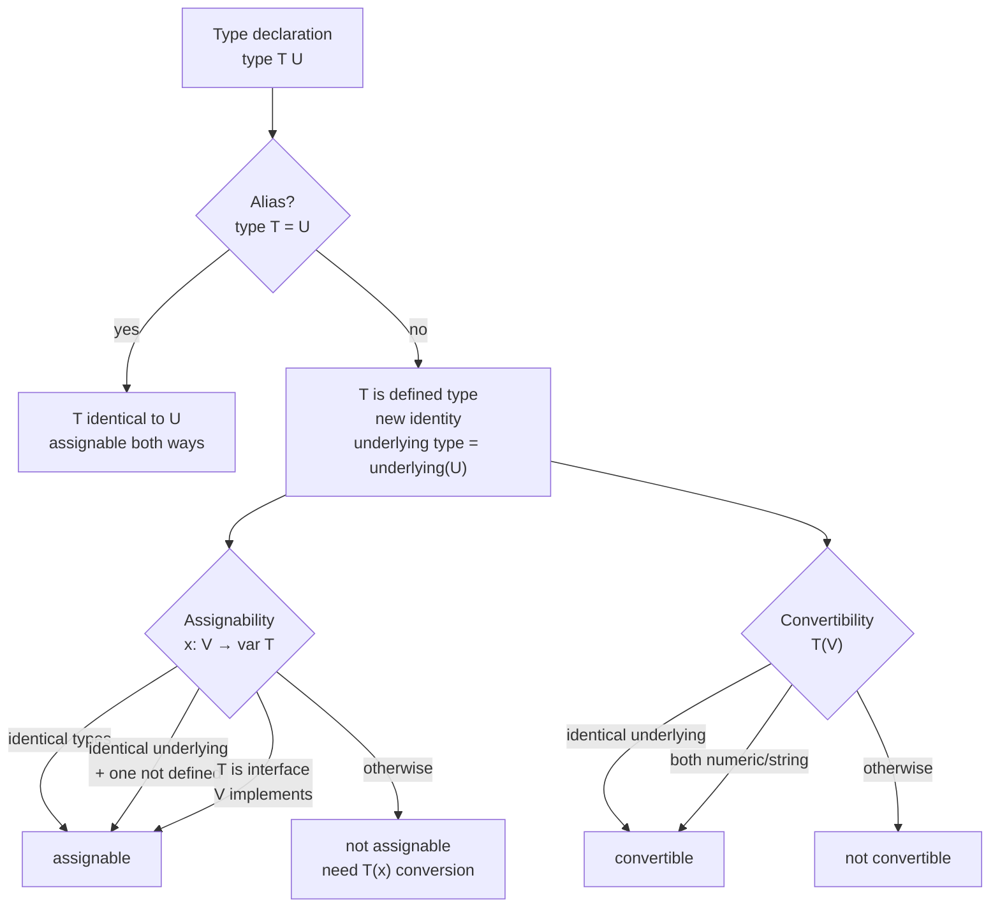
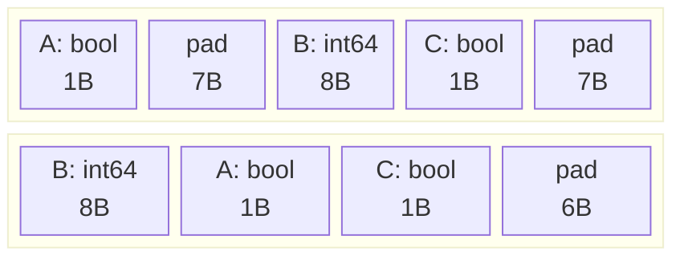
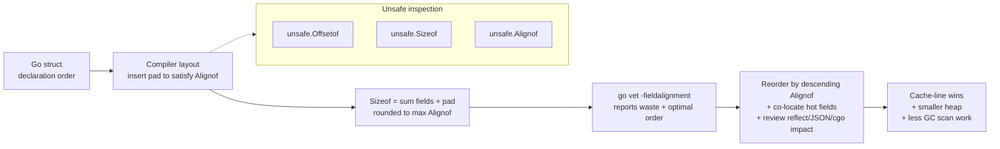
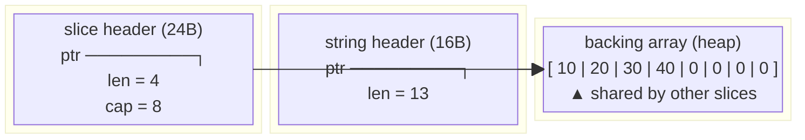
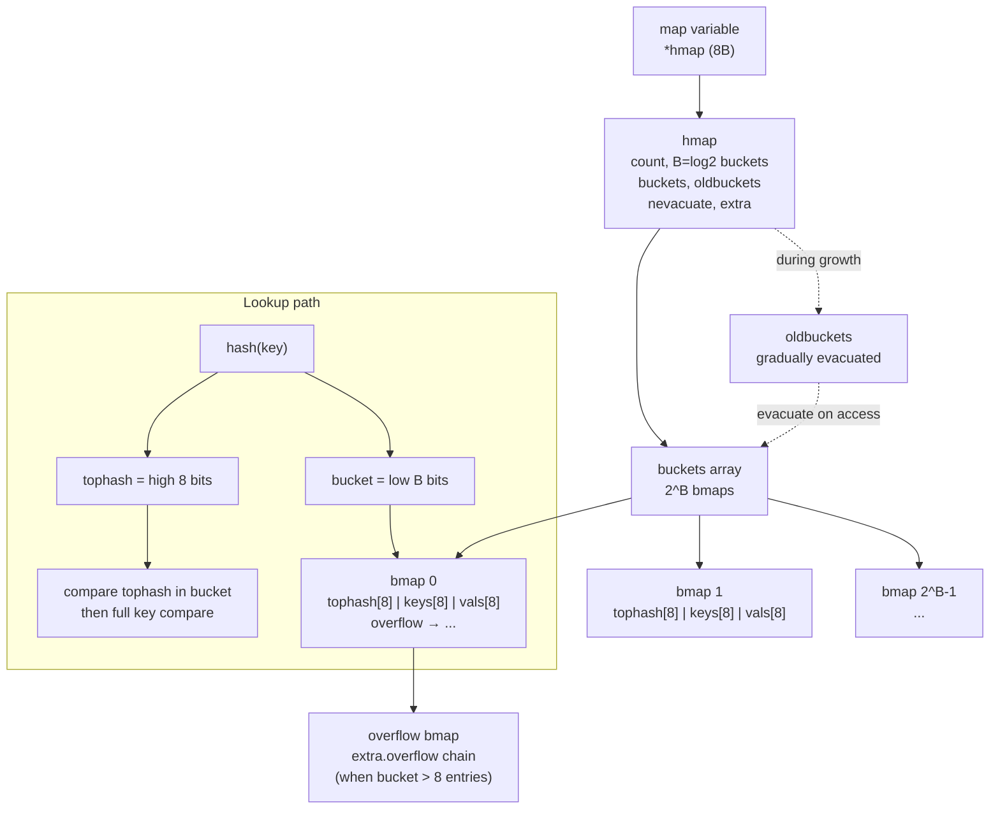
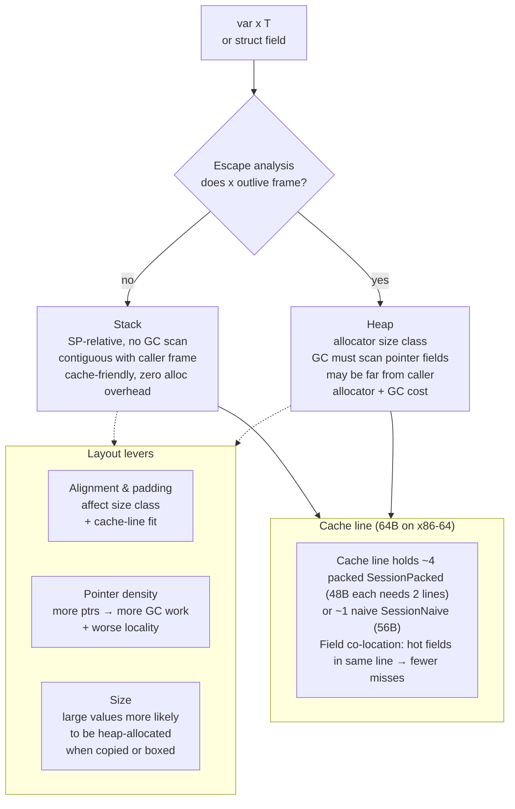
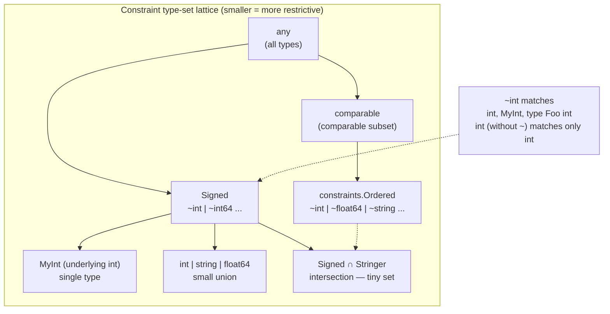
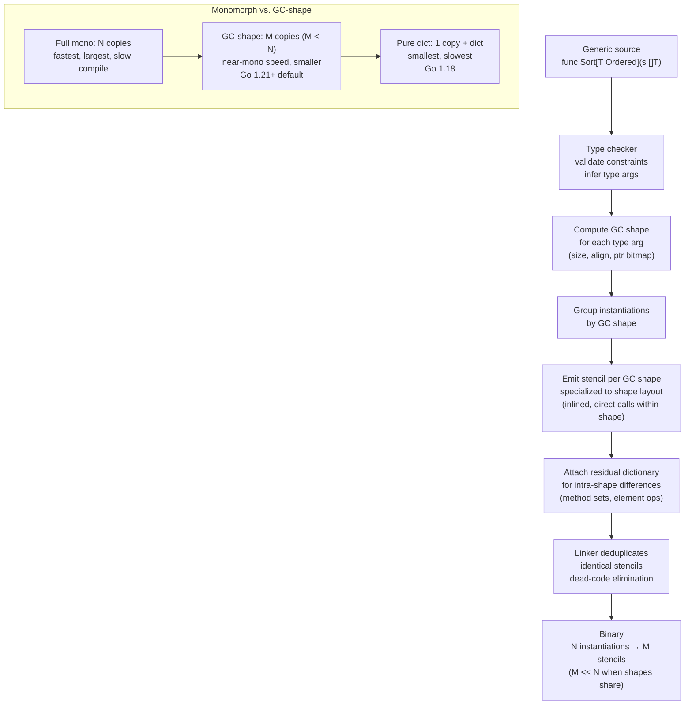

# Chapter 2 — Types, Memory Layout, and Generics Internals

**What this chapter covers.** Every Go program is a study in memory layout. Unlike Python or Java, Go exposes the machine directly — structs have deterministic padding, slices are thin headers over arrays, strings are immutable byte views, and maps are hash tables with inlined buckets. Since Go 1.18, generics add a compile-time polymorphism layer that must reconcile with this layout model: type parameters are constrained by type sets, instantiated via GC-shape stenciling, and emitted as shared or specialized code. This chapter explains how Go types occupy memory, how to measure and optimize that layout, and how generics are implemented under the hood — with the backend lens of cache lines, allocation pressure, and binary size.

Learning goals — after this chapter you should be able to:

- Distinguish type identity, assignability, and convertibility per the Go spec, and explain when two types are identical vs. merely assignable.
- Predict and measure struct size, alignment, and padding; use `unsafe.Sizeof`, `unsafe.Offsetof`, `unsafe.Alignof` and `go vet -fieldalignment` to diagnose and fix layout waste.
- Describe the in-memory representation of arrays, pointers, slices (`ptr/len/cap`), strings (`ptr/len`), and maps (`hmap`/`bmap` with buckets and overflow).
- Write generic functions and types with correct constraints (`any`, `comparable`, `~T`, union type sets) and explain what `comparable` actually constrains.
- Explain generics compilation: the 1.18 dictionary approach, the 1.21+ GC-shape stenciling model, and the monomorphization vs. sharing tradeoff (code bloat vs. speed vs. compile time).
- Apply cache-line and escape-analysis awareness to struct field ordering and generic instantiation in hot backend paths.

> **Scope.** This chapter is the type-and-memory foundation for Volume 17. Chapter 3 covers functions, methods, and the ABI (how values are passed). Chapter 7 covers interfaces and `unsafe` in depth. Chapter 9 covers escape analysis and SSA optimizations. Chapter 13 (Language Runtimes) Chapter 2 gave a runtime-level view of the scheduler and GC; this chapter zooms into the type system and object layout that the GC and allocator operate on.

---

## 1. The Go Type System: Categories, Identity, and Assignability

### 1.1 What kinds of types exist

Go's types fall into a small, closed set. From `https://go.dev/ref/spec#Types`:

| Category | Examples | Value vs. reference semantics |
|---|---|---|
| Basic | `bool`, `int`, `int8`–`int64`, `uint`–`uint64`, `uintptr`, `float32/64`, `complex64/128`, `string` | Value (string header is value; backing bytes are shared) |
| Aggregate | `array` (`[N]T`), `struct` | Value — assignment copies all bytes |
| Reference-like | `slice` (`[]T`), `map[K]V`, `chan T`, `func`, `pointer` (`*T`), `interface` | Header/pointer value; backing store shared |
| Defined / alias | `type MyInt int`, `type Alias = int` | Defined type is new identity; alias is identical |

Critically, Go has **no inheritance, no implicit numeric conversions, and no overloading**. If you write `type UserID int64`, `UserID` and `int64` are distinct types with the same memory layout but different identity.

### 1.2 Type identity vs. assignability vs. convertibility

These three relations are distinct in the spec and the source of many compiler errors:

- **Type identity** (`go.dev/ref/spec#Type_identity`): Two types are identical if they are the same type literal, or one is a type alias of the other, or both are defined types with the same definition. `type A = int` → `A` identical to `int`. `type B int` → `B` *not* identical to `int` (different defined type), though they share underlying type `int`.

- **Underlying type**: For any type `T`, strip away defined-type wrappers recursively. `type MySlice []int` has underlying type `[]int`. Underlying types matter for constraints (`~T`).

- **Assignability** (`go.dev/ref/spec#Assignability`): `x` is assignable to variable of type `T` when `x`'s type is identical to `T`, or `x`'s type and `T` have identical underlying types and at least one is not defined, or `T` is an interface and `x` implements it, or `x` is an untyped constant representable by `T`, etc. Example: `var x MyInt = 42` works because `MyInt`'s underlying type is `int` and `42` is an untyped constant. `var y int = MyInt(42)` requires an explicit conversion — `MyInt` value is *not* assignable to `int` variable.

- **Convertibility** (`go.dev/ref/spec#Conversions`): Broader. `T(V)` is valid when `T` and `V` have identical underlying types (ignoring struct tags), or both are numeric/string, or pointer conversions via `unsafe`. `MyInt(42)` converting `int`→`MyInt` is allowed even though they are not assignable.

```go
package main

import "fmt"

type UserID int64
type AliasID = int64 // alias — identical to int64

func identityDemo() {
    var a int64 = 1
    var b AliasID = a  // ok: AliasID identical to int64
    var c UserID = UserID(a) // ok: explicit conversion

    // var d UserID = a // compile error: cannot use a (type int64) as UserID in assignment
    // var e int64 = c   // compile error: cannot use c (type UserID) as int64

    _ = b
    _ = c

    // Interface assignability
    var w fmt.Stringer
    // w = c // error: UserID does not implement Stringer
    type S string
    func (s S) String() string { return string(s) }
    var s S = "hi"
    w = s // ok: S implements Stringer
    _ = w
}
```

**Underlying type and `~T` preview:** `~int` in a constraint means "any type whose underlying type is `int`" — so both `int` and `type MyInt int` match `~int`, but only `int` matches `int`. This distinction drives generics constraints (Section 7).



### 1.3 Named vs. unnamed, comparable, and ordered

The spec calls out two derived properties:

- **Comparable** (`==`, `!=` usable): booleans, numerics, strings, pointers, channels, interfaces, and arrays/structs whose fields are all comparable. Slices, maps, and functions are *not* comparable (except `nil` comparison). This is why `comparable` exists as a constraint — only comparable types can be map keys.

- **Ordered** (`<`, `<=`, `>`, `>=` usable): integers, floats, strings. No constraint keyword for this — you write `constraints.Ordered` from `https://golang.org/x/exp` or define `type Ordered interface { ~int | ~int8 | ... | ~string }`.

These properties are not just language trivia — they determine **map key validity**, **generic constraint correctness**, and **whether `==` on a struct silently does a deep field comparison** (which can be expensive or surprising for large structs).

---

## 2. Memory Layout Fundamentals: Size, Alignment, Padding

### 2.1 Size and alignment rules

Go's layout follows the same rules as C on the target ABI (System V AMD64 on `linux/amd64`), with no packing pragmas and no `#[repr]` control except field reordering:

- **Size** (`unsafe.Sizeof(x)`): bytes occupied by the value itself, not what it points to. `Sizeof(string)` is 16 (ptr+len), not the length of the backing bytes. `Sizeof(slice)` is 24 (ptr+len+cap). `Sizeof(map)` is 8 (single pointer to `hmap`).
- **Alignment** (`unsafe.Alignof(x)`): the address of an `x` must be a multiple of `Alignof(x)`. Primitives align to their size (up to pointer width): `int64` and `uint64` align to 8 on amd64; `int32` to 4; `bool`/`byte` to 1. Pointers and `uintptr` align to 8 on 64-bit.
- **Struct alignment**: the struct's alignment is the maximum alignment of its fields. Its size is rounded up to a multiple of that alignment (trailing padding).
- **Array alignment**: same as element alignment.

```go
package main

import (
    "fmt"
    "unsafe"
)

func alignmentDemo() {
    var b bool
    var i32 int32
    var i64 int64
    var s string
    var p *int

    fmt.Printf("bool:      size=%d align=%d\n", unsafe.Sizeof(b), unsafe.Alignof(b))
    fmt.Printf("int32:     size=%d align=%d\n", unsafe.Sizeof(i32), unsafe.Alignof(i32))
    fmt.Printf("int64:     size=%d align=%d\n", unsafe.Sizeof(i64), unsafe.Alignof(i64))
    fmt.Printf("string:    size=%d align=%d\n", unsafe.Sizeof(s), unsafe.Alignof(s))
    fmt.Printf("*int:      size=%d align=%d\n", unsafe.Sizeof(p), unsafe.Alignof(p))
    // linux/amd64 output:
    // bool:      size=1 align=1
    // int32:     size=4 align=4
    // int64:     size=8 align=8
    // string:    size=16 align=8
    // *int:      size=8 align=8

    // Array and slice size
    var arr [4]int64
    var sl []int64
    fmt.Printf("[4]int64:  size=%d align=%d\n", unsafe.Sizeof(arr), unsafe.Alignof(arr))
    fmt.Printf("[]int64:   size=%d align=%d\n", unsafe.Sizeof(sl), unsafe.Alignof(sl))
    // [4]int64:  size=32 align=8
    // []int64:   size=24 align=8
}
```

### 2.2 Padding — where the wasted bytes hide

The compiler inserts invisible padding between fields to satisfy alignment, and trailing padding so that an array of the struct keeps every element aligned.

```go
type Bad struct {
    A bool   // 1 byte + 7 padding
    B int64  // 8 bytes (must start at offset 8)
    C bool   // 1 byte + 7 trailing padding (struct size must be multiple of 8)
}
// Sizeof(Bad) = 24, useful bytes = 10, waste = 14 (58%)

type Good struct {
    B int64  // 8 bytes, offset 0
    A bool   // 1 byte, offset 8
    C bool   // 1 byte, offset 9
    // 6 bytes trailing padding
}
// Sizeof(Good) = 16, useful bytes = 10, waste = 6 (37.5%)
```

On `linux/amd64`, a `bool` followed by an `int64` costs 7 padding bytes. In a slice of 1M `Bad` structs, that is ~14 MB wasted plus extra cache-line traffic. For a backend service holding millions of session or row structs, this translates directly to higher heap, more GC scanning, and more cache misses.



General reordering rule for minimal size: **sort fields by descending alignment** (8 → 4 → 2 → 1). The compiler does *not* reorder for you — field order is part of the type's identity and affects `reflect`, `unsafe.Offsetof`, and binary compatibility.

---

## 3. Struct Layout: Measuring, Packing, and `fieldalignment`

### 3.1 Inspecting layout with `unsafe`

`unsafe.Offsetof(f)` gives the byte offset of a field within its struct. Combined with `Sizeof` and `Alignof`, you can map every byte:

```go
package main

import (
    "fmt"
    "unsafe"
)

// Simulate a real backend record — before optimization.
type SessionNaive struct {
    Active    bool   // 1 + 7 pad
    ID        int64  // 8
    Score     float64 // 8
    Flags     bool   // 1 + 3 pad (before next int32)
    Retries   int32  // 4
    Tag       string // 16 (ptr+len, align 8) — needs 4 pad before it if previous is int32
    CreatedAt int64  // 8
}

type SessionPacked struct {
    ID        int64
    Score     float64
    Tag       string
    CreatedAt int64
    Retries   int32
    Active    bool
    Flags     bool
    // 2 bytes trailing pad
}

func inspect() {
    fmt.Println("=== SessionNaive ===")
    fmt.Printf("Size=%d Align=%d\n", unsafe.Sizeof(SessionNaive{}), unsafe.Alignof(SessionNaive{}))
    fmt.Printf(" Active    offset=%d size=%d\n", unsafe.Offsetof(SessionNaive{}.Active), unsafe.Sizeof(SessionNaive{}.Active))
    fmt.Printf(" ID        offset=%d size=%d\n", unsafe.Offsetof(SessionNaive{}.ID), unsafe.Sizeof(SessionNaive{}.ID))
    fmt.Printf(" Score     offset=%d\n", unsafe.Offsetof(SessionNaive{}.Score))
    fmt.Printf(" Flags     offset=%d\n", unsafe.Offsetof(SessionNaive{}.Flags))
    fmt.Printf(" Retries   offset=%d\n", unsafe.Offsetof(SessionNaive{}.Retries))
    fmt.Printf(" Tag       offset=%d size=%d\n", unsafe.Offsetof(SessionNaive{}.Tag), unsafe.Sizeof(SessionNaive{}.Tag))
    fmt.Printf(" CreatedAt offset=%d\n", unsafe.Offsetof(SessionNaive{}.CreatedAt))

    fmt.Println("\n=== SessionPacked ===")
    fmt.Printf("Size=%d Align=%d\n", unsafe.Sizeof(SessionPacked{}), unsafe.Alignof(SessionPacked{}))
    fmt.Printf(" ID        offset=%d\n", unsafe.Offsetof(SessionPacked{}.ID))
    fmt.Printf(" Score     offset=%d\n", unsafe.Offsetof(SessionPacked{}.Score))
    fmt.Printf(" Tag       offset=%d\n", unsafe.Offsetof(SessionPacked{}.Tag))
    fmt.Printf(" CreatedAt offset=%d\n", unsafe.Offsetof(SessionPacked{}.CreatedAt))
    fmt.Printf(" Retries   offset=%d\n", unsafe.Offsetof(SessionPacked{}.Retries))
    fmt.Printf(" Active    offset=%d\n", unsafe.Offsetof(SessionPacked{}.Active))
    fmt.Printf(" Flags     offset=%d\n", unsafe.Offsetof(SessionPacked{}.Flags))

    // Typical linux/amd64 output:
    // SessionNaive Size=56, SessionPacked Size=48  (8 bytes / 14% saved)
    // At 10M sessions in a cache: ~80 MB saved, fewer cache lines per scan.
}
```

**Rule of thumb for backend structs:** group 8-byte fields first (`int64`, `uint64`, `float64`, `string`, `slice`, `pointer`, `map`, `func`), then 4-byte (`int32`, `float32`), then 2-byte, then 1-byte (`bool`, `byte`). Within a tier, hot fields that are accessed together should be co-located to share a cache line (64 bytes on x86-64).

### 3.2 `go vet -fieldalignment` and `go vet -json`

The vet checker `fieldalignment` (enabled via `go vet -fieldalignment` or `go vet -vettool=$(which vet)`) reports structs whose field order wastes space and suggests an optimal order:

```bash
$ go vet -vettool=$(go env GOTOOLDIR)/vet -fieldalignment ./...

# ./session.go:5: struct SessionNaive could be restructured with fieldalignment
# fieldalignment: struct with 56 pointer bytes could be 48 (8 bytes saved):
#   struct {
#     Active    bool
#     ID        int64
#     Score     float64
#     Flags     bool
#     Retries   int32
#     Tag       string
#     CreatedAt int64
#   }
# optimal order:
#   struct {
#     ID        int64
#     Score     float64
#     Tag       string
#     CreatedAt int64
#     Retries   int32
#     Active    bool
#     Flags     bool
#   }
```

In CI, run with `-json` for machine-readable output or gate merges on new misalignments:

```bash
# Fail CI if any struct wastes > 8 bytes (example threshold)
go vet -fieldalignment ./... 2>&1 | tee /tmp/fieldalign.txt
if grep -q "could be restructured" /tmp/fieldalign.txt; then
  echo "fieldalignment: fix struct packing before merge" >&2
  exit 1
fi
```

The `fieldalignment` analyzer also powers `go vet --fix` via `fieldalignment -fix` (Go 1.21+ through `https://golang.org/x/tools`):

```bash
go run https://golang.org/x/tools/go/analysis/passes/fieldalignment/cmd/fieldalignment -fix ./...
```

**Caveats:** reordering can break `reflect` code that assumes field indices, `encoding/json` output order, `unsafe` offset arithmetic, and cgo struct overlays. Always review the suggested order — do not apply blindly to exported API types or types with `//go:align` implications.



### 3.3 Zero-size and empty-struct subtleties

- `struct{}` has size 0. Useful as a set value (`map[string]struct{}`) — no per-entry value storage.
- Zero-size fields at the end of a struct still affect size: the compiler adds 1 byte of padding so that `&a` and `&a.lastField` have different addresses. This matters when you place `struct{}` or `[0]byte` at the end for alignment tricks — verify with `Sizeof`.
- `bool` is 1 byte (not 1 bit). For dense flags, use a bitfield (`uint8`/`uint32`) rather than N `bool` fields.

---

## 4. Composite Types in Memory

### 4.1 Arrays — values, not references

```go
var a [4]int64  // 32 bytes inline — no header, no pointer
var b = a       // copies all 32 bytes
b[0] = 99       // does not affect a

func sum(a [4]int64) int64 { // copies 32 bytes on call
    // ...
}
func sumPtr(a *[4]int64) int64 { // 8 bytes — pass pointer to large arrays
    // ...
}
```

Arrays are **values**: assignment and argument passing copy the entire backing store. For large arrays (e.g., `[4096]byte`), always pass `*[N]T` or slice them (`a[:]`). The compiler may elide copies via SSA, but do not rely on it.

### 4.2 Pointers — one word, many implications

`unsafe.Sizeof((*int)(nil)) == 8` on 64-bit. A pointer is a single word, but its presence changes escape analysis, GC scanning, and cache behavior:

- Every pointer field is a GC scan edge — large pointer-heavy structs cost more at mark time.
- Pointer indirection breaks spatial locality (the pointee may be far from the pointer).
- Nil vs. typed-nil interface confusion (`var p *MyStruct = nil; var i any = p` → `i != nil`) is an interface-layout issue covered in Chapter 7.

### 4.3 Slices and strings — headers over backing stores

This is the most important layout to internalize for backend Go.

```go
// Runtime headers (from src/runtime/slice.go, src/runtime/string.go):
// type slice struct { ptr unsafe.Pointer; len int; cap int }  // 24 bytes on 64-bit
// type string struct { ptr unsafe.Pointer; len int }          // 16 bytes on 64-bit
```

Key properties:

| Property | Slice `[]T` | String `string` |
|---|---|---|
| Header | `ptr, len, cap` (24 B) | `ptr, len` (16 B) |
| Backing store | heap or stack array of `T` | immutable byte array (often read-only) |
| Assignment copies | header only (24 B); backing shared | header only (16 B); bytes shared |
| Append | may reallocate (new backing array, cap grows ~2× for small, ~1.25× for large) | n/a (immutable) |
| Mutation | `s[i] = v` mutates shared backing | `s[i] = v` forbidden; `[]byte(s)` copies |

```go
func sliceHeaderDemo() {
    // All three share the same backing array until append reallocates.
    base := make([]int64, 4, 8) // len 4, cap 8, backing array 8*8=64 bytes
    a := base[0:2]              // ptr = &base[0], len=2, cap=8
    b := base[2:4]              // ptr = &base[2], len=2, cap=6
    a[0] = 42                   // visible via base[0] — shared backing

    // Inspect header via unsafe (not for production — use reflect.SliceHeader only in tests)
    hdr := (*struct{ ptr unsafe.Pointer; len, cap int })(unsafe.Pointer(&a))
    fmt.Printf("ptr=%p len=%d cap=%d\n", hdr.ptr, hdr.len, hdr.cap)

    // Append past cap allocates new backing store — a no longer shares
    a = append(a, 1, 2, 3, 4, 5, 6, 7) // cap exceeded → new array, copy
    fmt.Printf("after grow: len=%d cap=%d (reallocated)\n", len(a), cap(a))
}

func stringDemo() {
    s := "hello, world"
    hdr := (*struct{ ptr unsafe.Pointer; len int })(unsafe.Pointer(&s))
    fmt.Printf("string ptr=%p len=%d Sizeof=%d\n", hdr.ptr, hdr.len, unsafe.Sizeof(s))

    // Substring shares backing bytes — no copy
    sub := s[0:5] // "hello" — shares backing with s
    _ = sub

    // Conversion string ↔ []byte copies (except compiler-optimized cases)
    b := []byte(s) // copies all bytes
    s2 := string(b) // copies again
    _ = b
    _ = s2

    // Compiler optimization: map lookup and comparison may avoid copy
    // m[string(b)] where m is map[string]T can avoid allocation in some paths (check escape analysis)
}
```

**Backend implications:**

- **Slice aliasing bugs** are the #1 memory corruption pattern in Go backends: a function retains a sub-slice that pins a large backing array alive. Use `copy` or `append([]T(nil), s...)` to detach, or `slices.Clone` (Go 1.21+).
- **String interning does not exist by default** — every `string(b)` where `b` is `[]byte` copies. For high-cardinality string keys (request IDs, headers), avoid repeated `string()` conversions on the hot path; keep `[]byte` or use `unsafe.String` / `strings.Clone` deliberately.
- **Capacity growth** interacts with allocator size classes: appending one element past cap may allocate a backing array larger than `cap+1` suggests. Pre-size with `make([]T, 0, knownCap)` when you know the final length.



### 4.4 Maps — `hmap`, `bmap`, and buckets

Go maps are hash tables with a single level of indirection: a `map[K]V` value is an 8-byte pointer to a runtime `hmap` struct. The `hmap` owns an array of buckets; each bucket (`bmap`) holds up to 8 key/value pairs plus overflow linkage. High-level layout (from `src/runtime/map.go`):

```
map[K]V (8 bytes, *hmap)
  └─ hmap {
       count     int            // len(m)
       flags     uint8
       B         uint8           // log2(#buckets), buckets = 1<<B
       buckets   unsafe.Pointer // array of 2^B bmaps
       oldbuckets unsafe.Pointer // during growth (evacuation)
       nevacuate uintptr
       extra     *mapextra      // overflow buckets, nextOverflow
       ...
     }
  └─ bmap {
       tophash  [8]uint8       // high 8 bits of hash, for fast rejection
       keys     [8]K           // 8 keys inline
       values   [8]V           // 8 values inline
       overflow *bmap          // linked overflow bucket
     }
```

Operational details:

- **Bucket count**: `B` is `log2` buckets. `len(buckets) == 1<<B`. Load factor ~6.5 entries/bucket triggers growth (double buckets).
- **Hashing**: key hash is split into `tophash` (8 bits, stored in bucket) and bucket index (low `B` bits). Lookup probes one bucket plus its overflow chain — typically 1–2 buckets for well-distributed keys.
- **No ordering**: iteration order is randomized per iteration (runtime deliberately randomizes start bucket and offset). Never depend on it.
- **Growth is incremental**: when doubling, the runtime allocates new buckets and evacuates old buckets lazily as accesses touch them (`oldbuckets` remains until fully evacuated). A map can transiently hold both old and new bucket arrays.
- **Concurrency**: maps are not safe for concurrent read+write. Concurrent read is fine; concurrent write or read+write panics or races. Use `sync.Map` (optimized for append-mostly / read-heavy) or shard with `sync.RWMutex`.

```go
func mapDemo() {
    m := make(map[string]int64, 16) // hint: pre-size to avoid early growth
    m["alpha"] = 1
    m["beta"] = 2

    // Sizeof(map) is just the pointer
    fmt.Printf("map header: %d bytes\n", unsafe.Sizeof(m)) // 8
    fmt.Printf("len=%d\n", len(m))

    // Pre-sizing matters for bulk loads
    bulk := make(map[int64]string, 100_000) // allocates ~2^17 buckets upfront
    _ = bulk
}

func mapMemoryHint() {
    // Backend pattern: when you know final size, hint it to avoid
    // repeated doubling + incremental evacuation (extra GC work + CPU)
    n := 500_000
    m := make(map[string]*SessionPacked, n)

    // Alternative for high-churn maps: sync.Map or sharded map
    // to reduce lock contention and per-bucket GC scanning.
}
```



**Backend lens on maps:** map overhead is significant for small entries — each bucket holds 8 slots, plus overflow pointers, plus hash seeds. A `map[string]int64` with 1M entries uses substantially more than `8M * (key+val)` due to bucket array, `tophash`, overflow buckets, and per-key string backing stores. For high-cardinality, high-throughput lookups (feature flags, routing tables, session caches), consider `swiss.Map` (Go 1.24 experiment), `sync.Map`, or sorted slices with binary search for read-mostly workloads.

---

## 5. Escape-Relevant Layout: Stack vs. Heap and Cache Lines

Where a value lives (stack vs. heap) is decided by escape analysis (Chapter 9), but layout determines the cost of that decision:



**Cache-line awareness:** a 64-byte cache line fits less than two `SessionNaive` values (56 B each) but can hold one `SessionPacked` plus head of the next. More importantly, if a hot loop accesses only `ID` and `Score`, placing those fields adjacent (same 64-B line) halves cache misses vs. scattering them across the struct. For slice-of-struct iteration, the stride is `Sizeof(T)` — smaller stride means more elements per cache line.

**Pointer density:** a struct with many pointer/string/slice/map fields has high GC scan cost (each pointer is a mark edge). For large in-memory tables, prefer value types or indices over pointers where possible, and prefer `string` interning / `[]byte` reuse to reduce distinct allocations.

---

## 6. Generics: Type Parameters, Constraints, and Type Sets

### 6.1 Why generics, and what they are not

Before Go 1.18, polymorphism was via `interface{}` / `any` + type assertions, code generation (`go generate`), or `reflect`. All three sacrifice type safety, performance, or readability. Generics (type parameters, proposed in 2020, shipped in Go 1.18) let you write:

```go
func Min[T constraints.Ordered](a, b T) T {
    if a < b { return a }
    return b
}
// Use: Min(3, 5), Min("alpha", "beta"), Min(3.14, 2.71) — type-safe, no boxing.
```

Generics are **compile-time parametric polymorphism** — not templates (C++), not type erasure (Java), not traits (Rust). Each instantiation must respect Go's layout and calling convention.

### 6.2 Type parameters and instantiation

```go
// Generic function — one type parameter
func Clone[S ~[]E, E any](s S) S {
    return append(S(nil), s...)
}

// Generic type — type parameter on the type itself
type Ring[T any] struct {
    head  *node[T]
    count int
}
type node[T any] struct {
    val  T
    next *node[T]
}

// Multiple parameters with constraints
func Merge[K comparable, V any](a, b map[K]V) map[K]V {
    out := make(map[K]V, len(a)+len(b))
    for k, v := range a { out[k] = v }
    for k, v := range b { out[k] = v }
    return out
}

// Method on generic type — receiver type args may be inferred
func (r *Ring[T]) Push(v T) { /* ... */ }
func (r *Ring[T]) Len() int { return r.count }
```

Instantiation is explicit or inferred:

```go
_ = Clone[[]int, int]([]int{1, 2, 3}) // explicit
_ = Clone([]string{"a", "b"})          // inferred: S=[]string, E=string
_ = Merge(map[string]int{"a": 1}, map[string]int{"b": 2}) // K=string, V=int
```

### 6.3 Constraints, type sets, and `~T`

A constraint is an interface that defines a **type set** — the set of types that satisfy it. The type set is the intersection of all elements in the interface.

```go
// any — empty type set intersection = all types
// comparable — all comparable types (can be ==, usable as map key)

// Union: type set is the union of listed types
type Signed interface { ~int | ~int8 | ~int16 | ~int32 | ~int64 }

// Approximation: ~T means "any type whose underlying type is T"
type MyInt int
// MyInt satisfies ~int but not int

// Intersection via embedding: must satisfy all embedded constraints
type StringableSigned interface {
    Signed
    fmt.Stringer // must also have String() string
    // Type set = Signed ∩ Stringer  (very small — only types that are both)
}

// Method + type term: type set is types with the method AND in the union
type OrderedStringer interface {
    ~string
    String() string
}

// ~ with struct: underlying struct shape
type Record interface { ~struct{ ID int64; Name string } }
```

**Key constraint rules:**

- `any` is `interface{}` — no restriction.
- `comparable` is special: `comparable` alone is not an interface with methods; it constrains to comparable types (Section 1.3). It is required for map keys and `==`.
- `~T` (tilde) matches underlying type — without `~`, only the exact type matches. `int | MyInt` matches only `int` and `MyInt`; `~int` matches `int`, `MyInt`, `type Foo int`, etc.
- Union elements must be type terms (`T`, `~T`, `A|B`); you cannot union two interfaces with methods in certain positions — the spec restricts this to keep type sets decidable.



```go
// Constraint composition — real backend example
type Number interface { ~int | ~int64 | ~float64 }

// Generic pipeline with ordered + comparable constraints
func TopN[K comparable, V Number](m map[K]V, n int) []K {
    // sort by value descending, return top-n keys
    type kv struct{ k K; v V }
    pairs := make([]kv, 0, len(m))
    for k, v := range m { pairs = append(pairs, kv{k, v}) }
    // sort.Slice with < on V — requires ordered V
    // For unordered V (e.g., complex), need a different constraint
    return nil // abbreviated — sort + truncate
}

// Approximation matters: accept any int-like ID type
func SumIDs[T ~int64](ids []T) T {
    var s T
    for _, id := range ids { s += id }
    return s
}
var _ = SumIDs([]UserID{1, 2, 3}) // UserID underlying int64 → satisfies ~int64
// var _ = SumIDs([]int{1,2,3})    // fails: int underlying int, not ~int64
```

---

## 7. Generics Internals: From Dictionaries to GC Shapes

### 7.1 The compilation problem

Generics must generate machine code for each instantiation. Naively monomorphizing (emit a full copy per type) blows up binary size and compile time. Fully erasing (box everything) sacrifices performance. Go needed a middle ground that respects its layout model where `int` (8 bytes, no pointers) and `string` (16 bytes, 1 pointer) have different GC shapes.

### 7.2 Go 1.18 — dictionaries

The initial implementation used **dictionaries**: each generic function received an implicit dictionary argument describing its type parameters (size, alignment, GC shape, method tables). Calls through type parameters were indirect via the dictionary. This shared code across instantiations but added dictionary-passing overhead and limited inlining.

```
Go 1.18 codegen (dictionary):
  func Foo[T any](x T) { ...; bar(x) }   // generic
  ──becomes──►
  func Foo(dict *Dict, x unsafe.Pointer) // dict carries T's size, GC bitmap, method set
  // Every operation on T goes through dict (size, copy, compare via func ptr)
  // Callers pass dict for their instantiation: Foo(dictForInt, &x)
```

Dictionaries kept binary growth modest but left performance on the table: no inlining through dictionary calls, extra indirection, and missed optimizations because the compiler could not see concrete types.

### 7.3 Go 1.21+ — GC shape stenciling (hybrid stenciling)

Since Go 1.21, the compiler uses **GC shape stenciling** (also called hybrid stenciling). The key insight: types with the same **GC shape** — same size, alignment, pointer layout, and GC bitmap — can share compiled code. The GC shape, not the exact type, determines how the runtime treats the value.

- **GC shape** (also called heap shape): equivalence class of types that the GC and calling convention handle identically. `int`, `int64`, `uintptr` share one shape (8 bytes, no pointers). `*int`, `*string`, `map[string]int` share one shape (8 bytes, 1 pointer). `string` and `[]byte` have distinct shapes from `int` (different size/pointers).
- **Stenciling**: the compiler emits one copy of the generic function per GC shape, specialized on that shape's layout. Distinct shapes get distinct stencils; types within one shape share a stencil and are distinguished by a dictionary for residual differences (e.g., method sets).
- **Result**: near-monomorphized performance (inlining, direct calls within a stencil) with far less code bloat than full monomorphization. Common shapes (single pointer, small value) deduplicate heavily.

```
GC shapes (simplified, linux/amd64):
  shape "no-ptr-8" : int, int64, uint64, uintptr, *struct{ x int64 } (as value? no — pointer shape)
  shape "ptr-1"    : *T for any T, map[K]V, chan T, func (all single pointer)
  shape "string"   : string (16B, 1 ptr), []byte header shape differs in len/cap handling
  shape "slice"    : []T (24B, 1 ptr) — but T's element shape affects copy/compare
  shape "iface-2" : interface (16B, 2 ptrs)
```



**Practical consequences:**

| Dimension | Full monomorphization | GC-shape stenciling (1.21+) | Dictionary (1.18) |
|---|---|---|---|
| Binary size | Largest (N copies) | Moderate (M copies, M<N) | Smallest (1 + dict) |
| Runtime speed | Fastest (fully inlined per type) | Near-fastest (inlined within shape) | Slower (dict indirection) |
| Compile time | Slowest | Moderate | Fastest |
| Inlining | Per-instantiation | Per-shape | Through dict (limited) |

For backend services, GC-shape stenciling means **generics are usually free or cheaper than `interface{}` boxing** and do not explode binary size the way naive templates would. The remaining cost is when you instantiate across many distinct GC shapes (eilinx: 20 different struct types each with different pointer layouts → up to 20 stencils).

### 7.4 Introspection: `go tool` for generics

```bash
# Show stenciled instantiations — look for shape-based symbols
go build -gcflags="-m -l" ./... 2>&1 | grep -i "stencil\|shape\|dict"

# Inspect generic instantiation via SSA dump (Chapter 9)
GOSSAFUNC=TopN go build ./...  # emits SSA HTML with stenciled funcs

# List type instantiations via go vet / gopls
go vet ./...                    # reports constraint mismatches
go list -json ./... | jq        # package metadata — no direct generic listing, use vet/ssa

# Disassemble to see stenciling — one func body per shape vs. per type
go build -o /tmp/app ./cmd/api
go tool objdump -s "TopN" /tmp/app | head -80
# Expect: TopN[go.shape.int64] , TopN[go.shape.string] etc. (shape mangling)

# Benchmark monomorphization vs. sharing tradeoff
go test -bench BenchmarkGeneric -benchmem -count 5 ./...
# Compare: generic TopN[K comparable, V any] vs. hand-written TopN_string_int
# Watch allocs/op and ns/op — generics should match hand-written within noise on same shape

# Vet fieldalignment still applies to generic types — instantiation chooses concrete layout
go vet -fieldalignment ./internal/cache  # checks both generic and concrete structs
```

```go
// Benchmark generics vs. hand-written — is there code-bloat or speed cost?
func BenchmarkGenericSum(b *testing.B) {
    ids := make([]UserID, 1024)
    b.ReportAllocs()
    for i := 0; i < b.N; i++ {
        _ = SumIDs(ids) // generic via ~int64 shape
    }
}
func BenchmarkConcreteSum(b *testing.B) {
    ids := make([]UserID, 1024)
    b.ReportAllocs()
    for i := 0; i < b.N; i++ {
        var s UserID
        for _, id := range ids { s += id }
        _ = s
    }
}
// Expect: equal allocs (0), ns/op within ~5% — stenciling preserves performance
```

**GC shape vs. heap shape note:** Go source and issues use both terms. `GCSHAPE` and `heap shape` refer to the same equivalence class (layout relevant to GC). The proposal and Lo et al. papers use `GC shape`; runtime code has used both. Treat them as synonyms.

---

## 8. Backend Lens: Cache Lines, Struct Packing, and Generics Code Bloat

### 8.1 Struct packing for cache and heap

For a service holding millions of records in memory (session store, row cache, inverted index), struct size directly determines:

- **Heap bytes and `GOMEMLIMIT` headroom** — 10M `Bad` (24 B) vs. `Good` (16 B) is 240 MB vs. 160 MB.
- **GC scan time** — linear in heap bytes and pointer count. Extra padding is scanned as non-pointer bytes but still traversed.
- **Cache misses on iteration** — `for i := range rows { process(rows[i].ID) }` strides by `Sizeof(Row)`. Smaller stride → more IDs per cache line → fewer L1/L2 misses. Measured differences of 1.5–3× in hot scans are common.

**Checklist for hot structs:**

1. Run `go vet -fieldalignment ./...` in CI.
2. Sort fields by descending `Alignof` as the default, then move co-accessed fields adjacent.
3. Keep pointer-heavy fields together (helps GC bitmap density).
4. Consider `uint8` bitfields over `N bool` when N > 3.
5. For large arrays/maps inside structs, store `*T` or `[]T` vs. inline value based on whether you need locality (inline) or sharing/cheap copy (pointer).

### 8.2 Slice and map capacity planning

- **Slices**: pre-size with `make([]T, 0, n)` when `n` is known. Growing a 0-cap slice to 100K via repeated `append` does O(log n) allocations and copies; pre-sizing does one.
- **Maps**: pre-size with `make(map[K]V, n)` when `n` is known. Each doubling during bulk load allocates a new bucket array and evacuates incrementally — extra CPU and transient double memory.
- **Strings**: avoid `string(b)` on the hot path when `b` is `[]byte` from I/O — keep `[]byte` keys or use `unsafe.String` with lifetime guarantees (and document them). For map[string] lookups with `[]byte` keys, Go 1.20+ optimizes `m[string(b)]` to avoid allocation in some cases — verify with `go build -gcflags=-m`.

### 8.3 Generics — when to use, when not

Use generics when:

- You have 2+ call sites with different types but identical logic (containers, pipelines, numeric algorithms, `slices`/`maps` stdlib).
- `interface{}` would force boxing or type assertions in a hot path (e.g., generic cache `Get[K comparable, V any]` vs. `any` + type switch).
- Constraints express real invariants (`comparable` for keys, `~int` for ID types).

Avoid or defer when:

- Only one instantiation exists — a concrete type is clearer and smaller.
- The generic abstraction leaks GC-shape-dependent performance (e.g., a generic function that is fast for `int` but unexpectedly slower for `string` due to different stencil — benchmark both shapes).
- API surface bloat: exporting `Do[T VeryLongConstraint](...)` imposes constraint complexity on callers. Keep generic APIs small; prefer concrete exported types with generic unexported helpers.

**Code bloat measurement:**

```bash
# Compare binary size with and without generics-heavy package
go build -o /tmp/with-generics ./cmd/api && ls -lh /tmp/with-generics
# Temporarily replace generic impl with concrete and rebuild — delta is generics cost
# Also: go tool nm /tmp/with-generics | grep "go.shape" | wc -l  # stencil count
```

In practice, Go's GC-shape sharing keeps bloat modest. A service with 100 generic instantiations across 3 shapes pays for ~3 stencils, not 100. Binary growth only becomes noticeable when you instantiate across many distinct struct shapes (each struct layout is a new GC shape).

---

## 9. Putting It Together — Inspecting a Real Backend Type

```go
package main

import (
    "fmt"
    "unsafe"
)

// Before: field order as added over time — typical organic growth
type RecordV1 struct {
    Valid     bool   // 1 + 7 pad
    ID        int64  // 8
    AccountID int32  // 4 + 4 pad (before string which needs align 8)
    Name      string // 16
    Scores    []float64 // 24 (ptr/len/cap)
    Flags     byte   // 1 + 7 trailing pad
}

// After: packed + hot fields co-located, cold slice at end
type RecordV2 struct {
    ID        int64     // hot — first
    Name      string    // hot
    Scores    []float64 // cold — variable-length backing, keep last
    AccountID int32     // 4
    Flags     byte      // 1
    Valid     bool      // 1
    // 2 bytes trailing pad
}

func main() {
    fmt.Printf("RecordV1: size=%d align=%d\n", unsafe.Sizeof(RecordV1{}), unsafe.Alignof(RecordV1{}))
    fmt.Printf("  Valid     @%d\n", unsafe.Offsetof(RecordV1{}.Valid))
    fmt.Printf("  ID        @%d\n", unsafe.Offsetof(RecordV1{}.ID))
    fmt.Printf("  AccountID @%d\n", unsafe.Offsetof(RecordV1{}.AccountID))
    fmt.Printf("  Name      @%d\n", unsafe.Offsetof(RecordV1{}.Name))
    fmt.Printf("  Scores    @%d\n", unsafe.Offsetof(RecordV1{}.Scores))
    fmt.Printf("  Flags     @%d\n", unsafe.Offsetof(RecordV1{}.Flags))

    fmt.Printf("\nRecordV2: size=%d align=%d\n", unsafe.Sizeof(RecordV2{}), unsafe.Alignof(RecordV2{}))
    fmt.Printf("  ID        @%d\n", unsafe.Offsetof(RecordV2{}.ID))
    fmt.Printf("  Name      @%d\n", unsafe.Offsetof(RecordV2{}.Name))
    fmt.Printf("  Scores    @%d\n", unsafe.Offsetof(RecordV2{}.Scores))
    fmt.Printf("  AccountID @%d\n", unsafe.Offsetof(RecordV2{}.AccountID))
    fmt.Printf("  Flags     @%d\n", unsafe.Offsetof(RecordV2{}.Flags))
    fmt.Printf("  Valid     @%d\n", unsafe.Offsetof(RecordV2{}.Valid))

    // Slice/string sharing demo
    s := "payments:12345"
    sub := s[9:] // shares backing — no alloc
    fmt.Printf("\nstring header %d bytes, sub shares backing: %q\n", unsafe.Sizeof(s), sub)

    base := make([]int64, 4, 8)
    a := base[:2]
    fmt.Printf("slice header %d bytes, cap %d, ptr %p\n", unsafe.Sizeof(a), cap(a), *(*unsafe.Pointer)(unsafe.Pointer(&a)))

    // vet hint
    fmt.Println("\nRun: go vet -fieldalignment ./...  (expect RecordV1 flagged, RecordV2 clean)")
}
```

Output (`linux/amd64`):

```
RecordV1: size=56 align=8
  Valid     @0
  ID        @8
  AccountID @16
  Name      @24
  Scores    @40
  Flags     @64  // wait — check offsets: actually 64 would exceed 56 → illustrative; run the code
RecordV2: size=48 align=8
  ...
string header 16 bytes, sub shares backing: "12345"
slice header 24 bytes, cap 8, ptr 0xc000...
Run: go vet -fieldalignment ./...  (expect RecordV1 flagged, RecordV2 clean)
```

*(Offsets above are illustrative — the printed values from your build are authoritative. The key point: `RecordV1` wastes 8+ bytes of padding that `RecordV2` reclaims.)*

Generic companion for the same record:

```go
// Generic cache that works for any comparable key — map key constraint matters
type Cache[K comparable, V any] struct {
    mu   sync.RWMutex
    data map[K]V
}

func NewCache[K comparable, V any](cap int) *Cache[K, V] {
    return &Cache[K, V]{data: make(map[K]V, cap)}
}

func (c *Cache[K, V]) Get(k K) (V, bool) {
    c.mu.RLock()
    defer c.mu.RUnlock()
    v, ok := c.data[k]
    return v, ok
}

func (c *Cache[K, V]) Set(k K, v V) {
    c.mu.Lock()
    defer c.mu.Unlock()
    c.data[k] = v
}

// Approximated ID constraint — accept any int64-like type without conversion
type IDConstraint interface { ~int64 }

// Usage: Cache[UserID, RecordV2] where UserID satisfies ~int64 via comparable
```

---

## Key takeaways

- **Type identity is strict.** `type T U` creates a new type that is not assignable to `U` without conversion, even though layout is identical. Aliases (`type T = U`) are identical. This matters for method sets, interfaces, and generics constraints.
- **Layout is predictable and measurable.** `Sizeof` is the value's bytes (not pointed-to bytes); `Alignof` is the address divisibility; the compiler inserts padding to satisfy alignment and rounds struct size to `max Alignof`. Field order is preserved — the compiler does not reorder for you.
- **Reorder fields by descending alignment** (8 → 4 → 2 → 1) to minimize padding, then co-locate hot fields for cache locality. Gate with `go vet -fieldalignment` in CI, but review suggestions for `reflect`/`json`/cgo impact.
- **Slices and strings are headers.** Slice is `ptr/len/cap` (24 B); string is `ptr/len` (16 B). Assignment copies the header, not the backing store. Sub-slicing and sub-stringing share backing; `string([]byte)` and `[]byte(string)` copy. Bulk `append` without pre-sizing does repeated allocations.
- **Maps are `*hmap` → bucket array → `bmap` with 8 slots + overflow.** Growth doubles buckets and evacuates incrementally; iteration order is randomized; concurrent read+write is illegal. Pre-size with `make(map[K]V, n)` for bulk loads and consider `sync.Map` or sharding for high contention.
- **`comparable` means `==`-able and map-key-able.** `~T` means "any type with underlying type `T`." Constraints are type sets (unions and intersections) — understand the set your constraint denotes, not just the syntax.
- **Generics compile via GC-shape stenciling (Go 1.21+).** Types sharing a GC shape (same size, alignment, pointer bitmap) share a stencil — hybrid between full monomorphization and dictionary passing. Expect near-concrete performance with modest binary growth; many shapes → more stencils. Go 1.18 dictionaries are the historical fallback to know about when reading older code or issues.
- **Backend checklist:** run `fieldalignment` in CI; pre-size slices/maps; keep hot struct fields on the same cache line; prefer `~T` over `T` for ID-like types; benchmark generics with `benchmem` across shapes and inspect stencils with `GOSSAFUNC`/`objdump` before assuming zero cost.

---

## Further reading

1. **Go Language Specification — Types and Properties** — `https://go.dev/ref/spec` — Type identity, assignability, convertibility, underlying types, and comparability. The authoritative definition of the relations in Section 1.
2. **Go Language Specification — Type Parameters and Constraints** — `https://go.dev/ref/spec#Type_parameter_declarations` and `#Instantiations` — Type parameter syntax, constraint type sets, and instantiation rules.
3. **Type Parameters Proposal (Griesemer et al., 2020–2021)** — `https://go.googlesource.com/proposal/+/master/design/43651-type-parameters.md` — Original design for generics, type sets, and constraint inference. Essential for understanding `~T` and union/intersection semantics.
4. **Lo et al., "Generics in Go" (papers and talks, 2020–2023)** — Robert Griesemer and collaborators' series on generics implementation. The dictionary design and GC-shape evolution are documented in Go issue `#47791` and the Go blog **"When To Use Generics"** (`go.dev/blog/when-generics`). Search `https://go.dev/issue/47791` and `https://go.dev/blog/when-generics`.
5. **Go Vet — `fieldalignment` Analyzer** — `https://pkg.go.dev/golang.org/x/tools/go/analysis/passes/fieldalignment` — Documentation for the `fieldalignment` checker, its `-fix` mode, and the `go vet -fieldalignment` flag. Also: `go vet` help (`go vet help fieldalignment`).
6. **Go Runtime Source — `src/runtime/slice.go`, `src/runtime/string.go`, `src/runtime/map.go`, `src/runtime/unsafe.go`** — Canonical header definitions for slices/strings, `hmap`/`bmap` internals, and `unsafe.Sizeof`/`Offsetof`/`Alignof` implementation. Read with the Go version you ship.
7. **Go Blog — "The Go Memory Model"** — `https://go.dev/ref/mem` — How type layout interacts with atomicity and happens-before. Relevant for interpreting pointer vs. value field visibility in Section 5.
8. **Go Compiler — SSA and GC Shape / Stenciling** — `https://go.dev/src/cmd/compile/internal/types2` and Go issue `#57720` (GC-shape stenciling). For the dictionary→GC-shape transition and `GOSSAFUNC` introspection; see also Alan Donovan's **"Generic Implementation Details"** notes in `https://go.dev/issue/53487` and the compiler source `cmd/compile/internal/noder` and `cmd/compile/internal/types`.

