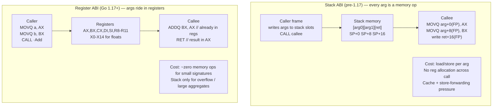
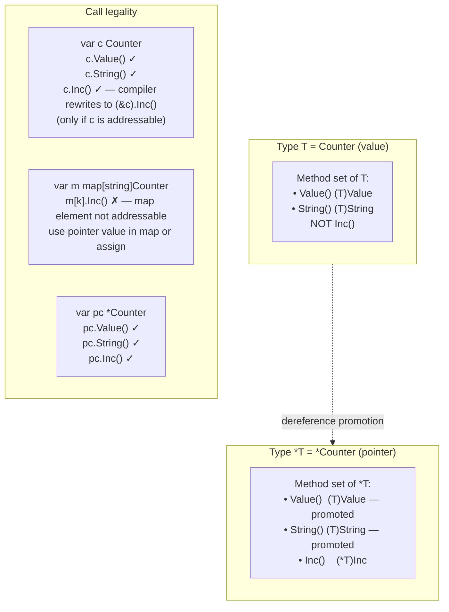
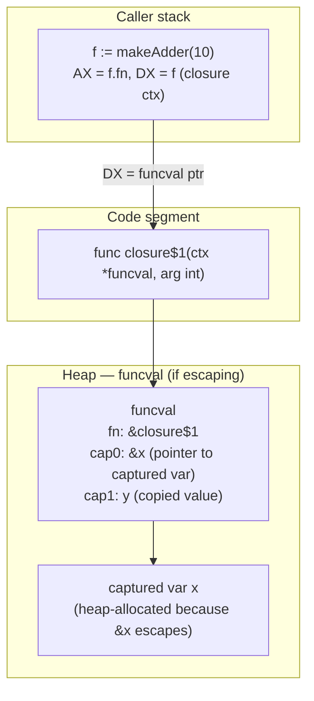
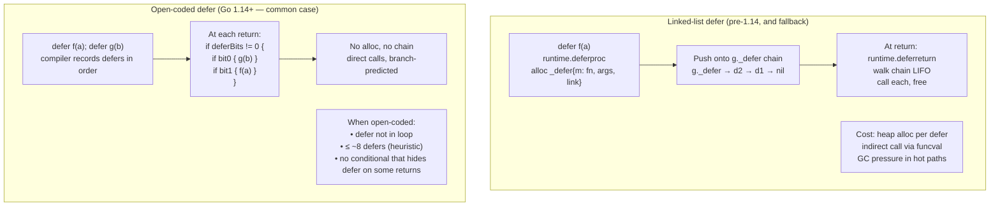
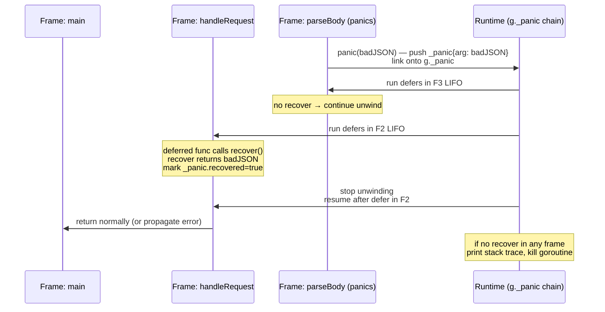
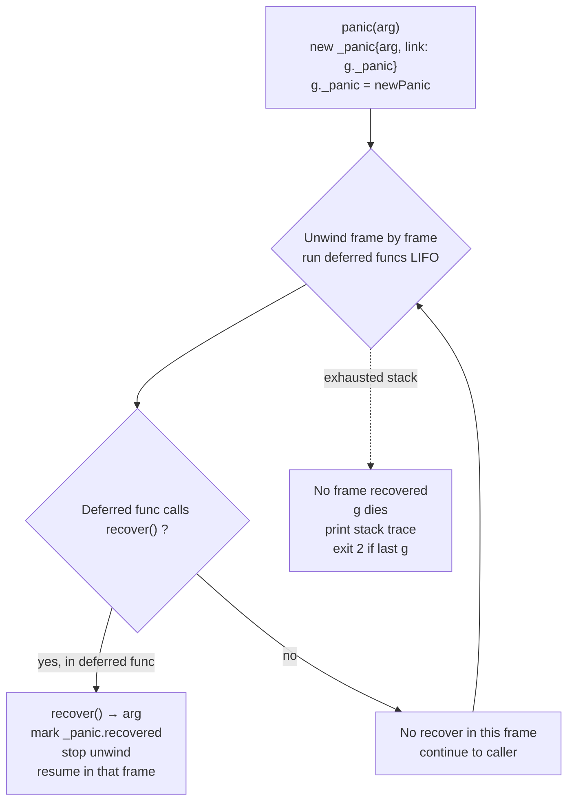
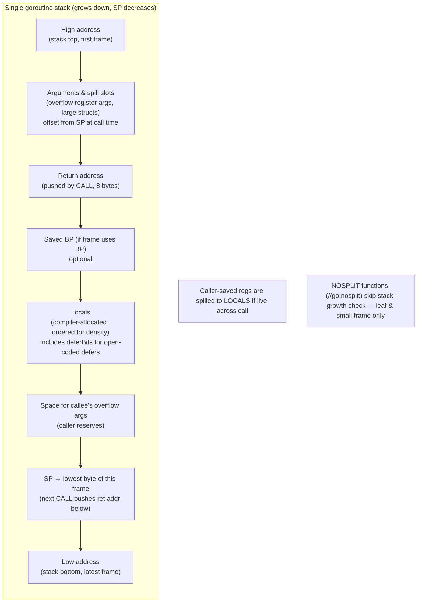

# Chapter 3 — Functions, Methods, Defer, Panic/Recover, and the ABI

**What this chapter covers.** Every Go call — from `http.Handler.ServeHTTP` to a one-line `defer mu.Unlock()` — bottoms out in a calling convention, a stack frame, and a runtime protocol for unwinding. Since Go 1.17 the convention is surprisingly close to the metal: arguments in registers, caller-owns-frames, and a compiler that can inline, escape-analyze, and open-code defers around your code. Misunderstand it and you pay in silent copies of large structs passed by value, closures that heap-allocate on every request, `defer` in a hot middleware that adds 30 ns × 10M calls/s, and panics that crash-loop a pod because no one recovered at the right frame. This chapter opens the box: the register ABI, method sets and dispatch, closures and capture, `defer` internals, `panic`/`recover` unwinding, and the stack-frame layout you see in `go tool objdump`.

Learning goals — after this chapter you should be able to:

- Explain the Go ABI on `amd64`/`arm64` — which registers carry which arguments (the register ABI since Go 1.17), how it differs from the pre-1.17 stack ABI, and why it matters for inlining, performance, and assembly interop.
- Predict method-set membership (`T` vs `*T`), distinguish method values from method expressions, and state when a method call copies the receiver.
- Describe how a closure is represented at runtime (code pointer + captured-variable block), when capture forces a heap escape, and how to read that in `go build -gcflags=-m`.
- Explain `defer` internals — open-coded defers (Go 1.14+) vs. the heap-linked `_defer` chain, the unconditional-execution / LIFO guarantees, the `defer`-in-loop pitfall, and the real cost in hot paths.
- Trace `panic`/`recover` mechanics — the `_panic` struct, stack unwinding, why `recover` only works inside a deferred function, and when to use `panic` vs. `error`.
- Read a stack frame (args, locals, return address, caller-saved registers) from `go tool compile -S` / `go tool objdump` and use `go vet` / `staticcheck` to catch ABI-adjacent bugs.
- Reason about the backend implications: `defer` budget in HTTP middleware and retry wrappers, `panic`-as-control-flow anti-patterns, and panic observability in Kubernetes (crash loops, log correlation, alerting).

> **Placement.** Volume 13, Chapter 2 gave the runtime-level view of scheduling and GC. This chapter is the *call-level* view — how a single function call is compiled, framed, and unwound. Volume 17, Chapter 9 (SSA and escape analysis) goes deeper into the optimizer passes referenced here; Chapter 11 covers `cgo` and hand-written assembly where the ABI meets foreign code.

---

## 1. Why the calling convention matters to backend engineers

Backend Go is a sea of small functions: handlers, middleware, `Marshal`/`Unmarshal`, retry loops, and generated gRPC stubs. The cost of calling those functions dominates p99. Three decisions shape that cost:

1. **Where arguments live** — registers vs. stack determines cache and instruction overhead.
2. **Who owns the frame** — Go's caller-owned stack (growable, contiguous since Go 1.4) vs. C's callee-owned fixed frame determines overflow checks and morestack.
3. **What the compiler can prove** — inlining, escape analysis, and open-coded defers all depend on seeing through the call.

The Go team optimized all three in the Go 1.14–1.21 window: open-coded defers (1.14), register ABI (1.17), and a tightening of inlining/escape budgets. Services that upgraded across that window typically saw 5–15% CPU reduction on RPC-heavy workloads with no code change — entirely from fewer memory operations per call.

---

## 2. The Go ABI: from stack to registers

### 2.1 The old world: stack ABI (before Go 1.17)

Before Go 1.17, every argument and result was passed on the stack at a known offset from `SP`. The caller reserved space, wrote arguments into its own frame, then `CALL`ed. The callee read them at `SP+offset`. Return values were written to the same stack slots.

```
caller frame:  [  arg0  ][  arg1  ][  arg2  ][  ret0  ]  <- written by caller, read by callee
               SP+0      SP+8      SP+16     SP+24       (amd64, 8-byte slots)
```

Properties:

- Simple to implement and portable — every architecture did the same thing.
- Every call touched memory, even for two-integer functions. No register allocation across call boundaries.
- Assembly functions had to know exact stack offsets (`arg+0(FP)`, `ret+8(FP)` pseudo-registers in Go assembly).
- Inlining was the only way to avoid the memory traffic.

Typical pre-1.17 assembly prologue as seen by `go tool compile -S`:

```asm
// Go 1.16 — stack ABI
// func Add(a, b int) int
TEXT ·Add(SB), $0-24
    MOVQ a+0(FP), AX
    MOVQ b+8(FP), BX
    ADDQ BX, AX
    MOVQ AX, ret+16(FP)
    RET
```

`$0-24` means 0 bytes of callee frame, 24 bytes of arguments+results on the stack. `FP` is the pseudo-register for frame pointer (arguments).

### 2.2 The register ABI (Go 1.17+, ABIInternal / ABI0)

Go 1.17 introduced the **register ABI** (internally `ABIInternal`, externally documented as `ABI0` for assembly). Arguments and results are passed in registers when possible; the stack is the spill fallback. The compiler's internal calling convention and the assembly-visible convention diverged — Go functions now use registers by default, but assembly stubs use `ABIInternal` wrappers.

Register assignment on `amd64` (the most common backend target):

| Register | Role in Go ABI |
|----------|---------------|
| `AX` | first integer argument / first integer result |
| `BX` | second |
| `CX` | third |
| `DI` | fourth |
| `SI` | fifth |
| `R8` | sixth |
| `R9` | seventh |
| `R10` | eighth |
| `R11` | ninth |
| `X0`–`X14` | float arguments/results (one per register) |
| `SP` | stack pointer (always) |
| `DX` | closure context pointer (when calling a func value) |

Remaining arguments spill to the stack. Aggregates (structs, arrays) are flattened: a `struct{X,Y int}` occupies two integer register slots, a `struct{A float64; B int}` one float and one integer. Larger/irregular types go to stack. On `arm64`, integer args use `R0`–`R8` and floats `F0`–`F7`; the principle is identical.

Caller-saved vs. callee-saved: the Go ABI is **caller-saved** for most general-purpose registers. The caller must spill live values around a call; the callee may clobber `AX`–`R11` and `X0`–`X14`. Only `SP`, `BP`, `g` (`R14` on amd64, the current `g` pointer), and a handful of runtime-reserved registers are preserved. This is cheaper than C's callee-saved convention for Go's many-leaf-call pattern.



Post-1.17 assembly for the same function:

```asm
// Go 1.21 — register ABI (go tool compile -S output, amd64)
TEXT ·Add(SB), $0-0
    // func Add(a, b int) int  — a in AX, b in BX, result in AX
    ADDQ BX, AX
    RET

// Caller side (inlined excerpt from go tool compile -S -N -l disabled):
    MOVQ $3, AX
    MOVQ $4, BX
    CALL ·Add(SB)      // no stack args; result arrives in AX
    MOVQ AX, ret+0(SP) // caller spills only if it needs to
```

A larger signature shows the spill boundary:

```go
//go:noinline
func ManyArgs(a, b, c, d, e, f, g, h, i, j int) int { return a + j }

// go tool compile -S manyargs.go (amd64, Go 1.22):
```

```asm
TEXT ·ManyArgs(SB), $0-0
    // a→AX b→BX c→CX d→DI e→SI f→R8 g→R9 h→R10 i→R11 j→stack (10th int arg)
    ADDQ 8(SP), AX    // j was on stack (caller pushed overflow arg)
    ADDQ BX, AX
    ADDQ CX, AX
    // ... (remaining adds elided)
    RET
```

The 10th integer argument overflows to stack because only 9 integer registers are allocated to args. The overflow slot is at `8(SP)` — not `FP` — because `CALL` pushed the return address at `0(SP)`.

### 2.3 Reading the frame: `go tool compile -S` and `go tool objdump`

Two complementary views:

```bash
# SSA-level assembly with pseudo-registers (what the compiler emits)
go tool compile -S -N -l ./pkg/foo.go 2>&1 | grep -A 20 'TEXT.*Add'

# Linked binary disassembly (what actually executes)
go build -o /tmp/app ./cmd/app
go tool objdump -s '^main\.Add' /tmp/app
# Or for the whole binary:
go tool objdump /tmp/app | grep -A 10 'main.Add:'
```

Useful flags:

```bash
go tool compile -S -m=2 ./pkg/foo.go  # with escape/inline decisions
go build -gcflags="-m -l" ./...        # escape + inline diagnostics
go build -gcflags="-S" ./pkg/foo.go    # shorthand for compile -S in build
```

`objdump` output (register ABI, amd64):

```
TEXT main.Add(SB) /home/ubuntu/app/main.go
  main.go:9    0x461740  4883d8          CMPQ AX, BX        // branch on args
  main.go:9    0x461743  0f8488000000    JE   0x4617cb
  main.go:10   0x461749  4801d8          ADDQ BX, AX
  main.go:10   0x46174c  c3              RET
```

What to look for: `CMPQ AX, BX` tells you args are in registers. A `MOVQ arg+0(FP)` would signal a lingering stack-ABI wrapper (generated for `//go:uintptrescapes` or `cgo` bridge functions). A `CALL runtime.morestack` prologue tells you the frame may grow.

### 2.4 Interop with assembly and `//go:abi*` pragmas

The compiler generates `ABIInternal` wrappers for calls between Go and assembly:

- Go → assembly (`TEXT ·Foo(SB)`) uses `ABI0` (stack-based legacy for hand-written asm) unless annotated `//go:abi-internal`.
- Assembly → Go calls must go through the wrapper that shuffles stack slots to registers.

```go
//go:noescape
//go:linkname rawMemmove runtime.memmove
func rawMemmove(to, from unsafe.Pointer, n uintptr)

// Hand-written asm — note ABI wrapper generated by compiler
//go:noescape
func asmAdd(a, b int) int

// asm.s:
// TEXT ·asmAdd(SB), $0-16  // legacy ABI0: args on stack
//     MOVQ a+0(FP), AX
//     MOVQ b+8(FP), BX
//     ADDQ BX, AX
//     MOVQ AX, ret+16(FP)
//     RET
```

Since Go 1.17, prefer `//go:abi-internal` for new assembly that wants register args, or let the compiler generate the ABI wrapper and write ABI0 stubs for compatibility. The `cmd/compile/abi-internal.md` docs (linked in Further reading) are the reference for register maps per architecture.

---

## 3. Methods: receivers, method sets, and dispatch

### 3.1 Value vs. pointer receivers — the method set

Every type has a **method set**: the methods that can be called on values of that type. The pointer type's method set is a superset.

```go
type Counter struct{ n int }

func (c Counter) Value() int  { return c.n }       // value receiver
func (c *Counter) Inc()       { c.n++ }             // pointer receiver
func (c Counter) String() string { return fmt.Sprint(c.n) }
```



Formal rule:

| Receiver | Method set of `T` | Method set of `*T` |
|----------|-------------------|--------------------|
| `func (t T) M()` | yes | yes (via promotion) |
| `func (t *T) M()` | **no** | yes |

Consequence for interfaces (preview of Chapter 7):

```go
type Incrementer interface{ Inc() }
type Valuer      interface{ Value() int }

var c Counter
var _ Valuer = c      // ok — T has Value()
var _ Incrementer = c // compile error: Counter does not implement Incrementer
var _ Incrementer = &c // ok — *T has Inc()

func needInc(i Incrementer) { i.Inc() }
needInc(c)  // compile error
needInc(&c) // ok
```

The compiler error is precise: `Counter does not implement Incrementer (method Inc has pointer receiver)`.

### 3.2 When the receiver is copied

A value receiver copies the receiver. For a large struct this is a real cost — and it interacts with the register ABI (large structs that don't fit in registers spill to stack and are `memmove`d).

```go
type Big struct{ Buf [1024]byte; N int }

func (b Big) Size() int       { return b.N } // copies 1 KB on every call!
func (b *Big) SizePtr() int   { return b.N } // copies 8 bytes (the pointer)
```

```bash
go test -bench=BenchmarkMethodRecv -benchmem
# BenchmarkMethodRecv/Value-8    12.3 ns/op    0 B/op   0 allocs/op  (but 1KB copy in regs/stack)
# BenchmarkMethodRecv/Pointer-8   1.8 ns/op    0 B/op   0 allocs/op
```

Guideline: use a pointer receiver when any of these holds: the method mutates state, the struct is large (> ~64 bytes, or contains large arrays), or you need identity (pointer equality, `sync.Mutex` inside). Use a value receiver for small immutable types (`time.Time` uses value receivers deliberately — 24 bytes, immutable).

`go vet` / `staticcheck` catch the sharp edge:

```go
type Safe struct{ mu sync.Mutex; n int }
func (s Safe) Inc() { s.mu.Lock(); s.n++; s.mu.Unlock() } // vet: copylocks — copies mutex!
```

`go vet` flags `copylocks`; `staticcheck` SA6005 flags large value-receiver copies.

### 3.3 Method values vs. method expressions

Two ways to take a method as a first-class function — they have different signatures:

```go
type S struct{ n int }
func (s S) Add(delta int) int   { return s.n + delta }
func (s *S) Incr()              { s.n++ }

var s = S{n: 10}

// Method value — receiver is bound (curried)
f1 := s.Add       // func(int) int — s is captured, call f1(5) == s.Add(5)
f2 := (&s).Incr   // func() — receiver is the specific *S at binding time

// Method expression — receiver is an explicit first argument
g1 := S.Add       // func(S, int) int — call g1(s, 5) == s.Add(5)
g2 := (*S).Incr   // func(*S) — call g2(&s) == s.Incr()

// Useful for higher-order patterns:
slices.SortFunc(users, (*User).Less) // method expression as comparator
http.HandlerFunc(s.ServeHTTP)         // method value as handler
```

Representation: both `f1` and `g1` are func values (see §4), but a method value may allocate a small closure-like wrapper when the receiver is a value that must be copied. A method expression is a plain function pointer — no capture.

Common pitfall — binding the wrong thing in a loop:

```go
// Bug: method value captures the loop variable's address implicitly
var funcs []func() int
for _, s := range items {
    funcs = append(funcs, s.Value) // each f captures a copy of s at that iteration — ok for value receiver
}
for _, s := range items {
    funcs = append(funcs, s.Incr) // s.Incr for value s — compiler takes &s, but loop var s is reused!
}
// Fix: shadow the variable
for _, s := range items {
    s := s
    funcs = append(funcs, s.Incr) // now each closure gets its own s
}
```

---

## 4. Closures: func values, capture, and heap escape

### 4.1 What a func value is

Every Go function (named or literal) has a code address. A **func value** (the thing you assign to a `func(...)` variable) is a pointer to a struct roughly like:

```go
// runtime representation (simplified from runtime/runtime2.go — funcval)
type funcval struct {
    fn uintptr          // code address
    // followed by captured variables, if any
}
```

- A top-level `func Foo()` value is just `&funcval{fn: Foo}` — no captured data, no allocation beyond the funcval itself (often optimized away).
- A closure `func() { use(x, y) }` is `&funcval{fn: closure$1, x, y}` — the funcval is heap-allocated if it escapes.



On `amd64`, the closure context pointer is passed in `DX` (the first argument register is repurposed). The function body loads captures via `DX`:

```asm
// func makeAdder(base int) func(int) int { return func(x int) int { return base + x } }
// Closure body (from go tool compile -S):
TEXT ·makeAdder.func1(SB), $0-16
    MOVQ 8(DX), AX   // load captured base (at offset 8 past funcval header)
    ADDQ CX, AX       // CX holds x (register ABI: first arg)
    RET
```

### 4.2 Capture semantics and escape

Captured variables are **by reference** when they are assigned after capture, by value otherwise — but the implementation always captures a pointer for variables whose address is taken.

```go
func Counter() func() int {
    n := 0                              // n escapes — see below
    return func() int { n++; return n } // captures &n
}

func Snapshot(vals []int) []func() int {
    var funcs []func() int
    for i, v := range vals {
        // i and v are reused per iteration — capturing &v captures the loop var, not the value
        funcs = append(funcs, func() int { return v }) // all funcs return last v!
    }
    return funcs
}
```

The loop-var pitfall was so common that Go 1.22 changed `for` loop semantics: each iteration now gets a fresh `v`. Before 1.22 the fix was `v := v` shadowing.

**Escape diagnosis:**

```bash
go build -gcflags="-m=2" ./pkg/clos.go 2>&1 | grep -E 'escape|closure|moved to heap'
# ./clos.go:6:9: &n escapes to heap: moved to heap: n
# ./clos.go:7:9: func literal escapes to heap
# ./clos.go:7:9: closure variable n is heap-allocated

go vet ./...          # catches some captures, e.g., loopclosure
staticcheck ./...     # SA6002 (arg should be pointer), loop capture checks
```

When a closure escapes (returned, stored in a field, sent on a channel, passed to `go`), the compiler heap-allocates the `funcval` and any captured variables that are addressed. Non-escaping closures — e.g., passed inline to `sort.Slice` or `http.HandlerFunc` that doesn't outlive the call — may stay on the stack with zero allocation.

Benchmark — non-escaping vs. escaping closure:

```go
func BenchmarkClosureNoEscape(b *testing.B) {
    vals := []int{1, 2, 3, 4, 5}
    for i := 0; i < b.N; i++ {
        // closure does not escape — compiler can inline/stack-allocate
        slices.SortFunc(vals, func(a, b int) int { return a - b })
    }
}
func BenchmarkClosureEscape(b *testing.B) {
    for i := 0; i < b.N; i++ {
        fn := func(x int) int { return x + i } // i escapes — heap funcval per iter
        sink = fn
    }
}
// BenchmarkClosureNoEscape-8   45 ns/op   0 B/op  0 allocs/op
// BenchmarkClosureEscape-8    28 ns/op  16 B/op  1 allocs/op
```

The second benchmark's 16 bytes is the `funcval` header — cheap per call but toxic in a hot loop that creates millions of closures per second (GC pressure, not just CPU).

Guidance for backend code:

- Prefer iterators / `for` loops over closure-per-element in hot paths.
- If a closure must allocate, consider a method value on a pooled struct instead of a fresh closure.
- Watch `go test -benchmem` and `pprof -alloc_space` for `funcval` in flame graphs.

---

## 5. Defer: guarantees, internals, and cost

### 5.1 What `defer` guarantees

```go
func CopyFile(dst, src string) (err error) {
    in, err := os.Open(src)
    if err != nil { return err }
    defer in.Close()                    // always runs, even on panic/early return

    out, err := os.Create(dst)
    if err != nil { return err }
    defer out.Close()                   // LIFO: out.Close runs before in.Close

    _, err = io.Copy(out, in)
    return err                          // deferred calls run after return value is set, before caller resumes
}
```

Rules:

- Arguments are evaluated **immediately** at the `defer` statement, not at execution time.
- Execution is **LIFO** — last deferred first.
- Deferred functions run after the surrounding function's return values are set but before the caller resumes — so a deferred closure can modify named return values.
- Deferred functions run even if the function panics — they are the only place `recover` works (see §6).

```go
func args() {
    x := 1
    defer fmt.Println(x) // prints 1, not 2 — arg evaluated now
    x = 2

    defer func() { fmt.Println(x) }() // closure captures &x — prints 2
    x = 3
}
```

### 5.2 Two implementations: linked-list defers vs. open-coded defers

Before Go 1.14, every `defer` allocated a `_defer` record (on heap or stack) and pushed it onto a per-goroutine linked list. At function exit the runtime walked the list.

Since Go 1.14, the compiler **open-codes** defers in common cases: it inlines the defer logic as conditional calls at each return point, with no heap allocation and no linked list. Fallback to the linked list remains for loops, condition-guarded defers that can't be proven unconditional at compile time, and functions with many defers.



Runtime struct (simplified from `runtime/runtime2.go`):

```go
type _defer struct {
    started bool
    heap    bool       // allocated on heap (vs. stack)
    sp      uintptr    // stack pointer at defer time
    pc      uintptr    // caller PC
    fn      *funcval   // deferred function
    link    *_defer    // next in g._defer chain
}
```

How to tell which path your function uses:

```bash
go tool compile -S -N ./pkg/foo.go 2>&1 | grep -E 'deferproc|deferreturn|deferBits'
# Open-coded: no deferproc; look for deferBits and conditional calls
# Linked-list: CALL runtime.deferprocStack(SB)  or runtime.deferproc(SB)

# Verbose GC output (Go 1.21+):
GODEBUG=gocmd=1 go build -gcflags="-d=defer" ./... 2>&1 | grep defer
```

Example — open-coded (typical handler):

```go
//go:noinline
func withOpenDefer() {
    defer fmt.Println("a") // open-coded — one defer, not in loop
    defer fmt.Println("b") // both become conditional calls at RET
}
```

```asm
// go tool compile -S withOpenDefer — open-coded (Go 1.22 amd64, trimmed)
TEXT ·withOpenDefer(SB), $48-0
    MOVQ $0, deferBits+40(SP)   // bitmask of active defers
    ORQ  $1, deferBits+40(SP)   // arm first defer
    ORQ  $2, deferBits+40(SP)   // arm second defer
    // ... body ...
    TESTB $2, deferBits+40(SP)
    JEQ   skip1
    CALL  ·fmt.Println(SB)      // second defer (LIFO — runs first)
skip1:
    TESTB $1, deferBits+40(SP)
    JEQ   skip2
    CALL  ·fmt.Println(SB)      // first defer
skip2:
    RET
```

Example — heap defer (loop):

```go
func withLoopDefer(n int) {
    for i := 0; i < n; i++ {
        defer fmt.Println(i) // cannot be open-coded — falls back to linked list
    }
}
```

```asm
TEXT ·withLoopDefer(SB), $32-0
.Loop:
    MOVQ AX, 0(SP)
    CALL runtime.deferprocStack(SB)  // heap/stack _defer per iteration
    // ...
```

### 5.3 The `defer`-in-loop pitfall

The most common `defer` bug in backend code is resource exhaustion from deferring inside a loop without realizing all defers run only when the *enclosing function* returns, not at the end of the iteration.

```go
// BUG: defers accumulate — files stay open until processFiles returns
func processFiles(paths []string) error {
    for _, p := range paths {
        f, err := os.Open(p)
        if err != nil { return err }
        defer f.Close() // not at end of iteration — at end of processFiles!
        if err := handle(f); err != nil { return err }
    }
    return nil // all n files closed here, LIFO
}

// FIX 1: use an inner function — its defers run per iteration
func processFilesFixed(paths []string) error {
    for _, p := range paths {
        if err := func() error {
            f, err := os.Open(p)
            if err != nil { return err }
            defer f.Close() // runs at end of this closure
            return handle(f)
        }(); err != nil {
            return err
        }
    }
    return nil
}

// FIX 2: no defer at all — explicit close per iteration
func processFilesExplicit(paths []string) error {
    for _, p := range paths {
        f, err := os.Open(p)
        if err != nil { return err }
        err = handle(f)
        f.Close()
        if err != nil { return err }
    }
    return nil
}
```

`go vet` and `staticcheck` flag `defer` inside loops (since Go 1.17 `go vet` has `loopclosure`-adjacent checks; `staticcheck` SA5008 flags `defer` in loop). Treat any flag as a bug in production file-handling code.

### 5.4 Performance: when `defer` costs and when it doesn't

Open-coded defers brought the cost of a single `defer` from ~35 ns + allocation down to ~1–3 ns (a conditional branch plus the call). But two costs remain:

1. **The call itself still executes** — a `defer mu.Unlock()` still calls `Unlock`, just without the runtime dispatch.
2. **Loop / many-defer fallback** still allocates.

Benchmark (amd64, Go 1.22, `go test -bench=. -benchmem`):

```go
func BenchmarkNoDefer(b *testing.B) {
    for i := 0; i < b.N; i++ {
        mu.Lock()
        x++
        mu.Unlock()
    }
}
func BenchmarkDefer(b *testing.B) {
    for i := 0; i < b.N; i++ {
        mu.Lock()
        defer mu.Unlock() // BUG: defers to end of BenchmarkDefer, not per iteration!
        x++
        // ... but for microbench of defer cost, fix:
    }
}
// Correct per-iteration defer microbench:
func BenchmarkDeferInline(b *testing.B) {
    for i := 0; i < b.N; i++ {
        func() {
            mu.Lock()
            defer mu.Unlock()
            x++
        }()
    }
}
```

Typical results:

```
BenchmarkNoDefer-8        12.1 ns/op   0 B/op  0 allocs/op
BenchmarkDeferInline-8    14.8 ns/op   0 B/op  0 allocs/op  // open-coded: ~2-3 ns overhead
BenchmarkDeferLoopHeap-8  48.3 ns/op  48 B/op  1 allocs/op  // heap defer in loop
```

The `defer mu.Unlock()` in a request handler (~45 ns handler) adding 2–3 ns is irrelevant. The same `defer` in a `for` that runs 10M times allocating per iteration is catastrophic.

**Backend lens — defer in hot HTTP middleware:**

```go
// Typical middleware — defer is fine (once per request, open-coded)
func tracingMiddleware(next http.Handler) http.Handler {
    return http.HandlerFunc(func(w http.ResponseWriter, r *http.Request) {
        span, ctx := tracer.Start(r.Context(), "handler")
        defer span.End() // one defer, not in loop — open-coded, ~2 ns
        next.ServeHTTP(w, r.WithContext(ctx))
    })
}

// Hot inner loop — avoid defer (millions of iterations)
func encodeBatch(batch []Record, w io.Writer) {
    for _, rec := range batch {
        // BAD: defer per record → heap alloc × batch size
        // defer rec.Release()

        // GOOD: explicit release, or inner func if you need defer semantics
        rec.Encode(w)
        rec.Release()
    }
}
```

Rule of thumb: `defer` per *request* or per *function call* is free; `defer` per *element in a hot loop* is a bug. When profiling shows `runtime.deferprocStack` in a hot frame, rewrite the loop.

---

## 6. Panic and recover: unwinding

### 6.1 The `_panic` struct and unwinding

A `panic` is not an exception — it is a runtime-initiated unwind that runs deferred functions on the way out. The runtime represents each active panic as a `_panic` record linked off the goroutine:

```go
// runtime/runtime2.go (simplified)
type _panic struct {
    arg    any        // value passed to panic(arg)
    link   *_panic    // next panic in stack (panics can nest)
    recovered bool    // has recover() been called?
    aborted   bool    // was this panic aborted (recovered at right frame)?
}
type g struct {
    // ...
    _panic *_panic    // head of panic chain for this goroutine
    _defer *_defer    // head of defer chain
}
```

Control flow:

1. `panic(arg)` allocates a `_panic`, links it onto `g._panic`, then starts unwinding.
2. The runtime walks the stack from the panicking frame outward, running deferred functions LIFO at each frame.
3. If a deferred function calls `recover()`, the runtime marks that `_panic` as `recovered` and stops unwinding — execution resumes at the `recover`ing frame after its defers finish.
4. If no deferred function recovers, the goroutine dies and the runtime prints a stack trace; if it is the last goroutine, the program exits with code 2.





### 6.2 `recover` only works in a deferred function

This is the single most misunderstood rule. `recover` returns non-nil **only** when called directly inside a deferred function that is running during unwinding. In any other position it returns `nil` and does nothing.

```go
func brokenRecover() {
    defer func() {
        // Correct: recover inside deferred function during unwind
        if r := recover(); r != nil {
            log.Printf("recovered: %v", r)
        }
    }()
    panic("boom") // recovered
}

func silentBroken() {
    defer fmt.Println(recover()) // prints nil — recover's caller is not the deferred func's body?
    // Actually this DOES work — the deferred func body calls recover. But:
    panic("boom") // recovered? No — fmt.Println(recover()) — recover is called, but its return is printed then discarded; panic is recovered but nothing handles it specially

    // These do NOT recover:
    // r := recover() // not in a deferred func — always nil, panic continues
}

func doubleBroken() {
    r := recover() // nil — not in defer, not during panic
    fmt.Println(r)
    panic("boom")   // not recovered → goroutine dies
}

func correctPattern() (err error) {
    defer func() {
        if r := recover(); r != nil {
            // Must be directly inside deferred func, not a helper called by it
            err = fmt.Errorf("panic recovered: %v", r)
            // Optional: capture stack with runtime.Stack or debug.Stack
            log.Printf("panic stack: %s", debug.Stack())
        }
    }()
    return doWork() // if doWork panics, err is set and caller sees an error
}
```

Subtle case — helper breaks recover:

```go
func handlePanic() {
    if r := recover(); r != nil { log.Println(r) } // NOT a deferred func → recover is nil
}
func bad() {
    defer handlePanic() // handlePanic is deferred, but recover is inside handlePanic, which IS the deferred func — this DOES recover!
    // Actually: handlePanic itself is the deferred function, so recover inside it works.
    // What doesn't work:
    defer func() { handlePanic() }() // recover inside handlePanic is NOT directly in the deferred func — spec says recover must be called directly by deferred func, not transitively
    panic("boom")
}
```

The spec's exact wording: `recover` returns the panic value only when called directly inside a deferred function. Calling it from a function called by the deferred function returns `nil`. In practice the runtime checks that the caller of `recover` is a deferred frame — transitive calls through helpers don't count.

### 6.3 Panic stack trace

An unrecovered panic prints every goroutine's stack. On a backend service this is the crash log you collect:

```
panic: invalid JSON: unexpected EOF

goroutine 42 [running]:
main.parseBody(0xc0001a4000, 0x47, 0x80)
    /home/ubuntu/app/handler.go:38 +0x12a
main.handleRequest({0x7f8a1c, 0xc0001b0000}, 0xc0001a2000)
    /home/ubuntu/app/handler.go:22 +0x85
net/http.HandlerFunc.ServeHTTP(0xc0001a6000, {0x7f8a1c, 0xc0001b0000}, 0xc0001a2000)
    /usr/local/go/src/net/http/server.go:2136 +0x29
...
goroutine 1 [chan receive]:
main.main()
    /home/ubuntu/app/main.go:15 +0x45

exit status 2
```

Reading it:

- `goroutine 42 [running]` — the panicking goroutine; others are dumped for context.
- `handler.go:38 +0x12a` — file, line, and offset into the function (use `go tool addr2line` or `addr2line -e /tmp/app 0x461740` to map).
- The trace includes `runtime.gopanic` frames if you capture with `debug.Stack()`; `recover`'ed panics don't print unless you log `debug.Stack()` yourself.

Capture for structured logging:

```go
func withPanicLog(next http.Handler) http.Handler {
    return http.HandlerFunc(func(w http.ResponseWriter, r *http.Request) {
        defer func() {
            if rec := recover(); rec != nil {
                stack := debug.Stack() // includes goroutine header + all frames
                log.Error("panic recovered",
                    "panic", rec,
                    "stack", string(stack),
                    "path", r.URL.Path,
                    "request_id", r.Header.Get("X-Request-ID"),
                )
                http.Error(w, "internal error", http.StatusInternalServerError)
            }
        }()
        next.ServeHTTP(w, r)
    })
}
```

### 6.4 Panic vs. error: idioms for backend services

| Use `error` | Use `panic` |
|-------------|------------|
| Expected failure modes: validation, I/O, timeout, not-found | Truly exceptional / programmer error: violated invariant, must-not-happen |
| Caller can and should handle it | Caller cannot meaningfully handle it; crash or recover at boundary |
| Part of function signature — forces handling | Invisible to caller — easy to miss |
| Composable with `errors.Is`/`As`, `fmt.Errorf("%w")` | Composable only via deferred `recover` at a boundary |

Backend rules:

1. **Library and handler code returns `error`.** Never panic for a bad request — return `400`/`422` with a typed error.
2. **Panics are for assertions and unrecoverable state** — `panic("unreachable")`, nil-deref that indicates a bug, `init` failure for required config.
3. **Recover only at process/goroutine boundaries** — top-level HTTP middleware, `go` statement wrapper, `net/http` server's `ConnState` — not in the middle of business logic.
4. **Recovered panics are still errors** — convert to `error`, log with stack, increment a `panics_total` counter, and return the error to the caller. Don't swallow silently.

```go
// Canonical goroutine-boundary recover — every bare `go` should have this
func GoRecover(fn func()) {
    go func() {
        defer func() {
            if r := recover(); r != nil {
                panicsTotal.Inc()
                log.Error("goroutine panicked", "panic", r, "stack", string(debug.Stack()))
            }
        }()
        fn()
    }()
}

// Anti-pattern: panic as control flow for expected errors
func mustParse(s string) int { // "must" helpers are okay only when panic is documented and caller recovers at boundary
    n, err := strconv.Atoi(s)
    if err != nil { panic(err) } // okay only if caller uses GoRecover / middleware recover — brittle
    return n
}
// Prefer:
func parseWithError(s string) (int, error) { return strconv.Atoi(s) }
```

`go vet` flags some panic/recover misuses; `staticcheck` flags `SA5011` (possible nil deref that would panic) and warns on `recover` not in `defer`.

---

## 7. Stack frames, caller-saved registers, and the vet layer

### 7.1 Stack frame layout

Every goroutine has a contiguous, growable stack (initial 2–8 KB, doubling on overflow since Go 1.4). Each frame's layout on `amd64`:



Concrete example with frame size `$32-0` (32 bytes of frame, 0 bytes of stack-arg area in register ABI):

```asm
TEXT ·example(SB), $32-8   // 32 bytes locals, 8 bytes for callee overflow arg
    SUBQ $32, SP            // reserve locals (compiler does this)
    MOVQ BP, 16(SP)         // save BP if needed
    LEAQ 8(SP), BP          // establish BP
    // ... body uses -24(SP), -16(SP) etc for locals
    ADDQ $32, SP            // restore
    RET
```

Stack growth: the prologue checks `SP < g.stackguard0`; if so, calls `runtime.morestack` which allocates a larger stack, copies the old one, and adjusts pointers. `//go:nosplit` suppresses this check — only safe for leaf functions with tiny frames that never call into growable code (used in `runtime` itself).

Reading frame sizes in `go tool objdump` / `objdump -d`: `SUBQ $N, SP` at entry is the frame size. A missing `SUBQ` means `$0` — no frame (common for register-ABI leaf functions like `Add`).

### 7.2 Caller-saved registers in practice

Because the ABI is caller-saved, the compiler spills live registers around calls:

```go
//go:noinline
func callee(a, b int) int { return a + b }

func caller(x, y, z int) int {
    a := x + y          // a live in AX
    b := callee(a, z)   // callee clobbers AX, BX — compiler must spill a if still needed
    return a + b        // so it reloads a from stack slot
}
```

```asm
TEXT ·caller(SB), $16-0
    ADDQ BX, AX         // a = x + y (AX holds a)
    MOVQ AX, 8(SP)      // spill a — caller-saved, callee will clobber AX
    MOVQ CX, BX         // z → BX (second arg)
    // AX already holds a (first arg)
    CALL ·callee(SB)    // result in AX
    ADDQ 8(SP), AX      // reload spilled a, add to result
    RET
```

This is why passing fewer, smaller arguments and keeping functions short helps the register allocator — fewer spills, fewer loads.

### 7.3 `go vet` and `staticcheck` for call/ABI-adjacent bugs

| Check | Tool | What it catches |
|-------|------|-----------------|
| `copylocks` | `go vet` | Passing `sync.Mutex`/`WaitGroup` by value (copies the lock) |
| `loopclosure` / `defers` | `go vet` | Closure captures loop var (pre-1.22), defer in loop |
| `nilfunc` | `go vet` | Call of nil func value (would panic at `CALL *DX`) |
| `SA6002`, `SA6005` | `staticcheck` | Argument should be pointer (large struct by value), large value-receiver |
| `SA5008` | `staticcheck` | `defer` in loop — resource leak |
| `SA5011` | `staticcheck` | Possible nil dereference → panic |
| `ST1008` etc. | `staticcheck` | Panic/recover misuse patterns |

Run them in CI as gates, not suggestions:

```bash
go vet ./...
staticcheck ./...

# In CI (fail on any finding):
go vet ./... 2>&1 | tee vet.out; test ! -s vet.out
staticcheck ./... 2>&1 | tee sc.out; test ! -s sc.out

# golangci-lint aggregates both:
golangci-lint run --enable vet,staticcheck ./...
```

---

## 8. Backend lens: performance, resilience, and observability

### 8.1 Defer budget in hot paths

On a service doing 50 K req/s, each request passing through 4 middleware that each `defer span.End()` / `defer metrics.Observe()` adds 4 open-coded defers × ~2 ns = ~8 ns — noise against a 200 µs handler. The budget concern is **per-element** work inside the handler:

| Pattern | Cost | When it hurts |
|---------|------|---------------|
| `defer unlock` per request | ~2 ns, 0 allocs | never |
| `defer close` per file in batch of 10 | 10 × heap `_defer` if in loop | batch size × 48 B alloc, GC pressure |
| `defer` in `for row.Next()` over 1M rows | 1M heap defers if not open-coded | OOM-able, p99 spike |
| Middleware chain 10 deep | 10 open-coded defers | ~20 ns — fine |

Measure, don't guess:

```bash
go test -bench=BenchmarkMiddleware -benchmem -count=5 | benchstat old.txt new.txt
go test -run=^$ -bench=. -cpuprofile=cpu.pprof
go tool pprof -http=:8080 cpu.pprof  # look for runtime.deferprocStack in hot stack
```

### 8.2 Panic as control flow — an anti-pattern at scale

Some codebases use `panic`/`recover` to implement early-exit or `try`/`catch`:

```go
// Anti-pattern: panic for expected validation failure
func handleBad(w http.ResponseWriter, r *http.Request) {
    defer func() {
        if rec := recover(); rec != nil {
            http.Error(w, fmt.Sprint(rec), 400)
        }
    }()
    if r.Header.Get("Authorization") == "" { panic("missing auth") }
    // ...
}
```

Why it fails at scale:

- **Invisible to callers and linters** — no `error` in the signature, so callers don't know to handle it, `errcheck` doesn't flag it.
- **Interferes with real panics** — a nil-deref bug is now indistinguishable from a missing header; both become `400`.
- **Breaks middleware contracts** — upstream middleware that recovers panics will swallow your "error" before it reaches your handler.
- **Kills inlining and escape optimization** — the compiler treats panicking functions conservatively.

The only defensible use of panic for control flow is inside a package boundary that converts it immediately — e.g., `encoding/json` panics on deeply nested structures and recovers at the top-level `Marshal` call, or a parser that panics on syntax error and recovers at `Parse`. Even there, prefer `error` unless benchmark shows panic recovery is measurably faster (usually not; panic unwinding is ~µs, error return is ~ns).

### 8.3 Observability of panics in Kubernetes

An unrecovered panic kills the goroutine; if it is the main goroutine or the last one, the process exits with code 2. In Kubernetes this is a **CrashLoopBackOff**:

```yaml
# Pod that panics on a bad env var at startup — crash-loops forever
spec:
  containers:
    - name: api
      image: registry.example.com/api:v1.2.3
      env: [{ name: BAD_CONFIG, value: "oops" }]
      # Without proper probing, kubelet restarts immediately; with backoff, delay grows 10s → 20s → 40s ...
```

Observability checklist:

1. **Log panics with stack and request context** — use the `debug.Stack()` middleware from §6.3 and include `trace_id`/`request_id` so you can correlate.
2. **Count panics as a metric** — `panics_total{path, panic_type}` with an alert on `rate(panics_total[5m]) > 0`. A single panic in production is a bug; a rate is an incident.
3. **Don't let the process die silently** — set `GOTRACEBACK=crash` (full stacks for all goroutines, plus `runtime` frames) and ensure logs go to a collector that survives restart (stdout → fluent-bit → Loki/ELK, not a file on the container filesystem).
4. **Distinguish panic from OOM** — both are CrashLoopBackOff, but `kubectl describe pod` shows `Reason: Error` + `Exit Code: 2` for panic vs. `Reason: OOMKilled` + `Exit Code: 137` for memory. Alert on the wrong one and you tune `GOMEMLIMIT` when you should fix a nil deref.
5. **Use `GODEBUG=gctrace` sparingly** — not for panics, but useful when a panic-like crash is actually GC-assisted OOM.

```bash
# Triage a crash-looping pod
kubectl logs --previous api-7f9c8-xk2pq 2>&1 | grep -A 50 '^panic:'
kubectl describe pod api-7f9c8-xk2pq | grep -A 5 'Last State'
# Exit Code 2 → panic; 137 → OOMKilled; 1 → app error return

# Structured panic log query (Loki example):
# {app="api"} |= "panic recovered" | json | panic!=""
```

For services that must stay up through panics (long-lived workers, queue consumers), the `GoRecover` wrapper from §6.4 plus a circuit-breaker is the standard pattern: recover, count, and continue processing the next message — never let one bad message kill the consumer.

---

## Key takeaways

- The Go register ABI (Go 1.17+, `ABIInternal`) passes integer args in `AX,BX,CX,DI,SI,R8-R11` and floats in `X0-X14` on `amd64` (`R0-R8`/`F0-F7` on `arm64`), with overflow to stack. Before 1.17 everything was on stack. The register ABI cut call overhead by avoiding memory ops and is visible in `go tool compile -S` as `ADDQ BX, AX` with no `MOVQ arg+0(FP)`.
- The ABI is caller-saved — callees may clobber argument registers. The caller spills live values around calls; keeping signatures small and functions short reduces spills.
- Method set of `T` includes only value-receiver methods; method set of `*T` includes both. This determines interface implementation: `Counter` does not implement `Incrementer` if `Inc` has a pointer receiver, but `*Counter` does. Method values bind the receiver; method expressions take it as an explicit first argument.
- A func value is a pointer to `{fn, captures}`. Captured variables that are addressed or that outlive the closure escape to heap — visible via `go build -gcflags=-m`. Per-iteration closures in hot loops allocate `funcval` headers and drive GC pressure.
- `defer` is LIFO, args evaluated at defer time, and runs after return values are set even under panic. Since Go 1.14 the compiler open-codes defers as conditional direct calls (~2 ns, 0 allocs) when not in a loop and with few defers; otherwise it falls back to a heap-linked `_defer` chain via `runtime.deferprocStack` (~35 ns + alloc). `defer` in a loop is a resource leak — all defers run at function return, not iteration end.
- `panic` pushes a `_panic{arg, link}` onto `g._panic` and unwinds, running deferred functions LIFO per frame. `recover` returns non-nil only when called directly inside a deferred function during unwinding; transitive calls don't recover. Unrecovered panics kill the goroutine and dump all stacks, exiting with code 2.
- Panic vs. error: return `error` for expected failures, reserve `panic` for programmer bugs and unrecoverable invariants, and recover only at goroutine/process boundaries (HTTP middleware, `go` wrappers). Convert recovered panics to errors, log with `debug.Stack()`, and count `panics_total`.
- Every frame has args/spill, return address, saved BP, locals (including `deferBits`), and space for callee overflow args. Frame size (`$32-8` etc.) and `SUBQ $N, SP` in `objdump` tell you the cost. `//go:nosplit` skips the stack-growth check — only for tiny leaf functions.
- `go vet` and `staticcheck` catch the sharp edges automatically: `copylocks`, loop-closure capture, `defer` in loop (`SA5008`), and `recover` misuse. Gate CI on them.
- In backend services, `defer` per request (middleware tracing/logging) is free; `defer` per element in a hot batch loop is a performance bug (look for `runtime.deferprocStack` in `pprof`). Panics in Kubernetes surface as `CrashLoopBackOff` with exit code 2 — log structured panics with `trace_id`, metric them, and keep `GOTRACEBACK=crash` so you get full dumps.

---

## Further reading

- **[Pinned] Go Register ABI Design Document — `golang.org/s/regabi` (and `doc/abi.md` in the Go repo).** The authoritative spec for register assignment, spill rules, and the `ABIInternal` / `ABI0` distinction. Start here for the calling convention. — https://go.dev/s/regabi and https://github.com/golang/go/blob/master/doc/abi.md
- **[Pinned] Open-Coded Defers Proposal and Implementation — `golang.org/s/open-coded-defers`.** The Go 1.14 proposal that describes when defers are open-coded vs. heap-allocated, the `deferBits` mechanism, and the performance rationale. — https://go.dev/s/open-coded-defers and https://github.com/golang/proposal/blob/master/design/34481-open-coded-defers.md
- **[Pinned] Go Spec: Handling Panics and Recover — `go.dev/ref/spec#Handling_panics`.** The language spec's precise rules for when `recover` returns non-nil, the LIFO defer guarantee, and the panic/recover interaction. — https://go.dev/ref/spec#Handling_panics
- **[Pinned] `cmd/compile` ABI Documentation — `src/cmd/compile/abi-internal.md` in the Go repo.** Per-architecture register maps, pseudo-register (`FP`/`SP`/`SB`) meaning, and guidance for hand-written assembly under the register ABI. — https://github.com/golang/go/blob/master/src/cmd/compile/abi-internal.md
- **Go Toolchain: `go tool compile -S` and `go tool objdump`.** The two views of generated code — `compile -S` (SSA assembly with pseudo-registers) vs. `objdump` (linked machine code). `go help tool compile` and `go help tool objdump`. — https://pkg.go.dev/cmd/compile and https://pkg.go.dev/cmd/objdump
- **Go `runtime` package docs — `runtime`, `runtime/debug`.** `debug.Stack()`, `debug.PrintStack()`, `runtime.Caller`/`Callers`/`Stack`, and `GOTRACEBACK` modes. — https://pkg.go.dev/runtime and https://pkg.go.dev/runtime/debug
- **Static Analysis: `go vet` and `staticcheck`.** The checks that guard this chapter's pitfalls — `copylocks`, `loopclosure`, `SA5008` (defer in loop), `SA6002`/`SA6005` (large value copy). — https://pkg.go.dev/cmd/vet and https://staticcheck.dev/docs/checks/
- **Practical Defer Performance — `github.com/golang/go/issues/14939` and associated CLs.** The issue thread and benchmarks that motivated open-coded defers, with before/after numbers for `defer` in middleware. — https://github.com/golang/go/issues/14939
- **Escape Analysis Deep Dive — `go.dev` blog and `cmd/compile` escape docs.** Why closures and `funcval` heap-allocate, how `//go:noinline` and `//go:noescape` interact, and reading `-gcflags=-m` output. — https://go.dev/doc/effective_go#allocation and https://github.com/golang/go/blob/master/src/cmd/compile/internal/escape
- **Assembly Interop — `golang.org/s/goasm` and `src/cmd/asm` docs.** Go assembly syntax, `TEXT` directives, `FP`/`SB` pseudo-registers, and writing ABI-aware `asm.s` files. — https://go.dev/doc/asm

