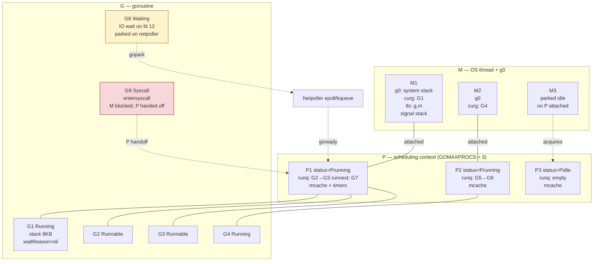
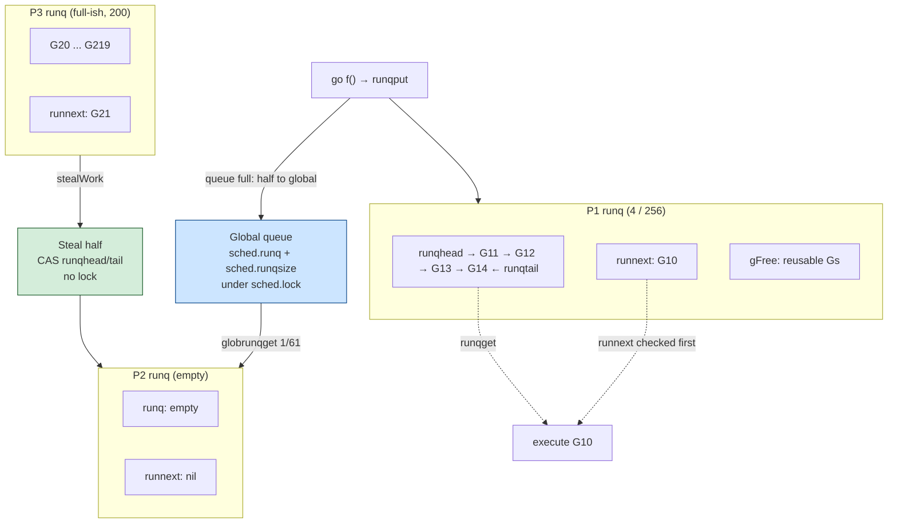
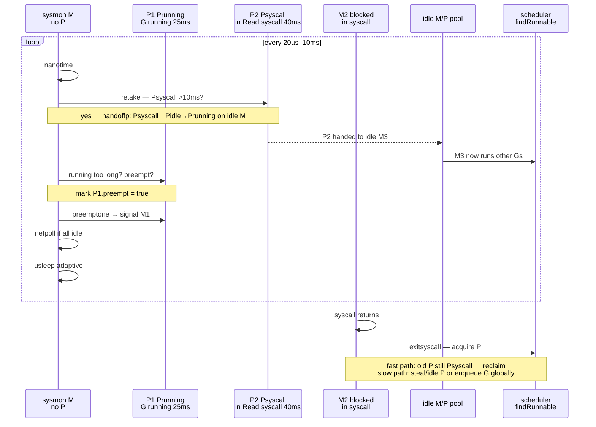
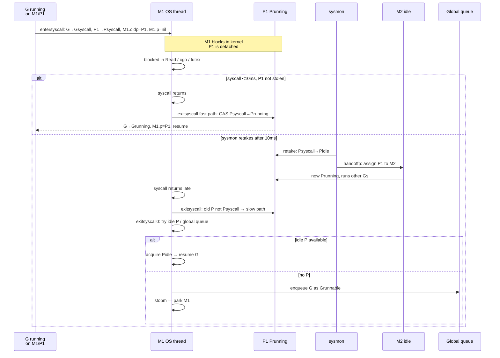
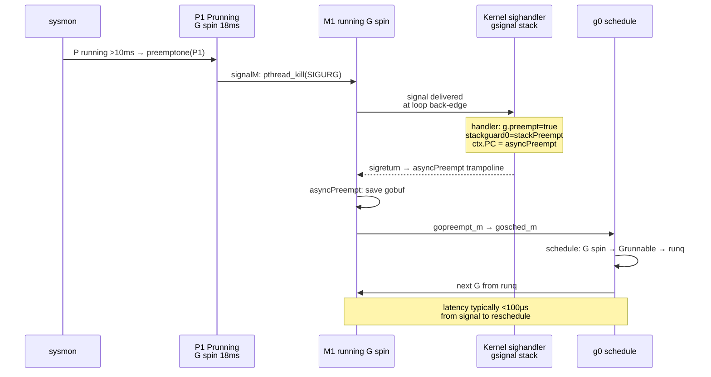
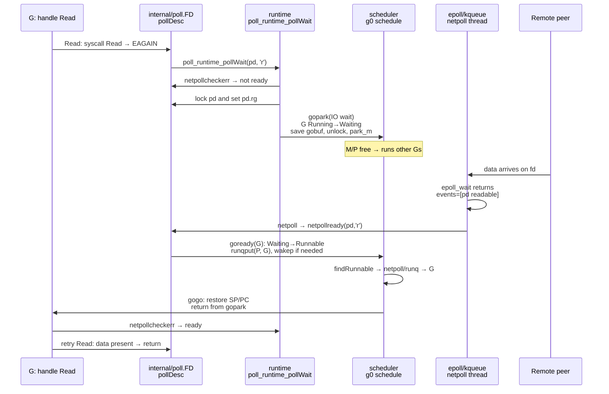

# Chapter 4 — Goroutines, the Scheduler (G-M-P), and the Netpoller

**What this chapter covers.** Go ships its own user-space scheduler and I/O reactor inside every static binary. When you write `go handle(conn)` in an HTTP server, you are not creating an OS thread — you are enqueuing a 2 KB `g` onto a per-P run queue that an `M` will steal, park on the netpoller, and preempt via signal. Understanding that machinery is the difference between a service that scales to 100k concurrent connections on 4 cores and one that collapses under goroutine leaks, `GOMAXPROCS` misconfiguration in Kubernetes, or netpoller saturation you blame on "slow network." This chapter opens `runtime/proc.go` and `runtime/netpoll*.go`: the `G`, `M`, `P` structs, the scheduling loop, work-stealing, `sysmon`, async preemption, and the `epoll`/`kqueue` netpoller that makes non-blocking I/O feel blocking.

Learning goals — after this chapter you should be able to:

- Contrast a goroutine and an OS thread on cost (stack, creation time, scheduling), blocking behavior, and observability, and explain why >100k goroutines is routine but >10k threads is not.
- Read the `g`, `m`, and `p` structs in `runtime/runtime2.go` — stack bounds, `atomicStatus`, `waitReason`, `g0`/`curg`, `lockedg`, `runq`/`runnext`, `mcache`, timers — and map each field to a scheduler decision.
- Trace the scheduling loop: `schedule` → `findRunnable` → `execute`, global vs. local run queues, `runnext`, and work-stealing, and explain what `sysmon` does on its 20 µs–10 ms tick.
- Explain blocking paths: `entersyscall`/`exitsyscall` P-handoff, `gopark`/`goready` for channels/timers/netpoll, and when `runtime.LockOSThread` is required (cgo, `setns`, `sched_setaffinity`).
- Describe async preemption (`SIGURG`, `asyncPreempt` since Go 1.14): how a 10 ms `for { x++ }` loop is preempted at a safepoint, and what remains un-preemptible (cgo, tight assembly).
- Walk the netpoller path end-to-end: `pollDesc` → `netpollopen` → `gopark` → `epoll_wait` in `netpoll` → `netpollready` → `goready`, and why this makes `net.Conn.Read` not block an `M`.
- Capture and read scheduler observability: `GODEBUG=schedtrace`, `GODEBUG=gctrace`-style `godebug` (Go 1.21+), `go tool trace`, `runtime.Stack` dumps, and the `goroutine` pprof profile — and use them to diagnose run-queue latency and netpoller stalls.
- Size `GOMAXPROCS` correctly inside cgroup-limited containers, use `automaxprocs` or manual cgroup detection, and reason about when to raise vs. lower it for p99.

> **Placement.** Volume 13, Chapter 2 gave the operator view of the Go runtime — what G/M/P do and how to size `GOMAXPROCS`. This chapter is the *internals* view: the structs, the code paths, and the traces that prove it. Chapter 3 covered the call-level ABI (how one function frames its arguments); here we cover how thousands of calls are scheduled across cores. Chapter 5 continues into the allocator and GC that share the same `P`-local caches; Chapter 8 revisits `gopark` from the channel/timer side.

---

## 1. Goroutine vs. OS thread — the cost model that shapes design

### 1.1 What you pay per thread vs. per goroutine

A backend service handling 20k concurrent long-lived connections (WebSocket, gRPC streaming) cannot map one OS thread per connection. Linux threads are heavy:

| Property | OS thread (`pthread`) | Goroutine (`G`) |
|---|---|---|
| Initial stack | 1–8 MB fixed (`ulimit -s`, `pthread_attr_setstacksize`) | 2–8 KB contiguous, growable (8 KB on linux/amd64 since Go 1.19) |
| Creation cost | ~10–50 µs + `clone(2)` + kernel task struct | ~0.2–1 µs, user-space alloc from `P.gFree` |
| Scheduling | Kernel scheduler (CFS), preemptive, cross-core migration | Go scheduler (M:N), cooperative + async preemptive, P-local queues |
| Blocking I/O | Blocks the thread; need `epoll` + thread pool or `io_uring` | Parks the `G` on netpoller; `M`/`P` immediately runs another `G` |
| Context switch | Kernel mode switch, TLB flush, ~1–2 µs | User-mode `gogo`/`gopark`, ~100–200 ns, no syscall |
| Upper bound | ~10k threads before kernel contention dominates | 100k–1M goroutines routine (bounded by heap, not scheduler) |
| Debugging | `ps -L`, `top -H`, `/proc/<pid>/task` | `runtime.Stack`, `pprof -goroutine`, `go tool trace` |

The numbers are approximate and platform-dependent, but the order-of-magnitude gap drives Go's concurrency style: fan out goroutines liberally, use blocking-style code, and let the runtime multiplex.

```go
// Idiomatic Go: 50k concurrent connections as 50k goroutines — not 50k threads.
func serve(l net.Listener) {
    for {
        conn, _ := l.Accept()
        go handle(conn) // ~4 KB + channel/netpoll state; returns immediately
    }
}
func handle(c net.Conn) {
    defer c.Close()
    buf := make([]byte, 4096)
    for {
        n, err := c.Read(buf) // parks G on netpoller; does NOT block M
        if err != nil { return }
        // ... process ...
    }
}
```

### 1.2 The mental model to keep (and when it breaks)

**Goroutines are not free.** Each holds a stack (grown by `runtime.morestack` → `copystack`), a `g` struct (~200 bytes), and often a channel/timer/`pollDesc`. A leak of 1M idle goroutines still OOMs the pod:

```
goroutine profile: total 482193
482000 @ 0x43... in chan recv / netpollblock
  runtime.gopark
  runtime.chanrecv
  myapp.workerLoop
```

**Not every block is netpoller-friendly.** Only network, `os` file I/O via `internal/poll` (on Linux, epoll-backed), timers, and `runtime`-aware `chan`/`select` park without blocking `M`. The following *do* block `M` and trigger P-handoff (Section 4):

- File `Read`/`Write` on regular files (no epoll readiness), `os/exec`, `syscall` without `RawConn`.
- `cgo` calls (`C.foo()`), which hold the `M` for their duration.
- `sync.Mutex` contended in tight loops (spins briefly, then `semasleep` via `gopark` — efficient; but `LockOSThread` changes rules).

**Preemption is not unbounded.** Since Go 1.14 async preemption can interrupt a tight `for { x++ }` loop at loop back-edges and function prologues, but it cannot preempt code running inside `cgo`, inside the runtime's own critical sections, or inside assembly that lacks safepoints.

---

## 2. The three structs: `G`, `M`, `P`

All defined in `runtime/runtime2.go` (the most-read file in the Go source). What follows mirrors that file as of Go 1.21–1.23; field order is simplified and comments trimmed.

### 2.1 `G` — the goroutine

```go
// runtime2.go — type g struct (abridged)
type g struct {
    stack       stack       // stack.lo, stack.hi, stackguard0 — bounds + overflow check
    stackguard0 uintptr    // compare SP against this to trigger morestack

    _panic       *_panic    // innermost panic
    _defer       *_defer    // innermost defer (open-coded defers may bypass this)
    m            *m         // current M; nil when not running
    sched        gobuf      // saved SP/PC/BP/g when not running (gogo/gopark context)
    syscallsp    uintptr    // sp saved on entersyscall
    stksize      uintptr

    atomicStatus uint32     // G status (see table)
    goid         int64      // unique id (for debugging; not stable scheduling key)
    waitReason   waitReason // why gopark'd — "chan receive", "IO wait", "sleep", ...
    preempt      bool       // preemption requested
    preemptStop  bool
    preemptShrink bool
    lockedm      muintptr   // if != 0, G locked to this M (LockOSThread)
    // ... timers, pollDesc linkage, trace fields ...
}

type gobuf struct {
    sp   uintptr
    pc   uintptr
    g    guintptr
    bp   uintptr // frame pointer (if -framepointer)
    ret  uintptr
    // ... ctxt for closures ...
}

type stack struct {
    lo uintptr
    hi uintptr
}
```

**Stack.** Since Go 1.4 stacks are contiguous (not segmented). `runtime.stackalloc` allocates from per-P pools; growth doubles capacity via `copystack` and adjusts all interior pointers using stack maps emitted by the compiler. `stackguard0` is set to `stack.lo + stackGuard` so a `CMP SP, stackguard0; JLS morestack` at function prologue detects overflow with no extra branch in the common case (the same guard page mechanism on `amd64`).

**Status (`atomicStatus`).** Accessed atomically; transitions use CAS:

| Value | Constant | Meaning |
|---|---|---|
| 0 | `_Gidle` | Just allocated, not yet runnable |
| 1 | `_Grunnable` | On a run queue (local, global, or `runnext`) |
| 2 | `_Grunning` | Executing on an `M` |
| 3 | `_Gsyscall` | In a syscall (`entersyscall`); `M` may be blocked, `P` may be handed off |
| 4 | `_Gwaiting` | Parked via `gopark` (channel, timer, netpoll, `WaitGroup`, ...) |
| 5 | `_Gmoribund_unused` | Historic (dead code) |
| 6 | `_Gdead` | Not in use; on `P.gFree` or `sched.gFreeStack` |
| 7 | `_Gcopystack` | Stack being moved; GC/scheduler barrier |
| 8 | `_Gpreempted` | Preempted but not yet rescheduled (async preemption transient) |
| 9 | `_Gscan*` variants | GC scan states (`_Gscan | _G*` bitmask during mark) |

`waitReason` is the human label you see in `runtime.Stack` and `pprof` ("IO wait", "chan receive", "select", "sleep", "GC assist wait"):

```go
// runtime2.go — waitReason enum (abridged)
const (
    waitReasonZero              waitReason = iota
    waitReasonGCAssistWait
    waitReasonIOWait             // netpoller block
    waitReasonChanReceive
    waitReasonChanSend
    waitReasonSelect
    waitReasonSleep              // time.Sleep / timer
    waitReasonSemacquire         // sync.Mutex / Semaphore
    waitReasonSyncCondWait
    waitReasonPollWait
    // ... ~25 reasons
)
```

### 2.2 `M` — the machine (OS thread)

```go
// runtime2.go — type m struct (abridged)
type m struct {
    g0            *g         // scheduling stack: never preempted, for runtime work
    curg          *g         // current user G (nil when in scheduler)
    p             puintptr   // attached P (nil if idle or in syscall)
    nextp         puintptr   // P being acquired
    oldp          puintptr   // P before entersyscall
    id            int64
    mallocing     int32
    throwing      int32
    preemptoff    string     // if != "", don't preempt this M

    gsignal       *g         // g for signal handling
    sigmask       sigset

    tls           [tlsSlots]uintptr // thread-local storage (g, m)
    mcache        *mcache    // (historically; now P.mcache is authoritative — M.mcache is nil when P attached)
    lockedg       guintptr   // G locked to this M via LockOSThread
    createstack   [32]uintptr // for debugging m creation
    lockedExt     uint32
    lockedInt     uint32
    nextwaitm     muintptr
    // ... cgo, libcall, signal, procid fields ...
}
```

Every `M` has a `g0` — a special `G` with a fixed, large system stack (`64 KB`) that runs scheduler code, `morestack`, and signal handlers. User goroutine stacks never run scheduler internals; the switch `g → g0` is how `schedule()` and `gopark` execute without corrupting user state.

`mcache` history: before Go 1.4 every `M` had an `mcache` for allocation. Since Ps were introduced the cache lives on `P` (`p.mcache`); `m.mcache` is only non-nil when `M` is detached from `P` and needs to allocate (e.g., during `entersyscall`).

`lockedg` / `lockedm` pair enforces `LockOSThread`: when `g.lockedm != 0`, the runtime guarantees that `G` always resumes on the same `M`, and that `M` never runs another `G` that is also locked elsewhere. This is required for thread-affine syscalls (`setns`, graphics, `cgo` thread-local state).

### 2.3 `P` — the processor (scheduling context)

```go
// runtime2.go — type p struct (abridged)
type p struct {
    id          int32
    status      uint32     // _Pidle / _Prunning / _Psyscall / _Pgcstop / _Pdead
    link        puintptr   // freelist linkage
    m           muintptr   // M currently attached (0 if idle)
    mcache      *mcache    // allocator cache — the hot path for small allocs
    pcache      pageCache
    racectx     uintptr

    deferpool   []*_defer
    deferpoolbuf [32]*_defer

    goidcache    uint64
    goidcacheend uint64
    runq        [256]guintptr // circular buffer — local run queue
    runqhead    uint32
    runqtail    uint32
    runnext     guintptr      // one-slot LIFO: next G to run (fairness bypass for latency)
    gFree       gList         // free Gs
    sudogcache  []*sudog
    // timers
    timers      []*timer
    // netpoll, GC
    // ...
    runqsize    int32
}
```

`P` count = `GOMAXPROCS`. Only a `G` holding a `P` may run user code or allocate via `p.mcache`. The trio of run queues per `P`:

- **`runq[256]`** — lock-free circular buffer; `runqhead`/`runqtail` are accessed atomically for stealing.
- **`runnext`** — single G slot written by `ready()` when a goroutine unblocks a peer (e.g., `ch <- v` wakes the receiver). Checked before `runq`; improves latency for ping-pong patterns without global queue contention.
- **`sched.runq` + `sched.runqsize`** — the global queue (protected by `sched.lock`), overflow for new Gs when local queues fill, and the rendezvous for work-stealing.

`mcache` on `P` is why `GOMAXPROCS` also shapes allocator scalability (see Chapter 5): each `P` has its own `mspan` cache so small allocations avoid locks.



*Diagram 1 — G-M-P overview. Ms execute Gs only while holding a P. Network-blocked Gs live on the netpoller with no M/P; syscall-blocked Gs keep their M but release the P so another M can pick it up.*

---

## 3. The scheduling loop: queues, stealing, and sysmon

### 3.1 The three queues

```go
// schedule() hot path (runtime/proc.go, simplified)
func schedule() {
    _g_ := getg()
    pp := _g_.m.p.ptr()

    // ... check gcWaiting, preemption ...

    var gp *g
    var inheritTime bool
    // 1) runnext (LIFO wake-up slot)
    if gp == nil {
        gp, inheritTime = runnext(pp) // atomic load of pp.runnext
    }
    // 2) local runq
    if gp == nil {
        gp, inheritTime = runqget(pp) // pop from pp.runq[head]
    }
    // 3) global runq (1/61 chance or local empty)
    if gp == nil {
        gp, inheritTime = globrunqget(pp, 0)
    }
    // 4) netpoller
    if gp == nil {
        gp, inheritTime = netpoll(false) // non-blocking poll
        if gp != nil { /* adjust steal stats */ }
    }
    // 5) work stealing — try other Ps
    if gp == nil {
        gp, inheritTime = stealWork(pp)
    }
    // 6) blocking netpoll + stopm
    if gp == nil {
        // before parking M, check timers, GC, etc.
        gp, inheritTime = netpoll(true) // blocking poll (park M)
        if gp == nil {
            stopm() // put M to sleep; will be woken by notewakeup
        }
    }
    execute(gp, inheritTime)
}
```

Priorities matter: `runnext` first (wake-up latency), then local queue (cache-hot), then occasional global peek (fairness), then netpoller (I/O), then stealing. The global queue is sampled ~1/61 iterations to avoid starvation without taking `sched.lock` each cycle.

`newproc` (`go f()`) pushes to the local queue; when `pp.runq` is full (256 entries) it moves half to the global queue under `sched.lock`:

```go
func runqput(pp *p, gp *g, next bool) {
    if next {
        // runnext path
        pp.runnext = gp
        return
    }
    if pp.runqtail - pp.runqhead < len(pp.runq) {
        pp.runq[pp.runqtail % len(pp.runq)] = gp
        pp.runqtail++
        return
    }
    // full: link half to global
    runqputslow(pp, gp, pp.runqhead, pp.runqtail)
}
```

### 3.2 Work stealing

When `findRunnable` finds nothing local, it iterates over other `P`s in random order (starting from `schedtick % gomaxprocs`) and steals half:

```go
func stealWork(pp *p) (*g, bool) {
    for i := 0; i < gomaxprocs; i++ {
        p2 := allp[(schedtick+uint32(i))%gomaxprocs]
        if p2 == pp || p2.status != _Prunning { continue }
        if t := runqsteal(pp, p2, true); t != nil {
            return t, false
        }
    }
    // also try global queue and netpoll again
    return nil, false
}

func runqsteal(dst, src *p, stealRunNextG bool) *g {
    n := src.runqsize() / 2
    // CAS steal: copy n Gs from src.runq[head..head+n) to dst.runq[tail..)
    // must synchronize with concurrent runqput/runqget on src
}
```

Stealing half balances load quickly and keeps locality: a `P` that just produced many goroutines (e.g., a fan-out loop) sheds half to an idle peer without global lock contention. In production, stealing accounts for a large share of `findRunnable` successes under uneven load.



*Diagram 2 — Per-P local queues + global queue + work stealing. New goroutines fill the local queue; overflow goes global; idle Ps steal half from busy peers.*

### 3.3 `sysmon` and the scheduler tick — who watches the watchers

`sysmon` is a dedicated `M` (no `P` needed) that wakes every 20 µs–10 ms and does housekeeping that cannot be done inline:

```go
// runtime/proc.go — sysmon loop (simplified)
func sysmon() {
    for {
        now := nanotime()
        // 1) retake Ps that have been in syscall too long
        retake(now)
        // 2) preempt long-running Gs (asyncPreempt)
        preemptAll(now)
        // 3) poll netpoll when idle
        if netpollAnyWaiters() && lastpoll == 0 {
            netpoll(false) // non-blocking
        }
        // 4) scavenge heap, check timers, GC pacing
        // 5) check deadlock (all Ps idle, no timers/netpoll)
        usleep(delay) // 20µs when busy, up to 10ms when idle
    }
}

func retake(now int64) uint32 {
    for _, pp := range allp {
        if pp.status == _Psyscall {
            // P has been in syscall longer than sysmon tick → hand off
            if now - pp.syscallWhen > 10_000_000 /* 10ms */ {
                // CAS _Psyscall → _Pidle, then _Pidle → _Prunning on an idle M
                handoffp(pp)
            }
        } else if pp.status == _Prunning {
            // long-running G preemption check
            if pp.preempt && now - pp.preemptWhen > 10_000_000 {
                preemptone(pp)
            }
        }
    }
}
```

Key interactions:

- **Syscall retake.** If a `G` calls `entersyscall` and blocks (file I/O, `CGO`), its `P` goes `_Psyscall`. After ~10 ms (or immediately if another `M` needs a `P`), `sysmon` reclaims the `P` (`handoffp`) and schedules other `G`s on it. The original `M` remains blocked; on `exitsyscall` it must acquire a new `P` (stealing or from `Pidle`).
- **Preemption.** `sysmon` marks `P.preempt` for any `G` running >10 ms without a safepoint. The actual preemption signal is sent by `preemptone` (Section 5).
- **Netpoll when idle.** If all `P`s are idle but netpoller has waiters, `sysmon` polls to avoid starvation where no `M` is in `findRunnable`.
- **GC and scavenging.** `sysmon` also triggers GC pacing (`gcTrigger`), heap scavenging (`scavenge`), and timer checking.



*Diagram 6 — sysmon tick interaction with Ps and Ms. sysmon reclaims Ps from blocked syscalls, requests preemption of long-running Gs, and polls netpoll when the system is idle. Not on the scheduler hot path — a background monitor.*

---

## 4. Blocking: syscalls, P-handoff, and `LockOSThread`

### 4.1 `entersyscall` / `exitsyscall` — the handoff protocol

Any path that may block the OS thread must bracket with `entersyscall`/`exitsyscall`. Cgo, `syscall.RawSyscall`, and file I/O all do this.

```go
// runtime/proc.go (conceptual)
func entersyscall() {
    _g_ := getg()
    pp := _g_.m.p.ptr()
    pp.status = _Psyscall
    pp.syscallWhen = nanotime()
    SavePCSP(_g_) // save G's SP/PC into gobuf so it can be parked
    _g_.atomicStatus.Store(_Gsyscall)
    _g_.m.oldp.set(pp)   // remember P for fast-path reclaim
    _g_.m.p = 0          // detach P — now another M can acquire it
    _g_.stackguard0 = stackPreempt // next function call will re-enter runtime
}

func exitsyscall() {
    _g_ := getg()
    _g_.atomicStatus.Store(_Gwaiting) // transient while acquiring P
    // fast path: old P still _Psyscall → CAS back to _Prunning
    oldp := _g_.m.oldp.ptr()
    if oldp != nil && oldp.status == _Psyscall && cas(&oldp.status, _Psyscall, _Prunning) {
        _g_.m.p.set(oldp)
        _g_.m.oldp = 0
        _g_.atomicStatus.Store(_Grunning)
        return
    }
    // slow path: old P was stolen → try idle P → try to create new P
    // if none, put G on global queue and stopm()
    exitsyscall0(_g_)
}
```

Behavior:

- During the syscall, `G.status = _Gsyscall`, `M` is blocked in kernel, `P` is `_Psyscall` (until `sysmon` retakes it).
- If the syscall returns quickly (<10 ms and before `sysmon` retakes), fast-path reclaim succeeds with a single CAS — no queue hop, p99-friendly.
- If `sysmon` already handed the `P` away, `exitsyscall` parks the `G` globally and the `M` goes idle or is reused.



*Diagram 3 — Syscall park/handoff. Fast syscalls reclaim their P with a single CAS; long syscalls lose the P to sysmon and re-enter via the global queue.*

### 4.2 `runtime.LockOSThread` / `UnlockOSThread`

```go
func LockOSThread() {
    // runtime/proc.go: wire current G to current M
    _g_ := getg()
    _g_.lockedm.set(_g_.m)
    _g_.m.lockedg.set(_g_)
    _g_.m.lockedExt++ // nesting count for external lock
}
func UnlockOSThread() {
    _g_ := getg()
    _g_.lockedm = 0
    _g_.m.lockedg = 0
    // may need to hand off P if G is still locked elsewhere
}
```

Consequences when a `G` is locked:

- The scheduler never migrates that `G` to another `M`; `M` never runs a different locked `G`.
- `M` is excluded from work-stealing as a victim for locked `G`s; `P` handoff logic respects `lockedg`.
- Use cases are narrow but non-negotiable: `cgo` code that relies on thread-local storage, `syscall` wrappers around `setns(2)`/`unshare(2)`/`sched_setaffinity(2)`, graphics (`GL`), or any C library that stores state in `pthread_setspecific`.

```go
// LockOSThread for a thread-affine syscall — must not migrate.
func withNetNS(nshandle int, fn func()) {
    runtime.LockOSThread()
    defer runtime.UnlockOSThread()
    orig, _ := syscall.Open("/proc/self/ns/net", syscall.O_RDONLY, 0)
    _ = syscall.Setns(nshandle, syscall.CLONE_NEWNET)
    fn()
    _ = syscall.Setns(orig, syscall.CLONE_NEWNET)
    syscall.Close(orig)
}

// cgo: the runtime automatically LockOSThread's the G while in C
// (see runtime/cgocall.go:entercgocall). No manual lock needed,
// but C-thread affinity persists for the duration.
```

**Operational pitfall:** a goroutine that calls `LockOSThread` and then blocks on channel/netpoll *pins an entire OS thread* doing nothing. Never `LockOSThread` in a handler goroutine — isolate it to a dedicated `G` that communicates via channels:

```go
// Anti-pattern: pins M per request
// func handler(w http.ResponseWriter, r *http.Request) {
//     runtime.LockOSThread(); defer runtime.UnlockOSThread()
//     // ... netpoll block holds M hostage ...
// }

// Correct: single locked goroutine as executor
func init() {
    go func() {
        runtime.LockOSThread()
        for fn := range affineWorkCh {
            fn() // runs on the same M every time
        }
    }()
}
```

---

## 5. Preemption: from cooperative to `asyncPreempt`

### 5.1 History and the problem

Until Go 1.13, preemption was *cooperative*: the compiler inserted `morestack` checks at function prologues; the scheduler set `stackguard0 = stackPreempt` to force the next call to trap into `preempt`. A tight loop with no calls never trapped:

```go
// Before Go 1.14 — starved GC and other Gs for milliseconds
func spin() { for { x++ } } // no call → no safepoint → P never yields
```

GC STW phases waited for this `P` to reach a safepoint, inflating pause tails. `GODEBUG=schedtrace` showed a `P` stuck `Prunning` with a growing `runqueue` on other `P`s.

### 5.2 Async preemption (Go 1.14+, `SIGURG`)

The fix uses a per-`M` signal:

```go
// runtime/preempt.go — concept
func preemptM(mp *m) {
    // sysmon → preemptone → signalM
    signalM(mp, sigPreempt) // SIGURG on linux
}

// signal handler — runs on gsignal stack
func asyncPreempt2() {
    _g_ := getg()
    // insert async preempt at current PC
    _g_.preempt = true
    _g_.stackguard0 = stackPreempt
    // on return from signal, execution resumes at asyncPreempt trampoline
    // which calls gopreempt_m → schedule
}
```

The compiler now emits preemption points at loop back-edges and function entries. When `SIGURG` arrives:

1. Kernel delivers signal to the target `M`'s thread; handler runs on `gsignal`'s stack (not `g0` or user stack).
2. Handler sets `g.preempt = true` and `stackguard0 = stackPreempt`, and rewrites the signal context's `PC` to `runtime.asyncPreempt` trampoline.
3. Upon `sigreturn`, execution lands in `asyncPreempt`, which saves the goroutine state and calls `gopreempt_m` → `gosched_m` → `schedule` on `g0`. The preempted `G` is re-queued as `_Gpreempted` → `_Grunnable`.

Un-preemptible regions (`m.preemptoff != ""`, `g.preemptStop`, GC critical sections, `cgo`, raw assembly without `FUNCDATA`) defer the signal: the handler returns without rewriting `PC`, and the flag is checked at the next safepoint.

Tuning and observability:

```bash
# Disable async preemption (diagnostic only — not for production)
GODEBUG=asyncpreemptoff=1 ./app

# Trace preemption in execution trace (shows "Preempt" events per G)
go test -trace trace.out -run TestContention
go tool trace trace.out
```



*Diagram 5 — Async preemption signal flow. sysmon detects a long-running G, signals its M with SIGURG, the handler redirects execution to the preempt trampoline, and g0 re-queues the G.*

---

## 6. The netpoller — `epoll`/`kqueue`/`IOCP` behind `gopark`

### 6.1 Architecture

The netpoller is the runtime's Reactor. It translates blocking `Read`/`Write`/`Dial` into non-blocking fd operations + park/unpark, so a single `M` can drive thousands of connections.

Per-OS backend (build-tagged):

| OS | File | Mechanism |
|---|---|---|
| Linux | `runtime/netpoll_epoll.go` | `epoll_create1` + `epoll_wait` (+ `eventfd` for wakeup) |
| macOS / BSD | `runtime/netpoll_kqueue.go` | `kqueue` / `kevent` |
| Windows | `runtime/netpoll_windows.go` | IOCP (`CreateIoCompletionPort`, `GetQueuedCompletionStatus`) |
| Fallback (`GOOS=js`, etc.) | `runtime/netpoll_stub.go` | No poller; every I/O blocks `M` |

Initialization at startup (`runtime.schedinit` → `netpollinit`):

```go
func netpollinit() {
    epfd = epoll_create1(_EPOLL_CLOEXEC)
    r, w := pipe2()
    netpollBreakRd = r; netpollBreakWr = w
    // break pipe: netpollBreak() writes a byte to wake epoll_wait
    ev := epollevent{events: _EPOLLIN}
    epollctl(epfd, _EPOLL_CTL_ADD, r, &ev)
}
```

Each fd gets a `pollDesc`, allocated from `internal/poll.FD`:

```go
// runtime/netpoll.go — pollDesc (abridged)
type pollDesc struct {
    link      *pollDesc
    fd        uintptr
    atomicInfo uint32   // pollAlreadyClosed / pollInited
    rg, wg    uintptr   // G waiting to read / write (plus pdReady/pdWait bits)
    lock      mutex
    everr     bool
    rseq, wseq uintptr  // race detector sequences
    rgold, wgold uintptr
    deadline  int64
}
```

### 6.2 `gopark` / `goready` — the park/unpark primitives

`gopark` is the single blocking primitive; channels, timers, netpoll, and `sync` all use it:

```go
// runtime/proc.go
func gopark(unlockf func(*g, unsafe.Pointer) bool, lock unsafe.Pointer,
            reason waitReason, traceEv byte, traceskip int) {
    mp := acquirem() // get M, disable preemption
    gp := mp.curg
    // atomically: G Running → Waiting, record waitReason
    casGFromRunning(gp, _Gwaiting)
    gp.waitReason = reason
    // save SP/PC into gp.sched (re-entry point after park)
    gp.sched.pc = getcallerpc()
    gp.sched.sp = getcallersp()
    // call unlockf to release associated lock (e.g., pd.rg lock)
    if unlockf != nil && !unlockf(gp, lock) { /* already woken — goready won */ }
    // switch to g0 and schedule next G
    mcall(park_m)
}
func goready(gp *g, traceskip int) {
    // G Waiting/Preempted → Runnable, put on runq of current or target P
    casgstatus(gp, _Gwaiting, _Grunnable)
    runqput(currentP(), gp, false) // or wakep() if P idle
    if atomic.Load(&sched.nmspinning) == 0 { wakep() }
}
```

Netpoller-specific wrappers:

```go
func poll_runtime_pollWait(pd *pollDesc, mode int) int {
    // called from internal/poll when Read would block
    err := netpollcheckerr(pd, mode)
    if err != 0 { return err }
    // park until fd ready or deadline
    gopark(netpollblockcommit, unsafe.Pointer(gpp), waitReasonIOWait, traceEvGoBlockNet, 5)
    return netpollcheckerr(pd, mode)
}
func netpollblock(pd *pollDesc, mode int32, waitio bool) bool { /* ... gopark ... */ }
func netpollReady(pd *pollDesc, mode int32) { /* ... goready ... */ }
```

### 6.3 End-to-end walkthrough: `net.Conn.Read` blocks and wakes

Consider `conn.Read` on a TCP connection with no data available:

```
1)  netFD.Read → internal/poll.FD.Read → pollDesc.Wait(mode='r')
2)  poll_runtime_pollWait(pd, 'r')
      err = netpollcheckerr(pd, 'r') → 0 (no error, not ready)
      netpollblock(pd, 'r', true)
        lock(pd)
        if pd.rg already set → throw ("simultaneous Read")
        pd.rg = gp  // record waiting G
        unlock(pd)
        gopark(netpollblockcommit, &pd.rg, waitReasonIOWait)
          → cas g status Running→Waiting, save SP/PC
          → unlock commit (no-op if still parked)
          → mcall(park_m) → schedule next G on this P/M

    At this point: G is _Gwaiting "IO wait", no M, no P. M/P run other Gs.

3)  Meanwhile: epoll thread (any M in netpoll()) — epoll_wait(20ms or blocking)
      n = epoll_wait(epfd, events, 128, waitms)
      for each ev in events[:n]:
        pd = *(pollDesc**)ev.data
        mode = epollMode(ev.events) // 'r' and/or 'w'
        netpollready(pd, mode) // marks pd.rg/pd.wg ready
          rg := pd.rg; pd.rg = pdReady
          goready(rg, 0) → runqput(P, rg) // G is now _Grunnable

4)  Next findRunnable on any P:
      gp = netpoll(false) → returns rg (already goready'd; netpoll just drains)
      // or: gp was already runqput — schedule picks it via runnext/runq
      execute(gp) → gogo restores SP/PC → returns from gopark
      poll_runtime_pollWait re-checks netpollcheckerr → success
      → retry read via syscall.Read (now non-blocking, data present)

5)  If peer closed / error: epoll reports EPOLLHUP/EPOLLERR → netpoll sets pd.everr
      and goready still wakes G, which sees err on next check.
```

The `epoll` edge list (`pd` per fd) persists across connections; only `gopark`/`goready` transitions the `G`. The `netpollBreak` pipe (`eventfd`) wakes `epoll_wait` when a new `G` parks with no `M` currently polling — preventing indefinite sleep when a write makes a reader ready while every `M` is busy.



*Diagram 4 — Netpoller epoll + gopark/goready. The G parks with no M/P; epoll_wait observes readiness and re-queues the G without ever blocking an OS thread.*

**Sync vs. async netpoller modes.** `netpoll(block=true)` is the blocking `epoll_wait` path used when `findRunnable` has nothing else to do (it parks the `M`). `netpoll(block=false)` is the non-blocking poll used each scheduler iteration to drain ready events. On Linux the blocking wait timeout adapts to the next timer deadline so timers and netpoll share the same wakeup.

**Windows deviation.** On Windows the netpoller uses IOCP: `WSARecv` with `OVERLAPPED` posts a completion; `GetQueuedCompletionStatus` in `netpoll` dequeues it and wakes the `G`. There is no `epoll` fd; `pollDesc` holds an `OVERLAPPED` entry.

---

## 7. Observability: seeing what the scheduler does

### 7.1 `GODEBUG=schedtrace` / `godebug` and `scheddetail`

The oldest scheduler lens — a periodic line to stderr. In Go 1.21+ `GODEBUG` moved to `godebug` pragmas but `schedtrace` remains via `GODEBUG`:

```bash
# Every 1000ms, with per-P detail
GODEBUG=schedtrace=1000,scheddetail=1 ./server 2>&1 | head

# Go 1.21+ also supports GODEBUG as fallback; new code uses GODEBUG env still honored.
# In-code default (overridden by env):
# //go:debug schedtrace=1000
```

Sample output (trimmed, `GOMAXPROCS=4`):

```
SCHED 1007ms: gomaxprocs=4 idleprocs=1 threads=7 spinningthreads=0 idlethreads=2 runqueue=0 [0 3 1 0]
SCHED 2012ms: gomaxprocs=4 idleprocs=0 threads=9 spinningthreads=1 idlethreads=3 runqueue=2 [5 4 6 2]
SCHED 3015ms: gomaxprocs=4 idleprocs=2 threads=7 spinningthreads=0 idlethreads=2 runqueue=0 [0 0 1 0]
```

Fields:

| Field | Meaning |
|---|---|
| `gomaxprocs=N` | current `GOMAXPROCS` |
| `idleprocs=M` | `P`s in `_Pidle` |
| `threads=N` | `M`s alive (includes `g0` and signal `M`) |
| `spinningthreads=N` | `M`s in `findRunnable` spin loop (no `G` yet, burning CPU looking) |
| `idlethreads=N` | `M`s parked in `stopm` / `notewakeup` |
| `runqueue=N` | global queue length (`sched.runqsize`) |
| `[a b c d]` | per-`P` local queue lengths (`p.runqsize`) |

How to read it:

- `runqueue>0` persistently → global contention (many `runqputslow` overflows); often too many short-lived goroutines or `GOMAXPROCS` too low for bursty fan-out.
- `spinningthreads` bouncing 0↔1 under load is healthy; stuck >0 with `runqueue=0` and per-P queues mostly 0 → netpoller or timer starvation (nothing to do).
- `threads` >> `gomaxprocs` + ~3 → syscall storm; many `M`s blocked in `entersyscall`. Correlate with `strace -c` or pprof syscall samples.
- `idleprocs==gomaxprocs` yet `threads` high and `runqueue>0` → blocked `M` leak (e.g., `LockOSThread` + block, or `cgo`).

Go 1.21 `godebug` variant (non-scheduler but relevant for GC pacing that contends with scheduler):

```bash
GODEBUG=gctrace=1,asyncpreemptoff=1 ./server 2>&1 | head
# gc 1 @0.010s 2%: 0.015+0.42+0.003 ms clock, 0.12+0.08/0.50/0.12+0.024 ms cpu, 4->4->1 MB, 5 MB goal, 8 P
```

### 7.2 `go tool trace` — the definitive scheduler view

`schedtrace` is a counter; `trace` is a timeline.

Capture:

```go
import "runtime/trace"

f, _ := os.Create("/tmp/trace.out")
trace.Start(f)
defer func(){ trace.Stop(); f.Close() }()

// ... serve load for 5s ...
```

```bash
# Also via net/http/pprof
curl -o trace.out http://localhost:6060/debug/pprof/trace?seconds=5
go tool trace trace.out            # opens browser UI
# Headless / CI: gotraceui or trace parser
go install github.com/gotraceui/gotraceui/cmd/gotraceui@latest
gotraceui trace.out
```

What to look for:

- **Heap / STW / GC lanes** — correlate scheduler stalls with GC assists.
- **Per-P lanes** — each `P`'s `G` executions as colored blocks; gaps are idle time (no runnable `G`); dense hatching is many short `G`s (overhead).
- **Goroutine lanes** — per-`G` state transitions: `Running` → `Waiting (IO wait)` → `Runnable` → `Running`.
- **Network / Timer lane** — netpoller wakeups as edges from `netpoll` blocks.

Minimal `go tool trace` CLI dump (when browser not available):

```bash
go tool trace -pprof=net trace.out > net.pprof   # extract network profile
go tool trace -help 2>&1 | head -20
```

### 7.3 `runtime.Stack` and goroutine dumps

`SIGQUIT` (`kill -QUIT <pid>`) and `runtime.Stack` produce the same dump. In Kubernetes, `kubectl exec <pod> -- kill -QUIT 1` prints to stderr (captured by `kubectl logs`).

```go
// Full dump to log (bounded buffer)
buf := make([]byte, 1<<20) // 1 MB; grow if truncated
n := runtime.Stack(buf, true) // true = all goroutines
log.Printf("goroutine dump:\n%s", buf[:n])

// Lightweight caller ID in logs
var b [64]byte
n = runtime.Stack(b[:], false) // false = caller only
// b[:n] == "goroutine 123 [running]:\nmyapp.handleRequest(...)\n\t..."
```

Real dump (trimmed):

```
goroutine 4821 [IO wait, 12 minutes]:
netpollblock
    runtime/netpoll.go:583
internal/poll.runtime_pollWait
    runtime/netpoll.go:305
internal/poll.(*pollDesc).wait
    internal/poll/fd_poll_runtime.go:84
net.(*netFD).Read
    net/fd_posix.go:55
net.(*conn).Read
    net/net.go:183
myapp.handleConn
    myapp/server.go:42 +0x85

goroutine 7 [chan receive, 2 minutes]:
runtime.gopark
    runtime/proc.go:424
runtime.chanrecv
    runtime/chan.go:583
myapp.workerLoop
    myapp/worker.go:19 +0x45
created by myapp.startWorkers in goroutine 1
    myapp/worker.go:11 +0x78

goroutine 19 [syscall, 5 minutes]:
runtime.entersyscall
    runtime/proc.go:1234
syscall.Syscall
    syscall/asm_linux_amd64.s:27
os.(*File).Read
    os/file.go:123
myapp.readRegularFile  // file I/O blocks M — expected _Gsyscall
    myapp/file.go:31

goroutine 1 [running]:
main.main
    myapp/main.go:28 +0x1a4
```

Reading it:

- `[IO wait]` → parked on netpoller; `netpollblock` frame. High count of long `IO wait` is healthy for idle keep-alives — not a leak.
- `[chan receive]` / `[select]` → parked via `gopark` on channel/timer; look at creating goroutine to identify owner.
- `[syscall]` → `_Gsyscall`, has an `M` pinned; many of these explains high `threads` in `schedtrace`.
- `[running]` → currently on a `P`; if many stay `[running]` for minutes, async preemption may be off or `cgo` is holding `P`.

### 7.4 `pprof` goroutine profile

```bash
# Via http
go tool pprof http://localhost:6060/debug/pprof/goroutine
# Or captured heap-style:
curl -s http://localhost:6060/debug/pprof/goroutine?debug=1 | head -n 200
curl -s http://localhost:6060/debug/pprof/goroutine?debug=2 | head -n 300  # same as Stack, grouped

# Block/mutex profiles — scheduler contention
go tool pprof http://localhost:6060/debug/pprof/block
go tool pprof http://localhost:6060/debug/pprof/mutex
```

Inside `go tool pprof`:

```
(pprof) top -cum
Showing nodes accounting for 482193 goroutines
      flat  flat%   sum%        cum   cum%
    481900 99.94% 99.94%     481900 99.94%  runtime.gopark
    481900 99.94% 99.94%     481900 99.94%  runtime.chansend / runtime.chanrecv
         5 0.001%   100%          5 0.001%  netpollblock / internal/poll.runtime_pollWait

(pprof) traces
File: myapp
Type: goroutine
Time: 2026-03-18 14:02 UTC
---------------
     320 @ 0x43a1b2 0x43a0f0 0x4bc123
#   0x4bc123  myapp.workerLoop+0x43  myapp/worker.go:19
#             runtime.gopark+0x9a    runtime/proc.go:424
#             runtime.chanrecv+0x12  runtime/chan.go:583
```

Enable block/mutex sampling in `main`:

```go
import _ "net/http/pprof"

func init() {
    runtime.SetBlockProfileRate(1000000) // sample every 1ms of block time (0 disables)
    runtime.SetMutexProfileFraction(1000) // sample 1/1000 mutex contentions
    // goroutine profile is always available; no rate knob
}
```

- **Goroutine profile** tells you *how many* `G`s exist and *where* they park — the leak detector.
- **Block profile** tells you *how long* `G`s spent parked (scheduler latency, channel wait, `WaitGroup`, netpoll).
- **Mutex profile** tells you *where* lock contention serializes `G`s (often the real p99 culprit, not CPU).

### 7.5 `GODEBUG` / `godebug` (Go 1.21+)

Go 1.21 introduced `//go:debug` directives and `GODEBUG` defaults compiled into the binary (`go env GODEBUG`, `runtime.SetDefaultGODEBUG`). Scheduler-relevant keys:

```bash
go env GODEBUG
# asynctimerchan=1, gotraceback=single, http2client=1, ...  (defaults)

# Override at run:
GODEBUG=http2debug=2,schedtrace=2000 ./app

# In code — pin a default that env can still override:
# //go:debug asynctimerchan=1
import _ "embed"
```

For scheduler work, `schedtrace` and `asyncpreemptoff` remain the actionable knobs; `asynctimerchan` and `http2*` affect netpoller-adjacent behavior (timer channel async delivery, HTTP/2 flow control).

---

## 8. Tuning for production: `GOMAXPROCS`, containers, and contention

### 8.1 What `GOMAXPROCS` actually limits

```go
n := runtime.GOMAXPROCS(0) // read current
runtime.GOMAXPROCS(8)      // set; returns old
```

- It sets `len(allp)` — the number of `P`s and thus the parallelism of *user Go code*. Network I/O, timers, GC assists, and blocked syscalls do not count against it.
- It also sizes `P`-local caches (`mcache`), timer heaps, and GC worker count (25% of `GOMAXPROCS` by default).
- It does **not** cap `M`s. `M`s grow on demand (up to `10000` by default via `runtime.sched.maxmcount`, tunable with `debug.SetMaxThreads`). A burst of file I/O or `cgo` can create hundreds of `M`s even with `GOMAXPROCS=2` — visible as `threads` in `schedtrace`.

Changing `GOMAXPROCS` at runtime is safe (`stopTheWorld` + resize `allp`), but most services set it once at startup. Dynamic adjustment based on load is rarely worthwhile; the allocator and GC have already sized themselves.

### 8.2 Containers, cgroups, and why host CPUs is wrong

By default `GOMAXPROCS` equals `runtime.NumCPU()` — the host's CPU count. Inside a Kubernetes pod with `resources.limits.cpu: "2"`, the host may have 96 cores, so `GOMAXPROCS=96` while the cgroup quota allows 2 cores of time (`cfs_quota_us / cfs_period_us = 2` or `cpu.max = 200000 100000` on cgroup v2).

Consequences of `GOMAXPROCS >> quota`:

- 96 `P`s contend for 2 cores of CFS bandwidth → excessive `schedule`/`findRunnable` spinning, more preemptions, higher context-switch rate, and GC workers (24 threads!) stealing from request handlers.
- p99 rises 20–50% on CPU-bound handlers with no extra throughput.

Consequences of `GOMAXPROCS << quota` (e.g., hardcoded `2` on an 8-core limit after a vertical scale):

- Under-utilization; latency improves little beyond `quota/2` but throughput caps at `GOMAXPROCS` cores.

**The fix — `automaxprocs`:**

```go
// go.mod: require go.uber.org/automaxprocs v1.5.3
import _ "go.uber.org/automaxprocs" // init() reads /sys/fs/cgroup, sets GOMAXPROCS

// With explicit control and logging:
import (
    "go.uber.org/automaxprocs/maxprocs"
    "log"
)
func main() {
    undo, err := maxprocs.Set(maxprocs.Logger(log.Printf))
    defer undo()
    if err != nil { log.Printf("automaxprocs: %v", err) }
    log.Printf("GOMAXPROCS=%d", runtime.GOMAXPROCS(0))
}
```

`automaxprocs` reads:

- cgroup v1: `/sys/fs/cgroup/cpu/cpu.cfs_quota_us` and `cpu.cfs_period_us`
- cgroup v2: `/sys/fs/cgroup/cpu.max` (`"max"` means no limit) and `cpu.weight`
- Kubernetes `cpu` limit → CFS quota; `cpu` request does not appear in these files (it affects CFS shares, not quota).

Observed behavior:

```
# Pod spec: limits.cpu=2, host 96 cores
# Without automaxprocs:
$ kubectl exec pod -- ./app -version 2>&1 | grep GOMAXPROCS
GOMAXPROCS=96

# With automaxprocs (cgroup v2):
$ kubectl logs pod
maxprocs: Updating GOMAXPROCS=2: determined from CPU quota
```

Alternatives:

```go
// Manual — read cgroup v2 directly (minimal dep)
func cgroupMaxProcs() int {
    b, _ := os.ReadFile("/sys/fs/cgroup/cpu.max")
    // "max 100000" or "200000 100000"
    // parse first field; if "max" return 0 (no limit)
    // else quota/period rounded up
    return parseCPUmax(b)
}
func init() {
    if n := cgroupMaxProcs(); n > 0 {
        runtime.GOMAXPROCS(n)
    }
}
```

```yaml
# Kubernetes — always set limits.cpu when latency matters
resources:
  requests:
    cpu: "500m"
    memory: "512Mi"
  limits:
    cpu: "2"       # CFS quota = 2 cores → automaxprocs picks 2
    memory: "512Mi"
# If you run without limits (Burstable, no quota), automaxprocs keeps host count.
# In that case, set GOMAXPROCS via env:
env:
  - name: GOMAXPROCS
    value: "4"
# (GOMAXPROCS env var is not native — wire it in main: runtime.GOMAXPROCS(envInt("GOMAXPROCS")))
```

Go issue context: automatic cgroup-aware `GOMAXPROCS` has been proposed (`golang/go#73193`, `golang/go#65103`) but as of Go 1.23 the runtime still defaults to host CPUs. `automaxprocs` remains the production standard.

### 8.3 Diagnosing G contention and netpoller saturation

**Symptoms and tools:**

| Symptom | `schedtrace` clue | `trace` / `pprof` clue | Likely cause |
|---|---|---|---|
| High p99, low CPU | `runqueue` and per-P queues persistently >0 | `trace` shows long `Runnable` before `Running` (scheduler latency) | `GOMAXPROCS` too low for burst fan-out; or a few `G`s pin `P`s via no-preemption or `LockOSThread` |
| High CPU, no throughput | `spinningthreads>0` with queue 0 | `trace` shows many tiny `G` blocks, high `schedule` overhead | Too many short-lived `G`s (per-request goroutine + per-row goroutine); batch or pool |
| `threads` >> `GOMAXPROCS` | `threads` climbing | `Stack` shows many `[syscall]` | File I/O, `cgo`, or `LockOSThread` storm; rate-limit or move to async pool |
| Connections hang, CPU idle | `idleprocs==GOMAXPROCS`, `threads` stable, `runqueue==0` | `Stack` shows `[IO wait]` but `netpoll` lane idle; `block` profile on `pollDesc.wait` | Netpoller saturation: too many fds for one `epoll` instance? Rare — check `ulimit -n`, `net.core.somaxconn`, or a leaked `SetReadDeadline` |
| GC assists dominate | `schedtrace` shows throughput dips coinciding with `gctrace` | `trace` GC lane + long `GC assist wait` in `Stack` | Allocation rate too high; `GOMEMLIMIT` / `GOGC` tuning (Chapter 5), `sync.Pool`, reduce allocs |
| `goroutine` profile grows unbounded | `runqueue` grows | `pprof -goroutine traces` shows same `waitReason` accumulating | Goroutine leak — missing `context` cancel, unclosed channel, leaked timer |

**Concrete diagnosis session:**

```bash
# 1) Is scheduler the bottleneck? Check scheduler latency via trace.
curl -s http://localhost:6060/debug/pprof/trace?seconds=5 -o trace.out
go tool trace trace.out
# In UI: View "Goroutine analysis" → sort by "Scheduling latency" (time Runnable before Running).
# >1ms p99 scheduling latency under load → GOMAXPROCS or long-running G suspected.

# 2) Who runs long? Find non-preemptible spans.
# In trace UI: search "GC" and "Preempt" events. A G Running for >20ms without preempt marker
# suggests cgo, assembly, or GODEBUG=asyncpreemptoff=1.

# 3) How many Gs and where do they park?
curl -s http://localhost:6060/debug/pprof/goroutine?debug=1 | head -n 300
# Look for top waitReason counts.

# 4) Cross-check with live schedtrace (tail in prod for 60s)
GODEBUG=schedtrace=1000 ./app 2>&1 | ts | tee /tmp/sched.log
# Correlate spikes in runqueue with p99 spikes in metrics (Prometheus histogram).

# 5) Container sanity
cat /sys/fs/cgroup/cpu.max 2>/dev/null || cat /sys/fs/cgroup/cpu/cpu.cfs_quota_us
runtime.GOMAXPROCS(0)  # via debug endpoint
# Mismatch → fix automaxprocs wiring.
```

**Netpoller saturation** is rarely the bottleneck on Linux — `epoll_wait` scales to millions of fds. When it appears, causes are:

- **`ulimit -n` / `fs.file-max` exhaustion** — `accept` / `netpollopen` fails with `EMFILE`; new connections get `too many open files`, not scheduler latency. Fix with `LimitNOFILE` in systemd / `ulimit` in container.
- **Timer thundering herd** — 100k timers with identical deadlines cause `netpoll` + timer heap to wake many `G`s at once, producing a burst of `Runnable`. Jitter deadlines (`Add(jitter)`).
- **Blocking file I/O mistaken for netpoll** — reading a regular file via `os.Read` does not use netpoller readiness; it does `entersyscall` and blocks `M`. Copying large files inside request handlers ties up `M`s; offload to a bounded worker pool or `io.Copy` with `afero`/direct `read(2)` on a separate `GOMAXPROCS`-isolated pool.

---

## 9. Backend lens — what to ship

A production checklist distilled from the internals above:

1. **Wire `automaxprocs` and verify.** Log `GOMAXPROCS` at startup; assert `runtime.GOMAXPROCS(0) == cgroup quota` in readiness probe or startup self-check. Never rely on host `NumCPU()` inside a limited pod.

2. **Budget goroutines.** Treat goroutine count as a resource like file descriptors. Cap fan-out (`semaphore` / `errgroup` with `SetLimit`), enforce `context` cancellation on every spawned `G`, and alert when `goroutines > 50k * GOMAXPROCS` or when p99 scheduling latency (from `trace` or `runtime/metrics` `sched/latencies:seconds`) exceeds 500 µs.

3. **Isolate thread-affine work.** `LockOSThread` and `cgo` callers belong in a dedicated pool (`GOMAXPROCS` small, no netpoll block in locked `G`s). Never `LockOSThread` in a request handler.

4. **Make blocking explicit.** File I/O, `exec`, and heavy `cgo` inside request paths should use a bounded pool (`worker.New(32)`) so `M` count stays predictable. Measure `threads` via `GODEBUG=schedtrace` or `runtime/metrics` (`sched/gomaxprocs:threads` in Go 1.23).

5. **Instrument the three profiles together.** `goroutine` (leak), `block` (scheduler latency), `mutex` (serialization) — sampled continuously via `runtime.Set*ProfileFraction` and scraped by `pyroscope`/`parca` or periodic `pprof` dumps. A mutex report that shows `sync.Mutex` at 40% of block time tells you more about p99 than CPU flame graphs.

6. **Use `trace`, not guesswork, for p99.** CPU profiles hide scheduler latency (time `Runnable` but not `Running`). A 5-second `trace` during a latency spike reveals whether the tail is scheduling, GC assists, netpoller, or lock contention — each with a different fix.

---

## Key takeaways

- A goroutine costs kilobytes and nanoseconds; an OS thread costs megabytes and microseconds. The runtime multiplexes `G`s onto `M`s via `P`s so blocking network I/O parks only the `G` (via `gopark` on the netpoller) without blocking the `M`/`P`.
- `G` holds stack bounds, `atomicStatus` (`_Grunnable`/`_Grunning`/`_Gwaiting`/`_Gsyscall`/…), `waitReason`, and a `gobuf` for save/restore; `M` holds `g0` (system stack), `curg`, and thread-local state; `P` holds the local run queue (`runq[256]`), `runnext` fast slot, `mcache`, and timer heap. Only a `G` holding a `P` may run user code.
- Scheduling prefers `runnext` → local `runq` → occasional global-queue peek → non-blocking `netpoll` → work stealing (steal half). Global overflow and stealing provide fairness without a central lock on the hot path.
- `sysmon` (no `P`, 20 µs–10 ms cadence) reclaims `P`s from long syscalls (`retake`/`handoffp`), requests async preemption, polls netpoll when idle, and drives GC pacing — the background monitor that makes the foreground loop robust.
- Blocking syscalls bracket with `entersyscall`/`exitsyscall`: fast syscalls reclaim their `P` via single CAS; long syscalls lose it to `sysmon` and re-enter via `exitsyscall0` (idle `P` or global queue). `LockOSThread` pins `G↔M` for thread-affine syscalls and `cgo`; misuse pins OS threads idle.
- Since Go 1.14, async preemption (`SIGURG` → `asyncPreempt` trampoline → `gopreempt_m`) preempts tight loops at back-edges; `cgo` and assembly without safepoints remain un-preemptible.
- The netpoller (`epoll`/`kqueue`/`IOCP`) keeps a persistent `pollDesc` per fd. `Read` with `EAGAIN` does `netpollblock` → `gopark(IO wait)` → `epoll_wait` → `netpollready` → `goready` → `runqput`, waking the `G` without an `M` ever blocking.
- Observe with `GODEBUG=schedtrace=1000,scheddetail=1` (queues/threads), `go tool trace` (timeline of runnable latency and netpoller edges), `runtime.Stack` (wait reasons), and `pprof` `goroutine`/`block`/`mutex` profiles. They answer different questions — size/where, how long, and serializing lock.
- In containers, `GOMAXPROCS` must track cgroup quota, not host CPUs. `go.uber.org/automaxprocs` (cgroup v1/v2) remains the standard until the runtime becomes cgroup-aware (`golang/go#73193`). Verify at startup and alert on `GOMAXPROCS ≠ quota`.
- Common p99 fixes follow from the model: raise `GOMAXPROCS` to quota (not above), cap goroutine fan-out, jitter timers, offload file/`cgo` I/O to bounded pools, and isolate `LockOSThread` executors.

## Further reading

1. **Go scheduler documentation** — `golang.org/s/go11sched` (Dmitry Vyukov's 2012 scheduler design) and `github.com/golang/go/wiki/DesignDocuments` — the authoritative M:N + work-stealing rationale. Pinned. https://golang.org/s/go11sched
2. **Go runtime source: `runtime/proc.go`** — `schedule`, `findRunnable`, `execute`, `entersyscall`/`exitsyscall`, `sysmon`, `retake`, `preemptone`. Pinned. https://github.com/golang/go/blob/master/src/runtime/proc.go
3. **Go runtime source: `runtime/runtime2.go`** — `g`, `m`, `p`, `schedt` struct definitions. Pinned. https://github.com/golang/go/blob/master/src/runtime/runtime2.go
4. **Go runtime source: `runtime/netpoll*.go`** — `pollDesc`, `netpollinit`/`netpollopen`/`netpoll`/`netpollBreak`, `poll_runtime_pollWait`, per-OS backends (`netpoll_epoll.go`, `netpoll_kqueue.go`, `netpoll_windows.go`). Pinned. https://github.com/golang/go/blob/master/src/runtime/netpoll.go
5. **Dmitry Vyukov — "Scalable Go Scheduler Design Doc" and Go scheduler articles** — work-stealing, `runnext`, and netpoller integration. Pinned (original 2012 doc + 2018 updates). https://docs.google.com/document/d/1TTj4T2JO42uD5ID9e89oa0sLKhJYD0Y_kqxDv3I3XMw
6. **Rhys Hiltner — "How Go's scheduler works"** (2016, with Morsing illustrations) — visual G-M-P walkthrough frequently cited alongside Vyukov. https://www.ardanlabs.com/blog/2018/08/scheduling-in-go-part1.html — Ardan Labs scheduler series (Bill Kennedy), parts 1–3 are the most accessible English walkthrough with traces.
7. **Go execution tracer — `go.dev/trace`, `runtime/trace`, `go tool trace` docs** — trace format, event types, and UI guide. https://pkg.go.dev/runtime/trace and https://go.dev/doc/diagnostics#tracing
8. **`go.uber.org/automaxprocs` — cgroup-aware GOMAXPROCS** — implementation of cgroup v1/v2 detection and `GOMAXPROCS` tuning, with Kubernetes examples. https://github.com/uber-go/automaxprocs
9. **Go issue `golang/go#73193` — automatic cgroup-aware GOMAXPROCS** — proposal and discussion for making the runtime container-aware without `automaxprocs`. https://github.com/golang/go/issues/73193
10. **Austin et al. — "The Go scheduler" (GopherCon 2018 talk, Kavya Joshi)** — preemption history from cooperative to `SIGURG` async preemption (Go 1.14). https://www.youtube.com/watch?v=YHRO5WQGhLI and companion notes at https://github.com/golang/proposal/blob/master/design/24543-non-cooperative-preemption.md
