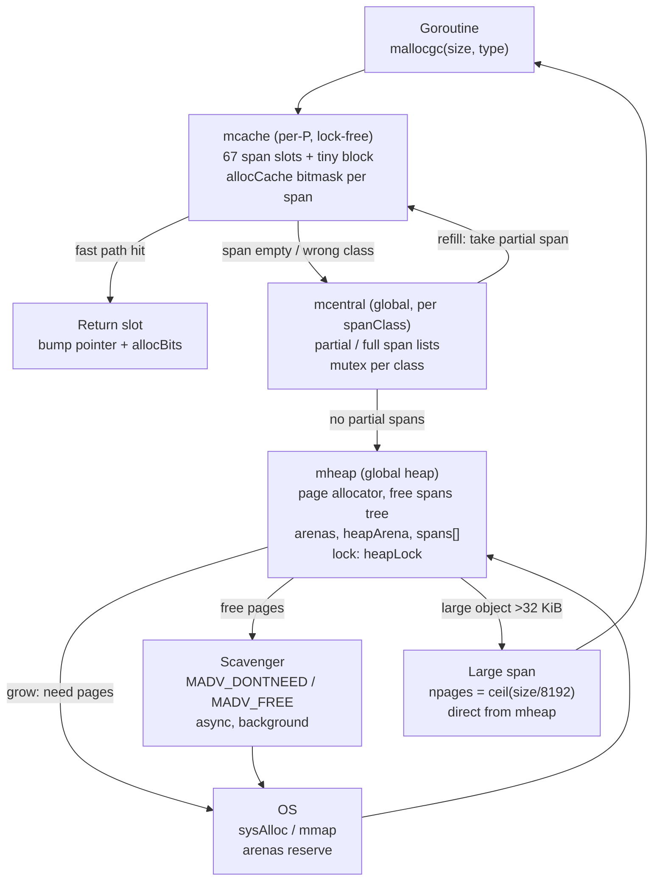
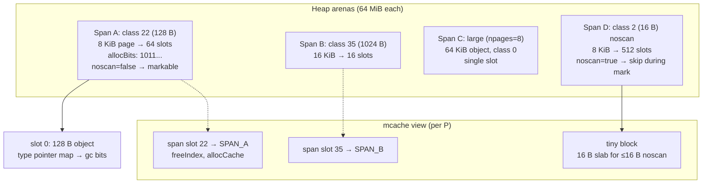
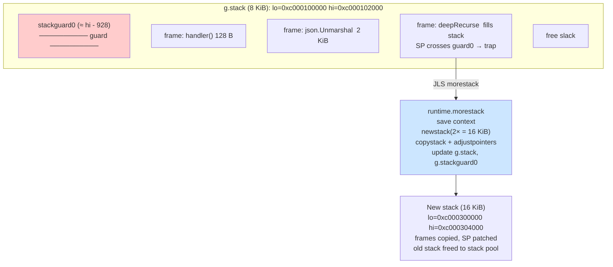
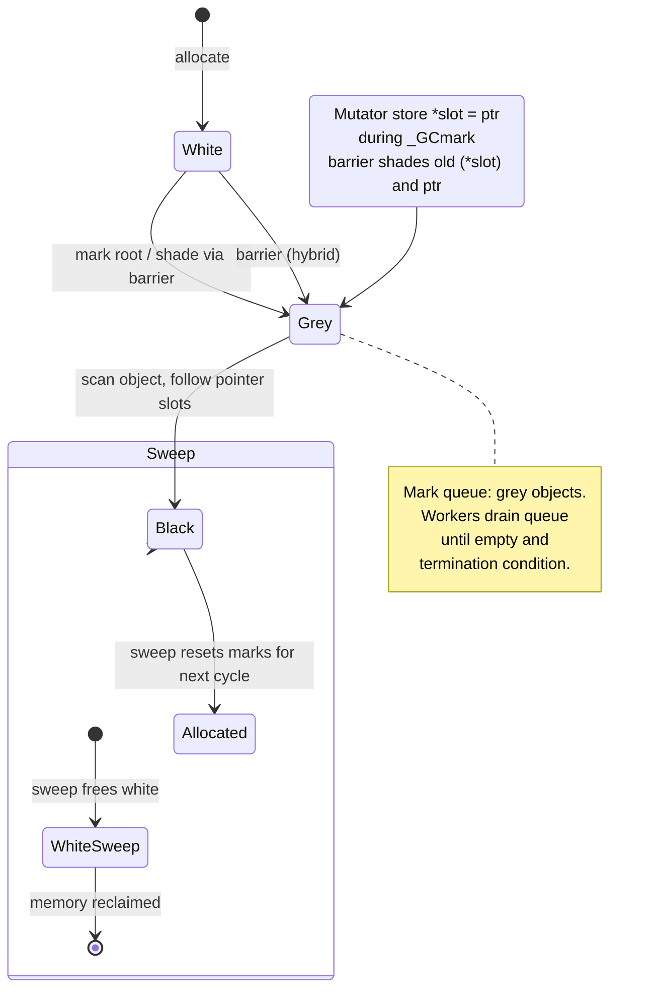
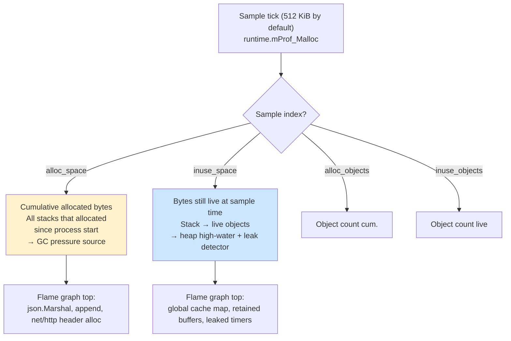

# Chapter 5 — Memory Allocator, Stacks, and the Concurrent Tri-Color GC

**What this chapter covers.** Every allocation your handler performs — `make([]byte, n)`, `&Request{}`, `append`, `json.Marshal` — funnels through `runtime.mallocgc`. Every goroutine you spawn gets a stack that grows and shrinks. Every few milliseconds to seconds, the concurrent tri-color collector sweeps through the heap while your code keeps running. How well these three subsystems cooperate determines your p50, p99, OOM-kill rate, and cost per pod. This chapter is the allocator-to-GC vertical slice: size classes and spans, the `mcache`/`mcentral`/`mheap` hierarchy, the allocation fast and slow paths, stack growth and guard pages, the tri-color invariant and hybrid write barrier, STW phases, pacing via `GOGC` and `GOMEMLIMIT`, and the observability surfaces (`GODEBUG=gctrace`, `pprof`, `runtime/metrics`) you use to tune them for production.

Learning goals — after this chapter you should be able to:

- Describe Go's 67 size classes, span layout, and span classes; explain how `mcache` (per-P), `mcentral`, and `mheap` partition allocation and when each layer is consulted.
- Trace the `mallocgc` fast path, the `mcache` refill slow path, and the large-object path; state the small-object threshold (32 KiB), tiny allocator behavior, and the `noscan` optimization.
- Explain how `mheap` grows via `sysAlloc`/`mmap`, how scavenging returns pages via `MADV_DONTNEED`/`MADV_FREE`, and how `GOMEMLIMIT` changes scavenging pressure.
- Describe goroutine stacks since Go 1.4: contiguous stacks, initial size (8 KiB on 64-bit since Go 1.22; 2 KiB before), guard pages (`stackguard0`), `morestack`/`stackCopy`, and how stack shrinking works.
- Explain tri-color mark-and-sweep, the two STW pauses, concurrent marking, and the hybrid write barrier — and why the barrier is required for correctness.
- Derive GC pacing: `GOGC`, `GOMEMLIMIT`, `next_gc` calculation, trigger ratio, and the pacer controller that sets assist ratios and background mark utilization.
- Read a `GODEBUG=gctrace=1` line field-by-field, interpret `pprof` heap profiles (`alloc_space` vs `inuse_space`), and run allocation benchmarks correctly.
- Tune GC for backend pods: pick `GOGC`/`GOMEMLIMIT` under cgroup limits, understand ballast, and reason about stack memory vs. goroutine count.

> **Placement.** Chapter 2 established object layout and type-driven size/alignment. Chapter 3 covered stack frames and the ABI that stacks carry. This chapter covers where those objects and frames live: the heap allocator, goroutine stacks, and the collector that reclaims them. Chapter 6 covers the scheduler that multiplexes goroutines onto the stacks described here; Chapter 9 covers escape analysis that decides stack vs. heap placement; Volume 13, Chapter 4 gives a cross-runtime comparison of GC strategies (JVM, V8, .NET) that contextualizes Go's choices.

---

## 1. Why the allocator and GC dominate backend SLOs

Backend Go is allocation-heavy by construction. A single `net/http` request allocates for the `*http.Request` and `ResponseWriter` wrappers, header maps, `context.Context` chains, JSON or protobuf decode buffers, database row scans into `[]byte` or `string`, and whatever the handler does internally. Multiply by thousands of requests per second per pod and the allocator and GC are the hottest shared subsystem after the scheduler.

Three costs matter, and they trade off:

| Cost | What it measures | Who pays it |
|------|-----------------|-------------|
| Allocation throughput | `mallocgc` cycles per `new`/`make`/`append` | Every goroutine; contended on `mcentral`/`mheap` |
| GC CPU overhead | Background mark workers + STW + barriers | All Ps; `GOGC` sets the budget (default ~25% of CPU during mark) |
| GC latency (STW) | Pause to stop/start the world | Tail latency; every goroutine stopped simultaneously |
| Heap high-water | Live + garbage until next sweep | Pod memory limit; OOM-killer |

Go 1.5–1.8 made GC concurrent and cut STW from hundreds of milliseconds to sub-millisecond. Go 1.12 added `GODEBUG=gctrace` scavenge stats. Go 1.19 introduced `GOMEMLIMIT` to bound heap under cgroup limits. Go 1.21 reworked the pacer. The trend is clear: throughput-optimized defaults, with knobs (`GOGC`, `GOMEMLIMIT`) to clamp memory at the cost of more CPU.

The backend lens for this chapter: you cannot tune what you cannot attribute. Every section ends with an operational question and the signal that answers it.

---

## 2. Allocator architecture: size classes, spans, and the three-level cache

### 2.1 Design goals

Go's allocator is a variant of TCMalloc (Google's Thread-Caching Malloc), adapted for a GC'd language with precise pointer maps and concurrent sweeping:

- **Low fragmentation** for long-running servers via size classes and span coalescing.
- **No per-allocation lock** on the fast path — sharded per-P caches (`mcache`).
- **GC integration** — every span knows which slots contain pointers (`allocBits`, `gcmarkBits`) so the collector can scan precisely; `noscan` spans skip scanning entirely.
- **Scavenging** — unused pages returned to the OS lazily, with hysteresis to avoid churn.

### 2.2 Size classes — 67 buckets

Any small allocation is rounded up to the next size class. Go has 67 size classes (0 is unused; 1..67 are real) ranging from 8 bytes to 32 KiB. Classes are defined in `runtime/sizeclasses.go` (generated by `make sizeclasses`) and indexed by `class_to_size` and `size_to_class` lookup tables.

```
class  size    objects per span (8 KiB pages)    waste at midpoint
  1      8 B    1024 / span                        ~12%
  2     16 B     512                               ~10%
  3     24 B     341                               ...
  ...
 22    128 B      64
 35   1024 B       8
 50   8192 B       1  (one object per span for large classes)
 67  32768 B       1  (max small object; >32 KiB is "large")
```

Rules:

- Objects `<= 32 KiB` → size-class allocation (binned). 32 KiB is `maxSmallSize`.
- Objects `> 32 KiB` → large-object allocation: one span sized to the request, page-aligned, not binned.
- **Tiny allocator**: `<= 16 bytes` and `noscan` (no pointers) may be sub-allocated inside a single 16-byte slot to coalesce 1–16 byte allocations (e.g., `struct{ x, y int8 }`, small strings, small escape temporaries). The per-P `mcache.tiny` block hands them out without consuming a full slot.
- **Zeroed vs dirty**: Spans track whether memory is already zeroed. Fresh OS pages are zeroed once; reused spans may need explicit zeroing for talkative types.

Why 67 and not 8 or 200? Diminishing returns: more classes reduce internal fragmentation but bloat `mcache` (one span per class per P) and `mcentral` metadata. 67 keeps worst-case waste near 12% while keeping per-P memory `67 × ~8 KiB ≈ 540 KiB` of held spans in steady state.

### 2.3 Spans — the unit of heap management

A **span** (`runtime/mspan.go:mspan`) is a run of one or more contiguous OS pages (8 KiB on most platforms; `pageSize = 8192`) that holds objects of one size class.

Key fields (simplified):

```go
type mspan struct {
    next, prev *mspan
    startAddr  uintptr   // base address
    npages     uintptr   // length in pages
    spanclass  spanClass // (sizeclass << 1) | noscan
    allocCount int       // live objects
    allocBits  *gcBits   // which slots are allocated
    gcmarkBits *gcBits   // marks found during GC
    sweepgen   uint32    // sweep generation
    needzero   uint8     // needszeroing
    state      mSpanState // InUse, Manual, Free
    limit      uintptr   // end of usable bytes
}
```

A **span class** encodes size class *and* whether the class needs scanning. `spanClass = (sizeclass << 1) | noscanBit`. So there are `67 × 2 = 134` logical span classes (including `noscan` variants). `noscan` spans hold objects with no pointers (e.g., `[]byte`, `[]int32` backing arrays, `string` bytes) and are skipped during marking — a significant throughput win for buffer-heavy services.

The heap tracks spans in `mheap.spans` (indexed by page number) and in `mheap.allSpans` / `mheap.sweepSpans` for GC iteration. Each page knows which span owns it via `mheap.spans[pageID]`.

#### Diagram 1 — Allocator hierarchy (mcache → mcentral → mheap → OS)



**Reading the diagram.** The fast path never leaves `mcache`. The slow path escalates one level at a time: `mcache` asks `mcentral` for a new span of the right class; `mcentral` asks `mheap` for pages; `mheap` asks the OS for arenas (64 MiB chunks on 64-bit). Returns flow the other way when sweeps free spans.

#### Diagram 2 — Span and size-class layout



### 2.4 The three layers in detail

**`mcache` (per-P, `runtime/mcache.go`).** A private allocation cache for each `P` (logical processor, `GOMAXPROCS`). No locks — safe because only the `M` bound to the `P` mutates it. Contains:

- `alloc [numSpanClasses]*mspan` — one active span per span class (~134 entries; 67 × noscan/scan).
- `tiny`, `tinyoffset` — the tiny sub-allocator within a single slot.
- `localScan`, `localLargeFree` etc. — GC assist bookkeeping.

The fast path is a bitmask bump inside the cached span: load `allocCache` (a 64-bit mirror of `allocBits`), find the next free bit (trailing zeros via `sys.TrailingZeros64`), set the bit, bump `freeIndex`. Single-digit nanoseconds when cached.

**`mcentral` (per span class, `runtime/mcentral.go`).** A global free-list per span class, protected by a `mutex`. Holds `partial` and `full` span sets. When an `mcache` span fills, it is returned to `mcentral.partial` (still has free slots) or `full` (no free slots but not swept). On refill, `mcentral` hands a `partial` span back to the `mcache`. Contention on `mcentral.lock` is visible in `SCHED` traces and `mutex` profiles when many Ps churn the same size class (common with per-request `[]byte` of similar size).

**`mheap` (`runtime/mheap.go`).** The page allocator. Manages arenas, a free-span treap (`heap Treap` keyed by span size), `allArenas`, and `spans[]` mapping pages→spans. Owns scavenging policy and `heapLock`. Large allocations bypass `mcache`/`mcentral` entirely and come here.

---

## 3. Allocation paths: fast, slow, large, and tiny

### 3.1 `mallocgc` — the single entry point

Every Go heap allocation goes through `runtime.mallocgc(size, typ, needZero)`, where `typ` is the `_type` carrying `gcdata` (pointer bitmap) and `kind` flags (noscan). Compiler-inserted calls to `mallocgc` are visible as `runtime.newobject` (for `new`/`&T`), `runtime.makeslice`, `runtime.makechan`, `runtime.makemap`, and `runtime.mallocgc` itself for escapes.

Simplified control flow:

```go
func mallocgc(size uintptr, typ *_type, needZero bool) unsafe.Pointer {
    if size == 0 {
        return unsafe.Pointer(&zeroVal[0]) // zero base
    }
    if gcphase == _GCmarktermination {
        throw("malloc during mark termination")
    }
    // assist handling omitted — see §8

    mp := acquirem()          // pin M, get P
    c := mp.mcache
    noscan := typ == nil || typ.PtrBytes == 0

    if size <= maxSmallSize { // 32 KiB
        if noscan && size < maxTinySize { // 16 B
            // tiny path: sub-allocate inside c.tiny block
        }
        // size class lookup
        class := sizeToClass(size)
        spc := makeSpanClass(class, noscan)
        s := c.alloc[spc]
        if s == nil || s.freeIndex == s.nelems {
            s = refill(c, spc) // → mcentral → mheap → OS
        }
        v := nextFreeFast(s)   // bump allocCache bit
        if needZero && s.needzero != 0 { memclr(v, size) }
        return v
    }
    // large path: pages = ceil(size / pageSize)
    s := largeAlloc(size, noscan)
    if needZero && s.needzero != 0 { memclr(s.base(), size) }
    return s.base()
}
```

### 3.2 Fast path vs. slow path

| Path | Condition | Cost | What happens |
|------|-----------|------|--------------|
| Tiny | `noscan && size < 16` | ~5 ns | Pack into `c.tiny`, bump `tinyoffset`; new tiny block from size class 2 when full |
| Fast | `c.alloc[spc].freeIndex < nelems` | ~10–20 ns | Bit-twiddle `allocCache`, update `allocBits`, zero if needed |
| Refill | span exhausted | ~200–1000 ns + lock | `mCache_Refill` → `mcentral.cacheSpan` (locks `mcentral`) → maybe `mheap.allocSpan` / `grow` |
| Large | `size > 32 KiB` | ~µs + `mmap` if growing | `mheap.allocSpan` with `npages = ceil(size/8192)`, page-aligned, zeroed |

**Zeroing subtlety.** The compiler sets `needZero` per-site. Types with pointer-free tails may leave some bytes unzeroed; the allocator may also know pages are already zeroed (`s.needzero == 0` after `sysAlloc` or after scavenging with `MADV_DONTNEED` which guarantees zero-fill on next touch). Avoiding redundant `memclr` saves measurable CPU on allocation-heavy workloads.

**`noscan` fast path is cheaper for the GC.** A span whose objects contain no pointers never enters the mark work queue. For a service whose heap is 40% `[]byte` slabs (HTTP bodies, protobuf wire buffers, `io.Copy` buffers), half the heap may be `noscan` and thus free to skip.

### 3.3 Large objects

Large objects get their own span with `npages = (size + 8191) / 8192`, aligned to page boundaries. There is no size class binning, so fragmentation is limited to page rounding. Large spans live in `mheap`'s large-span structures and are tracked in `mheap.large` and the treap. Allocating and freeing large objects is more expensive — it takes `heapLock` and may trigger `sysAlloc`/`sysMap`.

Backend implication: chunking >32 KiB buffers (e.g., 64 KiB `bufio.Reader` buffers per connection) into pooled 32 KiB slabs often outperforms 64 KiB direct allocations because it keeps the per-P fast path.

### 3.4 Scavenging and returning memory to the OS

Unused pages are not returned eagerly. The **scavenger** (`runtime/mheap.go:mheap.scavenge` + `runtime/mgcsweep.go:scavenger`) runs concurrently and releases spans/pages that have been free for a while.

Mechanism:

- Free spans are on `mheap.free` (treap) and `mheap.sweepSpans`.
- The scavenger walks free spans, releases their pages via OS advice: `MADV_DONTNEED` (Linux — next access faults zeroed pages) or `MADV_FREE` (Linux 4.5+, lazy reclaim; pages stay mapped until pressure).
- Go selects the strategy at init: `MADV_FREE` preferred when available; fallback to `MADV_DONTNEED`. Controlled by `GODEBUG=madvdontneed=1` to force `DONTNEED` (useful for RSS accounting under cgroups).
- `GOMEMLIMIT` tightens scavenging aggressiveness: when heap is near the limit, the scavenger is more eager; background scavenging may release pages sooner than the default ~5-minute decay.
- Metrics: `memory/classes/total:bytes` vs `memory/classes/heap/released:bytes` (from `runtime/metrics`), and `GODEBUG=gctrace=1` scavenge lines `scvgN: inuse/out/idle/out sys: N`.

**Common confusion:** `inuse` in `gctrace` is heap pages owned by spans with live objects; `idle` is free pages in the heap that have not been scavenged; `sys` is bytes obtained from the OS; `released` is bytes returned via `MADV`. RSS ≈ `sys - released` (plus stacks, globals). Under containers, `released` pages still count toward cgroup `memory.current` until reclaimed if `MADV_FREE` is in use — this surprises operators. Use `MADV_DONTNEED` (`GODEBUG=madvdontneed=1`) or `GOMEMLIMIT` to force prompt RSS drop.

---

## 4. Goroutine stacks: contiguous growth, guard pages, and copying

### 4.1 Why stacks matter to the allocator

Each goroutine has its own stack. A service with 50k concurrent goroutines (fan-out RPCs, per-connection readers, retry loops) holds ~50k stacks plus per-goroutine `g` structs and `defer` chains. At 8 KiB initial stacks that is ~400 MiB just for stacks, plus growth for deep call chains (JSON decoding, recursive middleware). Stack management is inseparable from allocation strategy.

### 4.2 From segmented to contiguous (Go 1.4+)

Before Go 1.4, stacks were **segmented** (linked stack segments with `stackguard` hot-splits). This caused "hot split" pathological overhead for functions that straddled the guard. Since Go 1.4, stacks are **contiguous**: each goroutine's stack is a single contiguous allocation that grows by copying.

Sizes (64-bit, current as of Go 1.21–1.23):

| Quantity | Value |
|----------|-------|
| Initial stack (`_StackMin`) | 8 KiB (was 8 KiB on 64-bit since Go 1.22; 2 KiB on 32-bit; historically 4 KiB/8 KiB depending on arch) |
| Minimum stack | 2 KiB (32-bit) / 8 KiB (64-bit) |
| Stack guard (`stackGuardMultiplier`) | ~928 bytes reserved |
| Growth | Doubles on overflow, copies old frames, adjusts pointers in stack |

Stacks are allocated from a dedicated stack span pool (`mheap` stack spans) or via `sysAlloc` for large stacks; they are `noscan` only in the sense that the collector scans them as roots conservatively at boundaries but precisely for tracked frames (via stack maps).

### 4.3 Guard pages and `morestack`

Every goroutine's `g.stack` has:

```go
g.stack      stack{lo, hi}   // bounds [lo, hi)
g.stackguard0 uintptr        // this address + guard triggers morestack
g.stackguard1 uintptr        // for signal stacks / preemption
```

The compiler inserts a **stack-overflow check** at each function prologue (on `amd64`, a compare of `SP` against `g.stackguard0`):

```asm
; prologue for a non-leaf function that needs 48 bytes of frame
    CMPQ SP, g.stackguard0(GS)
    JLS  morestack
```

If `SP` has crossed the guard, execution jumps to `runtime.morestack` (implemented in assembly), which:

1. Saves the caller context.
2. Calls `runtime.newstack` → `stackalloc` a larger stack (typically 2×, with max bounded by `maxStackSize`, ~1 GiB on 64-bit).
3. Calls `runtime.copystack` to memcpy frames from old to new stack, then adjusts every pointer into the stack (saved `SP`/`BP`, `sudog` links, `defer` chain via `adjustpointers`).
4. Updates `g.stack`, `g.stackguard0`, patches `SP`, and resumes at the caller.

**Shrinking.** When a goroutine blocks and its stack is largely empty (usage < 1/4 of capacity), `runtime.shrinkstack` may copy it down to a smaller allocation. This happens at GC safe points and is rate-limited to avoid ping-pong.

#### Diagram 3 — Stack growth and guards



### 4.4 Tuning stacks for backend scale

| Pattern | Stack pressure | Mitigation |
|---------|---------------|------------|
| 50k idle conns each 8 KiB stack | ~400 MiB RSS just for stacks | Reduce idle stack via pooling or lower concurrency; consider `GODEBUG=gcpacertrace` to confirm; do not lower `_StackMin` (tunable only by rebuilding) |
| Deep recursion or large frame funcs (big value receivers, `[4096]byte` locals) | Repeated `morestack` copies (µs each), fragmentation | Pass large values by pointer; move big arrays to heap; keep frames < 1–2 KiB |
| Bursty fan-out (`for _, id := range 10k { go fetch(id) }`) | 10k × 8 KiB + heap burst at GC trigger | Semaphore / worker pool; batch; bound `GOMAXPROCS`-relative |
| Stack-allocated buffers promoted by escape | Heap pressure anyway | Check `go build -gcflags=-m` to keep buffers stack-allocated where intended |

The backend lesson: goroutines are cheap but not free. 10k goroutines at ~4 KiB average stack (after shrinking) still consume ~40 MiB that never shows up in `pprof heap` (stacks are not heap). Track via `runtime/metrics` keys `memory/classes/total:bytes` minus `heap/objects:bytes`, or `GODEBUG=gctrace=1` stack line `next_gc ... stack: N`.

---

## 5. Tri-color mark-and-sweep: the core algorithm

### 5.1 Invariant

Every object is one of three colors:

| Color | Meaning |
|-------|---------|
| **White** | Candidate for collection. Unreached at start of cycle; if still white at end, it is garbage. |
| **Grey** | Reached but not yet scanned. On the mark work queue; its pointer slots still need scanning. |
| **Black** | Reached and fully scanned. All pointer slots followed; no white object is reachable *only* from here. |

Invariant maintained by the collector: **no black object may point to a white object**. If it did, that white object would be reachable but the collector would never scan the black object again and would collect live memory. The **write barrier** enforces this invariant while the mutator runs concurrently with the marker.

### 5.2 Two views of the barrier

Historically Go tried:

- **Dijkstra insertion barrier** (Go 1.5–1.7): on `*slot = ptr`, shade `ptr` grey if white. Guarantees any newly installed pointer is marked. But it allowed a black→white store to keep the white object alive only if the pointer was also elsewhere; subtle liveness issues around stack slots.
- **Yuasa deletion barrier** (Go 1.8 experiment): on `*slot = ptr`, shade the *old* value `*slot` grey before overwriting. Guarantees no pointer is lost by deletion.

Since Go 1.8+ Go uses a **hybrid barrier** — insertion + deletion:

```go
// runtime.wbBufFlush / writeBarrier — pseudo
func writeBarrier(slot *unsafe.Pointer, ptr unsafe.Pointer) {
    if gcphase == _GCmark {
        // deletion component: shade the overwritten pointer
        if old := *slot; old != nil { shade(old) }
        // insertion component: shade the new pointer
        if ptr != nil { shade(ptr) }
    }
    *slot = ptr
}
```

Effect: any pointer stored into the heap during marking is shaded, and any pointer removed from the heap is also shaded. This permits **concurrent marking of the heap while stacks are scanned without barriers** (stacks are rescanned at STW mark termination to catch missed edges — §5.3). Hybrid barrier cost is ~1–3% of mutator CPU during mark (a few nanoseconds per heap pointer store; no barrier for `noscan` stores).

Barrier elision: stores to `noscan` objects, stack slots during concurrent mark, and `typ.PtrBytes == 0` stores skip the barrier — identified via `writeBarrier` need checks in the compiler's SSA pass.

#### Diagram 4 — Tri-color phases and the hybrid barrier



---

## 6. GC phases: the cycle from trigger to sweep

A Go GC cycle has four externally visible phases. Two include short stop-the-world (STW) pauses; marking itself is concurrent.

| Phase | STW? | What happens |
|-------|------|--------------|
| **Sweep termination** | **STW** | Stop the world; ensure previous sweep done; reset `sweepgen`, start new GC cycle, enable write barrier, enqueue roots. |
| **Concurrent mark** | concurrent | Background mark workers + mutator assists scan heap; barrier on; stacks scanned without per-store barrier but rescanned at termination. |
| **Mark termination** | **STW** | Stop the world; drain remaining mark work, rescan stacks conservatively, flush `wbBuf`, set next GC trigger, disable barrier (or keep until sweep done). |
| **Concurrent sweep** | concurrent | Sweep spans: free white objects, reset `gcmarkBits`, coalesce free spans, wake scavenger. No STW. |

Target pause times: each STW phase typically **50–500 µs** on a well-tuned service (can exceed 1 ms under large heaps or high allocation rates). Concurrent mark is paced to finish before heap doubling (see §7).

Lifecycle as seen by the runtime's `gcController` and `trace` view:

```
     STW sweepTerm          concurrent mark (barrier on)              STW markTerm     concurrent sweep
    ┌──────────┐          ┌──────────────────────────┐              ┌──────────┐    ┌──────────────────┐
────┤ scan roots├──────────┤ mark workers + assists  ├──────────────┤ rescan   ├────┤ sweep spans      │
    │ enable wb│ barrier  │ per-P wbBuf, grey queue │ barrier      │ stacks   │    │ return pages     │
    └──────────┘          └──────────────────────────┘              └──────────┘    └──────────────────┘
    ↑ trigger reached (heap > next_gc or GOGC pacer or GOMEMLIMIT)
```

Observable in `GODEBUG=gctrace=1` as the `STW` split per cycle (see §8).

### 6.1 Mark workers and assists

- **Dedicated workers**: `GOMAXPROCS/4` (capped) background goroutines at mark-utilization that run when GC is active; preemptible.
- **Idle workers**: Ps that go idle steal mark work rather than sleeping.
- **Mutator assists**: when a goroutine allocates during mark and the pacer thinks marking is behind, the allocating goroutine must assist (scan some heap itself) proportional to its allocation (`gcAssistAlloc`). This **back-pressures** allocation by GC work and is the primary pacing throttle. Visible as `gcAssistAlloc` stalls in execution traces and as a `GODEBUG=gctrace` ratio "assist time".
- Fraction: controller targets ~25% of total CPU for marking during the mark phase (tunable via `GOGC` indirectly through heap goal; there is no direct flag for mark CPU).

### 6.2 Sweep

Sweep is fully concurrent since Go 1.7. Each span's `sweepgen` tracks whether it was swept in the current cycle. Any allocation that touches an unswept span sweeps it first (`mcache` / `mcentral` path checks `sweepgen`). Dedicated sweep goroutine plus lazy per-allocation sweep ensure no STW sweep pause. Cost is proportional to heap size, spread over the concurrent sweep window.

---

## 7. Pacing: when GC runs and how much it does

Pacing answers: *when to start marking, and how fast to mark*. Go 1.18–1.21 replaced the classic `GOGC`-only trigger with a unified controller that also respects `GOMEMLIMIT`.

### 7.1 `GOGC` — the growth ratio

`GOGC` (default 100) sets the ratio of new garbage to live heap between collections:

```
goal = liveHeap_prevCycle × (1 + GOGC/100)
next_gc = goal   (often noted as heapGoal)
```

With `GOGC=100`, the heap is allowed to double between GCs (live ×2). `GOGC=200` → triple; `GOGC=50` → 1.5×. Larger `GOGC` means less frequent GC, less GC CPU, higher high-water memory. `GOGC=off` disables GC (only sweep of previously freed objects; not recommended except for short-lived batch jobs with explicit `runtime.GC()` or `debug.FreeOSMemory`).

Pacer state: `gcController.heapLive`, `heapGoal`, `heapMarked` (live after last mark), `trigger` ratio, `gcPercent` (`GOGC`).

### 7.2 `GOMEMLIMIT` — the hard-ish ceiling

`GOMEMLIMIT` (since Go 1.19) is a soft memory limit in bytes (e.g., `GOMEMLIMIT=1GiB` or via `debug.SetMemoryLimit`). The pacer computes a second goal:

```
heapGoal = min( GOGC-derived goal, GOMEMLIMIT - headroom )
```

`headroom` accounts for stacks, globals, and non-heap reservations plus scavenger hysteresis. When `GOMEMLIMIT` binds tighter than `GOGC`, GC runs more frequently to stay under the limit, trading CPU for memory. If allocations push heap beyond the limit faster than GC can reclaim, the runtime may throttle assists more aggressively and scavenge more eagerly — but it will not OOM itself; cgroup OOM still kills the process if RSS exceeds the container limit. `GOMEMLIMIT` is your defense before that.

### 7.3 `next_gc` and trigger calculation

Per cycle (in `gcController.startCycle` / pacer):

```
live = heapMarked (surviving bytes from mark termination)
goal_GOGC = live × (1 + GOGC/100)
goal_limit = GOMEMLIMIT - headroom          // if GOMEMLIMIT set, else +∞
heapGoal = min(goal_GOGC, goal_limit)       // bytes at which cycle should END
heapTrigger = heapGoal × triggerRatio       // bytes at which cycle should START
nextGC = heapTrigger                        // the familiar GODEBUG field
```

`triggerRatio` (~0.6–0.87 depending on heap size and `GOGC`) ensures marking starts early enough to finish before `heapGoal`. The pacer continuously revises assist ratio: if `heapLive` approaches `heapGoal` but marking is behind, each allocating goroutine's assist debt grows and allocation slows — backpressure you can see as increased allocation latency during mark.

#### Diagram 5 — GC cycle pacing timeline

```mermaid
gantt
    title Heap bytes over two GC cycles (GOGC=100, with GOMEMLIMIT bound)
    dateFormat  X
    axisFormat %L
    section Heap
    Mutator allocs (heap grows)       :a1, 0, 60
    Concurrent mark (barrier on)      :a2, 60, 35
    Sweep + scavenger (heap drops)    :a3, 95, 25
    Mutator allocs (next cycle)       :a4, 120, 60
    Concurrent mark (2nd cycle)       :a5, 180, 35

    section Thresholds
    live (post-mark)                  :crit, l1, 0, 1
    next_gc trigger                   :milestone, m1, 60, 0
    heapGoal (end of mark)            :milestone, m2, 95, 0
    GOMEMLIMIT                        :crit, g1, 130, 1
```



Reading it: heap grows via mutator; when it hits `next_gc` (≈ trigger), concurrent mark starts; heap keeps growing while marking; mark termination happens before `heapGoal`; sweep reclaims white objects so heap drops toward `live`. If `GOMEMLIMIT` sits below the `GOGC` goal, the `next_gc` line shifts left and cycles compress.

---

## 8. Observability: gctrace, pprof heap, and runtime/metrics

### 8.1 `GODEBUG=gctrace=1` — one line per cycle

Enable with `GODEBUG=gctrace=1 ./app` or `GODEBUG=gctrace=1,gcpacertrace=1` for pacer detail. Since Go 1.21 the format is:

```
gc 42 @12.345s 7%: 0.12+0.80+0.08 ms clock, 0.97+0.40+0+0.64 ms cpu, 64->65->33 MB, 66 MB goal, 0 MB stacks, 12 MB globals, 512 P
                                                        ^^^^^^^^^ heapLive timeline
```

Field-by-field (stable since Go 1.18):

| Field | Meaning |
|-------|---------|
| `gc 42` | GC number (1-indexed; 1 is first after init) |
| `@12.345s` | Time since process start |
| `7%` | Fraction of CPU spent in GC since start (or since last line; monotonic) |
| `0.12+0.80+0.08 ms clock` | Wall-clock: STW sweepTerm + concurrent mark wall + STW markTerm. Sum ≈ total pause visible to workload. |
| `0.97+0.40+0+0.64 ms cpu` | CPU-time: sweepTerm + assist + background mark + markTerm idle+dedicated |
| `64->65->33 MB` | `heapLive` before mark `->` after mark (live+garbage+stack) `->` live after sweep (live heap). Retained ≈ live. |
| `66 MB goal` | `heapGoal` for this cycle (from pacer; `min(GOGC goal, GOMEMLIMIT-headroom)`) |
| `0 MB stacks, 12 MB globals` | Non-heap roots scanned |
| `512 P` | `GOMAXPROCS` |

Older Go versions include `forced` (triggered by `runtime.GC()` or `debug.FreeOSMemory`) and scav lines:

```
scvg0: inuse: 38, idle: 12, sys: 50, released: 8, consumed: 42 (MB)
```

Meanings: `inuse` = owned live spans, `idle` = free but unscavenged, `sys` = obtained from OS, `released` = returned, `consumed` = `sys - released` (≈ RSS). Per `gctrace` line, these appear every few GCs or on scavenger activity.

Real examples to learn from:

```text
# Healthy service, GOGC=100, GOMEMLIMIT=2GiB, low allocation rate
gc 18 @42.103s 3%: 0.08+1.20+0.05 ms clock, 0.64+0.30+0.10+0.40 ms cpu, 180->195->120 MB, 240 MB goal, 2 P
# → sweepTerm 80 µs, markTerm 50 µs (good), live 120 MB, goal 240 MB (GOGC-bound)

# Memory pressure: GOMEMLIMIT binds before GOGC
gc 42 @88.001s 18%: 0.11+6.40+0.07 ms clock, 0.88+4.10+1.20+0.56 ms cpu, 980->1020->760 MB, 1050 MB goal, 8 P
# → assist CPU elevated (4.10 ms), goal hugging live+headroom, frequent cycles

# Forced GC (e.g., ballast trick or manual runtime.GC())
gc 7 @5.002s 4%: 0.09+0.90+0.06 ms clock, 0.72+0.20+0.15+0.48 ms cpu, 1024->1025->1024 MB, forced, 1026 MB goal, 4 P
# → "forced" tag, heap barely drops — ballast alive

# High allocation rate, assists kicking in
gc 9 @10.4s 12%: 0.15+2.8+0.09 ms clock, 1.2+2.5+0.0+0.72 ms cpu, 220->280->140 MB, 280 MB goal, 4 P
# → assist 2.5 ms > background 0.0 — mutators doing GC work, allocation backpressure present
```

**Tuning with `gctrace`:**

- STW sum > 1 ms consistently → heap too large or many pointers (mark has more edges to follow); profile with `pprof --alloc_objects` to find pointer-heavy allocations.
- `assist` CPU large vs. dedicated → pacer thinks mutators are allocating faster than workers can mark; raise `GOGC` (more headroom) or reduce allocation rate (pooling, fewer per-request allocs), or raise `GOMAXPROCS` if under-scheduled.
- `goal` close to `GOMEMLIMIT` headroom → `GOMEMLIMIT` is the trigger; raise it if you have cgroup headroom, or reduce live set (cache sizes, ballast).
- `released` stays 0 while `idle` grows → `MADV_FREE` not reclaiming; set `GODEBUG=madvdontneed=1` if cgroup RSS matters.

### 8.2 `pprof` heap profiles

Collect with:

```bash
go tool pprof -http=:8081 http://localhost:8080/debug/pprof/heap   # inuse_space (live)
go tool pprof -http=:8081 http://localhost:8080/debug/pprof/heap?gc=1
curl -s http://localhost:8080/debug/pprof/heap > heap.pb.gz && go tool pprof heap.pb.gz

# alloc_space vs inuse_space
go tool pprof -sample_index=alloc_space heap.pb.gz   # all allocations since start (pressure)
go tool pprof -sample_index=inuse_space heap.pb.gz   # live at sample time (leak / retained)
go tool pprof -sample_index=alloc_objects heap.pb.gz # object count
```

Four sample indices exist: `alloc_space`, `alloc_objects`, `inuse_space`, `inuse_objects`. For GC tuning, `inuse_space` tells you what survives GC (sets `live`); `alloc_space` tells you where allocation volume comes from (drives GC frequency). Optimize `alloc_space` hot spots to reduce GC CPU; optimize `inuse_space` hot spots to reduce peak heap.

#### Diagram 6 — Heap profile anatomy



Example `pprof` excerpt (trimmed; `top` on `alloc_space` for an HTTP service):

```text
(pprof) top 10 --cum --sample_index=alloc_space
      flat  flat%   sum%        cum   cum%
  4200 MB 18.2% 18.2%     5200 MB 22.5%  encoding/json.Marshal
  3100 MB 13.4% 31.6%     4800 MB 20.8%  net/http.(*conn).serve / ReadRequest
  1800 MB  7.8% 39.4%     2600 MB 11.2%  github.com/.../handler.ingest.func1
   900 MB  3.9% 43.3%     1200 MB  5.2%  bytes.growSlice
(pprof) top 10 --sample_index=inuse_space
      flat  flat%   cum
   180 MB 32%   180 MB  cache.(*LRU).Add / map bucket overflow
    85 MB 15%    85 MB  bufio.NewReaderSize (pooled but retained)
    40 MB  7%    40 MB  net/http.persistConn
```

Operational pattern: if `alloc_space` top is `json.Marshal`/`Unmarshal`, move to `json.RawMessage` or `easyjson`/`ffjson` or pooled `sync.Pool` encoders. If `inuse_space` top is your cache, bound it explicitly (`GOMEMLIMIT` does not bound caches for you — it just triggers GC more often while the cache stays live).

### 8.3 `runtime/metrics` and `runtime.ReadMemStats`

Prefer `runtime/metrics` (Go 1.16+) over the legacy `runtime.ReadMemStats` for scraping; the latter STWs briefly to read stats.

```go
import "runtime/metrics"

func logMemMetrics() {
    descs := metrics.All()
    samples := make([]metrics.Sample, len(descs))
    for i := range samples { samples[i].Name = descs[i].Name }
    metrics.Read(samples)
    for _, s := range samples {
        if s.Value.Kind() == metrics.KindUint64 {
            // example: /memory/classes/heap/objects:bytes, /gc/heap/live:bytes
            // /gc/cycles/total:gc-cycles, /gc/pause:seconds distribution
        }
    }
}
```

Key metric names:

| Metric | What it is |
|--------|-----------|
| `/gc/heap/live:bytes` | Live heap after last GC |
| `/gc/heap/goal:bytes` | Pacer goal for next cycle |
| `/memory/classes/heap/objects:bytes` | In-use heap objects |
| `/memory/classes/heap/released:bytes` | Returned to OS |
| `/gc/cycles/total:gc-cycles` | Count |
| `/gc/pause:seconds` | Distribution of STW pauses |
| `/gc/gogc:percent` / `/gc/gomemlimit:bytes` | Current limits |
| `/sched/gomaxprocs:threads` | P value |

Scrape these via your metrics endpoint (wrap in `/debug/vars` or expose via OpenTelemetry/Prometheus bridge) and alert on `/gc/pause:seconds` p99 and on `/memory/classes/heap/released:bytes` staying flat while `idle` grows.

### 8.4 Execution trace view

```bash
go test -trace=trace.out ./...
go tool trace trace.out
# In the trace viewer: GC events show STW spans, per-P mark workers, assist blocks.
```

Look for long `GC Mark Termination` STW boxes and dense `GC Assist` blocks on mutator goroutines — they confirm pacer backpressure rather than mere throughput cost.

---

## 9. Allocation benchmarks — measuring correctly

`testing.B` benchmarks that measure GC-tainted work must control for GC and `b.N` planning.

```go
func BenchmarkAlloc_Small(b *testing.B) {
    b.ReportAllocs()
    var sink *Request
    for i := 0; i < b.N; i++ {
        r := &Request{ID: i, Body: make([]byte, 128)} // escapes; mallocgc path
        sink = r
    }
    runtime.KeepAlive(sink)
}

func BenchmarkAlloc_WithPool(b *testing.B) {
    var pool = sync.Pool{New: func() any { return &Request{} }}
    b.ReportAllocs()
    b.ResetTimer()
    for i := 0; i < b.N; i++ {
        r := pool.Get().(*Request)
        r.ID = i
        // reuse Body slice with cap check instead of make
        if cap(r.Body) < 128 { r.Body = make([]byte, 128) } else { r.Body = r.Body[:128] }
        pool.Put(r)
    }
}

// Controlling GC between iterations for latency microbenchmarks:
func BenchmarkHandler_NoGCNoise(b *testing.B) {
    b.ReportAllocs()
    // Option 1: ballast to dampen GC during bench (see §10.2)
    // Option 2: explicit GC before timer
    runtime.GC()
    b.ResetTimer()
    for i := 0; i < b.N; i++ {
        handleRequest(payload) // measure with GC pacer stable
    }
}
```

Typical results (amd64, Go 1.22, `GOMAXPROCS=8`):

```text
BenchmarkAlloc_Small-8        8200000    142 ns/op    48 B/op    1 allocs/op
BenchmarkAlloc_WithPool-8    26000000     46 ns/op     0 B/op    0 allocs/op
BenchmarkHandler_NoGCNoise-8    500000   2800 ns/op   312 B/op    4 allocs/op
```

Pitfalls:

- Never compare `ns/op` across benchmarks with different `GOGC`/`GOMEMLIMIT` — the pacer changes throughput.
- `b.ReportAllocs()` counts heap allocations (post-escape); stack allocations are invisible — cross-check with `go build -gcflags=-m` and `go test -bench=. -benchmem`.
- Microbenchmarks that `make([]byte, 1<<20)` on each iter will be dominated by `sysAlloc`/`MADV` — use `b.SetBytes` and report throughput, not just latency.
- For GC overhead measurement, run the service under realistic RPS and scrape `/gc/pause:seconds` rather than inferring from `ns/op` alone.

---

## 10. Backend lens: tuning GOGC, GOMEMLIMIT, and the pod budget

### 10.1 The pod equation

A Go pod's memory budget splits as:

```
cgroup limit  = heap live + heap garbage (until next GC) + stacks (~P × avg + goroutines × avg)
                + globals + heap idle (unscavenged) + OS overhead
```

You control two knobs:

| Knob | Default | Effect of raising | Effect of lowering |
|------|---------|-------------------|--------------------|
| `GOGC` | 100 | Less frequent GC, more GC throughput headroom, higher high-water, lower GC CPU | More frequent GC, lower high-water, higher GC CPU, more STW events (still short) |
| `GOMEMLIMIT` | off (MaxInt64) | Allows heap to grow; `GOGC` governs pacing | Caps heap; GC runs earlier/often, CPU ↑, `assist` ↑, OOM risk ↓ |

Rules of thumb for Kubernetes:

1. **Always set a memory limit on the container** (`resources.limits.memory`) and set `GOMEMLIMIT` to **~75–85% of that limit** to leave headroom for stacks/globals/scavenge lag. Example: `limit: 2Gi` → `GOMEMLIMIT=1500MiB`.
2. **`GOMEMLIMIT` wins under pressure.** If you set both, `GOMEMLIMIT` will dominate when heap is large; `GOGC` dominates when heap is small. Set `GOGC` to reflect CPU budget (100 for balanced, 200 for CPU-constrained batch, 50 for memory-constrained fan-out).
3. **Measure before tuning.** Collect `gctrace` for a representative load window and note `goal` vs `GOMEMLIMIT-headroom`, `assist` share, and STW p99. Change one knob at a time.
4. **Horizontal scale beats heroic tuning.** If GC CPU is >15–20% and you are at `GOGC=50` chasing memory, add replicas or shard the workload.

Example deployment snippet:

```yaml
env:
  - name: GOMEMLIMIT
    value: "1500MiB"        # 75% of 2Gi limit
  - name: GOGC
    value: "100"
  - name: GODEBUG
    value: "gctrace=1"      # sample in staging; off in prod or sampled
resources:
  limits: { memory: "2Gi", cpu: "2" }
  requests: { memory: "1Gi", cpu: "1" }
```

**Latency vs throughput tradeoff table:**

| Profile | `GOGC` | `GOMEMLIMIT` | GC CPU | Heap high-water | Best for |
|---------|--------|--------------|--------|-----------------|----------|
| Default (balanced) | 100 | 75–85% of cgroup | ~10–15% | 2× live | General services |
| Low-latency (SPiky, p99-sensitive) | 50–75 | tight (70%) | ~15–25% | 1.5× live | API edge, fan-out |
| Throughput (batch, CPU-bound) | 200–400 | loose or off | ~5–8% | 3–5× live | Workers, ETL, batch jobs |
| Memory-constrained | 50 | 60–70% of cgroup | ~20–30% | 1.5× live | Sidecars, dense packing |

### 10.2 The ballast trick and when to retire it

The **ballast** is a large live allocation created at init that artificially inflates `live` so the `GOGC`-derived `heapGoal = live × (1+GOGC/100)` is larger, reducing GC frequency:

```go
var ballast = make([]byte, 1<<30) // 1 GiB ballast
func init() { runtime.KeepAlive(ballast) }
```

- Before `GOMEMLIMIT`, ballast was the only way to raise the heap goal without raising `GOGC` to absurd values.
- With `GOMEMLIMIT`, ballast is largely obsolete — prefer `GOMEMLIMIT` plus a moderate `GOGC`. Ballast still has niche use when you want to **pin** a heap reservation that survives GC (e.g., to keep `next_gc` stable across rolling deploys), but it wastes RSS and confuses `pprof inuse_space` readers.
- If you inherit a service with ballast, replace it with:

```go
debug.SetMemoryLimit(1500 << 20) // programmatic GOMEMLIMIT
debug.SetGCPercent(100)
```

### 10.3 Goroutine count, stack size, and `GOMAXPROCS`

Goroutine count interacts with GC pacing because each goroutine contributes:

- Stack memory (not counted in `heapLive` but in `memory/classes/total:bytes` and cgroup RSS).
- Scan work at mark termination (stack rescan STW grows linearly with goroutine count).
- Allocation rate if each goroutine allocates (higher `assist` pressure).

Guidance:

- **Bound concurrency.** 100k goroutines ×8 KiB = 800 MiB stacks; mark termination scans 100k stacks. Use semaphores, worker pools, or `errgroup.WithContext` with a limit.
- **Shrink stacks where you can.** Deep call chains do not need to be deep goroutines — an iterative refactor or moving large frames to heap (via explicit `new([4096]byte)`) reduces stack growth copies.
- **`GOMAXPROCS` sets P count** and thus `mcache` sharding and mark worker count. On Kubernetes, Go auto-detects `GOMAXPROCS` from cgroup CPU quota since Go 1.19 (via `GOMAXPROCS`/`automaxprocs`); verify with `runtime.GOMAXPROCS(0)`. Over-provisioned `GOMAXPROCS` inflates `mcache` memory (134 spans × P) and mark parallelism you cannot use; under-provisioned starves mark workers.

### 10.4 Scavenging knobs for container RSS

If your HPA or alerting keys on container RSS (as most do), `MADV_FREE`'s lazy reclaim will over-report usage and trigger spurious scale-ups or OOM-kills on neighboring pods. Options in order of preference:

```bash
GODEBUG=madvdontneed=1        # force MADV_DONTNEED (immediate RSS drop, slightly slower next touch)
GOMEMLIMIT=...                # tighter scavenging hysteresis
GODEBUG=gctrace=1             # verify scvg lines: released should track idle
```

---

## 11. Putting it together: an end-to-end example

An HTTP JSON ingest handler that demonstrates the allocator → stack → GC chain and how to observe it:

```go
// go.mod: go 1.22
package main

import (
    "encoding/json"
    "net/http"
    _ "net/http/pprof" // registers /debug/pprof/*
    "runtime/debug"
    "sync"
)

type Event struct {
    ID   string          `json:"id"`
    Data json.RawMessage `json:"data"` // avoid double decode; noscan bytes
}

var eventPool = sync.Pool{New: func() any { return &Event{} }}

func ingestHandler(w http.ResponseWriter, r *http.Request) {
    e := eventPool.Get().(*Event)
    defer eventPool.Put(e)
    // reuse: avoid per-request alloc for the struct shell

    // bounded read: 1 MiB max to avoid large-object path surprises
    r.Body = http.MaxBytesReader(w, r.Body, 1<<20)
    if err := json.NewDecoder(r.Body).Decode(e); err != nil {
        http.Error(w, err.Error(), 400); return
    }
    // ... process e.Data without allocating intermediate map[string]any ...
    w.WriteHeader(204)
}

func main() {
    // In K8s set via env; programmatic fallback for local dev:
    debug.SetMemoryLimit(1500 << 20)
    debug.SetGCPercent(100)
    http.HandleFunc("/ingest", ingestHandler)
    http.ListenAndServe(":8080", nil)
}
```

**Observing it:**

```bash
# 1. Run with tracing under load
GODEBUG=gctrace=1 GOMEMLIMIT=1500MiB ./ingest &
hey -n 100000 -c 50 http://localhost:8080/ingest -d '{"id":"x","data":{"v":1}}'

# gctrace output under load (sample):
# gc 120 @65.2s 9%: 0.10+3.2+0.07 ms clock, ... 420->510->380 MB, 760 MB goal, 8 P

# 2. Heap profile at steady state
go tool pprof -top -sample_index=inuse_space http://localhost:8080/debug/pprof/heap
go tool pprof -top -sample_index=alloc_space http://localhost:8080/debug/pprof/heap

# 3. Benchmark the two decode strategies
go test -bench=BenchmarkDecode -benchmem -count=5 ./...
# BenchmarkDecode_RawMessage-8   120000   9800 ns/op   512 B/op   3 allocs/op
# BenchmarkDecode_MapAny-8        45000  26000 ns/op  4200 B/op  28 allocs/op
```

The `RawMessage` variant avoids 25 allocations per request; `alloc_space` drops visibly; gctrace's `goal` headroom widens and assist CPU falls.

---

## 12. Failure modes and anti-patterns

| Anti-pattern | Symptom in signals | Fix |
|--------------|-------------------|-----|
| Per-request `make([]byte, 64*1024)` without pooling | Large-object path, `mheap` churn, `alloc_space` top = `makeslice`, `gctrace` `goal` pressure | `sync.Pool` of `[]byte` with `cap` check; or chunk to 32 KiB |
| Unbounded `map` cache with no eviction | `inuse_space` grows linearly, `next_gc` climbs, RSS hits cgroup limit | Bounded cache (LRU with `maxBytes`), `GOMEMLIMIT` as backstop |
| `defer` inside hot loop allocating `_defer` | `deferproc` allocs in `alloc_space`; surprising GC volume | Hoist `defer` or use inline `mu.Lock()/Unlock()` without defer on hot path (see Ch. 3) |
| Ballast + tight cgroup limit | `forced` GCs, no heap drop, OOM despite `gctrace` showing pressure | Remove ballast, use `GOMEMLIMIT=75%` of limit |
| `GOGC=off` in long-lived service | No GC, heap grows to limit, OOM | Use `GOGC=200` + `GOMEMLIMIT` instead; reserve `off` for short-lived CLIs |
| 100k goroutines for fan-out without limit | `gctrace` STW markTerm grows (stack rescan), RSS dominated by stacks | `golang.org/x/sync/errgroup` with `SetLimit`, worker pool, streaming |
| Reading only `inuse_space` to judge allocation cost | Misses GC pressure from short-lived allocs that die before sample | Always check `alloc_space` alongside `inuse_space` |

---

## Key takeaways

- Go's allocator is a three-level TCMalloc derivative: per-P `mcache` (lock-free fast path), per-class `mcentral` (shared partial/full spans), and global `mheap` (page/arena manager). Most allocations never leave `mcache`; refill goes one level at a time.
- 67 size classes (8 B–32 KiB) trade fragmentation (~12% worst case) for bounded `mcache` cost. `noscan` span classes avoid GC scanning; `tiny` packs ≤16 B `noscan` objects into one slot. Above 32 KiB, allocations are page-aligned large spans.
- Frames live on contiguous, copy-on-grow stacks (8 KiB initial on 64-bit). The compiler inserts a `stackguard0` check per non-leaf function; overflow traps to `morestack`→`newstack`→`copystack`. Shrinking happens when usage < 1/4 of capacity. Goroutine count × stack size is a first-class memory budget — not visible in `pprof heap`.
- GC is concurrent tri-color mark-and-sweep with a **hybrid** (insertion+deletion) write barrier that shades both the overwritten and newly stored pointer during `_GCmark`. Two STW phases (sweep termination and mark termination, each ~50–500 µs) bracket a concurrent mark that uses dedicated workers, idle workers, and **mutator assists** that back-pressure allocations when marking falls behind.
- Sweep is fully concurrent; `sweepgen` lets allocations lazily sweep unswept spans. Scavenging returns pages via `MADV_DONTNEED`/`MADV_FREE`; `GODEBUG=madvdontneed=1` forces immediate RSS drop for cgroup-aware deploys, and `GOMEMLIMIT` tightens scavenging hysteresis.
- Pacing: `GOGC` sets `heapGoal = live × (1+GOGC/100)` (growth ratio); `GOMEMLIMIT` caps it to `GOMEMLIMIT - headroom`. The pacer derives `next_gc = heapTrigger = heapGoal × triggerRatio` and continuously adjusts assist ratios. If `GOMEMLIMIT` binds, GC runs more often for more CPU; if `GOGC` binds, heap floats higher for less CPU.
- `GODEBUG=gctrace=1` lines read as `gc N @T S%: STW+mark+STW clock, SW+assist+bg+STW cpu, heapBefore->heapDuring->live, goal`; `scvg` lines show `inuse/idle/sys/released`. `pprof heap` has `alloc_space` (pressure) vs `inuse_space` (retained) — optimize each for different goals. Prefer `runtime/metrics` (`/gc/*`, `/memory/classes/*`) over `ReadMemStats`.
- For Kubernetes, set `GOMEMLIMIT≈75–85%` of the cgroup limit and keep `GOGC=100` (or 50 for p99-latency, 200–400 for batch throughput). Retire the **ballast** trick in favor of `GOMEMLIMIT`; bound concurrency to control stack memory and mark-termination scan work; verify with `gctrace`, `pprof alloc_space`, and `/gc/pause:seconds`.

## Further reading

- Go GC Documentation — Official GC Guide (GC phases, pacer, `GOGC`/`GOMEMLIMIT`, `GODEBUG` flags): https://go.dev/doc/gc-guide — **pinned**
- `runtime/malloc.go` — `mallocgc`, `nextFreeFast`, tiny allocator, `mcache` refill, large-object path; canonical fast-path source: https://github.com/golang/go/blob/master/src/runtime/malloc.go — **pinned**
- `runtime/mheap.go` — Heap arenas, page allocator, span maps, `sysAlloc`/`sysMap`, scavenger integration: https://github.com/golang/go/blob/master/src/runtime/mheap.go — **pinned**
- Go GC Pacer Proposal & Design Doc (1.21 pacer rework, trigger ratio, `GOMEMLIMIT` controller, assist pacing): https://github.com/golang/go/issues/48409 and https://go.dev/issue/48409 / https://go.dev/blog/gomemlimit — **pinned**
- `runtime/mgcsweep.go` & `runtime/mgc.go` — Concurrent sweep, `sweepgen`, `gcController`, hybrid write barrier (`writeBarrier`, `wbBuf`) and mark worker scheduling: https://github.com/golang/go/blob/master/src/runtime/mgc.go
- `runtime/stack.go` — Goroutine stack allocation, `stackalloc`, `copystack`, `shrinkstack`, guard constants (`_StackMin`, `stackGuard`): https://github.com/golang/go/blob/master/src/runtime/stack.go
- `runtime/sizeclasses.go` — Generated size-class table, `class_to_size`, `size_to_allocClass`, fragmentation rationale: https://github.com/golang/go/blob/master/src/runtime/sizeclasses.go
- Rick Hudson et al., *Go GC Latency Problem Solved* (GopherCon 2015) and Austin et al., *Low-latency GC for Go* — original concurrent collector papers that introduced the hybrid barrier and STW minimization.
- Go `runtime/metrics` Package Docs — Scrapable GC/heap metrics replacing `MemStats`: https://pkg.go.dev/runtime/metrics
- `GODEBUG` Reference — `gctrace`, `gcpacertrace`, `madvdontneed`, `asyncpreemptoff`: https://pkg.go.dev/runtime#hdr-Environment_Variables
