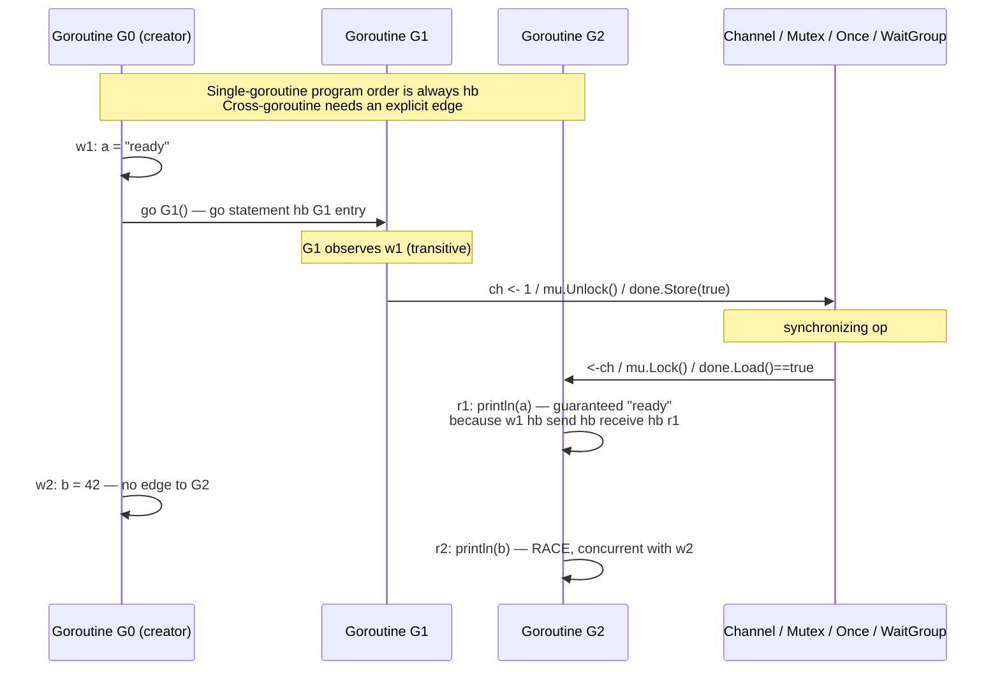
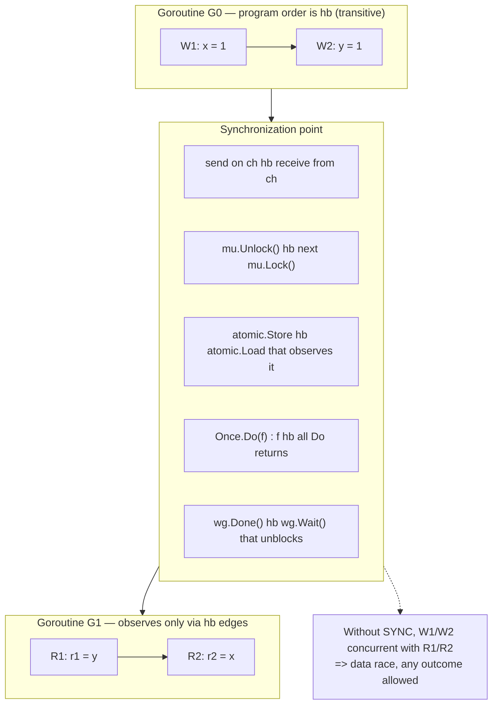
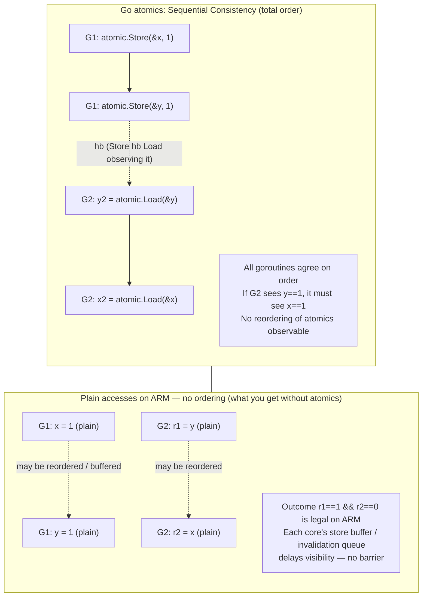
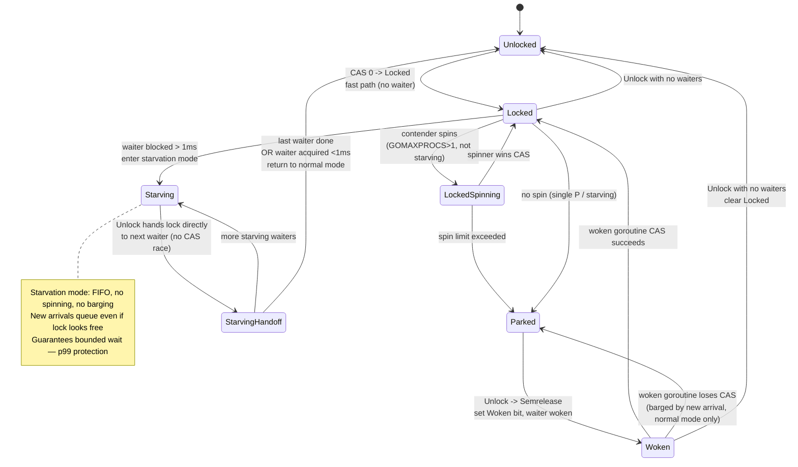
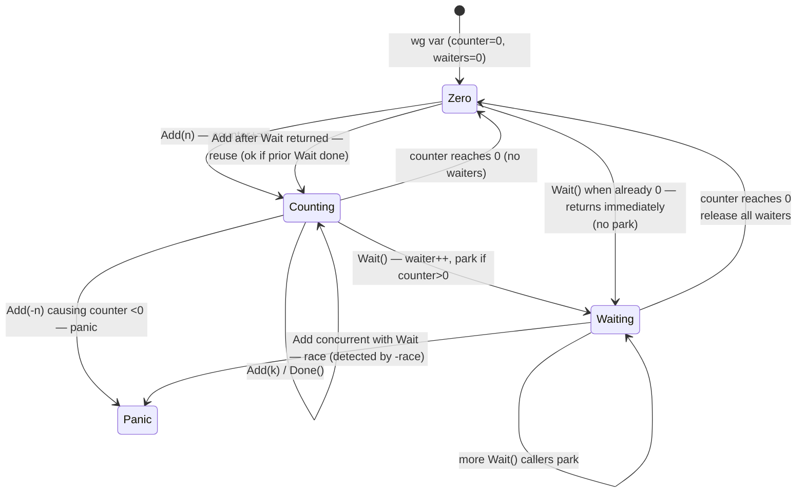
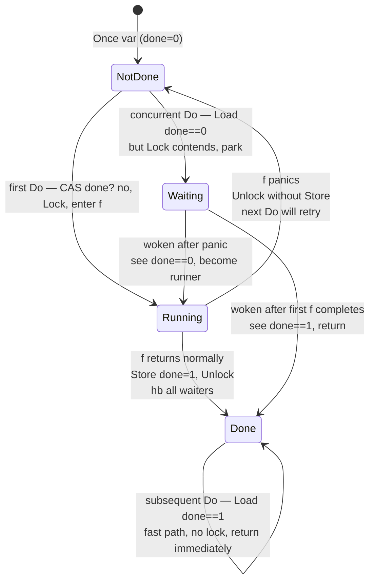
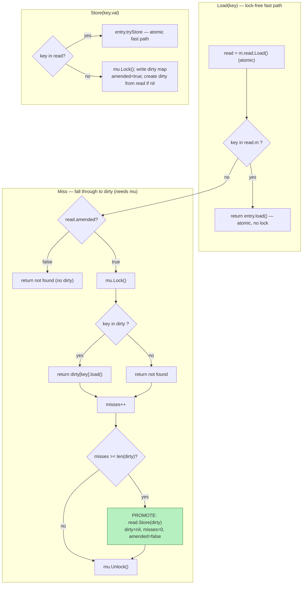
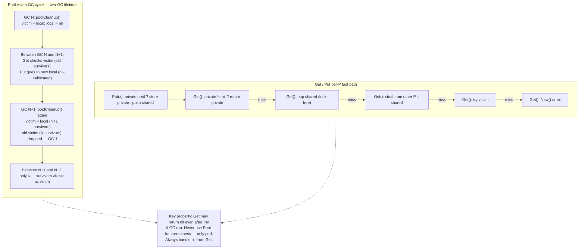

# Chapter 6 — The Go Memory Model, Atomics, and Synchronization Primitives

**What this chapter covers.** Every interesting Go backend is concurrent — dozens of goroutines share caches, counters, connection pools, and config pointers. The Go memory model is the contract that tells you when a write in one goroutine becomes visible in another, and what constitutes a data race. On top of that contract sits `sync` and `sync/atomic`: the primitives you use daily and the ones whose internals determine your tail latency under contention. This chapter opens both layers: the formal happens-before model and the concrete machinery — spinning mutex, starvation mode, `RWMutex`, `WaitGroup`, `Once`, `Cond`, `Map`, and `Pool` — that implements it. You will read race-detector output, fix real races, and learn when an atomic is the right tool and when it is a premature optimization that breaks on `arm64`.

Learning goals — after this chapter you should be able to:

- State the Go memory model's happens-before definition and data-race definition precisely, and explain why "it worked on my laptop" is not a correctness argument.
- Enumerate every happens-before edge the spec guarantees (goroutine creation, channel, `Mutex`/`RWMutex`, `Once`, `WaitGroup`, atomics, `Cond`, `Context` cancellation) and use them to prove visibility or spot a missing edge.
- Use `sync/atomic` correctly — `Int32`/`Int64`/`Uint64`/`Pointer[T]`/`Value`, alignment requirements, `CompareAndSwap` loops, and why `atomic.Value` and `atomic.Pointer` exist — and explain the ABA problem and how to avoid it in Go.
- Describe the internal state machines of `Mutex` (Locked/Woken/Starving + waiter count, spinning, starvation since Go 1.9), `RWMutex`, `WaitGroup` (single 64-bit state word + semaphore), `Once` (done + mutex), `Cond`, `sync.Map` (read/dirty/misses/expunged), and `sync.Pool` (per-P local + victim).
- Run the race detector (`go run -race`, `go test -race`), interpret its output, quantify its overhead, and fix happens-before violations including the runtime's concurrent map read/write panic.
- Choose the right synchronization primitive per access pattern (read-mostly vs. write-heavy vs. single-writer vs. per-request scratch), interpret mutex/block profiles, and size `sync.Pool` for backend workloads without leaking or retaining garbage.

> **Placement.** Volume 4, Chapter 3 — Memory Models and Happens-Before gave the hardware and language-agnostic foundation (store buffers, SC, TSO vs. weak ARM, acquire/release). Volume 13, Chapter 2 gave the runtime-level view of the Go scheduler and GC. This chapter is the Go-specific instantiation: the spec you program against and the `sync` internals you operate. Volume 17, Chapter 4 (Scheduler/G-M-P) and Chapter 5 (Allocator/GC) are prerequisites for `Mutex` spinning and `Pool`'s victim cycle. Chapter 10 deep-dives the race detector, `pprof`, and `trace` as instruments; here we use them to establish correctness.

---

## 1. Why a memory model is not optional

Single-threaded reasoning does not extend to concurrent code. Three independent actors reorder your program:

1. **The compiler** reorders loads and stores under the as-if rule (see Volume 4, Chapter 3). A loop that spins on `done` can be hoisted into `if (!done) for(;;)`.
2. **The processor** buffers stores, executes out of order, and delays coherence messages. On `arm64` a store followed by a load to a different address can appear reversed to another core.
3. **The cache** makes a store visible to different cores at different times.

Go, like Java and C++, resolves this by defining a **memory model** — a contract between the programmer and the implementation. If you program to the contract (establishing happens-before edges between conflicting accesses), the runtime guarantees visibility and ordering. If you do not, you have a **data race** and the program's behavior is undefined — not "eventually consistent," not "rarely wrong," but undefined in the spec sense: any outcome is allowed, and the compiler and hardware will eventually produce the surprising one in production at 3 AM on `arm64`.

Backend relevance is immediate. A config-reload goroutine that writes `*Config` without synchronization and an HTTP handler that reads it has a data race even if "it never failed in staging." A metrics counter incremented with plain `count++` from many goroutines loses updates on `amd64` and can tear on 32-bit `arm`. A `map` read concurrently with a write panics — the runtime detects it and crashes the process, which is actually the *better* outcome compared to silent corruption.

---

## 2. The Go memory model: happens-before and data races

The authoritative reference is `go.dev/ref/mem`. It fits on two pages. Every backend Go engineer should have read it at least once.

### 2.1 Program order and happens-before

Within a single goroutine, **program order** is the order you wrote. The memory model guarantees that reads and writes **within one goroutine** behave as if executed in program order — the compiler and hardware must preserve single-thread semantics.

Across goroutines, the model defines a **happens-before** (`hb`) relation, a strict partial order over memory operations:

- If event `a` happens-before `b`, then the effects of `a` (all prior writes by its goroutine) are visible to `b` and `b` observes `a` before itself.
- `hb` is transitive: if `a hb b` and `b hb c`, then `a hb c`.
- `hb` is not total: many events are concurrent (unordered). Two concurrent accesses that conflict are a race.

This is the same Lamport relation you meet in distributed consistency (Volume 6, Chapter 2). On one machine it orders memory operations; across machines it orders messages.

### 2.2 Data race definition

From the spec:

> A **data race** is a pair of memory accesses to the same location where at least one is a write, the accesses are concurrent (neither happens-before the other), and they are not synchronized by the language's synchronization primitives.

If your program has a data race, **its execution is not defined** by the memory model for those locations. There is no "benign race" — that is folklore from C++ discussions, and it does not transfer to Go because the Go compiler will optimize based on the assumption that racy programs do not exist.

```go
// Racy — do not do this.
var a string
var done bool

func writer() {
    a = "hello, world" // W1
    done = true        // W2 — no hb edge to reader
}
func reader() {
    if done {          // R1
        println(a) // R2 — may print "" even though done==true was observed
    }
}
```

There is no `hb` between `W1/W2` and `R1/R2`. The compiler may reorder `W1` and `W2`; the processor may make `W2` visible before `W1`. The fix is to introduce a synchronizing operation — a channel send/recv, a mutex lock/unlock, an atomic store/load, or any other primitive listed in Section 3.

```go
// Correct: channel establishes hb.
var a string
var c = make(chan struct{})

func writer() {
    a = "hello, world"
    close(c) // or c <- struct{}{} — send hb receive
}
func reader() {
    <-c
    println(a) // guaranteed "hello, world"
}
```

```go
// Correct: atomic establishes hb.
var a atomic.Value // or atomic.Pointer
var done atomic.Bool

func writer() {
    a.Store("hello, world")
    done.Store(true) // atomic Store hb atomic Load that observes it
}
func reader() {
    if done.Load() {
        println(a.Load().(string))
    }
}
```

### 2.3 Single-goroutine guarantees and visibility

The spec's most misunderstood sentence:

> If the effects of a goroutine must be observed by another goroutine, use a synchronization mechanism such as a lock or channel communication to establish a happens-before relationship.

In other words, **sharing memory without synchronization is never safe**, even for a single writer / single reader flag. The single-goroutine guarantee ("behaves as if in program order") is worthless across goroutines without an edge.

---

## 3. Every happens-before edge the spec guarantees

Memorize this table. When you review a concurrent code path, you are hunting for which row justifies the visibility claim. If no row applies, the code is racy.

| Operation | Edge |
|-----------|------|
| `go f()` | The `go` statement happens-before the first instruction of `f`. Everything `go`'s goroutine did before the `go` is visible to `f`. |
| Goroutine exit | No edge from the exiting goroutine to its creator. Use a channel, `WaitGroup`, or other sync to observe completion. |
| Channel send → receive | A send on a channel happens-before the corresponding receive completes. For buffered channels, the `k`th receive hb the `k+c`th send completes (where `c` = capacity): the buffer decouples but does not eliminate ordering. `close(ch)` hb a receive that observes the close (`ok==false`). |
| Channel close | Closing happens-before any receive that returns the zero value with `ok==false` because the channel was closed. |
| `Mutex` / `RWMutex` | For a given mutex `m`, the `n`th `m.Lock()` hb the `n`th `m.Unlock()` hb the `(n+1)`th `m.Lock()`. Read-locks participate the same way: `RLock`/`RUnlock` edges serialize writers vs. readers. |
| `Once.Do(f)` | The single call of `f()` inside `once.Do(f)` happens-before every `once.Do(f)` call returns — including calls that did not invoke `f`. All callers see `f`'s effects. |
| `WaitGroup` | `wg.Add(n)` hb `wg.Wait()` that observes the counter reaching zero via `wg.Done()`/`Add(-n)`. Correct pattern: `Add` before `go`; `Done` in the goroutine; `Wait` in the waiter. |
| `atomic` | An atomic `Store`/`Swap`/`CompareAndSwap`/`Add` with release semantics hb a `Load` that observes the stored value (acquire). In Go, all `sync/atomic` ops are sequentially consistent (Section 4.2); the spec guarantees at least this edge. |
| `Cond` | `Broadcast`/`Signal` hb a `Wait` that returns because of that signal (the waiter must hold the lock before `Wait` and re-acquires it after). |
| `Pool`, `Map` | No general hb edge for arbitrary `Put`/`Get` or `Store`/`Load` beyond what atomics/mutexes inside them provide. `sync.Map` gives per-key atomicity, not cross-key ordering. `sync.Pool` may drop values at any GC. |
| `context.Context` | `cancel()` hb `<-ctx.Done()` returning. This is a channel edge — `Done()` is a channel closed on cancellation. |
| `finalizer` (runtime) | No edge to program goroutines. Do not use finalizers for synchronization. |

> **Subtle but critical ordering constraints:**
> - `wg.Add` must happen-before `wg.Wait`, not concurrently with it. Calling `Add` inside the goroutine that `Wait` is waiting for is a race on the counter itself.
> - `Once.Do` is not a general barrier — code *before* `Do` in the caller does not hb code in `f`, only `f` hb callers after `Do` returns.
> - A buffered send does not hb the receive until the receive actually dequeues. Filling a buffered channel and then reading a shared variable without receiving is still racy.

### 3.1 Happens-before edges between goroutines — end to end





---

## 4. Atomics: `sync/atomic` in depth

Atomics are the lightest-weight synchronization: a single word, no kernel wait queue, no goroutine parking — but also the easiest to misuse.

### 4.1 What the package provides

Since Go 1.19, `sync/atomic` exposes generic typed atomics that should be preferred over the legacy `atomic.AddInt64(&x, 1)` functional API. The functional API remains but is less ergonomic and loses the type safety of the generic wrappers.

| Type | Typical use | Key operations |
|------|-------------|---------------|
| `atomic.Int32`, `Int64`, `Uint32`, `Uint64`, `Uintptr` | Counters, sequence numbers, flags | `Load`, `Store`, `Add`, `Swap`, `CompareAndSwap` |
| `atomic.Bool` | Done flags, shutdown signals | `Load`, `Store`, `Swap`, `CompareAndSwap` |
| `atomic.Pointer[T]` | Lock-free linked structures, config pointers | `Load`, `Store`, `Swap`, `CompareAndSwap` |
| `atomic.Value` | Occasionally-polymorphic config (`any`) | `Load`, `Store`, `Swap`, `CompareAndSwap` (1.20+) |
| Legacy `func AddInt64(addr *int64, delta int64) int64` etc. | Old code, `//go:norace` interop | Same semantics, raw `*T` address |

```go
package counter

import "sync/atomic"

// Preferred since Go 1.19 — typed, no &x escaping to the legacy API.
type Stats struct {
    requests atomic.Int64
    errors   atomic.Int64
    // Pointer to immutable config — readers never copy, never lock.
    cfg atomic.Pointer[Config]
}

type Config struct {
    TimeoutMs int
    FeatureOn bool
}

func (s *Stats) IncRequest() { s.requests.Add(1) }
func (s *Stats) IncError()   { s.errors.Add(1) }
func (s *Stats) Snapshot() (req, err int64) {
    return s.requests.Load(), s.errors.Load()
}

// Publish new config: writer allocates new *Config, swaps pointer atomically.
// Readers Load the pointer and dereference — no lock, no copy of Config.
func (s *Stats) UpdateConfig(fn func(*Config) *Config) {
    for {
        old := s.cfg.Load()
        next := fn(old) // fn must not mutate old; return new allocation
        if s.cfg.CompareAndSwap(old, next) {
            return
        }
        // CAS failed — another writer won, retry.
    }
}
func (s *Stats) CurrentConfig() *Config { return s.cfg.Load() }
```

```go
// atomic.Value — when the stored type varies or you need any.
// Prefer atomic.Pointer[T] when the type is fixed — it is type-safe and
// avoids the interface boxing atomic.Value requires.
var globalConf atomic.Value // holds Config

func storeConfig(c Config) { globalConf.Store(c) }
func loadConfig() Config   { return globalConf.Load().(Config) }
```

**Rules that still catch seniors:**

- `atomic.Value` requires that every `Store` use the same concrete type (or `nil` first then consistent type). Storing `Config` then `*Config` panics. Storing inconsistent types is not a race — it is a panic that the race detector will not warn you about.
- Copying an atomic value copies the word but not its atomicity guarantee. Store atomics as **fields**, not values — `func f(a atomic.Int64)` copies the counter and the copy races with the original. Use `*atomic.Int64` or pass by pointer to struct.
- `atomic.AddInt64` and friends on 386/arm 32-bit require 64-bit alignment. An `int64` that is not 8-byte aligned will panic or tear. The generic types (`atomic.Int64`) handle alignment via their struct layout; `map[K]int64` with atomic ops on values is unsafe for the same reason — map values are not address-stable.

### 4.2 Ordering: sequential consistency vs. relaxed on ARM

Go's `sync/atomic` provides **sequentially consistent** ordering. This is stronger than C++'s `memory_order_relaxed` or `acq_rel`:

- C++ lets you choose `relaxed` (no ordering), `acquire`/`release` (pairwise), or `seq_cst` (total order). Choosing wrong compiles and mostly works on x86.
- Go gives you `seq_cst` always. Every atomic operation participates in a single total order that all goroutines agree on, and each atomic `Store` hb a `Load` observing it.

**What that means on hardware:**

- On `amd64` (TSO), `seq_cst` is almost free — stores are already ordered except StoreLoad, which needs `MFENCE` or `XCHG`. Go's atomic `Store` on amd64 uses `XCHG` (locked exchange) which is a full barrier.
- On `arm64` (weak), every atomic op needs explicit barriers. Go emits `DMB`/`LDA`/`STL` sequences. A plain (non-atomic) write has no barrier, so another core's plain read can be reordered arbitrarily.



**Practical consequence for backend code:** Do not reason about atomics as "it will be fast enough to use plain loads on x86." The Go spec does not bless x86-only reasoning. Code that omits atomics because "amd64 is TSO" breaks when you deploy to Graviton (`arm64`) — which is increasingly the default in cost-optimized fleets. Use atomics for cross-goroutine visibility; let the compiler emit the barrier.

### 4.3 Alignment requirements

`sync/atomic` on 64-bit values requires 64-bit alignment. The failure mode is not a race — it is a panic on some platforms and silent tearing on others.

```go
type bad struct {
    a int32
    b int64 // offset 4 on 32-bit, not 8-aligned if struct is packed
}
var x bad
// atomic.AddInt64(&x.b, 1) — PANICS on 386/arm with "unaligned 64-bit atomic operation"

type good struct {
    a int32
    _ int32 // padding
    b atomic.Int64 // struct guarantees alignment; or use atomic.Int64 directly
    // Alternative: reorder fields — place int64 first.
}
```

Rules:

- Fields of type `atomic.Int64`/`Uint64` are aligned by the compiler. Using the generic type eliminates the manual concern.
- If you use the legacy `atomic.AddInt64(&x, ...)` with `*int64`, `x` must be 8-byte aligned. The first field of a struct, a global, or a heap allocation generally is; a field after an `int32` may not be.
- `atomic.Pointer[T]` is pointer-sized and pointer-aligned — no special concern.
- Map values, slice elements at arbitrary offsets, and `unsafe`-derived pointers may not satisfy alignment — do not apply atomics to them.

### 4.4 The ABA problem

`CompareAndSwap` compares by **value equality**, not by identity of execution history. Between your `Load` and `CAS`, another goroutine can change `A → B → A`; your `CAS` succeeds even though the world mutated underneath you. For a bare counter or flag this is harmless. For a linked structure (stack, queue, freelist) it is a correctness bug: the pointer you are about to swing may now point at reclaimed or reused memory.

```go
// ABA-prone Treiber stack sketch — simplified to show the hole.
type Node struct {
    val  int
    next *Node
}
var top atomic.Pointer[Node]

func push(n *Node) {
    for {
        old := top.Load()
        n.next = old
        if top.CompareAndSwap(old, n) {
            return
        }
    }
}
func pop() *Node {
    for {
        old := top.Load()
        if old == nil {
            return nil
        }
        nxt := old.next
        // Between Load and CAS, another goroutine could:
        //   pop old, pop nxt, push old back  => top == old again (A->B->A)
        // CAS succeeds but nxt is now stale — it may have been freed/reused.
        if top.CompareAndSwap(old, nxt) {
            return old
        }
    }
}
```

**Why Go is partially insulated:**

- Garbage collection reclaims `*Node` only when unreachable, so a stale `nxt` pointer remains valid memory (no use-after-free). This eliminates the classic C/C++ ABA crash, but not the *logical* ABA: `nxt` may now be deep in a different structure, and swinging `top` to it corrupts the stack.
- The GC does not prevent logical corruption — ABA still violates linearizability.

**Mitigations in Go:**

- Avoid lock-free structures unless you have measured contention that a `Mutex` cannot handle. A `Mutex` around `push`/`pop` is correct and often faster under realistic contention (no retry storm).
- If you must go lock-free, tag the pointer with a monotonic counter (double-word CAS — `atomic.Pointer` alone cannot do this; you need `atomic.Value` holding a `{ptr, count}` struct with a CAS loop, or an external sequence). Or use a hazard-pointer / epoch scheme — heavy machinery that rarely pays for backend services.
- Prefer `sync.Map` or a sharded `map + RWMutex` over a hand-rolled lock-free map.

### 4.5 Atomic vs. mutex — choosing deliberately

| Criteria | Atomic | `Mutex` / `RWMutex` |
|----------|--------|---------------------|
| Scope | Single word (or `Pointer` to immutable structure) | Arbitrary critical section, multiple words, invariants across fields |
| Correctness risk | High — ordering, ABA, alignment, torn reads if you miss an access | Lower — one lock protects all fields, invariant holds between `Lock`/`Unlock` |
| Performance (uncontended) | ~15–25 ns (`Add` on amd64) | ~20–30 ns (fast path: single CAS, no parking) |
| Performance (contended) | Retry loop — can livelock under high contention; no fairness | Queuing + parking — bounded, fair under starvation mode; may block goroutine |
| Composability | Does not compose — two atomics do not give atomicity across both | Composes — one lock protects N fields atomically |
| When to use | Counters, flags, sequence IDs, publish of immutable pointer, single-word state machine | Anything spanning >1 word, any invariant (`len` matches `cap`, map + counter consistent), any blocking operation inside |

**Heuristics for backend code:**

- Metrics counters, request IDs, shutdown flags → atomic.
- Connection pool, cache map, config with multiple fields mutated together → mutex.
- Publish of new config snapshot → `atomic.Pointer[T]` to immutable `T` (writer allocates, reader loads pointer, no copy).
- Hot read-mostly map with occasional writes → `sync.Map` or `RWMutex` (Section 5.6), not a CAS loop over the whole map.

---

## 5. Sync primitives internals

Understanding internals is not trivia — it explains latency outliers, informs sizing, and tells you what `pprof` is actually showing.

### 5.1 `sync.Mutex` — state word, spinning, starvation

`Mutex` is a small struct with one `int32` state word and a semaphore field for parking. The state word packs four logical fields (constants in `runtime2.go` / `sync/mutex.go`):

```
state int32 = [ waiters count (29 bits) | starving (1b) | woken (1b) | locked (1b) ]

bit 0: mutexLocked  — 1 if locked
bit 1: mutexWoken   — 1 if a waiter has been woken and is trying to acquire (avoids thundering herd)
bit 2: mutexStarving — 1 if in starvation mode
bits 3..31: waiter count (number of goroutines parked on sema, shifted by mutexWaiterShift==3)
```

**Fast path (uncontended):** `Lock()` does `atomic.CompareAndSwap(&m.state, 0, mutexLocked)`. One CAS, no semaphore, no park. `Unlock()` does `atomic.Add(&m.state, -mutexLocked)` and if no waiters, returns. This is ~20 ns on amd64.

**Slow path (contended):** The goroutine increments the waiter count and parks on `m.sema` via `runtime_SemacquireMutex` / `runtime_Semrelease`. Unlock hands off via semaphore.

**Spinning (normal mode):** Before parking, a goroutine *spins* — busy-waits in a tight loop trying to CAS the lock — if:

- `GOMAXPROCS > 1` (spinning on a single-P system wastes the only P),
- The current P is not blocked, and
- There is no starvation.

Spinning is bounded (a few iterations, `active_spin` ≈ 4). It avoids the cost of parking/unparking (≈ 1–2 µs) when the holder is about to unlock — typical for short critical sections under moderate contention. This is why a `Mutex` around a small map lookup is often faster than a channel or `RWMutex` under burst load.

**Starvation mode (since Go 1.9):** The pre-1.9 mutex was unfair — a newly arriving goroutine could barg`e ahead of waiters by winning the CAS while waiters were waking, causing tail-latency outliers or indefinite starvation. Since 1.9, the mutex tracks how long waiters have been blocked. If a waiter has blocked for more than `starvationThresholdNs` (≈ 1 ms), the mutex enters **starvation mode**:

- Lock is handed directly to the next waiter (no CAS race, no spinning).
- New arrivals do not spin and queue FIFO on the semaphore, even if the lock appears free.
- When the last starving waiter acquires, or a waiter acquires within the threshold, the mutex re-enters **normal mode** (spinning allowed, barging allowed).

Starvation mode trades throughput for fairness and bounds the maximum wait time — exactly what you want for p99.



**Mutex tips that follow from the internals:**

- Hold time matters more than lock frequency. A mutex held for 10 µs with 100 contenders causes more parking than one held for 100 ns with 1000 contenders that spin.
- Do not hold a mutex across I/O or channel ops — you block spinners and force starvation.
- `defer mu.Unlock()` adds ~30 ns and prevents inlining in tiny critical sections. In hot paths (metrics, fast cache), explicit `Unlock()` can be measurably cheaper — but only after profiling.

### 5.2 `sync.RWMutex`

`RWMutex` allows many concurrent readers or one writer. Internally it is a `Mutex` for writers plus a reader count and two semaphores:

```go
type RWMutex struct {
    w           Mutex  // held by writers
    writerSem   uint32 // writers wait here for readers to drain
    readerSem   uint32 // readers wait here when a writer is pending
    readerCount int32  // >0: active readers; <0: writer pending (-rwmutexMaxReaders)
    readerWait  int32  // readers remaining for departing writer to wait on
}
```

- `RLock`: `atomic.Add(&readerCount, 1)`. If `readerCount < 0` (writer pending), park on `readerSem`.
- `RUnlock`: `atomic.Add(&readerCount, -1)`. If it was the last reader a writer is waiting for, wake the writer on `writerSem`.
- `Lock`: `mu.Lock()` (exclusive among writers), then `atomic.Add(&readerCount, -rwmutexMaxReaders)` to block new readers, then wait for `readerWait` to drain.

**When `RWMutex` wins and when it loses:**

- Wins: read-mostly (95%+ reads), read critical section non-trivial (map lookup, not single word), contention moderate. Readers run fully in parallel — no cache-line bouncing on the mutex word.
- Loses: write-heavy or very short reads — the extra atomics (`readerCount`) make uncontended `RLock` slower than `Lock` (~25 ns vs ~20 ns), and writer starvation handling can add latency. Benchmark your ratio; many "read-mostly" caches are actually write-heavy under thundering herd.
- Never copy an `RWMutex` — like `Mutex`, it must be `*RWMutex` or a field of a struct accessed by pointer. The `go vet` `copylocks` check catches this.

```go
// Sharded map — often better than a single RWMutex for high-cardinality caches.
type Shard struct {
    mu sync.RWMutex
    m  map[string]*Entry
}
type Cache struct {
    shards [64]Shard
}
func (c *Cache) Get(key string) (*Entry, bool) {
    s := &c.shards[hash(key)%64]
    s.mu.RLock()
    e, ok := s.m[key]
    s.mu.RUnlock()
    return e, ok
}
// Each shard has its own reader count — contention spreads, p99 drops.
// Tradeoff: more memory, no cross-shard atomic operation. Choose shard count ≈ 4× GOMAXPROCS.
```

### 5.3 `sync.WaitGroup` — one word plus semaphore

`WaitGroup` looks like a counter but is a compact state machine:

```go
type WaitGroup struct {
    noCopy noCopy
    state1 uint64 // packed on 64-bit: high 32 = counter, low 32 = waiter count
                 // on 32-bit: split across state1 + sema due to alignment
    sema   uint32
}
```

- `state1` high 32 bits: `counter` — `Add(n)` / `Done()` (= `Add(-1)`).
- `state1` low 32 bits: `waiter count` — goroutines blocked in `Wait`.
- `sema`: runtime semaphore for parking waiters.

`Add(n)` does `atomic.AddUint64(&state1, uint64(n)<<32)`. If `counter` becomes zero and there are waiters, it wakes all waiters via `runtime_Semrelease`. `Wait` does `atomic.AddUint64(&state1, 1)` on the waiter half, checks counter==0, and parks on `sema` otherwise.

**Invariants that produce bugs:**

```go
// BUG: Add inside the goroutine races with Wait.
var wg sync.WaitGroup
for _, job := range jobs {
    go func(j Job) {
        wg.Add(1) // RACE — Wait may observe counter==0 and return early
        defer wg.Done()
        process(j)
    }(job)
}
wg.Wait()

// FIX: Add before go, Done inside.
for _, job := range jobs {
    wg.Add(1)
    go func(j Job) {
        defer wg.Done()
        process(j)
    }(job)
}

// BUG: copying a WaitGroup copies state1 — both copies race.
func bad(wg sync.WaitGroup) { wg.Done() } // copy!
// FIX: func good(wg *sync.WaitGroup) { wg.Done() }
```



### 5.4 `sync.Once` — done flag plus mutex, with a correctness guarantee

```go
type Once struct {
    done uint32
    m    Mutex
}
func (o *Once) Do(f func()) {
    if atomic.LoadUint32(&o.done) == 0 { // fast path — no lock
        o.doSlow(f)
    }
}
func (o *Once) doSlow(f func()) {
    o.m.Lock()
    defer o.m.Unlock()
    if o.done == 0 {
        defer atomic.StoreUint32(&o.done, 1) // release — hb all future Do returns
        f()
    }
}
```

- Fast path: single `atomic.Load` — ~5 ns when already done. No lock, no contention. This is why `Once` is ideal for lazy singletons on hot paths.
- Slow path: mutex ensures `f` runs exactly once; the `Store(&done, 1)` after `f` completes is the release that hb every `Do` return.
- `Once` does not handle panics inside `f` specially — if `f` panics, `done` is not set, and a later `Do` will retry `f`. This is intentional; a half-initialized singleton should not be cached.
- `Once` is not reusable — there is no `Reset`. If you need resettable once, you need a different primitive (often `atomic.Pointer` + `CompareAndSwap`).



### 5.5 `sync.Cond` — the one primitive most backends should not use

`Cond` is a condition variable: `Wait` atomically unlocks, parks, and re-locks; `Signal` wakes one waiter, `Broadcast` wakes all. It exists for pipelines where a goroutine must wait for a predicate over shared state:

```go
type Queue struct {
    mu   sync.Mutex
    cond *sync.Cond
    q    []Job
}
func NewQueue() *Queue {
    q := &Queue{}
    q.cond = sync.NewCond(&q.mu)
    return q
}
func (q *Queue) Put(j Job) {
    q.mu.Lock()
    q.q = append(q.q, j)
    q.mu.Unlock()
    q.cond.Signal() // or Broadcast if multiple consumers
}
func (q *Queue) Get() Job {
    q.mu.Lock()
    for len(q.q) == 0 { // must re-check — spurious wakeups and broadcast
        q.cond.Wait() // unlocks mu, parks, re-locks mu on wake
    }
    j := q.q[0]
    q.q = q.q[1:]
    q.mu.Unlock()
    return j
}
```

**Why you usually want a channel instead:**

- `Cond` requires holding the lock while checking the predicate and calling `Wait`; forgetting the `for` loop creates a missed-wake race.
- It does not compose with `select` / `context.Context` — you cannot `select` on a `Cond`. Channels and `context` are the idiomatic cancellation-aware wait.
- Internally `Cond` is a semaphore + waiter list (`notifyList` in `runtime`). It is correct but rarely the simplest correct tool. Prefer `chan struct{}` or `chan T` for one-shot signals, and `context` for cancellation — reserve `Cond` for bounded queues or state machines where broadcast-to-many matters and `select` is not needed.

### 5.6 `sync.Map` — read/dirty, miss counting, expunged

`sync.Map` is not "a concurrent map." It is a **read-optimized, eventually-consistent** map specialized for two patterns: (1) keys written once and read many times (config, service discovery), (2) disjoint key sets per goroutine (per-connection state). For general read/write mixed workloads, `map + Mutex` or `map + RWMutex` is often faster.

Internals (`sync/map.go`):

```
Map {
    mu     Mutex
    read   atomic.Pointer[readOnly]   // lock-free read path
    dirty  map[any]*entry             // guarded by mu, holds recent writes
    misses int                        // read misses that fell through to dirty
}

readOnly { m map[any]*entry; amended bool }
// amended==true means dirty contains keys not in read

entry { p unsafe.Pointer } // nil: deleted, expunged: logically deleted & absent from dirty
```

- **Read path (`Load`):** `read.Load()` (atomic pointer, no lock). If key in `read.m`, return `entry.load()` (single atomic load). Fast path: ~15 ns, no lock, no contention.
- **Read miss:** Key not in `read` but `read.amended==true` → lock `mu`, look in `dirty`, increment `misses`. If `misses >= len(dirty)`, **promote**: `read.Store(dirty)` and reset `dirty=nil`, `misses=0`. Promotion copies the dirty map into the lock-free read side, so subsequent reads of those keys become fast.
- **Write path (`Store`):** If key in `read`, try `entry.tryStore` (atomic). Otherwise lock `mu`, double-check, write to `dirty` (creating it from `read` if needed), set `read.amended=true`.
- **`expunged`:** A sentinel pointer meaning "deleted from `read` and not yet resurrected in `dirty`." Deleting a key in `read` sets `entry.p = nil`; deleting a key already expunged is a no-op. This avoids dirtying `read` on deletes of absent keys.



**Consequences for backend choice:**

- `sync.Map` has no snapshot, no `Len` without locking, no iteration ordering, and `Range` may observe a mix of read and dirty. It is not a drop-in for `map`.
- Write-heavy workloads thrash the miss counter and promote on every read — slower than `RWMutex`. Benchmark with your actual read/write ratio; the stdlib's own benchmark shows `RWMutex` winning up to ~80% reads.
- For typed maps, Go 1.19+ offers `sync.Map` only as `any`; a generic `sync.Map[K,V]` wrapper or a sharded `map[K]V + RWMutex` with generics is often cleaner and faster.

### 5.7 `sync.Pool` — per-P local cache plus victim

`Pool` is for **transient, per-request scratch** — buffers, decoders, small structs — to reduce GC pressure. It is not a cache, not a pool of connections, and not a place to store state that must survive.

Internals (`sync/pool.go`):

```
Pool {
    noCopy
    local     unsafe.Pointer  // [P]poolLocal, one per P — accessed without lock on owner P
    localSize uintptr
    victim    unsafe.Pointer  // previous local, drained on next GC
    victimSize uintptr
    New func() any
}

poolLocal {
    private any       // single slot, owner P only — no lock, no atomic
    shared  poolChain // lock-free linked list of shared buffers, stealable by other Ps
}
```

- **`Get`:** Try `private` of current P (no atomic, no lock). Then pop from `shared` (lock-free). Then steal from another P's `shared` (atomic steal). Then `victim` (previous GC's survivors). Then `New` or `nil`.
- **`Put`:** Store in `private` if empty, otherwise push to `shared`.
- **GC interaction:** On each GC, the runtime calls `poolCleanup`: `victim = local; victimSize = localSize; local = nil; localSize = 0`. So objects survive at most **two GCs** — one as `local`, one as `victim` — then are dropped. This bounds memory without explicit sizing, but means a `Pool` that is not used between GCs appears empty.



**Backend pitfalls with `Pool`:**

```go
// Correct: request-scoped scratch with size cap and reset.
var bufPool = sync.Pool{
    New: func() any { return bytes.NewBuffer(make([]byte, 0, 4096)) },
}
func handleRequest(b []byte) {
    buf := bufPool.Get().(*bytes.Buffer)
    defer func() {
        if buf.Cap() > 64*1024 {
            // Do not return huge buffers — they pin memory across GCs via victim.
            return
        }
        buf.Reset()
        bufPool.Put(buf)
    }()
    // use buf ...
}

// BUG: Pool holding *http.Request or *sql.Conn — leaks state across requests.
var connPool sync.Pool // wrong abstraction — use a real pool with Close/HealthCheck
// Pool entries survive GC nondeterministically; a DB connection held in Pool
// may be closed by the server while pooled, then returned broken.

// BUG: Pool of []byte without length reset — next Get sees stale data.
// Always Reset / slice to :0 before Put.
```

Pool sizing guidance (Section 7) follows from the victim cycle: you cannot "size" a Pool like a bounded queue; you cap what you return and let GC do the reclamation.

---

## 6. Correctness: the race detector, map panics, and hero fixes

### 6.1 The race detector (`go run -race`, `go test -race`, `go build -race`)

Go's race detector is a hybrid of the ThreadSanitizer (TSan) instrumentation and Go-specific happens-before tracking. At compile time (`-race`), the compiler inserts calls before every memory access and at every synchronization point; at runtime, a vector-clock algorithm tracks which goroutine last accessed each word and whether an `hb` edge separates accesses.

**Enabling it:**

```bash
go test -race ./...                 # all tests, with race instrumentation
go run -race ./cmd/server           # local run
go build -race -o server.race ./cmd/server  # binary with TSan runtime
CGO_ENABLED=1 go test -race ./...   # requires cgo (TSan runtime is C++)
```

`CGO_ENABLED=0` and `-race` are incompatible — the detector's runtime is written in C++ and linked via cgo.

**Overhead (measure it, do not guess):**

| Metric | `-race` cost (typical backend) |
|--------|-------------------------------|
| CPU | 2–10× (instrumentation + vector clocks) |
| Memory | 5–10× (shadow memory mapping) |
| Binary size | larger (instrumented) |
| Latency | tail inflated — do not load-test with `-race` |

This is why you run `-race` in CI and pre-merge, not in production. The detector is precise (no false positives for Go races) but not complete — it only reports races whose interleavings it actually observes in that run.

**Reading the output:**

```
==================
WARNING: DATA RACE
Write at 0x00c0000a4010 by goroutine 7:
  main.(*Cache).Set()
      /home/app/cache.go:42 +0x84
  main.writer.func1()
      /home/app/main.go:19 +0x3a

Previous read at 0x00c0000a4010 by goroutine 8:
  main.(*Cache).Get()
      /home/app/cache.go:31 +0x5c
  main.reader()
      /home/app/main.go:27 +0x6e

Goroutine 7 (running) created at:
  main.main()
      /home/app/main.go:18 +0x12a

Goroutine 8 (running) created at:
  main.main()
      /home/app/main.go:23 +0x18a
==================
```

The report names the racy address, both goroutines' stacks with file:line, and the creation site of each goroutine. The fix is to add an `hb` edge between the conflicting accesses — usually a mutex or channel that already exists but was not held on one side.

### 6.2 Map concurrent read/write — panic, not just a race

Go maps are not safe for concurrent use. The runtime detects concurrent read+write or write+write and **panics**:

```
fatal error: concurrent map read and map write
fatal error: concurrent map writes
```

This is intentional — it turns a silent corruption (torn bucket, lost key) into a crash you can alert on. The detector for this is separate from `-race`; it fires even without `-race` because the map header tracks a writer flag (`hashWriting`).

The subtle variant: concurrent read/read is safe, but read during a write is not. Iterating a map (`for k, v := range m`) while another goroutine writes also panics — iteration holds an implicit read.

Fixes: `sync.Mutex`/`RWMutex` around all map accesses, `sync.Map` for read-mostly, or sharding. There is no "concurrent map" in the stdlib beyond `sync.Map`.

### 6.3 Happens-before violations — the common patterns

**1. Publication without synchronization (the `a`/`done` example, Section 2).** Fix: channel, atomic, or mutex — not `time.Sleep`.

```go
// BUG: sleep is not synchronization.
var ready bool
var data string
go func() { data = "hello"; ready = true }()
time.Sleep(10 * time.Millisecond) // "usually enough" — still a race
println(data)                     // may be ""
```

**2. Loop variable capture (fixed in Go 1.22, still lurks in older code and closures).** Before 1.22, the loop variable was reused; goroutines captured the same address.

```go
// Before Go 1.22 — BUG without j := j
for _, j := range jobs {
    go func() { process(j) }() // all goroutines may see last j
}
// With Go 1.22+ the per-iteration variable is new each iteration — safe.
// Still capture explicitly when targeting older toolchains.
```

**3. `WaitGroup.Add` concurrent with `Wait` (Section 5.3).**

**4. Copying `Mutex` / `WaitGroup` / `Cond` by value.** The vet check `copylocks` flags this; enable it in `golangci-lint`.

**5. `time.After` / `Ticker` without happens-before.** A timer firing does not hb the handler's read of shared state.

### 6.4 Hero examples — races found and fixed in production shape

**Hero 1 — Config reload losing updates.**

*Before:*

```go
type Server struct {
    cfg  *Config          // written by reloader, read by handlers — no sync
    mu   sync.Mutex
    data map[string]string
}
func (s *Server) Reload(cfg *Config) { s.cfg = cfg } // racy write
func (s *Server) Handle(w http.ResponseWriter, r *http.Request) {
    timeout := s.cfg.Timeout // racy read — may see half-written pointer on 32-bit
    // ...
}
```

*Race detector output:*

```
WARNING: DATA RACE
Write at 0x00c000... by goroutine 12: Server.Reload()
Previous read at 0x00c000... by goroutine 34: Server.Handle()
```

*After:*

```go
type Server struct {
    cfg atomic.Pointer[Config]
    // ...
}
func (s *Server) Reload(cfg *Config) { s.cfg.Store(cfg) }
func (s *Server) Handle(w http.ResponseWriter, r *http.Request) {
    cfg := s.cfg.Load()
    timeout := cfg.Timeout // cfg is immutable — no further sync needed
    // ...
}
// Invariant: Config is immutable after Store. Writer allocates new *Config.
```

*Why this fix (and not `RWMutex`):* Config is read 10K× per second per handler, written once per minute. `atomic.Pointer` gives lock-free, zero-contention reads and a single-word publish. An `RWMutex` would work but adds atomic `readerCount` traffic to every handler. The mutex remains for `data`, which is read/write mixed.

**Hero 2 — Counter losing increments under load.**

*Before:*

```go
var ops int64
func handle() { ops++ } // plain increment — not atomic
// Under 32 concurrent handlers: expected 1M, observed ~720K (lost updates).
// On arm64 32-bit: torn reads produce wildly wrong values.
```

*After:*

```go
var ops atomic.Int64
func handle() { ops.Add(1) }
// Or, when batching: ops.Add(int64(batchSize)) — single atomic per batch.
```

*Detector: `go test -race` flagged the `ops++` read-modify-write as two accesses concurrent with `Load` in the metrics exporter.*

**Hero 3 — Bounded queue with `Cond` missed wake.**

*Before:*

```go
func (q *Queue) Get() Job {
    q.mu.Lock()
    if len(q.q) == 0 { // BUG: if, not for — spurious wakeup or broadcast loses
        q.cond.Wait()
    }
    // len may still be 0 — index panic or return zero Job
    j := q.q[0]
    // ...
}
```

*After:*

```go
func (q *Queue) Get() Job {
    q.mu.Lock()
    for len(q.q) == 0 { // re-check predicate after every wake
        q.cond.Wait()
    }
    j := q.q[0]
    q.q = q.q[1:]
    q.mu.Unlock()
    return j
}
// Better still for most backends: replace Cond with channel.
// ch := make(chan Job, 128) — Get becomes <-ch, Put becomes ch <- j,
// select works with context cancellation, no predicate loop needed.
```

**Hero 4 — `sync.Map` promoted on every read under write-heavy load.**

*Before: `sync.Map` used for session table with 50% writes — p99 doubled after promotion fix was investigated.*

```
BenchmarkRWMutex-16    45 ns/op
BenchmarkSyncMap-16   110 ns/op  // write-heavy — miss counting + promotion dominates
```

*After: sharded `map + RWMutex` with 64 shards restored p99 and simplified iteration.*

```go
// Sharded session table — measured win for 50/50 read/write.
type Table struct{ shards [64]struct{ sync.RWMutex; m map[string]Session } }
```

### 6.5 Running the detector in CI — what to enforce

```yaml
# .github/workflows/race.yml (excerpt)
- name: Race detector
  run: go test -race -count=1 -timeout 10m ./...
  env:
    CGO_ENABLED: "1"
# -count=1 disables test caching — races hidden by cached passes reappear.
# -timeout generous — -race is slower; flaky timeouts mask races.
```

Additional vet checks to gate:

```bash
go vet -copylocks -atomic -assign ./...     # vet's race-adjacent checks
# atomic check flags: atomic.AddInt64(&x) where x is not aligned / not address-taken correctly
```

---

## 7. Backend lens: choosing primitives, profiling contention, Pool sizing

### 7.1 Choosing per access pattern

| Pattern | Best primitive | Why |
|---------|---------------|-----|
| Single counter / flag | `atomic.Int64` / `atomic.Bool` | Minimal overhead, no parking |
| Publish immutable snapshot (config, routing table) | `atomic.Pointer[T]` to immutable `T` | Lock-free readers, single-writer publish without copy |
| Read-mostly map, rare writes, no cross-key invariant | `sync.Map` | Lock-free reads, promotion amortizes if writes truly rare |
| Read-mostly map, occasional bulk reload | `atomic.Pointer[map[K]V]` + copy-on-write | Readers snapshot the map pointer; writer builds new map and swaps — no per-key overhead |
| General map with mixed read/write | `map + RWMutex` or sharded `map + RWMutex` | Predictable, debuggable, iteration safe |
| Short critical section, high burst | `sync.Mutex` (spinning helps) | Spinning absorbs burst without parking |
| Long critical section or I/O under lock | Redesign — never hold lock across I/O; if unavoidable, `Mutex` in starvation mode will serialize fairly | Holding across I/O destroys the fast path for everyone |
| Per-request scratch (buffers, encoders) | `sync.Pool` | Reduces GC pressure without manual lifecycle |
| One-shot init (parse templates, open file) | `sync.Once` | Fast path is a single atomic load |
| Barrier / fan-out join | `sync.WaitGroup` | `Add` before `go`, `Done` in goroutine, `Wait` in joiner — no channel needed |
| Pipeline / work queue with cancellation | `chan T` + `context.Context` | Composes with `select`, respects cancellation |

**Anti-patterns to retire:**

- `atomic` for multi-field invariants (`if atomic.Load(&ready) { use(a, b) }` where `a` and `b` are not atomically coupled — `b` may still be stale). Use a mutex or publish a struct pointer atomically.
- `sync.Map` as default "concurrent map" — it is not. Start with `map + Mutex`, measure, then consider `sync.Map` or sharding only if read-mostly is proven.
- `sync.Pool` for connections, clients, or anything with `Close` — use a bounded pool (`chan`, `x/sync/singleflight`, or `pool` with health checks) that you control.

### 7.2 Contention profiling — finding the lock that owns your tail

Go ships two profiles that matter here:

```bash
# Mutex contention profile — where goroutines blocked on sync.Mutex / RWMutex
go test -mutexprofile mutex.prof -mutexprofilefraction 1 ./...
go tool pprof -top mutex.prof
# Sample output (synthetic):
# flat  flat%   sum%        cum   cum%
#  1.20s  68%    68%      1.20s   68%  sync.(*Mutex).Lock  (cache.go:55)
#  0.30s  17%    85%      0.30s   17%  sync.(*RWMutex).RLock
# Block profile — where goroutines parked on channels, semaphores, Cond, WaitGroup
go test -blockprofile block.prof -blockprofilefraction 1 ./...
go tool pprof -http=:8080 block.prof
```

Enable at runtime:

```go
import "runtime"

func init() {
    runtime.SetMutexProfileFraction(1) // sample every contention event (1 = 100%)
    runtime.SetBlockProfileRate(1)     // sample every block event
    // In production, use 1000 or higher to reduce overhead; 1 is for investigation.
}
```

`pprof` labels `contentions` vs `delay` — `contentions` counts events, `delay` is total blocked time (nanoseconds). A lock with many contentions but low delay is hot but short; one with few contentions but huge delay is held too long (often across I/O — the fix is to shrink the critical section, not to shard).

Trace complements profiles with timeline:

```bash
go test -trace trace.out ./...
go tool trace trace.out  # open http://localhost:xxxxx — check "Synchronization blocking" view
```

The trace shows which goroutine held which mutex when another blocked, with nanosecond resolution — essential for diagnosing starvation vs. spinning behavior that aggregates hide.

### 7.3 `Pool` sizing for request-scoped scratch — the only Pool you need

You do not size a `Pool` like a bounded queue. The runtime sizes it to `GOMAXPROCS` shards and GC does reclamation. Your job is to decide **what to pool, how large to let entries grow, and when to drop them**.

```go
// Production Pool for JSON decode scratch — sized by cap, not count.
var jsonBufPool = sync.Pool{
    New: func() any {
        b := make([]byte, 0, 4<<10) // 4 KiB initial cap — hot request size
        return &b
    },
}

func decodeRequest(r io.Reader) (*Request, error) {
    bp := jsonBufPool.Get().(*[]byte)
    defer func() {
        if cap(*bp) > 64<<10 { // 64 KiB cap — drop outliers (large uploads)
            return            // let GC reclaim; don't pin huge backing array
        }
        *bp = (*bp)[:0]       // keep cap, reset len — next Get sees empty slice
        jsonBufPool.Put(bp)
    }()
    *bp, _ = io.ReadAll(r) // simplified — use limited reader in production
    var req Request
    if err := json.Unmarshal(*bp, &req); err != nil {
        return nil, err
    }
    return &req, nil
}
```

**Rules that survive review:**

- Pool only **transient, non-stateful scratch**: `[]byte`, `bytes.Buffer`, `sync.Pool`-local encoders. Never pool `*os.File`, `*sql.Conn`, gRPC streams, or `*http.Request`.
- **Cap, not count:** Return entries with bounded `cap`; drop oversized ones. An attacker that sends one 10 MiB request should not pin a 10 MiB backing array in every P's `private` for two GC cycles.
- **Reset before Put:** Clear slices to `:0`, `bytes.Buffer.Reset()`, zero `Header` maps — or you leak data across requests (security) and retain references that prevent GC (memory).
- **Handle `nil` from `Get`:** `New` may be nil, GC may have dropped everything. `Get` can return `nil` — the caller must handle it.
- **Measure:** Track `Pool` hit rate indirectly via allocation rate (`runtime.MemStats.Mallocs`, `go tool pprof -alloc_space`). A Pool that never hits is either too small `cap` or emptied by frequent GC (short-lived service with aggressive `GOGC`). Consider raising `GOMEMLIMIT` or `GOGC` before blaming the Pool.

---

## 8. Putting it together — a backend checklist

Before merging any concurrent Go code, verify:

1. **Every shared word has an owner or an edge.** If two goroutines access the same variable and one is a write, name the channel/mutex/atomic/Once/WaitGroup that makes them `hb`-ordered. If you cannot name it, the code is racy.
2. **`-race` passes with `-count=1`.** Cached test results hide races. Run `go test -race -count=1 ./...` in CI on every PR.
3. **No map is accessed concurrently without `sync`.** The panic is the *good* outcome. Vet with `go vet` and code review.
4. **No `Mutex`/`WaitGroup`/`Cond` is copied by value.** Enable `copylocks`.
5. **Atomic `Add`/`Store`/`Load` are paired.** Every `atomic.Store` must have a matching `atomic.Load` on the reader; a plain read beside an atomic write is still a race. The detector flags this — listen to it.
6. **Pool entries are reset and bounded.** Review every `Put` for `Reset` and `cap` guard.
7. **Critical sections are short and never span I/O.** If `pprof` shows mutex `delay` large, shrink the section before sharding the lock.

---

## Key takeaways

- The Go memory model is a happens-before contract: within one goroutine program order is `hb`; across goroutines only synchronizing operations — channel send→receive, `Lock`→`Unlock`→next `Lock`, `Once.Do(f)` (`f` hb all callers), `WaitGroup.Done`→`Wait`, `atomic.Store`→`Load` observing it, `cancel`→`<-ctx.Done()` — create `hb` edges. Without an edge, concurrent read/write is a data race and the program is undefined.
- `sync/atomic` in Go is sequentially consistent on all architectures; on `arm64` every atomic carries a barrier. Use `atomic.Int64`/`Bool`/`Pointer[T]` (Go 1.19+) over the legacy `AddInt64(&x)` API; respect 64-bit alignment via the generic types, and handle `atomic.Value`'s single-concrete-type rule.
- `CompareAndSwap` loops suffer the ABA problem (A→B→A looks unchanged). Go's GC prevents use-after-free but not logical corruption — prefer a mutex over a hand-rolled lock-free structure unless you have proven contention that justifies the complexity.
- `Mutex` packs `Locked/Woken/Starving` bits + waiter count into one `int32`; uncontended `Lock` is a single CAS, contended path spins briefly (when `GOMAXPROCS>1` and not starving) then parks on a semaphore, and starvation mode (since 1.9, ~1 ms threshold) hands the lock FIFO to bound tail latency.
- `RWMutex`, `WaitGroup` (counter+waiters in one `uint64` + semaphore), `Once` (done flag + mutex, single `Store` hb all returns), and `Cond` (semaphore + predicate loop) each have a narrow correct-use window — `RWMutex` for read-mostly, `WaitGroup` with `Add` before `go`, `Once` for one-shot init, `Cond` rarely (channels usually better).
- `sync.Map` is a read-optimized two-level map (`read` lock-free + `dirty` under `mu`, promotion when `misses >= len(dirty)`, `expunged` sentinel) and `sync.Pool` is a per-P local + `victim` cache whose entries survive at most two GCs — neither is a general-purpose concurrent map or bounded resource pool.
- The race detector (`-race`, `CGO_ENABLED=1`) instruments every access and tracks vector clocks; it is precise but incomplete (only reports interleavings it observes) and costs 2–10× CPU / 5–10× memory — run it with `-count=1` in CI, never in production load tests, and supplement with `mutex`/`block` profiles and `go tool trace` for tail-latency diagnosis.
- Backend primitive selection is access-pattern driven: atomics for single-word publish, `atomic.Pointer` to immutable snapshots for config, `map+RWMutex` or sharding for general maps, `Mutex` for short critical sections, `Pool` only for bounded per-request scratch (reset + cap guard, handle `nil` from `Get`). Profile contention with `SetMutexProfileFraction` and size Pools by `cap` cap, not by entry count.

## Further reading

- **(pinned)** Go Memory Model — `go.dev/ref/mem` — The authoritative spec (2 pages). Defines happens-before, every guaranteed edge, and the data-race rule. https://go.dev/ref/mem
- **(pinned)** `sync/atomic` package docs — `pkg.go.dev/sync/atomic` — Typed atomics (`Int64`, `Pointer[T]`, `Value`), ordering guarantees, and alignment notes. https://pkg.go.dev/sync/atomic
- **(pinned)** Data Race Detector — `go.dev/doc/articles/race_detector` — How TSan instrumentation, `-race` overhead, and report interpretation work, including `CGO_ENABLED` requirement. https://go.dev/doc/articles/race_detector
- **(pinned)** `sync` package docs — `pkg.go.dev/sync` — `Mutex`, `RWMutex`, `WaitGroup`, `Once`, `Cond`, `Map`, `Pool` API and documented guarantees. https://pkg.go.dev/sync
- Go `sync/mutex.go` and `sync/map.go` source — The ground truth for state packing, spinning, starvation threshold, and `read`/`dirty`/`expunged` promotion. https://github.com/golang/go/blob/master/src/sync/mutex.go and https://github.com/golang/go/blob/master/src/sync/map.go
- Go `sync/pool.go` source and `poolCleanup` in `runtime/mgc.go` — Per-P local + victim lifecycle and the two-GC reclamation cycle. https://github.com/golang/go/blob/master/src/sync/pool.go
- Dmitry Vyukov, "The Go Memory Model" (GopherCon 2014) — Talk and paper expanding the spec's happens-before formalism with litmus tests. https://golang.org/ref/mem and https://research.swtch.com/gomm
- Hans-J. Boehm and Sarita Adve, "Foundations of the C++ Concurrency Memory Model" (PLDI 2008) — The academic foundation that Go's model follows; explains why data races make programs undefined and why `seq_cst` is the safe default. https://doi.org/10.1145/1375581.1375591
- Herb Sutter, "Atomic Weapons: The C++ Memory Model and Modern Hardware" (C++ and Beyond 2012, two parts) — Best visual explanation of store buffers, SC vs. weak ARM, and acquire/release — directly applicable to Go's barrier emission on `arm64`. https://herbsutter.com/2013/02/11/atomic-weapons-the-c-memory-model-and-modern-hardware/
- Russ Cox, "Hardware Memory Models" (research.swtch.com, 2017) — Short note on TSO vs. weak models and why Go chose sequential consistency for `sync/atomic`. https://research.swtch.com/hwmm
- Felix Geisendörfer et al., "Profiling Go Mutex Contention" (Go blog, 2017) and `go tool pprof` docs — `SetMutexProfileFraction`, `contentions` vs. `delay`, and the trace synchronization view. https://go.dev/blog/pprof and https://pkg.go.dev/runtime#SetMutexProfileFraction
