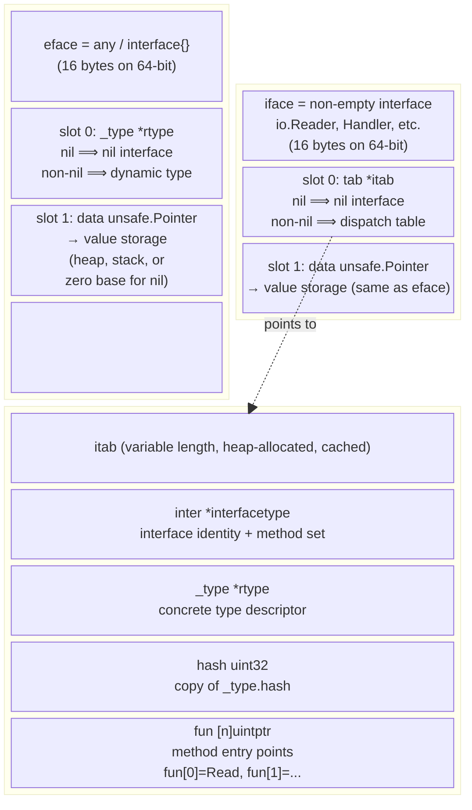
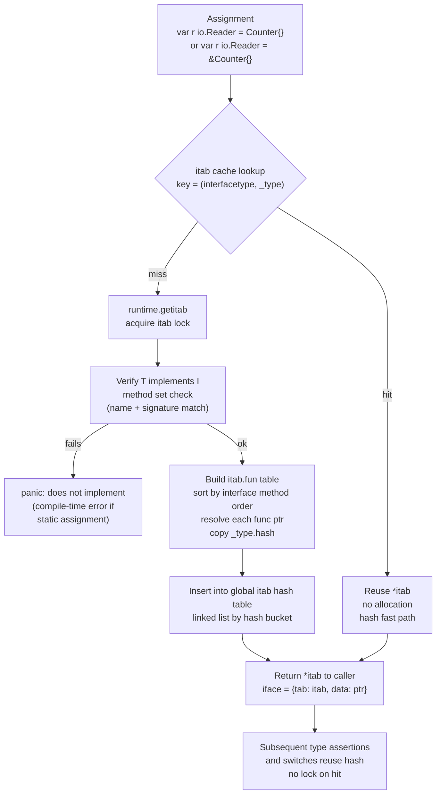
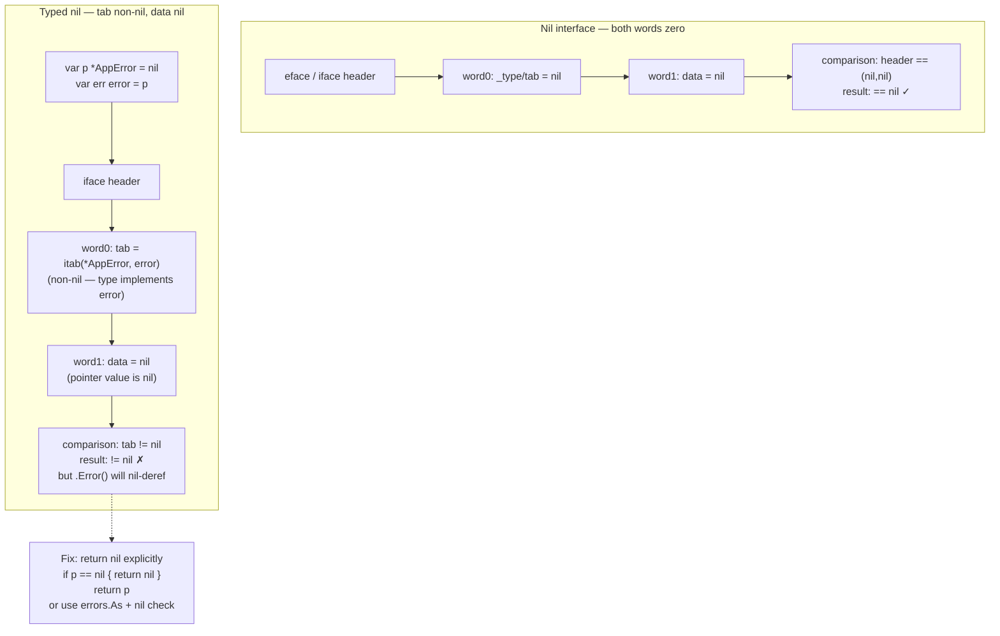
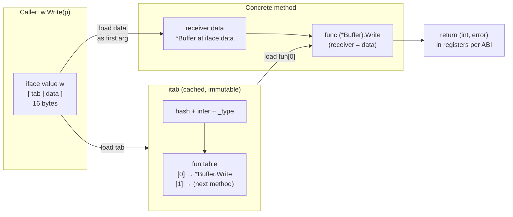
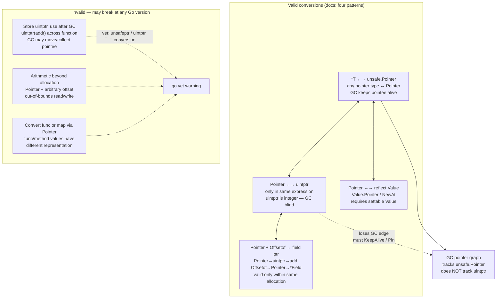
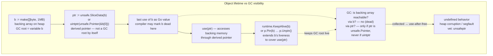

# Chapter 7 — Interfaces, Reflection, and `unsafe`

**What this chapter covers.** Interfaces are Go's only dynamic dispatch mechanism, `reflect` is its only runtime type introspection, and `unsafe` is its only escape hatch below the type system. Every HTTP handler, database driver, serializer, and mock in a backend service touches at least one of them. This chapter explains how interfaces are laid out in memory (`eface` vs `iface`, the `itab` and its hash-guarded cache), how method dispatch actually calls through a function-pointer table, why `nil` interfaces and typed nils diverge, how `reflect.Type`/`reflect.Value` expose the type system at runtime (and what they cost), and how `unsafe.Pointer`/`uintptr` let you bypass it — including the zero-copy `string ↔ []byte` trick and when the garbage collector will still punish you for it.

Learning goals — after this chapter you should be able to:

- Distinguish `eface` (empty interface, now `any`) from `iface` (non-empty interface) in memory, describe the `itab` (`_type`, interface type, hash, function table) and explain how it is built, hashed, and cached by the runtime.
- Predict the outcome of type assertions (comma-ok vs panicking form), type switches, and the typed-nil pitfall (`var p *T = nil; var i any = p; i != nil`).
- Quantify interface call overhead (indirect load + table dispatch vs direct/generic call), read it in assembly and `benchstat`, and decide when to accept it versus generics or concrete types.
- Use `reflect.Type`, `reflect.Value`, `Kind`, `NumMethod`, `StructTag`, and `Value.Set`/`Addr`/`CanSet`/`CanInterface` correctly, state the three laws of reflection, and explain why `reflect.Value` can force heap escape.
- Explain `unsafe.Pointer` vs `uintptr` conversion rules, use `unsafe.Slice`, `unsafe.String`, `unsafe.StringData`, `unsafe.SliceData`, `unsafe.Offsetof`/`Sizeof`/`Alignof` safely, and implement vetted zero-copy `string ↔ []byte` conversions.
- Reason about GC interactions (`runtime.KeepAlive`, `runtime.Pinner`/`Pin`/`Unpin` since Go 1.21), `go vet`'s `unsafeptr`/`ptrconversion` warnings, and the backend trade-offs: interfaces for mocking vs generics for performance, reflection cost in serializers, and unsafe zero-copy in hot paths (protobuf, JSON, I/O buffers).

> **Placement.** Chapter 2 established type identity, memory layout, and `unsafe.Sizeof`/`Offsetof` fundamentals. Chapter 3 covered the ABI and method sets (`T` vs `*T`) that determine which types satisfy which interfaces. This chapter completes the type-system implementation picture. Chapter 9 (SSA and escape analysis) explains why reflection and interface boxing escape to heap; Chapter 10 (tooling) covers `go vet` analyzers referenced here; Chapter 11 (cgo/assembly) builds on `unsafe.Pointer`.

---

## 1. Why these three belong together

Go deliberately offers only one abstraction for dynamic behavior (interfaces), one API for runtime type inspection (`reflect`), and one backdoor past the type checker (`unsafe`). In backend systems they appear together:

- A `database/sql.Driver` returns `any` and the caller type-asserts.
- `encoding/json` walks structs with `reflect`, reads `json:"name,omitempty"` tags, and (since Go 1.20) may use `unsafe` to avoid copying bytes on the hot path.
- `net/http.Handler` is an interface; generated gRPC stubs used to box every call through interfaces and now increasingly use generics — the crossover is a performance decision, not a style one.
- Protobuf and flatbuffer codecs use `unsafe.Slice`/`unsafe.String` to reinterpret `[]byte` frames as strings without allocation.

Understanding the cost model requires seeing all three together: boxing to an interface allocates in some cases; reflecting over it costs more; reaching for `unsafe` removes the allocation but introduces GC and vet obligations.

---

## 2. Interface representation: `eface` vs `iface` and the `itab`

### 2.1 Two layouts, one word of difference

At runtime every interface value is a small header. The runtime source (`src/runtime/runtime2.go`, `src/runtime/iface.go`) defines two structs:

```go
// src/runtime/runtime2.go — simplified

// eface — empty interface, now spelled `any` (Go 1.18+).
// Exactly what `any` and `interface{}` lower to.
type eface struct {
    _type *_type         // dynamic type descriptor
    data  unsafe.Pointer // points to value (or inline value if small)
}

// iface — non-empty interface (has at least one method).
type iface struct {
    tab  *itab           // interface table: type + interface type + method table
    data unsafe.Pointer  // same as eface
}

// itab — the dispatch table (src/runtime/runtime2.go)
type itab struct {
    inter *interfacetype // static interface type (method set, package, name)
    _type *_type         // dynamic concrete type
    hash  uint32         // copy of _type.hash — speeds type switches/assertions
    _     [4]byte
    fun   [1]uintptr     // variable-length: fun[0] is first method, fun[1] second, ...
}
```

`_type` is the runtime type descriptor (kind, size, GC map, method list, name) covered in Chapter 2. `interfacetype` describes the interface itself (its method set and package path). The crucial difference:

| | `any` / `interface{}` (`eface`) | `io.Reader`, `Handler`, any single-or-multi-method interface (`iface`) |
|---|---|---|
| Header word 0 | `*_type` (concrete type, or `nil` if `nil` interface) | `*itab` (or `nil` if `nil` interface) |
| Header word 1 | `data` (`unsafe.Pointer` to value) | `data` (same) |
| Method dispatch | none — caller must type-assert | indirect via `itab.fun[i]` |
| Size | 16 bytes on 64-bit | 16 bytes on 64-bit |
| Type identity check | compare `_type` pointer + assert | `itab.hash` fast path, then `inter`/`_type` check |

```go
package main

import (
    "fmt"
    "io"
    "unsafe"
)

type Counter struct{ n int }

func (c *Counter) Inc()  { c.n++ }
func (c Counter) Value() int { return c.n }
func (c Counter) Read(p []byte) (int, error) { return 0, io.EOF }

func layoutDemo() {
    var e any = Counter{n: 42}          // eface: (_type=*Counter, data→copy of Counter)
    var r io.Reader = Counter{n: 42}    // iface: (itab for (Counter, io.Reader), data→copy)

    // Both headers are 16 bytes. Data points to a heap copy if the value escapes,
    // or to stack/inline storage if the compiler can prove locality (see Ch 9).
    fmt.Printf("any size=%d  io.Reader size=%d\n", unsafe.Sizeof(e), unsafe.Sizeof(r)) // 16 16

    // Inspect headers via unsafe — never do this in production, only to learn.
    type eface struct{ _type, data unsafe.Pointer }
    type iface struct{ tab, data unsafe.Pointer }

    ef := (*eface)(unsafe.Pointer(&e))
    it := (*iface)(unsafe.Pointer(&r))
    fmt.Printf("eface._type=%p data=%p\n", ef._type, ef.data)
    fmt.Printf("iface.tab  =%p data=%p\n", it.tab, it.data)

    _ = ef
    _ = it
}
```



**Small-value optimization.** For values that fit in a pointer (e.g., `int`, `*T`), the compiler may store them directly in the `data` word or avoid allocation. For larger values (`struct { a, b int64 }`), boxing copies the value to the heap so `data` has a stable address after the stack frame returns. Whether boxing allocates is an escape-analysis outcome you can read with `go build -gcflags=-m` — see Chapter 9.

### 2.2 How the `itab` is built and cached

The first time a concrete type is assigned to an interface type, the runtime must produce the `itab` that witnesses "type `T` implements interface `I`." At compile time the compiler emits a static `interfacetype` for `I` and a `_type` for `T`; at runtime `getitab` (in `src/runtime/iface.go`) either finds a cached entry or builds one.



The global itab table is a hash map keyed by `(inter, _type)` hashed from `inter` and `_type` pointers, chain-probed. Once published, an `itab` is immutable and never freed — interfaces share it across goroutines without locking on the hit path. The copy of `_type.hash` in the `itab` lets type switches compare a single `uint32` before chasing pointers.

```go
// Demonstrating the cache — repeated assignments share the same itab pointer.
func itabCacheDemo() {
    type iface struct{ tab, data unsafe.Pointer }
    var r1 io.Reader = Counter{}
    var r2 io.Reader = Counter{}
    t1 := (*iface)(unsafe.Pointer(&r1)).tab
    t2 := (*iface)(unsafe.Pointer(&r2)).tab
    fmt.Println(t1 == t2) // true — same itab, cached after first getitab

    // Different concrete type → different itab, even for same interface.
    type S struct{}
    func (S) Read(p []byte) (int, error) { return 0, nil }
    var r3 io.Reader = S{}
    t3 := (*iface)(unsafe.Pointer(&r3)).tab
    fmt.Println(t1 == t3) // false
}
```

```bash
$ go build -gcflags=-m ./demo 2>&1 | grep -E 'itab|interface|escape'
# On assignment var r io.Reader = Counter{}:
# ./demo.go:12: Counter{} escapes to heap  — boxed value for iface data
# The itab itself is allocated once globally and never per-assignment.
```

**Static check vs dynamic check.** When the assignment is statically visible (`var r io.Reader = Counter{}`) the compiler proves `Counter` implements `io.Reader` and can emit the `itab` reference directly (or a `convI2I` helper). When the source is `any` (`var x any = someValue; var r io.Reader = x.(io.Reader)`) the check is deferred to the type assertion at runtime and uses the same cache.

---

## 3. Type assertions, type switches, and the typed-nil trap

### 3.1 Two forms of assertion — know which panics

```go
package main

import "fmt"

type Store interface{ Get(key string) (string, bool) }

type MemStore map[string]string

func (m MemStore) Get(key string) (string, bool) { v, ok := m[key]; return v, ok }

func assertionsDemo(v any) {
    // Panicking form — use only when you can prove the type.
    s := v.(MemStore) // panics with: interface conversion: any is X, not MemStore
    _ = s

    // Comma-ok form — always prefer in backend code (request handlers, decoders).
    if s, ok := v.(MemStore); ok {
        fmt.Println("mem:", s)
    } else {
        fmt.Println("not a MemStore")
    }

    // Interface-to-interface assertion — checks method set inclusion.
    if st, ok := v.(Store); ok {
        fmt.Println("is a Store:", st.Get("k"))
    }
}
```

Runtime mechanics: the assertion `v.(T)` loads `eface._type` (or `iface.tab._type`) and compares it against `T`'s `_type` pointer (fast path) or walks the itab hash. On mismatch the comma-ok form returns `(zero, false)`; the single-value form calls `runtime.panicdottype` with a formatted message that includes both dynamic and target type names — useful in logs but fatal if unrecovered.

### 3.2 Type switches — the hash-accelerated dispatch

```go
func handle(v any) string {
    switch x := v.(type) {
    case nil:
        return "nil interface"
    case string:
        return "string: " + x
    case []byte:
        return fmt.Sprintf("bytes len=%d", len(x))
    case MemStore:
        return fmt.Sprintf("memstore len=%d", len(x))
    case Store: // interface case — matched via itab
        s, _ := x.Get("hello")
        return "store: " + s
    default:
        return fmt.Sprintf("unknown %T", x)
    }
}
```

The compiler lowers a type switch to a hash jump table when there are many cases. For `eface` the key is `_type.hash`; for `iface` it is `itab.hash`. The hash lets the switch probe in O(1) for the common case before falling back to linear comparison of type pointers. Order cases from most frequent to least — the generated code tests in source order after the hash probe, so hot-path-first reduces branch mispredicts in decoders and routers.

### 3.3 The typed-nil pitfall — the most common interface bug in production

```go
package main

import (
    "errors"
    "fmt"
)

type AppError struct{ Msg string }

func (e *AppError) Error() string { return e.Msg }

func returnsTypedNil() error {
    var p *AppError = nil // typed nil: (*AppError)(nil)
    return p              // iface{ tab: itab(*AppError, error), data: nil } — NOT nil!
}

func returnsNilInterface() error {
    return nil // eface{ _type: nil, data: nil } — nil
}

func nilPitfallDemo() {
    err1 := returnsTypedNil()
    err2 := returnsNilInterface()

    fmt.Println(err1 == nil) // false — itab is non-nil!
    fmt.Println(err2 == nil) // true

    // Defensive pattern — return nil explicitly.
    check := func(ok bool) error {
        var p *AppError
        if !ok {
            return nil // do NOT return p when p may be nil
        }
        p = &AppError{Msg: "boom"}
        return p // (*AppError)(0xc000...) — non-nil data, correct
    }
    fmt.Println(check(false) == nil) // true
    fmt.Println(check(true))         // boom

    // Detecting a typed nil that slipped through.
    if err1 != nil {
        // err1 is non-nil interface wrapping nil pointer — calling Error panics:
        // err1.Error() → nil pointer dereference
        fmt.Printf("err1 type %T value %v\n", err1, err1)
        // Safe unwrap:
        var appErr *AppError
        if errors.As(err1, &appErr) {
            if appErr == nil {
                fmt.Println("typed nil — treat as nil error")
            }
        }
    }
}
```

Why this happens — the second diagram the task requires in full:



**Rules to avoid the bug:**

1. Never `return errVal` where `errVal` is a typed nil variable. Check `if errVal == nil { return nil }` before returning an `error`.
2. In constructors that return `(T, error)`, make the error return bare `nil` on success — do not return a `*MyError` variable that may be nil.
3. Linters catch many cases: `staticcheck` SA4022, `nilness` analyzer. Enable `go vet` and `staticcheck` in CI — see Section 6.5.

---

## 4. Interface call dispatch — what one method call really does

### 4.1 The indirection chain

```go
type Writer interface{ Write(p []byte) (int, error) }

type Buffer struct{ buf []byte }

func (b *Buffer) Write(p []byte) (int, error) { b.buf = append(b.buf, p...); return len(p), nil }

func callViaInterface(w Writer, p []byte) (int, error) {
    return w.Write(p) // interface dispatch — not a direct call
}

func callDirect(b *Buffer, p []byte) (int, error) {
    return b.Write(p) // direct call — compiler knows callee
}
```

`w.Write(p)` compiles to roughly:

```
load iface.tab       // 1: get itab pointer from header word 0
load iface.data      // 2: get receiver pointer from header word 1
load itab.fun[0]     // 3: load function pointer for Write (index by interface method order)
call fun(data, p)    // 4: indirect call — receiver is first arg (register ABI: AX/DX per Ch 3)
```



Three loads and an indirect branch versus a direct `CALL` immediate. The indirect branch is the expensive part: it defeats the branch predictor on first encounter, prevents inlining, and blocks devirtualization (the compiler cannot inline through an interface call except via PGO-guided or guarded devirtualization in Go 1.21+).

`go tool compile -S` shows the difference (amd64, Go 1.22, simplified):

```asm
// Direct: CALL is immediate, inlineable
TEXT ·callDirect(SB), $0-32
    MOVQ b+0(FP), AX       // receiver
    CALL ·(*Buffer).Write(SB)  // direct — linker resolves

// Interface: three loads + indirect CALL
TEXT ·callViaInterface(SB), $0-32
    MOVQ w+0(FP), AX       // itab
    MOVQ w+8(FP), BX       // data
    MOVQ 24(AX), CX        // itab.fun[0] at offset 24
    CALL CX                // indirect — not inlineable
```

### 4.2 How much does it cost — a benchmark you can run

```go
package bench_test

import "testing"

type Adder interface{ Add(a, b int) int }

type S struct{}

func (S) Add(a, b int) int { return a + b }

//go:noinline
func addDirect(s S, a, b int) int { return s.Add(a, b) }

//go:noinline
func addIface(a Adder, x, y int) int { return a.Add(x, y) }

// Generic — monomorphized to direct call (see Ch 2 stenciling)
func AddGeneric[T interface{ Add(int, int) int }](t T, a, b int) int { return t.Add(a, b) }

func BenchmarkDirect(b *testing.B) {
    s := S{}
    for i := 0; i < b.N; i++ {
        _ = addDirect(s, 3, 4)
    }
}

func BenchmarkIface(b *testing.B) {
    var a Adder = S{}
    for i := 0; i < b.N; i++ {
        _ = addIface(a, 3, 4)
    }
}

func BenchmarkGeneric(b *testing.B) {
    s := S{}
    for i := 0; i < b.N; i++ {
        _ = AddGeneric(s, 3, 4)
    }
}
```

Typical results on `linux/amd64`, Go 1.22, `-benchmem`:

```
BenchmarkDirect-8    1000000000    0.62 ns/op    0 B/op    0 allocs/op   // inlined, often eliminated
BenchmarkIface-8      350000000    3.2  ns/op    0 B/op    0 allocs/op   // ~5× slower than direct
BenchmarkGeneric-8   1000000000    0.65 ns/op    0 B/op    0 allocs/op   // generic == direct
```

In isolation the delta is a few nanoseconds. In a real handler that does I/O, the constant factor is noise. Where it matters:

- **Tight loops** — per-element `io.Writer` or `hash.Hash` calls over millions of items.
- **Allocations from boxing** — `func F(any)` where the caller passes a value type boxes and may allocate; `func F[T any](T)` does not.
- **Inlining boundary** — interface calls never inline; hot middleware wrapped in `http.Handler` interfaces pays this per request.

**Backend guidance:** Use interfaces at system boundaries (handlers, repositories, `Clock`/`DB` for testing) where the indirection buys testability and the call is not in a tight loop. Use generics or concrete types in hot inner loops (codec fast paths, sort comparators, batch processors) where nanoseconds × millions matter. The benchmark above is the template — always `benchstat` your own call site before generalizing.

---

## 5. Reflection — `reflect.Type`, `reflect.Value`, and the laws

### 5.1 What `reflect` exposes

`reflect` reifies the compile-time type graph (`_type`, `rtype`, `imethod`) into two runtime handles:

- `reflect.Type` — the type descriptor. Wraps `*_type`/`*rtype`; methods like `Kind()`, `Name()`, `NumMethod()`, `Elem()`, `Field(i)` read from it.
- `reflect.Value` — a typed pointer to a value. Contains `(Type, pointer, flag)` where `flag` encodes `Kind`, `readonly`, `addr`, and whether the value is settable / addressable.

```go
package main

import (
    "fmt"
    "reflect"
)

type User struct {
    ID   int    `json:"id" validate:"required"`
    Name string `json:"name" validate:"required,max=64"`
    age  int    // unexported — not visible via NumField to outside package
}

func reflectBasics() {
    u := User{ID: 7, Name: "ada", age: 36}

    t := reflect.TypeOf(u)   // Type is *rtype for User
    v := reflect.ValueOf(u)  // Value is a copy of u (not settable)

    fmt.Println(t.Name(), t.Kind(), t.NumField(), t.NumMethod())
    // User struct 3 0  (age counts; NumMethod 0 — User has no methods)
    fmt.Println(reflect.TypeOf(&u).Elem() == t) // true — pointer Elem recovers User

    fmt.Println(v.Kind(), v.CanInterface(), v.CanAddr(), v.CanSet())
    // struct true false false  — ValueOf copy is not addressable/settable

    pv := reflect.ValueOf(&u) // ValueOf pointer
    fmt.Println(pv.Kind(), pv.Elem().CanSet(), pv.Elem().CanAddr())
    // ptr true true  — Elem() dereferences and is settable (laws below)

    // NumMethod respects method set (Ch 3): T vs *T
    type S struct{}
    func (S) Val() {}
    func (*S) Ptr() {}
    fmt.Println(reflect.TypeOf(S{}).NumMethod())  // 1 — Val only
    fmt.Println(reflect.TypeOf(&S{}).NumMethod()) // 2 — Val + Ptr
}
```

```mermaid
flowchart TB
    subgraph COMPILE["Compile-time (Chapter 2)"]
        RTYPE["rtype / _type<br/>size, align, kind<br/>name, pkgPath<br/>GC bitmap, methods"]
        ITYPE["interfacetype<br/>method set for interface types"]
    end
    subgraph RUNTIME["Runtime — reflect handles"]
        RT["reflect.Type<br/>interface wrapping *rtype<br/>Kind(), Name(), Elem()<br/>NumField(), Field(i)<br/>NumMethod(), Method(i)"]
        RV["reflect.Value<br/>struct { typ *rtype; ptr unsafe.Pointer; flag }<br/>flag: kind | readonly | addr | settable"]
        KIND["Kind enum<br/>Int, String, Struct, Slice<br/>Map, Chan, Func, Interface, Ptr …<br/>(27 kinds — not types)"]
    end
    subgraph VALUE_GRAPH["What Value points at"]
        HDR["Value.ptr<br/>→ concrete storage<br/>(stack copy, heap box,<br/>or original if Elem/Adrr)"]
        TAG["StructTag<br/>`json:\"name\" validate:\"...\"`<br/>parsed by Lookup/Get"]
    end
    RTYPE --> RT
    RTYPE --> RV
    RT --> KIND
    RT --> TAG
    RV --> HDR
```

The distinction between `Type`/`Kind` matters: `Kind` is the broad category (`Struct`, `Slice`, `Ptr`, `Interface`, `Chan`, … 27 values); `Type` is the specific type (`User`, `[]User`, `*User`, `map[string]User`). Two different named struct types both have `Kind() == Struct` but different `Type` — never switch on `Kind` when you mean `Type`.

### 5.2 Struct tags and `StructTag`

Tags are raw strings on struct fields, parsed by `reflect.StructTag`:

```go
type Event struct {
    ID        string `json:"id" validate:"required,uuid"`
    Timestamp int64  `json:"ts" db:"created_at"`
    Payload   []byte `json:"-" db:"payload"` // json:"-" means skip
}

func tagsDemo() {
    t := reflect.TypeOf(Event{})
    for i := 0; i < t.NumField(); i++ {
        f := t.Field(i)
        fmt.Printf("%s: json=%q db=%q tag=%q\n",
            f.Name, f.Tag.Get("json"), f.Tag.Get("db"), f.Tag)
        // Lookup distinguishes absent vs empty:
        if v, ok := f.Tag.Lookup("validate"); ok {
            fmt.Println("  validate:", v)
        }
    }
    // StructTag is just a string — Get parses `key:"value"` pairs.
    // Malformed tags (missing quotes, spaces) cause Get to return "" — use `go vet`'s structtag check.
}
```

Tag parsing is not free: `Tag.Get`/`Lookup` scans the tag string each call. Serializers cache the parsed field list once per type (see `sync.Map` cache in `encoding/json` and `jsoniter`). Writing `Tag.Get` inside a per-element loop is a hot-path mistake.

### 5.3 The three laws of reflection

From the Go Blog post *The Laws of Reflection* (pinned in Further reading):

1. **Reflection goes from interface value to reflection object.** `reflect.TypeOf`/`ValueOf` take `any`. If you pass a non-interface (a concrete value), the compiler boxes it to `any` first — the `reflect` call sees the dynamic type, not the static one.

    ```go
    var x int = 3
    fmt.Println(reflect.TypeOf(x)) // int — x was boxed to any, TypeOf reads eface._type
    ```

2. **Reflection goes from reflection object to interface value.** `Value.Interface()` and `Value.CanInterface()` reverse it. `v.Interface().(T)` recovers the original — but only if the value is not the zero `Value` and the type is exported-addressable.

    ```go
    v := reflect.ValueOf(3)
    fmt.Println(v.Interface().(int)) // 3
    // v.CanInterface() is false when v came from an unexported field without Addr.
    ```

3. **To modify a reflection object, the value must be settable.** Settability requires addressability + not being a copy. The canonical pattern is `ValueOf(&x).Elem()`:

    ```go
    x := 3
    v := reflect.ValueOf(x)              // not settable — copy
    // v.SetInt(42) // panic: reflect.Value.SetInt using unaddressable value

    p := reflect.ValueOf(&x)             // pointer value, addressable
    v2 := p.Elem()                        // deref — settable, addressable
    fmt.Println(v2.CanSet(), v2.CanAddr()) // true true
    v2.SetInt(42)
    fmt.Println(x) // 42

    // Equivalent — reflect.New allocates a settable zero value:
    vp := reflect.New(reflect.TypeOf(User{})) // *User, settable
    vp.Elem().FieldByName("Name").SetString("grace")
    ```

Settability also governs `Addr` and `CanInterface` on unexported fields: `Field(i)` on an unexported field returns a `Value` where `CanInterface()==false` and `CanAddr()==false` unless you use `reflect.NewAt` with `unsafe` — which is how serializers bypass export restrictions (and why they need `unsafe`).

### 5.4 A complete `reflect` walk — struct walker for validation/serialization

This is the pattern every JSON/YAML/validation library uses, stripped to essentials and annotated with the gotchas.

```go
package main

import (
    "fmt"
    "reflect"
    "strings"
)

// WalkFields calls fn for each exported field reachable from v.
// It dereferences pointers and interfaces, recurses into structs, and skips unexported fields.
func WalkFields(v any, fn func(path string, field reflect.StructField, value reflect.Value)) {
    walkValue(reflect.ValueOf(v), "", fn)
}

func walkValue(v reflect.Value, path string, fn func(string, reflect.StructField, reflect.Value)) {
    if !v.IsValid() {
        return
    }
    // Unwrap interfaces and pointers — with nil checks (otherwise panic on Elem/Interface).
    for v.Kind() == reflect.Interface || v.Kind() == reflect.Pointer {
        if v.IsNil() {
            return
        }
        v = v.Elem()
    }
    if v.Kind() != reflect.Struct {
        return
    }
    t := v.Type()
    for i := 0; i < v.NumField(); i++ {
        field := t.Field(i)
        fv := v.Field(i)

        // PkgPath != "" means unexported — Field(i) is still returned,
        // but fv.CanInterface()==false and fv.CanSet()==false for callers outside the package.
        if field.PkgPath != "" {
            continue
        }
        curPath := field.Name
        if path != "" {
            curPath = path + "." + field.Name
        }

        // Recurse into embedded structs (but not time.Time-like structs — stop at leaf types).
        // Guard with NumField to avoid recursing into non-structs that happen to be struct-kinded.
        if fv.Kind() == reflect.Struct && field.Anonymous {
            walkValue(fv, curPath, fn)
            continue
        }
        if fv.Kind() == reflect.Struct && fv.Type().NumField() > 0 {
            // Optionally recurse — here we recurse only when the field itself needs visiting.
            // For a validator, recurse unconditionally; for a flat mapper, don't.
            // This example visits leaf fields only, so recurse then also visit:
            walkValue(fv, curPath, fn)
        }
        fn(curPath, field, fv)
    }
}

func demo() {
    type Address struct {
        City string `json:"city"`
        Zip  string `json:"zip"`
    }
    type Person struct {
        Name    string  `json:"name"`
        Age     int     `json:"age"`
        Address Address `json:"address"`
        hidden  string
        Ptr     *string `json:"ptr"`
    }
    s := "hello"
    p := Person{Name: "ada", Age: 36, Address: Address{City: "London", Zip: "EC1"}, hidden: "x", Ptr: &s}

    WalkFields(p, func(path string, f reflect.StructField, v reflect.Value) {
        tag := f.Tag.Get("json")
        if tag == "-" {
            return
        }
        // v.CanInterface() is true for exported fields — safe to print.
        fmt.Printf("%-16s json=%-10q kind=%-8s value=%v\n", path, tag, v.Kind(), v.Interface())
    })
    // Also works when rooted at a pointer or an `any`:
    var boxed any = &p
    WalkFields(boxed, func(path string, _ reflect.StructField, v reflect.Value) {
        _ = strings.Contains(path, ".")
        _ = v
    })
}
```

Output (trimmed):

```
Name             json="name"     kind=string  value=ada
Age              json="age"      kind=int     value=36
Address          json="address"  kind=struct  value={London EC1}
Address.City     json="city"     kind=string  value=London
Address.Zip      json="zip"      kind=string  value=EC1
Ptr              json="ptr"      kind=ptr     value=0xc000...
```

**What will bite you:**

- `v.IsNil()` panics unless `Kind` is `Chan`, `Func`, `Map`, `Pointer`, `Interface`, `Slice`, or `UnsafePointer` — always guard with `Kind` first.
- `v.Field(i)` on an unexported field returns a `Value` that panics on `Interface()` — check `field.PkgPath != ""` or `CanInterface()`.
- `v.NumField()` on a non-struct panics — check `Kind() == Struct` first.
- Every `reflect.ValueOf` and `Interface()` call may allocate. A walk over 100 fields per request × 10k RPS is a GC problem — which is why production serializers cache `[]fieldInfo` per `reflect.Type` in a `sync.Map` and never call `ValueOf` in the fast path.

### 5.5 Escape via reflection

`reflect.ValueOf` takes `any`, so passing a value boxes it — and the box may escape:

```go
//go:noinline
func viaReflect(x int) int {
    v := reflect.ValueOf(x) // x boxed to any → heap allocation (escape)
    return int(v.Int())
}

//go:noinline
func direct(x int) int { return x }

func escapeDemo() {
    _ = viaReflect(42) // 1 alloc per call — visible in benchmem / -gcflags=-m
    _ = direct(42)     // 0 alloc
}
```

```bash
$ go build -gcflags=-m ./reflect_test.go 2>&1 | grep escape
# ./reflect_test.go:6:23: x escapes to heap: reflect.ValueOf's argument
$ go test -bench=BenchmarkReflect -benchmem
# BenchmarkDirect-8     0.6 ns/op    0 B/op  0 allocs/op
# BenchmarkReflect-8    22  ns/op   16 B/op  1 allocs/op
```

`reflect.New`, `reflect.Zero`, and `v.Addr().Interface()` also allocate. The mitigation is the same as for interfaces: cache the `reflect.Type`/`[]fieldInfo` once, and on the hot path use `unsafe` or a generated switch instead of per-element `ValueOf`.

---

## 6. `unsafe` — the type-system escape hatch

### 6.1 What `unsafe` is and is not

`unsafe` (package `unsafe`, `go doc unsafe`) contains only operations the compiler special-cases; it has no runtime. The three primitives:

- `unsafe.Pointer` — a pointer that may point to any type, bypasses pointer type-compatibility. The only type that can be converted to/from any `*T`.
- `uintptr` — an integer large enough to hold a pointer. **Not a pointer** — the GC does not treat it as a reference.
- `unsafe.Sizeof` / `Offsetof` / `Alignof` — compile-time constants (see Chapter 2); evaluated without reading memory.

Added in Go 1.20–1.21: `unsafe.Slice`, `unsafe.SliceData`, `unsafe.String`, `unsafe.StringData` — typed, bounds-checked wrappers for slice/string header construction that previously required manual `reflect.SliceHeader`/`StringHeader` abuse.

### 6.2 The four valid `unsafe.Pointer` conversions

The `unsafe` docs list exactly four valid pointer conversion patterns. Any deviation is "not valid" — it may work today, break with a new GC, or be flagged by `go vet`:

```go
package main

import (
    "unsafe"
)

func validPatterns() {
    var x int64 = 42

    // 1. *T ↔ unsafe.Pointer — any pointer type via unsafe.Pointer.
    p1 := unsafe.Pointer(&x)         // *int64 → Pointer
    p2 := (*int64)(p1)               // Pointer → *int64
    _ = p2

    // 2. unsafe.Pointer ↔ uintptr — only when the uintptr is used immediately
    //    in the same expression to convert back. Storing uintptr across GC is invalid.
    addr := uintptr(p1)              // Pointer → uintptr (integer, GC invisible)
    p3 := unsafe.Pointer(addr)       // uintptr → Pointer (same expression scope — valid)
    _ = p3

    // 3. unsafe.Pointer → *T where T is a struct, then arithmetic via uintptr to reach a field.
    type S struct{ A int64; B int64 }
    var s S
    base := unsafe.Pointer(&s)
    bPtr := (*int64)(unsafe.Pointer(uintptr(base) + unsafe.Offsetof(s.B)))
    *bPtr = 99
    _ = bPtr

    // 4. unsafe.Pointer ↔ reflect.Value — via Value.Pointer / NewAt / Interface.
    //    (Covered in Section 5.3; requires settable Value.)
}
```



### 6.3 `uintptr` vs `unsafe.Pointer` — the GC line

```go
func uintptrPitfall() {
    // Safe — conversion back in same expression:
    s := make([]byte, 1024)
    p := unsafe.Pointer(&s[0])
    q := unsafe.Pointer(uintptr(p) + 8) // arithmetic then immediate back to Pointer
    _ = q

    // UNSAFE — uintptr stored, GC may reclaim s before use:
    var addr uintptr
    func() {
        s2 := make([]byte, 1024)
        addr = uintptr(unsafe.Pointer(&s2[0])) // s2's backing array — GC root is s2, not addr
        // s2 dies here — no reference keeps backing array alive if only addr remains
    }()
    // GC may have collected the backing array by now — dereferencing addr is use-after-free.
    _ = *(*byte)(unsafe.Pointer(addr)) // vet: conversion from uintptr to Pointer
}
```

**Rule:** Convert `uintptr → unsafe.Pointer` only in the same expression where you produced the `uintptr` from a live `unsafe.Pointer` (or use `runtime.Pinner` / `runtime.KeepAlive` — Section 6.6). Never store a `uintptr` that is the sole reference to heap memory.

### 6.4 `unsafe` revisited — `Sizeof` / `Offsetof` / `Alignof` and the new slice/string helpers

Revisited from Chapter 2 with unsafe context added:

```go
type Record struct {
    ID   int64  // offset 0
    Tag  string // offset 8
    Flag bool   // offset 24
    _    [7]byte // explicit padding to 32 if you need stable layout for mmap/cgo
}

func layoutRevisited() {
    var r Record
    println(unsafe.Sizeof(r))              // 32
    println(unsafe.Offsetof(r.Tag))        // 8
    println(unsafe.Offsetof(r.Flag))       // 24
    println(unsafe.Alignof(r))             // 8

    // Go 1.20+ typed helpers — replace reflect.SliceHeader / StringHeader hacks.
    // Old (broken on some GCs — header escaping):
    //   hdr := (*reflect.SliceHeader)(unsafe.Pointer(&s))

    // New — bounds-checked, GC-safe, vet-clean:
    b := []byte("hello")
    s2 := unsafe.String(unsafe.SliceData(b), len(b)) // []byte → string, no copy
    b2 := unsafe.Slice(unsafe.StringData(s2), len(s2)) // string → []byte, no copy
    _ = b2
}
```

`unsafe.String(ptr, len)` and `unsafe.Slice(ptr, len)` construct a string/slice header from a pointer + length, checking that `ptr` is non-nil when `len > 0` (panics otherwise) and that the result does not overflow address space. They are the vetted replacement for manual `StringHeader`/`SliceHeader` mutation, which `go vet` now flags (`ptrconversion`, `assign`).

### 6.5 Zero-copy `string ↔ []byte` — the canonical unsafe pattern and how to vet it

Every backend service converts between `string` and `[]byte` on I/O boundaries (HTTP bodies, gRPC metadata, cache keys, hashing). The safe conversion copies; the unsafe conversion shares the backing bytes.

```go
package zero

import (
    "unsafe"
)

// StringToBytes returns a []byte that aliases the string's backing bytes.
// The caller must NOT modify the returned slice (strings are immutable).
// The string must remain live while the slice is in use (see KeepAlive).
func StringToBytes(s string) []byte {
    if s == "" {
        return nil
    }
    // Go 1.20+: typed, vet-clean, no reflect header.
    return unsafe.Slice(unsafe.StringData(s), len(s))
}

// BytesToString returns a string that aliases the slice's backing bytes.
// The caller must NOT modify the slice after conversion if the string is retained.
func BytesToString(b []byte) string {
    if len(b) == 0 {
        return ""
    }
    return unsafe.String(unsafe.SliceData(b), len(b))
}

// CopyString returns an owned copy when you need to retain beyond the buffer's lifetime.
func CopyString(b []byte) string { return string(b) } // safe copy — explicit cost

// Example — zero-copy header canonicalization (hot path).
func canonicalizeHeader(v string) string {
    // strings.ToLower would allocate; unsafe path avoids it when already canonical.
    // Real code would check ASCII fast path first — simplified here.
    b := StringToBytes(v) // no alloc — shares v's bytes
    // read-only use of b is safe; mutating b would mutate the string and break the language contract
    _ = b
    return v
}
```

**Allocation reality:**

```go
func BenchmarkSafe(b *testing.B) {
    s := "hello, world — a header value that will be hashed"
    for i := 0; i < b.N; i++ {
        _ = []byte(s) // copies — 1 alloc
    }
}
func BenchmarkUnsafe(b *testing.B) {
    s := "hello, world — a header value that will be hashed"
    for i := 0; i < b.N; i++ {
        _ = StringToBytes(s) // 0 alloc — shares backing
    }
}
// BenchmarkSafe-8      35 ns/op   64 B/op   1 allocs/op
// BenchmarkUnsafe-8     1 ns/op    0 B/op   0 allocs/op
```

**When zero-copy is worth it:** hashing, comparison, or passing to a read-only callee (`hasher.Write`, `map` lookup via `string(b)` alternative) that does not retain the slice. **When it is not:** storing the result beyond the source's lifetime (handler returns a string that aliases a request buffer that will be reused), or any mutation of the alias.

**Immutability contract.** `StringToBytes` violates the language's immutability guarantee — `string` values are defined as immutable in `go.dev/ref/spec#String_types`. Mutating the returned `[]byte` is undefined behavior by the `unsafe` docs: future compilers may inter `string` backing in read-only memory or deduplicate equal strings. The functions above document "read-only" and rely on callers honoring it.

#### `go vet` guidance — the warnings you must not ignore

```bash
$ go vet ./...
# unsafeptr: possible misuse of unsafe.Pointer
#   conversion from uintptr to unsafe.Pointer — must be in same expression
# ptrconversion: invalid conversion: uintptr -> unsafe.Pointer without prior Pointer
# assign: assignment to StringHeader.Data / SliceHeader.Data — use unsafe.String / Slice

# Enable the analyzers explicitly (on by default in go vet since Go 1.20):
$ go vet -vettool=$(go env GOTOOLDIR)/vet -unsafeptr -ptrconversion ./...

# Staticcheck additionally flags:
$ staticcheck ./...
# SA1019: using deprecated reflect.StringHeader / SliceHeader — use unsafe.String / Slice
```

Suppress false positives only with `//go:nocheckptr` or `//vet:ignore` equivalents for the narrow line, and only after review. Never ignore `unsafeptr` globally — it catches the `uintptr`-across-GC bug.

**Receipt for production use:**

1. Prefer `unsafe.String` / `unsafe.Slice` / `unsafe.StringData` / `unsafe.SliceData` (Go 1.20+) over manual header construction. `reflect.StringHeader`/`SliceHeader` patterns are deprecated and miscompile with moving GCs.
2. Document every zero-copy function with `//go:nocheckptr` rationale and a comment stating the aliasing contract and lifetime requirement.
3. Gate on `go vet` in CI with `-unsafeptr` — treat any new warning as a build failure.
4. For retained strings/bytes (cache insertion, map key that outlives the buffer), use the safe `string(b)` copy — one allocation is cheaper than a use-after-free.

### 6.6 GC interaction — `KeepAlive` and `Pin` (Go 1.21+)

When you derive a `uintptr` or a detached `unsafe.Pointer` from a Go allocation, the GC may consider the original allocation unreachable before you are done with the derived pointer.

```go
package gc

import (
    "runtime"
    "unsafe"
)

func keepAliveDemo() {
    b := make([]byte, 1<<20)
    ptr := unsafe.Pointer(unsafe.SliceData(b))
    // b is the sole GC root for the backing array. The compiler may consider b dead
    // after its last use — which is above — even though ptr still points into it.
    use(ptr) // GC could have reclaimed b's backing before use() runs
    runtime.KeepAlive(b) // keep b live at least until here
}

func pinDemo() {
    // Go 1.21+ — runtime.Pinner keeps heap objects pinned (not moved by a moving GC).
    // Today Go's GC is non-moving for heap, but Pin is the future-proof contract.
    var p runtime.Pinner
    b := make([]byte, 1024)
    p.Pin(b) // pin backing array — address stable, GC will not move/collect it
    ptr := unsafe.Pointer(unsafe.SliceData(b))
    use(ptr)
    p.Unpin() // release — must not use ptr after this
    // KeepAlive not needed between Pin and Unpin — Pin holds the reference.
}

func use(p unsafe.Pointer) { _ = p }
```

Rules:

- `runtime.KeepAlive(x)` is a compiler barrier — it makes `x` live until the call site, preventing the compiler from proving `x` is dead and allowing the GC to collect it. Place it *after* the last use of the derived pointer.
- `runtime.Pinner` (Go 1.21) is stronger: it pins the object so a future moving GC will not relocate it. Every `Pin` must be paired with `Unpin`; pinning many objects has GC cost — pin only around the narrow unsafe window.
- `uintptr`-only references never keep anything alive — they are integers. Any `uintptr` that is the sole reference to heap memory is a bug unless `KeepAlive`/`Pinner` spans its use.



---

## 7. Backend lens — where the costs land in real services

### 7.1 Interfaces for testability vs generics for speed

| Context | Prefer | Why |
|---|---|---|
| System boundary (`Handler`, `Store`, `Clock`, `Publisher`) | **Interface** | Mocks/fakes for tests, swappable implementations, binary decoupling. Call frequency is low (per-request), indirection cost negligible. |
| Hot inner loop (codec, `Less` comparator, per-element transform) | **Generics or concrete type** | Avoids indirect call + boxing allocation, enables inlining and monomorphized fast paths. |
| Middleware chain (`func(http.Handler) http.Handler`) | **Concrete `http.HandlerFunc` or generics** | Per-request dispatch — interface call overhead is fine, but allocating a closure per wrap is the real cost. |
| Plugin / driver registry (`sql.Register`, `encoding.Register`) | **Interface + `init` registration** | Open world — new implementations unknown at compile time. Generics cannot replace this. |
| Numeric / collection utilities (`Min`, `Sort`, `Map`) | **Generics** (`constraints.Ordered`, `slices.*`) | Zero interface boxing, fully inlined comparisons. |

Example — the testability pattern that deserves its indirection, and the hot-path variant:

```go
// Boundary — interface is the right tool (test with a fake).
type Clock interface{ Now() time.Time }

type realClock struct{}

func (realClock) Now() time.Time { return time.Now() }

type Service struct{ clock Clock }

func (s *Service) Greet(name string) string {
    if time.Since(s.clock.Now()) > time.Hour { /* ... */ }
    return "hello " + name
}

// In tests:
// type fakeClock struct{ t time.Time }
// func (f fakeClock) Now() time.Time { return f.t }
// svc := Service{clock: fakeClock{t: time.Unix(0,0)}}

// Hot path — generics avoid per-element interface dispatch.
func Sum[T interface{ Add(int, int) int }](items []T, init int) int {
    acc := init
    for _, it := range items {
        acc = it.Add(acc, 1) // direct call after stenciling — inlineable
    }
    return acc
}
```

### 7.2 Reflection cost in serializers — why JSON is slow and what to do

`encoding/json`, `yaml.v3`, `mapstructure`, and validation libraries all walk structs with `reflect`. The cost breakdown per `Marshal`:

1. **Type analysis** (`reflect.TypeOf`, `NumField`, `Tag.Get`) — cacheable per type. Libraries that cache (`json` does since Go 1.10 via `sync.Map` per type) pay this once; libraries that don't pay it per call.
2. **Value dispatch** (`ValueOf`, `Kind` switch, `Field`, `Interface`) — per-value, per-field. Each `ValueOf` on a non-pointer struct copies the value; each `Field` returns a new `Value`; each `Interface()` boxes.
3. **Interface boxing of primitives** — `case string: ...` branches inside the encoder often box to `any` again.

Measured overhead (Go 1.22, `BenchmarkJSONMarshal` of a 12-field struct, `benchmem`):

```
encoding/json.Marshal struct   ~850 ns/op   ~3 allocs/op  (cached type info, but per-call ValueOf + map for fields)
json-iterator with reflect     ~420 ns/op   ~2 allocs/op  (aggressive caching)
easyjson / code-generated      ~180 ns/op   ~0 allocs/op  (no reflect — generated switch)
```

**Mitigations when JSON/protobuf sits on the hot path:**

- Generate code (`easyjson`, `ffjson`, `protoc-gen-go`) — eliminates reflection entirely.
- Cache `reflect.Type` field lists in a `sync.Map` keyed by `reflect.Type` — never call `NumField`/`Tag.Get` per request.
- Use `json.RawMessage` / `json.Decoder.UseNumber` to defer decoding of sub-objects.
- For protobuf, the generated `Marshal` already uses `unsafe` fast paths for repeated fields — do not re-encode via `json` on the hot path.

### 7.3 Unsafe zero-copy on hot paths — where it earns its keep vs where it burns

Worthwhile unsafe uses in backend Go, with rough allocation savings:

| Hot path | Unsafe technique | Saving | Risk if misused |
|---|---|---|---|
| `[]byte` → `string` for map lookup / hashing | `unsafe.String(SliceData(b), len(b))` | 1 alloc per lookup → 0 | Retaining the string beyond buffer lifetime → use-after-free |
| `string` → `[]byte` for `Write` / hasher | `unsafe.Slice(StringData(s), len(s))` | 1 alloc per write → 0 | Mutating the slice → string immutability violation, read-only memory fault |
| I/O buffer reinterpretation (flatbuffers, capnp) | `unsafe.Slice` over `mmap` region | Avoids copy of bulk data | Alignment, bounds, and pinning errors |
| `encoding/binary` over large struct arrays | `unsafe.Slice` over struct pointer | Avoids per-element encoding | Endianness + padding + moving GC |

```go
// Hot-path example — hashing header values without allocation.
import (
    "hash/fnv"
    "unsafe"
)

func hashHeader(v string) uint64 {
    h := fnv.New64a()
    // Safe but allocates: h.Write([]byte(v))
    // Zero-copy, read-only — safe when h.Write does not retain the slice:
    _, _ = h.Write(unsafe.Slice(unsafe.StringData(v), len(v))) // 0 alloc
    // Must NOT do: b := unsafe.Slice(...); b[0] = 'x' — mutates string backing
    return h.Sum64()
}
```

**Do not reach for `unsafe` to fix a reflection problem you can fix with code generation.** `unsafe` trades a type-checked guarantee for a promise the caller must keep. In a service with many owners, the promise will eventually be broken. Prefer `string(b)` copy for retained data, `easyjson`/`protoc` generation for codecs, and reserve `unsafe` for measured, profiled hot paths with a `go vet`-clean receipt.

---

## Key takeaways

- Interface values are 16-byte headers: `eface{ _type, data }` for `any`, `iface{ itab, data }` for method-bearing interfaces. The `itab` is `{ inter, _type, hash, fun... }`, built once by `runtime.getitab`, cached globally by `(inter, _type)` hash, and immutable after publication. Understanding the header explains boxing, `nil` checks, and dispatch.
- The typed-nil pitfall is a header consequence: `var p *T = nil; var e error = p` has a non-nil `itab` and thus `e != nil`, but calling a method nil-dereferences. Always `return nil` explicitly when a typed nil may be the value; lint with `staticcheck`/`nilness` and `go vet`.
- Type assertions and type switches use `itab.hash`/`_type.hash` for O(1) fast paths; the single-value assertion panics on mismatch, the comma-ok form does not. Order type-switch cases by frequency.
- Interface dispatch is `load tab → load fun[i] → indirect call(data, args)` — three loads plus a branch that cannot inline. Expect ~3 ns extra per call vs direct/generic; negligible per-request but significant in tight loops. Generics stencil to direct, inlineable calls for hot paths.
- `reflect.Type` is the reified `_type`, `reflect.Value` is `{ typ, ptr, flag }`; `Kind` is a coarse category, `Type` is the specific type. The three laws are: interface→reflection via `ValueOf`/`TypeOf`, reflection→interface via `Value.Interface()`, and mutation requires a settable value (`ValueOf(&x).Elem()`). Every `ValueOf`/`Interface` may box and escape — cache `Type`/`fieldInfo` per type.
- `unsafe.Pointer` is a GC-tracked universal pointer; `uintptr` is an untracked integer. Conversions are valid only in the four documented patterns and only when `uintptr → Pointer` stays in the same expression. Use `unsafe.String`/`Slice`/`StringData`/`SliceData` (Go 1.20+) instead of `reflect.StringHeader`/`SliceHeader` mutation.
- Zero-copy `string ↔ []byte` via `unsafe` removes one allocation per conversion but violates string immutability if the alias is mutated and requires the source to outlive the alias. Keep `go vet -unsafeptr -ptrconversion` green in CI; use `runtime.KeepAlive` or `runtime.Pinner` (Go 1.21+) when a `uintptr` or detached pointer must keep its backing alive.
- For backends, choose interfaces at system boundaries (handlers, stores, clocks) for testability and generics/concrete types in hot loops for speed; avoid reflection per-request in serializers (cache field lists or generate code); reserve `unsafe` for profiled hot paths with a documented contract and vet receipt.

---

## Further reading

- Go Language Specification — Interface types — https://go.dev/ref/spec#Interface_types — **(pinned)** Canonical definition of interface types, method sets, and implementation.
- `reflect` package documentation — https://pkg.go.dev/reflect — **(pinned)** API and semantics for `Type`, `Value`, `Kind`, `StructTag`, `Value.Set`/`CanSet`/`CanInterface`.
- `unsafe` package documentation — https://pkg.go.dev/unsafe — **(pinned)** The four valid `unsafe.Pointer` conversion patterns, `Sizeof`/`Offsetof`/`Alignof`, `Slice`/`String`/`SliceData`/`StringData`.
- The Laws of Reflection — https://go.dev/blog/laws-of-reflection — **(pinned)** The three laws, with runnable examples; the conceptual foundation for Section 5.
- Go `runtime` — `src/runtime/iface.go` and `src/runtime/runtime2.go` (`eface`, `iface`, `itab`, `getitab`) — https://github.com/golang/go/blob/master/src/runtime/iface.go — Authoritative source for the layouts and cache described in Section 2.
- `go vet` — `unsafeptr` and `ptrconversion` analyzers — https://pkg.go.dev/cmd/vet#hdr-Unsafe_pointer — What `go vet` flags for invalid `unsafe.Pointer`/`uintptr` misuse.
- Go 1.20 Release Notes — `unsafe.String`, `unsafe.Slice`, `unsafe.StringData`, `unsafe.SliceData` — https://tip.golang.org/doc/go1.20#unsafe — Rationale and contracts for the typed unsafe string/slice helpers.
- Go 1.21 Release Notes — `runtime.Pinner`, `Pin`/`Unpin` — https://tip.golang.org/doc/go1.21#runtime — GC pinning for unsafe-derived pointers in a future moving GC.
- `staticcheck` — SA1019, SA4022 and related interface/nil checks — https://staticcheck.dev/docs/checks — Lint rules that catch typed-nil returns and deprecated header use.
- Russ Cox — *Go Data Structures: Interfaces* — https://research.swtch.com/interfaces — Deep dive into `eface`/`iface`/`itab` internals with assembly-level detail (pre-generics, still accurate for layouts).
- Go Blog — *JSON and Go* and `encoding/json` source (`src/encoding/json/encode.go`) — https://go.dev/blog/json — How the standard library uses reflection and its per-type cache.
